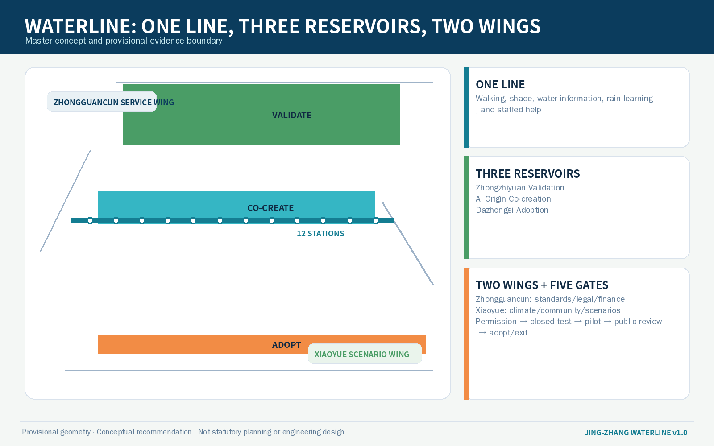
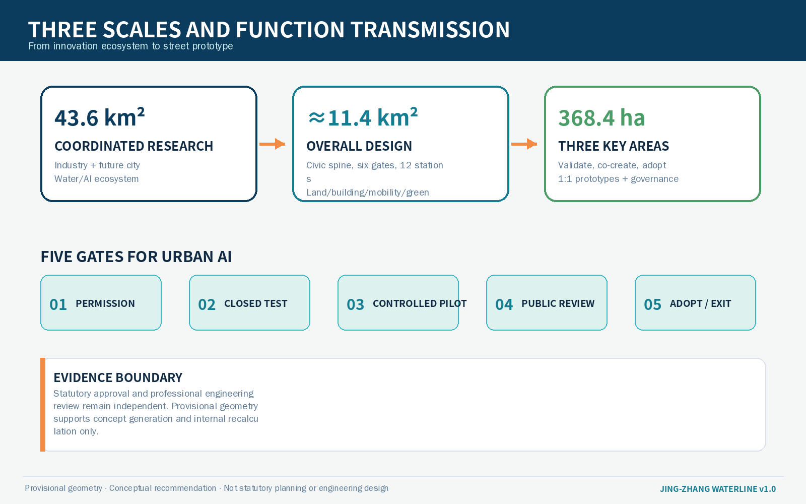
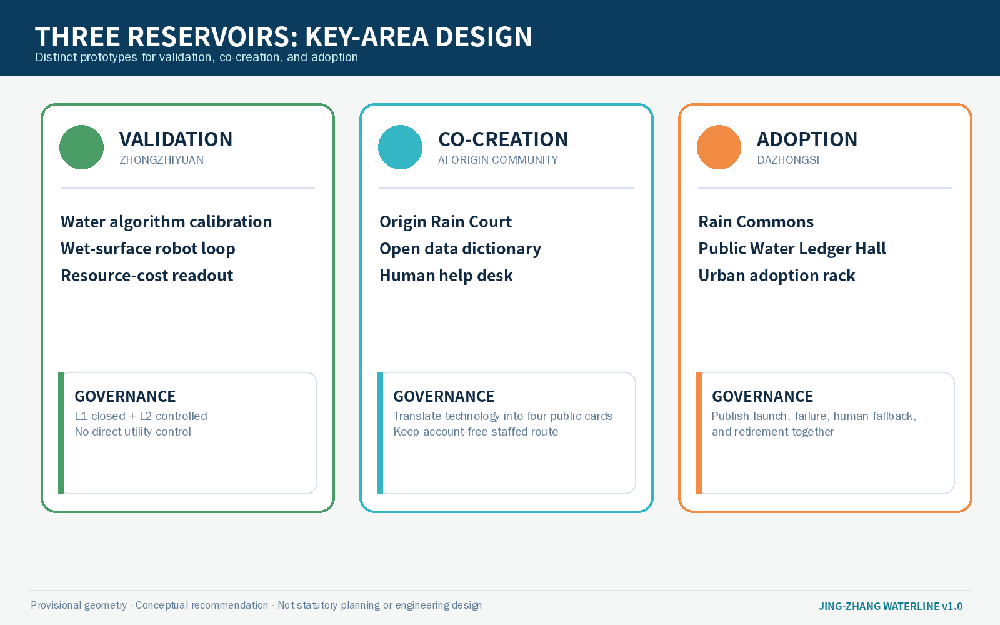
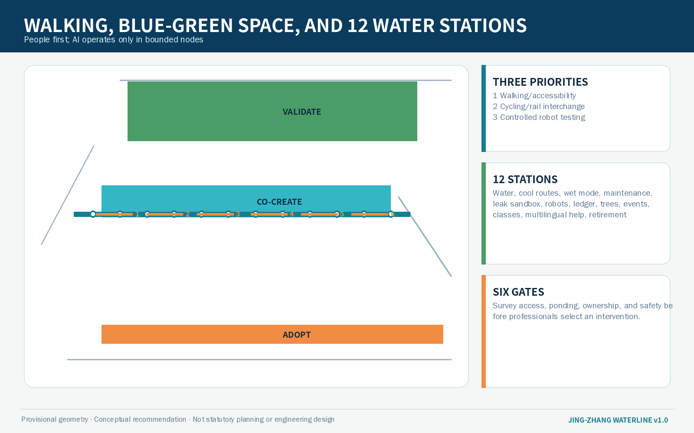
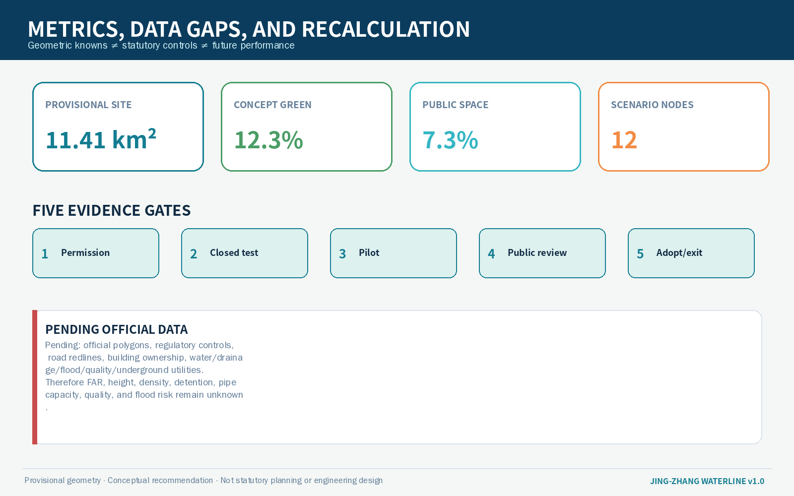

# JING-ZHANG WATERLINE

> **A public water network for drinking, cooling, and retention in the AI city**  
> The proposal does not build another technology showroom for AI. It asks every urban intelligence service four questions: what resources does it use, whose daily life does it improve, who takes over when it fails, and how can the public understand or stop it?

## Design Basis and Source List

The proposal is based on the official prequalification announcement issued by the Haidian Branch of the Beijing Municipal Commission of Planning and Natural Resources, the repository site package, the Agent Taskbook, local professional-standard snapshots, and the public source registry. The announcement defines a 43.6 km² coordinated research area, an approximately 11.4 km² overall design area, and three key areas totalling 368.4 ha. The Taskbook additionally requires identity design, international cases, scenario cards, personas, AI pilgrimage landmarks, a cultural narrative, and long-term operations. WATERLINE brings these requirements into one legible and reversible system linking water resources, public space, and AI governance [source:OFFICIAL-ANNOUNCEMENT] [source:AGENT-TASKBOOK] [standard:PROJECT-AGENT-OPEN-CALL-TASKBOOK].

The repository does not yet provide precise official polygons suitable for statutory judgement. This package uses the maintainer-registered `provisional_boundaries.geojson`. Every boundary, zone, and node is therefore a conceptual expression within a temporary constraint, not an official redline, ownership decision, drainage-engineering design, or construction commitment. When official boundaries, existing utilities, flood-control, underground-space, heritage, road-redline, ownership, and regulatory-plan information become available, all GeoJSON, metrics, figures, and project lists must be recalculated [data:geometry/site_boundary.geojson#SITE-001] [source:BOUNDARY-SOURCE] [depth:risk_missing_data].

WATERLINE does not draw unknown waterways, pipes, or sponge-city targets as facts. It separates three evidence classes: official tasks and textual area values; provisional repository geometry used only for generation and discussion; and participant-authored design layers, scenarios, and governance protocols marked as `design_proposal`. Complete provenance, licences, permitted uses, and limitations remain in `sources.json` [source:SOURCE-REGISTRY] [source:PROCESSED-FACT-PACK].

## Three-Level Scope Framework

The **43.6 km² coordinated research area** addresses the industry-city relationship by organising water services, environmental sensing, embodied intelligence, edge computing, public health, climate services, and governance as a testable AI ecosystem rather than an equipment-shopping list. The **approximately 11.4 km² overall design area** translates this ecosystem into the Jing-Zhang Railway Heritage Park civic spine, transverse connections, candidate rain gardens, rest and drinking-water nodes, and three types of test environment. The **three key areas, totalling 368.4 ha**, host validation, co-creation, and adoption, completing a loop from model to street and public feedback back to research [depth:three_level_scope_framework] [standard:PROJECT-OFFICIAL-ANNOUNCEMENT].

The spatial structure is **“one waterline, three reservoirs, two wings, six gates, twelve water stations”**:

- **One waterline:** a continuous civic spine for walking, shade, drinking-water information, rainwater education, and low-intrusion environmental sensing along the heritage park;
- **Three reservoirs:** the Zhongzhiyuan Validation Reservoir, AI Origin Co-creation Reservoir, and Dazhongsi Adoption Reservoir. “Reservoir” is a metaphor for storing and routing knowledge and scenarios, not a proposal for new reservoirs;
- **Two wings:** Zhongguancun provides standards, legal, finance, and open-source support; Xiaoyue River provides climate, community, and everyday-use feedback;
- **Six gates:** candidate transverse interfaces connecting the reservoirs and wings, park and neighbourhoods;
- **Twelve water stations:** plug-in AI+water public-service prototypes that can be staffed, paused, and removed.

The provisional boundary appears only as a low-contrast dashed constraint. The main design object is the relationship among line, reservoirs, gates, and stations. The overall scope and three key areas are machine-reviewable but cannot replace official surveying or professional water engineering [data:geometry/key_areas.geojson#PROV-KEY-001] [metric:key_area_count] [depth:overall_spatial_structure].

## Coordinated Research Area: Industry and Future City Research

### 1. Three positions and five functions

The proposal retains the Taskbook’s three positions through a water-based common language. The **Centennial Jing-Zhang Cultural Belt** tells how railway engineering connected the country through measurement and standards. The **Metropolitan AI Life Experience Belt** makes drinking, shade, wayfinding, resting, and wet-weather access the first tangible civic outcomes. The **AI Integrated Innovation Belt** places models, sensors, robots, maintenance, and public deliberation in one validation chain. The five functions become five water-cycle stages: research and validation, ecosystem collaboration, scenario enablement, vibrant city, and global governance [source:AGENT-TASKBOOK].

The principal name is **JING-ZHANG WATERLINE / 京张水脉**. Its identity combines two railway lines, a water drop, and an open bracket: the parallel lines represent the century-old railway and contemporary civic spine; the drop represents resource accountability; the open bracket means that services are connectable and exitable. The palette uses deep indigo, clear-water blue, rain-garden green, and safety orange. Wayfinding separates blue public service, green ecological state, and orange human help, while never relying on red/green colour alone for critical status.

### 2. Six global references and transferable lessons

| Case | Lesson | WATERLINE transfer | Boundary against copying |
| --- | --- | --- | --- |
| Singapore one-north | Mixed research, incubation, housing, and public space | Link validation, co-creation, and adoption across three reservoirs | Do not copy its scale or governance regime |
| Helsinki Kalasatama | Resident time and daily life as smart-city performance | Every scenario states whose time it saves and who provides human backup | A trial is not public consent |
| Barcelona 22@ | Knowledge economy and industrial-area renewal | Coordinate heritage, park, industry, and neighbourhoods | Do not hide community cost behind upgrading |
| Singapore PUB smart-water practice | Metering, anomaly detection, conservation, and maintenance | Create a public water ledger and closed test environment | Do not import foreign engineering targets into Beijing |
| Copenhagen cloudburst public realm | Public space changes state during extreme weather | Rain courts and wet-weather modes become professional design directions | No flood-protection claim without drainage modelling |
| Rotterdam Benthemplein Water Square | Infrastructure also works as everyday public space | The Adoption Reservoir tests daily/rain-event dual-use space | Do not copy dimensions or storage capacity |

These cases are background research, not statutory evidence. Their contribution is a set of questions: mixed use, visible maintenance, graded testing, public return, and switching between normal and extreme states [source:CASE-ONE-NORTH] [source:CASE-KALASATAMA] [source:CASE-CLOUDBURST].

### 3. AI ecosystem map

Zhongzhiyuan concentrates environmental models, sensors, robots, and safety evaluation. AI Origin Community hosts open data dictionaries, community co-testing, talent services, and translation. Dazhongsi hosts product demonstration, procurement dialogue, adoption, and international exchange. Zhongguancun supports standards, intellectual property, finance, and compliance; Xiaoyue River supplies real climate, community, and public-space questions. Before entering open public space, a technology passes five gates: data permission, closed validation, semi-open pilot, public review, and time-limited adoption or exit. Statutory approvals remain separate [depth:industry_future_city_strategy] [standard:MOHURD-URBAN-DESIGN-MEASURES].

## Overall Design Area: Urban Renewal and Regulatory-Plan-Level Urban Design

The renewal sequence is civic spine first, transverse interface first, and lightweight pilot first. The provisional area is completely partitioned into four conceptual classes—research and innovation, park/open space, industry services, and mixed urban function—without changing statutory land use [data:geometry/land_use.geojson#LU-001] [depth:land_use_layout].

The urban form does not place blue devices everywhere. WATERLINE uses three section types. A **daily section** provides shade, seating, water information, and an accessible detour. A **wet-weather section** provides slip warnings, closure information, and staffed alternatives. A **test section** confines sensors, robots, and digital wayfinding to bounded, scheduled, supervised candidate spaces. Equipment uses demountable foundations, standard power/communication interfaces, and replaceable panels to avoid disposable “technology landscape.”

Building renewal follows four states: retain, repair, insert, and retire. Valuable and verified structures are retained; ground-floor interfaces and accessible edges are repaired; AI scenarios use reversible inserted components; failed devices and temporary facilities have an end-of-life route. Existing building condition, ownership, fire safety, structure, and regulatory controls are missing, so parcel-level demolition, new construction, height, and FAR remain pending official data [data:geometry/buildings.geojson#BLDG-001] [metric:floor_area_ratio] [depth:retain_renovate_demolish].

Six candidate transverse “water gates” connect communities, campuses, active ground floors, metro stations, and blue-green spaces. They are a priority survey list, not a bridge or tunnel engineering conclusion. Each gate requires investigation of ownership, accessibility, wet-weather ponding, lighting, fire access, and movement conflicts before professionals choose at-grade improvement, existing-passage repair, or another option [data:geometry/roads.geojson#ROAD-001] [depth:traffic_rail_slow_parking].

## Detailed Design of Key Areas

### Zhongzhiyuan AI Acceleration Area: Validation Reservoir

This area provides **L1 closed validation and L2 controlled demonstration** for water-environment and embodied-intelligence systems. Along the Qinghe-facing edge, the proposal only suggests low-impact landscape, monitoring interpretation, and walking continuity; it does not infer river blue lines, flood standards, or outfalls. Candidate projects include a Water Algorithm Calibration Yard, Wet-Surface Robot Test Loop, Open Device Teardown Table, and Resource-Cost Readout Wall. Teams disclose data category, error, human takeover, and exit. Open testing does not collect identifiable faces or persistent personal trajectories [data:geometry/key_areas.geojson#PROV-KEY-001] [depth:three_key_area_detailed_design].

### Beijing AI Origin Community: Co-creation Reservoir

This area is the public hub for **open standards, resident co-testing, and translation**. A near-campus “rain-court learning loop” links candidate campus, community, park, and innovation interfaces. The Origin Rain Court, Open Data Dictionary Room, Human Help Desk, and small release steps are conceptual spatial prototypes. The rain court indicates a direction for sunken green space and rainwater education; it does not claim storage capacity [data:geometry/key_areas.geojson#PROV-KEY-002] [source:AGENT-TASKBOOK].

Technical services are translated into four public cards: what it does, what data it uses, who is responsible, and how to avoid it. Services requiring accounts, phones, or faces provide an equivalent staffed route. Developer honour records open specifications, test evidence, fixes, community training, and responsible termination rather than device count or publicity.

### Dazhongsi AI Industry Cluster: Adoption Reservoir

This area is the urban front room for **adoption, AI-native commerce, and international exchange**. Around the metro station and four-quadrant walking relationship, it proposes three separable prototypes: Rain Commons, Public Water Ledger Hall, and Urban Adoption Rack. In daily state they support commuting, resting, commerce, and presentations; in heavy rain or failure they close low areas, display staffed routes, and pause automated services. Drainage, station integration, underground space, and traffic require professional review [data:geometry/key_areas.geojson#PROV-KEY-003] [metric:key_area_count].

Every exhibit shows start date, trial boundary, service owner, human alternative, failure record, and retirement date. Commercial cooperation, procurement, investment attraction, and events remain operational suggestions rather than government commitments.

## AI Innovation Ecosystem, Personas, and AI+ Scenarios

### Personas

| Persona | Real task | Spatial need | Rights boundary |
| --- | --- | --- | --- |
| Residents and caregivers | Water, rest, wet-weather access, repair reporting | Shaded, seated, staffed everyday station | No reduced service for avoiding an app |
| Older people, children, disabled users | Understand status and receive help | High contrast, tactile cues, continuous accessible route | No automatic recognition replacing voluntary help |
| Developers and researchers | Test models, devices, and robots | Closable, reproducible, auditable test yard | Time- and area-bounded public tests with stop authority |
| Park, municipal, and property operators | Dispatch, inspect, repair, review | Maintenance ledger, parts interface, staffed control desk | AI advises; qualified people decide critical actions |
| Start-ups and adopters | Demonstrate, procure, train, hand over | Adoption reservoir, demonstration and training rooms | A pilot is not procurement or approval |
| Students and global visitors | Learn, contribute, understand heritage | Bilingual route, open course, contribution display | Respect copyright, language, and cultural difference |

### Twelve scenario cards

| ID | Scenario and space | AI role | Human and exit boundary |
| --- | --- | --- | --- |
| W01 Drinking-water access navigation | Suggest accessible routes using public facility status | Signs and staffed inquiry remain available; no route tracking |
| W02 Cool-path guidance | Suggest a comfortable route using shade, seating, and opening hours | Advice only; not a medical heat-risk decision |
| W03 Accessible wet-weather mode | Show slippery areas, closure points, and staffed detours | Staff hold closure authority; paper route remains |
| W04 Rain-garden maintenance assistant | Identify plant stress, blockage, and work orders | **Industry Test 1**; image facilities only, gardener confirms |
| W05 Leakage-anomaly sandbox | Test anomaly detection on synthetic or cleared data | **Industry Test 2**; no direct valve control, human review of alerts |
| W06 Wet-surface robot loop | Test perception in rain, glare, and shallow water | **Industry Test 3**; closed, slow, supervised, emergency stop |
| W07 Public water ledger | Display resource inputs, maintenance cost, and public return | Unverified data is marked pending and open to challenge |
| W08 Tree-watering work orders | Suggest priorities from public weather and manual inspection | No autonomous irrigation; landscape professionals decide |
| W09 Event rain-mode scheduling | Suggest wet-weather layouts and evacuation preparation | Safety officer approves; official alerts govern extremes |
| W10 Children’s rainwater class | Explain water cycles, sensor error, and privacy | No child identity or voice collection; adult facilitator |
| W11 Multilingual human-help desk | Translate facility status, repair, and risk messages | Human checks critical safety messages; Chinese source retained |
| W12 Retired-device materials library | Track lifespan, parts, reuse, and removal | Asset and safety owners decide retirement, not model scoring |

The twelve nodes are recorded as conceptual `SCENARIO_NODE` features. Their locations explain network relationships only and require field relocation after survey [data:geometry/public_space.geojson#W01] [metric:scenario_node_count] [depth:ai_scenarios_personas].

## Land Use, Building Scale, and Retain-Renovate-Demolish Strategy

`land_use.geojson` uses permitted classification codes and fully covers the provisional boundary. The proposal does not invent a statutory “AI water land use”; reversible components are embedded in research, green, service, and mixed urban functions [standard:MNR-LAND-USE-CLASSIFICATION-GUIDE] [data:geometry/land_use.geojson#LU-001].

Building footprints are conceptual masses for checking relationships among layers and public space, not surveyed buildings or approved scale. Height, FAR, density, ownership, and parcel-level retain/renovate/demolish decisions remain pending. The known footprint area is only a geometric result of this package [metric:building_footprint_area_sqm] [depth:height_massing_character].

Retain–repair–insert–retire means retaining verified heritage and everyday spaces; repairing ground floors, canopies, drainage edges, and accessibility; inserting demountable stations and sensor boxes; and retiring obsolete equipment under a responsibility record. Structure, fire, heritage, underground-space, and utility interventions require separate professional work.

## Transport, Rail, Municipal Infrastructure, and Public Services

Walking and accessibility continuity is the first layer, cycling and rail interchange the second, and controlled robot/automated-service testing the third. Each water gate first asks whether people can cross safely before adding intelligent navigation. Metro integration, road redlines, parking, loading, and underground space remain pending official conditions [data:geometry/roads.geojson#ROAD-001] [depth:traffic_rail_slow_parking].

The municipal strategy sets three boundaries: **sensing is not control; advice is not dispatch; display is not engineering**. Public AI scenarios must not directly control water supply, drainage, reclaimed water, fire systems, or flood defence. Any future integration requires professional interfaces, permission isolation, human confirmation, and degraded operation. Edge devices use data minimisation, short retention, visible status, and fallback to ordinary signs, manual inspection, and physical switches [depth:municipal_new_infrastructure] [data:geometry/constraints.geojson#CONSTRAINTS].

Every water station has a status board, human contact, non-digital route, seating, and maintenance date. Whether it can provide potable water, misting, reclaimed water, or detention must be confirmed site by site against water quality, hygiene, energy, utilities, and operations.

## Blue-Green Network, Public Space, and Urban Character

WATERLINE treats the Jing-Zhang Railway Heritage Park as the visible surface of civic infrastructure. Green space supports shade, habitat, walking, and water education; public space supports rest, discussion, testing, and events. Neither should be displaced by devices or commercial display. Green and public-space ratios are internally recalculated concept metrics, not approved statutory ratios [metric:green_ratio] [metric:public_space_ratio] [depth:blue_green_public_space].

Three AI pilgrimage landmarks are conceptual civic prototypes:

1. **The Water Gauge:** an open readout in the Validation Reservoir showing model error, resource cost, and test state;
2. **Origin Rain Court:** a co-creation court linking open-source contribution, resident repair proposals, and rainwater learning;
3. **Water Ledger Hall:** an Adoption Reservoir hall displaying the owner, public return, failures, and retirement of every urban AI scenario.

The honour system records who published a data dictionary, fixed a defect, provided a human alternative, or stopped an unqualified pilot. The cultural narrative connects the measurement, standards, and engineering responsibility of the Jing-Zhang Railway to Zhongguancun open innovation and the verifiable public responsibility of the AI era. Heritage interpretation requires authoritative historical sources [source:AGENT-TASKBOOK] [standard:MOHURD-URBAN-DESIGN-MEASURES].

Urban character uses subdued blue-green colours, weathering metal, replaceable timber/recycled materials, and legible mechanical connections. It avoids glare screens, anthropomorphic surveillance, and cyberpunk packaging. Lighting and material performance require professional review.

## Renewal Projects, Implementation Policy, and Phasing

| Project | Content | Near-term action | Dependency and stop condition |
| --- | --- | --- | --- |
| P1 WATERLINE baseline survey | Walkability, shade, ponding, facilities, and human service at six gates/twelve stations | Public survey form and accessibility walk | No equipment before ownership and safety checks |
| P2 1:1 Origin Rain Court pilot | Demountable seating, status board, class, and human help | 90-day lightweight pilot | No detention claim; complaints or safety issues pause it |
| P3 Validation Reservoir | Three industry tests and public readout wall | Synthetic-data and closed-site tests | No opening before safety review |
| P4 Adoption Reservoir | Rain Commons, ledger hall, adoption rack | Indoor/semi-indoor display and training | Commercial adoption is not government procurement |
| P5 Six walking connections | Survey before professional design | Wayfinding, maintenance, existing passage repair | Bridge/tunnel/intersection work needs approval |
| P6 Station component library | Status board, help interface, base, material passport | Open specification and prototype | No launch without an operations owner |
| P7 Public water ledger | Resource, failure, maintenance, retirement record | Static public ledger | Unverified values stay pending |
| P8 WATERLINE Open Week | Open tests, courses, global workshop | Concept planning and community co-editing | Event, funding, venue, and safety remain unconfirmed |

Three phases are proposed: **evidence phase (0–1 year)** for survey, temporary section, and closed testing; **interface phase (1–3 years)** for professionally confirmed reservoirs and gates; and **governance phase (after year 3)** in which public evidence decides expansion, redesign, or exit. This is a conceptual recommendation, not a government schedule or investment commitment [data:geometry/phasing.geojson#PHASE-001] [depth:phasing_implementation].

Long-term operation uses a Scenario Passport: purpose, space, data, owner, human alternative, duration, metrics, stop condition, and retirement route. Suggested annual programmes include WATERLINE Open Week, an Urban AI Water Benchmark Challenge, Public Maintenance Hackathon, Youth Rainwater Class, and Global Climate-City Roundtable. Implementation depends on authorisation, budget, and safety [source:AGENT-TASKBOOK] [depth:renewal_project_list].

## Metrics, Area Recalculation, and Compliance Matrix

The package distinguishes geometric knowns, statutory controls that remain unknown, and future operational targets requiring pilot data. Site area, conceptual building footprint, green ratio, public-space ratio, key-area count, and scenario-node count are stored with formulas and source files in `metrics.json` [metric:site_area_sqm] [metric:scenario_node_count] [depth:metrics_recalculation].

The green and public-space ratios check whether the design preserves room for a civic waterline; they are not approved green-space or public-facility controls. FAR, height, density, detention capacity, pipe capacity, water quality, and flood risk remain pending official data and professional models. Every area and ratio must be recalculated when official polygons replace provisional geometry.

`compliance_matrix.json` covers announcement sections 1.3, 1.4, and 1.5 plus agent.1–agent.6. `standard_matrix.json` records responses and data gaps. `design_depth_matrix.json` links diagnosis, structure, land use, buildings, transport, utilities, blue-green space, key areas, projects, phasing, metrics, and risk to narrative, drawings, and data. A passing self-check only permits review; it is not approval, engineering feasibility, or adoption [standard:PROJECT-OFFICIAL-ANNOUNCEMENT] [depth:compliance_risk_missing_data].

## Risk, Copyright, and Compliance

1. **Spatial:** provisional polygons cannot support redlines, ownership, engineering, or precise official-area decisions.
2. **Water:** utility, drainage, flood, quality, reclaimed-water, fire, and underground data are missing; no pipe, storage, discharge, potable-water, or feasibility conclusion is made.
3. **AI:** no persistent personal trajectories; critical dispatch remains human; robots test only in closed, slow, supervised environments.
4. **Public interest:** every digital service retains a staffed, paper, or physical route; pilots cannot occupy basic public or accessible space.
5. **Implementation:** procurement, investment, events, funding, delivery bodies, and schedule are suggestions, not government commitments.
6. **Copyright:** figures, pages, PDFs, and cover are generated by this Agent from repository data and local drawing code. External cases are cited as text research; their images, trademarks, and drawings are not copied. See `report/copyright_statement.md`.

The unified boundary statement is: **all spatial content is an open co-creation suggestion, conceptual recommendation, or reference scheme for professional teams to develop. It does not replace statutory planning, professional design, government approval, or public decision-making.** [source:SITE-PACKAGE] [depth:risk_missing_data]

## References

- Haidian Branch, Beijing Municipal Commission of Planning and Natural Resources. *Prequalification Announcement for the Centennial Jing-Zhang AI Innovation Belt Urban Design International Solicitation*, 2026.
- open-city-ai/haidian: `design_brief.json`, `agent_taskbook.json`, and `allowed_design_space.json`.
- open-city-ai/haidian: `data/source_registry.json` and local professional-standard snapshots.
- Singapore Economic Development Board: official one-north introduction (background research).
- Forum Virium Helsinki: Kalasatama smart-city experimentation (background research).
- Singapore PUB: smart-water and public-conservation material (background research).
- City of Copenhagen: Cloudburst Management Plan (background research).
- City of Rotterdam / De Urbanisten: public Benthemplein Water Square material (background research).
- Complete URLs, licences, uses, and limitations are recorded in `sources.json` [source:SOURCE-REGISTRY].
