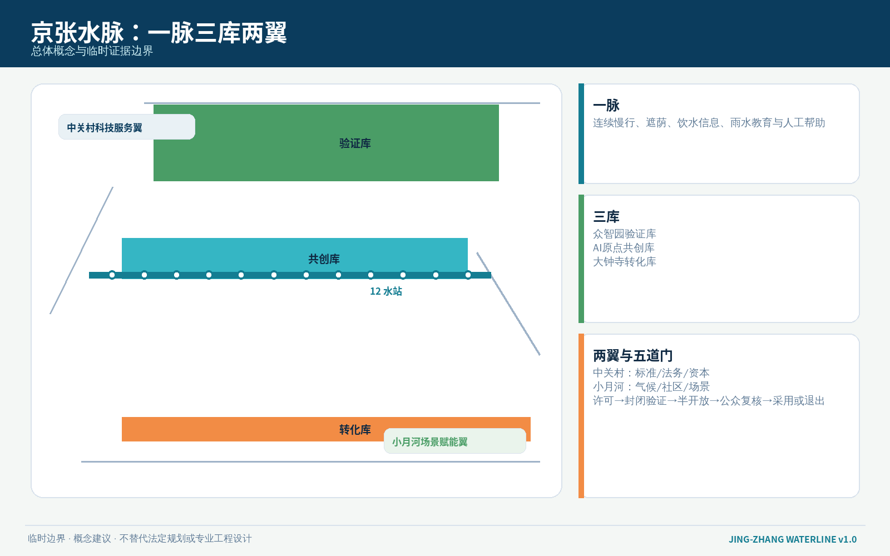
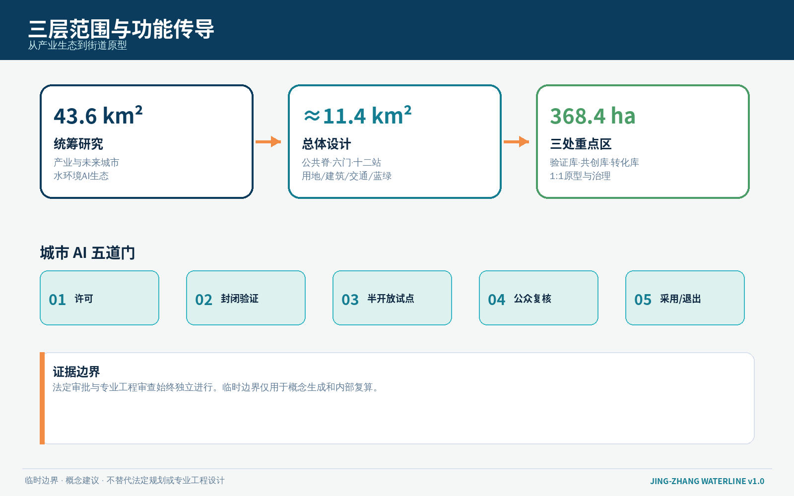
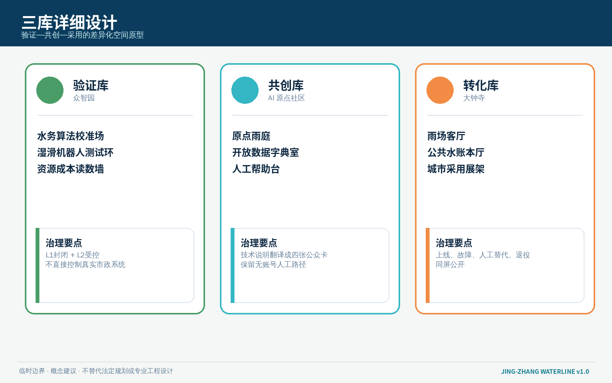
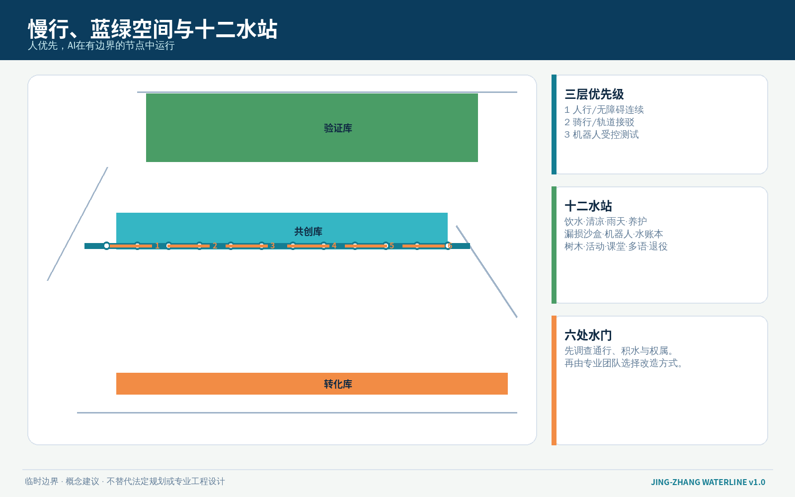
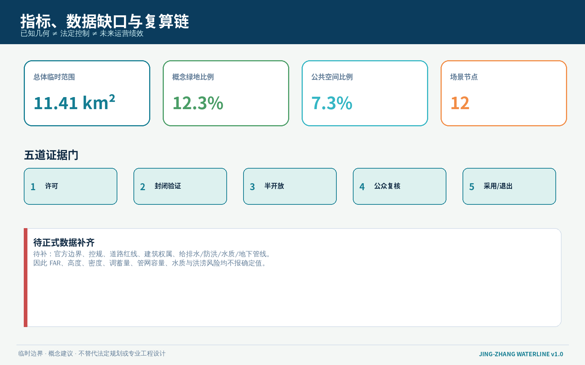

# 京张水脉 / JING-ZHANG WATERLINE

> **可饮、可纳凉、可蓄的 AI 城市公共水网**  
> 不是为 AI 再造一座科技展厅，而是要求每一项城市智能都回答：用了什么资源，改善了谁的日常，失效时谁来接管，公众如何看懂并叫停。

## 设计依据与资料清单

本方案依据北京市规划和自然资源委员会海淀分局发布的资格预审公告、仓库场地包、面向智能体任务书、专业标准快照与公开资料登记表形成。公告明确了 43.6 平方公里统筹研究范围、约 11.4 平方公里总体设计范围和 368.4 公顷三处重点区域；任务书进一步要求命名与视觉识别、全球案例、场景卡、用户画像、AI 朝圣地标、文化叙事和长期运营。本方案将这些要求收束为“水资源—公共空间—AI 治理”同一套可阅读、可复算、可退出的设计系统 [source:OFFICIAL-ANNOUNCEMENT] [source:AGENT-TASKBOOK] [standard:PROJECT-AGENT-OPEN-CALL-TASKBOOK]。

当前仓库尚未提供可用于法定判断的精确官方 polygon。本包沿用维护者登记的 `provisional_boundaries.geojson`，所有范围、分区与节点均为临时约束下的概念表达，不是官方红线、权属判断、排水工程方案或建设承诺。正式边界、现状管网、防洪排涝、地下空间、文保、道路红线、建筑权属与控规条件到位后，必须整体复算 GeoJSON、指标、图件和项目清单 [data:geometry/site_boundary.geojson#SITE-001] [source:BOUNDARY-SOURCE] [depth:risk_missing_data]。

“水脉”不是把未知的河道、管线或海绵指标画成事实。它采用三类证据边界：一是公告和场地包提供的正式任务与面积文字；二是仓库登记的临时几何，仅用于生成和讨论；三是方案自行提出的设计图层、场景和治理协议，明确标为 `design_proposal`。完整来源、许可、用途与限制保存在 `sources.json`，正文只保留与判断直接相邻的证据 [source:SOURCE-REGISTRY] [source:PROCESSED-FACT-PACK]。

## 三层范围工作框架

**统筹研究范围（43.6 km²）**负责回答产业与城市的关系：把水务、环境感知、具身智能、边缘计算、公共健康、气候服务和城市治理组织为可验证的 AI 生态，而不是把“智慧水务”简化成设备采购。**总体设计范围（约 11.4 km²）**负责把产业逻辑落到京张遗址公园公共脊、横向缝合、雨水花园候选点、休息饮水节点和三类试验空间。**三处重点区域（共 368.4 ha）**分别承担验证、共创与采用，形成从模型到街道、再从公众反馈回到研发的闭环 [depth:three_level_scope_framework] [standard:PROJECT-OFFICIAL-ANNOUNCEMENT]。

空间结构概括为 **“一脉三库、两翼六门、十二水站”**：

- **一脉**：沿京张遗址公园组织连续慢行、遮荫、饮水、雨水教育与低侵入环境感知的公共水脉；
- **三库**：众智园“验证库”、AI 原点社区“共创库”、大钟寺“转化库”；“库”是知识和场景的储存/调度隐喻，不表示新建水库；
- **两翼**：中关村科技服务翼提供标准、法务、投融资和开源协作，小月河场景赋能翼提供气候、社区与日常使用反馈；
- **六门**：把三库与两翼、公园与街区连接的候选横向接口；
- **十二水站**：可插拔、可人工接管、可暂停的 AI+水公共服务原型。

临时边界只以低对比虚线显示，真正的设计对象是脉、库、门、站之间的关系。总体范围图层与三处重点区均可被机器核对，但不能替代正式测绘与专业水务设计 [data:geometry/key_areas.geojson#PROV-KEY-001] [metric:key_area_count] [depth:overall_spatial_structure]。

## 统筹研究范围产业与未来城市研究

### 1. 三大定位与五大功能

方案保留任务书的三大定位，并用“水脉”建立共同语法：**百年京张文化带**讲述铁路如何以工程标准连接国家；**都市 AI 生活体验带**让饮水、遮荫、问路、休息和雨天通行成为居民可感知的第一批成果；**AI 融合创新带**把模型、传感、机器人、运维和公共审议放进同一条验证链。五大功能则被转译为“研发验证—生态协作—场景赋能—活力城市—全球治理”五个水循环环节 [source:AGENT-TASKBOOK]。

主名称为 **京张水脉 JING-ZHANG WATERLINE**。视觉识别采用“铁路双线 + 一滴水 + 开放括号”的无衬线几何符号：两条平行线代表百年轨道与当代公共脊，中央水滴代表资源责任，开放括号表示可接入也可退出。主色为深靛蓝、清水蓝、雨庭绿和安全橙；不得使用未经授权的企业商标、人物肖像或历史照片。导视分为蓝色公共服务、绿色生态状态、橙色人工帮助三类，不用红绿单一颜色表达关键状态，以兼顾色觉差异。

### 2. 六个全球案例的可转化经验

| 案例 | 可学习内容 | 京张转化 | 不照搬之处 |
| --- | --- | --- | --- |
| 新加坡 one-north | 研发、孵化、居住与公共空间混合 | 三库之间建立研发—共创—采用回路 | 不复制园区尺度和治理制度 |
| 芬兰 Kalasatama | 以居民时间和城市生活作为智慧城市绩效 | 场景卡必须写明节省谁的时间、谁人工兜底 | 不把试验等同公众同意 |
| 巴塞罗那 22@ | 老工业区更新与知识经济空间共存 | 京张遗产、公园、产业与社区同步更新 | 不用产业升级掩盖社区成本 |
| 新加坡 PUB 智慧水务实践 | 计量、漏损识别、公众节水与运维协同 | 建立公共水账本和封闭测试场 | 不把境外技术指标直接套用北京 |
| 哥本哈根暴雨韧性公共空间 | 公共空间在日常与极端天气间切换 | 雨庭、可淹没活动面和雨天模式作为深化方向 | 不在缺少排水模型时声称防洪能力 |
| 鹿特丹 Benthemplein 水广场 | 基础设施兼做日常公共空间 | 大钟寺转化库设置“雨场/日常场”双模式原型 | 不复制具体工程尺寸与蓄水量 |

上述案例在包内作为背景研究，不支撑京张的法定控制、工程规模或实施承诺。它们的价值是形成可追问的设计原则：混合使用、可见运维、分级试验、公共回报和极端状态切换 [source:CASE-ONE-NORTH] [source:CASE-KALASATAMA] [source:CASE-CLOUDBURST]。

### 3. AI 创新生态图谱

众智园聚焦环境模型、传感器、机器人和安全评测；AI 原点社区承接开源数据字典、社区共测、人才服务和成果翻译；大钟寺承接产品展示、采购对接、场景采用和国际交流。中关村科技服务翼提供标准、知识产权、投融资与合规支持，小月河场景赋能翼提供社区、河岸和公共空间的真实问题。每个技术进入开放空间前必须经过 **资料许可—封闭验证—半开放试点—公众复核—限期采用/退出** 五道门，专业审批仍按法定程序另行开展 [depth:industry_future_city_strategy] [standard:MOHURD-URBAN-DESIGN-MEASURES]。

## 总体设计范围城市更新与控规深度城市设计

总体设计采用“公共脊优先、横向接口优先、轻量试点优先”的更新顺序。临时范围被完整分为研发创新、公园开敞、产业服务和复合城市功能四类概念用地，分区拓扑由 `land_use.geojson` 保持无缝覆盖；这只是机器可复核的设计分区，不改变现行法定用地 [data:geometry/land_use.geojson#LU-001] [depth:land_use_layout]。

城市形态不是沿线堆放蓝色设备。公共水脉由三类断面构成：**日常断面**提供树荫、坐凳、饮水提示和无障碍绕行；**雨天断面**提供防滑、积水提示、可关闭低洼活动面和人工引导；**试验断面**将传感、机器人或数字导视限定在有边界、有时间表、有现场人员的候选场地。所有设备优先采用可拆卸基座、标准电源/通信接口和可替换面板，避免一次性“科技景观”。

建筑更新采用“留—修—插—退”四态方法：有价值且状况明确的建筑优先保留；公共界面和首层可做低扰动修补；AI 场景使用可拆回的插入式构件；失效设备和临时设施必须有退役去向。由于现状建筑质量、产权、消防、结构和控规数据尚缺，任何具体楼栋拆除、新建、高度或容积率判断均保持待正式数据补齐 [data:geometry/buildings.geojson#BLDG-001] [metric:floor_area_ratio] [depth:retain_renovate_demolish]。

总体设计设置六处候选横向“水门”，连接公园两侧社区、校园、产业首层、轨道站和蓝绿空间。水门不是新建桥隧结论，而是优先核查的步行缝合清单；每处需完成道路权属、无障碍连续性、雨天积水、照明、消防和人流冲突调查后，才能决定采用平交优化、既有通道改善或其他专业方案 [data:geometry/roads.geojson#ROAD-001] [depth:traffic_rail_slow_parking]。

## 重点区域详细设计

### 众智园 AI 自主创新加速区：验证库

定位为水环境与具身智能的 **L1 封闭验证 + L2 受控示范** 区。沿清河方向仅提出低扰动绿化界面、监测展示和慢行连续性的概念建议，不推定河道蓝线、防洪标准或排口。候选项目包括“水务算法校准场”“湿滑路面机器人测试环”“开放设备拆解台”和“资源成本读数墙”。研发团队必须公开训练/测试数据的来源类别、误差、人工接管和退出条件，现场不采集可识别面部与持续个人轨迹 [data:geometry/key_areas.geojson#PROV-KEY-001] [depth:three_key_area_detailed_design]。

空间上以“试验庭—共享廊—清河界面”三级递进：高风险设备留在可关闭试验庭；可解释成果进入共享廊；面向公众的界面只展示已通过受控验证、可人工关闭的服务。建筑首层优先布置维修、测试、培训和公众说明空间，屋顶与地下工程需待结构、市政和产权条件确认。

### 北京 AI 原点社区：共创库

定位为 **开源标准、居民共测和成果翻译** 的公共中枢。以近校步行为主，把校园、社区、园区与遗址公园之间的候选接口组织为“雨庭学习环”。核心空间包括原点雨庭、开放数据字典室、人工帮助台和小型发布阶梯。雨庭仅表达可供景观/水务团队深化的下凹绿地和雨水教育方向，不声明具体调蓄量 [data:geometry/key_areas.geojson#PROV-KEY-002] [source:AGENT-TASKBOOK]。

这里负责把技术说明翻译成普通市民能理解的四张卡：**它做什么、它用什么数据、谁负责、如何不用它**。任何需要手机号、账户或人脸的服务都必须提供等效人工路径。开发者贡献以公开版本、测试证据、修复记录和社区培训计入荣誉，不以设备数量或曝光量计分。

### 大钟寺 AI 产业集聚区：转化库

定位为 **产品采用、智能原生消费与国际交往** 的城市前台。围绕轨道站与四象限步行联系，提出“雨场客厅”“公共水账本厅”和“城市采用展架”三个可拆分原型。日常状态服务通勤、休息、商业和路演；强降雨或设备故障时切换为关闭低洼面、显示人工路线和暂停自动服务的安全状态。具体排水、站城一体化、地下空间和交通组织需专业复核 [data:geometry/key_areas.geojson#PROV-KEY-003] [metric:key_area_count]。

转化库不做“永不失败”的产品秀。每个展品必须同时展示上线日期、试用范围、服务责任人、人工替代、故障记录和退役日期；商业合作、采购、招商和活动均为运营机制建议，不构成政府承诺。

## AI 创新生态、人才画像与 AI+ 场景

### 用户画像

| 人群 | 真实任务 | 需要的空间 | 权利边界 |
| --- | --- | --- | --- |
| 周边居民与照护者 | 接水、休息、雨天通行、报修 | 有座位、有遮荫、有人值守的日常水站 | 不因不用 App 降低服务 |
| 老年人、儿童与残障使用者 | 看懂状态、无障碍绕行、获得人工帮助 | 高对比导视、触觉提示、连续无障碍路径 | 不以自动识别替代主动求助 |
| 开发者与研究团队 | 测试模型、设备和机器人 | 可关闭、可复现、可审计的验证场 | 公共空间测试需限时、限域、可叫停 |
| 公园、市政与物业运维者 | 接单、巡检、维修、复盘 | 维修台账、备件接口、人工调度席 | AI 只给建议，关键处置由持证人员决定 |
| 初创企业与采用机构 | 展示、采购、培训、交付 | 转化库、演示场、培训室 | 不把试点写成正式采购或审批 |
| 高校师生与国际访客 | 学习、共创、理解京张文化 | 双语路线、开放课程、贡献展示 | 尊重版权、语言与文化差异 |

### 十二张场景卡

| 编号 | 场景与空间 | AI 作用 | 人工/退出边界 |
| --- | --- | --- | --- |
| W01 饮水可达导航｜公共水站 | 依据公开设施状态给出无障碍路径建议 | 现场标牌和人工问询始终可用；不追踪个人路线 |
| W02 清凉路径｜遗址公园主脉 | 综合遮荫、座椅和开放时段提示舒适路线 | 只作建议，不替代高温健康判断 |
| W03 雨天无障碍模式｜六处水门 | 提示湿滑、关闭点和人工绕行 | 现场人员有最终封闭权；保留纸面路线 |
| W04 雨庭养护助手｜原点雨庭 | 识别植物缺水、堵塞和维护工单 | **产业测试 1**；只拍设施，不做人员识别，工单由园艺人员确认 |
| W05 漏损异常沙盒｜众智园验证库 | 在合成/清权数据上测试异常识别 | **产业测试 2**；不直接控制真实阀门，误报需人工复核 |
| W06 湿滑路面机器人环｜众智园 | 测试机器人在雨、反光和积水条件下的感知 | **产业测试 3**；封闭场地、低速、现场急停，不进入开放人流 |
| W07 公共水账本｜大钟寺转化库 | 展示场景的资源输入、维护成本和公共回报 | 无法核验的数据标“待测”，公众可提出异议 |
| W08 树木补水工单｜绿地节点 | 根据公开气象与人工巡查生成养护优先级 | 不自动灌溉，不替代园林专业判断 |
| W09 活动雨态调度｜年度活动路线 | 对临时活动提出雨天布置与疏散建议 | 活动安全负责人审批；极端天气按官方预警执行 |
| W10 儿童雨水课堂｜原点社区 | 把水循环、传感误差和隐私做成互动课程 | 不采集儿童身份和声音；由教师/志愿者主持 |
| W11 多语人工帮助｜三库服务台 | 翻译设施状态、报修和风险提示 | 关键安全信息由人工确认；保留中文原文 |
| W12 退役设备材料库｜三库维修点 | 记录设备寿命、备件、复用和拆除去向 | 退役由资产/安全责任人决定，不能以模型评分自动报废 |

这十二个场景把“AI 原生”理解为可测试、可解释和可移交，而不是无处不在的自动化。每个节点已作为概念性 `SCENARIO_NODE` 写入公共空间图层；点位只用于表达网络关系，待现场勘测后重定位 [data:geometry/public_space.geojson#W01] [metric:scenario_node_count] [depth:ai_scenarios_personas]。

## 用地、建筑规模与拆改留方案

`land_use.geojson` 采用仓库允许的正式分类代码，并完整覆盖临时总体边界。方案不创建“AI 水务用地”这种自造法定类别，而是在研发、绿地、商业服务和复合城市功能中嵌入可撤回的水脉组件 [standard:MNR-LAND-USE-CLASSIFICATION-GUIDE] [data:geometry/land_use.geojson#LU-001]。

建筑基底是概念体量，用于验证图层与公共空间的关系，不代表现状建筑或审定规模。建筑高度、容积率、密度、权属与拆改留对象均待正式资料补齐；已知的建筑基底面积只说明本包生成图层的几何结果 [metric:building_footprint_area_sqm] [depth:height_massing_character]。

“留—修—插—退”对应四类动作：保留价值明确的遗产和日常空间；修补首层、雨棚、排水边缘与无障碍接口；插入可拆卸水站、传感箱和展示架；按责任清单退役过时设备。任何涉及结构、消防、文保、地下空间和市政接管的动作必须由专业团队另行论证。

## 交通、轨道、市政与公共服务设施

交通策略以步行和无障碍连续性为第一层，以骑行和轨道接驳为第二层，以机器人/自动服务的受控测试为第三层。六处水门先做“人是否能安全过”的调查，再决定是否引入智能导航。轨道站点、道路红线、停车、装卸和地下空间均待正式条件确认 [data:geometry/roads.geojson#ROAD-001] [depth:traffic_rail_slow_parking]。

市政策略提出 **“感知不等于控制、建议不等于调度、展示不等于工程”** 三条底线。水务、排水、再生水、消防和防洪系统不得由本方案的公共 AI 场景直接控制；所有联动必须经过专业接口、权限隔离、人工确认和故障降级。端侧算力与传感设备优先使用最小数据、短期留存和现场状态灯，故障时回到普通标牌、人工巡检和实体开关 [depth:municipal_new_infrastructure] [data:geometry/constraints.geojson#CONSTRAINTS]。

公共服务设施采用 15 分钟步行“可找到”而非承诺法定服务半径的表达。每座水站至少有状态牌、人工联系方式、非数字路径、可坐空间和维护日期；是否提供直饮水、喷雾、再生水或调蓄功能，必须依据水质、市政、卫生、能源和运维条件逐点确认。

## 蓝绿空间、公共空间与城市风貌

水脉将京张遗址公园理解为“公共基础设施的可见表面”。绿地承担遮荫、生境、慢行和雨水教育，公共空间承担休息、讨论、测试与活动；二者不能被设备和商业展示挤占。当前绿地与公共空间比例来自概念几何复算，只用于校核方案内部一致性 [metric:green_ratio] [metric:public_space_ratio] [depth:blue_green_public_space]。

三处 AI 朝圣地标均为可供深化的公共空间原型：

1. **京张水尺 / The Water Gauge**：位于众智园验证库的开放读数装置，公开模型误差、资源成本和测试状态；
2. **原点雨庭 / Origin Rain Court**：在 AI 原点社区把开源贡献、居民修复建议和雨水课堂组织在同一处下沉式公共庭院概念中；
3. **水账本厅 / Water Ledger Hall**：位于大钟寺转化库，展示每个城市 AI 场景的责任人、公共回报、故障与退役信息。

荣誉体系不树立企业广告牌，而记录“谁公开了数据字典、谁修复了缺陷、谁建立人工替代、谁终止了不合格试点”。文化叙事从詹天佑时代的测量、标准和工程责任，连接到中关村的开放创新，再连接到 AI 时代的可核验公共责任。所有历史解释需依据正式史料深化，方案不自行认定文物边界 [source:AGENT-TASKBOOK] [standard:MOHURD-URBAN-DESIGN-MEASURES]。

风貌采用低饱和蓝绿、耐候金属、可替换木/再生材料和清晰机械连接，避免炫光屏幕、拟人监控装置和“赛博朋克”包装。夜间信息以低亮度、按需点亮和无障碍高对比为原则；具体照明和材料性能需专业复核。

## 更新项目清单、实施政策与分期计划

| 项目 | 内容 | 近期可做 | 关键依赖与停止条件 |
| --- | --- | --- | --- |
| P1 水脉基线调查 | 六门、十二站候选点的步行、遮荫、积水、设施与人工服务调查 | 公开调查表、现场踏勘、无障碍共测 | 未完成权属/安全核查不得安装设备 |
| P2 原点雨庭 1:1 临时样段 | 可拆坐凳、状态牌、雨水课堂与人工帮助台 | 90 天轻量试点 | 不宣称调蓄效果；投诉或安全问题触发暂停 |
| P3 众智园验证库 | 三个产业测试场景与公开读数墙 | 合成数据、封闭场地测试 | 未通过安全评审不得开放 |
| P4 大钟寺转化库 | 雨场客厅、水账本厅和采用展架 | 室内/半室内展示与培训 | 商业采用不等于政府采购 |
| P5 六门慢行缝合 | 先调查再形成专业方案 | 导视、维护和既有通道优化 | 桥隧、路口工程需专项审批 |
| P6 水站组件库 | 状态牌、人工帮助、可拆基座、材料护照 | 开源规格与样机 | 无运维责任人不得上线 |
| P7 公共水账本 | 场景资源、故障、维护和退役记录 | 静态公开台账 | 数据无法核验时标记待测 |
| P8 年度“水脉开放周” | 测试开放日、公共课程、国际工作坊 | 概念策划与社区共编 | 活动安排、资金和场地均待确认 |

分三期推进：**0—1 年证据期**只做调查、临时样段和封闭测试；**1—3 年接口期**在专业条件满足后完善三库与六门；**3 年以后治理期**根据公开评估决定扩展、重做或退出。分期是概念建议，不是政府建设时序或投资承诺 [data:geometry/phasing.geojson#PHASE-001] [depth:phasing_implementation]。

长期运营采用“场景护照”：每项场景有目的、空间、数据、责任人、人工替代、上线期限、评估指标、停止条件和退役去向。年度活动体系包括 Waterline Open Week、城市 AI 水务基准挑战、公共维护马拉松、青年雨水课堂和国际气候城市圆桌；活动只在取得授权、预算和安全条件后实施。开发者从提交原型到受控验证、公众复核、采用培训再到维护/退出，形成持续转化路径 [source:AGENT-TASKBOOK] [depth:renewal_project_list]。

## 指标体系、面积复算与合规矩阵

本包区分三类指标：**几何已知量**可从提交图层复算；**法定控制量**因缺官方条件保持未知；**运营目标量**必须通过未来试点采集，不能预先写成成绩。当前总体边界面积、概念建筑基底、绿地比例、公共空间比例、重点区数量和场景节点数量均记录在 `metrics.json`，公式与源文件可追溯 [metric:site_area_sqm] [metric:scenario_node_count] [depth:metrics_recalculation]。

绿地比例和公共空间比例不是审定绿地率或公服指标，而是检查本方案是否真的为公共水脉留出连续空间。容积率、建筑高度、建筑密度、正式调蓄能力、管网容量、水质和洪涝风险均待正式数据与专业模型补齐。若未来官方边界替换，所有面积和比例必须重新计算，不能沿用本版本数字。

`compliance_matrix.json` 覆盖公告 1.3、1.4、1.5 和 agent.1—agent.6；`standard_matrix.json` 说明专业标准的响应或资料缺口；`design_depth_matrix.json` 将现状诊断、总体结构、用地、建筑、交通、市政、蓝绿、重点区、项目、分期、指标和风险逐项连接到正文、图件与结构化数据。自检通过只代表包可进入评审，不代表方案获批、工程可行或已被采用 [standard:PROJECT-OFFICIAL-ANNOUNCEMENT] [depth:compliance_risk_missing_data]。

## 风险、版权与合规说明

1. **空间风险**：临时边界和重点区 polygon 不能用于红线、权属、工程或精确面积判断；官方数据到位后整包复算。
2. **水务风险**：缺少管网、排水、防洪、水质、再生水、消防和地下空间资料，不给出管径、蓄水量、排放、直饮或工程可行性结论。
3. **AI 风险**：环境感知不采集持续个人轨迹；关键调度由专业人员决定；机器人仅在封闭、低速、有急停的场地测试。
4. **公共利益风险**：任何数字服务保留人工、纸面或实体路径；试点不得挤占基本公共空间和无障碍通行。
5. **实施风险**：招商、采购、活动、资金、建设主体与时间表均为建议，不构成政府承诺。
6. **版权风险**：图件、网页、PDF 与封面由本 Agent 基于仓库数据和本地绘图程序生成；外部案例仅作文字研究，未复制其图像、商标或图纸。完整说明见 `report/copyright_statement.md`。

方案的统一边界声明是：**所有空间落地内容均为开放共创建议、概念建议或可供专业团队深化研究的参考方案，不替代法定规划、专业设计、政府审定和公共决策。** [source:SITE-PACKAGE] [depth:risk_missing_data]

## 参考资料

- 北京市规划和自然资源委员会海淀分局：《百年京张AI创新带城市设计国际方案征集资格预审公告》，2026。
- open-city-ai/haidian：`brief/site-package/design_brief.json`、`agent_taskbook.json`、`allowed_design_space.json`。
- open-city-ai/haidian：`data/source_registry.json` 与专业标准本地快照。
- Singapore Economic Development Board：one-north 官方介绍（背景研究）。
- Forum Virium Helsinki：Kalasatama 智慧城市试验介绍（背景研究）。
- Singapore PUB：智慧水务与公共节水资料（背景研究）。
- City of Copenhagen：Cloudburst Management Plan（背景研究）。
- City of Rotterdam / De Urbanisten：Benthemplein Water Square 公开项目资料（背景研究）。
- 完整 URL、许可、用途和限制见 `sources.json` [source:SOURCE-REGISTRY]。
