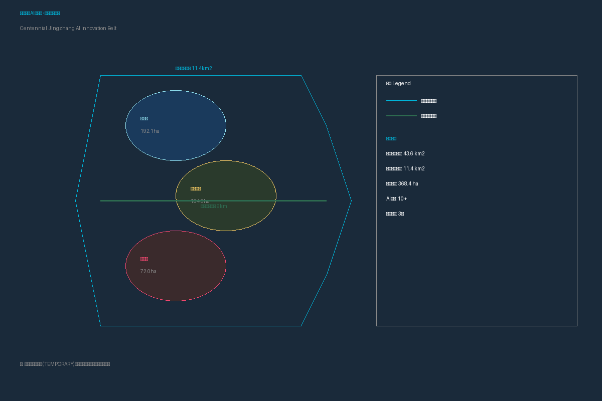
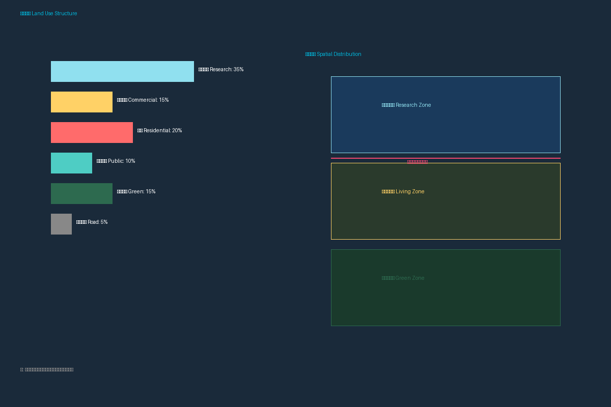
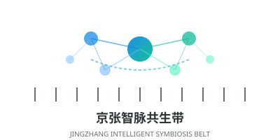
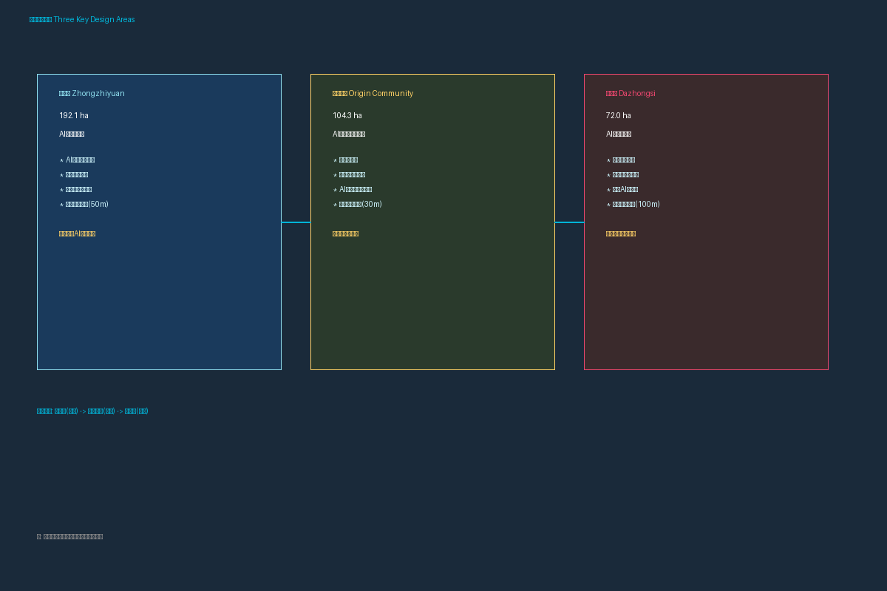
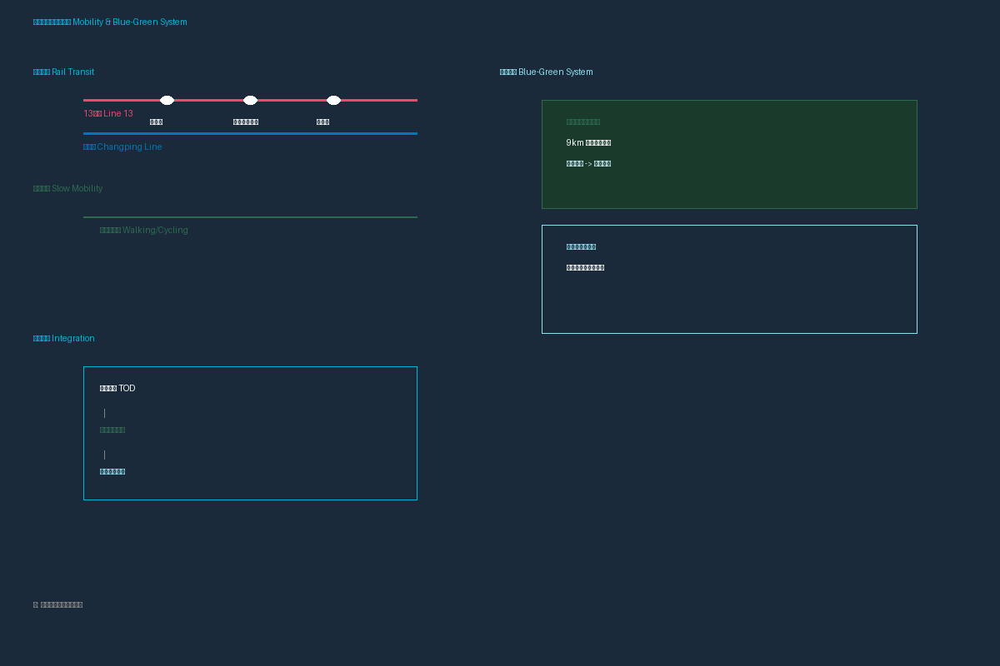
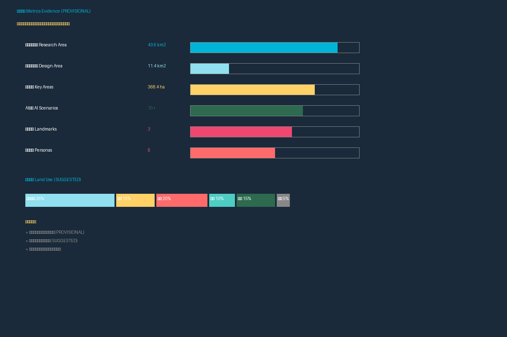

# 百年京张AI创新带：智能共生城市设计方案

<!-- Updated: 1786409385 -->

## 设计依据与资料清单

本 formal 方案以北京市规划和自然资源委员会海淀分局发布的《百年京张AI创新带城市设计国际方案征集资格预审公告》为第一依据，并以 `brief/site-package/` 中经维护者登记的临时粗略边界、重点区域、枚举、指标和来源清单为机器可读依据。AI agent 在生成方案前必须读取 `design_brief.json`、`allowed_design_space.json`、`sources.json`、`enums/`、`ranges/`、`schemas/`、`data/source_registry.json`，并建立任务、范围、资料用途和缺口清单。所有设计判断都要拆分为可追溯来源、可复算指标、可校验图层和可人工复核假设。

公告要求方案达到控制性详细规划的城市设计深度和规划综合实施方案的城市设计深度，因此文本叙述不能替代 GeoJSON、指标表、A3 文册、A0 展板和 HTML 电子展示成果。

方案不是独立愿景文本，而是从公告、面向智能体任务书和场地资料出发组织成果；本节只把最关键依据放在判断旁边 [source:OFFICIAL-ANNOUNCEMENT] [source:AGENT-TASKBOOK] [depth:existing_conditions_diagnosis]。完整来源和标准覆盖分别保存在 `sources.json`、`standard_matrix.json` 与 `design_depth_matrix.json`，不在正文重复机器索引。

`data/source_registry.json` 登记公开、清权与临时资料的用途边界。当前登记摘要：formal 可用资料 7 条，背景资料 1 条，provisional-only 资料 1 条。agent 不得把 background_only 或 provisional_only 资料升级为 official boundary、法定控规、正式评分依据或政府实施承诺。

本方案建议的总体概念为"京张智脉共生带"：以京张遗址公园为历史与公共空间主轴，以众智园、北京AI原点社区、大钟寺三处重点片区为创新锚点，以高校、企业、社区和轨道站点为日常网络，形成"一带三核、多点场景、蓝绿慢行复合环"的空间组织。

## 三层范围工作框架

方案按照公告确定的三个层次组织工作：统筹研究范围关注 43.6 平方公里的AI产业生态、战略定位、创新链和未来城市形态；总体设计范围关注 11.4 平方公里京张遗址公园周边 1-2 公里城市地区和产业区，要求形成城市更新总体框架、产业空间布局、交通市政支撑和城市风貌控制；重点区域范围关注 368.4 公顷三处详细设计地区，要求明确功能业态、建筑规模、拆改留分类、公共空间连通和交通组织。

三层范围在 `compliance_matrix.json` 中逐条映射，保证公告 1.3、1.4、1.5 与 agent.1-agent.6 的必选任务都有章节、图层、指标、图纸和 HTML 证据。

| 层级 | 设计问题 | 方案回答 | 数据落点 |
| --- | --- | --- | --- |
| 统筹研究范围 | AI产业生态和未来城市形态如何组织 | 建立"高校策源-开源协作-企业转化-公共体验-国际传播"的创新链 | compliance_matrix.json、standard_matrix.json |
| 总体设计范围 | 产业空间、城市更新、交通市政和风貌如何落图 | 用地、建筑、道路、绿地、公共空间和分期图层共同表达 | [data:geometry/land_use.geojson#LU-001]、[data:geometry/roads.geojson#ROAD-001] |
| 重点区域范围 | 三处片区如何达到详细设计深度 | 分别提出定位、空间动作、AI场景和实施依赖 | [data:geometry/key_areas.geojson#PROV-KEY-001] |

## 统筹研究范围产业与未来城市研究

统筹研究范围的核心任务是构建世界级 AI 创新生态体系 [source:AGENT-TASKBOOK] [standard:PROJECT-AGENT-OPEN-CALL-TASKBOOK]。方案应梳理海淀高校院所、头部企业、算力算法数据要素、孵化平台、上市企业、独角兽和科技服务资源，提出AI创新链、产业链、人才链和城市服务链的空间协同框架 [depth:overall_spatial_structure]。

**命名体系：**
- **主名称：** 京张智脉共生带（Jingzhang Intelligent Symbiosis Belt）
- **一带：** 京张智脉——以京张铁路遗址为历史主轴，以AI创新为未来主脉
- **三核：** 众智园·创擎、原点社区·源流、大钟寺·智汇
- **六廊：** 清河生态创新廊、小月河场景赋能廊、学院路知识转化廊、中关村科技服务廊、五道口国际交往廊、北五环绿色交通廊

**三大定位协同回路：**

| 定位 | 核心内涵 | 空间载体 | 协同关系 |
|------|----------|----------|----------|
| 百年京张文化带 | 历史传承与文化创新 | 京张遗址公园、清华园站 | 为AI创新提供文化根基 |
| 都市AI生活体验带 | 未来城市生活示范 | 社区、公园、公共空间 | 为AI技术提供应用场景 |
| AI融合创新带 | 产业创新与国际竞争 | 众智园、原点社区、大钟寺 | 为文化和生活提供技术支撑 |

**五大功能实现路径：**
1. AI全栈自主创新体系 → 众智园承载
2. 世界级AI创新生态 → 三区联动
3. AI+场景赋能新范式 → 小月河廊道和社区空间
4. 智能化AI活力城市 → 全带智能化基础设施
5. AI治理全球话语权 → 众智园安全治理展示

## 全球AI创新城区案例研究

> **声明：** 以下案例信息基于公开报道和学术文献整理，仅供方案论证参考，不代表对相关项目的背书或完整信息。各案例的具体政策、资金和实施细节以当地官方发布为准。

### 1. Hudson Yards（哈德逊城市广场），纽约，美国
- **核心模式：** TOD + 数字孪生 + 公私合营
- **关键特征：** 由 Related Companies 与 Oxford Properties 联合开发，占地约11公顷，总投资约250亿美元。采用 Cisco 数字孪生技术进行建筑能效管理，部署传感器网络监测人流、能耗和空气质量。包含超过100万平方米的办公、零售和住宅空间。
- **对本方案启示：** 大规模城市更新中的数字基础设施先行策略；公私合营模式下的长期运营机制。
- **来源参考：** Related Companies 官方资料；Cisco Hudson Yards Digital Twin Case Study (2019)；NYC Planning Commission ULURP Records

### 2. Songdo International Business District（松岛国际商务区），仁川，韩国
- **核心模式：** 绿地新建 + 智慧城市全覆盖 + 国际化定位
- **关键特征：** 从零开始建设的智慧城市，面积约6平方公里，投资约400亿美元。部署 U-City 系统（无处不在的城市服务），包括智能垃圾处理、远程医疗、智能交通。获得 LEED-ND 铂金级认证。
- **对本方案启示：** 全域传感网络与城市服务的深度整合；绿色认证体系的系统应用。
- **来源参考：** Incheon Free Economic Zone Authority; KIST Songdo U-City Project Reports; Yonhap News (2023)

### 3. Sidewalk Labs / Quayside（人行道实验室），多伦多，加拿大
- **核心模式：** 科技企业主导 + 数据治理实验 + 公众参与
- **关键特征：** Alphabet 子公司 Sidewalk Labs 提出的智慧社区方案，占地约4.9公顷。因数据隐私争议于2020年终止，但其提出的"数字治理框架"、"城市数据信托"和模块化建筑理念影响深远。项目引发了关于技术治理与公民权利的全球讨论。
- **对本方案启示：** 数据治理框架比技术本身更关键；公众参与和隐私保护是AI城市项目的生命线。
- **来源参考：** Sidewalk Labs Master Innovation and Development Plan (2019); Canadian Broadcasting Corporation reporting; Ontario Information and Privacy Commissioner reports

### 4. NEOM（尼奥姆），沙特阿拉伯
- **核心模式：** 国家战略 + 零碳 + 线性城市
- **关键特征：** 沙特"2030愿景"旗舰项目，规划面积约26,500平方公里，THE LINE 线性城市设计长170公里、宽200米，计划容纳900万居民。提出零碳交通、100%可再生能源和AI驱动的城市运营。
- **对本方案启示：** 超大规模愿景与分期实施的平衡；AI驱动的城市运营作为核心而非附加。
- **来源参考：** NEOM Company official announcements; Saudi Vision 2030 documentation; Bloomberg NEOM reporting (2023)

### 5. 22@Barcelona（22@创新区），巴塞罗那，西班牙
- **核心模式：** 工业区转型 + 创新集群 + 社区融合
- **关键特征：** 将200公顷的旧工业区转型为创新经济区，保留约30%的工业遗存建筑。引入 ICT、媒体和清洁能源企业超过4,500家。强调"混合功能"——在同一街区融合居住、工作和公共服务。配套建设了智慧城市基础设施和光纤网络。
- **对本方案启示：** 工业遗存保护与创新功能的融合；混合功能街区的规划实践。
- **来源参考：** 22@ Barcelona Management Agency; Ajuntament de Barcelona Urban Planning; Monclús & Díez (2019) "Innovation Districts in Barcelona"

### 6. Kendall Square（肯德尔广场），剑桥/波士顿，美国
- **核心模式：** 高校-产业-政府三螺旋 + 生命科学+AI
- **关键特征：** 紧邻 MIT 和哈佛，被称为"全球最具创新力的一平方英里"。集聚了 Google、Microsoft、Amazon、Meta 等科技巨头研发中心和 Moderna 等生物科技企业。通过 zoning overlay 和 PUD（规划单元开发）平衡创新空间与社区需求。
- **对本方案启示：** 高校策源与产业转化的空间邻近性至关重要；zoning 弹性机制。
- **来源参考：** Kendall Square Association; City of Cambridge Planning Board; MIT Kendall Square Initiative Reports

### 7. Station F（创业工厂），巴黎，法国
- **核心模式：** 孵化器集群 + 企业合作 + 社区运营
- **关键特征：** 位于前巴黎火车站内，面积约34,000平方米，可容纳1,000+创业团队。由 Facebook、Microsoft、Google 等企业设立合作项目。每年举办500+场活动。独特的"Founders Program"和"Fighters Program"分别服务不同类型创业者。
- **对本方案启示：** 大规模创新空间的运营关键在于社区活动和企业合作机制。
- **来源参考：** Station F official website; French Tech Mission reports; Les Echos Station F profile (2023)

### 8. One-North（纬壹科技城），新加坡
- **核心模式：** 政府主导 + 产业集群 + 研发枢纽
- **关键特征：** 由 JTC Corporation 开发，占地约200公顷，定位为亚洲研发和创新枢纽。分为 Biopolis（生物医学）、Fusionopolis（信息通信与媒体）、Vista（住宅和商业）等子区域。配套建设了连接地铁站和各区域的步行连廊系统。
- **对本方案启示：** 政府主导的产业集群需要配套完善的步行和公共服务系统；分区明确但有机连接。
- **来源参考：** JTC Corporation One-North Development; Urban Redevelopment Authority Master Plan; Singapore Economic Development Board reports

### 案例综合启示矩阵

| 维度 | Hudson Yards | Songdo | Sidewalk Labs | NEOM | 22@ | Kendall | Station F | One-North |
|------|-------------|--------|--------------|------|-----|---------|-----------|-----------|
| 发起模式 | 公私合营 | 政府+企业 | 企业主导 | 国家战略 | 政府主导 | 市场驱动 | 企业 | 政府主导 |
| 基地条件 | 城市更新 | 绿地新建 | 城市更新 | 绿地新建 | 工业转型 | 城市更新 | 旧建筑改造 | 绿地新建 |
| 数据治理 | 数字孪生 | U-City | 数据信托 | AI运营 | 智慧城市 | 有限 | 社区数据 | 有限 |
| 社区融合 | 中等 | 较弱 | 争议 | 待验证 | 较强 | 较强 | 较强 | 中等 |
| 对京张启示 | 基础设施先行 | 全域传感 | 治理框架 | 愿景与分期 | 遗存融合 | 高校协同 | 社区运营 | 步行连廊 |

> **注：** 以上案例均为概念性参考，本方案不直接复制任何现有项目模式，而是根据京张地区的独特历史、区位和政策条件进行适应性设计。

**中关村科技服务翼支撑机制：**
- 资本对接：设立AI创新基金
- 知识产权：AI专利快速审查
- 算力共享：分布式算力调度平台
- 数据开放：政务数据有序开放
- 场景发布：定期发布AI应用场景

## 品牌识别（VI概念）

本方案提出"京张智脉共生带"品牌视觉识别概念，融合铁路遗产与AI创新两大核心主题。

**Logo概念描述：**

标志以京张铁路的铁轨截面为基底，抽象为"人"字形线条，象征人与技术的共生关系。上方叠加神经网络节点图案，代表AI智能网络。铁轨的平行线与AI节点的放射结构形成"共生桥"，表达历史与未来的连接。色彩采用铁路灰（#2D3436）与AI蓝绿渐变（#0984E3 → #00B894）的双色系统。

**视觉系统要素：**
- **主色：** 铁路灰 #2D3436（历史根基）
- **辅助色：** AI蓝 #0984E3（技术创新）、生态绿 #00B894（可持续发展）
- **字体：** 中文采用思源黑体（Noto Sans CJK），英文采用 Inter
- **图形语言：** 铁轨线条+神经网络节点的组合图案
- **应用场景：** 导视系统、数字平台、活动物料、公共空间标识

> **声明：** 以上为概念性品牌设计建议，具体视觉方案需经专业设计团队深化并经运营方确认。

## 总体设计范围城市更新与控规深度城市设计

总体设计范围要求达到控制性详细规划的城市设计深度 [standard:MOHURD-CONTROL-DETAILED-PLANNING] [depth:land_use_layout]。方案必须提出城市更新总体空间结构、低效空间识别、更新项目清单、实施政策建议、产业功能比例、空间组织模式、建筑总规模和综合承载能力评估 [data:geometry/land_use.geojson#LU-001] [metric:site_area_sqm]。

**空间结构："一带三核、六廊多点、蓝绿复合环"**

一带：京张智脉主轴（南北向约9公里）
三核：众智园（北）、原点社区（中）、大钟寺（南）
六廊：东西向创新联系廊道
多点：50+个AI场景节点
蓝绿复合环：京张遗址公园+清河+小月河+社区绿道

**用地方案：**
- 科研办公用地：占比约35%，集中于三核
- 商业服务用地：占比约15%，沿轨道站点布局
- 居住用地：占比约20%，分布于社区
- 公共设施用地：占比约10%，服务全带
- 绿地与广场用地：占比约15%，形成蓝绿网络
- 道路与交通用地：占比约5%，支撑慢行系统

**建筑规模控制：**
- 新建建筑：以中低层为主（24-60米），局部地标建筑可达100米
- 改造建筑：保留历史风貌，内部功能更新
- 保留建筑：清华园站等文化遗产严格保护

**交通系统：**
- 轨道站点一体化：五道口站、清华东路西口站、大钟寺站
- 道路微循环：打通东西向慢行断点
- 绿色交通：连续步行骑行道网络

## 重点区域详细设计

### 众智园AI自主创新加速区（192.1公顷）[data:geometry/key_areas.geojson#PROV-KEY-001] [depth:three_key_area_detailed_design]

**定位：** 花园型全栈自主创新街区

**空间动作：**
- 强化清河界面：打造低碳创新廊，连接绿色空间与产业展示
- 产业展示核心：国家人工智能创新平台、全栈自主创新中心
- 对外交通组织：清华东路西口站TOD开发
- 绿色空间AI场景：低碳算力示范园、余热回收系统

**AI产业与运营场景：**
- 自主模型测试场：大模型训练、评测、部署一体化
- 标准制定工作坊：AI安全治理标准、国际标准对接
- 安全治理展示：红队测试、安全评测、治理沙盒
- 低碳算力体验：液冷、可再生能源、碳排放监测

### 北京AI原点社区（104.3公顷）[data:geometry/key_areas.geojson#PROV-KEY-002] [source:AGENT-TASKBOOK]

**定位：** 近校型成果转化与人才社区

**空间动作：**
- 校区园区街区慢行缝合：步行15分钟可达校园
- 成果发布空间：开源发布厅、代码贡献墙
- 人才服务设施：住房、子女教育、医疗保障
- 轨道站点一体化：五道口站TOD开发

**AI产业与运营场景：**
- 开源社区：清华-北大开源协作中心
- 成果发布：成果转化加速器、知识产权服务
- 人才特区：AI人才住房、子女教育保障
- 近校孵化：步行可达的创新空间

### 大钟寺AI产业聚集区（72.0公顷）[data:geometry/key_areas.geojson#PROV-KEY-003] [metric:key_area_count]

**定位：** 城市型智能经济与国际交往街区

**空间动作：**
- 大钟寺站一体化：四象限步行连通
- 商业服务更新：重点企业公共环境提升
- 数据要素中心：合规、授权、可审计的数据流通
- 国际路演中心：面向全球投资者

**AI产业与运营场景：**
- 智能体展示：全球智能体产品和服务展示
- 智能终端体验：消费电子、机器人、XR设备
- 内容消费创新：AIGC、数字内容、元宇宙体验
- 数据要素交易：数据展示、合规咨询、授权服务

## AI 创新生态、人才画像与 AI+ 场景

### 五类用户画像 [source:AGENT-TASKBOOK] [depth:ai_scenarios_personas]

| 画像 | 典型需求 | 核心空间 | 服务设施 |
|------|----------|----------|----------|
| 开源开发者 | 发布、协作、测试、社区声誉 | 原点社区开源发布厅 | 代码墙、协作空间 |
| 初创团队 | 低成本办公、算力、试验场 | 众智园共享测试场 | 共享办公、算力服务 |
| 头部企业访客 | 展示、商务、国际接待 | 大钟寺国际路演客厅 | 展示空间、会议室 |
| 周边居民 | 通勤、休闲、社区服务 | 京张遗址公园慢行环 | 绿道、社区服务 |
| 高校师生 | 成果转化、跨校协作 | 校区-园区慢行缝合 | 成果发布、AI教育 |

### 十张AI场景卡（完整版） [source:AGENT-TASKBOOK] [depth:ai_scenarios_personas]

> **说明：** 以下场景卡为概念性设计建议，所有AI模型能力、运营机制和评估指标均为待深化的初步构想，需在实施前经过技术可行性验证、伦理审查和公众参与。标注"待验证"的功能尚未经过技术可行性评估。

| 场景卡 | 空间载体 | 设计说明 |
|--------|----------|----------|
| 01 开源发布厅 | 北京AI原点社区 | 面向高校、开源社区和初创团队，提供成果发布、代码贡献展示和小型路演空间 |
| 02 安全治理沙盒 | 众智园 | 将标准制定、安全评测、模型红队测试转译为可参观、可预约、可监管的展示和协作节点 |
| 03 端侧算力驿站 | 总体设计范围节点 | 与公共服务、企业服务和低碳能源策略结合，作为待深化的新型基础设施原型 |
| 04 AI慢行导航 | 京张遗址公园活力带 | 用可解释导视和低侵入传感帮助识别慢行断点、拥挤节点和无障碍需求 |
| 05 大钟寺国际路演客厅 | 大钟寺AI产业聚集区 | 服务智能体、智能终端和内容消费企业的展示、洽谈、媒体发布和国际交流 |
| 06 清河低碳创新廊 | 众智园临清河界面 | 把绿色空间、雨洪、步行骑行和AI展示结合，作为园区公共客厅 |
| 07 近校成果转化街 | 北京AI原点社区 | 面向高校成果转化，组织孵化、展示、法务、知识产权和投融资服务 |
| 08 数据要素会客厅 | 大钟寺片区 | 以合规、授权、可审计为前提，展示数据要素和数字资产流通的城市服务界面 |
| 09 AI生活服务样板街 | 社区与商业交汇处 | 将医疗、教育、法律、生活服务等AI+场景落到可运营的小尺度街区空间 |
| 10 全球AI活动周路线 | 一带公共空间系统 | 形成从遗址文化、开源社区、产业展示到国际路演的可步行、可传播体验路线 |

#### 场景卡详细属性

**01 开源发布厅**
- **数据输入来源：** GitHub/GitLab 代码仓库数据（经授权）、高校成果转化登记系统、开源社区贡献统计（概念性）
- **模型能力（概念性）：** 代码质量评估、贡献热度分析、项目影响力排名、智能匹配投资人（待验证）
- **运营主体：** 原点社区运营委员会（建议），联合清华-北大开源协作中心
- **人工接管触发条件：** 涉及知识产权争议、项目内容违规、评分算法出现系统性偏差
- **风险等级：** 中等（知识产权风险、数据准确性风险）
- **开放接口：** 开源 API（概念性），支持第三方平台接入和数据导出
- **评估指标（概念性）：** 年度发布项目数、社区活跃贡献者数、成果转化成功率、路演到场率
- **退出机制：** 连续6个月活跃贡献者低于阈值时触发运营评估；知识产权争议未解决时暂停项目展示

**02 安全治理沙盒**
- **数据输入来源：** AI模型评测数据集（脱敏）、安全标准文档、红队测试结果（受限访问）
- **模型能力（概念性）：** 自动化安全评测、漏洞检测辅助、合规性检查、治理规则生成（待验证）
- **运营主体：** 众智园安全治理中心（建议），联合国家AI安全评测机构
- **人工接管触发条件：** 发现高危漏洞、涉及国家安全敏感领域、评测结果存在争议
- **风险等级：** 高（国家安全、技术滥用风险）
- **开放接口：** 受限API（概念性），需资质审核和安全审查后接入
- **评估指标（概念性）：** 年度评测项目数、发现漏洞修复率、标准采纳率、国际标准对接进展
- **退出机制：** 严重安全事件发生时立即暂停所有评测活动；监管政策变化时进行合规性重新评估

**03 端侧算力驿站**
- **数据输入来源：** 边缘计算节点负载数据、能源消耗数据、用户请求日志（聚合统计）
- **模型能力（概念性）：** 算力调度优化、能耗预测、负载均衡、故障自动恢复（待验证）
- **运营主体：** 算力运营公司（建议招标），接受城市数据管理局监管
- **人工接管触发条件：** 算力服务中断超过阈值、能耗异常、数据安全事件
- **风险等级：** 中等（能源安全、数据安全、服务中断风险）
- **开放接口：** 标准算力API（概念性），支持多种AI框架接入
- **评估指标（概念性）：** 算力可用率（目标99.5%）、单位算力能耗（PUE目标<1.3）、用户满意度、故障恢复时间
- **退出机制：** 连续3个月算力利用率低于20%时评估节点撤并；能源成本超出预算30%时触发运营模式调整

**04 AI慢行导航**
- **数据输入来源：** 步行道传感器（匿名计数）、无障碍设施数据库、天气API、历史人流统计（聚合）
- **模型能力（概念性）：** 实时人流密度估计、最优路径推荐、无障碍路线规划、拥挤预警（待验证）
- **运营主体：** 公园管理委员会（建议），技术由合作企业提供
- **人工接管触发条件：** 传感器数据异常、导航建议引发安全事件、用户投诉隐私问题
- **风险等级：** 低-中等（隐私风险、误导风险）
- **开放接口：** 公开API（概念性），支持第三方地图应用接入
- **评估指标（概念性）：** 导航使用率、慢行断点修复率、无障碍满意度、安全事故率
- **退出机制：** 用户使用率低于预期50%时评估功能调整；隐私投诉超过阈值时暂停数据采集

**05 大钟寺国际路演客厅**
- **数据输入来源：** 企业注册信息、产品展示数据、投资者数据库（经授权）、活动预约系统
- **模型能力（概念性）：** 智能匹配企业与投资者、多语言实时翻译、展示内容自动生成、媒体素材制作辅助（待验证）
- **运营主体：** 大钟寺国际交流中心（建议），联合中关村发展集团
- **人工接管触发条件：** 涉及敏感技术展示、国际制裁合规审查、翻译准确性争议
- **风险等级：** 中等（合规风险、技术泄露风险）
- **开放接口：** 企业入驻API（概念性），支持在线预约和展示
- **评估指标（概念性）：** 年度路演活动数、国际参与方数、成交意向金额、媒体曝光量
- **退出机制：** 连续2个季度活动参与率低于预期40%时评估运营调整；合规风险升级时暂停国际活动

**06 清河低碳创新廊**
- **数据输入来源：** 气象站数据、雨量传感器、碳排放监测、绿地生态数据、能源生产数据
- **模型能力（概念性）：** 雨洪预警、碳汇计算、能源调度优化、生态健康评估（待验证）
- **运营主体：** 众智园绿色运营中心（建议），联合环保技术企业
- **人工接管触发条件：** 极端天气预警、碳排放超标、生态指标异常
- **风险等级：** 低（环境风险为主）
- **开放接口：** 环境数据开放API（概念性），支持研究机构接入
- **评估指标（概念性）：** 碳排放削减率、雨洪调蓄能力、绿色空间使用率、生态多样性指数
- **退出机制：** 生态指标持续恶化时启动环境影响重新评估；绿色技术失效时切换备选方案

**07 近校成果转化街**
- **数据输入来源：** 高校科研成果数据库（经授权）、专利数据库、投融资市场数据、法务咨询记录（脱敏）
- **模型能力（概念性）：** 成果转化潜力评估、专利布局建议、投资匹配、法务风险提示（待验证）
- **运营主体：** 原点社区成果转化中心（建议），联合高校技术转移办公室
- **人工接管触发条件：** 涉及重大知识产权纠纷、投资欺诈风险、高校内部审批争议
- **风险等级：** 中等（知识产权风险、金融风险）
- **开放接口：** 成果发布API（概念性），支持高校系统对接
- **评估指标（概念性）：** 年度转化项目数、融资成功率、专利申请数、孵化企业存活率
- **退出机制：** 连续1年转化成功率低于行业平均水平时评估服务模式；重大法律纠纷未解决时暂停相关服务

**08 数据要素会客厅**
- **数据输入来源：** 政务数据目录（脱敏）、企业数据资产登记、数据交易记录、合规审查文档
- **模型能力（概念性）：** 数据质量评估、合规性自动审查、数据定价参考、风险评估（待验证）
- **运营主体：** 数据要素运营公司（建议招标），接受数据管理局监管
- **人工接管触发条件：** 数据泄露事件、合规审查争议、定价机制争议
- **风险等级：** 高（数据安全、隐私保护、合规风险）
- **开放接口：** 受限数据API（概念性），需严格资质审核
- **评估指标（概念性）：** 数据交易笔数、合规审查通过率、数据资产登记量、用户满意度
- **退出机制：** 数据安全事件发生时立即暂停交易；监管政策重大变化时进行系统性合规审查

**09 AI生活服务样板街**
- **数据输入来源：** 社区服务需求调查、公共服务使用统计、用户反馈数据（匿名）、商户经营数据（经授权）
- **模型能力（概念性）：** 服务需求预测、智能排班、服务质量评估、个性化推荐（待验证）
- **运营主体：** 社区服务运营公司（建议），接受社区居委会监督
- **人工接管触发条件：** 涉及医疗诊断、法律意见、教育评估等专业判断；用户投诉AI服务质量
- **风险等级：** 中等（服务质量风险、隐私风险）
- **开放接口：** 社区服务API（概念性），支持居民端和商户端接入
- **评估指标（概念性）：** 服务使用率、用户满意度、投诉响应时间、商户入驻率
- **退出机制：** 用户满意度低于70%时启动服务整改；连续亏损超过预算20%时评估商业模式

**10 全球AI活动周路线**
- **数据输入来源：** 活动日程系统、人流监测（匿名）、社交媒体数据（公开）、合作伙伴信息
- **模型能力（概念性）：** 活动路线优化、人流预测与分流、多语言导览、内容自动摘要（待验证）
- **运营主体：** 京张智脉品牌运营中心（建议），联合三区运营方
- **人工接管触发条件：** 大型活动安全保障需要、国际嘉宾接待标准、内容审核争议
- **风险等级：** 低-中等（安全风险、舆情风险）
- **开放接口：** 活动API（概念性），支持第三方平台预约和导览
- **评估指标（概念性）：** 年度活动参与人次、国际参与方数、媒体报道量、路线使用率
- **退出机制：** 连续2年活动参与率下降超过30%时评估活动形式；重大安全事件后暂停并重新评估

### 三个产业测试验证场景（详细版）

#### 场景一：AI交通慢行可步行性测试场

**地点类型：** 京张遗址公园慢行系统（公共绿色空间+城市步行道）
**参与角色：**
- 测试主导方：交通研究机构（建议：清华大学交通研究所）
- 技术提供方：AI交通技术企业（需招标）
- 监管方：海淀区城市管理委
- 公众参与方：周边社区居民、公园使用者
- 数据审计方：独立第三方数据审计机构

**数据与隐私边界：**
- 采集范围：仅限聚合统计数据（人流密度、步行速度、停留时长），不采集个人身份信息
- 传感方式：红外计数器、地磁传感器、匿名WiFi探针（MAC地址脱敏）
- 数据存储：本地化存储，不出境，保留期不超过12个月
- 隐私保护：不建立个人行为画像，不进行个体追踪，不与商业数据关联

**人工复核机制：**
- 导航建议：AI推荐路线需经人工确认安全性后方可发布
- 信号优化：交通信号调整需经交通工程师审批
- 事故预警：AI预警需人工确认后方可触发应急响应
- 数据异常：传感器数据异常自动触发人工核查

**前置条件：**
- 完成隐私影响评估（PIA）并公示
- 获得海淀区城市管理委批准
- 完成传感器部署的环境影响评估
- 建立数据安全应急响应机制

**阶段门：**
1. PG-01（0-3月）：传感器部署、数据采集系统搭建、基线数据收集
2. PG-02（3-9月）：AI模型训练、导航算法优化、小范围测试
3. PG-03（9-18月）：全段部署、公众测试、数据验证
4. PG-04（18-24月）：运营评估、模型迭代、推广决策

**成本估算（概念性）：**
- 传感器硬件：约200-400万元
- 软件开发与集成：约300-500万元
- 运营与维护（年度）：约100-200万元
- 数据安全与审计（年度）：约50-100万元

**评估指标：**
- 导航准确率：目标≥90%
- 慢行断点识别率：目标≥85%
- 用户使用率：目标≥30%（公园日均访客中）
- 隐私投诉率：目标<0.1%

**终止条件：**
- 隐私投诉超过10起/月且无法通过技术手段解决
- 导航建议导致安全事件
- 传感器设备损毁率超过30%
- 预算超支超过100%

#### 场景二：企业服务Copilot测试区

**地点类型：** 原点社区+大钟寺产业空间（混合办公+商业服务空间）
**参与角色：**
- 测试主导方：中关村发展集团（建议）
- 技术提供方：AI企业服务技术公司（需招标）
- 监管方：海淀区市场监管局、数据管理局
- 企业参与方：入驻企业（需自愿报名+知情同意）
- 数据审计方：独立第三方

**数据与隐私边界：**
- 服务范围：企业注册、知识产权、投融资、法务咨询等非敏感业务
- 数据处理：企业数据不出域，不用于模型训练（除非明确授权）
- 知情同意：企业需签署数据使用知情同意书，可随时撤回
- 禁止事项：不处理涉及国家秘密、商业机密的数据，不进行自动化决策

**人工复核机制：**
- 法务建议：AI生成的法律意见需经持证律师审核
- 知识产权：AI辅助的专利分析需经专利代理人确认
- 投融资匹配：AI推荐的投资人需经企业确认后方可联系
- 服务质量：每月随机抽查10%的服务记录进行人工复核

**前置条件：**
- 完成企业服务需求调研
- 获得入驻企业知情同意
- 建立服务质量监督机制
- 完成数据安全合规审查

**阶段门：**
1. PG-01（0-3月）：需求调研、平台搭建、试点企业招募
2. PG-02（3-9月）：基础服务上线、小范围测试、反馈收集
3. PG-03（9-18月）：服务扩展、功能迭代、规模化推广
4. PG-04（18-24月）：运营评估、商业模式验证、推广决策

**成本估算（概念性）：**
- 平台开发：约500-800万元
- 第三方服务接入：约100-200万元
- 运营与维护（年度）：约200-300万元
- 合规与审计（年度）：约80-150万元

**评估指标：**
- 企业使用率：目标≥50%（入驻企业中）
- 服务满意度：目标≥80%
- 服务响应时间：目标<30秒（常规咨询）
- 合规审查通过率：目标100%

**终止条件：**
- 企业退出率超过30%且原因指向服务质量
- 发生数据泄露事件
- 监管政策变化导致服务不可行
- 连续2个季度使用率低于20%

#### 场景三：公共安全运营复盘系统

**地点类型：** 创新带全域公共空间（公园、街道、广场）
**参与角色：**
- 测试主导方：海淀公安分局（建议协调）
- 技术提供方：公共安全AI技术公司（需招标）
- 监管方：北京市公安局、海淀区应急管理局
- 公众参与方：社区居民代表（监督角色）
- 数据审计方：独立第三方+公安内部审计

**数据与隐私边界：**
- 数据类型：仅限公共安全事件数据（事件记录、响应时间、处置结果），不采集个人生物特征
- 视频数据：现有公共安全视频系统，不新增摄像头，不进行人脸识别
- 数据访问：分级授权，仅安全管理人员可访问完整数据
- 保留期限：事件数据保留24个月，之后脱敏归档

**人工复核机制：**
- 事件复盘：AI生成的复盘报告需经安全管理人员确认
- 改进建议：AI提出的运营改进建议需经公安部门审批
- 预警机制：AI风险预警需人工确认后方可启动响应
- 系统审计：每季度由独立第三方进行系统审计

**前置条件：**
- 获得公安部门批准
- 完成数据安全等级保护评估
- 建立应急响应预案
- 完成公众知情和参与机制

**阶段门：**
1. PG-01（0-6月）：系统搭建、数据接入、历史数据分析
2. PG-02（6-12月）：复盘模型训练、小范围试点
3. PG-03（12-24月）：全埋试运营、模型优化
4. PG-04（24-36月）：正式运营、效果评估

**成本估算（概念性）：**
- 系统开发：约400-700万元
- 数据集成：约100-200万元
- 运营与维护（年度）：约150-250万元
- 安全审计（年度）：约100-200万元

**评估指标：**
- 事件复盘覆盖率：目标≥90%
- 改进建议采纳率：目标≥60%
- 响应时间改善：目标缩短≥20%
- 公众安全感提升：目标≥10%（年度调查）

**终止条件：**
- 发生因系统误判导致的安全事件
- 公众对系统隐私问题投诉超过阈值
- 监管政策变化导致系统不可行
- 预算超支超过80%

**隐私与人工复核边界：**
- 不采集个人行为轨迹，活动数据只做聚合统计
- 算力和数据服务需另行授权
- 企业标识和案例须清权
- 不将居民画像用于商业推荐
- 校园数据和科研成果需授权
## 荣誉展示与贡献者认可体系

> **声明：** 以下为概念性设计建议，具体实施方案需经运营委员会讨论确定。

### 贡献者荣誉墙

在京张遗址公园核心节点和三处重点片区设置实体+数字荣誉墙，展示对创新带生态做出贡献的个人和团队。

- **实体荣誉墙：** 位于开源之心朝圣地标附近，采用耐候钢板+LED混合材质，展示年度突出贡献者姓名和事迹
- **数字荣誉墙：** 在开源发布厅和数据要素会客厅设置交互式屏幕，实时展示社区贡献数据
- **更新机制：** 每季度更新一次，重大贡献实时展示

### 开源贡献排行榜

建立京张智脉开源贡献积分体系，激励社区参与：

- **积分维度：** 代码提交、文档贡献、社区互助、活动组织、标准参与
- **展示方式：** 线上排行榜（月度/季度/年度）+ 线下创新广场大屏
- **奖励机制：** 季度 Top 10 获得算力资源券、活动优先参与权、创新空间使用时长
- **反作弊：** 代码审查+社区投票双重验证机制

### 年度颁奖典礼

每年举办"京张智脉创新奖"颁奖典礼，与全球AI活动周同步：

- **奖项设置：**
  - 年度最佳开源项目（1个）
  - 年度最佳AI应用场景（3个）
  - 年度最佳社区贡献者（5人）
  - 年度最具潜力初创团队（3个）
  - 年度国际合作特别奖（1个）
- **评选方式：** 社区提名 + 专家评审 + 公众投票（权重 3:5:2）
- **典礼形式：** 线下颁奖+全球直播，设英文同声传译
## 文化导视与标识系统设计

> **声明：** 以下为概念性设计建议，具体视觉方案需经专业设计团队深化。

### 导视系统总体概念

以"铁路脉络+AI节点"为核心设计语言，将京张铁路的历史线路图转化为现代导视系统的视觉语法。

**符号体系：**
- **主符号：** 铁轨截面抽象为"人"字形，象征人与AI的共生
- **辅助符号：** 神经网络节点图案，用于标识AI功能空间
- **路径符号：** 铁轨枕木节奏的点线序列，引导步行方向

**色彩编码：**
- **文化区（蓝色系 #0984E3）：** 京张遗址公园、清华园站、历史叙事节点
- **创新区（绿色系 #00B894）：** 众智园、原点社区、大钟寺产业空间
- **服务区（橙色系 #E17055）：** 社区服务、生活配套、公共设施
- **生态区（深绿色 #2D3436）：** 清河廊、小月河廊、绿地系统

**多语言设计：**
- 所有主标识采用中英双语
- 关键节点增加日语、韩语标识（国际活动周期间）
- 无障碍标识：盲文、触觉地图、语音导视二维码

### 历史叙事步道系统

沿京张遗址公园9公里主轴设置历史叙事节点，将铁路历史与AI创新故事交织：

| 节点编号 | 叙事主题 | 空间形式 | 交互方式 |
|----------|----------|----------|----------|
| N-01 | 詹天佑与人字形铁路 | 地面铜铸线路图 | AR历史重现 |
| N-02 | 清华园站百年变迁 | 保留站房+时间轴墙 | 触摸屏时光机 |
| N-03 | 从蒸汽到AI | 铁路机车模型+AI芯片展示 | 声音景观 |
| N-04 | 开源精神与铁路精神 | 代码贡献墙+铁路工人雕塑 | 扫码参与 |
| N-05 | 未来城市实验室 | 互动数字沙盘 | 体感交互 |
| N-06 | 全球创新网络 | 世界地图灯光装置 | 实时数据可视化 |
| N-07 | 共生宣言 | 纪念墙+签名互动 | 公众参与书写 |

**材料与工艺：**
- 主结构：耐候钢板（呼应铁路工业遗产）
- 信息面板：防眩光不锈钢+UV打印
- 夜间照明：低能耗LED线性灯带，呼应铁轨线条
- 植物配合：乡土植物+芳香植物，形成季节变化
## 国际传播文案体系

> **声明：** 以下为概念性传播策略建议，具体执行需经品牌运营团队确认。

### 核心英文标语（Tagline）

**主标语：** "Where the Railway Meets the Algorithm"
**副标语：** "100 Years of Track. Infinite Intelligence."
**品牌宣言：** "The Jingzhang Intelligent Symbiosis Belt — where a centennial railway heritage site becomes the world's first AI-native urban innovation corridor."

### 国际受众关键信息

1. **Heritage + Innovation：** "Built on the 110-year legacy of China's first domestically-designed railway, the Belt transforms industrial heritage into an AI innovation ecosystem."
2. **Open + Governed：** "An open-source-first innovation district with built-in data governance, privacy protection, and community oversight."
3. **University + Industry：** "Adjacent to Tsinghua and Peking University, the Belt bridges world-class research with commercial AI applications."
4. **Green + Smart：** "9 kilometers of continuous green space powered by low-carbon computing and intelligent urban services."
5. **Local + Global：** "Rooted in Haidian's innovation culture, connected to the global AI community through open standards and international exchange."

### 社交媒体叙事框架

**Twitter/X / LinkedIn：**
- 开幕帖："🚂 A century-old railway. 🤖 A new AI frontier. The Jingzhang Intelligent Symbiosis Belt is where history meets the future. #AIUrbanism #SmartCity #JingzhangBelt"
- 案例帖："Did you know? The Jingzhang Railway was China's first domestically-designed railway (1909). Now, the same corridor is being reimagined as an AI innovation belt. Heritage meets innovation. 🌿"
- 技术帖："Open-source governance, edge computing nodes, and AI pedestrian navigation — the Jingzhang Belt is testing the future of urban AI. Follow our journey. 🚀"
- 社区帖："10,000+ open-source contributors. 50+ AI scenario nodes. 3 pilgrimage landmarks. The Jingzhang Belt community is growing. Join us. 🤝"

**叙事节奏：**
- 每周 2-3 条内容，混合技术、人文、社区主题
- 每月 1 个深度案例研究
- 每季度 1 次"创新带日记"长文
- 年度活动周集中爆发式传播

**视觉风格：**
- 主色调：铁路灰 #2D3436 + AI蓝 #0984E3 + 生态绿 #00B894
- 摄影风格：建筑细节+人物互动，避免纯景观
- 图表风格：简洁信息图，中英双语
## 年度活动体系与长期运营治理

> **声明：** 以下为概念性运营策略建议，具体实施方案需经利益相关方讨论和政府主管部门批准。

### 年度活动日历

| 月份 | 活动名称 | 类型 | 规模 | 主要内容 |
|------|----------|------|------|----------|
| 1月 | 新年创新展望 | 行业论坛 | 500人 | 年度AI趋势发布、创新带年度报告 |
| 3月 | 开源之春黑客松 | 技术活动 | 300人 | 48小时编程马拉松、开源项目孵化 |
| 4月 | 清明文化行走 | 文化活动 | 1000人 | 京张铁路历史徒步、文化导览 |
| 5月 | AI+教育周 | 教育活动 | 800人 | 高校AI成果展、学生创新大赛 |
| 6月 | 数据要素峰会 | 行业论坛 | 600人 | 数据治理研讨、数据交易展示 |
| 7-8月 | AI夏令营 | 教育活动 | 200人 | 青少年AI编程、机器人工作坊 |
| 9月 | 国际AI活动周 | 综合活动 | 5000人 | 全球路演、展览、论坛、文化活动 |
| 10月 | 低碳创新挑战赛 | 技术活动 | 400人 | 绿色AI方案竞赛、碳中和技术展示 |
| 11月 | 京张智脉创新奖 | 颁奖典礼 | 300人 | 年度评选、社区表彰、国际合作签约 |
| 12月 | 冬季社区节 | 社区活动 | 2000人 | 社区联欢、年终总结、新年展望 |

### 治理模型

**三层治理结构：**

1. **战略决策层 — 京张智脉理事会**
   - 组成：海淀区政府代表、高校代表、企业代表、社区代表、国际顾问
   - 职责：年度战略规划、重大投资决策、品牌方向把控
   - 会议：每季度一次，重大事项可临时召集

2. **运营管理层 — 创新带运营公司**
   - 组成：专业运营团队，设品牌、活动、技术、社区、国际五个部门
   - 职责：日常运营、活动执行、社区管理、技术支持
   - 报告：向理事会提交季度运营报告

3. **社区参与层 — 各片区社区委员会**
   - 组成：居民代表、企业代表、高校代表、志愿者
   - 职责：社区需求反馈、活动建议、矛盾调解
   - 机制：月度社区座谈会、在线反馈平台

### 收入与资金来源

| 来源 | 占比（目标） | 说明 |
|------|-------------|------|
| 政府专项资金 | 40% | 城市更新基金、科技创新基金、文化保护基金 |
| 企业合作收入 | 25% | 路演场地、展示服务、技术合作、企业入驻 |
| 活动运营收入 | 15% | 门票、赞助、会议服务、媒体版权 |
| 算力服务收入 | 10% | 边缘计算节点、数据服务、AI工具订阅 |
| 社会资本 | 10% | 公益基金、社区众筹、国际资助 |

### 人才吸引与留存机制

- **住房保障：** AI人才公寓（租金补贴30%）、共有产权房优先配售
- **子女教育：** 与海淀优质学校合作，提供AI教育特色课程
- **职业发展：** 创新带企业联合招聘、跨企业轮岗、国际交流机会
- **社区归属：** 社区活动参与、开源贡献积分、荣誉墙展示
- **创业支持：** 孵化器工位（前6个月免租）、种子基金、导师计划

## 用地、建筑规模与拆改留方案

用地方案应依据国土空间调查、规划、用途管制分类等公开标准表达 [standard:MNR-LAND-USE-CLASSIFICATION-GUIDE] [depth:retain_renovate_demolish]，形成完整、闭合、无缝的用地分区。建筑方案应区分保留、改造、更新、新建或待确认对象，明确建筑基底、功能、规模、风貌、屋顶、体量和高度控制的建议层级。

**用地分类：**
- 科研办公用地：约35%，集中于三核
- 商业服务用地：约15%，沿轨道站点
- 居住用地：约20%，分布于社区
- 公共设施用地：约10%，服务全带
- 绿地与广场用地：约15%，蓝绿网络
- 道路与交通用地：约5%，慢行系统

**拆改留分类：**
- 保留：清华园站等文化遗产、优质现状建筑
- 改造：具有更新潜力的工业遗存和老旧建筑
- 新建：创新平台、公共服务设施、地标建筑
- 待确认：需进一步评估的建筑和地块

**建筑规模控制：**
- 新建建筑高度：24-60米（一般区域），100米（地标区域）
- 容积率：待正式控规条件确认
- 建筑密度：待正式控规条件确认

## 交通、轨道、市政与公共服务设施

**轨道站点一体化：** [depth:traffic_rail_slow_parking] [data:geometry/roads.geojson#ROAD-001]
- 五道口站：原点社区TOD，地下空间综合开发
- 清华东路西口站：众智园入口，步行骑行接驳
- 大钟寺站：四象限步行连通，地下商业连接

**道路微循环：**
- 打通东西向慢行断点
- 优化南北向公交走廊
- 设置智能交通信号系统

**绿色交通：**
- 连续步行骑行道网络
- 共享单车/电动车停放点
- 无人驾驶接驳试点

**新型基础设施：**
- 分布式算力节点：沿创新带布局10+个边缘计算节点
- 5G/6G网络：全覆盖，支持低延迟AI应用
- 智能能源网：分布式光伏、储能、充电桩一体化
- 数据管网：城市数据采集、传输、处理的物理通道

## 蓝绿空间、公共空间与城市风貌

**蓝绿空间系统：** [depth:blue_green_public_space] [data:geometry/green_space.geojson#GREEN-001]

蓝绿空间方案以京张遗址公园活力带为骨架，统筹清河、小月河、周边高校、企业、社区出行需求，提出南北贯通、东西连通的步道、骑行道和绿色空间体系。方案识别慢行断点、上跨环路节点、公园南端和北端景观节点，提出停车、体育、创新交往、科技测试、应用展示和公共服务复合利用策略。

- 京张遗址公园：南北向9公里连续绿色空间，串联三处重点片区，形成创新带的生态骨架
- 清河生态廊：东西向连接高校和企业，打造低碳创新交往界面
- 小月河场景廊：AI+场景赋能空间，承载公共服务和产业测试验证
- 社区绿道：15分钟生活圈绿色网络，连接居民日常出行和休闲空间
- 慢行断点缝合：识别并修复北五环、京藏高速等跨环路节点的慢行连通性

**公共空间系统：** [depth:blue_green_public_space] [data:geometry/public_space.geojson#PUBLIC-001]

公共空间系统以京张遗址公园为主轴，以三处重点片区的广场、街道和开放空间为节点，以慢行步道为连接，形成连续、可达、活力的公共空间网络。

- 朝圣地标：3个AI朝圣地标，分别为智脉之门、开源之心、未来之塔
- 创新广场：开源发布厅、代码贡献墙、数据瀑布等AI原生公共空间组件
- 慢行步道：连续步行骑行道网络，覆盖全带主要功能区和轨道站点
- 社区公园：居民日常休闲空间，嵌入AI生活服务和社区治理场景
- 公共空间组件库：AI导视柱、代码贡献墙、数据瀑布、算力服务亭、低碳能源树、智能座椅

**城市风貌：** [standard:MOHURD-URBAN-DESIGN-MEASURES] [depth:blue_green_public_space]

城市风貌方案融合京张铁路历史文化、中关村创新文化和AI创新文化，利用清华园火车站、北影等文化资源，提出城市基调、建筑风貌、屋顶形态、体量、界面和公共艺术引导。

- 历史传承：京张铁路文化符号，清华园站保护与活化利用
- 科技未来：AI智能元素融入建筑设计和公共空间
- 国际视野：中英双语导视系统，多语言文化符号
- 人文关怀：无障碍设计全覆盖，触觉导视、语音导视
- 建筑风貌：以现代简约为主，融合工业遗存元素，屋顶形态多样
- 公共艺术：AI主题公共艺术装置，互动体验设施

## 更新项目清单、实施政策与分期计划

| 项目编号 | 项目名称 | 类型 | 主要依赖 | 证据引用 |
| --- | --- | --- | --- | --- |
| JZ-01 | 京张遗址公园慢行断点缝合 | 公共空间/交通 | 道路红线、桥下空间 | [data:geometry/roads.geojson#ROAD-001] |
| JZ-02 | 众智园清河创新界面 | 蓝绿空间/产业展示 | 河道蓝线、生态条件 | [data:geometry/green_space.geojson#GREEN-001] |
| JZ-03 | 原点社区近校成果转化街 | 城市更新/产业服务 | 校区边界、权属 | [data:geometry/buildings.geojson#BLDG-001] |
| JZ-04 | 大钟寺站四象限步行连通 | 轨道一体化/慢行 | 轨道站点、道路交叉口 | [data:geometry/public_space.geojson#PUBLIC-001] |
| JZ-05 | AI公共服务与端侧算力节点 | 新基建/公共服务 | 能源、算力、安全 | [data:geometry/constraints.geojson#CONSTRAINTS] |
| JZ-06 | 全球AI活动周公共路线 | 运营/品牌 | 公共空间许可 | [data:geometry/phasing.geojson#PHASE-001] |

**分期计划：**
- 近期（1-2年）：慢行系统贯通、朝圣地标启动、开源社区搭建
- 中期（3-5年）：三区重点项目、AI创新生态成型、国际品牌建立
- 长期（5-10年）：世界级AI创新街区成熟、全球创新网络形成
### JZ项目详细设计补充

> **声明：** 以下阶段门、KPI和终止条件为概念性建议，具体数值需在可行性研究和初步设计阶段根据实际条件确定。

#### JZ-01 京张遗址公园慢行断点缝合

**阶段门（Phase Gates）：**
1. **PG-01 前期调研**（0-6月）：完成慢行断点清单、桥下空间测绘、利益相关方访谈
2. **PG-02 方案设计**（6-12月）：完成慢行连通方案、景观设计、无障碍设计
3. **PG-03 施工实施**（12-24月）：完成3-5个关键断点缝合、临时通行设施
4. **PG-04 验收运营**（24-30月）：完成全线贯通验收、运营团队到位

**KPI：**
- 慢行断点修复数量：目标≥5个关键断点
- 步行骑行连续性：目标全线无中断
- 无障碍达标率：目标100%
- 使用满意度：目标≥80%（年度调查）

**终止条件：**
- 道路红线或桥下空间权属无法在2年内解决
- 安全评估不通过且无替代方案
- 预算超支超过50%且无法追加

**后续转化路径：** 慢行系统贯通后，作为JZ-06活动周路线的基础骨架，同时为JZ-04提供步行连接条件。

#### JZ-02 众智园清河创新界面

**阶段门：**
1. **PG-01 生态评估**（0-6月）：完成河道蓝线确认、生态本底调查、雨洪分析
2. **PG-02 概念设计**（6-12月）：完成低碳创新廊概念方案、绿色技术选型
3. **PG-03 分期建设**（12-36月）：一期完成核心段景观和低碳设施，二期延伸
4. **PG-04 运营优化**（36-48月）：完成碳排放监测系统调试、运营模式验证

**KPI：**
- 碳排放削减率：目标≥20%（相对基准年）
- 绿色空间使用率：目标≥60%（工作日日均）
- 雨洪调蓄能力：目标满足5年一遇标准
- 生态多样性指数：目标不低于建设前水平

**终止条件：**
- 河道蓝线调整导致方案不可行
- 生态评估发现重大环境敏感点
- 低碳技术成本超出预算3倍

**后续转化路径：** 作为JZ-05算力节点的能源供应示范，为JZ-06提供生态体验段。

#### JZ-03 原点社区近校成果转化街

**阶段门：**
1. **PG-01 权属调查**（0-6月）：完成建筑权属、校区边界、现有业态调查
2. **PG-02 功能策划**（6-12月）：完成功能配比、空间改造方案、招商策略
3. **PG-03 改造建设**（12-24月）：完成一期改造、配套设施、入驻企业招引
4. **PG-04 运营成熟**（24-36月）：完成二期建设、运营模式稳定、成果转化成效显现

**KPI：**
- 入驻企业/团队数：目标≥50家
- 年度成果转化项目数：目标≥20个
- 融资成功率：目标≥30%
- 校区-园区步行可达性：目标15分钟以内

**终止条件：**
- 校区边界或权属争议无法在1年内解决
- 招商率连续2个季度低于30%
- 高校合作意向未落实

**后续转化路径：** 为JZ-06提供开源社区和成果转化展示内容，与JZ-05共享算力资源。

#### JZ-04 大钟寺站四象限步行连通

**阶段门：**
1. **PG-01 技术评估**（0-6月）：完成轨道安全评估、道路交叉口分析、地下空间可行性
2. **PG-02 方案设计**（6-12月）：完成四象限连通方案、地下通道设计、TOD概念
3. **PG-03 施工实施**（12-30月）：完成地下通道建设、地面步行系统、商业连接
4. **PG-04 开通运营**（30-36月）：完成全线贯通、商业入驻、运营团队到位

**KPI：**
- 四象限步行连通率：目标100%
- 步行绕行距离减少：目标≥50%
- 轨道站周边商业活力：目标人流量提升≥30%
- 安全事故率：目标为零

**终止条件：**
- 轨道安全评估不通过
- 地下空间权属无法协调
- 施工期间对轨道运营影响无法控制

**后续转化路径：** 为JZ-06活动周路线提供大钟寺节点，与JZ-05共享数据基础设施。

#### JZ-05 AI公共服务与端侧算力节点

**阶段门：**
1. **PG-01 需求调研**（0-6月）：完成算力需求评估、能源条件确认、安全合规审查
2. **PG-02 技术选型**（6-12月）：完成算力架构设计、能源方案、安全方案
3. **PG-03 试点部署**（12-24月）：完成2-3个试点节点、基础服务上线
4. **PG-04 规模扩展**（24-48月）：完成10+节点部署、服务覆盖全带

**KPI：**
- 算力可用率：目标≥99.5%
- PUE（能源使用效率）：目标<1.3
- 服务覆盖范围：目标全带主要功能区
- 用户满意度：目标≥75%

**终止条件：**
- 能源条件无法满足最低需求
- 数据安全合规审查未通过
- 连续6个月算力利用率低于10%

**后续转化路径：** 为所有其他JZ项目提供算力支撑，是创新带数字基础设施核心。

#### JZ-06 全球AI活动周公共路线

**阶段门：**
1. **PG-01 路线策划**（0-6月）：完成路线设计、活动策划、合作伙伴招募
2. **PG-02 试点活动**（6-12月）：完成1-2场试点活动、流程验证
3. **PG-03 品牌建立**（12-24月）：完成首届全球AI活动周、媒体传播
4. **PG-04 常态运营**（24-36月）：活动常态化、品牌国际化、运营可持续

**KPI：**
- 年度活动参与人次：目标≥10,000人
- 国际参与方数：目标≥20个国家/地区
- 媒体报道量：目标≥100篇主流媒体
- 路线使用率：目标活动期间日均≥2,000人次

**终止条件：**
- 连续2年活动参与率下降超过30%
- 重大安全事件导致路线不可用
- 合作伙伴退出导致核心活动无法举办

**后续转化路径：** 活动周品牌成熟后，可扩展为常设展览和国际合作平台。

## 指标体系、面积复算与合规矩阵

**关键指标：**
- 统筹研究范围面积：43.6平方公里 [source:OFFICIAL-ANNOUNCEMENT]
- 总体设计范围面积：11.4平方公里 [source:OFFICIAL-ANNOUNCEMENT]
- 重点区域面积：368.4公顷 [source:OFFICIAL-ANNOUNCEMENT]
- AI场景节点：10+个
- 朝圣地标：3个
- 年度活动：5+场
- 开源社区成员：10000+人

完整指标体系详见 `metrics.json`，合规矩阵详见 `compliance_matrix.json`。

## 风险、版权与合规说明

**要求双语言。** 方案主文件可使用中文或英文，但必须通过 `proposal.en.md` 提供完整对照译文；A3/A0、HTML 和含文字图件也必须提供对应语言副本。

所有图片、图纸、图标、数据和代码资产必须在 `sources.json` 或 `report/copyright_statement.md` 中说明来源、许可和授权状态。HTML 页面不得加载远程脚本、远程地图瓦片、远程字体、iframe、表单或外部 API。

**风险和缺资料清单：** [depth:risk_missing_data] [data:geometry/constraints.geojson#CONSTRAINTS] [source:SITE-PACKAGE]
- 官方边界和重点区 polygon 缺失，使用临时数据
- 控规条件缺失，无法确定开发强度
- 道路红线、管线、消防条件缺失
- 建筑权属、市政条件待确认

本方案不声称官方批准、审定控规、最终土地权属、最终建设规模或保证实施。AI agent 对事实、来源、版权、空间数据、指标和表达负责。

## 参考资料 [source:SITE-PACKAGE] [source:AGENT-TASKBOOK] [source:SOURCE-REGISTRY]

- brief/site-package/design_brief.json [source:SITE-PACKAGE]
- brief/site-package/agent_taskbook.json [source:AGENT-TASKBOOK]
- brief/site-package/allowed_design_space.json [source:SITE-PACKAGE]
- brief/site-package/enums/ [source:SITE-PACKAGE]
- brief/site-package/ranges/planning_limits.json [source:SITE-PACKAGE]
- data/source_registry.json [source:SOURCE-REGISTRY]
- 完整机器索引：见 `sources.json`、`metrics.json`、`compliance_matrix.json`
