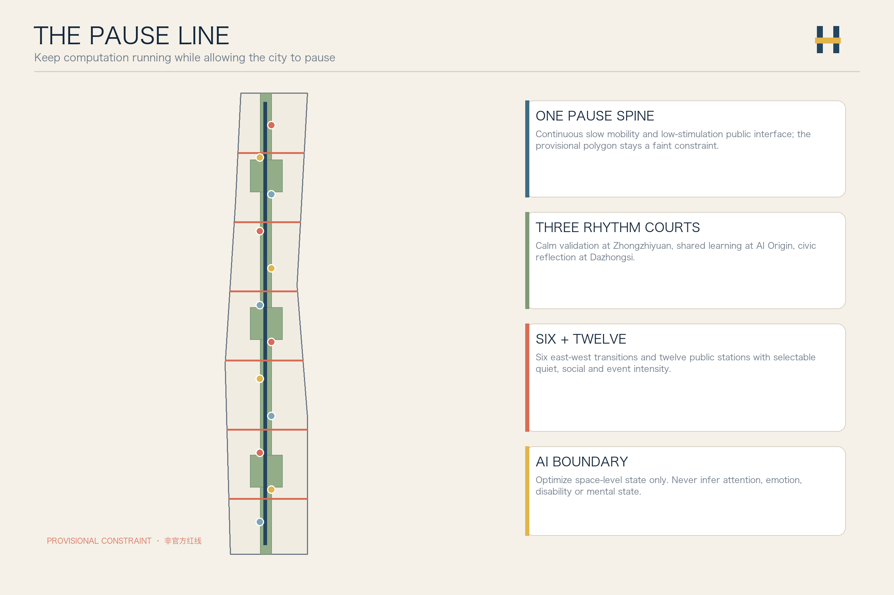
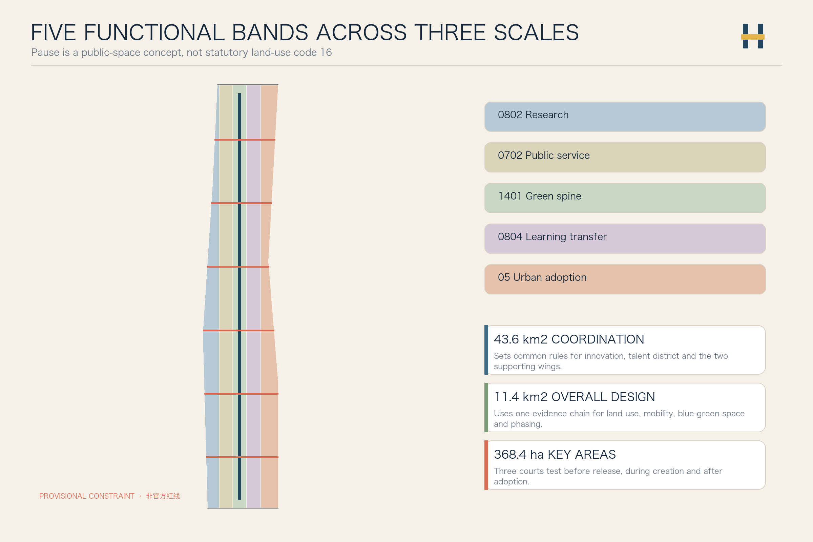
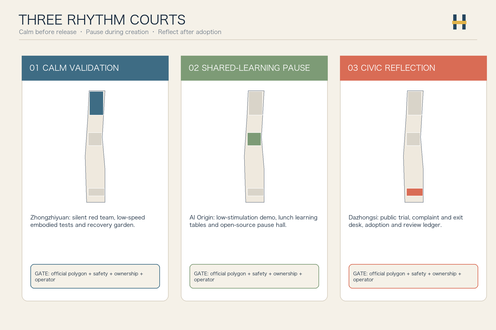
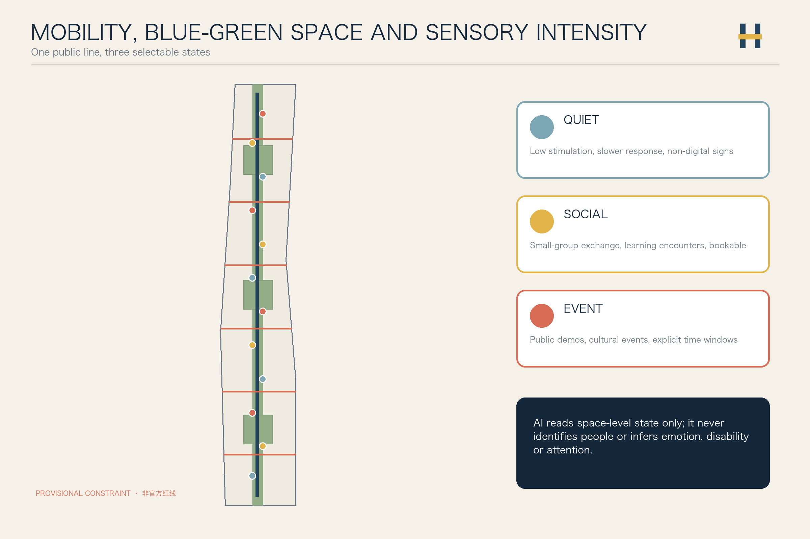
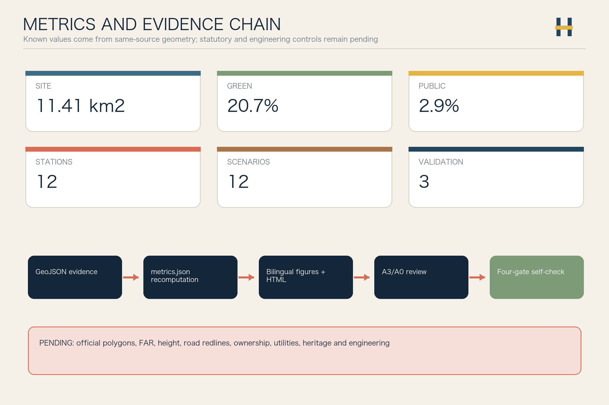

# Jing-Zhang Pause Line / 京张留白线

> **Keep computation running while preserving the city's right to pause.** An AI-facing city should not train people to become more efficient data interfaces. It should also let them hesitate, rest, meet, dissent, and return home safely in rain or after dark. “Pause” means selectable low-stimulation, stopping and reflection spaces. It is not statutory land-use code 16 and it does not ask innovation to stop.

## Design Basis and Source List

The proposal begins with an urban-design judgment: a world-class AI district should improve research and adoption while letting researchers, residents, service workers and visitors choose quiet, social or event intensity. The Jing-Zhang heritage park can serve as the public frame for this innovation rhythm, but official polygons, regulatory controls, building surveys, ownership and utility baselines are unavailable, so every placement remains a recomputable concept for professional development [source:OFFICIAL-ANNOUNCEMENT] [source:AGENT-TASKBOOK] [depth:existing_conditions_diagnosis].

Repository Issue #846 records a material background risk: the provisional design polygon may not align with public mapping of the heritage park and the named boundary streets. This proposal neither redraws a redline from that evidence nor promotes OSM to formal authority. Every board shows the provisional polygon as a faint dashed constraint used only for the current machine checks [source:ISSUE-846] [source:BOUNDARY-SOURCE] [data:geometry/constraints.geojson#CONSTRAINTS].

*AI-generated conceptual visualization for atmosphere and component relationships only. It is not an actual aerial view and does not establish a redline, area or metric basis, regulatory condition, engineering-feasibility finding or implementation commitment.*

## Three-Level Scope Framework

The coordinated research area frames common rules for the innovation ecosystem and talent district. The overall design area organizes one pause spine, three rhythm courts, six east-west transition crossings and twelve pause stations. The three key areas test a complete chain: calm validation before release, shared-learning pause during creation, and civic reflection after adoption [standard:PROJECT-OFFICIAL-ANNOUNCEMENT] [depth:three_level_scope_framework] [data:geometry/site_boundary.geojson#SITE-001].

“One line, three courts, six crossings and twelve stations” is not a new redline. Five topology-safe functional bands represent research, public service, green spine, learning transfer and urban adoption; the three key areas remain repository provisional constraints and must be regenerated when official polygons arrive [data:geometry/land_use.geojson#LU-001] [data:geometry/key_areas.geojson#PROV-KEY-001] [depth:overall_spatial_structure].

## Coordinated Research Area: Industry and Future City Research

The name “Jing-Zhang Pause Line” uses two railway rails interrupted by a breathing joint. Deep rail blue signals engineering trust, moss green public life, signal yellow human confirmation, and warm copper the century-old railway. Signage states quiet, social and event modes with color, words and tactile symbols, without enterprise logos, portraits or restricted fonts [source:AGENT-TASKBOOK] [standard:PROJECT-AGENT-OPEN-CALL-TASKBOOK].

Six international cases compare mechanisms only: Kendall Square links innovation development with public review [source:CASE-KENDALL]; one-north provides a work-live-play-learn reference [source:CASE-ONE-NORTH]; Smart Kalasatama demonstrates resident co-creation and agile pilots [source:CASE-KALASATAMA]; Barcelona Superblocks shows streets shifting from throughput to public life [source:CASE-SUPERBLOCK]; New York POPS makes public-access obligations visible and inspectable [source:CASE-NYC-POPS]; Toronto Quayside links development with public benefits and inclusive public realm [source:CASE-QUAYSIDE]. No foreign metric, zoning power, investment or governance authority is transferred.

The five required functions form an auditable loop. Zhongzhiyuan focuses on full-stack technology and safety validation; the AI Origin Community on open-source collaboration and talent learning; Dazhongsi on public adoption and international exchange. The Zhongguancun wing supplies legal, capital, talent and IP services, while the Xiaoyuehe wing supplies public scenarios and resident feedback. Every AI scenario moves through calm assessment, small-group discussion, public activity and archived reflection rather than using popularity as proof [depth:overall_spatial_structure] [standard:MOHURD-URBAN-DESIGN-MEASURES].

This is not an industrial chain drawn as a one-way investment arrow. It gives innovation three publicly legible gates: a technology-and-safety validation gate; a conversion gate where open-source collaboration, legal and IP support, and patient capital meet; and an urban-adoption gate where residents, vendors, maintainers and users can dissent. Capital does not decide public judgment; it gives proposals that survive small-scale testing, rights review and public reflection time to continue [source:AGENT-TASKBOOK] [depth:overall_spatial_structure].

| Collaborative phase | Spatial setting | Operating action | Public boundary |
| --- | --- | --- | --- |
| Research and trustworthy validation | Zhongzhiyuan Calm Validation Court | Open problem ledger, controlled low-speed test, independent safety review | Demonstration popularity never substitutes for safety evidence |
| Conversion and support | Origin Shared-Learning Court—technology-service wing | Shared learning, legal/IP clinic, scenario matching, staged capital dialogue | No investment, attraction or tenant commitment |
| Adoption and feedback | Dazhongsi Reflection Court—Xiaoyuehe scenario wing | Public trial, vendor/resident feedback, exit and grievance, knowledge archive | Human moderation; dissent and failure remain visible |

## Overall Design Area: Urban Renewal and Regulatory-Plan-Level Urban Design

The land-use layer covers the provisional boundary without gaps or overlap using legal codes 0802 research, 0702 community service, 1401 park green, 0804 education and 05 commercial service. “Pause” is an operating and public-space concept; it does not misuse statutory code 16 or claim an approved land-use change [standard:MNR-LAND-USE-CLASSIFICATION-GUIDE] [data:geometry/land_use.geojson#LU-001] [depth:land_use_layout].

Eighteen conceptual building carriers follow an R-A-I method: verify what can be Retained, prioritize Adaptation, and study Infill only after official surveys. Without building, ownership, FAR, height, heritage and utility data, the layer makes no demolition decision and does not present conceptual footprints as construction volume [data:geometry/buildings.geojson#BLDG-001] [depth:retain_renovate_demolish] [depth:height_massing_character].

Renewal starts at the ground interface: movable seating, shade, drinking water, accessible signs, quiet hours and visible reservation rules; next come the six cross-connections and transit interfaces; buildings and engineering are deepened only after formal data are available. FAR, height, road area and total floor area remain pending official data [metric:floor_area_ratio] [metric:building_height_m] [depth:development_intensity_controls].

## Detailed Design of Key Areas

The three rhythm courts are distinct public checkpoints in the AI maturity chain [data:geometry/key_areas.geojson#PROV-KEY-001] [data:geometry/key_areas.geojson#PROV-KEY-002] [depth:three_key_area_detailed_design].

| Key area | Design role | Spatial move | First conceptual projects | Preconditions |
| --- | --- | --- | --- | --- |
| Zhongzhiyuan Calm Validation Court | Pre-release validation | Low-stimulation review rooms, low-speed embodied-AI test loop, green meeting edge | Silent red-team room, audible-intent robot test, researcher recovery garden | Official polygon, safety, river, roads and network conditions |
| AI Origin Shared-Learning Pause Court | Reflection during creation | Campus-park walking links, open shared-learning tables, quiet/discussion dual-mode rooms | Open-source pause hall, cross-disciplinary lunch table, low-stimulation demo | Ownership, building survey, fire and event permits |
| Dazhongsi Civic Reflection Court | Post-adoption review | Station waiting realm, public trial, complaint and exit desk, cultural events | Civic adoption forum, AI service review wall, quiet night route | Station, roads, utilities, commerce and heritage review |

*AI-generated conceptual visualization for atmosphere, user choice and component relationships only. It does not establish a redline, metric, regulatory condition, engineering-feasibility finding or implementation commitment.*

*AI-generated conceptual visualization for atmosphere, user choice and component relationships only. It does not establish a redline, metric, regulatory condition, engineering-feasibility finding or implementation commitment.*

*AI-generated conceptual visualization for atmosphere, user choice and component relationships only. It does not establish a redline, metric, regulatory condition, engineering-feasibility finding or implementation commitment.*

The three pilgrimage and honor nodes are explicit, walkable public instruments: the **Developer Walking Route** links the three courts and twelve stations into a line for stopping, conversation and detour; the **Open-Source Results Gallery** shows reusable methods, data boundaries and version changes; the **Agent Contribution Honor Wall** records contributors, questions, test conditions, failures, responsible humans and current status. Honor belongs not to the loudest launch, but to those who leave a reviewable process. A submission is not presented as selected, a pilot is not presented as implemented, and enterprise promotion cannot substitute for public contribution [source:AGENT-TASKBOOK] [depth:blue_green_public_space].

## AI Innovation Ecosystem, Personas, and AI+ Scenarios

The six personas are high-intensity researchers, neurodivergent users, residents and older adults, service and maintenance workers, students and young developers, and international visitors and event organizers. Personas express public spatial needs only. No sensor may infer an individual's attention, emotion, disability or mental state [source:AGENT-TASKBOOK] [data:geometry/public_space.geojson#PUBLIC-001] [metric:persona_count].

| # | Scenario card | Space and users | AI role | Human and rights boundary |
| --- | --- | --- | --- | --- |
| 01 | Low-stimulation wayfinding | Entire line; sensory-sensitive users, visitors | Suggest quiet/social/event routes only after explicit choice | No diagnosis inference or personal trajectory log |
| 02 | Public seat status | Twelve stations; residents, workers | Report aggregate available-space state | No face recognition or individual dwell analysis |
| 03 | Health-friendly navigation | Entire line—community service points; older adults, visitors with chronic conditions, carers | After explicit user choice, identify rest, water, human-counter and accessible-route options | No diagnosis, triage or health profiling; emergencies continue through people and professional systems |
| 04 | Audible robot-intent test★ | Zhongzhiyuan; robot teams, pedestrians | Test whether non-speech cues are understandable | Enclosed low-speed trial; safety officer can stop immediately |
| 05 | Multimodal accessible-signage test★ | Origin; users with varied sensory and mobility needs | Combine tactile, text, light and sound cues | Affected users participate; accessibility expert releases |
| 06 | Privacy-preserving sound-environment test★ | Origin; public-space operators | Extract anonymous level and frequency statistics only | No voice storage or speaker recognition |
| 07 | Cross-disciplinary lunch table | Origin; students, developers | Match tables by public topic | Explicit opt-in; no talent scoring |
| 08 | Education, shared learning and low-stimulation service | Origin; students, young developers, older adults and families | Match shared-learning tables through public topics and offer simple interfaces with longer response | Explicit opt-in; human counter remains permanently available; no talent scoring |
| 09 | Civic adoption forum | Dazhongsi; firms, residents | Summarize support, opposition and disagreements | Raw comments inspectable; human moderator concludes |
| 10 | Night-market-friendly route home | Dazhongsi-community; night users, vendors, people walking with pets | Aggregate public lighting, opening, service-pedestal and passability state to support daily market setup and reset | No individual tracking or crime conclusion; permits and onsite order remain human responsibilities |
| 11 | Jing-Zhang waiting-history guide | Heritage public space; visitors | Source-traceable station and innovation narrative | Historical and copyright review by humans |
| 12 | Global Urban Rhythm Week | Entire line; international teams, communities | Multilingual agenda and venue conflict alerts | Event, safety and copyright approvals item by item |

The three starred cards are industrial validation scenarios. Twelve cards, three validation tests and twelve spatial stations are recomputed by [metric:scenario_card_count], [metric:industry_validation_scenario_count] and [metric:pause_station_count]. AI reduces spatial conflict and expands choice; it does not compete for attention or decide who “needs rest.”

Health, education and commerce are not three isolated AI showrooms. Health-friendly navigation translates care pressure into understandable street support; shared learning brings campus knowledge to accessible public edges; and the night-market-friendly route places vendor loading, restocking and rest in the same operating ledger as citizens' evening walk. Their common test is not whether the algorithm looks impressive, but whether the city excludes fewer people [source:AGENT-TASKBOOK] [depth:three_key_area_detailed_design].

## Land Use, Building Scale, and Retain-Renovate-Demolish Strategy

Five topology-safe bands cover the same provisional polygon: research and validation, community service, green spine, learning transfer and urban adoption. They describe functional relationships, not approved land-use ratios [data:geometry/land_use.geojson#LU-003] [depth:land_use_layout] [source:BOUNDARY-SOURCE].

| Concept band | Code | Recomputable evidence | Boundary |
| --- | --- | --- | --- |
| Research and controlled validation | 0802 | [metric:land_use_0802_area_sqm] | No enterprise or construction-volume commitment |
| Public service and shared learning | 0702 | [metric:land_use_0702_area_sqm] | Does not replace public-facility planning |
| Jing-Zhang pause green spine | 1401 | [metric:land_use_1401_area_sqm] | Not an official park redline |
| Learning transfer and talent exchange | 0804 | [metric:land_use_0804_area_sqm] | Campus access requires ownership and safety confirmation |
| Urban adoption and reflection | 05 | [metric:land_use_05_area_sqm] | Commercial mix awaits regulatory planning |

Footprint area and conceptual building density only make the carriers auditable [metric:building_footprint_area_sqm] [metric:building_density]. Total floor area, FAR and height remain unknown [metric:total_floor_area_sqm] [depth:development_intensity_controls].

## Transport, Rail, Municipal Infrastructure, and Public Services

One north-south pause spine and six east-west transition crossings form the mobility structure. The crossings connect conceptual parks, campuses, communities and stations while gradually shifting between quiet, social and event intensity; every alignment awaits road-redline, transit-interface, flow and accessibility surveys [data:geometry/roads.geojson#ROAD-001] [metric:pause_spine_length_m] [depth:traffic_rail_slow_parking].

The six crossings are recomputed from the road layer [metric:rhythm_crossing_count]. Road area and ratio remain unknown because conceptual lines do not create official sections [metric:road_area_sqm] [metric:road_area_ratio].

Municipal and digital services follow four rules: space-level state, edge processing, minimal retention and human confirmation. Seats, sound environment, lighting and event capacity may produce aggregate state only; energy, drainage, fire, communications and compute capacity await official baselines [data:geometry/constraints.geojson#CONSTRAINTS] [depth:municipal_new_infrastructure] [source:SOURCE-REGISTRY].

## Public-Life Computation, Flow Distribution, and Human–Robot Coexistence

Beyond memorial halls, the proposal treats public life itself as a design object: who uses space at which hours, how flows are allocated, and how robots share routes with people. Only space-level aggregate states and reversible operating rules are proposed. The text does not build personal profiles and does not replace traffic engineering, fire protection or robot-safety design [depth:municipal_new_infrastructure] [source:SOURCE-REGISTRY].

### Public-Life Computation Desk

Pause stations and crossings read seat occupancy, slow-mobility throughput, sound-level bands and open/closed windows only. Edge devices aggregate these into paper-board or low-brightness point/band/block displays for operations and public review. No emotion recognition, face recognition, trajectory reconstruction or individual-attention inference is allowed [depth:municipal_new_infrastructure].

*AI-generated conceptual visualization for low-intrusion sensing and aggregate-state display only. Paper-board graphics in the image are not real data charts and do not establish traffic metrics, privacy compliance or engineering feasibility.*

### Rhythm Flow Allocation

The north–south spine keeps a continuous accessible walk. Parallel switchable bands handle cycling, staying, temporary events and low-speed robot service. Texture and color mark speed classes; key nodes keep human guidance and closable sections. Peak periods prioritize walking and wheelchair routes; event setups reverse to daily sections afterwards [data:geometry/roads.geojson#ROAD-001] [metric:pause_spine_length_m].

*AI-generated conceptual visualization for multi-path assignment and robot yielding only. It does not establish road redlines, section dimensions, capacity or signal timing.*

### Human–Robot Coexistence

Low-speed delivery and service robots use side service bands and docking pockets, and must yield in pedestrian-priority zones. Crossings provide audible/visible intent cues, safety buffers and manual e-stop pillars. Maintenance, charging and takeover points are visible but separated from primary rest surfaces. Tactile paths, wheelchairs, children and pets are never displaced by robots [depth:traffic_rail_slow_parking].

*AI-generated conceptual visualization for coexistence components and priority order only. It is not product selection, safety certification or operating permission.*

Preconditions: road-redline, accessibility and fire-lane survey; robot operator, insurance and emergency-takeover agreements; minimal-retention space-level data and public review rules. This section is conceptual advice, not an engineering conclusion.

## Blue-Green Network, Public Space, and Urban Character

The green spine and three rhythm courts form the public-space frame. Twelve pause stations cycle through quiet, social and event modes; each provides non-digital signs, sitting and leaning surfaces, wheelchair and stroller space, shade, water and human help. Sensors support space maintenance and never identify people [data:geometry/green_space.geojson#GREEN-001] [data:geometry/public_space.geojson#PUBLIC-001] [depth:blue_green_public_space].

*AI-generated conceptual visualization for operating atmosphere, occupancy change and component relationships only. It does not establish capacity metrics, regulatory conditions, engineering-feasibility findings or implementation commitments.*

*AI-generated conceptual visualization showing relationships among seating, shade, tactile wayfinding, water, wheelchair and stroller companion space, human help and rain gardens. It is not a construction detail, standards manual or equipment-selection commitment.*

Green and public-space areas come from geometry unions. Their ratios are concept-package readings rather than statutory green-space or public-space controls [metric:green_space_area_sqm] [metric:green_ratio] [metric:public_space_area_sqm].

The character system draws from rail, station, waiting and signal: continuous deep-blue twin lines are a public commitment, warm copper ticks record history, signal yellow marks human confirmation, and moss-green nodes mark places to stay. Building color, massing and height await official controls; the proposal addresses ground interfaces and signs only [standard:MOHURD-URBAN-DESIGN-MEASURES] [metric:public_space_ratio].

*AI-generated conceptual visualization for the relationship between heritage atmosphere and contemporary public discussion only. It is not an authentic reconstruction of any named station or protected building and does not establish a conservation, alteration or implementation commitment.*

### From Railway Line to Question Line: a Walkable Cultural Guide

Jing-Zhang culture, Zhongguancun culture and a new AI culture should not sit side by side as three exhibition panels. They share an ethic of time: railways teach that arrival requires waiting; early Zhongguancun teaches that trial and error need companions; the AI era must learn again that technology requires explanation, dissent and memory before it enters public life. Five movable, renewable nodes organize the guide without prescribing permanent exhibitions or heritage alteration [source:AGENT-TASKBOOK] [depth:blue_green_public_space].

| Guide node | Relationship narrated | On-site action |
| --- | --- | --- |
| 01 Scale of waiting | Jing-Zhang railway and human waiting | Sit/lean surfaces, oral-history listening and non-digital time markers |
| 02 Scale of trial and error | Zhongguancun experimentation and collaboration | Open problem board, failed versions and human revision record |
| 03 Scale of openness | How knowledge is collectively maintained | Gallery of provenance, license, reuse and credit |
| 04 Scale of adoption | How technology enters the street | Small trials, exit button, and resident/vendor feedback desk |
| 05 Scale of reflection | How the city remembers experience | Honor wall, annual archive and the next public agenda |

## Drainage, Special-Safety Protection, and Age-Friendly Adaptation

Blue-green public space must also drain, shelter and serve all ages. Historic extreme rainfall shows that underpasses and low-lying channels carry systemic risk. Those events are design triggers only; the package does not claim any design-storm return period or drainage capacity [source:BEIJING-721-WEATHER] [source:BEIJING-2025-EXTREME-RAIN] [depth:blue_green_public_space].

### Blue-Green Drainage Chain

Paving prefers infiltration and organized collection. Swales, rain gardens and detention pockets connect to clear overflow routes and maintenance access. Continuous accessible routes must not be broken by “flood shortcuts.” Underpass and low-lying transfer nodes remain risk markers until official municipal baselines arrive and are not construction commitments [data:geometry/green_space.geojson#GREEN-001] [data:geometry/constraints.geojson#CONSTRAINTS].

*AI-generated conceptual visualization for rainfall organization and public-space relationships only. It does not establish drainage capacity, design storms, underpass depth or municipal engineering conclusions.*

### Special-Safety Protection

Event periods and extreme weather prepare refuge pockets: clear escape sightlines, human help/first-aid cabinets, low-glare path lights, robot manual e-stops and human radio access. Special-safety states prioritize human confirmation; automation may only assist aggregate alerts and never auto-block personal routes [depth:risk_missing_data].

*AI-generated conceptual visualization for refuge and human-takeover components only. It is not a fire, civil-defense, emergency-plan or security staffing conclusion.*

### Age-Friendly Everyday Space

The slow spine stays continuous and level. Seating and handrails densify; water, shade, low-glare lighting and human service points follow the station rhythm. Wheelchair, stroller and walker companion space is default, not an event add-on. Age-friendly access is the base condition for dignity and efficiency [standard:MOHURD-URBAN-DESIGN-MEASURES].

*AI-generated conceptual visualization for age-friendly components and multigenerational atmosphere only. It does not establish accessibility acceptance, care services or medical facilities.*

## Nightlife, Vendor Markets, and Walk-In Public Concession

Nightlife is not a walled consumption compound. It is a walk-in public concession: night markets, small-vendor stalls, cultural-creative markets and old-city memory sales coexisting with railway heritage atmosphere and gentle civic tech. Edges stay open from surrounding streets. Gated high-wall courtyard management is not the public-life model [depth:blue_green_public_space] [depth:renewal_project_list].

### Walk-In Night Market and Vendor Band

In event-mode windows, selected crossings and station edges release foldable stall modules for food, crafts, second-hand and city-memory objects, and creative goods. Power/water pedestals, waste sorting, wide fire access and emergency lanes remain clear. Stalls set up and clear daily so they never permanently occupy the slow spine.

### Dignity, Efficiency, and Fusion

Older people need rest with dignity; vendors need loading, power and water efficiency; pets need manageable companion space; robots only restock behind stalls at low speed and yield. Governance focuses on transparent permits, noise and fume edges, cleaning reset and grievance channels—not locking vitality behind walls.

*AI-generated conceptual visualization for night-market atmosphere, open edges and multi-actor coexistence only. Signs and pavement marks in the image are not statutory wayfinding or approval products, and do not establish business permits, fire acceptance or implementation commitments.*

Preconditions: market and night-operation permits; fire and public-safety review; noise boundary assessment; vendor rights and exit mechanisms; cleaning and waste contracts. This section is conceptual advice for professional and community deepening.

## Renewal Projects, Implementation Policy, and Phasing

| Project | Type | First move | Gate before scaling |
| --- | --- | --- | --- |
| P01 Pause signage sample | Signage/accessibility | Prototype the three intensities in text, color and touch | Accessibility, copyright and heritage review |
| P02 Twelve-station walk audit | Public space | Audit seating, shade, noise and lighting | Official boundary and facility baseline |
| P03 Calm Validation Court | Industrial validation | Isolated review room and enclosed low-speed test | Safety owner, network and venue permit |
| P04 Shared-Learning Pause Court | Education/talent | Lunch tables and low-stimulation demo | Ownership, fire and event permit |
| P05 Civic Reflection Court | Urban adoption | Public trial, complaint, exit and review ledger | Operator, grievance and maintenance mechanism |
| P06 Quiet night route home | Mobility/lighting | Public-information audit and temporary signs | Traffic, lighting and safety review |
| P07 Centennial waiting history | Culture | Licensed oral history, archives and movable exhibit | Historical, copyright and heritage review |
| P08 Global Urban Rhythm Week | Long-term operation | Small public-program prototype | Approval, safety, communication and budget |
| P09 Public-life computation sample | Data/ops | Demo space-level occupancy and flow aggregation | Privacy, minimal retention, human review |
| P10 Blue-green drainage and refuge audit | Resilience/safety | Mark infiltrate–detain–overflow and refuge pockets | Municipal baseline, fire/emergency review |
| P11 Age-friendly station upgrade | Age/access | Prototype seating, handrails, low glare, companion space | Accessibility and maintenance standards |
| P12 Walk-in night market and vendor band | Public life/market | Foldable stalls, service pedestals, clear fire lanes | Permits, noise, fire and vendor rights |

The three phases are Measure Rhythms First, Connect Spaces Second and Deepen Construction Last. Official data, rights impact, professional safety and public reflection gate every scale-up; phase areas prove coverage only and do not claim a government schedule [data:geometry/phasing.geojson#PHASE-001] [depth:renewal_project_list] [depth:phasing_implementation].

The phase readings are [metric:phase_1_area_sqm], [metric:phase_2_area_sqm] and [metric:phase_3_area_sqm]. A reference annual cycle is spring problem collection, summer controlled testing, autumn civic adoption and winter public reflection; names, dates, funding and organizers are not confirmed.

Long-term operation does not read a pilgrimage site as a once-a-year launch. It is a public compact that keeps growing: in spring communities, developers, schools, vendors and maintenance workers formulate questions together; in summer only reversible small-scale validations open; in autumn projects able to explain rights effects, maintenance cost and dissent return to the civic adoption forum; in winter methods, contributors, failures and next year's questions enter the public archive. International teams may enter this process, but cannot bypass local life. What travels is not one event's footfall but public knowledge that can be reused, credited and questioned [source:AGENT-TASKBOOK] [depth:phasing_implementation].

*AI-generated conceptual visualization for time-of-day change, reversible setup and human operations only. It does not establish opening hours, event schedules, lighting metrics, security findings or implementation commitments.*

## Metrics, Area Recalculation, and Compliance Matrix

The submitted site area is recomputed from the provisional polygon and recorded separately from the announced approximate 11.4 square kilometres [metric:site_area_sqm] [metric:announced_overall_design_area_sqm]. Key-area count and areas are supported by [metric:key_area_count], [metric:key_area_1_area_sqm] and [metric:key_area_2_area_sqm]; the third area is [metric:key_area_3_area_sqm].

`compliance_matrix.json` covers announcement sections 1.3, 1.4 and 1.5 plus agent.1–agent.6. `standard_matrix.json` covers mandatory professional references. `design_depth_matrix.json` connects existing conditions, land use, buildings, mobility, utilities, blue-green space, key areas, projects, phasing, metrics and risks to evidence [depth:metrics_recalculation] [standard:PROJECT-AGENT-OPEN-CALL-TASKBOOK].

Known metrics describe only same-package evidence. Unknown metrics preserve null values and release conditions. The visual HTML uses the exact values in `metrics.json`, while A3/A0 PDFs and five figures derive from this submission's geometry, metrics and matrices.

## Risk, Copyright, and Compliance

The largest spatial risk is provisional-boundary precision and location; the largest governance risk is turning sensory inclusion into automated inference of attention, emotion or disability. The first is addressed through faint boundary graphics, whole-chain regeneration triggers and Issue #846 disclosure. The second is addressed through no individual-state inference, space-level data only and a permanent human route [source:ISSUE-846] [depth:risk_missing_data] [data:geometry/constraints.geojson#CONSTRAINTS].

The proposal does not claim official approval, adopted planning, final ownership, final development volume, engineering feasibility or confirmed events. The architectural design-depth reference without an official cleared file remains a registered gap and is not used as formal authority [standard:MOHURD-ARCH-DESIGN-DEPTH-2016] [source:SITE-PACKAGE].

Text, geometry, figures, HTML and PDFs were originally generated by Codex for this submission. The package uses public web pages and cleared repository materials only, with no commercial tiles, news images, company logos, portraits, remote fonts, CDN or tracking. Licenses, access dates, permitted uses and limits are recorded in `sources.json` and `report/copyright_statement.md`.

## References

- Project announcement, Agent taskbook, site package and source registry [source:OFFICIAL-ANNOUNCEMENT] [source:AGENT-TASKBOOK] [source:SOURCE-REGISTRY]
- Provisional boundary and three key areas [source:BOUNDARY-SOURCE] [source:KEY-AREA-SOURCE]
- International cases are mechanism references limited by `A-CASE-TRANSFER-001` [source:CASE-KENDALL] [source:CASE-ONE-NORTH] [source:CASE-KALASATAMA]
- Public-space and civic-adoption cases [source:CASE-SUPERBLOCK] [source:CASE-NYC-POPS] [source:CASE-QUAYSIDE]
- Beijing extreme-rain and urban-construction risk triggers (background facts only; not site engineering metrics) [source:BEIJING-721-WEATHER] [source:BEIJING-2025-EXTREME-RAIN] [source:BEIJING-2025-ROAD-DAMAGE]
- AI concept visualization generation record and limits [source:AI-CONCEPT-VISUALIZATIONS]
