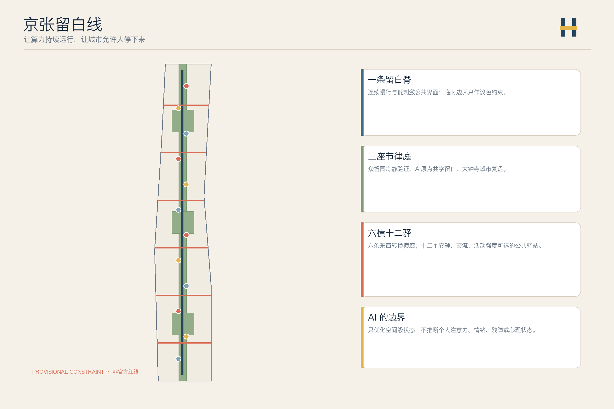
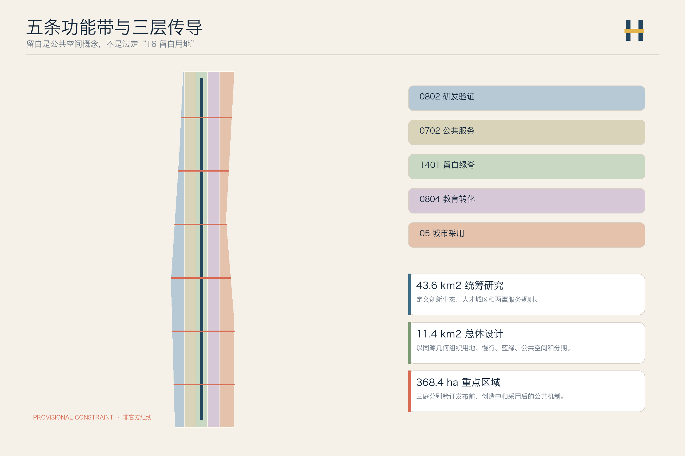
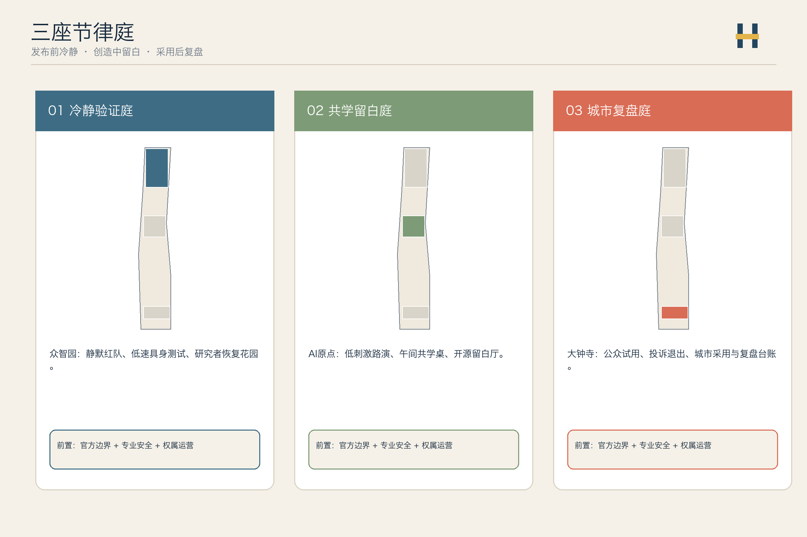
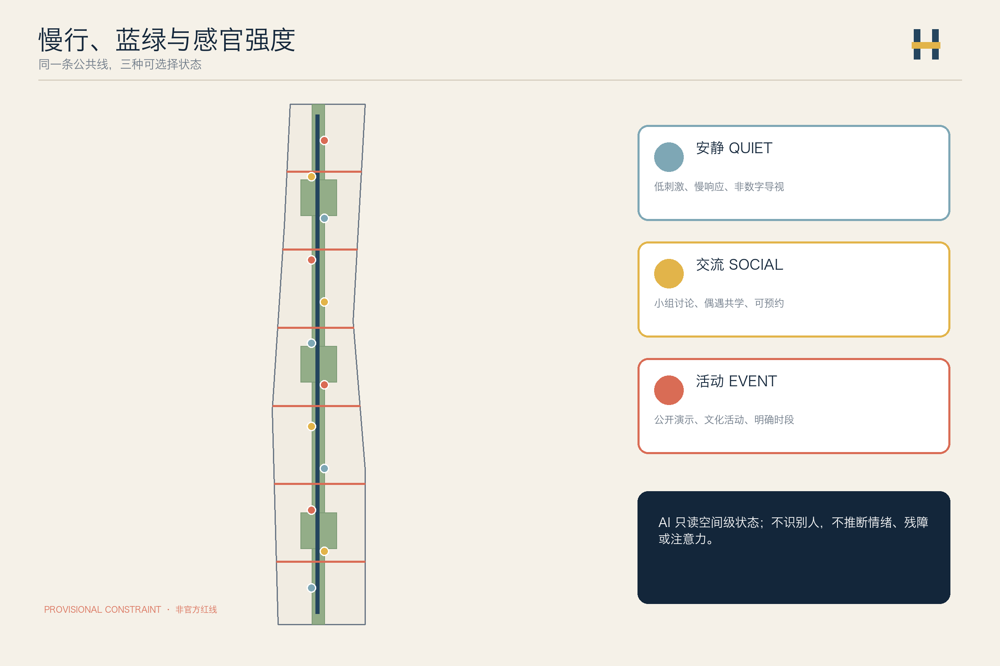
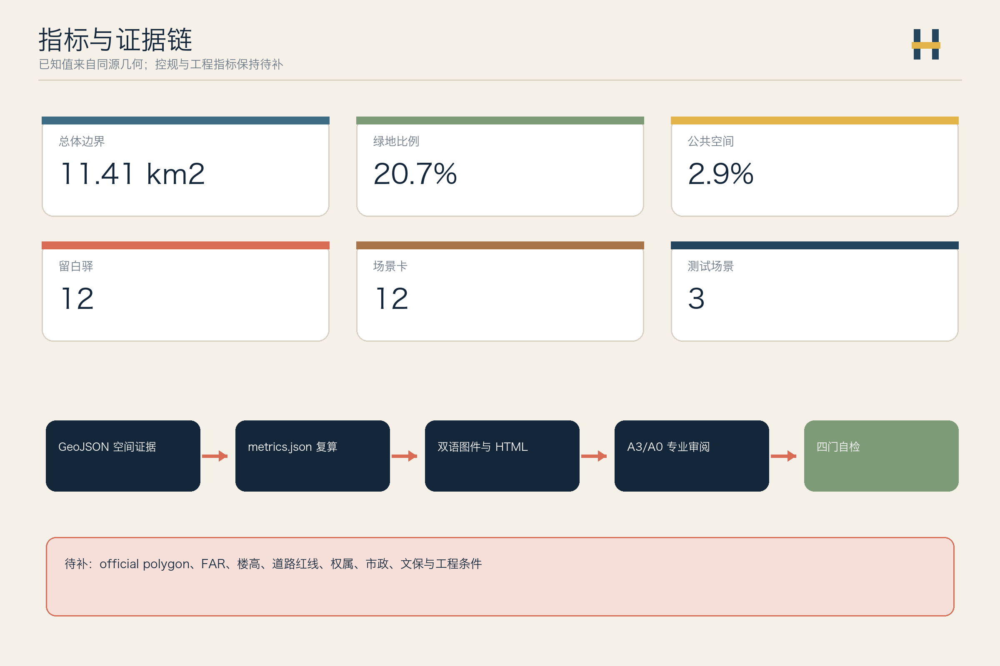

# 京张留白线 / THE PAUSE LINE

> **让算力持续运行，让城市仍有权停下来。** 一座面向 AI 的城市，不应只把人训练成更高效的数据接口；它也应允许人犹豫、休息、相遇、提出反对意见，并在雨天和深夜仍然安全地回家。这里的“留白”是可选择的低刺激、停驻与复盘空间，不是国土空间分类中的“16 留白用地”，也不是让城市停止创新。

## 设计依据与资料清单

本方案从一个城市设计判断出发：世界级 AI 创新城区不仅要提高研发与转化效率，还要让研究者、居民、服务人员和访客能自主选择安静、交流或活动的强度。京张遗址公园适合作为这种“创新节律”的公共骨架，但当前仓库没有官方精确红线、重点区 polygon、控规、建筑、权属和市政底数，因此所有落位都是可复算的概念建议 [source:OFFICIAL-ANNOUNCEMENT] [source:AGENT-TASKBOOK] [depth:existing_conditions_diagnosis]。

仓库 Issue #846 提供了一个必须直面的背景风险：临时总体边界与公开测绘的遗址公园和公告点名道路可能存在错位。方案不据此另造红线，也不把 OSM 升级为 formal 依据；所有图面把 provisional polygon 画成淡色虚线，只用它约束本次机器校验 [source:ISSUE-846] [source:BOUNDARY-SOURCE] [data:geometry/constraints.geojson#CONSTRAINTS]。

*AI 生成概念愿景图，仅用于表达总体氛围与空间构件关系；不是场地真实航拍，也不构成红线、面积或指标依据、法定条件、工程可行性结论或实施承诺。*

## 三层范围工作框架

统筹研究范围讨论创新生态与人才城区的共同规则；总体设计范围组织一条留白慢行主线、三座节律庭、六条东西转换横廊和十二个留白驿；三处重点区分别验证“发布前冷静验证—创造中共学留白—采用后公共复盘”的完整链条 [standard:PROJECT-OFFICIAL-ANNOUNCEMENT] [depth:three_level_scope_framework] [data:geometry/site_boundary.geojson#SITE-001]。

“一线三庭六横十二驿”不是新红线。用地以五条共享边界的纵向功能带表达研发、公共服务、绿脊、教育转化和城市采用；重点区仍采用仓库的三处 provisional constraint，官方 polygon 到位后必须整链重算 [data:geometry/land_use.geojson#LU-001] [data:geometry/key_areas.geojson#PROV-KEY-001] [depth:overall_spatial_structure]。

## 统筹研究范围产业与未来城市研究

“京张留白线 / THE PAUSE LINE”的品牌符号由两条平行铁路和中间一段呼吸缝组成：深轨蓝表示工程可信，苔绿表示公共生活，信号黄表示人工确认，暖铜表示百年京张。品牌不借用企业 Logo、人物肖像或受限字体；导视把“安静 / 交流 / 活动”三种空间状态同时用颜色、文字和触觉符号表达 [source:AGENT-TASKBOOK] [standard:PROJECT-AGENT-OPEN-CALL-TASKBOOK]。

六个外部案例只用于比较机制，不转移指标或治理权限：Kendall Square 用于观察创新项目与公共审议的并置 [source:CASE-KENDALL]；one-north 用于比较 work-live-play-learn 复合机制 [source:CASE-ONE-NORTH]；Smart Kalasatama 用于比较居民共创与短周期试验 [source:CASE-KALASATAMA]；Barcelona Superblocks 用于比较街道空间从通行向停驻转化 [source:CASE-SUPERBLOCK]；纽约 POPS 用于比较公共可达义务如何被看见和检查 [source:CASE-NYC-POPS]；Toronto Quayside 用于比较公共利益和包容性公共空间的交付边界 [source:CASE-QUAYSIDE]。

五大功能被转译为一条可审计回路：众智园负责全栈技术与安全验证，AI 原点社区负责开源协作与人才共学，大钟寺负责城市采用与国际交流；中关村科技服务翼提供法律、资本、人才和知识产权服务，小月河场景赋能翼提供公共场景和居民反馈。每次 AI 场景从研发走向公共空间前，都要经过“安静评估—小范围交流—公开活动—复盘归档”四步，不以热度代替有效性 [depth:overall_spatial_structure] [standard:MOHURD-URBAN-DESIGN-MEASURES]。

这不是把产业链画成一条单向的招商箭头，而是给创新设置三道可被公众看见的“门”：第一道是技术与安全的验证门，第二道是开源协作、法律、知识产权与耐心资本共同参与的转化门，第三道是居民、商贩、维护者和使用者能够提出异议的城市采用门。资本在这里不是替公共判断作决定，而是为经得起小规模验证、权利审查和公开复盘的方案提供继续试验的耐心 [source:AGENT-TASKBOOK] [depth:overall_spatial_structure]。

| 协同环节 | 空间落点 | 运营动作 | 公共边界 |
| --- | --- | --- | --- |
| 研究与可信验证 | 众智园冷静验证庭 | 开源问题清单、受控慢速测试、独立安全复核 | 不以演示热度替代安全证据 |
| 转化与服务 | 原点共学庭—科技服务翼 | 共学、法务/IP 门诊、场景需求对接、阶段性资本沟通 | 不承诺投资、招商或企业入驻 |
| 采用与回馈 | 大钟寺复盘庭—小月河场景翼 | 公众试用、摊贩/居民反馈、退出与申诉、知识归档 | 人工主持，保留反对意见和失败记录 |

## 总体设计范围城市更新与控规深度城市设计

用地层采用 0802 科研、0702 社区服务、1401 公园绿地、0804 教育和 05 商业服务五类合法代码完整覆盖临时边界。这里的“留白”是公共空间和运营概念，绝不冒充“16 留白用地”或法定用地调整 [standard:MNR-LAND-USE-CLASSIFICATION-GUIDE] [data:geometry/land_use.geojson#LU-001] [depth:land_use_layout]。

建筑层布置十八个“可适应更新载体”，统一采用“先核实保留、再适应性改造、最后才研究增建”的 R-A-I 方法。由于没有现状建筑、权属、容积率、楼高、文保和市政条件，图层不做具体拆除决定，也不把概念基底当成建设规模 [data:geometry/buildings.geojson#BLDG-001] [depth:retain_renovate_demolish] [depth:height_massing_character]。

城市更新优先改造地面接口：先做可移动座椅、遮阴、饮水、无障碍导视、安静时段和公开预约规则；再校核六条东西横廊与轨道接驳；最后才在正式数据齐备后深化建筑和工程。容积率、建筑高度、道路面积和总建筑面积保持待正式数据补齐 [metric:floor_area_ratio] [metric:building_height_m] [depth:development_intensity_controls]。

## 重点区域详细设计

三座节律庭不是同一种展示园，而是 AI 成熟链上的三个不同公共检查点 [data:geometry/key_areas.geojson#PROV-KEY-001] [data:geometry/key_areas.geojson#PROV-KEY-002] [depth:three_key_area_detailed_design]。

| 重点区 | 设计角色 | 空间动作 | 首批概念项目 | 深化前置条件 |
| --- | --- | --- | --- | --- |
| 众智园“冷静验证庭” | 发布前验证 | 低刺激评审室、具身设备慢速测试环、清河绿色会谈界面 | 静默红队室、机器人可听意图测试、研究者恢复花园 | official polygon、安全、河道、道路、网络条件 |
| AI 原点“共学留白庭” | 创造中交流 | 校园—园区步行缝合、无预约共学桌、安静/讨论双模式空间 | 开源留白厅、跨学科午间桌、低刺激路演 | 校园权属、建筑现状、活动与消防条件 |
| 大钟寺“城市复盘庭” | 采用后复盘 | 站城等候空间、公众试用、投诉与退出窗口、文化活动 | 城市采用会、AI 服务复盘墙、夜间安静回家线 | 站点、道路、市政、商业和文保复核 |

*AI 生成概念愿景图，仅用于表达氛围、使用选择与构件关系；不构成红线、指标、法定条件、工程可行性结论或实施承诺。*

*AI 生成概念愿景图，仅用于表达氛围、使用选择与构件关系；不构成红线、指标、法定条件、工程可行性结论或实施承诺。*

*AI 生成概念愿景图，仅用于表达氛围、使用选择与构件关系；不构成红线、指标、法定条件、工程可行性结论或实施承诺。*

三处朝圣与荣誉节点被明确为可被步行抵达、也可被日常使用的公共装置：**开发者散步道**把三庭和十二驿串为一条可停、可谈、可绕行的慢行线；**开源成果展示廊**呈现可复用的方法、数据边界和版本变化；**智能体贡献荣誉墙**记录贡献者、问题、试验条件、失败记录、人工负责人和当前状态。荣誉不属于最响亮的发布，而属于愿意留下可复核过程的人；投稿不写成入选，试验不写成落地，企业宣传也不能替代公共贡献 [source:AGENT-TASKBOOK] [depth:blue_green_public_space]。

## AI 创新生态、人才画像与 AI+ 场景

六类画像是高强度研发人员、神经多样性使用者、周边居民与长者、服务与维护人员、学生与青年开发者、国际访客与活动组织者。画像只描述公开的空间需求；任何传感器都不得推断个人注意力、情绪、残障或心理状态 [source:AGENT-TASKBOOK] [data:geometry/public_space.geojson#PUBLIC-001] [metric:persona_count]。

| # | 场景卡 | 空间与对象 | AI 作用 | 人工与权利边界 |
| --- | --- | --- | --- | --- |
| 01 | 低刺激寻路 | 全线；感官敏感者、访客 | 按用户主动选择推荐安静/交流/活动路线 | 不推断诊断，不记录个人轨迹 |
| 02 | 公共座席状态 | 十二驿；居民、服务人员 | 只统计空间级空闲状态 | 不做人脸和个体停留分析 |
| 03 | 医疗友好健康导航 | 全线—社区服务点；长者、慢病访客、照护者 | 在用户主动选择后提示可坐可歇、饮水、人工窗口与无障碍路径 | 不作诊断、分诊或健康画像；紧急情况由人工服务与专业体系接续 |
| 04 | 机器人可听意图测试★ | 众智园；机器人团队、行人 | 测试非语音提示是否清楚 | 封闭低速、现场安全员可立即停止 |
| 05 | 无障碍多模态导视测试★ | 原点；视听行动差异用户 | 组合触觉、文字、灯光和声音提示 | 当事人参与评审，专业顾问放行 |
| 06 | 隐私保持声环境测试★ | 原点；公共空间运营者 | 仅提取匿名声级/频段统计 | 不保存语音，不做说话人识别 |
| 07 | 午间跨学科偶遇桌 | 原点；师生、开发者 | 按公开主题匹配活动桌 | 明示自愿，不做人才评分 |
| 08 | 教育共学与低刺激服务 | 原点；学生、青年开发者、长者家庭 | 用公开主题匹配共学桌，并提供简化界面和延长响应 | 明示自愿；人工窗口长期保留，不作人才评分 |
| 09 | 城市采用会 | 大钟寺；企业、居民 | 汇总支持、反对和分歧主题 | 原始意见可查，人工主持结论 |
| 10 | 夜市友好回家线 | 大钟寺—社区；夜行者、摊贩、宠物同行者 | 汇总公开照明、开放、服务柱与可通行状态，协助夜市日装夜收 | 不实时追踪个人，不作治安结论；经营许可和现场秩序由人工负责 |
| 11 | 京张等候史导览 | 遗址公共空间；访客 | 溯源讲述车站、等候与创新史 | 史实和版权人工校核 |
| 12 | 全球城市节律周 | 全线；国际团队、社区 | 多语议程与场地冲突提醒 | 活动、安保、版权逐项审批 |

带 ★ 的三项为产业测试验证场景；十二张场景卡、三项测试和十二个空间节点分别由 [metric:scenario_card_count]、[metric:industry_validation_scenario_count]、[metric:pause_station_count] 复核。AI 的作用是减少空间冲突和提高可选择性，不是争夺注意力或自动判断谁“需要休息”。

医疗、教育与商业并非三套彼此隔绝的“AI 展厅”：医疗友好导航把照护压力转化为可理解的街道支持，教育共学把校园知识带到可进入的公共边缘，夜市友好回家线则让小商贩的装卸、补货、休息和市民的夜间步行在同一张秩序表里被照顾。三者共同检验的不是算法有多炫目，而是城市是否因此更少排斥人 [source:AGENT-TASKBOOK] [depth:three_key_area_detailed_design]。

## 用地、建筑规模与拆改留方案

五条功能带的面积从同一临时边界拓扑分割，完整覆盖且无重叠：科研与验证、社区服务、绿脊、教育转化、城市采用。它们表达功能关系，不是已批用地比例 [data:geometry/land_use.geojson#LU-003] [depth:land_use_layout] [source:BOUNDARY-SOURCE]。

| 概念功能带 | 代码 | 可复算面积证据 | 使用边界 |
| --- | --- | --- | --- |
| 研发与受控验证带 | 0802 | [metric:land_use_0802_area_sqm] | 不承诺企业或建设量 |
| 公共服务与共学带 | 0702 | [metric:land_use_0702_area_sqm] | 不替代公共设施专项规划 |
| 京张留白绿脊 | 1401 | [metric:land_use_1401_area_sqm] | 不等于 official 公园红线 |
| 教育转化与人才交流带 | 0804 | [metric:land_use_0804_area_sqm] | 校园开放需权属和安全确认 |
| 城市采用与复盘带 | 05 | [metric:land_use_05_area_sqm] | 商业业态和比例待控规确认 |

建筑基底面积和概念建筑密度只用于检查设计载体是否可审查 [metric:building_footprint_area_sqm] [metric:building_density]。总建筑面积、容积率和楼高继续保持未知 [metric:total_floor_area_sqm] [depth:development_intensity_controls]。

## 交通、轨道、市政与公共服务设施

交通结构由一条南北留白慢行主线和六条东西转换横廊组成。横廊把园区、校园、社区和站点的概念联系接入主线，并把空间状态从安静逐步转换为交流和活动；所有线位均待道路红线、轨道接口、流量和无障碍现场核查 [data:geometry/roads.geojson#ROAD-001] [metric:pause_spine_length_m] [depth:traffic_rail_slow_parking]。

六条横廊数量可从道路图层复核 [metric:rhythm_crossing_count]。道路面积和道路比例不因概念线位而伪造，继续列为未知 [metric:road_area_sqm] [metric:road_area_ratio]。

市政与数字设施采用“空间级状态、边缘计算、最小保存、人工确认”四条规则。座席、声环境、照明和活动容量只能产生聚合状态；能源、排水、消防、通信和算力容量必须等待正式底数 [data:geometry/constraints.geojson#CONSTRAINTS] [depth:municipal_new_infrastructure] [source:SOURCE-REGISTRY]。

## 公共生活计算、流量分配与人机共居专题

除纪念性公共场馆外，本方案把“公共生活本身”作为可设计对象：谁在什么时段使用空间、流量如何被分配、机器人与人如何同路。设计只处理空间级聚合状态与可逆运营规则，不建立个人画像，也不替代交通工程、消防或机器人安全专业设计 [depth:municipal_new_infrastructure] [source:SOURCE-REGISTRY]。

### 公共生活计算台

留白驿与横廊只读取座位占用、慢行通过量、声环境区间和时段开闭状态，在边缘设备完成聚合后显示为点、带、色块式的纸板/低亮屏状态，供运维与公众复盘。不做情绪识别、人脸识别、轨迹还原或个体注意力推断 [depth:municipal_new_infrastructure]。

*AI 生成概念愿景图，仅用于表达低侵入监测与聚合状态展示的关系；画面中的纸板图不是真实数据图，也不构成流量指标、隐私合规或工程可行性结论。*

### 节律流量分配

南北主脊保留连续无障碍慢行；平行布置可切换的骑行、停驻、临时活动与低速机器人服务带。铺装纹理和色彩区分速度级，关键节点保留人工引导与可关闭断面。高峰时优先步行与轮椅通道，活动结束后恢复日常断面 [data:geometry/roads.geojson#ROAD-001] [metric:pause_spine_length_m]。

*AI 生成概念愿景图，仅用于表达多路径分工与人机让行关系；不构成道路红线、断面尺寸、通行能力或信号配时结论。*

### 人机共居适配

低速配送与服务机器人走侧向服务带与停靠口袋，进入人行优先区必须让行。交叉点设置可听/可见意图提示、安全缓冲与人工急停柱；维护舱、充电口和接管点对公众可见但与主要休息面分离。盲道、轮椅、儿童与宠物路径不被机器人占用 [depth:traffic_rail_slow_parking]。

*AI 生成概念愿景图，仅用于表达人机共居构件与优先序；不是机器人产品选型、安全认证或运营许可。*

前置条件：道路红线、无障碍与消防通道现场核查；机器人运营主体、保险与应急接管协议；空间级数据最小保存与公开复盘制度。本专题是概念建议，不是工程结论。

## 蓝绿空间、公共空间与城市风貌

留白绿脊和三座节律庭构成公共空间主骨架。十二个留白驿按“安静 / 交流 / 活动”三种模式循环布置，每个驿都同时提供非数字导视、可坐可倚界面、轮椅与推车停靠、遮阴饮水和人工求助点；传感器只服务空间运维，不识别人 [data:geometry/green_space.geojson#GREEN-001] [data:geometry/public_space.geojson#PUBLIC-001] [depth:blue_green_public_space]。

*AI 生成概念愿景图，仅用于表达运营氛围、人数变化与构件关系；不构成容量指标、法定条件、工程可行性结论或实施承诺。*

*AI 生成概念愿景图，仅用于表达座椅、遮阴、触觉导视、饮水、轮椅与推车伴随空间、人工求助点及雨水花园的关系；不是施工详图、规范图集或设备选型承诺。*

绿地和公共空间面积来自各自图层的 union，比例只是本次概念方案读数，不是法定绿地率或公共空间指标 [metric:green_space_area_sqm] [metric:green_ratio] [metric:public_space_area_sqm]。

城市风貌从铁路的“轨、站、等候、信号”提取语法：连续深蓝双线是公共承诺，暖铜短线记录历史，信号黄表示需要人工确认，苔绿节点表示可停驻的公共生活。建筑色彩、体量和高度待正式控制条件确认，本方案只提出地面界面和导视方向 [standard:MOHURD-URBAN-DESIGN-MEASURES] [metric:public_space_ratio]。

*AI 生成概念愿景图，仅用于表达遗产氛围与当代公共讨论的关系；不是对任何具名车站或文保建筑的真实性复原，也不构成保护、改造或实施承诺。*

### 从铁路线到问题线：一条可步行的文化导览

京张文化、中关村文化和 AI 新文化不应被并排陈列成三段展板。它们共享的是一种时间伦理：铁路教人理解抵达需要等待，早期中关村教人理解试错需要同行，AI 时代则必须重新学习——技术进入公共生活之前，需要能够被解释、质疑和记忆。导览以五个可移动、可更新的节点组织，不预设固定展陈或文保改造 [source:AGENT-TASKBOOK] [depth:blue_green_public_space]。

| 导览节点 | 讲述的关系 | 现场动作 |
| --- | --- | --- |
| 01 等候的尺度 | 京张铁路与人的等待 | 可坐可倚、口述史聆听、非数字时间标记 |
| 02 试错的尺度 | 中关村的实验与协作 | 开放问题板、失败版本与人工修订记录 |
| 03 开源的尺度 | 知识如何被共同维护 | 展示廊中的来源、许可、复用和署名 |
| 04 采用的尺度 | 技术如何进入街区 | 小规模试用、退出按钮、居民与商贩意见台 |
| 05 复盘的尺度 | 城市如何记住经验 | 荣誉墙、年度档案与下一轮公共议题 |

## 雨洪排水、安全防护与适老化专题

蓝绿公共空间同时承担排水、避险与全龄友好职责。历史极端降雨表明，下凹桥区与低洼通道在城市安全中具有系统性风险，本案只把其作为设计触发器，不宣称已满足任一设计暴雨重现期或排涝标准 [source:BEIJING-721-WEATHER] [source:BEIJING-2025-EXTREME-RAIN] [depth:blue_green_public_space]。

### 蓝绿排水链

铺装优先渗水与有组织汇流；浅沟、雨水花园、滞蓄口袋串联，并保留清晰溢流路径与维护通道。连续无障碍路线不得被积水“捷径”打断；下穿与低洼转换节点在正式市政底数到位前仅作为风险标记，不进入建设承诺 [data:geometry/green_space.geojson#GREEN-001] [data:geometry/constraints.geojson#CONSTRAINTS]。

*AI 生成概念愿景图，仅用于表达雨水组织与公共空间关系；不构成排水能力、设计暴雨、下穿深度或市政工程结论。*

### 特殊安全防护

活动时段与极端天气准备避险口袋：清晰逃生视线、人工求助/急救柜、低眩光路径灯、机器人手动急停、人工无线电/对讲接入点。特殊安全状态以人工确认优先，自动化只辅助聚合告警，不自动封禁个人路径 [depth:risk_missing_data]。

*AI 生成概念愿景图，仅用于表达避险与人工接管构件；不是消防、人防、应急预案或安保配置结论。*

### 全龄友好与适老化

慢行主线保持连续平整；座椅与扶手加密，饮水、遮阴、低眩光照明与人工服务点按驿站布置。轮椅、推车与助行器伴随空间是默认配置，而不是活动临时加建。适老化与无障碍是日常效率与尊严的基础条件 [standard:MOHURD-URBAN-DESIGN-MEASURES]。

*AI 生成概念愿景图，仅用于表达适老构件与多年龄共处氛围；不构成无障碍验收、照护服务或医疗设施承诺。*

## 夜生活、摊贩市集与可步入公共让渡专题

夜生活不是围墙内消费综合体，而是可步入的公共让渡：夜市、小商贩摆摊带、文创市集和老城市记忆展售，与铁路遗产氛围、当代科技服务共存。空间边界保持开放，从周边街道可连续进入；高墙大院式封闭管理不作为本方案公共生活模型 [depth:blue_green_public_space] [depth:renewal_project_list]。

### 可步入夜市与摊贩带

在活动模式时段，选定横廊与驿站外缘释放可折叠摊位模组：餐饮、手作、旧物与城市记忆物件、文创。供电/供水服务柱、垃圾分类点、宽消防通道与紧急车道保持清空。摊位可日装夜收，避免永久侵占慢行主脊。

### 尊严、效率与融合

老人需要可坐可歇的尊严，商贩需要装卸与水电的效率，宠物需要可管理的伴随空间，机器人只在摊位后侧低速补货并让行。治理重点是许可透明、噪声与油烟边界、清扫复位和申诉通道，而不是把活力关进围墙。

*AI 生成概念愿景图，仅用于表达夜市氛围、开放边界与多主体共处；画面中的招牌与标线不是法定导视或审批成果，也不构成经营许可、消防验收或实施承诺。*

前置条件：市集与夜间经营活动许可、消防与治安专业复核、噪声环评边界、摊贩权益与退出机制、清洁与垃圾收运合同。本专题是概念建议，供专业团队与社区共同深化。

## 更新项目清单、实施政策与分期计划

| 项目 | 类型 | 先行方式 | 放大前闸门 |
| --- | --- | --- | --- |
| P01 留白导视样段 | 导视/无障碍 | 三种强度的文字、色彩、触觉原型 | 无障碍、版权、文保复核 |
| P02 十二留白驿走查 | 公共空间 | 现场座席、遮阴、噪声和照明审计 | official 边界、设施底数 |
| P03 冷静验证庭 | 产业验证 | 隔离评审室与封闭慢速测试 | 安全负责人、网络与场地许可 |
| P04 共学留白庭 | 教育/人才 | 午间共学桌和低刺激路演 | 校园权属、消防、活动许可 |
| P05 城市复盘庭 | 城市采用 | 公开试用、投诉、退出和复盘台账 | 运营主体、申诉与维护机制 |
| P06 夜间安静回家线 | 慢行/照明 | 公开信息走查与临时导视 | 交通、照明、治安专业复核 |
| P07 百年等候史 | 文化 | 授权口述、档案和可移动展陈 | 史实、版权、文保复核 |
| P08 全球城市节律周 | 长期运营 | 小规模公共议程原型 | 审批、安全、国际传播与预算 |
| P09 公共生活计算样段 | 数据/运维 | 空间级占用与流量聚合演示 | 隐私、最小保存、人工复盘 |
| P10 蓝绿排水与避险走查 | 韧性/安全 | 渗滞溢路径与避险口袋现场标记 | 市政底数、消防应急专业复核 |
| P11 全龄友好驿站升级 | 适老/无障碍 | 座椅扶手、低眩光与伴随空间样板 | 无障碍与养护标准复核 |
| P12 可步入夜市与摊贩带 | 公共生活/市集 | 可折叠摊位、服务柱与消防清空演练 | 许可、噪声、消防与摊贩权益 |

实施分为“先测节律、再缝合空间、后深化建设”三期。每期都以官方资料、权利影响、专业安全和公众复盘为放大闸门；三期面积只证明图层覆盖，不代表政府时序 [data:geometry/phasing.geojson#PHASE-001] [depth:renewal_project_list] [depth:phasing_implementation]。

三期空间读数分别由 [metric:phase_1_area_sqm]、[metric:phase_2_area_sqm]、[metric:phase_3_area_sqm] 复核。年度运营建议采用“春季问题征集—夏季受控试验—秋季城市采用—冬季公开复盘”，但活动名称、日期、资金和主办方均未确定。

长期运营不把“朝圣地”理解为一年一次的大型发布会，而是一份持续生长的公共契约：春季由社区、开发者、学校、商户和维护人员共同提出问题；夏季只开放可撤回的小规模验证；秋季将能够说明权利影响、维护成本与反对意见的项目带回城市采用会；冬季公开归档方法、贡献者、失败与下一年的问题。国际团队可进入这个过程，但不能绕过本地生活；能被带走的不是一次活动流量，而是可复用、可署名、可追问的公共知识 [source:AGENT-TASKBOOK] [depth:phasing_implementation]。

*AI 生成概念愿景图，仅用于表达时段变化、可逆布置与人工运营关系；不构成开放时间、活动排期、照明指标、安保结论或实施承诺。*

## 指标体系、面积复算与合规矩阵

提交边界面积由临时 polygon 复算，并与公告约 11.4 平方公里分开记录 [metric:site_area_sqm] [metric:announced_overall_design_area_sqm]。三处重点区的数量与面积分别由 [metric:key_area_count]、[metric:key_area_1_area_sqm]、[metric:key_area_2_area_sqm] 支撑；第三处面积另见 [metric:key_area_3_area_sqm]。

`compliance_matrix.json` 覆盖公告 1.3、1.4、1.5 与 agent.1—agent.6；`standard_matrix.json` 覆盖强制专业依据；`design_depth_matrix.json` 把现状、用地、建筑、交通、市政、蓝绿、重点区、项目、分期、指标和风险连接到图层与图纸 [depth:metrics_recalculation] [standard:PROJECT-AGENT-OPEN-CALL-TASKBOOK]。

已知指标只描述本包同源数据，未知指标保持空值并说明解除条件。`visual/index.html` 的核心数值与 `metrics.json` 使用相同数据标记，A3/A0 和五张图均由本投稿的几何、指标和矩阵派生。

## 风险、版权与合规说明

最大空间风险是 provisional boundary 的精度和位置争议；最大治理风险是把感官友好异化为对个人注意力、情绪或残障的自动推断。前者通过淡化边界、整链复算触发器和 Issue #846 披露处理，后者通过“不推断个人状态、只读空间级数据、始终保留人工路径”处理 [source:ISSUE-846] [depth:risk_missing_data] [data:geometry/constraints.geojson#CONSTRAINTS]。

本方案不声称官方批准、审定控规、最终土地权属、最终建设规模、工程可行性或确定活动。尚缺官方来源的建筑设计深度参照只作为缺口登记，不作为 formal 权威 [standard:MOHURD-ARCH-DESIGN-DEPTH-2016] [source:SITE-PACKAGE]。

文本、几何、图表、HTML 和 PDF 由 Codex 为本投稿原创生成；只引用公开网页和仓库清权资料，没有使用商业地图瓦片、新闻图片、企业 Logo、人物肖像、远程字体、CDN 或跟踪代码。许可、访问日期、用途和限制见 `sources.json` 与 `report/copyright_statement.md`。

## 参考资料

- 项目公告、Agent 任务书、场地包和公开资料登记表 [source:OFFICIAL-ANNOUNCEMENT] [source:AGENT-TASKBOOK] [source:SOURCE-REGISTRY]
- 临时边界与三处重点区 [source:BOUNDARY-SOURCE] [source:KEY-AREA-SOURCE]
- 外部案例仅作机制比较，受 `A-CASE-TRANSFER-001` 限制 [source:CASE-KENDALL] [source:CASE-ONE-NORTH] [source:CASE-KALASATAMA]
- 公共空间与城市采用案例 [source:CASE-SUPERBLOCK] [source:CASE-NYC-POPS] [source:CASE-QUAYSIDE]
- 北京极端降雨与城建风险触发器（背景事实，不构成场地工程指标） [source:BEIJING-721-WEATHER] [source:BEIJING-2025-EXTREME-RAIN] [source:BEIJING-2025-ROAD-DAMAGE]
- AI 概念愿景图生图记录与限制 [source:AI-CONCEPT-VISUALIZATIONS]
