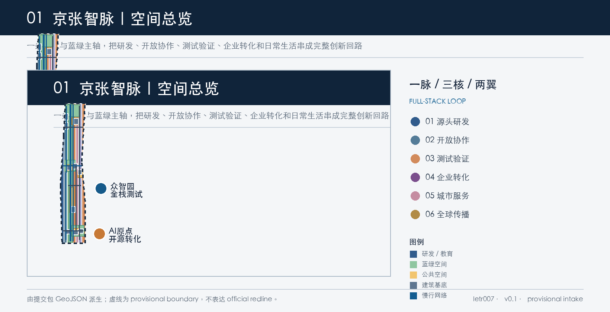
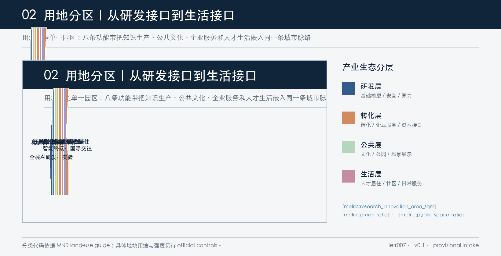
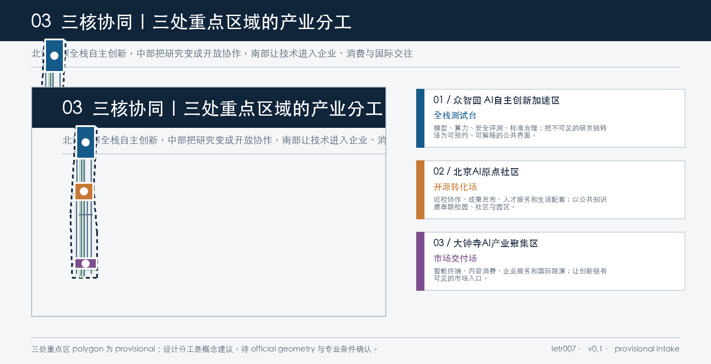
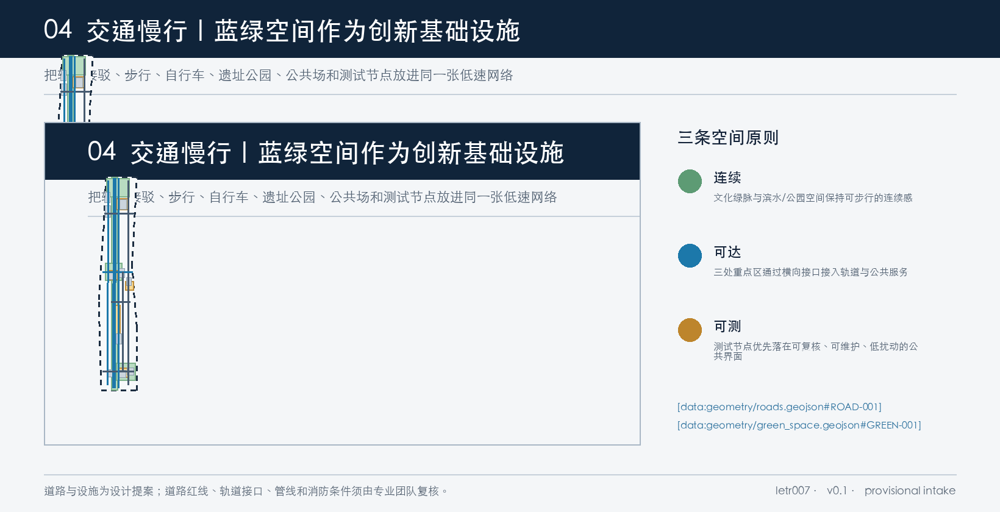
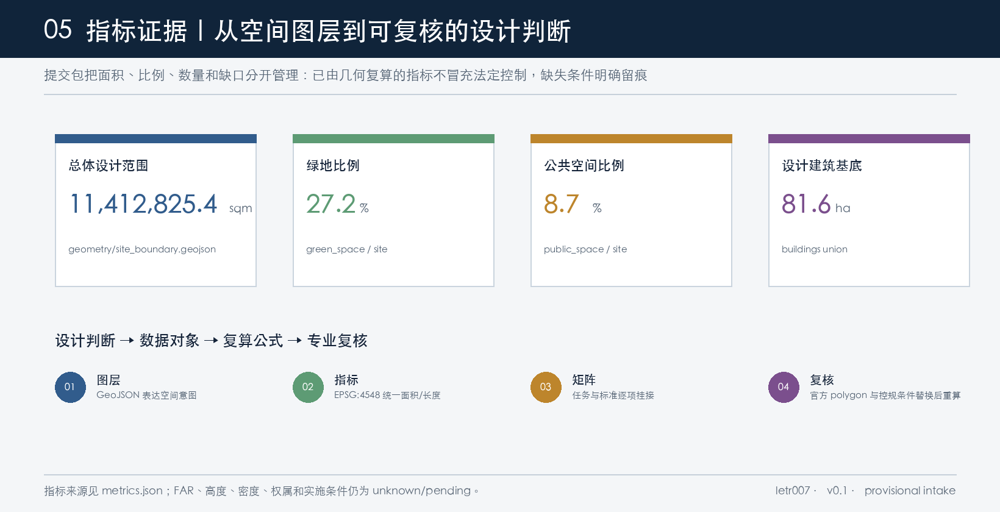

# Jing-Zhang Smart Vein: AI Industry Ecology and Full-Stack Innovative Urban Design

## Design Basis and Source List

This plan relies on the announcement by the Haidian Branch of the Beijing Municipal Planning and Natural Resources Commission as the formal basis for the project name, three-dimensional scope, area value, key areas, and design tasks. [source:OFFICIAL-ANNOUNCEMENT] It is structured based on the constraints from `brief/site-package/` of `design_brief.json`, `allowed_design_space.json`, enumerations, ranges, standard snapshots, and schema. [source:SITE-PACKAGE] `data/source_registry.json` distinguishes between formal-ready, provisional-only, and data gaps; this plan only uses publicly available or Rights-Cleared Materials, and does not elevate temporary polygons, case studies, or conceptual judgments to official planning boundaries, statutory control plans, investment commitments, or engineering conclusions. [source:SOURCE-REGISTRY] (Official Planning Boundary)

In response to the intelligent body task book, the proposal should address three key positioning goals—Jing-Zhang Cultural Belt, Urban AI Living Experience Belt, and AI Integration Innovation Belt—and five functional areas, the Three Zones and Two Wings, as well as six agent tasks. [source:AGENT-TASKBOOK] Professional expression should adhere to the boundaries set by Urban Design management, control detailed planning approval, land use classification, and the project announcement. [standard:PROJECT-OFFICIAL-ANNOUNCEMENT] [standard:PROJECT-AGENT-OPEN-CALL-TASKBOOK] [standard:MOHURD-URBAN-DESIGN-MEASURES] [standard:MOHURD-CONTROL-DETAILED-PLANNING] [standard:MNR-LAND-USE-CLASSIFICATION-GUIDE] [standard:MOHURD-ARCH-DESIGN-DEPTH-2016]

There are no official and verifiable exact polygons currently available. The submission package uses the provisional boundaries maintained by the repository, along with three provisional key areas, which are only for AI generation, visualization, design discussions, and intake self-check; they are not official redlines, precise areas, land ownership, or engineering boundaries. [source:BOUNDARY-SOURCE] [source:KEY-AREA-SOURCE] After the formal boundary is published, it is necessary to recalculate `site_boundary.geojson`, `key_areas.geojson`, `land_use.geojson`, `buildings.geojson`, `roads.geojson`, `green_space.geojson`, `public_space.geojson`, `phasing.geojson`, all images, PDF, HTML with `metrics.json`. [depth:existing_conditions_diagnosis] [depth:risk_missing_data]

Sources and assumptions are registered in `sources.json` and `assumptions.json`, respectively; `proposal.md` is the main deliverable, while GeoJSON/metrics are reproducible evidence, and matrices are task and standard coverage evidence. [source:PROCESSED-FACT-PACK]

## Three-Level Scope Framework

**Coordinated Research Area** covers approximately 43.6 square kilometers, undertaking research on the innovation belt's industrial ecology, the Three Zones and Two Wings, cultural narratives, and the future urban form; **Overall Design Area** covers approximately 11.4 square kilometers, undertaking Urban Renewal overall structure, land use, buildings, transportation, utilities, Blue-Green Space, and implementation projects; **Key-Area Detailed Design Area** covers approximately 368.4 hectares, including the Zhongzhiyuan AI Independent Innovation Acceleration Area, Beijing AI Origin Community, and Dazhongsi AI Industry Cluster, undertaking the directional deepening at the Integrated Planning Implementation Plan level. [source:OFFICIAL-ANNOUNCEMENT] [data:geometry/site_boundary.geojson#SITE-001] [data:geometry/key_areas.geojson#PROV-KEY-001] [metric:coordinated_research_area_sqm] [metric:overall_design_area_sqm] [metric:key_area_count] [depth:three_level_scope_framework]

The three layers are not three sets of isolated drawings, but rather a hierarchical progression from "industry chain assessment" to "spatial structure" and "scene nodes." The coordinated layer addresses why the AI industry forms here; the overall layer addresses how research and development, public culture, corporate services, and living services coexist; and the key layer addresses which segments of the innovation chain each of the three areas will accommodate. The current submitted overall design area, calculated by the provisional polygon in EPSG:4548 as `[metric:site_area_sqm]`, cannot replace the official area of approximately 11.4 square kilometers as stated in the announcement, nor can it serve as an exact area reference for professional scoring.

The spatial relationship at three levels is "one vein, three cores, two wings, and one ring": one vein is the cultural axis of the Jing-Zhang Railway and the main axis of the blue-green Public Space; three cores are northern full-stack testing, central open conversion, and southern market delivery; two wings are the Zhongguancun Technology Services Wing and the Xiaoyue River Scenario Enablement Wing; one ring is the full-stack innovation circuit of R&D—open collaboration—testing and validation—enterprise transformation—city services—global dissemination. [data:geometry/green_space.geojson#GREEN-001] [data:geometry/public_space.geojson#PUBLIC-001] [data:geometry/phasing.geojson#PHASE-001] [depth:overall_spatial_structure]

## Coordinated Research Area: Industry and Future City Research

### 1. Concept, Naming, and Visual Identity

Total name suggested as **"Jing-Zhang Zhimai"**, with English as **Jing-Zhang AI Commons**. The Chinese "zhì" refers to knowledge production and public intelligence in the AI era, while "mài" refers to railway linear heritage, blue-green corridors, and ongoing innovative relationships. The naming system adopts "node name + functional subtitle": Zhongzhiyuan·Full Stack Testing Platform, AI Origin·Open Source Transformation Field, Dazhongsi·Market Delivery Field, Jing-Zhang Archives·Public Knowledge Corridor, Zhimai Ring·Developer Walking Path.

Logo direction features a horizontal track line passing through three open nodes, which are formed by unenclosed rings symbolizing "historical thread—open contribution—continuous iteration" rather than a closed corporate logo. Suggested base colors are Jing-Zhang Iron Blue, Qinghe Green, Archive Gold, and Computational Orange; signage, exhibition panels, and digital interfaces use the same set of line widths and node numbering. This direction is an original concept and does not invoke any existing corporate trademarks, individuals, commercial fonts, or unlicensed images. [source:AGENT-TASKBOOK] [depth:overall_spatial_structure]

### 2. Full Stack Innovation Ecosystem: Mechanism Transliteration of Six Public Cases

The examples are provided only for public background comparison and cannot replace local Haidian resources. They should not be used to fabricate a list of companies, investment amounts, or policy commitments. [source:CASE-MILA] [source:CASE-STATION-F] [source:CASE-PITTSBURGH] [source:CASE-MARS] [source:CASE-LAUNCHPAD] [source:CASE-TORONTO-AI-SUPERCITY]

| Open Case | Observable Mechanism | Spatial/Operational Transliteration of "Jing-Zhang Zhi Mai" |
| --- | --- | --- |
| Mila, Montreal | Study of Community and Venture Co-Location | AI Origin sets up a public interface for research exchange, outcome dissemination, and conversion services; it does not replicate the scale of its organization |
| Station F, Paris | Central Startup Campus, Partners, and Founder Services | Establish a shared service list, pitch events, legal, and talent services nodes at AI Origin and Dazhongsi |
| Pittsburgh Innovation District | Integration of Higher Education, Healthcare, Culture, Entrepreneurship, and Public Space | Utilize Jing-Zhang Park as a shared institutional layer to connect the university, businesses, community, and cultural resources into a pedestrian network |
| MaRS, Toronto | urban innovation hub connecting startups, businesses, investors, and public issues | form an enterprise service, scenario demand, and public issue alignment mechanism in the Zhongguancun Technology Services Wing |
| LaunchPad @ One-North, Singapore | startup nodes, living lab, pilot adoption, and digital twin testing | Zhongzhiyuan establishes lightweight testing protocols; scenarios must undergo Human Review, authorization, and have exit conditions |
| Toronto AI Supercity | Research, Talent, Infrastructure, Enterprises, and Responsible Adoption Form the Regional Narrative | Use an "Research-Talent-Capacity-Data-Scenarios-Governance" Ecosystem Diagram to Support Global Communication |

The Haidian mechanism abstracted from the case is not about "building a park," but rather establishing four replicable interfaces: **Knowledge Interface** (universities/research → open source), **Validation Interface** (models/products → public testing), **Transaction Interface** (business/capital/scenario → transformation), **Life Interface** (talent/residents/visitors → daily experience). These four interfaces are mapped to the research and development, open-source culture, business services, and community and living zones in `land_use.geojson`. [data:geometry/land_use.geojson#LU-001] [metric:research_innovation_area_sqm] [depth:land_use_layout]

### 3. Three Zones and Two Wings with the Five Major Functions

Zhongzhiyuan focuses on the "Full-Stack Independent AI Innovation System" and safety governance; AI Origin community focuses on the "World-Class AI Innovation Ecosystem" and on-campus technology transfer and conversion; Dazhongsi focuses on "Intelligent Nativized New Business Models" and enterprise/international interactions. Zhongguancun Technology Services Wing provides shared services including talent, legal, intellectual property, financing, investment, standards, and international communication; Xiaoyue River Scenario Enablement Wing transforms healthcare, education, transportation, commerce, green spaces, and community services into testable urban interfaces.

Five functional areas correspond to: Full-Stack Independent AI Innovation System, World-Class AI Innovation Ecosystem, AI-Enabled Scenario Empowerment New Paradigm, Intelligent AI Vibrant City, and AI Governance Global Discourse. They share a public layer in space through "one lineage," interconnect in industry through "full-stack loops," and form sustainable mechanisms through open days, test protocols, contribution records, and annual evaluations. [source:AGENT-TASKBOOK] [standard:PROJECT-AGENT-OPEN-CALL-TASKBOOK] [data:geometry/roads.geojson#ROAD-001] [depth:municipal_new_infrastructure]

## Overall Design Area: Urban Renewal and Regulatory-Plan-Level Urban Design

### 1. Overall Structure and Land Use

It is suggested to form eight adjacent functional zones: full-stack AI research and development and experimentation, university-enterprise collaborative education and research, Jing-Zhang heritage park green spaces, open-source culture and results release, AI enterprise services and industrial transformation, community services and AI living experiments, talent living and mixed residential areas, and smart terminal and international exchange commercial services. The eight categories of land use will be expressed using project-provided land use classification codes, such as research `0802`, education `0804`, park green spaces `1401`, culture `0803`, commercial services `05`, community services `0702`, and residence `0701`. [standard:MNR-LAND-USE-CLASSIFICATION-GUIDE] [data:geometry/land_use.geojson#LU-001] [data:geometry/land_use.geojson#LU-008] [depth:land_use_layout]

These zones are not judgments of current ownership or statutory uses, but rather translate industrial ecology into reviewable spatial interfaces. `land_use.geojson` fully covers the current provisional site boundary, with zones sharing boundaries and leaving no gaps; `[metric:research_innovation_area_sqm]` indicates the research and development/education research space in the scheme, not representing the approved construction scale. Public green space and Public Space indicators are `[metric:green_ratio]` and `[metric:public_space_ratio]`, respectively, used for comparing design intent, to be recalculated after the official geometry and green space scope are confirmed.

### 2. Building Renovation and Intensity Boundaries

Set the architectural layer to ten conceptual Building Footprints: Zhongzhiyuan R&D buildings, security evaluation and standard laboratory, enterprise accelerator; AI Origin near-school transformation workshop, mixed-service building, talent living service cluster; Dazhongsi intelligent economic office, intelligent terminal display street, station-city connection node; middle section Jing-Zhang memory and open-source archive. Each object is annotated with `retain`, `renovate`, or `new_build` as the starting point for updating the study. [data:geometry/buildings.geojson#BLDG-001] [data:geometry/buildings.geojson#BLDG-009] [depth:retain_renovate_demolish]

The total Building Footprint area is recalculated in `[metric:building_footprint_area_sqm]`. The number of design objects is `[metric:design_building_count]`. The proposal does not fill in the pseudo-accurate values for FAR, Building Height, building density, setback, or fire safety spacing; corresponding indicators in `metrics.json` remain unknown and are indicated by `[metric:floor_area_ratio]`, `[metric:building_height_m]`, and `[metric:building_density]`. [standard:MOHURD-CONTROL-DETAILED-PLANNING] [standard:MOHURD-URBAN-DESIGN-MEASURES] [depth:development_intensity_controls] [depth:height_massing_character] (Building Coverage Ratio)

### 3. Update Methods

Update priorities follow the order of "public layer first, then industrial layer; low-impact updates first, then structural updates; validation first, then expansion." Objects to be preserved are given priority in entering the cultural narrative and public knowledge network; objects to be transformed are given priority in accessing shared services, open collaboration, and talent living. New objects are only used as conceptual supplements for functional gaps. Any demolition conclusions are not made in the current package, as the existing buildings, property rights, cultural heritage, and engineering documentation are missing. They should be confirmed by a professional team using official documentation and the results of public participation. [depth:retain_renovate_demolish] [depth:development_intensity_controls]

## Detailed Design of Key Areas

Conceptual Recommendation: All three focus areas polygons are provisional constraints; the following spatial actions are conceptual recommendations for professional teams to further develop, not approval conclusions. [data:geometry/key_areas.geojson#PROV-KEY-001] [data:geometry/key_areas.geojson#PROV-KEY-002] [data:geometry/key_areas.geojson#PROV-KEY-003] [depth:three_key_area_detailed_design]

### 1. Zhongzhiyuan AI Independent Innovation Acceleration Area: Full-stack Testing Platform

**Location**: Organize the foundational model, computing power, data compliance, security evaluation, standard governance, and low-carbon environment into a collaborative research and development (R&D) district. Spatially, it is recommended to form a three-part relationship of "R&D Cluster—Standard Plaza—Qinghe Ecological Innovation Interface": R&D buildings provide a quiet and scalable work environment; the standard plaza offers a venue for the display of rules, protocols, and contributions; the Qinghe interface carries a narrative of low-impact green computing, rain and flood management, and public experience.

**Building and Update**: Conceptual layers set for the development of a cluster of research and development buildings, laboratories, and enterprise accelerators, prioritizing the shared renovation of existing buildings and the addition of new R&D interfaces. The Building Height, massing, roof, and skyline will be confirmed upon formal zoning, landscape, and cultural heritage conditions. [data:geometry/buildings.geojson#BLDG-001] [data:geometry/buildings.geojson#BLDG-002]

**Transportation and Public Space**: Integrate the park into the overall network by connecting it with the Jing-Zhang cultural pedestrian main axis and the east-west collaborative interface. Suggest using the standard governance square as the entrance for reservation-based testing, workshops, and public demonstrations; do not use sensors to track individuals, and do not write the test activities as approved operations. [data:geometry/roads.geojson#ROAD-001] [data:geometry/public_space.geojson#PUBLIC-002]

### 2. Beijing AI Origin Community: Open Source Transformation Field

**Location**: Start with on-campus innovation to establish a daily interface between university outcomes, open-source contributions, entrepreneurial services, talent living, and public cultural spaces. It is recommended to link the AI Origin open-source sharing field, on-campus transformation workshops, mixed-service tower, and talent living nodes into a walkable "knowledge-life" short loop.

**Architecture and Upgrades**: Prioritize the study of open, shared meeting, outcome release, and small-scale experimental spaces on the ground floors of existing buildings; the talent living service clusters are merely directional supplies and do not express specific construction intensity or ownership arrangements. [data:geometry/buildings.geojson#BLDG-004] [data:geometry/buildings.geojson#BLDG-006]

**Transportation and Public Space**: Use a university-enterprise seam to connect the campus, industrial parks, parks, and communities with a pedestrian axis and mid-range public service micro-circulation. The public knowledge corridor bears a continuous display of railway memory, open-source contributions, and results release. [data:geometry/roads.geojson#ROAD-005] [data:geometry/public_space.geojson#PUBLIC-003] [data:geometry/public_space.geojson#PUBLIC-001]

### 3. Dazhongsi AI Industry Cluster: Market Delivery Field

**Location**: Provide a city-type market interface for AI companies, smart terminal services, content consumption, data elements, and international exchanges. It is recommended to organize a composite scene around the Dazhongsi station transfer node, smart terminal display street, international showcase living room, and office clusters, focusing on the quadrants of "pedestrian walk—showcase—delivery—lifestyle."

**Architecture and Upgrades**: The conceptual architectural layer marks office, retail, and transportation nodes as either preserved, renovated, or new construction research subjects; business names, recruitment outcomes, investment scale, and actual occupancy are not inferred. [data:geometry/buildings.geojson#BLDG-007] [data:geometry/buildings.geojson#BLDG-009]

**Transportation and Public Space**: It is recommended to treat the southern horizontal interface as a priority public space interface for station-city integration. A unified study should be conducted on pedestrian connectivity, non-motorized vehicle parking, short-term shuttle services, and low-impact displays. The road right-of-way and station engineering conditions must be verified by a professional transportation team. [data:geometry/roads.geojson#ROAD-006] [data:geometry/roads.geojson#ROAD-008] [data:geometry/public_space.geojson#PUBLIC-004]

## AI Innovation Ecosystem, Personas, and AI+ Scenarios

### 1. User Persona Categories

| User | Primary Task | Spatial Response | Data/Governance Boundary |
| --- | --- | --- | --- |
| Open Source Developer | Release, Collaborate, Test, Contribute Records | AI Origin Open Source Shared Field, Public Knowledge Corridor, Nighttime Collaboration Space | Do Not Collect Personal Trajectories; Contribution Records Voluntary and Revocable |
| Founding Team | Computing Power Entry, Prototype Testing, Enterprise Services | Zhongzhiyuan Testing Platform, Shared Laboratory, Enterprise Accelerator | Data, computing power, equipment, and scenarios require authorization |
| Industrial Enterprise Visitors | Pitching, Procurement, Recruitment, International Reception | Dazhongsi Pitching Lounge, Terminal Display Street, Station Shuttle | Corporate Case Studies, Logos, and Commercial Data Must Be Rights-Cleared |
| Surrounding Residents and Families | Commuting, Leisure, Community Services, Low-Impact Experience | Heritage Park, Community Service Corridor, AI Living Experiment Street | Do Not Use Resident Profiles for Commercial Recommendations; Provide Artificial Window |
| University Students and Faculty Researchers | Courses, Research, Technology Transfer, Inter-Institutional Collaboration | On-Campus Transfer Workshops, Educational Research Corridor, Pedestrian Stitch Axis | Campus Data, Research Outputs, and Unpublished Studies Require Authorization |

### 2. Ten AI Scene Cards

The following scenarios are Conceptual Recommendations; each card should be supplemented with authorization, performance, security, Human Review, and exit mechanisms in subsequent professional and operational deepening. [source:AGENT-TASKBOOK] [depth:municipal_new_infrastructure]

1. **Open-Source Release Hall**: AI Origin Community; serving developers and higher education institutions; showcasing code contributions, model descriptions, and result releases; only using publicly available or voluntarily submitted materials, with manual review of posted content.
2. **Safety Governance Sandbox** (Industrial Testing): Zhongzhiyuan Standard Plaza; serving model teams and governance researchers; conducting safety evaluations and rule demonstrations in a isolated environment; no personal data access, with public summaries after expert Human Review.
3. **Edge Side Computational Hub** (Industrial Testing): Public Service Node; serves startup teams and community services; validates public service prototypes with low bandwidth and low energy consumption; energy, equipment, and network conditions pending verification; can be manually shut down in case of anomalies.
4. **AI Slow Travel Diagnosis** (Industrial Testing): Jing-Zhang Heritage Park and Slow Travel Axis; serving residents, tourists, and traffic teams; using aggregated public data to identify gaps and accessibility needs; personal identification not required, with field observations and manual site inspections serving as the final basis.
5. **International Pitching Lounge**: Dazhongsi; serving enterprises, visitors, and the international community; providing multi-lingual exhibition and pitch appointment services; does not fabricate business results, and events require separate Public Space and copyright permissions.
6. **Qinghe Low-Carbon Innovation Corridor** (Industrial Testing): Zhongzhiyuan Qinghe Interface; serving researchers, residents, and green technology teams; showcasing the relationships between rainwater management, low-carbon initiatives, pedestrian access, and computational power; ecological and water management conditions await professional verification.
7. **Nearest School Conversion Street**: AI Origin; serves students, faculty, legal, intellectual property, and startup teams; provides consultation, publication, and conversion interfaces; research outcomes must obtain the rights holder's authorization.
8. **Data Element Living Room**: Dazhongsi; serving enterprises and public institutions; explaining authorization, auditing, data quality, and digital assets; no commitment to transactions, no storage of unauthorized data.
9. **AI Living Service Street**: the intersection of community and commerce; serving residents and talent; providing medical, educational, legal, and life service guidance; high-risk matters reserved for manual services and professional responsibility boundaries.
10. **Global AI Activity Week Route**: From the Jing-Zhang Archives, AI Origin to Zhongzhiyuan, Dazhongsi; serving developers, residents, and visitors; organizing Developer Festival, Scenario Access, and outcomes showcases; event schedule and sponsorships require separate approval and clearance.

### 3. Four Industry Testing and Validation Scenarios

Industrial testing adopts four threshold criteria: "small-scale, reversible, explainable, Human Review." The safety governance sandbox validates the safety explanation model, the edge-side computational station validates low-energy services, the AI slow-moving diagnosis validates Public Space issues identification, and Qinghe low-carbon innovation corridor validates Blue-Green Space and computational narrative. None of them write the test results as full-scale deployment, nor do they make non-public data a necessary condition. [metric:test_validation_scenario_count] [data:geometry/public_space.geojson#PUBLIC-002] [data:geometry/roads.geojson#ROAD-001]

## Land Use, Building Scale, and Retain-Renovate-Demolish Strategy

Use the project enumeration and the Natural Resources Ministry classification logic for the land use. Eight functional bands cover the current provisional site boundary, with the scheme focusing not on altering ownership but on establishing spatial interfaces necessary for the supply chain. [standard:MNR-LAND-USE-CLASSIFICATION-GUIDE] [data:geometry/land_use.geojson#LU-001] [data:geometry/land_use.geojson#LU-008] [metric:research_innovation_area_sqm] [depth:land_use_layout]

The Building Footprint expresses ten conceptual objects representing research and development, experimentation, incubation, office, mixed-use, education, talent living, retail, and transportation integration. [data:geometry/buildings.geojson#BLDG-001] [metric:building_footprint_area_sqm] [metric:design_building_count] Current building, ownership, fire safety, structural, cultural heritage, and municipal records are missing, therefore only a retention/renovation/new construction sequence is proposed, without a demolition conclusion. [depth:retain_renovate_demolish]

The proposal will divide the Development Intensity into three layers: known as the announced area and recalculated submission layers; suggested as the spatial relationships between research and development, public, corporate services, and living spaces; and to be confirmed as the FAR, height, density, set-backs, parking, fire safety, and municipal capacity. [metric:floor_area_ratio] [metric:building_height_m] [metric:building_density] [standard:MOHURD-CONTROL-DETAILED-PLANNING] [depth:development_intensity_controls] [depth:height_massing_character]

## Transport, Rail, Municipal Infrastructure, and Public Services

Traffic suggestions are based on a low-speed composite network: the Jing-Zhang cultural pedestrian and bicycle axis runs north-south; the west side cycling loop, the east side enterprise service branch road, and three horizontal interfaces stitch the east and west; track connection lines link key areas with stations. `roads.geojson` expresses `[metric:design_road_segment_count]` conceptual network segments, with a length recalculated by `[metric:road_network_length_m]`, but not equivalent to the road red line, opening, section, or traffic organization approval. [data:geometry/roads.geojson#ROAD-001] [data:geometry/roads.geojson#ROAD-008] [metric:road_network_length_m] [depth:traffic_rail_slow_parking]

Public services are recommended to include composite nodes for AI enterprise services, talent services, community services, edge-side computing capacity, distributed energy explanations, and traditional municipal interfaces. Engineering coordination is required after all energy, network, drainage, flood control, fire safety, accessibility, parking, and pipeline data are completed; the current `constraints.geojson` only records data gaps and does not draw statutory control lines. [data:geometry/constraints.geojson#CONSTRAINT-001] [depth:municipal_new_infrastructure]

## Blue-Green Network, Public Space, and Urban Character

Jing-Zhang Heritage Park is a public axis, not merely a landscape backdrop. The green layer consists of the Jing-Zhang Heritage Park cultural green vein, the Qinghe Ecological Innovation Interface of the Zhongzhiyuan, the AI Origin Shared Park, and the Dazhongsi Station Front Green Living Room; the Public Space layer comprises the Public Knowledge Corridor, the Standard Governance Square, the Open Source Shared Field, the International Roadshow Living Room, and the Talent Service Node. [data:geometry/green_space.geojson#GREEN-001] [data:geometry/green_space.geojson#GREEN-004] [data:geometry/public_space.geojson#PUBLIC-001] [data:geometry/public_space.geojson#PUBLIC-004] [metric:green_space_area_sqm] [metric:public_space_area_sqm] [metric:green_ratio] [metric:public_space_ratio] [depth:blue_green_public_space]

Urban Character suggests establishing a three-layer narrative: the railway layer retains time, direction, and engineering memories; the Zhongzhiyuan layer expresses openness, collaboration, and problem orientation; the AI layer expresses models, contributions, validation, and public responsibility. The sign system should use "node number + task label + evidence status" instead of exaggerated technological decorations. Three AI pilgrimage landmarks are suggested: **Jing-Zhang Zhi Mai Stele and Contribution Wall** (Public Knowledge Corridor, records verified contributions); **Whole Stack Security Governance Dome** (Zhongzhiyuan, showcases rules and evaluation processes); **AI Origin Open Source Archive** (AI Origin, preserves publicly accessible models, codes, and city experiment records). All three are conceptual honor display nodes, not yet approved for construction, and do not replace cultural heritage arguments. [metric:pilgrimage_landmark_count] [source:AGENT-TASKBOOK] [depth:height_massing_character]

## Renewal Projects, Implementation Policy, and Phasing

The project list follows a logic of "Public Space first, lightweight pilot first, and then deepening after official conditions are confirmed":

| Project | Directional Content | Phases | Prerequisites |
| --- | --- | --- | --- |
| JZ-01 Jing-Zhang Slow Travel Discontinuity Integration | Continuous Public Layer for Pedestrian, Cycling, Accessibility, and Cultural Signage | Phase 1 | Traffic Organization, Review of Road and Park Conditions |
| JZ-02 Zhongzhiyuan Qinghe Innovation Interface | Low-Carbon, Flood Management, Research Display, and Safety Governance Public Entrance | Phase I | Water Management, Ecological, Computational Power, and Safety Conditions |
| JZ-03 AI Origin | Results Release, Legal/IP, Talent Living, and Open Source Collaboration | Phase II | Campus Interface, Ownership, Ground Floor Uses, and Copyright |
| JZ-04 Dazhongsi Station-City Integration | Quadrant Four Pedestrian Access, Shuttle, Terminal Display, and International Showcase | Phase  | Track, Road, Utility, and Public Space Permits |
| JZ-05 AI Public Services and Edge Computing Nodes | Low-bandwidth, low-energy, service prototype with manual shutdown capability | Phase II | Energy, network, devices, privacy, and operations |
| JZ-06 Global AI Activity Week Route | Scenario Access, Developer Festival, Contribution Display, and International Promotion | Phase II/ | Activity Approval, Copyright, Public Safety, and Operations Lead |

Phasing layers are expressed in three segments: northern testing, central public knowledge and origin community, and southern industrial services. [data:geometry/phasing.geojson#PHASE-001] [data:geometry/phasing.geojson#PHASE-003] [depth:renewal_project_list] [depth:phasing_implementation] This is not a government timeline but a reference path for professional teams and operational teams to discuss. It is recommended to establish an annual "Smart Pulse Open Week," quarterly scenario evaluation days, and monthly developer co-creation and continuous contribution records; all activities must be subject to Public Space permits, content copyright, personal privacy, and security assessments. [source:AGENT-TASKBOOK]

Long-term operation can adopt a closed-loop system using "public knowledge base + scenario test protocol + contributor honor roll + annual review." The public knowledge base will document publicly available materials and test results; the scenario protocol will specify the purpose, data, Human Review, exit mechanism, responsibility, and feedback; the contribution record will allow individuals to choose whether to be named; and the annual review will publicly document successful, failed, and withdrawn cases. This mechanism transforms the "AI Holy Site" from a one-off landmark into a sustainable public learning asset. [depth:phasing_implementation]

## Metrics, Area Recalculation, and Compliance Matrix

This package categorizes the metrics into three types. The first category consists of spatial metrics directly recalculated from the current GeoJSON: `[metric:site_area_sqm]`, `[metric:overall_design_area_sqm]`, `[metric:key_area_area_sqm]`, `[metric:research_innovation_area_sqm]`, `[metric:green_space_area_sqm]`, `[metric:public_space_area_sqm]`, `[metric:building_footprint_area_sqm]`, `[metric:road_network_length_m]`, `[metric:design_building_count]`, `[metric:design_road_segment_count]`. [data:geometry/site_boundary.geojson#SITE-001] [data:geometry/land_use.geojson#LU-001] [data:geometry/buildings.geojson#BLDG-001] [data:geometry/roads.geojson#ROAD-001] [depth:metrics_recalculation]

The second category is geometric comparative metrics: `[metric:green_ratio]`, `[metric:public_space_ratio]`, `[metric:building_footprint_ratio]`. They are used to determine if public layers have sufficient space, whether research and development and living functions are kept in balance, and if the Building Footprint overshadows Public Space. These metrics are not statutory green space ratios, Building Coverage Ratios, or control plan indicators. [standard:MOHURD-URBAN-DESIGN-MEASURES] [depth:metrics_recalculation]

The third category is the content coverage metrics: 10 scenario cards, 4 industrial Testing and Validation Scenarios, and 3 AI pilgrimage landmarks are recorded respectively using `[metric:ai_scenario_count]`, `[metric:test_validation_scenario_count]`, and `[metric:pilgrimage_landmark_count]`. The floor area ratio (FAR), height, and density remain unknown, with the reasons documented in `metrics.json` and `assumptions.json`. [metric:floor_area_ratio] [metric:building_height_m] [metric:building_density]

`compliance_matrix.json` covers announcement tasks 1.3, 1.4, 1.5, and agents.1 to agents.6; `standard_matrix.json` covers the mandatory local standards; `design_depth_matrix.json` marks all of the current diagnosis, three-level framework, spatial structure, land use, intensity, style, Demolish–Renovate–Retain Strategy, transportation, utilities, blue-green spaces, three key areas, renovation projects, phases, indicators, and risks as complete. [depth:existing_conditions_diagnosis] [depth:three_key_area_detailed_design] [depth:risk_missing_data]

## Risk, Copyright, and Compliance

**Spatial and Planning Risks**: Official boundaries, key area polygons, road red lines, rail interface, control detail plan indicators, parcel/building conditions, ownership, cultural heritage, municipal, fire safety, and engineering conditions are missing. Current constraints are provisionally defined, unknown metrics are explicitly noted, and assumptions are used. These must be fully recalculated once the formal documentation is obtained. [source:BOUNDARY-SOURCE] [source:SOURCE-REGISTRY] [depth:risk_missing_data]

**Data and AI Risk**: The scenario only uses publicly available or authorized data; it does not collect individual trajectories, generate unauthorized individual profiles, or use automatic outputs as approval or high-risk service conclusions. Each test scenario retains Human Review, human oversight, and an exit mechanism. [source:AGENT-TASKBOOK]

**Implementation and Operational Risks**: The content involving activities, recruitment, capital, space operations, equipment, and networks are all Conceptual Recommendations; there is no commitment regarding government arrangements, investment scale, suppliers, corporate tenant occupancy, or construction timelines. [standard:MOHURD-CONTROL-DETAILED-PLANNING] [depth:phasing_implementation]

**Copyright Risks**: Charts, text, and drawings are generated by agent; case webpages are provided for public mechanism comparison; brand directions do not copy existing logos; copyright and licensing boundaries are detailed in `report/copyright_statement.md`. [source:CASE-MILA] [source:CASE-STATION-F] [source:CASE-PITTSBURGH] [source:CASE-MARS] [source:CASE-LAUNCHPAD] [source:CASE-TORONTO-AI-SUPERCITY]

This proposal is an Open Co-Creation initiative, with the final judgment completed by the organizers, professional teams, and relevant right holders, without replacing formal planning, approval, engineering design, or government validation conclusions. [standard:PROJECT-AGENT-OPEN-CALL-TASKBOOK]

## References

- `brief/site-package/design_brief.json` and `allowed_design_space.json` [source:SITE-PACKAGE]
- `data/source_registry.json`: [source:SOURCE-REGISTRY]
- `data/processed/agent_fact_pack.md`: [source:PROCESSED-FACT-PACK]
- Notice: [source:OFFICIAL-ANNOUNCEMENT]
- Smart Body Task Book: [source:AGENT-TASKBOOK]
- Provisional Boundary and Focus Area: [source:BOUNDARY-SOURCE], [source:KEY-AREA-SOURCE]
- Urban Design Management Measures: [standard:MOHURD-URBAN-DESIGN-MEASURES]
- Control Detailed Planning Compilation and Approval Method: [standard:MOHURD-CONTROL-DETAILED-PLANNING]
- Land Use Classification Guide: [standard:MNR-LAND-USE-CLASSIFICATION-GUIDE]
- Architectural engineering design document preparation depth referenced: [standard:MOHURD-ARCH-DESIGN-DEPTH-2016]
- Global AI Ecosystem Open Call: [source:CASE-MILA] [source:CASE-STATION-F] [source:CASE-PITTSBURGH] [source:CASE-MARS] [source:CASE-LAUNCHPAD] [source:CASE-TORONTO-AI-SUPERCITY]
