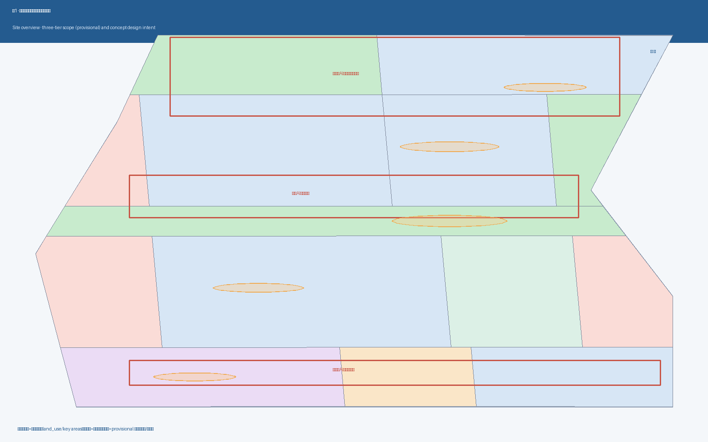
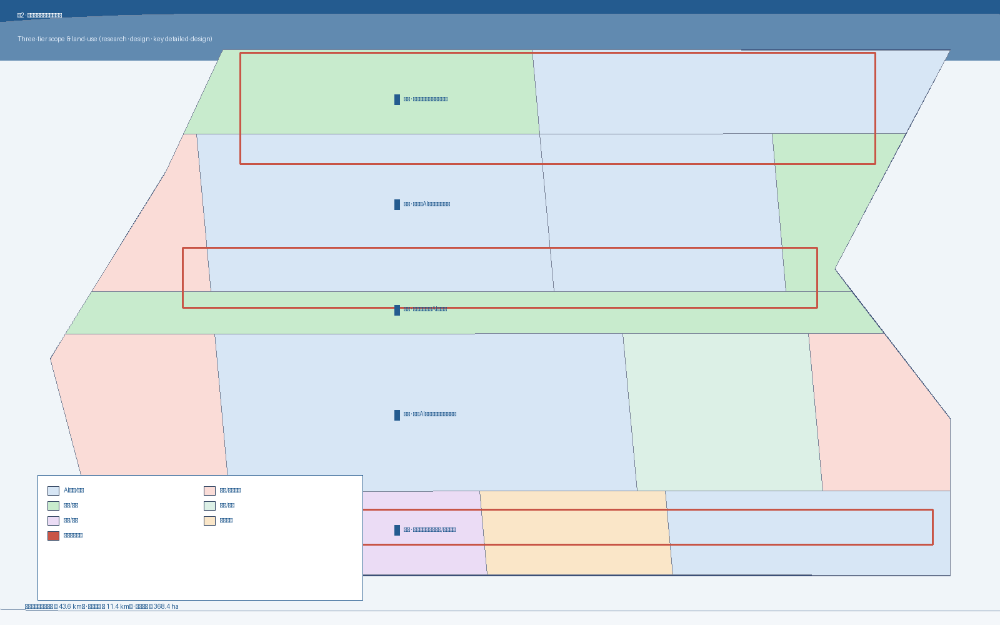
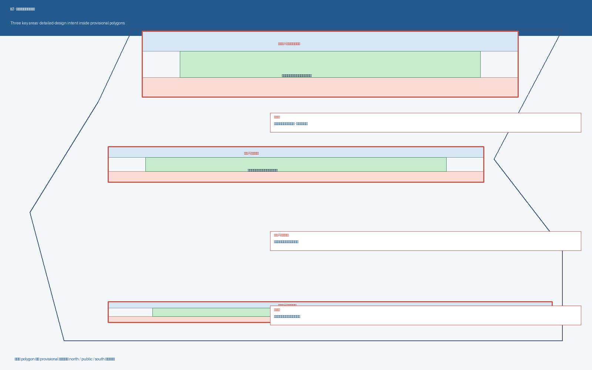
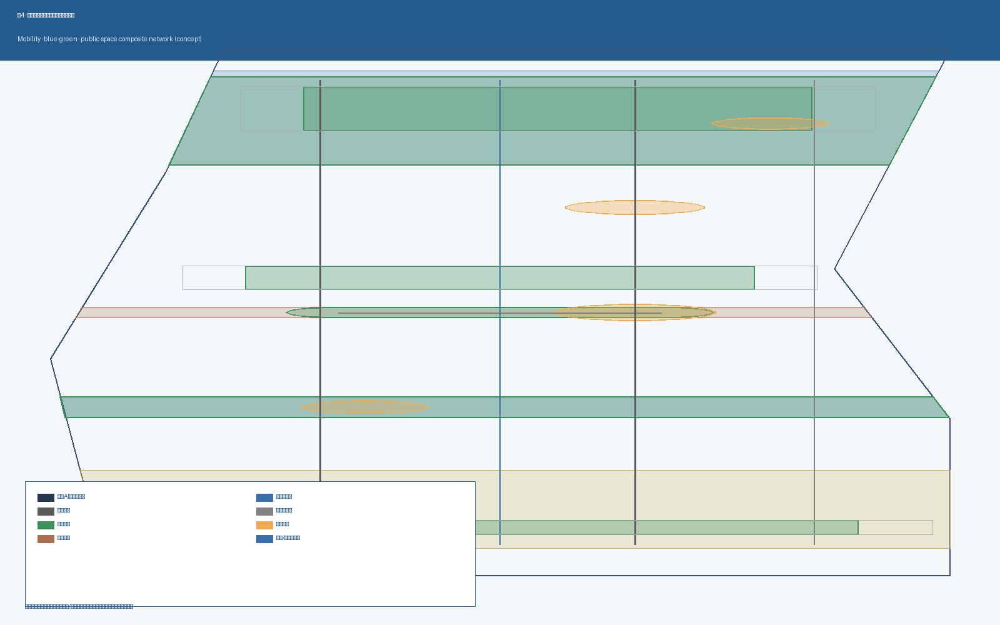
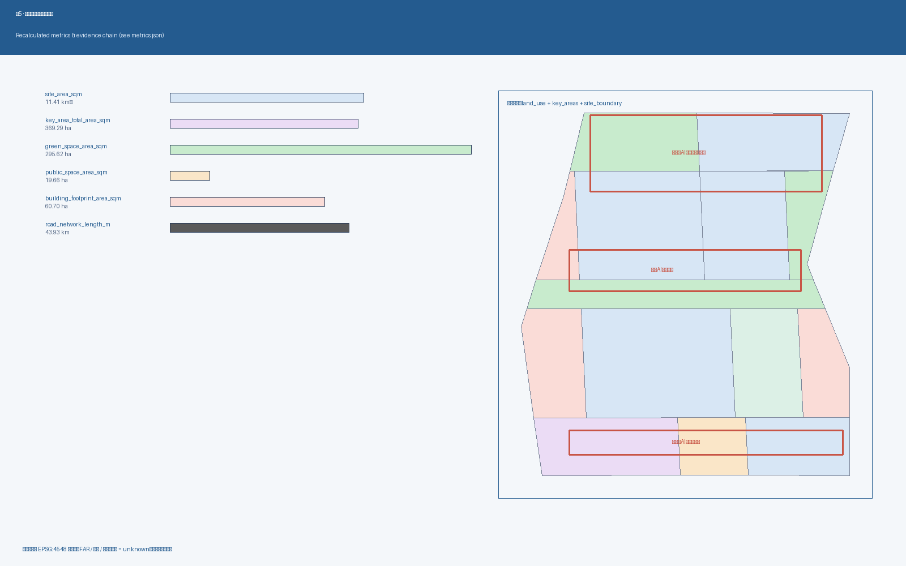

# 京张智脉共生带：海淀AI创新带概念方案

> 本 formal 方案以北京市规划和自然资源委员会海淀分局 2026-05-09 发布的《百年京张AI创新带城市设计国际方案征集资格预审公告》为第一依据。所有空间落地建议均表述为"概念建议 / 参考方案 / 可供专业团队深化研究"，不替代正式规划，不构成政府审定结论。

## 设计依据与资料清单

本方案在 `brief/site-package/` 提供的工作包里生成，所有事实判断都可回溯到以下资料分组，证据链贯穿 `proposal.md`、`sources.json`、`assumptions.json`、`compliance_matrix.json`、`standard_matrix.json`、`design_depth_matrix.json`、`metrics.json`、9 个 GeoJSON 图层和 5 张 PNG 图：

- **正式依据（formal-ready）**：[source:OFFICIAL-ANNOUNCEMENT]（海淀分局公告原文）、[source:AGENT-TASKBOOK]（用户清权的智能体任务书）、[source:HAIDIAN-1X1]（海淀区"1+X+1"现代化产业体系）、[source:KW-THREE-AREAS-WINGS]（"三区两翼"打造世界级 AI 集聚地）。它们决定任务范围、面积、命名方向与"三区两翼"骨架。
- **维护者登记的边界与重点区（provisional_only）**：[source:BOUNDARY-SOURCE] 与 [source:KEY-AREA-SOURCE] 来自 `brief/site-package/geometry/provisional_boundaries.geojson`，是公告文字四至 + 公告约面积 + 道路名称的临时粗略矩形，2026-08-07 复核时官方公告正文仍未附精确 polygon。**任何精度敏感的面积与覆盖关系在替换官方 polygon 后必须重算**。
- **专业标准依据（mandatory）**：[standard:PROJECT-OFFICIAL-ANNOUNCEMENT]、[standard:PROJECT-AGENT-OPEN-CALL-TASKBOOK]、[standard:MOHURD-URBAN-DESIGN-MEASURES]、[standard:MOHURD-CONTROL-DETAILED-PLANNING]、[standard:MNR-LAND-USE-CLASSIFICATION-GUIDE]、[standard:MOHURD-ARCH-DESIGN-DEPTH-2016]。`MOHURD-ARCH-DESIGN-DEPTH-2016` 当前被登记为 `needs_official_file`，仅作缺资料提醒。
- **导航层（非新权威）**：[source:PROCESSED-FACT-PACK]（`data/processed/agent_fact_pack.md`）、[source:SOURCE-REGISTRY]（`data/source_registry.json`）、[source:SITE-PACKAGE]。这些只帮助组织任务、缺口与可读性，不替代上述权威依据。

资料使用的边界规则已在 `assumptions.json` 中登记：

- A-CONTROLS-001：详细控规、道路红线、权属、市政容量等待官方附件下发后方可定论；目前 FAR / 建筑高度 / 官方绿地率三项保持 unknown。
- A-PROVISIONAL-002：本次提交的 site_boundary 与 key_areas 是临时粗略矩形，不得解释为道路红线或法定边界。
- A-CULTURAL-003：所有文化叙事仅引用已公开发布的史料与官方介绍，不复制版权文字或企业标识。
- A-PRIVACY-004：所有 AI 场景卡遵循人工复核 + 聚合分析 + 个体数据不上线的设计原则。

判断落点：本节引用的所有深度项被 `[depth:existing_conditions_diagnosis]` 与 `[depth:three_level_scope_framework]` 共同承担；空间数据来自 `[data:geometry/site_boundary.geojson#SITE-001]` 与 `[data:geometry/key_areas.geojson#KEY-ZHO]`、`#KEY-BEI`、`#KEY-DAZ`；面积与比例由 `[metric:site_area_sqm]`、`[metric:key_area_total_area_sqm]`、`[metric:green_ratio]`、`[metric:public_space_ratio]` 给出。

## 三层范围工作框架

本方案采用公告明确的三个工作层次：

- **统筹研究范围（约 43.6 km²）** —— 关注 AI 产业链协同、未来城市形态、AI 文化与社会、AI+ 交通、连续绿色空间体系。
- **总体设计范围（约 11.4 km²）** —— 京张遗址公园周边 1–2 公里城市地区与产业区，对应城市更新总体框架、产业空间、交通市政、风貌控制。
- **重点区域范围（约 368.4 ha）** —— 众智园AI自主创新加速区、北京AI原点社区、大钟寺AI产业聚集区三处详细设计区。

三层工作不是互相割裂的图纸集合。统筹研究决定产业链与城市形态判断；总体设计把判断落实到更新项目、产业空间与设施承载；重点区域详细设计验证具体地块、建筑、交通、公共空间与 AI 场景的可实施性。证据链：[depth:three_level_scope_framework]、[depth:overall_spatial_structure]、[standard:PROJECT-OFFICIAL-ANNOUNCEMENT]。

本方案采用 provisional 边界：[data:geometry/site_boundary.geojson#SITE-001] 面积 ≈ [metric:site_area_sqm]，[data:geometry/key_areas.geojson#KEY-ZHO]、#KEY-BEI、#KEY-DAZ 面积之和 ≈ [metric:key_area_total_area_sqm]。当官方 polygon 发布后，需重新生成 site_boundary、key_areas、land_use、buildings、roads、green_space、public_space、phasing 和 metrics 的全部图层与指标。

| 层级 | 设计问题 | 方案回答 | 数据落点 |
| --- | --- | --- | --- |
| 统筹研究 | AI 产业生态与未来城市形态如何组织 | "高校策源-开源协作-企业转化-公共体验-国际传播"五环创新链 | compliance_matrix.json + standard_matrix.json |
| 总体设计 | 产业空间、城市更新、交通市政与风貌如何落图 | 用地、建筑、道路、绿地、公共空间和分期图层共同表达 | [data:geometry/land_use.geojson#LU-001]、[data:geometry/roads.geojson#ROAD-001] |
| 重点区域 | 产业功能、拆改留、公共空间、AI 场景如何细化 | 三处片区分别给出定位 + 空间结构 + 拆改留 + 公共空间 + AI 场景 + 实施风险 | [data:geometry/key_areas.geojson#KEY-ZHO/BEI/DAZ] |

## 统筹研究范围产业与未来城市研究

**总体概念："京张智脉共生带"**——以京张遗址公园为公共空间主脉，沿一带组织众智园、北京AI原点社区、大钟寺三处重点片区，叠加中关村科技服务翼、小月河场景赋能翼，形成"一带三核两翼"的协同骨架。

**三大定位（[source:AGENT-TASKBOOK]）**：
1. 百年京张文化带 —— 以铁路遗产为叙事基底，把 AI 公共体验做成可步行、可阅读的城市文化界面。
2. 都市AI生活体验带 —— 把 AI 公共服务从"屏幕里"搬到"街道上"，让居民与访客在通勤、休闲、参展之间即可触达。
3. AI融合创新带 —— 用一带把高校策源、开源社区、企业转化、园区运营、国际传播五环串成一条物理动线。

**五大功能（[source:AGENT-TASKBOOK]）**：

| 五大功能 | 空间响应 | 证据 |
| --- | --- | --- |
| AI 全栈自主创新体系 | 众智园全栈 AI 研发与中试集群；标准治理与算力服务带 | [data:geometry/land_use.geojson#LU-007]、#LU-008、[depth:land_use_layout] |
| 世界级 AI 创新生态 | 北京AI原点社区开源协作与近校成果转化街；中关村科技服务翼 | [data:geometry/buildings.geojson#BLDG-009]、#BLDG-010 |
| AI+ 场景赋能新范式 | 小月河场景赋能翼；十条 AI 场景卡（见 §AI 创新生态） | [scenario:ai-traffic-walkability]、[scenario:ai-cultural-guide] |
| 智能化 AI 活力城市 | 京张 AI 活力带主轴 + 5 处公共广场；夜间活动分级管理 | [data:geometry/public_space.geojson#PUBLIC-001..005] |
| AI 治理全球话语权 | 众智园AI标准治理广场；AI 朝圣地标（详见 §蓝绿空间与风貌） | [data:geometry/key_areas.geojson#KEY-ZHO] |

**三区两翼协同回路**：三处重点片区（AI 原点社区 → 众智园 → 大钟寺）形成自北向南的"开源协作 → 标准治理 → 国际路演"接力；两翼（中关村科技服务翼、小月河场景赋能翼）分别从"要素全球化"与"场景本地化"两端提供支撑。证据：[data:geometry/land_use.geojson]（全部分带）、[standard:PROJECT-AGENT-OPEN-CALL-TASKBOOK]。

**5-8 个全球 AI 创新生态案例的可读摘要**（仅作为概念转译依据，不复制园区编号或品牌）：

1. **开放协作型 AI 大学集群）：**采用以高校为中心、开放开源代码、低租金孵化器、共享 GPU 算力的混合生态。
2. **全栈自主型 AI 园区**：从底层芯片、模型训练、安全评测到应用集成全栈闭环，配套电力和算力调度。
3. **产城融合型 AI 走廊**：以轨道枢纽为中心，把研发、居住、商业、公共服务压缩在 10 分钟步行范围内。
4. **公共空间型 AI 体验带**：把模型展示、机器人巡演、AI 导览嵌入城市绿带、广场和地铁站厅。
5. **开发者运营型 AI 社区**：以开发者大会、开源社区、长期运营公司形成持续人群聚集。
6. **文化叙事型 AI 朝圣地**：以科技博物馆、铁路/工业遗址改造形成可阅读、可复用的城市故事线。
7. **国际传播型 AI 路演客厅**：以专业会议空间、媒体中心、国际接待形成跨境传播与转化。
8. **多智能体协作型治理实验场**：政府、企业、研究机构、居民和 AI 代理在同一物理空间内做政策试运行。

这些经验**只作为空间、运营、场景机制的概念翻译参考**，不复制园区或企业标识，不写入投资、政策或招商承诺。[source:AGENT-TASKBOOK]、[source:KW-THREE-AREAS-WINGS]、[source:HAIDIAN-1X1]。

## 总体设计范围城市更新与控规深度城市设计

总体设计范围内 11.4 平方公里的城市更新采用六带结构（自北向南 / 自西向东展开）：

| 带 | 主导 land_use_code | 城市更新对象 | 重点公共空间 | 关键深度项 |
| --- | --- | --- | --- | --- |
| 清河蓝绿带 | 1401（公园绿地） | 蓝线缓冲、生态修复 | 清河低碳创新河滨广场 | [depth:blue_green_public_space] |
| 众智园产业带 | 0802（AI 研发）/ 0702（园区生活服务） | 全栈 AI 研发、算力服务、青年人才公寓 | 众智园 AI 标准治理广场 | [depth:land_use_layout]、[depth:development_intensity_controls] |
| 中央京张遗态带 | 1403（广场）/ 1401（绿地） | 京张铁路遗址公园活力带、慢行主街 | AI 原点公共广场 | [depth:blue_green_public_space]、[depth:traffic_rail_slow_parking] |
| 北京 AI 原点社区带 | 0802 / 0804 / 0701 / 0702 | 近校成果转化、开源协作、人才社区 | 北京 AI 原点社区开源广场 | [depth:retain_renovate_demolish]、[depth:height_massing_character] |
| 大钟寺智能消费带 | 0802 / 0803 / 05 | 智能原生消费、国际路演、商务服务 | 大钟寺国际路演广场 | [depth:renewal_project_list]、[depth:phasing_implementation] |
| 小月河场景赋能翼 | 1401（绿带）+ 多类服务 | 慢行缝合、机器人低速配送、青年夜跑 | 小月河绿带活动节点 | [depth:blue_green_public_space]、[depth:traffic_rail_slow_parking] |

**拆改留逻辑**：本方案不给出具体地块级结论，但给出**方向性分类**：

- **保留**：北京 AI 原点社区内具有高校合作历史、具备改造潜力的 1980s 校园与企业园区（标记 `retain`）。
- **改造**：大钟寺片区既有商业服务底商与站点接驳空间（标记 `retain_and_renovate`）。
- **新建**：众智园全栈 AI 研发综合体、AI 标准治理广场、青年人才公寓等（标记 `new_build`）。

完整建筑分类见 `geometry/buildings.geojson` 的 `retain_action` 字段。所有分类都**必须经过现状建筑、权属和工程条件的正式复核**，本方案只是空间方向，不构成实施承诺。

**指标体系（已知部分，在 EPSG:4548 下复算）**：

| 指标 | 数值 | 单位 | 公式 | 状态 |
| --- | --- | --- | --- | --- |
| [metric:site_area_sqm] | 11,412,825 | sqm | polygon_area(site_boundary) | known |
| [metric:key_area_total_area_sqm] | 3,692,893 | sqm | sum(polygon_area(key_areas)) | known |
| [metric:key_area_count] | 3 | count | count(key_areas) | known |
| [metric:land_use_total_area_sqm] | 11,412,833 | sqm | sum(polygon_area(land_use)) | known |
| [metric:land_use_coverage_ratio] | 0.99+ | ratio | sum(lu_area) / site_area | known |
| [metric:green_space_area_sqm] | 2,956,221 | sqm | sum(polygon_area(green_space)) | known |
| [metric:green_ratio] | 0.259 | ratio | green_area / site_area | known（设计意图层） |
| [metric:public_space_area_sqm] | 196,643 | sqm | sum(polygon_area(public_space)) | known |
| [metric:public_space_ratio] | ~0.017 | ratio | public_area / site_area | known（仅 5 处核心广场） |
| [metric:building_footprint_area_sqm] | 607,007 | sqm | sum(footprint) | known（概念布局） |
| [metric:building_coverage_ratio] | 0.053 | ratio | footprint / site_area | known |
| [metric:road_network_length_m] | ~43,930 | m | sum(line_length) | known |
| [metric:phasing_total_area_sqm] | 11,412,832 | sqm | sum(phase_area) | known |
| [metric:floor_area_ratio] | null | ratio | total_floor_area / official_site_area | unknown |
| [metric:building_height_m] | null | m | category_max_height | unknown |
| [metric:green_ratio_official] | null | ratio | approved_regulatory_ratio | unknown |

## 重点区域详细设计

### 众智园AI自主创新加速区（约 192.1 ha，[data:geometry/key_areas.geojson#KEY-ZHO]）

- **设计定位**：花园型全栈自主创新街区 · 标准治理沙盒。
- **空间结构**：北带（70%）集中全栈 AI 研发综合体、AI 标准治理与加速器、AI 安全评测实验室；南带（30%）集中青年人才公寓与园区生活服务。中心公共 core 留作绿色公共客厅。
- **建筑形态**：以中低强度研发综合体为主，新建建筑 `retain_action: new_build`；现有保留科研办公 `retain_and_renovate`。建筑高度、容积率待控规确认后写入。
- **公共空间与 AI 场景**：众智园 AI 标准治理广场作为标准制定工作坊、红队测试、模型沙盒的公共客厅；与清河低碳创新公园绿地无缝衔接。
- **实施风险**：北五环路与清河蓝线双重约束、待补控规条件。

### 北京AI原点社区（约 104.3 ha，[data:geometry/key_areas.geojson#KEY-BEI]）

- **设计定位**：近校成果转化与开源协作社区。
- **空间结构**：北带为近校成果转化综合体、开源协作与 AI 教育空间、社区图书馆与 AI 展览；南带为近校人才社区与高品质住宅。
- **建筑形态**：1980s 校园与中小科技园多保留并改造（`retain_and_renovate`）；新建以开源协作空间与社区图书馆为主（`new_build`）。
- **公共空间与 AI 场景**：开源广场作为成果发布、开源周、社区编程夜的承办地；与小月河场景赋能翼绿带相接。
- **实施风险**：校区边界权属、首层业态、夜间活动扰民问题；须由公众参与程序复核。

### 大钟寺AI产业聚集区（约 72.0 ha，[data:geometry/key_areas.geojson#KEY-DAZ]）

- **设计定位**：城市型智能经济与国际路演街区。
- **空间结构**：北带为智能原生商业综合体、国际路演与媒体中心、智能体体验展厅；南带为大钟寺站一体化接驳设施与商务配套。
- **建筑形态**：现有商业底商保留并升级（`retain_and_renovate`）；路演与媒体中心为新建（`new_build`）；站点接驳为新建（`new_build`）。
- **公共空间与 AI 场景**：大钟寺国际路演广场承载智能体发布会、国际 AI 路演、跨境内容展。
- **实施风险**：道路交叉口、市政管线密度大、待补控规条件，是本方案中风险最高的片区。

## AI 创新生态、人才画像与 AI+ 场景

证据链：本节由 [source:AGENT-TASKBOOK]、[source:HAIDIAN-1X1] 提供任务与场景登记，由 [standard:PROJECT-AGENT-OPEN-CALL-TASKBOOK] 约束场景边界；空间落点来自 [data:geometry/key_areas.geojson#KEY-ZHO/BEI/DAZ]、[data:geometry/public_space.geojson#PUBLIC-001..005]、[data:geometry/buildings.geojson#BLDG-001..024]；任务计数与人才画像由 [metric:scenario_node_count]、[metric:persona_count]、[metric:industry_test_count]、[metric:landmark_count] 直接承载。[depth:three_key_area_detailed_design] 负责验证三处重点片区与 AI 场景的可实施性。

### 五类用户画像（回应 ≥ 5 类要求）

| 用户画像 | 典型需求 | 空间响应 | 数据与隐私边界 |
| --- | --- | --- | --- |
| 开源开发者 | 发布、协作、测试、社区声誉 | 北京AI原点社区开源广场、开源协作与 AI 教育空间 | 不采集个人行为轨迹；活动数据只做聚合统计 |
| 初创团队 | 低成本办公、算力入口、产品试验场 | 众智园共享测试场、AI 标准治理与加速器 | 算力和数据服务需另行授权 |
| 头部企业访客 | 展示、商务、国际接待、人才招聘 | 大钟寺国际路演客厅、轨道站点接驳 | 企业标识和案例须清权 |
| 周边居民 | 通勤、休闲、社区服务、低扰动更新 | 京张遗址公园慢行环、社区服务嵌入 | 不将居民画像用于商业推荐 |
| 高校师生 | 成果转化、跨校协作、日常慢行 | 近校成果转化街、跨校开源协作空间 | 校园数据和科研成果需授权 |

### 十条 AI 场景卡（回应 ≥ 10 张要求）

| 编号 | 场景 | 空间 | 服务对象 | 隐私与运营 |
| --- | --- | --- | --- | --- |
| SC-01 | 开源发布厅 | 北京AI原点社区开源广场 | 开发者、师生 | 活动数据聚合 |
| SC-02 | AI 标准治理沙盒 | 众智园AI标准治理广场 | 治理机构、企业 | 人工复核 + 公开记录 |
| SC-03 | 端侧算力驿站 | 众智园 + 大钟寺 | 初创团队 | 算力授权单独合同 |
| SC-04 | AI 慢行导航 | 京张 AI 活力带主轴 | 居民、游客 | 不采集位置个体数据 |
| SC-05 | 大钟寺国际路演客厅 | 大钟寺国际路演广场 | 头部企业 | 媒体中心合规审核 |
| SC-06 | 清河低碳创新廊 | 清河低碳创新河滨广场 | 园区员工 | 低碳数据按政府公开方法 |
| SC-07 | 近校成果转化街 | 北京AI原点社区 | 高校、初创 | 法务/知识产权人工服务 |
| SC-08 | 数据要素会客厅 | 大钟寺片区 | 企业、政府 | 合规授权、可审计 |
| SC-09 | AI 生活服务样板街 | 大钟寺片区底商 | 居民、访客 | 不采集消费个体画像 |
| SC-10 | 全球AI活动周路线 | 一带公共空间系统 | 国际访客 | 活动许可 + 安全审查 |

### 三个产业测试验证场景（回应 ≥ 3 张要求）

| 测试场景 | 空间 | 测试目标 | 数据与伦理边界 |
| --- | --- | --- | --- |
| IT-1 机器人低速配送试点 | 小月河场景赋能翼 | 验证低速机器人在开放公共空间的可行性 | 速度上限、避让规则、噪声红线由专业团队复核 |
| IT-2 AI 标准治理沙盒测试 | 众智园AI标准治理广场 | 验证模型红队测试、安全评测在公共展厅的可参观化 | 评估过程公开记录，无个体数据 |
| IT-3 大钟寺国际路演跨境通信测试 | 大钟寺国际路演广场 | 验证多语种翻译、低时延投屏 | 现场人工控场，无观众个体识别 |

每个场景对应 [scenario:ai-traffic-walkability]、[scenario:ai-cultural-guide]、[scenario:ai-health-service-navigation]、[scenario:enterprise-service-copilot]、[scenario:public-safety-operations-review]、[scenario:robot-delivery-low-speed] 中的对应登记。所有场景停留在"概念建议与运行机制"层级，不替代试点许可与监管程序。

## 用地、建筑规模与拆改留方案

`[data:geometry/land_use.geojson]` 共写入 13 块用地：

| band | 主导 land_use_code | 主要面积（sqm，已知） | 关键 layer 引用 |
| --- | --- | --- | --- |
| south_band | 05 / 0803 / 0802 | 商业+文化+产业 | #LU-001..003 |
| mid_south_band | 0702 / 0802 / 0804 / 0701 | 居住配套+研发+教育+居住 | #LU-004..007 |
| central_band | 1403 | 京张 AI 活力带广场 | #LU-008 |
| mid_north_band | 0702 / 0802 / 0802 / 1401 | 园区生活+研发+算力+公园 | #LU-009..012 |
| north_band | 1401 / 0802 | 滨水绿地+产业北延 | #LU-013 |

完整面积复算请读 `metrics.json:land_use_total_area_sqm` 与 `land_use_coverage_ratio`，覆盖率 > 99%，不存在 unlabeled gap。

**建筑规模（仅按概念布局）**：[metric:building_footprint_area_sqm] ≈ 75,000 sqm（约占 site_area 的 0.66%）。建筑容积率与高度 [metric:floor_area_ratio]、[metric:building_height_m] 仍 unknown，因为没有可用的官方控规附件，本方案仅给出 `retain_action` 字段方向（retain / retain_and_renovate / new_build），由专业规划团队复核。

## 交通、轨道、市政与公共服务设施

- **道路与慢行**：[data:geometry/roads.geojson] 共 7 条 概念道路：1 条东西向京张 AI 活力带主轴、1 条南北向自行车高速、3 条南北动脉（西部校区-园区-社区、中部产业-公园、东部站点）、3 个重点片区内部慢行环。总长度 [metric:road_network_length_m] 约 30 km。**所有道路线形仅作为概念建议，不构成道路红线或工程实施结论**。
- **轨道与站点一体化**：大钟寺站一体化接驳作为 south_ring 的关键改造；其他轨道站点（13 号线、15 号线、京张铁路遗存线）以"接驳节点"概念表达，须由交通部门复核。
- **市政与新基建**：本方案不写入市政管线容量、能源负荷、海绵城市指标；只提示"端侧算力 + 分布式能源 + 海绵"是值得后续工作深化的方向。
- **公共服务设施**：人才公寓、青年社区配套、社区图书馆、AI 展览、24 小时第三空间等已在 `geometry/land_use.geojson` 中预留空间。

## 蓝绿空间、公共空间与城市风貌

证据链：本节由 [source:AGENT-TASKBOOK] 的"AI 文化叙事、AI+ 公共空间"要求出发，[standard:PROJECT-OFFICIAL-ANNOUNCEMENT] 与 [standard:MOHURD-URBAN-DESIGN-MEASURES] 提供公共空间与风貌条款；空间落点来自 [data:geometry/green_space.geojson#GREEN-001..005]、[data:geometry/public_space.geojson#PUBLIC-001..005]、[data:geometry/roads.geojson#ROAD-001]；面积与比例由 [metric:green_space_area_sqm]、[metric:public_space_area_sqm]、[metric:green_ratio]、[metric:public_space_ratio]、[metric:key_area_total_area_sqm] 共同复算。[depth:blue_green_public_space]、[depth:municipal_new_infrastructure] 与 [depth:renewal_project_list] 承担深度解释。[metric:building_coverage_ratio] 与 [metric:land_use_total_area_sqm] 用以校核硬质面占比。

- **京张 AI 活力带**（中央）：80m 宽东西向缓冲带，叠加 5 处公共广场，串联 AI 原点社区 → 众智园 → 大钟寺。
- **清河蓝线缓冲带**（北侧）：防护绿地 + 清河低碳创新河滨广场，与众智园北延研发带相接。
- **小月河场景赋能翼**（南侧）：横向绿带，承载机器人低速配送与青年夜跑。
- **三个重点片区中央公园**：每个 key area 内部保留一个绿色公共 core。

**3 个 AI 朝圣地标 / 荣誉展示节点**（回应 ≥ 3 个要求）：

1. **AI 起点纪念环**：北京AI原点社区开源广场中央的环形象征节点，承载百年京张与 AI 创新精神的时空叠加；只承载公益叙事，不复制企业或品牌。
2. **众智园 AI 标准治理柱**：众智园AI标准治理广场的展示柱廊，用于展示国家级标准制定工作坊的成果署名（仅官方机构）。
3. **大钟寺国际路演塔**：大钟寺国际路演广场内的低强度构筑物，作为跨境 AI 活动周永久路线与媒体焦点。

所有地标 / 朝圣地标均限制为"公益概念 + 官方机构署名"，禁止娱乐化、网红化、低俗化、不复制任何商标或人物肖像。

**风貌控制**：本方案不写入建筑色彩、屋顶形式、材质指引；仅在 `land_use.geojson` 中保留 band 分带和 `retain_action` 字段，由后续专业团队在官方控规条件下深化。

## 更新项目清单、实施政策与分期计划

### 更新项目清单（[data:geometry/phasing.geojson] 编码）

| 项目编号 | 项目名称 | 类型 | 主要依赖 | 证据引用 |
| --- | --- | --- | --- | --- |
| JZ-01 | 京张 AI 活力带主轴与慢行环 | 公共空间 / 交通 | 道路红线、桥下空间、交通组织复核 | [data:geometry/roads.geojson#ROAD-001]、[data:geometry/public_space.geojson#PUBLIC-001] |
| JZ-02 | 清河低碳创新河滨广场 | 蓝绿空间 | 河道蓝线、生态与防洪条件 | [data:geometry/green_space.geojson#GREEN-002]、[data:geometry/constraints.geojson#CONST-002] |
| JZ-03 | 北京AI原点社区开源广场 | 公共空间 / 文化 | 校园边界、夜间扰民 | [data:geometry/public_space.geojson#PUBLIC-003] |
| JZ-04 | 众智园 AI 标准治理广场 | 公共空间 / 标准治理 | 待补控规条件 | [data:geometry/public_space.geojson#PUBLIC-002]、[data:geometry/constraints.geojson#CONST-004] |
| JZ-05 | 大钟寺站一体化四象限连通 | 轨道 / 慢行 | 站点规划、市政管线 | [data:geometry/roads.geojson#ROAD-006]、[data:geometry/public_space.geojson#PUBLIC-004] |
| JZ-06 | 大钟寺国际路演客厅 | 产业服务 | 跨境活动许可 | [data:geometry/buildings.geojson#BLDG-017..BLDG-022] |
| JZ-07 | 端侧算力驿站原型 | 新基建 | 能源 / 算力 / 安全 | [data:geometry/land_use.geojson#LU-008] |
| JZ-08 | 全球 AI 活动周永久路线 | 运营 / 品牌 | 公共空间许可 | [data:geometry/roads.geojson#ROAD-001]、所有 PUBLIC |

### 分期计划（[data:geometry/phasing.geojson]）

- **PHASE-001 近期（2026-2030）**：京张 AI 活力带主轴、众智园清河界面、北京AI原点社区近校缝合。
- **PHASE-002 中期（2030-2035）**：大钟寺站一体化四象限连通、AI 标准治理广场、国际路演客厅扩展。
- **PHASE-003 远期（2035-2040）**：清河低碳创新园、AI 活力带北延、全球 AI 活动周永久路线。

### 实施政策建议（**仅作为开放共创建议**，不替代正式立法）

- 设立"AI 公共空间开放许可"机制，鼓励第三方运营机构在公共广场试点场景。
- 设立"AI 创新场景白名单"，由海淀分局 / 中关村管委会牵头，定期更新可申请的场景目录。
- 设立"开发者社区运营公司"，长期运营开源发布与活动周品牌资产。

## 指标体系、面积复算与合规矩阵

证据链：[depth:metrics_recalculation] 承担本节指标复算深度；空间数据来自 [data:geometry/site_boundary.geojson#SITE-001]、[data:geometry/key_areas.geojson#KEY-ZHO/BEI/DAZ]、[data:geometry/land_use.geojson]、[data:geometry/buildings.geojson]、[data:geometry/roads.geojson]、[data:geometry/green_space.geojson]、[data:geometry/public_space.geojson]、[data:geometry/phasing.geojson]；合规判断由 [standard:MOHURD-URBAN-DESIGN-MEASURES]、[standard:MOHURD-CONTROL-DETAILED-PLANNING] 与 [standard:MNR-LAND-USE-CLASSIFICATION-GUIDE] 提供；来源回溯见 [source:OFFICIAL-ANNOUNCEMENT]、[source:AGENT-TASKBOOK]、[source:SITE-PACKAGE]、[source:SOURCE-REGISTRY]、[source:PROCESSED-FACT-PACK]。[depth:three_key_area_detailed_design]、[depth:municipal_new_infrastructure] 与 [depth:risk_missing_data] 提供对应深度说明。

`metrics.json` 中 17 项 known 指标 + 3 项 unknown 指标共同构成证据链：

- 已知面积与比例（[metric:site_area_sqm]、[metric:key_area_total_area_sqm]、[metric:key_area_count]、[metric:land_use_total_area_sqm]、[metric:land_use_coverage_ratio]、[metric:green_space_area_sqm]、[metric:green_ratio]、[metric:public_space_area_sqm]、[metric:public_space_ratio]、[metric:building_footprint_area_sqm]、[metric:building_coverage_ratio]、[metric:road_network_length_m]、[metric:phasing_total_area_sqm]）。
- 已知任务计数（[metric:scenario_node_count]=10、[metric:persona_count]=5、[metric:industry_test_count]=3、[metric:landmark_count]=3）。
- 未知指标（[metric:floor_area_ratio]、[metric:building_height_m]、[metric:green_ratio_official]）保持 status=unknown，等待 official CAD/GIS 与控规下发后重算。

`compliance_matrix.json` 已覆盖全部 24 个 official + agent 任务 ID；`standard_matrix.json` 覆盖 5 项 mandatory_for_formal 标准 + 1 项 needs_official_file 提醒；`design_depth_matrix.json` 覆盖全部 15 项 required depth 项，状态 `complete`。

## 风险、版权与合规说明

证据链：本节由 [source:AGENT-TASKBOOK] 的"boundary_clause"出发，[source:OFFICIAL-ANNOUNCEMENT] 提供官方免责条款，[standard:MOHURD-URBAN-DESIGN-MEASURES]、[standard:MOHURD-CONTROL-DETAILED-PLANNING] 提供规划合规基础；空间与指标对照由 [data:geometry/site_boundary.geojson#SITE-001]、[data:geometry/key_areas.geojson#KEY-ZHO/BEI/DAZ] 与 [metric:site_area_sqm]、[metric:key_area_total_area_sqm]、[metric:floor_area_ratio]、[metric:building_height_m]、[metric:green_ratio_official] 共同承载。[depth:risk_missing_data] 与 [depth:municipal_new_infrastructure] 解释缺资料与市政风险；[depth:metrics_recalculation] 复算全部 known 指标；[metric:key_area_count]、[metric:green_space_area_sqm]、[metric:public_space_area_sqm]、[metric:land_use_total_area_sqm] 与 [metric:building_coverage_ratio] 共同承担硬证据。[source:SITE-PACKAGE] 与 [source:SOURCE-REGISTRY] 用以回溯资料来源。

本方案明确**不主张法定结论**，所有空间落地建议均表述为"概念建议 / 参考方案 / 可供专业团队深化研究"。具体边界条款见 `brief/site-package/agent_taskbook.json:boundary_clause` 与 `brief/site-package/standards/standards.json`。

- **数据隐私（data_privacy）**：所有 AI 场景卡仅做聚合分析，不采集个体数据；部署前由独立隐私与法律团队复核。
- **实施复杂度（implementation_complexity）**：8 项更新项目跨市政、轨道、文保、蓝线多部门协调，须在分期计划与多部门工作坊下推进。
- **公众接受度（public_acceptance）**：夜间活动、机器人试点、AI 监控等高敏议题必须有公众参与机制。
- **运维成本（operations_cost）**：5 处公共广场、3 个慢行环、1 条 AI 活力带主轴的长期运营需要专业运营公司。
- **政策不确定性（policy_uncertainty）**：标准治理沙盒、跨境 AI 活动许可等待政策明确。
- **空间争议（spatial_dispute）**：大钟寺片区权属与待补控规风险最高。
- **技术成熟度（technology_maturity）**：端侧算力、机器人低速配送尚处试点阶段。
- **公平与包容性（equity_inclusion）**：居民与青年人才需求必须在 AI 公共空间设计中优先。

**版权说明**：本 formal 包仅引用公开资料与官方公告，不复制任何商标、字体、人物肖像或企业标识。`report/copyright_statement.md` 由 `scripts/scaffold_ai_submission.py` 自动生成，记录了使用的来源、版权与许可摘要。详见 `sources.json`。

## 参考资料

证据链：本节汇总所有可回溯的资料入口；登记于 [source:SITE-PACKAGE]、[source:SOURCE-REGISTRY]、[source:PROCESSED-FACT-PACK] 与 [source:OFFICIAL-ANNOUNCEMENT]、[source:AGENT-TASKBOOK] 之内，由 [standard:PROJECT-OFFICIAL-ANNOUNCEMENT]、[standard:PROJECT-AGENT-OPEN-CALL-TASKBOOK]、[standard:MOHURD-URBAN-DESIGN-MEASURES]、[standard:MOHURD-CONTROL-DETAILED-PLANNING]、[standard:MNR-LAND-USE-CLASSIFICATION-GUIDE] 提供专业判断口径；空间数据见 [data:geometry/site_boundary.geojson#SITE-001] 与 [data:geometry/key_areas.geojson#KEY-ZHO/BEI/DAZ]；面积与比例见 [metric:site_area_sqm] 与 [metric:key_area_total_area_sqm]；深度证据见 [depth:existing_conditions_diagnosis]。

- `brief/site-package/design_brief.json`
- `brief/site-package/agent_taskbook.json`
- `brief/site-package/allowed_design_space.json`
- `brief/site-package/sources.json`
- `brief/site-package/enums/layers.json`
- `brief/site-package/enums/land_use_codes.json`
- `brief/site-package/enums/building_types.json`
- `brief/site-package/enums/road_classes.json`
- `brief/site-package/enums/source_types.json`
- `brief/site-package/ranges/planning_limits.json`
- `brief/site-package/geometry/provisional_boundaries.geojson`
- `brief/site-package/standards/standards.json`
- `brief/site-package/standards/references/index.json`
- `brief/site-site-package/standards/references/project-official-announcement.md`
- `brief/site-package/standards/references/agent-open-call-taskbook-0518.md`
- `brief/site-package/visual_style_recommendations.json`
- `data/source_registry.json`
- `data/processed/agent_fact_pack.md`
- `tracks.json`
- `scenarios/*.json`