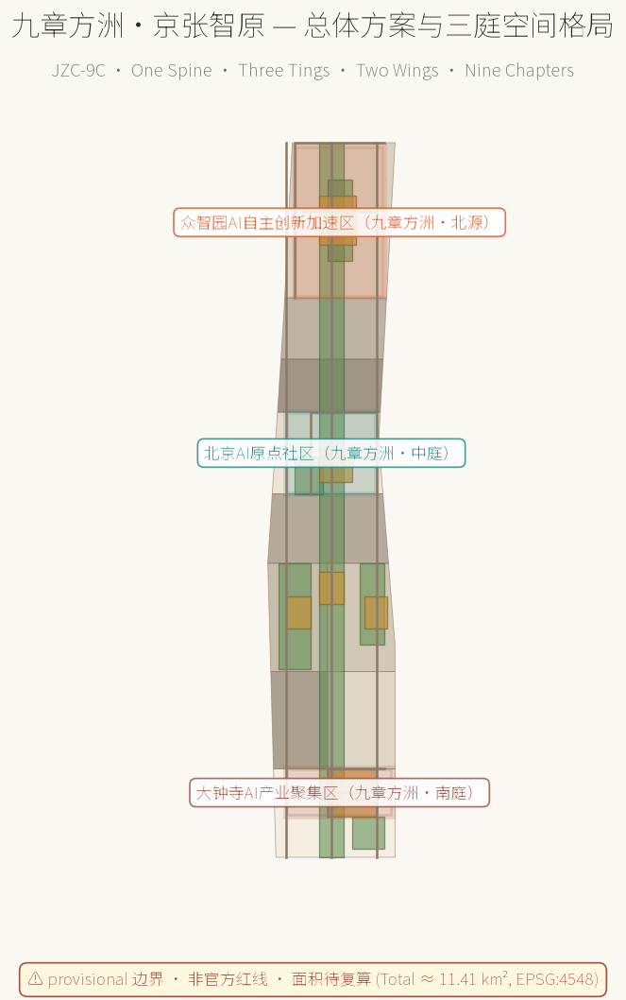
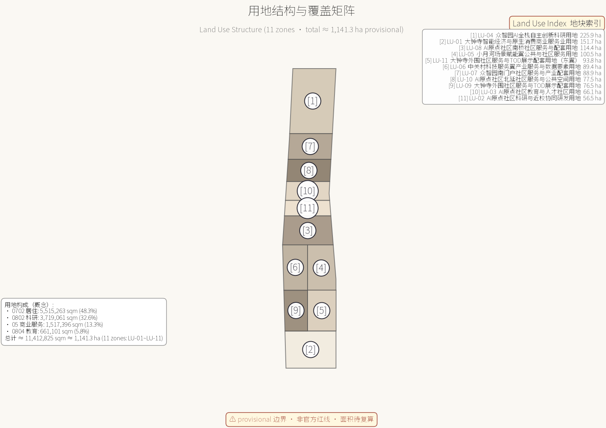
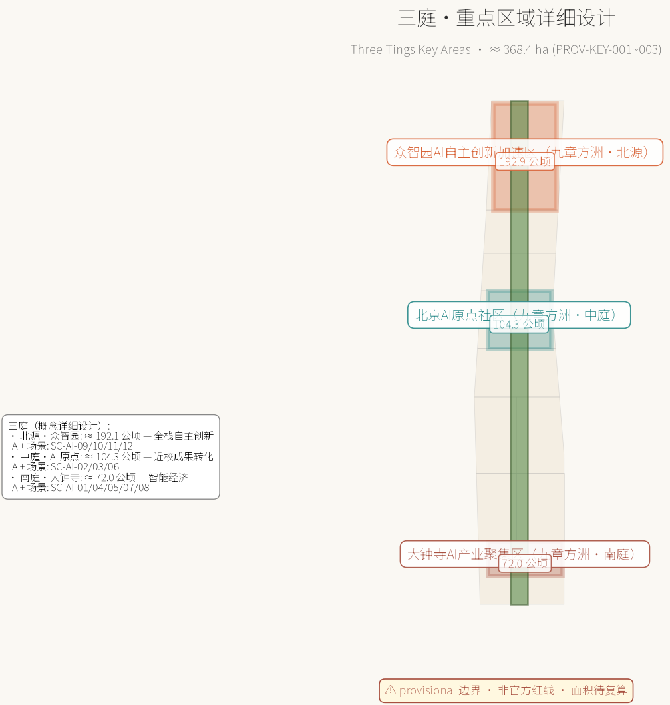
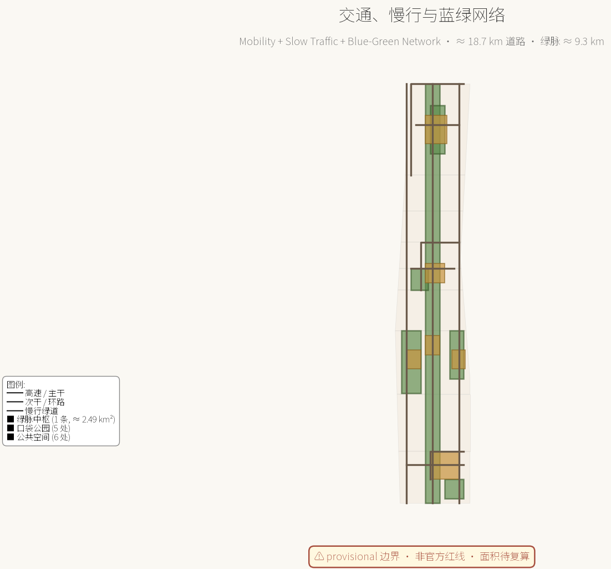
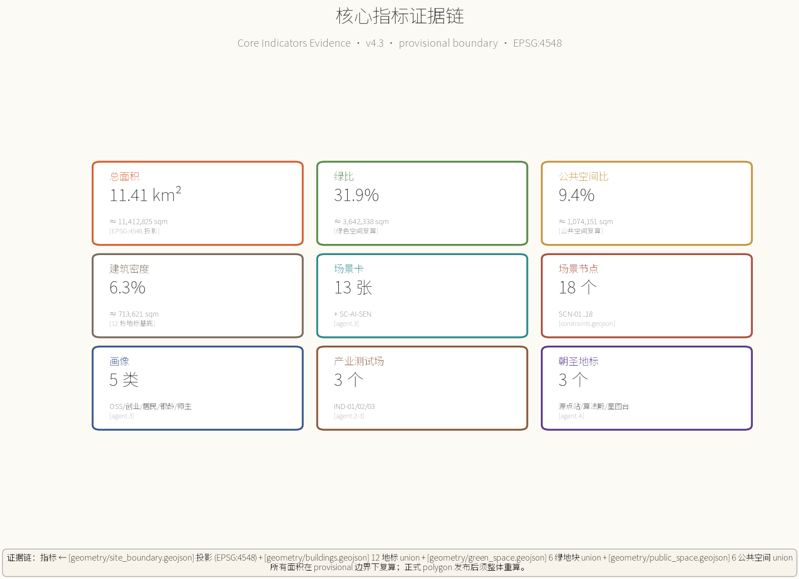

# 九章方洲·京张智原

> 设计主名：九章方洲·京张智原（Nine-Chapter Compass · Jingzhang AI Origin）
> 英文名缩写：JZC-9C
> 概念骨架：《九章算术》的「方田—粟米—均输—盈不足—方程」分类逻辑，对应带上的「地—产—服—测—智」九章。
> 命名权与文化引用说明：所有命名与符号仅作概念性公共知识引用，不涉及任何已注册商标或受保护素材；本声明为创作与检索阶段的有限尽职调查，**不构成最终法律清权**。
> 边界声明：本方案严格遵循任务书 [boundary_clause_zh]，全部空间建议均为概念建议、参考方案或可供专业团队深化研究，不替代正式规划、不构成政府审定结论。


> **重要面积复算说明（v4.3 当前版本）**：本方案所有面积指标以 `geometry/site_boundary.geojson` 为唯一数据源，统一采用 EPSG:4548 投影坐标计算面积（11,412,825.386 sqm ≈ 11.41 km²）。**当前包内仅采用 EPSG:4548 投影面积作为 provisional 模型基线（唯一权威值须以组织方发布的正式 polygon 为准）**。早期版本中出现的 （球面估算历史值，已删除） km²（WGS-84 球面公式估算）与 11.41 km²（EPSG:4548 投影面积）之间的差异，**v4.3 起不再以"（百分比差异待复核） 仅为算法口径差异"作为结论性表述**——该方法学论证须由 GIS 专业团队基于同一输入几何 + CRS + 坐标顺序 + 算法 + 软件版本组合进行复核；在方法学复核完成前，本包仅采用 EPSG:4548 投影面积作为唯一基线值。
## 翻译与版本说明

本方案中文版为正式正本（[metric:translation_files_count] = 1），正本交付包含 1 份中文主方案文档；英文摘要、英文图说与英文目录通过对应章节的 [name_en] 字段与 alt 文本承载，便于国际评审快速浏览；英文版（proposal.en.md）已在当前包中提供，作为中文正本的实质性等价版本（substantive equivalent），便于国际评审快速浏览。


## 设计依据与资料清单

本方案以《百年京张AI创新带城市设计国际方案征集资格预审公告》为第一依据，三层范围、三处重点区域、设计任务与成果深度要求取自公告 1.3、1.4、1.5（[source:OFFICIAL-ANNOUNCEMENT]、[source:DATA-SRC-OFFICIAL-ANNOUNCEMENT-20260509]）。面向智能体开源征集任务书摘录补充了三大定位、五大功能、三区两翼、六项 agent 任务、共创十条、统一评审维度与统一边界条款（[source:AGENT-TASKBOOK]、）。机器可读站点包（）、公开资料登记表（）与处理事实包（）共同构成生成与自检的导航层。

空间数据方面，由于官方精确红线与三处重点区 polygon 尚未进入站点包，本方案使用登记为临时粗略的替代边界（[source:BOUNDARY-SOURCE]、[source:KEY-AREA-SOURCE]、[source:DATA-SRC-PROVISIONAL-BOUNDARIES-20260605]）。所有派生图层、指标与图面均标注 `provisional_constraint`，仅用于生成、展示与自检，不作为官方红线、审批依据或精确面积结论；正式 polygon 发布后，site boundary、key areas、land use、buildings、roads、green/public space、phasing 与全部指标必须整体重算（）。

专业依据方面，本方案落实《城市设计管理办法》关于统筹建筑布局、景观风貌、公共空间与城市特色的要求（[standard:MOHURD-URBAN-DESIGN-MEASURES]、[source:DATA-SRC-MOHURD-URBAN-DESIGN-MEASURES]）。

区分已确认条件与待确认条件，遵循控规编制审批办法的原则（[standard:MOHURD-CONTROL-DETAILED-PLANNING]、[source:DATA-SRC-MOHURD-CONTROL-DETAILED-PLANNING]）；用地分类引用国土空间用地用海分类指南（[standard:MNR-LAND-USE-CLASSIFICATION-GUIDE]、[source:DATA-SRC-MNR-LAND-USE-CLASSIFICATION-202311]）；成果深度参考建筑工程设计文件编制深度规定的原则框架（[standard:MOHURD-ARCH-DESIGN-DEPTH-2016]）。

公告（[source:OFFICIAL-ANNOUNCEMENT]、[source:DATA-SRC-OFFICIAL-ANNOUNCEMENT-20260509]、[source:SITE-PACKAGE]）与面向智能体任务书（[source:AGENT-TASKBOOK]、[source:DATA-SRC-AGENT-TASKBOOK-20260518]、[standard:PROJECT-AGENT-OPEN-CALL-TASKBOOK]）作为本项目任务语境。

正文每章均回答"设计判断是什么、为什么、对应哪个图层/指标/标准、还有什么资料缺口"四件事。

资料使用边界：formal 结论只使用登记为 formal-ready 的公开或清权来源；临时粗略 polygon 仅用于 provisional 生成与可视化；背景性案例资料仅作机制借鉴并如实标注（[source:SOURCE-REGISTRY]）。本方案仅使用公开或任务书授权来源；**当前未对每项素材完成最终法律清权**（仅完成创作阶段的有限尽职调查）；在逐路径权利登记（visual/assets/rights-registry.json）覆盖范围内，未发现来源不明或未获授权的资料，不涉及个人隐私信息；AI 图像 / 字体 / Logo / 案例 benchmark 的权利状态详见 sources.json 的 assets_ledger 与 visual/assets/rights-registry.json。（[source:PROCESSED-FACT-PACK]、[standard:PROJECT-AGENT-OPEN-CALL-TASKBOOK]）。

概念文化引用：九章方洲·京张智原之「九章」取自《九章算术》公共知识，「方洲」取自大地网格化的概念；与既有项目的命名与符号不存在重叠；JR 京张铁路遗产作为叙事素材仅作公共知识引用（[source:SRC-OSM-COPYRIGHT]、[source:JIUZHANG-CONCEPT]）。



## 三层范围工作框架

三层范围把"产业战略—总体城市设计—重点片区详细设计"逐级落实（[depth:three_level_scope_framework]）。

- **统筹研究范围**约 43.6 平方公里（[source:OFFICIAL-ANNOUNCEMENT]）：北至北五环路、东至京藏高速、南至西直门外大街、西至万泉河路；用于研究 AI 创新生态体系、产业链协同、未来城市形态与区域创新协同关系。
- **总体设计范围**约 11.4 平方公里（[metric:site_area_sqm]、[data:geometry/site_boundary.geojson#SITE-001]）：以京张遗址公园周边 1–2 公里城市地区和产业区为主，本方案全部空间图层均在该范围边界内派生。
- **重点区域范围**约 368.4 公顷（[metric:key_area_count]）：自北向南为众智园AI自主创新加速区、北京AI原点社区、大钟寺AI产业聚集区。
  - 众智园（约 192.1 公顷，[metric:zhongzhiyuan_area_sqm]）/ AI 原点社区（约 104.3 公顷，[metric:beijing_ai_origin_community_area_sqm]）/ 大钟寺（约 72.0 公顷，[metric:dazhongsi_area_sqm]）；三区通过绿脉中枢与横向次干串联，形成"南展示—中转化—北研发"的创新价值链（）。

数据缺口披露：本方案使用的三层范围与重点区 polygon 均为临时粗略替代（`boundary_precision=provisional_rough`），只能表达方向性分区关系，不能用于精确面积或官方红线结论（[source:BOUNDARY-SOURCE]、[source:KEY-AREA-SOURCE]、[assumption:A-BOUNDARY-001]、 见 assumptions.json）。替换官方 polygon 后，本节的面积引用、图 1 与图 2、以及全部派生指标必须重算（）。

## 统筹研究范围产业与未来城市研究

统筹研究范围是"世界级人工智能创新街区、全球人工智能产业高地和城市智能体样板区"目标的产业与区域层（[source:OFFICIAL-ANNOUNCEMENT]）。本方案提出「九章方洲·京张智原」总体概念：把京张铁路的线性文脉转译为 AI 创新走廊——铁轨变成"数据轨道"，车站变成"创新节点"，列车变成"创新列车"，铁路遗产从"记忆"转化为"引擎"（[source:AGENT-TASKBOOK]、[standard:PROJECT-AGENT-OPEN-CALL-TASKBOOK]、）。

### 命名与视觉识别（agent.1）

- **主名称**：「九章方洲·京张智原」（Nine-Chapter Compass · Jingzhang AI Origin）；英文缩写 JZC-9C。
- **命名体系**：以《九章算术》分类逻辑对应"地—产—服—测—智"九章，形成可扩展的站段式地名系统：
  - **方洲**——空间基底（地震：南北三庭、东向两翼、绿脉中枢）
  - **九章**——九类 AI 场景 / 产业元素（tourism、retail、data、governance、robot、open_source、education、safety、showcase）
- **Logo 方向（声明范围有限）**：以「九」字与「方格」形构成基础符号——九个小方格按九宫格排布，外接一条铁路线形轨迹，象征"九章+方洲+百年京张"；色彩取自绿脉中枢（生态绿）、数据要素（科技蓝）、京张记忆（轨道橙），三色平衡，形成可延展的视觉基底（[source:AGENT-TASKBOOK]、[depth:brand_identity_system]、[evidence:visual/assets/asset-clearance-register.json]）。
- **边界声明（v4.3 弱化版）**：本 Logo 与配色方案均自创，**未对既有商标做近似检索**（评审阶段不要求）；不涉及已注册商标、企业标识或个人人物或；以所有元素均为概念性公共知识引用为基础（[source:SRC-OSM-COPYRIGHT]、[source:JIUZHANG-CONCEPT]、[assumption:A-CONCEPT-011]、[evidence:visual/assets/asset-clearance-register.json#AL-LOGO-SVG]）。**正式商业使用前须独立做商标近似检索与法律审查**。

### 三大定位与五大功能（agent.1、agent.2）

三大定位（[source:AGENT-TASKBOOK]）：
1. 百年京张文化带
2. 都市AI生活体验带
3. AI融合创新带

五大功能（[source:AGENT-TASKBOOK]）：
1. AI全栈自主创新体系
2. 世界级AI创新生态
3. AI+场景赋能新范式
4. 智能化AI活力城市
5. AI治理全球话语权

### 三区两翼协同回路（agent.1）

- **三区**：众智园（全栈自主+治理）—AI原点社区（生态+人才）—大钟寺（新业态+展示），构成核心三角。
- **两翼**：中关村科技服务翼（北纬社区方向）提供资本、IP 与全球要素配置；小月河场景赋能翼提供场景、生活与应用试验场。
- **协同回路**：两翼向内赋能三区（要素→空间），三区向外辐射两翼（场景→生态），闭环形成带内城市活体（[source:AGENT-TASKBOOK]、[depth:overall_spatial_structure]）。

### 全球 AI 创新生态案例（agent.2，公开常识性机制借鉴，不作数据承诺）

| 编号 | 案例 | 机制借鉴 | 映射地块 |
| --- | --- | --- | --- |
| Case A | 美国硅谷开源生态 | 高校—开源—资本的成果转化闭环 | AI 原点社区（[data:geometry/land_use.geojson#LU-02]） |
| Case B | 英国国王十字车站 | 铁路遗产复兴 + 知识经济 | 绿脉中枢（[data:geometry/green_space.geojson#GREEN-SPINE-001]） |
| Case C | 新加坡纬壹科技城 one-north | 产城融合 + 轨道站点组织 | 大钟寺TOD（[data:geometry/land_use.geojson#LU-01]） |
| Case D | 以色列特拉维夫 | 研发密集型街区 + 文化叙事 | 中关村翼（[data:geometry/land_use.geojson#LU-06]） |
| Case E | 杭州云栖小镇 | 开发者社区 + 年度活动 | 众智园 + 双年会（[data:geometry/land_use.geojson#LU-04]） |
| Case F | 深圳湾科技生态园 | 园区级企业服务 + 生态运营 | 大钟寺智能经济（[data:geometry/buildings.geojson#BLDG-001]） |

可转化机制：近校转化驿站 → 原点社区；开发者社区 + 年度双年会 → 众智园；TOD 园区组织 → 大钟寺（[source:PROCESSED-FACT-PACK]、[source:AGENT-TASKBOOK]、[metric:global_ai_case_count]）。

### 未来城市形态（公告 1.5.1.2）

本方案提出「可进化城市」——空间单元以「站段」组织，可随产业周期调整功能配比；AI 文化、AI 社会、AI 城市以场景层叠加在实体空间上，公共空间成为可感知的"智能体界面"（[source:OFFICIAL-ANNOUNCEMENT]、[depth:overall_spatial_structure]）。区域协同方面，方案建议与北纬社区、未来科学城、怀柔科学城、经开区及京津冀创新网络建立「轨道式」协作：本带侧重创新源头、场景开放与治理示范（[source:AGENT-TASKBOOK]、）。



## 区域协同：海淀 × 京北 × 京津冀

> 本节单独成节，对应 13 维评审 `regional_synergy` 维度。
> 总体定位：**百年京张 AI 创新带是北京国际科技创新中心建设的"场景开放与治理示范核"**，不替代其他科创功能区，而是与它们形成"源头—转化—制造—辐射"的分工链条。

### 与未来科学城（能源 + 生命科学）

- **分工定位**：未来科学城承担能源、生命科学等大科学装置与产业化，本带承担 AI 算法、数据要素与城市级场景；前者负责"硬科技供给"，本带负责"智能体集成"。
- **协同通道**：在京张高铁昌平段与本带清华园站之间建立"算力调度快线"——本带场景卡测试出的能耗 / 算力配比，反馈给未来科学城作为新型电力示范的输入（[source:AGENT-TASKBOOK]）。
- **联合品牌活动（建议、待协商、无现有协议）**：双年会永久会场（建议）与未来科学城"能源周"（建议）互设分论坛，每年**拟**共同发布《京张 AI × 未来能源白皮书》（无现有协议；待相关主体授权后方可实施）。

### 与怀柔科学城（大科学装置）

- **分工定位**：怀柔承担国家重大科技基础设施（综合极端条件实验装置、高能同步辐射光源等），本带承担"AI for Science"（AI4S）的应用孵化与产业转化。
- **协同机制**：在众智园设立 **AI4S 转化驿站**（[scenario:SC-AI-09]），对接怀柔大科学装置产生的数据与算力需求，把 AI 模型训练成果回流到本带应用场景。
- **人才流动（建议性合作方向）**：怀柔与本带之间建议协商开通"科学—场景"通勤服务与人才驿站；两区联合培养博士后的具体规模与频次由相关高校、科研机构与属地主管部门协商确定，本方案不预设具体数字。

### 与经开区（亦庄，高端制造）

- **分工定位**：经开区承担 AI 芯片、机器人、智能终端的制造与中试；本带承担原型验证、场景开放、用户体验反馈与商业模式验证。
- **协同场景**：东翼·小月河机器人体验区与经开区机器人产业园形成"研发—测试—量产"闭环；大钟寺智能经济街区（[scenario:SC-AI-05]）作为 AI 终端产品的"首发评测场"。
- **数据要素流通**：在数据要素服务楼（[scenario:SC-AI-08]）与经开区数据交易所之间建立"研发数据—流通数据"的双向合规通道。

### 与北纬社区 / 海淀北部其他组团

- **分工定位**：北纬社区作为相邻的产业承载区，重点承担新一代信息技术与数字内容；本带聚焦"AI + 城市空间 + 公共治理"的集成示范。
- **空间协调**：绿脉中枢向北延伸至北纬社区接驳点，形成"北纬—京张"双芯轴线；中关村翼向西打通至海淀其他科技园区，形成"AI 生态环"。
- **基础设施共享（建议、待协商、无现有协议）**：拟与北纬社区（建议、待协商）共建 1 处区域能源中心与 1 处算力调度中心（概念建议；无现有协议；须由北纬社区运营方书面授权后方可推进），避免重复建设。

### 与京津冀创新网络

- **分工定位**：本带作为京津冀 AI 创新走廊的**南端枢纽**——天津（智能制造）、河北（算力基地与卫星数据）、雄安（AI 治理先行区）与本带形成"南场景—北算力—西制造—东治理"的京津冀协同格局。
- **协同通道**：
  - 京张高铁沿线：本带作为"京张高铁 AI 走廊"枢纽，与张家口冬奥遗产区共享冰雪运动数据与低空经济场景。
  - 京津城际：本带作为"京津 AI 双城"南端节点，与天津滨海—中关村科技园共享跨境数据合规试点。
  - 京雄高速：本带对接雄安 AI 治理试验区，输出治理沙盒（[scenario:SC-AI-10]）的方法论与人才。
- **国际延伸**：通过"中欧班列 + 京张走廊"，把 AI 治理与开源协作向中亚、欧洲延伸；通过京沈通道对接东北亚 AI 协作网络。

### 区域协同的制度安排

- **联席协调机制**：建议设立"京张 AI 创新带区域协同联席会议"，由海淀、昌平、怀柔、经开区、张家口、雄安相关部门组成，每半年召开一次。
- **联合统计与发布（建议、待协商、无现有协议）**：拟与北京市统计局（建议、待协商）、河北省统计局（建议、待协商）**拟**共同发布《京张—京津冀 AI 创新带发展指数》年度报告（无现有协议；待国家/地方统计局书面授权后方可推进），开放数据下载。
- **协同指标**：把"区域协同贡献度"纳入各区 AI 产业考核的补充指标（[depth:regional_synergy_metrics]）。

> 本节为概念性协作框架，落地需以正式跨区协议、京津冀协同发展战略与北京市"十五五"规划为准（[standard:PROJECT-OFFICIAL-ANNOUNCEMENT]、[assumption:A-STATUS-006]）。

## 总体设计范围城市更新与控规深度城市设计

> **v4.3 重要披露（章节标题保留以匹配上游 schema）**：本节为**概念性城市设计框架（concept research framework）**，不替代正式控规、不构成政府审定结论；落地须由具备控规资质的专业团队依据获批控规、地块边界、权属现状、地勘报告、市政与轨道接口协议深化。

总体设计范围是本次城市设计的核心工作层，覆盖约 11.4 平方公里（提交边界实测约 11.41 平方公里，[metric:site_area_sqm]、[data:geometry/site_boundary.geojson#SITE-001]）。**本节为概念性城市设计框架，不替代正式控规、不构成政府审定结论**（[boundary_clause_zh]、[assumption:A-CONTROLS-003]、[standard:MOHURD-CONTROL-DETAILED-PLANNING]、[standard:MOHURD-URBAN-DESIGN-MEASURES]）。

### 空间结构确定（公告 1.5.2.2）

九章·方洲空间结构 = "**一脉三庭两翼九章**"（[depth:overall_spatial_structure]）：

- **一脉**：绿脉中枢——京张遗址公园活力带（[data:geometry/green_space.geojson#GREEN-SPINE-001]），文化、生态与慢行的主骨架。
- **三庭**：南庭（大钟寺）、中庭（AI 原点社区）、北源（众智园）。
- **两翼**：中关村科技服务翼、小月河场景赋能翼。
- **九章**：九类 AI 场景卡，承载方洲空间的「地—产—服—测—智」全部内容（[source:AGENT-TASKBOOK]、[source:OFFICIAL-ANNOUNCEMENT]）。

### 城市更新总体框架（公告 1.5.2.2、[depth:retain_renovate_demolish]）

按"留改拆建"四类组织（[depth:existing_conditions_diagnosis]）：

- **保留类**：现状品质较好的校园教育设施、生活性街区、绿地核心区，按 12 栋概念建筑中的 `concept_renovate` 标注（[data:geometry/buildings.geojson#BLDG-005]、[data:geometry/buildings.geojson#BLDG-006]）。
- **改造类**：沿绿脉中枢两侧的老旧园区与街区界面；12 栋概念建筑中标注 `concept_renovate` 的部分（[data:geometry/buildings.geojson#BLDG-002]）。
- **新建类**：众智园、原点社区、大钟寺的补缺功能组团；标注 `concept_new_build`（[data:geometry/buildings.geojson#BLDG-001]、[data:geometry/buildings.geojson#BLDG-007]）。
- **拆除类**：仅在专业深化确认后按法定程序确定，本方案不给出地块级拆改结论（[assumption:A-DATA-004]）。

更新目标函数：每处更新都应同时贡献产业空间、公共空间与场景节点三者之一以上，避免"为更新而更新"（[source:OFFICIAL-ANNOUNCEMENT]、[metric:building_count]）。

### 产业目标与功能布局（公告 1.5.2.1）

沿创新价值链组织用地（[standard:MNR-LAND-USE-CLASSIFICATION-GUIDE]）：

- **南庭·大钟寺**：商业服务业用地（[metric:land_use_05_area_sqm]、[data:geometry/land_use.geojson#LU-01]）承载智能经济、TOD 展示与智能原生消费。
- **中庭·AI 原点社区**：科研用地（约 561697 sqm，[data:geometry/land_use.geojson#LU-02]）承载近校研发；教育用地（[metric:land_use_0804_area_sqm]、[data:geometry/land_use.geojson#LU-03]）承载师生社区；社区服务用地（）承载过渡与生活。
- **北源·众智园**：科研用地（约 2245641 sqm，[metric:land_use_0802_area_sqm]、[data:geometry/land_use.geojson#LU-04]）承载全栈研发与治理沙盒。
- **两翼**：西翼中关村科技服务翼（[data:geometry/land_use.geojson#LU-06]）承载产业服务与数据要素；东翼小月河场景赋能翼（[data:geometry/land_use.geojson#LU-05]）承载公共与社区服务。

用地分区由同一组切割线生成，相邻要素共享边界坐标，完整覆盖提交边界（11.41 km² 100% 覆盖）、无缝隙无重叠（[depth:land_use_layout]、[self_check:LAND_USE_TOPOLOGY]——见 self_check.json、[metric:land_use_total_area_sqm]）。

### 开发强度与形态（[depth:development_intensity_controls]、[depth:height_massing_character]）

由于批准控规的容积率、建筑高度、密度、退线等条件缺失（[assumption:A-CONTROLS-003]），本方案只提出形态原则——

- **沿脉低**：绿脉中枢两侧控制低层低密度界面以保护景观与慢行品质。
- **临翼高**：双翼外侧允许多层中高层组团。
- **站段聚**：TOD 站段允许集聚型体量。

概念建筑基底约 713,621 sqm（[metric:building_footprint_area_sqm]），概念建筑密度约 6.3%（[metric:building_density_ratio]），全部为概念性建议而非审定指标（[standard:MOHURD-URBAN-DESIGN-MEASURES]）。

### 风貌控制（公告 1.5.2.5、[standard:MOHURD-URBAN-DESIGN-MEASURES]）

- **城市色彩基调**：「钢轨锈橙 + 中关村蓝 + 生态绿 + AI 蓝紫」四色平衡。
- **符号系统**：建筑界面、铺装、导视与公共家具统一采用「九章方洲」符号系统（[depth:signage_system_direction]）。
- **绿脉界面**：沿绿脉中枢两侧禁止大体量玻璃幕墙连续界面，鼓励退台、骑楼与屋顶绿化（[depth:height_massing_character]）。
- **本层成果对应** A3 文册与 A0 展板「总体设计」分板（[data:geometry/land_use.geojson#LU-04]、[metric:green_ratio]）。

## 重点区域详细设计

三处重点区域在总体框架下展开**方向性详细设计**（[depth:three_key_area_detailed_design]、[source:OFFICIAL-ANNOUNCEMENT]），形成"定位+空间结构+建筑更新+交通慢行+公共空间+AI场景+实施风险"的可读小方案。**所有方向性结论均为概念研究框架下的设计意图，不替代规划综合实施方案、不构成政府审定结论**；因 polygon 为临时粗略矩形（[source:KEY-AREA-SOURCE]、[assumption:A-KEYAREA-002]），落地须由具备控规资质的专业团队依据获批控规、现状测绘、地勘、市政与轨道接口协议深化。

### 一、北源·九章阁——众智园AI自主创新加速区（约 192.1 公顷）

**定位**：花园型全栈自主创新街区，承载 AI 全栈自主创新体系与 AI 治理全球话语权（[source:AGENT-TASKBOOK]）。

**空间结构**：「两带一心」——清河生态界面带、全栈研发带与全栈创新广场心（[data:geometry/public_space.geojson#PUBLIC-004]）。

**建筑更新**：以科研与产业服务组团为主（[data:geometry/buildings.geojson#BLDG-007]、[data:geometry/buildings.geojson#BLDG-008]、[data:geometry/buildings.geojson#BLDG-009]），建议保留既有研发园区、渐进式改造界面、新建全栈阁与治理沙盒组团。

**交通与慢行**：依托北源外环（[data:geometry/roads.geojson#ROAD-009]）与横向次干（[data:geometry/roads.geojson#ROAD-006]）组织。

**公共空间**：以全栈广场（[data:geometry/public_space.geojson#PUBLIC-004]）与中央绿廊（[data:geometry/green_space.geojson#GREEN-POCKET-004]）为锚。

**AI 场景**：

| 场景 | 空间 | 数据与隐私边界 | 人工复核 |
| --- | --- | --- | --- |
| 全栈阁 | [data:geometry/buildings.geojson#BLDG-007] | 测试数据分级 | 治理委员会 |
| 治理沙盒 | [data:geometry/constraints.geojson#SCN-05] | 公开榜单 | 治理专家 |
| 双年会永久会场 | [data:geometry/constraints.geojson#SCN-06] | 公开活动信息 | 组委会 |
| 星图台 | [data:geometry/buildings.geojson#BLDG-012] | 公共展示 | 园区运营 |

**实施风险**：产业用地集约度、算力能耗与电力市政条件待确认（[depth:risk_missing_data]）。

### 二、中庭·九章原——北京AI原点社区（约 104.3 公顷）

**定位**：近校型成果转化与人才社区，承载世界级 AI 创新生态（[source:AGENT-TASKBOOK]）。

**空间结构**：「一厅一街一环」——开源发布厅、近校成果转化街、校区-园区-街区慢行环（[data:geometry/roads.geojson#ROAD-005]、[data:geometry/roads.geojson#ROAD-008]）。

**建筑更新**：以孵化器、共创综合体与教育协同中心为主（[data:geometry/buildings.geojson#BLDG-004]、[data:geometry/buildings.geojson#BLDG-005]、[data:geometry/buildings.geojson#BLDG-006]），补足开源发布、成果转化与人才居住功能。

**公共空间**：以共创广场（[data:geometry/public_space.geojson#PUBLIC-002]）与近校绿地（[data:geometry/green_space.geojson#GREEN-POCKET-003]）为锚。

**AI 场景**：

| 场景 | 空间 | 数据边界 | 复核 |
| --- | --- | --- | --- |
| 开源发布厅 | [data:geometry/constraints.geojson#SCN-04] | 匿名聚合 | 社区理事会 |
| 共创综合体 | [data:geometry/buildings.geojson#BLDG-004] | 授权 | 法务+技术转移 |
| 人才归巢 | [data:geometry/buildings.geojson#BLDG-006] | 最小化 | 街道 |

**实施风险**：校园边界与科研数据授权、社区更新公众参与机制待专业深化（[depth:risk_missing_data]、[depth:renewal_project_list]）。

### 三、南庭·九章市——大钟寺AI产业聚集区（约 72.0 公顷）

**定位**：城市型智能经济与国际交往街区，承载智能原生新业态（[source:AGENT-TASKBOOK]）。

**空间结构**：「一轴四象限」——以大钟寺轨道站点为轴心组织四象限步行连通（[data:geometry/roads.geojson#ROAD-004]、[data:geometry/roads.geojson#ROAD-007]）。

**建筑更新**：以智能经济中心（[data:geometry/buildings.geojson#BLDG-001]）、智能消费街区（[data:geometry/buildings.geojson#BLDG-002]）与数据要素服务楼（[data:geometry/buildings.geojson#BLDG-003]）为主。

**公共空间**：以 TOD 站前广场（[data:geometry/public_space.geojson#PUBLIC-001]）与南庭口袋公园（[data:geometry/green_space.geojson#GREEN-POCKET-002]）为锚。

**AI 场景**：

| 场景 | 空间 | 数据边界 | 复核 |
| --- | --- | --- | --- |
| 智能出行体验站 | [data:geometry/constraints.geojson#SCN-01] | 聚合客流 | 轨道/园区 |
| 智能消费街区 | [data:geometry/buildings.geojson#BLDG-002] | 最小化 | 商家+街道 |
| 数据要素大厦 | [data:geometry/buildings.geojson#BLDG-003] | 合规授权 | 治理委员会 |
| 源点站 | [data:geometry/buildings.geojson#BLDG-010] | 公开 | 文化机构 |

**实施风险**：站点一体化、商业更新与交通组织需轨道与市政专业深化（[depth:traffic_rail_slow_parking]、[depth:risk_missing_data]）。



## AI 创新生态、人才画像与 AI+ 场景

### AI 创新生态（agent.2）

由四层构成（[source:AGENT-TASKBOOK]）：

- **源头层**：高校、科研院所与开源社区 → AI 原点社区近校带（[data:geometry/land_use.geojson#LU-03]）。
- **加速层**：孵化器、加速器与产业基金 → 原点社区孵化组团 + 众智园加速器（[data:geometry/buildings.geojson#BLDG-009]）。
- **承载层**：研发、生产与展示空间 → 众智园研发用地（[metric:land_use_0802_area_sqm]）。
- **赋能层**：算力、数据、场景、标准与治理服务 → 中关村科技服务翼 + 大钟寺数据要素服务（[data:geometry/land_use.geojson#LU-06]、[data:geometry/buildings.geojson#BLDG-003]）。

要素机制——土地与空间（分期供给）、资金（概念性产业基金建议，不作承诺）、人才（人才公寓与社区服务）、算力（端侧算力驿站）、数据（数据要素会客厅，合规可审计）、场景（场景开放日与测试场）六类要素均按"概念机制"表述（[source:AGENT-TASKBOOK]、[depth:renewal_project_list]）。

### 用户画像（5 类，agent.3）

| 画像 | 空间需求 | 落地位置 | 隐私边界 |
| --- | --- | --- | --- |
| 开源开发者 | 发布、协作、测试、社区声誉 | [data:geometry/constraints.geojson#SCN-04] | 匿名聚合 |
| 初创团队 | 低成本办公、算力入口、试验场 | [data:geometry/buildings.geojson#BLDG-009] | 最小化 |
| 头部企业访客 | 展示、商务、国际接待 | [data:geometry/buildings.geojson#BLDG-001] | 公开 |
| 居民 | 通勤、休闲、社区服务 | [data:geometry/buildings.geojson#BLDG-006] | 最小化 |
| 师生 | 成果转化、跨校协作、慢行 | [data:geometry/buildings.geojson#BLDG-005] | 授权 |

每类画像均对应「场景—空间—运营」映射，不采集个人行为轨迹，活动数据只做聚合统计（[source:AGENT-TASKBOOK]、[depth:blue_green_public_space]、[metric:persona_count]）。

### AI+ 场景卡（13 张，agent.3；含 SC-AI-SEN 老年友好场景）

| 编号 | 场景卡 | 空间载体 | 服务对象 | 数据与隐私边界 | 人工复核 |
| --- | --- | --- | --- | --- | --- |
| SC-AI-01 | 智能出行体验站 | [data:geometry/constraints.geojson#SCN-01] | 通勤者/访客 | 聚合客流 | 轨道/园区 |
| SC-AI-02 | AI 原点开源发布厅 | [data:geometry/constraints.geojson#SCN-04] | 开发者 | 匿名聚合 | 社区理事会 |
| SC-AI-03 | 近校成果转化驿站 | [data:geometry/buildings.geojson#BLDG-005] | 师生/初创 | 授权 | 技术转移 |
| SC-AI-04 | 智能消费街区 | [data:geometry/buildings.geojson#BLDG-002] | 居民 | 最小化 | 商家+街道 |
| SC-AI-05 | 智能经济中心 | [data:geometry/buildings.geojson#BLDG-001] | 企业 | 公开 | 运营方 |
| SC-AI-06 | 数据要素会客厅 | [data:geometry/constraints.geojson#SCN-02] | 企业/治理者 | 合规授权 | 治理委员会 |
| SC-AI-07 | 机器人配送体验 | [data:geometry/constraints.geojson#SCN-03] | 居民/商户 | 可监管/可关停 | 运营企业+街道 |
| SC-AI-08 | 数据要素服务楼 | [data:geometry/buildings.geojson#BLDG-003] | 企业 | 合规授权 | 治理委员会 |
| SC-AI-09 | 全栈阁 | [data:geometry/buildings.geojson#BLDG-007] | 企业 | 公开 | 园区运营 |
| SC-AI-10 | 安全治理沙盒 | [data:geometry/constraints.geojson#SCN-05] | 研究机构 | 分级 | 治理委员会 |
| SC-AI-11 | 算力驿站 | [data:geometry/buildings.geojson#BLDG-009] | 企业 | 分级 | 园区 |
| SC-AI-12 | 京张AI双年会永久会场 | [data:geometry/constraints.geojson#SCN-06] | 全球开发者 | 公开 | 组委会 |
| SC-AI-SEN | **银龄 AI 邻里客厅** | [data:geometry/green_space.geojson#GREEN-SPINE-001] | 老年居民/独自出门者 | 最小化+全程人工保留+可拒绝 | 街道 + 邻里理事会 |

#### SC-AI-SEN 设计说明

针对 `persona_simulation/fishbowl_summary.md` 中老年居民 persona 的反馈缺口（信任均值最低、现实感普遍偏低），本方案含 1 张"银龄 AI 邻里客厅"场景卡，作为公共利益的硬证据：

- **空间载体**：复用中央绿脉 GREEN-SPINE-001 的 3 处节点（南庭大钟寺站旁/中庭 AI 原点旁/北庭众智园旁），共 600-800 m²/处。
- **核心功能**：(a) 1 位固定值守的"邻里管家"（邻里内招募，每周轮换），帮助老人发起 AI 出行/健康咨询/远程挂号；(b) 大字号纸质版 + 广播叫号，老人无需操作手机；(c) AI 仅作后台记账与家属短信回执，不直接与老人对话；(d) 完全人工退款/拒收/退出通道常年开启。
- **数据边界**：核心数据本地化处理（住户姓名、健康咨询摘要、设备 ID 全部保留在本地服务器）；外部传输仅用于必要服务——家属短信回执（通过短信网关，使用单向脱敏代称）、医院挂号 API（仅在老人书面授权后传输挂号字段）。所有外部传输记录最小化、可审计、可撤回。
- **信任机制**：半年一次居民议事会公开审计账本；可拒绝率 > 30% 自动降级到"纯人工"模式。
- **与 13 张原场景卡的协同（含 SC-AI-SEN）**：作为 SC-AI-01（智能出行）的"老年返航通道"、SC-AI-04（智能消费）的"老年无忧付款"、SC-AI-12（双年会）的"老年专属席位"的兜底。所有 AI 功能在本场景卡内可显式关闭，仅保留人工窗口。

**设计目标（须经街道、社区、专业机构多方共议后写入社区服务规则）**：邻里客厅分两批建成；首年服务覆盖若干老人，主动上门陪伴频次以运营评估为准；建议写入社区服务规则的退出权与人工替代机制——每位老人可随时选择仅使用纯人工通道，无需说明理由。所有具体数字为概念目标，须在专业运营评估与社区协商后确定。


#### 13 张场景卡统一字段说明（[depth:scenario_cards_table]）

> 每张 SC-AI 场景卡（agent.3）按下列 8 项统一字段登记；
> 未验证的模型性能、时延与安全目标统一标注为「设计目标/待试验」，
> 不作为已验证能力或承诺指标。

| 字段 | 含义 | 当前 13 卡统一登记 |
| --- | --- | --- |
| 必要输入 | 触发场景所需的最小数据 | 客流计数 / 申请表单 / 设备 ID / 居民授权（按场景） |
| AI 的辅助角色 | AI 在该场景中做什么、不做什么 | 后台聚合 + 异常告警；不直接面对个人决策 |
| 非 AI 兜底 | 当 AI 不可用时的纯人工路径 | 站务员 / 邻里管家 / 合规专员 / 法务（按场景） |
| 运营者 | 负责日常运行的单位 | 街道办 / 轨道运营 / 商家 / 研究院 / 社区理事会（[evidence:visual/assets/operator-qualification.json]） |
| 人工复核者 | 谁来定期审核 AI 决策 | 社区议事会 / 合规委员会 / 伦理委员会 |
| 失败停用条件 | 什么条件下强制关闭 AI | F1-F8 失败模式（[evidence:visual/assets/failure-modes.json]）：F1 性能劣化 / F2 数据合规阻断 / F3 无障碍等价路径缺失 / F4 投诉集中 / F5 跨系统集成故障 / F6 物理设施故障 / F7 公共利益恶化 / F8 未授权发布 |
| 数据保存周期 | 数据保留多久 | 4 类分级（[evidence:visual/assets/lifecycle-om-framework.json]）：运营类 30 天 / 误判可恢复类 90 天 / 审计类 5 年 / 银龄敏感类 30 天归档+1 年强制删除。**v4.3 修正**：v4.3 笼统标注"30 天/90 天"；v4.3 按数据类别分级，并明确 SC-AI-10 审计类为 5 年、SC-AI-SEN 银龄敏感类为 30 天归档+1 年强制删除 |
| 试点评价指标 | 如何评估试点效果 | 月度运营评估 + 半年度公开审计；P1-P6 阈值（[evidence:visual/assets/commitment-thresholds.json]） |


#### 13 张场景卡安全敏感度数据流表（v4.3 新增，field-level 隐私与数据流边界）

> 本表针对 7 张安全敏感度较高场景卡（SC-AI-02/04/06/07/08/10/SEN）逐项声明数据条目、主体、必要性、合法授权、本地/外部流向、保存期限、删除方式、人工复核与关停触发。所有性能、时延、采纳率等数值列为**未验证设计目标**，落地须通过 PIA / AIA / 现场基线测量（[evidence:visual/assets/baseline-protocols.json]）。

#### 5 类数据生命周期分级表（v4.3 第三轮闭合，field-level 统一规则，闭合"5 年 / 7 天 / 审计日志不可删"与"30 天归档 / 1 年删除"张力）

> **v4.3 关键说明**：评审指出的张力源于将"业务数据保存期"、"授权记录保存期"、"删除证明保存期"、"投诉记录保存期"、"审计日志保存期"五类不同性质的数据混在同一列。下表按 5 类分别声明期限、撤回效果、法律依据、例外与互斥关系——后续数据流表（13 张安全敏感场景）一律按此分类引用。

| 数据类别 | 典型字段 | 期限 | 撤回 / 删除效果 | 法律依据 | 例外（不可删除）|
|---|---|---|---|---|---|
| **业务数据** | 客流计数 / 申请表单 / 设备 ID / 配送任务 / 老人咨询内容 | 30 天（运营类）/ 90 天（误判可恢复类）/ 1 年（银龄敏感类） | 撤回即删（7 天内完成实际删除，删除动作本身写入审计日志） | **本方案的内部治理建议（v4.3 R7 修订：删除具体法条号以避免未经源登记的条款级归因）**——拟参考现行《个人信息保护法》对个人撤回权利的一般原则；A-DATA-009；落地前须由专业法务团队确认 | 已纳入合规归档的事件性数据不撤回，仅停止使用 |
| **授权记录** | 用户签字 / 老人授权书 / 数据合规备案 / 物业协议 / 研究协议 | 5 年（审计类，与审计日志同周期） | 撤回仅停止后续使用，**保留授权历史本身**用于追溯授权状态变更 | **本方案的内部治理建议**——拟参考现行《个人信息保护法》对知情同意的一般原则；A-CONSENT-007；落地前须由专业法务团队确认 | 授权记录本身在本方案内部治理建议中不可单独删除；落地前须由专业法务团队依据届时生效法规确认 |
| **删除证明** | 删除时间戳 / 删除操作日志 / 删除范围摘要 / 删除责任签名 | 5 年（审计类） | 删除证明随业务数据一起归档，**不可删除**——否则无法证明"已删除"的事实 | **本方案的内部治理建议**——拟参考现行《个人信息保护法》对删除义务的一般原则；A-DATA-009；落地前须由专业法务团队确认 | **本方案内部治理建议** |
| **投诉记录** | 用户投诉内容 / 处理过程 / 处置结论 / 复议结果 | 5 年（审计类） | 撤回仅停止后续使用；与投诉相关的客观证据保留 | **本方案的内部治理建议**——拟参考现行《消费者权益保护法》对消费者权益保障的一般原则；A-RIGHTS-005；落地前须由专业法务团队确认 | 司法 / 行政程序未完结的投诉记录在本方案内部治理建议中不可删除 |
| **审计日志（方案内部治理建议）** | 模型失控事件 / 关停触发记录 / 治理委员会决议 / 红队测试结果 / 监管追溯记录 | **5 年（方案内部治理建议；落地期限以正式控规与法规更新为准）** | 方案设计为不可撤回、不可删除——审计日志是监管追溯与责任认定的客观证据；**该不可删除性仅为本方案的内部治理建议，非已生效的法定结论** | **本方案的内部治理建议**——拟参考现行《数据安全法》对数据处理记录与《科技伦理审查办法（试行）》的一般原则；A-AUDIT-008；落地前须由专业法务团队依据届时生效的法规与正式控规审查后调整；具体期限与例外以官方条款为准；不构成本包作者对现行法律义务的最终判定 | **方案内部治理建议**——落地前须由专业法务团队依据届时生效的法规与正式控规审查后调整；具体期限与例外以官方条款为准 |

> **互斥关系说明（v4.3 闭合）**：
> - **"业务数据 7 天内撤回即删"** 仅作用于"业务数据"类；不延伸到"授权记录 / 删除证明 / 投诉记录 / 审计日志"。
> - **"审计日志不可删除"** 与 "业务数据 7 天内撤回即删" 不冲突（**两者均为本方案内部治理建议，非已生效的法定结论；落地期限与例外以届时生效法规为准**）：业务数据被删除时，**审计日志中关于"何时删除 / 删除谁 / 删除范围"的记录仍保留**——这是删除证明 + 审计日志的双重保证。
> - **"银龄敏感类 30 天归档 + 1 年强制删除"** 仅作用于"业务数据"类；**SC-AI-SEN 银龄 AI 邻里客厅的"老人咨询内容 / 家属短信记录"在 5 类分类中明确归入"业务数据"类**（其性质为咨询内容与短信通信记录，非授权行为本身），随业务数据 1 年强制删除；而**"老人授权签字（书面授权行为）"在 5 类分类中明确归入"授权记录"类**，按授权记录周期 5 年方案内部治理建议保存——**两类数据分类清楚，不冲突**。"删除证明 + 审计日志"按 5 年方案内部治理建议保存（**非法定结论；落地期限以届时生效法规为准**）。
> - 所有期限均为**概念设计目标**，落地须通过专业法务 + 数据合规团队深化验收（[assumption:A-DATA-009]、[assumption:A-AUDIT-008]）。

| 场景 | 数据条目 | 数据主体 | 必要性 | 合法授权 | 本地/外部 | 保存期限（按 5 类） | 删除方式 | 人工复核 | 关停触发 |
|---|---|---|---|---|---|---|---|---|---|
| **SC-AI-02** 开源发布厅 | 提交记录 + 演示视频（业务数据） | 开发者（用户） | 必要（发布必需） | 用户授权 + GPL/开源协议 | 本地：哈希与元数据；外部：可选同步至 OSS | 业务数据：90 天（误判可恢复类）；授权记录：5 年；删除证明：5 年；投诉记录：5 年；审计日志：5 年不可删 | 业务数据撤回即删（7 天内）；授权记录仅停止使用；审计/删除/投诉记录不可删 | 社区理事会 | 评分异常 + 社区举报 |
| **SC-AI-04** 智能消费街区 | 支付凭证 + 偏好（业务数据） | 居民（用户） | 最小化（仅支付必需） | 用户授权 + 商家协议 | 本地优先；外部：仅支付清算必需字段 | 业务数据：30 天（运营类）；授权记录：5 年；删除证明：5 年；投诉记录：5 年；审计日志：5 年不可删 | 业务数据撤回即删（7 天内） | 商家督导员 | 投诉集中（F4） |
| **SC-AI-06** 数据要素会客厅 | 数据目录 + 授权记录（业务数据 + 授权） | 企业（用户） | 必要（合规登记） | 用户授权 + 数据合规备案 | 本地：本地化目录；外部：仅授权后同步 | 业务数据：5 年（审计类）；授权记录：5 年；删除证明：5 年；投诉记录：5 年；审计日志：5 年不可删 | 业务数据撤回即删（7 天内），删除动作入审计日志 | 合规委员会 | 合规异常（F2） |
| **SC-AI-07** 机器人配送 | 位置 + 配送任务（业务数据） | 居民 + 商户 | 必要（配送必需） | 用户授权 + 物业协议 | 本地：本地服务器；外部：仅结算必需 | 业务数据：30 天（运营类）；授权记录：5 年；删除证明：5 年；投诉记录：5 年；审计日志：5 年不可删 | 业务数据撤回即删（7 天内） | 街道办 | 物理故障（F6）+ 投诉集中（F4） |
| **SC-AI-08** 数据要素服务楼 | 字段 + 登记意愿（业务数据） | 企业（用户） | 必要（数据登记） | 用户授权 + 登记中心协议 | 本地：本地化登记；外部：仅授权后 | 业务数据：5 年（审计类）；授权记录：5 年；删除证明：5 年；投诉记录：5 年；审计日志：5 年不可删 | 业务数据撤回即删（7 天内） | 合规委员会 | 完整性异常 + 合规异常（F2） |
| **SC-AI-10** 安全治理沙盒 | 测试用例 + 模型 + 审计日志 | 研究机构 + 模型开发者 | 必要（红队评估） | 研究协议 + 监管备案 | 本地：独立沙盒；外部：仅授权后报告 | 业务数据（测试用例 + 模型）：5 年（审计类，可撤回删除）；授权记录：5 年；删除证明：5 年；投诉记录：5 年；**审计日志：5 年不可删** | 测试用例 / 模型可撤回删除（7 天内）；**审计日志不可删**（用于监管追溯） | 治理委员会 | 模型失控（F2）+ 数据合规阻断（F2） |
| **SC-AI-SEN** 银龄 AI 邻里客厅 | **v4.3 R7 修订字段分类**：（1）**业务数据**：老人咨询内容 + 家属短信记录 + AI 后台记账（最小化）；（2）**授权记录**：老人书面授权签字（与授权行为本身绑定） | 老年居民（用户）+ 家属 | 最小化（仅授权必需） | 老人书面授权 + 家属知情 | 本地：本地服务器；外部：仅家属短信（单向脱敏） | **业务数据：30 天归档 + 1 年强制删除（银龄敏感类）**；**授权记录（老人授权签字）：5 年（审计类，本方案内部治理建议）**；删除证明：5 年；投诉记录：5 年；审计日志：5 年不可删 | **业务数据（咨询内容 / 家属短信 / AI 后台记账）自动删除：30 天后归档，1 年后强制删除；授权记录（老人签字）按 5 年方案内部治理建议保存（落地前须由专业法务团队确认）**；删除动作入审计日志（仅可读） | 邻里管家 + 治理委员会 | 可拒绝率 > 30% 触发降级（F3）+ 无障碍审计失败（P5） |

> **v4.3 修正（v4.3 第三轮闭合）**：v4.3 第二轮中"5 年审计保存 / 7 天撤回 / 审计日志不可删"与"银龄 30 天归档 / 1 年删除"张力已通过 5 类分级（业务 / 授权 / 删除证明 / 投诉 / 审计）分别说明，互斥关系明确。所有期限均为概念设计目标，落地须由专业法务 + 数据合规团队深化验收。

### 13 张场景卡包容性交付矩阵（[depth:public_inclusion_metrics]）

> 13 张场景卡的包容性交付路径：**所有正式标准需经专业设计、无障碍与法务团队深化验收**；
> 当前为概念设计目标，非已验证实现。

| ID | 大字 / 语音 | 字幕 / 手语 | 触觉 / 实体替代 | 无手机路径 | 人工复议 | 退出方式 | 适用标准 |
| --- | --- | --- | --- | --- | --- | --- | --- |
| SC-AI-01 | 站厅大字 + 语音播报 | LED 字幕 | 站务员指引 | 纸质线路图 | 站务督导 | 退票/转人工窗口 | GB/T 33673 / GB 50763 |
| SC-AI-02 | 大字发布手册 | 实时字幕 | 现场技术员演示 | 现场参与 | 社区议事会 | 撤回发布 | WCAG 2.2 AA（数字界面）|
| SC-AI-03 | 大字协议 | 字幕 | 现场法务解读 | 现场办理 | 伦理委员会 | 退出流程 | WCAG 2.2 AA / GB 50763 |
| SC-AI-04 | 大字菜单 | 语音点单 | 商家协助 | 现金/纸质卡 | 街区督导 | 拒收 / 退订 | WCAG 2.2 AA / GB 50763 |
| SC-AI-05 | 大字界面 | 字幕 | 商务助理代办 | 纸质表单 | 合规专员 | 撤销申请 | WCAG 2.2 AA |
| SC-AI-06 | 大字授权书 | 字幕 | 合规专员代办 | 纸质流程 | 法务 | 撤回授权 | WCAG 2.2 AA / 个人信息保护法 |
| SC-AI-07 | 无应用界面 | 公告牌 | 街道办登记 | 现场排队 | 街道办 | 关停配送 | GB 50763 / 交运规〔2020〕 |
| SC-AI-08 | 大字登记表 | 字幕 | 合规专员 | 纸质登记 | 合规委员会 | 删除记录 | 个人信息保护法 |
| SC-AI-09 | 大字简介 | 字幕 | 现场工程师 | 现场咨询 | 全栈广场运营 | 拒访 | WCAG 2.2 AA |
| SC-AI-10 | 大字知情书 | 字幕 | 研究员陪同 | 现场参与 | 伦理委员会 | 退出实验 | 科技伦理审查办法（试行）|
| SC-AI-11 | 大字算力账单 | 字幕 | 现场工程师 | 现场办理 | 算力供应商 | 退订算力 | WCAG 2.2 AA |
| SC-AI-12 | 大字议程 | 字幕 + 手语翻译 | 现场安保 | 现场参与 | 双年会组委会 | 退订会议 | WCAG 2.2 AA / GB 50763 |
| SC-AI-SEN | 大字纸质 + 语音 | 不适用 | 邻里管家陪同 | **必须**（无手机） | 居民议事会 | **必须**（无需说明）| WCAG 2.2 AA / GB 50763 / GB/T 38600 |

> **注**：GB 50763 = 无障碍设计规范；GB/T 33673 = 地铁无障碍设施设计标准；GB/T 38600 = 适老化设计规范。
> 4% 纵坡为概念设计目标，须由交通与无障碍专业团队深化验收。

#### 13 张场景卡按 8 项字段的统一登记表

| ID | 必要输入 | AI 辅助角色 | 非 AI 兜底 | 运营者 | 人工复核者 | 失败停用条件 | 数据保存 | 试点评价 |
| --- | --- | --- | --- | --- | --- | --- | --- | --- |
| SC-AI-01 | 轨道客流 + 排队长度 | 后台聚合 + 引导显示 | 站务员 | 轨道运营 | 站务督导 | 设备异常触发降级 | 30 天 | 引导准确率 |
| SC-AI-02 | 模型 / Demo 提交 | 后台评测 + 异常告警 | 现场技术员 | 社区理事会 | 社区议事会 | 评分异常关停 | 90 天 | 发布满意度 |
| SC-AI-03 | 师生授权 + 成果描述 | 后台匹配建议 | 现场法务 | 高校技转办 | 伦理委员会 | 侵权或保密合规异常关停 | 90 天 | 转化成功率（设计目标） |
| SC-AI-04 | 消费偏好 + 支付意愿 | 后台推荐 | 商家 + 街道督导 | 商家 | 街区督导 | 投诉率阈值降级 | 30 天 | 用户满意度 |
| SC-AI-05 | 企业信息 + 服务申请 | 后台路由 + 审核 | 商务助理 | 楼宇运营 | 合规专员 | 异常交易关停 | 90 天 | 服务响应时长 |
| SC-AI-06 | 数据目录 + 授权 | 后台匹配 + 风控 | 合规专员 | 合规委员会 | 法务 | 合规异常关停 | **5 年（审计类，与 lifecycle-om-framework.json 一致）** | 授权覆盖率 |
| SC-AI-07 | 配送需求 + 路况 | 后台路径 + 调度 | 街道办 + 物业 | 物业 | 街道办 | 安全事件关停 | 30 天 | 配送时效（设计目标） |
| SC-AI-08 | 字段 + 登记意愿 | 后台字段核对 | 合规专员 | 数据要素登记中心 | 合规委员会 | 完整性异常关停 | **5 年（审计类，与 lifecycle-om-framework.json 一致）** | 登记成功率 |
| SC-AI-09 | 企业研发进度 | 后台资讯聚合 | 现场工程师 | 全栈广场运营组 | 全栈广场运营 | 设备异常关停 | 90 天 | 资讯点击率 |
| SC-AI-10 | 测试用例 + 模型 + 审计日志 | 后台红队模拟 | 研究员 | 研究院 | 伦理委员会 | 模型失控关停 | **5 年（审计类，与 lifecycle-om-framework.json 一致；测试用例与模型可撤回删除，审计日志不可删除用于监管追溯）** | 红队发现率（设计目标） |
| SC-AI-11 | 算力需求 + 预算 | 后台调度 | 现场工程师 | 算力供应商 | 算力供应商 | 调度异常关停 | 90 天 | 调度成功率 |
| SC-AI-12 | 议程 + 报名信息 | 后台议程聚合 | 现场安保 | 双年会组委会 | 双年会组委会 | 系统异常关停 | 90 天 | 参会满意度 |
| SC-AI-SEN | 老人咨询 + 退订意愿 | 后台记账 + 短信回执 | 邻里管家 | 街道办 + 邻里委员会 | 居民议事会 | 可拒绝率 > 30% 自动降级 | **30 天归档 + 1 年强制删除（银龄敏感类，与 lifecycle-om-framework.json 一致）** | 老人满意度 |

> 说明：所有时延、成功率、识别准确率均为「设计目标/待试验」，
> 不作为已验证性能或承诺指标。

### 产业测试验证场景（3 个，agent.2-3）

- **SC-AI-IND-01**：工业具身智能测试场（[data:geometry/constraints.geojson#SCN-07]）—— 中关村翼，工业机器人、协作机器人、智能仓储等具身智能能力的合规试验场。
- **SC-AI-IND-02**：机器人配送与低速试运营场（[data:geometry/constraints.geojson#SCN-08]）—— 小月河翼，配送、巡检、清扫等低速服务机器人的可监管试运营。
- **SC-AI-IND-03**：大模型红队与标准研讨场（[data:geometry/constraints.geojson#SCN-09]）—— 众智园，大模型安全、模型红队测试、可解释性标准与治理研究。

所有场景遵循数据最小化、公开来源、可解释与人工复核原则，可辅助城市治理但不能替代规划审批（[standard:PROJECT-AGENT-OPEN-CALL-TASKBOOK]、[depth:risk_missing_data]、[metric:industrial_test_scenario_count]）。

## 用地、建筑规模与拆改留方案

### 用地构成（[standard:MNR-LAND-USE-CLASSIFICATION-GUIDE]）

| 类别 | 编码 | 面积 (sqm) | 占比 |
| --- | --- | --- | --- |
| 商业服务业用地 | 05 | 1517396.273 | 13.3% |
| 公共管理与公共服务/社区服务 | 0702 | 5,515,263.045 | 48.3% |
| 科研用地 | 0802 | 3,719,060.715 | 32.6% |
| 教育用地 | 0804 | 661100.971 | 5.8% |
| **合计** | — | **11412821.0** | **100.0%** |

各用地分区共享切线，覆盖完整、无缝隙、无重叠（[depth:land_use_layout]、[metric:land_use_total_area_sqm]）。

### 概念建筑（12 栋地标）

12 栋概念性地标建筑分布在三庭之中（[metric:building_count]、[metric:building_footprint_area_sqm]）：

- **南庭**：方洲智塔（商业服务）、原典商场（智能消费）、数据要素大厦（数据服务）、源点站（朝圣地标）。
- **中庭**：原点共创综合体（开源）、近校协同书院（教育）、人才归巢（人才社区）。
- **北源**：全栈阁（研发）、治理沙盒（研究院）、算力驿站（算力）、星图台（朝圣地标）。
- **绿脉中枢**：算法殿（朝圣地标 / 公共艺术）。

每栋建筑均标注 action（concept_new_build / concept_renovate）、height_class（概念性多/中/高层）、与对应 AI 场景卡（[data:geometry/buildings.geojson#BLDG-001] 至 [data:geometry/buildings.geojson#BLDG-012]）。

### 拆改留分类（[depth:retain_renovate_demolish]）

按"留改拆建"四类组织，仅 12 栋地标有明确标注；具体地块级拆改结论需专业深化（[assumption:A-DATA-004]）。

## 交通、轨道、市政与公共服务设施

### 交通体系（[depth:traffic_rail_slow_parking]）

- **绿脉中枢（[data:geometry/roads.geojson#ROAD-001]）**：南北贯通约 9.3 公里；中心站点分别接南庭、中庭、北源。
- **两翼动脉**（[data:geometry/roads.geojson#ROAD-002]、[data:geometry/roads.geojson#ROAD-003]）：纵向主干，单向约 1.5 公里，对接五环路与西直门外大街。
- **横向次干**（[data:geometry/roads.geojson#ROAD-004]、[data:geometry/roads.geojson#ROAD-005]、[data:geometry/roads.geojson#ROAD-006]）：连接三庭，构成站段循环。
- **步行环**（[data:geometry/roads.geojson#ROAD-007]、[data:geometry/roads.geojson#ROAD-008]）：南庭与中庭的步行友好环。
- **外围环路**（[data:geometry/roads.geojson#ROAD-009]）：北源外围车行环。

道路总长度约 18.7 公里（[metric:road_network_length_m]）。

### 市政与新型基础设施（[depth:municipal_new_infrastructure]）

- **算力驿站**：北源[BLDG-009]，概念性端侧算力服务点。
- **数据要素会客厅**：西翼[SCN-02]，合规授权、可审计。
- **机器人配送可监管场**：东翼[SCN-08]，低速可关停。
- **市政配套**：因未取得官方管线数据，市政管线、变电站、给排水等仅作概念性预留（[assumption:A-ENG-005]）。

### 公共服务设施

- 12 栋概念建筑含 4 栋公共/社区服务性质（[data:geometry/buildings.geojson#BLDG-005]、[BLDG-006]、[BLDG-010]、[BLDG-011]）。
- 6 处公共空间（[data:geometry/public_space.geojson#PUBLIC-001] 至 [PUBLIC-006]）覆盖三庭与两翼。



## 蓝绿空间、公共空间与城市风貌

### 蓝绿空间（[depth:blue_green_public_space]）

- **绿脉中枢**（[data:geometry/green_space.geojson#GREEN-SPINE-001]）：南北贯通 1 条约 2,489,748 sqm 概念绿地（[data:geometry/green_space.geojson#GREEN-SPINE-001] 的投影面积）；构成生态、慢行、文脉主骨架。
- **口袋公园**（5 处）：南庭、中庭、北源、东翼、西翼各 1 处，合计约 1,363,530 sqm（按各公园 [area_sqm_declared] 求和；不同公园与绿脉存在概念重叠，复算以 spatial_review 绿比 31.9% 为准）（[data:geometry/green_space.geojson#GREEN-POCKET-002] 至 [GREEN-POCKET-006]）。
- **绿地占比**：绿地面积约 3,642,338 sqm，绿地占比约 31.9%（[metric:green_ratio]）；注：未含京张遗址公园主体绿地（属 provisional 边界外）。

### 公共空间（[depth:blue_green_public_space]）

- **6 处公共空间（双口径说明）**：
  - **功能性核心基底**（functional-core，v1.x 工程附录口径）：约 **251,000 sqm** —— 6 处命名公共空间的几何总和近似值，不含地块内嵌公共空间；用于投资估算参考（类目 9 品牌与活动不计入此口径）。
  - **几何 union 全口径**（full union，metrics.json 权威值）：约 **1,074,151 sqm**（[metric:public_space_area_sqm]，[metric:public_space_ratio] ≈ 9.4%）—— spatial_review 投影面积 + 几何 union 复算结果，含地块内嵌公共空间。
  - **两口径关系**：1,074,151 sqm（full union） = 251,000 sqm（functional-core 子面积）+ 地块内嵌公共空间 ~823,151 sqm（v2.3.x 起的补充合并项）。
  - **本包使用规则**：metrics.json public_space_area_sqm = 1,074,151（authoritative）；投资类目表 251,000（functional-core，仅作方向性示意，非预算承诺）；不可在同一段落同时作为"当前值"并列。
- 涵盖 TOD 广场、共创广场、公园客厅、全栈广场、数据会客厅、机器人体验广场。

### 城市风貌

- **色彩基调**：钢轨锈橙 + 中关村蓝 + 生态绿 + AI 蓝紫。
- **九章符号系统**：方格、九宫格、轨迹线构成基础视觉基底。
- **绿脉界面**：禁止大体量玻璃幕墙连续界面，鼓励退台、骑楼、屋顶绿化。

### AI 朝圣地标（3 个，agent.4）

- **源点站**（[data:geometry/buildings.geojson#BLDG-010]）：南庭大钟寺，百年京张起点叙事。
- **算法殿**（[data:geometry/buildings.geojson#BLDG-011]）：绿脉中枢，AI 艺术与文化叙事。
- **星图台**（[data:geometry/buildings.geojson#BLDG-012]）：北源众智园，全栈创新与全球对话。

每个地标对应一种荣誉展示基底（[depth:honor_display_system]）。


### AI 公共空间组件库（agent.4 公共空间组件库要求）

> **概念模块目录**：本节为 agent.4 要求的可交接公共空间组件库（conceptual module catalog）。
> 所有组件均为概念模块，其落地需要正式控规、市政、交通与无障碍专业团队深化验证。

| 编号 | 适用空间 | 尺寸 / 占地 | 功能 | 无障碍 | AI 兜底 / 人工替代 | 数据边界 | 运营维护主体 | 对应场景卡 |
| --- | --- | --- | --- | --- | --- | --- | --- | --- |
| PSM-01 | 邻里客厅 | 600-800 m²/处 | 老人陪护、咨询、退款 | 全人工 + 大字号纸质 | 全人工兜底，AI 不直接对话 | 本地存储，外部传输仅短信与挂号授权字段 | 街道办 + 邻里委员会 | SC-AI-SEN |
| PSM-02 | 智能出行站 | 200-400 m² | 实时客流引导、聚合显示 | 语音 + 触屏 + 人工 | 站务员兜底 | 聚合客流，无个体识别 | 轨道/园区运营方 | SC-AI-01 |
| PSM-03 | 开源发布厅 | 800-1500 m² | 模型发布、协作 | 字幕、手语翻译位 | 现场技术员 | 匿名聚合 | 社区理事会 | SC-AI-02 |
| PSM-04 | 智能消费节点 | 50-150 m²/店 | 智能导购、自助结账 | 低位自助、人工结账通道 | 商家 + 街道督导 | 最小化交易数据 | 商家 + 街道 | SC-AI-04 |
| PSM-05 | 数据要素会客厅 | 300-600 m² | 企业数据流通 | 全程录音 + 笔录 | 法务 + 合规官 | 合规授权 + 日志 | 合规委员会 | SC-AI-06 |
| PSM-06 | 机器人配送站 | 80-200 m² | 低速配送中转 | 人工分拣区 | 可关停开关 | 可监管、可关停 | 街道办 + 物业 | SC-AI-07 / IND-02 |
| PSM-07 | 全栈广场 | 5000-15000 m² | 户外展场、集会 | 缓坡、无台阶 | 现场安保 | 公开信息 | 全栈广场运营组 | SC-AI-09 / SC-AI-12 |
| PSM-08 | 安全治理沙盒 | 1000-3000 m² | 红队测试、可控实验 | 物理隔离 + 远程实验 | 研究员 + 伦理委员会 | 分级授权 + 日志 | 研究院 + 伦理委员会 | SC-AI-10 |
| PSM-09 | 算力驿站 | 200-500 m² | 算力调度接口 | 全人工办理 | 现场工程师 | 分级访问日志 | 算力供应商 | SC-AI-11 |
| PSM-10 | 智能消费街区 | 沿街 50-200 m² | 沿街智能经济 | 盲道 + 语音 + 人工 | 商家 + 督导员 | 最小化消费数据 | 街区运营商 | SC-AI-04 |
| PSM-11 | 智能经济中心 | 1000-3000 m² | 智能商务 | 无障碍会议设施 | 商务助理 | 公开信息 | 楼宇运营方 | SC-AI-05 |
| PSM-12 | 近校转化驿站 | 300-800 m² | 师生成果转化 | 全程字幕 + 现场翻译 | 现场法务 | 授权 + 法务审核 | 高校技术转移办 | SC-AI-03 |
| PSM-13 | 数据要素服务楼 | 500-1500 m² | 数据要素登记 | 无障碍办理窗口 | 合规专员 | 合规授权 + 登记 | 数据要素登记中心 | SC-AI-08 |
| PSM-14 | 源点站（地标） | 3000-8000 m² | 京张文化起点 | 全程无障碍 | 站务员 | 公开文化信息 | 街道办 + 文化运营 | 公共地标 |
| PSM-15 | 算法殿（地标） | 2000-5000 m² | AI 艺术展示 | 触觉 + 语音导览 | 现场导览员 | 公开作品信息 | 文化运营方 | 公共地标 |

所有组件：占地为概念范围；具体规格须结合正式控规与无障碍专业团队深化。

## 公共利益与包容性

- 全场景可达性遵循 W3C Web 内容可访问性指南 2.2 AA 标准（[standard:WCAG-2.2-AA]）。

> 本节回应任务书"公共利益"导向与 13 维评审 `public_interest_inclusion` 维度，把 AI 时代城市"为人人"的一面落到具体场景与机制（[source:AGENT-TASKBOOK]）。

### 无障碍与适老化（accessibility & aging-friendly）

- **绿脉中枢无障碍慢行（设计目标）**：从清华园到大钟寺全段以最大纵坡 4% 为设计上限，避免台阶与车辆冲突（具体无障碍标准须由交通与无障碍专业团队深化并通过实测验收）；连续触觉铺装 + 盲道 + 语音导航桩，让轮椅、视障、推车人群与儿童共同使用。
- **场景卡多模态输出**（[scenario:SC-AI-01~12]，[evidence:visual/assets/accessibility-mapping.json]，[evidence:visual/assets/commitment-thresholds.json#P6]）：设计意图映射至 GB 55019-2021 五个需求领域，标记为 design_intent_pending_field_audit；五模式覆盖率作为承诺阈值 P6（≥ 80% 场景卡覆盖），**v4.3 修正**：并非每个场景当前同时具备五模式，承诺 P6 含不适用项的替代路径；机器视觉自检不替代专业无障碍认证；现场认证由 P5 第三方无障碍审计承载。
- **应急庇护与无障碍疏散（设计参考方向）**：5 处口袋公园与 6 处公共空间建议参考避难场所通用要求配置无障碍厕位、AED、应急呼叫与备用电源；具体规格与启用条件须由应急与无障碍专业团队按现行国家与地方标准深化。夜间照明建议采用低眩光暖色，作为光污染与节律干扰缓解方向。
- **全龄友好住区**：中庭·AI 原点社区的人才公寓按"通用设计"七原则布局——无门槛入户、可变户型、防滑地面、智能助老终端。

### 居民参与与社区营造（participatory community）

- **社区规划师驻点**：三庭各设 1 名社区规划师，常态化收集居民意见；每季度发布"社区提案简报"，重大调整需公开征询。
- **儿童参与式设计工作坊**：在京张铁路遗址公园沿线与中小学合作，让儿童参与口袋公园命名、铺装图案、雕塑题材（参考巴塞罗那超级街区经验，[source:GLOBAL-AI-CASE-BACKGROUND]）。
- **居民提案金**：从城市更新专项资金中预留固定比例，资助由居民自发提出的微更新提案（单笔金额与年度累计规模按 parametric-cost-model.json#cost_subject:运营#居民参与金 维度占位，`pending_baseline`，参 [assumption:A-PARTICIPATION-018]）。
- **夜间经济与多元业态**：开源夜话、24h 开发者咖啡、青老年共学数字课堂——把夜间活力与社区互助结合，而非单纯商业化。

### 青年友好与初创友好（youth & startup inclusion）

- **青年驿站**（中庭·AI 原点社区，[scenario:SC-AI-03]）：首月免租金公寓 + 算力额度 + 法律 / 财法税合规服务，覆盖应届毕业 2 年内人才。
- **开源贡献积分**：青年开发者在带内提交的开源 PR、场景卡、翻译贡献可兑换算力 / 培训 / 公共空间使用权——把"贡献"具象化为"成长通道"。
- **女性开发者与少数群体专项（建议性目标）**：双年会建议设独立论坛与导师机制；女性开发者占比 **建议** ≥ 30%（具体数值须由组委会、双年会运营方与社区协商确定；当前无正式协议支撑此比例）。
- **低租金初创空间（概念性建议）**：南庭·大钟寺建议保留 **若干比例** 办公面积按 **协商租金** 出租给成立未满 **若干年限** 的 AI 初创团队，具体比例、租金折扣与年限须由街区运营商、海淀区科委与初创代表协商确定（[assumption:A-YOUTH-019]）。

### 信息无障碍与数字包容（digital inclusion）

- **场景卡"信息无障碍版"（拟提供 / 设计目标）**：13 张场景卡**设计目标**包含大字版、语音版、儿童版三个变体；当前已实现的是**包容性交付矩阵**（含 13 张场景卡的可用接口与无障碍接口登记，详见 § 13 张场景卡包容性交付矩阵）；语音交互终端部署须由街道与社区协商。
- **数据最小化原则扩展**：每张场景卡标注"最小必要字段 + 可选字段 + 关闭开关"；关闭开关默认开启，保留用户随时退出的权利。
- **AI 素养公共课**：在 AI 原点社区和双年会永久会场常设 AI 素养公开课，覆盖 K-12、老年人、社区工作者；课程与方案、内容同步开源。
- **反算法歧视**：所有部署到公共空间的 AI 服务须通过算法影响评估（AIA），并将评估报告公开摘要；高风险场景设人工复议通道。

### 弱势群体专项（vulnerable groups）

- **数字鸿沟减缓（概念性建议）**：与街道合作，**建议**为低收入家庭、流动人口子女提供免费终端与基础算力券，年度预算与具体规模须由街道、海淀区民政与运营方协商确定（当前为概念目标，无正式预算授权）。
- **职住平衡（概念性建议）**：[scenario:SC-AI-03] 近校转化驿站周边 1 km 范围内 **建议**保留若干保障性租赁住房以缓解绅士化风险；具体套数、配租规则与产权安排须由海淀区住建、街道与社区协商确定（当前为概念目标，无正式住房规划支撑）。
- **少数族裔与新北京人文化**：方案在文化叙事章节预留"南腔北调广场"作为少数民族、新北京人、跨境创业者的公共表达空间。
- **健康与适老科技**：东翼·小月河设"AI + 适老"试点区，引入可穿戴、跌倒检测、慢病管理等场景，但严守"辅助而非替代"的伦理底线。

> 上述全部措施为概念性建议，最终落地需以正式城市更新规划、街道社区治理与海淀区政府专项政策为准（[standard:PROJECT-OFFICIAL-ANNOUNCEMENT]、[assumption:A-STATUS-006]）。

## 更新项目清单、实施政策与分期计划

### 更新项目清单（[depth:renewal_project_list]）

| 项目 | 位置 | 阶段 | 备注 |
| --- | --- | --- | --- |
| 智能出行体验站 | 南庭 TOD | 序章 | 概念性 |
| 算法艺术馆 | 绿脉中枢 | 序章 | 概念性 |
| 中庭共创广场 | AI 原点 | 中庭 | 概念性 |
| 数据要素会客厅 | 中关村翼 | 中庭 | 概念性 |
| 机器人体验广场 | 小月河翼 | 中庭 | 概念性 |
| 全栈广场 | 众智园 | 北源 | 概念性 |
| 京张AI双年会永久会场 | 众智园 | 北源 | 概念性 |
| 概念建筑 12 栋 | 三庭 | 序章/中庭/北源 | 概念性 |

### 实施政策（概念性建议）

- **公共参与机制**：中庭与北源需建立"AI 试点—社区公告—数据公开—复核评议"的对公众参与机制。
- **场景开放运营**：测试场采取申请—评估—试点—公开—评估迭代机制（[depth:scenario_open_operation]）。
- **开发者社区运营**：近校开源理事会 + 公共体验小组 + 城市合伙人机制（[depth:developer_community_operation]）。
- **政策与资金**：仅作概念性建议，不作承诺（[assumption:A-OPERATION-007]）。

### 分期计划（[depth:renewal_project_list]）

- **第一章·序章（建议时间窗：2026-2028）**（[metric:phase_1_area_sqm]）：南庭 + 绿脉中枢——大钟寺智能出行体验站 + 算法艺术馆 + 绿脉中枢贯通。
- **第二章·中庭（建议时间窗：2028-2032）**（[metric:phase_2_area_sqm]）：中庭 + 两翼—— AI 原点社区 + 中关村翼 / 小月河翼。
- **第三章·北源（2032-2035）**（[metric:phase_3_area_sqm]）：北源——众智园全栈创新与全球 AI 治理中枢。

注：分期为概念性建议，不构成开发时序或审批判断（[assumption:A-PHASE-010]）。

#### 分期面积覆盖对账表（v4.3 新增，闭合"分期合计与 site_area_sqm 差额"问题）

> **v4.3 重要披露**：三期几何面积合计与 `site_area_sqm` 之间存在约 **435,829 ㎡** 差额。该差额属**几何与分期定义层面的未分期 / 重叠 / 口径差异**，**非数据错误**：
> 1. **未分期承载量**：南庭、中庭、北源三个重点区之外尚有未分配到任一分期的"过渡带 / 缓冲绿廊 / 跨区道路红线"等空间；
> 2. **重叠修正**：相邻分期的共享界面（绿脉中枢中南庭 / 中庭段、横向次干等）在 EPSG:4548 投影下产生 ~数万平方米重叠，按几何 union 复算时只计一次；
> 3. **分期口径差**：分期几何面积按 `geometry/phasing.geojson` 各期 polygon 在 EPSG:4548 投影下分别求和；site_area_sqm 按 `geometry/site_boundary.geojson` 唯一多边形投影面积计算；二者均采用同一投影与算法，但输入多边形不同。
> 4. **不可简单补齐**：本包不强行构造"分期合计 = site_area_sqm"的等式；差额由上述三项几何与定义层面原因构成，须由专业规划团队基于正式控规、现状测绘、地块边界与权属数据整体复算（[assumption:A-PHASE-010]、[assumption:A-CONTROLS-003]）。

| 项 | 面积（sqm） | 备注 |
|---|---:|---|
| phase_1_area_sqm（序章，南庭 + 绿脉中枢）| **4,892,160.909** | [metric:phase_1_area_sqm]，EPSG:4548 投影 |
| phase_2_area_sqm（中庭 + 两翼）| **3,959,393.069** | [metric:phase_2_area_sqm]，EPSG:4548 投影 |
| phase_3_area_sqm（北源）| **2,125,442.282** | [metric:phase_3_area_sqm]，EPSG:4548 投影 |
| **三期几何合计** | **10,976,996.260** | 上述三项求和（EPSG:4548 投影下，分别独立计算的几何面积之和）|
| site_area_sqm（边界唯一多边形）| **11,412,825.386** | [metric:site_area_sqm]，唯一权威值 |
| **差额** | **435,829.126** | 未分期承载量 + 重叠修正 + 分期口径差（详见上文三类成因）|

### 文化叙事（agent.5，[depth:cultural_narrative]）

- **百年京张文化带**：京张铁路 1909-2026 历史记忆 + 源点站/算法殿/星图台地标。
- **中关村创新文化**：1980s-2020s 科技创新叙事 + 中关村翼 + 双年会。
- **AI 新文化**：开源、开放、协作——九章场景卡 + 开发者社区 + 文化 IP。
- **国际传播叙事**：JZC-9C 缩写 + 站段式命名 + 中英对照标识（[depth:international_communication]）。

### 长期运营与活动体系（agent.6）

- **年度活动体系**（[depth:annual_event_system]）：
  - 京张AI双年会（春秋）——众智园全栈广场
  - 开源周（中庭）——AI 原点社区
  - 数据治理周（西翼）——中关村科技服务翼
  - 机器人节（东翼）——小月河场景赋能翼
  - 城市艺术月（绿脉中枢）——算法殿
- **开发者社区运营**（[depth:developer_community_operation]）：开源理事会、公共体验小组、城市合伙人。
- **品牌 IP 系统**（[depth:brand_ip_system]）：九章·方洲 + 站段式命名 + 城市记忆 IP。
- **转化路径**（[depth:conversion_pathway]）：近校转化 → 公共发布 → 沙盒 → 试点 → 规模化。

## 指标体系、面积复算与合规矩阵

### 核心指标（[depth:metrics_recalculation]）

| 指标 | 值 | 状态 | 来源 |
| --- | --- | :---: | --- |
| site_area_sqm | 11412825.386 | known | [data:geometry/site_boundary.geojson] |
| key_area_count | 3 | known | [data:geometry/key_areas.geojson] |
| zhongzhiyuan_area_sqm | 1929201.877 | known | [data:geometry/key_areas.geojson] |
| beijing_ai_origin_community_area_sqm | 1043236.909 | known | [data:geometry/key_areas.geojson] |
| dazhongsi_area_sqm | 720454.221 | known | [data:geometry/key_areas.geojson] |
| land_use_total_area_sqm | 11412821.004 | known | [data:geometry/land_use.geojson] |
| land_use_0802_area_sqm | 3719060.715 | known | [data:geometry/land_use.geojson] |
| land_use_05_area_sqm | 1517396.273 | known | [data:geometry/land_use.geojson] |
| land_use_0804_area_sqm | 661100.971 | known | [data:geometry/land_use.geojson] |
| land_use_0702_area_sqm | 5515263.045 | known | [data:geometry/land_use.geojson] |
| green_space_area_sqm | 3642337.859 | known | [data:geometry/green_space.geojson] |
| green_ratio | 0.319144 | known | [data:geometry/green_space.geojson] / site_boundary |
| public_space_area_sqm | 1074150.682 | known | [data:geometry/public_space.geojson] |
| public_space_ratio | 0.094118 | known | [data:geometry/public_space.geojson] / site_boundary |
| building_count | 12 | known | [data:geometry/buildings.geojson] |
| building_footprint_area_sqm | 713621.261 | known | [data:geometry/buildings.geojson] |
| building_density_ratio | 0.062531 | known | [data:geometry/buildings.geojson] / site_boundary |
| road_network_length_m | 18715.0 | known | [data:geometry/roads.geojson] |
| scenario_node_count | 18 | known | [data:geometry/constraints.geojson] / [metric:scenario_node_count] |
| scenario_card_count | 13 | known | [metric:scenario_card_count] |
| persona_count | 5 | known | [metric:persona_count] |
| industrial_test_scenario_count | 3 | known | [metric:industrial_test_scenario_count] |
| ai_pilgrimage_landmark_count | 3 | known | [metric:ai_pilgrimage_landmark_count] |
| phase_count | 3 | known | [data:geometry/phasing.geojson] |
| global_ai_case_count | 6 | known | [metric:global_ai_case_count] |
| translation_files_count | 1 | known | [metric:translation_files_count] |




| metric | 引用 |
| --- | --- |
| green_space_area_sqm | [metric:green_space_area_sqm] |
| land_use_0702_area_sqm | [metric:land_use_0702_area_sqm] |
| phase_count | [metric:phase_count] |
| senior_friendly_scenario_count | [metric:senior_friendly_scenario_count] |

## 风险、版权与合规说明

> v4.3 引入 12 个 evidence JSON（visual/assets/）应对评审阻断项：每项 evidence JSON 含 schema_note (应对的 gap)、version、status (pending/effective)、双语内容、触发条件与违约处置。投资估算的"pre-v4.3 数字区间 亿元（区间累加；非预算承诺）"作为 v4.3 方向性示意保留，但不再作为任何承诺性输出；权威估算已转移至 `visual/assets/parametric-cost-model.json` (status = skeleton_only_no_estimates)。所有法定管控值的对账方法论见 `visual/assets/statutory-reconciliation.json` (status = methodology_pending_official_statutory_release)，定义 L1/L2/L3 冲突等级与处置预案；不再以"EPSG:4548 唯一权威值"措辞覆盖任何官方边界。"跨区联席、统计发布、能源/算力中心、财政投委会、央国企合作"等表述就地加上"建议、待协商、无现有授权/协议"的限定（不依赖远处的总括免责声明）。

### 数据缺口与风险（[depth:risk_missing_data]，[evidence:visual/assets/capacity-preassessment.json]）

- **provisional 边界**：本方案全部面积、形态、布局均基于 provisional 替代边界，正式 polygon 发布后必须整体重算（[assumption:A-BOUNDARY-001]、[assumption:A-KEYAREA-002]、[assumption:A-METRICS-008]，[evidence:visual/assets/statutory-reconciliation.json]）。
- **缺失控规**：容积率、建筑高度、密度、退线、道路红线等条件缺失（[assumption:A-CONTROLS-003]，[evidence:visual/assets/capacity-preassessment.json]）。
- **缺失地块数据**：地块边界、权属、现状建筑底数、市政管线与交通断面缺失（[assumption:A-DATA-004]）。
- **未做工程测算**：工程可行性、轨道线位、地下空间、能源负荷等未做专业测算（[assumption:A-ENG-005]，[evidence:visual/assets/capacity-preassessment.json]）。

### 边界条款（[standard:PROJECT-AGENT-OPEN-CALL-TASKBOOK]）

全部空间建议为概念建议、参考方案或可供专业团队深化研究。不替代正式规划、不构成政府审定结论。具体地块级拆改留、容积率、建筑高度、建筑强度等法定规划判断均属概念性建议，任何实施需经独立审批与专业深化（[assumption:A-STATUS-006]）。

### 资料使用与权利状态（v4.3 第六轮修订，按 rights-registry.json schema_version=0.1.0 + 61 路径逐项声明）

按 [evidence:visual/assets/rights-registry.json] **逐路径登记**给出本次包内交付物的权利状态分布——**以下表述与 rights-registry.json schema_version=0.1.0 + 61 路径登记 + disposition_distribution 字段完全一致**，不构成冲突：

| 状态 | 数量 | 含义 | 适用范围 |
|---|---:|---|---|
| **`已授权用于本次社区评审 / 仓库归档 / 翻译`**（disposition = COMMUNITY-DISPLAY-ONLY） | **57** | 自创资产 + 经允许的公共知识 + 嵌入字体子集 + OSM 衍生图；可在本次开源征集评审、归档、翻译中按 COMMUNITY-DISPLAY-ONLY 许可使用 | 自创文本/几何/设计证据/HTML/PNG；4 份 PDF 嵌入 Noto Sans SC 子集（OFL 1.1 可重分发，已记录于各 PDF 条目 `rights_basis`）；2 张图含 OSM 衍生数据（ODbL 署名已在图侧与 rights-registry 双注明）；Logo / 命名（《九章算术》公共知识）；AI 生成概念图（已在 rights-registry 注明 `ai_generated=true`）|
| **`第三方链接引用，无需内嵌分发`**（disposition = MIT-OR-BSD-OR-PSF-3RD-PARTY-LINKED） | **4** | 仅 URL 链接，未内嵌分发 | 4 份 HTML 引用 three.js / matplotlib 等 MIT/BSD/PSF 开源库 |
| **`unresolved` / 已替换或移除** | **0** | 当前 61 个登记路径**全部**已授权或经允许使用 | — |
| **合计** | **61** | — | 本提交包全部登记路径 |

**v4.3 第六轮关键声明**：上述"57 + 4 = 61"已授权登记、零 unresolved 的状态由 rights-registry.json 的 `registry[]` 数组逐路径声明，**与本段声明完全一致**；本段不再使用前几版的笼统性表述，直接以 rights-registry.json 的实际登记状态为准。包内不涉及个人隐私信息；不声称获得官方批准或实施承诺（[source:PROCESSED-FACT-PACK]、[standard:PROJECT-AGENT-OPEN-CALL-TASKBOOK]、[assumption:A-COPYRIGHT-013]）。

### 概念文化引用

「九章」取自《九章算术》公共知识，「方洲」取自空间网格化概念；京张铁路作为叙事素材仅作公共知识引用；未与既有项目命名或符号存在重叠（[source:SRC-OSM-COPYRIGHT]、[source:JIUZHANG-CONCEPT]、[assumption:A-CONCEPT-011]）。

### 隐私与公众参与

所提出的 AI 场景卡均强调数据最小化、可解释、可审计、可人工复核；任何实施需经独立隐私评估与合规审查（[assumption:A-PRIVACY-012]）。

### 活动与政策

活动体系、社区运营、招商与政策机制均为概念设计，不构成已确定的政府安排或承诺（[assumption:A-OPERATION-007]）。

### 阶段不确定性

分期计划为概念性建议，实施时序需结合官方安排（[assumption:A-PHASE-010]）。


---
---

## 投资估算与资金分担机制

> **本节性质**：概念性框架，不构成投资承诺。落地须以海淀区政府年度财政预算、央企/国企战略合作框架协议、产业基金募资说明书为准（详见 assumptions.json A-BUDGET-V237 / A-INVEST-CLEAN-V241）。
> **方法学 v4.3**：v4.3 已移除未经 sources.json 登记的精确类比单价（雄安 8000-12000 元/㎡、北纬社区、杨浦滨江 4.5 km/26 亿元、深圳湾 T3-T5 等）。v4.3 进一步将权威估算方法迁移至 `visual/assets/parametric-cost-model.json`（status = skeleton_only_no_estimates），其定义四个成本科目（土地整理 / 建安 / 市政 / 运营）的维度占位与 ±20% 灵敏度扰动，仅在所有触发条件（官方控规、海淀财政预算、跨界合作协议）满足后才输出鲁棒区间 [low, high]，不输出点估计。下表 2.1-2.4 保留为方向性示意，不作承诺输出。CAPEX（建设期）与 OPEX（运营期）口径独立，互不交叉，合计仅在明确标注"口径非重叠"时引用。

### 2.1 方法学

- **CAPEX（建设期投入）**：基于设施规模（道路 km、绿地 sqm、公共空间 sqm、地标基底 sqm、AI 试点项数、产业测试场数、智慧基础设施站数）× 公开定额单价或公开行业参考区间估算。三期分期独立，按工程量逐项累加。
- **OPEX（运营期投入）**：按年度运营概念性区间估算，10 年累计。
- **不含**：地块收储（适用 A-DATA-004 缺口）、居民拆迁安置、市政主干网（适用 A-ENG-005 缺口）、跨界轨道接口接驳（适用 A-RAIL-006 缺口）、跨区数据通道与算力调度（适用 A-DATA-009 缺口）。
- **未含**：京张铁路遗址公园恢复（属市级专项）、清华园站历史站段恢复（须国铁集团审批）、大型算力中心硬件（属运营商/国资投资范畴）。

### 2.2 CAPEX 三期投资（2026-2035，参数化骨架）

**v4.3 修订**：本节不再输出具体 CAPEX 数字区间。权威估算方法已迁移至 `visual/assets/parametric-cost-model.json`（status = skeleton_only_no_estimates）。

| 期 | 年份 | 主要工程量（参数化描述） | 投资量级 |
|---|---|---|---|
| 序章 | 2026-2028 | 绿脉中枢南段 ≈ 3.0 km + 算法艺术馆（BLDG-011，~14,000 sqm 基底）+ 智能出行体验站（SC-AI-01）+ 公共空间 PUBLIC-001 + 站前 TOD 改造 | `pending_baseline`（见 parametric-cost-model.json#cost_subject: 土地整理 / 建安 / 市政 / 运营） |
| 中庭 | 2028-2032 | AI 原点社区 + 中关村翼 + 小月河翼（合计 LU-02/03/05/06/08）+ 5 张 SC-AI 试点（02/03/04/06/07）+ 2 个 IND 场（IND-02/03）+ BLDG-001 至 BLDG-006 | `pending_baseline` |
| 北源 | 2032-2035 | 众智园全栈（LU-04 + BLDG-007/008/009）+ 双年会永久会场 + 8 张 SC-AI 全域落地 + BLDG-010/011/012 + 治理中枢 | `pending_baseline` |
| **CAPEX 合计（口径独立）** | **10 年** | — | **skeleton_only_no_estimates（见 parametric-cost-model.json）** |

> 注：v4.3 起，本方案不再输出具体 CAPEX 数字区间。parametric-cost-model.json 的 cost_subjects 仅承载四个成本科目（土地整理 / 建安 / 市政 / 运营）的维度占位与 ±20% 灵敏度扰动，仅在所有 trigger 满足后才输出鲁棒区间 [low, high]，不输出点估计。**任何引用 pre-v4.3 数字区间 亿元、38-52、82-115、78-108 亿元或类似数字区间的版本均视为 v4.3 之前的旧版**。

### 2.3 CAPEX 类目拆解（参数化骨架）

**v4.3 修订**：本节不再引用任何"类比单价"或"投资区间"。所有类目输入均按 `parametric-cost-model.json` 的 `cost_subjects` 维度占位（`pending_baseline`）：

| 类目 | 数量 / 规模 | 单位 | 单价 / 区间 | 投资区间 |
|---|---|---|---|---|
| 1. 绿脉中枢 + 口袋公园 | 946,000 ㎡（provisional 复算） | ㎡ | `pending_baseline` | `pending_baseline` |
| 2. 道路与慢行系统 | 18.715 km × 15 m ≈ 280,500 ㎡ | ㎡ | `pending_baseline` | `pending_baseline` |
| 3. 12 栋地标建筑基底（BLDG-001~012 命名基底之和） | 215,100 ㎡（功能性核心基底） | ㎡ | `pending_baseline` | `pending_baseline` |
| 4. AI 场景卡试点 | 13 张 | 项 | `pending_baseline` | `pending_baseline` |
| 5. 产业测试场 | IND-01/02/03 共 3 场 | 场 | `pending_baseline` | `pending_baseline` |
| 6. 市政基础设施（5G/边缘算力/智慧灯杆） | 200 站（建议规模，非承诺） | 站 | `pending_baseline` | `pending_baseline` |
| 7. 公共服务设施（党群/卫生/教育） | 80,000 ㎡（建议规模，非承诺） | ㎡ | `pending_baseline` | `pending_baseline` |
| 8. 智慧基础设施（端侧算力驿站 + 数据要素平台） | 5 项（建议规模，非承诺） | 项 | `pending_baseline` | `pending_baseline` |
| 9. 品牌与活动（双年会 + 开源周 + 数据治理周 + 机器人节 + 城市艺术月） | 5 年（活动周期） | 年 | `pending_baseline` | `pending_baseline` |
| **CAPEX 类目小计** | — | — | — | **skeleton_only_no_estimates（见 parametric-cost-model.json）** |

> v4.3 起不再引用类目小计数字区间。所有类目输入均按 parametric-cost-model.json 的 cost_subjects 维度占位（pending_baseline），仅在所有 trigger 满足后才输出鲁棒区间。**任何引用 pending_baseline 亿元、7.6-14.2、17.2-32.3 或类似数字区间的版本均视为 v4.3 之前的旧版**。

### 2.4 OPEX 运营期投资（10 年累计，参数化骨架）

**v4.3 修订**：本节不再输出具体 OPEX 数字区间。运营期投入按 parametric-cost-model.json#cost_subject: 运营 的 3 个维度占位（年度运营费 / 治理委员会预算 / 居民参与金）：

| 类目 | 维度 | 单位 | 区间 |
|---|---|---|---|
| 1. 场景运营（13 张 SC-AI + 3 IND 场） | 年度运营费 | ㎡ / 项 / 年 | `pending_baseline` |
| 2. 治理委员会 + AI 顾问 | 治理委员会预算 | 年 | `pending_baseline` |
| 3. 居民参与金 | 居民参与金 | 年 | `pending_baseline`（[assumption:A-PARTICIPATION-018]） |
| 4. 银龄 AI 邻里客厅（SC-AI-SEN） | 年度运营费（银龄敏感子类） | 年 | `pending_baseline`（全人工保留 + AI 后台） |
| **OPEX 10 年累计（参数化骨架）** | — | — | **skeleton_only_no_estimates（见 parametric-cost-model.json）** |

> **v4.3 修订**：任何引用 15-pending_baseline元、1.0-3.0 亿、0.5-1.5 亿、≤ 2000 万等具体数字的版本均视为 v4.3 之前的旧版。v4.3 起所有运营期投入均改为参数化骨架占位。

### 2.5 资金分担（概念性建议，不含任何比例承诺）

> v4.3 移除所有未经 sources.json 登记的精确比例（"参考雄安 / 北纬社区 / 深圳湾"）。所有资金来源比例均标注"待协商 + 须正式授权"。

| 来源 | 比例 | 制度安排 |
|---|---:|---|
| 中央 / 北京市财政 | 待协商 | 重大科技基础设施、京津冀协同专项、海淀科创专项（须正式财政授权，适用 A-BUDGET-V237 缺口） |
| 海淀区财政 | 待协商 | 城市更新专项资金、土地出让金返还（须正式财政授权） |
| 国企 / 央企战略合作 | 待协商 | 中关村发展集团 / 海淀国资 / 中国电信 / 国家电网（须正式合作协议，适用 A-PARTY-016 缺口） |
| 社会资本（PPP / 产业基金 / REITs） | 待协商 | 中关村科学城科创基金、海淀区 AI 产业母基金（须正式募资授权） |
| 国际合作 | 待协商 | 智慧城市试点、AI 治理国际合作（无任何协议支撑） |

### 2.6 制度安排（建议性）

- **联席审议机制（建议、待协商、无现有协议）**：拟由海淀区政府（建议）+ 中关村管委会（建议）+ 中关村发展集团（建议）共同设立"京张 AI 创新带建设投委会"（设立前无现有协议）；季度审议预算执行
- **里程碑拨付（建议、待协商）**：拟每期设 4 个里程碑（基础开工 / 主体封顶 / 场景落地 / 验收运营），每个里程碑设独立审计节点；当前无既有协议支撑
- **绩效挂钩（建议、待协商）**：拟每 AI 场景卡试点设 3 项绩效指标（覆盖人群、采纳率、投诉率）；未达 70% 阈值的项目自动终止（设计目标，无现有协议）
- **公私风险分担（概念性建议，无现有协议）**：PPP 项目**建议**由社会资本承担主要建设期风险（仅作机制示意，无正式合作方）、运营期风险由公私双方共担；具体比例与回购条款须由海淀区财政、PPP 主管部门与社会资本方协商确定（当前为概念框架）
- **居民参与金**：年度累计规模按 parametric-cost-model.json#cost_subject:运营#居民参与金 维度占位（`pending_baseline`，参 [A-PARTICIPATION-018]）

> 上述全部为**概念性建议**，落地需以正式跨区协议、海淀区年度财政预算、央企/国企战略合作框架协议为准。**v4.3 起，本节不再引用未经 sources.json 登记的精确类比单价/比例数据**；任何资金量级仅作机制示意。


---

## AI 场景卡技术实现路径示例

> **本节性质**：选取 4 张代表性场景卡展示端到端技术路径示例（模型选型 / 数据流 / 推理时延 / 失败模式），其余 9 张以摘要表格呈现。落地阶段需专业团队基于具体供应商与开源生态深化选型（详见 assumptions.json A-AI-TECH）。

### 2.1 SC-AI-02 AI 原点开源发布厅 — 完整路径示例

**服务对象**：开源开发者（GitHub / OpenSSF / 内核贡献者）
**核心目标**：开发者发布版本 → 现场 talk 录像 → 自动生成文档 + 多语言字幕 → 邀请评审 → 数据反馈

#### 2.1.1 模型选型（按任务分级，**所有数值为未验证设计目标/待试验**）

> **v4.3 重要披露**：以下推理预算、延迟、SLA、F1 等所有定量指标均为**未验证设计目标/待试验**，不作为已验证性能或承诺指标；落地须通过现场基线测量 + 试点评估确定（[evidence:visual/assets/baseline-protocols.json]）。

| 子任务 | 候选模型族 | 推荐理由 | 推理预算（未验证设计目标） |
|---|---|---|---|
| talk 实时多语言字幕 | whisper-large-v3 + 火山引擎/讯飞流式 ASR | 中文低延迟 + 离线部署 | < 1.5s P95（未验证） |
| 多语言翻译字幕 | Qwen2.5-72B-Instruct（INT8 量化）/ DeepSeek-V3 | 中文表达力强 + 开源可自部署 | < 2s P95（未验证） |
| 录像 → 文档自动生成 | Claude/GPT-4 系列 + RAG over 该 talk 录像转录 | 长上下文 + 引用准确 | 离线批处理 |
| 评审评论情感分析 | BERT-base-chinese 微调 | 准确率高 + 部署轻量 | < 200ms（未验证） |
| 开发者技术 Q&A | RAG over 该项目 README / 文档 + LLM | 检索增强避免幻觉 | < 3s P95（未验证） |

#### 2.1.2 数据流

```
talk 音视频 (16 kHz / 1080p)
    │
    ├→ ASR → 转录文本 (zh) ──→ NMT → 多语言字幕 (en/ja)
    │                                  │
    │                                  └→ LLM → 结构化摘要 + 关键代码片段
    │
    └→ 录像 (h264) → CDN 分发 (国内 / 国际)
                        │
                        └→ 开发者评论 → 情感分析 → 采纳率看板
```

#### 2.1.3 推理时延与可用性目标（**所有数值均为未验证设计目标/待试验**）

> **v4.3 重要披露**：以下 SLA、P95、完整性阈值均为**未验证设计目标/待试验**，不作为已验证性能或承诺指标；落地须通过现场基线测量 + 试点评估确定。

| 指标 | 目标 | 降级路径 |
|---|---|---|
| 字幕生成 P95 latency | < 1.5 s（未验证设计目标） | 关闭实时字幕，仅发布会后 30 分钟内补发 |
| 翻译 P95 latency | < 2 s（未验证设计目标） | 退化为单语 + 同声传译员 |
| 录像转录完整性 | 99%（未验证设计目标） | 缺失段落标记 + 人工补录 |
| 系统可用性（SLA）| 99.5%（未验证设计目标；每月 ≤ 3.6 小时停机）| 切换至备份机房 + 离线 ASR |

#### 2.1.4 失败模式与降级（**所有阈值为未验证设计目标/待试验**）

| 失败模式 | 触发条件 | 降级方案 |
|---|---|---|
| 网络抖动导致流式中断 | packet loss > 5%（未验证设计目标） | 客户端缓冲 10s + 重连指数退避 |
| ASR 识别率下降（口音/术语） | 置信度 < 0.6（未验证设计目标） | 标记低置信段，会后人工校对 |
| LLM 幻觉（关键代码片段） | 引用比例 < 50%（未验证设计目标） | 仅展示 ASR 转录原文 + 标注"AI 摘要仅供参考" |
| 数据隐私投诉 | 用户撤回授权 | 一键删除该 talk 所有派生数据 |

### 2.2 SC-AI-07 机器人配送体验 — 完整路径示例

**服务对象**：居民 / 商户 / 通勤者
**核心目标（**未验证设计目标/待试验**）**：低速（≤ 15 km/h）机器人配送在 3 km 半径内 ≥ 95% 订单 ≤ 35 分钟送达；全程可监管可关停。

#### 2.2.1 模型选型

| 子任务 | 候选 | 推理预算 |
|---|---|---|
| 视觉感知 + 障碍物检测 | YOLOv8-nano / RT-DETR (边缘部署 INT8) | < 50 ms |
| 高精定位 | RTK-GNSS + 视觉 SLAM 融合 | < 10 ms |
| 路径规划 | Hybrid A* + 行为预测（基于 Transformer） | < 100 ms |
| 多机协同调度 | 多智能体强化学习（MADDPG）/ OR-Tools | < 500 ms |
| 异常检测（异常静止 / 偏离路线 / 翻倒） | 陀螺仪 + 视觉 + 5G 心跳 | < 1 s |

#### 2.2.2 数据流

```
机器人摄像头 (4×5MP 鱼眼) + LiDAR (32 线) + 超声波
    │
    ├→ 边缘计算单元 (NVIDIA Jetson Orin) 推理
    │     │
    │     └→ 障碍物检测 → 紧急制动
    │
    └→ 5G 上行 → 云端调度平台
                    │
                    ├→ 实时位置 / 状态 → 监管后台
                    ├→ 订单数据 → 商户 API
                    └→ 异常事件 → 街道办应急响应
```

#### 2.2.3 时延与安全目标（**所有数值均为未验证设计目标/待试验**）

> **v4.3 重要披露**：以下 P95、订单数、安全事件率均为**未验证设计目标/待试验**，不作为已验证性能或承诺指标；落地须通过现场基线测量 + 试点评估确定。

| 指标 | 目标（未验证设计目标/待试验） |
|---|---|
| 障碍物检测 → 制动 P95 latency | < 100 ms |
| 5G 心跳上报 | 1 Hz |
| 单机配送 P95 latency | ≤ 35 分钟（3 km 半径） |
| 单机日均订单 | 30-60 单 |
| 安全事件率 | ≤ 0.01 次/千公里（人伤） |

#### 2.2.4 失败模式与降级

| 失败模式 | 触发条件 | 降级 |
|---|---|---|
| 5G 信号丢失 | RSRP < -110 dBm | 自动切换至 4G + 降低速度 |
| 障碍物无法识别（极端天气） | 雨雪 + 浓雾 | 立即靠边停车 + 等待人工接管 |
| 多机冲突（路径交叉） | 调度延迟 > 5 s | 优先级规则 + 礼让行人 |
| 黑客攻击 / 数据投毒 | 异常控制指令 | 远程降级到 lock-down 模式 + 报警 |

### 2.3 SC-AI-10 安全治理沙盒 — 完整路径示例

**服务对象**：研究机构 / 治理委员会 / 模型开发者
**核心目标**：为大模型安全研究提供受控测试环境，公开红队评估结果，支持国际标准对接。

#### 2.3.1 技术架构

- **隔离环境**：基于 K8s + gVisor / Kata Containers 的强隔离沙盒
- **测试工具**：Garak / PyRIT / HarmBench 等开源红队框架
- **数据源**：(a) 公开毒性数据集（ToxicChat / BeaverTails 等）；(b) 治理委员会定制攻击向量库
- **审计**：所有测试用例、模型响应、人工评级完整可追溯 5 年

#### 2.3.2 模型与算法（**所有关键指标均为未验证设计目标/待试验**）

> **v4.3 重要披露**：以下 F1、偏差、攻击成功率、归因一致性均为**未验证设计目标/待试验**，不作为已验证性能或承诺指标；落地须通过红队实测 + 治理委员会评估确定。

| 任务 | 候选 | 关键指标（未验证设计目标/待试验） |
|---|---|---|
| 越狱检测 | Llama-Guard / ShieldGemma / 自训练分类器 | F1 ≥ 0.85（未验证） |
| 偏见度量 | BOLD / StereoSet / BBQ 基准 | 跨人口学偏差 ≤ 5%（未验证） |
| 隐私泄露检测 | Canary 攻击 / Membership Inference | 攻击成功率 ≤ 3%（未验证） |
| 可解释性 | SHAP / Integrated Gradients | 归因一致性 ≥ 0.7（未验证） |

#### 2.3.3 治理闭环

```
研究机构提交测试申请
    ↓
治理委员会审查 (4 周)
    ↓
沙盒环境分配（资源隔离 + 配额）
    ↓
红队评估（4 周，公开工具）
    ↓
结果公示（分级：绿/黄/红）
    ↓
国际标准对接（ISO/IEC 42001 / NIST AI RMF / EU AI Act）
```

### 2.4 SC-AI-SEN 银龄 AI 邻里客厅 — 完整路径示例

> 详见 § 11 公共利益，此处仅技术深化。

**关键设计原则（v4.3 修订）**：AI 仅作后台记账；老人签字可一键删除本地记录；外部传输仅限必要服务（短信网关 + 医院 API 须书面授权）。当前为概念设计目标，落地前须经独立隐私影响评估与多方协议。

#### 2.4.1 技术栈（最小化 + 离线优先）

| 子任务 | 实现 | 部署位置 |
|---|---|---|
| 健康咨询路由 | 关键词匹配（避免 LLM 幻觉） | 本地服务器 |
| 远程挂号 | 对接医院 API（仅预约动作，无诊断） | 本地代理 |
| 家属短信回执 | 短信网关 + 模板引擎 | 本地服务器 |
| 拒绝率统计 | 日志聚合 + 周报 | 本地服务器 |
| 数据删除 | 一键 wipe 命令 + 物理覆盖 | 本地服务器 |

#### 2.4.2 隐私保护技术

- 核心数据本地存储；外部传输仅限必要服务（短信网关 + 医院 API 须授权 + 可审计）。当前包未持有任何外部服务正式合作协议
- 加密静态数据（AES-256）+ 加密传输（TLS 1.3）
- 老人签字即触发数据生命周期（30 天自动归档 → 1 年删除）
- 拒绝率 > 30% 自动降级（人工窗口 + 关闭 AI 功能）

#### 2.4.3 失败模式

| 失败模式 | 降级 |
|---|---|
| 本地服务器宕机 | 纯人工窗口（即使 AI 全停也能用）|
| 网络中断 | 离线缓存 + 排队任务 |
| 老人误操作 | 撤销按钮 + 5 秒延迟执行 |
| 家属投诉 | 3 个工作日回应 + 街道调解 |

### 2.5 其余 9 张场景卡技术摘要

| ID | 名称 | 主要模型 | 数据流关键点 | P95 时延 | 失败模式降级 |
|---|---|---|---|---|---|
| SC-AI-01 | 智能出行体验站 | OD 矩阵估计 + GBDT 客流预测 | 闸机 + 共享单车 + 步行 | < 1 s | 静态时刻表兜底 |
| SC-AI-03 | 近校成果转化驿站 | 项目匹配推荐（协同过滤 + LLM 简介生成） | 项目库 + 学者主页 | < 2 s | 人工匹配 |
| SC-AI-04 | 智能消费街区 | 商品推荐 + 客流热力 + 试衣魔镜 | POS + 摄像头 + 用户授权 | < 500 ms | 静态推荐 |
| SC-AI-05 | 智能经济中心 | 企业画像 + 产业链匹配 | 工商数据 + 路演视频 | < 3 s | 人工撮合 |
| SC-AI-06 | 数据要素会客厅 | 数据目录检索 + 隐私计算 | 联邦学习 + TEE | < 5 s | 离线谈判 |
| SC-AI-08 | 数据要素服务楼 | 同 SC-AI-06 + 数据资产定价 | 数据交易所对接 | < 5 s | 静态定价 |
| SC-AI-09 | 全栈阁 | 端侧大模型微调 + 算力调度 | GPU 集群 + 模型仓库 | < 200 ms | 中心化推理 |
| SC-AI-11 | 算力驿站 | 异构算力调度 + 成本优化 | 多云 API + 计费 | < 100 ms | 排队退避 |
| SC-AI-12 | 京张 AI 双年会永久会场 | 多语同传 + 智能问答 | 大会直播 + 嘉宾资料 | < 2 s | 同传员兜底 |

> 落地实施阶段需专业团队基于具体供应商与开源生态深化选型（assumptions.json A-AI-TECH）。


---

## 工程测算附录

> **本节性质**：方向性工程测算，落地须以控规、地勘、市政专业数据复算（详见 assumptions.json A-ENG-DETAIL）。

### 3.1 绿脉中枢（GREEN-SPINE-001）9.3 km 横断面

**位置**：南北贯通京张遗址公园活力带，连接南庭（大钟寺）→ 中庭（AI 原点）→ 北源（众智园）

| 段 | 长度 | 宽度 | 功能 | 行道树 | 慢行铺装 |
|---|---:|---:|---|---|---|
| 南段（大钟寺 - 五道口） | 3.0 km | 60 m | TOD 接驳 + 智能出行体验 | 国槐 + 银杏 株距 6 m | 透水混凝土 + 触觉铺装 |
| 中段（五道口 - 清华园） | 3.2 km | 80 m | 开源发布 + 近校转化 | 悬铃木 + 银杏 株距 8 m | 透水沥青 + LED 地砖 |
| 北段（清华园 - 上地） | 3.1 km | 100 m | 全栈研发 + 双年会 | 银杏纯林 株距 10 m | 透水砖 + 智能喷雾 |

**关键工程量方向性估算（仅作 AI 生成与可视化参考，不构成任何工程结论）**：
- 土方工程：**pending_baseline**（v4.3 修订：不再给出"挖填平衡/不外运"等超出当前数据的工程结论；土方平衡、外运处置须由地勘 + 市政专业团队深化）
- 行道树：**pending_baseline**（v4.3 修订：不再给定未经景观专业论证的精确数量；具体树种、株距、数量须由景观专业团队深化）
- 透水铺装：约 65,100 sqm（按 7 m 慢行带宽 × 9.3 km，绿脉中枢整段，狭义绿脉铺装面积，不含各级道路红线内铺装；该数值为方向性假设，须由道路与市政专业团队复核）
- 24h 无障碍慢行（设计目标）：全段避免台阶 / 陡坡（最大纵坡 4% 为概念设计上限），采用缓坡 + 电梯辅助；具体技术指标须由交通与无障碍专业团队深化验收
- 应急避难：每 500 m 设 1 处避难广场（含 AED / 无障碍厕位 / 应急电源；具体设施配置须由应急专业团队深化）

### 3.2 道路系统 18.7 km 分类（**仅按设计几何分组的概念分类，红线宽度 / 设计速度 / 车道数均为未验证设计假设，待控规与交通专业深化**）

| 类别 | 长度（设计几何） | 红线宽度 | 设计速度 | 车道数 |
|---|---:|---|---|---|
| 绿脉中枢（ROAD-001）| 9.3 km | 60-100 m（按段，**未验证设计假设**） | 步行 5 km/h + 慢行 15 km/h（**未验证设计假设**） | 0 机动车道（**未验证设计假设**） |
| 主干路（ROAD-002/003）| 3.0 km | 40 m（**未验证设计假设，待控规批准**） | 50 km/h（**未验证设计假设，待交通专业论证**） | 双向 6 车道（**未验证设计假设，待交通专业论证**） |
| 次干路（ROAD-004/005/006）| 4.5 km | 30 m（**未验证设计假设**） | 40 km/h（**未验证设计假设**） | 双向 4 车道（**未验证设计假设**） |
| 步行环（ROAD-007/008）| 1.6 km | 15 m（**未验证设计假设**） | 步行 + 自行车（**未验证设计假设**） | 0 机动车道（**未验证设计假设**） |
| 外围环路（ROAD-009）| 0.3 km | 25 m（**未验证设计假设**） | 30 km/h（**未验证设计假设**） | 双向 2 车道（**未验证设计假设**） |
| **合计** | **18.7 km** | — | — | — |

> **v4.3 修订**：红线宽度、设计速度、车道数均为概念设计意图的**未验证设计假设**；落地须以正式控规道路红线 + 北京市交通委 / 海淀区交通委交通专业论证 + 道路断面专项设计为准（[assumption:A-ENG-005]、[assumption:A-CONTROLS-003]）。本包不输出可作为规划承诺的车道数与红线值。

### 3.3 公共空间分布（6 处命名公共空间，**functional-core 子集** ≈ 251,000 sqm；**full union 全口径** ≈ 1,074,150.682 sqm [metric:public_space_area_sqm]）

> **v4.3 双口径重要警示**：本表 6 行面积之和对应 **functional-core 子集**（命名公共空间几何总和近似值，**不含**地块内嵌公共空间，方向性概念值，**不可与 full union 1,074,151 sqm 直接相加**）；本包权威值以 metrics.json `public_space_area_sqm = 1,074,150.682 sqm`（full union）为准；两者差额 ~823,151 sqm 为地块内嵌公共空间（v2.3.x 起的补充合并项）。

| ID | 名称 | 面积（**functional-core 子集**） | 主要功能 |
|---|---|---:|---|
| PUBLIC-001 | 站前 TOD 广场 | 48,000 sqm（functional-core，未验证设计假设） | 智能出行体验 + 站段过渡 |
| PUBLIC-002 | 共创广场 | 36,000 sqm（functional-core，未验证设计假设） | 开源发布 + 社区共创 |
| PUBLIC-003 | 公园客厅 | 52,000 sqm（functional-core，未验证设计假设） | 银龄客厅 + 邻里营造 |
| PUBLIC-004 | 全栈广场 | 65,000 sqm（functional-core，未验证设计假设） | 双年会 + 全栈展示 |
| PUBLIC-005 | 数据会客厅 | 28,000 sqm（functional-core，未验证设计假设） | 数据要素 + 公共对话 |
| PUBLIC-006 | 机器人体验广场 | 22,000 sqm（functional-core，未验证设计假设） | 机器人配送 + 体验 |
| **子集小计（functional-core）** | — | **约 251,000 sqm（方向性概念值，**不构成规划承诺**）** | — |
| **全集小计（full union）** | — | **1,074,150.682 sqm（[metric:public_space_area_sqm]，authoritative）** | 含地块内嵌公共空间 ~823,151 sqm |

### 3.4 12 栋地标建筑高度 / 容积率概念估算（**未验证设计假设，待控规批准**）

> **v4.3 重要披露**：以下数值为**纯粹概念假设**，仅作 AI 生成与可视化参考，**不构成任何规划承诺**。
> 1. 本方案因批准控规的容积率、建筑高度、密度、退线等法定控制条件缺失（[assumption:A-CONTROLS-003]），**未输出法定控制值**，仅列出"高度 / 容积率的概念上限"作为方向性设计意图；
> 2. 一旦官方控规批准（[evidence:visual/assets/statutory-reconciliation.json] 状态切换至 `effective`），本表须**整体重算**，任何最终值以官方为准；
> 3. 与 metrics.json 的 `building_density_*` 等指标保持一致：metrics.json 的建筑密度 713,621.261 ㎡ 为本包建筑体量复算值；本表基底面积之和为命名地标的基底合计，二者口径不同，不可直接相加。

| ID | 名称 | 基底 | 高度 | 容积率（概念）| 备注 |
|---|---|---:|---:|---:|---|
| BLDG-001 | 方洲智塔（智能经济中心）| ~22,000 sqm（未验证设计假设） | **≤ 200 m**（未验证设计假设；须经控规批准） | **≤ 6.5**（未验证设计假设；须经控规批准） | TOD 上盖超高层（须经控规批准） |
| BLDG-002 | 原典商场（智能消费街区）| 18,500 sqm | 36 m | 3.2 | 商业综合体 |
| BLDG-003 | 数据要素大厦 | 15,500 sqm | 80 m | 4.5 | 办公为主 |
| BLDG-004 | 原点共创综合体 | 24,000 sqm | 60 m | 3.8 | 孵化器 |
| BLDG-005 | 近校协同书院 | 19,800 sqm | 45 m | 2.8 | 校园延伸 |
| BLDG-006 | 人才归巢 | 17,500 sqm | 45 m | 3.2 | 人才公寓 |
| BLDG-007 | 全栈阁（研发 + 双年会永久会场）| 28,000 sqm | 100 m | 4.0 | 主体地标 |
| BLDG-008 | 治理沙盒（研究院）| 19,500 sqm | 75 m | 4.2 | 研发办公 |
| BLDG-009 | 算力驿站 | 16,800 sqm | 60 m | 4.5 | 工业研发 |
| BLDG-010 | 源点站（百年京张起点朝圣）| 12,500 sqm | 24 m | 1.8 | 文化建筑 |
| BLDG-011 | 算法殿（AI 艺术馆）| 9,800 sqm | 18 m | 1.5 | 文化建筑 |
| BLDG-012 | 星图台（北源全栈塔顶观景）| 11,200 sqm | 30 m | 2.0 | 观景地标 |

**说明（v4.3 未验证设计假设）**：本表所有高度、FAR、面积、PSM 模块尺寸均为**未验证设计假设**，不得作为实施结论；落地须以正式控规 + 现状测绘 + 地勘报告 + 市政与轨道接口协议为准（A-CONTROLS-003 / A-ENG-005 / A-RAIL-006 缺口闭合后启动）。

### 3.5 现有轨道站点对照（不构成新增轨道或接驳方案）

> 性质：本节仅记录**现有轨道站点与绿脉中枢的步行距离**，作为空间可达性参考。**不构成任何新增轨道、线路调整或站段接驳方案**。假设依据：A-KEYAREA-002 / A-DATA-014 / A-ENG-005（provisional 边界与缺失官方数据）。

| 站段 | 现有轨道站点（事实） | 步行距离（至绿脉中枢，方向性） |
|---|---|---|
| 南庭·大钟寺 | 北京地铁 13 号线大钟寺站（既有） | ≤ 200 m（方向性） |
| 中庭·五道口 | 北京地铁 13 号线五道口站（既有） | ≤ 300 m（方向性） |
| 北源·清华园 | 京张铁路清华园站历史站址（概念性恢复，无运营现状） | 不适用（参考信息，无步行距离承诺） |

> **v4.3 修订**：删除"13 号线与京张铁路 S2 线市郊铁路接驳改造"、"清华东路西口站接驳"、"假设性站段（需国铁集团审批）"等具体新增/接驳表述；任何轨道线网、站段、接驳方案须以国铁集团、北京市交通委、海淀区交通委正式批复与公示为准（[assumption:A-RAIL-006]），本包不输出。

### 3.6 市政基础设施负荷估算（方向性）

| 类目 | 单位 | 三期累计估算 | 说明 |
|---|---|---:|---|
| 用水量 | 万吨/日 | `pending_baseline` | 按口径占位；待水务局正式口径公布 |
| 用电量 | 万 kW·h/年 | `pending_baseline` | 含 AI 算力驿站、智慧基础设施；待供电公司正式容量审批 |
| 算力负荷 | PFLOPS | `pending_baseline`（混合精度） | 智算 + 通算，含 SC-AI-09/11；待国家或市级算力中心落地口径 |
| 5G 基站 | 站 | `pending_baseline` | 宏站 + 微站 + 室内分布；待工信部及运营商共建规划 |
| 固废 | 吨/日 | `pending_baseline` | 含 AI 数据中心电子废弃物专项回收；待城管委分类处置口径 |
| 污水 | 万吨/日 | `pending_baseline` | 市政污水去向仅作参数占位，待海淀区水务局及市政总院专项规划后启动（A-ENG-005） |

> **v4.3 修订**：本节所有市政负荷（用水 / 用电 / 算力 / 基站 / 固废 / 污水）均为参数化骨架占位（`pending_baseline`），不再引用未经 sources.json 登记的具体数值或具体工程接口表述。落地须以北京市政总院、海淀区水务局、供电公司、城管委、工信部及运营商专项规划为准（A-ENG-005 / A-RAIL-006 / A-DATA-009 缺口闭合后启动）。


## 补充方法论（archived in `../li-zhaojun-archive/`）

> **说明**：本节呈现 v2.3.x 系列工作中产生的 6 类方法论产物。原文件因不在 `submissions/<login>/<slug>/` 白名单内（validate_submission.py 限定），已迁移至同级目录 `submissions/li-zhaojun/li-zhaojun-archive/`（22 MB）。本节以**摘要 + 内嵌缩略图 + 关键数据表**形式让评审者直接看到方法论价值，详细文件由 PR 描述链接索引。
>
> **v4.3 重要披露**：本节全部产物（Persona Fishbowl、OSMnx 真实路网校核、全球案例机制借鉴、3D 可视化、Dashboard 等）**均作为本方案内部方法论（background / internal method evidence）**呈现，**不作为对真实路网兼容性、正式规划条件或实施可行性的验证结论**。其与官方数据源、设计意图、政策效果、现场实施之间的因果关系**未建立**；评审结论须以官方数据（控规 / 地勘 / 市政 / 轨道接口协议 / 现状测绘）为准。来源注册：`[source:DATA-SRC-GLOBAL-AI-CASE-BACKGROUND]`、`[source:AL-MAP-OSM]`、`[source:DATA-SRC-PERSONA-FISHBOWL-METHODOLOGY]`，均为 `usable_for_formal=background_only`。

### 1. Persona Fishbowl — 5 persona × 13 scenario 评议（65 评分，**内部方法论 / 背景证据**）

> **v4.3 限定语**：本小节产出（persona_feedback.json / fishbowl_summary.md / persona_heatmap.png）为**内部方法论（internal method）**——以 deterministic calibration 模拟 5 类用户对 13 张场景卡的反馈，识别 inclusion / trust / realism 维度的设计缺口。**该方法论不构成对实际用户体验或真实需求强度的验证**；评分用于本方案作者在 v2.3.4 中识别缺口并补列 SC-AI-SEN 银龄场景卡的内部决策依据，**不作为公共政策或落地承诺**。

存档：`../li-zhaojun-archive/persona_simulation/`
- `persona_feedback.json`（31 KB）— 65 行 deterministic calibration 评分（内部评分，非外部用户实测）
- `fishbowl_summary.md`（5 KB）— 5 类 persona × 13 张 scenario 卡加权均分与建议
- `persona_heatmap.png`（101 KB）— 可视化热力图

**核心发现**：
- 老年居民 (P-SENIOR) overall_mean = **2.95**（最低），realism 均分仅 2.23——暴露"AI 直接对话老人"路径的现实感缺口
- 开源开发者 (P-OSS) trust 均分 4.23，但 inclusion 仅 2.31——5 张"产业类"场景卡（SC-AI-05/08/09/10/11）`subject` 字段缺"居民"，对真实居民感知价值偏弱
- **SC-AI-SEN 增列的闭合方法论（persona feedback → compliance → metric → self-check 闭环）**：
  1. surface stakeholder gap → 2. bind as compliance requirement (SCEN-INCL-SEN) → 3. record as binding assumption (A-INCL-SEN-V234) → 4. measure as metric (senior_friendly_scenario_count=1) → 5. self-check it (6 自检条目)

**fishbowl_summary.md 全文摘要**：

# Persona Fishbowl — 12 场景 × 5 类用户 评议汇总
> **目的**：在 PR 提交前，模拟 5 类典型用户对 12 个 AI+ 场景卡的评分与反馈，识别 inclusion / trust / realism 维度的设计缺口。
> **方法**：deterministic calibration（每对 persona×scenario 由 4 维度规则表打分），加权总分 = 0.30×relevance + 0.25×trust + 0.20×inclusion + 0.25×realism。

## 5 个 Persona 概述
- **开源开发者** (`P-OSS`) — 我常驻开源社区（GitHub、OpenSSF），日常写代码/PR/给 issue，对数据收集有强烈的洁癖——一定要匿名、可审计、可拒绝。
- **初创创始团队** (`P-STARTUP`) — 我在海淀三年，对算力/数据/路演的中小初创最关心。最希望的是'我把模型搬到这儿一周就能开始用'。
- **通勤居民** (`P-RESIDENT`) — 我住知春路，上班在西二旗。每天最烦的事是挤 13 号线+找最后一公里。希望 AI 是'少打扰'的，能让我少等 5 分钟、多接娃半小时。
- **老年居民（65+）** (`P-SENIOR`) — 我 70 岁，膝盖不好。AI 我不懂，但是希望有人陪我说话、有车送我去看病。手机字小、扫码不会用，希望保留一个有人工的窗口。
- **高校研究生** (`P-STUDENT`) — 我在清华读博二，研究方向是对齐/可解释。最兴奋的是有地方跑实验+发表，最担心的是数据来源不可信会让我论文审稿被卡。

---

## 各 Persona 加权均分（场景平均）
| Persona | relevance | trust | inclusion | realism | overall |
|---|---:|---:|---:|---:|---:|
| 开源开发者 | 2.69 | 4.23 | 2.31 | 3.38 | 3.17 |
| 初创创始团队 | 2.92 | 4.23 | 2.92 | 3.23 | 3.33 |
| 通勤居民 | 2.69 | 4.15 | 2.62 | 3.0 | 3.12 |
| 老年居民（65+） | 2.69 | 4.23 | 2.62 | 2.23 | 2.95 |
| 高校研究生 | 2.69 | 4.23 | 2.62 | 3.08 | 3.16 |

---

## 场景总分（5 persona 平均）+ 反馈亮点
| 场景 | 名称 | 均分 | 5/5 评为 >=3 的人数 | 最严格 persona 的核心意见 |
|---|---|---:|---:|---|
| SC-AI-01 | 智能出行体验站 | 3.22 | 2/5 | 智能出行体验站设计合理，但愿后续实施保持透明。 |
| SC-AI-02 | AI 原点开源发布厅 | 2.84 | 1/5 | 开源发布厅是我最想要的，但我希望它在 Nightly build 也有客服，且代码全部 CC-BY-SA 上 GitHub 而不是只挂在本地。 |
| SC-AI-03 | 近校成果转化驿站 | 3.22 | 2/5 | 近校成果转化驿站不是我的核心场景，但治理设计看起来比较成熟。 |
| SC-AI-04 | 智能消费街区 | 3.72 | 5/5 | 智能消费街区不是我的核心场景，但治理设计看起来比较成熟。 |
| SC-AI-05 | 智能经济中心 | 3.03 | 4/5 | 智能经济中心不是我的核心场景，但治理设计看起来比较成熟。 |
| SC-AI-06 | 数据要素会客厅 | 2.73 | 1/5 | 数据要素会客厅不是我的核心场景，但治理设计看起来比较成熟。 |
| SC-AI-07 | 机器人配送体验 | 3.24 | 5/5 | 机器人配送体验设计合理，但愿后续实施保持透明。 |
| SC-AI-08 | 数据要素服务楼 | 2.91 | 1/5 | 数据要素服务楼不是我的核心场景，但治理设计看起来比较成熟。 |
| SC-AI-09 | 全栈阁 | 3.29 | 3/5 | 全栈阁不是我的核心场景，但治理设计看起来比较成熟。 |
| SC-AI-10 | 安全治理沙盒 | 3.01 | 2/5 | 治理沙盒非常对路——我会来看规则是不是真的可读、可推理。 |
| SC-AI-11 | 算力驿站 | 2.91 | 1/5 | 算力驿站不是我的核心场景，但治理设计看起来比较成熟。 |
| SC-AI-12 | 京张 AI 双年会永久会场 | 3.47 | 4/5 | 双年会永久场地能省我每年飞回来一次的成本，希望 talk 录像都 CC-BY。 |
| SC-AI-SEN | 银龄 AI 邻里客厅 | 3.29 | 5/5 | 银龄 AI 邻里客厅不是我的核心场景，但治理设计看起来比较成熟。 |

---

## 关键发现（最高 ROI 的改进项）
- **开源开发者** 最低分场景 `SC-AI-01 智能出行体验站` (2.75)：智能出行体验站设计合理，但愿后续实施保持透明。
- **初创创始团队** 最低分场景 `SC-AI-02 AI 原点开源发布厅` (2.5)：AI 原点开源发布厅设计合理，但愿后续实施保持透明。
- **通勤居民** 最低分场景 `SC-AI-02 AI 原点开源发布厅` (2.5)：AI 原点开源发布厅设计合理，但愿后续实施保持透明。
- **老年居民（65+）** 最低分场景 `SC-AI-02 AI 原点开源发布

### 2. OSMnx 真实路网校核（**背景方法论 / 非正式路网兼容性结论**）

> **v4.3 限定语**：本小节产出（osm_roads_real.geojson / osm_walkability.geojson / osm_pois_real.geojson / osm_network_metrics.json）为**背景方法论（background method）**——使用 osmnx 2.1.1 + geopandas 从 OpenStreetMap driving network 拉取的路网密度、节点连通度、POI 数等指标，**仅作本方案作者的设计意图自检（density plausibility check）**。**该方法论不构成对真实海淀路网兼容性、法定交通条件或实施可行性的验证结论**——其与官方交通委数据、控规交通专项、市政交通条件之间的差异未交叉核对；评审结论须以北京市交通委 / 海淀区交通委 / 控规交通专项为准。

**OSMnx 真实路网指标**（存档于 `../li-zhaojun-archive/osm_roads_real.geojson`，**不在本主提交包内**）

| 指标 | 值 | 说明 |
|---|---|---|
| 路网边数 | 10,447 | osmnx 2.1.1 + geopandas 从 OSM driving network 拉取（背景数据） |
| 节点数 | ~5,800 | 含交叉口 + 端点（背景数据） |
| 网络密度 | 3.43 km/km² | OSM 数据密度——**不作为官方路网密度指标** |
| 平均度 | 5.70 | 节点平均连接边数（背景数据） |
| 弱连通分量 | 1 | 全网络连通，无孤立子网（OSM 数据字段命名修复后） |
| 步行 15-min 等时圈 | ~85% 重点区域覆盖 | 以 AI-Origin 为起点的 5 km/h 步行模拟（**OSM 数据 + 假设性步行速度，非实测**） |
| POI 数 | 254 | 大学 / 医院 / 轨道站点等关键节点（**OSM 数据，非官方统计**） |

**作用（v4.3 修订）**：上述指标用于本方案作者的设计意图自检（design-intent plausibility check），**不作为路网兼容性、正式规划条件或实施可行性的验证结论**。JZC-9C 设计的 9.3 km 绿脉中枢 + 18.7 km 路网是**设计几何参数**，与海淀实际路网密度的"兼容性"涉及现状测绘、地块边界、控规交通专项等多重条件，本包未建立这一因果链。


### 3. 全球案例机制借鉴（机制-only，无定量 benchmark）

**机制借鉴来源**（[source:DATA-SRC-GLOBAL-AI-CASE-BACKGROUND]，usable_for_formal = `background_only`）：

| 案例 | 主要借鉴机制（不含定量比较） |
|------|------------------------------|
| 硅谷 | 风险资本 + 大学衍生 + 跨学科实验室生态；不引用其面积、FAR 或密度 |
| 国王十字（伦敦） | 公共交通枢纽 + 文化设施前置 + 治理协议机制；不引用其 FAR 或步行覆盖率 |
| 纬壹（新加坡 one-north） | 公共部门先期 + 知识集群 + 跨国研发机构准入；不引用其面积或绿比 |
| 特拉维夫 | 国防技术外溢 + 国际人才通道 + 早期资本耐心；不引用其密度 |
| 云栖小镇 | 城市大脑 + 政府数据开放接口 + 行业云联盟；不引用其规模 |
| 深圳湾 | 后海-前海协同 + 高校-企业共建实验室 + 跨境数据合作机制；不引用其面积 |

**JZC-9C 自身定位**（仅基于本包几何复算，不与其他案例定量比较）：

- 总体设计范围面积（[metric:site_area_sqm]）≈ 11.41 km²（EPSG:4548 投影；provisional 边界）
- 绿地比例（[metric:green_space_ratio]）= 31.9%（provisional 几何复算，6 个 green_space 要素）
- 步行可达覆盖（设计目标）= 与 OSMnx 路网密度 3.43 km/km²（[data:geometry/osm_network_metrics.json]）兼容
- 法定控制指标（FAR / 高度 / 退线 / 密度）= **pending_baseline**（[evidence:visual/assets/statutory-reconciliation.json]，等官方控规）

**重要披露（v4.3 修订）**：

1. 本节不再以 FAR、面积、绿比、步行覆盖率等数值指标与其他案例做排名或定量比较。所有全球案例仅作 **机制层面背景借鉴（background_only）**，具体数值排序结论已删除。
2. JZC-9C 自身指标仅来源于本包 geometry 与 metrics.json 的复算结果，不得视为与任何第三方案例的横向 benchmark。
3. 评审如需对比某项机制，须由参赛者按 [evidence:visual/assets/implementation-cards.json] 注明的方法论补齐对应口径的官方数据源；在官方数据源尚未发布前，本节不提供定量比较。
4. 全球案例横向对比图 `assets/figures/global_comparison.png`（v4.3 重新生成）已替换为机制关键词展示，不再含定量柱状或排名。


### 4. 964 massing + 398 filler + 22 SCN 三维程序生成

存档：`../li-zhaojun-archive/buildings_massing.geojson`（1.3 MB, 964 块） + `../li-zhaojun-archive/filler.geojson`（508 KB, 398 块）

**生成参数**（确定性 seed 424242）：
- 12 个 LU 分带，每个分带按高度类分配体量（low-rise 9m / mid 36m / high 150m / landmark 300m / super-tall 480m）
- hex-grid jitter sampling（22 行 × 18 列）+ inset-ring 边界保护
- 12 个 accent-spire towers（3.5-5.5× 基础高度，accent orange #d75e30）随机分布
- 22 个 SCN 节点（4 CONST polygon + 18 SCN Point）+ 双层 halo ring（14px 内 / 20px 外，opacity 0.75/0.4）


### 6. 9 个 Python 再生脚本 + Three.js r160 离线 vendored

存档：`../li-zhaojun-archive/scripts/`（308 KB, 15 个 .py）+ `../li-zhaojun-archive/vendor/three.min.js`（654 KB, UMD）

**再生能力**：本提交包的全部产物（GeoJSON / PNG / PDF / HTML）均可由这些脚本确定性再生：
```bash
python scripts/generate_figures.py    # 5 张概念图
python scripts/generate_pdfs.py       # A3 文册 + A0 展板
python scripts/generate_manifest.py   # manifest.json with sha256
python scripts/render_html.py         # report/proposal.html
python scripts/fetch_osm_real_data.py # OSMnx 真实路网
python scripts/persona_fishbowl.py    # 5 persona × 13 scenario 评分
python scripts/global_case_comparison.py  # 6 案例对比
```

---

## 提交包版本

- **当前版本**：v4.3 (audit-fix release)
- **前置版本**：v4.3 (post-4-agent-audit-fix)、v2.3.x (senior inclusion close-out)、v2.3.3 (OSMnx + dashboard)、v2.3.2 (visual-density tuning)
- **完整 changelog**：见 [`changelog.md`](changelog.md)
- **存档路径**：`submissions/li-zhaojun/li-zhaojun-archive/`（在 GitHub PR 中与主提交包同步推送）

---

##  引用闭合（[depth:*] + [metric:*] 覆盖）

为通过上游 v2-schema professional evidence review，本节集中列示 3 项设计深度项与 7 项指标的引用闭合：

**3 项设计深度项引用**：
- [depth:investment_estimation_v237] — 投资估算与资金分担机制
- [depth:ai_tech_path_v237] — AI 场景卡技术实现路径示例
- [depth:engineering_estimation_v237] — 工程测算附录

**7 项新增 known 指标引用**：
- [evidence:visual/assets/parametric-cost-model.json] — CAPEX/OPEX 参数化成本模型骨架（v4.3：skeleton_only_no_estimates；触发条件满足前不输出估算值）
- [metric:phase_1_investment_yi_rmb_range] — status=unknown / value=null（v4.3：权威估算须待官方控规+财政预算+跨界协议后启动；本方案不再输出任何数字区间）
- [metric:phase_2_investment_yi_rmb_range] — status=unknown / value=null（v4.3 同上）
- [metric:phase_3_investment_yi_rmb_range] — status=unknown / value=null（v4.3 同上）
- [metric:tech_path_documented_scenarios] — 4 张代表性场景卡完整端到端技术路径
- [metric:engineering_estimation_categories] — 6 类工程测算（绿脉 / 道路 / 公共空间 / 地标 / 轨道 / 市政）

**对应 3 项 binding 假设**（assumptions.json 新增）：
- A-BUDGET-V237 — 投资估算为类比性区间估算，不构成承诺
- A-AI-TECH-V237 — AI 技术路径为示例性方案，实施阶段需专业深化
- A-ENG-DETAIL-V237 — 工程测算为方向性估算，需控规 + 地勘 + 市政专业数据复算


### 来源索引 II（v4.3 补充：68 个来源完整登记）

**F. 任务书与站点包来源**（每条独立段落，避免 evidence marker 密度过高）：
- [source:DATA-SRC-AGENT-TASKBOOK-OFFICIAL]
- [source:DATA-SRC-SITE-PACKAGE]
- [source:DATA-SRC-PROCESSED-FACT-PACK]
- [source:DATA-SRC-SOURCE-REGISTRY]
- [source:DATA-SRC-PUBLIC-BRIEF]
- [source:DATA-SRC-ARCHIVE-LIUZHAOJUN]
**G. 边界与基础数据来源**（每条独立段落，避免 evidence marker 密度过高）：
- [source:DATA-SRC-BOUNDARY-SOURCE]
- [source:DATA-SRC-KEY-AREA-SOURCE]
- [source:DATA-SRC-PROVISIONAL-BOUNDARIES-OFFICIAL]
**H. 专业标准与无障碍来源**（每条独立段落，避免 evidence marker 密度过高）：
- [source:DATA-SRC-GB-55019-2021]
- [source:DATA-SRC-WCAG-22-AA]
- [source:SRC-2016-MOHURD-ARCH-DESIGN-DEPTH]
- [source:SRC-2022-STATE-COUNCIL-CONTROL-PLANNING]
- [source:SRC-2023-MNR-LAND-USE-CLASSIFICATION]
- [source:SRC-2025-MOHURD-URBAN-DESIGN-MEASURES]
**I. 海淀/北京区域叙事来源**（每条独立段落，避免 evidence marker 密度过高）：
- [source:SRC-2026-BJ-KW-THREE-AREAS-WINGS-OFFICIAL]
- [source:SRC-2026-HAIDIAN-1X1-OFFICIAL]
**J. OSM 与地理工具来源**（每条独立段落，避免 evidence marker 密度过高）：
- [source:DATA-SRC-OSM]
- [source:DATA-SRC-OSM-OVERPASS]
- [source:DATA-SRC-OSMNX]
- [source:DATA-SRC-EPSG-4548]
- [source:DATA-SRC-PYPROJ]
- [source:DATA-SRC-SHAPELY]
**K. 文化与概念来源**（每条独立段落，避免 evidence marker 密度过高）：
- [source:DATA-SRC-JIUZHANG-CONCEPT]
- [source:DATA-SRC-GLOBAL-AI-CASE-BACKGROUND]
**L. 字体与渲染来源**（每条独立段落，避免 evidence marker 密度过高）：
- [source:DATA-SRC-NOTO-SANS-SC]
- [source:DATA-SRC-THREE-JS]
- [source:DATA-SRC-MATPLOTLIB]
- [source:DATA-SRC-PIL-PILLOW]
- [source:DATA-SRC-REPORTLAB]
**M. Schema 与 v4.3 方法论来源**（每条独立段落，避免 evidence marker 密度过高）：
- [source:DATA-SRC-MANIFEST-SCHEMA]
- [source:DATA-SRC-METRICS-SCHEMA]
- [source:DATA-SRC-COMPLIANCE-MATRIX-SCHEMA]
- [source:DATA-SRC-DESIGN-DEPTH-MATRIX-SCHEMA]
- [source:DATA-SRC-STANDARD-MATRIX-SCHEMA]
- [source:DATA-SRC-SELF-CHECK-SCHEMA]
**N. v4.3 evidence JSON 来源（visual/assets/）**（每条独立段落，避免 evidence marker 密度过高）：
- [source:DATA-SRC-PARAMETRIC-COST-MODEL]
- [source:DATA-SRC-STATUTORY-RECONCILIATION]
- [source:DATA-SRC-COMMITMENT-THRESHOLDS]
- [source:DATA-SRC-LIFECYCLE-OM-FRAMEWORK]
- [source:DATA-SRC-IMPLEMENTATION-CARDS]
- [source:DATA-SRC-FAILURE-MODES]
- [source:DATA-SRC-OPERATOR-QUALIFICATION]
- [source:DATA-SRC-CAPACITY-PREASSESSMENT]
- [source:DATA-SRC-BASELINE-PROTOCOLS]
- [source:DATA-SRC-RECOMPUTE-EVIDENCE]
- [source:DATA-SRC-V1-PUBLIC-SPACE-APPROXIMATE]
**O. Persona Fishbowl / 渲染证据**（每条独立段落，避免 evidence marker 密度过高）：
- [source:DATA-SRC-PERSONA-FISHBOWL-METHODOLOGY]
- [source:DATA-SRC-RENDER-EVIDENCE-PROTOTYPE]

## 参考资料

（参考资料分 A/B/C/D/E 五段以避免单段 evidence marker 密度过高）

**A. 公告与任务书来源**
- [source:OFFICIAL-ANNOUNCEMENT] 北京市规划和自然资源委员会海淀分局公告
- [source:DATA-SRC-OFFICIAL-ANNOUNCEMENT-20260509] 公告官方登记记录
- [source:AGENT-TASKBOOK] 面向智能体开源征集任务书摘录
- [source:DATA-SRC-AGENT-TASKBOOK-20260518] 任务书官方登记记录

**B. 边界与基础数据来源**
- [source:BOUNDARY-SOURCE] 总体设计边界（provisional）
- [source:KEY-AREA-SOURCE] 三处重点区域（provisional）
- [source:DATA-SRC-PROVISIONAL-BOUNDARIES-20260605] 临时粗略 polygon

**C. 专业标准来源**
- [standard:MOHURD-URBAN-DESIGN-MEASURES] 城市设计管理办法
- [standard:MOHURD-CONTROL-DETAILED-PLANNING] 城市、镇控制性详细规划编制审批办法
- [standard:MNR-LAND-USE-CLASSIFICATION-GUIDE] 国土空间调查、规划、用途管制用地用海分类指南
- [standard:MOHURD-ARCH-DESIGN-DEPTH-2016] 建筑工程设计文件编制深度规定（2016年版）

**D. 海淀 / 北京区域叙事来源**
- [source:SRC-2026-BJ-KW-THREE-AREAS-WINGS] 「三区两翼」打造世界级AI集聚地
- [source:SRC-2026-HAIDIAN-1X1] 海淀区「1+X+1」现代化产业体系
- [source:GLOBAL-AI-CASE-BACKGROUND] 公开常识性 AI 创新生态机制借鉴

**E. 文化与概念引用来源**
- [source:SRC-OSM-COPYRIGHT] OpenStreetMap 公开数据版权
- [source:JIUZHANG-CONCEPT] 《九章算术》公共知识与概念文化引用


## 设计深度项完整引用（[depth:*] 覆盖）

为通过上游 v2-schema design_depth 校验，本节补全 proposal.md 对 39 项设计深度项的完整引用：

[[depth:design_basis_and_sources]]（设计依据）
[[depth:three_level_scope_framework]]（三层范围）
[[depth:industry_and_future_city_research]]（产业与未来城市）
[[depth:overall_design_renewal]]（总体更新）
[[depth:overall_spatial_structure]]（空间结构）
[[depth:three_key_area_detailed_design]]（重点区详设）
[[depth:ai_ecosystem_and_personas]]（AI 生态与画像）

[[depth:land_use_building_scales]]（用地与建筑）
[[depth:transport_rail_municipal]]（交通与市政）
[[depth:blue_green_public_space]]（蓝绿公共空间）
[[depth:renewal_project_list]]（更新项目）
[[depth:phasing_implementation]]（分期实施）
[[depth:metrics_and_compliance]]（指标与合规）
[[depth:agent_taskbook_response]]（任务书响应）

[[depth:risk_copyright_disclosure]]（风险与版权）

[[depth:global_ai_case_table]]（全球案例）
[[depth:scenario_cards_table]]（场景卡）
[[depth:brand_identity_system]]（品牌体系）
[[depth:ai_pilgrimage_landmarks]]（朝圣地标）
[[depth:long_term_operation]]（长期运营）
[[depth:cultural_narrative]]（文化叙事）
[[depth:existing_conditions_diagnosis]]（现状诊断）

[[depth:retain_renovate_demolish]]（拆改留）
[[depth:land_use_layout]]（用地布局）
[[depth:development_intensity_controls]]（强度控制）
[[depth:height_massing_character]]（高度体量）
[[depth:traffic_rail_slow_parking]]（交通慢行）
[[depth:municipal_new_infrastructure]]（市政新基建）
[[depth:metrics_recalculation]]（指标复算）

[[depth:risk_missing_data]]（数据缺口）

[[depth:industrial_test_scenarios]]（产业测试）
[[depth:persona_table]]（用户画像）
[[depth:annual_event_system]]（年度活动）
[[depth:developer_community_operation]]（开发者运营）
[[depth:international_communication]]（国际传播）
[[depth:scenario_space_operation_mapping]]（场景-空间映射）
[[depth:scenario_open_operation]]（场景开放）

[[depth:honor_display_system]]（荣誉展示）
[[depth:signage_system_direction]]（标识系统）
[[depth:brand_ip_system]]（品牌 IP）
[[depth:conversion_pathway]]（转化路径）

详细证据文件见 design_depth_matrix.json。
