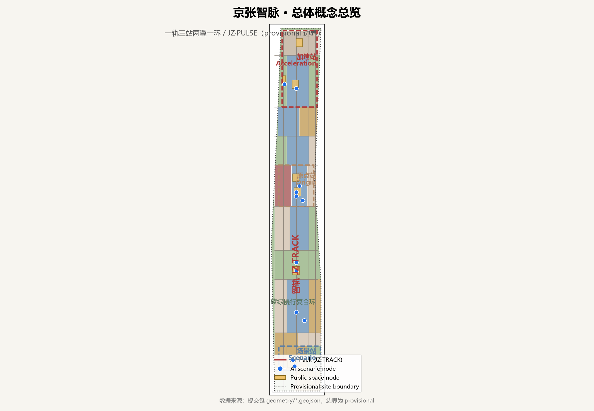
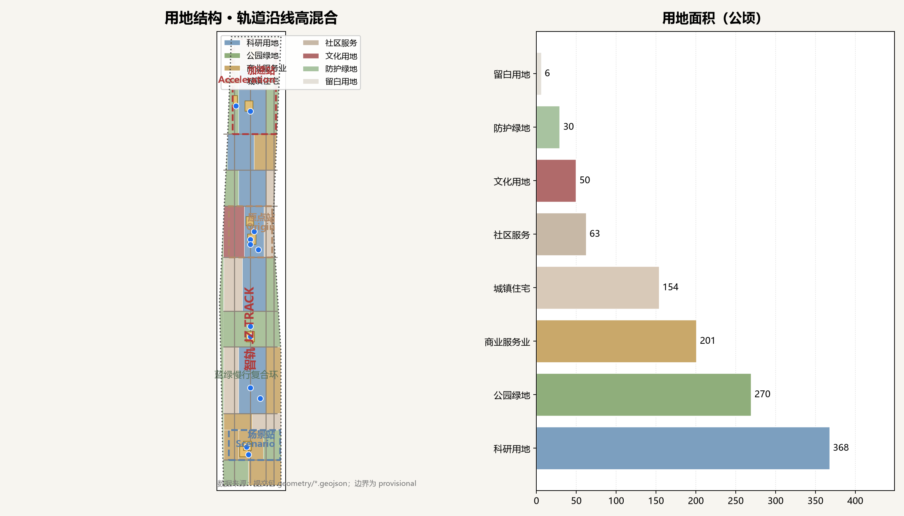
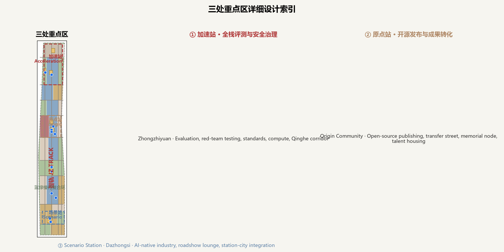
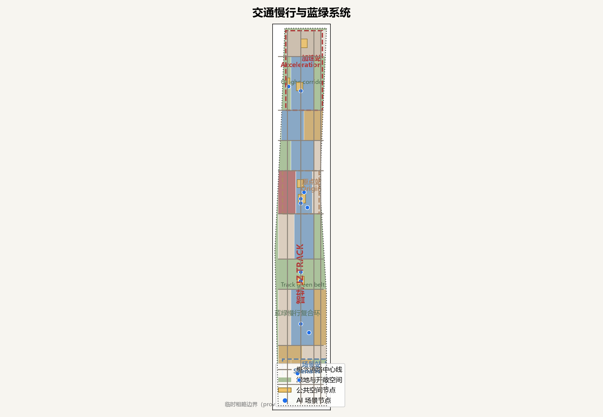
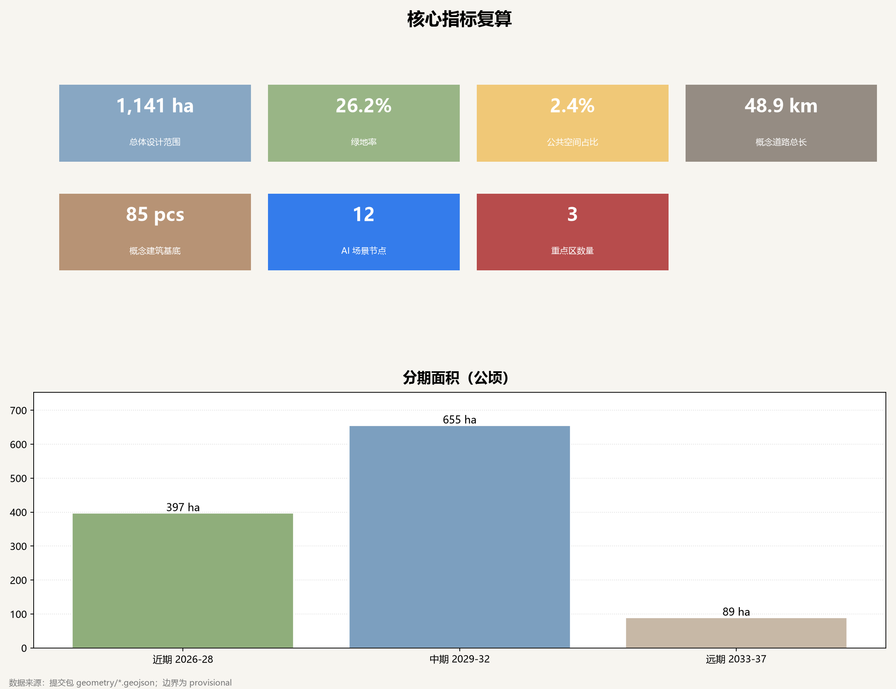

# 京张智脉——百年铁轨之上的AI创新带总体城市设计

## 设计依据与资料清单

本方案以北京市规划和自然资源委员会海淀分局发布的《百年京张AI创新带城市设计国际方案征集资格预审公告》为第一依据，并以仓库维护者登记的面向智能体任务书、临时粗略边界、重点区域、用地枚举、指标区间和来源清单为机器可读依据 [source:OFFICIAL-ANNOUNCEMENT] [source:AGENT-TASKBOOK] [depth:existing_conditions_diagnosis]。方案生成前完整读取了 `brief/site-package/` 的设计任务、允许设计空间、专业标准参考快照和 `data/source_registry.json` 的来源边界，确认哪些资料可以进入 formal 证据链、哪些只能作为背景或 provisional 线索 [source:SOURCE-REGISTRY] [source:SITE-PACKAGE]。

当前场地包未提供官方 SITE_BOUNDARY 与 KEY_AREA 多边形，因此提交包使用仓库明确标注的 provisional 粗略边界 [source:BOUNDARY-SOURCE] [source:KEY-AREA-SOURCE]。该边界只能用于方案生成、自检、可视化和设计讨论，不能作为官方红线、审批依据、精确面积计算或法定控制结论；组织方数据缺口不阻断内容评分，但官方 polygon 发布后，全部图层与指标必须重算 [data:geometry/site_boundary.geojson#SITE-001] [data:geometry/key_areas.geojson#PROV-KEY-001] [metric:site_area_sqm]。正文中所有面积、比例和规模均可从 `geometry/*.geojson` 与 `metrics.json` 复核 [metric:key_area_count]，完整来源与限制登记在 `sources.json`、`assumptions.json` 与 `report/copyright_statement.md`。

本方案为面向专业团队的开放共创概念建议：设计判断写给人读，证据链留给机器复核 [standard:PROJECT-AGENT-OPEN-CALL-TASKBOOK] [depth:three_level_scope_framework]。凡涉及容积率、建筑高度、道路红线、拆改留和工程条件的内容，在官方控规条件发布前一律表述为待确认事项或设计建议 [standard:MOHURD-CONTROL-DETAILED-PLANNING]。

## 三层范围工作框架

方案按照公告确定的三层范围组织工作：统筹研究范围约 43.6 平方公里，回答世界级 AI 创新生态与未来城市形态；总体设计范围约 11.4 平方公里，回答城市更新、用地结构、交通市政与风貌控制；重点区域范围约 368.4 公顷，对众智园、北京AI原点社区、大钟寺三处片区开展详细设计 [source:OFFICIAL-ANNOUNCEMENT] [metric:site_area_sqm] [depth:three_level_scope_framework]。三层范围逐级落实：产业战略决定总体结构，总体结构决定用地分区，用地分区决定公共空间、交通和分期 [data:geometry/land_use.geojson#LU-01] [data:geometry/key_areas.geojson#PROV-KEY-002]。

本方案提出总体空间结构「一轨三站两翼一环」（JZ·PULSE）：一轨是以京张遗址公园活力带为骨架的「智轨」，从大钟寺经AI原点社区延伸至众智园，串联慢行、公共空间、AI体验与文化叙事 [data:geometry/green_space.geojson#GREEN-01]；三站是三个重点区转化的「原点站、加速站、场景站」 [data:geometry/key_areas.geojson#PROV-KEY-003]；两翼是中关村科技服务翼与小月河场景赋能翼，承担要素配置与场景落地；一环是由遗址公园、清河、小月河和高校绿网组成的蓝绿慢行复合环 [data:geometry/public_space.geojson#PS-02] [depth:overall_spatial_structure]。这一结构不是新画红线，而是把公告任务转译为可复核的空间工作框架 [standard:PROJECT-OFFICIAL-ANNOUNCEMENT]。

由于三层边界均为临时粗略范围，框架中的空间关系具有方向性 [depth:existing_conditions_diagnosis]：正式边界发布后，`site_boundary.geojson`、`land_use.geojson`、`buildings.geojson`、`roads.geojson`、`green_space.geojson`、`public_space.geojson` 与 `phasing.geojson` 均需在官方边界内重新生成并复算 [data:geometry/constraints.geojson#CONSTRAINTS] [metric:green_ratio]。

## 统筹研究范围产业与未来城市研究

统筹研究的核心是把「百年京张文化带、都市AI生活体验带、AI融合创新带」三大定位和「AI全栈自主创新体系、世界级AI创新生态、AI+场景赋能新范式、智能化AI活力城市、AI治理全球话语权」五大功能组织成一条可运营的创新链：高校与开源社区策源，众智园加速与评测，大钟寺转化与会客，两翼提供资本、服务与场景 [source:AGENT-TASKBOOK] [standard:PROJECT-AGENT-OPEN-CALL-TASKBOOK] [depth:overall_spatial_structure]。

**命名与视觉识别。** 主名称「京张智脉」（JINGZHANG AI PULSE，缩写 JZ·PULSE）：京张指向场地与历史，智脉指向 AI 时代的创新脉搏——数据、算力、人才与资本在轨道沿线流动。命名体系采用「轨道站」隐喻：原点站（ORIGIN STATION，AI原点社区）、加速站（ACCELERATION STATION，众智园）、场景站（SCENARIO STATION，大钟寺）；公共空间命名为「智轨」（JZ TRACK）与「智环」（JZ LOOP）；年度活动命名为「智脉周」（JZ PULSE WEEK）。Logo 方向为两条平行铁轨抽象线与信号脉冲波形叠加，构成「JZ」与无限符号的双关图形，以铁路红、AI 蓝与城市灰为主色，字体优先采用开源字体并确保清权 [depth:overall_spatial_structure]。该体系为原创概念方向，不含任何企业商标或未授权图形。

**全球 AI 创新生态案例（7 个）。** ①斯坦福研究园：大学—产业长期土地耦合，启示海淀应以高校为策源锚点组织产业空间 [source:SRC-CASE-STANFORD-RESEARCH-PARK]；②剑桥科技园：园区化运营与成果转化服务，启示原点社区应配置发布、法务、投资一站式服务 [source:SRC-CASE-CAMBRIDGE-SCIENCE-PARK]；③韩国板桥科技谷：政府锚定集聚与轨道站点导向，启示大钟寺站区一体化组织 [source:SRC-CASE-PANGYO]；④新加坡纬壹科技城：工作—生活—游乐—学习混合开发，启示众智园应保留绿色交往与人才服务 [source:SRC-CASE-ONE-NORTH]；⑤柏林阿德勒斯霍夫：后工业基地更新为科学城，启示京张沿线更新以「保留结构、置换功能」为主 [source:SRC-CASE-ADLERSHOF]；⑥筑波科学城：国家科研基础设施与人才社区，启示全栈自主体系需要公共测试与算力平台 [source:SRC-CASE-TSUKUBA]；⑦杭州云栖小镇：活动驱动生态集聚，启示「智脉周」等年度活动体系 [source:SRC-CASE-YUNQI-TOWN]。案例均为公开背景借鉴，不构成对任何园区或企业的背书 [source:SRC-2026-BJ-KW-THREE-AREAS-WINGS]。

上述经验分别转化为三类机制：空间上，沿智轨布置弹性产业空间、公共发布场所与测试走廊 [data:geometry/land_use.geojson#LU-08]；运营上，以开放日、Hackathon 和评测活动激活节点 [data:geometry/public_space.geojson#PS-03]；治理上，以数据合规、人工复核和市民反馈闭环约束 AI 场景 [depth:municipal_new_infrastructure] [metric:scenario_node_count]。

## 总体设计范围城市更新与控规深度城市设计

总体设计范围按控规深度组织用地与空间：本方案以国土空间用地分类为基础，在 provisional 边界内形成 29 个用地分区，其中科研用地（0802）约 368 公顷、商业服务业用地（05）约 201 公顷、居住用地（0701）约 154 公顷、绿地与开敞空间（1401/1402）约 299 公顷，全部由 `geometry/land_use.geojson` 复算 [data:geometry/land_use.geojson#LU-16] [metric:land_use_area_sqm_0802]。商业与居住比例同样由分区几何复核 [metric:land_use_area_sqm_05]，分类遵循国土空间用地分类指南 [standard:MNR-LAND-USE-CLASSIFICATION-GUIDE]。

空间结构沿南北智轨展开，形成「南会客—中策源—北加速」的功能梯度：大钟寺承担国际路演与企业服务，原点社区承担开源发布与成果转化，众智园承担评测、安全治理与算力服务 [data:geometry/land_use.geojson#LU-03] [data:geometry/land_use.geojson#LU-23] [depth:land_use_layout]。更新策略以保留和功能置换为主：既有住区与高校周边以保留更新为主，产业片区以「保留结构、改造空间、新建少量地标节点」为原则 [data:geometry/buildings.geojson#BLDG-001] [depth:retain_renovate_demolish] [metric:building_count]。

开发强度、建筑高度与退线等控规条件在官方发布前一律列为待确认事项 [depth:development_intensity_controls]；本方案仅以概念层数（一般 6–8 层）表达体量关系，不冒充审定指标 [data:geometry/buildings.geojson#BLDG-033] [metric:building_footprint_area_sqm] [depth:height_massing_character]。道路中心线、市政与公共服务布局同样为概念示意 [data:geometry/roads.geojson#ROAD-NS-02] [metric:road_length_m]，需在正式交通专项与市政专项中复核 [depth:traffic_rail_slow_parking]。

## 重点区域详细设计

三个重点区均给出「定位＋空间结构＋建筑更新＋交通慢行＋公共空间＋AI 场景＋实施风险」的可读小方案 [depth:three_key_area_detailed_design] [data:geometry/key_areas.geojson#PROV-KEY-001]。

**众智园AI自主创新加速区（加速站）。** 定位为全栈自主创新与 AI 治理话语权的公共「试车场」：核心区布置模型评测、安全红队测试、标准工作坊与算力服务 [data:geometry/key_areas.geojson#PROV-KEY-001] [data:geometry/land_use.geojson#LU-23]；清河界面转化为低碳创新廊 [data:geometry/green_space.geojson#GREEN-05]；北端配置人才社区服务设施 [data:geometry/land_use.geojson#LU-26]。建筑更新以科研楼宇功能置换为主，新建节点集中于测试广场周边 [data:geometry/buildings.geojson#BLDG-061]；实施风险为测试场景的开放安全、算力能耗与数据合规 [depth:risk_missing_data]。

**北京AI原点社区（原点站）。** 定位为近校策源与全球开源协作的「代码到城市」起点：西侧文化区布置开源发布厅、贡献荣誉墙与纪念节点 [data:geometry/key_areas.geojson#PROV-KEY-002] [data:geometry/land_use.geojson#LU-15] [data:geometry/public_space.geojson#PS-03]；中部科研区布置近校成果转化街 [data:geometry/land_use.geojson#LU-16]；东侧为人才社区 [data:geometry/land_use.geojson#LU-17]。校区、园区、街区以慢行缝合，重点处理清华园站纪念节点与轨道站点接驳 [data:geometry/public_space.geojson#PS-05] [data:geometry/roads.geojson#ROAD-EW-05]；实施风险为校区边界、产权与首层业态协调 [depth:three_key_area_detailed_design]。

**大钟寺AI产业集聚区（场景站）。** 定位为智能原生产业与国际交往会客厅：核心区布置智能体、智能终端、内容消费与数据要素服务 [data:geometry/key_areas.geojson#PROV-KEY-003] [data:geometry/land_use.geojson#LU-03]；站前广场与路演客厅构成四象限步行连通的核心 [data:geometry/public_space.geojson#PS-01] [data:geometry/public_space.geojson#PS-06]；东侧绿地作为外围缓冲 [data:geometry/green_space.geojson#GREEN-03]。建筑以存量改造与站城一体化为主 [data:geometry/buildings.geojson#BLDG-018]；实施风险为轨道站点改造、管线迁改与产权整合 [depth:renewal_project_list]。

## AI 创新生态、人才画像与 AI+ 场景

AI 创新生态按「策源—加速—转化—服务」四段组织：原点社区承接高校与开源社区，众智园提供评测与算力，大钟寺连接产业与国际市场，两翼提供资本、知识产权与生活服务 [source:SRC-2026-HAIDIAN-1X1] [standard:PROJECT-AGENT-OPEN-CALL-TASKBOOK] [depth:overall_spatial_structure]。

**用户画像（6 类）。** ①开源开发者：需要发布、协作、测试与社区声誉空间，对应原点发布厅与代码墙 [data:geometry/public_space.geojson#PS-03]；②初创团队：需要低成本办公、算力入口与产品试验场，对应众智园共享测试场 [data:geometry/land_use.geojson#LU-23]；③高校师生与科研人员：需要成果转化与跨校协作，对应近校转化街 [data:geometry/land_use.geojson#LU-16]；④头部企业访客与国际客商：需要展示、路演与高端接待，对应大钟寺路演客厅 [data:geometry/public_space.geojson#PS-06]；⑤周边居民：需要通勤、休闲与低扰动更新，对应智轨绿带与社区广场 [data:geometry/green_space.geojson#GREEN-01]；⑥城市管理者与公共服务者：需要可解释的治理界面，对应城市智能体公共治理窗口 [data:geometry/public_space.geojson#PS-02]。

**AI 场景卡（12 张，含 4 张产业测试验证场景）。** 01 开源发布厅（原点文化区）：面向开发者提供成果发布与贡献展示，运营主体为社区联盟，数据仅聚合统计 [data:geometry/land_use.geojson#LU-15]。02 模型评测与红队测试场（众智园，产业测试验证）：面向模型企业提供安全评测与标准工作坊，需专业监督与人工复核 [data:geometry/land_use.geojson#LU-23]。03 端侧算力驿站（智轨沿线，产业测试验证）：提供绿色算力与低功耗设备测试，能耗与算力数据需授权 [data:geometry/roads.geojson#NODE-03]。04 自动配送与无人车接驳测试走廊（智轨南段，产业测试验证）：服务配送企业与自动驾驶测试，需交管许可与安全冗余 [data:geometry/roads.geojson#NODE-04]。

05 数据要素合规沙盒（大钟寺，产业测试验证）：在授权、匿名化与人工审计前提下试验数据流通，不得输出个人画像 [data:geometry/land_use.geojson#LU-03]。06 AI 慢行导览与无障碍导航（智轨）：以可解释导视辅助出行，传感数据最小化 [data:geometry/roads.geojson#NODE-05]。07 清河低碳创新廊（众智园）：结合雨洪、步行骑行与 AI 环境监测 [data:geometry/green_space.geojson#GREEN-05]。08 近校成果转化街（原点社区）：提供孵化、法务、知识产权与投融资服务 [data:geometry/land_use.geojson#LU-16]。

09 国际路演客厅（大钟寺）：承载发布、洽谈与媒体传播 [data:geometry/public_space.geojson#PS-06]。10 AI 教育体验实验室（原点社区边缘）：面向中小学与公众的 AI 科普 [data:geometry/roads.geojson#NODE-10]。11 AI+医疗健康驿站（中部社区）：预约制健康咨询，病历数据不出院区 [data:geometry/roads.geojson#NODE-11]。12 城市智能体公共治理窗口（原点社区）：市民可查看智能体建议依据并提出反馈，人工终审 [data:geometry/public_space.geojson#PS-03] [depth:municipal_new_infrastructure] [metric:scenario_node_count]。

每张场景卡在正文可读，完整字段（服务对象、数据、隐私、复核、运营主体、图层、风险）登记在 `compliance_matrix.json` 与 `sources.json` [depth:risk_missing_data]。所有场景均遵守数据最小化、公开来源、可解释与人工复核原则，不得替代规划审批 [standard:PROJECT-AGENT-OPEN-CALL-TASKBOOK]。

## 用地、建筑规模与拆改留方案

用地布局以「轨道沿线高混合、片区内部有梯度」为原则：智轨两侧以科研、文化与绿地为主，东西两翼布置居住与商务，重点区内部形成「站前高密度会客—街区中密度研发—边缘低密度绿地」的梯度 [data:geometry/land_use.geojson#LU-11] [depth:land_use_layout] [metric:land_use_area_sqm_1401]。商业服务业用地约 201 公顷、城镇住宅用地约 154 公顷、社区服务用地约 63 公顷、文化用地约 50 公顷，比例与图层一致 [metric:land_use_area_sqm_0701] [metric:land_use_area_sqm_0702] [metric:land_use_area_sqm_0803]。防护绿地约 30 公顷、留白用地约 6 公顷 [metric:land_use_area_sqm_1402] [metric:land_use_area_sqm_16]。

建筑基底按「保留—改造—新建」分类表达：既有住区与高校周边以保留与微改造为主，产业片区以功能置换与加建为主，新建集中于站前节点与测试广场周边 [data:geometry/buildings.geojson#BLDG-012] [depth:retain_renovate_demolish]。本方案建筑 footprint 为概念网格，不代表现状测绘或权属；总建筑面积、容积率与建筑密度在官方控规条件发布前保持待确认状态 [data:geometry/buildings.geojson#BLDG-052] [depth:development_intensity_controls] [metric:building_footprint_area_sqm]。拆改留的具体地块结论需以现状普查、产权与城市更新专项为准，不得在本文中伪装为已审定结论 [depth:height_massing_character]。

## 交通、轨道、市政与公共服务设施

交通策略以「智轨优先、站城一体、慢行成网」为目标：沿智轨组织南北向慢行主廊道，与四条概念纵路和九条概念横路形成网格 [data:geometry/roads.geojson#ROAD-NS-01] [data:geometry/roads.geojson#ROAD-EW-03] [depth:traffic_rail_slow_parking]。概念道路总长约 48.9 公里 [metric:road_length_m]。三处重点区均围绕轨道站点组织接驳：大钟寺站前广场与四象限步行连通、清华园站纪念节点与校区接驳、众智园结合轨道与清河界面组织进出 [data:geometry/public_space.geojson#PS-01] [data:geometry/public_space.geojson#PS-05]。

市政与新型基础设施强调「端侧算力＋绿色能源＋传统市政融合」：在智轨沿线布局端侧算力驿站、分布式能源与智慧灯杆原型，全部作为概念建议，需以市政专项、消防与电网条件复核 [data:geometry/roads.geojson#NODE-03] [depth:municipal_new_infrastructure]。道路红线、管线断面、停车与无障碍设计在正式专项发布前均为待确认事项 [data:geometry/constraints.geojson#CONSTRAINTS]。公共服务设施按创新服务（路演、孵化、法务）、人才服务（社区、教育、医疗）与城市服务（治理窗口、活动场地）三类配置，服务半径与规模待人口与设施专项校准 [depth:existing_conditions_diagnosis]。

## 蓝绿空间、公共空间与城市风貌

蓝绿系统以「一轨一河一环」为骨架：智轨绿带贯穿南北，清河界面形成低碳创新廊，小月河与高校绿网构成东西向链接 [data:geometry/green_space.geojson#GREEN-04] [data:geometry/green_space.geojson#GREEN-05] [depth:blue_green_public_space]。绿地面积约 299 公顷 [metric:green_space_area_sqm]，绿地率约 26.2% [metric:green_ratio]。公共空间以 8 个广场与节点构成，面积约 27.9 公顷，占比约 2.4% [metric:public_space_area_sqm] [metric:public_space_ratio] [data:geometry/public_space.geojson#PS-04]。这些比例支撑「创新交往、日常休闲、活动承载」三类功能，后续按官方边界复算。

**AI 朝圣地标与荣誉展示体系（4 个概念节点）。** ①「智脉起点碑」：位于清华园站纪念节点，以轨枕与里程碑语言记录中国铁路自主创新与 AI 开源贡献的起点 [data:geometry/public_space.geojson#PS-05]；②「开源贡献荣誉墙」：位于原点发布广场，以可更新的数字与实体墙面记录每年杰出贡献 [data:geometry/public_space.geojson#PS-03]；③「AI 里程碑轨枕」：沿智轨绿带每年度嵌入一枚轨枕式纪念节点，标记开源项目、治理成果与城市 AI 实践 [data:geometry/green_space.geojson#GREEN-01]；④「全球开发者荣誉长廊」：位于大钟寺路演客厅，以双语界面展示全球贡献者与项目 [data:geometry/public_space.geojson#PS-06]。地标、导视、Logo 与字体均须清权，概念地标不构成已批准建设 [standard:MOHURD-URBAN-DESIGN-MEASURES]。

城市风貌以「铁路记忆—学院肌理—AI 未来界面」三段叙事组织：南段大钟寺呈现站城一体与数字橱窗，中段原点社区呈现近校尺度的红砖与开放界面，北段众智园呈现科研园区与蓝绿环境 [depth:height_massing_character] [depth:overall_spatial_structure]。建筑风格、屋顶与色彩控制建议在控规条件与风貌专项发布后深化，不预设伪精确控制线 [standard:MOHURD-CONTROL-DETAILED-PLANNING]。

## 更新项目清单、实施政策与分期计划

更新项目清单围绕「缝合、转化、测试、会客」四类工作组织，共 12 个概念项目：JZ-01 智轨慢行断点缝合、JZ-02 大钟寺站四象限步行连通、JZ-03 路演客厅周边公共环境更新、JZ-04 原点开源发布厅与荣誉墙、JZ-05 近校成果转化街、JZ-06 清华园站纪念节点、JZ-07 众智园模型评测与安全治理中心、JZ-08 清河低碳创新廊、JZ-09 端侧算力与绿色能源驿站、JZ-10 测试走廊与无人配送接驳点、JZ-11 城市智能体治理窗口、JZ-12 智脉周活动路线与导视系统 [depth:renewal_project_list] [data:geometry/phasing.geojson#PHASE-1]。

分期按近期试点（2026–2028，约 397 公顷）、中期更新（2029–2032，约 655 公顷）、远期深化（2033–2037，约 89 公顷）推进 [metric:phasing_area_sqm_p1] [metric:phasing_area_sqm_p2] [metric:phasing_area_sqm_p3]，空间范围见分期图层 [data:geometry/phasing.geojson#PHASE-2] [data:geometry/phasing.geojson#PHASE-3] [depth:phasing_implementation]。近期以轻量运营、公共空间与发布节点启动，不依赖大规模建设；中期结合控规与产权条件推进功能置换；远期深化留白与结构性项目。政策建议包括更新统筹平台、弹性产业空间供给、场景开放机制、数据合规指引与公众参与制度，全部作为概念建议，不构成政府安排 [source:AGENT-TASKBOOK]。

**全球 AI 创新活动体系与长期运营。** 方案提出年度「智脉周」（JZ PULSE WEEK）品牌：每年 9 月围绕京张铁路建成纪念组织开源大会、模型评测开放日、Hackathon、路演与国际传播 [source:SRC-CASE-YUNQI-TOWN]。常设运营包括：开源发布厅的季度发布制度、测试走廊的预约制开放、荣誉墙的年度更新、双语门户的成果沉淀 [data:geometry/public_space.geojson#PS-03]。运营主体建议由区属平台、企业联盟、高校与开发者社区组成联合运营委员会，定期发布运营年报与指标校准报告 [depth:renewal_project_list] [depth:phasing_implementation]。

## 指标体系、面积复算与合规矩阵

指标体系分为三类：第一类空间指标由提交几何直接复算，包括总体范围面积约 1141.3 公顷、重点区数量 3 处、建筑数量与场景节点 12 个 [metric:site_area_sqm] [metric:key_area_count] [metric:scenario_node_count]，并覆盖绿地率、公共空间占比、道路长度与分期面积 [metric:building_count] [depth:metrics_recalculation]；第二类管控指标（容积率、高度、密度、退线、红线）在官方条件发布前为待确认事项 [data:geometry/constraints.geojson#CONSTRAINTS] [depth:development_intensity_controls]；第三类绩效指标（AI 创新指数、人才密度、产业规模、活动参与度）需以官方统计与运营数据持续校准 [metric:ai_innovation_index]。

全部 known 指标均从 `geometry/*.geojson` 与 `metrics.json` 复算，公式、来源文件与假设逐项登记 [data:geometry/land_use.geojson#LU-02] [data:geometry/buildings.geojson#BLDG-072] [metric:land_use_area_sqm_05]。`compliance_matrix.json` 覆盖公告 1.3–1.5 全部必选任务与 agent.1–agent.6；`standard_matrix.json` 覆盖五项 mandatory 标准；`design_depth_matrix.json` 覆盖 15 个正式设计深度项 [depth:metrics_recalculation] [depth:risk_missing_data]。

## 风险、版权与合规说明

主要风险与对应措施：①资料风险——provisional 边界不得作为红线或精确面积依据，官方边界发布后全部重算 [data:geometry/site_boundary.geojson#SITE-001] [depth:risk_missing_data]；②控规风险——开发强度与工程条件待官方确认 [standard:MOHURD-CONTROL-DETAILED-PLANNING]；③场景风险——AI 场景涉及隐私、算力能耗与公共安全，须数据最小化、人工复核与运营授权 [source:AGENT-TASKBOOK]；④实施风险——分期与项目清单为概念建议，实施主体、资金与审批路径待定 [data:geometry/phasing.geojson#PHASE-1] [depth:phasing_implementation]；⑤版权风险——命名、Logo、图纸为原创，字体与素材清权，案例来源仅作背景 [source:SRC-OSM-COPYRIGHT] [standard:MOHURD-URBAN-DESIGN-MEASURES]。

本方案不声称官方批准、审定控规、最终土地权属、确认建设规模或保证实施；所有概念建议均作为开放共创成果提交，供专业团队深化研究 [standard:PROJECT-OFFICIAL-ANNOUNCEMENT]。完整版权与授权说明见 `report/copyright_statement.md`，来源、假设与指标限制分别登记于 `sources.json`、`assumptions.json` 与 `metrics.json` [depth:risk_missing_data]。

## 参考资料

以下材料的出处、许可与使用边界见完整来源清单 [source:OFFICIAL-ANNOUNCEMENT] [source:SOURCE-REGISTRY]。

- 北京市规划和自然资源委员会海淀分局：《百年京张AI创新带城市设计国际方案征集资格预审公告》（2026-05-09）
- 面向全球智能体开展百年京张AI创新带城市设计开源征集任务书摘录（用户提供、已清权，2026-05-18）
- 北京市科委、中关村管委会：《“三区两翼”打造世界级AI集聚地》（2026-04-03）
- 海淀区人民政府：《海淀区发布“1+X+1”现代化产业体系建设布局》（2026-03-02）
- 自然资源部：《国土空间调查、规划、用途管制用地用海分类指南》（2023-11-22）
- 住房和城乡建设部：《城市设计管理办法》（2017-03-14）
- 住房和城乡建设部：《城市、镇控制性详细规划编制审批办法》
- Stanford Research Park、Cambridge Science Park、JTC one-north、Berlin Adlershof 官网与板桥/筑波/云栖公开条目（2026-08-10 检索）
- open-city-ai/haidian 仓库：brief/site-package、data/source_registry.json、docs/ 与 skills/urban-design-ai-submission/
- 完整机器索引见 `sources.json`、`metrics.json`、`compliance_matrix.json`、`standard_matrix.json`、`design_depth_matrix.json`
