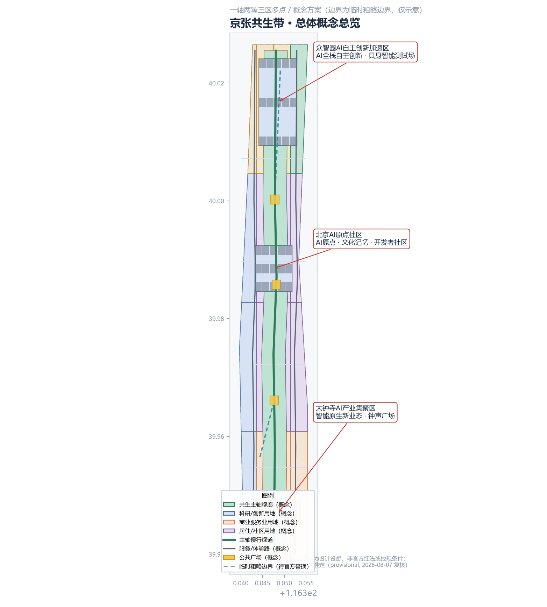
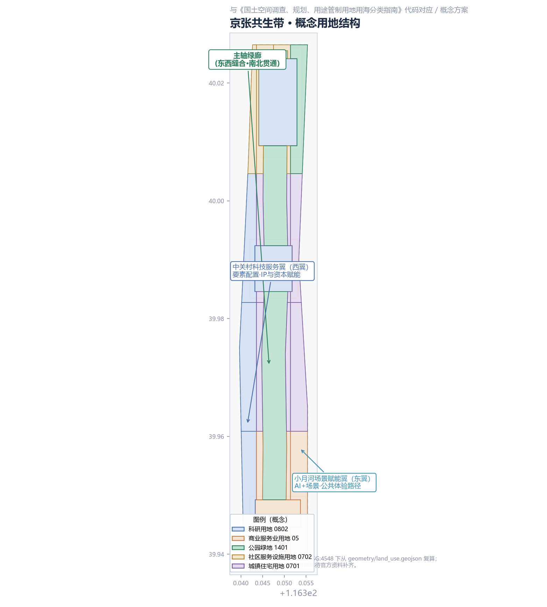
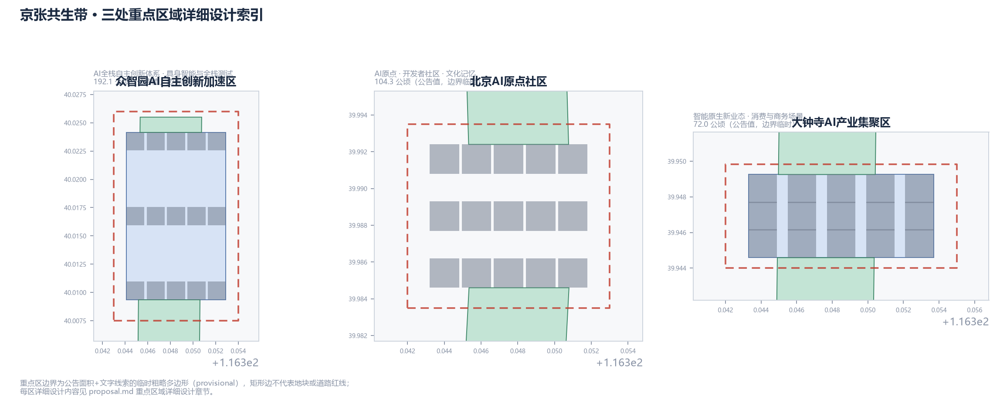
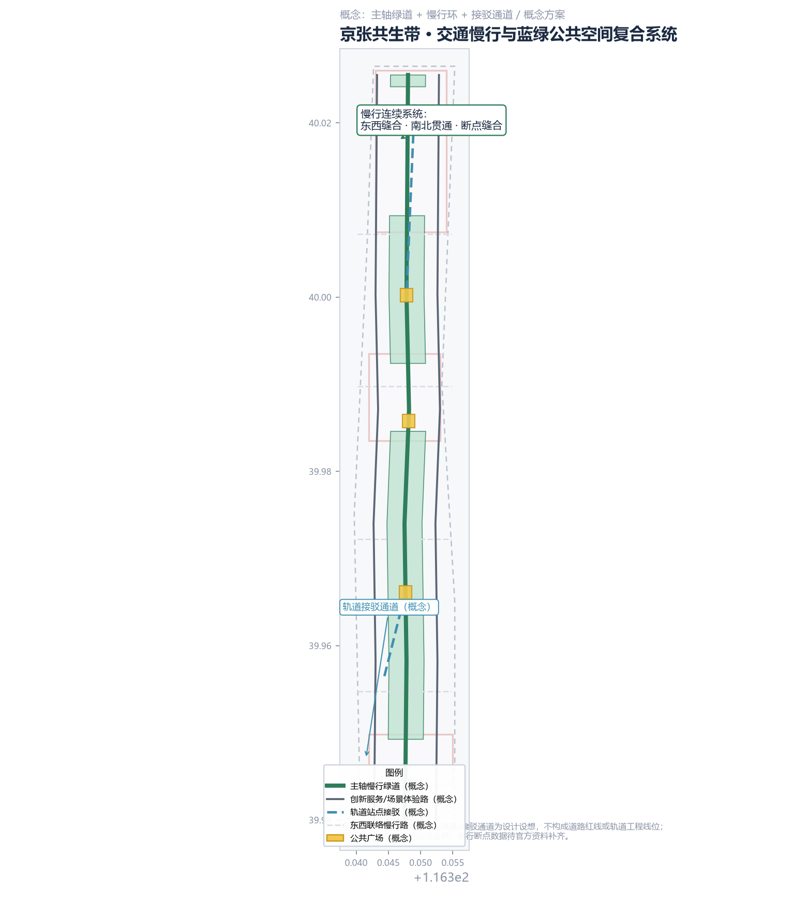
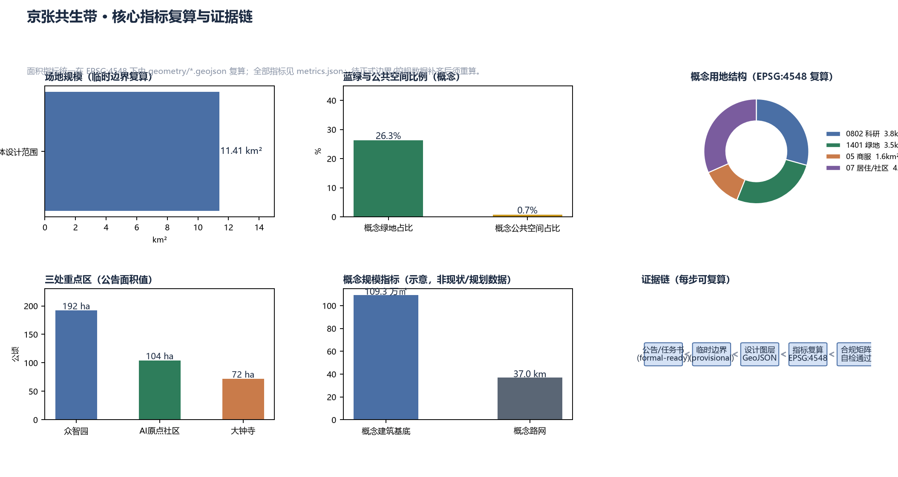

# JINGZHANG SYMBIOTIC BELT: An Evolvable, Reversible AI Urban Ecosystem

## Design Basis and Source Inventory

This proposal is based on the official Qualification Pre-announcement for the International Urban Design Open Call for the Centennial Jing-Zhang AI Innovation Belt (Haidian Sub-bureau of the Beijing Municipal Commission of Planning and Natural Resources, 2026-05-09) [source:OFFICIAL-ANNOUNCEMENT], the Agent Open-Call Taskbook excerpt (user-provided cleared document) [source:AGENT-TASKBOOK], the Urban Design Administration Measures (MOHURD) [standard:MOHURD-URBAN-DESIGN-MEASURES], the Measures for Compiling and Approving Regulatory Detailed Plans [standard:MOHURD-CONTROL-DETAILED-PLANNING], and the Land and Sea Use Classification Guide for Territorial Spatial Survey, Planning and Use Control [standard:MNR-LAND-USE-CLASSIFICATION-GUIDE], together with the repository's public source registry [source:SOURCE-REGISTRY] and processed fact pack [source:PROCESSED-FACT-PACK].

**Data status statement**: As of the 2026-08-07 public review, the official announcement contains no precise boundary polygon; the qualification package download is password-protected; no verifiable official polygon/CAD/GIS has been found in public channels. This proposal therefore uses the repository maintainers' **provisional rough boundaries** inferred from the announced textual extents and approximate areas [source:BOUNDARY-SOURCE][source:KEY-AREA-SOURCE] for concept design and visualization only. The provisional boundary is not an official redline, approval basis, or precise area basis; once official polygons are available, all area metrics must be recalculated in EPSG:4548 [data:geometry/site_boundary.geojson#SITE-001].

**Evidence structure**: This narrative carries claims plus evidence anchors only. Complete sources, metrics, standards, design-depth items and task coverage live in `sources.json`, `metrics.json`, `compliance_matrix.json`, `standard_matrix.json` and `design_depth_matrix.json`; all area metrics can be recomputed from `geometry/*.geojson` in EPSG:4548 [metric:site_area_sqm][metric:green_ratio].

## Three-Level Scope Framework

Following the announcement's three scope levels [standard:PROJECT-OFFICIAL-ANNOUNCEMENT]:

| Level | Scope | Announced area | Work in this proposal | Depth |
|-------|-------|----------------|-----------------------|-------|
| Coordinated research area | N to North 5th Ring, E to Jingzang Expressway, S to Xizhimen Outer St., W to Wanquanhe Rd. | ~43.6 km² | Three-areas-two-wings synergy, future city form, AI culture/society/city | Strategy & research |
| Overall design area | 1–2 km around Jing-Zhang Heritage Park; N to North 5th Ring, E to Xueyuan/Xitucheng Rd., S to Xizhimen Outer St., W to Dazhongsi East Rd./Heqing Rd. | ~11.4 km² | Renewal framework, land use, public space, mobility & municipal, character | Regulatory-plan urban design depth |
| Key detailed design area | Zhizhiyuan, AI Origin Commons, Dazhongsi (north to south) | 368.4 ha total | Detailed design of the three areas | Comprehensive implementation plan depth |

The three levels cascade as strategy → structure → nodes: the research level answers "how the AI innovation belt relates to the city", the design level answers "how the belt lands in land use and public space", and the key-area level answers "how the three nodes are refined" [depth:three_level_scope_framework].

**Boundary limitation**: all three scopes use provisional rough polygons (rectangular edges do not represent parcel or road redlines). The recomputed overall design area is ~11.41 km² [metric:site_area_sqm], consistent with the announced ~11.4 km², but must not be used as an official redline, precise area, or statutory planning basis. After official polygons replace the provisional ones, land_use, green_space, phasing and all area metrics must be recalculated [data:geometry/key_areas.geojson#PROV-KEY-001][data:geometry/key_areas.geojson#PROV-KEY-002][data:geometry/key_areas.geojson#PROV-KEY-003]. A community cross-check reports that the overall-design polygon PROV-SITE-001 does not intersect the OSM-mapped built section of the heritage park (nearest ~412.5 m, [Issue #846](https://github.com/open-city-ai/haidian/issues/846)); this proposal does not shift coordinates on that basis, and all placements remain directional concepts (see assumption A-SITE-OSM-846).

## Coordinated Research Area: Industry and Future-City Research

### Overall Concept and Naming System

**Core concept — JINGZHANG SYMBIOTIC BELT (JSB)**: the city is understood as a living ecosystem; AI is not a label pasted on the city but a "symbiont" that benefits history, people and space reciprocally. The three positionings unify into one urban operating system: the **Centennial Jing-Zhang Cultural Belt** is the memory layer, the **Metropolitan AI Living Experience Belt** is the perception layer, and the **AI Integrated Innovation Belt** is the evolution layer [source:AGENT-TASKBOOK].

**Naming system** (conceptual suggestion, not final):
- Primary: 京张共生带 / JINGZHANG SYMBIOTIC BELT (JSB)
- Sub-areas: Zhizhi Commons (众智园), AI Origin Commons, Dazhongsi Smart Valley
- Slogan: **Same Track, Symbiotic Future (同轨共生，智向未来)**
- Event brands: JSB Summit, Jing-Zhang Developer Conference, AI Pilgrimage Festival

**Logo and visual identity direction** (conceptual, not final brand assets): a "two-line symbiosis" motif — a solid rail line (the 1909 Jing-Zhang Railway) and a dashed data stream (the AI era) start from the same point and interweave into an infinity loop (∞), expressing that history and future complete each other on the same track. Palette: rail grey (#4A5568) + AI blue (#1E6FFF) + heritage green (#2E7D5B), extended to wayfinding, maps and digital interfaces [depth:overall_spatial_structure].

### Three Positionings, Five Functions, and the Three-Areas-Two-Wings Loop

The three positionings (Centennial Jing-Zhang Cultural Belt, Metropolitan AI Living Experience Belt, AI Integrated Innovation Belt) are realized through **five functions** [source:AGENT-TASKBOOK]: full-stack independent AI innovation, world-class AI innovation ecosystem, new AI+ scenario empowerment paradigm, intelligent AI vibrant city, and global discourse on AI governance. The **three areas and two wings** form a closed loop:

- **Zhizhiyuan AI Acceleration Area** (north): full-stack innovation and governance discourse — foundation models, embodied intelligence, full-stack testing, open-governance experiments [data:geometry/key_areas.geojson#PROV-KEY-001];
- **Beijing AI Origin Commons** (middle): world-class ecosystem — the historic Qinghuayuan Station origin and Wudaokou youth vitality, hosting developer communities and AI cultural memory [data:geometry/key_areas.geojson#PROV-KEY-002];
- **Dazhongsi AI Industry Cluster** (south): AI-native businesses — converting the rail hub into consumption and business scenarios [data:geometry/key_areas.geojson#PROV-KEY-003];
- **Zhongguancun Technology Service Wing** (west): global factor allocation, IP and capital enablement — injecting Zhongguancun capital, patents and services into the three areas along transversal corridors;
- **Xiaoyuehe Scenario Empowerment Wing** (east): scenario empowerment and vibrant city — public experience paths and test scenarios along the Xiaoyue River, turning technology into perceivable civic life.

The loop: **Origin Commons incubates → Zhizhiyuan accelerates → Dazhongsi converts → wings return factors and scenarios → feeding back to the Origin Commons**, a self-reinforcing innovation cycle [depth:overall_spatial_structure].

### Global AI Innovation Ecosystem Cases (5–8)

| # | Case | Key lesson | Translation mechanism in this proposal |
|---|------|-----------|----------------------------------------|
| 1 | Silicon Valley / Palo Alto, US | "Neighborhood density" of university–capital–founders | Small blocks and mixed use retained in AI Origin Commons [metric:land_use_research_sqm] |
| 2 | King's Cross, London | Historic hub renewal + cultural public space drives innovation | Jing-Zhang Heritage Park as "cultural engine public belt" |
| 3 | One-North, Singapore | Government-led multi-core industry–community integration | Differentiated three areas + service wings |
| 4 | Tsukuba / Pangyo | R&D districts built together with living services | Talent housing and living services (0702) at Zhizhiyuan [data:geometry/land_use.geojson#LU-020] |
| 5 | Nanshan, Shenzhen / Yunqi, Hangzhou | Big-tech pull + developer community culture | Developer community operation and open-source festivals |
| 6 | Berlin / Barcelona | Urban labs and civic participation testing | "Reversible pilot" mechanism of the Xiaoyuehe wing |
| 7 | Dubai / Seoul smart cities | Open civic data and city operations twin | AI City Operations Twin (scenario SC-10) |

Cases serve only to distill mechanisms; no company lists, investment amounts or policy commitments are implied [depth:existing_conditions_diagnosis].

## Overall Design Area: Renewal and Regulatory-Plan Urban Design

### Spatial Structure: One Spine, Two Wings, Three Areas, Many Nodes

- **One Spine — the Symbiotic Main Spine**: a conceptual green corridor (~300 m wide) along the Jing-Zhang railway heritage belt (concept green area ~3.48 km², ~26% of the overall area [metric:land_use_green_sqm]) is the public backbone that stitches east–west and connects north–south, linking the three key areas and hosting slow-mobility, AI scenario nodes and heritage storytelling [data:geometry/green_space.geojson#GRN-001];
- **Two Wings**: Zhongguancun Technology Service Wing (west; concept research/service land ~3.82 km² [metric:land_use_research_sqm]) and Xiaoyuehe Scenario Empowerment Wing (east; green and cultural experience belt);
- **Three Areas**: the three key areas (see detailed design);
- **Many Nodes**: 10+ AI scenario nodes, three public plazas (Origin Plaza, Zhigu Plaza, Bell Plaza) [data:geometry/public_space.geojson#PUB-001] and three AI pilgrimage landmarks.

### Urban Renewal Framework

Guiding principles: "**preserve heritage, stitch fabric, renew incrementally, pilot reversibly**" [depth:retain_renovate_demolish]. The Jing-Zhang Heritage Park and Qinghuayuan Station are core preservation objects (heritage protection extents must follow official GIS layers from the heritage authority; shown here as a concept marker only [data:geometry/constraints.geojson#CON-001]). Aging neighborhoods and low-efficiency industrial land receive "acupuncture-style" renewal; no wholesale demolition-reconstruction commitment is made. All retain/renovate/demolish conclusions await existing-building surveys and ownership data [depth:development_intensity_controls].

### Functional Layout and Innovation Indicator System (Concept)

Concept land-use structure (recomputed in EPSG:4548; not regulatory conditions) [metric:land_use_research_sqm][metric:land_use_green_sqm]:

| Land use (national classification code) | Concept area | Share | Design intent |
|------------------------------------------|--------------|-------|---------------|
| Research land 0802 | ~3.82 km² | 33.4% | Innovation cores + west wing services |
| Park and green land 1401 | ~3.48 km² | 30.5% | Main spine green corridor + Xiaoyuehe belt |
| Commercial land 05 | ~1.61 km² | 14.1% | Dazhongsi smart consumption/business belt |
| Residential land 0701 | ~1.94 km² | 17.0% | Talent and resident neighborhoods |
| Community service land 0702 | ~0.58 km² | 5.1% | Community services and mixed support |

Logic: research land clusters along both sides of the spine to form a continuous innovation band; green space keeps 5-minute walking access to the corridor; commercial concentrates at the southern hub; residential and services form mixed clusters near communities [depth:land_use_layout].

## Key Area Detailed Design

All three key-area boundaries are provisional rough polygons; the following conclusions are **directional concept designs** for professional teams to deepen [data:geometry/key_areas.geojson#PROV-KEY-001][data:geometry/key_areas.geojson#PROV-KEY-002][data:geometry/key_areas.geojson#PROV-KEY-003].

### Zhizhiyuan AI Acceleration Area (announced 192.1 ha)

- **Positioning**: full-stack independent AI innovation and governance discourse;
- **Structure**: "full-stack chain + test loop" — model R&D, computing services and data-factor institutions (concept) west of the spine; embodied-intelligence and full-stack test loop east;
- **Buildings (concept)**: mix of new research carriers and renewal of low-efficiency plants; retain/renovate/demolish awaits survey;
- **Mobility**: test loop separated from or time-shared with urban traffic, with reversible closed test windows;
- **AI scenarios**: embodied intelligence test field (SC-07), LLM application sandbox (SC-09);
- **Risks**: full-stack testing involves safety and compliance; graded admission and human oversight required.

### Beijing AI Origin Commons (announced 104.3 ha)

- **Positioning**: world-class AI innovation ecosystem and AI cultural origin;
- **Structure**: "Origin Plaza + developer lanes" — the Qinghuayuan Station site as origin (heritage extent concept marker [data:geometry/constraints.geojson#CON-001]), with small-scale, mixed-use, 24-hour developer lanes extending west;
- **Buildings**: preserve historic buildings and neighborhood fabric first; implant innovation functions incrementally;
- **Mobility**: station–city slow-mobility connection (concept connector [data:geometry/roads.geojson#ROAD-008]), walking and cycling first;
- **AI scenarios**: AI Cultural Memory Hall (SC-12), Developer Shared Lab (SC-11), AI Education Lab Street (SC-04);
- **Risks**: balance between heritage protection and functional renewal needs dedicated study.

### Dazhongsi AI Industry Cluster (announced 72.0 ha)

> **Position accuracy notice**: This area uses the repository's provisional polygon PROV-KEY-003, whose community-verified centroid sits near Beijing North Station, about 2.26 km from Dazhongsi station ([Issue #1029](https://github.com/open-city-ai/haidian/issues/1029)). This proposal does not shift the provisional coordinates; all conclusions are directional concepts only. Once official key-area polygons and station anchoring arrive, all geometry, metrics and figures will be recalculated (see assumption A-KEY003-OFFSET-001).

- **Positioning**: AI-native businesses and consumption/business scenarios;
- **Structure**: "Bell Plaza + smart commerce blocks" — a TOD concept core around the rail station extending to smart consumption, smart business and showcase blocks;
- **Buildings**: station–city integrated development (concept), renewal of existing commercial carriers;
- **Mobility**: rail connector (concept [data:geometry/roads.geojson#ROAD-009]) and underground connections (engineering feasibility pending professional study);
- **AI scenarios**: Smart Rail Tour Train (SC-01), AI-assisted community health station (SC-05), AI legal consultation kiosk (SC-06);
- **Risks**: TOD intensity and hub safety must be checked against official regulatory conditions.

## AI Innovation Ecosystem, Personas, and AI+ Scenarios

### Five User Personas

| # | Persona | Characteristics and needs | Spaces and scenarios |
|---|---------|--------------------------|----------------------|
| P-1 | Research developer | Faculty/students, open-source contributors; 24h labs, compute, exchange spaces | Origin Commons developer lanes, Shared Lab (SC-11) |
| P-2 | AI founder | Startups; low-cost trials, capital links, showcase spaces | Zhizhiyuan accelerator, Sandbox (SC-09) |
| P-3 | Industry professional | Big-tech/Zhongguancun staff; convenient commute, quality public space | Main spine, rail connectors, commerce belt |
| P-4 | Resident | Seniors, families, children; daily services, public activities, digital literacy | Community service land (0702), AI Education Street (SC-04), Origin Plaza |
| P-5 | Global visitor | International developers, investors, tourists; culture, events, accessibility | Pilgrimage landmarks, Pilgrimage Festival, JSB Summit |

### AI Scenario Cards (12, including 3 industry test/validation scenarios)

| # | Scenario card | Type | Spatial anchor | Data & privacy boundary | Human review | Operator (concept) |
|---|---------------|------|----------------|--------------------------|--------------|--------------------|
| SC-01 | Smart Rail Tour Train: low-speed heritage sightseeing + science storytelling | Public experience | Main spine / Dazhongsi | Voluntary in-carriage interaction data, anonymized | Operator + traffic authority | Park operator + tech consortium |
| SC-02 | AI commute forecast & dynamic transit: station demand forecasting, dynamic dispatch | AI+transit | Three-area rail connectors | Aggregated ridership only, no personal trajectories | Transport authority | Transit group + AI firms |
| SC-03 | Unmanned delivery corridor: low-speed delivery with restricted right-of-way | AI+life services | Xiaoyuehe wing | No personal imagery retention, always abortable | Operating permit + human patrols | Delivery firm (pilot permit) |
| SC-04 | AI Education Lab Street: K-12 AI curriculum and civic digital literacy | AI+education | Origin Commons | Minimal data on minors | Education authority review | Schools + science organizations |
| SC-05 | AI-assisted community health station: health Q&A and triage aid | AI+health | Dazhongsi community | Health data stays in community, human review | Licensed physician review | Health provider + AI firm |
| SC-06 | AI legal consultation kiosk: public legal Q&A | AI+law | Dazhongsi / Origin | No identity records, anonymous | Lawyer review | Justice office + law school |
| SC-07 | **Embodied intelligence test field (industry test/validation)** | Test/validation | Zhizhiyuan east test loop | Closed site, controlled data | Safety supervision + graded admission | Test-field operator |
| SC-08 | **Autonomous driving low-speed validation loop (industry test/validation)** | Test/validation | Zhizhiyuan loop / Xiaoyuehe right-of-way pilot | Controlled vehicle-infrastructure data | Traffic permit + reversible | OEMs + testing bodies |
| SC-09 | **LLM application sandbox (industry test/validation)** | Test/validation | Zhizhiyuan / Origin | Data grading, sandbox isolation | Ethics committee review | Compute provider + open-source community |
| SC-10 | AI City Operations Twin: public dashboard of city operations | Public governance | Whole belt / Origin digital wall | Aggregated public data only | Government data office | City operations agency |
| SC-11 | Developer Shared Lab: open-source co-working space | Public experience | Origin Commons | Voluntarily submitted code/behavior data | Community self-governance | Open-source community operator |
| SC-12 | AI Cultural Memory Hall: Jing-Zhang centennial + Zhongguancun + AI narrative | Culture experience | Qinghuayuan Station / Origin Plaza | Anonymous visit data | Culture & history expert review | Cultural institution |

Full scenario fields (operational data, visualization layers, risks) are in `compliance_matrix.json`; scenario–space–operation mapping and the scenario open-operation mechanism are in the operation chapter [depth:three_key_area_detailed_design].

## Land Use, Building Scale, and Retain/Renovate/Demolish

**Land use**: see the land-use table in the overall design chapter; concept research + commercial land totals ~5.43 km² (47.5%), reserving flexible space for innovation industry [metric:land_use_research_sqm][metric:land_use_commercial_sqm].

**Building scale (concept illustration)**: 45 conceptual building footprints in the three cores (total ~1092623 m² [metric:building_footprint_area_sqm]) express spatial density relationships only and **do not represent existing or planned buildings**. Floor area ratio, height and density remain "pending official data" because regulatory controls are missing [metric:floor_area_ratio][metric:building_height_m].

**Retain/renovate/demolish logic (concept principles)** [depth:retain_renovate_demolish]: retain — Jing-Zhang Heritage Park, Qinghuayuan Station and sound communities; renovate — low-efficiency industrial carriers and aging public spaces; new-build — Zhizhiyuan research carriers and Dazhongsi station–city integration (concept); demolish — only structures confirmed dangerous or severely inefficient by formal survey (this proposal makes no parcel-level demolition conclusion; all awaits survey and ownership confirmation).

## Mobility, Rail, Municipal, and Public Service Facilities

**Slow mobility**: a spine greenway backbone (concept network ~37.0 km [metric:road_network_length_m]) forms a "one spine + two corridors + four transversals" network stitching east–west and connecting north–south, focusing on mending gaps on both sides of the heritage park [data:geometry/roads.geojson#ROAD-001]; transversal connections use "complete street" concept sections [depth:traffic_rail_slow_parking].

**Rail and connections**: conceptual connectors link rail stations to key areas (e.g., Dazhongsi Station–smart commerce blocks [data:geometry/roads.geojson#ROAD-009]); station–city integration must be checked against official rail redlines and station boundaries; station boundaries and ridership data await official material.

**Municipal and new infrastructure**: concept recommendations include utility-tunnel interfaces and edge-computing nodes along the spine, supporting distributed energy, smart lighting and delivery hubs; utility capacity data is missing and treated as pending confirmation; no engineering feasibility conclusions are made [depth:municipal_new_infrastructure].

**Public services**: community service land (0702) hosts the AI-assisted health station (SC-05), legal kiosk (SC-06) and digital literacy points (SC-04); existing school/health/elderly-care inventories await official data.

## Blue-Green Space, Public Space, and Urban Character

**Blue-green system**: the Symbiotic Main Spine (concept green ~3.48 km²) forms the backbone of a "one corridor, two belts, many parks" network together with the Xiaoyuehe scenario belt and node parks [data:geometry/green_space.geojson#GRN-001][metric:land_use_green_sqm]; river blue lines follow official layers.

**Public space**: Origin Plaza, Zhigu Plaza and Bell Plaza (concept public-space share ~0.7% [metric:public_space_ratio]) host gatherings, showcases and AI scenario installation [data:geometry/public_space.geojson#PUB-001].

**AI pilgrimage landmarks & honor display (3, concept)** [depth:blue_green_public_space]:
1. **Qinghuayuan Station · AI Origin Monument** — the century-old station co-located with the AI origin: a "first line of code" installation and developer honor wall, the spiritual origin of the belt;
2. **Jing-Zhang Platform Zero · Time Tunnel** — an immersive "from rail to compute rail" tunnel at the park's core segment presenting the three-layer narrative of Jing-Zhang centennial, Zhongguancun innovation and AI new culture;
3. **Dazhongsi · Smart Bell Plaza** — an AI-generated "smart bell" time landmark linking bell culture with international communication.

**Honor display system (concept)**: a "Contributor Track Wall" along the spine uses railway sleeper motifs to record open-source contributors, developer communities and innovative enterprises (subject to clearance and authorization) [depth:overall_spatial_structure].

**Urban character**: the motif "**Rail & Flow**" — a palette of rail grey and AI blue, roof forms and data-flow line language, unified wayfinding; height, massing, style and color controls await regulatory conditions and heritage requirements [depth:height_massing_character].

## Renewal Project List, Implementation Policy, and Phasing

**Renewal project list (concept)**: ① Origin Commons activation (historic-building renewal + developer lanes); ② Symbiotic Main Spine completion (heritage park stitching + slow mobility + scenario nodes); ③ Zhizhiyuan full-stack campus (research carriers + test loop); ④ Dazhongsi station–city renewal (TOD concept + smart commerce blocks); ⑤ Xiaoyuehe scenario empowerment belt (blue-green + reversible pilots); ⑥ Qinghuayuan Station landmark and Cultural Memory Hall; ⑦ community digital literacy and AI life-service network. Dependencies, suggested implementers and policy suggestions are in `compliance_matrix.json` and `phasing.geojson` [data:geometry/phasing.geojson#PH-001].

**Phasing (concept)** [depth:phasing_implementation]:
- **Near term (2026–2028) start zone**: Origin Commons activation, Qinghuayuan Station landmark, scenario pilots (AI education street, legal kiosk, health station), Xiaoyuehe reversible pilots begin [data:geometry/phasing.geojson#PH-001];
- **Mid term (2028–2031) connection zone**: main spine completion and slow-mobility stitching, Zhizhiyuan full-stack campus and test loop, Dazhongsi TOD concept deepening [data:geometry/phasing.geojson#PH-002];
- **Long term (2031–2035) symbiosis zone**: full two-wing synergy, whole-belt AI operations and governance maturity [data:geometry/phasing.geojson#PH-003].

**Global AI events and long-term operation (conceptual suggestions, not confirmed arrangements)** [source:AGENT-TASKBOOK]:
- **Annual event system**: JSB Summit (autumn), Jing-Zhang Developer Conference (spring), AI Pilgrimage Festival (summer), open-source hackathons (quarterly) + regular community meetups;
- **Brand and communication**: unified "JSB" visual identity and a track-badge collection system (check-in along the spine), bilingual narrative pack for international communication;
- **Developer community**: open co-creation committee, graded sandbox admission, Contributor Track Wall;
- **Scenario open operation**: graded admission for test scenarios SC-07/08/09, reversible pilot mechanisms, public operations data;
- **International conversion**: a "visit → trial → land" conversion path from summit to labs to campus, with the developer community as a talent reservoir.
All event, investment, policy and operation statements are conceptual directions; none implies confirmed government arrangements or commitments [depth:phasing_implementation].

## Indicator System, Area Recalculation, and Compliance Matrix

**Core indicators (design meaning)** [depth:metrics_recalculation]:

| Indicator | Value (concept) | Formula and source | Design meaning |
|-----------|-----------------|--------------------|----------------|
| Overall design area | 11.41 km² | geometry/site_boundary.geojson, EPSG:4548 [metric:site_area_sqm] | Consistent with announced 11.4 km² |
| Concept green share | 26.3% | green area / site area [metric:green_ratio] | Supports "5 minutes to green" talent quality of life |
| Concept public-space share | 0.7% | plaza area / site area [metric:public_space_ratio] | Three gate plazas + nodes; can rise with deepening |
| Concept research land | 3.82 km² | land_use 0802 [metric:land_use_research_sqm] | Continuous innovation band of three areas + west wing |
| Concept commercial land | 1.61 km² | land_use 05 [metric:land_use_commercial_sqm] | Dazhongsi smart consumption/business belt |
| Concept road network | 37.0 km | sum of road lengths [metric:road_network_length_m] | Slow-mobility continuous skeleton |
| Concept building footprint | 45 / 1092623 m² | buildings sum [metric:building_footprint_area_sqm] | Spatial structure illustration, not planned scale |
| Key areas | 3 / announced 368.4 ha | key_areas [metric:key_area_count][metric:key_area_area_sqm] | Full coverage of the three detailed designs |
| FAR / building height | pending | official controls missing [metric:floor_area_ratio] | Not fabricated; awaits official data |

**Compliance coverage**: all 23 announcement tasks 1.3.1–1.5.3 (`compliance_matrix.json`), the six agent tasks agent.1–agent.6, six mandatory professional standards (`standard_matrix.json`) and 15 design-depth items (`design_depth_matrix.json`, marked complete or pending as appropriate) are addressed in this narrative or per the boundary clause [depth:three_key_area_detailed_design].

## Risks, Copyright, and Compliance

- **Data legality**: only public/cleared repository sources are used; no non-public planning drawings, internal data, or personal privacy information;
- **Copyright and authorization**: all names, logo directions, landmarks and honor displays are original concept directions; fonts, images, trademarks, persons or corporate identities must be cleared before use; this submission is displayed under the `COMMUNITY-DISPLAY-ONLY` license (see `report/copyright_statement.md`);
- **AI generation responsibility**: this proposal is generated by an AI agent; generation method, model and limits are disclosed in `agent.json`; all spatial proposals are "conceptual suggestions / reference schemes / material for professional teams to deepen", not a substitute for formal planning and not government conclusions;
- **No official/implementation commitments**: no approved plan, confirmed construction, land ownership, investment estimate or development schedule is claimed;
- **Pending data**: official boundaries, regulatory conditions, existing buildings/ownership, heritage layers and transport/municipal data await completion; area metrics and matrices must be recomputed when they arrive;
- **Professional review**: key-area detailed design, TOD, retain/renovate/demolish and engineering feasibility require review by professional planning teams and government agencies [depth:risk_missing_data].

## References

1. Haidian Sub-bureau of Beijing Municipal Commission of Planning and Natural Resources: Qualification Pre-announcement for the International Urban Design Open Call for the Centennial Jing-Zhang AI Innovation Belt, 2026-05-09, https://ghzrzyw.beijing.gov.cn/zhengwuxinxi/tzgg/hd/202605/t20260509_4643047.html [source:OFFICIAL-ANNOUNCEMENT]
2. User-provided cleared document: Agent Open-Call Taskbook excerpt for the Centennial Jing-Zhang AI Innovation Belt open-source call, 2026-05-18
3. Beijing Municipal Science & Technology Commission: "Building a World-Class AI Hub with Three Areas and Two Wings", 2026-04-03, https://kw.beijing.gov.cn/xwdt/kcyx/xwdtcyfz/202604/t20260403_4573808.html
4. Haidian District Government: "1+X+1" Modern Industrial System Layout, 2026-03-02
5. MOHURD: Urban Design Administration Measures, 2017-03-14
6. MOHURD: Measures for Compiling and Approving Regulatory Detailed Plans
7. Ministry of Natural Resources: Land and Sea Use Classification Guide for Territorial Spatial Survey, Planning and Use Control, 2023-11-22
8. Repository maintainers: Derivation basis for the provisional rough boundaries and key-area polygons, 2026-06-05 (provisional)
9. OpenStreetMap Foundation: OSM Copyright and License (if OSM data is referenced later)
10. Repository public source registry `data/source_registry.json` (formal-ready / background / provisional grading)

*The complete machine-readable index is in `sources.json`, `metrics.json`, `compliance_matrix.json`, `standard_matrix.json`, and `design_depth_matrix.json`.*
