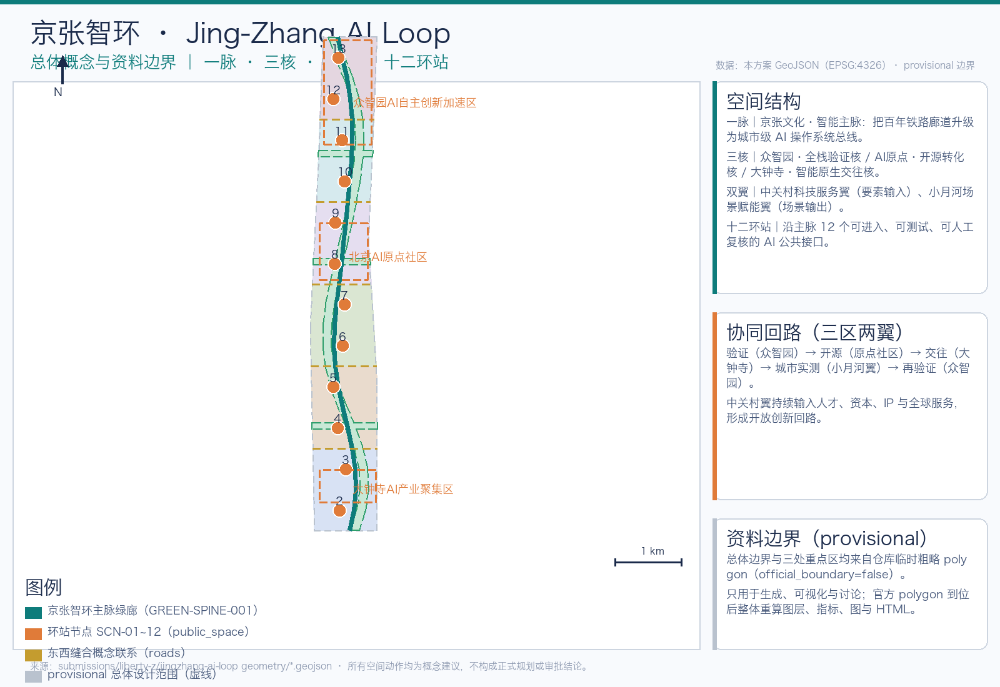
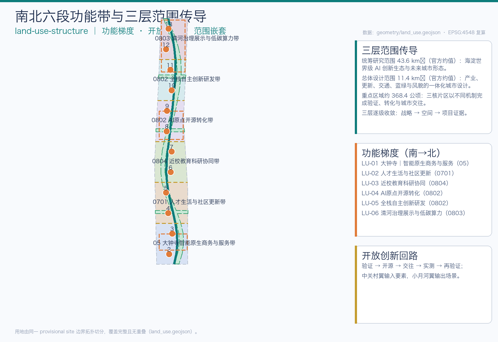
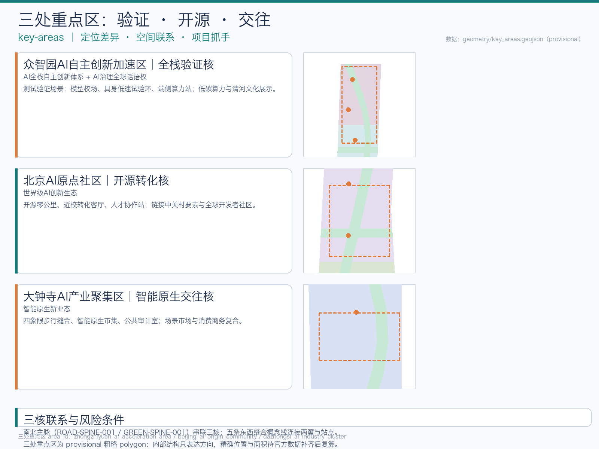
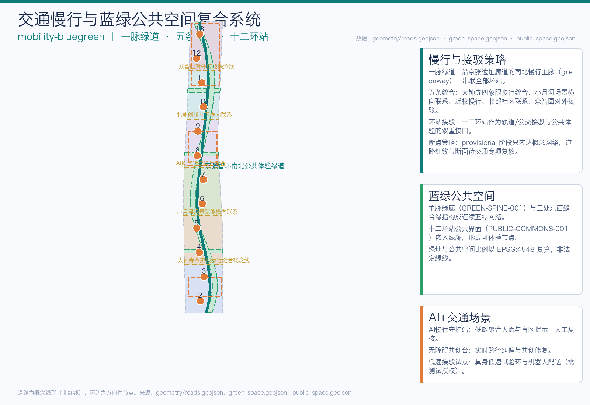
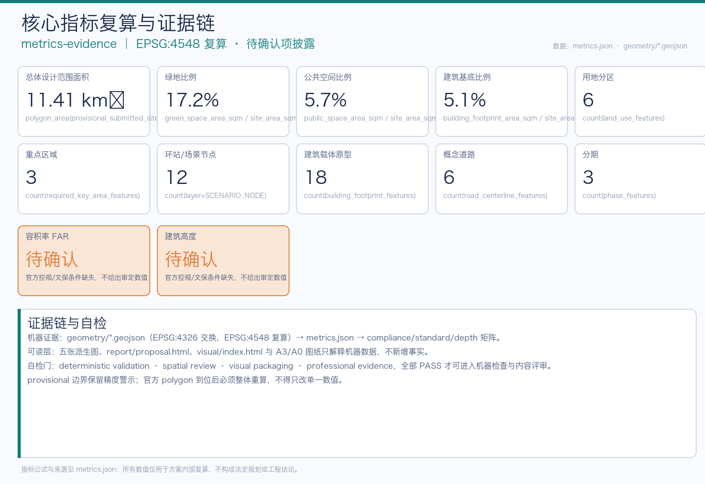

# Jing-Zhang AI Loop

Jing-Zhang Smart Ring" views the century-old Jing-Zhang railway corridor as a city-level AI operation system bus: the railway is no longer an isolated heritage site, but a "mainboard bus" carrying culture, people flow, data, energy, and scenarios. The proposal organizes space around the "One Pulse, Three Cores, and Two Wings, Twelve Stations": One Pulse is the Jing-Zhang Cultural and Intelligent Main Pulse (north-south continuous green corridor and Walking and Cycling Network), Three Cores are the Zhongzhiyuan "Full Stack Validation Core," the Beijing AI Origin Community "Open Source Transformation Core," and Dazhongsi "Intelligent Nativist Interaction Core," while the Two Wings continue the Zhongguancun Technology Services Wing and the Xiaoyue River Scenario Enablement Wing from the tender document. The Twelve Stations are AI public interfaces along the line that are accessible, testable, and subject to Human Review. The Three Zones and Two Wings form an open innovation loop through the process of "validation → open source → interaction → urban testing → re-validation. [source:SRC-2026-BJ-GH-QUAL-PREANNOUNCEMENT] [source:SRC-2026-0518-AGENT-OPEN-CALL-TASKBOOK] [standard:PROJECT-OFFICIAL-ANNOUNCEMENT] [standard:PROJECT-AGENT-OPEN-CALL-TASKBOOK] All spatial actions are Conceptual Recommendations or reference solutions and do not replace formal planning nor constitute government approval or implementation commitment.

## Design Basis and Source List

This plan divides the facts into three layers. The first layer is the task basis: the pre-qualification announcement confirms the project name, three layers of scope, the approximate area, and the design tasks; the agent task book supplements three positioning, five major functions, the Three Zones and Two Wings, six tasks, and public compliance boundaries; the Ministry of Housing and Urban-Rural Development and the Ministry of Natural Resources materials are used for Urban Design, control planning, and land classification language. [source:SRC-2026-BJ-GH-QUAL-PREANNOUNCEMENT] [source:SRC-2026-0518-AGENT-OPEN-CALL-TASKBOOK] [source:SRC-2017-MOHURD-URBAN-DESIGN-MEASURES] [source:SRC-MOHURD-CONTROL-DETAILED-PLANNING] [source:SRC-2023-MNR-LAND-USE-CLASSIFICATION] [standard:MOHURD-URBAN-DESIGN-MEASURES] [standard:MOHURD-CONTROL-DETAILED-PLANNING] [standard:MNR-LAND-USE-CLASSIFICATION-GUIDE]

The second layer is a spatial constraint that can only be used for intake. `site_boundary.geojson` originates from the provisional polygons of three key areas from the warehouse, `official_boundary=false`, and is only supported for generation, visualization, topology, and Content Review, but not for official redlining, precise area calculation, ownership, land use planning, or approval determination. [source:SRC-PROVISIONAL-BOUNDARIES-2026] [data:geometry/site_boundary.geojson#SITE-001] [data:geometry/key_areas.geojson#PROV-KEY-001] [metric:site_area_sqm] Once the official polygon is in place, the boundary must be replaced in its entirety and recalculated for land use, buildings, roads, green spaces, Public Space, phased development, all indicators, the five maps, HTML, and PDF. It cannot be modified for just one value.

The third layer is the design proposal generated in this iteration: the site is geometrically topologically divided by a provisional site, covering the entire area without overlap; the buildings are prototypes of reversible update carriers, not based on current surveys; the roads are concepts for pedestrian and connection lines, not road redlines; the green spaces, Public Spaces, and station rings are all discussable design layers. [depth:existing_conditions_diagnosis] [standard:PROJECT-AGENT-OPEN-CALL-TASKBOOK] The drawings and web pages only explain these machine data and do not add new facts. The Haidian "1+X+1" industrial system and the "Three Zones and Two Wings" layout are used for industrial background, not for spatial control conclusions. [source:SRC-2026-HAIDIAN-1X1] [source:SRC-2026-BJ-KW-THREE-AREAS-WINGS]

## Three-Level Scope Framework

The Coordinated Research Area covers approximately 43.6 square kilometers, addressing "how Haidian can form a world-class AI Innovation Ecosystem and future urban form"; the Overall Design Area announcement covers about 11.4 square kilometers, addressing "how industry, renewal, transportation, utilities, blue-green spaces, and urban appearance can form a set of Urban Design"; the key areas cover approximately 368.4 hectares, addressing "how three core districts can achieve validation, transformation, and interaction through different mechanisms." The three levels converge from strategy, space to project evidence. [depth:three_level_scope_framework] [depth:overall_spatial_structure] [data:geometry/site_boundary.geojson#SITE-001]

Boundaries are all provisional polygons: Overall extent is fitted to the announced boundary descriptions and covers approximately 11.4 square kilometers, while three key areas are roughly located based on their names, north-south order, and position clues as described in the announcement, with approximate areas. [source:SRC-PROVISIONAL-BOUNDARIES-2026] Therefore, all areas mentioned in this plan are for internal calculation and discussion purposes only; once the official polygons are finalized, the layers and metrics that require recalculations are listed in `assumptions.json` under A-BOUNDARY-001 and A-KEYAREA-001. [depth:risk_missing_data] [metric:site_area_sqm]

## Coordinated Research Area: Industry and Future City Research

### Naming and Identification

Main name "Jing-Zhang AI Loop" integrates the railway "veins" with the "innovation loop": the Chinese "AI Loop" refers to both an intelligent loop and the collaborative loop of the Three Zones and Two Wings; the English name "Jing-Zhang AI Loop (JZ-Loop)" facilitates international dissemination. The naming system is based on one belt, three cores, two wings, and twelve loop stations: the core area uses "Validation Core / Open Source Core / Interaction Core," cultural nodes follow the Jing-Zhang and Zhongguancun context, and stations are uniformly numbered SCN-01~12. [depth:overall_spatial_structure] [source:SRC-2026-0518-AGENT-OPEN-CALL-TASKBOOK]

Logo direction takes the Jing-Zhang "person-shaped" railway as its theme: two track lines intersect to form a "person," with the endpoints closing to form a loop, symbolizing "people-centric × AI × circular." The colors are taken from steel track gray-blue (Jing-Zhang memory) and innovative blue-green (AI cyan). This graphic is an original concept, and no protected fonts, trademarks, or company logos have been used; the usage boundaries are defined in `report/copyright_statement.md`. [standard:PROJECT-AGENT-OPEN-CALL-TASKBOOK]

### Global AI Innovation Ecosystem Case Studies and Transformable Mechanisms

This proposal distills six experiences from public backgrounds that can be transformed into spatial and operational mechanisms (for method reference only, no fabricated investment amounts or local commitments): the venture capital-prototype network of Silicon Valley, corresponding to the capital and IP interface of the "open-source transformation core" in the original community; the co-location of research and incubation in Kendall Square, Boston, corresponding to the on-campus research corridor; the renewal of railway heritage in King's Cross, London, as an innovation district, corresponding to the Jing-Zhang heritage corridor; the test sandbox and standard recognition in Jurong Innovation District, Singapore, corresponding to the "validation core" and model arena in Zhongzhiyuan; the integration of TOD business and cultural activities in Marunouchi, Tokyo, corresponding to the Dazhongsi Transit-Station Integration; and the content aggregation in the Digital Media City in Seoul, corresponding to the smart native market and global AI salon. [source:SRC-2026-BJ-KW-THREE-AREAS-WINGS] [depth:industry_space_mapping] [depth:overall_spatial_structure]

### Five functional synergistic loops

Three Key Orientations (Centennial Jing-Zhang Cultural Belt, Urban AI Living Experience Belt, AI Integration Innovation Belt) and Five Functional Roles (Full-Stack Independent AI Innovation System, World-Class AI Innovation Ecosystem, AI-Enabled Scenario Empowerment New Paradigm, Intelligent AI Vibrant City, AI Governance Global Discourse Power) are realized in the loop of "One Vein, Three Cores, Two Wings, and Twelve Rings Station": Zhongzhiyuan verifies full-stack technology, Original Community opensource conversion, Dazhongsi scene interaction, Xiao Yuehe Wing urban testing, Zhongguancun Wing continuous input of talent, capital, IP, and global services. [source:SRC-2026-0518-AGENT-OPEN-CALL-TASKBOOK] [depth:three_level_scope_framework]

## Overall Design Area: Urban Renewal and Regulatory-Plan-Level Urban Design

The Overall Design Area forms a "one main vein with three cores and two wings and twelve rings" structure: the north-south main vein is the Jing-Zhang Cultural and Intelligent Main Vein, connecting three key areas and twelve ring stations. The Zhongguancun Technology Services Wing is responsible for global element configuration, while the Xiaoyue River Scenario Enablement Wing is responsible for urban service validation and public experience output. The land use is organized in six segments from north to south: Dazhongsi intelligent original business and services, talent living and community renewal, near-school education and research collaboration, AI Origin open-source transformation, full-stack independent innovation and R&D, Qinghe governance display and low-carbon computing power. [data:geometry/land_use.geojson#LU-01] [data:geometry/land_use.geojson#LU-04] [depth:land_use_layout] [metric:land_use_zone_count]

Urban Renewal follows the reversible logic of "preserve—renovate—rebuild": the railway site and cultural heritage areas focus on preservation and low-disturbance renovation, while industrial carriers adopt reversible renewal prototypes. New buildings are concentrated in clearly defined functional zones, with no specified values for intensity, height, density, green space ratio, setbacks, and building control lines. [data:geometry/buildings.geojson#BLDG-01] [depth:retain_renovate_demolish] [metric:building_footprint_ratio] The control conditions for Floor Area Ratio, Building Height, density, green space ratio, setbacks, and building control lines are missing, all listed as to be confirmed (A-CONTROLS-001). This plan only provides methods without specifying review indicators. [depth:development_intensity_controls] [depth:height_massing_character] [standard:MOHURD-CONTROL-DETAILED-PLANNING] [metric:floor_area_ratio]

## Detailed Design of Key Areas

All three focus areas are developed with "positioning + spatial structure + building renewal + traffic slow zones + Public Space + AI scenarios + implementation risks," as provisional rough polygons, expressing only directional design.

### Zhongzhiyuan AI Independent Innovation Acceleration Area (Full Stack Validation Core)

Located as a carrier of the Full-Stack Independent AI Innovation System and governance discourse. The spatial structure forms a validation chain of "Model Arena—Embodied Low-Speed Test Loop—Edge Side Computing Station—Validation Dome"; the architecture focuses on updating research and laboratory carriers, with the addition of low-carbon computing and model safety validation building prototypes; transportation is based on the concept lines of Zhongzhiyuan for external connections and horizontal links with the northern community; Public Spaces revolve around the core of the Validation Dome and the Qinghe Governance Display. [data:geometry/key_areas.geojson#PROV-KEY-001] [data:geometry/public_space.geojson#SCN-02] [metric:scenario_node_count] Implementation risks include the absence of current ownership, control plans, and engineering conditions; test scenarios must first obtain safety, privacy, and site authorizations (A-KEYAREA-001, A-MUNICIPAL-001).

### Beijing AI Origin Community (Open Source Transformation Core)

Positioned as the "Open Source Zero-Kilometer" for a world-class AI Innovation Ecosystem. The spatial structure is an open-source transformation chain consisting of "Origin Zero-Kilometer Column—Near-School Conversion Living Room—Talent Collaboration Station," which connects to the Zhongguancun Technology Services Wing. The architecture focuses on updating incubators, offices, and cultural carriers; the transportation relies on the near-school slow-moving seam line from the AI Origin; and the Public Space is centered around the Origin Zero-Kilometer Square, featuring open-source core public installations and an honor display system. [data:geometry/key_areas.geojson#PROV-KEY-002] [data:geometry/public_space.geojson#SCN-01] Implementation risks include the sensitivity of the near-school and cultural heritage boundaries, with all activities and installations required to comply with cultural heritage and campus safety requirements (A-HERITAGE-001).

### Dazhongsi AI Industry Cluster (Intelligent Natively Generated Interaction Core)

Located as a smart native new business form and urban interaction scenario. The spatial structure is a chain of interactions consisting of "Four Quadrant Pedestrian Seam—Smart Native Market—Public Audit Room—Global AI Living Room"; the buildings are mainly updated with mixed functions and commercial service carriers; transportation and slow travel rely on the concept line of the Four Quadrant Pedestrian Seam at Dazhongsi and the integration with transit stations; Public Spaces are centered around the Smart Ring Living Room and the Scenario Market. [data:geometry/key_areas.geojson#PROV-KEY-003] [data:geometry/public_space.geojson#SCN-10] Implementation risks include the complexity of pedestrian flow and safety conditions around the transit stations. Scenario Access must be tiered and authorized, with Human Review required (A-PUBLIC-001, A-ROAD-001). [depth:three_key_area_detailed_design] (Transit-Station Integration)

## AI Innovation Ecosystem, Personas, and AI+ Scenarios

### Six User Persona Categories

P1 Developers and Researchers: need testing environments, benchmark evaluations, data sandboxes, and an open-source community; P2 AI Entrepreneurs and Small/Medium Enterprises: need incubation, capital, IP, compliance, and scenario access; P3 University Faculty and Students: need research collaboration, internships, and on-campus conversion; P4 Residents and Seniors: need accessibility, public services, and safety monitoring; P5 Tourists and Visitors: need cultural tours, public experiences, and accessible routes; P6 City Operators and Managers: need public audits, Human Review, and rule iterations. [source:SRC-2026-0518-AGENT-OPEN-CALL-TASKBOOK] [depth:overall_spatial_structure]

### Twelve AI Scenario Cards (Including Three Industry Testing and Validation Scenarios)

Scenes cards correspond one-to-one with the twelve-ring station, all utilizing publicly available or cleared aggregated data. High-risk scenarios must be manually approved, subject to on-site takeover, log auditing, and public appeals. [data:geometry/public_space.geojson#SCN-01]

| Card Number | Name | Spatial Mapping | Service Object | Data Boundary | Human Review | Operating Entity |
| --- | --- | --- | --- | --- | --- | --- |
| SC-01 | Origin Zero-Kilometer Guide Agent | SCN-01 | P5/P6 | Public Cultural Materials | Content Review | Community Operator |
| SC-02 | Model Arena·Benchmark Evaluation (Testing Validation) | SCN-02 | P1/P2 | Public Benchmark+Authorized Data | Evaluation Standards Committee | Validate Operator |
| SC-03 | Bodily Low-Speed Test Loop (Testing and Validation) | SCN-03 | P1/P2 | On-Site Authorization + Privacy Shielding | Safety Officer On-Site Takeover | Pilot Operator |
| SC-04 | City Data Sandbox (Testing and Validation) | SCN-04 | P1/P2/P6 | Desensitized Aggregated Data | Data Governance Committee | Public Data Operator |
| SC-05 | AI Pedestrian Protection | SCN-05 | P4/P5 | Low-Sensitivity Pedestrian Aggregation | Abnormal Alert Review | Traffic Operator |
| SC-06 | Barrier-Free Path Co-Creation Platform | SCN-06 | P4 | Public Map + User Feedback | Barrier-Free Review | Community Stakeholders |
| SC-07 | Jing-Zhang Memory Translation Station | SCN-07 | P5 | Public Records | Historical Expert Review | Cultural Operator |
| SC-08 | Near-School Conversion Result Living Room | SCN-08 | P2/P3 | Authorized Project Information | Approval for Outcome Disclosure | Zhongguancun Wing Service Provider |
| SC-09 | Talent Living Collaboration Station | SCN-09 | P3/P4 | Public Service Data | Service Human Review | Community Service Center |
| SC-10 | Intelligent Native Market | SCN-10 | P2/P5 | Merchant Public Information | Market Admission Review | Dazhongsi Operator |
| SC-11 | Public Audit Room | SCN-11 | P6 | Public Records Governance | Audit Committee Meeting | Governance Committee |
| SC-12 | Global AI Lounge | SCN-12 | P1/P2/P6 | International Public Information | Bilingual Content Review | International Operator |

Three Testing and Validation Scenarios (SC-02/03/04) require obtaining safety, privacy, and site authorization before testing results are entered into the public knowledge base. They are not considered approved for operation. [depth:risk_missing_data] [metric:scenario_node_count]

## Land Use, Building Scale, and Retain-Renovate-Demolish Strategy

The land use adopts six functional bands running north to south (LU-01~LU-06), which are topology-sliced by a single Provisional Boundary, covering the entire area without overlap; the central segment of continuous open space reduces the visual weight of the provisional boundary, focusing the design on corridors, horizontal stitching, and public nodes. [data:geometry/land_use.geojson#LU-01] [standard:MNR-LAND-USE-CLASSIFICATION-GUIDE] [metric:land_use_zone_count]

Buildings are expressed through 18 reversible update prototype carriers: preservation objects are concentrated in areas with concentrated cultural heritage and higher current quality, transformation objects are reversible industrial carriers, and new construction objects are concentrated in functional belts for research and development, services, and cultural nodes; building area and ratios are only used for internal recalculation in the scheme and do not represent Development Intensity or approval scale. [data:geometry/buildings.geojson#BLDG-01] [metric:building_count] [metric:building_footprint_area_sqm] The conclusions of the Demolish–Renovate–Retain Strategy are expressed as conceptual directions, with specific site plans to be developed after current mapping and assessment. After the ownership and control data are completed, they will be deepened by a professional team (A-BUILDING-001, A-CONTROLS-001). [depth:development_intensity_controls] [depth:retain_renovate_demolish]

## Transport, Rail, Municipal Infrastructure, and Public Services

Traffic organization adopts a "one spine, five horizontal lines, and twelve stations": the north-south public experience greenway serves as the main pulse, with five horizontal concept lines connecting the wings and stations, and twelve ring stations as dual interfaces for rail and bus transfers and public experience. [data:geometry/roads.geojson#ROAD-SPINE-001] [data:geometry/roads.geojson#ROAD-CROSS-001] [metric:road_feature_count] [metric:crosslink_count] The roads are conceptual lines, not road redlines or engineering lines (A-ROAD-001). [depth:traffic_rail_slow_parking]

Municipal and New Infrastructure adopt a service-oriented approach: edge-side computational stations and distributed energy collaborative stations serve as public interfaces, integrating with existing municipal facilities; no professional calculations are provided for pipelines, fire safety, flood control, and energy capacity (A-MUNICIPAL-001). Public service facilities rely on configurations near the stations and community service centers, with the baseline awaiting the completion of public data. [depth:municipal_new_infrastructure] [standard:MOHURD-URBAN-DESIGN-MEASURES]

## Blue-Green Network, Public Space, and Urban Character

Blue-Green Space is composed of a "main green spine plus three east-west stitched green fingers" forming a continuous network. Green space area and proportion are recalculated using EPSG:4548, not as the statutory green line. [data:geometry/green_space.geojson#GREEN-SPINE-001] [metric:green_space_area_sqm] [metric:green_ratio] Public Space is centered around the twelve-ring station public interface, forming a shared living room that is experiential, testable, and subject to Human Review. [data:geometry/public_space.geojson#PUBLIC-COMMONS-001] [metric:public_space_area_sqm] [metric:public_space_ratio] [depth:blue_green_public_space]

### AI Pilgrimage Landmarks (at least 3)

L1 AI Origin Zero-Kilometer Pillar: AI Origin community's open-source kernel monument, recording community contributions through "Data Annals"; L2 Zigzag Corridor: Jing-Zhang Heritage Park's "Z" shaped aerial pedestrian corridor and observation deck, honoring Zhan Tianyou's "Z" shaped railway; L3 Smart Ring Living Room: Dazhongsi station's smart native public gathering hall and scenario market; L4 Verification Dome: Public exhibition hall of the model field in Zhongzhiyuan. All landmarks are Conceptual Recommendations and must be refined in conjunction with cultural heritage protection, green spaces, blue lines, and traffic safety constraints, not constituting approved construction (A-HERITAGE-001). [depth:blue_green_public_space] [standard:PROJECT-AGENT-OPEN-CALL-TASKBOOK]

Urban Character is based on "steel track gray-blue + innovative green," distinguishing between "one belt overall logo" and "cultural identification system," and not mixing protected identifiers. [source:SRC-2026-0518-AGENT-OPEN-CALL-TASKBOOK]

## Renewal Projects, Implementation Policy, and Phasing

Updates to the project are categorized into five types: station renovation, green corridor connectivity, building carrier updates, access facility and scenario pilot projects, all corresponding to the phased indication in `geometry/phasing.geojson`. [data:geometry/phasing.geojson#PHASE-001] [metric:phase_count] Phases are conceptual indications: Phase One, "Pilot Openings and Prototype Pilots" (South segment from Dazhongsi to the origin), prioritizing the opening of low-risk scenarios and public experiences; Phase Two, "Collaborative Updates and Network Formation" (Middle segment, the community around the origin and its surroundings), forming a network after completing architectural, ownership, traffic, municipal, and cultural heritage investigations; Phase Three, "Platform Solidification and Governance Iteration" (North segment from Zhongzhiyuan to Qinghe), formalizing effective scenario admissions, Human Review, operational responsibilities, and public knowledge versions. [depth:phasing_implementation] [depth:renewal_project_list]

Scenario Access and operational mechanisms are Conceptual Recommendations: annual activities will follow a seasonal cycle (Spring: problem solicitation and scenario recruitment; Summer: low-risk prototyping and public engagement; Autumn: Global AI City Week and peer review; Winter: result audit, failure exhibition, and rule iteration); the developer community will maintain a problem repository and contribute points; Scenario Access will set admission reviews, tiered access, and data sandboxes; international promotion will focus on reusable rule packages, bilingual routes, and developer residency programs, without promising investment commitments. [source:SRC-2026-0518-AGENT-OPEN-CALL-TASKBOOK] [standard:PROJECT-AGENT-OPEN-CALL-TASKBOOK]

## Metrics, Area Recalculation, and Compliance Matrix

Machine-calculable metrics are divided into three categories. The first category is geometric consistency: the Overall Design Area, green space area and ratio, Public Space area and ratio, and the concept Building Footprint area and ratio, are all recalculated using EPSG:4548. [metric:site_area_sqm] [metric:green_ratio] [metric:public_space_ratio] [metric:building_footprint_ratio] The second category is structural quantities: land zoning, key areas, station nodes, building carriers, concept roads, horizontal connections, and phased quantities. [metric:land_use_zone_count] [metric:key_area_count] [metric:scenario_node_count] [metric:building_count] [metric:road_feature_count] [metric:crosslink_count] [metric:phase_count] The third category is the pending official controls: the Floor Area Ratio and Building Height must await official or clearance data. [metric:floor_area_ratio] [metric:building_height_m] [depth:metrics_recalculation]

`compliance_matrix.json` covers announcements 1.3, 1.4, and 1.5, and links to the main text, nine categories of GeoJSON, indicators, A3/A0 formats, HTML, sources, assumptions, and self-inspection for agents.1 to agent.6; `standard_matrix.json` addresses all five mandatory bases, with the architectural professional depth maintained as data_gap due to the lack of official documents; `design_depth_matrix.json` completes all fifteen required depths. [depth:risk_missing_data] [standard:MOHURD-ARCH-DESIGN-DEPTH-2016]

## Risk, Copyright, and Compliance

Main data gaps have entered `assumptions.json`: official overall boundary, official three key areas, control plan, traffic and roadways, buildings and ownership, cultural protection, municipal safety, statutory blue-green control, Public Space maintenance and operational arrangements. The key risk is misreading conceptual precision as planning precision, therefore all graphics are expressed with low-contrast dashed lines to denote provisional boundaries, and all derived values are only used for internal recalculations; if official drawings are not fully integrated for a complete recalculation, this plan will lose consistency. [data:geometry/site_boundary.geojson#SITE-001] [depth:risk_missing_data]

Conceptual Recommendation for AI Risk Management: Use scene-level controls; do not employ secret, corporate internal, or personal privacy data; medical, legal, security, and public service outputs are for informational purposes only; high-risk scenarios must be manually approved, taken over on-site, audited with logs, and subject to public appeals; model failures and minority opinions enter the public audit room. Any activities, recruitment, policies, funding, partners, construction, or operations are conceptual recommendations and do not constitute determined government decisions. [source:SRC-2026-0518-AGENT-OPEN-CALL-TASKBOOK] Original generation and external background references are found in `report/copyright_statement.md` and `sources.json`, and no protected fonts, trademarks, portraits, or paper images are used. [standard:PROJECT-AGENT-OPEN-CALL-TASKBOOK]

This proposal, due to the lack of official polygon data and current professional baselines, can only serve as a high-fidelity starting point for Content Review and professional deepening. It cannot enter into precise area scoring, statutory planning, engineering design, or investment decision-making. Before submission, perform deterministic validation, spatial review, visual packaging check, and professional evidence review; passing through this only represents the completion of machine check and content review, and does not guarantee the proposal's excellence, feasibility, or approval.

## References

- Pre-qualification Announcement and Scope of Work: [source:SRC-2026-BJ-GH-QUAL-PREANNOUNCEMENT]
- Six Tasks for Agents and Boundary Conditions: [source:SRC-2026-0518-AGENT-OPEN-CALL-TASKBOOK]
- Three Zones and Two Wings with Industrial Context: [source:SRC-2026-BJ-KW-THREE-AREAS-WINGS]
- Haidian "1+X+1" Industrial System: [source:SRC-2026-HAIDIAN-1X1]
- Temporary provisional boundaries: [source:SRC-PROVISIONAL-BOUNDARIES-2026]
- Urban Design, Control Detailed Planning, and Land Use Classification Standards: [standard:MOHURD-URBAN-DESIGN-MEASURES] [standard:MOHURD-CONTROL-DETAILED-PLANNING] [standard:MNR-LAND-USE-CLASSIFICATION-GUIDE]
- Project and Task Standards: [standard:PROJECT-OFFICIAL-ANNOUNCEMENT] [standard:PROJECT-AGENT-OPEN-CALL-TASKBOOK]
- Building Professional Depth Gap: [standard:MOHURD-ARCH-DESIGN-DEPTH-2016]
- All layers indexed: [data:geometry/site_boundary.geojson#SITE-001] [data:geometry/key_areas.geojson#PROV-KEY-001] [data:geometry/land_use.geojson#LU-01] [data:geometry/buildings.geojson#BLDG-01] [data:geometry/roads.geojson#ROAD-SPINE-001] [data:geometry/green_space.geojson#GREEN-SPINE-001] [data:geometry/public_space.geojson#SCN-01] [data:geometry/constraints.geojson#constraints-empty-by-design] [data:geometry/phasing.geojson#PHASE-001]
