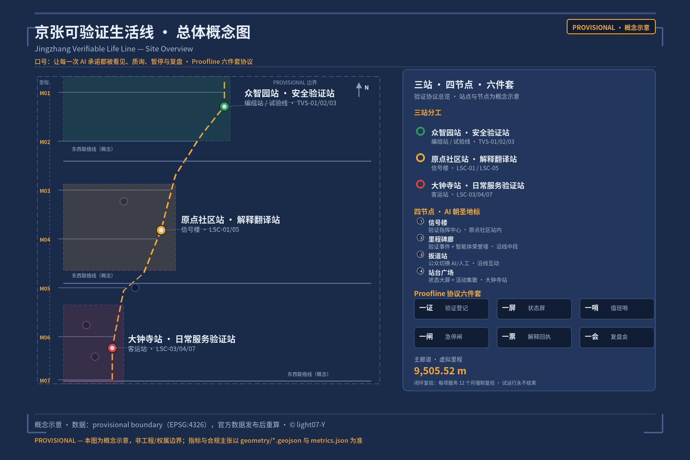
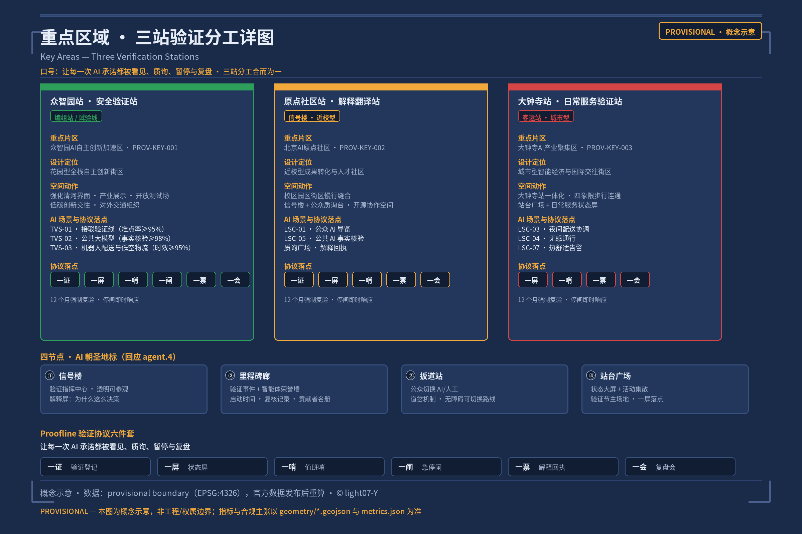
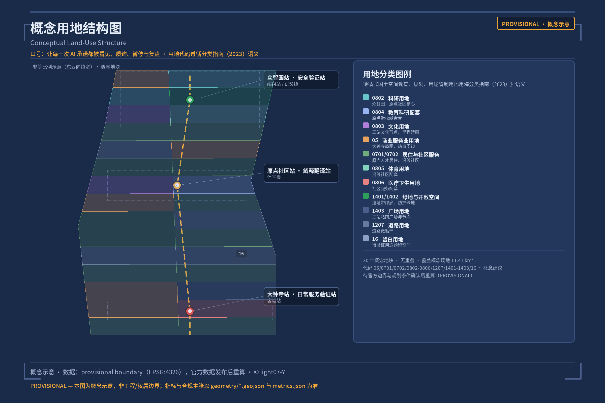
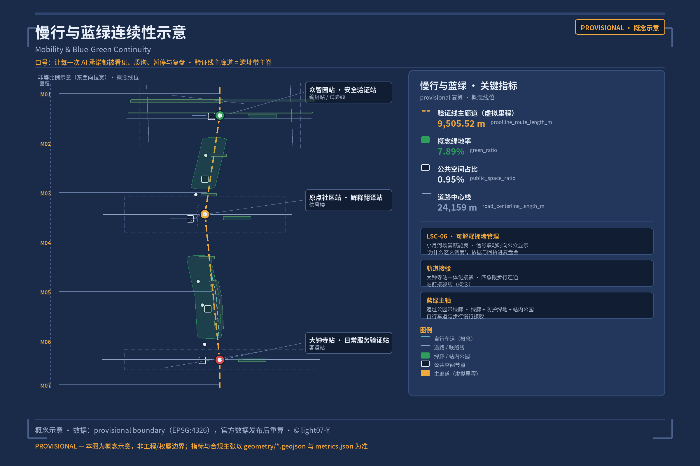
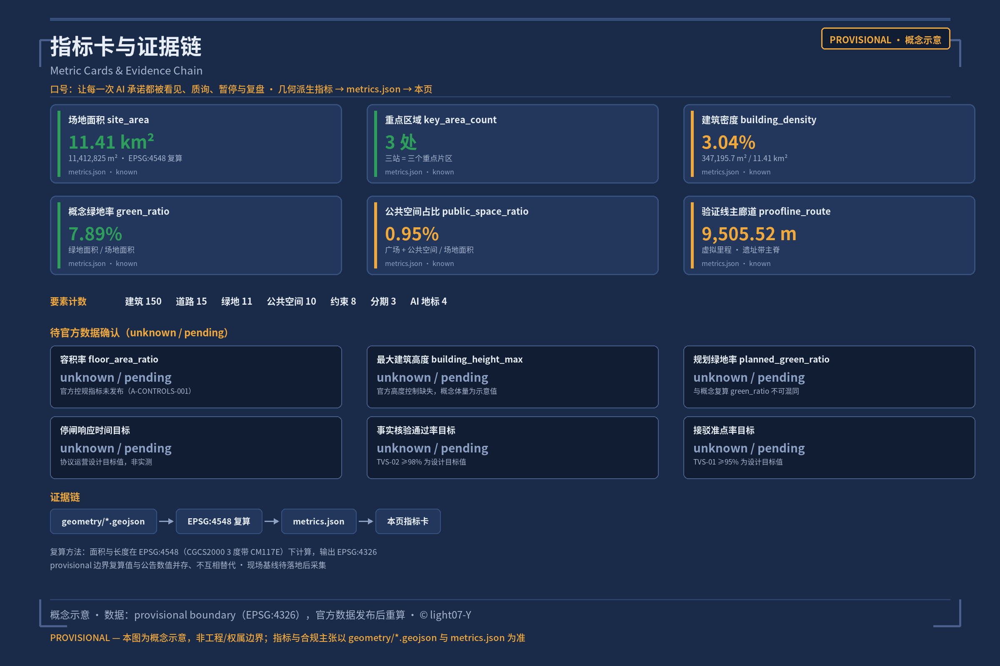

# Jingzhang Verifiable Life Line · 京张可验证生活线

## Design Basis and Source Inventory

The first basis of this proposal is the Pre-Qualification Announcement for the International Open Call for Urban Design of the Centennial Jing-Zhang AI Innovation Belt, issued by the Haidian Branch of the Beijing Municipal Commission of Planning and Natural Resources, supplemented by the machine-readable basis registered by the maintainers in `brief/site-package/`: provisional rough boundaries, key areas, enums, indicator ranges and the source inventory [source:OFFICIAL-ANNOUNCEMENT] [source:SITE-PACKAGE] [source:AGENT-TASKBOOK]. The agent-oriented taskbook adds ten co-creation principles, sustained-participation requirements, unified review dimensions and a unified boundary clause; all spatial and operational recommendations in this proposal are framed as conceptual recommendations, reference proposals open to further study by professional teams. They do not replace formal planning and do not constitute government-approved conclusions [standard:PROJECT-AGENT-OPEN-CALL-TASKBOOK].

The official `SITE_BOUNDARY` and the precise polygons of the three `KEY_AREA` sites have not yet been published (the pre-qualification document download remains password-protected). This proposal uses `brief/site-package/geometry/provisional_boundaries.geojson` to generate a provisional formal-format package [source:BOUNDARY-SOURCE] [source:KEY-AREA-SOURCE] [source:DATA-SRC-PROVISIONAL-BOUNDARIES-20260605]. In the submission package, both `geometry/site_boundary.geojson` and `geometry/key_areas.geojson` are marked `provisional_constraint`, `official_boundary=false`, with confidence `medium`; they may be used only for proposal generation, self-checking, visualization and design discussion, and may not serve as an Official Planning Boundary, an approval basis, a basis for precise area figures, or a legally binding control conclusion [depth:risk_missing_data]. Current-condition diagnosis relies on the announcement, the taskbook and public materials (no site survey); existing rail, the heritage corridor, the Qinghe and primary roads are expressed as a low-confidence conceptual layer in `geometry/constraints.geojson` [depth:existing_conditions_diagnosis]. This organizer-side data gap itself does not block content scoring; once the official polygons are released, the boundary, land use, buildings, roads, green space, public space, phasing and all geometry-derived indicators must be recalculated (see Chapter 11 for the recalculation method) [metric:site_area_sqm].

The permitted uses of the source registry are as follows [source:SOURCE-REGISTRY]: 7 formal-ready sources (the announcement, the taskbook, the Measures for the Administration of Urban Design, the Measures for RDP formulation and approval, the Land-Use Classification Guide, the Interim Measures for Generative AI Services, and the Barrier-Free Environment Law), 1 provisional-only source (provisional boundaries), and 1 background-only source (the policy background of smart-technology aging support). Agents must not upgrade background_only or provisional_only materials into official boundaries, statutory regulatory plans, formal scoring bases, or government implementation commitments [source:PROCESSED-FACT-PACK].

**Core claim**: AI should not appear in the city as "smarter buildings" or "tech window displays", but as **verifiable public services**. The city provides infrastructure for water, power and light; it should also provide infrastructure for "proof" — so that every AI promise can be seen, questioned, stopped and reviewed. The Jingzhang Verifiable Life Line is exactly such a **public line in permanent trial-running state**: it is not an engineering line that is "delivered once built", but a life line whose signals are always lit, whose running chart is always public, and on which any service can be stopped and inspected at any time. The difference between this proposal and others on the same theme is that we do not produce an institutional expression of "verification infrastructure"; we produce **the everyday-ization of verification** — certificate experiences within easy reach while grocery shopping, commuting, seeking healthcare or taking a stroll.

## Three-Layer Scope Working Framework

The work is organized along the three layers defined by the announcement [source:OFFICIAL-ANNOUNCEMENT] [depth:three_level_scope_framework]:

| Layer | Official scope | What this proposal carries | Data anchor |
| --- | --- | --- | --- |
| Coordinated Research Area | 43.6 km², bounded by the North Fifth Ring Road to the north, the Jingzang Expressway to the east, Xizhimen Outer Street to the south, and Wanquanhe Road to the west | The innovation chain and ecosystem framework of verification as an urban governance method (Chapter 3) | compliance_matrix.json, [data:geometry/site_boundary.geojson#SITE-001] |
| Overall Design Area | 11.4 km²: urban districts and industrial zones within 1-2 km of the Jing-Zhang Railway Heritage Park | The overall spatial structure of "one line + three verification stations + four nodes" (Chapters 4-9) | [data:geometry/land_use.geojson#LU-001], [data:geometry/roads.geojson#ROAD-001] |
| Key-Area Detailed Design Area | 368.4 ha across three detailed-design areas | Three stations = Safety Verification Station / Interpretation Station / Daily Service Station (Chapter 5) | [data:geometry/key_areas.geojson#PROV-KEY-001], [data:geometry/key_areas.geojson#PROV-KEY-002], [data:geometry/key_areas.geojson#PROV-KEY-003] |

The three layers are not separate sets of drawings: the Coordinated Research Area decides the industrial and ecosystem value of "verification" as a governance method; the Overall Design Area grounds the method in spatial structure and facility capacity; the key areas turn the protocol into station scenarios that can be experienced, re-checked and operated. All geometry-derived areas and ratios are recalculated in `metrics.json` and marked with provisional constraints [metric:site_area_sqm] [metric:green_ratio] [metric:public_space_ratio]; any quantity that cannot be recalculated from structured data must not enter formal conclusions [depth:metrics_recalculation].

## Coordinated Research Area: Industry and Future-City Studies

### 3.1 Naming System and Visual Identity (responding to agent.1)

- **Primary name**: Jingzhang Verifiable Life Line (JZ-VLL)
- **Motto**: Every AI promise on the line can be seen, questioned, stopped, and reviewed.
- **Naming system**: Line (the Verification Line = the heritage park main axis) → Stations (Zhongzhiyuan Station = Safety Verification Station; AI Origin Community Station = Interpretation Station; Dazhongsi Station = Daily Service Station) → Nodes (Signal House, Milepost Gallery, Switch Point, Platform Square) → System (the six-piece Proofline Verification Protocol). "Station" is a natural transposition of railway language: along the Jing-Zhang Railway, stations were once the centers of daily life; today, AI services set up "stations" along the line, where the public can enter to question and leave to exit [standard:PROJECT-OFFICIAL-ANNOUNCEMENT] [source:AGENT-TASKBOOK].
- **Logo direction**: a three-color vertical signal-lamp column (green = trial-running / yellow = speed-restricted / red = out of service), whose column body derives from the letter J — the initial of "Jing-Zhang" — with a milepost scale as its base: signal, rail and milepost in one, sharing the lineage of Jing-Zhang Railway heritage culture and isomorphic with the semantics of "verification".
- **Mapping of the five functions**: Full-Stack Independent AI Innovation System → Safety Verification Station at Zhongzhiyuan; world-class AI Innovation Ecosystem → Interpretation Station at the AI Origin Community; the new paradigm of AI-enabled scenario empowerment → Daily Service Station at Dazhongsi; the intelligent AI-vibrant city → corridor-wide scenario system; global voice in AI governance → Proofline Protocol and the Verification Festival [source:AGENT-TASKBOOK].
- **Three Zones and Two Wings coordination loop**: the three stations equal the three key areas. The Zhongguancun Technology Services Wing carries global factor allocation and capital enablement (linked to the Certificate registration of the verification stations); the Xiaoyue River Scenario Enablement Wing carries AI scenario enablement and the intelligent AI-vibrant city (where LSC-06 explainable congestion management is anchored). The two wings act as the supply side and the scenario side of the verification protocol, closing the loop between "protocol, factors and scenarios".
- **Differentiation statement**: existing proposals on the same "verification" theme emphasize the institutional expression of verification infrastructure (tracked stations, running charts, evaluation pipelines). This proposal binds the verification protocol to **everyday life scenarios** — grocery shopping, commuting, seeking healthcare, taking a stroll — and, for the first time, strings "signal → dispatch → switch → milepost → receipt → review" into a complete protocol chain that is executable and traceable from end to end.

### 3.2 Global AI Innovation Ecosystem Cases (responding to agent.2)

Five cases are drawn from public sources, all public knowledge provided as design reference rather than implementation commitments [source:AGENT-TASKBOOK]: ① Toronto Quayside — the lesson of over-promising without a verifiability mechanism, a reverse proof of the need for "verification-first urban digital services"; ② Singapore's Smart Nation — unified digital identity and public service catalogs underpinning the traceable operation of public digital services; ③ Helsinki's AI Register — public registration (corresponding to this proposal's "Certificate") letting citizens look up how a service is used and its data boundaries; ④ Barcelona 22@ — innovation-district renewal achieving the coexistence of industry and public space, validating the form of "carrying industrial display on public space"; ⑤ the launch norms for government LLM services across multiple Chinese municipalities — an operating baseline of pre-launch evaluation, in-operation supervision and post-launch review for public LLMs. All five point to the same conclusion: **verifiability is the passport to AI urban public services, not an add-on**.

### 3.3 Zhongzhiyuan Full-Stack Independent Innovation and the AI Governance Voice

The Zhongzhiyuan AI Independent Innovation Acceleration Area carries the positioning of the Full-Stack Independent AI Innovation System and the global voice in AI governance [source:OFFICIAL-ANNOUNCEMENT] [standard:PROJECT-AGENT-OPEN-CALL-TASKBOOK]: the Safety Verification Station hosts independent model testing, standard setting, safety-governance display and low-carbon computing experience; the "test line" format organizes the industrial testing and validation scenarios (see 6.2) into an open validation field that can be visited, booked and supervised [data:geometry/key_areas.geojson#PROV-KEY-001]. Governance voice derives from replicable verification methods — this proposal offers the six-piece Verification Protocol suite as an internationally communicable urban governance product, exported continuously through the international track of the Verification Festival and the annual release of the running chart.

## Overall Design Area: Urban Renewal and Urban Design at Regulatory Detailed Planning Depth

The Overall Design Area work must reach the urban design depth of regulatory detailed planning [standard:MOHURD-CONTROL-DETAILED-PLANNING] [depth:overall_spatial_structure]. This proposal puts forward the overall spatial structure of **"one spine, three stations, stations along the line, closed-loop re-verification"** [depth:land_use_layout]:

- **One spine**: the Jing-Zhang Railway Heritage Park corridor serves as the main spine of the verification line (the Proofline main corridor), linking walking and cycling, blue-green and AI service nodes [data:geometry/roads.geojson#ROAD-001] [data:geometry/green_space.geojson#GREEN-001];
- **Three stations**: the three key areas each carry one verification-station function (see Chapter 5) [data:geometry/key_areas.geojson#PROV-KEY-001] [data:geometry/key_areas.geojson#PROV-KEY-002] [data:geometry/key_areas.geojson#PROV-KEY-003];
- **Stations along the line**: AI services are arranged along the line in the form of stations; every station carries the attributes of the six-piece protocol, and the public can enter to question and leave to exit;
- **Closed-loop re-verification**: every service undergoes mandatory 12-month re-verification (the "overhaul" regime); trial running never ends.

The overall urban renewal framework follows the principle of "verification before renewal": the identification of inefficient spaces is based on public materials (no site survey, no internal data), and the renewal project list (Chapter 10) is entirely conceptual and does not designate demolition, renovation or retention on specific plots (prohibited by the boundary clause; see Chapter 12) [depth:retain_renovate_demolish]. Total building scale is expressed as conceptual volumes (about 150 conceptual building footprints; see Chapter 7). Regulatory-planning indicators such as development intensity and building height are all marked unknown until official control conditions are available [depth:development_intensity_controls] [depth:height_massing_character]. New Infrastructure (edge computing, distributed energy, low-interference sensing) is proposed as conceptual prototypes pending further study, without engineering-feasibility conclusions [depth:municipal_new_infrastructure].

## Key-Area Detailed Design

The three key areas are the proposal's "three verification stations" — merging the detailed-design tasks required by the announcement [source:OFFICIAL-ANNOUNCEMENT] with the three-station division of the verification protocol [depth:three_key_area_detailed_design]:

| Key area | Verification station function | Design positioning | Spatial moves | AI scenarios and protocol anchor | Evidence |
| --- | --- | --- | --- | --- | --- |
| Zhongzhiyuan AI Independent Innovation Acceleration Area | Safety Verification Station (marshalling yard / test line) | Garden-style full-stack independent innovation block | Strengthen the Qinghe interface, industrial display, low-carbon innovation exchange and external transport organization; green spaces carry the open testing grounds and the standards-governance display | TVS-01/02/03 industrial testing and validation; test-line Status Screen; test-engineer watchkeeping | [data:geometry/key_areas.geojson#PROV-KEY-001], [depth:three_key_area_detailed_design] |
| Beijing AI Origin Community | Interpretation Station (Signal House) | Campus-adjacent outcome-transfer and talent community | Stitch campus, park and blocks with walking and cycling connections; add outcome-release, talent-service, residential-living and open-source-collaboration spaces; set up the Signal House and public inquiry desks | LSC-01 guided tours; LSC-05 fact-checking; inquiry plaza; explanation receipts | [data:geometry/key_areas.geojson#PROV-KEY-002] |
| Dazhongsi AI Industry Cluster | Daily Service Station (passenger station) | Urban-style intelligent-economy and international-exchange block | Dazhongsi station integration; four-quadrant pedestrian connectivity; renewal of commercial services and the public environment around key enterprises; set up the Platform Square and the daily-service Status Screen | LSC-03 nighttime delivery coordination; Platform Square event dispatch; daily-service receipts | [data:geometry/key_areas.geojson#PROV-KEY-003], [metric:key_area_count] |

**Four AI pilgrimage landmarks (responding to agent.4, ≥3)**: ① the Signal House (inside the AI Origin Community station; the verification command center, transparent and open to visits, where the public can watch the explanation screens showing "why this decision was made"); ② the Milepost Gallery (mid-line; railway mileposts transcribe the verification event log, inscribing verification start times, review records and the roster of Urban Agent contributors, forming an honor-display system); ③ the Switch Point (an interactive public space where the public can switch between AI and human service modes by hand and experience the "switch" mechanism); ④ the Platform Square (at the Dazhongsi station; public status screens + event assembly + the main venue of the Verification Festival) [data:geometry/public_space.geojson#PUBLIC-001] [source:AGENT-TASKBOOK]. The honor-display system and the public-space component library (Status Screens, mileposts, signal-lamp wayfinding, receipt kiosks) together form a reusable component-library direction, incorporated into the component inventory of Chapter 11 [depth:three_key_area_detailed_design].

## AI Innovation Ecosystem, User Profiles and AI-Enabled Scenarios

### 6.1 User Profiles (responding to agent.3; 6 profiles, framed as "review seats" rather than labels)

| Profile | Typical needs | Spatial response | Protocol boundary |
| --- | --- | --- | --- |
| P01 Granny Wang, 78, living alone (Dazhongsi community) | AI service entry points that do not depend on a smartphone | Paper-based service entry; in-person errand-assistance points; LSC-04 | Services do not profile behavior; human fallback |
| P02 Chen Mo, 29, AI engineer (Zhongzhiyuan) | Testing and validation; open-source contribution; community reputation | Test line; milepost honor wall; TVS series | Code and test data contributed voluntarily |
| P03 Master Li, 40, delivery rider (Xiaoyue River Wing) | Time-segmented nighttime delivery; human-robot handover | Delivery time windows; robot handover points; LSC-03 | Location-data minimization; human handover as fallback |
| P04 Zhang Lin, 35, mother with a young child (AI Origin Community) | Guided tours; safety; thermal comfort | Accessible switchable routes; thermal-comfort alerts; LSC-01/02/07 | No tracking of children |
| P05 Alex, 28, overseas developer visitor | Multilingual services; open protocols; international events | Inquiry desks; international track of the Verification Festival; LSC-05 | Multilingual explanations; anonymous participation |
| P06 General Manager Zhao, 45, SME owner | Scenario access applications; resource matching | Four-step scenario access process; enterprise service Copilot | Data authorization under separate contracts |

### 6.2 AI Scenario Cards (responding to agent.3; 12 cards: 3 industrial testing and validation + 9 daily life)

Every scenario card follows the same **protocol card fields** (aligned with the official acceptance standard of "tracing a single scenario card all the way to space, responsibility, start conditions and result receipts"): spatial location | operator (responsible role) | baseline source and current status | observation target / sample boundary / time window | success threshold | stop threshold | independent shutdown review role (human) | equivalent human service | data retention / deletion receipts / review cycle | appeal entry / pre-scaling review conditions | protocol chain mapping (Certificate, Status Screen, Watchkeeper, Stop Switch, Service Receipt, Review Session). **Baselines and thresholds are design-proposed target values, not field data already obtained; on-site baselines are to be collected after implementation (unknown)** [source:AGENT-TASKBOOK].

**Industrial testing and validation scenarios ×3 (Zhongzhiyuan station, TVS-01~03)**:

| Scenario | Success threshold (target) | Stop threshold (hard) | Human review | Recovery path | Protocol chain |
| --- | --- | --- | --- | --- | --- |
| TVS-01 Autonomous shuttle testing and validation line | On-time rate ≥ 95% | **any single human-vehicle contact incident stops the service** | Safety attendant on every shuttle | Re-run the Certificate process after rectification | Certificate registration → test-line Status Screen → test-engineer watchkeeping → test emergency Stop Switch → test-report Service Receipt → test Review Session |
| TVS-02 Public LLM service validation (government / city Q&A) | Fact-verification pass rate ≥ 98% | 3 consecutive factual errors or 1 high-hazard error | Duty-watchkeeper spot checks + public inquiry desk | Re-verify after version rollback | Certificate + explanation screen + duty Watchkeeper + shutdown Stop Switch + explanation receipt + monthly Review Session |
| TVS-03 Robot delivery and low-altitude logistics validation | Delivery-timeliness achievement rate ≥ 95% | Pedestrian safety incidents | Rider handover confirmation | Temporary switch to human delivery | Certificate + time-window Status Screen + dispatch Watchkeeper + emergency Stop Switch + handover receipt + Review Session |

For TVS-02, content compliance and data boundaries follow the Interim Measures for the Administration of Generative Artificial Intelligence Services [source:DATA-SRC-GENERATIVE-AI-INTERIM-MEASURES]: the provisions on handling illegal content are not equivalent to a general user right of withdrawal, and the Measures set no statutory hard numeric time limits for digital responses to user deletion and withdrawal. Accordingly, this proposal does not fabricate a "statutory N-day deletion" commitment; instead it responds through the operational design of "deletion receipts + review cycle".

**Daily life scenarios ×9 (LSC-01~09)**: LSC-01 public AI guided tour (Interpretation Station; multilingual, explainable, switchable to human guides; references the standard scenario ai-cultural-guide); LSC-02 accessible switchable routes (along the line; per the Article 39 boundary of the Law on Building a Barrier-Free Environment — limited to statutorily enumerated service venues such as healthcare, social security, finance and utility payments, not generalized to all public spaces [source:DATA-SRC-BARRIER-FREE-ENVIRONMENT-LAW]; references ai-traffic-walkability); LSC-03 nighttime delivery and quiet-space coordination (Dazhongsi; quiet hours and delivery time windows; references robot-delivery-low-speed); LSC-04 paper-based service entry (communities along the line; an equivalent human entry for elders who do not depend on smartphones; paper service receipts); LSC-05 public AI fact-checking (inquiry desks; the public submits AI content and the check desk returns source conclusions and explanation receipts; references the navigation-style service path of ai-health-service-navigation); LSC-06 explainable congestion management (Xiaoyue River Wing; signal coordination shows the public "why traffic is being dispatched this way"); LSC-07 thermal-comfort alerts (public spaces; extreme-weather AI alerts + human emergency watchkeeping); LSC-08 community service resource matching (communities; AI matching + human social-worker review; references the enterprise/organization service pattern of enterprise-service-copilot); LSC-09 data deletion and exit receipts (along the line; leaving an AI service yields a deletion receipt; responds to the "right to exit" floor; references the event and operations review mechanism of public-safety-operations-review). Every card carries a complete protocol chain and human fallback. The full list of 12 cards, the threshold tables and the spatial placements all enter `visual/index.html` and the A3/A0 drawings [metric:scenario_card_count] [metric:industrial_tvs_count].

**AI governance boundary**: Urban Agents only assist with organizing, reasoning, feedback and review; they do not replace professional judgment, do not output unauthorized personal profiles, and do not claim official implementation commitments; all scenario nodes enter the structured layers and the compliance matrix [data:geometry/public_space.geojson#PUBLIC-001] [metric:user_persona_count].

## Land Use, Building Scale and Demolish-Renovate-Retain Strategy

The conceptual land-use layout covers the Overall Design Area boundary without overlap, and the land-use codes follow the semantics of the Guidelines for Land-Use Classification for Territorial Spatial Surveys, Planning, Use and Control of Land and Sea [source:DATA-SRC-MNR-LAND-USE-CLASSIFICATION-202311] [standard:MNR-LAND-USE-CLASSIFICATION-GUIDE] [data:geometry/land_use.geojson#LU-001] [depth:land_use_layout]:

| Land-use category | Code | Conceptual layout |
| --- | --- | --- |
| Research land | 0802 | Zhongzhiyuan and AI Origin Community cores |
| Education-research support | 0804 | AI Origin Community school-adjacent stitching belt |
| Cultural land | 0803 | Cultural display nodes of the three stations; Milepost Gallery |
| Commercial and service land | 05 | Dazhongsi commercial district; station surroundings |
| Residential and community services | 0701/0702 | AI Origin Community talent housing; communities along the line |
| Green and open space | 1401/1402 | Heritage-corridor green belt; buffer green spaces |
| Plaza land | 1403 | Fore-plazas and nodes of the three stations |
| Road land | 1207 | Road microcirculation |
| Reserved land | 16 | Reserved space for uses awaiting verification (echoing "permanently trial-running") |

Building scale is expressed as about 150 **conceptual building volumes** (about 55 in Zhongzhiyuan, 50 in the AI Origin Community, 40 in Dazhongsi, and a few along the line), covering all 13 types in `enums/building_types.json` (AI R&D, laboratory, incubator, office, mixed-use, education-research support, residential, talent apartment, community service, commercial, cultural display, transit interchange, existing-preserved) [data:geometry/buildings.geojson#BLDG-001] [metric:building_footprint_area_sqm]. Building height and Floor Area Ratio are conceptual indication values and **do not constitute statutory controls**; the Demolish-Renovate-Retain Strategy follows the three principles of "preserve heritage and existing anchors, renew inefficient spaces, leave blank what awaits verification" as a conceptual classification [depth:retain_renovate_demolish], without designating specific plots [depth:height_massing_character] [metric:building_density].

## Mobility, Rail, Municipal Infrastructure and Public Service Facilities

Mobility organization revolves around the "main corridor of the verification line" [data:geometry/roads.geojson#ROAD-001] [depth:traffic_rail_slow_parking]: the heritage-corridor main corridor carries walking and cycling (road_class = greenway/walking), and the three stations are linked by walking-and-cycling connectors; transit-station integration and four-quadrant pedestrian connectivity at rail stations such as Dazhongsi are included in the key-area actions; road microcirculation and plot-access roads are conceptual recommendations and do not involve road-alignment engineering schemes [standard:MOHURD-URBAN-DESIGN-MEASURES]. LSC-06 explainable congestion management is anchored in the Xiaoyue River Scenario Enablement Wing: when signal coordination runs, the public is shown "why traffic is being dispatched this way", and the dispatch basis and receipts enter the Review Session. Municipal and New Infrastructure (edge-computing points, distributed energy, low-interference sensing) are proposed as conceptual prototypes without engineering-feasibility conclusions [depth:municipal_new_infrastructure]; the layout of public service facilities (community services, accessibility, elderly-care aging support) follows the Article 39 boundary of the Barrier-Free Environment Law [source:DATA-SRC-BARRIER-FREE-ENVIRONMENT-LAW] [metric:road_centerline_length_m].

## Blue-Green Space, Public Space and Urban Character

The blue-green system takes the heritage-park corridor as its main axis (green corridor + buffer green space + in-station parks) [data:geometry/green_space.geojson#GREEN-001] [depth:blue_green_public_space] [metric:green_ratio]; the public space system consists of the fore-plazas of the three stations, the four nodes and community public spaces [data:geometry/public_space.geojson#PUBLIC-001] [metric:public_space_ratio]. Urban character control adopts "signal language" as the direction of the wayfinding system (responding to agent.5 wayfinding/signage/symbol system): the three signal colors enter the wayfinding system as public-service status colors, the milepost is the spatial memory symbol, the running-chart style is the information typographic language, and the cultural identity system is clearly distinguished from — and not conflated with — the overall belt Logo system [source:AGENT-TASKBOOK] [standard:PROJECT-AGENT-OPEN-CALL-TASKBOOK]. The three-act cultural narrative — "Signal (Zhan Tianyou's switchback and safety rules) → Switch Point (the Zhongguancun direction change) → Verification (a new signal system for the AI era)" — is anchored in the arc **from the people who designed railways to the people who design rules**, serving as the main narrative of international communication (agent.5 international communication copy) [source:OFFICIAL-ANNOUNCEMENT].

## Renewal Project List, Implementation Policy and Phased Plan

**Conceptual renewal project list (10 items, all "conceptual recommendations")**: ① public-oriented renovation of the Zhongzhiyuan test line and testing grounds; ② the Signal House (interpretation hub at the AI Origin Community); ③ the Milepost Gallery and the milepost band along the line; ④ the Switch Point interactive public space; ⑤ the Dazhongsi Platform Square and the Status Screen system; ⑥ infill of the heritage-corridor main walking and cycling corridor; ⑦ paper-based service entries and receipt kiosks at the three stations; ⑧ the Xiaoyue River explainable congestion-management scenario belt; ⑨ community AI service stations (with human watchkeeping seats); ⑩ the Verification Festival event grounds and the running-chart release hall [depth:renewal_project_list]. Each item is tagged with its verification-protocol link and implementation dependencies (official boundary, site conditions, operating entity).

**Phased implementation (responding to agent.6 landing path)** [data:geometry/phasing.geojson#PHASE-001] [depth:phasing_implementation]:

| Phase | Scope | Content | Verification status |
| --- | --- | --- | --- |
| Phase 1 · Verification launch (PHASE-001) | Three key areas and station surroundings | The three stations deliver verification functions; TVS-01/02/03 go live; Signal House and Platform Square enter operation | First services enter Certificate registration; trial-running |
| Phase 2 · Corridor-wide infill (PHASE-002) | Full heritage corridor | Walking and cycling infill of the main corridor; milepost band; Switch Point; community service stations roll out | All corridor services join the 12-month mandatory re-verification |
| Phase 3 · Two Wings coordination (PHASE-003) | Zhongguancun Technology Services Wing; Xiaoyue River Scenario Enablement Wing | Factor-allocation linkage; explainable congestion management delivered; international track of the Verification Festival | The Protocol becomes an inter-belt governance product exported for international communication |

**Policy recommendations (conceptual)**: a recommended (non-statutory) Certificate registration for AI services before launch; a four-step scenario access process of open application → sandbox testing → human review → public demonstration; a public disclosure mechanism for verification results and receipts; and developer-community operations (open-source licenses + contributor registry + honor wall) — all are directions open to further study and do not constitute government commitments [source:AGENT-TASKBOOK].

## Indicator System, Area Recalculation and Compliance Matrix

**Indicators fall into two classes**: recomputable indicators (known — all recalculable from the submission-package geometry and structured data; geometry-derived indicators carry medium confidence and are marked with provisional constraints [metric:site_area_sqm] [metric:key_area_count] [metric:building_footprint_area_sqm] [metric:building_density] [metric:green_ratio] [metric:public_space_ratio] [metric:road_centerline_length_m] [metric:proofline_route_length_m] [metric:verification_station_count] [metric:scenario_card_count] [metric:industrial_tvs_count] [metric:user_persona_count] [metric:landmark_count]); and **indicators pending official data** (unknown — honestly marked with the reason: regulatory-planning conditions such as Floor Area Ratio, building height, planned green ratio and setbacks are missing; protocol target values such as stop-switch response time and fact-verification pass rate are operational design targets, not achieved metrics). **This proposal does not disguise conceptual target values as achieved figures** — in the HTML, every unknown is displayed as "unknown/pending" text and is never rendered as a data-value number [depth:metrics_recalculation] [metric:floor_area_ratio].

Recalculation method: areas and lengths are computed in EPSG:4548 (CGCS2000, 3-degree zone, CM117E) and output in EPSG:4326; the provisional recalculation values coexist with the announcement figures without replacing them [source:BOUNDARY-SOURCE]. The compliance matrix `compliance_matrix.json` covers all 23 required items of announcement sections 1.3/1.4/1.5 and agent.1-agent.6, each item providing chapter, layer, metric, drawing, HTML paragraph, source, assumption and self-check evidence (23 items × 8 fields, zero gaps); the design depth matrix covers 15 depth requirements; the standard matrix covers 5 mandatory standards (addressed) and 1 material gap (the Regulations on the Depth of Architectural Engineering Design Documents — the official file is not in the public repository, honestly marked data_gap [standard:MOHURD-ARCH-DESIGN-DEPTH-2016]). 

## Risks, Copyright and Compliance

**Unified boundary clause**: all outcomes of this proposal are open co-creation recommendations; they do not replace formal planning and do not constitute government-approved conclusions [standard:PROJECT-AGENT-OPEN-CALL-TASKBOOK]. In line with the boundary clause, this proposal does not provide: statutory planning judgments such as regulatory-plan adjustments, Floor Area Ratio or building height; demolition-renovate-retain schemes for specific plots; engineering schemes for road alignment, rail alignment, bridges/tunnels or municipal pipelines; professional calculations of underground space or municipal capacity; land-ownership, investment, development-sequencing or approval judgments; non-public data or personal privacy data; content that fails public-safety, ethics, compliance, heritage-protection or ecological-control requirements; unauthorized use of trademarks, fonts, images, portraits, papers or copyrighted graphics; or content that frames conceptual recommendations as decided government decisions. All spatial implementation suggestions are expressed as "conceptual recommendations / reference proposals / open to further study by professional teams" [source:AGENT-TASKBOOK].

**Risk grading (details in `risk.json`; risks are graded 1-5, and grades 4 and above include human review arrangements)**: R1 boundary-data risk (provisional boundary → medium confidence + recalculation commitment; the organizer's gap incurs no score deduction); R2 site-condition risk (no site survey → baseline to be collected, expressed as unknown); R3 technical-feasibility risk (conceptual prototypes make no engineering-feasibility commitments); R4 privacy and compliance risk (data minimization, deletion receipts, Article 39 boundary of the Barrier-Free Environment Law); R5 policy uncertainty (events and policy recommendations are conceptual and do not pose as arrangements). **Generation disclosure**: this package was generated by an agent; the rights and licenses of the generation tools, fonts, images, maps, icons, data and code are registered item by item in `report/copyright_statement.md`; the deliverable font is Noto Sans SC (OFL license) — embeddable, attributable and redistributable. **Status semantics**: formal-review-ready only means that the machine gates and content review are ready; the spatial geometry is provisional, and Formal Professional Scoring and statutory/engineering judgments still await the official polygons and professional materials — no provisional polygon is ever called an Official Planning Boundary [source:SOURCE-REGISTRY].

## References

1. Pre-Qualification Announcement for the International Open Call for Urban Design of the Centennial Jing-Zhang AI Innovation Belt (Haidian Branch, Beijing Municipal Commission of Planning and Natural Resources) [source:OFFICIAL-ANNOUNCEMENT]
2. Excerpts of the taskbook for the open-source open call "Centennial Jing-Zhang AI Innovation Belt Urban Design" addressed to global agents (rights-cleared materials provided by the user) [source:AGENT-TASKBOOK]
3. Measures for the Administration of Urban Design (Ministry of Housing and Urban-Rural Development) [source:DATA-SRC-MOHURD-URBAN-DESIGN-MEASURES]
4. Measures for the Formulation and Approval of Regulatory Detailed Planning for Cities and Towns (Ministry of Housing and Urban-Rural Development) [source:DATA-SRC-MOHURD-CONTROL-DETAILED-PLANNING]
5. Guidelines for Land-Use Classification for Territorial Spatial Surveys, Planning, Use and Control of Land and Sea (Ministry of Natural Resources) [source:DATA-SRC-MNR-LAND-USE-CLASSIFICATION-202311]
6. Interim Measures for the Administration of Generative Artificial Intelligence Services (Cyberspace Administration of China and six other departments) [source:DATA-SRC-GENERATIVE-AI-INTERIM-MEASURES]
7. Law of the People's Republic of China on Building a Barrier-Free Environment [source:DATA-SRC-BARRIER-FREE-ENVIRONMENT-LAW]
8. Provisional rough polygons of the three-layer scope and key areas (provisional_only) [source:DATA-SRC-PROVISIONAL-BOUNDARIES-20260605]
9. All machine-readable materials in brief/site-package (design_brief/allowed_design_space/enums/ranges/schemas) [source:SITE-PACKAGE]
10. Source availability registry and processed fact pack [source:SOURCE-REGISTRY] [source:PROCESSED-FACT-PACK]

(The Chinese and English texts mirror each other: proposal.md is the Chinese original of this file; drawings, report HTML and visual HTML are issued in both Chinese and English versions.)
