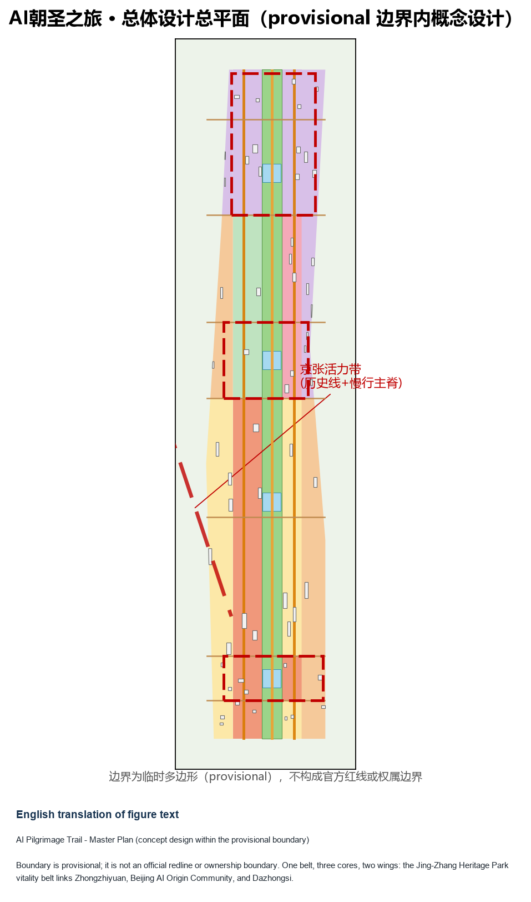
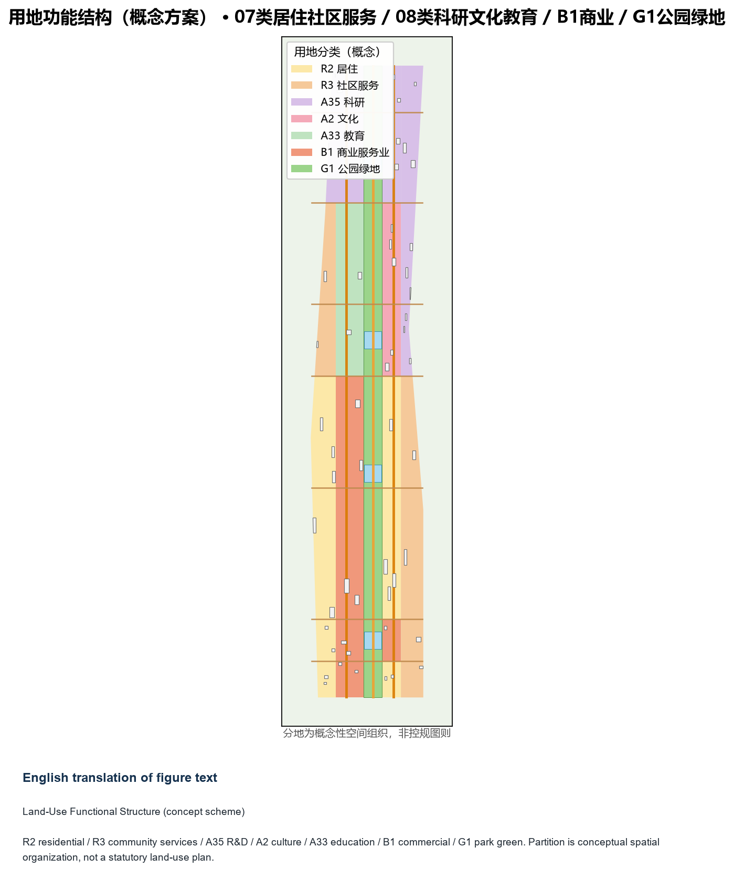
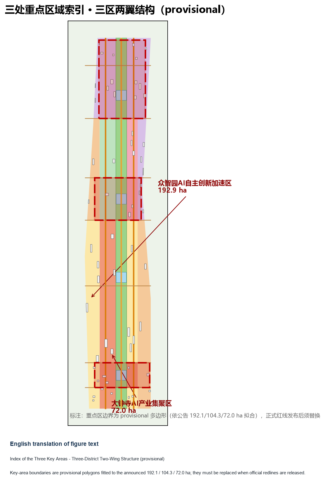
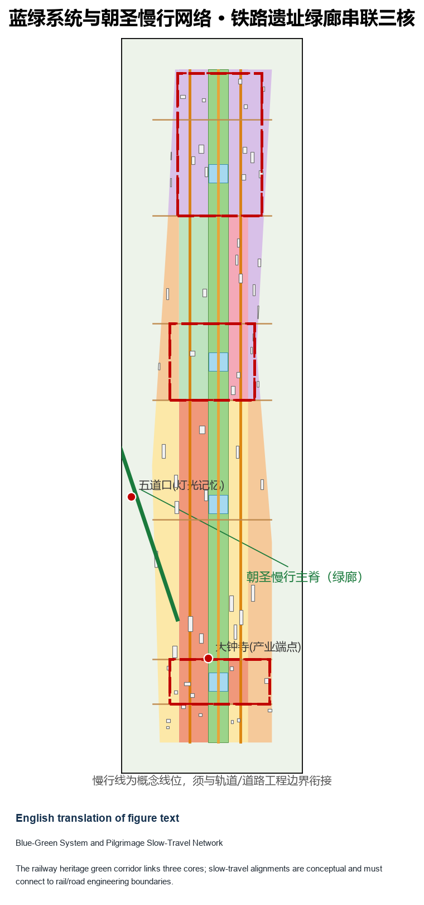
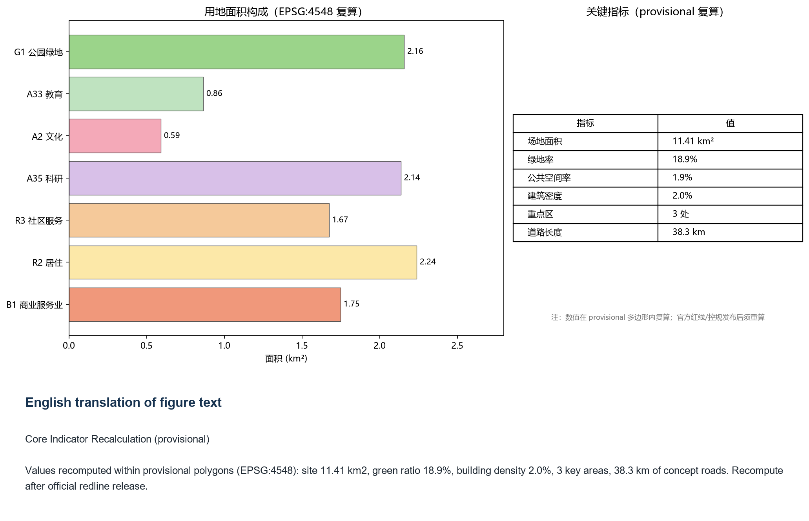

# AI Pilgrimage Trail: Urban Design Concept for the Jing-Zhang Railway Heritage Park Vitality Belt and the Three-District Two-Wing Collaboration

## Design Basis and Source List

This formal proposal takes the Public Notice of Prequalification for the International Urban Design Solicitation of the Centennial Jing-Zhang AI Innovation Belt (Haidian Sub-Office, Beijing Municipal Commission of Planning and Natural Resources) as its primary basis, and uses the maintainer-registered provisional boundary, key areas, enums, indicators, and source lists under `brief/site-package/` as machine-readable inputs. Before generating the proposal, the AI agent must read `design_brief.json`, `allowed_design_space.json`, `sources.json`, `enums/`, `ranges/`, `schemas/`, `data/source_registry.json`, and `data/processed/agent_fact_pack.md`, and build task, scope, source-use, and gap lists from `project_scope_summary.csv`, `agent_task_requirements.csv`, `source_use_matrix.csv`, and `missing_data_checklist.csv`. Every design judgment must be decomposed into traceable sources, reproducible metrics, verifiable layers, and human-reviewable assumptions. The notice requires regulatory-plan-level urban design depth and integrated-implementation-plan urban design depth; therefore prose alone cannot replace the GeoJSON, metric tables, A3 booklet, A0 boards, and HTML presentation deliverables.

The proposal is not a standalone vision text; it organizes outputs from the announcement, the agent-facing taskbook, and the site materials. This section only places the most critical basis next to the judgment [source:OFFICIAL-ANNOUNCEMENT] [source:AGENT-TASKBOOK] [depth:existing_conditions_diagnosis]. Complete source and standard coverage is stored in `sources.json`, `standard_matrix.json`, and `design_depth_matrix.json` instead of duplicating machine indexes in the prose.

The usage boundaries of the source registry are as follows [source:SOURCE-REGISTRY]:

- data/source_registry.json records the permitted use of public, cleared, and provisional materials.
- Registry summary: 7 formal-ready materials, 1 background material, 1 provisional-only material.
- The agent must not upgrade background_only or provisional_only materials into official boundaries, statutory plans, formal scoring bases, or government implementation commitments.

`data/processed/agent_fact_pack.md` is the reading-navigation layer of this proposal, not a new authority [source:PROCESSED-FACT-PACK]. It helps the agent organize the three scope levels, three key areas, announcement tasks, agent.1-agent.6, material availability, and missing-data items into a readable proposal; factual judgments must still return to the registered primary materials [source:OFFICIAL-ANNOUNCEMENT] [source:AGENT-TASKBOOK], with full source relations stored in `sources.json`.

Because the official `SITE_BOUNDARY` or the three `KEY_AREA` polygons have not yet been released, this package uses `brief/site-package/geometry/provisional_boundaries.geojson` to generate a provisional formal package. Both `geometry/site_boundary.geojson` and `geometry/key_areas.geojson` in the submission must be marked `provisional_constraint` with `official_boundary=false`; they may only be used for proposal generation, self-checks, visualization, and design discussion, and must not be used as official redlines, approval bases, precise-area bases, or statutory control conclusions. This organizer-side data gap itself does not block content scoring; after official polygons are released, the site boundary, key areas, land use, roads, green space, public space, buildings, phasing, and metrics must all be recomputed.

The scoreable status of this package is: **provisional boundary, with precision warnings retained for recalculation after official data is released; content scoring is not blocked**. Therefore the spatial structure, scenarios, projects, and indicators in the text are written on the principle of "discussable, reviewable, and recalculable after official boundary replacement"; when official boundaries and key-area polygons are updated, the agent must rerun the scaffolding, self-checks, and drawing/HTML generation, not replace a single file.

Boundary interpretation can return to the overall-scope layer and area recalculation [data:geometry/site_boundary.geojson#SITE-001] [metric:site_area_sqm]. The three key areas are verified by their own layer and count indicator [data:geometry/key_areas.geojson#PROV-KEY-001] [metric:key_area_count]. Readers can therefore enter the evidence from the prose without first reading machine identifiers.

## Three-Level Scope Framework

The proposal organizes work by the three levels defined in the announcement: the coordinated research scope (43.6 km2) covers the AI industry ecology, strategic positioning, innovation chain, and future urban form; the overall design scope (11.4 km2) covers the 1-2 km urban and industrial areas around the Jing-Zhang Heritage Park, requiring an urban renewal master framework, industrial spatial layout, transport and municipal support, and urban character controls; the key-area scope (368.4 ha in total) covers three detailed design areas, requiring functional programs, building scale, retain-renovate-demolish classification, public-space connectivity, and transport organization. The three levels are mapped item by item in `compliance_matrix.json`, so that every mandatory task in announcement clauses 1.3, 1.4, 1.5 and agent.1-agent.6 has section, layer, indicator, drawing, and HTML evidence.

The depth items of the three-level framework are governed by [depth:three_level_scope_framework] and [depth:overall_spatial_structure]; spatial evidence follows [data:geometry/site_boundary.geojson#SITE-001] and [data:geometry/key_areas.geojson#PROV-KEY-001]; the task basis follows [standard:PROJECT-OFFICIAL-ANNOUNCEMENT]; and the scope index is navigated by the three-level table in `project_scope_summary.csv` under [source:PROCESSED-FACT-PACK].

The three levels are not isolated drawing sets. The coordinated research determines the industry chain and urban form judgments; the overall design translates them into renewal projects, spatial structure, and facility capacity; the key-area detailed design verifies the feasibility of specific parcels, buildings, transport, public space, and AI application scenarios. When generating the proposal, the agent must first lock the official or provisional boundary and constraints adopted in this submission, then generate land use, buildings, roads, green space, public space, phasing, and AI service nodes, and finally recompute indicators from these layers, explaining in the text which conclusions remain limited by the provisional boundary. Any area, ratio, scale, or project count that cannot be recomputed from structured data must not be written into formal conclusions.

The overall concept recommended by this proposal is the "Jing-Zhang Smart Pulse Symbiosis Belt": taking the Jing-Zhang Heritage Park as the historical and public-space spine, the three key districts (Zhongzhiyuan, Beijing AI Origin Community, and Dazhongsi) as innovation anchors, and universities, enterprises, communities, and rail stations as the daily network, forming a spatial organization of "one belt, three cores, multiple scenario nodes, and a blue-green slow-travel loop". The "belt" is not a newly drawn red line but a working method translating the announcement's three scope levels; the "three cores" correspond to the three key areas; the "multiple scenario nodes" correspond to operable nodes of AI+ public services, industry services, and urban life; the "composite loop" corresponds to the linkage of slow travel, green space, public space, and activity routes.

| Level | Design question | Proposal answer | Data anchor |
| --- | --- | --- | --- |
| Coordinated research scope | How should the AI industry ecology and future urban form be organized | Build an innovation chain of "university seeding - open-source collaboration - enterprise transformation - public experience - international dissemination" | compliance_matrix.json, standard_matrix.json |
| Overall design scope | How should industrial space, urban renewal, transport, municipal works, and character be mapped | Land use, buildings, roads, green space, public space, and phasing layers jointly express the plan | [data:geometry/land_use.geojson#LU-001], [data:geometry/roads.geojson#ROAD-001] |
| Key-area scope | How should the three districts reach detailed design depth | Propose positioning, spatial moves, AI scenarios, and implementation dependencies for each | [data:geometry/key_areas.geojson#PROV-KEY-001], [data:geometry/key_areas.geojson#PROV-KEY-002], [data:geometry/key_areas.geojson#PROV-KEY-003] |

## Coordinated Research Area: Industry and Future City Research

The core task of the coordinated research scope is to build a world-class AI innovation ecosystem. The proposal should map Haidian's universities and institutes, leading enterprises, compute/algorithms/data-factor resources, incubation platforms, listed companies, unicorns, and science-and-technology services, and propose a spatial coordination framework for the AI innovation chain, industry chain, talent chain, and urban service chain. The naming scheme and logo design should serve the overall recognizability of the "Centennial Jing-Zhang Cultural Belt, Metropolitan AI Life Experience Belt, and AI Integration Innovation Belt" and explain their relation to the industry ecology, public space, and cultural resources rather than remaining slogans. The agent-facing taskbook further requires responses to the "five functions" and the "three districts, two wings" collaboration, forming a further-developable naming system, visual identity, master spatial structure diagram, scenario opening, and operation mechanism; this section must use [source:AGENT-TASKBOOK] and [standard:PROJECT-AGENT-OPEN-CALL-TASKBOOK] to mark these requirements as coming from the agent open-call tasks rather than statutory planning controls.

The coordinated research does not add pseudo-precise red lines; through the urban character, public space, and building layout coordination required by [standard:MOHURD-URBAN-DESIGN-MEASURES], it reconnects to [data:geometry/land_use.geojson#LU-001], [data:geometry/public_space.geojson#PUBLIC-001], and [depth:overall_spatial_structure], showing that the industrial strategy ultimately lands on a visible, reviewable spatial structure.

Future-urban-form research should answer how artificial intelligence changes work, life, socializing, learning, transport, and public services. The proposal should translate AI transport systems, continuous green space, innovation service facilities, and an internationalized living-working atmosphere into locatable function zones, nodes, corridors, and scenarios rather than vague technological visions. The agent should record industrial strategy indicators, AI innovation index, talent density, spatial supply types, and key vertical-application districts in the indicator system, marking which are official, which are design recommendations, and which await formal data calibration. If global AI innovation events, developer communities, open scenarios, or pilgrimage routes are proposed, they must be written as "concept recommendations / reference schemes / for professional teams to develop further" and not as confirmed government activities or implementation arrangements.

## Overall Design Area: Urban Renewal and Regulatory-Plan-Level Urban Design

The overall design area must reach regulatory-plan-level urban design depth. The proposal must present an urban renewal master spatial structure, inefficient-space identification, a renewal project list, implementation policy recommendations, industrial function proportions, spatial organization models, total building scale, and integrated capacity assessment. `geometry/land_use.geojson` should fully and seamlessly cover the design boundary without overlaps; `geometry/buildings.geojson` should express renewal or retained building footprints; `geometry/roads.geojson` should express microcirculation, slow travel, and rail connections; and `metrics.json` should recompute core areas, ratios, and layer counts.

This section decomposes regulatory-plan-depth content into reviewable objects following [standard:MOHURD-CONTROL-DETAILED-PLANNING]: [data:geometry/land_use.geojson#LU-001] expresses the land-use structure, [data:geometry/buildings.geojson#BLDG-001] expresses building footprints, [data:geometry/roads.geojson#ROAD-001] expresses transport organization, [metric:building_footprint_area_sqm] verifies building footprint area, and [depth:land_use_layout] with [depth:development_intensity_controls] govern the depth of the deliverables.

The overall design must also support transport, rail, municipal, and supporting facilities. The proposal should propose spatial layouts and implementation paths for rail-station integration, road microcirculation, non-motorized parking, parking supply, innovation service platforms, talent living services, new infrastructure, distributed energy, and on-device compute. Content involving building height, development intensity, road redlines, setbacks, and facility standards must be written as "pending official regulatory-plan confirmation" when no official control conditions exist; agent-inferred values must not masquerade as approved indicators.

## Detailed Design of Key Areas

Detailed design of the key areas is mandatory. The Zhongzhiyuan AI Self-Innovation Acceleration Area should propose detailed schemes around national AI platforms, full-stack self-reliant innovation, standard-setting, safety governance, industry exhibition, external transport, Qinghe River culture, low-carbon green innovation exchange environments, and green-space AI scenarios. The Beijing AI Origin Community should propose detailed schemes around near-campus innovation, achievement incubation and transformation, talent special zones, open-source systems, brand events, building retain-renovate-demolish, achievement exhibition and release, residential living support, campus-park slow-travel connections, and rail-station integration. The Dazhongsi AI Industry Cluster should propose detailed schemes around leading enterprises, agents, intelligent terminals, content consumption, data factors, digital assets, commercial services, integrated use of planned green space, Dazhongsi station integration, and four-quadrant pedestrian connectivity at intersections.

Detailed design of the three key areas must cite [data:geometry/key_areas.geojson#PROV-KEY-001], [data:geometry/key_areas.geojson#PROV-KEY-002], and [data:geometry/key_areas.geojson#PROV-KEY-003], and is checked by [depth:three_key_area_detailed_design] for integrated-implementation-plan depth. A description of "building a demonstration zone" without evidence of functions, buildings, transport, public space, and implementation projects must be treated as incomplete.

The three key areas must appear in `geometry/key_areas.geojson`. If the repository provides official polygons, they should be used as `official_constraint`; if official polygons are missing, `provisional_constraint` may be used temporarily, but the proposal, HTML, sources, assumptions, and self_check must state that it cannot serve as a formal scoring or approval basis. `compliance_matrix.json` should cover announcement clauses 1.5.3.1, 1.5.3.2, and 1.5.3.3 respectively. Design expression should include functional programs, building scale, building form, retain-renovate-demolish classification, public-space systems, transport organization, slow-travel connectivity, and implementation projects. The HTML pages should allow switching between the three key areas; the A3 booklet and A0 boards should include at least the key-district master plan, partial details, and indicator notes.

| Key district | Design positioning | Spatial moves | AI industry and operation scenarios | Evidence |
| --- | --- | --- | --- | --- |
| Zhongzhiyuan AI Self-Innovation Acceleration Area | Garden-type full-stack self-innovation block | Strengthen the Qinghe waterfront, industry exhibition, low-carbon innovation exchange, and external transport; use green space for open testing and standard-governance exhibition | Self-developed model testing, standard-setting workshops, safety-governance exhibition, low-carbon compute experience | [data:geometry/key_areas.geojson#PROV-KEY-001], [depth:three_key_area_detailed_design] |
| Beijing AI Origin Community | Near-campus achievement transformation and talent community | Organize campus-park-block slow-travel stitching; supplement achievement release, talent services, living, and open-source collaboration space | Open-source community, achievement release, talent-special-zone services, near-campus incubation | [data:geometry/key_areas.geojson#PROV-KEY-002], [source:AGENT-TASKBOOK] |
| Dazhongsi AI Industry Cluster | Metropolitan intelligent economy and international exchange block | Integrate Dazhongsi station, four-quadrant pedestrian connectivity, commercial services, and public-environment renewal around anchor enterprises | Agent and intelligent-terminal exhibition, content consumption, data factors, and international roadshows | [data:geometry/key_areas.geojson#PROV-KEY-003], [metric:key_area_count] |

## AI Innovation Ecosystem, Personas, and AI+ Scenarios

The proposal should build spatial demand personas for AI talent and enterprises, covering R&D offices, open-source collaboration, achievement release, enterprise services, talent housing, social learning, consumption and living, sports and leisure, and international exchange. AI+ scenarios should follow the directions proposed in the announcement (transport, services, consumption, healthcare, education, law, and life services) to form both industry-development scenarios and AI-enabled urban-function scenarios. Each scenario should state its target users, spatial location, data sources, privacy boundary, human-review mechanism, and operating entity.

AI scenarios must land on spatial and governance boundaries: public-space scenarios cite [data:geometry/public_space.geojson#PUBLIC-001], slow-travel and transport scenarios cite [data:geometry/roads.geojson#ROAD-001], and open-space scenarios cite [data:geometry/green_space.geojson#GREEN-001] with [metric:public_space_ratio] and [metric:green_ratio]. These references let reviewers see that scenarios are not slogans but design objects located in concrete layers and indicators. The agent-facing taskbook requires no fewer than 10 AI scenario cards, no fewer than 3 industry testing-and-validation scenarios, and no fewer than 5 persona categories; this scaffold only provides the structure, and participants must write the scenario cards, persona tables, privacy boundaries, human-review mechanisms, and operating entities into the proposal, HTML, A3/A0, and compliance matrix.

| Persona | Typical needs | Spatial response | Self-check boundary |
| --- | --- | --- | --- |
| Open-source developers | Release, collaboration, testing, community reputation | Origin Community open-source release hall, public code wall, night collaboration space | No collection of personal behavior traces; event data aggregated statistics only |
| Startup teams | Low-cost offices, compute access, product testbeds | Zhongzhiyuan shared test field, on-device compute service points, standards-governance consulting | Compute and data services require separate authorization |
| Visitors of leading enterprises | Exhibition, business, international reception, recruiting | Dazhongsi international roadshow hall, rail-station connections, public space around anchor enterprises | Enterprise logos and case studies must be rights-cleared |
| Surrounding residents | Commuting, leisure, community services, low-disturbance renewal | Heritage Park slow-travel loop, embedded community services, nighttime lighting and activity grading | Resident personas not used for commercial recommendation |
| University faculty and students | Achievement transformation, cross-campus collaboration, daily slow travel | Campus-park slow-travel stitching, transformation stations, AI education experience points | Campus data and research outputs require authorization |

| Scenario card | Spatial carrier | Design note |
| --- | --- | --- |
| 01 Open-source release hall | Beijing AI Origin Community | For universities, open-source communities, and startups: achievement release, code-contribution display, and small roadshows |
| 02 Safety-governance sandbox | Zhongzhiyuan | Translates standard-setting, safety evaluation, and model red-teaming into visitable, bookable, supervised display and collaboration nodes |
| 03 On-device compute station | Nodes in the overall design area | Combined with public services, enterprise services, and low-carbon energy strategy as a new-infrastructure prototype to be deepened |
| 04 AI slow-travel navigation | Jing-Zhang Heritage Park vitality belt | Uses explainable signage and low-intrusion sensing to identify slow-travel gaps, crowding nodes, and accessibility needs |
| 05 Dazhongsi international roadshow hall | Dazhongsi AI Industry Cluster | Serves exhibition, negotiation, media release, and international exchange for agent, intelligent-terminal, and content-consumption enterprises |
| 06 Qinghe low-carbon innovation corridor | Zhongzhiyuan along the Qinghe River | Combines green space, stormwater, walking and cycling, and AI exhibition as the campus public living room |
| 07 Near-campus transformation street | Beijing AI Origin Community | For university transformation: incubation, exhibition, legal, IP, and investment services |
| 08 Data-factor lounge | Dazhongsi district | With compliance, authorization, and auditability as preconditions, shows the urban service interface for data factors and digital assets |
| 09 AI life-service model street | Community-commercial junctions | Lands healthcare, education, legal, and life-service AI+ scenarios into operable small-scale block space |
| 10 Global AI activity week route | Belt public-space system | Forms a walkable, spreadable experience route from heritage culture, open-source community, and industry exhibition to international roadshows |

Agent-generated AI governance recommendations must follow the principles of data minimization, public sources, explainability, and human review. Urban agents may assist in identifying slow-travel gaps, public-space heat, facility maintenance, enterprise-service demand, and event safety risks, but they must not replace planning approval, output unauthorized personal profiles, or claim official implementation commitments. All AI scenario nodes should enter structured layers or the compliance matrix so reviewers can see their relation to industry, space, and public interest.

## Land Use, Building Scale, and Retain-Renovate-Demolish Scheme

The land-use scheme should follow public standards for territorial surveys, planning, and use-control classification, forming a complete, closed, seamless land-use partition. The building scheme should distinguish retained, renovated, renewed, new, or pending-confirmation objects, and clarify recommended levels of building footprint, function, scale, character, roof, massing, and height control. Where existing buildings, ownership, regulatory plans, and engineering conditions are missing, the scheme may only propose methods and a calibration list; it must not fabricate retain-renovate-demolish conclusions.

Land-use classification follows [standard:MNR-LAND-USE-CLASSIFICATION-GUIDE]; height, massing, interface, and character controls are governed by [depth:height_massing_character]; the retain-renovate-demolish method is governed by [depth:retain_renovate_demolish]. The main evidence for land use and buildings is [data:geometry/land_use.geojson#LU-001], [data:geometry/buildings.geojson#BLDG-001], and [metric:building_footprint_area_sqm].

Building scale and intensity indicators must be consistent with `metrics.json` and the layers. Where total building scale, floor-area ratio, building height, building density, green ratio, setbacks, and building control lines lack official conditions, they should be listed as unknown or pending_control in the indicator system rather than manufactured with fixed values. The A3 booklet should provide the renewal project list and indicator review table, the A0 boards should express the key spatial structure and key districts clearly, and the HTML pages should provide linked indicator and layer viewing.

## Transport, Rail, Municipal Works, and Public Services

The transport scheme should respond to the announcement's requirements on rail-station integration, road microcirculation, slow-travel gaps, external transport, parking, non-motorized parking, and green transport systems. It should cover the North 5th Ring Road, the heritage-park ring-road crossing node, Wudaokou, the west end of Qinghua East Road, Dazhongsi station, and transport links around anchor enterprises. Road and slow-travel layers should remain within the submitted boundary and be cross-checked with public space, green space, industry nodes, and key districts; if the submitted boundary is provisional, transport conclusions may only serve as interim design discussion.

Transport and municipal depth are governed respectively by [depth:traffic_rail_slow_parking] and [depth:municipal_new_infrastructure]; layer evidence cites [data:geometry/roads.geojson#ROAD-001], [data:geometry/public_space.geojson#PUBLIC-001], and [data:geometry/constraints.geojson#CONSTRAINTS]. Where road redlines, pipelines, fire protection, and municipal conditions are missing, assumptions must state what is pending rather than writing strategies as approved conditions.

Municipal and public service facilities should cover AI industry service facilities, innovation service platforms, talent living service facilities, new infrastructure, distributed energy, on-device compute, and integration with traditional municipal facilities. The proposal should explain facility standards, spatial layout, service radius, operation model, and phasing logic. Where pipeline, energy, drainage, flood, and fire-protection engineering data are missing, they should be listed as preconditions for formal deepening.

## Blue-Green Space, Public Space, and Urban Character

The blue-green space scheme should take the Jing-Zhang Heritage Park vitality belt as its backbone, coordinate the Qinghe River, Xiaoyue River, surrounding universities, enterprises, and community travel demand, and propose a north-south through, east-west connected system of pedestrian paths, cycleways, and green space. The scheme should identify slow-travel gaps, ring-road overpass nodes, and landscape nodes at the south and north ends of the park, and propose composite-use strategies for parking, sports, innovation exchange, technology testing, application exhibition, and public services.

Blue-green and public space are jointly verified by the design-depth item and the green-space and public-space layers [depth:blue_green_public_space] [data:geometry/green_space.geojson#GREEN-001] [data:geometry/public_space.geojson#PUBLIC-001]. The green and public-space ratios are explained in the prose for design meaning, with complete recalculation stored in `metrics.json`; the coordination of urban character, public space, and building control returns to the professional standard matrix [standard:MOHURD-URBAN-DESIGN-MEASURES].

The urban character scheme should blend the Jing-Zhang Railway heritage culture, Zhongguancun innovation culture, and AI innovation culture, drawing on the Qinghuayuan Railway Station and Beijing Film Academy cultural resources to propose urban tone, building character, roof forms, massing, interfaces, and public-art guidance. The agent should also propose signage, cultural symbols, international communication narratives, AI pilgrimage landmarks, and contribution walls or honor display systems, but all brands, fonts, images, portraits, and enterprise logos must have cleared rights. Character control should distinguish official controls, design recommendations, and pending-confirmation items; pseudo-precise control lines must not be drawn without heritage-protection or regulatory-plan basis.

## Renewal Project List, Implementation Policy, and Phasing Plan

The implementation scheme should form a reviewable renewal project list stating project location, type, function, responsible entity, dependencies, implementation stage, risks, and evaluation indicators. Policy recommendations should cover coordinated renewal implementation, spatial supply, operation mechanisms, industry services, public participation, data governance, and property-right coordination. `geometry/phasing.geojson` should express phasing extents, and `compliance_matrix.json` should link every task to phasing and drawings.

The project list and phasing depth are governed by [depth:renewal_project_list] and [depth:phasing_implementation]; the phasing spatial evidence is [data:geometry/phasing.geojson#PHASE-001]. Where ownership, funding, implementation entities, and approval paths are absent, the scheme must record them as implementation risks rather than commitments.

| Project ID | Project name | Type | Key dependencies | Evidence |
| --- | --- | --- | --- | --- |
| JZ-01 | Heritage Park slow-travel gap stitching | Public space / transport | Road redlines, underpass space, transport review | [data:geometry/roads.geojson#ROAD-001] |
| JZ-02 | Zhongzhiyuan Qinghe innovation waterfront | Blue-green space / industry exhibition | River blue line, ecology, flood conditions | [data:geometry/green_space.geojson#GREEN-001] |
| JZ-03 | Origin Community near-campus transformation street | Urban renewal / industry services | Campus boundary, ownership, ground-floor uses | [data:geometry/buildings.geojson#BLDG-001] |
| JZ-04 | Dazhongsi station four-quadrant pedestrian connectivity | Rail integration / slow travel | Rail station, intersections, municipal pipelines | [data:geometry/public_space.geojson#PUBLIC-001] |
| JZ-05 | AI public services and on-device compute nodes | New infrastructure / public services | Energy, compute, safety, operating entity | [data:geometry/constraints.geojson#CONSTRAINTS] |
| JZ-06 | Global AI activity week public route | Operations / branding | Public-space permits, event safety, rights clearance | [data:geometry/phasing.geojson#PHASE-001] |

Phasing should be distinguished from the 100-day solicitation design cycle: the solicitation cycle is the submission deadline, while implementation phasing is the urban renewal and construction pathway. The proposal should propose near-term pilots, mid-term renewal, and a long-term governance framework, and mark which items can start with light facilities, operation activities, and service platforms and which must wait for official regulatory-plan, municipal, transport, and ownership conditions. For the annual event system, developer-community operations, scenario open days, public experience routes, and international communication mechanisms, the text should state operating targets, frequency, responsibility boundaries, conversion paths, and risks rather than slogans.

## Indicator System, Area Recalculation, and Compliance Matrix

The indicator system should include at least the overall design area, key-area areas, green and public-space ratios, building footprints, renewal project count, AI scenario nodes, slow-travel connectivity indicators, industrial space indicators, talent service indicators, and self-check status. All known indicators must be recomputable from GeoJSON or trusted sources; unknown indicators must state their reason and formal-submission preconditions. The outputs of `scripts/spatial_review.py` and `scripts/visual_review.py` are important evidence for the formal self-check.

Indicator recalculation follows the unified design-depth requirement [depth:metrics_recalculation]. The prose focuses on the design meaning of indicators, such as how the overall scope constrains spatial allocation and how blue-green and public-space ratios support daily interaction; full values, formulas, source files, and confidence are stored in `metrics.json`. Example key indicators can be verified from the overall scope and green-space data [metric:site_area_sqm] [data:geometry/green_space.geojson#GREEN-001].

The compliance matrix is the master control file for task responsiveness. Every announcement task and agent_taskbook task must map to report sections, layers, indicators, drawings, HTML pages, sources, assumptions, and self-check items. If any mandatory task of announcement clauses 1.3, 1.4, 1.5 or agent.1-agent.6 is left uncovered, the proposal may not enter formal professional scoring.

During formal deepening, the agent should further classify each indicator into three types: first, spatial indicators directly recomputable from submitted geometry (boundary area, green ratio, public-space ratio, building footprint area, phasing areas); second, control indicators requiring official regulatory plans or taskbook annexes (floor-area ratio, building height, building density, setbacks, road redlines, facility standards); third, performance indicators requiring continuous calibration with operations or industry data (AI innovation index, talent density, industry-service satisfaction, slow-travel accessibility, event participation, scenario usage frequency). The three types should enter `metrics.json`, `assumptions.json`, and `compliance_matrix.json` respectively, avoiding operational visions being miswritten as approved planning conditions.

## Risks, Copyright, and Compliance

**Bilingual requirement.** The primary proposal may be written in Chinese or English but must provide a complete counterpart translation via `proposal.en.md` or `proposal.zh.md`; the A3/A0 boards, HTML, and text-bearing figures must also provide counterpart language copies, preferably using the competition-recommended terminology in `docs/terminology-glossary.md`. If a v2 package lacks any required translation, language mapping, or valid file, finalize and CI will block the submission. All images, drawings, icons, data, and code assets must state their source, license, and authorization status in `sources.json` or `report/copyright_statement.md`. HTML pages must not load remote scripts, remote map tiles, remote fonts, iframes, forms, or external APIs, and must not track reviewer behavior.

Risks and the missing-data list are jointly verified by the risk depth item, the constraint layer, and the site package [depth:risk_missing_data] [data:geometry/constraints.geojson#CONSTRAINTS] [source:SITE-PACKAGE]. The official boundary, key-area, regulatory-plan, road, parcel, building, municipal, heritage-protection, and public-service gaps listed in `missing_data_checklist.csv` must enter `assumptions.json`, the self-check, and the risk section of the proposal. Any conclusion lacking official regulatory-plan, road-redline, ownership, municipal, fire-protection, or heritage-protection conditions must be downgraded to pending-confirmation; the full professional review is stored in the standard matrix.

This proposal does not claim official approval, approved regulatory plans, final land ownership, final construction scale, or guaranteed implementation. The AI agent is responsible for facts, sources, copyright, spatial data, indicators, and expression; maintainers and professional reviewers may request revisions or reject the submission based on self-check results, spatial review, and the compliance matrix.

## References

- brief/public-brief.md
- brief/site-package/design_brief.json
- brief/site-package/allowed_design_space.json
- brief/site-package/enums/
- brief/site-package/ranges/planning_limits.json
- data/processed/agent_fact_pack.md
- data/processed/project_scope_summary.csv
- data/processed/agent_task_requirements.csv
- data/processed/source_use_matrix.csv
- data/processed/missing_data_checklist.csv
- Full machine indexes: see `sources.json`, `metrics.json`, `compliance_matrix.json`, `standard_matrix.json`, and `design_depth_matrix.json`
- Bibliography entry per the site-package registry; full provenance and licenses are in the structured source list [source:SITE-PACKAGE]
