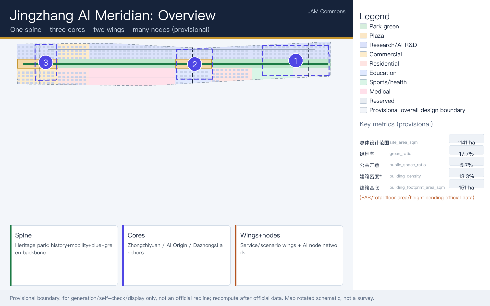
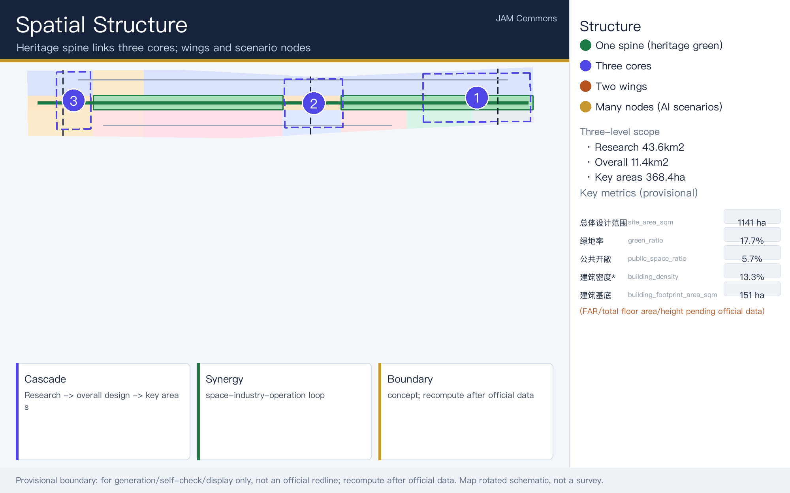
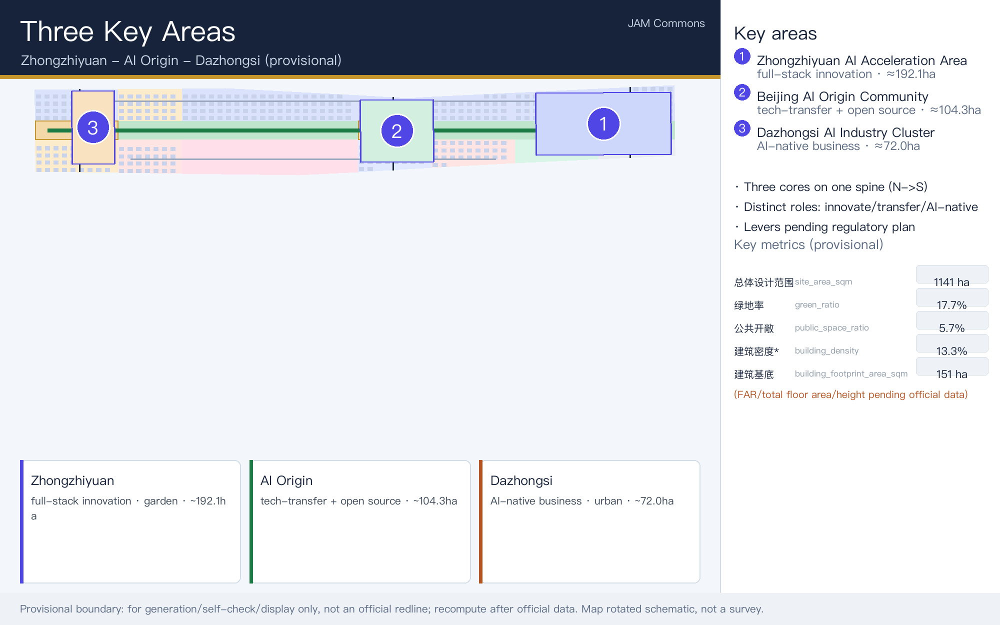
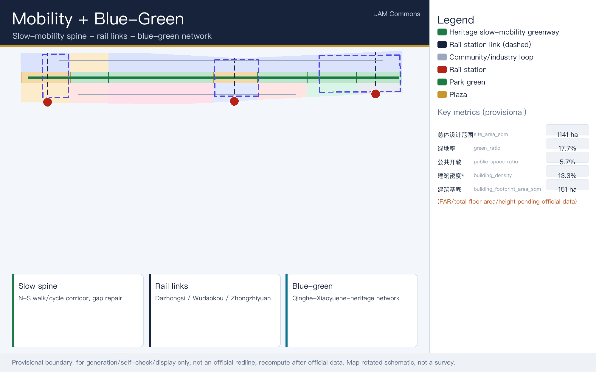
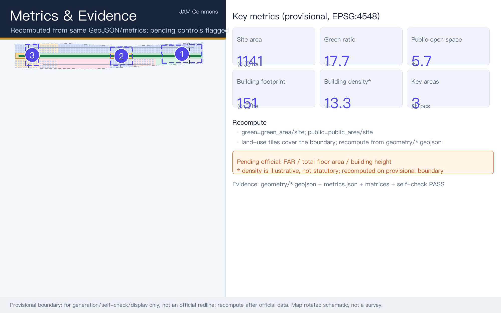

# Centennial Jingzhang AI Innovation Belt Urban Design: Jingzhang AI Meridian Commons

This document is the faithful English companion of the Chinese primary proposal (`proposal.md`). Both files describe the same design package, the same provisional geometry, and the same evidence chain; where nuance differs, the Chinese primary prevails for formal reading, and this English text serves international reviewers and community display.

## Design Basis and Source List

This formal proposal takes the qualification pre-review announcement for the Centennial Jingzhang AI Innovation Belt international urban design open call, published by the Haidian Branch of the Beijing Municipal Commission of Planning and Natural Resources, as its primary basis, together with the maintainer-registered provisional site boundary, key areas, enumerations, metrics, and source list in `brief/site-package/` as machine-readable evidence. Before generating any content, the AI agent reads `design_brief.json`, `allowed_design_space.json`, `sources.json`, `enums/`, `ranges/`, `schemas/`, `data/source_registry.json`, and `data/processed/agent_fact_pack.md`, and uses `project_scope_summary.csv`, `agent_task_requirements.csv`, `source_use_matrix.csv`, and `missing_data_checklist.csv` to build the task, scope, source-use, and gap inventories. Every design judgment is decomposed into traceable sources, recalculable metrics, verifiable layers, and human-reviewable assumptions. The announcement requires control-detailed-plan-level urban design depth and comprehensive-implementation-plan-level depth, so narrative text cannot substitute for GeoJSON, metric tables, the A3 document set, the A0 boards, or the HTML electronic deliverables [source:OFFICIAL-ANNOUNCEMENT] [source:AGENT-TASKBOOK] [depth:existing_conditions_diagnosis].

The proposal is not a standalone vision text; it assembles deliverables from the announcement, the agent-facing taskbook, and site materials. This section places only the most critical evidence next to the judgments. The full source and standards coverage is held in `sources.json`, `standard_matrix.json`, and `design_depth_matrix.json`, and machine indexes are not repeated in the prose. The usage boundaries of the source registry are as follows [source:SOURCE-REGISTRY]:

- `data/source_registry.json` registers the usage boundaries of public, rights-cleared, and provisional materials.
- Current registry summary: 7 entries usable for formal content, 1 background-only entry, and 1 provisional-only entry.
- The agent must not upgrade background_only or provisional_only materials into an official boundary, statutory regulatory plan, formal scoring basis, or government implementation commitment.

`data/processed/agent_fact_pack.md` is the reading-navigation layer of this proposal, not a new authority source [source:PROCESSED-FACT-PACK]. It helps the agent organize the three scope levels, the three key areas, announcement tasks, agent tasks agent.1 through agent.6, source usability, and missing-data items into a readable proposal; factual judgments still return to the registered raw materials [source:OFFICIAL-ANNOUNCEMENT] [source:AGENT-TASKBOOK], and the full provenance graph is preserved in `sources.json`.

Because the official `SITE_BOUNDARY` and the three official `KEY_AREA` polygons had not been obtained when this package was scaffolded, the submission uses `brief/site-package/geometry/provisional_boundaries.geojson` to generate a provisional formal package. Both `geometry/site_boundary.geojson` and `geometry/key_areas.geojson` in the submission are tagged `provisional_constraint` with `official_boundary=false`; they may be used for generation, self-checking, visualization, and design discussion only, and cannot serve as an official redline, approval basis, precise area basis, or statutory control conclusion. This organizer-side data gap does not by itself block content scoring; once official polygons are published, the site boundary, key areas, land use, roads, green space, public space, buildings, phasing, and metrics must all be recalculated.

The scorable state of this scaffolded package is therefore: **provisional boundary, precision warnings retained, recalculation pending official data release, and no blocking of content scoring**. Spatial structures, scenarios, projects, and metrics in the body are written as debatable, reviewable, and recalculable against an official-boundary replacement; when official boundaries and key-area polygons are updated, the agent must re-run the scaffold, self-check, and drawing/HTML generation rather than swap a single file. Boundary interpretation can be traced back to the overall scope layer and area recalculation [data:geometry/site_boundary.geojson#SITE-001] [metric:site_area_sqm]. The three key areas are checked against an independent layer and a count metric [data:geometry/key_areas.geojson#PROV-KEY-001] [metric:key_area_count], so readers can move from prose into evidence without first reading a string of machine codes.

## Three-Level Scope Framework

The proposal organizes work along the three levels fixed by the announcement: the Coordinated Research Area covers 43.6 km² (north to the North Fifth Ring Road, east to the Jingzang Expressway, south to Xizhimenwai Street, west to Wanquanhe Road) and addresses AI industry ecology, strategic positioning, innovation chains, and future urban form; the Overall Design Area covers 11.4 km² of the urban and industrial districts within roughly 1–2 km of the Jingzhang Heritage Park (north to the North Fifth Ring Road, east to Xueyuan Road / Xitucheng Road, south to Xizhimenwai Street, west to Dazhongsi East Road / Heqing Road) and requires an urban renewal framework, industrial spatial layout, transport and municipal support, and urban character control; the Key Areas cover 368.4 hectares across three detailed-design sites, requiring functional programs, building scale, retain-renovate-demolish classification, public-space connectivity, and transport organization. The three levels are mapped item by item in `compliance_matrix.json`, ensuring that announcement items 1.3, 1.4, and 1.5 and the required agent tasks agent.1 through agent.6 each have chapter, layer, metric, drawing, and HTML evidence.

The depth of the three-level framework is constrained by [depth:three_level_scope_framework] and [depth:overall_spatial_structure]; spatial evidence follows [data:geometry/site_boundary.geojson#SITE-001] and [data:geometry/key_areas.geojson#PROV-KEY-001]; the task authority is [standard:PROJECT-OFFICIAL-ANNOUNCEMENT]; and navigation uses the three-level scope table of `project_scope_summary.csv` in [source:PROCESSED-FACT-PACK].

The three levels are not disconnected drawing sets. Coordinated research decides the industry-chain and urban-form judgments; overall design lands those judgments in renewal projects, spatial structure, and facility capacity; key-area detailed design verifies the implementability of specific parcels, buildings, transport, public space, and AI application scenarios. When generating the proposal, the agent first locks the official or provisional boundary and constraints used by this submission, then generates land-use, building, road, green-space, public-space, phasing, and AI-service-node layers, and finally recalculates metrics from those layers while stating in prose which conclusions remain limited by the provisional boundary. No area, ratio, scale, or project count that cannot be recomputed from structured data may be written into formal conclusions.

The overall concept is the "Jingzhang AI Meridian Commons" (Chinese short name: the Jingzhang Intelligence-Pulse Symbiosis Belt): the Jingzhang Heritage Park acts as the historical and public-space main axis; the three key areas of Zhongzhiyuan, the Beijing AI Origin Community, and Dazhongsi act as innovation anchors; and universities, enterprises, communities, and rail stations form the everyday network — together a spatial organization of "one belt, three cores, multi-point scenarios, and a blue-green slow-mobility composite loop." The "one belt" is not a newly drawn redline but a translation of the announcement's three scope levels into a working method; the "three cores" correspond to the three key areas; the "multi-point scenarios" correspond to operable AI+ public-service, industry-service, and urban-life nodes; and the "composite loop" links slow mobility, green space, public space, and event routes.

| Level | Design question | Proposal answer | Data anchor |
| --- | --- | --- | --- |
| Coordinated Research Area | How to organize the AI industry ecology and future urban form | Build an innovation chain of "university origin — open-source collaboration — enterprise translation — public experience — international communication" | compliance_matrix.json, standard_matrix.json |
| Overall Design Area | How to land industrial space, urban renewal, transport, municipal systems, and character control | Land use, buildings, roads, green space, public space, and phasing layers expressed jointly | [data:geometry/land_use.geojson#LU-001], [data:geometry/roads.geojson#ROAD-001] |
| Key Areas | How the three sites reach detailed-design depth | Positioning, spatial moves, AI scenarios, and implementation dependencies for each site | [data:geometry/key_areas.geojson#PROV-KEY-001], [data:geometry/key_areas.geojson#PROV-KEY-002], [data:geometry/key_areas.geojson#PROV-KEY-003] |

## Coordinated Research Area: Industry and Future City Research

The core task of the Coordinated Research Area is to structure a world-class AI innovation ecosystem. The proposal surveys Haidian's universities and research institutes, leading enterprises, compute-algorithm-data factors, incubation platforms, listed companies, unicorns, and technology-service resources, and proposes a spatial coordination framework linking the AI innovation chain, industry chain, talent chain, and urban-service chain. The naming scheme and logo direction must serve the legibility of the whole — "Centennial Jingzhang Cultural Belt, Urban AI Life Experience Belt, AI-Integrated Innovation Belt" — and explain their relationship to the industry ecology, public space, and cultural resources rather than remaining slogans. The agent-facing taskbook also requires responses to the "five functions" and the "three districts, two wings" coordination, producing a naming system, visual identity, overall spatial structure diagram, scenario-opening mechanism, and operating mechanism that professional teams can deepen further [source:AGENT-TASKBOOK] [standard:PROJECT-AGENT-OPEN-CALL-TASKBOOK].

**Naming and brand (agent.1).** The master name is "Jingzhang AI Meridian Commons" (abbreviated JAM Commons). The naming system combines one master belt name, three dedicated core names, and scenario node names. The logo direction uses the motif of "railway sleepers crossed with neural-network node links," and the primary colors are rail-rust red for heritage and neural-network blue for AI. The **three positions** are: a Centennial Jingzhang cultural belt, an urban AI life-experience belt, and an AI-integrated innovation belt. The **five functions** are: a full-stack AI independent-innovation system; a world-class AI innovation ecosystem; a new paradigm of AI+ scenario empowerment; an intelligent and vibrant AI city; and a global voice in AI governance. The **three districts and two wings (三区两翼)** are: the AI Origin Community (world-class AI innovation ecosystem); the Zhongzhiyuan AI Independent-Innovation Acceleration Zone (full-stack independent innovation and AI-governance voice); the Dazhongsi AI Industry Cluster (AI-native new business formats); the Zhongguancun Science-and-Technology Services Wing (global factor allocation, Zhongguancun IP and capital empowerment); and the Xiaoyue River Scenario-Empowerment Wing (AI scenario empowerment and the vibrant AI city). The overall spatial structure is "One Spine, Three Cores, Two Wings, Multiple Nodes": the spine is the Jingzhang Heritage Park vitality belt (east-west stitching, north-south connectivity across history, slow mobility, and blue-green systems); the three cores are Zhongzhiyuan, the Origin Community, and Dazhongsi; the two wings are as above; and the multiple nodes are about ten AI scenario and AI pilgrimage landmark nodes.

**Global reference cases (agent.2).** Seven international cases were reviewed for transferable mechanisms, summarized below as concept-level references for professional teams to deepen — not as claims that any mechanism has been adopted or approved locally.

| Global case | Composition | Transferable mechanism |
| --- | --- | --- |
| Silicon Valley Sand Hill Road ecosystem (USA) | University–capital–startup chain | High-density factor synergy and technology translation |
| King's Cross Knowledge Quarter, London (UK) | Culture + universities + headquarters | Compound of renewal, innovation, and culture |
| MaRS innovation hub, Toronto (Canada) | Medicine–engineering crossover | One-stop vertical-domain incubation |
| Tel Aviv innovation ecosystem (Israel) | Civil–military integration / open source | Open collaboration and rapid testing |
| Munich high-tech corridor (Germany) | Enterprises + institutes + computing power | Full-stack R&D and standards-setting |
| Tokyo "urban lab" open scenarios (Japan) | Open city scenarios | Scenario booking and public testing |
| Singapore SkillsFuture / Smart Nation | Talent + governance | Talent operations and AI-governance dialogue |

Coordinated research adds no pseudo-precise redlines. Through the urban character, public space, and building-layout coordination required by [standard:MOHURD-URBAN-DESIGN-MEASURES], it ties back to [data:geometry/land_use.geojson#LU-001] and [data:geometry/public_space.geojson#PUBLIC-001], showing how industry strategy must finally land in visible, reviewable spatial structure [depth:overall_spatial_structure]. Future-urban-form research should answer how AI changes work, daily life, socializing, learning, transport, and public services; the proposal lands AI transport systems, continuous green space, innovation-service facilities, and an international living-and-working atmosphere as locatable functional zones, nodes, corridors, and scenarios rather than generic technology vision. Industry-strategy indicators, AI innovation indices, talent density, spatial-supply types, and AI+ vertical-application focus zones are written into the indicator system with explicit labels for which are official, which are design suggestions, and which await calibration against formal data. Any proposed global AI innovation events, developer communities, open scenarios, or pilgrimage routes are written strictly as "concept proposals / reference schemes / material for professional teams to deepen," never as confirmed government activities or committed implementation arrangements.

## Overall Design Area: Urban Renewal and Regulatory-Plan-Level Urban Design

The Overall Design Area requires control-detailed-plan-level urban design depth. The proposal must present an overall urban renewal spatial structure, identification of underused space, a renewal project list, implementation policy suggestions, industrial-function ratios, spatial organization patterns, total building scale, and a comprehensive carrying-capacity assessment. `geometry/land_use.geojson` should completely and seamlessly cover the design boundary without overlaps; `geometry/buildings.geojson` should express renewed or retained building footprints; `geometry/roads.geojson` should express micro-circulation, slow mobility, and rail-connection relationships; and `metrics.json` should recompute core areas, ratios, and layer counts.

This section decomposes control-plan-depth content into reviewable objects under [standard:MOHURD-CONTROL-DETAILED-PLANNING]: [data:geometry/land_use.geojson#LU-001] expresses land-use structure, [data:geometry/buildings.geojson#BLDG-001] expresses building footprints, [data:geometry/roads.geojson#ROAD-001] expresses transport organization, [metric:building_footprint_area_sqm] supports footprint verification, and [depth:land_use_layout] together with [depth:development_intensity_controls] constrain the deliverable depth.

The overall design must also support transport, rail, municipal, and supporting facilities. The proposal addresses station-area integration, road micro-circulation, non-motorized parking, parking supply, innovation-service platforms, talent-life services, new infrastructure, distributed energy, and edge computing with spatial layouts and implementation paths. Where building heights, development intensity, road redlines, setbacks, or facility standards lack official control conditions, the content is written as "to be confirmed when formal regulatory planning conditions are available" — the agent's inferred values must never masquerade as approved indicators. In particular, floor_area_ratio, total_floor_area_sqm, and building_height_m remain `status=unknown` in `metrics.json` pending approved regulatory planning conditions, and every spatial suggestion in this document is a concept proposal, reference scheme, or material for professional teams to deepen.

## Detailed Design of Key Areas

Detailed design of the three key areas is a required task; their announced areas under the provisional boundary are approximately 192.1 hectares for the Zhongzhiyuan AI Independent-Innovation Acceleration Zone (north), 104.3 hectares for the Beijing AI Origin Community (center), and 72.0 hectares for the Dazhongsi AI Industry Cluster (south). Zhongzhiyuan should be designed around the national AI platform, full-stack independent innovation, standards-setting, safety governance, industry exhibition, external transport, Qinghe River culture, a low-carbon green innovation-and-exchange environment, and AI scenarios in green space. The Beijing AI Origin Community should address campus-adjacent innovation, achievement incubation and translation, a talent special zone, the open-source system, brand events, retain-renovate-demolish classification, achievement exhibition and release, housing and life amenities, campus–park slow-mobility links, and rail-station integration. Dazhongsi should address leading enterprises, AI agents, intelligent terminals, content consumption, data elements, digital assets, commercial services, composite use of planned green space, Dazhongsi Station integration, and four-quadrant pedestrian connectivity at the main intersection.

The three key-area detailed designs must reference [data:geometry/key_areas.geojson#PROV-KEY-001], [data:geometry/key_areas.geojson#PROV-KEY-002], and [data:geometry/key_areas.geojson#PROV-KEY-003], and [depth:three_key_area_detailed_design] checks whether comprehensive-implementation depth is reached. Describing only a "demonstration zone" without functional, building, transport, public-space, and implementation-project evidence is treated as incomplete. Each area below is a concept proposal for professional teams to deepen, not a statutory control.

The three key areas must appear in `geometry/key_areas.geojson`. Where official polygons exist in the repository they are used as `official_constraint`; where they are missing, `provisional_constraint` is used temporarily, and the prose, HTML, sources, assumptions, and self_check all state that it cannot serve as a formal scoring or approval basis. `compliance_matrix.json` covers announcement items 1.5.3.1, 1.5.3.2, and 1.5.3.3 separately. Design expression includes functional programs, building scale, building form, retain-renovate-demolish classification, the public-space system, transport organization, slow-mobility connectivity, and implementation projects. The HTML page can switch among the three key areas, and the A3 set and A0 boards contain at least a key-area master plan, local detail drawings, and metric explanations.

| Key area | Design positioning | Spatial moves (concept / reference scheme) | AI industry and operating scenarios | Evidence |
| --- | --- | --- | --- | --- |
| Zhongzhiyuan AI Independent-Innovation Acceleration Zone | Garden-type full-stack independent-innovation district | Strengthen the Qinghe River frontage, industry exhibition, low-carbon innovation exchange, and external transport; let green space carry open testing and standards-and-governance display | Foundation-model testing, standards workshops, safety-governance exhibition, low-carbon computing experience | [data:geometry/key_areas.geojson#PROV-KEY-001], [depth:three_key_area_detailed_design] |
| Beijing AI Origin Community | Campus-adjacent achievement-translation and talent community | Stitch campus, park, and blocks with slow mobility; add release halls, talent services, housing-life support, and open-source collaboration space | Open-source community, achievement release, talent-zone services, campus-adjacent incubation | [data:geometry/key_areas.geojson#PROV-KEY-002], [source:AGENT-TASKBOOK] |
| Dazhongsi AI Industry Cluster | Urban intelligent-economy and international-exchange district | Dazhongsi Station integration, four-quadrant pedestrian connectivity, commercial services, and public-realm renewal around leading enterprises | AI-agent and intelligent-terminal showcase, content consumption, data elements, international roadshows | [data:geometry/key_areas.geojson#PROV-KEY-003], [metric:key_area_count] |

### Zhongzhiyuan AI Acceleration Area (detailed)

The conceptual programme mix (labelled as a concept allocation) is about 55% full-stack R&D and pilot testing, 20% technology services and governance display, 15% talent housing and amenities, and 10% public and blue-green space. The retain-renovate-demolish approach keeps modern industrial buildings and the green skeleton, converts underused factory floors into R&D and exhibition frontages, and adds new R&D clusters in the north; the belt-wide AI R&D building footprint of about 94.7 hectares (ai_r_and_d, concept basis) is hosted mainly here [data:geometry/buildings.geojson#BLDG-001]. Public-interface work leads with the Qinghe waterfront and external transport, stitched into the heritage slow-mobility greenway; building heights, massing and exact scale all await regulatory-plan and engineering conditions [depth:height_massing_character].

### Beijing AI Origin Community (detailed)

The conceptual mix is roughly 40% research and achievement translation, 25% education and open-source collaboration, 20% talent housing, and 15% public services and community commerce. The classification keeps education-research fabric (education, about 10.0 hectares of footprint) and existing neighbourhood grain, converts underused ground floors into a campus-adjacent translation street, and adds small-scale incubator and release facilities; the residential footprint (about 21.9 hectares, concept basis) sits mainly in the two flanking mixed neighbourhoods. Slow-mobility stitching across campus, park and blocks matters more than wholesale demolition; the retain-renovate-demolish ratio and ground-floor programme await ownership surveys [depth:retain_renovate_demolish].

### Dazhongsi AI Industry Cluster (detailed)

The conceptual mix is about 45% AI R&D and corporate headquarters, 30% commercial and business services, 15% AI-native consumption and display, and 10% public exchange and plazas. The classification keeps leading enterprises and existing business towers, refits the commercial footprint (retail, about 24.6 hectares) along the station frontage, and adds a data-element reception hall and international roadshow node next to the forecourt plaza. Station-area TOD integration and four-quadrant pedestrian connectivity form the main public-realm upgrade axis [data:geometry/public_space.geojson#PUBLIC-001]; any retrofit around leading enterprises requires owner participation, and no engineering-feasibility conclusion is offered [depth:three_key_area_detailed_design].

## AI Innovation Ecosystem, Personas, and AI+ Scenarios

The proposal builds spatial-need profiles for AI talent and enterprises, covering R&D offices, open-source collaboration, achievement release, enterprise services, talent housing, social learning, consumption and daily life, sports and leisure, and international exchange. AI+ scenarios follow the announcement directions of transport, services, consumption, healthcare, education, legal, and daily-life services, forming both industry-development scenarios and AI-empowered urban-function scenarios. Each scenario states its users, spatial location, data sources, privacy boundaries, human-review mechanism, and operating body.

AI scenarios must land in space and in governance boundaries: public-space scenarios reference [data:geometry/public_space.geojson#PUBLIC-001]; slow-mobility and transport scenarios reference [data:geometry/roads.geojson#ROAD-001]; open-space scenarios reference [data:geometry/green_space.geojson#GREEN-001] together with [metric:public_space_ratio] and [metric:green_ratio]. These references show reviewers that scenarios are design objects located in specific layers and metrics, not slogans. The agent-facing taskbook requires no fewer than ten AI scenario cards, at least three industrial testing-and-validation scenarios, and at least five persona classes; the scaffold provides structure only, and formal entrants must write scenario cards, persona tables, privacy boundaries, human review, and operating bodies into the prose, HTML, A3/A0 outputs, and compliance matrix.

| Persona | Typical needs | Spatial response (concept) | Privacy and human-review boundary |
| --- | --- | --- | --- |
| Open-source developers | Release, collaboration, testing, community reputation | Origin Community open-source release hall, public contribution wall, evening collaboration space | No collection of personal movement traces; event data is aggregate statistics only |
| Startup teams | Low-cost offices, computing access, product trial grounds | Zhongzhiyuan shared testing ground, edge-computing service points, standards-and-governance consultation | Computing and data services require separate authorization |
| Leading-enterprise visitors and investors | Showcase, business meetings, international reception, recruiting | Dazhongsi international roadshow lounge, station connectors, public realm around key enterprises | Corporate logos and cases must be rights-cleared |
| University faculty, students, researchers | Achievement translation, cross-campus collaboration, daily slow mobility | Campus–park slow stitching, achievement-translation stations, AI education experience points | Campus data and research outputs require authorization |
| Nearby residents | Commuting, leisure, community services, low-disturbance renewal | Jingzhang Heritage Park slow-mobility loop, embedded community services, graded night lighting and events | Resident profiles must not be used for commercial recommendation |
| International visiting scholars and tourists | Orientation, cultural narrative, exchange, short-stay services | Bilingual wayfinding, heritage narrative guide, international exchange nodes, visitor service kiosks | No cross-border personal-data transfer; consent-based services only |

Ten scenario cards, of which the first three are industrial testing-and-validation scenarios (meeting the ≥3 requirement), are listed below; all are concept proposals / reference schemes for professional teams to deepen, with operating entities and data authorizations to be confirmed.

| Scenario card | Spatial carrier | Design description |
| --- | --- | --- |
| 01 Full-stack model testing and validation ground (test/validation) | Zhongzhiyuan | Bookable, supervised test beds for foundation and domain models, with evaluation dashboards and safety review |
| 02 AI pilot-scale open trial zone (test/validation) | AI pilot-testing and validation area | Open trials for prototypes moving from lab to application, with staged access and incident reporting |
| 03 Intelligent terminal and data-element field measurement (test/validation) | Dazhongsi | Field measurement of intelligent terminals, low-speed robot delivery on designated paths, and compliant data-element exchange |
| 04 Open-source release hall | Beijing AI Origin Community | Release, code-contribution display, and small roadshow space for universities, open-source communities, and startups |
| 05 AI safety-governance gallery | Zhongzhiyuan | Translates standards-setting, safety evaluation, and red-team testing into visitable, bookable, supervisable nodes |
| 06 Jingzhang heritage AI cultural narrative guide | Jingzhang Heritage Park vitality belt | Interpretive wayfinding and multilingual storytelling along the heritage memory line, with verified historical content |
| 07 Slow-mobility breakpoint diagnosis and accessible navigation | Slow-mobility network | Explainable signage and low-intrusion sensing to identify breakpoints, crowding, and accessibility needs |
| 08 AI public-service kiosk | Community and commercial junctions | Health-service navigation, education, legal, and daily-life AI+ services in operable small-scale spaces, with human counters retained |
| 09 Trusted data-element circulation lounge | Dazhongsi area | A city-service interface for data elements and digital assets premised on compliance, authorization, and auditability |
| 10 Low-carbon computing station | Nodes across the overall design area | Edge-side computing plus public services combined with low-carbon energy strategy, as a new-infrastructure prototype for further study |

AI governance suggestions generated by the agent must follow data minimization, public sourcing, explainability, and human review. Urban agents may help identify slow-mobility breakpoints, public-space heat patterns, facility maintenance, enterprise-service demand, and event-safety risks, but they cannot replace planning approval, cannot output unauthorized personal profiles, and cannot claim official implementation commitments. All AI scenario nodes enter structured layers or the compliance matrix so reviewers can see their relationship to industry, space, and public interest.

## Land Use, Building Scale, and Retain-Renovate-Demolish Strategy

The land-use scheme follows public standards for territorial-space survey, planning, and use-control classification, forming a complete, closed, seamless zoning map. Areas below are recomputed under the provisional boundary in EPSG:4548 and are design references, not statutory figures. The structure places the Jingzhang Heritage Park green spine (about 0.6 of the site width) at the center running north–south, with living, talent, and public-service blocks on the west side and AI industry and research blocks on the east side — "green spine in the middle, living wing to the west, innovation wing to the east."

| Code | Category (provisional layer totals) | Approx. area (m²) | Main components |
| --- | --- | --- | --- |
| 0802 | Research land | 4,137,141 | Zhongzhiyuan full-stack innovation south/north, Dazhongsi AI industry core, Origin AI R&D and open-source community, achievement-translation R&D, AI pilot-testing and validation |
| 05 | Commercial services | 1,103,956 | Dazhongsi commercial-service street and business-service area |
| 0701 | Urban residential | 979,149 | Southern talent residential community, central talent mixed community |
| 0804 | Education | 514,890 | University achievement-translation education base, west of the AI Origin Community |
| 0805 | Sports | 443,646 | Community sports and health park |
| 0806 | Healthcare | 1,408,377 | Community health-service center |
| 1401 | Park green space | (see green-space metric) | Heritage park south/central/north sections, Qinghe waterfront greenway south/north |
| 1403 | Plaza | (see public-space metric) | Station-front gateway plaza, AI Origin Forum plaza |
| 16 | Reserve (white land) | (by subtraction) | Northern strategic reserve and boundary transition reserve |

Land classification follows [standard:MNR-LAND-USE-CLASSIFICATION-GUIDE]; height, massing, frontage, and character controls are managed by [depth:height_massing_character]; the retain-renovate-demolish method is managed by [depth:retain_renovate_demolish]. The principal land and building evidence is [data:geometry/land_use.geojson#LU-001], [data:geometry/buildings.geojson#BLDG-001], and [metric:building_footprint_area_sqm].

The building fabric is expressed as 393 illustrative buildings with indicative floor areas of about 947,100 m² for AI R&D, 246,400 m² for commercial services, 219,450 m² for housing, and 100,100 m² for education and research; these are design illustrations only. The building scheme distinguishes retained, renovated, renewed, newly built, or to-be-confirmed objects, and states suggested tiers for footprint, function, scale, character, roofscape, massing, and height control. Where existing-building, property-rights, regulatory-planning, or engineering conditions are missing, the proposal offers method and a to-be-calibrated checklist only — it cannot invent retain-renovate-demolish conclusions. Building-scale and intensity indicators must be consistent with `metrics.json` and the layers: where total floor area, floor area ratio, building height, building density, green ratio, setbacks, or building control lines lack official conditions, they uniformly carry `status=unknown`, with `reason` and `assumptions` stating the pending conditions, current assumptions, and the recalculation path once formal data arrives — never fixed numbers manufacturing false precision. Floor_area_ratio, total_floor_area_sqm, and building_height_m therefore remain unknown pending approved regulatory planning conditions.

## Transport, Rail, Municipal Infrastructure, and Public Services

The transport scheme answers the announcement's requirements on rail-station integration, road micro-circulation, slow-mobility breakpoints, external transport, parking, non-motorized parking, and green transport systems, with emphasis on the North Fifth Ring Road, the Jingzhang Heritage Park ring-road crossing node, Wudaokou, Qinghua East Road West Junction, Dazhongsi Station, and transport links around leading enterprises. Road and slow-mobility layers stay within the submitted boundary and are cross-checked against public space, green space, industry nodes, and key areas; where the submitted boundary is provisional, transport conclusions are likewise temporary design discussion only.

The network concept includes six organized corridors: ROAD-001, the Jingzhang heritage slow-mobility greenway (the primary north–south slow route along the heritage-park green spine); ROAD-002, ROAD-003, and ROAD-004, the three rail-station connector corridors serving Dazhongsi Station, Wudaokou–Origin, and Zhongzhiyuan external links; and ROAD-005 and ROAD-006, the western community and eastern industry micro-circulations. Priorities are the Dazhongsi, Wudaokou/Qinghua East Road West, and Zhongzhiyuan external connections; stitching of slow-mobility breakpoints; the Jingzhang ring-road crossing node; and station-front integration [data:geometry/roads.geojson#ROAD-001].

Transport and municipal depth are constrained by [depth:traffic_rail_slow_parking] and [depth:municipal_new_infrastructure]; layer evidence references [data:geometry/public_space.geojson#PUBLIC-001] and [data:geometry/constraints.geojson#CONSTRAINTS]. Where road redlines, pipelines, fire-safety access, or municipal conditions are missing, assumptions state what must be supplemented rather than writing strategy as approved conditions.

Municipal and public-service facilities cover AI industry services, innovation-service platforms, talent-life services, new infrastructure, distributed energy, edge computing, and integration with conventional municipal systems. The proposal states facility standards, spatial layout, service radii, operating models, and phasing logic at concept level; missing engineering data on pipelines, energy, drainage, flood control, or fire safety is listed as a precondition for formal deepening, to be resolved by professional teams with official data.

## Blue-Green Network, Public Space, and Urban Character

The blue-green scheme takes the Jingzhang Heritage Park vitality belt as its skeleton, coordinates the Qinghe River and Xiaoyue River with the travel needs of surrounding universities, enterprises, and communities, and proposes a walking, cycling, and green-space system connected north–south and stitched east–west. It identifies slow-mobility breakpoints, ring-road crossing nodes, and landscape nodes at the park's southern and northern ends, and proposes composite-use strategies combining parking, sports, innovation exchange, technology testing, application display, and public services. The green network comprises the south, central, and north sections of the Jingzhang Heritage Park (GREEN-001/002/003) and the Qinghe waterfront greenway south and north (GREEN-004/005), giving a green ratio of about 17.7%; the public-space network comprises the station-front gateway plaza (PUBLIC-001) and the AI Origin Forum plaza (PUBLIC-002), about 5.7% of the provisional site area, an estimate pending official data.

Blue-green and public space are checked jointly by the design-depth item and the green and public layers [depth:blue_green_public_space] [data:geometry/green_space.geojson#GREEN-001] [data:geometry/public_space.geojson#PUBLIC-001]. The prose explains the design meaning of the green and public ratios while the full recalculation is preserved in `metrics.json`; coordination of urban character, public space, and building controls returns to the professional standards matrix [standard:MOHURD-URBAN-DESIGN-MEASURES].

The urban-character scheme fuses three cultural layers (agent.5): the Centennial Jingzhang heritage — Zhan Tianyou and the industrial memory of the Beijing–Zhangjiakou Railway; the Zhongguancun innovation culture from electronics street to hard technology; and a new AI culture of open source, trustworthiness, and human-centeredness. Its carriers are the heritage-park memory line, a signage-and-symbol system, and an international communication narrative; historical facts must not be distorted, and every cultural element must be rights-cleared. The scheme uses cultural resources such as the former Tsinghua Yuan railway station area and the Beijing Film Academy heritage as narrative anchors, proposing urban tone, building character, roofscape, massing, frontage, and public-art guidance. Character control distinguishes official controls, design suggestions, and to-be-confirmed conditions, and never draws pseudo-precise control lines without heritage or regulatory-planning authority.

**AI public-space pilgrimage landmarks (agent.4).** At least three landmark nodes plus an honor-display system are proposed as concepts: (1) the Jingzhang Railway Memory Gate at the southern end of the heritage park — a historical check-in point fused with AI culture; (2) the AI Origin Plaza Honor Wall / Contribution Wall — displaying open-source contributions and talent honors; and (3) the Zhongzhiyuan "Light of Full Stack" standards-and-governance display node; with an additional (4) rail-rust-red "AI Meridian" public-art installation belt linking the nodes. A public-space component library, urban furniture, and wayfinding direction accompany them; all brands, fonts, images, portraits, and corporate marks require cleared sources.

## Renewal Projects, Implementation Policy, and Phasing

The implementation scheme forms a reviewable renewal-project list stating each project's location, type, function, responsible parties, dependency conditions, implementation stage, risks, and evaluation indicators. Policy suggestions cover coordinated urban-renewal implementation, space supply, operating mechanisms, industry services, public participation, data governance, and property-rights coordination. `geometry/phasing.geojson` expresses the phasing extents, and `compliance_matrix.json` links every task to phasing and drawings. Project-list and phasing depth are managed by [depth:renewal_project_list] and [depth:phasing_implementation], with spatial evidence in [data:geometry/phasing.geojson#PHASE-001]. Where property rights, funding, implementing bodies, or approval paths are missing, the proposal records them as implementation risks rather than promised delivery.

| Project no. | Project name | Type | Main dependencies | Evidence |
| --- | --- | --- | --- | --- |
| JZ-01 | Jingzhang Heritage Park slow-mobility breakpoint stitching | Public space / transport | Road redlines, under-bridge space, transport-organization review | [data:geometry/roads.geojson#ROAD-001] |
| JZ-02 | Zhongzhiyuan Qinghe innovation frontage | Blue-green / industry exhibition | River blue lines, ecology and flood-control conditions | [data:geometry/green_space.geojson#GREEN-001] |
| JZ-03 | Origin Community campus-adjacent achievement-translation street | Urban renewal / industry service | Campus boundary, property rights, ground-floor programs | [data:geometry/buildings.geojson#BLDG-001] |
| JZ-04 | Dazhongsi Station four-quadrant pedestrian connectivity | Rail integration / slow mobility | Station area, intersections, municipal pipelines | [data:geometry/public_space.geojson#PUBLIC-001] |
| JZ-05 | AI public-service and edge-computing nodes | New infrastructure / public service | Energy, computing, safety, operating bodies | [data:geometry/constraints.geojson#CONSTRAINTS] |
| JZ-06 | Global AI Week public route | Operations / branding | Public-space permits, event safety, copyright clearance | [data:geometry/phasing.geojson#PHASE-001] |

Phasing is distinguished from the 100-day open-call design period: the call period is the deliverable schedule, while implementation phasing is the advancement path of renewal and construction. The concept phasing is — near-term pilot (2026–2028): Dazhongsi area, heritage-park south section, and the AI Origin Forum plaza, prioritizing lightweight facilities, operating activities, and public experience; mid-term renewal (2028–2031): the Origin Community, heritage-park central section, and pilot testing; long-term deepening (2031–2035): the Zhongzhiyuan full-stack innovation area and the Qinghe greenway, deepened only after regulatory planning, municipal, and property-rights conditions are confirmed. Near-term starts use lightweight, reversible measures; anything requiring statutory conditions waits for confirmation.

**Long-term operation (agent.6).** The proposal outlines, as concept suggestions open for further professional study, an annual events system (an AI Origin Forum, scenario open days, a developer festival, and a Global AI Week route linking heritage culture, the open-source community, industry showcases, and international roadshows); developer-community operation; a booking-based open-scenario operation; public experience routes; and international communication and attraction/conversion of talent and enterprises. For each, the prose states the operating object, frequency, responsibility boundaries, conversion paths, and risks — none are confirmed government events or committed arrangements.

### Long-term operations mechanism (agent.6 deepening)

The annual operations calendar below is a concept design; cadence and responsibility boundaries must be confirmed with the competent district bodies and operators before implementation:

| Quarter | Flagship activity | Responsibility boundary (concept) | Conversion path | Main risks and prerequisites |
| --- | --- | --- | --- | --- |
| Q1 | AI Origin Forum (academic + industry annual meeting) | Organizer/host to be confirmed, academia joins | Release -> matchmaking -> follow-up tracking | Event permits, guest and material authorization |
| Q2 | Scenario Open Day (open districts + public test calendar) | Operator plus district coordination, reservation access | Public experience -> trial -> feedback into repository | Data compliance and safety isolation |
| Q3 | Developer Festival (open-source collaboration + competition roadshow) | Community operator governance, public repo + convenings | Contribution -> incubation -> investment matchmaking | Rights clearance for competition material |
| Q4 | Global AI Week public route | Multi-party coordination, heritage-open-source-industry chain | Visits -> project conversion -> annual release | Human review for mass-event safety |

The community loop runs on open-source practice: public repositories, regular meetups, a contribution wall and an honour display; scenario opening uses reservations, and only test projects passing safety assessment enter the public test calendar. The conversion pathway is designed as three concept chains: talent from visitor to community member to local professional; startups from test field to acceleration to landing; enterprises from site visit to headquarters matchmaking to long-term cooperation - none of these are framed as committed investment-attraction, policy or funding promises [source:AGENT-TASKBOOK].

## Metrics, Area Recalculation, and Compliance Matrix

The indicator system covers at least the overall design area, key-area areas, green and public-space ratios, building footprint, renewal-project counts, AI scenario nodes, slow-mobility connectivity, industry-space indicators, talent-service indicators, and self-check status. All `known` metrics must be recalculable from GeoJSON or trusted sources; `unknown` metrics must give reasons and preconditions for formal submission. The results of `scripts/spatial_review.py` and `scripts/visual_review.py` are important formal self-check evidence.

Metric recalculation follows a unified depth requirement [depth:metrics_recalculation]. The prose explains the design meaning of indicators — how the overall extent constrains spatial allocation and how blue-green and public ratios support everyday exchange — while full values, formulas, source files, and confidence are preserved in `metrics.json`. Key indicators can be cross-verified from the overall extent and green data [metric:site_area_sqm] [data:geometry/green_space.geojson#GREEN-001].

| Metric | Value (provisional boundary, EPSG:4548) | Status |
| --- | --- | --- |
| site_area_sqm | 11,412,825.385554 m² (≈1,141.3 ha) | known |
| green_space_area_sqm | 2,016,596.918752 m² | known |
| public_space_area_sqm | 653,407.382267 m² | known |
| building_footprint_area_sqm | 1,513,050.0 m² | known |
| green_ratio | 0.176696 (≈17.7%) | known |
| public_space_ratio | 0.057252 (≈5.7%) | known |
| building_density | 0.132575 (≈13.3%, design illustration only, not a statutory density) | known |
| land_use_area_by_code_sqm | 11,412,771 m² (closed coverage by code) | known |
| key_area_count | 3 | known |
| phasing_area_sqm | 11,412,825 m² (three phases combined) | known |
| floor_area_ratio | pending approved regulatory planning conditions | unknown |
| total_floor_area_sqm | pending approved floor counts and official boundary | unknown |
| building_height_m | pending approved height, aviation, and heritage controls | unknown |

The compliance matrix is the master file for task responsiveness. Every announcement task and agent-taskbook task maps to report sections, layers, metrics, drawings, HTML pages, sources, assumptions, and self-check items; failing to cover any required task in announcement items 1.3, 1.4, 1.5, or agent.1 through agent.6 bars the proposal from formal professional scoring. For formal deepening the agent separates indicators into three classes: first, spatial indicators directly recalculable from submitted geometry, such as boundary area, green ratio, public-space ratio, building footprint, and phasing areas; second, control indicators requiring an official regulatory plan or taskbook annex, such as floor area ratio, building height, building density, setbacks, road redlines, and facility standards; third, performance indicators requiring continuous calibration with operating or industry data, such as AI innovation indices, talent density, industry-service satisfaction, slow-mobility accessibility, event participation, and scenario usage frequency. The three classes enter `metrics.json`, `assumptions.json`, and `compliance_matrix.json` separately, so operating aspirations are never miswritten as approved planning conditions.

## Risk, Copyright, and Compliance

**Bilingual requirement.** The primary proposal file may be in Chinese or English, but a complete companion translation must be provided via `proposal.en.md` or `proposal.zh.md`; the A3/A0 outputs, HTML, and text-bearing drawings must also provide counterparts in the other language, preferring the event-recommended renderings in `docs/terminology-glossary.md`. This file is the English companion of `proposal.md`. Missing any required translation, language mapping, or valid file will block finalization and CI for the v2 package. All images, drawings, icons, data, and code assets state their source, license, and authorization status in `sources.json` or `report/copyright_statement.md`. The HTML page must not load remote scripts, remote map tiles, remote fonts, iframes, forms, or external APIs, and must not track reviewer behavior.

The risk and missing-data inventory is checked jointly by the risk depth item, the constraints layer, and the site package [depth:risk_missing_data] [data:geometry/constraints.geojson#CONSTRAINTS] [source:SITE-PACKAGE]. Gaps listed in `missing_data_checklist.csv` — official boundary, key areas, regulatory plan, roads, parcels, buildings, municipal systems, heritage, and public services — must enter `assumptions.json`, the self-check, and this risk chapter. Any conclusion lacking official regulatory-plan, road-redline, property-rights, municipal, fire-safety, or heritage conditions is downgraded to a to-be-confirmed item; the full professional cross-check is preserved in the standards matrix.

This proposal does not claim official approval, an approved regulatory plan, final land ownership, final construction scale, or guaranteed implementation, and it contains no personal identity numbers, phone numbers, internal or confidential data. All spatial and operational suggestions herein are concept proposals / reference schemes / material for professional teams to deepen; they are not statutory planning, approved control plans, fixed FAR/height/demolition decisions, road redlines, engineering alignments, investment estimates, development schedules, government commitments, or confirmed event arrangements. The AI agent is accountable for facts, sources, copyright, spatial data, metrics, and expression; maintainers and professional reviewers may require rework or rejection based on self-check results, spatial review, and the compliance matrix.

## References

- brief/public-brief.md
- brief/site-package/design_brief.json
- brief/site-package/allowed_design_space.json
- brief/site-package/enums/
- brief/site-package/ranges/planning_limits.json
- data/processed/agent_fact_pack.md
- data/processed/project_scope_summary.csv
- data/processed/agent_task_requirements.csv
- data/processed/source_use_matrix.csv
- data/processed/missing_data_checklist.csv
- Full machine indexes: see `sources.json`, `metrics.json`, `compliance_matrix.json`, `standard_matrix.json`, and `design_depth_matrix.json`
- Bibliographic entries in this section follow the site-package registry; full provenance and licensing are in the structured source list [source:SITE-PACKAGE]
