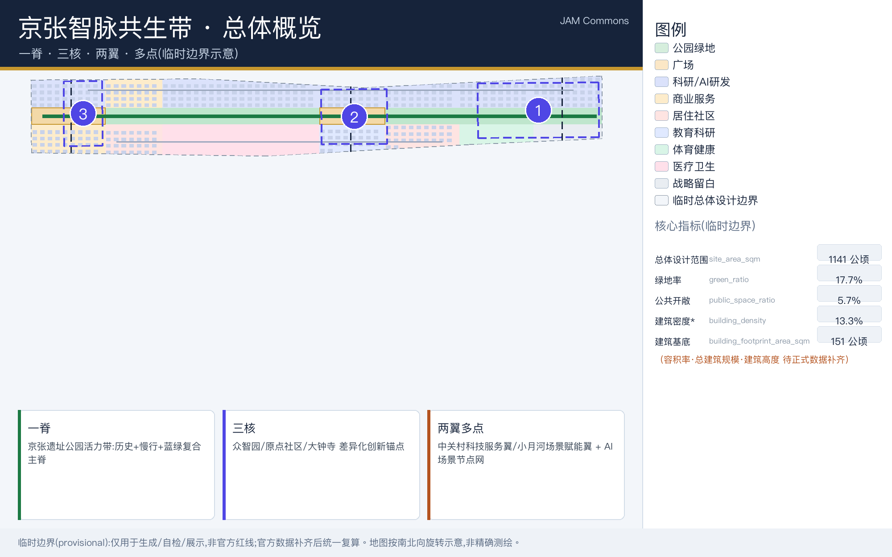
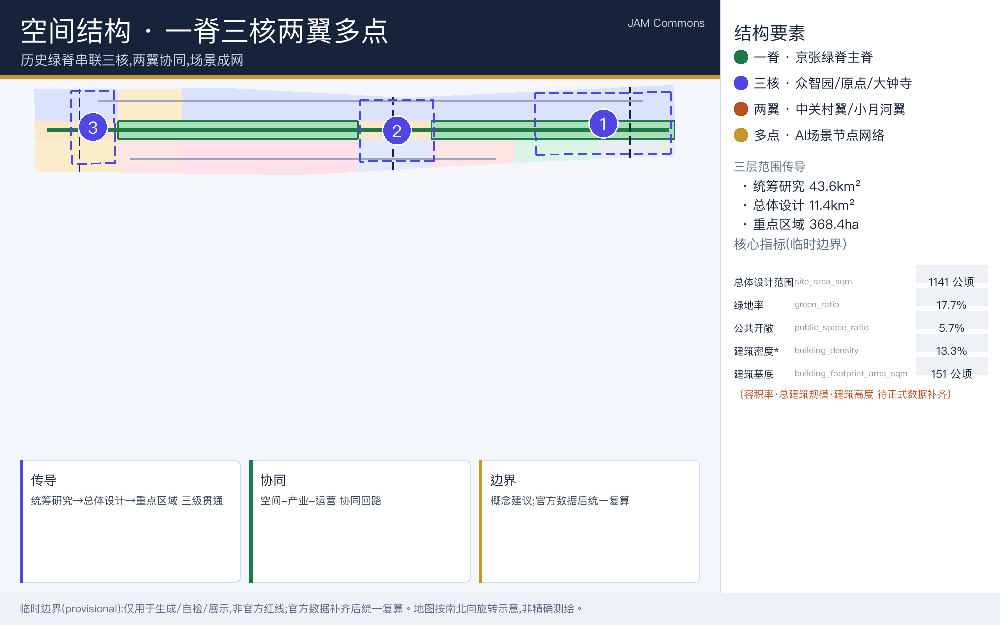
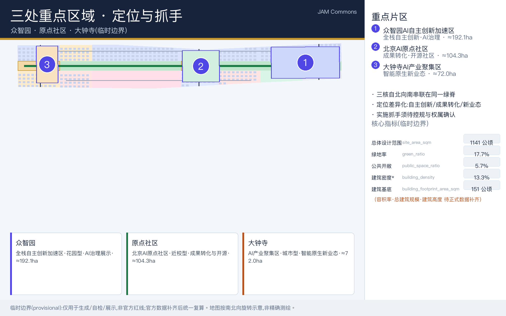
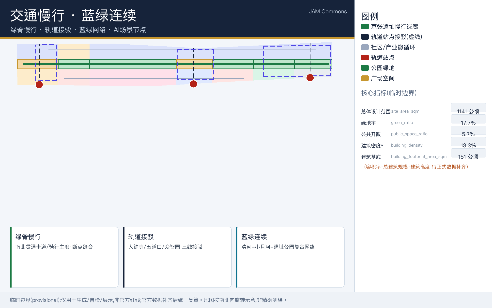
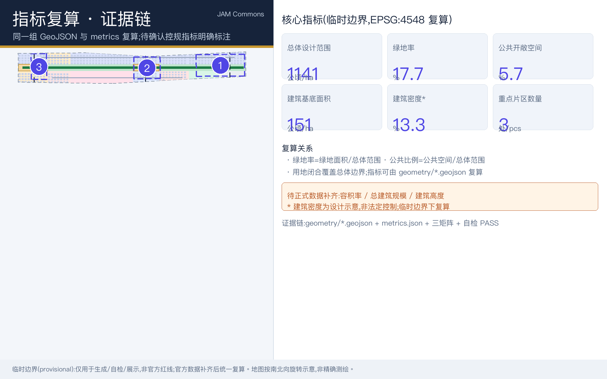

# 百年京张AI创新带城市设计方案：京张智脉共生带

## 设计依据与资料清单

本方案响应北京市规划和自然资源委员会海淀分局发布的百年京张AI创新带城市设计国际方案征集资格预审公告，按公告确定的三层范围、工作深度与成果要求组织全部章节 [source:OFFICIAL-ANNOUNCEMENT] [standard:PROJECT-OFFICIAL-ANNOUNCEMENT]。面向智能体的六项必选任务（agent.1–agent.6，涵盖命名品牌、创新生态案例、AI+场景与画像、AI公共空间与朝圣地标、文化叙事、长期运营）以征集任务书为直接依据 [source:AGENT-TASKBOOK] [standard:PROJECT-AGENT-OPEN-CALL-TASKBOOK]。

总体城市设计的方法参照住房和城乡建设主管部门城市设计管理相关办法对公共空间、风貌与实施传导的要求 [standard:MOHURD-URBAN-DESIGN-MEASURES]；控规深度叙事参照控制性详细规划相关技术口径 [standard:MOHURD-CONTROL-DETAILED-PLANNING]；用地分类采用自然资源主管部门国土空间调查、规划、用途管制用地用海分类的公开口径 [standard:MNR-LAND-USE-CLASSIFICATION-GUIDE]。场地的几何、指标与枚举以公开场地资料包为唯一机器可读来源 [source:SITE-PACKAGE]，资料的清权与使用边界由来源登记清单统一管理 [source:SOURCE-REGISTRY]。

需要首先声明：本次提交采用临时边界（official_boundary=false，geometry_role="provisional_constraint"），该边界仅用于方案生成、自检、可视化与设计讨论，不能作为官方红线、审批依据、精确面积依据或法定控制结论 [source:BOUNDARY-SOURCE] [data:geometry/site_boundary.geojson#SITE-001]。待官方几何数据发布后，全部面积、比例与指标须统一复算。现状条件诊断的深度对应 [depth:existing_conditions_diagnosis]，事实包仅作阅读导航 [source:PROCESSED-FACT-PACK]。

待确认事项：官方范围红线、三处重点区正式界址、控规条件、权属、市政与文保资料均待主办方正式数据补齐；本方案所有空间判断在补齐前均为概念建议与参考方案。

## 三层范围工作框架

方案按公告划定的三个层次组织工作，深度要求对应三层范围框架与总体空间结构两项深度校验 [depth:three_level_scope_framework] [depth:overall_spatial_structure]。

| 层级 | 范围与规模（公告口径） | 工作主题 | 深度取向 |
| --- | --- | --- | --- |
| 统筹研究范围 | 43.6 km²（北至北五环路，东至京藏高速，南至西直门外大街，西至万泉河路） | AI产业生态、战略定位、创新链与未来城市形态 | 策略与结构 |
| 总体设计范围 | 11.4 km²（京张遗址公园周边1-2公里；东至学院路/西土城路，西至大钟寺东路/荷清路） | 城市更新总体框架、产业空间布局、交通市政支撑、风貌控制 | 控规深度城市设计 |
| 重点区域范围 | 368.4 公顷（众智园、北京AI原点社区、大钟寺三处） | 功能业态、建筑规模、拆改留分类、公共空间连通、交通组织 | 规划综合实施方案深度 |

三层范围不是割裂的图纸集合：统筹研究层决定产业链与创新生态的空间逻辑，总体设计层将其转译为用地、交通与更新结构，重点区域层验证具体片区的可实施性与场景落位。三处重点区由独立图层登记，数量与界址可由图层复核 [data:geometry/key_areas.geojson#PROV-KEY-001] [metric:key_area_count]。三层范围的全部空间结论均建立在临时边界之上，待官方数据补齐后须逐层复算并回写正文。

## 统筹研究范围产业与未来城市研究

命名与品牌（agent.1）：方案主名称为"京张智脉共生带"，英文名为 Jingzhang AI Meridian Commons（简称 JAM Commons）。命名体系采用"一带总名＋三核专名＋场景节点名"的层级结构，使总体品牌、重点片区与可运营节点形成统一识别。Logo 方向以"铁轨枕木×神经网络节点连线"为母题，主色取轨道锈红（heritage）与神经网络蓝（AI），把百年铁路工业记忆与人工智能时代的连接性转译为可延展的视觉系统；正式视觉识别体系尚需专业团队另行设计与授权清权。

定位与功能：方案提出三大定位——百年京张文化带、都市AI生活体验带、AI融合创新带；五大功能——AI全栈自主创新体系、世界级AI创新生态、AI+场景赋能新范式、智能化AI活力城市、AI治理全球话语权；并以"三区两翼"组织协同——AI原点社区承载世界级AI创新生态，众智园AI自主创新加速区承载全栈自主创新体系与AI治理话语权，大钟寺AI产业集聚区承载智能原生新业态，中关村科技服务翼负责要素全球化配置与中关村IP、资本赋能，小月河场景赋能翼负责AI场景赋能与AI活力城市 [source:AGENT-TASKBOOK]。总体空间结构概括为"一脊·三核·两翼·多点"：一脊即京张遗址公园活力带（东西缝合、南北贯通的历史＋慢行＋蓝绿主脊），三核即众智园、原点社区、大钟寺，两翼即中关村科技服务翼与小月河场景赋能翼，多点即10个AI场景与AI朝圣地标节点 [depth:overall_spatial_structure]。

全球AI创新生态案例研究（agent.2）选取5–7个可对照样本，提炼可转化机制，服务于本方案的生态组织，而非复制其形态：

| 全球案例 | 生态特征 | 可转化机制 | 本方案转化方向（概念建议） |
| --- | --- | --- | --- |
| 美国硅谷 Sand Hill Road 生态 | 高校—资本—创业链 | 要素高密度协同与成果转化 | 中关村科技服务翼的资本与IP服务网络 |
| 英国伦敦 King's Cross 知识区 | 文化＋大学＋总部 | 更新＋创新＋文化复合 | 京张遗产廊道的文化与创新复合更新 |
| 加拿大多伦多 MaRS 创新中心 | 医工交叉 | 垂直领域一站式孵化 | AI健康服务与社区健康服务设施联动 |
| 以色列特拉维夫 | 军民融合与开源 | 开放协作与快速测试 | 众智园开放协作与全栈测试验证机制 |
| 德国慕尼黑高科技走廊 | 企业＋院所＋算力 | 全栈研发与标准制定 | 全栈自主创新体系与治理话语权培育 |
| 日本东京"城市实验室" | 场景开放 | 场景预约与公共测试 | 全域AI场景开放预约运营机制 |
| 新加坡 SkillsFuture／智慧国 | 人才＋治理 | 人才运营与AI治理对话 | 人才画像运营与AI治理国际对话平台 |

未来城市形态研究认为，人工智能将重构工作、生活、学习、交往与公共服务的方式：创新活动从封闭园区转向"高校策源—开源协作—企业转化—公共体验—国际传播"的城市级链网，日常服务从定点办理转向嵌入式、移动式、可预约的场景供给。上述判断在本方案中仅作为统筹研究层的概念建议，可供专业团队深化研究，不构成法定规划结论；涉及产业指标与国际化氛围的内容，待正式数据校准后方可量化。

## 总体设计范围城市更新与控规深度城市设计

总体设计范围约11.4 km²，按控规深度的城市设计要求，提出"绿脊居中、生活西翼、创新东翼"的更新结构：中央为约0.6幅宽、纵贯南北的京张遗址公园绿脊；西侧为生活、人才与公共服务街区；东侧为AI产业与科研创新街区。用地布局深度对应 [depth:land_use_layout]，开发强度控制对应 [depth:development_intensity_controls]，图层闭合性可由用地图层复核 [data:geometry/land_use.geojson#LU-001] [metric:land_use_area_by_code_sqm]。

在临时边界下按 EPSG:4548 复算的用地概念结构如下（单位 m²，公告口径分类 [standard:MNR-LAND-USE-CLASSIFICATION-GUIDE]）：

| 用地代码 | 名称 | 面积（约值） | 主要内容 |
| --- | --- | --- | --- |
| 0802 | 科研用地 | 4,137,141 | 众智园全栈创新南/北区、大钟寺AI产业核心、原点AI研发与开源社区、AI成果转化研发区、AI中试测试验证区 |
| 05 | 商业服务业用地 | 1,103,956 | 大钟寺商业服务街区、大钟寺商务服务区 |
| 0701 | 城镇住宅用地 | 979,149 | 南部人才居住社区、中部人才混合社区 |
| 0804 | 教育用地 | 514,890 | 高校成果转化教育基地（北京AI原点社区西侧） |
| 0805 | 体育用地 | 443,646 | 社区运动健康公园 |
| 0806 | 医疗卫生用地 | 1,408,377 | 社区健康服务中心 |
| 1401 | 公园绿地 | 以图层复算为准 | 京张遗址公园南/中/北段、清河滨水绿廊南/北 |
| 1403 | 广场用地 | 以图层复算为准 | 站前门户广场、AI原点论坛广场 |
| 16 | 留白用地 | 以图层复算为准 | 北部战略留白与边界留白过渡 |

更新总体框架强调低效空间识别与渐进更新：优先释放轨道站点周边、遗址绿脊两侧与低效产业用地的公共价值，再以科研机构与商业服务更新承接产业功能。全部面积均为临时边界下的概念估算；开发强度、容积率与建筑规模在控规条件确认前不作为控制值。待确认：各地块控制指标、道路红线与退线条件。

## 重点区域详细设计

三处重点区合计 368.4 公顷，自北向南依次为众智园AI自主创新加速区、北京AI原点社区、大钟寺AI产业聚集区，详细设计深度对应 [depth:three_key_area_detailed_design]，界址以重点区图层为准 [data:geometry/key_areas.geojson#PROV-KEY-001] [data:geometry/key_areas.geojson#PROV-KEY-002] [data:geometry/key_areas.geojson#PROV-KEY-003]。详细设计仅达概念与综合实施方案讨论深度，具体拆改留、建筑规模与工程条件均待正式数据确认。

| 重点片区 | 规模（公告口径，provisional） | 设计定位 | 空间动作（概念建议） | 代表性AI场景 |
| --- | --- | --- | --- | --- |
| 众智园AI自主创新加速区 | 约192.1 公顷（北） | 花园型全栈自主创新街区 | 强化清河滨水界面、低碳创新交往环境、对外交通组织与绿色空间AI场景 | 全栈模型测试验证、标准制定工作坊、安全治理展示 |
| 北京AI原点社区 | 约104.3 公顷（中） | 近校型成果转化与人才社区 | 缝合校区—园区—街区慢行，补足成果发布、人才服务、居住生活与开源协作空间 | 开源发布厅、近校成果转化街、人才特区服务 |
| 大钟寺AI产业聚集区 | 约72.0 公顷（南） | 城市型智能经济与国际交往街区 | 大钟寺站一体化、路口四象限步行连通、商业服务与重点企业公共环境更新 | 智能终端实测、数据要素会客厅、国际路演 |

众智园片区围绕全栈自主创新体系，将模型训练、算力支撑、安全评测与标准研讨组织为可参观、可预约、可监管的街区网络；原点社区片区强调"近校创新"，把高校成果转化、开源社区运营与人才居住生活嵌入步行友好的混合街区；大钟寺片区突出智能原生新业态与国际交往，以轨道站点一体化和四象限步行连通改善城市界面。三处片区的建筑形态、高度与体量建议均为参考方案 [depth:height_massing_character]，待官方重点区界址与控规条件补齐后复算深化。

### 众智园AI自主创新加速区（详细设计）

概念性业态配比（概念配比，下同）建议为：全栈研发与中试约 55%、科技服务与治理展示约 20%、人才居住与生活配套约 15%、公共与蓝绿空间约 10%。拆改留策略为概念分类：保留现代产业楼宇与绿地骨架，改造低效厂房为研发与展示界面，北区新建 AI 研发簇群；全区研发类建筑基底合计约 94.7 公顷（ai_r_and_d，概念口径）以本片区为主要承载区 [data:geometry/buildings.geojson#BLDG-001]。公共界面以临清河滨水交往与对外交通组织为先导，慢行与遗址公园绿廊缝合；建筑高度、体量与确切规模均待控规与工程条件确认 [depth:height_massing_character]。

### 北京AI原点社区（详细设计）

概念性业态配比建议为：科研与成果转化约 40%、教育与开源协作约 25%、人才居住与公寓约 20%、公共服务与社区商业约 15%。拆改留方面保留教育科研配套（education，约 10.0 公顷基底）与既有社区肌理，改造沿街低效空间为近校成果转化街，新建小规模孵化与发布设施；人才居住类基底（residential，约 21.9 公顷）主要落位于两侧混合社区。校区—园区—街区慢行缝合重于大拆大建；拆改留比例与首层业态须待权属调查确认 [depth:retain_renovate_demolish]。

### 大钟寺AI产业聚集区（详细设计）

概念性业态配比建议为：AI 研发与企业总部约 45%、商业服务与商务配套约 30%、智能原生消费与展示约 15%、公共交流与广场约 10%。拆改留方面保留重点企业与既有商务楼宇，改造商业服务类基底（retail，约 24.6 公顷）沿站周边界面，结合站前广场新建数据要素会客厅与国际路演节点。大钟寺站一体化与路口四象限步行连通是公共环境提升主轴 [data:geometry/public_space.geojson#PUBLIC-001]；重点企业周边改造须权属方参与，工程可行性不做结论 [depth:three_key_area_detailed_design]。

## AI 创新生态、人才画像与 AI+ 场景

agent.3 要求以画像与场景卡支撑创新生态设计。方案识别六类核心用户画像，逐一说明"需求—空间响应—隐私与人工复核边界"：

| 用户画像 | 核心需求 | 空间响应（概念建议） | 隐私与人工复核边界 |
| --- | --- | --- | --- |
| 开源开发者 | 发布、协作、社区声誉沉淀 | 原点社区开源发布厅、贡献墙、夜间协作空间 | 仅做聚合统计，不追踪个人行为轨迹 |
| 初创团队 | 低成本空间、算力入口、试验场 | 共享测试场、端侧算力驿站、投融资对接服务 | 算力与数据服务须另行授权 |
| 头部企业访客与投资机构 | 展示、商务、国际接待 | 大钟寺国际路演客厅、站前门户、企业周边公共环境 | 企业标识、案例与图像素材须清权 |
| 高校师生与研究人员 | 成果转化、跨校协作、慢行通勤 | 成果转化街、校区园区慢行缝合、AI教育体验点 | 校园数据与科研成果使用须授权 |
| 周边居民 | 通勤、休闲、社区服务、低扰动更新 | 遗址公园慢行环、社区服务嵌入、活动分级管理 | 不将居民数据用于商业画像推荐 |
| 国际访学人群与游客 | 认知路线、文化体验、交流 | AI朝圣路线、遗产导览、国际活动周公共体验 | 涉外传播内容须经人工审校 |

在此基础上形成10张AI场景卡，其中产业测试验证场景3项（①②③），空间载体对应公共开敞空间与慢行图层 [data:geometry/public_space.geojson#PUBLIC-001] [data:geometry/roads.geojson#ROAD-001]：

| 编号 | 场景卡 | 类型 | 空间载体 | 运营与人工复核要点 |
| --- | --- | --- | --- | --- |
| ① | 众智园全栈模型测试验证场 | 产业测试验证 | 众智园 | 预约准入、安全评测流程、结果人工复核 |
| ② | AI中试测试验证区开放试验 | 产业测试验证 | AI中试测试验证区 | 低速配送机器人等真实街景试验须安全评估 |
| ③ | 大钟寺智能终端与数据要素实测 | 产业测试验证 | 大钟寺片区 | 可信流通、全程可审计 |
| ④ | 开源发布厅 | 产业服务 | 原点社区 | 成果发布、路演与代码贡献展示 |
| ⑤ | AI安全治理展示廊 | 治理展示 | 众智园 | 标准与可信AI的公众沟通界面 |
| ⑥ | 京张遗址AI文化叙事导览 | 文化体验 | 遗址公园记忆线 | 史实校核、素材清权 |
| ⑦ | 慢行断点智能诊断与无障碍导航 | 交通出行 | 遗址慢行绿廊与轨道接驳廊 | 低侵入传感、数据最小化、人工核验 |
| ⑧ | AI公共服务亭 | 公共服务 | 社区与轨道站点节点 | 医疗、教育、法律、生活服务导航并保留人工转接 |
| ⑨ | 数据要素可信流通会客厅 | 企业服务 | 大钟寺片区 | 合规、授权、可审计前提下的展示与洽谈 |
| ⑩ | 低碳算力驿站 | 新型基础设施 | 多点分布 | 端侧算力＋公共服务，能耗与安全监测 |

上述场景卡与征集列明的六个场景方向对应：⑦对应 ai-traffic-walkability，⑥对应 ai-cultural-guide，⑨与④对应 enterprise-service-copilot，大型活动的公共安全人工复核机制对应 public-safety-operations-review，⑧对应 ai-health-service-navigation，②涵盖 robot-delivery-low-speed 的真实街景验证。所有场景均为概念建议，开放运营须以公共安全、数据合规与人工复核机制前置，治理边界遵循任务书要求 [source:AGENT-TASKBOOK]；场景密度与开放空间承载力可对照 [metric:public_space_ratio] 复算。

## 用地、建筑规模与拆改留方案

用地方案按公开分类口径形成完整、闭合、无缝衔接的概念分区，前节已述。建筑层面，方案在临时边界内识别393栋概念建筑基底，合计建筑基底面积约 1,513,050.0 m²，按功能分为AI研发 947,100 m²、商业服务 246,400 m²、居住 219,450 m²、教育科研 100,100 m²；建筑密度约 0.132575（≈13.3%）仅为设计示意，非法定密度控制值 [data:geometry/buildings.geojson#BLDG-001] [metric:building_footprint_area_sqm] [metric:building_density]。

拆改留方案仅以方法论表达（深度要求对应 [depth:retain_renovate_demolish]）：将现状建筑分为保留利用、改造提升、更新重建、新建置入与"待确认"五类，分类规则依据结构安全、历史价值、功能绩效与公共空间贡献综合判定；在京张铁路遗产与高校建成环境敏感区，优先采用小尺度、渐进式、可逆性改造。任何具体建筑的处置结论、建筑形态、体量与高度建议均待现状测绘、权属、文保与控规资料确认后方可提出，本节不提供伪精确控制线 [depth:height_massing_character]。

待确认（status=unknown）：floor_area_ratio（容积率）、total_floor_area_sqm（总建筑规模）、building_height_m（建筑高度）三项指标在公开场地包中均为 unknown，须待控规条件正式确认后复算，本方案不以推测值冒充审定指标。

## 交通、轨道、市政与公共服务设施

交通与慢行系统以"一主廊、三接驳、两微循环"组织（深度对应 [depth:traffic_rail_slow_parking]，图层证据 [data:geometry/roads.geojson#ROAD-001]）：

- ROAD-001 京张遗址慢行绿廊：heritage_greenway，沿遗址公园绿脊纵贯南北的主慢行道，串联三核与沿线场景节点。
- ROAD-002 大钟寺站接驳廊、ROAD-003 五道口—原点接驳廊、ROAD-004 众智园对外接驳廊：三条轨道站点接驳廊道，强化大钟寺站、五道口／清华东路西口与众智园对外联系。
- ROAD-005 西部社区微循环、ROAD-006 东部产业微循环：分别服务生活街区与产业街区的慢行与街道微循环。

设计重点为慢行断点缝合、京张跨环路节点与站前一体化，回应北五环南北割裂与站点周边步行品质问题；方案建议以跨环路步行联系、桥下空间活化与站前广场的连续慢行界面予以改善，均为概念建议，道路红线、断面与工程线位待正式市政交通资料确认。

市政与公共服务设施（深度对应 [depth:municipal_new_infrastructure]）：围绕AI产业服务设施、创新服务平台、人才生活服务设施、新型基础设施、分布式能源与端侧算力提出概念布局——低碳算力驿站多点嵌入社区与轨道节点，分布式能源与雨洪管理结合蓝绿空间布置，传统市政与新型基础设施融合共构。管线、能源、排水、防洪、消防等工程条件缺失，列为正式深化前置条件，约束图层参见 [data:geometry/constraints.geojson]。

## 蓝绿空间、公共空间与城市风貌

蓝绿骨架以京张遗址公园活力带为主脊：遗址公园南/中/北段（GREEN-001/002/003）纵贯全域，清河滨水绿廊南/北（GREEN-004/005）衔接北界，并联系小月河水系，形成南北贯通、东西缝合的步道与骑行道体系，串联高校、企业与社区 [data:geometry/green_space.geojson#GREEN-001]。临时边界下绿地率约 17.7%、公共开敞空间比例约 5.7%，公共广场以站前门户广场（PUBLIC-001）与AI原点论坛广场（PUBLIC-002）为锚点 [metric:green_ratio] [metric:public_space_ratio] [data:geometry/public_space.geojson#PUBLIC-001]。蓝绿与公共空间深度对应 [depth:blue_green_public_space]，风貌统筹参照 [standard:MOHURD-URBAN-DESIGN-MEASURES]。

AI公共空间与朝圣地标（agent.4）提出四处概念节点，并配套公共空间组件库（城市家具、导视标识、铺装纹样、照明与交互亭的方向性套件，供专业团队深化选型）：

| AI朝圣地标 | 位置 | 主题 | 表达方式（概念建议） |
| --- | --- | --- | --- |
| 京张铁路记忆之门 | 遗址公园南端 | 历史打卡＋AI文化 | 遗产符号装置与互动叙事界面 |
| AI原点广场荣誉墙／贡献墙 | AI原点论坛广场 | 开源贡献与人才荣誉展示 | 贡献数据可视化墙与年度荣誉谱系 |
| "全栈之光"标准治理展示节点 | 众智园 | 标准制定与治理话语权 | 可参观的标准工作坊与展示廊 |
| "智脉"公共艺术装置带 | 沿慢行主脊多点 | 轨道锈红主题智能艺术 | 串联节点的公共艺术组件 |

城市风貌与文化叙事（agent.5）：将百年京张文化（詹天佑与京张铁路工业记忆）×中关村创新文化（电子一条街到硬科技的演进）×AI新文化（开源、可信、人本）叠合为三层叙事。载体包括遗址公园记忆线、统一导视符号系统与国际传播叙事；风貌引导区分官方管控要素、设计建议与待确认条件，色彩与材质延续轨道锈红与神经网络蓝的品牌基因。所有叙事素材不得歪曲史实，图像、字体、标识与案例素材均须有清权来源。待确认：上述绿地与公共空间比例均按临时边界估算，待官方数据复算。

## 更新项目清单、实施政策与分期计划

更新项目按"近期试点→中期更新→远期深化"推进，分期图层合计面积约 11,412,825 m²（三期闭合 [metric:phasing_area_sqm]），分期深度对应 [depth:phasing_implementation]，空间证据见 [data:geometry/phasing.geojson#PHASE-001]。PHASE-001 近期试点（2026-2028）聚焦大钟寺片区＋遗址公园南段＋AI原点论坛广场，以轻量设施、运营活动与公共体验先行；PHASE-002 中期更新（2028-2031）聚焦原点社区＋遗址公园中段＋中试测试，推进城市更新项目；PHASE-003 远期深化（2031-2035）聚焦众智园全栈创新区＋清河绿廊，待控规、市政与权属条件确认后深化。

| 编号 | 更新项目（概念建议） | 阶段 | 类型 | 主要依赖条件 |
| --- | --- | --- | --- | --- |
| JZ-01 | 京张遗址公园南段慢行先行段 | 近期试点(2026-2028) | 公共空间／慢行 | 断面、桥下空间与权属核对 |
| JZ-02 | AI原点论坛广场轻量设施与公共体验启动 | 近期试点 | 运营／公共体验 | 场地许可、活动安全与版权清权 |
| JZ-03 | 大钟寺站接驳与路口四象限步行连通优化 | 近期试点 | 轨道一体化／慢行 | 站点、交叉口与管线资料 |
| JZ-04 | 原点社区近校成果转化街 | 中期更新(2028-2031) | 城市更新／产业服务 | 校区边界、权属与首层业态 |
| JZ-05 | 遗址公园中段缝合与京张记忆线 | 中期更新 | 蓝绿／文化 | 遗产资料与工程条件 |
| JZ-06 | AI中试测试验证区开放运营 | 中期更新 | 产业测试 | 安全评估与监管流程 |
| JZ-07 | 众智园全栈创新街区深化 | 远期深化(2031-2035) | 控规落实／产业社区 | 控规、市政与权属条件确认 |
| JZ-08 | 清河滨水绿廊贯通 | 远期深化 | 蓝绿空间 | 河道蓝线、生态与防洪条件 |
| JZ-09 | 全域AI场景网络与朝圣地标体系 | 远期深化 | 运营／品牌 | 清权来源与运营主体落实 |

项目清单深度对应 [depth:renewal_project_list]。实施政策建议覆盖城市更新统筹实施机制、空间供给政策、运营机制、产业服务、公共参与、数据治理与产权协同七个方向；所有项目均须以权属、资金、实施主体与审批路径的落实为前提，本方案不提供投资测算与开发时序承诺。

长期运营（agent.6，均为概念建议、可供专业团队深化研究）：年度活动体系包括AI原点论坛、场景开放日、开发者节与全球AI活动周路线；开发者社区采取常态化开源协作运营；场景开放采取预约制运营并公示测试日历；公共体验路线串联遗产、开源、产业与国际交往节点；国际传播与招引转化依托多语种叙事与活动周平台，对象、频率、责任边界与风险均待运营主体确认后细化 [source:AGENT-TASKBOOK]。

### 长期运营机制（agent.6 深化）

年度运营日历建议如下（频率与责任边界为概念设计，落地前须与属地及运营主体确认）：

| 季度节点 | 品牌活动 | 责任边界（概念） | 转化路径 | 主要风险与前置 |
| --- | --- | --- | --- | --- |
| Q1 | AI原点论坛（学术+产业年会） | 主办/承办主体待确认，学术机构参与 | 成果发布→资源对接→落地跟踪 | 活动许可、嘉宾与素材授权 |
| Q2 | 场景开放日（片区开放+测试日历公示） | 运营主体与属地协同，预约准入 | 公共体验→试用→反馈入库 | 数据合规与安全隔离 |
| Q3 | 开发者节（开源协作+竞赛路演） | 社区运营方治理，公开仓库+例会 | 贡献沉淀→孵化→投融资对接 | 参赛素材版权清权 |
| Q4 | 全球AI活动周公共路线 | 多主体协同，遗产—开源—产业串联 | 参访→项目转化→年度发布 | 大型活动安全人工复核 |

运营闭环设计上，开发者社区采用开源惯例运营（公开仓库、定期会面、贡献墙与荣誉展示），场景开放采用预约制并将通过安全评估的测试项目纳入公共测试日历。转化路径按三类对象设计概念链条：人才从访问者→社区成员→在地从业者；初创从试验场→孵化加速→落地；企业从参访→总部对接→长期合作，均不写成招商、政策或资金的确定承诺 [source:AGENT-TASKBOOK]。

## 指标体系、面积复算与合规矩阵

指标体系分为三类：可由提交几何直接复算的空间指标、需官方控规条件支撑的管控指标、需运营数据持续校准的绩效指标。面积复算统一采用 EPSG:4548，深度对应 [depth:metrics_recalculation]，边界依据 [data:geometry/site_boundary.geojson#SITE-001]。

| 指标 | 数值 | 状态 | 口径说明 |
| --- | --- | --- | --- |
| site_area_sqm | 11,412,825.385554 m²（≈1141.3 公顷） | known | 临时边界多边形面积 |
| green_space_area_sqm | 2,016,596.918752 m² | known | 绿地图层合计 |
| public_space_area_sqm | 653,407.382267 m² | known | 公共空间图层合计 |
| building_footprint_area_sqm | 1,513,050.0 m² | known | 建筑基底合计（示意） |
| green_ratio | 0.176696（≈17.7%） | known | [metric:green_ratio] 复算 |
| public_space_ratio | 0.057252（≈5.7%） | known | [metric:public_space_ratio] 复算 |
| building_density | 0.132575（≈13.3%） | known | 仅设计示意，非法定密度 |
| land_use_area_by_code_sqm | 11,412,771 m² | known | 用地闭合覆盖 |
| key_area_count | 3 | known | 重点区数量 |
| phasing_area_sqm | 11,412,825 m² | known | 三期合计闭合 |
| floor_area_ratio | — | unknown | 待正式控规条件确认 |
| total_floor_area_sqm | — | unknown | 待建筑层数与控规条件 |
| building_height_m | — | unknown | 待高度分区与文保、航空条件 |

合规矩阵将公告三层范围任务与 agent.1–agent.6 逐项映射至章节、图层、指标与图纸证据：场地面积与绿地指标可复核 [metric:site_area_sqm]，用地闭合与重点区数量见上表；总体与重点区的空间结构、场景与项目均在正文相应章节给出落点。待复算：官方边界发布或控规条件确认后，上表全部 known 指标须重新复算，unknown 指标须补齐来源后方可转为设计控制依据。

## 风险、版权与合规说明

统一边界条款：本方案全部空间落地建议均为"概念建议／参考方案／可供专业团队深化研究"，不构成法定规划、经审批的控制条件、容积率／建筑高度／具体拆改留结论、道路红线、工程线位、投资测算、开发时序或实施安排；任何以本方案名义作出的确定性表述均不代表本方案立场。

风险与缺数据清单：当前主要风险包括官方边界缺失 [source:BOUNDARY-SOURCE]、三处重点区正式界址缺失、控规与权属资料缺失、市政与文保工程条件缺失，以及由此导致的面积与指标误差风险（深度对应 [depth:risk_missing_data]，约束核对见 [data:geometry/constraints.geojson]）。上述缺失均列入假设清单跟踪，待正式数据补齐后整体复算；场地包使用边界以登记清单为准 [source:SITE-PACKAGE] [source:SOURCE-REGISTRY]。

版权与合规：全部图像、图纸、图标、字体、数据与代码资产须具备清权来源并在来源清单与版权声明中登记；品牌与Logo仅为概念方向，正式视觉体系须另行设计与授权；AI文化叙事不得歪曲史实。双语合规：本中文稿与 translation_file 指定的 proposal.en.md 构成完整对照译本。AI生成内容经人工复核后提交，提交方对事实、来源、版权与空间数据负责，评审方可依据自检与复核结果要求返修。待确认：文保单位名录、涉外传播审校流程与运营主体授权链条。

## 参考资料

- 北京市规划和自然资源委员会海淀分局：《百年京张AI创新带城市设计国际方案征集资格预审公告》（ghzrzyw.beijing.gov.cn 公示页）[source:OFFICIAL-ANNOUNCEMENT] [standard:PROJECT-OFFICIAL-ANNOUNCEMENT]
- 《百年京张AI创新带面向智能体的公开征集任务书》（agent.1–agent.6 任务与统一边界条款）[source:AGENT-TASKBOOK] [standard:PROJECT-AGENT-OPEN-CALL-TASKBOOK]
- 住房和城乡建设部城市设计管理办法（城市风貌、公共空间与实施传导方法参照）[standard:MOHURD-URBAN-DESIGN-MEASURES]
- 控制性详细规划相关技术规范（控规深度叙事参照）[standard:MOHURD-CONTROL-DETAILED-PLANNING]
- 自然资源部国土空间调查、规划、用途管制用地用海分类指南（用地分类口径）[standard:MNR-LAND-USE-CLASSIFICATION-GUIDE]
- 场地资料包与来源登记：geometry 图层（site_boundary、key_areas、land_use、buildings、roads、green_space、public_space、constraints、phasing）、metrics 指标表与清权登记 [source:SITE-PACKAGE] [source:SOURCE-REGISTRY] [source:PROCESSED-FACT-PACK]

引用边界说明：以上资料均为公开或经清权的可引用来源；临时边界类来源 [source:BOUNDARY-SOURCE] [source:KEY-AREA-SOURCE] 仅用于概念推演，待官方数据发布后替换并复算全文。
