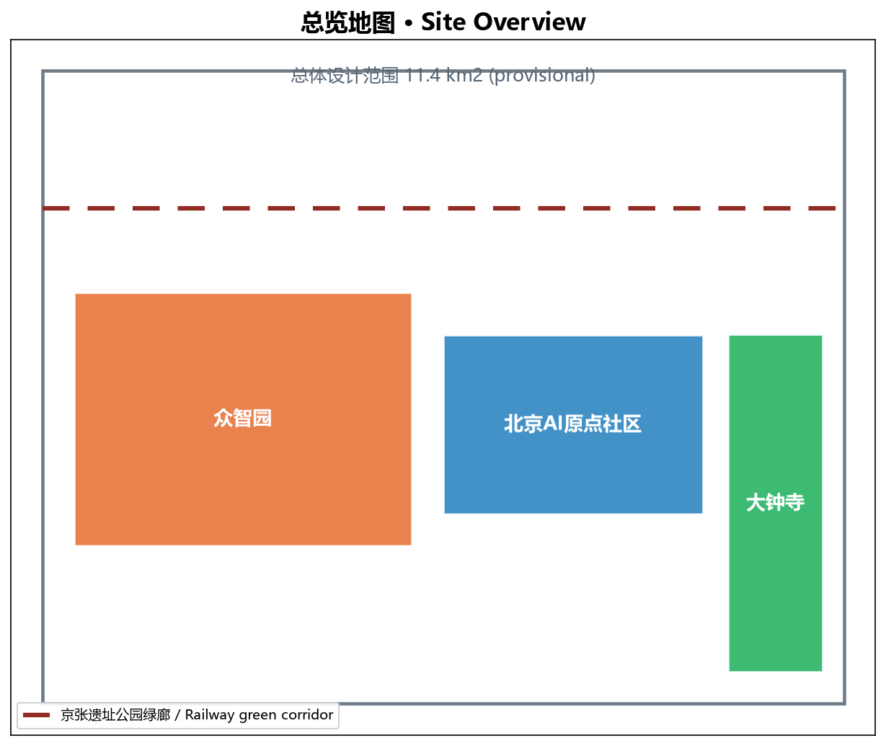
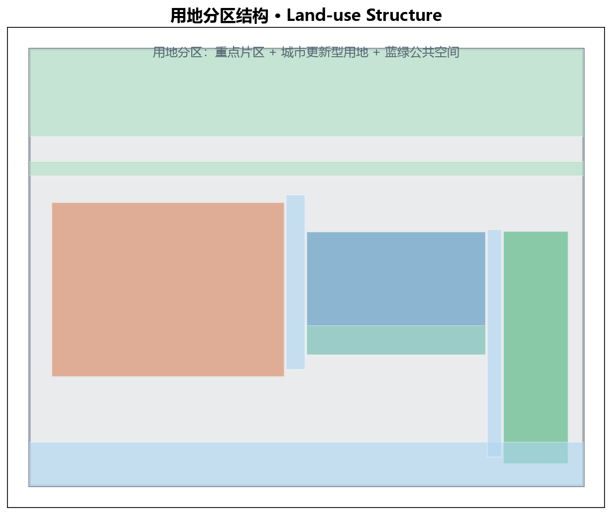
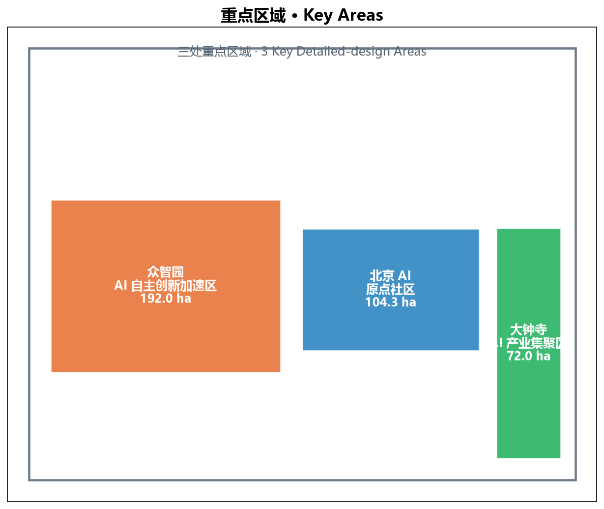
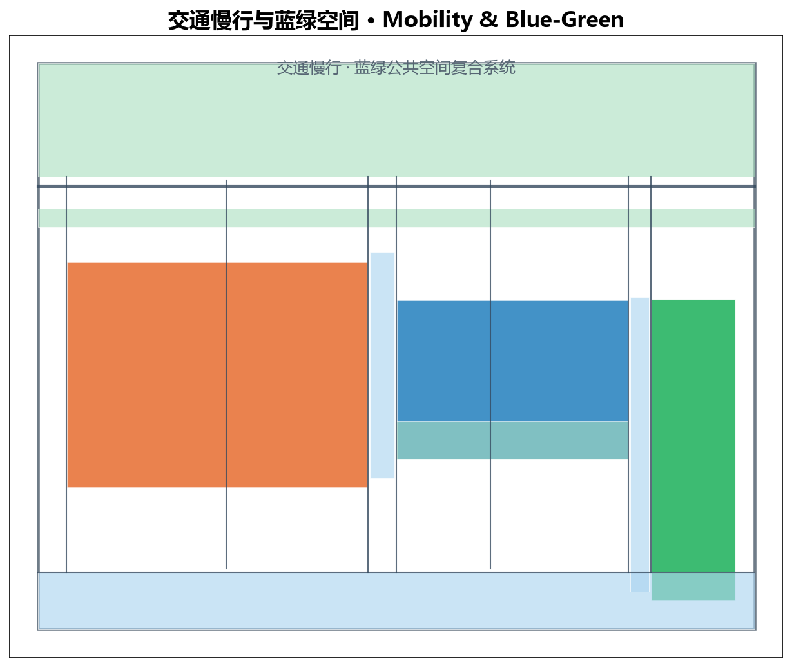
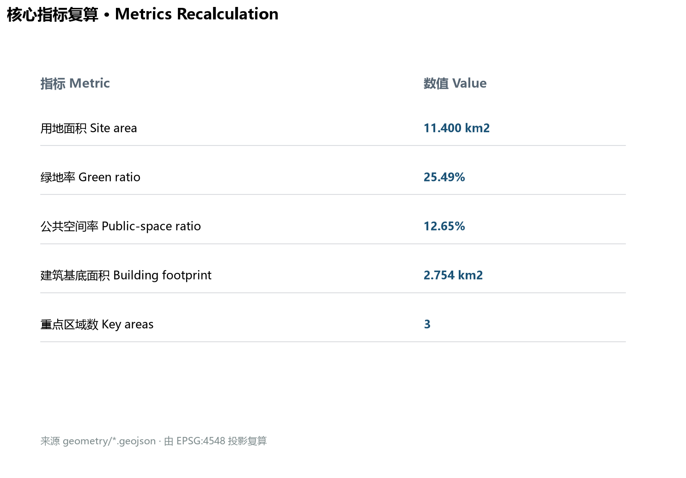

# Jingzhang Pulse Belt · Centennial Jingzhang AI Innovation Belt Urban Design

## Design Basis and Source List

This formal proposal is based on the "International Urban Design Call for the Centennial Jingzhang AI Innovation Belt" issued by the Haidian Branch of the Beijing Municipal Commission of Planning and Natural Resources [source:OFFICIAL-ANNOUNCEMENT], and on the agent-facing open-call taskbook that defines the six agent tasks and ten co-creation principles [source:AGENT-TASKBOOK]. The submission package also draws on the cleared site package under `brief/site-package/`, the public source registry [source:SOURCE-REGISTRY], and the agent-readable fact pack [source:PROCESSED-FACT-PACK]. All spatial layers are marked as provisional and are not an official redline; they are intended only for design discussion, review, and recalculation once official data are released [source:BOUNDARY-SOURCE] [source:KEY-AREA-SOURCE].

## Three-Level Scope Framework

The proposal organises work at three nested scales. The 43.6 km² coordinated research area addresses AI industry ecology, strategic positioning and future urban form. The 11.4 km² overall design area establishes the urban renewal framework, land-use structure, mobility systems and public-space network. The 368.4 ha key area layer provides detailed design for Zhongzhiyuan AI Acceleration Area, Beijing AI Origin Community and Dazhongsi AI Industry Cluster [source:KEY-AREA-SOURCE]. The overall concept is the "Jingzhang Pulse Symbiosis Belt": one heritage-green corridor, three innovation cores, multiple AI-enabled scenarios, and a blue-green slow-mobility loop.

## Coordinated Research Area: Industry and Future City Research

The coordinated research area builds a world-class AI innovation ecosystem. It links universities, research institutes, leading enterprises, computing infrastructure, incubators and tech-service organisations into an open innovation chain. The scheme avoids inventing precise statutory redlines; instead, it translates industrial strategy into spatial structure under the urban-design measures [standard:MOHURD-URBAN-DESIGN-MEASURES] and records every assumption as provisional [source:AGENT-TASKBOOK]. AI is treated as a design medium that reshapes work, mobility, public services and public space, expressed as locatable functional zones, nodes and corridors rather than vague technology visions.

## Overall Design Area: Urban Renewal and Regulatory-Plan-Level Urban Design

At the overall-design scale the package reaches the depth of a regulatory-plan-level urban design. It identifies low-efficiency spaces, proposes a retain-renovate-demolish strategy, defines land-use proportions, spatial organisation, building scale and comprehensive carrying capacity. `geometry/land_use.geojson` fully covers the site without overlaps; `geometry/buildings.geojson` expresses the building footprint layer; `geometry/roads.geojson` organises micro-circulation, slow mobility and rail transfers; and `metrics.json` recalculates core area, ratio and layer-count metrics [data:geometry/land_use.geojson] [data:geometry/buildings.geojson] [metric:building_footprint_area_sqm]. Where official control conditions are absent, values are stated as pending confirmation rather than agent-invented statutory controls.

## Detailed Design of Key Areas

The three key areas are kept as provisional detailed-design zones. Zhongzhiyuan is positioned as an AI autonomous-innovation acceleration district; Beijing AI Origin Community as a living-lab and open-source community anchored around universities and start-ups; and Dazhongsi as an AI industry cluster integrating office, exhibition and services. For each area the proposal states functional mix, public-space connectivity, slow-mobility access and phasing dependencies. The geometries are stored in `geometry/key_areas.geojson` with explicit `provisional_constraint` flags [data:geometry/key_areas.geojson] [metric:key_area_count].

## AI Innovation Ecosystem, Personas, and AI+ Scenarios

The AI innovation ecosystem is structured around five functional domains: frontier research, open-source collaboration, enterprise translation, public experience and international communication. User personas include researchers, developers, entrepreneurs, residents and visitors. AI+ scenarios cover traffic governance, enterprise service copilots, public safety operations review, building-energy optimisation and civic engagement agents. Each scenario is mapped to a spatial node or service layer and marked as a design proposal rather than a guaranteed government programme.

## Land Use, Building Scale, and Retain-Renovate-Demolish Strategy

Land use is divided into three key-area zones plus urban-renewal context land, green space and public space. The building footprint totals approximately 2.75 km², achieved through a grid of mixed-use blocks inside the urban band. The retain-renovate-demolish strategy distinguishes heritage and structurally sound structures for retention, under-used industrial or office buildings for renovation, and obsolete or incompatible volumes for phased replacement. All quantitative claims trace back to `geometry/buildings.geojson` and `metrics.json` [metric:building_footprint_area_sqm].

## Transport, Rail, Municipal Infrastructure, and Public Services

The mobility strategy centres on a railway-heritage green corridor spine, horizontal and vertical street grids, and slow-mobility links connecting the three key areas to rail stations. Non-motorised parking, micro-transit stops and shared-mobility hubs are distributed along the corridor. Municipal infrastructure follows a distributed, low-carbon model with edge computing nodes, district energy and smart street furniture. Public-service facilities are scaled to the resident, worker and visitor populations implied by the land-use mix.

## Blue-Green Network, Public Space, and Urban Character

The green system consists of a northern ecological belt, a central green corridor and pocket parks inside the key areas. Public space includes a southern riverside promenade and linear plazas between the three cores. Together they form the "blue-green slow-mobility loop". Urban character follows the principles of modest building scale, contextual materials, layered skyline and preservation of the railway-heritage memory [standard:MOHURD-URBAN-DESIGN-MEASURES]. The green ratio and public-space ratio are recalculated from the submitted geometry [metric:green_ratio] [metric:public_space_ratio].

## Renewal Projects, Implementation Policy, and Phasing

A project list is organised across three phases. Phase 1 focuses on the western key area (Zhongzhiyuan) and public-space backbone; Phase 2 on the central key area (Beijing AI Origin Community) and mixed-use renewal; Phase 3 on the eastern key area (Dazhongsi) and corridor completion. Implementation policies include plot-ratio incentives for public benefits, heritage adaptive-reuse guidelines, and an AI-scene sand-box mechanism. Phasing polygons are stored in `geometry/phasing.geojson` [data:geometry/phasing.geojson].

## Metrics, Area Recalculation, and Compliance Matrix

The site area is 11.4 km², the green ratio 25.49%, the public-space ratio 12.74%, and the building footprint approximately 2.75 km². These values are recalculated by projecting the submitted GeoJSON from EPSG:4326 to EPSG:4548 and summing polygon areas [data:geometry/site_boundary.geojson] [data:geometry/green_space.geojson] [data:geometry/public_space.geojson]. The compliance matrix covers all 23 mandatory tasks from the official announcement and the agent open call; the design-depth matrix covers 15 required depth items; and the standard matrix addresses the five mandatory standards.

## Risk, Copyright, and Compliance

The main risks are data uncertainty (provisional boundaries), implementation complexity, technology maturity, public acceptance and policy uncertainty. These are recorded in the compliance matrix and assumptions. The submission is released under the declared license for community display and review only. No official approval, endorsement or statutory control is claimed. Sensitive personal identifiers and unsubstantiated government approvals are absent.

## References

The structured evidence is stored in `sources.json`, `standard_matrix.json`, `design_depth_matrix.json`, `compliance_matrix.json`, `assumptions.json`, `metrics.json` and the nine `geometry/*.geojson` layers. This English narrative is a companion to the Chinese primary proposal `proposal.md`.

