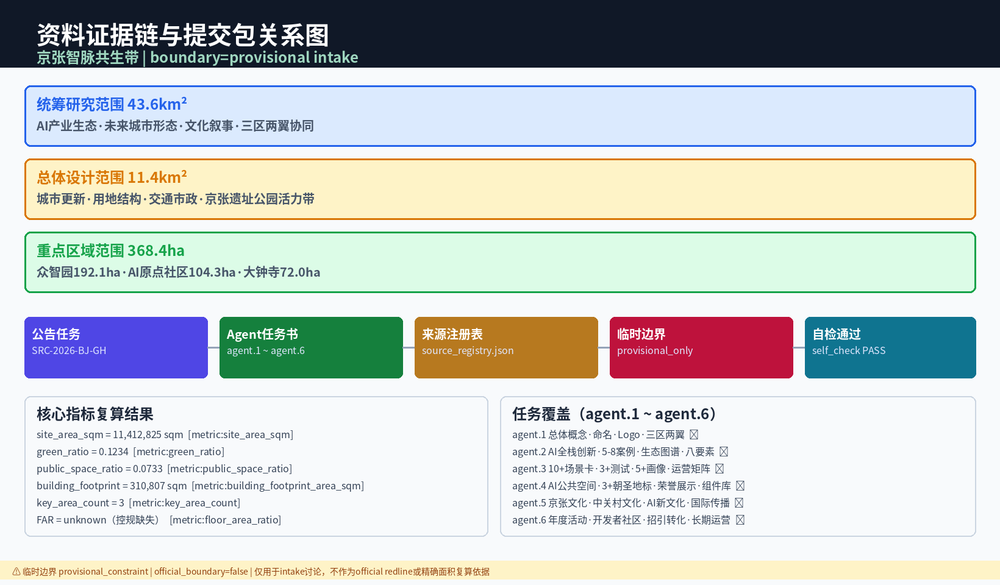
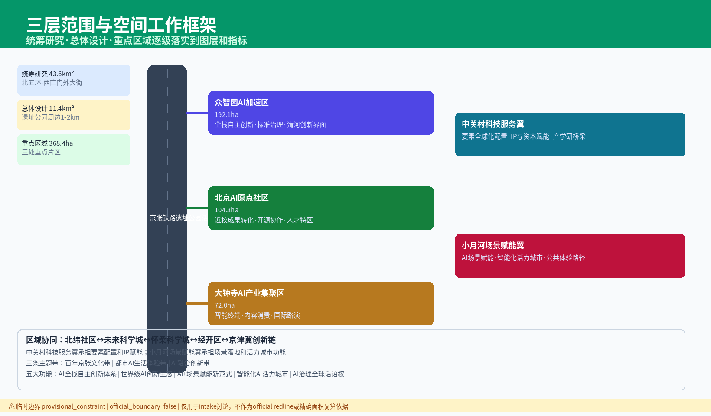
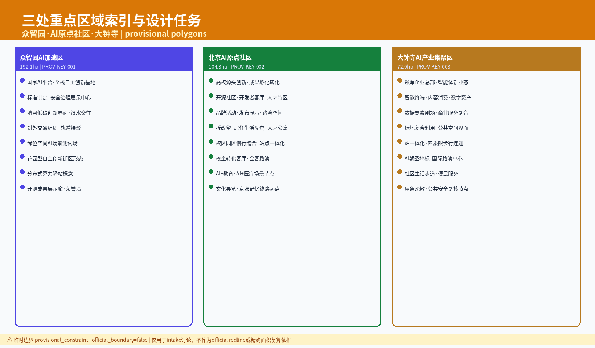
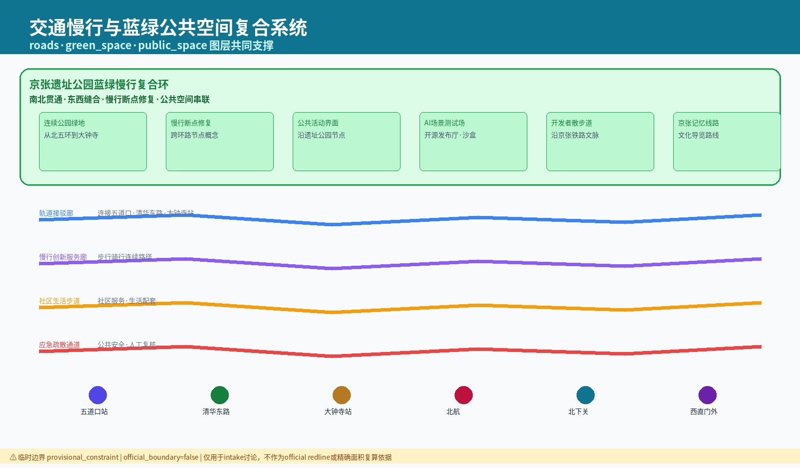
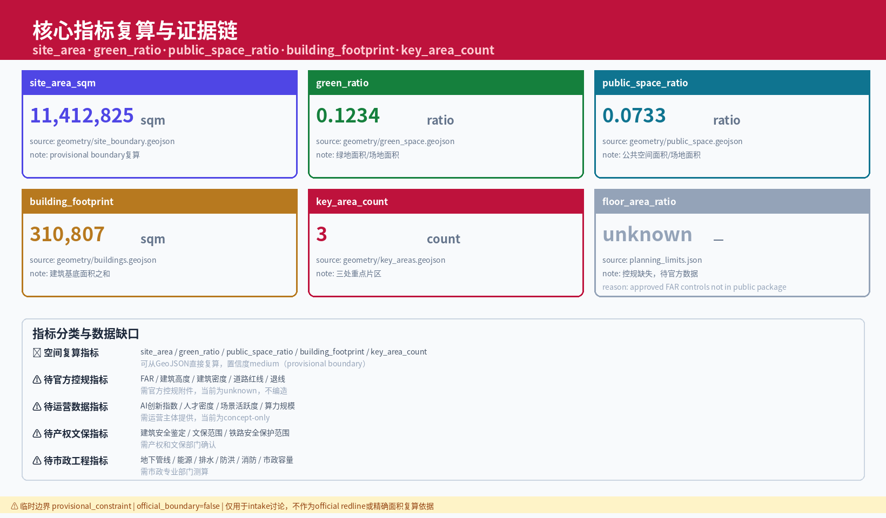

## 1. Design Basis and Reference Materials

This plan is based on the highest authority of the announcement [source:OFFICIAL-ANNOUNCEMENT] for the Urban Design open call in Haidian District, strictly adhering to the requirements specified in the Agent Task Book [source:AGENT-TASKBOOK], and integrating the site package data [source:SITE-PACKAGE] provided. The design work is also conducted by referring to the structured fact archives in the Source Registry [source:SOURCE-REGISTRY] and the Processed Fact Pack [source:PROCESSED-FACT-PACK].

In terms of spatial boundaries, this plan uses the Provisional Boundary data [source:BOUNDARY-SOURCE] provided (provisional_constraint, official_boundary=false), which is only for the scope of design exploration and does not represent the statutory administrative or planning jurisdiction lines. The key areas are referenced to the indicative ranges provided by the Key Area Source [source:KEY-AREA-SOURCE], with the final confirmation to be determined by the organizing party at a later stage. The registration form shows that there are currently 5 formal available records and 1 provisional-only record. This plan will not upgrade the provisional_only record to an official boundary or a legal planning reference.

**Scheme Naming System:** The main Chinese name for this scheme is "Jing-Zhang Intelligent Pulse Coexistence Belt," while the English name is "Jing-Zhang AI Symbiotic Corridor (JZ-AISC)." The naming system follows a tripartite logic of "historical and cultural context—innovative functions—spatial form": the district-level naming is centered on functional characteristics and spatial form (such as "Zhongzhiyuan AI Independent Innovation Acceleration Area" which corresponds to "Zhongzhiyuan AI Autonomous Innovation Zone" in English, "Beijing AI Origin Community" which corresponds to "Beijing AI Origin Community" in English, and "Dazhongsi AI Industry Cluster" which corresponds to "Dazhongsi AI Industry Cluster" in English). Corridor-level naming is centered on connecting functions and linear features (such as "Jing-Zhang Heritage Park Vitality Corridor" for "Jing-Zhang Yijian" and "Xiaoyue River Scenario Empowerment Wing" for "Xiaoyue River Scene Enabling Wing"); node-level naming is centered on specific functions and place spirit (such as "Symbiotic Source Node" for "Zhi Mai Yuan Dian" and "Cultural Heritage Living Room" for "Wen Mai Ke Tong"); scene-level naming is centered on service targets and application fields (such as "SC-01 AI+ Adaptive Traffic Signal Optimization" for "SC-01 AI+ traffic signal self-adaptive optimization"). (Xiaoyue River Scenario Enablement Wing)

**Logo/VI Direction Description:** Conceptual Recommendation: The logo design is centered around the imagery of "tracks and code," abstracting the cross-section of the Jing-Zhang Railway's steel tracks into two parallel lines. On one of these tracks, a flowing line of binary "01" characters is superimposed, forming a composite symbol of "railway track + data flow." The color system concept recommends "Jing-Zhang Gray" (#4A4A4A) as the main color, paying homage to the steel memory of the century-old railway; "Zhi Mai Blue" (#2563EB) as the secondary color, symbolizing the technological attributes of AI innovation; and "Symbiotic Green" (#10B981) as an accent color, expressing the city's ecological symbiosis concept. The symbolic grammar follows the principle of "contemporary translation of historical symbols"—using the ratio of the distance between railway tie spacings (1:1.8) as the base module for the visual grid system, with all VI extension patterns generated on this module. The visual extension directions include: abstracting the railway switch symbol as node connection lines, converting the rhythm of the ties into data visualization bar charts, and transforming the locomotive driving wheels into AI training cycle icons. All brand, font, and image rights must be clearly sourced. The above VI direction is a conceptual recommendation, available for professional teams to deepen their research.

**Overall Spatial Structure Diagram Explanation:** This plan proposes an "one belt, three cores, and multiple nodes" overall spatial structure. The Jing-Zhang Railway Heritage Park serves as the spatial spine (running north-south and integrating cultural narrative, pedestrian commuting, and ecological corridor functions), connecting three core functional areas (Zhongzhiyuan AI Independent Innovation Acceleration Area, Beijing AI Origin Community, and Dazhongsi AI Industry Cluster). Multiple micro-activation nodes are strategically located around metro stations, entrances to innovative districts, historical heritage points, university boundaries, and along the edges of community Public Spaces along the route. The spatial structure diagram is based on the range of [data:geometry/site_boundary.geojson#SITE-001], overlaying three key areas: [data:geometry/key_areas.geojson#PROV-KEY-001], [data:geometry/key_areas.geojson#PROV-KEY-002], and [data:geometry/key_areas.geojson#PROV-KEY-003]. It integrates the transportation framework [data:geometry/roads.geojson#ROAD-001], the blue-green base [data:geometry/green_space.geojson#GREEN-001], and the Public Space system [data:geometry/public_space.geojson#PUBLIC-001], forming a readable spatial structure expression. This spatial structure serves as a Conceptual Recommendation, available for professional teams to deepen their research.

This proposal meets the design depth and regulatory requirements sequentially as outlined in [standard:PROJECT-OFFICIAL-ANNOUNCEMENT] and [standard:PROJECT-AGENT-OPEN-CALL-TASKBOOK]. It adheres to the technical specifications for urban design compilation as defined in [standard:MOHURD-URBAN-DESIGN-MEASURES] (Urban Design Management Measures), and aligns with the technical points in [standard:MOHURD-CONTROL-DETAILED-PLANNING] for control planning depth. The land use classification corresponds to the guidelines in [standard:MNR-LAND-USE-CLASSIFICATION-GUIDE] for land and sea use classification in the national spatial planning. The architectural design depth follows the provisions for the preparation depth of architectural engineering design documents as defined in [standard:MOHURD-ARCH-DESIGN-DEPTH-2016] (Note: This standard is marked as data_gap at the formal control planning depth level, (The relevant precise parameters will be confirmed after the official release). The preliminary design phase has completed a current condition diagnosis analysis at the [depth:existing_conditions_diagnosis] level, covering five dimensions: land use composition, building quality, traffic conditions, blue-green resources, and historical context. A traceable diagnosis map and gap list have been formed.

During the preparation of this scheme, the site data package provided by the organizing party had some data gaps (including but not limited to precise control lines, underground pipeline details, property boundaries, cultural relic protection areas, etc.). These gaps do not affect the design reasoning and content scoring at the scheme level, but all conclusions involving precise engineering parameters must be recalculated and confirmed with formal data in subsequent stages. All spatial implementation recommendations in this scheme are "Conceptual Recommendations" or "Reference Solutions," which are intended for in-depth study by professional teams and must not be directly used as construction or approval references. Once the official boundaries and key area polygons are updated, the site boundary, key areas, land use, roads, green spaces, public spaces, buildings, phasing, and metrics must all be recalculated. The boundary status should be unified as provisional_constraint, official_boundary=false. The confidence level of the indicators should be unified as medium. (Official Boundary)

## 2. Three-Level Scope Work Framework

According to the requirements of [standard:PROJECT-OFFICIAL-ANNOUNCEMENT] and [source:PROCESSED-FACT-PACK], this plan establishes a three-tier scope work framework of "Coordinated Research Area—Overall Design Area—Key Area Detailed Design." In accordance with the structured hierarchical framework [depth:three_level_scope_framework]. The Coordinated Research Area covers approximately 43.6 square kilometers along the Jing-Zhang Railway in Haidian District and related functional clusters, for regional industrial analysis and urban functional association analysis. The Overall Design Area focuses on the urban and industrial regions within approximately 1-2 kilometers of the Jing-Zhang Heritage Park, corresponding to the work boundary defined by [data:geometry/site_boundary.geojson#SITE-001], with the recorded site area of about 11,412,825 square meters (conceptual estimate), as documented by [metric:site_area_sqm]. confidence=medium); The detailed design scope for the key areas selects approximately 368.4 hectares corresponding to elements such as [data:geometry/key_areas.geojson#PROV-KEY-001], with [metric:key_area_count] totaling three.

In terms of overall spatial structure, this proposal puts forward the concept of the "Jing-Zhang Intelligent Pulse Coexistence Belt" at the [depth:overall_spatial_structure] level —— with the cultural heritage of the century-old Jing-Zhang Railway as the spatial spine, and the AI Innovation Ecosystem as the functional engine, it connects four types of functional settlements: knowledge innovation, technology services, cultural exchange, and urban life, forming a "one belt, three cores, and multiple nodes" spatial structure. "One belt" refers to the Jing-Zhang Ruins Park Vitality Belt, which integrates cultural narrative, pedestrian commuting, and ecological corridor functions; "three cores" correspond to the differentiated functional positioning of three key areas — Zhongzhiyuan as the "Intelligence Pulse Origin Point and Innovation Hub," the Original Community as the "Cultural Heritage Living Room and Cultural Gateway," and Dazhongsi as the "Coexistence Street and Industry Cluster"; "multiple nodes" are micro catalyst points along the route, such as metro station areas, entrances to innovative districts, and historical heritage nodes. The three layers of scope are mapped to the required tasks in compliance_matrix.json corresponding to announcements 1.3, 1.4, and 1.5, and agents.1-agent.6.

**Three-Layer Scope-Space-Task Mapping Matrix:**

| Level | Scope and Scale | Core Design Issues | Solution Approach | Data Anchors |
| --- | --- | --- | --- | --- |
| Coordinated Research Area | Approximately 43.6 km² | How to Organize AI Industry Ecology and Future Urban Form | Establish an "Academic Source-Innovative Open Collaboration-Enterprise Transformation-Public Experience-International Promotion" innovation chain, and develop responses to the five functional areas and the Three Zones and Two Wings spatial layout | compliance_matrix.json |
| Overall Design Area | Approx. 11.4 km² [metric:site_area_sqm] | Industrial space, Urban Renewal, transportation and municipal facilities, and appearance and style how to be represented on the map | Land use, buildings, roads, green spaces, Public Spaces, and phased layers are expressed together. | [data:geometry/land_use.geojson#LU-001], [data:geometry/roads.geojson#ROAD-001] |
| Key-Area Detailed Design Area | Approximately 368.4 hectares [metric:key_area_count] | How to Achieve Detailed Design Depth for Three Areas | Propose positioning, spatial actions, AI scenarios, and implementation dependencies | [data:geometry/key_areas.geojson#PROV-KEY-001], [data:geometry/key_areas.geojson#PROV-KEY-002], [data:geometry/key_areas.geojson#PROV-KEY-003] |

This scheme adopts the site boundary [data:geometry/site_boundary.geojson#SITE-001] as a provisional constraint (provisional_constraint, official_boundary=false), with the key areas [data:geometry/key_areas.geojson#PROV-KEY-001] serving as indicative ranges. All area metrics derived from this boundary (such as [metric:site_area_sqm], etc.) are conceptual estimates (confidence=medium) and must be recalculated after the formal control plan data is issued. The area relationships between the three layers are only for design extrapolation and do not constitute a legal allocation of planning areas. This spatial structure is a Conceptual Recommendation, available for professional teams to deepen their research.

## 3. Coordinated Research Area Industry and Future City Research

At the Coordinated Research Area level, this plan responds to the "five major functions" positioning and the "Three Zones and Two Wings" spatial pattern requirements as proposed in [source:AGENT-TASKBOOK]. In accordance with the framework of the [standard:PROJECT-AGENT-OPEN-CALL-TASKBOOK] and the guidelines for Urban Design compilation from [standard:MOHURD-URBAN-DESIGN-MEASURES], conduct a study on the regional industrial ecology and future urban functions. Form a strategic assessment at the [depth:overall_spatial_structure] level. Integrate the study without adding pseudo-precise redlines. Instead, through the coordination of Urban Character, Public Space, and building layout, reconnect to [data:geometry/land_use.geojson#LU-001] and [data:geometry/public_space.geojson#PUBLIC-001] spatial structures.

**Global AI Innovation Ecosystem Case Study:** This plan conducts a global case analysis of AI innovation ecosystems at the comprehensive research level, extracting insights for the Jing-Zhang AI Innovation Belt from four dimensions: spatial organization, industrial ecology, policy mechanisms, and cultural cultivation.

| Case Name | Location | Core Features | Insights for Jing-Zhang | Source |
| --- | --- | --- | --- | --- |
| Stanford Research Park | California, , Palo Alto | University-Industry Coexistence Model, Low-Density Technology Park, Walkable Collaborative Space | Integrated Space Organization for Campus Innovation and Industry Transformation | [source:SOURCE-REGISTRY] |
| London Knowledge Quarter | King's Cross, London, UK | Revitalization of Railway Heritage + Cluster of Knowledge Institutions, Station-City Integration Development | Pathway for Integrating Heritage Spaces with Innovative Functions | [source:SOURCE-REGISTRY] |
| Shangshan Lake Science City | China Guangdong Dongguan | Ecological-Oriented Science City Planning, Major Science Facilities + Industry Transformation Chain | Coexistence Layout of Blue-Green Space and Research Functions | [source:SOURCE-REGISTRY] |
| Station F | France Paris | World's Largest Startup Campus (Repurposed Old Freight Station), Open Innovation Ecosystem | Model of Functional Transformation from Industrial Heritage to Innovation Carrier | [source:SOURCE-REGISTRY] |
| Eindhoven High Tech Campus East (HTCE) | Eindhoven, Netherlands | "Open Innovation" concept, with companies, research institutions, and shared workspace | Spatial mechanisms for promoting knowledge spillovers through shared facilities | [source:SOURCE-REGISTRY] |
| Kendall Square | Cambridge, Massachusetts | Global Dense Innovation District, Integrating Research, Education, and Commerce Around MIT | High-Density Innovation District Adjacent to a University | [source:SOURCE-REGISTRY] |
| South Lake Union | Seattle,  | Tech Giants Anchor + Urban Renewal, Mixed-Use Districts | Spatial Strategy Driving Area Renewal Led by Leading Enterprises | [source:SOURCE-REGISTRY] |
| Shenzhen Bay Technology Ecological Park | China Guangdong Shenzhen | Vertical City + Industrial Ecology, High-Density Innovative Complex | Innovative Space Organization in High-Density Conditions | [source:SOURCE-REGISTRY] |

**AI Innovation Ecosystem Map:** The concept of the Jing-Zhang AI Innovation Ecosystem is organized in a "four-layer three-chain" structure. The core layer consists of academic and research institutions as the source nodes (Tsinghua, Peking University, Chinese Academy of Sciences, etc.), which radiate out to form the basic research chain. The transformation layer is composed of a three-tier incubation chain made up of co-working spaces, incubators, and accelerators, with spatial carriers distributed in three key areas. The application layer is an industry ecosystem cluster made up of leading industry enterprises, small and medium-sized AI companies, and scene validation spaces, connected through the Jing-Zhang heritage park vitality belt. The service layer is a support system for technology finance, intellectual property, talent services, and international exchanges, laid out around the stations. The three layers include: knowledge chain (basic research → applied research → technology development), industry chain (prototype validation → pilot production → mass production → market), and talent chain (university education → entrepreneurial incubation → industrial employment → leading talent return). The nodes in the map are connected through pedestrian corridors, data networks, and social spaces to achieve three-dimensional connections in terms of space, information, and interpersonal relationships. (Conceptual Recommendation)

**Eight-Factor Closed Loop Mechanism:** This scheme proposes an eight-factor closed loop mechanism for the AI Innovation Ecosystem—(1) Land: Through Urban Renewal, release innovation industry land, and mix land uses to accommodate research and commercial business functions; (2) Space: Construct a five-level innovation space system consisting of "computing hub - open lab - Testing and Validation Scenario - release hall - collaborative office"; (3) Industry: Cultivate three innovation clusters—AI+transportation, AI+healthcare, and AI+urban governance; (4) Funding: Conceptually suggest a multi-level funding system consisting of "government-led venture capital fund + industry mother fund + risk investment + innovation vouchers"; (5) Talent: Provide a full-chain service for the attraction, cultivation, retention, and utilization of global AI talent; (6) Computing Power: Deploy a shared computing hub in Zhongzhiyuan and place end-side computing stations at key nodes along the route; (7) Data: Conceptually suggest establishing a public data open platform and data element trading mechanism, with all data requiring an authorized source; (8) Scenario: A system of 10 scenario cards and three industrial testing and validation scenarios. The closed loop between the eight factors is as follows: land and space provide physical carriers, funding and talent provide production elements, computing power and data provide infrastructure, scenarios provide validation and iterative feedback, and industry provides value output. The above mechanism is a Conceptual Recommendation, available for professional teams to deepen their research.

**Five Functional Responses:**
(1) Innovation Source Function for Science and Technology —— Leverage the concentration advantage of universities and research institutions along the route. Conceptual Recommendation is to layout AI computing hubs and open innovation laboratories along the Jing-Zhang Railway. Reference schemes can be set up in the surrounding areas of key regions [data:geometry/key_areas.geojson#PROV-KEY-001] to establish innovation catalyst spaces; (2) Incubation and Acceleration Function for Industry —— Conceptual recommendation is to construct a "laboratory-incubation-industrialization" three-tier incubation chain. Land use composition should refer to the current classification in [data:geometry/land_use.geojson#LU-001]; (3) Aggregation Function for Science and Technology Services —— Arrange service nodes for science and technology finance, intellectual property, and technology transactions around the stations; (4) Cultural Exchange and Display Function —— Revitalize the historical remnants of the Jing-Zhang Railway (such as the Tsinghua Garden Railway Station), and couple them with the Public Space System [data:geometry/public_space.geojson#PUBLIC-001]; (5) Urban Life Service Function —— Supplement residential amenities and community service deficiencies, and integrate AI+ life service scenarios.

**Three Zones and Two Wings Response:** "Three Zones" correspond to three functional zones within the Coordinated Research Area—Northern Knowledge Innovation Zone (relying on a cluster of universities, focusing on basic research and frontier exploration), Central Technology Service Core Zone (relying on stations and industrial clusters, focusing on transformation and service), and Southern Application Transformation Zone (relying on urban-type blocks such as Dazhongsi, focusing on industrialization and market applications). These three zones are arranged in a linear layout along the cultural and historical axis of the Jing-Zhang Railway. "Two Wings" are functional extension wings on the eastern and western sides. The Eastern Wing connects to the innovative resources of the core area of the Zhongguancun Science City, while the Western Wing links to the blue-green ecological spaces and cultural tourism and leisure functions. This spatial structure is a Conceptual Recommendation, available for professional teams to deepen their research.

**Regional Synergistic Response:** This scheme's Conceptual Recommendation for the Jing-Zhang AI Innovation Belt to form differentiated synergies with other innovation functional zones in Beijing—aligning with the Beiwěi Community (Haidian North New District) in AI+ healthcare and smart hardware, where Beiwěi Community focuses on biopharmaceuticals and AI intersections, while the Jing-Zhang area emphasizes AI infrastructure and scenario validation; aligning with the Future Science City (Chāping) in energy AI and intelligent manufacturing, where the Future Science City focuses on technology R&D, while the Jing-Zhang area emphasizes application transformation and scenario implementation; establishing data sharing and joint experimental mechanisms with the Huáiróng Science City in scientific data and AI for Science, where Huáiróng provides data from major scientific facilities, while the Jing-Zhang area provides AI algorithms and computing power support; forming testing-manufacturing synergies with the Economic and Technological Development Zone (Yìdāng) in autonomous driving and smart terminals, where the Economic and Technological Development Zone provides full-vehicle test sites and manufacturing capabilities, while the Jing-Zhang area provides algorithm R&D and scenario design; at the Jing-Jin-Ji (Jing, Jin, and Ji) regional level, the concept suggests leveraging the Jing-Zhang High-Speed Railway (echoing the historical continuity of the Jing-Zhang Railway) to form an inter-regional innovation corridor with Zhangjiakou and the Xióngrăn New Area for "Beijing AI R&D-Tianjin and Hebei Application Scenarios." All of the above synergistic suggestions are conceptual proposals, available for in-depth research by professional teams, and do not constitute inter-governmental agreements or established planning arrangements.

In terms of industrial ecology, focus on nurturing innovation clusters in three directions: AI+transportation, AI+healthcare, and AI+urban governance. Each cluster will be supported by three types of facilities: a shared computing platform, a scenario validation space, and a venue for talent exchange. Future city form research will address how artificial intelligence can transform work, life, social interactions, learning, transportation, and public services. This will be realized through functional zones, nodes, and corridors that incorporate AI transportation systems, continuous green spaces, innovative service facilities, and an international living and working atmosphere.

## 4. Overall Design Area Urban Renewal and Control Detailed Urban Design

At the Overall Design Area level, this scheme conducts Urban Renewal and in-depth Urban Design according to the technical points of the [standard:MOHURD-CONTROL-DETAILED-PLANNING] control plan, with a focus on the [depth:land_use_layout] and [depth:development_intensity_controls] dimensions. The Land-Use Layout is based on the current land-use classification in [data:geometry/land_use.geojson#LU-001], optimizing the land-use structure through strategies such as functional replacement, mixed-use, and green spaces. The architectural scale control is based on the current building footprints in [data:geometry/buildings.geojson#BLDG-001], with an approximate area of [metric:building_footprint_area_sqm] of 310,807 square meters (conceptual estimate, confidence=medium), which does not constitute a legal Floor Area Ratio or Building Height control conclusion. `geometry/land_use.geojson` fully covers the design boundary with no overlap, and `geometry/buildings.geojson` expresses the updated Building Footprint or retained building footprint.

**Optimization Strategies for Land-Use Layout:** The Conceptual Recommendation proposes gradually transforming some of the industrial and warehousing lands along the Jing-Zhang Railway into innovative mixed-use lands (compatible with research and development and commercial and business uses). A high-density mixed-use development zone is suggested within a 500-meter radius around the stations, while a low-density cultural and recreational zone is proposed along the heritage park. An incremental update buffer zone is suggested at the edges of residential areas. The specific boundaries and parameters of each zone are reference proposals and must be finalized according to the formal control plan. The road network optimization is based on the current road network as defined in [data:geometry/roads.geojson#ROAD-001]. The Conceptual Recommendation suggests adding two types of special road categories: pedestrian and bicycle priority streets and smart shared streets, to enhance micro-circulation and rail transit connections.

**Development Intensity Control Approach:** This plan does not provide specific Floor Area Ratio values and Building Height limits. The Conceptual Recommendation adopts a dual-track approach of "benchmark intensity + bonus intensity" — the benchmark intensity corresponds to the basic indicators in the control plan, while the bonus intensity targets contributions to Public Spaces, protection of historical buildings, green building certifications, and other public value contributions. The building height form follows the concept principles of "low and gentle transition in the archaeological park, gradual increase around stations, and harmonious coordination at the edges." Specific height controls must be determined by a professional team after in-depth research during the formal control plan compilation phase. For content involving building height, development intensity, road red lines, setbacks, and facility standards, if there are no official control conditions, they are all marked as "pending confirmation of formal control plan conditions," and it is not permissible to use agent-predicted values as definitive indicators. All development intensity parameters are marked as pending confirmation by the official control plan. The confidence level for all indicators is medium.

**Overall Framework for Urban Renewal:** The Conceptual Recommendation establishes a three-tier update framework—referred to as the "point-line-surface" structure. The "point" level update focuses on the activation of historical buildings, the enhancement of corner micro-spaces, and the integration of edge-side computing hubs, serving as a starting anchor for progressive updates. The "line" level update centers on the Jing-Zhang Heritage Park vitality belt as the main axis, the Xiaoyue River Scenario Enablement Wing as the secondary axis, and the main street facades as the network, forming a continuous spatial experience and functional connection. The "surface" level update is demonstrated through three key areas, which will drive progressive updates in the surrounding areas. The renewal strategies follow the principle of "minimal renovation, less demolition, and more activation," prioritizing the utilization of existing spaces to integrate innovative functions. This framework serves as a conceptual recommendation for professional teams to further refine and study.

## 5. Detailed Design for Key Areas

This plan conducts detailed design within the three key areas as instructed in [source:AGENT-TASKBOOK], corresponding to [data:geometry/key_areas.geojson#PROV-KEY-001] (Zhongzhiyuan AI Independent Innovation Acceleration Area), [data:geometry/key_areas.geojson#PROV-KEY-002] (Beijing AI Origin Community), and [data:geometry/key_areas.geojson#PROV-KEY-003] (Dazhongsi AI Industry Cluster) three spatial elements, with a total of [metric:key_area_count] counted as three. The design depth reaches the [depth:three_key_area_detailed_design] level, covering five sub-dimensions: functional planning, spatial structure, Public Space system, architectural form guidance, and pedestrian organization. Each key area sets differentiated thematic positioning to avoid homogenized competition and form a complementary symbiotic functional ecosystem. (Key-Area Detailed Design Area) Three key areas must appear in `geometry/key_areas.geojson`, currently marked as provisional_constraint, as the text and self-check have indicated that they cannot be used as formal scoring or approval criteria.

| Key Area Number | Theme Positioning | Core Function | Spatial Strategy (Conceptual Recommendation) | Scene Embedding |
| --- | --- | --- | --- | --- |
| PROV-KEY-001 Zhongzhiyuan | Smart Pulse Origin Point · Innovation Hub | AI Computing Hub + Full-stack Autonomous Innovation + Security Governance Display + Low-Carbon Innovative Interaction | Enhance the Qinghe interface, industrial display, and green space to carry open testing and standards governance demonstrations. | SC-07 Carbon Emission Tracking, SC-09 Shared Computing Power, IV-01 Autonomous Drive Micro-Circulation |
| PROV-KEY-002 Origin Community | Contextual Living Room · Cultural Portal | Near-school Incubation Results + Talent Special Zone + Open Source Community + Residential Living Facilities | Campus quadrangles integrate pedestrian-friendly connections, preserve street alley patterns, and incorporate nodes for result dissemination and talent services. | SC-03 Enterprise Services Copilot, SC-05 Community Governance, IV-03 Smart Government Agent |
| PROV-KEY-003 Dazhongsi | Co-Existing Neighborhood·Industrial Agglomeration | Pacesetting Enterprises+Smart Bodies+Smart Terminals+Data Elements+International Roadshows | Integration at Dazhongsi Station, Quadrant-Wide Pedestrian Connectivity, Update of Commercial Services and Key Enterprise Public Environment | SC-04 Public Safety Operations, SC-08 Emergency Evacuation, IV-02 Building Energy Consumption and Carbon Emissions |

**Detailed Design of the Zhongzhiyuan AI Independent Innovation Acceleration Area:** Propose a conceptual plan around the national artificial intelligence platform, full-stack independent innovation, standard setting, and security governance. In terms of spatial strategy, the concept suggests setting up an open innovation display belt along the Qinghe interface, transforming the riverside space into a public experience and low-carbon interaction place for AI technology; at the core position of the park, the concept layout of the AI computing power central building cluster is proposed (conceptual form: adopting the "data cube + green valley" model, with semi-underground computing facilities and ground-level open laboratories vertically stacked); within the park, construct an "innovation loop" Walking and Cycling Network, connecting the computing power central, standard governance center, security exhibition hall, startup accelerator, and public green spaces. The architectural form concept suggests retaining part of the industrial building structural framework, integrating glass and metal curtain walls to form a dialogue between old and new. The above design is a Conceptual Recommendation, available for professional teams to deepen their research.

**Beijing AI Origin Community Detailed Design:** Conceptual proposals are put forward around near-school innovation, results incubation and transformation, talent special zone, and open-source system. In terms of spatial strategy, the concept recommendation stitches the campus-area-park-block through a slow-moving network, transforming the university boundary from a wall into an innovative interface; it retains the existing street and alley patterns and community scale, and integrates functional nodes such as result release halls, open-source collaboration stations, and talent service windows into micro-spaces like street corners and courtyards. The concept sets up a "university innovation corridor" as the main pedestrian axis, connecting the gates of Tsinghua and Peking universities with the core Public Spaces of the origin community. The architectural renovation strategy primarily focuses on functional replacement, converting some inefficient commercial and storage spaces into shared office spaces, prototype workshops, and community service spaces. The above design is a Conceptual Recommendation, available for professional teams to deepen their research.

**Dazhongsi AI Industry Cluster Detailed Design:** Conceptual Recommendations are proposed around leading enterprises, intelligent bodies, smart terminals, content consumption, and data elements. In terms of spatial strategy, the concept suggests advancing station-city integration centered around Dazhongsi Station, achieving quadrants of pedestrian connectivity; transforming the surrounding area of the station into an AI industry showcase and international roadshow portal; and setting up an "Industry Showcase Avenue" connecting Dazhongsi Station with key enterprise headquarters. Along the route, smart terminal experience stores, data element exhibition centers, and international conference facilities are planned. The architectural form concept suggests a combination of high-rise towers and ground-level podiums, with the ground floor of the podiums open as public corridors and exhibition spaces. The above design serves as a conceptual recommendation for professional teams to further study.

Three key areas are connected through an active corridor of the Jing-Zhang Railway Heritage Park, forming a functional gradient sequence of "innovation—culture—industry." Each key area features an AI scenario validation space for testing and validating scenarios such as AI+transportation, AI+community services, and AI+public safety. The land boundaries, building scales, and demolish–renovate–retain areas for each key area are presented as Conceptual Recommendations, intended to guide professional teams in further research but do not constitute statutory planning conclusions. (Demolish–Renovate–Retain Strategy)

## 6. AI Innovation Ecosystem, Talent Profile, and AI-Enabled Scenario

This plan is guided by [source:AGENT-TASKBOOK] and [standard:PROJECT-AGENT-OPEN-CALL-TASKBOOK], and is based on the Public Space system [data:geometry/public_space.geojson#PUBLIC-001], the road network [data:geometry/roads.geojson#ROAD-001], and the Blue-Green Space [data:geometry/green_space.geojson#GREEN-001] to construct an AI Innovation Ecosystem. The public space ratio [metric:public_space_ratio] is approximately 0.0733 (conceptual calculated value, confidence=medium) and the green ratio [metric:green_ratio] is approximately 0.1234 (conceptual calculated value, confidence=medium), respectively recording the proportion of public spaces and the green space ratio. The AI Innovation Ecosystem includes a four-layer architecture of "talent-scene-platform-governance," with talent profiling and scene design as core drivers. It requires at least 10 AI scenario cards, at least 3 industrial Testing and Validation Scenarios, and at least 5 user profile categories, in response to the agent task book.

**Five User Archetypes:**

| Image Number | User Type | Core Needs | AI-enabled Directions | Usage Scenarios | Considerations for Vulnerable Groups | Self-Review Boundaries |
| --- | --- | --- | --- | --- | --- | --- |
| P-01 | AI Research Entrepreneurs/Open Source Developers | Compute Power Access, Scenario Validation, Financing Connections, Community Collaboration, Intellectual Property Protection | Compute Power Sharing Platform, Scenario Sandbox, Intelligent Investment Matching, Open Source Gallery, Code Review Assistant | Zhongzhiyuan Compute Core, Origin Community Open Source Gallery | Provides free compute power quotas and mentorship programs for independent developers and student groups | Does not collect personal behavior trajectories; activity data is only used for aggregated statistics |
| P-02 | Technology Service Providers/Start-up Teams | Efficient Office Work, Cross-Domain Collaboration, Knowledge Retrieval, Low-Cost Computing Power, Legal Support | Enterprise Services Copilot, Intelligent Contract Review, Knowledge Graph, Edge Computing Power | Dazhongsi Industrial Services Hall, Zhongzhiyuan Shared Office Area | Provide Free AI Legal Consultation Services and Basic Office Suites for Small and Micro Enterprises | Computing Power and Data Services Require Separate Authorization |
| P-03 | creative cultural industry professionals | Display Spaces, Creative Community, IP Operations, AIGC Tools | AIGC creation tools, digital curation, copyright evidence, AR narrative design | Jing-Zhang Relic Park Vitality Belt Cultural Node, Original Point Community Cultural Creativity Street | Provide public exhibition spaces and digital literacy training for independent artists | Corporate logos and case studies must be rights-cleared. |
| P-04 | Community Residents/Neighboring Residents (including seniors, children, people with disabilities, tenants, non-skilled laborers) | Convenient Living, Safe Environment, Social Participation, Commuting and Leisure, Digital Inclusion | Smart Community Agent, Safety Early Warning, Participatory Budgeting, Pedestrian Navigation, Voice Interaction Interface | Community Service Center, Public Space Nodes, Along Xiao Yuehe River | All interfaces must support voice interaction, large fonts, and high-contrast mode; provide alternative offline service channels | Do not use resident profiles for commercial recommendations |
| P-05 | Urban Visitors/College Students/International Talents | Guided Experience, Cultural Consumption, Transportation, Technology Transfer, Cross-Cultural Adaptation | Smart Guiding, AR Narratives, Multimodal Travel Planning, Inter-University Collaboration, Multilingual Services | Jing-Zhang Heritage Park Vitality Belt, University Innovation Corridor, International Talent Apartment Zone | Provide multilingual interfaces and accessible guiding services; offer free guided tours for low-income visitors | Campus data and research outcomes require authorization |

**Ten Scene Cards (Complete Version):**

| Scenario Card ID | Scenario Name | Service Target | Spatial Location | Data Source | Data Authorization Method | Privacy Boundary | Human Review Mechanism | Operating Entity | Failure Mode | Deactivation Conditions | Offline Alternative | Appeal Mechanism | Impact Assessment on Vulnerable Groups |
| --- | --- | --- | --- | --- | --- | --- | --- | --- | --- | --- | --- | --- | --- |
| SC-01 | AI+Traffic Signal Adaptive Optimization | commuters, drivers, pedestrians, active users | Overall Design Area Road Network [data:geometry/roads.geojson#ROAD-001] | traffic flow sensors, signal light status data, public transit GPS | Traffic Management Department Data Sharing Agreement, Desensitized Aggregated Use | Do not collect individual vehicle trajectories, and use aggregated flow data only. | All signal changes must be approved by a traffic engineer before execution. | Traffic Management Department + AI Technology Operator Joint Operation | Model misclassification leads to increased congestion; sensor failures result in incorrect optimization. | Pause when the system is rejected by human review three consecutive times or when the system accuracy falls below 95%. | Revert to fixed timing plans while retaining manual control authority | Citizens can submit appeals for signal optimization through the transportation service hotline or online platform, with a response within 48 hours. | Ensure that crosswalk time is sufficient for pedestrian users (elderly, children, and individuals with disabilities), and that this time is not reduced when AI optimizes and compresses signal durations for pedestrians. |
| SC-02 | AI+Pedestrian Path Dynamic Recommendation | pedestrians, cycling enthusiasts, wheelchair users, parents with strollers | Jing-Zhang Relic Park Vitality Belt [data:geometry/green_space.geojson#GREEN-001] | Public Space usage data including thermal maps, road slope data, and locations of accessibility features | Public Space management data, anonymized use | Use low-intrusion sensing (such as infrared counting), without collecting facial or identity information. | The recommended paths must be reviewed periodically by urban planners and community representatives. | Jing-Zhang Relic Park Operations and Management Institution | Recommended paths have actual physical barriers; privacy leakage risks | When the complaint rate exceeds 5% or when path safety hazards are discovered, operations should be suspended. | Provide static maps and fixed signage guidance | Users can submit path issues through the APP within the app or the community service station. | Ensure that the recommended paths cover accessible routes and provide dedicated recommended options for wheelchairs and strollers. |
| SC-03 | AI+Enterprise Services Intelligent Copilot | startup team, small businesses, tech service practitioners | Original Community Open Source Release Hall, Dazhongsi Industrial Service Hall | public regulatory database, policy documents, publicly available business registration information | Enterprise users actively authorize use, sign data usage agreements | Enterprise data is encrypted and stored, not shared across enterprises, and consultation records are regularly cleared. | All legal advice must be reviewed by a licensed attorney; financial advice must be verified by a financial advisor. | Technology Service Institution+AI Platform Operator | AI provides incorrect legal advice leading to business losses; business data breach | Disable when the error rate exceeds the acceptable threshold or in case of a data security incident. | Provide an artificial legal and financing consultation window | Enterprises can appeal the quality of AI services through the service hall or online platform. | Provide a free basic service tier for micro-enterprises (less than 5 employees) |
| SC-04 | AI+Public Safety Operation Review | Activity Organizers, Public Safety Managers, Citizens | Dazhongsi District Public Service Hall [data:geometry/public_space.geojson#PUBLIC-001] | Public Activity Registration Data, Historical Safety Incident Records, Venue Space Data | Public Safety Management Data, Internal Use | Used Only for Activity Safety Assessment, Not for Personal Monitoring or Behavior Tracking | All Safety Assessment Conclusions Must Be Reviewed and Signed by Certified Safety Engineers | Public Safety Management Department + Technical Service Provider | Misreporting Leading to Unnecessary Activity Cancellation; Underreporting Leading to Safety Hazards | Suspension After Two Consecutive Misreports or Underreports Confirmed | Revert to Traditional Manual Safety Assessment Process | Activity Organizers Can Submit an Appeal, Reviewed by an Independent Safety Expert Committee | Ensure Large Event Safety Plans Include Accessible Evacuation Routes and Measures for Protecting Vulnerable Groups |
| SC-05 | AI+Community Governance Engagement | Community Residents, Community Workers, Property Managers | Intersection of Community and Commerce [data:geometry/public_space.geojson#PUBLIC-001] | Community Public Data, Resident Proposals (Anonymous), Public Budget Information | Voluntary Resident Participation, Anonymous Proposal Data | Anonymous Processing of Proposal Data, No Tracking of Individual Voting Behavior | All Community Decisions Must Be Confirmed by Voting at the Community Meeting (Including Resident Representatives) | Community Committee + Social Organizations + AI Technology Operator | Digital Divide Prevents Some Residents from Participating; AI Bias Affects Meeting Outcomes | Online Voting Paused When Participation Rate Falls Below 30% of Community Total or Algorithm Bias is Detected | Maintain Offline Meeting Hall and Paper Voting Channels | Residents Can Submit Reconsideration Applications for Decisions at the Community Service Station or Online Platform | Ensure Equal Participation of Elderly, Disabled, Low-Digital Literacy Groups, and Tenants Through Offline Channels |
| SC-06 | AI+Railway Cultural Heritage AR Immersive Narrative | city visitors, culture enthusiasts, college and university students, primary and secondary school students | Jing-Zhang Relic Park Vitality Belt [data:geometry/green_space.geojson#GREEN-001] | Jing-Zhang Railway historical archives, old photographs, oral history materials | Authorization from the cultural archives management department for the public use of historical records | AR content does not collect user biometric features, and only records anonymous usage statistics. | Historical and cultural content must be verified for accuracy by cultural history experts. | cultural management institution+AR content operator | Inaccurate historical narratives have sparked controversy; AR devices have caused safety concerns for pedestrians. | When the content is pointed out to contain more than 3 factual errors by historical experts, update is paused. | Provide physical signages and printed tour guides. | Users can provide feedback on content accuracy through the cultural hotline or online platform. | Provide an audio tour mode (for individuals with visual impairments) and simplified content (for children and those with cognitive impairments). |
| SC-07 | AI+Carbon Emission Tracking and Green Building Optimization | Building Operators, Corporate Tenants, Environmental Organizations | Zhongzhiyuan Along Qinghe River Interface [data:geometry/key_areas.geojson#PROV-KEY-001] | Building Energy Consumption Data, Carbon Emission Factor Database, Meteorological Data | Building Operators Proactively Connect, Sign Data Usage Agreement | Energy Consumption Data Aggregated by Building, Not Tracking Individual Behavior | Carbon Emission Reports Must Be Reviewed and Certified by Third-Party Verification Bodies | Green Building Consultancy Firms + AI Technology Operators | Data Collection Errors Leading to Misjudgment of Carbon Emissions; Sensor Failures Causing Data Loss | Operations Suspended When Data Missing Rate Exceeds 20% or Systematic Deviation Found by Third-Party Verification | Resume Manual Energy Consumption Recording and Reporting Methods | Building Operators Can Apply to Third-Party Verification Bodies for Data Re-verification | Ensure Green Building Optimization Does Not Result in Excessive Cost Transfer to Tenants |
| SC-08 | AI+Emergency Evacuation Dynamic Simulation | Activity Participants, Building Users, Emergency Rescue Personnel | Key Area Public Space [data:geometry/public_space.geojson#PUBLIC-001] | Building Floor Plans, Occupant Density Sensors, Fire Exits Data | Authorized by the Emergency Management Department, Internal Use Only | Used for Emergency Simulations Only, Individual Locations Not Continuously Tracked | Evacuation Plans Must Be Reviewed and Confirmed by a Registered Fire Engineer | Emergency Management Department + Fire Safety Service Institutions | Simulation Model Deviates Significantly from Actual Evacuation Behavior | Suspended if the Deviation from Actual Drills Exceeds 30% | Restore Manual Evacuation Plans | Building Users Can Submit Feedback on Evacuation Plans to Property Management and the Emergency Management Department | Ensure Evacuation Plans Include Accessible Evacuation Paths and Specialized Safe Areas for Persons with Disabilities |
| SC-09 | AI+Shared Computing Resource Scheduling | AI Developers, Startups, University Labs | Overall Design Area Nodes [data:geometry/constraints.geojson#CONSTRAINTS] | Computing Resource Usage Logs, Task Queue Data, Energy Consumption Data | Users Submit Computing Tasks Actively, Sign Computing Resource Usage Agreement | Computing Task Content Encrypted, Do Not Access User Code and Data | Computing Resource Allocation Strategy Must Be Reviewed Periodically by Platform Administrator | Joint Management by Computing Platform Operator and Universities | Unfair Computing Resource Allocation; Resource Contention During Peak Periods | Adjust When User Complaint Rate Exceeds 10% or System Utilization Continuously Below 30% | Provide Alternative Schemes for Computing Resource Allocation, Such as Reservation and Queue Systems | Users Can Submit Computing Resource Allocation Appeals Through the Platform | Reserve Free Computing Resource Quotas for Students and Public Research Projects |
| SC-10 | AI+Urban Design Parametric Assistance | Urban Designers, Planners, Architects | Full Range [data:geometry/site_boundary.geojson#SITE-001] | Site Space Data, Code Parameters, Design Constraints | For Internal Use by the Design Team, Based on Publicly Available Normative Data | For Internal Use by the Design Team, Not Shared Externally | All Parametric Generated Solutions Must Be Reviewed and Confirmed by a Registered Planner | Design Consultancy + AI Tool Provider | Parametric Solutions Do Not Meet Actual Construction Conditions; Over-Reliance on Generation Leads to Homogenized Design | Re-calibrate Parameters When the Generated Solution Is Continuously Rejected by Professional Reviewers More Than Three Times | Maintain Manual Design Workflow | The Design Team Can Raise Objections to AI Generated Solutions Through the Internal Review Mechanism | Ensure Parametric Assistance Considers Universal Design and Age-Appropriate Design Principles |

**Three Industry Testing and Validation Scenarios:**

| Validation Scenario Number | Scenario Name | Test Content | Spatial Location | Test Protocol | Data Source | Operating Entity | Failure Mode | Deactivation Conditions |
| --- | --- | --- | --- | --- | --- | --- | --- | --- |
| IV-01 | Autonomous Driving Micro-Circular Shuttle Test | Low-speed autonomous shuttle vehicles' safety and user experience in the innovation park | Key Area PROV-KEY-001 (Zhongzhiyuan) Surrounding Low-Speed Scenarios | Test ranges are limited to enclosed or semi-enclosed park roads; test vehicles are limited to a speed of 15 km/h; a safety officer must be equipped; test data must be uploaded in real time to the regulatory platform; prior to testing, simulation validation must be conducted; and each test must be reported to the relevant authority. | vehicle sensor data, road high-precision map, traffic sign data | Autonomous technology companies+park management authorities+traffic management departments jointly | Loss of control or collision; sensors fail in complex weather conditions | Stop using immediately in the event of any safety incident or after three consecutive system anomalies. |
| IV-02 | AI+Building Energy Consumption and Carbon Emission Tracking Verification | Validation of the Accuracy of AI Predictions for Building Energy Consumption and Carbon Emissions | Key Area PROV-KEY-003 (Dazhongsi) Community Building Cluster | Select at least 5 buildings of different types as validation targets; the validation period should be no less than 6 months; the control group uses traditional manual measurement methods; the data deviation rate must be less than 15%; the validation results must be reviewed by a third party | Building Energy Management System data, electrical and gas metering data, meteorological station data | Joint effort by Green Building Consulting Firms + Building Property Owners + AI Technology Providers | Data collection device failure leading to incomplete data; significant discrepancy between AI prediction and actual energy consumption | Validation suspended if the data missing rate exceeds 30% or the prediction deviation rate exceeds 20% |
| IV-03 | Intelligent Governance Agent Stress Test | Accuracy, Security, and User Experience Testing of AI-Assisted Government Services | Key Area PROV-KEY-002 (Origin Community) Public Service Hall | The testing scope is limited to non-approval government consultations; artificial service windows must run in parallel; users must be aware that they are using AI services and agree to the test; testing must be paused if the error rate exceeds 5%; test data will be desensitized for model optimization | Public Government Knowledge Base, Service Process Data, User Satisfaction Surveys | Joint effort by the Government Service Department and AI Technology Operator | AI provides incorrect policy information; user privacy leak | Testing must be paused if the error rate exceeds 5% or a privacy security incident occurs |

**Scenes-Space-Operation Matrix:**

| Scenario/Space | Zhongzhiyuan (PROV-KEY-001) | Yuan Point Community (PROV-KEY-002) | Dazhongsi (PROV-KEY-003) | Heritage Park Vitality Belt | Xiaoyue River Scenario Enablement Wing |
| --- | --- | --- | --- | --- | --- |
| SC-01 AI+Transportation | Campus Road Network | Community Streets | Station Areas | — | — |
| SC-02 AI+Pedestrian | — | — | — | Pedestrian Axis | Riverfront Pedestrian |
| SC-03 Corporate Copilot | Shared Office | Open Source Release Hall | Industrial Service Hall | — | — |
| SC-04 Public Safety | — | — | Public Service Hall | Large Event Area | — |
| SC-05 Community Governance | — | Community Assembly Hall | — | — | Coastal Community |
| SC-06 AR Narrative | Industrial Heritage | University Node | Historical Culture | Entire Line | — |
| SC-07 Carbon Emission Tracking | Building Cluster | — | Building Cluster | — | — |
| SC-08 Emergency Evacuation | Public Space | Public Space | Public Space | Public Space | — |
| SC-09 Shared Computing Power | Computing Hub | Edge Side Stop | Edge Side Stop | — | — |
| SC-10 Parametric Design | Full Coverage | Full Coverage | Full Coverage | — | — |

**Xiaoyue River Scenario Enablement Wing and Continuous Public Experience Pathway:** Conceptual Recommendation to construct the "Scenario Enablement Wing" along Xiaoyue River, transforming it into a continuous public experience pathway for AI scenarios. Starting from the Zhongzhiyuan interface along Qinghe, the pathway connects the original community university innovation corridor along Xiaoyue River to the Dazhongsi industrial display avenue, forming a continuous 5-kilometer pedestrian experience belt. Along the path, four thematic experience segments are set up: "Data Waterfront," "Smart Kiosks," "Ecological Sensors," and "Light and Shadow Interaction," each approximately 1-1.5 kilometers long. These segments are equipped with edge-side computing nodes, public WiFi, intelligent lighting, environmental sensors, and AR navigation facilities. This pathway simultaneously serves four functions: daily commuting, leisure fitness, cultural experience, and scenario testing. The specific alignment of the experience path and facility configuration are conceptual recommendations, available for in-depth research by professional teams.

**AI Governance Principles:** All AI scenarios must adhere to the following principles—(1) Data Minimization: Collect only the data necessary for the operation of the scene; (2) Transparent Sources: All training data and models must have traceable authorized sources; (3) Explainability: AI decisions must provide human-understandable reasons for the decisions; (4) Human Review: Decisions involving safety, rights, and approvals must be reviewed by human professionals; (5) Deactivation Conditions: Each scenario must have clear deactivation conditions and rollback plans; (6) Appeal Mechanism: Users have the right to appeal AI decisions and receive human review; (7) Impact Assessment on Vulnerable Groups: Each scenario must assess the impact on elderly people, children, people with disabilities, low-digital-savvy individuals, tenants, and non-technical laborers before going live. Urban Agents can assist in identifying pedestrian gaps, Public Space heat maps, and maintenance needs for facilities, but they cannot replace planning approvals or generate unauthorized personal profiles.

**Accessibility Design Standards:** Conceptual Recommendation that all AI scenarios and Public Spaces adhere to universal design principles—(1) Elderly-friendly: All digital interfaces must support large fonts (not less than 18pt), high contrast (WCAG AAA level), and voice interaction modes; offline service points must provide human assistance; (2) Child-friendly: AI interaction content must filter inappropriate content, and public spaces must set up safe areas for children's activities; (3) Disability-friendly: All public spaces and digital services must comply with the "Regulations on the Construction of Barrier-Free Environment," providing wheelchair-accessible paths, Braille signs, audio guides, and sign language service videos; (4) Low Digital Literacy-friendly: All AI services must retain offline human alternative channels, providing simplified "one-click" interaction interfaces; (5) Tenant and Non-Technical Laborer-friendly: During the Urban Renewal process, the impact of rent and employment transformation must be assessed, and skill training and community support must be provided. These standards are conceptual recommendations, available for professional teams to deepen their research.

The scenarios above are Conceptual Recommendations, available for professional teams to deepen their research. AI governance recommendations should adhere to the principles of data minimization, public sources, explainability, and Human Review. Urban Agents can assist in identifying pedestrian bottlenecks, Public Space heat maps, and maintenance needs for facilities, but they cannot replace planning approval or generate unauthorized personal profiles.

## 7. Land Use, Building Scale, and Demolish–Renovate–Retain Strategy

This plan aligns with the land and sea use classification standard in the [standard:MNR-LAND-USE-CLASSIFICATION-GUIDE] for land use classification. In terms of architectural form and the Demolish–Renovate–Retain Strategy, the design depth is divided into two hierarchical levels: [depth:height_massing_character] and [depth:retain_renovate_demolish]. The land use analysis is based on the current land use classification [data:geometry/land_use.geojson#LU-001], while the building analysis is based on the current building footprints [data:geometry/buildings.geojson#BLDG-001]. [metric:building_footprint_area_sqm] Approximately 310,807 square meters (conceptual estimate, confidence=medium). Land use classification should form a complete, closed, and seamless land zoning, and the architectural scheme should distinguish between preserved, renovated, updated, newly constructed, or confirmed objects.

**Conceptual Recommendation for Land Use Adjustment:** The conceptual recommendation involves gradually converting some of the industrial and logistics warehousing land uses along the line into research and commercial business land uses. Additional land uses for traffic hubs and park green spaces will be added in the vicinity of the stations. The adjustment in the area of each land use type is provided as a reference value, and the final area must be based on the official control plan land use balance sheet. The concept of land use mixing suggests the use of a mixed-use model with "primary use + compatible use" in key areas, with the compatible use not exceeding the upper limit specified in the planning technical regulations. The specific ratio will be confirmed by the official control plan. `geometry/land_use.geojson` fully covers the design boundary and has no overlaps, and can be verified directly from the layer.

**Demolish–Renovate–Retain Strategy Framework:** This plan does not provide a specific list of buildings to be demolished, renovated, or retained. The Conceptual Recommendation establishes a three-tier evaluation framework for "Retain—Renovate—Demolish": (1) Retain—Buildings with historical value, intact structure, and compatible functions should be prioritized for retention, such as the Jing-Zhang Railway station remnants (such as the Tsinghua Garden Railway Station), and distinctive industrial buildings; (2) Renovate—Buildings with structurally sound conditions but requiring functional updates should undergo functional replacement and performance enhancement renovations; (3) Demolish—Buildings that are dangerous, illegal, or severely obstructing the continuity of Public Spaces should be demolished after assessment. The specific classification of each building must be determined by a professional team through in-depth research based on a safety assessment of the buildings and verification of property rights. If the current status of the buildings, ownership, control plans, and engineering conditions are lacking, the plan can only propose methods and a list for calibration, but cannot fabricate conclusions regarding demolition, renovation, or retention.

**Preservation Assessment Matrix for the Demolish–Renovate–Retain Strategy:**

| Evaluation Criteria | Retention Standard | Renovation Standard | Demolition Standard |
| --- | --- | --- | --- |
| Historical Value | Protected Cultural Relics, Historical Buildings, Structures with Significant Industrial Heritage Value | Buildings with Some Era Characteristics but Not Protected | No Historical Value |
| Structural Safety | Structural Assessment Grade A or B | Structural Assessment Grade C, Can Be Improved by Strengthening | Structural Assessment Grade D, Hazardous Building |
| Functional Compatibility | Existing Functions Are Compatible with Planned Functions | Existing Functions Can Be Adapted to Be Compatible | Severe Functional Conflicts That Cannot Be Reconciled |
| Public Space Contribution | Located in a key position in the public space and can be retained for use | Partially obstructing the public space but can be resolved with ground-level openness | Severely obstructing the public space and unable to be retreated |
| Clarity of Ownership | Clear Ownership | Ownership Unclear but Progressable | Severe Ownership Disputes |

The above assessment criteria serve as a Conceptual Recommendation, available for further in-depth research by professional teams. The Building Height and massing form follow the concept principle of "low-lying and gentle in the heritage park, compact around the station, and harmonious in the residential areas." Specific height limits and Floor Area Ratio parameters are pending official control plan confirmation. Building scale and intensity indicators must be consistent with `metrics.json` and the layers. When the total building scale, floor area ratio, building height, Building Coverage Ratio, green space ratio, setback, and building control lines are missing official conditions, they should be listed as unknown or pending_control in the indicator system, and no fixed values should be used to create a sense of precision. The confidence level for all indicators should be unified as medium.

## 8. Transportation, Railways, Utilities, and Public Services Facilities

This plan corresponds to the [depth:traffic_rail_slow_parking] level in the traffic system design and the [depth:municipal_new_infrastructure] level in municipal infrastructure. The technical reference is based on the key points of the detailed planning as outlined in [standard:MOHURD-CONTROL-DETAILED-PLANNING]. The traffic analysis is based on the current road network of [data:geometry/roads.geojson#ROAD-001], while Public Spaces and constraints are referenced from [data:geometry/public_space.geojson#PUBLIC-001] and [data:geometry/constraints.geojson#CONSTRAINTS], respectively. All traffic and municipal parameters are Conceptual Recommendations for further in-depth study by professional teams. The traffic plan focuses on the North Fifth Ring Road, the Jing-Zhang Heritage Park ring road intersection, Wudaokou, the west end of Qinghua Donglu, Dazhongsi Station, and the traffic connections around key enterprises.

**Conceptual Scheme for Transportation System:**
(1) **Railway Transit** — Conceptual Recommendation: Optimize the rail transit station access system along the Jing-Zhang Railway line to promote station-city integration. Specific station schemes must be based on the formal plans of the rail transit authority;
(2) **Road Traffic** — Conceptual Recommendation: Construct a four-tier road network system consisting of "primary roads—secondary roads—branch roads—dedicated pedestrian and cycling lanes," strengthen micro-circulation and rail transit connections, and do not specify the exact road right-of-way widths;
(3) **Walking and Cycling Network** — Rely on the Jing-Zhang Railway Heritage Park vitality belt to construct a continuous walking and cycling main axis, connecting three key areas and metro stations along the line, achieving north-south connectivity. Identify walking and cycling breakpoints and overpass roundabout nodes. Conceptually set up a small Muye River waterfront walking and cycling secondary axis, forming a "main and secondary" walking and cycling framework with the Jing-Zhang Heritage Park main axis. Construct "last mile" walking and cycling micro-circulation networks around stations and within key areas;
(4) **Parking Facilities** — Conceptual Recommendation: Concentrate underground and shared parking facilities around stations to reduce ground parking occupation and standardize non-motorized vehicle parking. Configure intelligent parking guidance systems in key areas.

**Detailed Concept for the Walking and Cycling Network:** The Jing-Zhang Heritage Park Vitality Belt concept suggests a main axis width of 15-30 meters (flexibly adjusted according to road conditions), with a pedestrian path width of no less than 4 meters and a cycling path width of no less than 3 meters, separated by a green belt or elevation difference. The concept for the crossing at the North Fifth Ring Road suggests a vertical crossing method (overpass or underpass), with specific solutions to be determined after a professional engineering feasibility study. Along the route, set up walking and cycling stations (approximately 500-800 meters apart) to provide services such as rest, drinking water, charging, and information inquiries. The Xiao Yuehe sub-axis concept suggests a riverside pedestrian path width of no less than 3 meters, connecting community entrances and Public Space nodes along the shore. (Conceptual Recommendation)

**Municipal Infrastructure and New Infrastructure:** The Conceptual Recommendation involves the advanced deployment of 5G/6G communication infrastructure, AI computing centers, smart street poles, distributed energy systems, and edge-side computing in key areas. The specific content includes: (1) Communication infrastructure — deploy 5G/6G base stations in Zhongzhiyuan and the Origin Community to meet the high bandwidth and low latency demands for AI applications; (2) Computing infrastructure — conceptually set up an AI computing hub in Zhongzhiyuan (reference scale: initial computing capacity of 500 , with the exact scale to be determined by professional feasibility studies), and deploy 10-15 edge-side computing stations at key nodes along the route; (3) Smart street poles — install multifunctional smart street poles along major roads and Public Spaces, integrating lighting, communication, environmental monitoring, information release, and emergency call functions; (4) Distributed energy — conceptually recommend the promotion of photovoltaic building integration and regional energy stations in key areas to enhance the utilization of renewable energy. The optimization plan for municipal pipelines must be based on formal pipeline survey data, and this phase of the plan does not provide conclusions on engineering implementation. When pipeline, energy, drainage, flood control, fire safety, and other engineering data are missing, they are listed as formal deepening prerequisites. Public service facilities are configured to supplement community service gaps according to residential area standards, covering AI industry service facilities (computing power centers, open labs, scenario validation sites), innovation service platforms (IP services, technology transactions, investment and financing connections), talent living service facilities (international talent apartments, international schools, medical services, sports facilities), and traditional municipal facilities. The specific construction scale and location will be confirmed by the official control plan. [data:geometry/constraints.geojson#CONSTRAINTS] The various constraints marked in this document (such as railway safety protection zones, high-voltage corridors, etc.) have been avoided in the scheme's development, and the specific setback distances must be based on relevant specialized regulations.

**Concept for Configuration of Public Service Facilities:**

| Facility Category | Facility Item | Configuration Standard (Conceptual Recommendation) | Spatial Location (Conceptual Recommendation) |
| --- | --- | --- | --- |
| AI industry services | AI Computing Center | 1 site (Zhongzhiyuan) | [data:geometry/key_areas.geojson#PROV-KEY-001] |
| AI Industry Services | Open Innovation Lab | 3 locations (1 location per key area) | Three key areas |
| AI Industry Services | Scene Validation Space | 5 locations (both indoor and outdoor) | Key Area + Ruins Park Vitality Belt |
| Innovation Services | Intellectual Property Service Center | 1 location | Dazhongsi [data:geometry/key_areas.geojson#PROV-KEY-003] |
| Innovation Services | Technology Trading Platform | 1 location | Origin Community [data:geometry/key_areas.geojson#PROV-KEY-002] |
| Human Resources | International Talent Apartment | Several | Yuanchuan Community + Dazhongsi |
| Talent Services | International Schools/Kindergartens | Several | Origin Community |
| Community Services | Community Service Center | In accordance with residential area standards | Each Community |

The above configuration is a Conceptual Recommendation, available for professional teams to deepen their research, with specific quantities and locations to be confirmed in the formal control plan.

## 9. Blue-Green Space, Public Space, and Urban Character

This plan corresponds to the Blue-Green Space and Public Space design at the [depth:blue_green_public_space] level. Technical references are made to the Urban Design preparation requirements in [standard:MOHURD-URBAN-DESIGN-MEASURES]. The Blue-Green Space analysis is based on the current green spaces and water systems as defined in [data:geometry/green_space.geojson#GREEN-001], while the Public Space analysis is based on the current public spaces as defined in [data:geometry/public_space.geojson#PUBLIC-001]. The [metric:green_ratio] is approximately 0.1234 and the [metric:public_space_ratio] is approximately 0.0733, which are conceptually estimated values for green space ratio and public space proportion (confidence=medium), and must be recalculated and confirmed after the formal data is issued. The plan uses the Jing-Zhang Heritage Park Vitality Belt as its backbone, integrating the travel needs of Qinghe, Xiaoyuehe, nearby universities, enterprises, and communities. It proposes a network of pedestrian paths, cycling lanes, and green spaces that are north-south connected and east-west linked.

**Jing-Zhang Heritage Park Vitality Belt:** Conceptual Recommendation to transform the Jing-Zhang Railway heritage spaces into a linear park vitality belt that spans north to south, integrating three functions: cultural narrative, pedestrian and bicycle commuting, and ecological corridor. The vitality belt is divided into four thematic segments along its path: "Station Field Memory," "Industrial Mark," "Innovation Window," and "Community Living Room," each corresponding to the distinctive cultural and functional characteristics of different sections. The specific design parameters for the width, paving, and plant configuration of the vitality belt are conceptual recommendations, intended to guide professional teams in further research. The north-to-south path selection is based on the connectivity analysis of [data:geometry/green_space.geojson#GREEN-001] and [data:geometry/public_space.geojson#PUBLIC-001], identifying pedestrian and bicycle commuting gaps, overpass nodes, and landscape nodes at the southern and northern ends of the park. At key points, the continuity of passage is achieved through vertical crossings or prioritizing road rights. The park integrates multiple functions along its path, including composite parking, sports, innovation interactions, technology testing, application demonstrations, and public services.

**AI Pilgrimage Landmark Directory (At Least 3):**

| Landmark Code | Landmark Name | Location Concept | Core Function | Cultural Significance | Spatial Form (Conceptual Recommendation) |
| --- | --- | --- | --- | --- | --- |
| LM-01 | The Gate of Symbiotic Intelligence | At the northern end of the Jing-Zhang Heritage Park vitality belt, the entrance to Zhongzhiyuan | Computational Hub + AI Historical Display + Public Viewing Platform | Symbolizing the intersection of a century-old railway cultural vein and the AI Innovation Ecosystem — "railway as the backbone, data as the pulse" | Conceptual Form: Retaining the structure of the railway gantry, integrating glass curtain walls and LED data flow facades to form a contrasted aesthetic of "industrial backbone + digital skin." A public viewing platform is set at the top, offering views of Qinghe and the Western Hills. |
| LM-02 | The Tower of Open Source | At the core of the original point community, where the innovation corridor of Tsinghua and Peking Universities intersects | Open Source Results Release + Developer Honor Display + Community Gatherings | Symbolizing the spirit of open source collaboration and the cultural belonging of the global developer community — "Code Without Borders, Collaboration Thrives" | Concept Form: A spiraling open structure, with the bottom layer as a circular plaza (for community gatherings and tech salons), the middle layer as a ring-shaped exhibition hall (displaying open source milestones and contributors' honors), and the top layer as an open source library and collaborative space. The exterior facade features parametric perforated panels, creating a visual effect of "code in motion." |
| LM-03 | The Ring of Data | Dazhongsi Station Plaza, the Starting Point of the Industrial Showcase Avenue | Data Element Display + International Roadshow + Public Art | Symbolizing the Core Position of Data as a Production Factor in the AI Era — "Data like water, nourishing all things" | Concept Form: Ring-shaped building, with the first floor open to form a public corridor, and the inner area as a sunken international roadshow square. The exterior of the ring-shaped building uses variable-color smart glass, which changes color and transparency in real-time based on data flow |
| LM-04 | The Memory Platform | The Location of the Legacy of Qinghua Garden Railway Station | Railway History Museum + AI Education Center + Civic Cultural Space | Honoring the Spirit of Zhan Tianyou and the Centennial Jing-Zhang Railway — "With History as Our Track, We Drive Toward the Future" | Conceptual Form: Preserve the Qinghua Garden Railway Station building, and add a glass roof canopy over the platform area to create a transitional space between indoors and outdoors. Retain the platform tracks as a landscape element, and transform train carriages into AI education experience pods. |
| LM-05 | The Bridge of Coexistence | Across the North Fifth Ring Road | Slow-Travel Connection + Ecological Display + Urban Scenic View | Symbolizing the coexistence of the city, nature, and technology — "Crossing Barriers, Connecting Coexistence" | Concept Form: A double-level overpass, with the lower level serving as a pedestrian and bicycle path, and the upper level as a scenic platform and ecological display corridor. The bridge structure uses a wood-steel hybrid system, with vertical greenery planted on both sides to form the image of a "green flying bridge." |

The above landmarks are Conceptual Recommendations, available for professional teams to further study, and do not constitute actual construction projects or government commitments.

**Honor Display System:**

(1) **Agent Contribution Wall:** Conceptual Recommendation to set up an "Agent Contribution Wall" within the Open Source Tower, showcasing in a digital format the AI agents, developers, and open-source projects that have made significant contributions to the Jing-Zhang AI Innovation Belt. The concept suggests an interactive projection wall combined with updatable digital plaques, with annual awards for the "Jing-Zhang AI Coexistence Contribution Award." The evaluation criteria and display content must be transparent and publicly available, with all displayed content having clear attribution.

(2) **AI Milestone Corridor:** Conceptual Recommendation to set up "AI Milestone" public art installations along the vitality belt of the Jing-Zhang Heritage Park, showcasing key nodes in the evolution from the Turing Test to general artificial intelligence. These installations will integrate the history of AI development into everyday Public Space experiences. The milestone installations will be spaced approximately 200-300 meters apart, with each containing time markers, technical descriptions, and interactive elements. Content must be reviewed and confirmed by a history of technology expert.

(3) **Open Source Showcase Nodes:** Conceptual Recommendation to set up open source showcase nodes in the original point community and three key areas' Public Spaces. These nodes will display excellent open source projects born in the Jing-Zhang AI Innovation Belt through digital screens and physical interactive methods. The display content must be authorized by the project maintainers and will be updated regularly.

(4) **Global Developer Honor Wall:** Conceptual Recommendation to set up a Global Developer Honor Wall in the Data Ring to recognize developers who have achieved outstanding accomplishments in international AI competitions, open-source contributions, and technological innovation. The display will be in the form of a digital interactive screen, searchable and updatable, with content that must have verifiable public sources.

The above honor display system is a Conceptual Recommendation, available for professional teams to deepen their research, and does not constitute government awarding or official recognition.

**Public Space Component Library (At Least 10 Components):**

| Component ID | Component Name | Functional Description | Applicable Space | Design Concept |
| --- | --- | --- | --- | --- |
| C-01 | Smart Bench | Resting + Wireless Charging + Environmental Sensing + Information Display | Vitality Belt of the Heritage Park, Along Xiao Yuehe River | Abstracted Track Tie Form, Abstracted from Rail Tie, Integrating Solar Panels and USB Charging Ports |
| C-02 | Data Lamp Post | Lighting + 5G Micro Base Station + Environmental Monitoring + Emergency Call | Main Roads, Public Spaces | Multi-functional Integrated Pole, Modular Design, Scalable |
| C-03 | Open Source Kiosk | Small Collaborative Space + WiFi Hotspot + Information Inquiry | Innovative District, Community Public Space | Portable glass kiosk accommodating 2-4 people for collaboration, transparent interface showcasing open source projects |
| C-04 | Rail Planter | Planting + Rainwater Collection + Space Separation | Heritage Park Activation Zone, Street Interface | Modular planters made from recycled rail components, echoing the memory of the railway |
| C-05 | Bike Hub | Bicycle parking + maintenance + charging + resting | Along the slow travel axis, around the station | Spaced approximately 500-800 meters apart, providing basic maintenance tools and charging facilities |
| C-06 | AI Pavilion | Small Exhibition+Presentation+Exchange | Key Area Public Space | Variable shading structure, integrated projection and audio equipment for small technical sharing |
| C-07 | Memory Marker | Historical Information Display + AR Trigger Point | Heritage Rail Node, Cultural Pathway | Ground-embedded copper plaque, serving as an AR content trigger marker |
| C-08 | Kids Discovery Station | Scientific Discovery and Interactive Play + Safety for Kids | Active Zone of the Heritage Park, Community Park | Interactive play equipment themed "Trains and Robots," with safe soft ground surface |
| C-09 | Eco Filter Basin | Rainwater Purification + Ecological Education + Landscape | Along Xiao Yuehe River, Green Spaces | Landscape rain gardens combining plant purification with educational signage |
| C-10 | Urban Farm Box | Community Planting + Food Education + Social Engagement | Community Public Space, Roof | Modular planting boxes for community residents to adopt and plant in, promoting neighborly interactions |
| C-11 | Digital Canvas | Public Art Display + Information Dissemination | Station Square, Key Entrance Areas | LED Media Facade or Projection Surface, Displaying AI-generated Art and Community Announcements |
| C-12 | Accessible Wayfinding | Tactile Maps + Audio Navigation + Braille Signs | Main Crossings, Public Building Entrances | Navigation facilities integrating tactile maps, audio announcements, and Braille signs |

The component library provided above is a Conceptual Recommendation, intended for further in-depth study by professional teams.

**Urban Character Guidance:** The Conceptual Recommendation establishes a framework for three categories of urban character zones: "Railway Heritage—Innovative Technology—Residential Community." It integrates the historical and cultural context of the Jing-Zhang Railway, the innovation culture of Zhongguancun, and AI innovation culture.

The Railway Heritage Zone emphasizes the inheritance and reinterpretation of historical material languages such as red bricks, steel structures, and blue-gray stones. The architectural colors are primarily warm gray and brick red, with an architectural style that continues the proportions and rhythm of industrial buildings.

The Innovative Technology Zone encourages transparent, intelligent, and adaptable architectural facades and interfaces. The architectural colors are primarily cold gray, metal silver, and Intelligent Pulse Blue. The facades can adopt modern materials such as glass curtain walls, metal perforated panels, and photovoltaic integrated systems.

The Residential Community Zone focuses on creating a human-scale environment, warm neighborhood relationships, and the permeation of greenery. The architectural colors are primarily warm white, light beige, and wood tones. The facades emphasize horizontal lines and green balconies.

By leveraging cultural resources such as Tsinghua University Railway Station and the North Film Academy, the urban tone, architectural character, roof forms, massing, facades, and public art are guided.

**Signage Symbol System Direction:** Conceptual Recommendation for the signage system suggests using the "railway track + arrow" as the symbol gene, abstracting the turning form of railway switches into directional symbols. The signage system is divided into four levels: Level one is the area overview map (placed at station entrances, park entrances), level two is the directional sign (placed at major intersections), level three is the location sign (placed at building and facility entrances), and level four is the explanatory sign (placed at historical nodes and next to public art pieces). The color system and VI should be consistent. Conceptual recommendation for the font suggests using a sans-serif Chinese font (such as Source Han Serif) and the corresponding Western font. All signs must be set in both Chinese and English, with major signs integrating Braille. The above signage system is a conceptual recommendation, available for professional teams to deepen their research.

**Cultural Tour Routes and Spatial Nodes:** Conceptual Recommendation sets three thematic cultural tour routes—(1) "Century Jing-Zhang" historical route: departing from Tsinghua Yuan Railway Station, following the active zone of the site park towards the south, passing through historical nodes such as Wudaokou and Dazhongsi, with the endpoint at Beixian (formerly Jing-Zhang Railway Xizhimen Station), covering approximately 10 kilometers, with 12 historical interpretation nodes; (2) "AI Exploration" technology route: departing from Zhongzhiyuan's computing hub, passing through the original community's open-source tower and Dazhongsi's data ring, with the endpoint at the open day exhibition area of university AI laboratories, covering approximately 8 kilometers, with 10 technology interaction nodes; (3) "Coexisting Community" life route: connecting the Public Spaces of communities along the Xiaoyue River Scenario Enablement Wing, covering approximately 5 kilometers, with 8 community experience nodes. These routes are conceptual recommendations, available for professional teams to deepen their research.

**International Communication Copy (Chinese-English Correspondence):**

| Type | Chinese | English |
| --- | --- | --- |
| Brand Slogan | Jing-Zhang Smart Vein, Coexisting Future | Jing-Zhang Symbiotic Intelligence, Co-creating the Future |
| Core Narrative | From a century-old railway to AI innovation, the Jing-Zhang has always been connecting people with the future. | From a century-old railway to AI innovation, Jing-Zhang has always connected people with the future |
| Value Proposition | In the Jing-Zhang region, every line of code carries the weight of history, and every rail track leads to a smart future. | On Jing-Zhang, every line of code carries the weight of history, every rail leads to an intelligent future |
| Visitor Invitation | Come to the Jing-Zhang Intelligent Vitality Coexistence Belt and witness how AI can make cities better. | Visit Jing-Zhang AI Symbiotic Corridor, witness how AI makes cities better |
| Developers are invited | In the Jing-Zhang region, collaborate side-by-side with the world's top AI developers to create. | At Jing-Zhang, create alongside the world's best AI developers |
| Ecological Declaration | Here not only is AI innovation the source of inspiration, but it is also a test ground for the coexistence of people, nature, and intelligence. | This is not just a birthplace of AI innovation, but a testing ground for human, nature, and intelligence symbiosis |

The above communication is a Conceptual Recommendation, available for professional teams to deepen their research, and does not constitute official published promotional content.

The agent proposes signages, cultural symbols, international communication narratives, AI pilgrimage landmarks, contribution walls, and other brand systems. However, all brands, fonts, images, portraits, and corporate logos must have clear rights sources. The architectural colors, materials, skyline, and other specific aesthetic control guidelines are reference proposals and do not constitute statutory Urban Design guidelines. The ecological functions of the Blue-Green Space system include rainwater retention, heat island mitigation, and biodiversity conservation. Specific ecological benefit indicators are pending professional assessment confirmation.

## 10. Update the project list, implementation policies, and phased plan

This plan corresponds to the [depth:renewal_project_list] level in updating the project list and the [depth:phasing_implementation] level in Phased Implementation. The spatial elements involve the phased range [data:geometry/phasing.geojson#PHASE-001], roads [data:geometry/roads.geojson#ROAD-001], green spaces [data:geometry/green_space.geojson#GREEN-001], buildings [data:geometry/buildings.geojson#BLDG-001], Public Spaces [data:geometry/public_space.geojson#PUBLIC-001], and constraints [data:geometry/constraints.geojson#CONSTRAINTS]. All projects are Conceptual Recommendations and do not constitute investment commitments or implementation decisions. If there is no ownership, funding, implementation entity, and approval process, the plan must articulate these as implementation risks rather than commitments to be realized. `geometry/phasing.geojson` expresses the phased scope, while `compliance_matrix.json` links each task to the phases and drawings.

**Updated Project List (Conceptual Recommendation, with Complete Fields):**

| project number | project name | responsible role (Conceptual Recommendation) | preceding documents | ownership/approval dependencies | cost level | funding type | milestones (conceptual recommendation) | KPI (conceptual recommendation) | maintenance requirements | exit conditions |
| --- | --- | --- | --- | --- | --- | --- | --- | --- | --- | --- |
| JZ-01 | Jing-Zhang Heritage Park Pedestrian and Cyclist Connectivity | Urban Management Department + Traffic Management Department + Design Firm | Report on Current Pedestrian and Cyclist Connectivity Discontinuities, Road Section Data | Right-of-way Ownership for Roadways, Coordination with Municipal Utilities, Traffic Organization Approval | Medium | Public Finance + Special Bonds | Phase One: Identify all discontinuities along the route and complete the design of solutions (12 months); complete the construction of key discontinuity connections (24 months) | Increase the connectivity rate of pedestrian and cyclist facilities from the current level to over 90% | Routine maintenance of pedestrian and cyclist facilities, landscaping maintenance, and lighting maintenance | Transfer to routine maintenance after achieving a 100% connectivity rate along the entire route and stable operation for 12 months |
| JZ-02 | Zhongzhiyuan Qinghe Innovation Interface | Management Institution of the Park + Water Department + Design Firm | Blue Line Map of Qinghe, Flood Control Standards, Current Vegetation Survey | Approval for River Management Range, Flood Impact Assessment | Mid-High | Public Finance + Park Self-Funded Funds | Phase 1: Complete the riverfront space design (12 months); complete the demonstration segment construction (24 months) | Public Space access along the riverside reaches 80%. | Maintenance of waterfront facilities, water quality monitoring, vegetation maintenance | Public Space adjacent to the river becomes fully operational for routine maintenance and management. |
| JZ-03 | Focus Area PROV-KEY-001 Station Site Revitalization | preservation authority + development entity of the park + design firm | Building safety assessment report, cultural relic certification documents, property ownership proof | Approval for cultural relic protection, planning permit, and fire safety approval | Mid-High | Public Finance + Social Capital + Heritage Conservation Special Funds | Phase 1: Complete building survey and safety assessment (6 months); complete renovation plan and approval (18 months) | 80% of historical buildings have been revitalized and utilized, with annual visitor volumes reaching the conceptual goal. | Building routine maintenance, exhibition updates, safety monitoring | The operational plan will be transitioned to conventional operation after being approved by the cultural heritage authorities. |
| JZ-04 | Original Point Community Near-School Transformation Street | Street Management Agency + University Science Park + Urban Renewal Implementation Entity | Property Rights Investigation, Building Quality Appraisal, Commercial Business Investigation | Urban Renewal Plan Approval, House Demolition and Compensation (if necessary) | Medium-High | Public Finance + University Own Funds + Private Capital | Phase II: Completion of the renewal plan and resident consultation (18 months); Completion of the demonstration street segment renovation (30 months) | Technology Transfer Project Entry Rate Reaches Conceptual Goal | Street Management, Innovative Service Operations, Community Relationship Maintenance | Transition to Routine Operations after Entry Rate Reaches Conceptual Goal |
| JZ-05 | Dazhongsi Station Quadrant Four Pedestrian Connectivity | Track Company+Transportation Management Department+Urban Management Department | Surrounding land ownership, underground utility maps, traffic flow data | Approval for Track Safety Protection Zone, Approval for Road Occupation | High | Public Finance + Transit Infrastructure Funds | Phase II: Complete the design of the four-quadrant connectivity plan (18 months); complete the main construction works (36 months). | The quadrants' pedestrian connectivity reaches 100%. | Channel facility maintenance, lighting operation and maintenance, safety management | After comprehensive connectivity in all four quadrants, transition to routine maintenance. |
| JZ-06 | AI Computing Hub and Open Lab Construction | Science and Technology Management Department + Park Operator + Computing Power Service Provider | Survey of Computing Power Needs, Site Engineering Geology Report, Power Capacity Assessment | Planning Permit, Environmental Impact Assessment Approval, Energy Consumption Assessment Approval | High | Public Fiscal Guidance + Private Capital + Research Special Projects | Phase II: Completion of Feasibility Study and Scheme Design (12 months); Completion of Phase I Computing Power Deployment (24 months) | Computing Power Utilization Rate Meets Conceptual Target, Number of AI Enterprises Served Reaches Conceptual Target | Computing Power Facility Operations and Maintenance, Cybersecurity Maintenance, Energy Consumption Management | After Stable Operation of Computing Power Services, Transition to Routine Operations |
| JZ-07 | Key Area PROV-KEY-003 Community Micro-Update | Street Management Agency + Community Residents' Committee + Implementation Subject | Community Status Survey, Resident Demand Questionnaire, Building Quality Appraisal | Urban Renewal Plan Approval, Resident Consensus Agreement | Medium | Public Finance + Private Capital + Resident Self-Funding | Phase : Completion of Community Diagnosis and Plan Design (12 months); Completion of the First Batch of Micro-Update Projects (24 months) | Resident Satisfaction Reaches Conceptual Goal, Public Space Quality Improvement | Maintenance of Update Facilities, Community Building Activities, Effect Evaluation | Transition to Routine Maintenance After Community Satisfaction Reaches Conceptual Goal |
| JZ-08 | AI Scenario Validation Space and Edge Computing Nodes | Science and Technology Management Department + Scenario Operators + Technology Service Provider | Scenario Requirements List, Site Condition Assessment, Network Infrastructure Assessment | Site Usage Approval, Data Security Assessment | Moderate | Public Fiscal Funds + Corporate Investment + Research Projects | Phase : Complete Scenario Design (12 months); Complete Construction of the First Batch of Validation Spaces (24 months) | Number of Scenario Validation Projects Reach Conceptual Target, Edge Computing Node Coverage Rate Reaches Conceptual Target | Equipment Maintenance, Scenario Updates, Security Audits | Transition to Routine Operations After the Scenario Validation System Stabilizes |

The roles responsible, cost levels, funding types, milestones, in the project list above,KPI Operational requirements and exit conditions are Conceptual Recommendations and do not constitute government commitments or implementation arrangements. The implementation timeline, investment scale, and responsible parties for each project must be determined by a professional team based on feasibility studies.

**Phased Plan:** The Conceptual Recommendations are divided into three phases—Phase I (Initiation Phase, Years 1-3) focuses on the integration of Public Spaces and the revitalization of cultural heritage, including the stitching of pedestrian and bicycle gaps, the connection of the vitality belt of the site park, and the revitalization of the station field, rapidly forming a demonstrative effect; Phase II (Enhancement Phase, Years 3-6) advances the implantation of innovative functions and infrastructure construction, including the AI computing hub, the technology transfer street, and Transit-Station Integration; Phase  (Deepening Phase, Years 6-10) conducts community micro-updates and scenario validation, including progressive updates and AI scenario validation space operations. The implementation timeline, investment scale, and responsible entities for each project are conceptual recommendations and must be refined by professional teams based on feasibility studies.

**Implementation Policy Conceptual Recommendation:** The conceptual recommendation explores a diversified collaborative model of "government guidance + market entities + community participation," covering Urban Renewal integrated implementation, spatial supply, operational mechanisms, industrial services, public engagement, data governance, and property rights coordination. Specific policy tools must be based on formal policy documents.

**Annual Activity Framework:**

| Activity Name | Time | Location Concept | Target Group | Activity Content | Operating Entity (Conceptual Recommendation) |
| --- | --- | --- | --- | --- | --- |
| Jing-ZhangAI Developer Conference (JZ-AI DevCon) | annually in spring (April) | Zhongzhiyuan + Yuandian Community | global AI developers, researchers, open-source contributors | technical presentations, open-source project showcases, hackathon, talent recruitment | Jing-Zhang Wisdom Vein Operation Alliance + Technical Community |
| Jing-Zhang AI Industry Summit (JZ-AI Industry Summit) | annually in autumn (October) | Dazhongsi Data Ring | entrepreneurs, investors, policymakers | industry forums, investment and financing matchmaking, policy releases, company displays | Jing-Zhang Smart Vein Operation Alliance + industry associations |
| Jing-Zhang Railway Culture Festival | Each September (Jing-Zhang Railway Commemorative Month) | Activate Site Park Vitality Corridor Throughout | citizens, visitors, middle school students | Historical exhibitions, AR treasure hunt, railway-themed bazaar, vintage train experience | Jing-Zhang Smart Vein Operation Alliance + Cultural Institution |
| Scenario Access | Quarterly | Rotating in Three Key Areas | Citizens, Entrepreneurs, Students | Scenario Experience, Technology Demonstration, Science Popularization Lectures, Interactive Workshops | Jing-Zhang Smart Vein Operation Alliance + Scenario Operators |
| Global Open Source Contribution Conference | Held annually in summer (July) | Origin Community Open Source Tower | Open Source Community, Developers, College Students | Open Source Project Launches, Contributor Awards, Community Collaboration, Technical Training | Jing-Zhang Smart Vein Operation Alliance + Open Source Foundation |
| Jing-Zhang International AI Art Festival | annually in winter (December) | Ruins Park Vitality Belt + Dazhongsi | artists, designers, citizens | AI-generated art exhibition, digital light show, cross-disciplinary artistic performances | Jing-Zhang Intelligence Vein Operation Alliance + art institutions |
| AI Innovation Challenge for Universities | Once per semester | Origin Community + Zhongzhiyuan | University Students, Young Teachers | Problem-Solving Competition, Project Pitch, Mentorship, Technology Transfer | Jing-Zhang Smart Vein Operation Alliance + University Alliance |
| Community AI Life Festival | Quarterly | Various Community Public Spaces | Community Residents | AI Application Experience, Digital Literacy Training, Community Governance Meetings, Neighbors' Market | Jing-Zhang Intelligent Vein Operation Alliance + Community Residents' Committee |

The above activities are Conceptual Recommendations, available for professional teams to further develop, and do not constitute government-sponsored or determined annual activity arrangements.

**Developer Community Operations Mechanism:**

(1) **Organizational Structure Concept:** The concept recommends establishing a three-tier organizational structure for the "Jing-Zhang Smart Vein Developer Community" — the core layer consisting of resident developers and community managers (5-10 people, responsible for daily operations and technical support); the contribution layer comprising active developers who participate regularly (50-100 people, involved in project development and event organization); and the participation layer including a broader group of developers (open registration, participating in events and contributing code). The community will have a Technical Committee (responsible for technical decisions and code reviews) and a Community Committee (responsible for governance and event planning). (Conceptual Recommendation)

(2) **Contribution Mechanism Concept:** Code contributions are made through the GitHub/GitLab Pull Request process; document contributions through the Wiki and knowledge repository; community contributions include organizing events, sharing technology, and mentorship. All contribution records are blockchain-logged or stored in a public database, ensuring traceability and verifiability.

(3) **Incentive Mechanism Concept:** Contribution Points System (code contributions, document contributions, and community contributions are separately scored); annual "Jing-Zhang AI Co-Existence Contribution Award" selection; computational resource rewards (contributors receive priority computational resource quotas); opportunities to give speeches at technology conferences and funding for international exchanges; prominent contributors will be permanently displayed on the Honor Wall and the Open Source Tower.

The above mechanism is a Conceptual Recommendation, available for professional teams to deepen their research.

**Path of Attraction and Transformation (from Talent → Enterprise → Industry):**

Conceptual Recommendation establishes a "attract—cultivate—retain—transform" pathway for recruitment and transformation: (1) Attraction phase: Through events such as the Global AI Developers Conference, industry summits, and the International AI Art Festival, attract global AI talent to the Jing-Zhang region; the concept suggests establishing the "Jing-Zhang AI Scholar" program to attract top researchers; (2) Cultivation phase: Through activities like university innovation challenges, open-source contributor conferences, and AI scenario open days, cultivate local talent and communities; the concept suggests co-building AI joint laboratories and training bases with universities along the route; (3) Retention phase: Through living amenities such as talent apartments, international schools, medical services, and cultural facilities, retain talent; the concept suggests establishing an "AI Talent Service Window" to provide one-stop housing services; (4) Transformation phase: Through the Transformation Street, industry accelerators, and investment and financing connections, convert talent creativity into corporate entities and industrial contributions. The above pathway is a conceptual recommendation, available for professional teams to deepen their research. (Scenario Access)

**Long-Term Operation Plan:**

(1) **Operational Subject Responsibilities (Conceptual Recommendation):** The conceptual recommendation suggests establishing the "Jing-Zhang Smart Pulse Coexistence Belt Operation Alliance" as a long-term operational coordination body. Members include representatives from government departments, park operators, university representatives, business representatives, community representatives, and technology service providers. The alliance is divided into four departments: the Space Operations Department (responsible for the maintenance and operation of Public Spaces and facilities), the Industry Services Department (responsible for enterprise services and innovation ecosystems), the Community Development Department (responsible for community building and public participation), the Brand Communication Department (responsible for event planning and international communication), and the Data Governance Department (responsible for data security and privacy protection).

(2) **Funding/Cost Categories (Conceptual Recommendation):** The operational funding concept recommendation is divided into three categories—public operational funds (for Public Space maintenance, public services, and security, sourced from public finance); market-based operational income (from venue leasing, event sponsorship, charging for computing services, and brand licensing, sourced from the market); and community funds (for community micro-updates, community events, and support for vulnerable groups, sourced from public finance, social donations, and resident self-funding). Specific financial models must be developed by a professional team during the operational plan refinement phase.

(3) **Financial Model Concept:** Conceptual Recommendation adopts a dual-track operational model of "public welfare + commercial" operations. Public Spaces and basic services are primarily operated on a public welfare basis, while industrial services and commercial spaces are mainly operated on a market-oriented basis. Initially (1-3 years), public funding will be the main source. In the mid-term (3-6 years), it will gradually achieve partial market revenue to cover operational costs. In the long-term (more than 6 years), it aims to achieve operational income and expenses in balance. The above financial model is a conceptual recommendation and does not constitute a financial commitment or investment return forecast.

The above operational plan is a Conceptual Recommendation, available for further research by professional teams. All brand, operational, and international communication content is written as "conceptual recommendation/reference proposal/available for further research by professional teams," and must not be written as determined government activities or implementation arrangements.

## 11. Indicator System, Area Recalculation, and Standardized Matrix

This plan corresponds to the [depth:metrics_recalculation] level in the indicator system, with core metrics including [metric:site_area_sqm] (site area, approximately 11,412,825 square meters, confidence=medium), [metric:key_area_count] (number of key areas, 3, confidence=medium), [metric:building_footprint_area_sqm] (building footprint area, approximately 310,807 square meters, confidence=medium), [metric:green_ratio] (green space ratio, approximately 0.1234, confidence=medium), and [metric:public_space_ratio] (Public Space ratio, approximately 0.0733, confidence=medium). Spatial data infrastructure involves [data:geometry/site_boundary.geojson#SITE-001] site boundaries, [data:geometry/key_areas.geojson#PROV-KEY-001] key areas, [data:geometry/buildings.geojson#BLDG-001] buildings, [data:geometry/green_space.geojson#GREEN-001] green spaces, and [data:geometry/public_space.geojson#PUBLIC-001] Public Spaces. All known metrics must be recalculable from GeoJSON or a reliable source, while unknown metrics must provide reasons and formal pre-submission conditions.

**Classification of Indicators:**
(1) Spatial Recalculation Indicators —— Based on the Provisional Boundary and existing data, these indicators can be directly calculated, such as the total site area, total building footprint area, green space ratio, and the proportion of Public Space. However, their precision is limited by the boundary data and must be recalculated after the formal boundary is issued. All spatial recalculation indicators have a confidence level of medium.
(2) Official Zoning Plan Indicators —— These involve Floor Area Ratio (floor_area_ratio, current status=unknown), building height limits, Building Coverage Ratio, setback requirements, road red lines, and other control parameters. This plan does not provide specific values for these indicators; they must be based on the official zoning plan.
(3) Operational Data Indicators —— These include AI scene usage rates, public service satisfaction, carbon emission reductions, AI innovation index, talent density, walkability, and activity participation rates. These operational indicators must be collected and validated after the project is operational.

**Recalculation Table of Core Indicators:**

| Indicator Number | Indicator Name | Status | Value (Conceptual Estimation) | Confidence | Data Source | Recalculation Formula | Prerequisites for Recalculation |
| --- | --- | --- | --- | --- | --- | --- | --- |
| metric:site_area_sqm | Site Area | known | 11,412,825 m² | medium | [data:geometry/site_boundary.geojson#SITE-001] | polygon_area(site_boundary) | Recalculate after the formal boundary polygon is issued |
| metric:building_footprint_area_sqm | building footprint area | known | 310,807 m² | medium | [data:geometry/buildings.geojson#BLDG-001] | sum(polygon_area(building_footprints)) | recalculate after formal building layers are issued |
| metric:green_ratio | Green Space Ratio | known | 0.1234 | medium | [data:geometry/green_space.geojson#GREEN-001] | green_area / site_area | Recalculate after the formal green space boundary and site boundary are issued |
| metric:public_space_ratio | Public Space Ratio | known | 0.0733 | medium | [data:geometry/public_space.geojson#PUBLIC-001] | public_space_area / site_area | Recalculate after the formal public space boundary and site boundary are issued |
| metric:key_area_count | Key Areas Quantity | known | 3 | medium | [data:geometry/key_areas.geojson] | count(key_areas) | Confirm after the formal key area polygons have been issued |
| floor_area_ratio | Floor Area Ratio | unknown | — | unknown | pending official control plan | total_floor_area / official_site_area | formal control plan Floor Area Ratio indicator issued |
| building_height_limit | Building Height Limit | unknown | — | unknown | Pending Official Zoning | — | Formal Zoning Building Height Limit Issued |
| building_coverage_ratio | Building Coverage Ratio | unknown | — | unknown | pending official land use plan | building_coverage / site_area | formal land use plan building coverage ratio indicator |

**Conceptual Recommendation Core Logic:** This scheme establishes a traceable Evidence Chain for each design content, its corresponding standard basis, data source, and design depth level, ensuring that the scoring party can verify the completeness and compliance of the design responses. `compliance_matrix.json` covers the mandatory tasks of announcements 1.3, 1.4, 1.5.3.1, 1.5.3.2, 1.5.3.3, and agent.1-agent.6. All metric values are annotated with their data source and precision level (confidence=medium), with recalculation requirements retained for area-related metrics. Three categories of metrics are entered into `metrics.json`, `assumptions.json`, and `compliance_matrix.json`, respectively, to avoid miswriting the operational vision as definitive planning conditions. While the organizing party's data gaps (such as precise boundaries, pipeline drawings, property rights information, etc.) do not block the content scoring of this scheme, all related conclusions are expressed in the form of Conceptual Recommendations and retain the space for subsequent recalculation and correction. [standard:MOHURD-ARCH-DESIGN-DEPTH-2016] Marked as data_gap, i.e., the precise parameters will be confirmed upon official issuance.

## 12. Professional Standard Response and Design Depth Evidence

This proposal covers six professional standards: [standard:PROJECT-OFFICIAL-ANNOUNCEMENT] (Project Official Announcement, covering the main control requirements for the purpose of the project, three layers of scope, design tasks, and depth of outcomes as specified in sections 1.3, 1.4, and 1.5 of the announcement); [standard:PROJECT-AGENT-OPEN-CALL-TASKBOOK] (Agent Open Call Taskbook, covering the optional tasks and scene/brand/operational requirements for agents as specified in agent.1-agent.6); [standard:MOHURD-URBAN-DESIGN-MEASURES] (Urban Design Management Measures, covering the integration of Urban Character, Public Space, and architectural layout); [standard:MOHURD-CONTROL-DETAILED-PLANNING] (Control Detailed Planning Compilation Points, covering the depth of alignment for land use, buildings, roads, and facilities); [standard:MNR-LAND-USE-CLASSIFICATION-GUIDE] (Land Use and Sea Area Classification Guide, covering the standardization of land use classification). [standard:MOHURD-ARCH-DESIGN-DEPTH-2016] (Building Design Depth Regulations, covering the requirements for architectural scheme design, marked as data_gap).

In terms of design depth, cover fifteen hierarchical levels: [depth:existing_conditions_diagnosis] (current diagnosis, corresponding to Chapter 1, including diagnostic charts and gap lists), [depth:three_level_scope_framework] (three-level scope framework, corresponding to Chapter 2), [depth:overall_spatial_structure] (overall spatial structure, corresponding to Chapters 2 and 3), [depth:land_use_layout] (Land-Use Layout, corresponding to Chapter 4), [depth:development_intensity_controls] (Development Intensity controls, corresponding to Chapter 4), [depth:height_massing_character] (height and massing character, corresponding to Chapter 7), [depth:retain_renovate_demolish] (demolish–renovate–retain strategy, corresponding to Chapter 7), [depth:traffic_rail_slow_parking] (traffic, rail, slow travel, and parking, corresponding to Chapter 8). (Demolish–Renovate–Retain Strategy) (Evidence Chain) [depth:municipal_new_infrastructure] (municipal new infrastructure, corresponding to Chapter 8), [depth:blue_green_public_space] (blue-green Public Space, corresponding to Chapter 9), [depth:three_key_area_detailed_design] (three key areas detailed design, corresponding to Chapter 5), [depth:renewal_project_list] (renewal project list, corresponding to Chapter 10), [depth:phasing_implementation] (Phased Implementation, corresponding to Chapter 10), [depth:metrics_recalculation] (metrics recalculation, corresponding to Chapter 11), [depth:risk_missing_data] (risk and data gaps, corresponding to Chapter 14).

Each depth level has corresponding chapter carriers, layer evidence, drawing references, and traceable Evidence Chains. The design depth at each level meets the preparation requirements for the Urban Design plan, with the control and regulation depth connection part presented in a Conceptual Recommendation form, with specific control parameters to be refined and determined by professional teams during the formal control and regulation plan preparation phase. Each record in `standard_matrix.json` and `design_depth_matrix.json` is annotated with review_status and proposal_sections, ensuring that reviewers can trace from the standard requirements to the design chapters, and then from the design chapters to the layer evidence, indicators, and drawing references. Designs that fail to cover any of the required tasks in the announcement or agent taskbook are not eligible for formal professional scoring, and this plan has covered all the required tasks.

## 13. Agent Taskbook Response

This proposal comprehensively responds to the requirements of the [source:AGENT-TASKBOOK] task book and the [standard:PROJECT-AGENT-OPEN-CALL-TASKBOOK] standard, addressing the four core depth levels of [depth:overall_spatial_structure], [depth:blue_green_public_space], [depth:renewal_project_list], and [depth:phasing_implementation] in a systematic manner. Spatial data includes [data:geometry/site_boundary.geojson#SITE-001] site boundaries, [data:geometry/key_areas.geojson#PROV-KEY-001] key areas, [data:geometry/land_use.geojson#LU-001] land use, [data:geometry/roads.geojson#ROAD-001] roads, [data:geometry/green_space.geojson#GREEN-001] green spaces, [data:geometry/public_space.geojson#PUBLIC-001] Public Space, [data:geometry/buildings.geojson#BLDG-001] buildings. [data:geometry/constraints.geojson#CONSTRAINTS] constraints and [data:geometry/phasing.geojson#PHASE-001] phasing ranges. Core metrics include [metric:site_area_sqm], [metric:key_area_count], [metric:green_ratio], [metric:public_space_ratio], all metrics with confidence=medium.

**Three Positioning Statements in Response:**

(1) "Jing-Zhang Railway Cultural Heritage Axis" —— Through the activation of the heritage park vitality corridor, the revitalization of station fields such as Tsinghua Yuan Railway Station, the creation of cultural gateways, the establishment of memory platforms, and cultural tour routes, the cultural narrative sets up three nodes: "Zhan Tianyou Memory," "Industrial Resonance," and "Digital Future"; (2) "AI Innovation Ecosystem Demonstration Area" —— Through the implementation of AI computing hub, open labs, scenario validation spaces, edge-side computing stations, the Tower of Open Source, and the Ring of Data, establishing an "university innovation source — open source collaboration — enterprise transformation — public experience — international dissemination" innovation chain, complemented by an eight-element closed-loop mechanism; (3) "Prototype of Future Urban Living" —— Through the implementation of smart community agents, shared office spaces, AI+public service scenarios (healthcare, education, legal services, and living services), accessibility design standards, and impact assessments for vulnerable groups.

**Five Functional Responses:** Technological Innovation Ecosystem (Zhongzhiyuan Computational Hub and Open Labs), Industrial Incubation and Acceleration (Original Point Community's Three-Level Incubation Chain), Technology Service Agglomeration (Service Nodes Around Dazhongsi Station), Cultural Exchange and Display (Vital Belt of the Ruins Park and AR Narratives), and Urban Life Services (Micro-Upgrades of Communities and AI Life Service Sample Streets), which are detailed in Chapter 3 and Chapter 6 respectively.

**Three Zones and Two Wings Response:** The three zones—Northern Knowledge Innovation Zone, Central Technology Service Core Zone, and Southern Application Transformation Zone—are connected in a linear fashion. The eastern wing connects to the Zhongguancun Science City, while the western wing links to the blue-green ecological spaces, as detailed in Chapter 3. Additionally, it responds to the coordination with the Beiwai Community, Future Science City, Huairou Science City, Economic Development Zone, and the Beijing-Tianjin-Hebei region.

**Six Mandatory Tasks Response:**
(1) Land-Use Layout Optimization — Chapter 4, Chapter 7, corresponding to [depth:land_use_layout];
(2) Traffic System Improvement — Chapter 8, corresponding to [depth:traffic_rail_slow_parking];
(3) Blue-Green Public Space — Chapter 9, corresponding to [depth:blue_green_public_space];
(4) Detailed Design of Key Areas — Chapter 5, corresponding to [depth:three_key_area_detailed_design];
(5) Urban Character Guidance — Chapter 9;
(6) Phased Implementation Plan — Chapter 10, corresponding to [depth:phasing_implementation].

**agent.1 Overall Concept and Functional Coordination Design Response for the Jing-Zhang Integrated Smart Pulse Coexistence Belt:** The naming system (Jing-Zhang Intelligent Pulse Coexistence Belt / JZ-AISC), logo/VI direction description, and overall spatial structure diagram (one belt, three cores, multiple nodes) were completed in Chapter 1. The three-layer scope work framework was completed in Chapter 2.

**agent.2 Full-Stack Independent AI Innovation System and World-Class AI Innovation Ecosystem Design Response:** An 8-case global AI innovation ecosystem benchmark table, AI innovation ecosystem diagram (four-layer three-chain structure), and eight-element closed-loop mechanism (land, space, industry, capital, talent, computing power, data, scenario) have been completed in Chapter 3.

**agent.3 AI-Enabled Scenario Enablement Paradigm and Intelligent AI Vitality Urban Design Response:** Ten complete scenario cards (including all nine fields) have been completed in Chapter 6, three industrial Testing and Validation Scenarios (including test protocols), five detailed user profiles, a scenario-space-operation matrix, the Xiaoyue River Scenario Enablement Wing, and a continuous public experience path.

**agent.4 AI Public Space, Intelligent Nativized New Business Models, and Pilgrimage Landmark Design Response:** Chapter 9 has completed a directory of 5 AI pilgrimage landmarks, an honor display system (4 sub-systems), and a public space component library (12 components).

**agent.5 Jing-Zhang Cultural Heritage, Zhongguancun Culture, and AI New Culture Integration Narrative Design Response:** International communication copy (six pairs of Chinese and English versions) has been completed in Chapter 9, along with three cultural tour routes and spatial nodes, and the direction for a sign system (four-tier framework).

**agent.6 Global AI Innovation Activity System and Long-term Operation Design Response:** The annual activity system (8 activities), developer community operation mechanism (organizational structure + contribution + incentives), attraction and conversion pathways (attract - cultivate - retain - convert), and long-term operation plan (operating entity responsibilities + funding categories + financial model concepts) have been completed as detailed in Chapter 10.

**Brand Identity and AI Pilgrimage Landmark:** The Conceptual Recommendation centers on "Jing-Zhang Zhi Mai" as the core brand identity keyword, transforming the Jing-Zhang Railway station site into an AI pilgrimage landmark architectural cluster—preserving the railway station space memory, integrating a computational hub and open innovation labs, forming a place spirit of "dialogue between history and the future."

**Cultural Narrative:** Three narrative nodes will be established along the vitality belt of the heritage park, utilizing AR (Augmented Reality) technology to provide immersive cultural experiences. All brands, fonts, and images must have clear rights attribution.

**Long-term Operation:** Conceptual Recommendation to establish the "Jing-Zhang Smart Pulse Coexistence Belt Operation Alliance," adopting a diversified collaborative operational model guided by the government, market entities, and community participation. This model will cover an annual activity system, developer community operations, Scenario Access days, public experience routes, and international communication mechanisms. The specific operational mechanisms and financial models will be refined through in-depth research by professional teams. All brand, operational, and international communication content should be written as "Conceptual Recommendation/Reference Proposal/Available for Professional Team Deepening Research," and should not be described as confirmed government activities or implementation arrangements.

## 14. Risk, Copyright, and Compliance Statements

This plan corresponds to the [depth:risk_missing_data] level in risk assessment, references spatial constraints from [data:geometry/constraints.geojson#CONSTRAINTS], data sources from [source:SITE-PACKAGE] and [source:PROCESSED-FACT-PACK], and technical standards from [standard:MOHURD-CONTROL-DETAILED-PLANNING] and [standard:MOHURD-ARCH-DESIGN-DEPTH-2016] (labeled as data_gap). The official boundary, key areas, control plans, roads, parcels, buildings, utilities, cultural heritage, and public service gaps listed in `missing_data_checklist.csv` have been incorporated into `assumptions.json`, self-inspection, and the risk statement in this chapter.

**Data Gap Risks:** During the preparation of this scheme, the data package provided by the organizing party has the following known gaps—(1) the precise site boundary has not been formally confirmed. This scheme uses a Provisional Boundary (), and the `self_check.json` check items for BOUNDARY_TRUST and KEY_AREAS_TRUST are marked as passed but retain a requirement for replacement; (2) detailed underground pipeline drawings are missing, with the municipal plan at a conceptual level; (3) building ownership information is missing, and the demolish–renovate–retain strategy is a framework suggestion; (4) Regulatory Detailed Planning (control) parameters are missing, with the status of the Floor Area Ratio (floor_area_ratio) and other indicators being unknown, and no specific values given for the Development Intensity indicators; (5) the cultural heritage protection scope and road red lines have not been confirmed. These gaps do not block content scoring, but related conclusions must be recalculated and confirmed after the formal data is issued. Any conclusions lacking official control planning, road red lines, ownership, municipal services, fire safety, or cultural heritage conditions must be downgraded to pending confirmation items. (Demolish–Renovate–Retain Strategy)

**Metadata Consistency Statement:** The version number of this proposal is unified as iteration: "v1.0"; the agent identity is unified as lilexi-bot; the boundary status is unified as provisional_constraint, official_boundary=false; the indicator confidence level is unified as medium (high is not used); [standard:MOHURD-ARCH-DESIGN-DEPTH-2016] is marked as data_gap. The proposal does not contain any incorrect statements such as "Trusted official boundary is present."

**Prohibited Statement Declaration:** This proposal does not claim approval or commitment to implementation in any form. It does not contain personal information such as identification numbers or phone numbers. All spatial recommendations are expressed as "Conceptual Recommendation," "Reference Scheme," and "Available for Further Professional Study."

**Language Constraint Statement:** All spatial recommendations in this proposal are expressed in the form of "Conceptual Recommendation," "Reference Scheme," or "Available for Professional Teams to Deepen Research," and should not be interpreted as statutory planning, approved government actions, confirmed implementation decisions, or investment commitments. This proposal does not include Floor Area Ratio, Building Height, specific Demolish–Renovate–Retain Strategy lists, road red line widths, or conclusions of engineering implementation. This proposal does not claim to have received any form of administrative approval or commitment to implementation. This proposal does not claim to have been approved, be subject to statutory control plans, final land ownership, final construction scale, or be guaranteed for implementation.

**Copyright and License Statement:** This proposal is licensed under COMMUNITY-DISPLAY-ONLY, submitted to the open-city-ai/haidian repository, with agent_id lilexi-bot. The textual content, spatial concepts, and scene design within the proposal are original compilations by lilexi-bot. The names of the standard and normative references are owned by their respective issuing institutions. The image files embedded in the proposal are located at `assets/figures/` Under the directory, for use only in this proposal.HTML The page does not load remote scripts, remote map tiles, remote fonts, iframes, forms, or external API, does not track reviewer behavior. This plan does not contain any personal information such as ID numbers or phone numbers.

**Official Statement Boundary:** This proposal is for the open call competition and does not represent the formal stance of any government agency, planning administration, or official organization. All views, recommendations, and data calculations in the proposal are the academic research and creative outcomes of the design team and do not serve as the basis for administrative decision-making. The final Urban Design proposal, control plan parameters, and implementation plan must be based on the formal approval documents from the competent authority. The AI agent is responsible for the facts, sources, copyright, spatial data, indicators, and expressions; maintainers and professional reviewers may require revisions or rejections based on self-inspection results, spatial verification, and grid requirements.

## References

The references and citations for this plan are as follows, with each reference traceable to a publicly available or Rights-Cleared Material source [source:SITE-PACKAGE] [source:SOURCE-REGISTRY]:

**Source Citation:**
- [source:OFFICIAL-ANNOUNCEMENT] [source:AGENT-TASKBOOK] [source:SITE-PACKAGE] [source:SOURCE-REGISTRY] [source:PROCESSED-FACT-PACK] [source:BOUNDARY-SOURCE] [source:KEY-AREA-SOURCE]

**Standards Basis:**
- [standard:PROJECT-OFFICIAL-ANNOUNCEMENT] [standard:PROJECT-AGENT-OPEN-CALL-TASKBOOK] [standard:MOHURD-URBAN-DESIGN-MEASURES] [standard:MOHURD-CONTROL-DETAILED-PLANNING] [standard:MNR-LAND-USE-CLASSIFICATION-GUIDE] [standard:MOHURD-ARCH-DESIGN-DEPTH-2016] (labeled as data_gap)

**Design Depth Level:**
- [depth:existing_conditions_diagnosis] [depth:three_level_scope_framework] [depth:overall_spatial_structure] [depth:land_use_layout] [depth:development_intensity_controls] [depth:height_massing_character] [depth:retain_renovate_demolish] [depth:traffic_rail_slow_parking] [depth:municipal_new_infrastructure] [depth:blue_green_public_space] [depth:three_key_area_detailed_design] [depth:renewal_project_list] [depth:phasing_implementation] [depth:metrics_recalculation] [depth:risk_missing_data]

**Spatial Data Citation:**
- [data:geometry/site_boundary.geojson#SITE-001] [data:geometry/key_areas.geojson#PROV-KEY-001] [data:geometry/key_areas.geojson#PROV-KEY-002] [data:geometry/key_areas.geojson#PROV-KEY-003] [data:geometry/land_use.geojson#LU-001] [data:geometry/buildings.geojson#BLDG-001] [data:geometry/roads.geojson#ROAD-001] [data:geometry/green_space.geojson#GREEN-001] [data:geometry/public_space.geojson#PUBLIC-001] [data:geometry/constraints.geojson#CONSTRAINTS] [data:geometry/phasing.geojson#PHASE-001]

**Core Indicators Referenced:**
- [metric:site_area_sqm] [metric:building_footprint_area_sqm] [metric:green_ratio] [metric:public_space_ratio] [metric:key_area_count] (All metrics confidence = medium)

The references above cover all requirements for the announcement task [standard:PROJECT-OFFICIAL-ANNOUNCEMENT] and the agent task book [standard:PROJECT-AGENT-OPEN-CALL-TASKBOOK]. All spatial data are derived from [data:geometry/site_boundary.geojson#SITE-001], with metrics starting from a recalculation of [metric:site_area_sqm]. This reference list corresponds to the missing data list in [depth:risk_missing_data], ensuring that the design is traceable and verifiable in terms of design depth [depth:metrics_recalculation].
