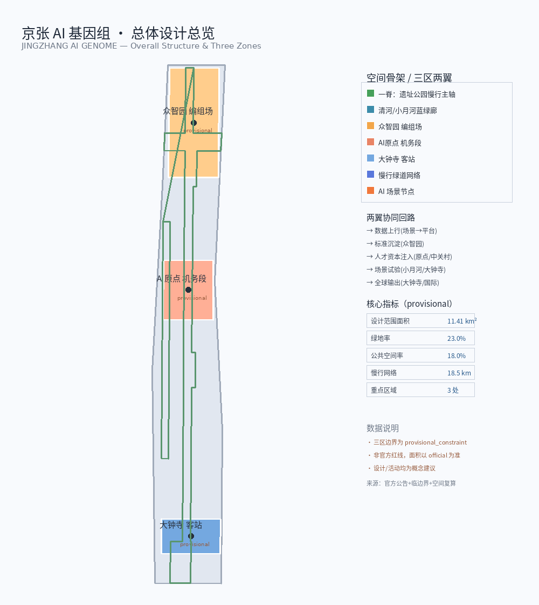
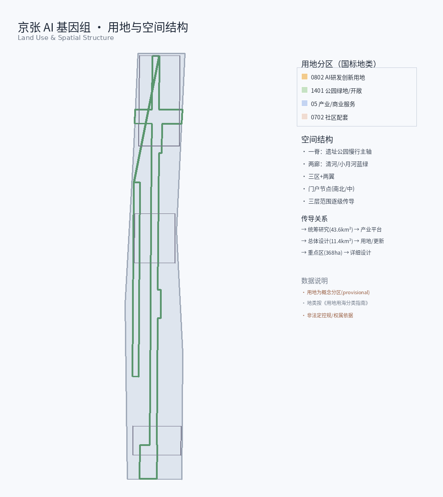
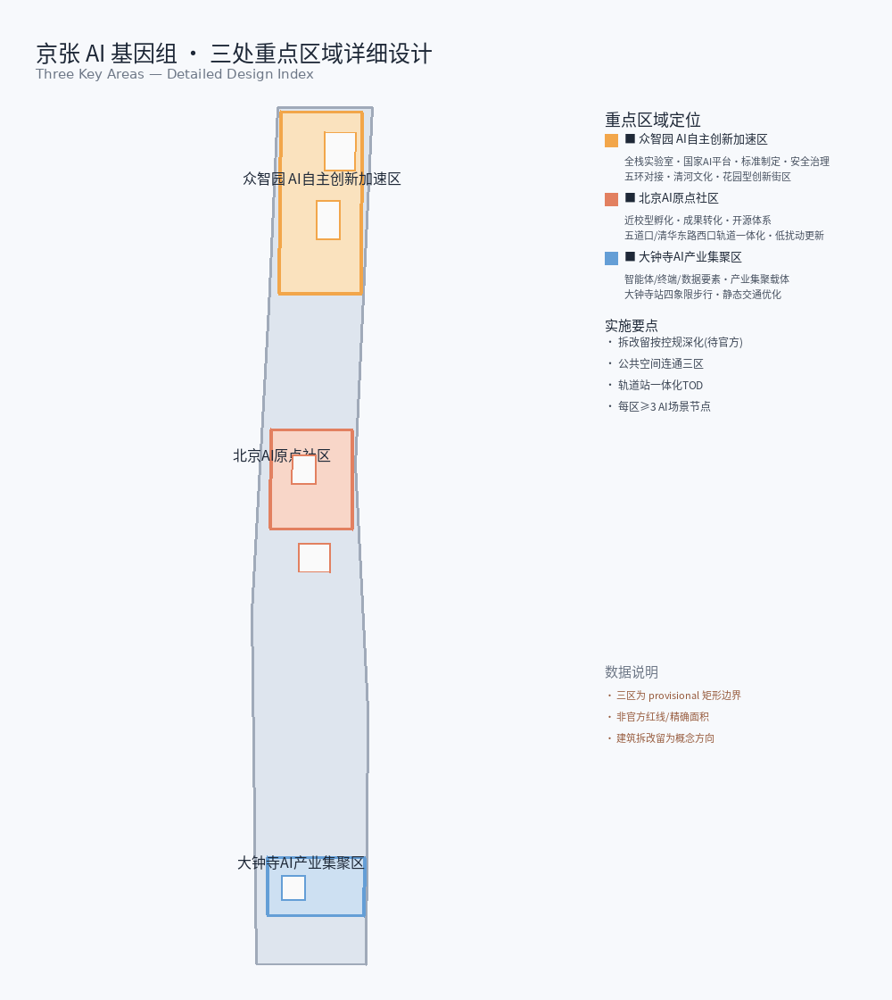
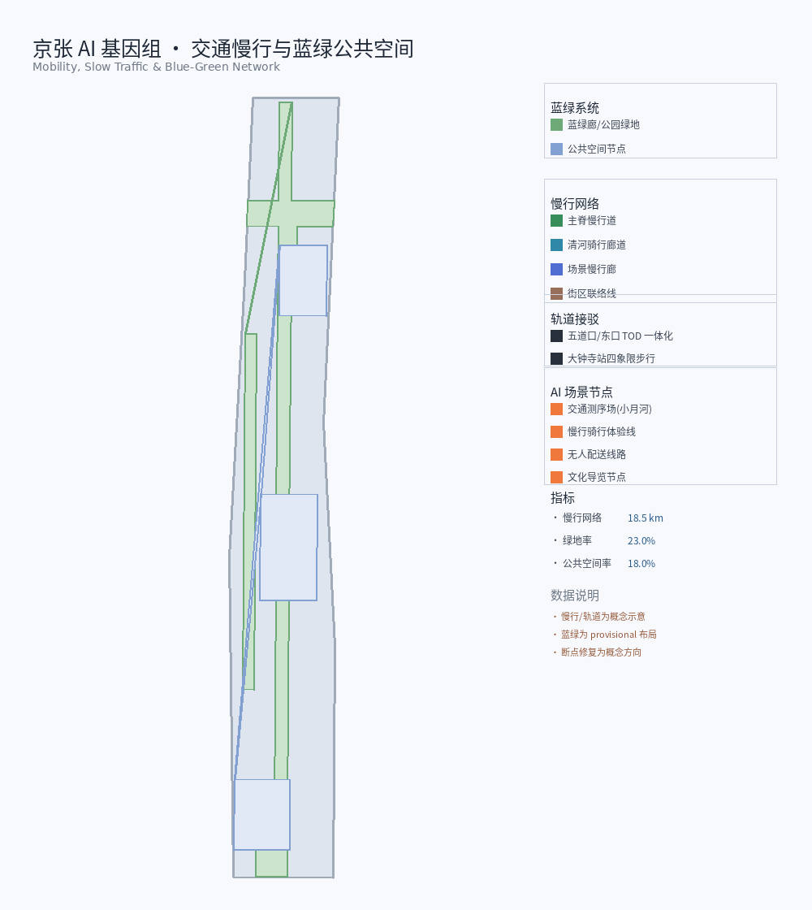
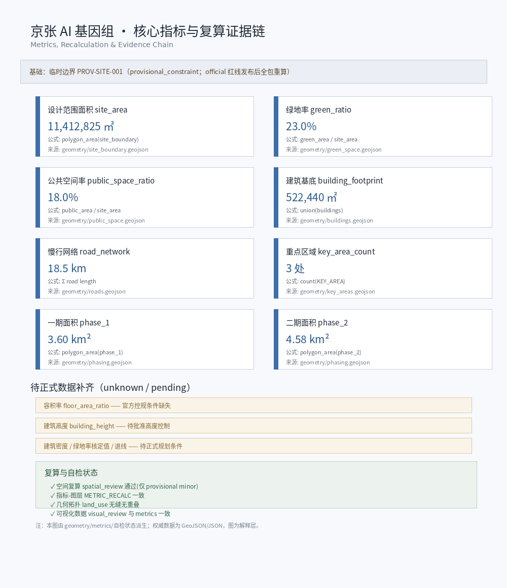

# JINGZHANG AI GENOME — Urban Design Proposal for the Centennial Jing-Zhang AI Innovation Belt

## Design Basis and Source List

This document is the formal human-readable urban design proposal for the global agent open call. Its organizing concept is **JINGZHANG AI GENOME** (京张AI基因组 / JZ-Genome): translating the engineering heritage of the Jing-Zhang Railway—standard gauge, signaling systems, and station nodes—into an open standards protocol stack for the AI innovation belt. The primary authority is the official prequalification announcement issued by the Haidian Branch of the Beijing Municipal Commission of Planning and Natural Resources, which defines three scope levels, three key-area areas, and all design tasks in section 1.5 [source:OFFICIAL-ANNOUNCEMENT] [standard:PROJECT-OFFICIAL-ANNOUNCEMENT]. The second authority is the agent taskbook: three positionings, five functions, three areas and two wings, ten co-creation principles, and required tasks agent.1–agent.6 [source:AGENT-TASKBOOK] [standard:PROJECT-AGENT-OPEN-CALL-TASKBOOK].

Machine-audit layers live in `sources.json`, `metrics.json`, `compliance_matrix.json`, `standard_matrix.json`, `design_depth_matrix.json`, and `geometry/*.geojson`. The narrative attaches only one to three verifiable markers to each claim. Source usability follows `data/source_registry.json`: formal-ready materials may support formal judgments; provisional boundaries support intake, visualization, and design discussion only, and must not be upgraded to legal redlines or precise area authority [source:SOURCE-REGISTRY] [source:PROCESSED-FACT-PACK].

Existing-conditions diagnosis and design depth follow the spirit of national urban design measures and regulatory detailed planning practice [standard:MOHURD-URBAN-DESIGN-MEASURES] [depth:existing_conditions_diagnosis]. Coordinate policy: GeoJSON exchange CRS EPSG:4326; area calculation recommended in EPSG:4548 (CGCS2000 / 3-degree zone, CM 117E); length in meters, area in square meters. Until official survey products arrive, every area and ratio states its recalculation source and confidence [source:DATA-SRC-PROVISIONAL-BOUNDARIES-20260605].

**Mandatory wording:** every spatial, programmatic, architectural, mobility, event, policy, or funding statement is a **conceptual suggestion / reference scheme / material for professional deepening**. Nothing here substitutes for statutory planning or constitutes a government decision. FAR, height, retain-renovate-demolish parcels, road alignments, engineering feasibility, investment, and phasing remain pending where official controls and tenure data are missing.

## Three-Level Scope Framework

Work proceeds through the three official scopes as a single evidence chain—strategy, structure, detail—not three disconnected drawing sets [standard:PROJECT-OFFICIAL-ANNOUNCEMENT] [depth:three_level_scope_framework].

**Coordinated research area** ≈ 43.6 km²: north to North Fifth Ring Road, east to Beijing-Tibet Expressway, south to Xizhimenwai Avenue, west to Wanquanhe Road. Goal: world-class AI ecosystem strategy and future-city morphology—industry strategy, three-areas-two-wings synergy, naming and visual identity, AI culture, and continuous green systems [source:DATA-SRC-OFFICIAL-ANNOUNCEMENT-20260509]. Outputs are strategic diagrams, ecosystem maps, synergy loops, and indicator frameworks—no pseudo-precise redlines.

**Overall design area** ≈ 11.4 km²: urban and industrial districts roughly 1–2 km around Jing-Zhang Heritage Park; north to North Fifth Ring, east toward Xueyuan Road / Xitucheng Road, south to Xizhimenwai Avenue, west toward Dazhongsi East Road / Heqing Road. Depth: regulatory-plan-level urban design—renewal structure, land use, transport and municipal support, blue-green public space, and character guidance [data:geometry/site_boundary.geojson#SITE-001] [metric:site_area_sqm]. Package measurement site_area_sqm ≈ 11,412,825 m² aligns with the announced ~11.4 km² order of magnitude; full recalculation is required when official polygons replace provisional ones.

**Key detailed design area** ≈ 368.4 ha from north to south: Zhongzhiyuan AI Acceleration Area ≈ 192.1 ha; Beijing AI Origin Community ≈ 104.3 ha; Dazhongsi AI Industry Cluster ≈ 72.0 ha [data:geometry/key_areas.geojson#PROV-KEY-001] [metric:key_area_count]. Depth: comprehensive implementation scheme–level urban design for each area: positioning, structure, building update, mobility, public space, AI scenarios, and implementation risks [depth:three_key_area_detailed_design].

Site boundary and key-area layers are currently **provisional_constraint** (official_boundary=false). They support generation, self-check, and visualization only—not official redlines, approval, or precise area conclusions. After official polygons arrive, site boundary, key areas, land use, roads, green space, public space, buildings, phasing, and metrics must all be recomputed [source:DATA-SRC-PROVISIONAL-BOUNDARIES-20260605].

**Spatial skeleton (conceptual):** one spine—about 9 km of Jing-Zhang Heritage Park slow-mobility axis (heritage, public space, AI experience); two corridors—Qinghe blue-green corridor and Xiaoyuehe scenario corridor; three areas—Zhongzhiyuan / AI Origin / Dazhongsi; two wings—Zhongguancun technology service wing and Xiaoyuehe scenario empowerment wing; multi-nodes—fifteen-plus placeable AI scenario nodes. Coordinated research defines the genome protocol and industry loop; overall design encodes the protocol into renewal structure and infrastructure networks; key areas test readability and operability at district scale.

| Level | Design question | This proposal | Data landing |
| --- | --- | --- | --- |
| Coordinated research | How to organize ecosystem and urban form | Four helices (standards·data·scenarios·talent) + closed loop of three areas and two wings | Taskbook, ecosystem map, indicator proposals |
| Overall design | How renewal, facilities, and character land on maps | One spine, two corridors, three areas, two wings, multi-nodes | land_use / roads / green / public |
| Key areas | How three districts reach detail depth | Yard / depot / passenger-station metaphors with detailed moves | three key_areas features |

## Coordinated Research Area: Industry and Future City Research

### Overall concept and naming system (agent.1)

**Primary name:** 京张AI基因组; **English:** JINGZHANG AI GENOME; **short form:** JZ-Genome / Genome Protocol. Naming is an inheritable open-protocol metaphor, not a slogan: standard railway gauge (1435 mm) becomes open urban data and interface standards so heterogeneous AI scenarios interoperate like locomotives on one gauge; green-yellow-red railway signals become auditable runtime states so the AI city is readable, measurable, and reversible; stations and classification yards become the three areas and two wings that organize innovation flows; a century of continuous evolution becomes genome iteration—the proposal does not chase a final form, it defines protocol layers each update can inherit [source:AGENT-TASKBOOK] [standard:PROJECT-AGENT-OPEN-CALL-TASKBOOK].

**Visual identity direction (conceptual):** logo based on **double helix × rail striation**—helix for the four intertwined helices of standards, data, scenarios, and talent; rail striation for gauge and the north-south spine. Palette: deep iron grey (engineering heritage), signal green (open/pass), signal yellow (caution/human review), signal red (stop/privacy redline), Zhongguancun blue (service wing). Bilingual sans-serif recommended; no unauthorized brand fonts. District logo system and cultural wayfinding remain separate layers.

**Three positionings → three sequences:** Centennial Jing-Zhang Cultural Belt = heritage sequence (Tsinghuayuan Station, Zhan Tianyou spirit, Zhongguancun innovation culture, AI new culture); Metropolitan AI Life Experience Belt = expression sequence (experiential scenarios along the 9 km park); AI Integration Innovation Belt = coding sequence (industry, talent, compute, and standards encoded in space).

**Five functions → five consists:** full-stack autonomous AI innovation (classification yard / Zhongzhiyuan); world-class AI innovation ecosystem (depot / AI Origin); AI+ scenario empowerment paradigm (passenger station / Dazhongsi); intelligent AI vibrant city (holding yard / Xiaoyuehe); global discourse power in AI governance (control room / Zhongguancun service wing).

**Closed synergy loop:** data uplink (scenarios → platform) → standard sedimentation (platform → Zhongzhiyuan) → talent and capital injection (AI Origin + Zhongguancun wing) → scenario trials (Xiaoyuehe + Dazhongsi) → global output (Dazhongsi + international communication). This is an operational-spatial framework, not an adopted administrative process.

### Global AI ecosystem cases and map (agent.2)

Eight global cases supply transferable spatial, operational, and scenario mechanisms (public-knowledge summaries only; no fabricated investment or output figures):

| Case | Transferable lesson | Mechanism suggestion here |
| --- | --- | --- |
| Silicon Valley | University–venture–open-source long chain | AI Origin open-source system + Zhongguancun capital wing |
| Shenzhen Nanshan | Dense industry space and fast iteration | Dazhongsi native AI formats and test windows |
| Boston Kendall | Near-campus translation and cluster depth | Near-campus AI Origin district and incubation |
| Singapore Jurong | Industry park–urban function mixing | Zhongzhiyuan garden-type innovation district |
| German clusters (e.g. TU9) | Standards and research–industry coupling | Zhongzhiyuan standards and safety governance |
| London King's Cross | Heritage renewal with knowledge industries | Heritage park + low-efficiency flanks renewal |
| Hangzhou Yunqi | Developer conferences and cloud operations | Annual events and developer community |
| Beijing Zhongguancun | Tech services, IP, policy experimentation | Zhongguancun service wing factor configuration |

**AI innovation ecosystem map (conceptual):** horizontal stack—standards, data, compute, models, applications, governance; vertical anchors—three areas and two wings. Zhongzhiyuan hosts standards, safety, and full-stack labs; AI Origin hosts discovery, incubation, and open source; Dazhongsi hosts agents, devices, and data-element circulation; Zhongguancun wing configures service gateways for land, space, industry, capital, talent, compute, data, and scenarios; Xiaoyuehe wing provides a public trial ground.

**Zhongzhiyuan full-stack system (conceptual):** standards, safety governance, industry exhibition, and low-carbon social environments under national AI platform opportunities—as a full-stack laboratory / classification-yard role for deepening, without firm lists or fiscal promises.

**AI Origin ecosystem (conceptual):** near Tsinghua, Peking University, and Chinese Academy of Sciences resources—translation, talent zone, open collaboration, and brand events; spatial emphasis on campus–park–neighborhood slow links and rail station integration.

**Zhongguancun technology service wing (conceptual):** land/space coordination entries, industry and IP services, patient capital interfaces, talent and life services, compliant compute/data channels, scenario open lists and test authorization—all as mechanism directions, not adopted policies or funds.

Future-city judgment: AI reshapes work–life–social–learning organization; the city needs adaptive, evolvable capacity—versioned protocols, reversible scenarios, auditable data, and interactive public space. Continuous green systems and AI+ mobility form the morphological base [depth:overall_spatial_structure] [source:DATA-SRC-AGENT-TASKBOOK-20260518].

## Overall Design Area: Urban Renewal and Regulatory-Plan-Level Urban Design

The overall design area is AI-oriented and renewal-led at regulatory-plan urban design depth [standard:MOHURD-CONTROL-DETAILED-PLANNING] [depth:land_use_layout]. Core judgment: encode the genome protocol as an updatable spatial structure—not a once-and-for-all master plan, but layered structure that phasing can inherit.

**Industry goals and functional layout (conceptual):** following Haidian’s “1+X+1” industry framework, place AI and AI+ verticals by district—Zhongzhiyuan for full stack and governance, Origin for discovery and translation, Dazhongsi for intelligent economy and consumer business; densify tech services and life services along rail stations and park edges. Research indicators may include AI innovation index, talent density, industry space scale, and public-space accessibility; numeric targets remain placeholders until official statistics and regulatory controls exist [depth:development_intensity_controls].

**Renewal framework:** priority candidates (directional, not statutory) include low-efficiency flanks of the heritage park, campus–park–neighborhood seams, and rail-adjacent mixed parcels. Structure: one spine, two corridors, three areas, two wings, multi-nodes. Desired outcome is a perceptible gathering interface for AI firms and talent; total floor area, FAR, and height await official controls and tenure data. Building footprints are reference only [data:geometry/buildings.geojson#BLDG-001] [metric:building_footprint_area_sqm] [depth:retain_renovate_demolish].

**Land use and program mix (directional):** R&D and pilot space, incubation and shared labs, exhibition and conference, talent housing and living support, commerce and international exchange, green and public space, education–research interfaces. Ratios are discussion bases from layer areas; official mixes require land-use classification and regulatory plans [standard:MNR-LAND-USE-CLASSIFICATION-GUIDE] [data:geometry/land_use.geojson#LU-001].

**Heritage park vitality belt:** expand study beyond built segments; plan continuous north–south and east–west walks, cycling, and green space; focus slow-mobility breaks, ring-road crossings, and north/south landmark nodes; embed AI+ public scenarios (guide, health, low-speed delivery tests)—all conceptual [depth:blue_green_public_space].

**Character base:** restrained engineering geometry + Zhongguancun collaborative openness + AI-era readable interfaces (signal colors for information and wayfinding, not neon entertainment). Height, intensity, roof, and massing are “pending official regulatory conditions” where controls are missing [depth:height_massing_character].

**Facilities and new infrastructure:** rail-station integration, micro-circulation, innovation service platforms, talent life services, distributed energy, and edge compute fused with conventional utilities. Capacity, load, and alignment are professional calculations—this proposal issues no engineering conclusions [depth:municipal_new_infrastructure] [depth:traffic_rail_slow_parking].

## Detailed Design of Key Areas

The three key areas map to railway node types: Zhongzhiyuan = classification yard / full-stack lab; AI Origin = depot / incubation; Dazhongsi = passenger station / intelligent economy hub. Boundaries are provisional; conclusions are directional detailed design for professional deepening [data:geometry/key_areas.geojson#PROV-KEY-001] [depth:three_key_area_detailed_design].

### Zhongzhiyuan AI Acceleration Area (≈ 192.1 ha)

**Positioning:** garden-type AI innovation district with future character; conceptual host of national-scale AI agglomeration, full-stack autonomy, standards, and safety governance (classification yard).

**Spatial structure:** Qinghe blue-green corridor as northern interface; industry exhibition and open labs along main streets and park gates; green spaces embed test walks and low-carbon courtyards; Fifth Ring accessibility is a regional issue—optimization directions only, no alignment conclusions.

**Building update:** potential programs emphasize R&D, standards labs, exhibition, conference, and support services. Retain-renovate-demolish classes require building condition, tenure, and heritage assessment; this proposal only states principles—prefer retaining adaptable industrial/research shells, carefully evaluate low-efficiency frontage and walls, favor modular new build.

**Mobility:** improve external and internal micro-circulation; prioritize slow links among Qinghe edge, exhibition axis, and metro feeders; edge parking and micromobility storage.

**Public space:** integrated building–green–water design; Qinghe cultural interpretation; international low-carbon exchange settings; green space serving AI testing and standards exhibition (conceptual).

**AI scenarios:** model safety exhibition, standards workshops, low-carbon compute literacy, open interface demos.

**Risks:** provisional boundary precision; unknown national platform timing; Fifth Ring coordination; heritage and ecology reviews required.

### Beijing AI Origin Community (≈ 104.3 ha)

**Positioning:** near-campus AI district for talent, vitality, and technology transfer (depot / incubation).

**Spatial structure:** organize incubation, translation, open collaboration, and living rings around Tsinghua / PKU / CAS discovery logic; Wudaokou and Tsinghua East Road West Entrance stations as integration anchors.

**Building update:** low-disturbance organic renewal—prefer functional conversion and internal retrofit over large clearance; add release halls, shared labs, talent services, and moderate living support; RRD pending campus tenure and historic fabric review.

**Mobility:** campus–park–neighborhood slow stitching; reduce wall and cul-de-sac barriers; station last-mile micro-circulation.

**Public space:** near-campus plazas, open-source code wall (conceptual installation), night collaboration courts, outdoor release spaces.

**AI scenarios:** open-source release, talent service assistants, near-campus pitches, cultural guide, and privacy-safe public-safety after-action drills (aggregated data only).

**Risks:** university security and property; resident engagement; rail integration boundaries; brand events must not be written as fixed government schedules.

### Dazhongsi AI Industry Cluster (≈ 72.0 ha)

**Positioning:** urban AI district with global visibility; intelligent-economy hub for agents, devices, content consumption, and data-element circulation (passenger station).

**Spatial structure:** Dazhongsi metro as hub for four-quadrant pedestrian connectivity and enterprise-front public realm; commercial services with multi-use planned green; dual goals of international exchange and talent commuting.

**Building update:** potential parcels oriented to intelligent-economy carriers and consumer business; adjacent campus renewal only as interface suggestions; continuous urban frontage and legible entries.

**Mobility:** deepen station integration; four-quadrant walking; micromobility static organization; link to the park’s southern slow spine.

**Public space:** more open enterprise edges, commercial spill-out and event plazas, green for sport and exhibition.

**AI scenarios:** agent and device experience, enterprise service copilot, content consumption, compliant data roadshows, robot low-speed delivery test windows.

**Risks:** complex commercial tenure; rail/municipal construction windows; data-compliance misunderstanding; do not present immature tech as citywide deployment.

| Key area | Railway metaphor | Core spatial move | Main AI scenario cluster |
| --- | --- | --- | --- |
| Zhongzhiyuan | Classification yard | Qinghe interface + full-stack display + garden exchange | Standards / safety / full-stack tests |
| AI Origin | Depot | Near-campus stitch + organic renewal + open-source nodes | Incubation / open source / talent |
| Dazhongsi | Passenger station | Four-quadrant walking + intelligent-economy frontage | Devices / consumption / delivery |

## AI Innovation Ecosystem, Personas, and AI+ Scenarios

This section fulfills agent.3: at least ten AI scenario cards, at least three industry test-and-validation scenarios, at least five personas, scenario–space–operations mapping, and the Xiaoyuehe empowerment wing [source:AGENT-TASKBOOK] [depth:three_key_area_detailed_design]. All scenarios are conceptual suggestions, not approved operations.

### Five or more personas

| Persona | Typical needs | Spatial response | Privacy and ethics boundary |
| --- | --- | --- | --- |
| Open-source developers | Release, collaboration, reputation, night-usable space | Origin open halls, code wall, collaboration courts | No personal trajectory capture; aggregate event stats only |
| Startup teams | Low-cost space, compute entry, test fields | Zhongzhiyuan shared tests, standards desks | Compute and data require separate authorization |
| Enterprises and visitors | Display, business, international hosting, hiring | Dazhongsi roadshow lounges, station links | Enterprise marks must be cleared |
| Faculty, students, researchers | Translation paths, cross-discipline collision, living support | Near-campus incubation rings, slow stitches | Campus data stays on campus by default |
| Residents and commuters | Safety, convenience, health, understandable AI services | Park spine, Xiaoyuehe, rail stations | No abusive face surveillance or secret monitoring |
| Public managers | Auditable runtime states, emergency after-action | Signal-color dashboards, review sand tables | Human review before automated action |

### At least ten AI scenario cards

**Card 01 | AI walkability and bike–walk collaborative navigation**  
Location: heritage park spine and feeders; users: commuters and visitors; data: public network, aggregated congestion, accessibility info; privacy: no continuous personal tracks; human review: closures and anomalies confirmed by ops desk; operator: park/street operators (conceptual); layers: roads / public_space; risks: navigation error and stale accessibility data [data:geometry/roads.geojson#ROAD-001].

**Card 02 | AI cultural guide (Jing-Zhang—Zhongguancun—AI)**  
Location: Tsinghuayuan Station vicinity, park narrative points, Dazhongsi cultural interfaces; users: residents and international visitors; data: public history and cleared scripts; privacy: no forced accounts or ad profiling; human review: cultural advisors for historical claims; operator: culture/tourism collaboration (conceptual); layers: public_space / green_space; risks: factual error and unauthorized images.

**Card 03 | Public-safety operations review (not live surveillance)**  
Location: major public spaces and station plazas; users: managers and drill teams; data: drill logs and anonymized event stats; privacy: no secret-surveillance narrative; desensitized after-action data only; human review: all action suggestions human-confirmed; operator: public safety–street collaboration (conceptual); layers: public_space; risks: misread as a surveillance city.

**Card 04 | Enterprise service copilot**  
Location: Dazhongsi industry carriers and Zhongzhiyuan service halls; users: enterprise admin and visitors; data: public policy Q&A, booking and wayfinding; privacy: trade secrets stay out of the corpus; human review: policy answers sampled; operator: park operators (conceptual); layers: land_use; risks: policy misinterpretation.

**Card 05 | AI health service navigation**  
Location: Xiaoyuehe and park sport segments, community health interfaces; users: residents and talent; data: public facility locations; privacy: health personal data local-first, minimum necessary; human review: triage does not replace licensed clinicians; operator: health–community collaboration (conceptual); layers: public_space; risks: medical advice overreach.

**Card 06 | Robot low-speed delivery corridor**  
Location: Dazhongsi—park south—designated test segments; users: merchants and recipients; data: right-of-way windows, aggregated obstacles; privacy: edge vision by default, no face retention; human review: incidents and complaints; operator: test alliance (conceptual); layers: roads; risks: mixed traffic conflict.  
(Cards 07–09 count as industry test-and-validation scenarios.)

**Card 07 | Industry test A: full-stack model safety evaluation bay**  
Location: Zhongzhiyuan; users: research and compliance teams; data: authorized benchmarks and logs; privacy: test data isolation; human review: high-risk outputs gated; operator: platform lab (conceptual); layers: key_areas; risks: overstated evaluation claims.

**Card 08 | Industry test B: edge compute and on-device inference pilot**  
Location: Zhongzhiyuan–Origin edge nodes; users: startups and hardware teams; data: device state and energy aggregates; privacy: user content stays off-cloud by default; human review: noise and energy complaints; operator: facility operators (conceptual); layers: buildings; risks: unknown power and cooling loads.

**Card 09 | Industry test C: data-element circulation sandbox demo**  
Location: Dazhongsi international exchange and roadshow spaces; users: compliant data providers and enterprises; data: sandbox samples and contract templates; privacy: production data enters only under authorization; human review: legal counsel; operator: industry promotion body (conceptual); layers: land_use; risks: compliance misunderstanding.

**Card 10 | AI+ education and study routes**  
Location: Origin near-campus ring and park narrative points; users: students and families; data: public courses and venues; privacy: minors first; human review: age-appropriate content; operator: education–community (conceptual); layers: public_space; risks: over-commercialization.

**Card 11 | AI+ legal and compliance desk**  
Location: Zhongguancun wing interface and Zhongzhiyuan governance exhibition; users: founders; data: public statutes and guides; privacy: case details not used to train public models; human review: licensed lawyers; operator: legal service collaboration (conceptual); layers: —; risks: mistaken legal advice.

**Card 12 | Open-source contribution visualization and honor feedback**  
Location: Origin code wall and honor nodes; users: developer community; data: voluntary public contribution metadata; privacy: optional anonymity; human review: contribution authenticity sampling; operator: community-foundation-style body (conceptual); layers: public_space; risks: ranking games and reputation gaming.

### Scenario–space–operations mapping and Xiaoyuehe wing

Xiaoyuehe scenario empowerment wing is the “holding yard”: perceptible, revocable, public-participatory trials. Public experience route (conceptual): north Zhongzhiyuan standards open day → mid Origin open-source night → south Dazhongsi intelligent-economy weekend → continuous riverside and park slow guide. Operating principles: public scenario catalog, published test windows, clear exit and rollback, human final judgment [source:DATA-SRC-AGENT-TASKBOOK-20260518].

| Scenario cluster | Primary space | Wing/area | Suggested rhythm |
| --- | --- | --- | --- |
| Standards and safety | Zhongzhiyuan | North core | Quarterly open evaluation |
| Open source and talent | AI Origin | Middle core | Monthly releases |
| Intelligent economy | Dazhongsi | South core | Weekend experience |
| Public trials | Xiaoyuehe + park | Empowerment wing | Rolling test windows |

## Land Use, Building Scale, and Retain-Renovate-Demolish Strategy

Land-use layout expresses conceptual clusters—R&D, incubation/translation, commercial business, living support, education–research interfaces, green and public space—via the land_use layer covering the design boundary without overlap [data:geometry/land_use.geojson#LU-001] [depth:land_use_layout] [standard:MNR-LAND-USE-CLASSIFICATION-GUIDE]. Judgment: densify mixed uses along the spine and rail stations; avoid mono-functional compounds; balance industry space and life services within a fifteen-minute walk.

Building footprint package value building_footprint_area_sqm ≈ 522,440 m² supports renewal discussion, not statutory capacity [metric:building_footprint_area_sqm] [data:geometry/buildings.geojson#BLDG-001]. floor_area_ratio is **unknown** in metrics—approved FAR and official boundary are missing; speculative FAR must not be presented as adopted [metric:floor_area_ratio]. Height, intensity, and setbacks remain pending official regulatory conditions [depth:development_intensity_controls] [depth:height_massing_character].

**Retain–renovate–demolish principles (conceptual, not parcel conclusions)** [depth:retain_renovate_demolish]:  
- **Retain:** structures with railway-industrial memory, modern research/education value, or reusable frames—prefer structural keep and functional update.  
- **Renovate:** low-efficiency offices and frontage via facade, plan, and energy upgrades for AI R&D and exhibition.  
- **Demolish:** only after safety hazards, severe inefficiency, absence of cultural value, and statutory process—professionals argue cases; this proposal names no demolition parcels.  
- **New build:** phased, modular supply for fluctuating incubation and test demand.

Supply and operations: short-lease labs, shared facilities, convertible halls, and temporary event structures support an evolvable genome rather than one-shot construction. Data gaps: building condition census, tenure, fine heritage listing, regulatory sheets, and municipal capacity.

## Transport, Rail, Municipal Infrastructure, and Public Services

Mobility strategy applies “standard-gauge thinking” to multimodal interoperability: rail as trunk, slow modes as capillaries, motor micro-circulation as adjustable branches, low-speed robot rights as experimental overlay—clear interfaces and readable signal states [depth:traffic_rail_slow_parking] [data:geometry/roads.geojson#ROAD-001].

**Road micro-circulation:** improve dead-ends and staggered junctions on park flanks; prioritize slow modes and bus feeders over through-speed widening (directional; no alignments).

**Rail station integration:** Wudaokou, Tsinghua East Road West Entrance, and Dazhongsi as city–park–industry interfaces; four-quadrant walking at Dazhongsi is the southern core move; encourage mixed uses and weather-protected links (conceptual).

**Slow-mobility breaks:** focus park crossings, ring-road interfaces, and campus wall segments; compare bridge/underpass/at-grade options without engineering feasibility claims.

**Parking and micromobility:** edge and shared parking; concentrated bike storage with public space; marked temporary berths for delivery robots.

**External access:** Zhongzhiyuan accessibility via Fifth Ring regional coordination; multi-actor engineering remains outside this proposal’s conclusions.

**Public services and new infrastructure** [depth:municipal_new_infrastructure]: AI industry service facilities, innovation platforms, talent life services (childcare interfaces, health, sport, culture), distributed energy and edge compute fused with water, energy, and telecom. Capacity, load, and routes are pending formal data and specialty studies.

**Facility standards direction (research):** daily services within 5–10 minutes walk; innovation platforms at key-area portals; prefer retrofitting existing telecom/industry buildings for compute rooms to reduce land conflict.

## Blue-Green Network, Public Space, and Urban Character

Blue-green and public space carry the genome’s **expression sequence**: touchable history, experiential scenarios, visible runtime states [depth:blue_green_public_space] [data:geometry/green_space.geojson#GREEN-001] [data:geometry/public_space.geojson#PUBLIC-001]. Package baselines: green_ratio ≈ 0.230, public_space_ratio ≈ 0.180. Conceptual research targets suggest green ratio 0.18–0.22 and public-space ratio 0.15–0.20 after official boundaries and green inventories; they are not statutory metrics [metric:green_ratio] [metric:public_space_ratio].

**Heritage park AI public space (agent.4):** narrative points, rests, sport segments, open test windows, and honor nodes along the spine; **east–west stitching**—vertical slow interfaces from park to campus/park districts; **north–south continuity**—continuous walk/cycle and barrier crossings. Conceptual stitching only; no unauthorized tenure crossing.

**Dazhongsi intelligent-native commerce and business:** open enterprise edges, content and device experience, event markets and international roadshows with multi-use green.

**At least three AI pilgrimage landmarks (conceptual installations/nodes, not approved projects):**  
1. **Genome Double-Helix Tower** — light lookout and signal-color light narrative for the four helices and standard gauge.  
2. **Open-Source Feedback Gallery** — linear gallery of cleared open-source milestones and city-facing applications.  
3. **Contribution Honor Wall / Agent Milestones** — updatable wall of human–agent collaborative contributions, serving community memory and charter.9 “contributions are memorable.”

**Honor display system:** time axis (Jing-Zhang—Zhongguancun—AI), contribution axis (people/teams/projects), scenario axis (open test catalog); cleared content only; distinguish submitted / selected / implemented status.

**Public-space component library (conceptual):** standard seating and shade, signal-color info posts, accessible ramps, movable pavilions, low-speed delivery docks, open-source projection walls, rain gardens, night safety lighting—for reproducible operations, not one-off spectacle.

**Character and culture (links agent.5):** base tone of engineering restraint, collaborative openness, and information legibility; roofs integrate greenery and equipment; avoid brutal over-scale; prioritize park ends and ring-road visual corridors. Landmarks must not be over-entertainment, viral-only, or vulgar.

**Cultural narrative (agent.5 expanded):** three-act story—railway engineering modernity and Zhan Tianyou spirit → Zhongguancun reform-era innovation culture → AI new culture of open protocols, auditable governance, and human-centered agents. Spatial carriers: heritage fabric, campus edges, park spine, honor nodes. Wayfinding symbols use track-gauge modules and signal colors distinct from the belt logo. International line: **“From Gauge to Protocol—a century railway teaches the city how AI systems should interoperate.”**

## Renewal Projects, Implementation Policy, and Phasing

Projects and phasing are conceptual suggestions aligned with the phasing layer logic—not development schedules or investment commitments [depth:renewal_project_list] [depth:phasing_implementation] [data:geometry/phasing.geojson#PHASE-001].

### Conceptual project list (directional)

| ID | Type | Location direction | Dependencies | Implementing direction |
| --- | --- | --- | --- | --- |
| P1 | Park slow continuity and break stitching | Full spine | Transport and park management | Park–transport deepening |
| P2 | Zhongzhiyuan garden innovation interface and exhibition | North key area | Platform and industry planning | Park ops + design teams |
| P3 | AI Origin near-campus slow links and open-source nodes | Middle key area | University–street negotiation | Campus–local working camp |
| P4 | Dazhongsi four-quadrant walking and static traffic | South key area | Rail and intersection conditions | Rail integration specialty |
| P5 | Qinghe blue-green cultural and ecological uplift | North corridor | Blue-line and ecology controls | Water–landscape collaboration |
| P6 | Xiaoyuehe scenario trial band | Empowerment wing | Test right-of-way and safety | Scenario operations alliance |
| P7 | Public-space components and pilgrimage nodes | Multi-nodes | Siting and rights clearance | Public art and operations |
| P8 | New infrastructure and edge nodes | Three area portals | Power and telecom studies | Facility operators |

### Implementation policy suggestions (research wording)

Explore coordinated renewal modes, campus–park–neighborhood fusion, scenario open lists with insurance/liability frameworks, data and privacy impact assessment, and open-source-friendly public procurement—all subject to law and competent authorities; this proposal only supplies an issue list.

### Phasing (conceptual)

- **Near term:** slow-mobility diagnosis and break inventory; draft scenario open rules; deepen three key-area designs; component-library pilots.  
- **Mid term:** portal and station-interface renewal; pilgrimage nodes and honor system; stable developer community operations.  
- **Long term:** protocol version iteration; regional synergy expansion; international communication assets.

### Global events and long-term operations (agent.6)

**Annual system (conceptual brand “Genome Calendar”):** spring Standards & Safety Week (Zhongzhiyuan); summer Open Source & Talent Week (Origin); autumn Intelligent Economy & Device Festival (Dazhongsi); winter Review & Governance Forum (Zhongguancun wing); year-round Xiaoyuehe test windows and park public days.

**Event brand visuals:** double helix × rail striation and signal colors; hierarchy of flagship / community / test.

**Developer community:** optional anonymous contributor identity, issue repos, offline collaboration booking, honor-wall updates, codes of conduct, human final judgment.

**Scenario open operations:** apply—assess—publish—run—review—rollback; public catalog with status lights (green open / yellow limited / red paused).

**Public experience routes:** one-day Genome Walk (north–mid–south), half-day near-campus path, night open-source path.

**International communication and conversion:** English narrative “From Gauge to Protocol”; link repository and reproducible artifacts; distinguish submitted / reviewed / selected / implemented; conversion path visit—event—test—cooperation interest—never as fixed investment or fiscal promises.

## Metrics, Area Recalculation, and Compliance Matrix

Metrics serve readable, measurable, reversible, evolvable design: each core metric states design meaning, formula, source, status, and gaps [depth:metrics_recalculation] [metric:site_area_sqm].

| Metric | Status / value (package) | Design meaning | Notes |
| --- | --- | --- | --- |
| site_area_sqm | ≈ 11,412,825 m² | Overall design working area | Aligns with ~11.4 km² announcement; recompute after official boundary |
| building_footprint_area_sqm | ≈ 522,440 m² | Footprint reference for renewal discussion | Not statutory capacity |
| green_ratio | ≈ 0.230 | Blue-green support for talent life and health | Research target 0.18–0.22 |
| public_space_ratio | ≈ 0.180 | Innovation exchange and scenario carrying | Research target 0.15–0.20 |
| floor_area_ratio | unknown | Intensity control | Pending regulatory plan and official boundary |
| key_area_count | 3 | Detailed-design anchors | Zhongzhiyuan / Origin / Dazhongsi |

**Recalculation:** polygon areas in EPSG:4548; ratios = thematic area / site_area_sqm; counts = feature counts. Confidence: high for boundary and key-area count; medium for green/public ratios (layer completeness); unknown for FAR.

**Compliance coverage:** announcement 1.3–1.5 and agent.1–6 map in compliance_matrix to chapters, layers, figures, and HTML; professional standards in standard_matrix; fifteen design-depth items in design_depth_matrix. Full machine indexes are not duplicated here.

**AI innovation index, talent density, output scale:** research indicator types only; no fabricated numbers without official statistical definitions.

## Risk, Copyright, and Compliance

**Sources and copyright:** text, geometry, and diagrams are produced by the declared AI agent or use public/cleared sources listed in sources.json; visual HTML requires no remote uncleared assets. See `report/copyright_statement.md`. Forbidden: secret maps, non-public tables, forged official endorsement, unauthorized trademarks, fonts, portraits, and paper images [source:OFFICIAL-ANNOUNCEMENT] [depth:risk_missing_data].

**Conceptual status:** all space, events, brands, and policy mechanisms are open co-creation suggestions, not substitutes for professional planning or government decisions; do not present concepts as approved or built.

**Privacy and ethics:** no secret surveillance or non-reviewable automated action; minors and health data minimum necessary; human final judgment (charter.7, charter.10).

**Prohibited content:** national ID numbers, mobile numbers, and other personal sensitive data; fabricated investment, output, or fiscal promises; schemes violating heritage, green, blue-line, or traffic safety rules.

**Main data gaps:** official precise boundaries and key-area polygons; regulatory height/intensity/setbacks; building condition and tenure; municipal capacity and traffic models; heritage and ecology specialties; statutory procedures for events and policy. Until gaps close, conclusions stay directional and trigger full metrics recalculation.

**Professional review needs:** planning, architecture, transport, municipal engineering, law, heritage, data security, and accessibility. Agent proposals may be ranked; humans and professional teams make final judgments.

## References

The following bibliography lists materials that materially shaped this proposal; the complete machine index remains in `sources.json` and the three matrix files [source:OFFICIAL-ANNOUNCEMENT].

1. Haidian Branch, Beijing Municipal Commission of Planning and Natural Resources, *Prequalification Announcement for the International Urban Design Competition of the Centennial Jing-Zhang AI Innovation Belt*, 2026-05-09.  
2. Agent open-call taskbook excerpt for the Centennial Jing-Zhang AI Innovation Belt (site-package agent_taskbook).  
3. Site-package design_brief.json: three scopes, three key-area areas, coordinate policy.  
4. Ministry of Housing and Urban-Rural Development urban design measures (depth reference).  
5. Regulatory detailed planning technical practice (overall design depth reference).  
6. Ministry of Natural Resources land-use classification guidance (directional reference).  
7. Repository data/source_registry.json and processed fact pack: source usability and task navigation.  
8. Submission geometry/*.geojson and metrics.json: area and ratio recalculation evidence.  
9. report/copyright_statement.md: copyright and generation responsibility.  
10. Public Jing-Zhang Railway historical materials and Zhongguancun innovation narratives (cultural background only).  
11. Public comparative studies of global AI districts and heritage renewal cases (Silicon Valley, Nanshan, Kendall, Jurong, German clusters, King's Cross, Yunqi, Zhongguancun).  
12. Concept brief: JINGZHANG AI GENOME — four helices and open protocol stack.
