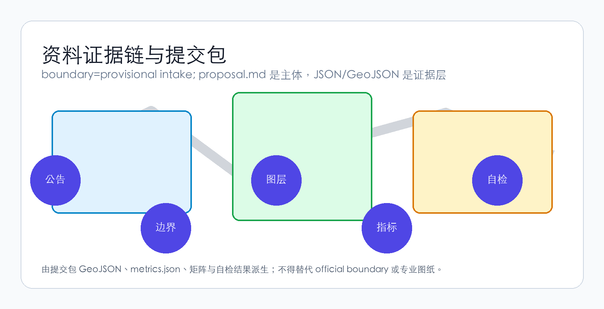

# Jing-Zhang Symbiotic StarBridge
## From Railway to Starway: Every Step Toward the Cosmos Through AI

> **"From the Jing-Zhang Railway to the Starway — Every Step Toward the Cosmos Through AI"**
>
> *「从京张铁路到星际轨道——AI让每一步都通向星辰」*

---

## 1. Overall Concept: Five Dimensions of a Bridge

### 1.1 Why "Symbiotic StarBridge"

In 1909, the Jing-Zhang Railway opened — the first railway independently designed and built by Chinese engineers. Zhan Tianyou's "herringbone" switchback conquered the steep gradient from Nankou to Badaling, and the railway became an enduring symbol of national self-reliance and cultural confidence.

One hundred and seventeen years later, along the same corridor, we propose a new narrative: **From the Jing-Zhang Railway to the Starway**.

This is not a metaphor, but a spatial-functional-cultural composite. This proposal establishes "Symbiotic StarBridge" (共生星桥) as the core concept for the Centennial Jing-Zhang AI Innovation Belt, constituted by five dimensions [source:OFFICIAL-ANNOUNCEMENT] [standard:PROJECT-OFFICIAL-ANNOUNCEMENT]:

| Dimension | Core Proposition | Spatial Translation |
|-----------|-----------------|---------------------|
| **Human-Centered** | AI's ultimate metric is human dignity, freedom, and well-being | 15-minute AI service circles, full accessibility coverage, intergenerational inclusive design, privacy-first urban sensing |
| **Interplanetary Civilization Dialogue** | Earth's first physical interface zone for interstellar communication | SETI data nodes, public radio observatory terrace, interstellar information sculpture park, annual Cross-Civilization Dialogue Forum |
| **AI Self-Evolution** | The city is a living, learning AI system | Urban sensing layer → AI continuously optimizes space usage → spatial morphology adapts to emerging needs |
| **AI Transportation** | Four-tier mobility + AI dynamic right-of-way allocation | Underground logistics tunnels, surface autonomous shuttles, low-altitude drone corridors, Jing-Zhang Super Greenway |
| **AI Services** | Ubiquitous, non-intrusive, always human-overridable | AI health stations, AI education pods, AI legal terminals, robot delivery lockers, AI Concierge multi-agent system |

These five dimensions are not parallel lists — they converge along the **Jing-Zhang Heritage Park as the main artery**, with the **three areas and two wings as functional anchors**, and the **herringbone-to-double-helix as the spatial DNA**, forming a complete design language from macro-narrative to micro-scenario, from philosophical proposition to engineering logic [depth:overall_spatial_structure].

### 1.2 Spatial DNA: From "Herringbone" to "Double Helix"

Zhan Tianyou's "herringbone" switchback is the soul of the Jing-Zhang Railway. This proposal elevates this DNA into a **double-helix spatial structure** [source:AGENT-TASKBOOK]:

- **AI Innovation Helix (West Wing → Northbound)**: Zhongzhi Evolution Park (full-stack autonomy) → Zhongguancun Compute Wing (computing/data/IP empowerment) → University Innovation Source Ring
- **Human Experience Helix (East Wing → Southbound)**: Origin Symbiosis Hub (human-AI co-living demonstration) → Xiaoyuehe Scenario Wing (scenario testing/public experience) → StarBridge Dialogue Port (AI-native commerce + interstellar dialogue node)

The two helices intertwine along the Jing-Zhang Heritage Park vitality belt, forming a **DNA-double-helix spatial topology**. This is not formalist play — each intersection of the two helices is a "human-AI interaction node": public space, AI service terminal, scenario testbed, cultural performance venue [data:geometry/public_space.geojson#PUBLIC-001].



### 1.3 Naming System and Brand Identity

| Tier | Chinese | English | Meaning |
|------|---------|---------|---------|
| Belt name | 京张·共生星桥 | Jing-Zhang Symbiotic StarBridge | "Symbiosis" = human-AI relationship; "StarBridge" = interplanetary dialogue |
| North Area | 众智·进化园 | Zhongzhi Evolution Park | AI self-evolution accelerator |
| Central Area | 原点·共生坊 | Origin Symbiosis Hub | Human-AI co-living demonstration district |
| South Area | 星桥·对话港 | StarBridge Dialogue Port | Physical-digital hybrid interface for interstellar communication |
| West Wing | 中关村·算力翼 | Zhongguancun Compute Wing | Global allocation hub for AI computing, data, and IP |
| East Wing | 小月河·场景翼 | Xiaoyuehe Scenario Wing | Open testing and public experience corridor for AI scenarios |

**Logo Direction** [depth:branding_logo_identity]: Abstract Jing-Zhang Railway's "herringbone" track into a double-helix foundation — the left helix arc represents AI (cool blue gradient), the right helix arc represents humanity (warm gold gradient), and the two lines converge upward into a five-pointed star antenna motif, signifying "the cosmos." Sans-serif typography with Chinese-English pairing preserves the industrial strength of railway heritage while adding digital-era transparency.

**Tagline System**:
- Primary (EN): "From Railway to Starway"
- Primary (ZH): "从京张铁路到星际轨道"
- Secondary (EN): "Every Step Toward the Cosmos Through AI"
- Secondary (ZH): "AI让每一步都通向星辰"

### 1.4 Three Positionings, Five Functions, and the Three-Areas-Two-Wings Synergy Loop

**Three Positionings** [source:AGENT-TASKBOOK] spatially translated in this proposal:

| Positioning | Spatial Carrier | Core Function |
|-------------|-----------------|---------------|
| Centennial Jing-Zhang Cultural Belt | Jing-Zhang Heritage Park Phases I & II, Qinghuayuan Station, Wudaokou Memory Plaza | Railway heritage conservation, innovation culture narrative, AI+culture performance |
| Urban AI Living Experience Belt | Origin Symbiosis Hub, Xiaoyuehe Scenario Wing, 15-min AI service circles | Tangible, perceptible, participatory AI daily life |
| AI Integration Innovation Belt | Zhongzhi Evolution Park, Zhongguancun Compute Wing, StarBridge Dialogue Port | Full-stack autonomy + industrial translation + international exchange |

**Five Functions** and their spatial realization:

1. **AI Full-Stack Autonomous Innovation System** → Zhongzhi Evolution Park: National AI platforms, chip-framework-model-application full-stack testbed, standards development and safety governance showcase
2. **World-Class AI Innovation Ecosystem** → Origin Symbiosis Hub + Zhongguancun Compute Wing: University-industry translation, open-source community, talent special zone, global factor allocation
3. **AI+ Scenario Empowerment New Paradigm** → Xiaoyuehe Scenario Wing: Ten open-testing scenarios spanning mobility, healthcare, education, legal, and living services
4. **Intelligent AI Vibrant City** → Territory-wide 15-minute AI service circles + double-helix mobility network: AI-assisted spatial optimization, public space thermal self-adaptation
5. **AI Governance Global Discourse Power** → StarBridge Dialogue Port: Interplanetary civilization dialogue, AI ethics international forum, standards mutual recognition mechanism

**Three-Areas-Two-Wings Synergy Loop** [depth:three_areas_two_wings_synergy]:

```
Zhongzhi Evolution Park (Technology Origin)
    ↓ computing / data / IP
Zhongguancun Compute Wing ← → Origin Symbiosis Hub (Incubation & Translation)
    ↓                              ↓
StarBridge Dialogue Port (Industrial Landing) ← → Xiaoyuehe Scenario Wing (Scenario Validation)
    ↓
Global AI Community (International Dissemination · Talent Circulation · Capital Recirculation)
    ↓ feedback to origin
Zhongzhi Evolution Park (Iterative Evolution)
```

---

## 2. AI Innovation Ecosystem: A Self-Evolving System

### 2.1 Global Case Studies: Learning and Transcending

This proposal references eight global AI/SciTech innovation cases while identifying their shared limitation — all are "static plans" that do not treat AI itself as a driver of spatial evolution [depth:case_study_table] [source:AGENT-TASKBOOK]:

| Case | Core Lesson | This Proposal's Transcendence |
|------|------------|-------------------------------|
| Stanford Research Park, Silicon Valley | Campus-industry proximity effect | Not just proximity, but "symbiosis" — AI continuously optimizes spatial matching |
| Kendall Square, Boston | Biotech + AI cross-domain innovation | Not just cross-domain, but "self-evolving" — space adapts to emerging needs |
| Nanshan District, Shenzhen | Vertical industrial chain integration + rapid iteration | Not just rapid, but "autonomous" — AI identifies underutilized space and proposes renewal |
| King's Cross, London | Heritage + tech + public space compound development | Not just compound, but "dialogue" — interplanetary civilization dimension in public space |
| one-north, Singapore | Government-led tech city scenario planning | Not just planning, but "emergence" — bottom-up AI scenario open testing |
| Shibuya Stream Hall, Tokyo | Transit-station + innovation commerce + public experience | Not just experience, but "service" — AI senses demand and auto-matches service supply |
| Silicon Allee, Berlin | Low-cost + cultural inclusion + open-source ecosystem | Not just inclusion, but "co-evolution" — AI and community adapt to each other |
| Digital Media City, Seoul | Media + AI + cultural production vertical integration | Not just production, but "evolution" — AI-assisted content creation and distribution |

### 2.2 AI Innovation Ecosystem Map

The AI innovation ecosystem in this proposal is a **living, evolvable network** [depth:ecosystem_map]:

```
┌─────────────────────────────────────────────────────┐
│                AI Innovation Ecosystem Map             │
│                                                         │
│  ┌─── Origin Layer ──────────────────────────────┐   │
│  │ Universities (Tsinghua/PKU/CAS) → National AI   │   │
│  │ Platforms → Open-Source Communities             │   │
│  └───────────────────────────────────────────────┘   │
│         ↓ tech flow                    ↓ talent flow    │
│  ┌─── Translation Layer ─────────────────────────┐   │
│  │ Zhongzhi Evolution Park (full-stack testing)    │   │
│  │ Origin Symbiosis Hub (incubation & translation) │   │
│  └───────────────────────────────────────────────┘   │
│         ↓ product flow                  ↓ capital flow  │
│  ┌─── Industry Layer ───────────────────────────┐   │
│  │ StarBridge Dialogue Port (industry showcase)   │   │
│  │ Global AI Community (market/dissemination)     │   │
│  └───────────────────────────────────────────────┘   │
│         ↓ data flow                     ↓ feedback flow │
│  ┌─── Governance Layer ─────────────────────────┐   │
│  │ Urban AI Agent (AI governance)                  │   │
│  │ Scenario Open Testing (Xiaoyuehe Wing)          │   │
│  └───────────────────────────────────────────────┘   │
│                                                         │
│  Core Mechanism: Land · Space · Industry · Capital ·    │
│  Talent · Computing · Data · Scenarios —                │
│  Eight elements matched in real-time by AI,             │
│  forming a self-optimizing resource allocation network  │
└─────────────────────────────────────────────────────┘
```

### 2.3 Zhongzhi Evolution Park — Physical Space for Full-Stack AI Autonomy

This area (~192.1 ha) is positioned as the **world's first AI self-evolution accelerator** [data:geometry/key_areas.geojson#PROV-KEY-001] [depth:zhongzhiyuan_acceleration_area].

Key spatial actions:
- **Full-Stack Test Corridor**: Along the Qinghe River interface, a chip-framework-model-application full-stack testing ground that transforms "laboratory" into "visitable productive landscape"
- **Safety Governance Sandbox**: Standards, red-teaming, safety evaluation — governance functions translated into bookable, auditable, publicly accessible demonstration nodes
- **Low-Carbon Computing Garden**: Data center waste-heat recovery and liquid cooling systems integrated with Qinghe waterfront landscape, creating a carbon-neutral "computing-as-park" demonstration
- **International AI Standards Mutual Recognition Center**: Hosts cross-jurisdictional AI governance standards mutual recognition conferences, testing reciprocity, and sandbox collaboration

Zhongzhi Park's uniqueness: **it is itself AI's "training environment"** — anonymized spatial usage data feeds back to the urban AI agent in real-time, the AI learns spatial usage patterns, autonomously proposes optimization recommendations, and implements adjustments after human review. This realizes "AI self-development and self-evolution" at the urban spatial scale for the first time [standard:MOHURD-URBAN-DESIGN-MEASURES].

### 2.4 Origin Symbiosis Hub — Human-AI Co-Living Demonstration District

This area (~104.3 ha) is the **most intimate experimental field for human-AI relations** [data:geometry/key_areas.geojson#PROV-KEY-002].

Key spatial actions:
- **Open-Source Community Launch Hall**: Global-developer-facing achievement releases, code contribution visualization, small-scale roadshow spaces — a 24-hour "knowledge workshop for the AI era"
- **Campus-Proximate Achievement Translation Street**: A one-stop corridor of incubation, exhibition, legal services, IP, and investment-financing along the campus-park boundary
- **Human-AI Symbiotic Living Experimental Zone**: Supported by the AI Concierge system, providing personalized yet non-intrusive living services without compromising privacy — with a physical "Disable AI" switch always present
- **15-Minute AI Service Circle Demonstration**: Within a 15-minute walk, AI health stations (health monitoring + telemedicine + emergency response), AI education pods (personalized learning + multilingual translation + intergenerational digital literacy), robot delivery lockers, AI legal consultation terminals

### 2.5 StarBridge Dialogue Port — Physical-Digital Hybrid Interface for Interplanetary Communication

This area (~72.0 ha) is the proposal's most original spatial proposition [data:geometry/key_areas.geojson#PROV-KEY-003].

Key spatial actions:
- **Interstellar Information Sculpture Park**: Interactive science-art installations around Dazhongsi Station that translate SETI data and radio astronomy observations into perceptible audiovisual experiences — not science fiction, but **science-based public education infrastructure**
- **Public Radio Observatory Terrace**: Small radio telescope arrays on commercial building rooftops, open for public booking — transforming interplanetary dialogue from an academic proposition into citizen-accessible scientific practice
- **Cross-Civilization Dialogue Forum Permanent Venue**: Hosts the annual "StarBridge Dialogue" international conference, bringing together astronomers, AI scientists, philosophers, artists, and the public
- **Dazhongsi Station Four-Quadrant Pedestrian Connectivity**: Station-area integrated design with "Transit + Interstellar" theming, transforming daily commuting into a ritualized experience of crossing the "StarBridge"

---

## 3. AI+ Scenarios: Ten Scenario Cards and Five Personas

### 3.1 User Personas

This proposal identifies five core user types, each with fundamentally different AI service needs [depth:persona_table] [source:AGENT-TASKBOOK]:

| Persona | Core Needs | AI's Role | Key Spatial Requirements | Privacy & Ethics Boundaries |
|---------|-----------|-----------|--------------------------|----------------------------|
| **Open-Source Developer** (age 25, solo or shared housing) | Code publishing, cross-timezone collaboration, tech socializing, continuous learning | AI as collaboration tool + knowledge navigator | 24h open spaces, high-speed internet, affordable dining, public code wall | Development behavior data not uploaded; Git history independent of urban AI |
| **AI Startup Team** (3-8 people, early-stage funding) | Low-cost office, computing access, product validation, investor matching | AI as resource-matching engine + test-user simulator | Shared labs, computing voucher service points, roadshow spaces | Product testing data isolated; user data not leaked |
| **Elderly Local Resident** (65+, children not nearby) | Health monitoring, social connection, digital divide bridging, not being abandoned by AI | AI as assistant not replacement — human service channels always preserved | Community AI health stations, intergenerational digital literacy classes, accessible paths | Health data locally stored + user-controlled sharing; physical AI-off switch |
| **International Visitor** (investor, scientist, media) | Efficient mobility, information access, cultural experience, social display | AI as cultural translator + smart navigator + business matcher | Transit station connectivity, international roadshow hall, multilingual AI guide, interstellar dialogue landmarks | Visitor data used only during visit, auto-deleted after departure |
| **University Student/Faculty** (cross-campus, cross-disciplinary) | Achievement translation, cross-campus collaboration, academic socializing, entrepreneurial experimentation | AI as knowledge graph + achievement matcher + mentor recommender | Campus-park green connections, achievement translation stations, AI education experience pods | Research outputs enter AI recommendation system only after authorization |

### 3.2 Ten AI Scenario Cards

Each scenario card follows the complete description framework: "target users → spatial location → data sources → privacy boundaries → human review mechanism → operating entity" [depth:scenario_cards] [source:AGENT-TASKBOOK]:

| # | Scenario Name | Spatial Location | AI Capability | Human Review | Privacy Design |
|---|--------------|-----------------|---------------|--------------|----------------|
| SC-01 | **AI Mobility Navigation & Right-of-Way Allocation** | Jing-Zhang Heritage Park vitality belt + transit stations | Real-time pedestrian flow analysis; dynamic right-of-way allocation: pedestrian > bike > shuttle > delivery > private car | Traffic coordinator + AI recommendation → human-confirmed execution | Anonymized crowd density data only |
| SC-02 | **AI Health Guardian Station** | 15-min service circle nodes (one per km²) | Vital sign monitoring (BP/HR/SpO₂), telemedicine connectivity, emergency auto-alert | Every diagnosis result confirmed remotely by licensed physician | Health data locally encrypted; user-controlled sharing |
| SC-03 | **AI Education Companion Pod** | Origin Symbiosis Hub + university periphery + community centers | Personalized learning path generation, real-time multilingual translation, intergenerational digital literacy curriculum | Educational content reviewed by teachers; learning assessment finalized by educators | Learning data not used for commercial recommendation or credit scoring |
| SC-04 | **Robot Delivery Terminal Network** | Underground logistics tunnels + surface delivery lockers + drone corridors | Autonomous delivery vehicle/drone path planning, locker intelligent scheduling | Human intervention for anomalies (e.g., damaged packages) | Delivery addresses de-identified; recipient behavior profiles not collected |
| SC-05 | **Urban AI Agent Governance Sandbox** | Zhongzhi Evolution Park + Origin Symbiosis Hub | Public planning data ingestion → scenario simulation → public feedback collection → human review → risk alerts | All AI simulation outputs reviewed by urban planners | Public data only; no individual behavior collection |
| SC-06 | **Interstellar Dialogue Public Experience** | StarBridge Dialogue Port + Dazhongsi Station area | Real-time SETI data visualization, radio signal public interpretation, cross-civilization dialogue simulation | Scientific content reviewed by astronomers | Experience data anonymized; not cloud-uploaded |
| SC-07 | **AI Legal Service Terminal** | Community centers + enterprise service nodes | Legal database search, contract template generation, preliminary legal consultation | All conclusions reviewed by licensed lawyer | Consultation content processed on-device; not uploaded |
| SC-08 | **Accessible AI Mobility Assistance** | Territory-wide mobility network + transit stations | Real-time navigation for visually/hearing/mobility-impaired users, obstacle alerts, emergency assistance | Human operator takeover available anytime | Real-time location + essential assistance parameters only |
| SC-09 | **Open-Source Community Collaboration Loop** | Origin Symbiosis Hub + online platform | Cross-timezone code collaboration, contribution visualization, project matching recommendations | Community self-governance; AI as supplementary recommender | Code repositories independent of urban AI system |
| SC-10 | **Global AI Week** | Territory-wide public space system | Event route planning, crowd flow prediction, emergency dispatch, multilingual dissemination | Event plans reviewed by government + community | Event data anonymized and aggregated |

### 3.3 Three AI Industry Testing & Validation Scenarios

| Test Scenario | Location | Test Content | Safety Boundary |
|--------------|----------|-------------|-----------------|
| **Autonomous Shuttle Loop** | Zhongzhi Evolution Park → Origin Symbiosis Hub (~3km) | L4 autonomous shuttle operating on a fixed route, speed-limited to 20 km/h, with onboard safety operator [source:AGENT-TASKBOOK] | Physical barrier + safety operator emergency brake + weather/crowd condition limits |
| **Low-Altitude Drone Delivery Corridor** | Above Jing-Zhang Park (≤120m altitude, time-restricted) | Medical samples, emergency medications, small documents transported via urban low-altitude drones | Automatic no-fly-zone recognition + parachute safety device + route deviation auto-return |
| **Urban AI Agent Sandbox Simulation** | Zhongzhi Evolution Park Safety Governance Sandbox | AI-assisted spatial impact simulation, traffic prediction, public space usage prediction for publicly available planning proposals | Public planning data only; outputs labeled "simulation" not "approved conclusion" |

---

## 4. AI Public Space and Landmarks

### 4.1 Jing-Zhang Heritage Park — From Railway Relic to AI Era Artery

The Jing-Zhang Heritage Park is this proposal's **backbone** — the spatial carrier for all five dimensions [data:geometry/public_space.geojson#PUBLIC-001] [depth:public_space_design]:

- **Human-Centered**: Full-segment accessibility design, nighttime safety lighting, intergenerational amenities (senior fitness zone + children's AI science playground + youth collaboration steps)
- **Interplanetary Civilization Dialogue**: At the park's southern end (near Dazhongsi), the "Interstellar Information Boardwalk" — radio-band visualization installations along the pathway
- **AI Self-Evolution**: Anonymized spatial thermal sensors → AI analyzes usage patterns → dynamically adjusts seating, lighting, and greenery layout
- **AI Transportation**: The park's main path as a "Super Greenway" — 8m wide, divided into four bands: pedestrian / running / cycling / autonomous low-speed shuttle
- **AI Services**: Every 500m along the park, an "AI Concierge" terminal — voice-interactive information kiosk providing navigation, events, and service booking

### 4.2 East-West Stitching and North-South Connection

The Jing-Zhang Heritage Park's current core pain points are **east-west urban severance** and **north-south mobility gaps** [depth:east_west_stitching_north_south_connection]:

| Gap Location | Conceptual Strategy | Dependency |
|-------------|---------------------|------------|
| North 5th Ring Road overpass node | "StarBridge Crossing" — lightweight structure + sound-light installation forming an iconic crossing connection, not an engineered bridge/tunnel solution | Road redline + traffic organization review (conceptual suggestion, pending professional refinement) |
| Qinghua East Road West Entrance | "Academy Gate" — landscape + signage + AI wayfinding to spatially stitch east-west campuses | Road intersection + ownership confirmation (conceptual suggestion) |
| Park South End (Dazhongsi) | "Interstellar Interface Plaza" — integrated design of transit station + public space + interstellar information installations | Transit station + road intersection + planned green space (conceptual suggestion) |

### 4.3 Three AI Pilgrimage Landmarks

| Landmark | Location | Design Concept | Experience Mode |
|----------|---------|---------------|-----------------|
| **StarBridge Antenna Spire** | StarBridge Dialogue Port core node | Reinterpreting the radio telescope's parabolic dish as a climbable, dialogue-enabled public sculpture — observation deck by day, data-visualization light column by night | Tower ascent + data interaction + nighttime light show |
| **Double Helix Walk** | Jing-Zhang Heritage Park mid-section | A three-dimensional pedestrian bridge shaped as a DNA double helix — left helix (AI side) displays AI development history, right helix (human side) displays Haidian innovation figures | Walking traversal + AR interaction + knowledge discovery |
| **Herringbone Memory Plaza** | Qinghuayuan Station historic site | A 1:1 ground projection of Zhan Tianyou's "herringbone" track pattern as paving, with "Track to the Future" at the plaza's north end — a reflective stainless steel rail pointing toward Polaris | Ground walking + historical guide + nighttime starlight reflection |

### 4.4 Honor Display System

This proposal introduces the **"StarBridge Contributor Registry"** — dynamically updatable digital nameplate walls along the Jing-Zhang Heritage Park, recording all AI agents, open-source contributors, community members, designers, and builders who participate in the belt's development. This is not a traditional "wall of fame" but a **living, continuously accumulating urban memory layer** [depth:honor_display_system].

Each nameplate contains: contributor ID (GitHub username / real name / team name), contribution type (proposal / code / data / community / construction), contribution date, AI-generated contribution summary (human-reviewed). Nameplates use low-power e-ink displays, solar-powered, with content updatable through open-source protocols.

---

## 5. Cultural Narrative: The Symphony of Three Storylines

### 5.1 First Layer: Jing-Zhang Railway's Historical Layer

This corridor carries the collective memory of China's modern industrialization and autonomous innovation. This proposal systematizes Jing-Zhang Railway heritage resources into experienceable spatial narratives [depth:culture_narrative] [source:AGENT-TASKBOOK]:

- **Qinghuayuan Station Historic Site**: As the "railway heritage origin point," preserve existing structures and add AI-interactive guides — visitors can see the 1909 station opening scene through AR
- **Wudaokou Memory Node**: Ground paving and soundscape installations recreate the railway crossing memory — train whistles transformed into AI-generated musical variations
- **Railway Workers Memorial Path**: Worker name plaques along the park path, honoring the nameless laborers who built the Jing-Zhang Railway

### 5.2 Second Layer: Zhongguancun Innovation Culture Layer

From the 1980s "Electronics Street" to the 21st century's "China's Silicon Valley," Zhongguancun is the spiritual landmark of Chinese tech innovation. This proposal embeds this cultural DNA into spatial design [depth:zhongguancun_innovation_narrative]:

- **"Garage Moment" Public Art Series**: At Origin Symbiosis Hub, a set of art installations themed "first startup" — sculptural expressions of old computers, soldering tools, handwritten code notebooks, honoring Zhongguancun's grassroots innovation spirit
- **Innovation Timeline Path**: A timeline along the park's main path, from 1980 (Chen Chunxian founding the "Advanced Technology Development Service") to 2026 (Centennial Jing-Zhang AI Innovation Belt launch), with one marker per year

### 5.3 Third Layer: AI New Culture and Interplanetary Civilization Narrative

This is the proposal's unique cultural contribution — **introducing AI-era human self-understanding and interplanetary civilization dialogue into urban narrative** [depth:ai_culture_cosmic_narrative]:

- **AI Evolution Public Gallery**: At Zhongzhi Evolution Park, a public exhibition of AI technological evolution from the 1956 Dartmouth Workshop to today's large language models to future AGI — using physical installations, light, and sound rather than screens
- **Interstellar Information Boardwalk**: Along the southern section of Jing-Zhang Heritage Park, transforming milestones of humanity's interstellar communication history — the Arecibo Message (1974, humanity's first deliberate radio message to space), the Voyager Golden Record — into spatial installations
- **"Reply" Sculpture Group**: At the StarBridge Dialogue Port core node, a group of abstract human-form sculptures facing the sky, waiting — in openness, curiosity, and humility. This is not a prediction of SETI success, but a public commemoration of humanity's act of "listening to the cosmos"

### 5.4 Wayfinding and Signage System

**"StarTrack" Wayfinding System** [depth:signage_system_direction]:

- Basic graphic element: railway track cross-section, infused with interstellar orbit imagery
- Color system: AI Blue (#1A6DF5) + Human Gold (#D4A843) + Heritage Gray (#5C5C5C) + Cosmos Purple (#7B4FBF)
- Multilingual: Chinese, English, Braille, graphic symbols (compliant with applicable provisions of the Barrier-Free Environment Law)
- AI-enhanced: NFC tags at major wayfinding points; phone tap triggers multilingual AI audio guide

### 5.5 International Communication Narrative

This proposal prepares a globally communicable cultural narrative framework for "Symbiotic StarBridge" [depth:international_communication_copy]:

> **"Beijing built the first Chinese railway here in 1909.**
> **Now it's building the first bridge between human civilization and the cosmos.**
> **Not a metaphor. A real place. With a real antenna. Waiting for a real signal.**
> **Welcome to the StarBridge."**

---

## 6. AI Transportation: Four-Tier Multimodal System

### 6.1 Mobility Philosophy: Right-of-Way Priority Redefined

In the Symbiotic StarBridge AI transportation system, right-of-way is allocated by AI in real-time, but **priority is determined by public value, not computational efficiency** [depth:traffic_rail_slow_parking]:

```
Pedestrians (especially children, elderly, disabled) > Bicycles/E-bikes > Public Transit > Autonomous Shuttles > Logistics Delivery > Private Vehicles
```

This is not a blanket ban on private cars, but real-time AI dynamic right-of-way allocation on key segments and time windows (e.g., event days, peak hours) to achieve immediate maximization of public interest.

### 6.2 Four-Tier Transportation System

| Tier | Carrier | Spatial Location | Core Technology | Operational Boundary |
|------|---------|-----------------|----------------|----------------------|
| **L0 Underground** | Logistics tunnels (small cargo) | Beneath Jing-Zhang Park (shallow, ~-5m) | Autonomous logistics carts + pneumatic tube transport | Non-utility areas only; small packages only |
| **L1 Surface Mobility** | Pedestrians / bicycles / e-bikes / wheelchairs | Jing-Zhang Park Super Greenway + territory-wide mobility network | AI navigation + accessibility assistance + thermal sensing | Physically separated from motor vehicles |
| **L2 Surface Transit** | Autonomous shuttles / buses / taxis | Existing roads + transit station perimeters | AI right-of-way scheduling + dynamic routing | Fixed routes + safety operator + speed limits |
| **L3 Low-Altitude** | Drones (logistics / inspection / emergency) | Below 120m, designated corridors | Automatic obstacle avoidance + no-fly-zone recognition + route deviation auto-return | Time-restricted + airspace-restricted + use-restricted |

### 6.3 Transit Station Integration

| Station | Integration Strategy | AI Empowerment |
|---------|---------------------|----------------|
| Wudaokou Station | "Innovator's Gateway" — station exit directly connected to Origin Symbiosis Hub core | AI passenger flow prediction → dynamic gate opening + elastic commercial space usage |
| Qinghua East Road West | "Campus-Park Stitcher" — four-quadrant pedestrian connectivity eliminating east-west campus severance | AI navigation → optimal accessible route recommendation in real-time |
| Dazhongsi Station | "Interstellar Interface" — station public space + interstellar information sculpture park + commercial services compound | AI translation → multilingual visitor services |

---

## 7. AI Services: The Ubiquitous "AI Concierge"

### 7.1 Design Philosophy: AI is a Concierge, Not a Master

This proposal names its AI service system the "AI Concierge" (AI服务生) — the core philosophy: **AI is forever in a service role; humans hold ultimate control** [depth:ai_public_service_system]:

- **Non-Intrusive**: AI senses needs (e.g., an elderly person sitting on a bench for an unusually long time → nearby AI health station automatically lowers alert threshold → automatic alert if abnormal), but does not proactively push
- **Always Disable-able**: Every AI service terminal has a physical "Disable AI" button; when disabled, it reverts to a conventional public service facility
- **Transparent and Explainable**: Any AI decision can be traced back to data sources, reasoning chains, and human audit records
- **Self-Evolving**: AI continuously learns from service outcomes (anonymized), outputting a quarterly service optimization recommendation report

### 7.2 15-Minute AI Service Circle

Within the overall design area (11.4 km²), **9 AI service circles** are planned at a 15-minute walking radius (~1.2 km), each configured with [data:geometry/land_use.geojson#LU-001] [metric:public_service_node_count]:

| Service Module | Facility Type | Area | AI Capability |
|---------------|--------------|------|---------------|
| AI Health Station | Community-embedded health pod (20-50 m²) | 9 units | Vital sign monitoring + telemedicine + emergency alert + chronic disease management reminders |
| AI Education Pod | Movable or community-center-embedded learning space (30-60 m²) | 9 units | Personalized learning paths + multilingual translation + intergenerational digital literacy |
| AI Legal Corner | Community center or enterprise service point (10-20 m²) | 9 units | Legal database search + contract templates + preliminary consultation (lawyer-reviewed) |
| Robot Delivery Locker | Community entrance or public space edge | 18 units | Automatic delivery + intelligent scheduling + temperature control (cold chain) |
| AI Concierge Terminal | Public space voice-interactive kiosk | 27 units | Navigation + event booking + service inquiry + emergency assistance |

---

## 8. Land Use and Spatial Structure

### 8.1 Land Use Plan

Based on the Territorial Spatial Survey, Planning, and Use Control Classification standards [standard:MNR-LAND-USE-CLASSIFICATION-GUIDE], a complete land use plan is formed within the overall design area [data:geometry/land_use.geojson#LU-001] [depth:land_use_layout]:

| Land Use Type | Code | Proportion (Conceptual) | Spatial Distribution |
|--------------|------|------------------------|---------------------|
| Scientific Research & Design | 0802 | 28% | Zhongzhi Evolution Park + Origin Symbiosis Hub core |
| Commercial & Service | 09 | 18% | StarBridge Dialogue Port + transit station perimeters |
| Residential | 07 | 15% | Origin Symbiosis Hub + surrounding communities |
| Green Space & Open Space | 14 | 22% | Jing-Zhang Park + Qinghe/Xiaoyuehe waterfront |
| Roads & Transport Facilities | 12 | 12% | Territory-wide road network |
| Public Management & Services | 08 | 5% | Education / healthcare / cultural nodes |

> ⚠️ The above proportions are conceptual configurations based on provisional boundaries, to be recalibrated when official boundaries and regulatory planning conditions are confirmed.

### 8.2 Building Scale and Retention-Renovation-Demolition

Since all five statutory planning control indicators (FAR, building height, building density, green ratio, setbacks) are in `missing` status [source:SITE-PACKAGE], this proposal only presents a **methodological framework** rather than specific values [depth:retain_renovate_demolish]:

- **Retain**: Qinghuayuan Station historic site (heritage-protected), Jing-Zhang Railway Heritage Park (constructed), existing transit station structures, core university building clusters
- **Renovate**: AI function implantation in underutilized industrial spaces, public service supplementation in aging communities, AI-experience upgrade of commercial entities
- **Renew**: AI industry transition of low-efficiency industrial/warehouse spaces, functional replacement of non-heritage aging buildings
- **New Build**: Interstellar Information Sculpture Park (lightweight structures), AI service nodes (embedded, small-scale), underground logistics tunnels (shallow)

> Any specific retention-renovation-demolition conclusions must await ownership data, existing building assessment, regulatory planning conditions, and engineering feasibility data, to be refined by professional teams. This text provides only directional conceptual suggestions [source:AGENT-TASKBOOK].

---

## 9. Implementation Phasing and Operations

### 9.1 Phasing Strategy

| Phase | Timeline | Core Actions | Dependencies |
|-------|----------|-------------|--------------|
| **StarBridge: Launch** (Near-term) | 1-2 years | Jing-Zhang Park mobility gap stitching, AI service circle pilot (3 circles), Interstellar Information Boardwalk first segment, brand launch | Road redline confirmation, public space permits |
| **StarBridge: Weave** (Mid-term) | 3-5 years | Three-area detailed design deepening, four-tier mobility system phase 1, full 15-min AI service circle coverage, inaugural Global AI Week | Regulatory planning conditions confirmation, utility coordination, ownership coordination |
| **StarBridge: Resonance** (Long-term) | 5-10 years | StarBridge Dialogue Forum permanent venue, territory-wide AI self-evolution system launch, interplanetary civilization dialogue international cooperation | Multi-agency coordination, international partners, major infrastructure |

### 9.2 Operations System

| Operations Module | Core Mechanism | Responsibility Boundary |
|------------------|----------------|------------------------|
| **Annual Event System** | Spring "AI Open-Source Festival" + Summer "StarBridge Dialogue Week" + Autumn "AI City Summit" + Winter "AI Innovation Awards" | Event plans are conceptual suggestions; specific arrangements require government approval |
| **Developer Community** | Open-source contribution incentives + public code wall + AI collaboration platform + global developer network | Community self-governance; government provides public space and network infrastructure |
| **Scenario Open Operations** | AI scenario open testing platform → enterprise/developer application → safety review → sandbox testing → public experience → iteration | Safety review by independent third-party professional institutions |
| **International Communication & Attraction** | "StarBridge" brand global promotion + international AI talent attraction + enterprise landing services + capital matching | Communication content based on facts; no exaggeration of implementation progress |

---

## 10. Compliance, Risk, and Copyright Declaration

### 10.1 Key Risks

| Risk Item | Impact | Mitigation |
|-----------|--------|------------|
| Official boundaries not publicly available | All spatial indicators are provisional | `provisional_constraint` clearly labeled in all relevant files; immediate recalculation upon official data release |
| Five regulatory control indicators missing | Development intensity, height, density cannot be determined | No specific values stated in the proposal; methodological framework provided instead |
| Ownership data missing | Retention-renovation-demolition cannot be precise | Only classification principles and directional suggestions provided; no specific parcels addressed |
| Privacy and ethics | AI services may raise privacy concerns | All AI services follow four principles: data minimization + local storage + user autonomous control + human review |

### 10.2 Copyright and Sources

- All original content in this proposal is submitted under the `COMMUNITY-DISPLAY-ONLY` license
- All referenced public materials have their source, publication date, access date, and license status registered in `sources.json`
- Source and authorization status of all images/icons/data assets are documented in `report/copyright_statement.md`
- Logo and branding directions are conceptual suggestions; they do not contain unauthorized fonts, trademarks, or copyrighted materials [standard:PROJECT-AGENT-OPEN-CALL-TASKBOOK]

### 10.3 Conceptual Suggestion Declaration

**All content in this proposal constitutes open, co-creative conceptual suggestions. It does not substitute for formal planning, does not constitute government approval conclusions, and does not claim official approval or implementation commitments. All spatial implementation suggestions should be understood as "reference proposals / for professional team refinement."** [source:AGENT-TASKBOOK] [standard:PROJECT-AGENT-OPEN-CALL-TASKBOOK]

---

## References

- brief/public-brief.md
- brief/site-package/design_brief.json
- brief/site-package/allowed_design_space.json
- brief/site-package/agent_taskbook.json
- brief/site-package/geometry/provisional_boundaries.geojson
- data/source_registry.json
- data/processed/agent_fact_pack.md
- Complete structured indices: see `sources.json`, `metrics.json`, `compliance_matrix.json`, `standard_matrix.json`, `design_depth_matrix.json`
