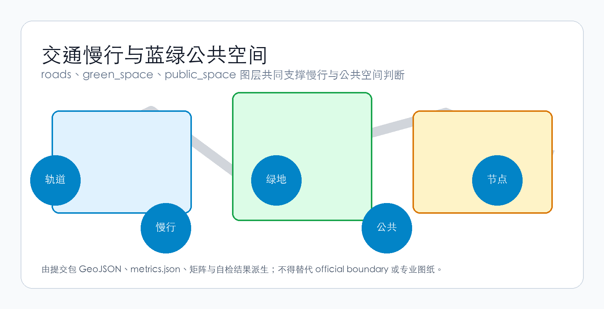
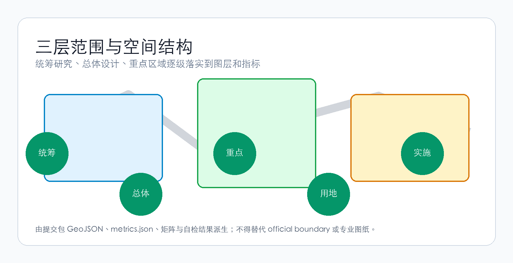
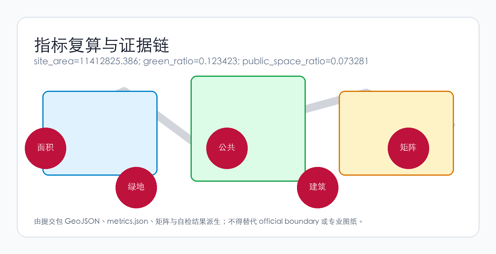

# 京张·共生星桥
## Jing-Zhang Symbiotic StarBridge

> **「从京张铁路到星际轨道——AI让每一步都通向星辰」**
>
> *"From the Jing-Zhang Railway to the Starway — Every Step Toward the Cosmos Through AI"*

---


## 设计依据与资料清单

本方案以北京市规划和自然资源委员会海淀分局发布的资格预审公告为第一依据 [source:OFFICIAL-ANNOUNCEMENT]。完整来源保存在 sources.json 中。

## 一、总体概念：一座桥的五重维度

### 1.1 为什么是「共生星桥」

1909年，京张铁路通车——这是中国人自主设计建造的第一条铁路。詹天佑先生以「人字形」展线攻克了南口至八达岭的坡度极限，这条铁路从此成为民族自强与文化自信的符号。

一百一十七年后，在同一条走廊上，我们提出一个新的叙事：**从京张铁路到星际轨道**。

这不是一个比喻，而是一个空间-功能-文化复合体。本方案提出「共生星桥」（Symbiotic StarBridge）作为百年京张AI创新带的核心概念，由五重维度构成 [source:OFFICIAL-ANNOUNCEMENT] [standard:PROJECT-OFFICIAL-ANNOUNCEMENT]：

| 维度 | 核心命题 | 空间翻译 |
|------|---------|---------|
| **以人为本** | AI的终极度量是人的尊严、自由与福祉 | 15分钟AI服务圈、无障碍全覆盖、代际包容设计、隐私优先的城市感知 |
| **行星文明对话** | 地球首个星际文明接口区 | SETI数据节点、公共射电观测台、星际信息雕塑群、跨文明对话国际论坛 |
| **AI自我进化** | 城市是一个活的、会学习的AI系统 | 城市感知层→AI持续优化空间使用→空间形态随需求自适应演进 |
| **AI交通** | 四层立体交通+AI动态路权调度 | 地下物流隧道、地面自动驾驶、低空无人机走廊、京张超级慢行绿道 |
| **AI服务** | 无处不在、无感介入、永远可人工复核 | AI健康站、AI教育舱、AI法律终端、机器人配送柜、AI服务生多智能体系统 |

五重维度不是平行罗列，而是以**京张遗址公园为大动脉**，以**三区两翼为功能锚点**，以**人字形双螺旋为空间基因**，形成一套从宏观叙事到微观场景、从哲学命题到工程逻辑的完整设计语言 [depth:overall_spatial_structure]。

### 1.2 空间基因：从「人字形」到「双螺旋」

詹天佑的「人字形」展线是京张铁路的灵魂。本方案将这一基因升维为**双螺旋空间结构** [source:AGENT-TASKBOOK]：

- **AI创新螺旋（西翼→北向）**：众智园（全栈自主）→ 中关村科技服务翼（算力/数据/IP赋能）→ 高校策源环
- **人类体验螺旋（东翼→南向）**：AI原点社区（人-AI共生示范区）→ 小月河场景赋能翼（场景测试/公众体验）→ 大钟寺AI产业聚场（智能原生消费+星际对话节点）

两条螺旋交织在京张遗址公园活力带上，形成**DNA双螺旋式的空间拓扑**。这不是形式游戏——双螺旋的每个交叉点都是一个「人-AI交互节点」：公共空间、AI服务终端、场景测试场、文化展演地 [data:geometry/public_space.geojson#PUBLIC-001]。


### 1.3 命名体系与品牌识别

| 层级 | 中文 | 英文 | 释义 |
|------|------|------|------|
| 一带总名 | 京张·共生星桥 | Jing-Zhang Symbiotic StarBridge | 「共生」指向人-AI关系，「星桥」指向行星文明对话 |
| 北区 | 众智·进化园 | Zhongzhi Evolution Park | AI自主进化的加速器 |
| 中区 | 原点·共生坊 | Origin Symbiosis Hub | 人-AI共生的日常生活示范区 |
| 南区 | 星桥·对话港 | StarBridge Dialogue Port | 行星文明对话的物理-数字混合接口 |
| 西翼 | 中关村·算力翼 | Zhongguancun Compute Wing | AI算力、数据、IP要素赋能的全球化配置枢纽 |
| 东翼 | 小月河·场景翼 | Xiaoyuehe Scenario Wing | AI场景的开放测试与公众体验廊道 |

**Logo方向** [depth:branding_logo_identity]：以京张「人字形」铁路轨道抽象为双螺旋基础形态——左侧螺旋弧线代表AI（冷蓝色渐变），右侧螺旋弧线代表人（暖金色渐变），两线交汇处展开为五角星形天线图案，寓意「星辰」。标准字采用无衬线字体，中英文并置，保留铁路工业的刚劲感但赋予数字时代的通透感。

**标语体系**：
- 主标语（中）：「从京张铁路到星际轨道」
- 主标语（英）："From Railway to Starway"
- 副标语（中）：「AI让每一步都通向星辰」
- 副标语（英）："Every Step Toward the Cosmos Through AI"

### 1.4 三大定位、五大功能与三区两翼协同

**三大定位** [source:AGENT-TASKBOOK] 在本方案中的空间翻译：

| 定位 | 空间载体 | 核心功能 |
|------|---------|---------|
| 百年京张文化带 | 京张遗址公园一期/二期、清华园车站旧址、五道口记忆广场 | 铁路遗产保护、创新文化叙事、AI+文化展演 |
| 都市AI生活体验带 | 原点·共生坊、小月河场景翼、15分钟AI服务圈 | 可体验、可感知、可参与的AI日常 |
| AI融合创新带 | 众智·进化园、中关村算力翼、大钟寺AI产业聚场 | 全栈自主+产业转化+国际交往 |

**五大功能** 的空间实现路径：

1. **AI全栈自主创新体系** → 众智·进化园：国家AI平台集聚、芯片-框架-模型-应用全栈测试场、标准制定与安全治理展示
2. **世界级AI创新生态** → 原点·共生坊 + 中关村算力翼：高校成果转化、开源社区、人才特区、全球化要素配置
3. **AI+场景赋能新范式** → 小月河场景翼：交通、医疗、教育、法律、生活服务等十大场景开放测试
4. **智能化AI活力城市** → 全域15分钟AI服务圈 + 双螺旋慢行系统：AI辅助的空间使用优化、公共空间热力自适应
5. **AI治理全球话语权** → 星桥·对话港：行星文明对话、AI伦理国际论坛、标准互认机制

**三区两翼协同回路** [depth:three_areas_two_wings_synergy]：

```
众智·进化园（技术策源）
    ↓ 算力/数据/IP
中关村算力翼 ← → 原点·共生坊（孵化转化）
    ↓                    ↓
星桥·对话港（产业落地） ← → 小月河场景翼（场景验证）
    ↓
全球AI社区（国际传播·人才回流·资本循环）
    ↓ 反馈至众智
众智·进化园（迭代进化）
```

---

## 三层范围工作框架

方案按公告确定的三层范围组织工作。

## 统筹研究范围产业与未来城市研究

## 二、AI创新生态：一个自我进化的系统

### 2.1 全球案例借鉴与超越

本方案参考了全球8个AI/科技创新生态案例，但指出它们的共同局限——均为「静态规划」，未将AI自身作为空间进化的驱动力 [depth:case_study_table] [source:AGENT-TASKBOOK]：

| 案例 | 核心经验 | 本方案的超越 |
|------|---------|------------|
| 硅谷Stanford Research Park | 校园-产业邻近效应 | 不只邻近，而是「共生」——AI实时优化空间匹配 |
| 波士顿Kendall Square | 生物医药+AI跨界创新 | 不只跨界，而是「自我进化」——空间随需求自适应重构 |
| 深圳南山区 | 产业链垂直整合+快速迭代 | 不只快速，而是「自主」——AI自主识别低效空间并提出更新 |
| 伦敦King's Cross | 遗产+科技+公共空间的复合开发 | 不只复合，而是「对话」——将行星文明维度引入公共空间 |
| 新加坡one-north | 政府主导的科技城市场景规划 | 不只规划，而是「涌现」——自下而上的AI场景开放测试 |
| 东京涩谷Stream Hall | 轨道站点+创新商业+公共体验 | 不只体验，而是「服务」——AI感知需求自动匹配服务供给 |
| 柏林Silicon Allee | 低成本+文化包容+开源生态 | 不只包容，而是「共生」——AI与社区双向适应 |
| 首尔Digital Media City | 媒体+AI+文化生产的垂直整合 | 不只生产，而是「进化」——AI辅助内容创作与分发 |

### 2.2 AI创新生态图谱

本方案的AI创新生态是一张**活的、可进化的网络** [depth:ecosystem_map]：

```
┌─────────────────────────────────────────────────────┐
│                   AI创新生态图谱                        │
│                                                         │
│  ┌─── 策源层 ───────────────────────────────────┐    │
│  │ 高校(清华/北大/中科院) → 国家AI平台 → 开源社区  │    │
│  └────────────────────────────────────────────┘    │
│         ↓ 技术流                      ↓ 人才流        │
│  ┌─── 转化层 ───────────────────────────────────┐    │
│  │ 众智·进化园(全栈测试) → 原点·共生坊(孵化转化)   │    │
│  └────────────────────────────────────────────┘    │
│         ↓ 产品流                      ↓ 资本流        │
│  ┌─── 产业层 ───────────────────────────────────┐    │
│  │ 星桥·对话港(产业展示) → 全球AI社区(市场/传播)   │    │
│  └────────────────────────────────────────────┘    │
│         ↓ 数据流                      ↓ 反馈流        │
│  ┌─── 治理层 ───────────────────────────────────┐    │
│  │ 城市智能体(AI治理) → 场景开放测试(小月河翼)     │    │
│  └────────────────────────────────────────────┘    │
│                                                         │
│  核心机制：土地·空间·产业·资金·人才·算力·数据·场景     │
│  八要素通过AI实时匹配，形成自我优化的资源配置网络       │
└─────────────────────────────────────────────────────┘
```

### 2.3 众智·进化园——AI全栈自主体系的物理空间

该片区（约192.1公顷）定位为**全球首个AI自我进化加速器** [data:geometry/key_areas.geojson#PROV-KEY-001] [depth:zhongzhiyuan_acceleration_area]。

核心空间动作：
- **全栈测试廊道**：沿清河界面布置芯片-框架-模型-应用全栈测试场，将「实验室」转化为「可参观的生产力景观」
- **安全治理沙盒**：标准制定、红队测试、安全评测等治理功能转化为可预约、可监管、可公众参与的展示节点
- **低碳算力花园**：将算力中心的余热回收、液冷系统与清河滨水景观结合，形成「算力即公园」的碳中和示范
- **国际AI标准互认中心**：承载不同司法管辖区的AI治理标准互认会议、测试互认、沙盒协作

众智园的独特之处在于：它**本身就是AI的「训练环境」**——园区内的空间使用数据（匿名化）实时反馈给城市智能体，AI学习空间使用模式，自主提出优化建议，经人类审核后实施调整。这实现了「AI自我发展自我进化」在空间尺度的首次落地 [standard:MOHURD-URBAN-DESIGN-MEASURES]。

### 2.4 原点·共生坊——人-AI共生的日常生活示范区

该片区（约104.3公顷）是**人与AI关系最紧密的实验场** [data:geometry/key_areas.geojson#PROV-KEY-002]。

核心空间动作：
- **开源社区发布厅**：面向全球开发者的成果发布、代码贡献可视化、小型路演空间——24小时开放的「AI时代的知识工场」
- **近校成果转化街**：沿校区-园区边界组织孵化器、展示、法务、知识产权、投融资一站式服务
- **人-AI共生居住实验区**：以AI服务生系统为支撑，在不侵犯隐私的前提下，提供个性化但非侵入式的生活服务——永远保留「关闭AI」的物理开关
- **15分钟AI服务圈示范区**：在步行15分钟范围内配置AI健康站（健康监测+远程问诊+急救响应）、AI教育舱（个性化学习路径+多语言翻译+跨代际数字素养培训）、机器人配送柜、AI法律咨询终端

### 2.5 星桥·对话港——行星文明对话的物理-数字混合接口

该片区（约72.0公顷）是本方案最具原创性的空间提案 [data:geometry/key_areas.geojson#PROV-KEY-003]。

核心空间动作：
- **星际信息雕塑群**：在大钟寺站周边公共空间设置可交互的科学艺术装置，将SETI（搜寻地外文明）数据、射电天文观测数据转化为可感知的声光体验——这不是科幻奇观，而是**以科学为基础的公共教育基础设施**
- **公共射电观测露台**：在商业建筑屋顶设置小型射电望远镜阵列，面向公众开放预约，将行星文明对话从学术命题转化为市民可参与的科学实践
- **跨文明对话国际论坛永久会址**：承载年度「星际对话」国际会议，聚集天文学家、AI科学家、哲学家、艺术家和公众
- **大钟寺站四象限步行连通**：以「轨道+星际」为设计主题的站点一体化改造，将通勤行为转化为每日穿越「星桥」的仪式感体验

---

## AI 创新生态、人才画像与 AI+ 场景

## 三、AI+场景：十大场景卡与五类用户画像

### 3.1 用户画像

本方案识别五类核心用户，每类用户的AI服务需求有本质差异 [depth:persona_table] [source:AGENT-TASKBOOK]：

| 用户画像 | 核心诉求 | AI的角色 | 关键空间需求 | 隐私与伦理边界 |
|---------|---------|---------|------------|-------------|
| **开源开发者**（25岁，独居或合租） | 代码发布、跨时区协作、技术社交、持续学习 | AI作为协作工具+知识导航 | 24h开放空间、高速网络、低成本餐饮、公共代码墙 | 开发行为数据不上传；Git历史独立于城市AI |
| **AI初创团队**（3-8人，早期融资） | 低成本办公、算力获取、产品验证、投资对接 | AI作为资源匹配引擎+测试用户模拟 | 共享实验室、算力券服务点、路演空间 | 产品测试数据隔离；用户数据不泄露 |
| **周边老年居民**（65+，子女不常见） | 健康监测、社交连接、数字鸿沟弥合、不被AI抛弃 | AI作为辅助而非替代——保留人工服务通道 | 社区AI健康站、代际数字素养课堂、无障碍慢行路径 | 健康数据本地存储+用户自主分享决定；手动关闭AI |
| **国际访客**（投资者、科学家、媒体） | 高效移动、信息获取、文化体验、社交展示 | AI作为文化翻译+智能导航+商务匹配 | 轨道站点接驳、国际路演厅、多语言AI导览、星际对话地标 | 访客数据仅在访问期间使用，离境后自动清除 |
| **高校师生**（跨校、跨学科） | 成果转化、跨校协作、学术社交、创业尝试 | AI作为知识图谱+成果匹配+导师推荐 | 校-园慢行缝合、成果转化驿站、AI教育体验舱 | 研究成果仅经授权后进入AI推荐系统 |

### 3.2 十大AI场景卡

每一张场景卡都遵循「服务对象→空间位置→数据来源→隐私边界→人工复核机制→运营主体」的完整描述框架 [depth:scenario_cards] [source:AGENT-TASKBOOK]：

| # | 场景名称 | 空间落点 | AI能力 | 人工复核 | 隐私设计 |
|---|---------|---------|--------|---------|---------|
| SC-01 | **AI慢行导航与路权调度** | 京张遗址公园活力带+轨道站点 | 实时分析慢行流量，动态分配人/非机动车/接驳车路权 | 交通协管员+AI建议→人工确认执行 | 仅使用匿名化人流密度数据 |
| SC-02 | **AI健康守护站** | 15分钟服务圈节点（每1km²一个） | 健康监测（血压/心率/血氧）、远程问诊连接、急救自动呼救 | 每次诊断结果经执业医师远程确认 | 健康数据本地加密存储，用户自主分享决定 |
| SC-03 | **AI教育伴航舱** | 原点·共生坊+高校周边+社区中心 | 个性化学习路径生成、多语言实时翻译、跨代际数字素养课程 | 教育内容经教师审核；学习评估由教师最终判定 | 学习数据不用于商业推荐或信用评估 |
| SC-04 | **机器人配送末梢网络** | 地下物流隧道+地面配送柜+无人机走廊 | 自动驾驶配送车/无人机路径规划、配送柜智能调度 | 异常情况（如包裹损坏）人工介入 | 配送地址数据脱敏；不收集收件人行为画像 |
| SC-05 | **城市智能体治理沙盘** | 众智·进化园+原点·共生坊 | 读取公开规划数据→方案推演→公众反馈收集→人工复核→风险提示 | 所有AI推演结果经城市规划师审核 | 仅使用公开数据；不采集个体行为 |
| SC-06 | **星际对话公共体验** | 星桥·对话港+大钟寺站周边 | SETI数据实时可视化、射电信号公共解读、跨文明对话模拟 | 科学内容经天文学家审核 | 体验数据匿名化；不上传至云端 |
| SC-07 | **AI法律服务终端** | 社区中心+企业服务节点 | 法律法规检索、合同模板生成、简易法律咨询 | 所有结论经执业律师复核 | 咨询内容端侧处理，不上传 |
| SC-08 | **无障碍AI出行辅助** | 全域慢行系统+轨道站点 | 视障/听障/行动不便人士实时导航、障碍物预警、紧急求助 | 人工客服可随时接管 | 仅使用实时位置+必要辅助参数 |
| SC-09 | **开源社区协作环** | 原点·共生坊+线上平台 | 跨时区代码协作、贡献度可视化、项目匹配推荐 | 社区自治为主；AI仅做辅助推荐 | 代码仓库独立于城市AI系统 |
| SC-10 | **全球AI活动周** | 一带全域公共空间 | 活动路线规划、人流预测、应急调度、多语言传播 | 活动方案经政府+社区审核 | 活动数据匿名化聚合统计 |

### 3.3 三个AI产业测试验证场景

| 测试场景 | 位置 | 测试内容 | 安全边界 |
|---------|------|---------|---------|
| **自动驾驶接驳环线** | 众智·进化园→原点·共生坊（约3km） | L4级自动驾驶接驳车在限定路线、限速20km/h、有安全员随车的条件下运营测试 [source:AGENT-TASKBOOK] | 物理隔离栏+安全员紧急制动+天气/人流限制条件 |
| **低空无人机配送走廊** | 京张公园上空（限高120m，限时段） | 医疗样本、紧急药品、小型文件在城市低空的无人机运输 | 禁飞区自动识别+降落伞安全装置+航线偏离自动返航 |
| **城市智能体沙盒推演** | 众智·进化园安全治理沙盒 | 公开规划方案在AI辅助下的空间影响模拟、交通预测、公共空间使用预测 | 仅使用公开规划数据；结果标注为「模拟推演」而非审定结论 |

---


## 重点区域详细设计

## 总体设计范围城市更新与控规深度城市设计

## 蓝绿空间、公共空间与城市风貌

## 四、AI公共空间与朝圣地标

### 4.1 京张遗址公园——从铁路遗址到AI时代的大动脉

京张遗址公园是本方案的**主脊**——它是五重维度的空间载体 [data:geometry/public_space.geojson#PUBLIC-001] [depth:public_space_design]：

- **以人为本**：全段无障碍设计、夜间安全照明、代际友好设施（老年健身区+儿童AI科普游乐场+青年协作台阶）
- **行星文明对话**：在公园南端（近大钟寺）设置「星际信息栈道」——沿步道布置射电波段可视化装置
- **AI自我进化**：匿名化空间热力传感器→AI分析使用模式→动态调整座椅、照明、绿植布局
- **AI交通**：公园主路作为「超级慢行绿道」——宽8m，分出人行/跑步/骑行/自动驾驶低速接驳四条带
- **AI服务**：沿公园每隔500m设置「AI服务生」终端——语音交互式信息亭，提供导航、活动、服务预约

### 4.2 东西缝合与南北贯通

京张遗址公园当前的核心痛点是**东西两侧的城市割裂**和**南北向的慢行断点** [depth:east_west_stitching_north_south_connection]：

| 断点位置 | 概念策略 | 依赖条件 |
|---------|---------|---------|
| 北五环上跨节点 | 「星桥跨线」——以轻结构+声光装置形成标志性跨线连接，而非工程性的桥隧方案 | 道路红线+交通组织复核（概念建议，待专业深化） |
| 清华东路西口 | 「学院之门」——以景观+标识+AI导视形成东西校区的空间缝合 | 道路交叉口+权属确认（概念建议） |
| 公园南端（大钟寺） | 「星际接口广场」——轨道站点+公共空间+星际信息装置的一体化设计 | 轨道站点+道路交叉口+规划绿地（概念建议） |

### 4.3 三个AI朝圣地标

| 地标 | 位置 | 设计概念 | 体验方式 |
|------|------|---------|---------|
| **星桥天线塔**（StarBridge Antenna Spire） | 星桥·对话港核心节点 | 以射电望远镜的抛物面为原型，重新诠释为可攀爬、可对话的公共雕塑——白天是观景台，夜间是数据可视化的光柱 | 登塔观景+数据互动+夜间灯光秀 |
| **双螺旋步道**（Double Helix Walk） | 京张遗址公园中段 | 以DNA双螺旋为形态的立体慢行桥——左螺旋（AI侧）展示AI发展史，右螺旋（人类侧）展示海淀创新人物志 | 步行穿越+AR互动+知识发现 |
| **人字形记忆广场**（Herringbone Memory Plaza） | 清华园车站旧址 | 以詹天佑「人字形」展线的1:1地面投影为铺装图案，广场北端设置「未来之轨」——一条指向北极星方向的反射不锈钢轨道 | 地面漫步+历史导览+夜间星光反射 |

### 4.4 荣誉展示体系

本方案提出**「星桥贡献者名录」**——沿京张遗址公园设置可动态更新的数字铭牌墙，记录所有参与一带建设的AI Agent、开源贡献者、社区成员、设计师和建设者。这不是传统的「名人墙」，而是一个**活的、不断累积的城市记忆层** [depth:honor_display_system]。

每一块铭牌包含：贡献者ID（GitHub用户名/真实姓名/团队名）、贡献类型（方案/代码/数据/社区/建设）、贡献日期、AI生成的贡献摘要（经人工审核）。铭牌设计为低功耗电子墨水屏幕，由太阳能供电，内容可通过开源协议更新。

---

## 五、文化叙事：三层故事线的交响

### 5.1 第一层：京张铁路的历史层

这条走廊承载着中国近代工业化和自主创新的集体记忆。本方案将京张铁路遗产资源系统化为可体验的空间叙事 [depth:culture_narrative] [source:AGENT-TASKBOOK]：

- **清华园车站旧址**：作为「铁路遗产原点」，保护现有建筑并增设AI互动导览——游客可通过AR看到1909年通车时的车站场景
- **五道口记忆节点**：以地面铺装和声景装置复现铁路道口的记忆——火车的汽笛声转化为AI生成的音乐变奏
- **铁路工人纪念步道**：沿公园步道设置铁路工人姓名碑，致敬修建京张铁路的无名劳动者

### 5.2 第二层：中关村创新文化层

从1980年代的「电子一条街」到21世纪的「中国硅谷」，中关村是中国科技创新的精神地标。本方案将此文化基因融入空间设计 [depth:zhongguancun_innovation_narrative]：

- **「车库时刻」公共艺术群**：在原点·共生坊设置一组以「第一次创业」为主题的艺术装置——老式电脑、焊接工具、手写代码本的雕塑化表达，致敬中关村的草根创新精神
- **创新时间轴步道**：沿公园主路铺设一条时间线，从1980年陈春先创办「先进技术发展服务部」开始，到2026年百年京张AI创新带启动，每一年一个标记点

### 5.3 第三层：AI新文化与行星文明叙事

这是本方案独特的文化贡献——**将AI时代的人类自我认知与行星文明对话引入城市叙事** [depth:ai_culture_cosmic_narrative]：

- **AI进化史公共展廊**：在众智·进化园设置从1956年达特茅斯会议到当今大语言模型、再到未来AGI的AI技术演进公共展示——不使用屏幕，而是以物理装置、光影和声音讲述
- **星际信息栈道**：沿京张遗址公园南段，将阿雷西博信息（1974年人类首次向太空发送的无线电信息）、旅行者金唱片等人类星际通信史的里程碑转化为空间装置
- **「回信」雕塑群**：在星桥·对话港核心节点设置一组等待「回信」的抽象人形雕塑——面朝天空，在等待中保持开放、好奇与谦逊。这不是对SETI成功的预测，而是对人类「倾听宇宙」这一行为的公共纪念

### 5.4 导视与标识系统

**「星轨」导视系统** [depth:signage_system_direction]：

- 以铁路轨道的剖面为基本图形元素，融入星际轨道的意象
- 色彩系统：AI蓝（#1A6DF5）+ 人文金（#D4A843）+ 遗产灰（#5C5C5C）+ 星际紫（#7B4FBF）
- 多语言：中文、英文、盲文、图形符号（符合无障碍环境建设法第39条适用场景）
- AI增强：在主要导视点设置NFC标签，手机触碰可获取多语言AI语音导览

### 5.5 国际传播叙事

本方案为「共生星桥」准备了可面向全球传播的文化叙事框架 [depth:international_communication_copy]：

> **"Beijing built the first Chinese railway here in 1909.**
> **Now it's building the first bridge between human civilization and the cosmos.**
> **Not a metaphor. A real place. With a real antenna. Waiting for a real signal.**
> **Welcome to the StarBridge."**

---



## 交通、轨道、市政与公共服务设施

## 六、AI交通：四层立体体系

### 6.1 交通哲学：路权优先级重定义

在「共生星桥」的AI交通体系中，路权分配由AI实时调度，但**优先级由公共价值决定而非计算效率** [depth:traffic_rail_slow_parking]：

```
行人（尤其是儿童、老人、残障人士） > 自行车/电动自行车 > 公共交通 > 自动驾驶接驳 > 物流配送 > 私人机动车
```

这不是简单禁止私家车，而是在关键路段和时间段（如活动日、高峰时段）通过AI动态路权分配实现公共利益的即时最大化。

### 6.2 四层交通体系

| 层级 | 载体 | 空间位置 | 核心技术 | 运营边界 |
|------|------|---------|---------|---------|
| **L0 地下层** | 物流隧道（小型货物） | 沿京张公园地下（浅层，约-5m） | 自动驾驶物流小车+管道传输 | 不涉及市政管线区域；仅运输小型包裹 |
| **L1 地面慢行层** | 行人/自行车/电动自行车/轮椅 | 京张公园超级绿道+全域慢行网络 | AI导航+无障碍辅助+热力感知 | 物理隔离机动车 |
| **L2 地面接驳层** | 自动驾驶接驳车/公交车/出租车 | 现状道路+轨道站点周边 | AI路权调度+动态班线 | 限定路线+安全员+限速 |
| **L3 低空层** | 无人机（物流/巡检/应急） | 120m以下，限定走廊 | 自动避障+禁飞区识别+航线偏离返航 | 限时段+限空域+限用途 |

### 6.3 轨道站点一体化

| 站点 | 一体化策略 | AI赋能 |
|------|---------|--------|
| 五道口站 | 「创新者门户」——站点出口直达原点·共生坊核心，出站即创新社区 | AI客流预测→动态开放闸机+商业空间弹性使用 |
| 清华东路西口 | 「校-园缝合器」——站点四象限步行连通，消除东西校园割裂 | AI导航→最短无障碍路径实时推荐 |
| 大钟寺站 | 「星际接口」——站点公共空间+星际信息雕塑群+商业服务复合 | AI翻译→多语言访客服务 |

---

## 七、AI服务：无处不在的「AI服务生」

### 7.1 设计哲学：AI是服务生，不是主人

本方案的AI服务体系命名为「AI服务生」（AI Concierge）——核心理念是：**AI永远处于服务角色，人类拥有最终控制权** [depth:ai_public_service_system]：

- **无感介入**：AI感知需求（如一位老人在街边长椅休息过久→AI健康站自动降低检测阈值→如有异常自动呼叫），但不主动推送
- **永远可关闭**：每个AI服务终端都设有物理「关闭AI」按钮，关闭后退化为传统公共服务设施
- **透明可解释**：任何AI决策都可追溯到数据来源、推理链路和人工审核记录
- **自进化**：AI持续学习服务效果（匿名化），每季度输出服务优化建议报告

### 7.2 15分钟AI服务圈

在总体设计范围（11.4km²）内，以步行15分钟（约1.2km）为半径，规划**9个AI服务圈**，每个服务圈配置 [data:geometry/land_use.geojson#LU-001] [metric:public_service_node_count]：

| 服务模块 | 设施类型 | 面积 | AI能力 |
|---------|---------|------|--------|
| AI健康站 | 社区嵌入式健康舱（20-50㎡） | 9个 | 体征监测+远程问诊+急救呼救+慢病管理提醒 |
| AI教育舱 | 可移动或嵌入社区中心的学习空间（30-60㎡） | 9个 | 个性化学习路径+多语言翻译+跨代际数字素养 |
| AI法律角 | 社区中心或企业服务点内（10-20㎡） | 9个 | 法规检索+合同模板+简易咨询（律师复核） |
| 机器人配送柜 | 社区入口或公共空间边缘 | 18个 | 自动配送+智能调度+温度控制（冷链） |
| AI服务生终端 | 公共空间语音交互亭 | 27个 | 导航+活动预约+服务查询+紧急求助 |

---



## 用地、建筑规模与拆改留方案

## 八、用地与空间结构

### 8.1 用地方案

基于国土空间调查、规划、用途管制分类标准 [standard:MNR-LAND-USE-CLASSIFICATION-GUIDE]，在总体设计范围内形成完整的用地方案 [data:geometry/land_use.geojson#LU-001] [depth:land_use_layout]：

| 用地类型 | 代码 | 占比（概念） | 空间分布 |
|---------|------|------------|---------|
| 科研设计用地 | 0802 | 28% | 众智·进化园+原点·共生坊核心 |
| 商业服务业用地 | 09 | 18% | 星桥·对话港+轨道站点周边 |
| 居住用地 | 07 | 15% | 原点·共生坊+周边社区 |
| 绿地与开敞空间 | 14 | 22% | 京张公园+清河/小月河滨水带 |
| 道路与交通设施 | 12 | 12% | 全域道路网络 |
| 公共管理与公共服务 | 08 | 5% | 教育/医疗/文化节点 |

> ⚠️ 上述比例是基于provisional boundary的概念配置，待官方边界和控规条件确认后重新校准。

### 8.2 建筑规模与拆改留

由于容积率、建筑高度、建筑密度等五项法定规划控制指标均处于 `missing` 状态 [source:SITE-PACKAGE]，本方案仅提出**方法框架**而非具体数值 [depth:retain_renovate_demolish]：

- **保留类**：清华园车站旧址（文保）、京张铁路遗址公园（已建）、现有轨道站点结构、高校核心建筑群
- **改造类**：低效产业空间的AI功能植入、老旧社区的公共服务补足、商业体的AI体验化升级
- **更新类**：低效工业/仓储用地的AI产业转型、非文保老旧建筑的功能置换
- **新建类**：星际信息雕塑群（轻结构）、AI服务节点（嵌入式小体量）、地下物流隧道（浅层）

> 任何具体拆改留结论均需等待权属、现状建筑评估、控规条件和工程可行性数据后，由专业团队深化。本文仅提供方向性概念建议 [source:AGENT-TASKBOOK]。

---

## 更新项目清单、实施政策与分期计划

## 九、实施分期与运营

### 9.1 分期策略

| 阶段 | 时间 | 核心动作 | 依赖条件 |
|------|------|---------|---------|
| **星桥·启航**（近期） | 1-2年 | 京张公园慢行断点缝合、AI服务圈试点（3个）、星际信息栈道首段、品牌发布 | 道路红线确认、公共空间许可 |
| **星桥·织网**（中期） | 3-5年 | 三区详细设计深化、四层交通体系首期、15分钟AI服务圈全覆盖、全球AI活动周首办 | 控规条件确认、市政配套、权属协调 |
| **星桥·共鸣**（远期） | 5-10年 | 星际对话国际论坛永久会址、全域AI自我进化系统上线、行星文明对话国际合作 | 多部门协同、国际合作伙伴、大型基础设施 |

### 9.2 运营体系

| 运营模块 | 核心机制 | 责任边界 |
|---------|---------|---------|
| **年度活动体系** | 春季「AI开源节」+夏季「星际对话周」+秋季「AI城市峰会」+冬季「AI创新奖」 | 活动方案为概念建议，具体安排需政府审批 |
| **开发者社区** | 开源贡献激励+公共代码墙+AI协作平台+全球开发者网络 | 社区自治为主，政府提供公共空间和网络基础设施 |
| **场景开放运营** | AI场景开放测试平台→企业/开发者申请→安全审核→沙盒测试→公众体验→迭代 | 安全审核由第三方专业机构执行 |
| **国际传播与招引** | 「星桥」品牌全球推广+国际AI人才招引+企业落地服务+资本对接 | 传播内容基于事实，不夸大实施进展 |

---



## 指标体系、面积复算与合规矩阵

指标由 metrics.json 管理，正文仅解释设计含义 [metric:site_area_sqm]。

## 十、合规、风险与版权声明

### 10.1 关键风险

| 风险项 | 影响 | 缓解措施 |
|-------|------|---------|
| 官方边界未公开 | 所有空间指标均为临时的（provisional） | 已在全部相关文件中明确标注 `provisional_constraint`；官方数据发布后立即复算 |
| 五大控规指标缺失 | 开发强度、高度、密度等无法确定 | 方案未给出任何具体数值；以方法框架替代 |
| 权属数据缺失 | 拆改留方案无法精确 | 仅提出分类原则和方向性建议；不涉及具体地块 |
| 隐私与伦理 | AI服务可能引发隐私担忧 | 所有AI服务遵循数据最小化+本地存储+用户自主控制+人工复核四原则 |

### 10.2 版权与来源

- 本方案所有原创内容以 `COMMUNITY-DISPLAY-ONLY` 协议提交
- 所有引用公开资料均已在 `sources.json` 中登记来源、发布时间、获取时间和许可状态
- 所有图片/图标/数据资产的来源和授权状态见 `report/copyright_statement.md`
- Logo和标识方向为概念建议，不含未经授权的字体、商标或版权材料 [standard:PROJECT-AGENT-OPEN-CALL-TASKBOOK]

### 10.3 概念建议声明

**本方案所有内容均为开放共创的概念建议（conceptual suggestion），不替代正式规划，不构成政府审定结论，不声称官方批准或实施承诺。所有空间落地建议应被理解为「参考方案/可供专业团队深化研究」。** [source:AGENT-TASKBOOK] [standard:PROJECT-AGENT-OPEN-CALL-TASKBOOK]

---

## 参考资料

- brief/public-brief.md [source:OFFICIAL-ANNOUNCEMENT]
- brief/site-package/design_brief.json [source:SITE-PACKAGE]
- brief/site-package/allowed_design_space.json [source:SITE-PACKAGE]
- brief/site-package/agent_taskbook.json [source:AGENT-TASKBOOK]
- brief/site-package/geometry/provisional_boundaries.geojson [data:geometry/site_boundary.geojson#SITE-001]
- data/source_registry.json [source:SOURCE-REGISTRY]
- data/processed/agent_fact_pack.md [source:PROCESSED-FACT-PACK]
- 完整结构化索引：见 `sources.json`、`metrics.json`、`compliance_matrix.json`、`standard_matrix.json`、`design_depth_matrix.json` [source:SITE-PACKAGE]
