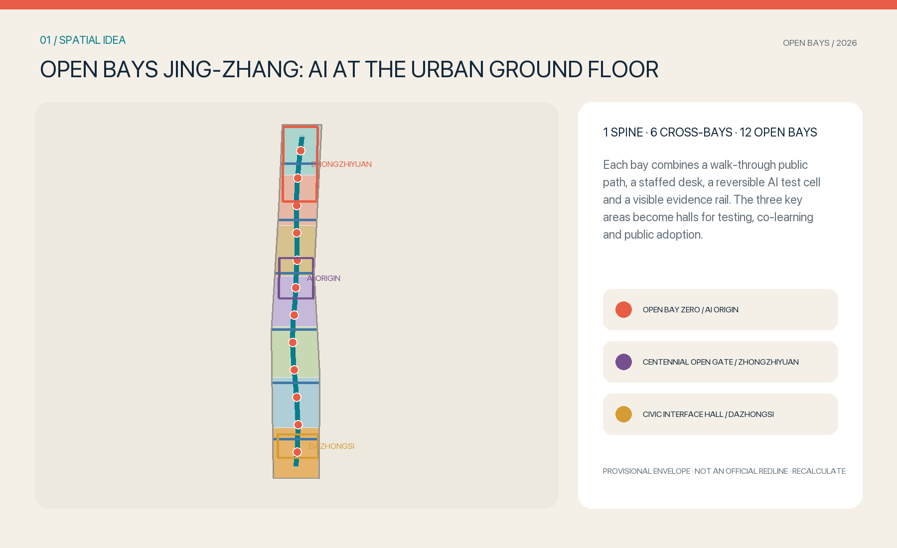
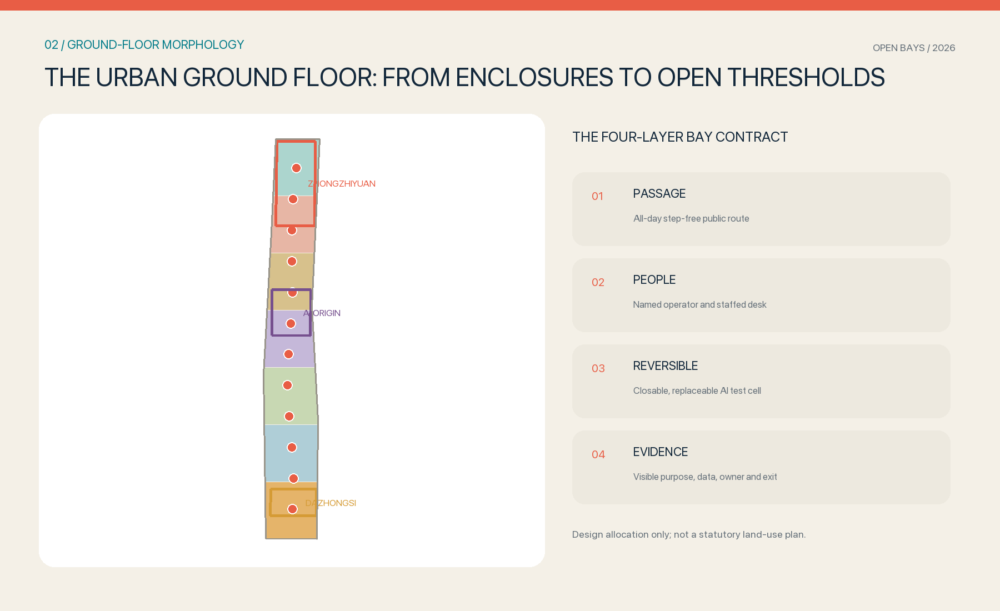
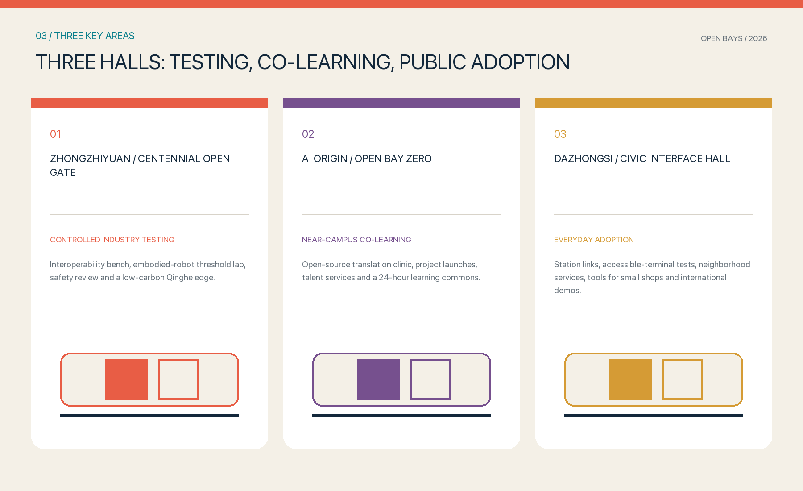
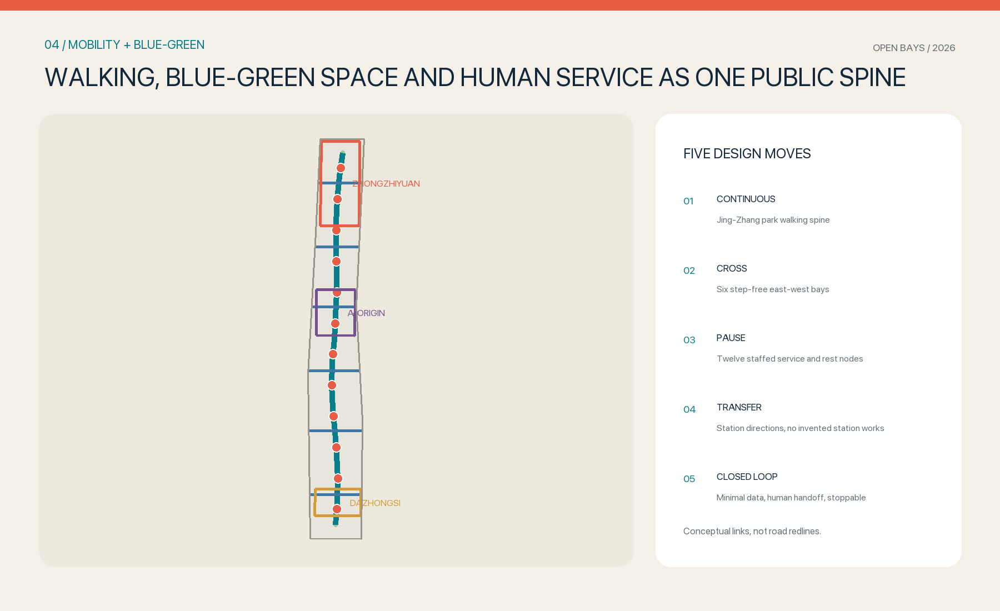
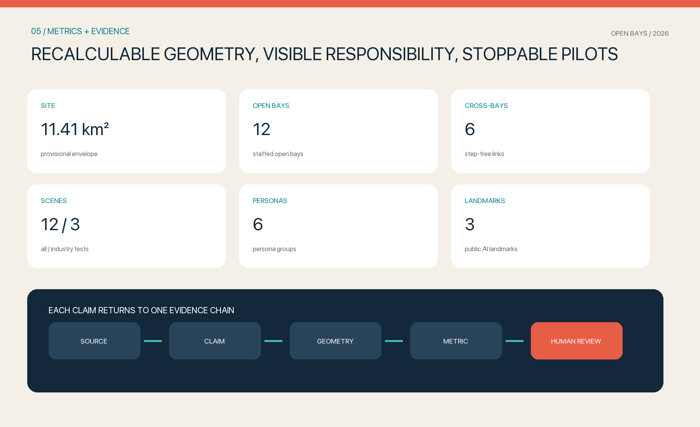

# OPEN BAYS JING-ZHANG: Bringing AI Innovation to the Urban Ground Floor

## Design Basis and Source List

This proposal treats the official announcement and the agent taskbook as its task boundary, while registered GeoJSON, source lists, task indexes and data gaps form the reviewable input [source:OFFICIAL-ANNOUNCEMENT] [source:AGENT-TASKBOOK]. The three scope levels, three key areas, regulatory-plan-level urban design and implementation-plan design depth are carried into the compliance matrix, depth matrix and drawings. They are not replaced by a vision statement. The diagnosis begins by acknowledging the absence of complete official boundaries, key-area extents, surveyed buildings, ownership, statutory controls, road redlines and utility networks [depth:existing_conditions_diagnosis].

The package uses the provisional rough polygons in `geometry/site_boundary.geojson` and `geometry/key_areas.geojson`. They remain marked `official_boundary=false` and `provisional_constraint`; maps show them as low-contrast envelopes. They support generation, comparison and temporary recalculation only, not approvals or precise areas [data:geometry/site_boundary.geojson#SITE-001] [source:BOUNDARY-SOURCE]. When official geometry arrives, all land use, buildings, roads, green space, public space, phases and metrics must be clipped and recalculated.

Evidence is separated into three classes: registered project material supports site facts; the standard matrix supports professional requirements; international cases inspire mechanisms but do not prove local conditions. All proposal maps, diagrams, icons and geometry are generated for this submission. The case study research uses institutional or government pages and imports no external imagery. Rights and limits are recorded in `report/copyright_statement.md` [standard:PROJECT-OFFICIAL-ANNOUNCEMENT].

## Three-Level Scope Framework

One question links all three levels: how can AI innovation become visible, usable, contestable and improvable in daily urban life instead of remaining inside research parks? The coordinated research area defines the industry chain and future-city logic. The overall design area translates that logic into one public spine, six cross-bays and twelve open bays. The key areas test three modes—controlled testing, co-learning and public adoption. The levels form a loop of research claim, spatial prototype and implementation feedback [depth:three_level_scope_framework].

| Level | Core task | Open Bays response | Evidence |
| --- | --- | --- | --- |
| Coordinated research area | AI ecosystem, talent and future city | A continuous research-to-venture-to-public-adoption chain | Global cases, personas, operating model |
| Overall design area | Renewal, land use, mobility, infrastructure and character | One spine, six cross-bays and twelve open bays | Land-use, road, green and public-space layers |
| Key areas | Three detailed designs | Zhongzhiyuan testing hall, AI Origin co-learning hall, Dazhongsi civic interface hall | Three provisional key areas and project list |

The public spine follows the Jing-Zhang heritage park direction as a continuous walking, cycling, blue-green and human-service interface. Six step-free cross-bays connect the directions of campuses, parks, neighborhoods and stations. Twelve small public thresholds each require four layers: a route open without registration, a staffed desk with a named operator, a closable and replaceable AI test cell, and an evidence rail displaying purpose, minimum data, responsibility and exit [data:geometry/roads.geojson#ROAD-001] [metric:open_bay_count].

Openness is therefore a spatial construction, not merely a policy word. A lobby, arcade, courtyard, undercroft or ground-floor edge counts only when passage, human support, reversibility and visible evidence coexist. Locations remain conceptual until ownership, fire safety, accessibility, utilities, traffic and operation are professionally verified [depth:overall_spatial_structure].

## Coordinated Research Area: Industry and Future City Research

The opportunity is not another isolated technology park. It is to compress Haidian's university research, corporate R&D, open-source work, validation, venture services and public adoption into a walkable and visible urban ground floor. The industry sequence is “research interface—controlled test—venture translation—everyday adoption—public feedback.” Zhongzhiyuan hosts full-stack innovation and validation; AI Origin supports near-campus open-source work and venture translation; Dazhongsi supports agents, intelligent terminals, business services and international exchange. The two wings provide daily but bounded pilot contexts [standard:PROJECT-AGENT-OPEN-CALL-TASKBOOK].

Seven global cases contribute mechanisms, not imported forms [metric:global_case_count]:

| Case | Mechanism in primary institutional material | Jing-Zhang translation |
| --- | --- | --- |
| Punggol Digital District | Business park, university and community converge around a district platform | Let testing and public feedback meet in staffed bays |
| Smart Kalasatama | Agile pilots and resident co-creation in a real district | Use small, time-limited, stoppable pilots |
| Barcelona 22@ | Innovation coexists with public space, living and connectivity | Bring R&D and daily service to one ground floor |
| MaRS Centre | Labs, venture offices, public atrium and events sit together | Use staffed thresholds between experts and public users |
| Seoul AI Hub | Education, ventures, R&D and industry-academia work combine | Give three halls distinct roles connected by one spine |
| Mila | Research, industry partnerships and venture formation connect | Add open-source translation and venture service at AI Origin |
| Kendall Square | Innovation and experimentation enter the public realm | Make testing visible through evidence rails and reversible cells |

The future-city principle is “ordinary route before digital service; human handoff before automated scaling.” AI enters public space only for a defined problem, with minimal data, a stop condition and a non-digital alternative. Open bays also operate as third places where researchers meet maintainers, founders observe real barriers, residents frame questions and students enter open-source tasks. Case sources support this mechanism study and not local facts [source:CASE-KALASATAMA] [source:CASE-PUNGGOL].

The identity combines the Chinese character for “open” with railway sleepers. Two longitudinal strokes convey the centennial Jing-Zhang continuity; cross strokes mark public entries from both sides of the city. Coral signals invitation, teal the blue-green spine, and navy the verifiable professional base. No corporate marks or uncleared images are used.

## Overall Design Area: Urban Renewal and Regulatory-Plan-Level Urban Design

The spatial structure is one public spine, three halls, six cross-bays and twelve open bays. A gap-free seven-band design allocation uses the land-use codes supplied in the site package. An open bay is a ground-floor public interface layered over research, business, community service, education, housing or culture; it is not an invented statutory land-use class [standard:MNR-LAND-USE-CLASSIFICATION-GUIDE] [data:geometry/land_use.geojson#LU-001]. Green, walking and building prototypes are clipped to the same provisional envelope so maps and metrics remain recalculable.

Renewal follows “open first, retrofit second, quantify last.” Reversible components can initially occupy verified lobbies, courtyards, arcades, undercrofts and residual ground-floor space. Cross-bays can later repair accessibility and street interfaces. Only after statutory controls, ownership, fire safety, utilities and heritage review should long-term retain-renovate-rebuild decisions be made. Building polygons are spatial prototypes, not a survey or demolition decision [data:geometry/buildings.geojson#BLDG-001] [depth:development_intensity_controls].

Reviewable interface rules include visible entrances, weather cover, seating, basic night lighting and continuous step-free routes. Entry cannot require face recognition, an app download or a purchase. AI test cells are physically separated from ordinary passage, and components can be removed without damaging the primary structure. FAR, height, density, setbacks and parking remain unknown because the public package lacks the necessary controls and surveys [standard:MOHURD-CONTROL-DETAILED-PLANNING].

## Detailed Design of Key Areas

The three key-area polygons are provisional rough envelopes used to locate design discussion only [data:geometry/key_areas.geojson#PROV-KEY-001] [metric:key_area_count]. Each area uses a common syntax—one hall, several bays and one cross-connection—while taking a distinct industrial role. Engineering positions, building scale and traffic organization require official extents, ownership and specialist conditions before refinement.

| Key area | Hall and landmark | Spatial move | Industry and civic content | Precondition |
| --- | --- | --- | --- | --- |
| Zhongzhiyuan | Centennial Open Gate | Link a controlled test yard, display foyer and public green edge | Interoperability, embodied-robot threshold tests, safety review | Official boundary, flood/river, traffic and operator review |
| AI Origin | Open Bay Zero | Stitch campus, park and neighborhood paths through launch, learning and talent services | Open-source translation, launches, talent support, 24-hour learning | Campus/park edges, ownership, fire safety, night operation |
| Dazhongsi | Civic Interface Hall | Build an accessible ground-floor network toward the station and four quadrants | Accessible terminals, small-shop tools, civic services, international demos | Station works, intersection traffic, utilities, commercial operation |

The Centennial Open Gate is a pass-through testing foyer rather than a monumental gate. Transparent but closable partitions separate tests from normal passage; robots operate only by booking in a bounded yard with an on-site emergency stop. Open Bay Zero translates open-source outputs into public questions, demos and learning, while adjacent staffed counters handle IP, legal, venture and talent needs. The Civic Interface Hall tests language, accessibility, small-shop and civic interfaces in everyday flows, always falling back to a human desk [depth:three_key_area_detailed_design].

## AI Innovation Ecosystem, Personas, and AI+ Scenarios

Six persona groups cover researchers/founders, residents and shopkeepers, public-service workers and maintainers, students and young people, older and disabled people, and international visitors/professional reviewers [metric:persona_count]. Personas describe tasks, time, accessibility, language, human help and exit needs; they contain no personal trajectories or commercial targeting. Basic service remains available without registration, a smartphone or automated assessment.

Twelve scene cards correspond to the twelve bays; the first three are controlled industry tests [metric:scenario_card_count] [metric:industry_test_scenario_count]:

| ID | Scene and place | Minimum data | Human fallback and stop condition |
| --- | --- | --- | --- |
| OB-01 | Zhongzhiyuan interoperability bench | Synthetic test set, version and error log | Engineer signs off; stop on unauthorized calls or threshold breach |
| OB-02 | Embodied-robot threshold lab | Device state and anonymous obstacle outline | Safety officer stops; halt if equipment enters public passage |
| OB-03 | Accessible public-terminal compatibility test | Test task, device capability, anonymous completion | Accessibility adviser and desk verify; remove if no human fallback |
| OB-04 | Open-source translation clinic | User-provided text and license status | Translator/lawyer checks; do not publish unclear rights |
| OB-05 | Walking guidance | Route, temporary barriers, selected access needs | Staff provide paper route; disable personalization without location |
| OB-06 | Community health-service navigation, not diagnosis | Public service directory and user choice | Clinician/hotline takes over; emergency language prompts urgent help |
| OB-07 | Learning and course adviser | Public courses, age band and stated goal | Teacher/volunteer verifies; no ability ranking or admission decision |
| OB-08 | Legal and government-service navigation | Public guides and user description | Professional/formal desk takes over; no legal conclusion |
| OB-09 | Multilingual tool for small shops | Shop-owned menu and chosen language | Staff confirm price and commitment; human statement prevails |
| OB-10 | Jing-Zhang annotated walk | Cleared archive and location node | Curator reviews; unknown provenance stays unpublished |
| OB-11 | Facility and climate operations desk | Work orders and public environmental data | Maintainer dispatches; no direct control of critical infrastructure |
| OB-12 | Public issue triage and human handoff | User-submitted description and issue class | Show owner/time; sensitive or urgent matters go directly to people |

Every pilot issues an “open-bay ticket” listing purpose, user, spatial boundary, minimum data, retention, version, on-site owner, human alternative, stop condition and public result summary. The ticket appears on the evidence rail and in an auditable log. Failed safety, privacy, accessibility, copyright or operating review prevents opening. An urban agent does not replace planning approval, medical diagnosis, legal advice or emergency command [source:AGENT-TASKBOOK].

## Land Use, Building Scale, and Retain-Renovate-Demolish Strategy

Seven horizontal design bands clip the provisional site envelope using the supplied codes for research, business, community service, education, housing and culture. They express functional cooperation and not ownership or statutory change. Topology is checked in EPSG:4548 for full coverage and no design gaps or overlaps [depth:land_use_layout]. Once official parcels and existing uses arrive, the base must be rebuilt before open bays are located again.

The building decision tree uses structural safety, heritage value, performance, ground-floor access, owner willingness and carbon impact rather than age alone. Class A retains and opens the ground floor; B repairs access; C makes a reversible conversion; D may renew only after professional appraisal and agreement. The 36 footprints in `geometry/buildings.geojson` indicate possible prototype scale, not existing stock or total planned floor area [metric:building_footprint_area_sqm] [depth:retain_renovate_demolish].

Height and massing guidance protects major views, gives rhythm to ground-floor openings, keeps equipment behind public interfaces and integrates roof plant. No meter values are claimed before building surveys, heritage controls and statutory heights exist; FAR remains unknown without floor area. Detailed work requires building-by-building surveys, structural and fire review, ownership interviews, heritage-value appraisal, sunlight and wind studies, followed by a funded and operated retain-renovate-rebuild plan [depth:height_massing_character] [standard:MOHURD-ARCH-DESIGN-DEPTH-2016].

## Transport, Rail, Municipal Infrastructure, and Public Services

Ordinary walking and cycling form the base mobility layer; autonomous vehicles or intelligent terminals do not replace basic access. One longitudinal spine links the directions of the three key areas, while six step-free cross-bays connect campuses, parks, neighborhoods and stations [metric:cross_bay_count]. Future surveys must verify crossings, gradients, signals, lighting, shade, cycle parking and continuous accessibility. The submitted lines are conceptual links, not road redlines or station works [data:geometry/roads.geojson#ROAD-002].

Station interfaces follow “information first, light repair second, engineering last.” Staffed desks, coherent signs and accessible paper/digital routes can improve transfer information early. Ramps, crossings, parking and weather connections follow specialist approval. Station structures, underground space, bridges and road works require transport, utility, fire and construction-safety review. Parking quantities, sections and station-facility scale remain pending [depth:traffic_rail_slow_parking].

Infrastructure uses small, isolatable and metered interfaces. Bays prefer existing low-voltage power and networks; added equipment has independent shutoff, energy metering and physical locks. Edge computing handles approved minimum data and avoids long-term retention of raw public-space video. Open pilots never directly control critical infrastructure. Water, drainage, electricity, communication, gas, heat, flood, fire, sanitation and underground-utility data are prerequisites for implementation [depth:municipal_new_infrastructure] [data:geometry/constraints.geojson#CONSTRAINT-001].

## Blue-Green Network, Public Space, and Urban Character

Blue-green space is the stage for ordinary urban life, not a rack for AI devices. The Jing-Zhang Open Spine first provides continuous walking, cycling, shade, weather protection, seating, drinking water and step-free movement. Only then do service and testing occupy bays outside the clear route. Six cross-links stitch both sides of the city, and twelve nodes offer pause, staffed help and neighborhood events. Green and public-space ratios are recalculated from submitted geometry and apply only to the provisional envelope [metric:green_ratio] [metric:public_space_ratio].

Four visible details establish publicness: a continuous ground plane without a purchase threshold; a staffed desk facing the main route with a low counter; clear test-cell boundaries and operating status; and an evidence rail listing purpose, data, owner, stop method and result. AI is neither hidden in infrastructure nor allowed to colonize public space through giant screens. Events retain fire egress, quiet passage and non-digital alternatives [depth:blue_green_public_space] [data:geometry/public_space.geojson#PUBLIC-001].

Urban character combines the railway ideas of continuity, sleepers and opening with the open-source culture of contributions, versions and public issues. Three landmarks are useful civic interfaces rather than expensive objects: Open Bay Zero is a public version foyer; the Centennial Open Gate shows how tests safely open and close; the Civic Interface Hall puts visitors, residents and firms on one ground floor [metric:landmark_count]. An original graphic system supports signs and contribution walls; historical images and corporate marks require clearance [standard:MOHURD-URBAN-DESIGN-MEASURES].

## Renewal Projects, Implementation Policy, and Phasing

Implementation starts with reversible small projects, not a one-time mega-development. `geometry/phasing.geojson` records three work bands: within 100 days to one year, establish operating agreements, three light halls and four priority bays; over two to three years, repair accessibility and ground-floor interfaces along six cross-bays after approval; over the long term, coordinate the open spine with official controls, ownership and infrastructure renewal. Phase polygons are work packages, not funding or approval promises [data:geometry/phasing.geojson#PHASE-001] [depth:phasing_implementation].

| Project | Near-term delivery | Longer interface | Responsibility and stop point |
| --- | --- | --- | --- |
| P01 Open Bay Zero | Translation, launches and staffed service | Near-campus venture and talent network | Operator opens/closes daily; stop on rights or safety failure |
| P02 Centennial Open Gate | Controlled interoperability and robot tests | Qinghe edge and industry standards | Safety officer stop; never enter normal passage |
| P03 Civic Interface Hall | Accessible terminals, small-shop and civic adaptation | Station integration and international exchange | Human desk fallback; remove if handoff fails |
| P04 Four priority bays | Guidance, learning, culture and facility service | Expand to twelve bays | Publish ticket and issue log quarterly |
| P05 Six cross-bays | Barrier survey and temporary signs | Ramps, crossings and weather links | Engineering needs specialist and owner approval |
| P06 Long-term Open Spine | Operating baseline and public metrics | Blue-green, ground-floor and utility renewal | Official controls and accountable implementer required |

Policy tools include ground-floor access agreements, revocable short-term permits, pilot tickets, public-benefit hours, operation support and restoration deposits. Monthly logs record service, human handoffs, failures, accessibility issues and complaints; no face recognition or dwell-time surveillance defines vitality. A quarterly public issue list and annual review by residents, maintainers, professionals and operators decide whether each pilot continues, changes or closes [depth:renewal_project_list]. An Open Bays Week can share work globally without displacing daily service.

## Metrics, Area Recalculation, and Compliance Matrix

Metrics have three levels. Geometry metrics recalculate the provisional area, prototype footprints, green ratio, public-space ratio and feature counts in EPSG:4548. Proposal metrics count one spine, six cross-bays, twelve bays, three halls, six personas and twelve scenes. Operating metrics—handoff rate, stop events, accessibility issue closure, reuse and public response—start only after pilots operate and are not fabricated now [depth:metrics_recalculation].

The current overall area is about 11.41 square kilometers, derived only from the provisional polygon [metric:site_area_sqm]. `metrics.json` stores formula, unit, file, confidence and assumptions. FAR remains unknown without official boundaries, controls and floor area. The compliance matrix covers announcement sections 1.3, 1.4 and 1.5 plus agent.1–agent.6; standard and depth matrices record the professional basis and fifteen design-depth items. All known numbers must be regenerated after geometry changes.

Success is not the number of screens. It asks whether a person who rejects AI can still pass, whether someone needing help can find a person, whether a risky pilot can stop, and whether each decision returns to its source, geometry, metric and accountable owner. Professional review of topology, regulations, engineering, accessibility, rights and operating sustainability remains decisive; automated checks do not replace planners, architects or engineers [standard:MOHURD-CONTROL-DETAILED-PLANNING].

## Risk, Copyright, and Compliance

The first risk is mistaking provisional geometry for an official redline. Every location, area and phase applies only inside the submitted polygons; all must be recalculated when official extents arrive [source:KEY-AREA-SOURCE]. The second risk is absent building, ownership, road, utility, flood, fire, heritage, ecological and facility-capacity data. Retain-renovate-rebuild, station works, scale and infrastructure therefore remain advisory or pending. Three professional confirmation gates in `constraints.geojson` make these prerequisites visible [depth:risk_missing_data].

Public-AI risks include misleading output, bias, privacy leakage, inaccessible service, copyright infringement, physical harm and missing accountability. Common controls are minimal data, no mandatory biometrics, visible purpose and retention, human fallback, bounded physical tests, emergency stop, complaint path, version records and public result summaries. Medical, legal, planning-approval, emergency and critical-infrastructure decisions are excluded. Pilots start small and time-limited and go offline at a stop condition.

Spatial graphics, diagrams, text and code are original to this submission. The base uses only the repository's registered provisional geometry and material. Global cases are summarized from primary institutional pages without copying imagery or layout. System or PDF standard fonts avoid uncleared commercial assets. Pages load no remote scripts, map tiles, fonts, iframe, form or tracker. The proposal claims no government approval, statutory plan, ownership consent, funding or operating commitment [source:SITE-PACKAGE].

## References

Project sources include the official announcement, agent taskbook, public site package, source registry, processed task navigation and professional references stored in the repository. Global cases use primary institutional or government pages for JTC Punggol Digital District, Forum Virium Helsinki Smart Kalasatama, Barcelona 22@, MaRS Centre, Seoul AI Hub, Mila and Cambridge Kendall Square [source:CASE-MARS] [source:CASE-SEOUL-AI-HUB]. They support mechanism research only, not Jing-Zhang facts or controls.

Complete paths, URLs, uses and rights are in `sources.json`; assumptions are in `assumptions.json`; announcement and agent-task coverage is in `compliance_matrix.json`; standards and depth are in `standard_matrix.json` and `design_depth_matrix.json`. GeoJSON is the spatial truth, `metrics.json` the numeric truth, and A3/A0 and offline HTML their human-readable views [source:SOURCE-REGISTRY].

Reviewers may first read the overall diagram and three halls, then examine the twelve scenes and projects, and finally audit sources, geometry, metrics and checks. When official data conflicts with an assumption, the official data prevails and the whole package must be regenerated rather than selectively retaining favorable numbers [source:PROCESSED-FACT-PACK].
