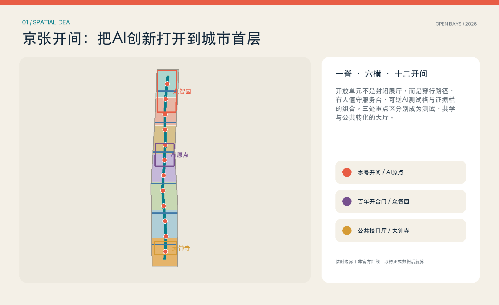
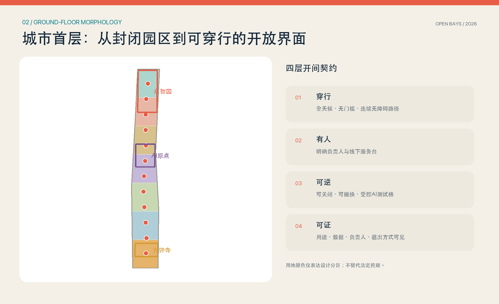
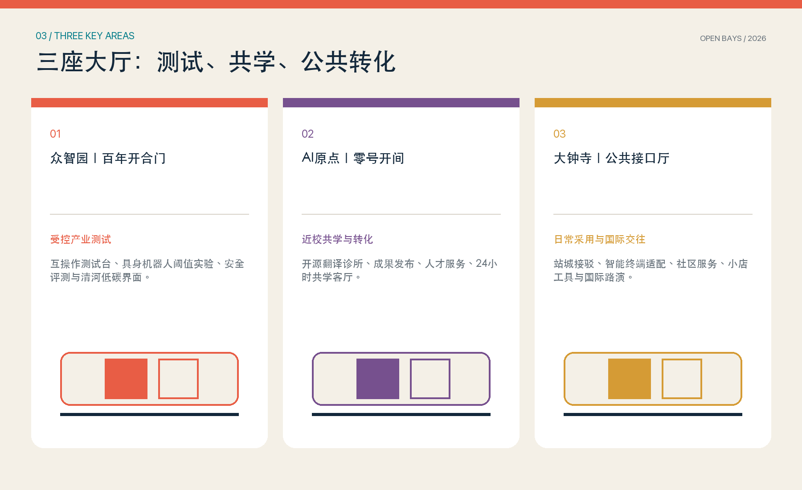
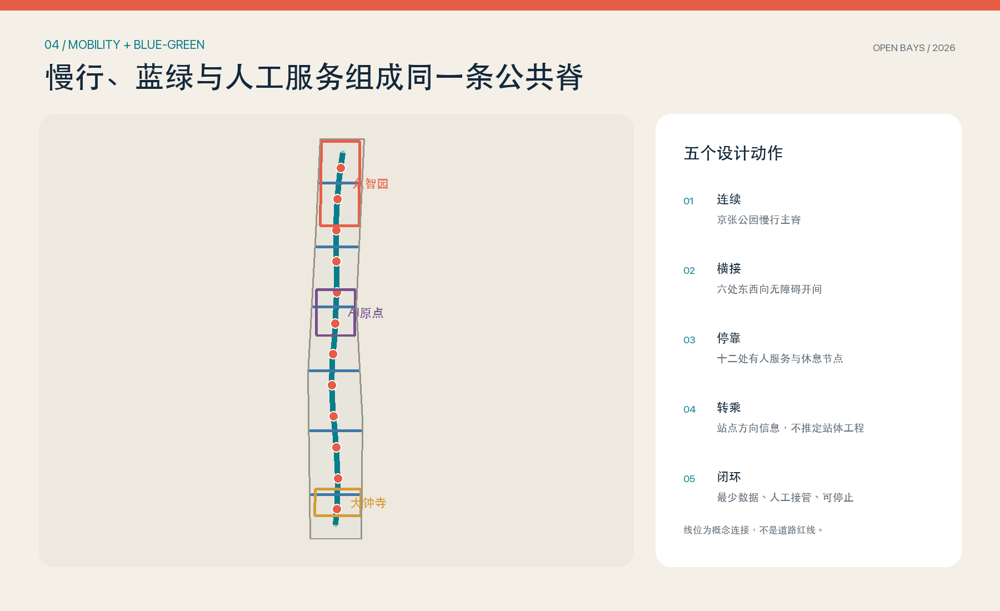
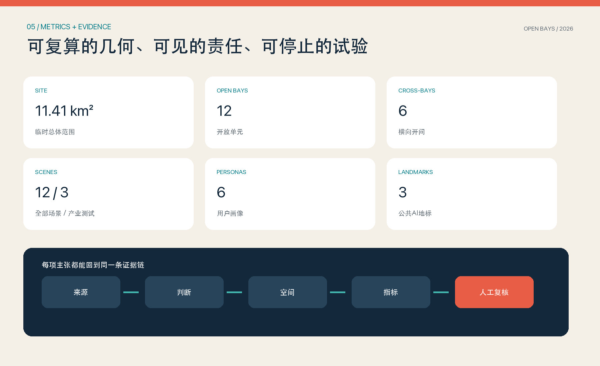

# 京张开间 OPEN BAYS JING-ZHANG：把AI创新打开到城市首层

## 设计依据与资料清单

本方案把公告和面向智能体任务书作为任务边界，把场地包登记的 GeoJSON、来源清单、任务索引和资料缺口作为可复核输入 [source:OFFICIAL-ANNOUNCEMENT] [source:AGENT-TASKBOOK]。公告提出的三层范围、三处重点区、控规深度城市设计和规划综合实施方案深度，分别进入 `compliance_matrix.json`、`design_depth_matrix.json` 和图纸；不是用一篇愿景文字替代专业成果。现状诊断首先承认当前没有正式总体范围、三处重点区四至、现状建筑、权属、法定控规、道路红线和市政管线等完整数据 [depth:existing_conditions_diagnosis]。

本次使用 `geometry/site_boundary.geojson` 和 `geometry/key_areas.geojson` 中的临时粗略多边形组织方案。它们均保持 `official_boundary=false`、`provisional_constraint`，只能用于生成、比较和临时复算；图面以低对比虚线表达，不是红线、审批依据或精确面积依据 [data:geometry/site_boundary.geojson#SITE-001] [source:BOUNDARY-SOURCE]。正式边界到位后，应替换边界并重新裁切用地、建筑、道路、绿地、公共空间、分期和指标，不能沿用本次面积值。

设计引用分三类：场地事实回到已登记的项目资料；专业要求回到标准矩阵；国际案例只作为机制启发，不证明京张现状。Punggol、Kalasatama、Barcelona 22@、MaRS、Seoul AI Hub、Mila 与 Kendall Square 均采用机构或政府的一手页面，版权仅限文字研究，不把外部图像带入成果。方案图、图标、字体排版与 GeoJSON 均由本次提交原创生成，许可边界见 `report/copyright_statement.md` [standard:PROJECT-OFFICIAL-ANNOUNCEMENT]。

## 三层范围工作框架

三层范围用同一个问题串联：如何让AI创新不只存在于园区楼内，而能被城市日常看见、使用、质疑和改进。统筹研究范围判断产业链和未来城市形态；总体设计范围把判断落到一条公共脊、六条横向开间与十二个开放单元；重点区域则验证测试、共学和公共转化三类模式。范围之间以“研究判断—空间原型—实施反馈”循环，而不是把三张尺度图简单叠加 [depth:three_level_scope_framework]。

| 层级 | 核心任务 | 京张开间回答 | 证据落点 |
| --- | --- | --- | --- |
| 统筹研究范围 | AI生态、人才和未来城市 | 研究—创业—公共采用的连续转化链 | 全球案例、画像、运营模型 |
| 总体设计范围 | 更新、用地、交通、市政、风貌 | 一脊六横十二开间的城市首层结构 | 用地、道路、绿地、公共空间图层 |
| 重点区域 | 三处详细设计 | 众智园测试厅、AI原点共学厅、大钟寺公共接口厅 | 三处临时重点区与项目清单 |

“一脊”沿京张遗址公园方向形成连续步行、骑行、蓝绿和人工服务界面；“六横”连接园区、社区、高校与站点方向；“十二开间”是可穿行的小尺度公共阈值。每个开间必须同时具备四层：普通公众无需注册即可通行的无障碍路径；明确负责人的有人服务台；可关闭、可撤换的AI测试格；公开用途、最少数据、负责人和退出方式的证据栏。总体结构落在道路和公共空间图层 [data:geometry/roads.geojson#ROAD-001] [metric:open_bay_count]。

该框架有意把“开放”变成空间构造而不是治理口号：门厅、骑楼、院落、桥下或首层边角都可成为开间，但只有在穿行权、人工服务、可逆试验和证据展示同时满足时才计入系统。当前位置为概念性配置，正式落位必须经过产权、消防、无障碍、市政、交通和运营主体核验 [depth:overall_spatial_structure]。

## 统筹研究范围产业与未来城市研究

京张带的独特机会不是再造一个孤立科技园，而是把海淀的高校策源、企业研发、开源协作、测试验证、创业服务和公共采用压缩到步行可见的城市首层。方案把产业链组织为“研究接口—受控测试—创业转化—日常采用—公开反馈”五段：众智园承载全栈自主创新与受控验证，AI原点承载近校开源协作和成果转化，大钟寺承载智能体、智能终端、商业服务与国际交流；两翼社区、高校和企业提供真实但受限的日常试点环境 [standard:PROJECT-AGENT-OPEN-CALL-TASKBOOK]。

七个全球案例只抽取可迁移机制 [metric:global_case_count]：

| 案例 | 一手机构信息中的机制 | 转译为京张动作 |
| --- | --- | --- |
| Punggol Digital District | 企业园区、大学与社区共址，开放数字平台支持试验 | 让产业测试与公共反馈在开间相遇，不复制平台架构 |
| Smart Kalasatama | 真实城区敏捷试点、居民共创 | 用小规模、限期、可停止的开放单元替代全域上线 |
| Barcelona 22@ | 创新活动与公共空间、居住和连通性并置 | 把研发与日常服务放到同一城市首层 |
| MaRS Centre | 实验室、创业办公、公共中庭和活动空间相邻 | 以有人值守公共阈值连接专业与公众 |
| Seoul AI Hub | 教育、创业、研发、产学合作组合 | 三处大厅分工而又通过公共脊互联 |
| Mila | 研究、产业伙伴与创业转化连续 | 在AI原点设置开源翻译和创业服务 |
| Kendall Square | 让创新与实验进入公共空间 | 用证据栏和可逆测试格把创新带到街道 |

未来城市形态因此不是遍布屏幕和传感器，而是“普通路径在前、数字服务在后；人工接管在前、自动化扩展在后”。AI只有在解决明确问题、采用最少数据、设定停止条件并提供人工替代时进入公共空间。开放单元还能成为人才的第三场所：研究人员能遇到维护者，创业者能看到真实使用障碍，居民能提出问题，学生能通过公开任务进入开源协作。外部案例来源只支撑这种机制研究，不支撑场地事实 [source:CASE-KALASATAMA] [source:CASE-PUNGGOL]。

品牌采用“开”字与铁路枕木的共同构形：两条纵线是百年京张连续性，两条横线是城市两侧进入AI创新的公共开口。中文主名“京张开间”强调小尺度、日常性和可进入；英文“OPEN BAYS JING-ZHANG”强调开放接口而非封闭展馆。珊瑚红代表公共邀请，青绿代表蓝绿脊，深蓝代表可核验的专业底图；不使用企业商标和未清权图像。

## 总体设计范围城市更新与控规深度城市设计

总体结构为“一条公共脊、三座大厅、六条横向开间、十二个开放单元”。用地仍使用场地包提供的国家用地分类子集，形成无缝、无重叠的七段设计分区；“开放单元”是叠加在科研、商业、社区服务、教育、居住和文化用地上的首层公共界面，不自造法定用地代码 [standard:MNR-LAND-USE-CLASSIFICATION-GUIDE] [data:geometry/land_use.geojson#LU-001]。绿地、步行连线和建筑原型由相同临时边界裁切，保证图面和指标能共同复算。

城市更新采用“先开门、再改造、后定量”的顺序。近期不依赖大拆大建：利用现有或待核实建筑的门厅、院落、架空层、桥下和边角地植入可逆构件；中期围绕六条横向开间修补无障碍、首层界面和过街；长期才在正式控规、权属、消防、市政和遗产评估基础上决定保留、改造或新建。`geometry/buildings.geojson` 中的建筑基底是空间原型，不是现状测绘，也不代表拆改留结论 [data:geometry/buildings.geojson#BLDG-001] [depth:development_intensity_controls]。

界面控制采用可核查的定性规则：公共脊沿线首层应有连续可见入口、雨雪遮蔽、坐憩与夜间基本照明；开放单元不得用强制刷脸、下载应用或消费作为进入条件；测试格与普通通行路径物理分离；设备、展陈和家具可在不破坏主体结构的前提下撤换。建筑高度、容积率、密度、退线和停车配建均不在现有资料支撑范围，`floor_area_ratio` 保持 unknown，待正式控规和现状测绘后按地块复核 [standard:MOHURD-CONTROL-DETAILED-PLANNING]。

## 重点区域详细设计

三处重点区的多边形来自临时粗略范围，只用于把设计任务落到可讨论空间 [data:geometry/key_areas.geojson#PROV-KEY-001] [metric:key_area_count]。详细设计采用“大厅＋若干开间＋一条横接”的共同语法，但产业角色不同。所有工程位置、建筑规模和交通组织要在取得正式四至、权属和专项条件后深化，当前图纸不主张法定边界。

| 重点区 | 大厅与地标 | 空间动作 | 产业/公共内容 | 实施前置条件 |
| --- | --- | --- | --- | --- |
| 众智园 | 百年开合门 | 以清河方向绿色界面连接受控测试院、展示门厅和对外接驳 | 互操作测试、具身机器人阈值实验、安全评测、标准共创 | 正式四至、河道与防洪、交通、平台运营方 |
| 北京AI原点 | 零号开间 | 缝合校区—园区—社区慢行，把成果发布、共学和人才服务打开到首层 | 开源翻译诊所、成果发布、人才服务、24小时共学 | 校园与园区边界、权属、消防、夜间运营 |
| 大钟寺 | 公共接口厅 | 围绕站点方向和四象限形成可达首层网络，接入商业与社区服务 | 无障碍终端适配、小店工具、公共服务、国际路演 | 站城工程、路口交通、市政管线、商业运营 |

众智园的“百年开合门”不是纪念性大门，而是一条可从公共绿地穿过的测试门厅。测试区与通行区用透明但可关闭的构件分隔，机械设备只在预约时段和受控场地运行，现场人员负责急停和告知。AI原点的“零号开间”将开源成果翻译成公众能理解的问题、演示和课程，并把知识产权、法务、融资和人才服务集中到邻近柜台。大钟寺的“公共接口厅”以站点和社区的日常客流检验终端、语言、无障碍和小店服务，失败时必须回到人工窗口 [depth:three_key_area_detailed_design]。

## AI 创新生态、人才画像与 AI+ 场景

六类画像覆盖研究者/创业者、社区居民与小店经营者、公共服务人员与设施维护者、高校学生与青少年、老年人及残障人士、国际访客与专业评审 [metric:persona_count]。画像不包含个人轨迹或商业标签，而是描述任务、时间、可达性、语言、人工帮助和退出需求。共同原则是：不注册也有基本服务；无智能手机也能获得帮助；自动化结论可解释并能转人工；现场有清晰的投诉和停止入口。

十二张场景卡对应十二个开放单元，其中前三项为受控产业测试 [metric:scenario_card_count] [metric:industry_test_scenario_count]：

| 编号 | 场景与位置 | 最少数据 | 人工接管与停止条件 |
| --- | --- | --- | --- |
| OB-01 | 众智园互操作测试台：模型、终端与开放接口联调 | 合成测试集、版本和错误日志 | 工程师现场签核；越权调用或错误率超阈即停 |
| OB-02 | 众智园具身机器人阈值实验：门、坡道、拥挤边界 | 设备状态、匿名障碍物轮廓 | 安全员急停；进入普通通行带即停 |
| OB-03 | 大钟寺无障碍公共终端兼容测试 | 测试任务、设备能力、匿名完成率 | 无障碍顾问和窗口人员复核；无法转人工即下线 |
| OB-04 | AI原点开源翻译诊所 | 用户主动提交文本、许可状态 | 译者/律师复核；版权不明不发布 |
| OB-05 | 公共脊慢行导引 | 路线、临时障碍和无障碍偏好 | 服务台提供纸质路线；定位不可用时停用个性化 |
| OB-06 | 社区健康服务导航，不作诊断 | 公开服务目录、用户主动选择 | 医护/热线接管；出现急症词直接提示急救 |
| OB-07 | 学习与课程顾问 | 公开课程、年龄段、主动目标 | 教师/志愿者复核；不做能力定级和招生决定 |
| OB-08 | 法律与政务办事导航 | 公开办事指南、用户描述 | 专业人员/正式窗口接管；不输出法律结论 |
| OB-09 | 小店多语工具 | 商户自有菜单、用户选定语言 | 店员确认价格与承诺；翻译冲突时以人工为准 |
| OB-10 | 京张文化注释漫步 | 已清权档案、位置节点 | 策展人审核；来源不明内容不展示 |
| OB-11 | 设施与气候运行服务台 | 设备工单、环境公开数据 | 维护人员派单；不直接控制关键基础设施 |
| OB-12 | 公共问题分流与人工转接 | 用户主动描述、问题类别 | 明示负责人和时限；敏感或紧急事项直接转人工 |

场景运行采用统一“开间票据”：目的、使用者、空间边界、最少数据、保存期限、模型/版本、现场负责人、人工替代、停止条件和公开结果摘要。票据贴在证据栏，同时进入可审计台账。未通过安全、隐私、无障碍、版权和运营复核的场景不开放；城市智能体不能替代规划审批、医疗诊断、法律意见和应急指挥 [source:AGENT-TASKBOOK]。

## 用地、建筑规模与拆改留方案

用地分区由七个水平带裁切临时总体范围，采用科研、商业服务、社区服务、教育科研、居住和文化等现有代码；该分区只表达功能协同，不推定地块权属或法定变更。用地拓扑在 EPSG:4548 下复核为完整覆盖、无设计空洞和无重叠 [depth:land_use_layout]。正式数据到位后，应先按官方地块和现状用途重建底图，再判断哪些开放单元能叠加，而不是机械保留本次条带。

建筑策略不以“旧=拆、新=留”分类，而以结构安全、历史价值、使用性能、首层可达性、产权意愿和碳影响形成决策树。A类保留并开放首层；B类小修和无障碍补齐；C类可逆改造为测试或服务空间；D类在专业鉴定和实施协议后更新。当前 `geometry/buildings.geojson` 仅表达36个可逆首层原型的可能尺度，建筑基底面积可复算但不能解释为现状存量或规划总量 [metric:building_footprint_area_sqm] [depth:retain_renovate_demolish]。

高度和体量采用“保持主要视廊、形成有节奏的首层开口、设备后置、屋顶设施整合”的建议性控制。没有现状建筑测绘、文保范围和法定高度前，不给出米数；没有总建筑面积，不给出容积率。正式深化需补充逐栋调查、结构与消防评估、产权访谈、历史建筑价值评估、日照和风环境分析，再把拆改留与分期、资金和运营主体绑定 [depth:height_massing_character] [standard:MOHURD-ARCH-DESIGN-DEPTH-2016]。

## 交通、轨道、市政与公共服务设施

交通系统以普通步行和骑行为基础，不以自动驾驶或智能终端替代基本可达。一条纵向公共脊串联三处重点区方向，六条横向开间优先连接东西两侧的高校、园区、社区和站点方向 [metric:cross_bay_count]。每个横接需在正式勘察中核验道路穿越、坡度、路口信号、夜间照明、遮阴、非机动车停放和连续无障碍；本次线位是概念连接，不是道路红线或站体工程 [data:geometry/roads.geojson#ROAD-002]。

站城接口遵循“信息先行、轻量补缝、工程后置”：近期用人工服务台、统一导视和可访问的纸质/数字路线解决换乘信息；中期在专项批准后修补坡道、过街、停放和风雨连廊；涉及站体、地下空间、桥梁和道路工程的长期项目必须进入交通、市政、消防和施工安全审查。停车数量、道路断面和站点设施规模因缺正式资料保持待确认 [depth:traffic_rail_slow_parking]。

市政与新基建采用“小单元、可隔离、可计量”的接口。开放单元优先使用既有低压电和网络，新增设备有独立断电、用能计量和物理锁闭；端侧计算只处理经过批准的最少数据，不把原始公共空间影像长期留存；关键基础设施不由开放场景直接控制。正式落地前须取得给排水、电力、通信、燃气、热力、防洪、消防、环卫和地下管线资料，并完成容量及安全复核 [depth:municipal_new_infrastructure] [data:geometry/constraints.geojson#CONSTRAINT-001]。

## 蓝绿空间、公共空间与城市风貌

蓝绿空间不是AI设备展架，而是普通城市生活的主场。京张开放脊首先保证连续步行、骑行、树荫、雨雪遮蔽、坐憩、饮水和无障碍，再在不妨碍通行的开间中加入服务与试验。六条横接把公园方向与两侧城市织补，十二个节点提供停靠、人工问询和社区活动；绿地和公共空间比例由提交几何直接复算，但只对临时边界有效 [metric:green_ratio] [metric:public_space_ratio]。

开放单元的公共性通过四个可见细节表达：地面连续且不设消费门槛；服务台朝向主通行带并有低位台面；测试格边界和运行状态清晰；证据栏列出用途、数据、负责人、停止方式和结果摘要。这样，AI既不隐身于基础设施，也不以巨屏占领公共空间。临时活动必须保留消防疏散、安静通行和非数字替代 [depth:blue_green_public_space] [data:geometry/public_space.geojson#PUBLIC-001]。

城市风貌把百年京张铁路的“连续、枕木、开合”与中关村开源文化的“贡献、版本、公开问题”结合。三座地标不是昂贵造型物：零号开间是一座可不断更新的公共版本门厅；百年开合门展示试验如何安全开启和关闭；公共接口厅让国际访客、居民和企业在同一首层相遇 [metric:landmark_count]。色彩、导视和贡献墙由原创图形系统构成，历史图片和企业标识只有在清权后才能加入 [standard:MOHURD-URBAN-DESIGN-MEASURES]。

## 更新项目清单、实施政策与分期计划

实施不以一次性建设“大园区”为起点，而以可撤销的小项目建立信任。三期范围记录在 `geometry/phasing.geojson`：一期100天至一年完成运营协议、三处大厅轻量试点和四个优先开间；二期二至三年在专项审批后完成六条横向开间的无障碍与首层修补；三期结合正式控规、权属和基础设施更新形成连续开放脊。分期多边形是工作包，不是资金或审批承诺 [data:geometry/phasing.geojson#PHASE-001] [depth:phasing_implementation]。

| 项目 | 近期交付 | 中长期接口 | 责任与停止点 |
| --- | --- | --- | --- |
| P01 零号开间 | 开源翻译、成果发布、人工服务台 | 近校转化和人才服务网络 | 运营方每日开闭；版权/安全未通过即停 |
| P02 百年开合门 | 互操作与机器人受控测试 | 清河界面与产业标准平台 | 安全员急停；不进入普通通行带 |
| P03 公共接口厅 | 无障碍终端、小店与公共服务适配 | 站城和国际交流空间 | 人工窗口兜底；不可转人工即下线 |
| P04 四处优先开间 | 导引、学习、文化、设施服务 | 扩展至十二个开放单元 | 每季度公开票据与问题清单 |
| P05 六条横向开间 | 断点调查和临时导视 | 坡道、过街、风雨连廊 | 工程需专项审查和产权许可 |
| P06 开放脊长期更新 | 运营基线与公开指标 | 蓝绿、首层和市政协同更新 | 正式边界、控规和实施主体为前置 |

政策工具包括首层开放使用协议、短期可撤销占用许可、试验票据、公共利益时段、运营补贴与退出复原金。每个场景按月记录服务量、人工接管、故障、无障碍问题和投诉，不以停留时长或人脸识别衡量活力；季度公开问题清单，年度由居民、维护者、专业人员和运营方共同决定继续、修改或关闭 [depth:renewal_project_list]。全球活动采用“开间开放周”而不是封路式盛会，日常服务优先于宣传。

## 指标体系、面积复算与合规矩阵

指标分三层。几何层由 EPSG:4548 复算临时范围面积、建筑原型基底、绿地比例、公共空间比例和图层数量；方案层记录一脊、六横、十二开间、三座大厅、六类画像和十二个场景；运营层在试点后记录人工接管率、停止事件、无障碍问题关闭率、场景复用和公众问题响应。前两层能由当前包复核，运营层不能在实施前虚构 [depth:metrics_recalculation]。

当前总体范围面积约为11.41平方公里，只是对临时多边形的投影复算 [metric:site_area_sqm]。`metrics.json` 保存公式、单位、来源文件、置信度和假设；`floor_area_ratio` 因缺正式边界、控规和总建筑面积保持 unknown。`compliance_matrix.json` 覆盖公告1.3、1.4、1.5及 agent.1—agent.6；标准矩阵和深度矩阵分别说明专业依据和15项成果深度。所有 known 数字都应在改动几何后重新运行脚本，不能手工改图而不改指标。

“开间”是否成功不看屏幕数量，而看四个公共结果：不使用AI的人是否仍能顺畅通过；需要帮助的人是否能找到真人；试验是否能在风险出现时关闭；设计决定是否能回到来源、几何、指标和责任人。专业审查继续以空间拓扑、法规、工程、无障碍、版权和运营可持续性为准，AI自检不替代注册规划师、建筑师和工程师判断 [standard:MOHURD-CONTROL-DETAILED-PLANNING]。

## 风险、版权与合规说明

首要风险是把临时粗略边界误读为官方红线。所有面积、位置和分期只在提交几何内成立，正式边界和三处重点区四至发布后必须全量重算 [source:KEY-AREA-SOURCE]。第二类风险是缺少现状建筑、权属、道路、管线、防洪、消防、文保、生态和公共设施容量；因此拆改留、站城工程、建筑规模和市政方案都保持建议或待确认。三处“专业确认门”在 `constraints.geojson` 明示这些前置条件 [depth:risk_missing_data]。

第三类风险来自公共AI：误导、偏见、隐私泄露、无障碍排除、版权侵权、设备伤害和责任悬空。统一控制包括最少数据、禁用强制生物识别、用途和保留期可见、人工兜底、受控物理边界、急停、投诉入口、版本记录和公开结果摘要。医疗、法律、规划审批、应急和关键设施控制不得交给开放场景自动决定。任何试点先小规模、限期运行，达到停止条件立即下线。

成果中的空间图、信息图、文字和代码为本次原创；底图仅使用仓库提供的临时边界与登记资料。国际案例不复制图片或版式，只对一手机构公开的机制进行摘要。字体使用操作系统或PDF标准字体，不嵌入未经授权的商业资产；页面不加载远程脚本、地图瓦片、字体、iframe、表单或跟踪服务。方案不声称获得政府批准、正式控规、产权同意、建设资金或运营承诺 [source:SITE-PACKAGE]。

## 参考资料

项目依据包括官方公告、面向智能体任务书、公开场地包、来源登记、处理后的任务导航和仓库内专业参考。国际案例包括 JTC Punggol Digital District、Forum Virium Helsinki Smart Kalasatama、Barcelona 22@、MaRS Centre、Seoul AI Hub、Mila 与 Cambridge Kendall Square 的机构/政府一手页面 [source:CASE-MARS] [source:CASE-SEOUL-AI-HUB]。它们只支撑机制研究，不是京张现状或法定控制依据。

完整路径、URL、用途和许可说明见 `sources.json`；假设见 `assumptions.json`；公告与智能体任务逐条覆盖见 `compliance_matrix.json`；专业标准和成果深度见 `standard_matrix.json`、`design_depth_matrix.json`。GeoJSON 是空间真值，`metrics.json` 是数值真值，A3/A0 与离线HTML是它们的人类可读表达 [source:SOURCE-REGISTRY]。

建议评审阅读顺序：先看总体图和三处大厅，理解空间命题；再看十二场景和实施项目，判断公共价值与运营责任；最后回到来源、几何、指标与自检，核验边界、复算和风险。若正式数据与当前假设冲突，以正式数据为准并重新生成全包，不能选择性保留有利数字 [source:PROCESSED-FACT-PACK]。
