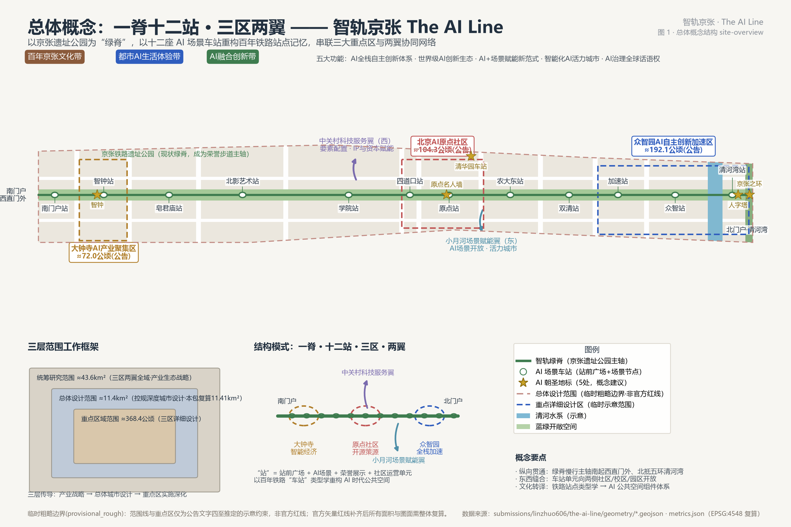
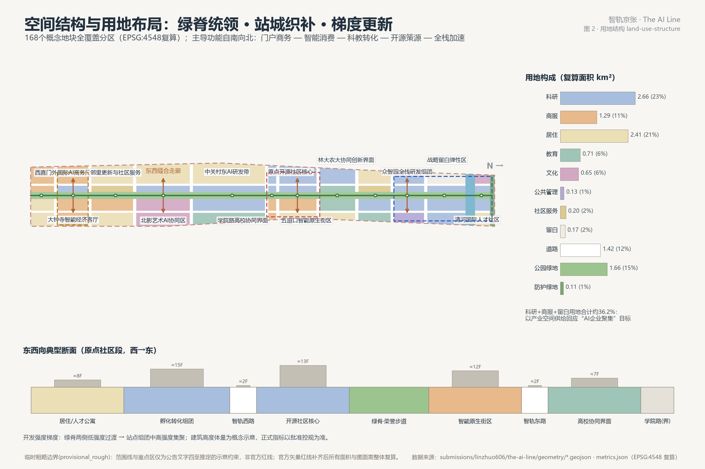
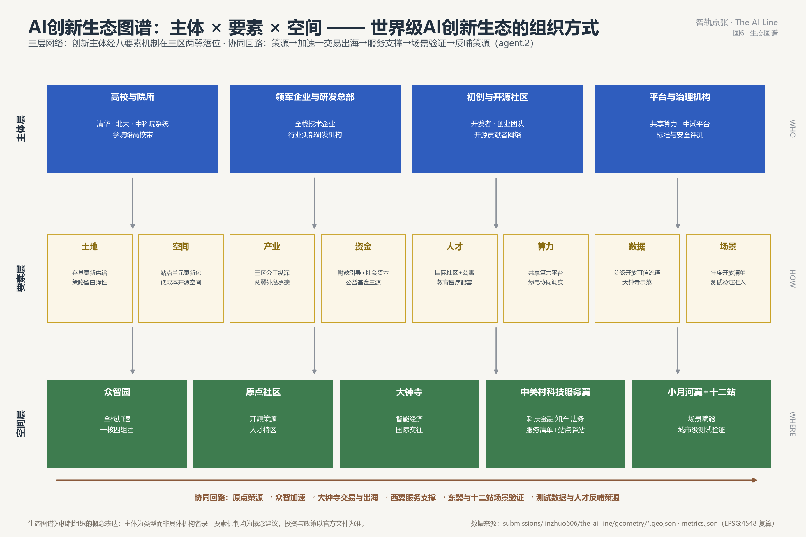
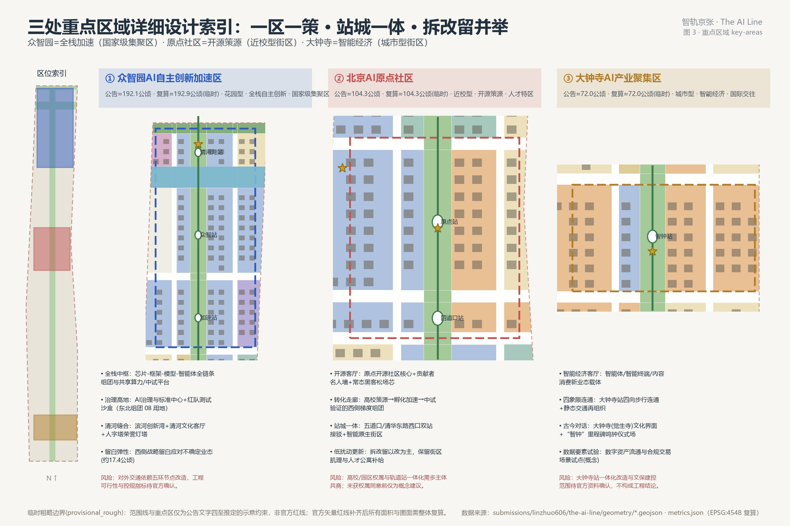
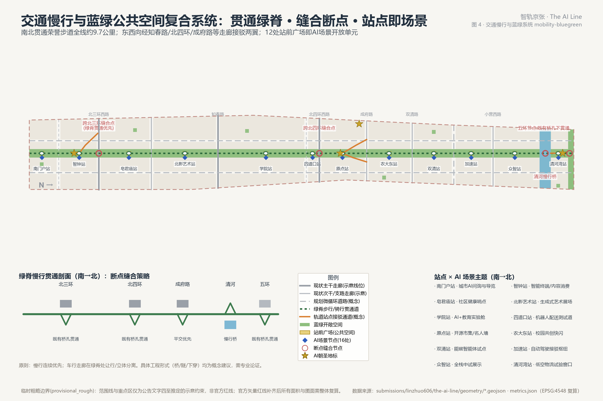
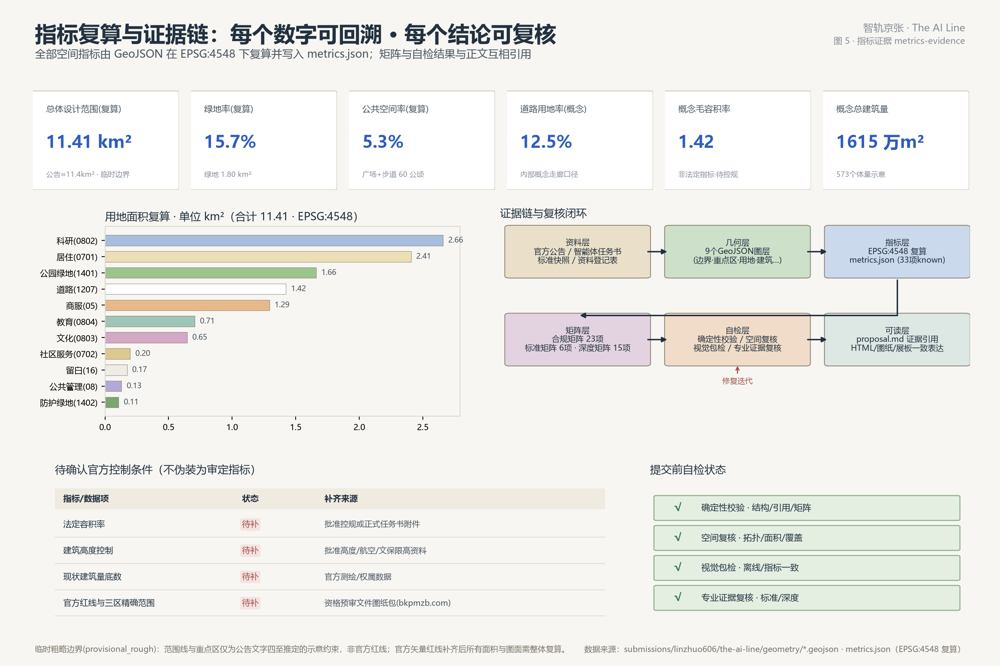

# 智轨京张 The AI Line：百年京张AI创新带城市设计方案

本方案由 AI agent 生成，属于面向全球智能体开源征集的开放共创建议。所有空间落地建议均为概念建议、参考方案、可供专业团队深化研究的素材，不替代正式规划，不构成政府审定结论或实施承诺 [source:DATA-SRC-AGENT-TASKBOOK-20260518]。

本方案的一个特殊之处需要在开篇说明：**方案作者（GitHub: linzhuo606）是一位盲人城市使用者**。方案的城市设计骨架由 AI 完成工程转译，而全部无障碍设计框架（见"无障碍之线"专章）由作者以第一人称的日常出行经验定义——包括对"分区保护"方案的否决与"连贯优先、融合不隔离"原则的确立。这使本方案成为一次真实的人机共创：人定义需求与价值排序，AI 负责空间化与数据化。方案 Logo 以"人"字形轨道为母题，"以人为本"在本方案中不是修辞，而是由一位最依赖无障碍环境的使用者亲自把关的设计承诺。

## 设计依据与资料清单

本方案的任务依据是《百年京张AI创新带城市设计国际方案征集资格预审公告》（北京市规划和自然资源委员会海淀分局，2026-05-09）[source:DATA-SRC-OFFICIAL-ANNOUNCEMENT-20260509] [standard:PROJECT-OFFICIAL-ANNOUNCEMENT]，以及《面向全球智能体开展百年京张AI创新带城市设计开源征集任务书摘录》[source:DATA-SRC-AGENT-TASKBOOK-20260518] [standard:PROJECT-AGENT-OPEN-CALL-TASKBOOK]。两份文件确定了三层范围、三处重点区域、1.3/1.4/1.5 设计任务与 agent.1–agent.6 六项智能体任务。资料使用规则遵循仓库公开资料登记表 [source:DATA-SRC-SOURCE-REGISTRY-20260607]：本方案区分了三类资料——（1）可作为 formal 任务依据的官方公告、任务书与标准快照；（2）仅作导航层使用的仓库处理资料（事实包、范围摘要、任务索引）[source:DATA-SRC-PROCESSED-FACT-PACK-20260607]；（3）仅可用于临时生成与展示的临时粗略边界 [source:DATA-SRC-PROVISIONAL-BOUNDARIES-20260605]。

专业标准依据本地参考快照：《城市设计管理办法》[standard:MOHURD-URBAN-DESIGN-MEASURES]、《城市、镇控制性详细规划编制审批办法》[standard:MOHURD-CONTROL-DETAILED-PLANNING]、《国土空间调查、规划、用途管制用地用海分类指南》[standard:MNR-LAND-USE-CLASSIFICATION-GUIDE]；《建筑工程设计文件编制深度规定（2016年版）》尚无官方清权快照，仅登记为待补参照项 [standard:MOHURD-ARCH-DESIGN-DEPTH-2016]。站点包内的枚举、量纲与校验模式（enums/schemas/ranges）是本包结构化数据的直接约束 [source:SITE-PACKAGE]。

证据组织方式：`sources.json` 登记全部来源，`assumptions.json` 登记全部假设与精度限制，`compliance_matrix.json` 覆盖 1.3/1.4/1.5 与 agent.1–6 共 23 项必答任务，`standard_matrix.json` 覆盖全部强制标准，`design_depth_matrix.json` 覆盖 15 项正式深度项；正文以 `[source:...]`、`[standard:...]`、`[depth:...]`、`[data:...]`、`[metric:...]` 标签与上述文件互相锁定。未纳入本清单的资料一律不作为设计依据；本方案不使用任何未经清权的资料或秘密图件。

## 三层范围工作框架

本方案按公告 1.4 建立三层工作框架 [source:DATA-SRC-OFFICIAL-ANNOUNCEMENT-20260509] [depth:three_level_scope_framework]：

- **统筹研究范围（约43.6平方公里）**：三区两翼所在区域，北至北五环路、东至京藏高速、南至西直门外大街、西至万泉河路。本层解决产业生态战略、区域协同与未来城市形态命题，不生成地块级几何。
- **总体设计范围（约11.4平方公里）**：京张遗址公园周边1-2公里城市地区。本包的全部设计图层在此范围内生成，提交边界采用仓库临时粗略多边形 [data:geometry/site_boundary.geojson#SITE-001]，EPSG:4548 复算面积 [metric:site_area_sqm] 约11.41平方公里，与公告值 [metric:announced_overall_design_area_sqm] 约11.4平方公里一致（差异0.1%）。
- **重点区域范围（约368.4公顷）**：自北向南为众智园AI自主创新加速区、北京AI原点社区、大钟寺AI产业聚集区三处 [data:geometry/key_areas.geojson#PROV-KEY-001]，重点区数量 [metric:key_area_count] 为3，临时多边形合计面积 [metric:key_area_total_area_sqm] 约369.3公顷。

必须澄清的精度边界：当前范围线与三处重点区多边形均为 `provisional_rough` 临时粗略边界，来源是公告文字四至与面积约束的推定 [source:DATA-SRC-PROVISIONAL-BOUNDARIES-20260605]，`official_boundary=false`、`geometry_role=provisional_constraint`。它们可用于本方案的生成、展示与自检，但不得作为官方红线、审批依据或精确面积结论；官方矢量红线（预计随资格预审文件图纸包提供）补齐后，用地分区、绿地、公共空间、建筑、分期五个设计图层与全部面积指标需按指标体系章的清单整体复算。三层传导逻辑为：研究范围定产业战略与协同网络 → 总体设计范围落空间结构与更新框架（控规深度） → 重点区域落地块与建筑深度（综合实施方案深度），并通过同一套 GeoJSON/指标体系保持上下一致。

## 统筹研究范围产业与未来城市研究

**现状研判与战略定位** [depth:existing_conditions_diagnosis]：本区域是中国AI创新资源密度最高的地区之一——研究范围内集聚了顶尖高校群（清华、北大、中科院系统及学院路高校带）、国家级科研平台与大量AI企业；京张铁路遗址公园自2019年铁路入地后形成贯穿南北的线性公共空间；三区两翼格局（AI原点社区、众智园加速区、大钟寺集聚区+中关村科技服务翼、小月河场景赋能翼）已由任务书确立 [source:DATA-SRC-AGENT-TASKBOOK-20260518]。核心问题是：创新资源被环路与大院切割、遗址公园慢行断点多、AI创新活动缺少可感知的公共表达。本方案的回答是把"带"做成"线路"——**一脊十二站、三区两翼**：绿脊承担贯通，车站承担缝合与场景，重点区承担产业纵深，两翼承担要素与场景外溢。**三大定位×五大功能映射（回填补入）**：任务书确立的三大定位由本结构逐一承载——**百年京张文化带**由"带"承载（遗址公园绿脊、清华园车站时间机器、站名类型学与荣誉步道、"从人字形到人本智能"文化叙事）；**都市AI生活体验带**由"站"与东翼承载（十二站场景开放单元、14张场景卡、小月河场景赋能翼、无障碍之线与青年友好）；**AI融合创新带**由"三区"与西翼承载（众智园全栈加速、原点社区开源策源、大钟寺智能经济、中关村科技服务翼）。五大功能对应落位：**AI全栈自主创新体系**→众智园“一枢四团”；**世界级AI创新生态**→原点社区开源生态与区域创新协同回路（生态图谱见统筹章）；**AI+场景赋能新范式**→十二站场景卡与年度场景开放清单；**智能化AI活力城市**→绿脊活力带、公共空间组件库与城市感知底座；**AI治理全球话语权**→众智园AI治理与标准中心、全球AI治理圆桌与Human Review制度。三区两翼协同回路详见统筹章区域协同接口 [source:DATA-SRC-AGENT-TASKBOOK-20260518]。

**命名体系与视觉识别方向（agent.1）**：主名称「**智轨京张**」，英文名「**The AI Line**」。命名逻辑：铁路之"轨"与技术演进之"轨"双关，"The AI Line" 对标国际知名线性公园品牌的传播句式，具有极强的国际辨识度与延展性。命名体系分三层：带（The AI Line / 智轨京张）— 站（十二座场景车站，如原点站、智钟站，恢复铁路"站名"类型学）— 道（荣誉步道 The Honor Track）。Logo 方向：以詹天佑"人"字形铁路的三线汇聚轨迹为母题，轨迹端点化为神经网络节点，整体构成汉字「人」——同时表达"京张工程自立""人工智能""以人为本"三重含义；延展系统采用轨道线路图（subway-map）语言，站点即场景、线路即叙事，可直接转化为导视、周边与传播物料。站点选址与数量在深化中将向**真实锚点**校准——现存遗构（清华园车站）、既有轨道车站与人流断点优先，数量服从锚点而非等分，让"车站类型学"锚定真实遗产而非发明地名。本方向仅为原创概念，不使用任何现有商标、字体或企业标识，正式启用前需商标查重 [source:DATA-SRC-AGENT-TASKBOOK-20260518]。标识成品概念稿如下（原创矢量绘制，标注"概念稿未注册"）：

**区域协同回路（回应"三区两翼+区域协同性"）**：本带不是孤岛，方案提出四组外部协同接口——(1) 与**北纬社区**共建"开源走廊"，贡献者名人墙与开发者积分体系互认；(2) 与**未来科学城、怀柔科学城**建立"基础研究→中试验证"接力接口，众智园中试组团承接两地原始创新的工程化验证；(3) 与**北京经开区**建立"验证→量产"接口，智能终端与机器人场景在本带完成城市级测试后转入经开区制造放大；(4) 面向**京津冀**输出场景开放清单与无障碍开放数据标准，形成可复制的制度外溢。每组接口须明确数据共享边界与知识产权归属，跨区域数据流动遵守数据出域合规要求，相关机制均为概念建议待多方共商。

**全球AI创新生态案例与可转化机制（agent.2，7例）**：
1. **波士顿肯德尔广场（Kendall Square）**——大学与企业街区级混合，"最具创新密度的一平方英里"；转化：原点社区的校区-园区-街区融合与一层界面开放度管控。
2. **伦敦国王十字知识区（King's Cross）**——铁路场站遗产更新叠加头部AI企业总部与开放公共空间；转化：铁路遗产叙事与产业旗舰空间同场共生的更新模式，与本带最直接对标。
3. **巴黎 Station F**——车站建筑改造为超大规模创业园，运营方主导生态策展；转化：站房型孵化空间与"策展式招商"运营机制。
4. **新加坡纬壹科技城（one-north）**——二十年分期滚动开发、生活实验区（Living Lab）机制；转化：分期实施与场景开放运营的制度设计。
5. **纽约高线公园（High Line）**——线性遗产公园与"公园之友"社会化运营；转化：荣誉步道的公益基金与志愿者运营机制。
6. **上海西岸**——滨水文化带叠加AI大会与企业集聚；转化：以年度事件锚定城市品牌的路径。
7. **深圳南山科技园区群**——产学研居高密度混合与快速迭代的产业载体供给；转化：大钟寺城市型街区的载体供给与业态混合策略。
案例均为公开常识性概述，仅用于机制转化参考，不作为投资或数据依据（详见 `assumptions.json` A-CASES-001）。

**生态体系的组织方式（生态图谱，回填补入）**：世界级AI创新生态在本方案中落为"**主体×要素×空间**"三层网络（图6）——主体层为高校与院所、领军企业、初创与开源社区、平台与治理机构四类；空间层为三区两翼与十二站；中间由任务书点名的八项要素机制贯通，逐项如下表（均为概念建议）：

| 要素 | 机制 | 空间落位 | 责任主体类型 |
|---|---|---|---|
| 土地 | 存量更新供给＋策略留白弹性 | 约17.4公顷战略留白（众智园西） | 政府＋平台公司 |
| 空间 | 站点单元更新包＋低成本开源空间 | 十二站单元、开源客厅 | 平台公司＋运营方 |
| 产业 | 三区分工纵深＋两翼外溢承接 | 众智园/原点/大钟寺＋两翼 | 政府＋企业 |
| 资金 | 财政引导＋社会资本＋公益基金三源 | 项目×资金来源表（更新项目清单章） | 政府＋社会资本＋基金会 |
| 人才 | 国际社区＋人才公寓＋教育医疗配套 | 国际人才社区（清河湾0701/0702地块） | 政府＋高校＋运营方 |
| 算力 | 共享算力平台＋绿电协同调度 | 众智园加速中枢（场景9联动） | 平台机构＋能源企业 |
| 数据 | 分级开放＋可信流通 | 大钟寺数据要素示范（首个示范数据集为无障碍开放数据层） | 政府＋数据交易机构 |
| 场景 | 年度开放清单＋测试验证准入 | 十二站与东翼场景卡（场景章） | 政府＋运营方＋共创委 |

**协同回路**：原点策源→众智加速→大钟寺交易与出海→西翼专业服务支撑→东翼与十二站场景验证→测试数据与人才反哺策源，形成闭环（图6底部）。**中关村科技服务翼支撑机制**：西翼以中关村西区既有的科技金融、知识产权、法律咨询、技术转移专业服务集群为供给端，与本带建立"**服务清单＋站点驿站**"轻接口——三区企业按清单调用服务，服务机构在站点单元设轻量驿站，不新增载体建设、不重复西区功能，机制为概念建议待多方共商。**AI创新指数（概念）**：以生态八要素为维度构建年度评估指标（要素供给量、开源贡献量、场景开放数、测试转化率等），由运营主体年度公开，作为生态健康度的公共仪表盘。

**未来城市形态与文化叙事（agent.5 核心）**：本方案提出"**从人字形到人本智能**"的百年叙事——1909年京张铁路以"人"字形轨道实现工程自立；此后中关村长期孕育电子信息与开源创新文化；2020年代的AI自主创新在同一空间带上延续"自立、开放、人本"的精神谱系。空间转译为三条文化线索：轨道线索（遗址公园、清华园车站、站名体系）、创新线索（贡献者名人墙、开源客厅、里程碑鸣钟）、人本线索（AI治理中心、人工复核制度、全龄场景）。据此定义面向未来的 AI 文化（开源共创）、AI 社会（人机协同且人类最终判断）、AI 城市（可感知、可交互、可进化的站点化城市）[source:DATA-SRC-AGENT-TASKBOOK-20260518] [depth:overall_spatial_structure]。

**京张历史文化资源点（回填补入，公开资料口径）**：清华园车站遗构（文保建筑，时间机器展场所依）、京张铁路遗址公园既有段与铁道记忆场所、大钟寺（觉生寺）古钟文化与永乐大钟（智钟的对话对象）、北影及沿线艺术资源（公告点名，北影艺术站联动AI艺术双年展）、中关村创新文化谱系——从"电子一条街"的市场试验，到科学城时代的制度创新，再到开源社区的全球协作；中关村精神的当代形态就是开源共创，这正是本方案把"贡献者"立为荣誉主体、把名人墙与开源客厅放在叙事中心的根据。全部资源利用遵循先保护后利用，以官方文保边界为准 [data:geometry/constraints.geojson#CN-03]。

**国际传播文案（agent.5 规定输出，回填补入；中英对照，原创概念稿，可直接使用）**：
主口号：**"从人字形到人本智能 / From the People-Shaped Track to People-Centered AI"**。
展览与网站首屏文案：**"1909年，京张铁路用一个'人'字形折返，让火车爬上了自己的坡。2026年，同一条线上，人工智能正在学习同一件事：把不可能的坡，变成所有人都能走的路。智轨京张 The AI Line——一条从工程自立到智能自立的百年轨道，一条每个人（包括看不见它的人）都能完整走完的城市线路。/ In 1909, the Jing-Zhang Railway climbed its impossible grade with a people-shaped switchback. In 2026, on the same line, artificial intelligence is learning the same lesson: turning impossible slopes into paths everyone can walk. The AI Line — a century of self-reliance, from engineering to intelligence; a city line that everyone, including those who cannot see it, can walk end to end."**
媒体导语：**"在北京海淀，一条百年铁路走廊正被重写为AI时代的公共界面——车站变成场景，轨道变成叙事，而它的无障碍框架由一位盲人作者亲自定义。/ In Beijing's Haidian District, a century-old railway corridor is being rewritten as the public interface of the AI era — stations become scenarios, tracks become narrative, and its accessibility framework is defined first-hand by a blind author."**
文案为原创概念稿，正式启用前与品牌标识一并完成查重。

**畅想：2035年，The AI Line 上的一天（叙事性愿景，非承诺）**：清晨六点半，本方案作者——一位盲人城市使用者——从南门户站出发向北走。导引带在脚下连续不断，过街时他用随身的实体卡为自己申请了延长绿灯；路过早餐店，门侧功能牌的高辨识码让手机轻声报出“包子铺，营业中”。八点，一位刚落地北京的工程师在清河湾的国际人才社区醒来，用母语向问询柱问路，穿过人字门桥孔去众智园面试。午后，中学生在教育实验舱训练他们的第一个小模型，银发居民在站亭深檐下下棋，导盲犬在服务点饮水。傍晚，一个开源模型的重大版本在开源客厅发布，发布者沿荣誉步道走到原点纪念场，智钟为里程碑鸣响，人字塔亮起——而作者此刻正走完全线最后一公里。他不需要看见灯塔：整条线路的声音、触感与秩序，就是他的灯塔。这不是对技术的承诺，而是对城市的承诺——**自适应、可进化的城市，首先是对最依赖它的人可用的城市**。

## 总体设计范围城市更新与控规深度城市设计

**总体空间结构** [depth:overall_spatial_structure]：形成"**一脊、十二站、三区、两翼、多廊**"结构。一脊即京张遗址公园绿脊（含荣誉步道主轴）；十二站为清河湾、众智、加速、双清、农大东、原点、四道口、学院、北影艺术、皂君庙、智钟、南门户十二座AI场景车站（站前广场+场景节点+荣誉展示+社区运营的复合单元）；三区为三处重点区域；两翼向西衔接中关村科技服务、向东衔接小月河场景赋能；多廊为知春路、北四环、成府路、双清路等东西缝合走廊 [data:geometry/roads.geojson#RD-04]。空间结构详见图1、图2。

**用地布局与功能比例**：总体设计范围按噪声最小的"线网切分"方式划分为168个概念地块，全覆盖、无缝隙、无重叠 [data:geometry/land_use.geojson#LU-001] [standard:MNR-LAND-USE-CLASSIFICATION-GUIDE]。复算结果：科研用地 [metric:research_land_area_sqm] 约2.66平方公里（23.3%，含AI研发、孵化转化、中试验证组团），商业服务业用地 [metric:commercial_land_area_sqm] 约1.29平方公里（11.3%）。

其余各类复算：居住及社区服务用地 [metric:residential_land_area_sqm] 约2.61平方公里（22.9%），公共管理与文化教育用地 [metric:public_service_land_area_sqm] 约1.49平方公里（13.0%），战略留白 [metric:reserved_flex_land_area_sqm] 约0.17平方公里应对AI业态不确定性，道路用地率 [metric:road_area_ratio] 约12.5%。产业空间（科研+商服+留白）合计约36.2%，直接回应“AI企业聚集目标与AI产业空间规模”的公告要求；居住与配套占比约1/4，维持职住商服均衡 [source:DATA-SRC-OFFICIAL-ANNOUNCEMENT-20260509]。

**创新指标体系（概念建议）**：建议建立"AI创新指数"三级指标——生态层（全栈要素完备度、开源贡献量、标准与治理产出）、空间层（产业空间供给、场景开放面积、慢行连通度）、人本层（人才密度、全龄服务覆盖、公众参与度）。本包已把空间层指标做成可复算基线（见指标体系章），生态层与人本层指标因缺官方统计口径列为待补 [standard:MOHURD-CONTROL-DETAILED-PLANNING]。

**城市更新总体框架**：以"站城织补"为主线的低扰动更新——(1) 更新潜力空间沿绿脊两侧与站点周边梯度识别；(2) 更新方式以保留提质、改造活化为主、拆除新建为辅（详见拆改留章）；(3) 更新单元与十二站一一对应，每站形成"站前广场+首层开放界面+功能植入"的最小更新包；(4) 校区园区街区融合重点落在原点社区与学院路界面。更新实施项目详见更新项目清单章 [data:geometry/phasing.geojson#PHASE-1]。本章全部强度与规模结论为概念建议，法定控规指标（容积率、高度、密度、绿地率）在公开资料包中缺失，均标注为待确认 [standard:MOHURD-CONTROL-DETAILED-PLANNING]，不作为审定指标使用。

## 重点区域详细设计

三处重点区按"定位+空间结构+建筑更新+交通慢行+公共空间+AI场景+实施风险"完成小方案设计 [depth:three_key_area_detailed_design]，索引见图3。三区临时多边形均在总体范围内、互不重叠，复算面积与公告值偏差在临时精度内。

**① 众智园AI自主创新加速区**（公告约192.1公顷，复算 [metric:zhongzhiyuan_area_sqm] 约192.9公顷）[data:geometry/key_areas.geojson#PROV-KEY-001]：定位"花园型·全栈自主创新·国家级集聚区"。空间结构为"一枢四团"——加速中枢（共享算力、中试平台、成果发布场）居中，全栈研发西/东组团、算力实验组团、企业加速组团环列；东北角设 AI 治理与标准中心（08用地）承担标准制定、安全评测与红队测试沙盒功能，回应"标准制定与安全治理"任务 [source:DATA-SRC-OFFICIAL-ANNOUNCEMENT-20260509]。北侧滨清河形成创新湾：清河文化客厅（0803）挖掘清河文化、国际人才社区（0701）与人字塔荣誉灯塔构成北门户。西侧设战略留白弹性区约17.4公顷。建筑以新建+改造为主（站点组团12-15层、滨河8-10层，概念体量），绿地水系一体化设计结合清河滨水绿廊。对外交通依托五环节点改造与小营西路走廊（概念线位）。风险：对外交通与五环节点改造均需工程论证，控规指标待官方确认。

**② 北京AI原点社区**（公告约104.3公顷，复算 [metric:origin_community_area_sqm] 约104.3公顷）[data:geometry/key_areas.geojson#PROV-KEY-002]：定位"近校型·开源策源·人才特区"。空间结构为"西转化、中开源、东活力"三带：西侧四道口成果转化区与孵化加速组团承接高校策源成果，形成"策源→孵化→中试"梯度；中部开源社区核心紧贴绿脊，布置开源客厅（常态黑客松、模型发布会、贡献者名人墙）；东侧五道口智能原生街区承担24小时创新消费与国际交往，东北角补人才公寓组团。更新模式为低扰动有机更新：拆改留以"改"为主，保留街区肌理，重点做首层界面开放与屋顶空间活化。围绕五道口、清华东路西口两个轨道站点做站城一体化接驳设计（概念通道见 [data:geometry/roads.geojson#RD-15]）。风险：高校与园区权属协调、轨道站一体化均需多主体共商，未获权属同意前全部为概念建议。

**③ 大钟寺AI产业聚集区**（公告约72.0公顷，复算 [metric:dazhongsi_area_sqm] 约72.0公顷）[data:geometry/key_areas.geojson#PROV-KEY-003]：定位"城市型·智能经济·国际交往"。空间结构为"一厅两坊"：大钟寺国际交往客厅（西）服务领军企业国际商务需求；智能体创新工场（中，0802）与智能原生消费街区、内容消费与数字资产坊（东，05）承载智能体、智能终端、内容消费新业态，并试点数据要素流通与数字资产合规交易场景（概念）。大钟寺站四象限步行连通设计（经工程可行性除水修订）：东西向优先**复用地铁大钟寺站站厅与出入口借道**（无非付费区通道则增设出入口连廊），南北向利用既有铁路桥下辅路净空——**不再规划新建下穿营业铁路的地下环廊**（在营业高铁路基与地铁站体之间后补加隧需邻近营业线双重审批，经初步梳理存在重大审批与工程风险，不作为依赖路径、待专业论证）；地面层完成四象限过街改善、非机动车停放与静态交通再组织；大钟寺（觉生寺）文保界面退让与"智钟"仪式场形成古今对话。风险：大钟寺站一体化改造与文保建控地带范围待官方资料确认，不构成工程结论 [data:geometry/constraints.geojson#CN-04]。

## AI 创新生态、人才画像与 AI+ 场景

**用户画像（agent.3，8类）**：①前沿研究者（高校院所，需要中试场与算力可达）；②创业者与开源开发者（需要低成本空间、常态化社区与场景入口）；③产业工程师（大院大所与领军企业员工，需要通勤效率与生活配套）；④国际人才及家庭（需要国际化服务、多语环境与子女教育）；⑤原住居民与银发群体（需要适老服务与更新中的生活连续性）；⑥青少年与亲子家庭（需要AI素养教育与安全公共空间）；⑦访客与"AI朝圣者"（需要可体验、可打卡、可理解的公共叙事）；⑧**残障使用者（视障、听障、行动不便）**——需要连贯可信任的路径、多感官信息界面与"没有人兜底处"的基础设施保障，本类画像由方案作者以第一人称经验直接定义（详见"无障碍之线"专章）。每类画像映射到站点单元与场景卡（见 `visual/index.html` 场景板块）。

**AI场景卡（14张，其中5张为产业测试验证场景）**：十四张场景卡落位于全带16处场景节点（十二站站点节点与四处地标节点）[metric:scenario_node_count] [metric:station_count]，节点落位见 [data:geometry/public_space.geojson#SN-S01]。

| # | 场景卡 | 落位站点 | 服务对象 | 运行数据与隐私边界 | 人工复核机制 | 类型 |
|---|--------|----------|----------|--------------------|--------------|------|
| 1 | 城市AI问询与规划公示智能体 | 南门户站 | 居民/访客 | 公开政务与规划公示数据；不采集人脸 | 街道值守员复核答复 | 服务 |
| 2 | 智能终端与内容消费体验坊 | 智钟站 | 消费者/企业 | 到店自愿交互数据；匿名化统计 | 商户+平台双审 | 业态 |
| 3 | 社区健康智能哨点 | 皂君庙站 | 银发群体 | 自愿签约健康数据，端侧存储 | 社区医生复核预警 | 服务 |
| 4 | 生成式艺术展场 | 北影艺术站 | 公众/创作者 | 训练素材需清权；作品署名 | 策展人审查 | 文化 |
| 5 | AI+教育实验舱 | 学院站 | 学生/亲子 | 教学数据校内闭环 | 教师在环 | 服务 |
| 6 | 机器人配送开放测试道 | 四道口站 | 物流企业 | 测试遥测数据脱敏上报 | 安全员随场+远程接管 | **测试验证** |
| 7 | 开源市集与名人墙 | 原点站 | 开发者 | 公开贡献数据（开源协议） | 社区委员会治理 | 文化 |
| 8 | 校园共创快闪站 | 农大东站 | 师生 | 活动报名数据最小化收集 | 校方联合审核 | 文化 |
| 9 | 能碳智能体调度试点 | 双清站 | 园区运营方 | 能耗聚合数据，不涉个人 | 能源工程师复核 | **测试验证** |
| 10 | 自动驾驶接驳微循环 | 加速站 | 通勤人群 | 车辆运行数据按主管部门要求管理 | 安全员+运营中心 | **测试验证** |
| 11 | 全栈中试展示场 | 众智站 | 企业/研究者 | 企业自愿展示数据 | 平台准入评审 | 业态 |
| 12 | 低空物流试验窗口 | 清河湾站 | 物流/应急 | 航线遥测数据报备主管部门 | 空域主管部门+驻场安全员 | **测试验证** |
| 13 | 盲道连贯性AI监测与派单 | 全线 | 视障者/市政 | 仅识别设施占用，不识别个人身份 | 人工复核后派单，处置留痕 | **测试验证** |
| 14 | 无障碍伴行与音频结构描述 | 原点站起全线 | 视障者/长者 | 用户主动触发，位置数据端侧优先 | 服务热线人工接管通道 | 服务 |

所有场景遵守统一边界：不做无差别人脸识别与轨迹追踪，不使用未经清权的个人数据，全部场景保留人工复核与紧急停止机制，测试场景仅表述为"申请-测试-复核-展示"流程中的试点建议，不表述为已批准运营 [source:DATA-SRC-AGENT-TASKBOOK-20260518]。**场景-空间-运营映射**：每张场景卡绑定一座车站（空间）、一个运营主体类型（政府/企业/社区/平台）与一组开放数据接口，纳入更新项目清单章的场景开放运营机制。

**场景试点治理协议（全部14卡通用）**：每张场景卡试点前须签署统一治理协议——(1) 责任分工RACI：发起方负责、运营方执行并承担事故责任（以责任险兜底）、主管部门审批、**属地街道知情并享一票暂停权与按协议免责**（权责对齐方能放行创新场景）、无障碍共创委员会等使用者代表咨询；(2) 数据生命周期：明确采集最小化、存储期限、脱敏规则与到期删除；(3) 安全阈值与暂停机制：预设量化阈值（如事故/投诉/误报率），越限自动暂停、人工复核后决定恢复或退出；(4) 申诉通道：现场与线上双通道人工申诉，限时响应；(5) 退出条款：试点期满未达标即退出并恢复原状；(6) 测试类移动场景（机器人配送、自动驾驶接驳）与导引带**物理分道**、强制限速与运行提示音、时段管制——安静的移动源对听觉导航者是新增风险，视障者代表纳入此类场景准入评审。各卡验证KPI示例：卡1问询准确率与满意度；卡3预警响应时长；卡6每百公里人工干预次数；卡9峰谷负荷削减率；卡10接驳准点率与安全接管率；卡12航线偏差与投诉率；卡13盲道占用识别准确率、工单处置时长与**分段连贯率（月度盲测口径）**；卡14音频描述覆盖率与视障用户满意度。KPI基线在试点启动时由运营方与主管部门确认，纳入年度评估。

**自选区域场景设计（公告1.5可选项）**：在总体设计范围内、重点区域范围外，由两翼承接四组自选场景——小月河翼做AI+生活服务示范街（社区食堂智能配餐、无人零售胶囊、适老陪伴终端体验区）与AI+体育智慧步道；中关村翼做AI+信软（软件工程智能体协作示范工区）与AI+法律（合同审查与合规咨询公共服务点）。四组场景均遵守上述治理协议，与十二站体系共用组件库与开放数据接口，作为"站点即场景"模式向全域推广的第一批外溢试点。

## 用地、建筑规模与拆改留方案

**用地布局** [depth:land_use_layout]：168个地块的分类采用《国土空间用地用海分类指南》项目子集编码 [standard:MNR-LAND-USE-CLASSIFICATION-GUIDE] [data:geometry/land_use.geojson#LU-050]，主导功能自南向北为：门户商务（05）— 智能消费（05/0802）— 居住与文化艺术（0701/0803）— 科教转化（0802/0804）— 开源策源（0802/05）— 全栈加速（0802/08/16）。东西向形成"居住科研—绿脊—高校商业"的典型断面（图2）。分类面积复算：道路用地 [metric:road_land_area_sqm] 约1.42平方公里、公园绿地约1.66平方公里、防护绿地约0.11平方公里，其余见总体设计范围章与 `metrics.json`。

**建筑规模（概念体量）** [depth:development_intensity_controls]：**形态占位声明（除水补入）**——本包573处体量为同一原型的网格布点**占位模型**，仅用于规模量级论证，不代表建筑与街区设计意图；47米进深的统一原型不满足住宅日照与进深要求，住宅容量在形态深化时需单独按日照间距重排；深化阶段将以街块—街墙—院落重建形态模型，并对绿脊两侧与站区订立**贴线率、开间、透明度、首层进深**四项可绘管控指标（店铺功能牌等门侧组件以连续街面为载体）。

全带布置概念建筑体量 [metric:building_count] 573处 [data:geometry/buildings.geojson#BLD-001]，建筑基底合计 [metric:building_footprint_area_sqm] 约141.5万平方米，概念建筑密度 [metric:building_density] 约12.4%，概念总建筑规模 [metric:total_floor_area_sqm] 约1615万平方米，概念毛容积率 [metric:floor_area_ratio_concept] 约1.42。该量级为"规模论证口径"：用于检验产业空间供给（按体量复算：科研类28.3%、人才公寓23.7%、居住22.0%、办公11.3%，产研居配比联动）、职住平衡与市政承载的数量关系，不是法定开发强度。法定容积率、高度、密度以批准控规为准，当前均为待确认项 [standard:MOHURD-CONTROL-DETAILED-PLANNING]。

**拆改留方案（概念分类）** [depth:retain_renovate_demolish]：573处体量中，保留类41%（主要分布在中段居住区与现状园区，标记 `update_action=retain`）、改造类26%（沿绿脊界面与站点周边，`renovate`）、新建类33%（集中于三重点区与站点组团，`new`；以上比例按 buildings.geojson 逐栋统计——注意此为**占位模型上的策略口径**，用于表达"以保留改造为主"的更新态度，真实拆改留必须基于现状建筑普查逐栋标注，本占位分类不对应任何真实建筑）[data:geometry/buildings.geojson#BLD-100]。分类原则：文保及其建控地带内只保护不动 [data:geometry/constraints.geojson#CN-03]；现状居住尽量保留改造，避免大拆大建；新建集中在低效用地与站点缝合点。因缺现状建筑与权属底数（[metric:announced_overall_design_area_sqm] 之外的现状量为 unknown 指标），本分类仅为方向性建议，具体地块拆改留结论须待权属与现状普查资料补齐后由专业团队确定，不作为地块级拆迁依据 [source:DATA-SRC-AGENT-TASKBOOK-20260518]。

## 交通、轨道、市政与公共服务设施

**道路与微循环** [depth:traffic_rail_slow_parking]：内部道路采用"东西缝合廊+南北服务路"的概念网络 [data:geometry/roads.geojson#RD-02]：东西向沿北三环、皂君庙路、知春路、四道口路、北四环、成府路、双清路、双泉堡南路、小营西路等现状走廊组织（示意线位，精确红线待官方资料），南北向新增智轨西路、智轨东路两条概念性服务路分担地块出入交通，道路用地率约12.5%（内部概念口径，边界性干道不计入）。微循环原则：过境交通留在边界干道，内部路网服务地块与站点接驳，绿脊处车行让行或立体分离。全部路口按"无障碍之线"专章配置：声响过街信号全覆盖、主干过街设行人安全岛与可申请延长绿灯、骑行道与步行面以高差材质分离、路口设音频结构描述锚点——无障碍不是附加项，而是道路设计的默认配置。

**轨道与站点一体化**：方案衔接既有轨道站点（大钟寺、五道口、清华东路西口等）做接驳通道与站城一体化概念设计 [data:geometry/roads.geojson#RD-14]，大钟寺站增加四象限步行连通，五道口/清华东路西口向原点社区开放二层连廊或地面优先通道（概念）。轨道线位、站厅改造均需轨道主管部门与运营方论证，本方案不给出工程结论。

**慢行系统**：绿脊步行/骑行贯通道全线约9.7公里 [data:geometry/roads.geojson#RD-13]。**跨越方式（经工程除水修订）**：跨北三环、北四环不采用平面过街或新建下穿——快速路禁止行人平交，地下空间已被既有轨道、市政干线与高铁隧道占据；改为**借用走廊自身的铁路立体资源**：两处环路建设时均以桥跨越原京张铁路走廊，慢行与导引带利用既有桥下净空贯通，或伴既有桥侧设慢行桥，竖向转换一律配**垂直电梯双梯冗余**（坡道仅在有地处作冗余，1:12坡道单侧展开即需数十米）；凡确需下穿的次要节点必配双电源雨水泵站并明确运维主体。跨清河设慢行桥（须做防洪评价，梁底高程超设计洪水位加安全超高）；跨五环利用既有桥孔下净空。**骑步分离实行分级断面制度**：走廊宽段（中段原铁路场地）做标准高差材质分离；南北段受高铁安全保护区（城市市区自路堤坡脚起10米）约束、可用宽度不足处，公示"例外段"清单并以铺装阻速与声学提示实施限速混行——全线宽度实测列为深化第一项，不作"全线分离"的超前承诺。深化第一步是把地铁10/12/13/15号线、清华园高铁隧道与市政干线做成**竖向叠图**，再逐点确定跨越方式。十二站均设非机动车停放与共享单车电子围栏（概念）。

**市政与新型基础设施** [depth:municipal_new_infrastructure]：提出"传统三大设施+AI新型设施"融合布局概念——(1) 分布式能源与楼宇光伏结合能碳智能体调度试点（双清站场景9）；(2) 端侧算力舱嵌入站点单元，与市政管廊协同布点；(3) 全带统一的城市传感与数据治理框架：最小化采集、分级授权、公共数据开放目录；(4) 公共服务设施按站点单元配置：每站500米服务圈内配置社区服务、健康哨点、教育实验舱等设施（0702/0804用地支撑）。**清华园高铁隧道约束（除水补入）**：京张高铁清华园隧道沿原铁路走廊纵贯本带地下 [data:geometry/constraints.geojson#CN-06]，隧道安全保护区内的开挖、打桩、堆载与深基础受严格审批限制——绿脊上的站亭（含给排水管沟）、触觉模型台基座、人字塔与智慧杆件基础均须避让保护区或采用免开挖浅基础工法，排水横向接两侧市政而不沿脊纵走；含无障碍卫生间的站亭须落位于市政可达且避开保护区处。市政管线、能源负荷与容量测算需官方底数，本章全部为体系与标准建议 [data:geometry/constraints.geojson#CN-01]。

## 蓝绿空间、公共空间与城市风貌

**蓝绿系统** [depth:blue_green_public_space]：绿地系统由三部分构成 [data:geometry/green_space.geojson#GS-01]：京张遗址公园绿脊（贯通主轴公园绿地）、清河滨水绿廊与五环防护绿带（北部蓝绿界面 [data:geometry/constraints.geojson#CN-02]）、六处口袋公园（皂君庙、知春、双清、清河东园、南门户、学院路口）。绿地面积复算 [metric:green_space_area_sqm] 约1.80平方公里（其中公园绿地约1.66平方公里、防护绿地约0.11平方公里、六处口袋公园合计约0.03平方公里；用地分类复算所列公园绿地与防护绿地即前两类），绿地率 [metric:green_ratio] 约15.7%（附属绿地未计入，官方绿地率要求待控规确认）。连续无界的绿色空间体系通过绿脊-滨河-口袋公园三级网络实现，服务"可感知、可交互"的AI+绿色空间要求 [source:DATA-SRC-OFFICIAL-ANNOUNCEMENT-20260509]。

**公共空间与AI朝圣地标（agent.4）**：公共空间系统 [data:geometry/public_space.geojson#PS-000] 由荣誉步道（全线线性公共空间）+十二处站前广场构成，复算面积 [metric:public_space_area_sqm] 约60.1公顷、公共空间率 [metric:public_space_ratio] 约5.3%。**广场占位声明（除水补入）**：十二处站前广场当前为统一模数占位（约77米见方，已达社会性视域上限），深化时按各站人流、朝向、冬季风与日照条件**差异化定形定量**——多数站500-1500平方米即可，先做冬至阴影与冬季风影模拟、以围合界面定边再切广场（大尺度硬质空场在无客流锚点处必然空置，北方冬季尤甚）。**四处AI朝圣地标（概念建议）** [metric:ai_landmark_count]：①**人字塔·AI灯塔**（清河湾北门户）——以"人"字轨道为母题的荣誉灯塔，重大开源发布与里程碑点亮，兼任北门户地标；②**原点纪念场与中国AI贡献者名人墙**（原点站）——以开源贡献砖墙记录模型、论文与开发者里程碑，构成荣誉展示体系的核心；③**清华园车站·时间机器**（文保建筑外围展陈）——1909与2026的百年对话沉浸展场，严格遵循先保护后利用 [data:geometry/constraints.geojson#CN-03]；④**大钟寺·智钟**（智钟站）——呼应永乐大钟的当代智能钟塔，产业里程碑鸣钟仪式场。早期构想中的"京张之环"（五环上跨观景环）经工程与成本论证后取消：环形结构需同时跨越快速路与电气化铁路，经初步梳理存在重大审批、结构与投资风险且难寻落墩净区，其贯通职能由既有桥孔下净空承担、观景职能由清河慢行桥与滨河平台承担——把省下的资金投入无障碍系统与日常设施。**"人字门"桥孔门洞节点（上跨环路区域的标志性景观处理，回填补入）**：公告要求在遗址公园南端、北端与上跨环路区域打造标志性城市景观节点——南端由南门户站承担、北端由人字塔承担，上跨环路区域以**人字门系列**回应：对跨北三环、北四环、五环的既有铁路桥孔洞口做人字母题的**附着式门洞框景**与夜间灯光标识化（高对比照明兼顾低视力辨识），把"穿环"时刻仪式化为可辨识的城市意象；轻质附着构造不新建跨线结构、不触碰桥体受力与隧道保护区，造价与维护远低于环形构想，属"取消一个雄心、偿还一个雄心"的诚实替代。**荣誉展示体系**：名人墙（年度评审入墙）+步道铭牌（贡献者星光道）+智钟鸣钟（里程碑仪式）+人字塔点亮（全球传播事件）四级递进。**公共空间组件库 V2（经盲人作者逐件评审重构）**：组件库不再是名词清单，而是受五条设计定律约束的体系——①移动用声、停留用触（赶路时一手手机一手盲杖，触觉件只设在人主动停留处，行进信息一律走声音）；②每件组件至少双感官通道+双语言、无手机可用；③数量克制，组件聚站；④只留标准接口不为具体品牌定制；⑤先生存后智能。四个家族：**生存家族**——站亭一站一座（其中南门户、智钟、原点、众智、清河湾五大站含无障碍卫生间；卫生间与饮水按全年运行标准做防冻设计（工法见文末组件工程技术附则）、冬季服务等级如实公示，站亭整体移交唯一产权单位并年度公开**可用率**——开门可进入，而非建成数；选址避让高铁隧道保护区且市政可达）、普通座椅（站区与重点区段间隔不超过50米、一般段不超过100米；全线**设计目标值**约130处——公式：站区及重点区段长度÷50米＋一般段长度÷100米，基于临时边界推算、待现场踏勘校核；均带扶手靠背与轮椅停驻位；座面骨架材料与扶手可换件按技术附则执行，逐一编号入台账、年度复测间隔达标率，防止"坏一处拆一处"的静默退化）、饮水点、紧急求助钮、导盲犬服务点；**信息家族**（末端无源化原则：分布式小件一律不带电池不接电，声音服务集中到杆件取电的锚点与站前问询柱——避免"千个待换电池的死按钮"）——问询柱（多语言语音对话，说什么语言就用什么语言回答，非数字替代路径主载体，按不少于5年打包运维合同立项）、音频锚点（挂附智慧杆件取电，禁用电池信标；触发式播报位置与结构描述）、**店铺功能牌**（明星件，作者原创提案：每家临街店铺门把手侧距门框约20厘米、中心高1.35米处设统一功能牌——**全无源**三层牌面：大字+国际图标、凸起字符+盲文、高辨识码（用户手机扫码即以本人语言朗读店名、业态与营业状态，三十余种语言自动适配）；牌体分固定层（门牌位置信息刻死）与**业态插拔层**（换租七日内换片，绑定执照变更与街道巡查触发）；出玻璃门面与卷帘门轨道两种标准安装节点；以"友好商户计划"自愿挂牌，公开指标为**抽检可用率**（盲文与实际业态一致率）而非挂牌率；先以约200家商户试点跑完一个完整换租周期再全线推广，并同步为功能牌申请牌匾标识规范下的"公共信息设施"身份；截至提交日的公开检索未发现国内同类实践，检索非穷尽，定位为待验证的原创提案）；**文化家族**——贡献者铭牌与里程标（定位为文化装饰件，不作为无障碍导航设施；**优先立式或墙面化**，确需嵌地的按防滑无铜工艺执行并预留空白模块免于反复开挖（见技术附则））、触觉模型台（旗舰）；**基础设施层**——智慧杆件（照明、声响信号、盲道监测、锚点、求助钮的统一挂载体；热尘防护、季度清洁定额与**安全功能相邻杆冗余**——单杆故障不得同时带走照明、过街声与求助三项安全功能，参数见技术附则）、机器人服务预留点位（只留空间电力数据接口，设备待行业标准）、站内信息幕墙（强制配音频对等物）。**功能性色彩耐候**：导引带黄、高辨识码与对比色标识按耐候工艺执行，验收与年检纳入色差与机读距离指标（工艺见技术附则）——有机颜料两三年褪色即功能失效且不可见于验收。原清单中"算力座椅"等贴标件已删除。**合规依据边界**：组件工程做法的主要合规依据为 GB 55019-2021《建筑与市政工程无障碍通用规范》与北京市地方标准；英国 DfT《Inclusive Mobility》与美国 ADA 标识条款仅作为方法与量值参照（非本项目法定依据），引用边界见参考资料与 assumptions A-ACCESS-001。

**城市风貌与高度体量引导（概念）** [depth:height_massing_character]：城市基调定义为"轨道理性+园林温度+数字光感"。分区引导：绿脊两侧100米为低强度过渡带（改造为主、屋顶绿化、首层开放）；站点组团允许中高强度集聚形成韵律节点；清河湾与南门户塑造门户天际线；文保周边高度退让。屋顶形态提倡第五立面整理与光伏一体化。夜景以站点与地标为节点做克制的算法生成光效。上述均为城市设计引导建议，法定管控要求（建筑高度、强度、风貌管控）待控规与城市设计导则审定 [standard:MOHURD-URBAN-DESIGN-MEASURES]。文化导视系统沿用"线路图"语言：站名标识、里程铭牌、方向导视统一采用人字轨母题，与Logo系统同源但分层管理（带级Logo/站级标识/临时活动视觉），避免与文化标识系统混淆 [source:DATA-SRC-AGENT-TASKBOOK-20260518]。

## 无障碍之线：来自盲人作者的六项第一性原则

本章是全方案的第二条主线，其框架不来自规范手册，而来自方案作者——一位盲人城市使用者——的日常出行经验。设计过程中，AI 曾提出"在绿脊上划分安静步行带保护视障者"的方案，被作者以第一性原理否决："**如果盲人可以连贯地走盲道，分区并不是必须的，而且我并不想把盲人隔离。**"这句话成为本章的总纲。国际经验同样支持这一判断：欧洲"共享街道"实践的教训表明，取消可探测边界、依赖眼神交流让行的开放空间，对视障者是"混乱、危险、排斥性的"——问题不在人群混合，而在失去可探测的秩序。

**六项原则**（作者第一人称定义，AI 工程转译）：

1. **连贯优先于一切**：盲道的价值不在长度而在连贯——断一处即归零，因为无法信任。绿脊导引带全线连续敷设约 9716 米 [metric:tactile_guideway_length_m]，沿 [data:geometry/roads.geojson#RD-13] 绿脊贯通道纵贯南北并接入十二座车站站前广场，横向支线接各过街节点。**材料与冬季制度（连贯承诺的前置条件，除水补入）**：导引带采用**整体成型的预制高强凸纹单元**，禁用贴条与散钉工艺——北方城市盲道失效的头号原因不是缺建设而是除雪铲刮后翘边脱粒；走廊内**禁用氯盐类融雪剂**（腐蚀凸纹、冻融剥蚀），以机械除雪与环保型融雪剂替代；人工除雪预案将导引带与过街压条列为**优先清扫面**；按年更换率设备件库与年度更换预算。冬季制度不成立，本章一切连贯性承诺自动降级——这一条排在所有智能化之前。连贯性是三分建设、七分管理：利用本方案既有的城市传感框架，部署**盲道占用 AI 监测**——识别占用（车辆、共享单车、堆物）后进入治理闭环，占用热点纳入考核。闭环**不自建派单系统**，以先签认的"占用类型×责任单位×处置时限×核查方式"**接单责任矩阵**为前提（机动车—交管、共享单车—企业调度SLA、店外经营—城管、施工围挡—住建），识别结果直接落入接诉即办与网格化平台成为带时限考核的正式工单，算法部署于既有城市感知底座而非新建摄像头网。连贯性指标采用**修复导向口径**：按段公开"占用工单平均处置时长与复检合格率"，并由残障使用者**每月盲测抽验**、结果公开——考核修复速度而非瞬时状态，避免指标倒逼"关停了之"。这也是第 13 号 AI 场景卡（产业测试验证类）：占用识别是视觉 AI 中最不涉隐私的任务之一，保留人工复核。**站区段防自占**：站前广场承担市集、鸣钟等活动，导引带与骑行道在站区段沿广场边缘的固定通过性廊道布设、与活动区平面分离——防止自家活动占压导引带、摧毁连贯性总纲。
2. **融合而非隔离**：导引带直接穿过开放广场与步道，视障者与所有人共享同一空间，不设任何"专用区"。唯一的分离是**速度分离**——骑行道与步行面以高差和材质分开，因为安静高速的电动车与自行车对听觉导航者是真实物理危险；这保护的是全部步行者（儿童、老人、低头族），不分人群，只分速度。
3. **声音是界面**：全部 36 处概念路口 [metric:aps_intersection_count] 规划声响过街信号（APS；信号设施事权在公安交管部门，数量与设置以**逐口共建协议**的可批口径为准，供电、噪声阈值与响应责任逐项落名）。防静音采用**预设降级预案**替代人工裁量：夜间自动切换按需触发模式（按钮/手机/遥控唤醒）+定向扬声器+环境噪声自适应响度，把"关停"从投诉办结选项中移除；任何静音处置须向残联或无障碍共创委员会出具书面说明；**在响率**与盲道连贯性同级纳入巡检——视障者不打投诉电话，制度必须替他们守住音量。十二站各设独特声纹的站点声音标识（呼应铁路钟声传统与"智钟"体系），声音地标与视觉地标同等设计。
4. **结构要可理解**：视障者过路口前需要对空间结构建立心智模型。三层供给：（a）**16 处触觉模型节点** [metric:tactile_model_node_count]——十二站站区触觉地图＋原点站全线触摸沙盘＋五环节点、大钟寺站四象限、清华园车站三处复杂节点实体模型（承接德国马尔堡"盲人之城"的青铜模型传统）；（b）每个路口设高辨识码与杆件取电锚点触发的**音频结构描述**（"前方十字路口，双向六车道，中央有安全岛，东北角有地铁口"），可随时更新且**禁用电池信标**（全球信标试点大量死于电池无人更换，且故障不自报——盲人无法区分"没站对位置"和"它死了"）；（c）**开源触觉模型库**——发布的不是原始几何，而是按触觉制图规范设计的**符号化派生模型**：可辨特征间距与盲文点高按触觉图形标准做夸张与简化（缩比实景模型低于指尖分辨力与家用打印机成形能力，不构成可读触觉图），随库附打印参数、材料建议与一张可自检的盲文/凸纹**验收测试卡**；任何人可 3D 打印带回家、社区中心设重印点，出门前在家摸熟符号化的路口结构。**版本与召回机制**：每个模型（含户外实体模型台）压印版本号与适用日期，库内设"已废弃"标记与变更订阅，重大路口改造后90日内更新模型并通知社区重印点，重印耗材费列入年度预算——防止过期模型教出错误的心智地图。**触觉材料原则**：户外触觉件禁用裸露金属（北京夏季深色金属表面可达60℃以上、超出约5秒接触烫伤阈值，冬季-15℃裸手冻粘而戴手套无法读盲文），采用低导热矿物树脂或石材复合材料、浅色低吸热表面、浮雕排水坡细部，并强制配遮荫（优先纳入站亭檐下）；青铜仅作荫蔽处象征件保留。据作者与 AI 截至提交日的公开检索，未发现城市尺度的同类先例（检索非穷尽），定位为待验证的原创构想。
5. **时间要宽容**：主干走廊过街处规划 9 处行人安全岛 [metric:refuge_island_count]（[data:geometry/roads.geojson#RD-02] 等主干概念走廊与南北向线路交叉点；此为概念数量——安全岛需满足规范宽度而多数路口的压缩车道空间未经实测，深化时逐口做"车道数-饱和度-公交道"筛查，可批处保留，不足处改**行人保护相位/延长绿灯+缘石外扩缩短过街距离**，接受数量调减），走得慢的人绿灯结束时可在岛上从容等待下一个周期；配套手机/实体卡双通道的**可申请延长绿灯**。休息同样是时间的宽容：沿线座椅参照英国交通部《Inclusive Mobility》的方法基准（常用步行区间隔不超过50米；该文献为方法参照，工程合规仍以 GB 55019-2021 与北京市地方标准为准），本方案取站区与重点区段≤50米、一般段≤100米，每处带扶手靠背（起身支撑）与轮椅停驻位。"走得慢也不用慌"应当是权利，不是运气。
6. **数字要贴合现实**：中国大城市地图导航的路网层已经不错，断裂在"最后十米"——GPS 楼宇间误差 5-15 米，找入口、找盲道起点、找过街位置无解。对策：路口与入口布设可扫码高辨识码与杆件取电锚点修正定位（不布设电池信标）；更关键的是建立**无障碍设施开放数据层**——每段盲道、每处 APS、每个安全岛、每个无障碍入口的坐标与属性做成机器可读数据，按导航电子地图资质**分级开放**给图商（经残联与测绘主管部门联审；高精度坐标开放受测绘地理信息管理制度约束，不作"实时开放给全部厂商"的越权承诺），监测类数据按 T+1 或周级脱敏发布并诚实标注口径，作为大钟寺片区"数据要素流通"任务的首个示范数据集。本包的 GeoJSON 证据体系即为该数据层的原型。

**投资优先级**（作者判断）：地铁站内人工引导服务已经成熟可靠，车站无障碍只做锦上添花；资源集中投向"没有人兜底"的开放街道网络——从家门到地铁口之间的最后一公里。

**从无障碍到普遍包容**：六项原则天然外溢到更广人群——安全岛与延长绿灯服务老人、儿童与推婴儿车者；触觉模型是全龄科普展品；导引带是所有人雨雾夜间的方向参照（"路缘坡效应"）。在此基础上补三条包容性承诺：(1) **非数字替代路径**——全部AI场景与城市服务必须保留无手机、无App的使用方式（实体按钮、人工窗口、电话通道），触觉模型本身就是最重要的非数字界面；(2) **可负担性**——公共无障碍服务（问询、伴行、模型库文件）零收费，开源模型文件允许社区自行打印以降低获取门槛；(3) **低收入与数字弱势群体兜底**——站点服务单元设人工值守时段，AI服务的每一次拒绝或失败都有人工兜底闭环；(4) **国际访客同构覆盖**——外国人在中文环境中面对的正是"默认通道不可读"的同构问题，解法共用：导视与功能牌以国际图形符号打底、问询柱与音频锚点接入实时翻译（用户说什么语言就用什么语言回答）、高辨识码由用户手机以三十余种语言自动朗读、全部服务提供无本地手机号与本地App的访客模式。无障碍、适老、国际化在本方案中是同一个设计问题的三个名字。包容不是无障碍的附属品，而是它的自然延伸。

**统一边界**：本章全部设施为概念建议，具体工程做法以《无障碍环境建设法》（2023年9月施行）、国家标准与北京市地方标准为准，深化设计阶段应建立**无障碍共创评审机制**——残障使用者参与全过程评审（"Nothing about us without us"），本方案作者愿以使用者身份持续参与 [source:DATA-SRC-AGENT-TASKBOOK-20260518] [standard:PROJECT-AGENT-OPEN-CALL-TASKBOOK]。**运维主体与资金（除水补入）**：9.7公里纵贯多个街道辖区，断点最易发生在辖区交界——全线无障碍设施建议交由**带级唯一运维主体**（如遗址公园管理机构）整线打包运维，经费随事权走，属地街道承担综合执法配合；每件设施建立"电源—归属—报修—重置金"四要素台账，**经费未落实的组件不进入实施图**；共创评审落为合同条款——残障代表意见进入"无障碍专项缺陷清单"并与质保金、运维考核挂钩，共创委专家费与残障参与者补助列入项目概算，没有经费科目的机制活不过第一年。

## 更新项目清单、实施政策与分期计划

**更新实施项目清单（19项，概念建议）** [depth:renewal_project_list]：
近期（PHASE-1，[metric:phase1_area_sqm] 约3.67平方公里 [data:geometry/phasing.geojson#PHASE-1]）：P01 原点开源客厅与名人墙；P02 五道口智能原生街区首层界面更新（**先做单一产权段**跑通模式，多产权协商段列中期）；P03 四道口成果转化区一期；P04 大钟寺站四象限**地面**过街改善与站前广场（地下连通体量大、涉营业线审批，经专项论证后列中期实施）；P05 智钟仪式场与文保界面整理；P06 南门户站与国际AI商务门户；P07 荣誉步道中段贯通与铭牌系统；**P19 无障碍连贯性系统一期——列入近期最高优先级，因为它决定这条线对所有人是否真正可用**。一期内容：已建成段导引带贯通、声响信号按交管共建协议可批口径落地、盲道占用AI监测接入既有治理平台、首批座椅与音频锚点、店铺功能牌约200家商户试点（跑完一个完整换租周期再全线推广）、原点站全线触摸沙盘与模型库首发。其中座椅、音频锚点与功能牌试点三项合计仅数百万元量级、日常受益频次最高，严格落实"先生存后智能"定律。落地路径上，P19 不作为单一超大项目申报，而是**拆入四个既有部门专项**——道路大修捆绑改造、交管信号设施年度计划、无障碍环境建设专项、城市大脑迭代——由区级联席机制挂总对账，避免"大项目等钱、小断点没人管"。
中期（PHASE-2，[metric:phase2_area_sqm] 约3.12平方公里）：P08 众智园加速中枢与共享算力平台；P09 AI治理与标准中心；P10 清河文化客厅与滨河创新湾；P11 人字塔荣誉灯塔；P12 清河慢行桥与滨水绿廊；P13 国际人才社区与配套。
远期（PHASE-3，[metric:phase3_area_sqm] 约4.62平方公里）：P14 中段居住科研更新（皂君庙-知春路带）；P15 北影艺术AI协同区；P16 学院路高校协同界面开放（先做校门区约50米微更新，不动围墙权属）；P17 人字门桥孔节点标识化与五环节点贯通改造（既有桥孔慢行贯通+门洞框景灯光+清河滨河观景平台；原"上跨观景环"已取消）；P18 整带组件库与场景设施迭代。
三期覆盖全部总体设计范围 [depth:phasing_implementation]，每个项目在 `phasing.geojson` 有对应分期面域，实施主体（政府平台/市场主体/校地共建/社区共治）与依赖条件在项目说明中标注。

**分期监测指标（可衡量的验收基线，均为概念建议；连贯性指标与物理分期严格对齐）**：近期验收——**已建成段**导引带连贯率100%（南门户至北四环段全线贯通；跨清河、跨五环节点的贯通随中远期工程接续，不做超前承诺）、声响信号按与交管部门共建协议的可批口径落地并保持在响、座椅/音频锚点/店铺功能牌首批试点（约200家商户）投用、开源客厅月度活动≥1场、名人墙首批入墙完成、大钟寺站四象限**地面**过街改善可步行验证；中期验收——加速中枢与共享算力平台投运、清河慢行桥贯通（导引带随桥北延）、触觉模型16节点全部到位、开源模型库下载与打印量纳入统计、大钟寺站厅借道与出入口连廊接驳经专项论证后实施（不新建下穿营业线通道）；远期验收——整带更新项目完成率、场景卡试点存活率（未退出比例）、分段连贯率长期达标（月度盲测口径）、年度活动体系连续运转三届。各指标由运营主体年度公开，接受公众与残障使用者代表监督。

**实施政策建议（概念）**：(1) 建立"站点单元更新包"制度，以站为单元打包土地、更新与运营条件；(2) 校区园区街区融合采用校地共建协议+空间置换机制；(3) 场景开放实行"申请-测试-复核-展示"许可流程与负面清单；(4) 设立荣誉步道公益基金承接社会化运营（定位为补充性来源，不承担基础运维）。**资金现实性原则**：19项项目在深化阶段逐项明确资金来源三选一——公益性设施走市区无障碍专项与一般公共预算、载体类项目归市场主体、地标类捆绑经营性条件；写不出来源的项目自动降期。第4-10年运维经费（含带电设施电费、电池、保洁、复检）按建设投资的10%-15%/年概算强制列支并写入委托运营合同，"项目×资金来源表"与"运维概算表"随深化设计提交。以上均为政策研究建议，不构成政策承诺。

**全球AI创新活动体系与长期运营（agent.6）**：**年度活动体系**——The AI Line 全球开发者大会（年度旗舰，原点社区）、全球AI治理圆桌（众智园）、AI艺术双年展（北影艺术站联动）、智轨马拉松与城市定向赛（全线）、月度开源之夜（开源客厅）、智钟鸣钟仪式（里程碑触发）。**品牌与传播视觉**：活动品牌统一嵌入"线路图"视觉系统，形成可年度迭代的国际传播资产。**开发者社区运营**：GitHub 组织+实体开源客厅双载体，积分-荣誉-空间权益联动（贡献积分可兑换中试时长与场地）。**场景开放运营**：年度发布场景开放清单，统一接口与复核标准，测试数据反哺城市治理。**公共体验路线**：朝圣线（四地标）、创新线（三区）、亲子线（教育实验舱+公园）三条主题线路。**招引转化机制**：场景测试→落地验证→载体供给→政策接续的转化漏斗，活动流量沉淀为企业与人才落地。

**年度活动日历（概念，回填补入）**：

| 月份 | 活动 | 场地 |
|---|---|---|
| 3月 | 春季开源之夜·年度场景开放清单发布 | 开源客厅 |
| 4月 | 智轨马拉松与城市定向赛 | 全线 |
| 6月 | **The AI Line 全球开发者大会**（年度旗舰） | 原点社区 |
| 7月 | 青少年AI夏令营 | 教育实验舱（学院/农大东站） |
| 9月 | 全球AI治理圆桌 | 众智园 |
| 10月 | AI艺术双年展（隔年） | 北影艺术站联动 |
| 11月 | 名人墙年度入墙礼＋智钟鸣钟 | 原点站/智钟站 |
| 全年 | 月度开源之夜、里程碑鸣钟（触发式） | 开源客厅/智钟 |

**旗舰活动展开——The AI Line 全球开发者大会（概念）**：以"开源发布×城市场景"为特色：主论坛设于开源客厅，重大成果发布走荣誉步道"发布巡游"动线，当晚点亮人字塔并鸣响智钟，把发布仪式变成全城可感知的公共事件；大会设**无障碍与多语言双默认**（实时字幕、手语、音频导览、30余种语言），使其本身成为"城市即会场、无障碍即默认"的示范。规模与主办机制为概念建议。全部活动与运营安排均为概念建议，不表述为已确定安排 [source:DATA-SRC-AGENT-TASKBOOK-20260518]。

## 指标体系、面积复算与合规矩阵

**复算方法** [depth:metrics_recalculation]：全部空间指标（33项known）由提交包内 GeoJSON 在 EPSG:4548（CGCS2000 3度带，中央经线117°E）下复算，写入 `metrics.json`，坐标交换采用 EPSG:4326 [source:SITE-PACKAGE]。核心结果：范围面积 [metric:site_area_sqm] 约11.41平方公里；绿地率 [metric:green_ratio] 0.157；公共空间率 [metric:public_space_ratio] 0.053；概念建筑规模 [metric:total_floor_area_sqm] 约1615万平方米；无障碍四项新指标（导引带长度、APS路口数、安全岛数、触觉模型节点数）同样由几何复算，详见"无障碍之线"专章。**精度声明**：`metrics.json` 保留机器精确值以供校验复现，但全部面积均为临时粗略边界的派生值（provisional-derived），有效精度远低于机器显示位数；正文一律采用约数表达，避免虚假精度。指标设计含义举例：绿地率15.7%支撑"连续无界绿色空间"与人才宜居目标（若计入附属绿地实际感受更高）；公共空间率5.3%全部为可进入、可活动的广场与步道，支撑创新交往；科研用地23.3%与体量复算中28.3%的科研类建筑、23.7%的人才公寓共同回应"产业空间供给+人才安居"的联动目标 [metric:research_land_area_sqm]。

**AI原生规划工作流（方法论贡献）**：本包不只是"用AI画方案"，而是一条可复现的规划生产线——边界输入→拓扑安全分区（统一线网polygonize）→体量与系统生成→EPSG:4548指标复算→矩阵与证据链装配→四通道自检，全链由脚本驱动，任何人可用相同输入完整重跑并逐字节验证。这意味着：官方红线到位后复算是分钟级操作；他人可fork本包做变体设计；评审可机器验证而非肉眼相信。我们认为这条"生成-验证-迭代"工作流本身，就是对"AI与城市规划结合方式"的一个可推广回答。

**矩阵覆盖**：`compliance_matrix.json` 覆盖公告 1.3（3项）、1.4（3项）、1.5（11项）与 agent.1–6（6项）共23项必答任务，每项提供正文章节、图层、指标、图纸、HTML板块、来源、假设与自检八类证据定位；`standard_matrix.json` 覆盖5项强制标准（全部 addressed）与1项待补参照（data_gap）[standard:PROJECT-OFFICIAL-ANNOUNCEMENT] [standard:PROJECT-AGENT-OPEN-CALL-TASKBOOK]；`design_depth_matrix.json` 15项深度项全部 complete。

**官方数据补齐后的复算清单**：官方红线与三区多边形到位后，需整体重算：site_area 及全部以其为分母的比率、三区面积、168个地块面积、573个体量位置有效性、绿地/公共空间/道路面积、三期分期面积；正文与图纸随之更新。复算完成后将发布**版本差异表**：逐指标列出临时值、官方复算值、变化幅度与受影响图纸清单，作为独立文件随更新版本提交，保证前后可追溯。该数据缺口为组织方资料状态，不影响本包内容评审 [source:DATA-SRC-PROVISIONAL-BOUNDARIES-20260605]。

## 风险、版权与合规说明

**资料与数据合规** [depth:risk_missing_data]：本方案仅使用公开或清权资料（见设计依据章与 `sources.json`），不使用任何未经清权的图件、商业地图底图或个人数据；OSM 数据未用于任何正式图层。**版权与逐资产权利台账**：命名、Logo成品概念稿、六张图纸、展板、组件库均为本次生成的原创内容；全包资产的逐项权利登记（图像资产、字体使用、代码依赖、数据来源、生成工具及各自许可状态）见 `report/copyright_statement.md` 权利台账部分；正式使用前需商标与著作权查重；引用的案例名称仅为事实性提及。方案文本与图件按 CC-BY-4.0 开放（署名 linzhuo606），并遵守公告8.1知识产权条款（应征文件著作权安排以正式征集文件为准）[source:DATA-SRC-OFFICIAL-ANNOUNCEMENT-20260509]，详见 `report/copyright_statement.md`。**AI生成责任**：本包由 AI agent（Claude Fable 5，经由 Claude Code 运行）生成，人类提交者对提交行为负责；所有内容开放给专业团队复核、修改与再创作 [source:DATA-SRC-AGENT-TASKBOOK-20260518]。

**主要风险与待补资料**：①边界精度风险——临时粗略边界导致全部面积为近似值（缓解：全链路标注+复算清单）；②权属与现状底数缺失——拆改留与更新清单仅为方向性建议（缓解：明确不作为地块级结论）；③工程可行性未论证——清河慢行桥、既有桥孔贯通改造、站城一体化等需专业论证（缓解：全部标注"概念"）；④控规条件缺失——强度高度指标待官方确认（缓解：unknown 指标+待补清单）；⑤场景伦理风险——所有AI场景设隐私边界与人工复核，测试场景不表述为已批准运营；⑥无障碍设施运维风险——声响信号"装而不响"、盲道占用回潮是各城市通病，本方案以防静音运维条款、占用AI监测与连贯率公开指标作为制度性缓解，深化阶段应由残障使用者参与验收。本方案不含任何官方批准、投资承诺或实施保证的表述；所有空间建议均为"概念建议、参考方案、可供专业团队深化研究"。

### 组件工程技术附则（实施级规格自正文下沉集中于此，均为概念建议）

- **站亭卫生间与饮水防冻**：全年运行采用深埋伴热与自排空防冻工法，冬季服务等级公示。
- **座椅材料体系**：热镀锌加粉末喷涂骨架，硬木或竹钢座面（金属座面冬夏两季不可坐）；扶手做疲劳验算与可换件设计。
- **智慧杆件防护**：机箱遮阳双层壁自然对流＋IP6X防尘；镜头与发声件季度清洁定额；安全功能相邻杆冗余接线。
- **功能性色彩工艺**：无机颜料、通体着色或烧结工艺；验收与年检含色差（ΔE）与高辨识码机读距离两项指标。
- **嵌地铭牌工艺**：整石激光蚀刻加喷砂防滑，无铜化防盗，预留空白蚀刻模块。
- **导引带材料**：整体成型预制高强凸纹单元，禁贴条与散钉工艺；走廊内禁用氯盐类融雪剂（冬季制度见无障碍之线专章）。

## 参考资料

- `brief/site-package/design_brief.json`、`brief/site-package/agent_taskbook.json`、`brief/site-package/allowed_design_space.json` [source:SITE-PACKAGE]
- `brief/site-package/standards/standards.json` 及 `references/` 本地标准快照
- `data/source_registry.json` 公开资料登记表 [source:DATA-SRC-SOURCE-REGISTRY-20260607]
- `data/processed/agent_fact_pack.md` 等处理资料 [source:DATA-SRC-PROCESSED-FACT-PACK-20260607]
- `brief/site-package/geometry/provisional_boundaries.geojson` 临时边界 [source:DATA-SRC-PROVISIONAL-BOUNDARIES-20260605]
- 官方公告页面（ghzrzyw.beijing.gov.cn，2026-05-09）[source:DATA-SRC-OFFICIAL-ANNOUNCEMENT-20260509]
- 本包证据文件：`metrics.json`、`compliance_matrix.json`、`standard_matrix.json`、`design_depth_matrix.json`、`sources.json`、`assumptions.json`、`self_check.json`
- 无障碍设计参考（公开常识性引用，详见 assumptions A-ACCESS-001）：《无障碍环境建设法》（全国人大，2023年9月1日施行）；GB 55019-2021《建筑与市政工程无障碍通用规范》；英国交通部《Inclusive Mobility》（座椅间隔≤50米等步行环境规范）；美国 ADA 无障碍标准第7章标识条款（触觉标牌高度48-60英寸、门把手侧安装）；日本《无障碍法》与点字砖体系（三宅精一，1967年冈山首铺）；德国马尔堡"盲人之城"整体实践（触觉模型、盲文地图、全城连贯导引）；西班牙 NaviLens 高辨识导航码（巴塞罗那全网、纽约MTA应用）；Wayfindr 室内音频导航开放标准（ITU-T F.921）；新加坡 BCA 无障碍建筑规范与 Universal Design Index；"共享街道"对视障者排斥性的实证研究与 NACTO 无障碍共享街道指南
