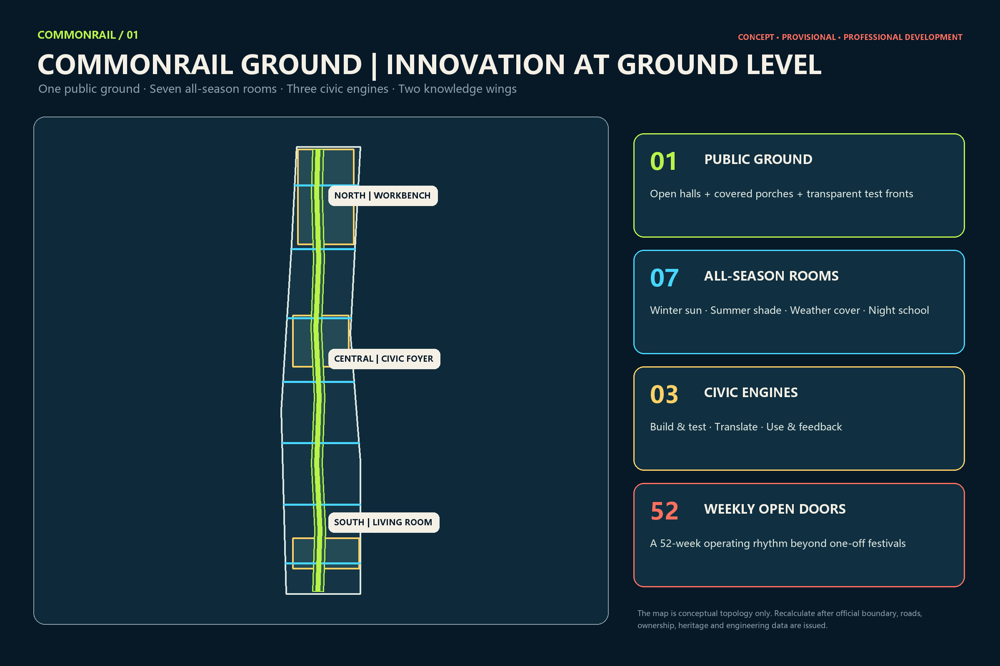
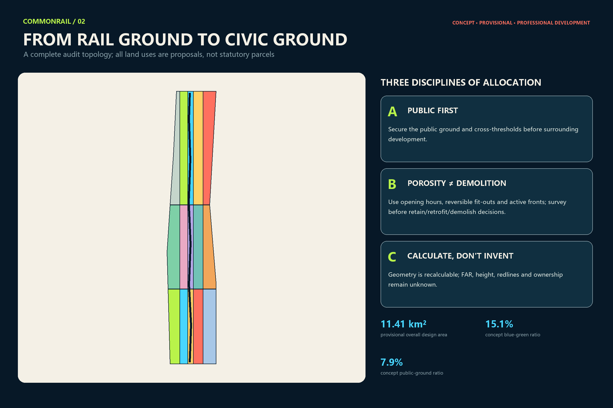
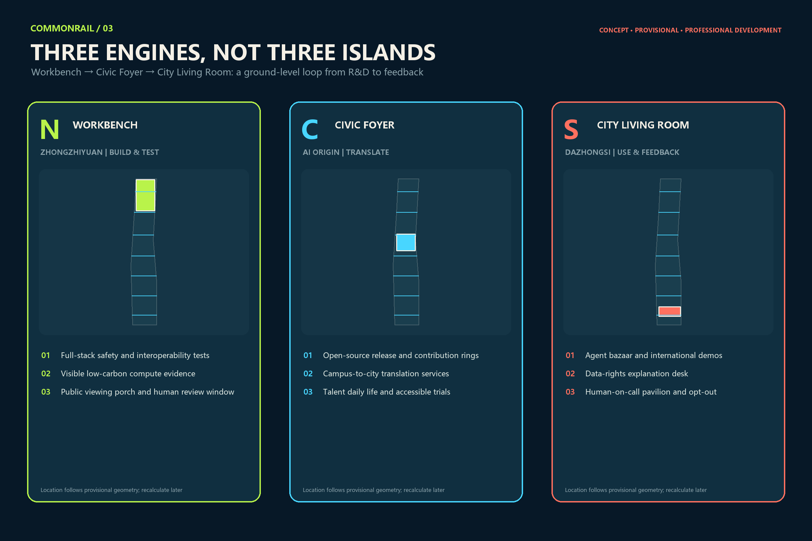
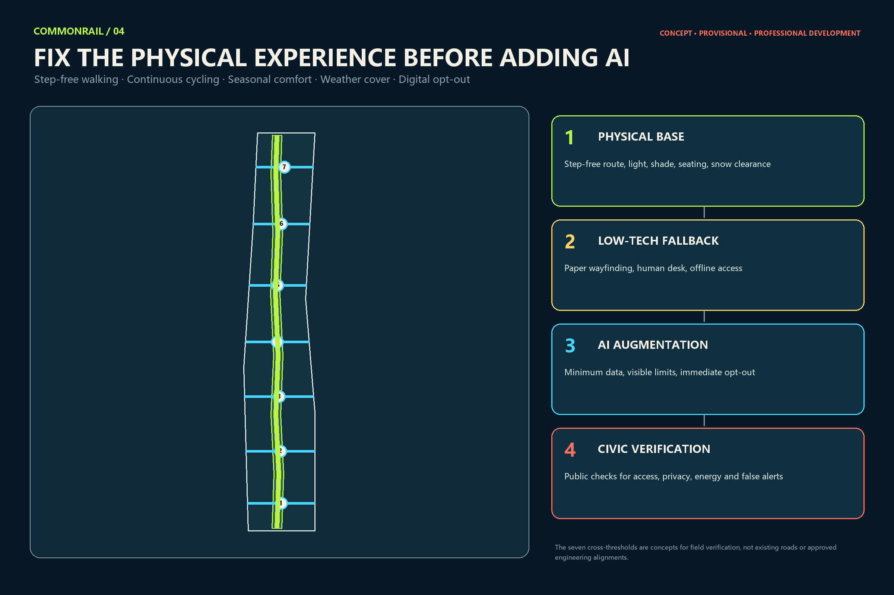
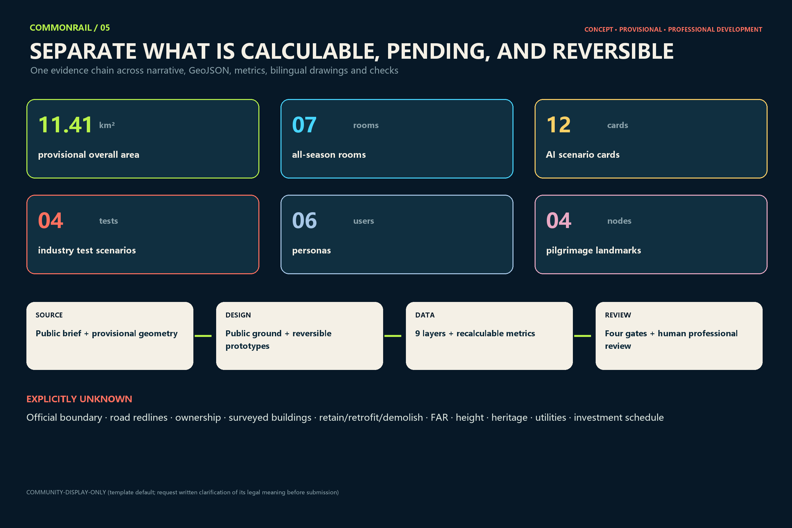

# COMMONRAIL GROUND

## Design Basis and Source List

This proposal begins with the evidence boundary of the public call, not with an unverified base map to be filled with design. Direct inputs comprise the official prequalification announcement’s wording on objectives, three levels of scope and deliverable depth; the design brief, Agent taskbook, allowed design space, enums, metric ranges and schemas in `brief/site-package/`; and the source-use registry in `data/source_registry.json`. The processed fact pack is a reading aid and creates no new authoritative fact. Machine-readable indexes are in `sources.json`, `standard_matrix.json` and `design_depth_matrix.json`; the claims in this section trace to [source:OFFICIAL-ANNOUNCEMENT] and [source:AGENT-TASKBOOK].

The public package currently provides no trusted statutory polygon for the overall design area or the three key areas. It also lacks complete layers for parcels, ownership, surveyed buildings, regulatory controls, road redlines, rail safety, utilities, heritage and public facilities. The package therefore retains the maintainer-provided provisional geometry as a common base for generation, visualisation and topology checks. `site_boundary.geojson` and `key_areas.geojson` keep `official_boundary=false`, `provisional_constraint` and low-confidence notices. The projected provisional site measures 11,412,825.386 square metres. This only means that the submission is internally coherent on one temporary base; it does not mean that the official area equals this value. [data:geometry/site_boundary.geojson#SITE-001] [metric:site_area_sqm]

The workflow is a six-step loop: source, assumption, geometry, metric, drawing and self-check. Sources state where facts come from; assumptions downgrade unresolved conditions; design geometry expresses concepts only; every known area is recomputed from the submitted geometry in EPSG:4548; every text-bearing output has a complete Chinese or English counterpart; and the package is checked through deterministic validation, trusted spatial review, visual packaging and professional evidence. Replacing the boundary later must trigger recalculation of all nine spatial layers, metrics, figures, HTML and PDFs, rather than moving one line in isolation.

Sources have three permitted uses. Public official sources support the brief and scope. Repository rules such as schemas, the glossary and formal guide support the submission contract. Comparative sources only help extract operating mechanisms and cannot establish a Beijing site fact or control. No external case image, plan, logo or performance number is reused. External cases enter the narrative as text, with their official pages and access dates recorded in `sources.json`. Fonts, generation tools and copyright information are recorded separately in `report/copyright_statement.md`.

## Three-Level Scope Framework

The central judgement of CommonRail Ground is that Centennial Jingzhang does not need another abstract “innovation line.” It needs a ground level genuinely open to the city, usable through the seasons, and able to show how innovation occurs. “Ground” does not require every privately controlled parcel to remain permanently open, nor does it mean one continuous building. It is a legible, segment-by-segment civic ground made of open foyers, covered porches, transparent work rooms, all-season outdoor rooms, lawful existing passages, public-service windows and clear non-digital alternatives. The framework is governed by [depth:three_level_scope_framework] and [depth:overall_spatial_structure].

At the roughly 43.6 km² coordinated research scale, the proposal avoids inventing a precise boundary. It studies relationships among universities, research institutes, open-source communities, enterprises, capital, compute, urban test sites and public services. Outputs are a “build–test–translate–use–feedback” ecosystem, a six-case mechanism matrix, user and organisational personas, and principles for regional collaboration. This scale explains why actors work together; it is not an engineering footprint.

At the roughly 11.4 km² overall design scale, the proposal produces a “public-ground atlas”: conceptual land use, opening types, reversible building prototypes, active travel and cross-thresholds, all-season microclimate rooms, public services and phases. Its structure is one public ground, seven all-season urban rooms, three civic engines and two knowledge wings. The seven rooms are not committed construction projects. They are evenly distributed prototypes on the provisional base, testing whether winter sun, summer shade, weather cover, night learning, universal access and east–west passage can be satisfied together. [data:geometry/roads.geojson#ROAD-001] [metric:all_season_room_count]

Across the three key areas totalling about 368.4 hectares in the official wording, research, translation and user feedback are brought to ground level: Zhongzhiyuan becomes the Northern Workbench; Beijing AI Origin becomes the Civic Foyer; and Dazhongsi becomes the City Living Room. They form a loop, not three islands. Their current polygons are provisional. A public issue has specifically questioned the temporary Dazhongsi location, so the proposal communicates spatial types and actions only; location, area and interchange relations must be recalculated when official geometry arrives. [data:geometry/key_areas.geojson#PROV-KEY-001] [metric:key_area_count]

## Coordinated Research Area: Industry and Future City Research

The innovation ecosystem is organised as a public-ground value chain rather than a company directory. Universities, institutes and firms create research, models, chips and devices. The Workbench tests safety, interoperability, energy and accessibility. The Civic Foyer translates knowledge through IP, legal, talent and finance services. People voluntarily try services and provide feedback in the City Living Room. Problems then return to R&D. Each link has a visible spatial carrier and an exit route, avoiding an “industry chain” made only of arrows. The compliance matrix covers the taskbook’s six mandates on identity, cases, scenarios, landmarks, culture and operations. [standard:PROJECT-AGENT-OPEN-CALL-TASKBOOK]

The brand is “COMMONRAIL GROUND / 共轨一层,” with the line “Innovation at Ground Level / 让创新落到首层.” The logo concept uses two parallel lines to form an open letter C; at the bottom they settle into a stable ground line, while three short sleepers form an abstract Chinese character “共” in negative space. It must work in one colour, at 16 pixels, on small wayfinding and as a cut physical mark. Sub-brands are Rail Rooms, CommonRail Test Day, Century Ledger and Bell Night School. Trademark similarity, wayfinding legibility and colour-vision testing are required before adoption; no railway, metro or company mark is imported.

Six global cases provide mechanisms, not shapes. Cambridge/Kendall Square shows how a public-space network can support exchange in an innovation district. Toronto/MaRS connects venture advice, partners and adopters. London Knowledge Quarter links diverse knowledge institutions through membership, a shared identity and public programmes. Paris-Saclay combines public development stewardship, campus life and long-term spatial management. Singapore’s LaunchPad @ one-north co-locates modular space, ground-floor demonstration and real-world testing. Helsinki’s Maria 01 shows how a former public building can grow from a small pilot into a startup community. Only six mechanisms transfer—public-space centre, network broker, shared services, incremental reuse, real-world testing and persistent community—and none of their local metrics or policies becomes a Beijing commitment. [source:CASE-KENDALL] [source:CASE-MARS] [source:CASE-KQ]

The decisive future-city test is whether a person can still obtain a service without using AI. CommonRail therefore has four fixed layers. First comes the physical base: step-free routes, lighting, shade, rest and snow clearance. Second comes low-tech fallback: paper signs, staffed windows and offline booking. Only then comes minimum-data AI augmentation. The final layer publicly reviews accessibility, false alerts, energy, complaints and incidents. A technology that damages the first three layers cannot be justified as “more intelligent.”

## Overall Design Area: Urban Renewal and Regulatory-Plan-Level Urban Design

The overall design treats the public ground as an auditable urban-renewal asset. Conceptual land-use polygons are derived by sequential difference from the provisional site, so the partition is complete, gap-free and non-overlapping. The park spine and seven public rooms are secured first; northern R&D, campus-linked education, southern commercial service, research wings and community life fill the remainder. This layer demonstrates design logic and supports area recalculation. It is not a parcel-level land-use plan and does not replace an existing-condition survey or regulatory plan. Codes use the registered project subset of the national spatial-use classification. [standard:MNR-LAND-USE-CLASSIFICATION-GUIDE] [data:geometry/land_use.geojson#LU-001]

The renewal toolkit has four ground interfaces. Open foyers support non-commercial staying and public services. Transparent work rooms make selected testing observable without exposing sensitive information. Covered porches connect entrances with active travel. All-season rooms provide winter sun, summer shade, weather cover and night learning. Performance is described through opening hours, step-free continuity, non-commercial seats, visible staffed help, passive-comfort hours and complaint closure—not through a predetermined architectural style. Cross-ownership continuity comes from shared wayfinding, timetables and segment legibility; it does not assume that a private ground floor must open.

The building layer contains six reversible prototypes in each key area, with a union footprint of 152,420.938 m². They illustrate the possible order of magnitude for test porches, open-source rooms and public-ground interfaces. They are not surveyed buildings and imply neither demolition nor construction. The decision sequence is retain, repair, reprogramme the ground floor, then add lightly. Permanent construction or demolition can only be discussed after ownership, structure, fire, heritage, transport and statutory planning review. [data:geometry/buildings.geojson#BLDG-WB-01] [metric:building_footprint_area_sqm]

FAR, total floor area, density, maximum height, setback, road redline, parking provision and facility catchments remain unknown. `metrics.json` gives reasons instead of proxy numbers. The professional-development proposition is to test public-ground continuity, seasonal usability and mixed ground-floor functions first, then embed successful actions in statutory controls and delivery plans. Unverified intensity numbers must not be used to make a concept drawing look more professional.

## Detailed Design of Key Areas

The Northern Workbench at Zhongzhiyuan asks how a testing back-of-house can become a civic front. Where ownership, structure and safety permit, suitable large-span existing space would host a model-safety clinic, shared prototype workshop, low-speed embodied-AI test yard and public viewing porch. Visitors, equipment logistics and enclosed testing remain separated. The enclosed zone requires physical control, a human safety officer, emergency stop, near-miss logging and an evacuation route. A winter-sun work porch and selective transparent test windows show methods rather than secrets. If existing conditions do not work, use a removable test shed; the concept does not justify demolition. [data:geometry/key_areas.geojson#PROV-KEY-001]

The Civic Foyer at Beijing AI Origin asks research to pass through a public room before entering the city. Its ground floor combines an open model library, a long public review table, campus-to-city services, medical and education workflow simulation rooms, coffee and night learning so it remains useful outside events. High-risk simulations use synthetic or lawfully de-identified data, display provenance, confidence and limitations, and leave final decisions to qualified people. They cannot diagnose, adjudicate or make high-stakes scores automatically. Night opening depends on quiet hours, zoned lighting, staffing and transport conditions. [data:geometry/key_areas.geojson#PROV-KEY-002]

The City Living Room at Dazhongsi asks AI to leave the exhibition hall and enter daily services while protecting residents’ right to quiet. It includes Bell Night School, a repair bar, adaptable market, small-business tool desk, accessible service point and Human-on-Call Pavilion. AI may assist translation, stock, repair, wayfinding and voluntary trials; it may not use facial-recognition pricing, emotion recognition or opaque profiling. Commercial displays retain non-commercial seating, drinking water, fixed signs and resident services. Night logistics, lighting, amplification and closing time enter an operating agreement. Because the temporary polygon has a location-verification risk, the proposal makes no station-engineering, four-quadrant bridge or precise parcel claim. [data:geometry/key_areas.geojson#PROV-KEY-003]

All three engines share one ground section: rail heritage or park edge, all-season porch, open foyer, controlled transparent test interface, and back-of-house logistics or equipment. “Observable” does not mean total transparency. Graduated glazing, redaction, appointment-only viewing, physical buffers and no-photography zones protect people and knowledge. The Workbench builds and tests; the Civic Foyer translates; the City Living Room uses and feeds back. Operations data are aggregated by scenario and time and never used for cross-context personal tracking.

## AI Innovation Ecosystem, Personas, and AI+ Scenarios

Six personas are spatial and governance testers, not marketing segments. Frontier researchers need cross-institution exchange, quiet discussion and clear IP boundaries. Embodied-AI founders need bookable testing, loading, repair, emergency stops and a route to safety assessment. Students and new developers need low-threshold learning, mentors and affordable tool access. Carers, older people, children and disabled users need rest, toilets, physical signs, privacy and staffed help. Small merchants and frontline workers need simple tools that permit exit and avoid vendor lock-in. International visitors need bilingual wayfinding, short-term collaboration space and a clear path from visiting to partnering. The count is checked by [metric:persona_count].

Every scenario card contains a public problem, users, spatial components, necessary data, a human decision-maker, success measures, a stop rule and maintenance responsibility. Four industry-test scenarios carry the T prefix; eight address daily urban life. All use data minimisation, purpose limitation, explanation, human-in-the-loop decisions, physical alternatives and removal plans. [depth:municipal_new_infrastructure]

| ID | Scenario and type | Carrier, users and data boundary | Success, human decision and stop rule |
| --- | --- | --- | --- |
| T1 | Embodied AI Test Yard—industry test | Enclosed low-speed Workbench yard; robotics teams, safety officers and disabled-user representatives; store device telemetry, near misses and takeovers, not identities of unrelated passers-by | A human safety officer releases trials; measure near misses, takeovers and repairs; stop on boundary breach, failed emergency stop or repeated anomalies |
| T2 | Model Safety Clinic—industry test | Workbench/Civic Foyer; evaluators and affected-user representatives; authorised test sets with provenance and limitations | A professional panel continues, repairs or exits; test bias, robustness, citations and appeal; no field trial below the gate |
| T3 | Clinical Workflow Simulation—industry test | Civic Foyer; clinicians and patient representatives; synthetic or lawfully de-identified data, with no live clinical connection | Clinicians retain final decisions; measure workflow error, explanation comprehension and incidents; stop at any risk of misleading care |
| T4 | Accessible Human–Machine Co-test Street—industry test | One all-season porch; people with sensory or mobility disabilities and operators; prefer on-device processing and retain anonymous task results only | User representatives and access experts accept; measure completion, misdirection and fallback; stop when the physical route is impaired |
| S5 | Open Model Library | Civic Foyer; researchers, students and founders; show provenance, licence, failures and update date without exposing sensitive weights | Librarian and copyright lead publish; measure compliant reuse and repairs; remove immediately if source or licence is unclear |
| S6 | Compute Concierge | Workbench; students and small teams; retain voluntary needs and referral outcome only; promise no quota, subsidy or vendor | Staff offer multiple routes; measure useful referrals and waiting; pause on conflict of interest or unfair allocation |
| S7 | Public Review Table | Civic Foyer; residents, merchants and research teams; record issues, objections and changes, not personal preference profiles | Scenario lead answers publicly; measure closure and preservation of minority views; no expansion while major objections are unresolved |
| S8 | Centennial Rail Memory Interpreter | Heritage edge; residents, students and visitors; cite every historical statement and do not synthesise unauthorised likeness or voice | Historians and community review; measure correction time and accessible readability; unlabelled dispute triggers removal |
| S9 | Seasonal Comfort Steward | Seven rooms; residents and operators; environmental data only, with sensor locations visible and manual override | Operators decide settings; measure real comfort hours and energy; revert on higher energy, noise or glare complaints |
| S10 | Bell Night Market & Repair Bar | City Living Room; merchants, residents and repair workers; AI assists translation, stock and repair without face-based pricing | Market manager and resident panel review; measure repairs, waste, noise and complaints; repeated nuisance pauses the programme |
| S11 | Multilingual Human-in-the-loop Welcome Desk | Entrances to all engines; international visitors; do not retain translation requests by default; keep paper bilingual maps and staff | Staff correct output; measure help completion and severe mistranslation; critical error switches immediately to human service |
| S12 | Offline Public-Service Drill | Service points across the corridor; residents, operators and emergency staff; simulate outage without real personal records | Emergency lead restores service; measure offline duration and manual handover errors; stop if the drill affects live services |

The package records 12 cards and four industry tests. Success is not invocation volume. It is whether a public problem improves, marginalised users receive equivalent service, people can understand and override the system, and the place recovers after it stops. Every automated system needs an accountable person, incident record, removal funding and exit route. A “pilot” cannot become an indefinite low-oversight deployment. [metric:scenario_card_count] [metric:industry_test_scenario_count]

## Land Use, Building Scale, and Retain-Renovate-Demolish Strategy

Conceptual land uses comprise the continuous park spine, seven all-season rooms, northern research testing, central campus translation, southern AI economy and feedback, knowledge wings, industry services and community life. Sequential difference makes their union equal to the provisional site with no internal gap or overlap. With no surveyed existing use or statutory parcel data, names describe desired functional relationships rather than rezoning real parcels. Official data must trigger a new parcel-based coding, public-service and delivery exercise rather than preserving the present shapes. [depth:land_use_layout]

Architecture follows three ground-level controls instead of a corridor-wide style. Public interfaces are reversible: canopy, opening panels, service desks, light, seats and wayfinding can be installed and removed by phase. Safe back-of-house and observable front-of-house coexist: tests, logistics, plant and private areas remain physically separate while selected, redacted processes are visible. Non-commercial publicness is measured: each pilot declares free opening hours, non-commercial seats, a step-free entrance, drinking water and staffed help; café footfall is not a proxy for public space.

Retain, renovate and demolish is a decision tree, not a parcel conclusion. Verify legality, ownership, structure, heritage, fire safety, energy and present use. Retain buildings that are safe and adaptable. Repair and reprogramme the ground floor when the structure works but the interface is closed. Add reversible lightweight components where a genuine function is missing. Demolition is considered only when professional assessment finds safe reuse impossible and statutory procedures are complete. Every prototype keeps `retain_renovate_demolish=pending_official_survey`. [data:geometry/buildings.geojson#BLDG-CF-01]

The only known building-scale value is the union footprint of the submitted prototypes; it supports file consistency and is not a planning control. Total floor area, FAR, density, height, setbacks and parking remain unknown. If a professional team develops a prototype, it must restart from survey, ownership and regulation and record how the new version differs. [standard:MOHURD-CONTROL-DETAILED-PLANNING]

## Transport, Rail, Municipal Infrastructure, and Public Services

Transport separates north–south continuity from east–west porosity. The public ground is a concept spine for walking, cycling, universal access and services. Seven east–west thresholds are desire lines for field verification between universities, campuses, communities and rail heritage. They are not existing streets, road redlines or approved engineering alignments. Professional development must check railway and metro safety, crossings of expressways and arterials, fire access, loading, bicycle parking, snow clearance, light and night safety before choosing legal crossings, existing passages, signal changes or another compliant solution. [depth:traffic_rail_slow_parking]

Physical experience has priority over digital navigation. The route first needs a step-free path or equivalent alternative, tactile and visual clarity, manageable gradients and rest, glare control, zoned night lighting, shade and wind shelter, weather cover and assigned maintenance. Paper maps, fixed signs and staffed questions form the second layer. AI comes third for multilingual help, crowd information or accessible routing and must allow no-login, no-retention use and immediate opt-out. A digital fault may never lock a door, remove the accessible route or block a public service.

New infrastructure follows “small node, replaceable, disconnectable.” Edge compute, environmental sensors, e-paper signs, event networking and energy monitoring enter serviceable cabinets and do not attach permanently to heritage fabric. The sensor list, purpose, retention period and accountable operator are visible. Utility, drainage, flood, power, underground, fire and telecom capacities are unavailable, so the proposal promises no device count, load or utility alignment. Canopies, rain gardens and lighting need flood, structure, buried-utility and maintenance review. [data:geometry/constraints.geojson#CONSTRAINT-K01]

Public services distribute along the ground. Each civic engine has human-in-the-loop help; all-season rooms support rest and programmes; the technology-service wing refers IP, legal, talent, finance and international cooperation; and the Xiaoyue River scenario wing proposes ecology observation and seasonal comfort only, not river or blue-line works. Toilets, first aid, childcare, parking and catchments require official population, facility and transport data.

## Blue-Green Network, Public Space, and Urban Character

The submitted blue-green union is 1,724,236.483 m² and the public-ground union is 897,496.672 m², respectively 15.1079% and 7.8639% of the provisional site. These values answer only how much the concept draws; they are not existing green-space or statutory public-space ratios. Green space prioritises shade, winter sun, stormwater, rest and habitat. Public space emphasises entry, staying, non-commercial use and staffed help. The two may overlap, and their union metrics are never added together. [metric:green_ratio] [metric:public_space_ratio]

Seven all-season rooms rotate four prototypes. A Winter Sun Gallery uses shelter, sun and movable seating for short discussions. A Summer Shade Court prioritises canopy, ventilation and low-reflectance surfaces. A Wet-weather Porch links entrances, transit and service windows. A Night Classroom uses controlled lighting, quiet hours and stowable equipment for learning, demonstrations and repair. The names express intent, not pre-verified performance; each requires sunlight, wind, thermal comfort, snow and rain load, energy and accessibility measurement or professional simulation. [depth:blue_green_public_space]

Urban character rejects a corridor of luminous screens or generic “futuristic” shells. Four material logics create segment continuity: reversible, low-disturbance time marks at heritage edges; graduated transparency at innovation interfaces; durable, repairable and tactile components in living streets; and dimmable, timed task lighting at night. The palette—Century Oxide, Compute Teal, Winter Sun and Night Rail Ink—remains a concept until fonts, colour contrast, copyright, trademark and full-scale accessible samples are reviewed.

The cultural narrative makes three transitions during one walk. Jingzhang railway culture gives a datum of time and engineering. Zhongguancun culture gives the method of problem, experiment and iteration. AI culture adds open contribution, accountable testing and public feedback. Four active pilgrimage landmarks avoid monumental sculpture: Model Depot in Zhongzhiyuan shows failure analysis and safety review; Origin Kilometre-Zero Hall traces paper, model, product, urban use and feedback; Centennial Datum Gallery uses reversible segments and Contribution Sleepers that show contributor, licence, year and review state; Bell Night School serves residents by day and AI literacy and repair by night. The count is checked by [metric:pilgrimage_landmark_count].

## Renewal Projects, Implementation Policy, and Phasing

Ten reference project packages are proposed for professional development. G01 is the Public-Ground Baseline Atlas of use, ownership, hours, transparency, access and microclimate. G02 is the all-season component library. G03 verifies and pilots the seven cross-thresholds. G04 is the Zhongzhiyuan Workbench and Model Depot. G05 is Origin Kilometre-Zero Hall, the Open Model Library and Public Review Table. G06 is Bell Night School, repair bar and daily-service market. G07 is Centennial Datum Gallery, bilingual signs and Contribution Sleepers. G08 is human-in-the-loop public and technology-service desks. G09 is the scenario register, incident record, work-order and exit ledger. G10 is the 52-week programme and annual public review. [metric:renewal_project_count]

The phasing geometry divides the provisional site into three bands to communicate dependencies only. Near-term work fills official-data gaps, creates one removable pilot in each key area, secures physical accessibility and runs T1–T4. Medium-term work may deliver foyers, thresholds and existing-ground reprogramming after approval and evidence. Long-term work may complete the segmented network, wing services and corridor operations. The phases are not a government construction or investment schedule; official boundary, ownership, professional review, funding and evidence from the previous phase are triggers. [data:geometry/phasing.geojson#PHASE-001] [depth:phasing_implementation]

Implementation policy centres on opening-hour agreements rather than compulsory permanent access. A participating site states which doors open, when, who maintains them, how to complain, when events close and how emergency closure works. Public support or brand benefits could be linked to measurable opening and maintenance, subject to legal, finance and competition review. Every pilot needs removal security or an equivalent duty, a data-deletion plan, incident notice and reinstatement standard so temporary elements do not become unmanaged occupation.

A reference `CommonRail Groundworks Office` would coordinate schedules, the scenario register, maintenance, public contact and evidence publication. It does not propose a committed government body or budget. The rhythm is daily open ground and staffed help; weekly Open Bench Friday, Night School and Repair Café; monthly CommonRail Test Day; quarterly field labs; and annual CommonRail Ground Week. The point of 52 weeks is a stable everyday cadence rather than a one-off festival. Every activity remains subject to venue, safety and funding approval.

## Metrics, Area Recalculation, and Compliance Matrix

Metrics have three classes. Directly recalculable items are the provisional site, concept green and public unions, prototype footprints, slow-route length, and counts of key areas, rooms, scenarios, personas, landmarks and projects. Items waiting for statutory and engineering information include floor area, FAR, density, height, road area, setbacks, parking and facility capacity. Operating metrics require a baseline: opening hours, step-free completion, non-commercial stays, human-override response, complaint closure, scenario stop and recovery, passive-comfort hours, energy and maintenance cost. The second and third classes cannot be filled with early targets to manufacture a commitment. [depth:metrics_recalculation]

| Metric | Status | Value or statement | Evidence boundary |
| --- | --- | --- | --- |
| Provisional overall area | known / medium | 11,412,825.386 m² | EPSG:4548 calculation; not an official redline area |
| Concept green union | known / low | 1,724,236.483 m²; 15.1079% | Design layer only; not existing or statutory green ratio |
| Concept public-space union | known / low | 897,496.672 m²; 7.8639% | Opening rights and hours require agreements |
| Concept building prototypes | known / low | 152,420.938 m² | Neither surveyed buildings nor development scale |
| Concept slow-route union | known / low | 17,864.056 m | Alignment awaits road, rail and ownership review |
| AI scenarios / industry tests / personas / landmarks | known / high | 12 / 4 / 6 / 4 | Counted from the narrative and reviewable |
| FAR, floor area, density, height and road area | unknown | no numeric value | Await statutory plan, survey and engineering data |

`metrics.json` records the formula, file, confidence and assumptions for every spatial value; `spatial_review.py` recalculates in the same coordinate reference system. Land use passes complete coverage and zero-overlap checks. Buildings, green and public space remain inside the temporary site. The three provisional key areas produce minor notices but do not block content review. The compliance matrix covers announcement clauses 1.3–1.5 and tasks agent.1–agent.6, mapping each to narrative, geometry, metrics, drawings, HTML, sources, assumptions and self-checks.

CommonRail should not be assessed only by whether it “looks like a technology district.” Five public-interest questions matter: can someone without a phone complete the route and obtain service; is minimum seasonal comfort measurable; can a failed test be recorded and removed; can resident complaints change opening hours; and can the proposal shrink by segment without losing legibility when ownership or professional conditions fail? They are acceptance questions for future development, not performance that this submission claims to have achieved.

## Risk, Copyright, and Compliance

Boundary risk: overall and key-area geometries are maintainer-defined temporary polygons, not official redlines; every precise location, area and connection must be recalculated. Planning risk: FAR, height, redlines, ownership, retain/renovate/demolish, heritage and utilities are missing and cannot be replaced by concept numbers. Engineering risk: railway, metro, under-bridge, fire, buried services, weather loads and step-free routes require professional review. Delivery risk: phases, operators, activities and revenue mechanisms are references, not approvals, budgets or owner commitments. [source:SITE-PACKAGE]

AI risk: no default facial recognition, emotion recognition, cross-context tracking, opaque dynamic pricing, or automated final decision in medicine, education, law or public safety. Each scenario states data purpose, minimum fields, retention, human responsibility, appeal, non-digital alternative, stop rule and removal duty. High-risk tests move from indoor simulation to professional review to limited field operation. Incidents, near misses and human takeovers enter public aggregate reporting; failure is not hidden in promotion.

Public-interest risk: commercial space must not swallow the public ground, and “openness” must not invade privacy or quiet. Every pilot retains free hours, non-commercial seating, fixed signs, staffed help and an accessible alternative. Night programmes have closing times, noise and light limits, and a resident complaint loop. Any private ground-floor opening requires voluntary agreement, fire safety and insurance; the proposal cannot impose it.

Copyright and licence: text, figures and drawings are original expression generated for this submission. The provisional geometry is repository material and keeps attribution. No case image, logo, map tile, portrait or paper figure is reused. Chinese and English figures come from the same original drawing code. Fonts are used locally and subset-embedded in PDFs; font files are not redistributed. The template default `COMMUNITY-DISPLAY-ONLY` is retained because no recognised root licence or complete legal text for the token was found. Its meaning should be confirmed in writing before submission; a switch to CC-BY-4.0 or CC-BY-SA-4.0 requires an explicit licensing decision and consistent edits. See `report/copyright_statement.md`. [depth:risk_missing_data]

Technical compliance: offline HTML has no scripts, remote fonts, remote images, map tiles, iframe, form, API or tracking. All paths are relative. Chinese and English proposal, report HTML, visual HTML, five text-bearing figure pairs and A3/A0 PDFs follow the bilingual contract. The Windows worktree uses LF; finalisation will refresh SHA-256 from actual bytes, followed by self-check and participant preflight with no post-finalisation edit. Passing CI establishes gate eligibility only and does not replace human professional review.

## References

Direct project sources are the public announcement of the Beijing Municipal Commission of Planning and Natural Resources’ Haidian Branch, the repository design brief, Agent taskbook, site package, source registry and processed fact pack. Full URLs, paths, uses and access notes are in `sources.json`. Coverage is checked by [standard:PROJECT-OFFICIAL-ANNOUNCEMENT] and the compliance matrix.

- `brief/site-package/design_brief.json`: objectives, scopes and deliverables.
- `brief/site-package/agent_taskbook.json`: six Agent tasks, case/scenario/persona/landmark/operations requirements and unified boundary clause.
- `brief/site-package/allowed_design_space.json`, `enums/`, `ranges/`, `schemas/`: allowed design actions, enums, unknown controls and package contracts.
- `brief/site-package/geometry/provisional_boundaries.geojson`: maintainer-defined temporary overall and key-area geometry for generation, display and checks only.
- `data/source_registry.json` and `data/processed/agent_fact_pack.md`: source-use rules, fact navigation and missing-data checklist.
- City of Cambridge, Kendall Square public-space planning: public-space centre and connected network.
- MaRS Discovery District: ecosystem connection, venture support and adoption mechanisms.
- Knowledge Quarter London: cross-institution membership, public access and common identity.
- EPA Paris-Saclay: public development stewardship, campus urban life and long-term management.
- JTC LaunchPad @ one-north: modular startup space, ground-floor display and real-world testbeds.
- Maria 01 Helsinki: incremental reuse of a former public building and startup-community operations.
- Machine indexes: `sources.json`, `assumptions.json`, `metrics.json`, `compliance_matrix.json`, `standard_matrix.json`, `design_depth_matrix.json` and `self_check.json`.

External cases are mechanisms for comparison only. Adoption in Beijing requires new analysis under Chinese law, climate, governance, ownership and public-interest conditions. Dynamic case-site numbers and events do not enter local performance metrics, and a case citation does not license reuse of its images or brand assets. [source:CASE-ONE-NORTH] [source:CASE-MARIA01]
