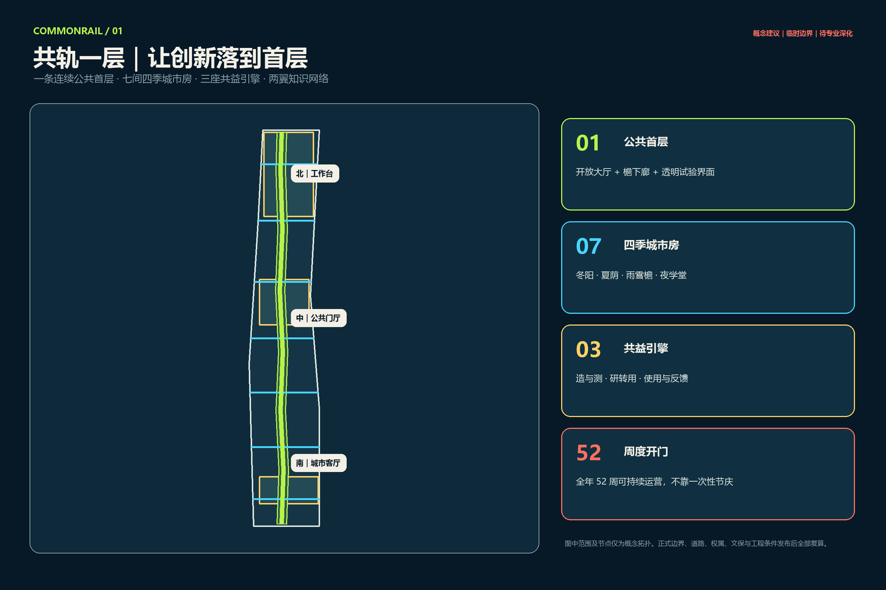
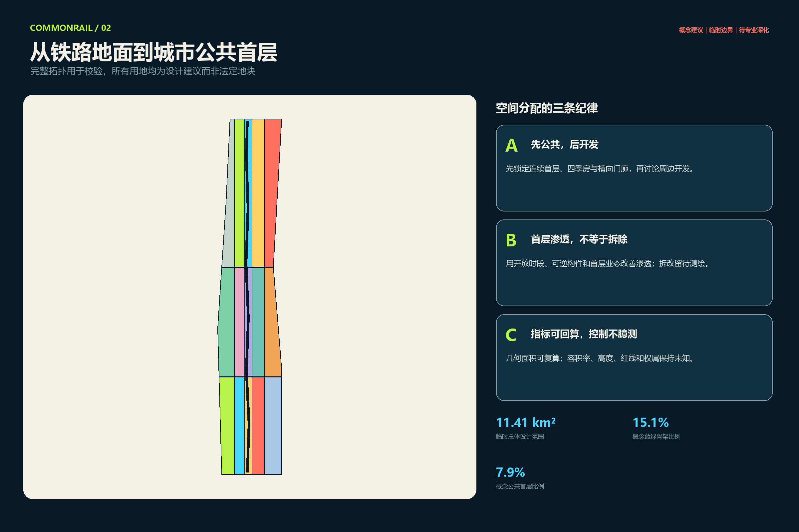
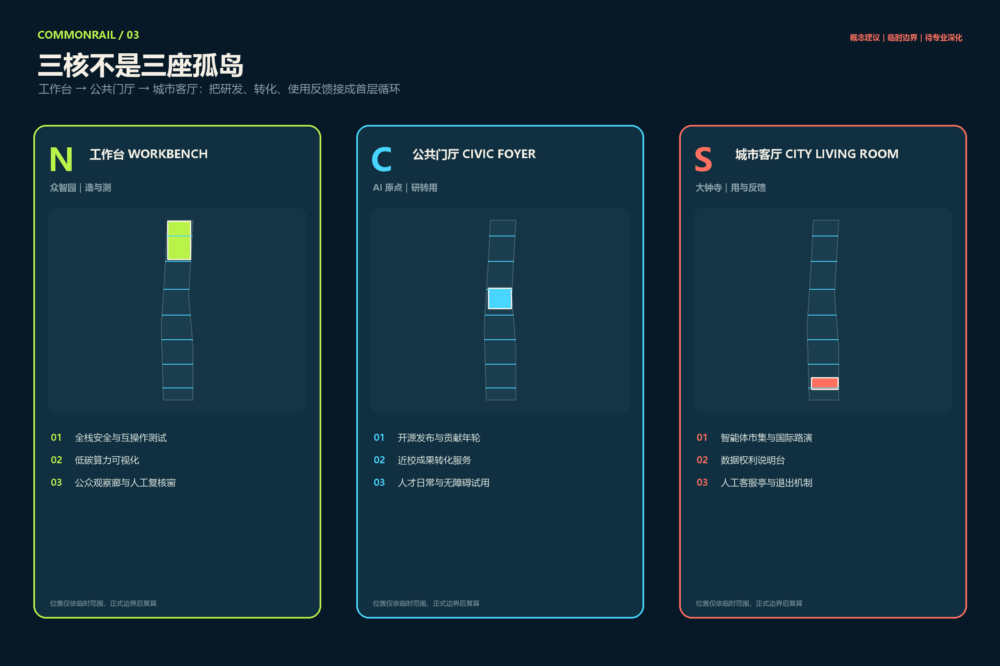
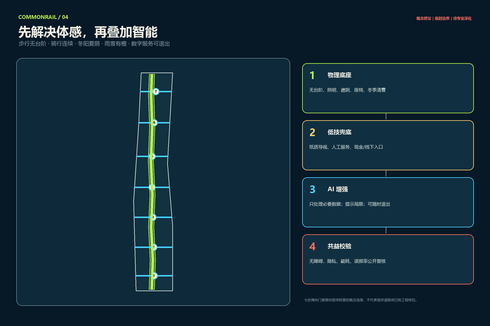
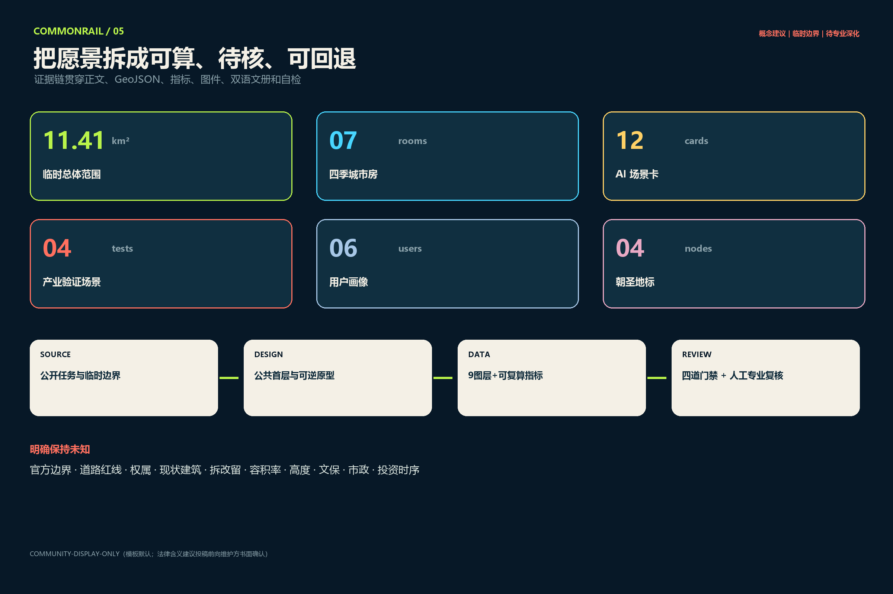

# 共轨一层 COMMONRAIL GROUND

## 设计依据与资料清单

本方案首先服从公开征集的证据边界，而不是从一张未经核验的底图开始“填满设计”。直接依据包括：官方资格预审公告中对目标、三层范围与成果深度的文字要求，仓库 `brief/site-package/` 内的设计任务书、面向智能体任务书、允许设计空间、枚举、指标范围与 schema，以及 `data/source_registry.json` 对资料用途的登记。处理后事实包只是阅读导航，不产生新的权威事实。对应机器索引保存在 `sources.json`、`standard_matrix.json` 与 `design_depth_matrix.json`；本节的主张可回到 [source:OFFICIAL-ANNOUNCEMENT] 和 [source:AGENT-TASKBOOK]。

公开资料目前没有可被信任为法定红线的总体设计范围与三处重点区精确多边形，也缺少地块、权属、现状建筑、控规指标、道路红线、轨道安全、市政、文保和公共服务设施的完整图层。因此提交包原样采用维护者提供的 provisional geometry 作为生成、可视化与拓扑校验的共同底板，并在 `site_boundary.geojson` 与 `key_areas.geojson` 中保留 `official_boundary=false`、`provisional_constraint` 和低置信度说明。临时总体范围的投影复算面积为 11,412,825.386 平方米；它只能描述“本次提交在同一临时范围内自洽”，不能描述“官方范围精确为该值”。[data:geometry/site_boundary.geojson#SITE-001] [metric:site_area_sqm]

工作流程采取“来源—假设—几何—指标—图面—自检”六步闭环。来源说清楚事实从哪里来；假设把未知条件降级；设计几何只表达概念空间动作；所有 known 面积用 EPSG:4548 从提交几何复算；含文字成果提供完整英文副本；最后运行 deterministic、trusted spatial、visual packaging 与 professional evidence 四道门禁。任何后续正式边界替换都应触发九个空间图层、指标、图件、HTML 与 PDF 的整体重算，而不是只移动一条线。

资料用途分为三类。第一类是可直接支撑任务范围的公开来源，如官方公告与任务书；第二类是可支撑提交结构的仓库规则，如 schema、术语表和正式投稿指南；第三类是背景比较来源，只能帮助抽取运营机制，不能成为北京场地事实或规划控制。全球案例没有复用其图片、图纸、Logo 或绩效数字；外部案例只以文字比较进入正文，并在 `sources.json` 记录官方页面与访问日期。版权、字体与生成工具另见 `report/copyright_statement.md`。

## 三层范围工作框架

“共轨一层”的核心判断是：百年京张不缺另一条抽象的“创新线”，缺的是一层真正面向城市开放、四季可用、能让人看见创新如何发生的公共界面。所谓“一层”不是要求每个产权地块永久无条件开放，也不是一栋连续建筑，而是一套连续可读、分段实施的城市公共首层：开放门厅、檐下廊、透明工作间、四季室外房间、既有合法穿行联系、公共服务窗口与清晰的非数字替代共同构成有厚度的创新骨架。这一母题由 [depth:three_level_scope_framework] 和 [depth:overall_spatial_structure] 约束。

在约 43.6 平方公里统筹研究范围，方案不绘制伪精确边界，而是研究高校院所、开源社区、企业、资本、算力、城市测试场和公共服务之间的机制关系。输出是“造—测—转—用—反馈”的生态链、六个全球案例的机制矩阵、人才与组织需求画像、区域协同原则。这里讨论“为什么共同工作”，不把研究范围误作工程范围。

在约 11.4 平方公里总体设计范围，输出一张“公共首层图谱”：记录概念用地、首层开放类型、可逆建筑原型、慢行与横向门廊、四季微气候空间、公共服务与分期。空间结构为“一条公共首层、七间四季城市房、三座共益引擎、两翼知识网络”。七间城市房不是七个已选定建设项目，而是沿临时范围均匀布置的可校验原型，用来验证冬阳、夏荫、雨雪遮蔽、夜间学习、无障碍和横向穿行是否能够被同时满足。[data:geometry/roads.geojson#ROAD-001] [metric:all_season_room_count]

在三处共约 368.4 公顷重点区域，分别把研发、转化、使用反馈落到首层平面和运营动作：北部众智园为“工作台 Workbench”，中部北京 AI 原点社区为“公共门厅 Civic Foyer”，南部大钟寺为“城市客厅 City Living Room”。三者形成循环，不是三座孤岛。当前多边形仅为临时约束，特别是公开社区已对大钟寺 provisional 位置提出核查意见，因此图面只表达空间类型与动作，正式位置、面积和接驳关系必须等待官方数据后复算。[data:geometry/key_areas.geojson#PROV-KEY-001] [metric:key_area_count]

## 统筹研究范围产业与未来城市研究

产业生态采用“公共首层价值链”而非单纯企业名录。研究、模型、芯片与设备在高校院所和企业中被创造；安全、互操作、能耗与无障碍在工作台被测试；知识产权、法务、人才与融资在公共门厅完成转译；真实用户在城市客厅自愿体验并反馈；问题再回到研发端。每个环节都有可见空间载体和退出机制，避免把“产业链”只画成箭头。面向智能体任务书的总体命名、品牌、全球案例、场景、地标、文化与运营六项任务均进入合规矩阵。[standard:PROJECT-AGENT-OPEN-CALL-TASKBOOK]

品牌名为“共轨一层 COMMONRAIL GROUND”，口号为“让创新落到首层 / Innovation at Ground Level”。Logo 概念以两条平行细线构成未闭合的字母 C，底部落成稳定地平线，三枚短枕木在负空间中形成抽象“共”字；它必须同时适配单色、16 px、小尺寸导视与实体切割。品牌下设“共轨客厅 Rail Rooms”“共轨试验日 CommonRail Test Day”“百年创新谱 Century Ledger”和“大钟夜学堂 Bell Night School”。正式采用前必须完成商标近似检索、导视可读性和色盲辨识测试，当前不上传或挪用任何铁路、地铁或企业标识。

六个全球案例只借机制，不借造型：Cambridge/Kendall Square 说明创新区的公共空间网络可以承担知识交换；Toronto/MaRS 说明创业服务需要把辅导、伙伴和采用方组织在一起；London Knowledge Quarter 说明多类知识机构可以通过会员、共同品牌与开放计划形成网络；Paris-Saclay 说明公共开发机构、校园生活和长期空间治理需要协同；Singapore LaunchPad @ one-north 说明模块化空间、首层展示与真实场景测试能够并置；Helsinki Maria 01 说明存量公共建筑可从小规模试点逐步成长为创业社区。迁移到海淀时只保留“公共空间中心、网络经纪、共享服务、渐进改造、真实测试、持续社区”六种机制，不引用其面积、收益或政策作为本地承诺。[source:CASE-KENDALL] [source:CASE-MARS] [source:CASE-KQ]

未来城市的关键不是传感器密度，而是“人能否在不用 AI 的情况下仍然获得服务”。因此 CommonRail 的技术层级固定为四层：先完成无台阶、照明、遮阴、休息、冬季清雪等物理底座；再提供纸质导视、人工窗口、线下预约等低技兜底；然后才叠加最小数据的 AI 增强；最后公开复核无障碍、误报、能耗、投诉和事故。任何技术如果破坏前三层，就不能以“更智能”为理由上线。

## 总体设计范围城市更新与控规深度城市设计

总体设计把公共首层当成一项可审查的城市更新资产。提交的概念用地以顺序差集从临时 site polygon 派生，覆盖完整、无缝、无重叠；中心的公园骨架和七处公共房先被锁定，再把北部研发、近校教育、南部商业服务、东西两翼研发与社区功能放入剩余空间。该图层的作用是展示设计逻辑并支持面积复算，不是地块级用地方案，不取代现状调查或控规。用地编码采用仓库登记的国土空间用途分类子集。[standard:MNR-LAND-USE-CLASSIFICATION-GUIDE] [data:geometry/land_use.geojson#LU-001]

更新工具箱包括四类首层界面：开放大厅承载非消费停留和公共服务；透明工作间让测试过程可观察但不泄露敏感数据；檐下廊连接建筑入口与慢行系统；四季城市房提供冬阳、夏荫、雨雪遮蔽和夜间学习。界面绩效以开门时段、无台阶连续率、非消费座位、可见人工服务、被动舒适时段和投诉闭环衡量，不预设建筑高度或造型。跨产权的连续性通过相同导视、开放时刻表和分段可读实现，不假定私人首层必须开放。

建筑图层包含三处重点区各六个可逆原型基底，总投影面积为 152,420.938 平方米。它们示意测试廊、开源客厅和公共首层界面可能占用的空间量级，不代表现状建筑，也不形成拆除或新建决定。真正的拆改留顺序是“保留—修缮—首层再编程—轻量补充”；只有在权属、结构、消防、文保、交通与法定规划审查完成后，才可能讨论永久新建或拆除。[data:geometry/buildings.geojson#BLDG-WB-01] [metric:building_footprint_area_sqm]

容积率、总建筑规模、建筑密度、最高高度、退线、道路红线、停车供给和设施服务半径全部保持 unknown。`metrics.json` 给出缺失原因而不是替代数字。总体结构适用于专业团队深化的判断是：先通过公共首层的连续性、四季可用性和首层功能复合检验城市更新价值，再把已经验证的空间动作嵌入正式控规与实施方案；不能反过来用未经证实的强度数字为概念图增添“专业感”。

## 重点区域详细设计

北部众智园“工作台 Workbench”的命题是“把测试后场翻到城市前台”。在经权属、结构与安全核查适合的存量大跨空间，优先布置模型安全门诊、共享原型工坊、具身智能低速测试院和公共观察廊。公众界面与设备物流、封闭测试区分流；封闭区需要物理围控、人工安全员、急停、近失事件记录和撤场路线。临公共空间一侧用冬阳工作廊与透明试验窗展示方法而不是展示机密，形成“造—测—修”闭环。若存量条件不成立，则采用可撤回试验棚，不以概念方案推动拆除。[data:geometry/key_areas.geojson#PROV-KEY-001]

中部北京 AI 原点社区“公共门厅 Civic Foyer”的命题是“让研究成果穿过一间公共门厅再进入城市”。首层组合开放模型图书馆、研究成果评议长桌、近校转化服务、医疗/教育工作流模拟室、咖啡与夜间学习空间，保证非活动日也有日常用途。高风险模拟只使用合成或依法脱敏数据，明确显示来源、置信度和局限，最终决定由具备资质的人作出；不得自动诊断、自动裁判或进行高风险自动评分。夜间开放需以安静权、照明分区、人员值守和公共交通条件为边界。[data:geometry/key_areas.geojson#PROV-KEY-002]

南部大钟寺“城市客厅 City Living Room”的命题是“把 AI 从展厅带进生活服务，同时保护居民的安静权”。空间由大钟夜学堂、修理吧、可变市集、小微商户工具台、无障碍服务点和人工客服亭组成。AI 只辅助翻译、库存、维修、导引和自愿体验，不使用人脸识别定价、情绪识别或不可解释个人画像；商业展示必须保留非消费座位、饮水、实体导视和居民服务。夜间物流、照明、扩声和活动结束时间必须写入运营协议。由于该临时多边形存在定位核查风险，本方案不据此提出站点工程、四象限连桥或精确地块结论。[data:geometry/key_areas.geojson#PROV-KEY-003]

三核共用一套首层剖面：轨道遗产或公园界面—四季门廊—开放大厅—可控透明测试界面—后场物流/设备区。公共与专业空间之间不追求“全透明”，而是用分区玻璃、信息脱敏、预约观察、物理缓冲和明确禁止拍摄区实现可观察性。三核的空间差别来自使用循环：工作台负责“造与测”，公共门厅负责“研转用”，城市客厅负责“用与反馈”；运营数据只按场景与时段汇总，不跨场景追踪个人。

## AI 创新生态、人才画像与 AI+ 场景

六类用户画像不是营销标签，而是空间与治理测试者：前沿研究员需要跨机构交流、安静讨论和知识产权边界；具身 AI 创业者需要可预约测试、装卸、维修、急停与安全认证路径；学生和初入行开发者需要低门槛学习、导师与可负担工具；社区照护者、长者、儿童和无障碍用户需要休息、卫生间、实体导引、隐私与人工服务；小微商户和一线服务人员需要简单、可退出、非供应商锁定的工具；国际访问者需要双语导引、短期协作与清晰的“从参观到合作”入口。六类画像的数量与任务书门槛由 [metric:persona_count] 校验。

每张场景卡固定包含公共问题、目标用户、空间组件、必要数据、人工决定者、成功指标、停止条件和维护责任。产业测试场景用 T 标记，共四项；其余八项服务城市日常。所有场景遵循数据最小化、目的限定、可解释、人在回路、实体替代与可撤场原则。[depth:municipal_new_infrastructure]

| ID | 场景与类型 | 空间载体、用户与数据边界 | 成功指标、人工决定与停止条件 |
| --- | --- | --- | --- |
| T1 | 具身 AI 检修场｜产业测试 | 工作台封闭低速院；机器人团队、安全员、无障碍用户代表；只记录设备遥测、近失与人工接管，不采集无关路人身份 | 人工安全员决定放行；看近失率、接管次数和故障修复；越界、急停失效或连续异常立即停测 |
| T2 | 模型安全门诊｜产业测试 | 工作台/公共门厅；评测团队与受影响用户；使用获授权测试集，公开数据来源与适用限制 | 专业评审组决定继续、修复或退出；看偏差、鲁棒性、引用与申诉；未达门槛不得外场 |
| T3 | 医疗工作流模拟室｜产业测试 | 公共门厅；医务人员与患者代表；仅用合成或依法脱敏数据，不连接真实诊疗系统 | 医生保留最终判断；看工作流错误、解释理解和安全事件；任何误导诊疗风险即停用 |
| T4 | 无障碍人机共测街｜产业测试 | 一段四季门廊；视听/行动障碍者、运维人员；尽量端侧处理，只保存匿名任务结果 | 用户代表与无障碍专家共同验收；看完成率、误导率、实体替代可用性；实体通路受损即停 |
| S5 | 公共模型图书馆 | 公共门厅；研究者、学生、创业者；展示模型来源、许可、失败案例与更新日期，不开放敏感权重 | 馆员和版权负责人上架；看合规复用与问题修复；来源或许可不明立即下架 |
| S6 | 算力礼宾台 | 工作台；学生和小团队；只记录自愿提交的需求与转介结果，不承诺额度、补贴或特定供应商 | 人工顾问提供多方案；看有效转介与等待时间；出现利益冲突或不公平分配暂停合作 |
| S7 | 开放评议长桌 | 公共门厅；居民、商户、研究团队；仅记录议题、异议和修改，不做个人倾向画像 | 场景负责人公开答复；看问题关闭率和少数意见保留；重大异议未处理不得扩容 |
| S8 | 百年京张记忆导览 | 遗址界面；居民、学生、访客；每条历史内容带来源，不合成未经授权的人物肖像或声音 | 史料顾问与社区复核；看更正速度与无障碍可读性；史实争议未标注即下线 |
| S9 | 四季气候管家 | 七间城市房；居民与运维者；只采环境数据，传感器位置公开，自动控制可人工覆盖 | 运维人员决定策略；看实测舒适时段和能耗；能耗升高、噪声或眩光投诉触发回退 |
| S10 | 大钟夜市与修理吧 | 城市客厅；商户、居民、维修者；AI 仅辅助翻译、库存和维修，不做人脸识别定价 | 市集管理员与居民联席复核；看修复量、废弃物、噪声与投诉；超时或扰民连续发生暂停 |
| S11 | 多语人工在环访客台 | 三核入口；国际访客；翻译请求默认不留存，纸质双语地图和人工服务始终可用 | 值守人员纠错；看求助完成率和严重误译；关键安全信息误译立即切回人工 |
| S12 | 离线公共服务演练 | 全线服务点；居民、运维与应急人员；模拟断网/断电，不使用真实个人档案 | 应急负责人决定恢复；看离线可服务时长和手工交接错误；影响现实服务时立即结束演练 |

场景包数量由 `scenario_card_count=12` 校验，T1—T4 对应四个产业测试。评估不以“调用次数”作为成功，而以公共问题是否改善、弱势用户是否获得同等服务、人工是否能理解并覆盖、停止后是否能恢复为准。任何自动系统都需要责任人、事件记录、撤场资金与退出路径，不能把“试点”变成无期限低监管部署。[metric:scenario_card_count] [metric:industry_test_scenario_count]

## 用地、建筑规模与拆改留方案

概念用地包含连续公共首层公园骨架、七座四季城市房、北部研究测试、中部近校研转用、南部智能经济与反馈、知识两翼、产业服务和社区生活等分区。顺序差集保证用地 union 与临时边界一致；同一图层内没有重叠和缝隙。由于没有现状用地与法定地块资料，名称表达的是“希望发生的功能关系”，不是把真实地块改成某种用途。待官方数据到位后，应以正式地块为单元重新匹配代码、公共服务和实施主体，而不是保留当前几何形状。[depth:land_use_layout]

建筑策略不追求沿线统一造型，而建立三条首层控制建议。第一，公共界面优先可逆：遮棚、可开合门、服务台、照明、座椅和导视能够分期装配并拆回；第二，后场安全与前台可观察并存：测试、物流、机房和隐私区域保持物理分隔，公众只看到经过策展和脱敏的过程；第三，非消费公共性可测：每处样板应明确免费开放时段、非消费座位、无障碍入口、饮水和人工帮助，不把咖啡店客流等同于公共空间。

拆改留只给决策树，不给地块结论。先核验合法性、权属、结构、文保、消防、能耗和实际使用；满足安全与适配性的建筑优先保留；界面封闭但结构可用的建筑优先修缮和首层再编程；确有功能缺口时采用轻量、可撤回补充；只有专业评估证明无法安全利用且法定程序完成后，才讨论拆除。`retain_renovate_demolish` 在所有原型中保持 `pending_official_survey`。[data:geometry/buildings.geojson#BLDG-CF-01]

建筑规模相关的唯一 known 值是提交的概念原型基底 union 面积，它服务于文件一致性核查而非规划指标。总建筑面积、容积率、建筑密度、高度、退线和停车保持 unknown。图面中任何尺度都不能转译为开发权；如果专业团队选择深化某一原型，需要从测绘、产权和法规重新开始，并在版本记录中说明与本方案的差异。[standard:MOHURD-CONTROL-DETAILED-PLANNING]

## 交通、轨道、市政与公共服务设施

交通策略先把南北连续与东西渗透分开。南北公共首层是步行、骑行、无障碍与沿线服务的概念骨架；七条东西门廊是待现场核查的 desire lines，用于检查两侧高校、园区、社区与轨道遗产之间的横向联系。它们不是现状道路、道路红线或已批工程线位。正式深化需逐处核查铁路和地铁安全、快速路/主干路过街、消防、装卸、非机动车停放、冬季清雪、照明与夜间治安，再决定采用既有路口优化、建筑首层穿行、桥下空间、信号配时或其他合规方式。[depth:traffic_rail_slow_parking]

物理体验的优先级高于数字导航。连续线路必须先具备无台阶或等效替代、清晰边缘、适当坡度与休息、眩光控制、夜间照度分区、遮阴避风、雨雪覆盖和维护责任；纸质地图、固定门牌与人工问询构成第二层；AI 只在第三层提供多语、拥挤提示或个性化可达路径，并允许用户不登录、不留存、随时退出。任何数字故障不得锁死门、取消无障碍路线或阻断公共服务。

新型基础设施采用“小节点、可替换、可断开”的原则。端侧算力、环境传感、电子墨水导视、活动网络和能源监测进入可维护机柜，不把设备固定在遗产构件上；传感器清单、目的、保留期限和责任人向公众可见。市政、排水、能源、地下空间、消防和通信容量尚不可得，因此本方案不承诺设备数量、功率或管线路由。雨棚、雨水花园与照明均需在防洪、结构、地下管线和运维审查后深化。[data:geometry/constraints.geojson#CONSTRAINT-K01]

公共服务设施沿“一层”分布：三核设置人工在环服务点，四季城市房提供休息与活动，科技服务翼提供知识产权、法律、人才、融资和国际合作转介，小月河场景翼仅提出生态观察和气候体验，不据此提出河道或蓝线工程。服务半径、卫生间、急救、托育和停车等实际供给需要正式人口、设施与交通数据后校准。

## 蓝绿空间、公共空间与城市风貌

蓝绿骨架以提交的 1,724,236.483 平方米概念 union 表达连续气候空间，公共首层 union 为 897,496.672 平方米；对应临时范围比例分别为 15.1079% 和 7.8639%。这些数值来自设计几何，只回答“本方案画了多少”，不回答现状绿地率或法定公共空间比例。绿色空间优先承担遮阴、冬阳、雨洪、休息和生境功能；公共空间强调可进入、可停留、非消费和有人工帮助。二者可以重叠，指标使用各自 union 复算而不相加。[metric:green_ratio] [metric:public_space_ratio]

七间四季城市房轮换四种原型：冬阳廊通过避风、向阳和可移动座椅支持短停讨论；夏荫庭以树荫、通风和低反射地面降低热负担；雨雪檐连接建筑入口、公交慢行与服务窗口；夜学堂以可控照明、安静时段和可收纳设施支持夜校、小型演示和修理活动。名称描述设计意图，不预先宣称微气候性能；每处必须经过日照、风环境、热舒适、雨雪荷载、能耗和无障碍实测或专业模拟。[depth:blue_green_public_space]

城市风貌不采用满带发光屏或“未来感”外壳，而以四种材料逻辑建立分段连续：遗产界面使用可逆、低干扰的时间刻度；创新界面用透明度分级展示过程；生活界面用耐久、可维修、触感清晰的街道构件；夜间界面用低亮度、定时、可关闭的任务照明。色彩系统为百年氧化红、计算青、冬阳米和夜轨墨，但所有字体、色值、反差和实体样品在落地前须做版权、商标与无障碍复核。

文化叙事把三种文化串成一次步行中的三次转换：京张铁路文化提供“时间与工程”的刻度，中关村文化提供“问题—实验—迭代”的方法，AI 新文化提供“开放贡献—责任测试—公众反馈”的制度。四座活动型朝圣地标不是巨型雕塑：众智园“模型检修库”展示故障拆解与安全复盘；原点“零公里厅”展示论文—模型—产品—城市使用—反馈；沿遗址分段设置“百年刻度廊”和带许可信息的贡献枕木；大钟寺“大钟夜学堂”在白天服务居民、夜间承载 AI 素养与修理活动。地标数量由 [metric:pilgrimage_landmark_count] 校验。

## 更新项目清单、实施政策与分期计划

项目清单共十项，全部是可供专业团队深化的参考项目包：G01 公共首层基线图谱，调查首层用途、产权、开放时段、透明度、无障碍和微气候；G02 四季城市房组件库；G03 七条横向门廊现场核查与低成本试点；G04 众智园工作台和模型检修库；G05 原点零公里厅、开放模型图书馆与公共评议长桌；G06 大钟夜学堂、修理吧和生活服务市集；G07 百年刻度廊、双语导视与贡献枕木；G08 人工在环公共服务与科技服务桌；G09 场景登记、事故记录、维护工单和退出台账；G10 52 周活动与年度公开评估。数量由 [metric:renewal_project_count] 约束。

空间分期图把临时范围分为三段，仅用于表达依赖关系。近期阶段优先完成正式资料补齐、三处各一处可撤回样板、物理无障碍与 T1—T4 测试；中期在审批和实测成立后推进公共门厅、横向门廊和存量首层再编程；远期才讨论网络补齐、两翼服务与整带运营。阶段不是政府建设时序，也不构成投资承诺；每一期都以官方边界、权属、专业审查、资金和上一期证据为触发条件。[data:geometry/phasing.geojson#PHASE-001] [depth:phasing_implementation]

实施政策建议围绕“开放时段协议”而非永久无条件开放。参与场地公开哪些门、何时开、谁维护、如何投诉、活动何时结束、紧急情况如何关闭；公共资助或品牌权益可与可测的开放和维护绩效挂钩，但具体政策需法务、财政和公平竞争审查。所有试点建立撤场保证金或等效责任、数据删除计划、事故通报和恢复原状标准，避免轻量装置成为无人维护的长期占用。

运营参考主体为跨场地的 `CommonRail Groundworks Office`，负责排期、场景登记、维护、公众联系和证据发布；这不是对政府机构编制的建议或承诺。节奏为每日公共首层开放与人工服务、每周 Open Bench Friday/夜学堂/修理咖啡、每月 CommonRail Test Day、每季度跨学科现场实验室、每年 CommonRail Ground Week。全年 52 周的价值在于稳定小频次日常而非一次性节庆；所有活动仍需场地许可、安全与经费审批。

## 指标体系、面积复算与合规矩阵

指标分三类。第一类可从当前提交直接复算：临时 site 面积、概念绿地和公共空间 union、概念建筑基底、慢行线长度、重点区/城市房/场景/画像/地标/项目数量。第二类必须等待正式规划和工程资料：总建筑面积、容积率、密度、高度、道路面积、退线、停车和设施容量。第三类要在运营中建立基线后持续测量：开门时段、无台阶任务完成率、非消费停留、人工覆盖响应、投诉关闭、场景停止与恢复、被动舒适时段、能耗和维护成本。第二、三类不能提前填入目标值制造承诺。[depth:metrics_recalculation]

| 指标 | 当前状态 | 数值/说明 | 证据与边界 |
| --- | --- | --- | --- |
| 临时总体范围面积 | known / medium | 11,412,825.386 m² | EPSG:4548 复算；不是官方红线面积 |
| 概念绿地 union | known / low | 1,724,236.483 m²；15.1079% | 只表示设计图层，不等于现状或法定绿地率 |
| 概念公共空间 union | known / low | 897,496.672 m²；7.8639% | 开放权利和时段待逐处协议 |
| 概念建筑原型基底 | known / low | 152,420.938 m² | 不是现状建筑或开发规模 |
| 概念慢行线 union | known / low | 17,864.056 m | 线位待道路、轨道与权属核查 |
| AI 场景 / 产业测试 / 画像 / 地标 | known / high | 12 / 4 / 6 / 4 | 从正文计数，可由评审核对 |
| 容积率、总建面、密度、高度、道路面积 | unknown | 不填数值 | 等待正式控规、测绘与工程资料 |

所有空间面积在 `metrics.json` 记录公式、源文件、置信度和假设；`spatial_review.py` 以相同坐标系重新计算。用地通过完整覆盖和零重叠检查；建筑、绿地、公共空间位于临时 site 内；三处重点区因 provisional 属性产生 minor 提示但不阻断内容评审。合规矩阵覆盖公告 1.3—1.5 和 agent.1—agent.6，每条都映射正文、图层、指标、图纸、HTML、来源、假设与自检。

评估 CommonRail 不应只看图面“像不像科技区”，而应检查五个公共利益问题：没有手机的人是否仍能走完并获得服务；冬夏雨雪是否至少有可验证的基本舒适；测试失败能否被记录并撤回；居民投诉能否改变开放时段；产权和专业条件不成立时方案能否分段缩减而不破坏整体可读性。它们是后续专业深化的验收问题，不是本次提交声称已达成的绩效。

## 风险、版权与合规说明

边界风险：当前总体和重点区 geometry 均为维护者临时多边形，不是 official redline；任何精确位置、面积与接驳判断都需复算。规划风险：容积率、高度、红线、权属、拆改留、文保和市政缺失，不能用概念数字替代。工程风险：铁路、地铁、桥下、消防、地下管线、雨雪荷载和无障碍路线需专业审查。实施风险：所有阶段、运营主体、活动和收入模型只是参考建议，不表示政府批准、财政安排或场地产权人承诺。[source:SITE-PACKAGE]

AI 风险：禁止默认人脸识别、情绪识别、跨场景个人追踪、黑箱动态定价和以自动系统替代医疗、教育、法律或公共安全最终判断。每个场景必须有数据目的、最小字段、保留期限、人工责任、申诉、非数字替代、停止条件和撤场责任。高风险测试先室内/模拟，再专业审查，再限时外场；事故、近失和人工接管进入公开汇总，不把失败隐藏在宣传材料里。

公共利益风险：公共首层不能被消费空间吞没，也不能把“开放”理解成对居民隐私和安静权的侵入。每处样板保留免费时段、非消费座位、实体导视、人工帮助和无障碍替代；夜间活动设置结束时间、噪声/照明边界与居民投诉闭环。任何私人首层开放都需自愿协议、消防与保险条件，不由本方案直接推定。

版权与许可：正文、图件和图纸为本次生成的原创表达，底层临时几何来自仓库并保持来源说明；没有复用外部案例图片、Logo、地图瓦片、人物肖像或论文插图。中文和英文图件由同一原始绘制代码生成，字体仅用于本地生成和 PDF 子集嵌入，不在投稿包再分发。模板默认许可 `COMMUNITY-DISPLAY-ONLY` 被保留，但仓库未提供可识别的根级 LICENSE 或该 token 的完整法律文本；投稿前应向维护方书面确认含义，若参与者希望使用 CC-BY-4.0 或 CC-BY-SA-4.0，应在明确授权意愿后统一修改。完整资产登记见 `report/copyright_statement.md`。[depth:risk_missing_data]

技术合规：离线 HTML 不包含脚本、远程字体、远程图片、地图瓦片、iframe、表单、API 或跟踪；全部路径相对且可离线查看。中英 proposal、report HTML、visual HTML、五组含字图件和 A3/A0 均按双语契约成对。Windows 工作区已使用 LF，并将在 finalize 后基于实际字节刷新 SHA-256；finalize 后不再编辑，再运行 self-check 与 participant preflight。CI 通过只表示门禁通过，不能替代人工专业评审。

## 参考资料

项目直接依据为北京市规划和自然资源委员会海淀分局公开公告、仓库设计任务书、Agent 任务书、场地包、来源登记表与处理后事实包；完整 URL、路径、用途和访问说明见 `sources.json`。任务覆盖由 [standard:PROJECT-OFFICIAL-ANNOUNCEMENT] 与合规矩阵校验。

- `brief/site-package/design_brief.json`：目标、范围与成果要求。
- `brief/site-package/agent_taskbook.json`：Agent 六项任务、案例/场景/画像/地标/运营要求与统一边界条款。
- `brief/site-package/allowed_design_space.json`、`enums/`、`ranges/`、`schemas/`：允许设计空间、枚举、未知控制与结构合同。
- `brief/site-package/geometry/provisional_boundaries.geojson`：维护者临时总体及重点区几何，仅供生成、展示与自检。
- `data/source_registry.json` 与 `data/processed/agent_fact_pack.md`：资料用途、事实导航与缺口清单。
- Cambridge City, Kendall Square public-space planning：公共空间中心与连通网络机制。
- MaRS Discovery District：创新生态连接、创业支持与采用机制。
- Knowledge Quarter London：跨机构会员网络、知识开放与共同品牌机制。
- EPA Paris-Saclay：公共开发机构、校园城市、生活与长期治理机制。
- JTC LaunchPad @ one-north：模块化创业空间、首层展示与真实场景测试机制。
- Maria 01 Helsinki：存量公共建筑渐进再利用与创业社区运营机制。
- 机器可读索引：`sources.json`、`assumptions.json`、`metrics.json`、`compliance_matrix.json`、`standard_matrix.json`、`design_depth_matrix.json` 与 `self_check.json`。

以上外部案例只用于机制比较；正式引入北京前必须依据中国法律、气候、治理、产权与公共利益条件重新论证。任何网页的动态数字和活动信息均不进入本方案的本地绩效指标，案例出处也不授权复用其图像或品牌资产。[source:CASE-ONE-NORTH] [source:CASE-MARIA01]
