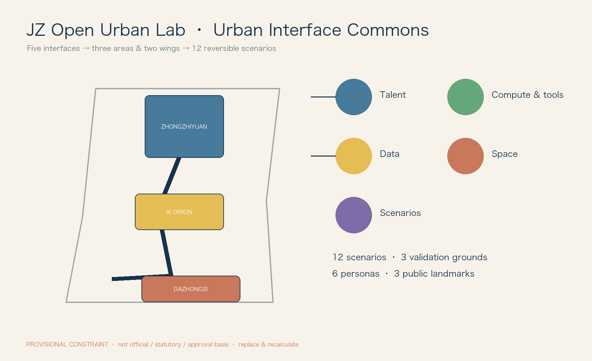
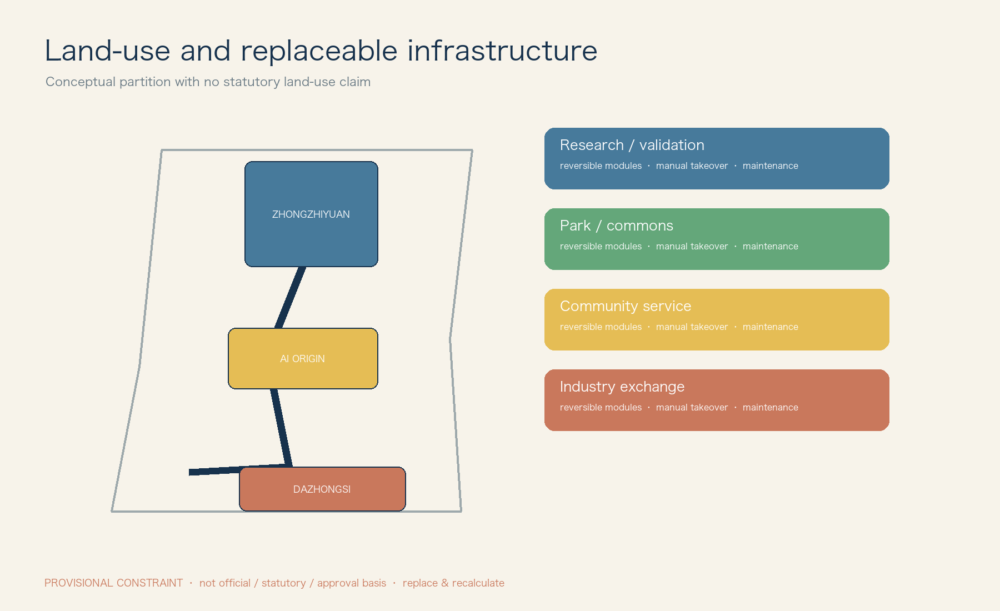
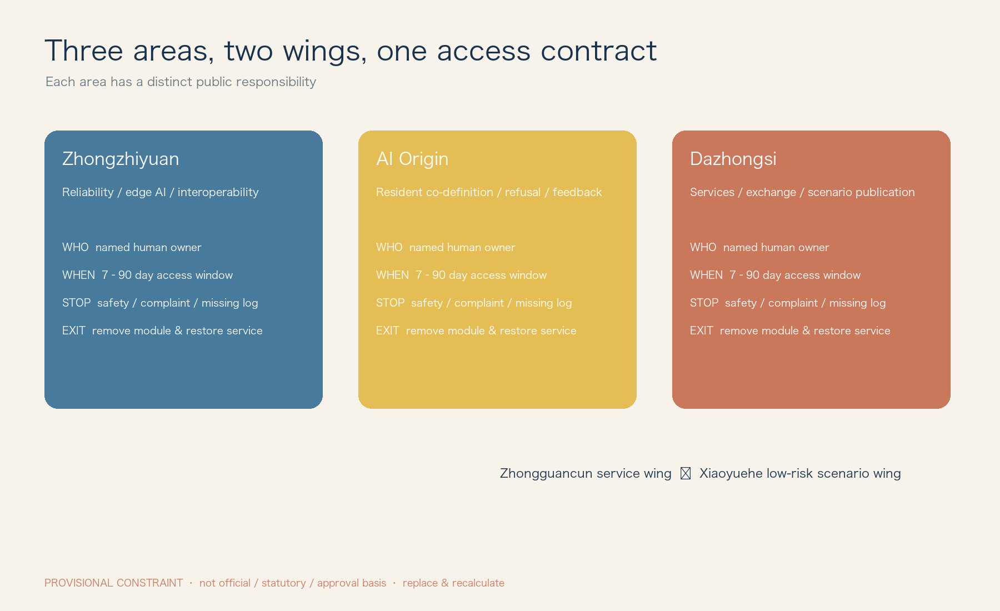
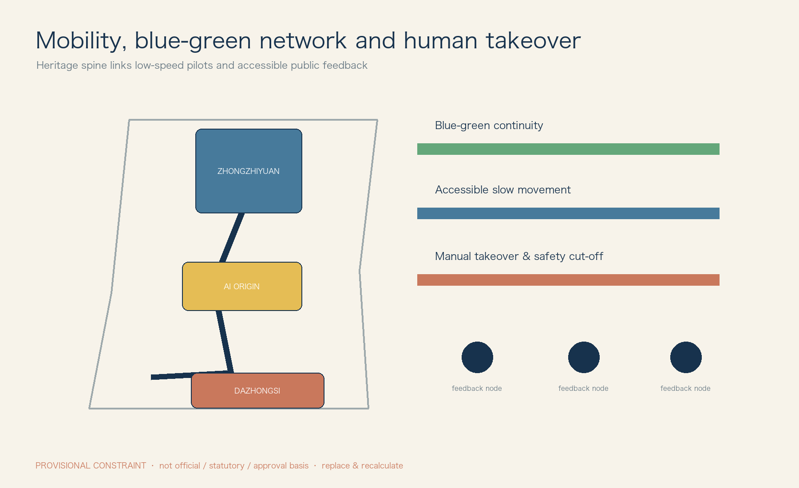
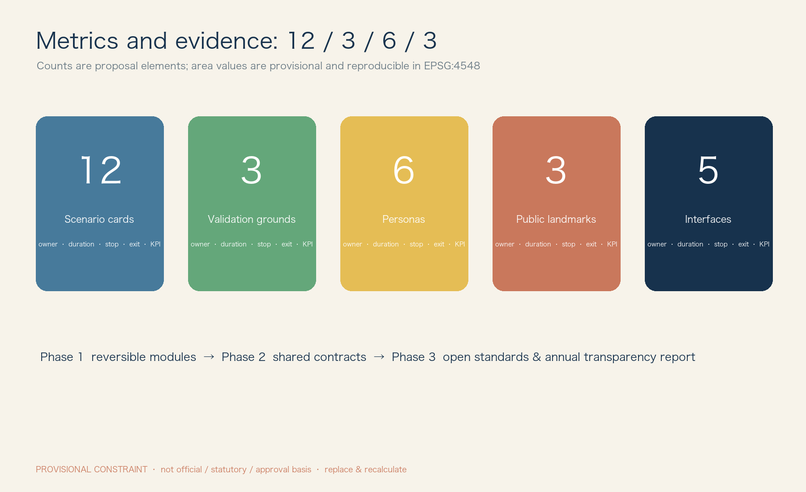

# JZ Open Urban Lab

**Urban Interface Commons**: from independently building a railway to independently defining how future technology enters a city.

> **Boundary notice.** All geometry is derived from the maintainer-provided *provisional* layer, for conceptual organisation, offline display and review only. It is not an official boundary, statutory control, ownership, approval or investment basis. Replace SITE_BOUNDARY and KEY_AREA and recalculate in EPSG:4548 when official geometry is released. [data:geometry/site_boundary.geojson#PROV-SITE-001]

## Basis and evidence

The Jing-Zhang railway heritage is not an AI backdrop; it is a protected, walkable public spine. AI is a removable second layer: every model, robot or service enters through public interfaces rather than permanently rebuilding the city. The brief is translated into three areas and two wings: Zhongzhiyuan for engineering validation, the AI Origin Community for co-definition, Dazhongsi for services and exchange, the Zhongguancun service wing for professional support, and the Xiaoyue River wing for low-risk public trials.[source:SRC-2026-0518-AGENT-OPEN-CALL-TASKBOOK]

No official planning controls, road redlines, height limits, population, ownership, heritage protection boundary, blue-green line, investment or approval data are available. FAR, density, building scale and retain/renew/demolish conclusions are therefore **unknown**. This proposal specifies reversible components and trial procedures only.[metric:far]

## Three-scale framework

At the **regional scale**, the proposal opens a problem–validation–reuse loop among Zhongguancun, Bewei Community, Future Science City, Huairou Science City, Beijing E-Town and Beijing–Tianjin–Hebei partners; it does not claim any party has joined. At the **spine scale**, railway heritage links the three areas with walking, human help and feedback points. At the **node scale**, an AI service may operate only where an interface box, visible stop control and named human steward are in place.[depth:three_level_scope_framework]

## Ecosystem and comparative learning

Five public interfaces supply the ecosystem: talent residencies and problem lists; finite compute, simulation and logging; minimum-data sandboxes; repairable spatial components; and reversible real-world contracts. Seven public cases are compared for method rather than copied: Barcelona DECODE, Helsinki digital twin, Amsterdam algorithm register, New York City algorithmic accountability, Pittsburgh robotics testing, Seoul digital inclusion and Singapore trustworthy AI. Their source, scope and limitation are registered as `CASE-01`–`CASE-07` in `sources.json`.[source:CASE-01]

## Overall spatial structure

The structure is **one heritage walking spine, three differentiated nodes, two support wings and five interface networks**. Zhongzhiyuan confines tests to booked, enclosed validation positions. The AI Origin Community puts co-design and feedback beside human services. Dazhongsi hosts an updateable Open Model Yard and City Agent Commons; it does **not** claim a confirmed station-city interface. Every interface point uses T (talent), C (compute/tools), D (data), S (space), P (scenario) codes and displays a human steward, opening hours, paper instructions and stop control.[depth:overall_spatial_structure]

## Key-area design

**Zhongzhiyuan: validate, never approve operation.** It hosts robot reliability (avoidance, night, rain/snow, endurance and takeover), edge interoperability (weak/offline network, local inference, API and logs), and trustworthy-AI review (bias, provenance, human review and rollback). Passing a test only permits the next small trial.

**AI Origin Community: residents co-define.** The sequence is need → co-design table → rapid prototype → small trial → resident feedback → continue/revise/withdraw. Children have no default identity-data collection; every person can choose human help, paper route or no participation.

**Dazhongsi: service and exchange.** Open Model Yard uses public selection, version records and non-advertising display. City Agent Commons hosts failure reviews, resident feedback and small releases. Content rotates quarterly and expired material is removed with a version record.

## Personas, interfaces and scenarios

Researchers need reproducible logs and responsibility boundaries; start-ups need finite resources and clear admission; residents need refusal and complaints; students need guardian participation and no profiling; older and disabled users need human accompaniment, continuous accessible paths and large type; international partners need bilingual rules and IP/data consultation. The minimum human-service standard is visible staff, non-QR access, stop instructions and a complaint route.[source:DATA-SRC-BARRIER-FREE-ENVIRONMENT-LAW]

### Five-interface operating matrix

|Interface|Admission and provider|Space/data|Term, owner, stop and exit|Acceptance evidence|
|---|---|---|---|---|
|Talent T|Researchers, founders, students; service wing. Public problem, mentor and output plan|required residence desk/co-design room; necessary registration only|max 90 days; project lead; pause if mentorship or complaint response fails; remove account and desk|public retrospective; satisfaction; no open complaint|
|Compute/tools C|Development teams; node operator. Resource budget and log plan|edge box, simulator, SDK; quota and non-exportable trial data|max 30 days; technical owner; stop on missing logs/overuse; revoke tokens and audit export|log completeness; offline recovery drill|
|Data D|Resident-service teams; data governance group. Purpose, fields and retention|sandbox; minimisation, classification, anonymisation and purpose limit|trial term; data owner; stop on unauthorised/re-identification risk; deletion record|field-minimisation review; deletion proof; complaint closure|
|Space S|Public/robot teams; venue operator. Booking and safety checklist|power/network, mount, dock, enclosure, cut-off and takeover|7–30 days; safety steward; stop on collision/no supervision; remove module and restore clear path|restoration time; accessibility check; incident count|
|Scenario P|Service and trial teams; admission committee. Explain why AI and non-AI option|interface specified on each card|max 90 days; scenario owner; threshold stop; restore human/paper service|published KPI, stop log and successful opt-out|

### Twelve differentiated scenario admission cards

|Card|User problem / AI role / non-AI fallback|Data, risk and human review|Term, stop, exit, KPI and spatial interface|
|---|---|---|---|
|P01 Accessible companion|Accessible route suggestion only; human escort, tactile/paper map|No face retention; medium; accessibility steward|30d; stop on one misleading route; remove screen/restore enquiry; arrival and intervention rate; accessible desk + e-ink|
|P02 Railway heritage guide|Explains human-reviewed heritage entries; paper guide|No identity; low; volunteer sampling|60d; stop after two factual errors; correct and unpublish version; correction time; heritage sign|
|P03 Community health navigation|Locates existing public service, never diagnoses; human counter|No health record; medium; service staff|30d; stop on diagnostic output; withdraw answer; referral rate; feedback counter|
|P04 Children’s city exploration|Non-location tasks; physical task card|No account/location, guardian; high-sensitive|14d; stop on personal-data collection/guardian complaint; delete temporary totals; guardian satisfaction; co-design table|
|P05 Low-speed delivery test|Avoidance test, not commercial service; handcart|Device logs only; high; line-of-sight safety officer|14d; stop on boundary/safety-distance breach; remove robot; takeover response; enclosed route + cut-off|
|P06 Service robot test|Wayfinding/carrying test; human service desk|No biometrics; high; safety officer|14d; stop on collision/loss of link; remove and inspect; zero-collision/restoration time; dock|
|P07 Walking prompt|Warns of conflict, never enforces; static marking/volunteer|Aggregate flow only; medium; daily coordinator review|30d; stop at complaint threshold; restore signs; observed conflict count; walking sign|
|P08 Public-space twin|Assesses seating/shade use; manual tally|Aggregate count only; medium; planner weekly review|45d; stop on identifiable tracking; delete raw stream; bias and weekly report; observation point|
|P09 Public-service Q&A|Answers only published matters; hotline/paper form|No personal case input; medium; counter sampling|30d; stop on wrong policy answer; disable entry; accuracy and handoff rate; service desk|
|P10 Open prototype table|Voluntary prototype feedback; paper survey|Anonymous consent; low; facilitator|7d; stop on unconsented recording; delete feedback/remove table; valid feedback count; co-design table|
|P11 Cultural co-creation|Editable shared story; manual collage|No portraits; medium; curator|21d; stop on IP/discriminatory output; unpublish version; opt-out rate; Open Model Yard|
|P12 Facility-maintenance aid|Flags defects for staff; manual inspection|Facility images, no faces; medium; maintenance team|60d; stop on critical miss; restore manual rounds; verified accuracy/closure time; maintenance point|

## Land use, mobility and public realm

The `land_use.geojson` represents provisional conceptual coverage only: heritage walking/public realm, low-risk trials, service/exchange, green buffer and reversible interface points. It is not a statutory land-use plan. New objects are removable interface boxes, signs, seating/takeover desks, docks and enclosures; removal restores paving and walking clear width. The spine prioritises walking, accessibility, human enquiry and low-speed trials. No road, rail or utility works are proposed without formal information.[depth:land_use_layout] [depth:mobility_accessibility]

Blue-green space keeps public life non-screen-based: shade, rest, walking, ecological observation and quiet feedback. Sensors default to identity recognition off. Rain, low light or crowding switch robot tests to human management. The three landmarks are the Zero-Kilometre Gate, Open Model Yard and City Agent Commons, each with public selection, version record and non-commercial display rules.[depth:blue_green_public_space]

## Phasing, responsibility and long-term operation

|Phase|Project list / resource type|RACI and evidence|
|---|---|---|
|1 Light intervention, 0–12 months|Interface boxes, paper/e-ink signs, feedback desk, enclosure, P01–P04/P10/P11|Venue operator is safety-accountable; service wing handles admission; data group approves data; residents consulted; accept through accessibility check, exit drill and public retrospective|
|2 Networked, 12–24 months|Common codes, admission contract, log template, P05–P09/P12 and three validation grounds|Admission committee approves; technical/scenario owners run; independent reviewer checks logs and complaints; accept through stop drill, restoration time and KPI baseline/target|
|3 Institutional, 24 months onward|Open API specification, annual transparency report, developer community, cross-area reuse pack|Service wing maintains standards; public body decides renewal; every renewal reapplies; annual report lists projects, resources, incidents, complaints, exits and deletion|

Resources are stated only as public-realm maintenance, staffed supervision, finite compute quota and reversible-component maintenance. No investment figure is invented. The applicant pays for removal, human-service restoration, log/data disposal and incident review after failure.[depth:phasing_implementation]

## Metrics, compliance and rights

All areas are provisional geometry outputs: approximately **11.41 million sqm** study extent, **3.22 million sqm** conceptual green cover and **0.28 million sqm** public-space cover. They cannot support approval or investment comparison. The package contains five interfaces, 12 cards, three validation grounds, six personas and three landmarks. Each KPI needs a baseline, collection frequency, responsible person and acceptance threshold before renewal.[metric:site_area_sqm] [metric:ai_scenario_count]

AI advice never becomes a public decision. People may refuse, request human service, complain and receive restoration. High-sensitive children, health, robot and vision cards have shorter terms, stronger human presence and lower stop thresholds. Asset-by-asset copyright, fonts, geometry and generation disclosures are in `report/copyright_statement.md`; unsupported third-party assets are excluded. The standards matrix distinguishes brief, background research and provisional data rather than treating the brief as a ministry standard.

## References

`sources.json` registers the brief, provisional boundary, accessibility law and seven public method cases. Cases support method comparison only; they do not prove local partnership, approval or construction. `changelog.md` records changes, bilingual equivalence check and unresolved official-data gaps.

