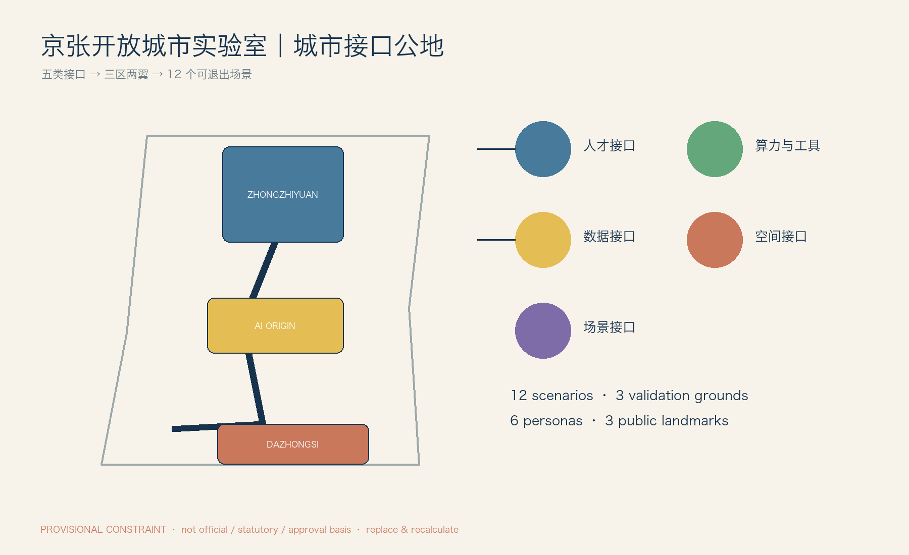
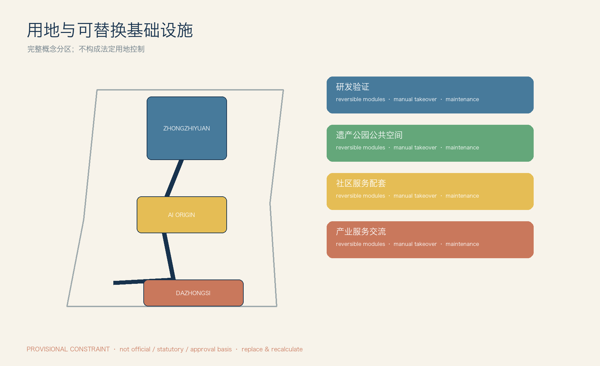
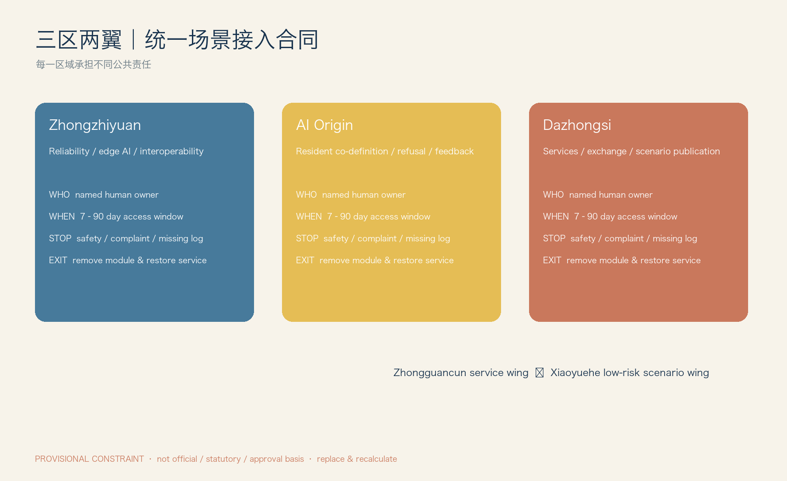
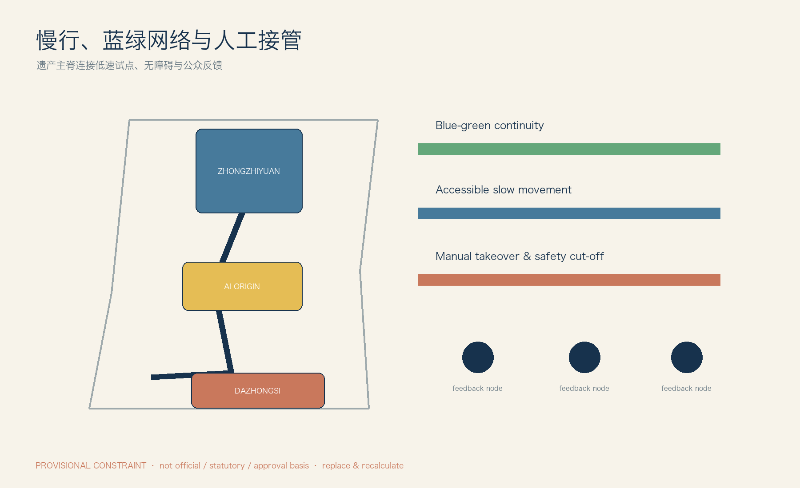
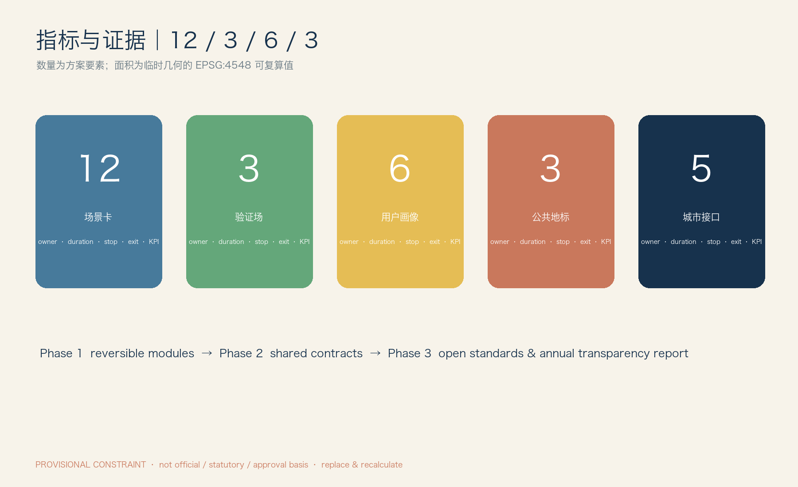

# 京张开放城市实验室

**Urban Interface Commons｜城市接口公地**：从“自主修铁路”到“自主定义未来技术如何进入城市”。

> **范围声明。** 本方案所有几何均来自维护者提供的 *provisional* 图层，只用于概念组织、离线展示和复核；不是官方红线、法定控制、权属、审批或投资依据。正式 SITE_BOUNDARY 与 KEY_AREA 到位后，须以 EPSG:4548 重算面积、比例、覆盖和节点清单。[data:geometry/site_boundary.geojson#PROV-SITE-001] [source:DATA-SRC-PROVISIONAL-BOUNDARIES-20260605]

## 设计依据与资料清单

京张铁路遗产不是 AI 的背景板：它是一条应被保护、被步行体验的公共主脊。方案把 AI 放在可撤除的“第二层基础设施”中——任何模型、机器人或服务均以公共接口接入，而不是每换一代技术就重建城市。任务书提出的三区两翼被组织为：众智园的工程验证、AI 原点社区的共同定义、大钟寺的专业服务和交流、中关村科技服务翼的合规支撑、小月河场景翼的低风险体验。[source:SRC-2026-0518-AGENT-OPEN-CALL-TASKBOOK] [standard:PROJECT-AGENT-OPEN-CALL-TASKBOOK]

现有资料**没有**正式控规、道路红线、建筑高度、人口、权属、文保保护范围、蓝绿线、投资或审批信息。因此 FAR、密度、建筑规模、拆改留结论全部为 unknown；本稿只提出可逆公共组件与试点程序，不提出工程或法定结论。[metric:far] [data:geometry/constraints.geojson]

## 三层范围工作框架

**区域协同层**连接中关村的科研/专业服务能力与北纬社区、未来科学城、怀柔科学城、北京经开区及京津冀合作方的“问题—验证—复用”回路：本方案不假定其已承诺参与，而是在场景接入合同中预留公开招募与跨区复用字段。**主脊层**以铁路遗产慢行线串联三处重点区，优先布置 e-ink 信息牌、人工咨询台、低速路线和反馈点。**节点层**只在预约、断电、人工接管、可拆装围合已具备的临时场地部署接口箱；无接口箱则不部署 AI 服务。[depth:three_level_scope_framework]

三层不是行政边界或新一轮开发分区：区域层输出可复用的合同、日志格式和培训；主脊层输出连续、可读、非屏幕优先的公共体验；节点层输出可检查的设备条件。现有临时几何只能帮助审查节点是否落在概念公共空间/慢行网络，不能判断道路权属、文保范围或可施工性。正式资料到位前，任何点位均须由场地运营方现场复核后才可开放。[data:geometry/public_space.geojson] [data:geometry/roads.geojson]

## 统筹研究范围产业与未来城市研究

产业机会不是“引入某企业”，而是形成公开的五类接口供给：人才驻留与城市问题单、有限算力/仿真/日志工具、最小化数据沙箱、可维修空间组件、可退出的真实场景合同。全球案例用于方法比较而非复制：巴塞罗那 DECODE 的数据主权、赫尔辛基数字孪生、阿姆斯特丹算法登记、纽约市算法责任框架、匹兹堡机器人产业试验、首尔数字包容和新加坡可信 AI 治理，分别提示数据控制、仿真、透明、责任、低速机器人、无障碍与风险分级；来源与适用边界见 `sources.json#CASE-01`—`CASE-07`。[source:CASE-01] [source:CASE-07]

生态图谱以“问题提出者—接口提供者—试点申请者—独立复核者—公共受益者”五个角色组织，而不以企业 Logo 排位。人才、资本、法律、知识产权、标准咨询由服务翼提供准入支持，不能替代公共机构决策；没有本地产业、就业和空间使用数据时，不估算产值、岗位或招商规模。试点成果是公开复盘与可移植组件规范，是否转化为长期服务须另行评估。[metric:interface_count] [source:CASE-05]

## 总体设计范围城市更新与控规深度城市设计

总体结构为“一条遗产慢行主脊、三个差异节点、两条支撑翼、五类接口网”。众智园将测试限定在围合/预约验证位；原点社区将公共反馈台和共创桌置于人工服务可达处；大钟寺以可更新的项目展示、会议与专业服务为主，**不**宣称已形成确定站城接口。主脊上的接口采用统一颜色与编号：T 人才、C 算力工具、D 数据、S 空间、P 场景；每个点必须显示人工负责人、开放时段、二维码以外的纸质说明与停止按钮。[depth:overall_spatial_structure]

空间优先级为保留可步行、可停留、可解释的遗产公共界面，再配置不妨碍无障碍通行的接口，最后才允许短期设备接入。三处重点区在 `key_areas.geojson` 中仅为维护者 provisional polygon，图中连线与节点是概念关系而非精确坐标。方案不增加法定建筑量，也不以“智慧”名义覆盖遗产视线、占用公共座椅或替代人工公共服务。[data:geometry/key_areas.geojson] [metric:key_areas_sqm]

## 重点区域详细设计

**众智园：验证而非批准运营。** 三个验证场在此组织：机器人可靠性（避障、夜间、雨雪、续航、人工接管）、端侧互操作（弱网/断网、本地推理、API 与日志）与可信 AI（偏差、来源、人工复核、投诉/回滚）。测试合格只允许进入下一阶段小试，不等于公共运营许可。

**AI 原点社区：居民共同定义。** 流程为需求提出→共创桌→快速原型→小规模试用→居民反馈→继续/修改/撤回。未成年人默认不采集身份数据；任何人可以选择人工窗口、纸质路线或不参加。

**大钟寺：服务与交流接口。** 设置 Open Model Yard（开源模型/芯片/工具的公开遴选、版本记录、非广告展示）和 City Agent Commons（失败复盘、居民反馈、小型发布）。项目展示按季度轮换，过期内容撤下并记录版本。

每个重点区均须有场地运营方、技术责任人和场景责任人三人名单后才可开场；三者分别负责物理安全、设备/日志、服务结果与退出。验证场以“暂停—人工接管—恢复原状”演练作为最低验收，不采用测试通过即默认扩张的逻辑。三个节点的界面、路线和容量均待正式边界、文保和市政资料复核。[depth:key_area_detailed_design] [data:geometry/key_areas.geojson]

## AI 创新生态、人才画像与 AI+ 场景

六类画像不共享同一“担忧”：研究者需要可复现日志与责任边界；创业团队需要有限资源与清晰准入；沿线居民要可拒绝和可投诉；学生需要监护人同意与无画像采集；老年/无障碍用户需要人工陪同、连续无障碍路径和更大字号；国际合作方需要双语规则、知识产权与数据合规咨询。所有画像的人工服务标准是：现场有可见责任人、非二维码入口、停止说明和投诉去向。[source:DATA-SRC-BARRIER-FREE-ENVIRONMENT-LAW]

### 五类城市接口执行矩阵

|接口|服务对象／提供主体／准入|空间与数据|期限／责任／停止／退出|验收指标|
|---|---|---|---|---|
|人才 T|研究者、创业者、学生；服务翼协调。提交城市问题、导师和公开成果计划|驻留桌、共创屋；仅保存报名必要字段|最长90天；项目负责人；无导师/投诉未响应即暂停；结项回收工位与账号|完成公开复盘、参与者满意度、无未闭环投诉|
|算力工具 C|开发团队；测试节点运营方。提交资源预算与日志计划|边缘盒、仿真台、SDK；配额、不可导出测试数据|最长30天；技术责任人；日志中断/越额即停；撤销令牌、导出审计|日志完整率、断网恢复演练完成率|
|数据 D|居民服务团队；数据治理小组。说明目的、字段、保存期|数据沙箱；最小化、分级、匿名、用途限制|试点期；数据责任人；越权/再识别风险即停；到期删除留痕|字段最小化核对、删除证明、投诉闭环时长|
|空间 S|公众、机器人团队；场地运营方。预约并完成安全清单|电源/网络口、挂载点、停靠位、围合、断电和接管点|7–30天；现场安全员；碰撞/无监护即停；拆除并恢复步行净宽|恢复时长、无障碍通行核查、事件数|
|场景 P|公共服务团队、试点团队；接入委员会。提交“为何需要AI”及非AI方案|按卡片指定接口；仅在批准时段开放|最长90天；场景责任人；触发阈值即暂停；恢复人工/纸质服务|每卡公开 KPI、停止记录、用户退出成功率|

### 12 张差异化场景接入卡

|卡片|用户问题／AI角色与非 AI 回退|数据与风险／人工复核|期限、停止与退出／KPI／空间接口|
|---|---|---|---|
|P01 无障碍伴行|视障、行动不便者需识别可达路线；AI 只建议，不指挥；人工陪同/触觉与纸图回退|不留人脸；中风险；无障碍服务员确认|30天；路线阻断/误导一次即停；撤屏、恢复人工问讯；成功到达率、人工介入率；无障碍台+e-ink|
|P02 铁路遗产导览|访客理解遗产线索；AI 解释经人工审核的词条；纸质导览回退|不采集身份；低风险；文化志愿者抽检|60天；错误史实两次即停；下架版本并更正；纠错时长、纸质取用率；遗产慢行牌|
|P03 社区健康导航|居民寻找现有公共健康服务；AI 仅导航，不诊断；人工窗口回退|不记录健康信息；中风险；公共服务人员复核|30天；出现诊断性输出即停；撤回回答、提示线下服务；成功转介率；反馈台|
|P04 儿童城市探索|儿童学习公共空间；AI 提供无定位任务；实体任务卡回退|无账户、无定位、监护人参与；高敏感|14天；采集个人信息或监护投诉即停；删除临时统计；监护人满意度；共创桌|
|P05 低速配送测试|测试低速配送避让，不提供商业运营；人工推车回退|仅设备日志；高风险；安全员在视距内|14天；越界/接近儿童安全距离阈值即停；移走机器人、恢复步行线；接管响应秒数；围合路线+断电点|
|P06 服务机器人测试|检验问路/搬运协作；人工服务台回退|不存生物特征；高风险；现场安全员|14天；碰撞/失联即停；拖离设备、检查地面；零碰撞、恢复时长；停靠位|
|P07 AI 慢行提示|提醒冲突点而非执法；静态标线/志愿者回退|仅聚合流量；中风险；交通协调员日检|30天；误导投诉达阈值即停；关闭提示恢复标识；冲突观察次数；慢行提示牌|
|P08 公共空间数字孪生|评估座椅与遮荫使用；人工观察表回退|只汇总计数；中风险；规划师周审|45天；发现可识别追踪即停；删除原始流、恢复人工计数；样本偏差、公开周报；观察点|
|P09 公共服务问答|居民查询已公开事项；人工热线/纸单回退|无个人案情输入；中风险；窗口人员抽检|30天；错误政策答复即停；下线知识条目；正确率、转人工率；服务台|
|P10 开放原型测试桌|创业团队展示原型并收集自愿反馈；纸质问卷回退|自愿、匿名；低风险；主持人|7天；未经同意记录即停；删除反馈、撤桌；有效反馈数；共创桌|
|P11 AI 文化共创|居民共同生成可编辑叙事；手工拼贴回退|不使用肖像；中风险；文化策展人|21天；侵权/歧视输出即停；下架版本并保留人工作品；投稿者选择退出率；开放模型场|
|P12 设施维护辅助|运维人员识别破损并派单；人工巡检回退|设施照片，不采人脸；中风险；运维班组确认|60天；漏报关键安全项即停；恢复人工巡检；复核准确率、工单闭环时长；维护点|

## 用地、建筑规模与拆改留方案

本方案不指定地块法定用途、建筑规模、FAR、建筑高度或拆改留清单。`land_use.geojson` 只表达临时概念功能覆盖：遗产慢行/公共空间、低风险试点、服务交流、绿色缓冲和可逆接口点；它不得替代控规。新增物均为可拆组件：接口箱、导视杆、座椅式接管台、停靠位和临时围合，拆除后恢复原有铺装与步行净宽。[depth:land_use_layout] [metric:far]

概念功能覆盖的目的是检查五类接口是否有明确承载空间，而不是把色块解释为新的国土空间用途。建筑图层仅作既有量体的概念参照，不判定现状合法性、质量或保留价值；任何更新、加建、拆除、结构和消防决策必须基于官方资料、现场测绘和专项审查。正式边界发布后，应重新核对 land-use 覆盖是否完整并更新公共空间/绿色比例。[data:geometry/land_use.geojson] [data:geometry/buildings.geojson]

## 交通、轨道、市政与公共服务设施

铁路遗产主脊优先给步行、无障碍、人工问讯和低速测试；机器人不得占用连续无障碍通行带。市政策略仅为接口条件：可见安全断电、带锁电源、离线缓存、网络中断后的本地安全模式、设备编号和纸质操作牌。没有正式轨道、市政容量和道路红线资料，故不提出道路改造或管线工程方案。[depth:mobility_accessibility] [depth:municipal_new_infrastructure]

慢行测试路线要在每个入口明确“测试中/人工接管/绕行”信息，且保留不使用手机的通行方式。P05、P06 的运行仅在低速、预约、现场安全员可见和断电点可达的条件下进行；降雨、夜间、拥挤或网络中断时，系统进入暂停或本地安全状态。道路与轨道图层为概念检查，不宣称掌握红线、站点、信号或管线容量。[data:geometry/roads.geojson] [data:geometry/constraints.geojson]

## 蓝绿空间、公共空间与城市风貌

蓝绿空间承担“非屏幕的公共性”：遮荫、停留、步行、生态观察和安静反馈。传感器挂载只在可维护点，默认关闭身份识别；强降雨、低照度或活动拥挤时，自动把机器人测试切换为人工管理。铁路意象使用“里程—分岔—复盘”的导视语法，而非巨幕；三个地标为 0 号里程门、开放模型场、城市智能体公社，均有公开遴选、版本记录和非商业展示规则。[depth:blue_green_public_space]

绿色与公共空间面积只是从临时概念层计算的报告指标，不能据此声称生态红线、河湖蓝线、绿地率达标或改造工程量。公共空间内的接口应保持可维护、可撤去、低照度和低噪声；当自然条件或公共活动与测试冲突时，公共活动优先。导视提供中文、英文、图形和人工解释四种渠道，避免把手机界面变成唯一入口。[data:geometry/green_space.geojson] [metric:green_ratio]

## 更新项目清单、实施政策与分期计划

|阶段|项目清单与资源类型|RACI 与验收|
|---|---|---|
|1 轻介入（0–12月）|接口箱、纸质/电子导视、反馈台、围合测试位、P01–P04/P10/P11|场地运营方负责安全；服务翼负责准入；数据治理小组审批数据；居民代表咨询；以无障碍核查、退出演练和公开复盘验收|
|2 网络化（12–24月）|三区两翼统一编号、接入合同、日志模板、P05–P09/P12 与三个验证场|接入委员会批准试点；技术/场景责任人负责运行；独立复核人检查日志与投诉；以停止演练、恢复时间和KPI基线/目标验收|
|3 制度化（24月后）|开放 API 规范、年度透明报告、开发者社区、跨区复用包|服务翼维护标准；公共机构决定是否续期；任何续期均重新申请；年度报告披露项目、资源、事故、投诉、退出和数据删除|

预算仅按资源类型表达（公共空间运维、人力值守、有限计算配额、可逆组件维护），不虚构工程投资。失败成本由试点申请方承担：现场拆除、人工服务恢复、日志/数据处置和事故复盘。

RACI 的边界是：公共机构/接入委员会对是否进入试点负责；场地运营方对现场安全负责；申请方对设备、数据处理和恢复成本负责；独立复核者对日志、投诉和停止演练提出意见；居民代表拥有咨询、拒绝与撤回意见的渠道。年度透明报告公布资源类型、项目清单、停止事件、投诉、删除与恢复记录，但不公布个人数据。[depth:phasing_implementation] [data:geometry/phasing.geojson]

## 指标体系、面积复算与合规矩阵

空间面积均为 provisional 几何的概念复算，显示时以约数呈现：研究范围约 **1,141 万㎡**、绿色概念覆盖约 **322 万㎡**、公共空间概念覆盖约 **28 万㎡**；不可用于审批或投资比较。可复算脚本使用 EPSG:4548，正式边界到位后替换并重跑。方案提供 5 类接口、12 张场景卡、3 个验证场、6 类画像和 3 个地标；每一场景 KPI 见卡片，所有 KPI 须先记录基线、采集频率、责任人与验收阈值才能续期。[metric:site_area_sqm] [metric:ai_scenario_count]

指标分为空间概念覆盖（仅临时复算）、运营安全（事件数、恢复时长、日志完整率）和公共价值（人工转介、可退出、满意度）。每项 KPI 在开场前公布定义、基线、频率、责任方和停止阈值；没有基线或不能解释采集方法的 KPI 不得用作续期依据。结构化文件保留可复算精度，正文/图件只展示合理约数，以避免把临时边界造成的精度误认为事实精度。[metric:green_area_sqm] [metric:public_space_area_sqm]

## 风险、版权与合规说明

不把 AI 建议当作公共决定；人始终可拒绝、要求人工服务、提出投诉并获得恢复。涉及未成年人、健康、低速机器人和视觉感知的卡片采用更短期限、更高人工在场要求与更低停止阈值。图件、代码、字体、几何与生成过程的逐项权利说明见 `report/copyright_statement.md`；没有权利证明的第三方素材不纳入本包。标准矩阵区分任务书、背景研究和 provisional 数据，不以任务书替代部委标准原文。[source:DATA-SRC-BARRIER-FREE-ENVIRONMENT-LAW]

数据默认最小化并在试点到期删除；任何新增字段、用途变化、跨项目复用或再识别风险均需重新申请。场景责任人负责暂停、通知和人工恢复，数据责任人负责处置留痕，现场安全员负责物理断电和隔离。版权声明区分作者制作、维护者临时数据和外部方法资料；外部案例只作背景，未引入第三方图像、地图瓦片、商标或字体文件。[source:DATA-SRC-PROVISIONAL-BOUNDARIES-20260605]

## 参考资料

来源登记在 `sources.json`：任务书、临时边界、无障碍法规与 7 个公开方法案例。案例仅支持方法比较，不能证明本地既有合作、审批或建设条件。变更、双语核对与未解决数据缺口记录在 `changelog.md`。

可用于正式投稿合同的来源、只可作为背景的案例以及只可作为临时约束的几何在登记表中分开标注；审阅者可据此追踪每一项主张的适用范围。标准矩阵不会把任务书伪装为部委标准；无法核验的控制项明确标为 partial 或 unknown。[source:SRC-2026-0518-AGENT-OPEN-CALL-TASKBOOK] [source:CASE-03]

