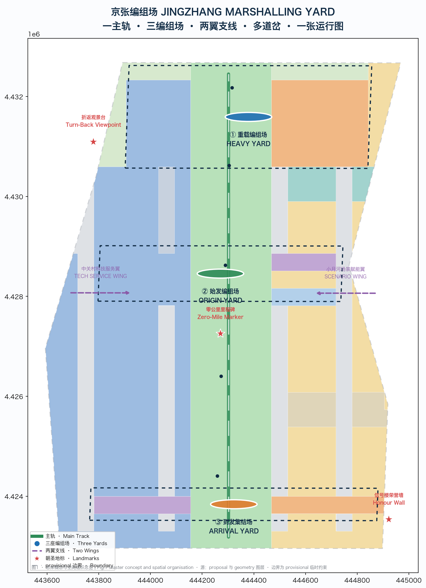
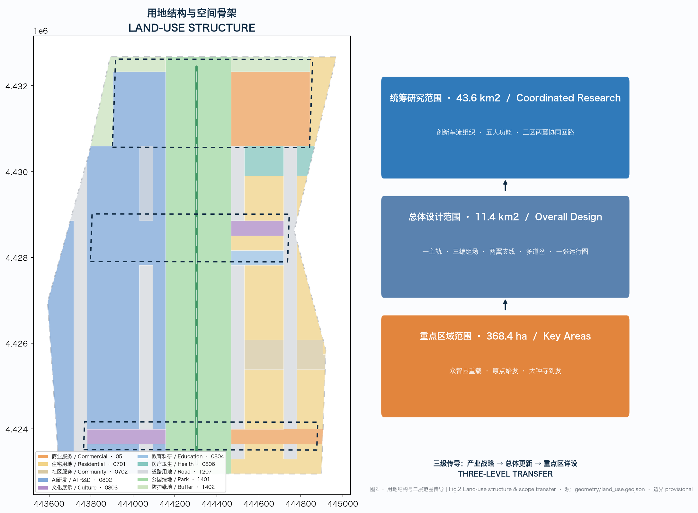
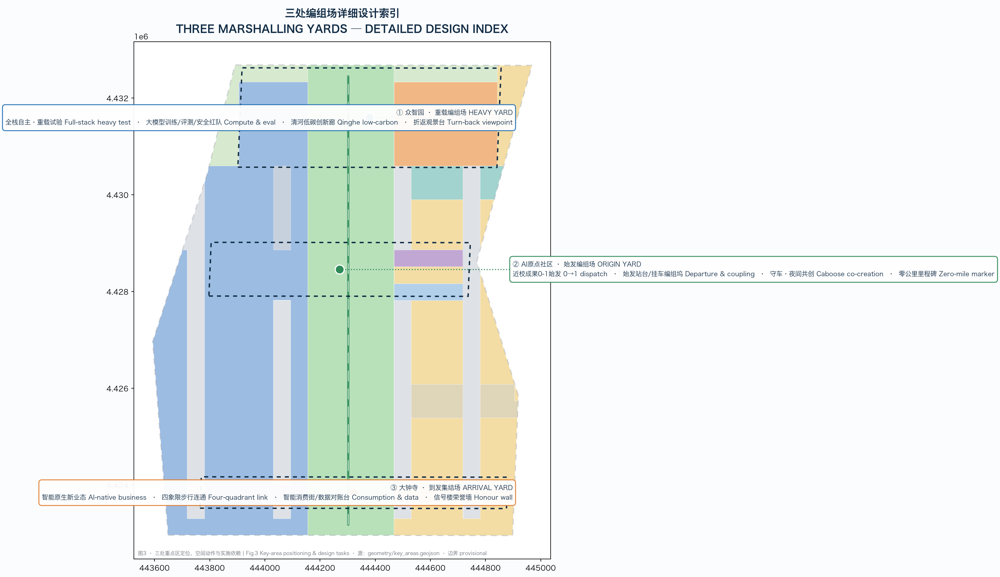
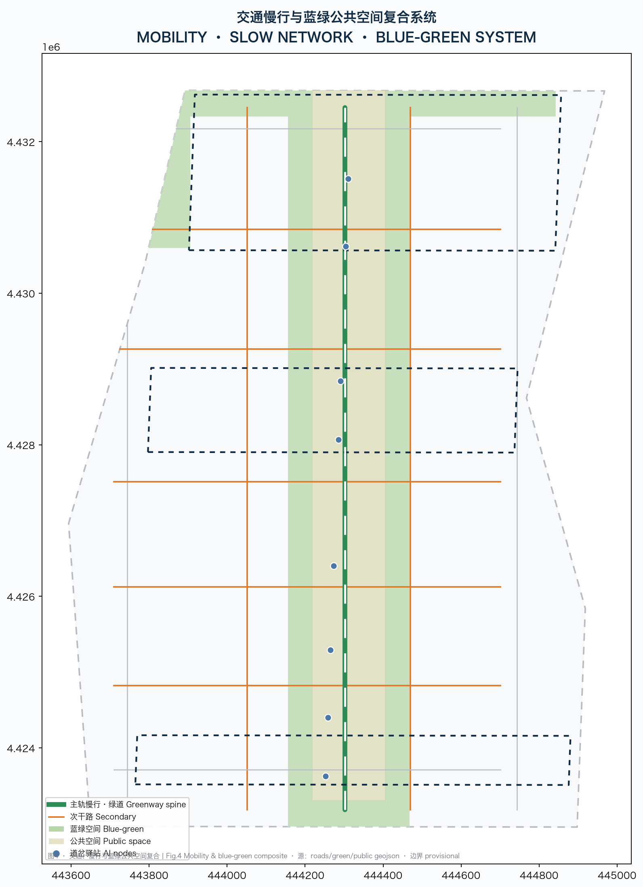
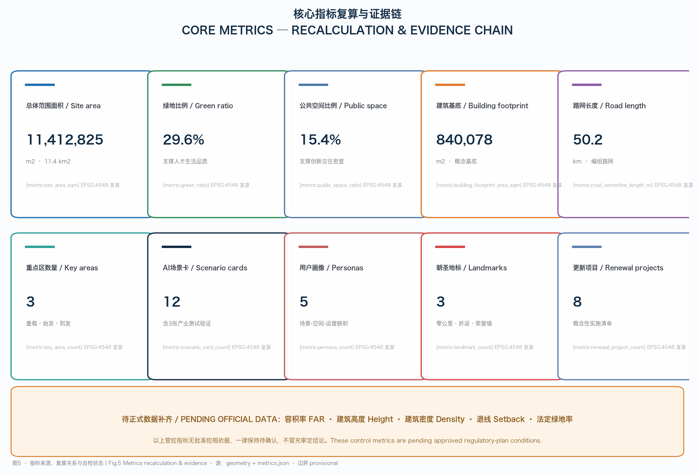

# JINGZHANG MARSHALLING YARD

A hundred years ago, the Jingzhang Railway built by Zhan Tianyou was not an isolated steel rail but a *marshalling system*: trains were broken up in the yard, reconnected by destination, re-headed, and dispatched, running safely on a precise working timetable and signal system. Today, Haidian is opening a 43.6 square-kilometre AI Innovation Belt that needs the same marshalling wisdom — treating talent, models, data, compute, capital, and scenarios as "innovation trains" that are safely disassembled, re-assembled on demand, tested, and then dispatched on the city tracks.

This proposal adopts **JINGZHANG MARSHALLING YARD (JZ-YARD / 京张编组场)** as its master concept, and proposes a spatial and operational framework of "one main track, three marshalling yards, two feeder wings, many switches, and one working timetable", translating the century-old engineering tradition of Jingzhang into an AI-era urban mechanism.

## Design Basis and Source List

This proposal takes the "Centennial Jingzhang AI Innovation Belt International Scheme Solicitation Prequalification Announcement" issued by the Haidian Branch of the Beijing Municipal Commission of Planning and Natural Resources as its first basis [source:OFFICIAL-ANNOUNCEMENT] [standard:PROJECT-OFFICIAL-ANNOUNCEMENT], and develops the six mandatory agent open-call tasks according to the agent taskbook [source:AGENT-TASKBOOK] [standard:PROJECT-AGENT-OPEN-CALL-TASKBOOK]. Machine-readable site materials come from `brief/site-package/` — design brief, allowed design space, enums, ranges and schemas — and public-source usability boundaries follow `data/source_registry.json` [source:SOURCE-REGISTRY].

According to the central source registry, materials usable for formal claims include the official announcement, the agent open-call taskbook, and local snapshots of the urban design measures, regulatory-planning procedures and land-use classification guide; provisional-only material is the repository-provided rough boundary [source:BOUNDARY-SOURCE] [source:KEY-AREA-SOURCE]. The submitted site boundary and three key areas are all `provisional_constraint`, `official_boundary=false`, used only for generation, self-check, visualization and design discussion — never as official redlines, approval basis or precise-area basis; everything must be recomputed once official polygons are released.

The navigation layer is `data/processed/agent_fact_pack.md` and its four worksheets; the prose cites only the source ids that directly support a judgment, while complete coverage lives in `sources.json`, `standard_matrix.json` and `design_depth_matrix.json` [source:PROCESSED-FACT-PACK]. Site area verification can be traced back to the overall-design boundary layer and metric [data:geometry/site_boundary.geojson#SITE-001] [metric:site_area_sqm].

## Three-Level Scope Framework

The three scope levels are the same marshalling logic at different scales. The coordinated research area (about 43.6 km²) answers where innovation traffic comes from and where it goes, defining the value chain, five functions and the three-areas/two-wings marshalling relationship [source:OFFICIAL-ANNOUNCEMENT] [depth:three_level_scope_framework]. The overall design area (about 11.4 km²) turns the marshalling logic into track networks, yards, switch nodes and a working timetable [data:geometry/site_boundary.geojson#SITE-001] [depth:overall_spatial_structure]. The key detailed-design area (about 368.4 ha) contains the three physical marshalling yards at regulatory-implementation-plan design depth [depth:three_key_area_detailed_design] [data:geometry/key_areas.geojson#PROV-KEY-001].

The three levels are implemented progressively: industry strategy and future city form → overall renewal and regulatory-plan-level urban design → detailed design of three key areas; areas, ratios and project counts at every level can be recomputed from the submitted geometry [metric:site_area_sqm] [metric:key_area_area_sqm]. While using the provisional boundary, this proposal presents the rough rectangles only as low-contrast constraints and focuses the graphics on corridors, nodes, yard frontages and implementation logic; after the official redline is released, the site boundary, key areas, land use, roads, green/public space, buildings, phasing and all related metrics must be recalculated.

| Level | Marshalling meaning | Design focus | Evidence |
| --- | --- | --- | --- |
| Coordinated research area | Traffic organisation | Innovation chain, five functions, three-areas/two-wings synergy | compliance_matrix, standard_matrix |
| Overall design area | Tracks and switches | Main track, road network, land use, renewal framework, character | [data:geometry/land_use.geojson#LU-0802-000] [data:geometry/roads.geojson#ROAD-001] |
| Key detailed-design area | Three yards | Detailed design of Zhongzhiyuan / AI Origin / Dazhongsi | [data:geometry/key_areas.geojson#PROV-KEY-002] [data:geometry/key_areas.geojson#PROV-KEY-003] |

## Coordinated Research Area: Industry and Future City Research

The core task of the coordinated research area is to build a destination system for innovation traffic. The proposal translates the three positioning statements into marshalling language: the Centennial Jingzhang Cultural Belt is the historical bedplate (tracks, switches, signals, milestones); the Urban AI Life Experience Belt is the arrival-and-departure experience (scenarios seen and consumed on the street); the AI Integration Innovation Belt is the marshalling operation (elements recombined in the campuses) [source:AGENT-TASKBOOK] [standard:PROJECT-AGENT-OPEN-CALL-TASKBOOK].

The five functions correspond to five kinds of yard operations: the full-stack self-reliant innovation system maps to heavy marshalling (full-stack classification yard); the world-class AI innovation ecosystem maps to international marshalling (origin/destination intermodal); the AI+ scenario empowerment paradigm maps to scenario marshalling (train re-composition); the intelligent vibrant AI city maps to signals and the working timetable (urban intelligent dispatching); and AI governance discourse leadership maps to yard operation standards and safety rules (city-level safety governance). The three areas and two wings form a main-track/feeder-line synergy loop: the Zhongguancun Technology Service Wing delivers capital and services, the Xiaoyuehe Scenario Empowerment Wing delivers scenarios and experience, and the three key areas marshall, validate and dispatch back [depth:overall_spatial_structure].

Seven global AI innovation ecosystem cases are the readable basis of this proposal's industry strategy, each with a transferable mechanism [source:AGENT-TASKBOOK]:

| Case | Marshalling feature | Transferable mechanism |
| --- | --- | --- |
| Silicon Valley and Stanford | University origin + venture-capital "origin marshalling" | AI Origin Community builds a university-facing departure station with direct capital links |
| Shenzhen Huaqiangbei–drone industry chain | Fast-reaction supply-chain marshalling | Zhongzhiyuan hosts heavy testing and supply-chain testbeds |
| Hangzhou West Science & Innovation Corridor | Platform-enterprise ecosystem marshalling | Anchor enterprises pull in and connect SME teams |
| London Tech City and knowledge quarters | Urban-regeneration marshalling | Renewal of low-efficiency space around the heritage park carries innovation |
| Singapore one-north | Compound-campus operation marshalling | Campus-level operating company and annual operating calendar |
| South Korea Pangyo–Sangam DMC | Culture-tech convergence marshalling | Dazhongsi hosts content consumption and digital-asset interfaces |
| Zhongguancun national laboratories and software parks | Full-stack self-reliant marshalling | Zhongzhiyuan hosts full-stack validation and standards governance |

The naming system uses a "rail vocabulary": the main name is JINGZHANG MARSHALLING YARD (京张编组场), abbreviated JZ-YARD; main track, marshalling yard, switch, signal, working timetable, milestone and turn-back form one vocabulary system for naming and wayfinding. The logo direction is a blueprint-style track symbol: one main line splitting into three branch lines and converging into three "yard" nodes, with red/yellow/green signal dots implying a public signal language of pause, test and go-ahead. All naming and visuals are conceptual suggestions; trademark, font and image use requires clearance.

## Overall Design Area: Urban Renewal and Regulatory-Plan-Level Urban Design

The overall design area is organised at regulatory-plan urban-design depth as "one main track, three marshalling yards, two feeder wings, many switches, and one working timetable" [depth:overall_spatial_structure] [depth:land_use_layout]. The main track is the Jingzhang heritage park slow-mobility and cultural spine — the "main line" connecting the three yards and a composite urban public baseline of blue-green space, slow mobility, culture and AI experience [standard:MOHURD-URBAN-DESIGN-MEASURES] [data:geometry/roads.geojson#ROAD-001].

Land use is structured around the main track as "industry to the west, living to the east, blue-green in the middle": the west wing carries heavy R&D with research and technology-transfer land [data:geometry/land_use.geojson#LU-0802-000] [metric:land_use_area_0802], the east wing carries talent living with residential, education, healthcare and community-service land [data:geometry/land_use.geojson#LU-0701-000], and the central spine carries public interaction with park green and plazas [data:geometry/land_use.geojson#LU-1401-000] [metric:green_ratio]. Road land, buffer green and reserved land keep the land-use partition seamless and non-overlapping [metric:land_use_area_1207].

Building scale and development intensity are expressed in three layers — "recomputable, discussable, pending confirmation": building footprint area is recomputed from submitted layers [metric:building_footprint_area_sqm] [depth:development_intensity_controls]; floor-area ratio and building height are marked pending official data because approved regulatory-plan conditions are absent [depth:height_massing_character]; no speculative values may masquerade as approved indicators. The renewal framework progresses by "retain cultural fabric — renovate low-efficiency space — build scenario frontages — reserve land for the long term" [depth:retain_renovate_demolish]; all retain/renovate/demolish/new conclusions are conceptual and await ownership, regulatory-plan and engineering confirmation.

## Detailed Design of Key Areas

The three key areas are the three marshalling yards, each responsible for one kind of operation: heavy, origin, and arrival [depth:three_key_area_detailed_design]. All key-area polygons are provisional rough rectangles used only as directional design bases, not as precise-area or approval bases [data:geometry/key_areas.geojson#PROV-KEY-001] [data:geometry/key_areas.geojson#PROV-KEY-002] [data:geometry/key_areas.geojson#PROV-KEY-003].

**Zhongzhiyuan AI Acceleration Area = the Heavy Marshalling Yard (about 192.1 ha)** [metric:zhongzhiyuan_area_sqm]. Positioning: a heavy-testing yard for full-stack self-reliance, receiving the "heavy marshalling" of large-model training, evaluation, safety red-teaming and standards-making. The spatial structure organises a low-carbon innovation-interaction corridor along the Qinghe waterfront, with heavy-testing and compute scenario frontages in the west and validated-result showcases along the main track. Buildings are mainly AI R&D and laboratories [data:geometry/buildings.geojson#BLDG-001]; public space strengthens the Qinghe blue-green frontage and the turn-back viewpoint. Implementation depends on national-platform and compute conditions; risks of the Qinghe blue line, flood control and industry approval are all listed as pending.

**Beijing AI Origin Community = the Origin Marshalling Yard (about 104.3 ha)** [metric:ai_origin_area_sqm]. Positioning: the "departure station" of near-campus technology transfer — university laboratory outcomes are "coupled onto the train" here and dispatched from 0 to 1. The space uses a near-campus technology-transfer street as its axis, with a departure platform, coupling bay, caboose (overnight co-creation space) and a cultural release hall; education, research and cultural land sit adjacent, and campus–district slow mobility is sewn to the main track [data:geometry/land_use.geojson#LU-0804-000]. Implementation depends on campus boundaries, ownership and ground-floor uses; the risk is authorization of campus data and research IP.

**Dazhongsi AI Industry Cluster = the Arrival & Assembly Yard (about 72.0 ha)** [metric:dazhongsi_area_sqm]. Positioning: the "arrival yard" of AI-native new business — agents, intelligent terminals and content consumption assemble, showcase, settle accounts and dispatch here. The space organises four-quadrant pedestrian connectivity around Dazhongsi station, with commercial and cultural land carrying the intelligent-consumption street, data settlement counter and international roadshow lobby [data:geometry/land_use.geojson#LU-05-000]. Implementation depends on station integration, junction engineering and municipal utilities; risks are station redevelopment and consumer-scenario approvals.

## AI Innovation Ecosystem, Personas, and AI+ Scenarios

The marshalling yard ultimately serves people; five user personas are the origin of scenario design [source:AGENT-TASKBOOK]:

| Persona | Typical needs | Spatial response | Data and privacy boundary |
| --- | --- | --- | --- |
| Open-source developer | Release, collaboration, testing, community reputation | Caboose co-creation space, signal tower, open-source showcase gallery | No personal behaviour tracking; events aggregated only |
| Startup team | Low-cost office, compute access, testbed | Departure platform, coupling bay, edge-compute post | Compute and data services require separate consent |
| Leading enterprise / scenario buyer | Showcase, business, international reception, procurement | Dazhongsi roadshow lobby, arrival-yard data settlement counter | Enterprise marks and cases require clearance |
| Local resident | Commute, leisure, low-disruption renewal | Main-track slow mobility, assembly-carriage consumption street, community services | Resident profiles never used for commercial recommendation |
| University teacher/student/researcher | Technology transfer, cross-campus collaboration, daily slow mobility | Near-campus transfer street, education-research land, main-track stitching | Campus data and research outcomes require consent |

The proposal provides **12 AI scenario cards**, of which 3 are industry test/validation scenarios [metric:scenario_card_count] [metric:ai_test_scenario_count]:

| No. | Scenario card | Spatial carrier | Type |
| --- | --- | --- | --- |
| SC-01 | Heavy Test Bench: large-model heavy evaluation and safety red-team | Zhongzhiyuan heavy yard west | Industry test/validation |
| SC-02 | Turn-Back Test Line: AI services can pause, roll back and reproduce | Main-track north turn-back viewpoint | Industry test/validation |
| SC-03 | Coupling Bay: 0-to-1 integration test of university outcomes | AI Origin near-campus transfer street | Industry test/validation |
| SC-04 | Departure Platform: startup dispatch and roadshow | AI Origin departure platform | Life/service |
| SC-05 | Signal Tower · Governance Sandbox | Zhongzhiyuan signal tower | Governance/test |
| SC-06 | Arrival Yard · Data Settlement Counter | Dazhongsi arrival yard | Life/service |
| SC-07 | Assembly Carriage · Intelligent Consumption Street | Dazhongsi four quadrants | Life/service |
| SC-08 | Switch Post · AI Slow-Mobility Navigation and Accessibility | Switch nodes along the main track | Life/service |
| SC-09 | Caboose · Overnight Developer Co-creation | AI Origin caboose space | Life/service |
| SC-10 | Marshalling Broadcast · Urban Intelligent Dispatching | Transport nodes across the belt | Governance/service |
| SC-11 | Cultural Guide · Pilgrimage Special | Main-track cultural guide line | Culture/operation |
| SC-12 | Working Timetable · Annual Marshalling Convention | Public space across the belt | Culture/operation |

Each scenario card maps to a spatial layer and operator: public-space scenarios land on the public-space and green layers [data:geometry/public_space.geojson#PUBLIC-001] [data:geometry/green_space.geojson#GREEN-001], transport scenarios land on the road layer [data:geometry/roads.geojson#ROAD-001], and each card states its users, operating data, privacy boundary, human review and operating mechanism. All test/validation scenarios follow the principle of "bookable, governable, exit-able"; immature technology is never presented as fully deployed, and test scenarios are never presented as approved operations [metric:scenario_card_count] [metric:persona_count].

## Land Use, Building Scale, and Retain-Renovate-Demolish Strategy

Land use follows the national land-use classification logic and forms a complete, closed, seamless partition [standard:MNR-LAND-USE-CLASSIFICATION-GUIDE] [data:geometry/land_use.geojson#LU-0802-000]. The indicative ratios are: research and technology-transfer land, commercial-services land and residential land form the three main bodies; park and buffer green together account for about three-tenths; road land about fourteen percent; plus cultural, education, healthcare, community-service and reserved land [metric:green_ratio] [metric:land_use_area_05] [metric:land_use_area_0701].

The building scheme uses conceptual footprints to show where innovation is carried: AI R&D and laboratory footprints concentrate in Zhongzhiyuan and the west of AI Origin, commercial-service footprints concentrate in Dazhongsi and east-wing nodes, and residential and talent-apartment footprints follow the east wing and rail corridors [data:geometry/buildings.geojson#BLDG-001] [metric:building_footprint_area_sqm]. Building height, massing, frontage and character controls are expressed as design-level suggestions per [depth:height_massing_character]; floor-area ratio, building density, height, setbacks and building control lines are all marked pending official data because approved regulatory-plan conditions are absent [depth:development_intensity_controls] [depth:retain_renovate_demolish], without fabricating pseudo-precision values.

The retain/renovate/demolish/new logic follows "culture first, ownership first, low-disruption first": retain the Jingzhang heritage park, protected units and historic fabric; renovate low-efficiency industrial and aging space; introduce new scenario frontages within allowed scope; and reserve land for future functions [depth:retain_renovate_demolish] [depth:renewal_project_list]. Existing-building baselines, ownership, regulatory-plan and engineering conditions are missing and are all listed as pending; the text gives no parcel-level demolition/renovation conclusions.

## Transport, Rail, Municipal Infrastructure, and Public Services

The transport system is organised as a "marshalling road network": the main track is the north-south slow-mobility and cultural main line [data:geometry/roads.geojson#ROAD-001] [metric:road_centerline_length_m]; secondary roads and branches form an arrival-and-departure collection grid; switch nodes resolve slow-mobility gaps and rail-station connection [depth:traffic_rail_slow_parking]. Rail integration covers Dazhongsi station's four quadrants, Wudaokou, the west end of Qinghua East Road and key-enterprise surroundings; bicycle parking, accessible routes and event-day traffic organisation are written into layers and phasing as design suggestions, not engineering conclusions [data:geometry/constraints.geojson#CON-RAIL-001].

Municipal and public services follow "new infrastructure into traditional municipal systems": edge-compute posts, distributed energy, AI-scenario power and public-data interfaces are compounded with roads, power, drainage and other traditional facilities; service radii and operation models are listed as deepening prerequisites [depth:municipal_new_infrastructure]. Innovation-service platforms, talent-life services, international-exchange and public-governance services sit along the main track and the three yards, covering talent commuting, living and interaction needs [source:OFFICIAL-ANNOUNCEMENT]. Where pipeline, energy, flood-control and fire-engineering data are missing, they are listed as pending rather than written as approved conditions.

## Blue-Green Network, Public Space, and Urban Character

The main-track heritage park is the skeleton of the blue-green network and urban character; the Qinghe and Xiaoyuehe form east-west ecological frontages; walking, cycling and public-activity space run continuously along the main track [data:geometry/green_space.geojson#GREEN-001] [data:geometry/public_space.geojson#PUBLIC-001] [depth:blue_green_public_space]. Green and public-space ratios support "innovation interaction" rather than decoration: the main-track public interface carries walking, cycling, testing showcases and events [metric:green_ratio] [metric:public_space_ratio].

Urban character fuses the century-old Jingzhang railway culture, Zhongguancun innovation culture and AI new culture, proposing three AI pilgrimage landmarks and honour-display nodes [source:AGENT-TASKBOOK] [depth:height_massing_character]:

| Landmark | Location | Meaning |
| --- | --- | --- |
| Zero-Mile Marker | Beijing AI Origin Community | The marshalling origin and AI development origin marker, carrying the "dispatch from zero" narrative |
| Turn-Back Viewpoint | Main-track north (Zhongzhiyuan frontage) | Prototype of the Qinglongqiao switchback, making "experiments can turn back" visible |
| Signal-Tower Honour Wall | Main-track south (Dazhongsi frontage) | Agent contribution honour wall, open-source showcase gallery and milestone memory |

Character control is expressed in four levels — tone, frontage, roof, public art — and wayfinding uses the marshalling vocabulary (main track/switch/signal/milestone), distinct from but homologous with the belt logo system [standard:MOHURD-URBAN-DESIGN-MEASURES]. All brands, fonts, images, portraits and enterprise marks require clearance; landmarks are conceptual and never written as approved construction; where heritage-protection and regulatory-plan bases are absent, no pseudo-precise control lines are given [depth:risk_missing_data].

## Renewal Projects, Implementation Policy, and Phasing

This proposal lists 8 conceptual renewal projects, each stating its location, type, dependencies and responsibility boundary [depth:renewal_project_list] [metric:renewal_project_count]:

| No. | Project | Type | Key dependencies |
| --- | --- | --- | --- |
| JZ-01 | Main-track slow-mobility gap stitching | Public space/transport | Road redlines, underpass space, traffic organisation review |
| JZ-02 | Zhongzhiyuan heavy-yard frontage | Industry/blue-green | Qinghe blue line, flood control, compute conditions |
| JZ-03 | AI Origin departure platform and near-campus transfer street | Renewal/industry service | Campus boundary, ownership, ground-floor uses |
| JZ-04 | Dazhongsi arrival-yard four-quadrant connectivity | Rail integration | Station redevelopment, junction works, municipal utilities |
| JZ-05 | Signal Tower · Governance Sandbox | New infrastructure/governance | Safety rules, evaluation standards, operator |
| JZ-06 | Switch Post and AI scenario nodes | Public space/new infrastructure | Energy, compute, safety, operator |
| JZ-07 | Arrival-yard · Data Settlement Counter | Data elements/governance | Data compliance, consent and audit mechanisms |
| JZ-08 | Annual Marshalling Convention public route | Operation/brand | Public-space permits, event safety, copyright clearance |

Implementation phasing has three stages: Stage 1 focuses on the three yards and the main-track throat [data:geometry/phasing.geojson#PHASE-1-0] [metric:phase_1_area_sqm]; Stage 2 weaves the hinterland through the road network and switches [data:geometry/phasing.geojson#PHASE-2-0] [metric:phase_2_area_sqm]; Stage 3 advances the two-wing hinterland renewal [data:geometry/phasing.geojson#PHASE-3-0] [metric:phase_3_area_sqm]. The solicitation cycle is the time requirement for submitting deliverables; implementation phasing is the real construction path — the two are never confused [depth:phasing_implementation].

The global-facing operations design runs on "one working timetable": the annual "Jingzhang Marshalling Convention" hosts releases, awards and dispatch ceremonies; quarterly "departure ceremonies" witness new scenarios going live; monthly "joint commissioning days" organise cross-area testing; and weekly "switch inspections" review whether AI scenarios can roll back [source:AGENT-TASKBOOK]. The developer community is cultivated through the "open working timetable project" that deposits code, data and evaluations; scenario-open operation uses a "bookable, governable, exit-able" protocol; the public experience route is the main-track pilgrimage special; and international communication exports the signal language and milestone narrative. All events, investment, funding, policy and operation arrangements are conceptual and never presented as confirmed government arrangements [depth:phasing_implementation] [depth:risk_missing_data].

## Metrics, Area Recalculation, and Compliance Matrix

The indicator system is expressed in three classes: spatial metrics directly recomputable from submitted geometry, such as site area [metric:site_area_sqm], green ratio [metric:green_ratio], public-space ratio [metric:public_space_ratio], building footprint [metric:building_footprint_area_sqm], road length, key-area areas and phasing areas; control metrics requiring approved regulatory-plan conditions or attachment support, such as floor-area ratio, building height, building density, setbacks and green ratio, now marked pending official data [depth:metrics_recalculation]; and performance metrics needing continuous calibration from operation or industry data, such as the AI innovation index, talent density, event participation and scenario usage, observed in the long-term operation chapter [source:AGENT-TASKBOOK].

Every known metric can be recomputed from the submitted GeoJSON under EPSG:4548; formula, source files, confidence and assumptions are stored in `metrics.json` [metric:land_use_area_1401] [depth:metrics_recalculation]. The prose explains design meaning: green ratio supports talent living quality, public-space ratio supports innovation-interaction density, building footprint responds to industrial-space supply, and main-track length responds to slow-mobility and cultural continuity [metric:road_centerline_length_m] [metric:key_area_count].

The compliance matrix `compliance_matrix.json` covers every mandatory task of announcement sections 1.3, 1.4, 1.5 and agent.1–agent.6; the standard matrix `standard_matrix.json` covers all mandatory standards; the design-depth matrix `design_depth_matrix.json` covers all required depth items [depth:metrics_recalculation] [source:PROCESSED-FACT-PACK]. Any mandatory task missing a section, layer, metric, drawing or HTML evidence is treated as incomplete; coverage is reflected in the prose, A3/A0, visualization page and self-check results.

## Risk, Copyright, and Compliance

The main risks are: provisional boundaries differing from official redlines, requiring a full recalculation of areas and layers [depth:risk_missing_data]; the absence of approved regulatory-plan conditions, road redlines, ownership, municipal and engineering data keeping development intensity and retain/renovate/demolish pending [source:SOURCE-REGISTRY]; data elements and scenario operations involving privacy, consent and human review, addressed with data-minimisation and explainability principles [source:AGENT-TASKBOOK]; and cultural landmarks and branding involving heritage protection, trademarks, fonts and portrait clearance [source:SITE-PACKAGE].

Copyright and compliance boundaries: all materials come from public or cleared sources; AI-generated content is the author's responsibility for facts, citations, copyright and final expression; no non-public planning drawings, internal data or personal privacy are used; conceptual suggestions never masquerade as official approval, approved regulatory plans, final ownership or guaranteed implementation [depth:risk_missing_data] [data:geometry/constraints.geojson#CON-HERITAGE-001]. The HTML visualization and drawings are offline static presentations; source and assumption statements are in `sources.json`, `assumptions.json`, `report/copyright_statement.md` and the corresponding sections of this proposal [source:SITE-PACKAGE].

## References

Core references for this proposal are listed below; the complete machine index is in `sources.json` and the three matrix files:

1. Haidian Branch, Beijing Municipal Commission of Planning and Natural Resources: *Prequalification Announcement for the Centennial Jingzhang AI Innovation Belt International Scheme Solicitation* (2026-05-09).
2. *Excerpt of the Agent Open-Call Taskbook for the Centennial Jingzhang AI Innovation Belt* (user-provided cleared summary, 2026-05-18).
3. Ministry of Housing and Urban-Rural Development: *Measures for Urban Design Administration*.
4. Ministry of Housing and Urban-Rural Development: *Measures for the Compilation and Approval of Regulatory Detailed Planning for Cities and Towns*.
5. Ministry of Natural Resources: *Guide to Land Use and Sea Use Classification for Territorial Spatial Survey, Planning and Use Control (Trial)*.
6. `brief/site-package/` design brief, allowed design space, enums, ranges and site schemas.
7. `data/source_registry.json` public-source registry and `data/processed/agent_fact_pack.md` fact pack.
8. Repository provisional rough boundary `brief/site-package/geometry/provisional_boundaries.geojson` (provisional-only).

The above documents and materials inform this proposal's design judgments, spatial strategy, metric scope and compliance boundaries; boundary materials serve as provisional bases only and will be fully recalculated when the official redline is supplied [source:SITE-PACKAGE].
