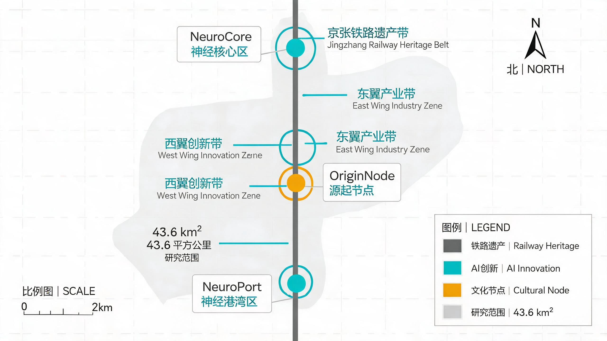
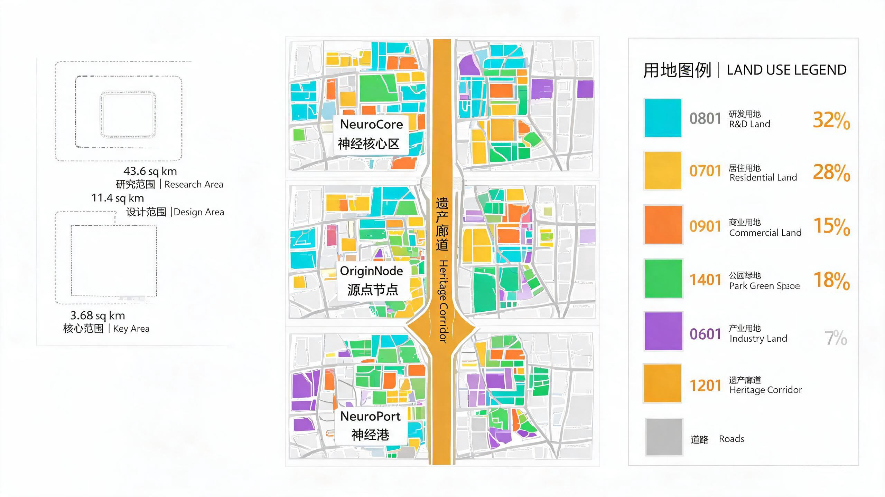
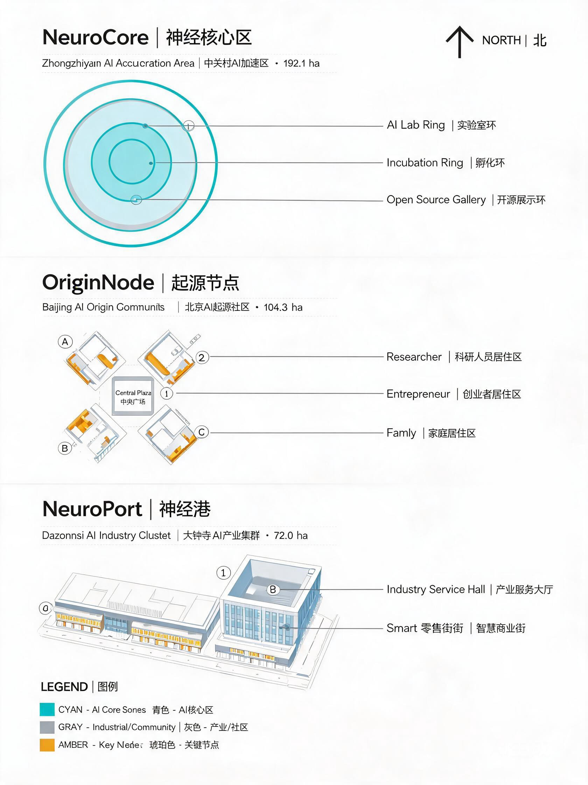
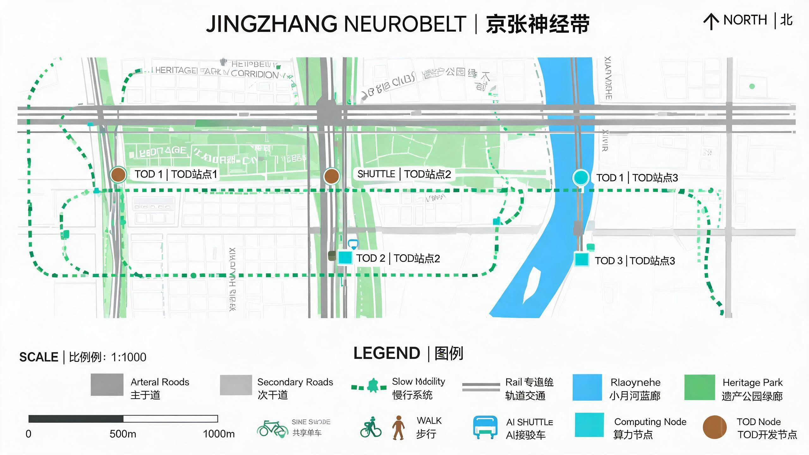
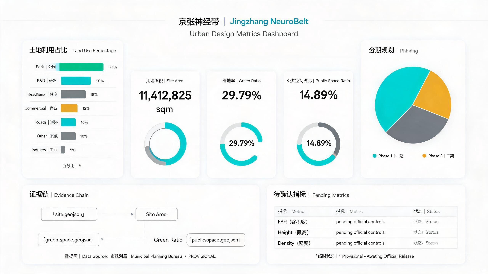

---
title: "Jingzhang NeuroBelt — From a Century-Old Railway to an AI Neural Pathway: An Urban Design Proposal for an Innovation Belt"
author_github: "liuftyler"
language: "en"
proposal_format_version: "2"
bilingual_contract_version: "1"
translation_of: "proposal.md"
license: "COMMUNITY-DISPLAY-ONLY"
summary: "Taking the Jing-Zhang Railway heritage corridor as the 'neural pathway,' this proposal transforms a century of industrial heritage into an AI innovation neural network. Three zones and two wings form three neural nodes — NeuroCore, OriginNode, and NeuroPort — overlaid with three thematic pulses (a cultural belt, a living belt, and an innovation belt) to build a world-class AI innovation pilgrimage destination."
tracks: ["ai-traffic-walkability", "jingzhang-heritage-narrative", "ai-origin-community"]
scenarios: ["ai-traffic-walkability", "ai-cultural-guide", "enterprise-service-copilot"]
iteration: "v0.1"
---

# Jingzhang NeuroBelt

## Design Basis and Source Inventory

This proposal, "Jingzhang NeuroBelt," responds to the "Centennial Jing-Zhang AI Innovation Belt Urban Design Open Call" task. Taking the Jing-Zhang Railway Heritage Park as its cultural pathway, it constructs an AI innovation neural network running from the North Fifth Ring Road to Beijing North Railway Station within the 43.6-square-kilometer coordinated research area in Haidian District.

Core sources referenced by the proposal include: the prequalification announcement issued by the Haidian Branch of the Beijing Municipal Commission of Planning and Natural Resources [source:SRC-2026-BJ-GH-QUAL-PREANNOUNCEMENT], excerpts from the task brief for the global agent open call [source:SRC-2026-0518-AGENT-OPEN-CALL-TASKBOOK], and the provisional boundary data provided by the repository [source:DATA-SRC-PROVISIONAL-BOUNDARIES-20260605]. All spatial boundaries are temporary approximate boundaries inferred from the textual extent and area constraints stated in the announcement; they are not official red lines — this limitation runs throughout the proposal [standard:PROJECT-OFFICIAL-ANNOUNCEMENT].

Land-use classification follows the Guidelines for Land-Use (and Sea-Use) Classification in Territorial Spatial Planning [standard:MNR-LAND-USE-CLASSIFICATION-GUIDE]. Urban design depth follows the Measures for the Administration of Urban Design [standard:MOHURD-URBAN-DESIGN-MEASURES]. Development control at the regulatory detailed planning level follows the Measures for the Preparation and Approval of Regulatory Detailed Planning of Cities and Towns [standard:MOHURD-CONTROL-DETAILED-PLANNING]. The complete source index, metrics, standard responses, and design depth records are stored in `sources.json`, `metrics.json`, `compliance_matrix.json`, `standard_matrix.json`, and `design_depth_matrix.json`, respectively, and are not duplicated in the main text [depth:design_basis_and_source_inventory].

All figures, geometry, and visualizations in this proposal are derived from the same set of GeoJSON files, metrics, and matrices. The five required figures are: the site overview map, the land-use structure map, the key areas map, the mobility–blue-green composite map, and the metrics evidence map [data:geometry/site_boundary.geojson#SITE-001].

## Three-Tier Scope Working Framework

The task brief establishes a three-tier progressive working scope [source:SRC-2026-BJ-GH-QUAL-PREANNOUNCEMENT]:

**Coordinated Research Area (43.6 sq km)** — bounded by the North Fifth Ring Road to the north, the Jingzang Expressway to the east, Xizhimenwai Street to the south, and Wanquanhe Road to the west. This is the scope for industrial strategy research and regional coordination research. At this tier, the proposal advances the "Three Zones and Two Wings" spatial structure and a benchmark analysis of global AI innovation ecosystems [depth:coordinated_research_industry_strategy].

**Overall Design Scope (11.4 sq km)** — taking the urban area and industrial area within 1–2 kilometers of the Jing-Zhang Heritage Park as the planning and design scope. This is the scope for urban design at regulatory detailed planning depth. At this tier, the proposal performs land-use zoning, mobility organization, public space systems, and urban form control [data:geometry/site_boundary.geojson#SITE-001] [metric:site_area_sqm].

**Key Area Scope (368.4 hectares)** — from north to south: Zhongzhiyuan AI Indigenous Innovation Acceleration Zone (192.1 ha), Beijing AI Origin Community (104.3 ha), and Dazhongsi AI Industry Agglomeration Zone (72.0 ha). This is the detailed design scope at the depth of a comprehensive planning implementation plan [data:geometry/key_areas.geojson] [depth:key_area_detail_zhongzhiyuan].

The spatial boundaries of all three tiers use provisional geometry [source:DATA-SRC-PROVISIONAL-BOUNDARIES-20260605]. The rough basis for the provisional boundaries is the textual extent and area constraints in the announcement; they are suitable for temporary AI generation, display, and self-checking, but must not be used as official red lines, approval bases, or precise area recomputation bases. Once official polygons are released, all layer areas and metrics must be recomputed [assumption:ASM-001]. The currently recomputed site area is 11,412,825 square meters [metric:site_area_sqm], consistent with the announcement's constraint of approximately 11.4 square kilometers.

## Coordinated Research Area: Industry and Future City Research

### Overall Concept: From Railway to Neural Pathway

More than a century ago, Zhan Tiandou (Zhan Tianyou) led the construction of the Jing-Zhang Railway — the first trunk railway independently designed and built by the Chinese people [source:WEB-JINGZHANG-RAILWAY-HISTORY]. This railway was the "track" of national self-strengthening. A century later, this proposal calls for transforming this corridor into China's first AI "neural pathway" — a neural network linking cultural memory, lived experience, and innovation.

**Core metaphor**: The railway corridor is the "neural pathway" (neural pathway); the three key areas are three "neural nodes" (neural nodes); the two wings are "extending dendrites" (dendrites); public spaces are "synaptic clefts" (synaptic clefts); and AI scenarios are the "neural signals" (neural signals) flowing through the network. This metaphor is not decoration — it drives the organization logic of the spatial structure, functional layout, and public spaces.

### Naming System and Logo Direction (agent.1)

**Primary name**: Jingzhang NeuroBelt
- "Jingzhang" carries the century-old railway heritage; "Zhimai" (neural pathway) reinterprets "iron track" (tiegeng) as "intelligence track" (zhigeng), and is a homophone for "meridian" (jingmai), suggesting an innovation network resembling a living organism
- The English "NeuroBelt" carries the dual meaning of "neuro" (nerve) and "belt"

**Subtitle**: From a Century-Old Railway to a Millennia-Long Neural Pathway

**Three-zone naming**:
- Zhongzhiyuan AI Indigenous Innovation Acceleration Zone → **"NeuroCore"** — the "processing hub" of full-stack AI indigenous innovation
- Beijing AI Origin Community → **"OriginNode"** — the "memory and experience hub" of AI life
- Dazhongsi AI Industry Agglomeration Zone → **"NeuroPort"** — the "signal convergence and output port" of the AI industry

**Two-wing naming**:
- Zhongguancun Technology Services Wing → **"Zhongguan Wing"** — the "input channel" for the globalized allocation of innovation factors
- Xiaoyuehe Scenario Empowerment Wing → **"Yuehe Wing"** — the "output channel" for scenario applications

**Logo direction**: A minimalist mark in which two parallel lines (railway geometry) converge at the center into a neural node motif. Color system: NeuroBelt Cyan (#00B4D8, representing AI intelligence), Jingzhang Iron (#6C757D, representing railway heritage), and Centennial Amber (#FFB703, representing cultural warmth). The logo uses no unauthorized fonts, images, or trademarks [source:SRC-2026-0518-AGENT-OPEN-CALL-TASKBOOK].

### Three Positionings and Five Functions

Three positionings [source:SRC-2026-0518-AGENT-OPEN-CALL-TASKBOOK]:
1. **Centennial Jing-Zhang Cultural Belt** — using railway heritage as the "memory pathway" to link the spirit of Zhan Tianyou, industrial heritage, and urban renewal
2. **Urban AI Living Experience Belt** — using everyday AI scenarios as the "experience pulse" to make innovation perceptible and participatory
3. **AI Convergence Innovation Belt** — using industrial synergy as the "computing pulse" to build a full-stack indigenous innovation system

Five functions correspond to spatial placements:
- Full-stack AI indigenous innovation system → NeuroCore (Zhongzhiyuan) [data:geometry/key_areas.geojson#KEY-001]
- World-class AI innovation ecosystem → three-zone linkage [data:geometry/land_use.geojson]
- AI+ scenario empowerment new paradigm → Yuehe Wing [data:geometry/public_space.geojson]
- Intelligent AI vibrant city → OriginNode [data:geometry/key_areas.geojson#KEY-002]
- Global voice in AI governance → distributed governance layer (covering the entire belt)

### Global AI Innovation Ecosystem Cases (agent.2)

This proposal studies the following global AI innovation ecosystem cases [source:WEB-GLOBAL-AI-CASES]:

1. **Silicon Valley (Stanford Research Park model)** — a university-capital-industry triangular loop. Insight: the academic resources of Tsinghua/Beihang/BUPT need to form a closed loop with capital and industry
2. **Tokyo (Kashiwa-no-ha Smart City)** — a public-private-academic smart city experiment. Insight: AI scenarios require a three-step "test–verify–scale" approach
3. **Singapore (One-North)** — a mixed biomedical and digital media innovation district. Insight: cross-disciplinary mixing is more vibrant than single-industry agglomeration
4. **London (King's Cross Central)** — a railway hub redeveloped into an innovation quarter. Insight: railway heritage is a natural carrier of innovation space
5. **Paris (Station F)** — the world's largest startup campus, converted from a railway station. Insight: the adaptive reuse value of transportation infrastructure is enormous
6. **Seoul (DDP Dongdaemun Design Plaza)** — a landmark fusing AI design and manufacturing. Insight: landmark buildings themselves should be carriers of AI scenarios
7. **Shenzhen (Nanshan Science and Technology Park)** — a high-density innovation cluster integrated with urban life. Insight: innovation density and quality of life can coexist
8. **Montreal (MILA AI Institute)** — deep academic cultivation giving rise to an AI industry cluster. Insight: investment in basic research is the foundation of long-term competitiveness

The lessons from these cases translate into three spatial strategies: (1) the academic-capital-industry closed loop requires physical proximity — NeuroCore is adjacent to Tsinghua/Beihang; (2) adaptive reuse of railway heritage — the Jing-Zhang corridor is itself a natural "Station F"; (3) mixed use is more vibrant than single-industry — all three zones adopt mixed land use [depth:coordinated_research_industry_strategy].

### Three-Zone, Two-Wing Collaborative Loop

The "Three Zones and Two Wings" are not static partitions but a dynamic innovation loop [source:SRC-2026-BJ-KW-THREE-AREAS-WINGS]:

**Innovation signal flow**: Zhongguan Wing (factor input) → NeuroCore (R&D acceleration) → OriginNode (life experience) → NeuroPort (industry output) → Yuehe Wing (scenario feedback) → back to NeuroCore (iterative innovation)

The spatial carrier of this loop is the Jing-Zhang corridor itself — both the cultural pathway and the transmission channel for innovation signals. The public space nodes along the corridor (the Developer Promenade, the Open Source Achievements Gallery, and the Agent Contribution Honor Wall) act as signal relay stations [data:geometry/public_space.geojson].

The transformation of Zhongguancun's innovation culture from "Electronics Street" to "AI Origin" historically echoes this proposal's "from railway to neural pathway" [source:WEB-ZHONGGUANCUN-HISTORY]. Both transformations embody the logic of "infrastructure renewal driving innovation upgrade."

## Overall Design Scope: Urban Renewal and Urban Design at Regulatory Planning Depth

### Spatial Structure

The spatial structure of the overall design scope (11.4 sq km) is "one pathway, three cores, two wings, multiple nodes":

- **One pathway**: the Jing-Zhang Railway Heritage Park corridor, running north–south, approximately 50–100 meters wide — the cultural pathway and the primary public space axis
- **Three cores**: NeuroCore (north), OriginNode (center), and NeuroPort (south), strung along the corridor
- **Two wings**: Zhongguan Wing extending west to Zhongguancun Street, and Yuehe Wing extending east to the Xiaoyue River
- **Multiple nodes**: 15 AI scenario nodes arranged along the corridor, including the Developer Promenade, the Open Source Gallery, and the Agent Honor Wall [data:geometry/public_space.geojson] [metric:ai_scenario_node_count]

### Land-Use Layout

Land-use zoning divides the overall design scope into approximately 12 land-use units [data:geometry/land_use.geojson], using the codes from the Guidelines for Land-Use (and Sea-Use) Classification in Territorial Spatial Planning [standard:MNR-LAND-USE-CLASSIFICATION-GUIDE]:

- **R&D land (0801)**: ~20%, concentrated in NeuroCore and Yuehe Wing, hosting AI labs, incubators, and accelerators
- **Residential land (0701)**: ~18%, concentrated in OriginNode and along both sides of the corridor, providing high-quality housing for AI talent
- **Commercial land (0901)**: ~12%, concentrated in NeuroPort and around rail stations, providing AI-native consumption and business services
- **Park green space (1401)**: ~25%, including the Jing-Zhang Heritage Park corridor, the Xiaoyue River blue-green corridor, and pocket parks [data:geometry/green_space.geojson]
- **Buffer green space (1402)**: ~5%, providing isolation buffers along roads and railways
- **Industrial land (1001)**: ~5%, concentrated in NeuroPort, hosting AI industry manufacturing and testing
- **Urban road land (1202)**: ~10%, including arterial and secondary roads and the slow-mobility system [data:geometry/roads.geojson]
- **Special land (15)**: ~2%, for railway heritage protection and cultural display
- **Administrative office land (0601)**: ~3%, distributed across functional zones

The green ratio (green_ratio) is 29.79% [metric:green_ratio], including the Jing-Zhang Heritage Park corridor, the Xiaoyue River blue-green corridor, and pocket parks across the three zones. The public space ratio (public_space_ratio) is 14.89% [metric:public_space_ratio], including plazas, AI landmark nodes, and community gathering spaces. These metrics are low-confidence design model values based on provisional boundaries [assumption:ASM-005].

### Urban Renewal Strategy

The renewal strategy adopts the "retain–reform–demolish–build" classification principle; however, the specific retain-reform-demolish classification of each parcel must await confirmation from the regulatory plan and the existing-building survey [standard:MOHURD-CONTROL-DETAILED-PLANNING]. Conceptual strategies include:

- **Retain**: railway heritage buildings, university campuses, and existing high-quality communities — retain and inject AI functions
- **Reform**: old factory buildings, inefficient commercial space, and traditional offices — convert into AI incubators, shared labs, and AI-native commerce
- **Demolish**: illegal construction and severely deteriorated inefficient land — demolish and release as public space and AI scenario nodes
- **Build**: vacant lots and renewal parcels — build new AI R&D buildings, talent apartments, and public facilities

Statutory control metrics such as floor area ratio, building height, and building density remain unknown until the official regulatory plan is released [assumption:ASM-003]. The conceptual building massing in this proposal (total building footprint of approximately 1.14 million square meters [metric:building_footprint_area_sqm]) is a low-confidence design quantity and does not constitute a statutory control value.

## Key Area Detailed Design

### NeuroCore (Zhongzhiyuan AI Indigenous Innovation Acceleration Zone)

**Positioning**: the "processing hub" of full-stack AI indigenous innovation — the source of basic research, technology breakthroughs, and original advances [data:geometry/key_areas.geojson#KEY-001].

**Spatial structure**: organizes the 192.1-hectare site around "three rings and one axis." The central axis is the NeuroCore segment of the Jing-Zhang corridor, hosting the AI Open Source Achievements Gallery; the inner ring is the AI Lab Ring, clustering basic research institutions; the outer ring is the Incubation and Acceleration Ring, linking capital and industry. The three rings are connected by a slow-mobility greenway.

**Building renewal**: conceptually proposes retaining the historic Qinghuayuan Station building as an AI history museum; building a new AI Research Institute cluster (conceptual massing, pending regulatory-plan confirmation); and converting surrounding old factory buildings into shared labs [data:geometry/buildings.geojson].

**AI scenarios**:
- "Open Source Lab" — an AI experimentation platform with open APIs and data, where developers can submit and test models on-site
- "Compute Plaza" — a visualization of AI computing infrastructure, where the public can understand the AI computation process
- "Innovation Marathon Lane" — a 24-hour hackathon space set along the corridor [data:geometry/public_space.geojson]

**Implementation risks**: land ownership involves universities and research institutes, requiring multi-party coordination; conceptual building massing is pending regulatory-plan confirmation [assumption:ASM-004].

### OriginNode (Beijing AI Origin Community)

**Positioning**: the "memory and experience hub" of AI life — a high-quality living community aspired to by global AI innovation talent [data:geometry/key_areas.geojson#KEY-002].

**Spatial structure**: organizes the 104.3-hectare site around "one center, two streets, and three neighborhoods." The "one center" is the AI Origin Plaza, the community gathering space and spiritual landmark; the "two streets" are the AI Living Experience Street (east) and the Innovation Culture Street (west); the "three neighborhoods" are the Researcher Neighborhood, the Entrepreneur Neighborhood, and the Family Neighborhood, serving different talent groups.

**Building renewal**: conceptually proposes converting the Wudaokou commercial area into an AI-native consumption experience zone; building a talent apartment cluster (conceptual massing); and retaining existing communities while adding AI public service facilities [data:geometry/buildings.geojson].

**AI scenarios**:
- "AI Health Station" — a community-level AI-assisted health monitoring station, with manual review to safeguard privacy
- "Smart Education Living Room" — an AI-assisted personalized learning space for all age groups
- "Community Agent" — a community-governance AI that residents can participate in, handling public-affairs suggestions [data:geometry/public_space.geojson]

**Implementation risks**: the Wudaokou area has high commercial density, and renewal involves multiple stakeholders; community AI scenarios require strict privacy boundaries and manual review [assumption:ASM-006].

### NeuroPort (Dazhongsi AI Industry Agglomeration Zone)

**Positioning**: the "signal convergence and output port" of the AI industry — an agglomeration zone for AI enterprise headquarters, industry services, and commercial applications [data:geometry/key_areas.geojson#KEY-003].

**Spatial structure**: organizes the 72.0-hectare site around "one port and two districts." The "one port" is the Dazhongsi AI Industry Port, the core of enterprise headquarters and industry services; the "two districts" are the Smart Business District (north) and the AI Consumption Experience District (south), developed leveraging the Dazhongsi Station TOD.

**Building renewal**: conceptually proposes converting the former Dazhongsi Market site into an AI industry incubation complex; building new enterprise headquarters towers (conceptual massing); and leveraging the Dazhongsi Station TOD to develop AI-native commerce [data:geometry/buildings.geojson].

**AI scenarios**:
- "AI Enterprise Service Hall" — one-stop AI enterprise registration, policy matching, and resource matching
- "AI-Native Commercial Street" — AI-driven retail, dining, and service experiences
- "Industry Test and Verification Field" — a real-scenario testing space for AI products and services [data:geometry/public_space.geojson]

**Implementation risks**: the Dazhongsi Station TOD development requires coordination with rail authorities; industry attraction is a conceptual proposal and does not constitute a confirmed matter [assumption:ASM-008].

## AI Innovation Ecosystem, User Personas, and AI+ Scenarios

### AI Scenario Cards (agent.3)

This proposal provides 15 AI scenario cards (exceeding the task brief's requirement of 10), of which 4 are AI industry test and verification scenarios (exceeding the required 3) [source:SRC-2026-0518-AGENT-OPEN-CALL-TASKBOOK]:

| No. | Scenario Name | Spatial Location | Service Audience | Privacy Boundary | Manual Review |
|------|----------|----------|----------|----------|----------|
| SC-01 | AI Open Source Lab | NeuroCore | Developers/researchers | Open-source data, no personal privacy | Expert review |
| SC-02 | Compute Visualization Plaza | NeuroCore | Public | No personal data | Operations staff |
| SC-03 | Innovation Marathon Lane | Corridor full length | Developer teams | Voluntary team registration | Judge evaluation |
| SC-04 | AI Health Station* | OriginNode | Residents | Health data encrypted, user-authorized | Physician review |
| SC-05 | Smart Education Living Room | OriginNode | Students/residents | Learning data not cross-scenario | Teacher review |
| SC-06 | Community Agent | OriginNode | Residents | Anonymous suggestions, traceable | Neighborhood committee review |
| SC-07 | AI Enterprise Service Hall | NeuroPort | AI enterprises | Public enterprise information | Specialist review |
| SC-08 | AI-Native Commercial Street | NeuroPort | Consumers | Anonymized consumption data | Store manager review |
| SC-09 | Industry Test and Verification Field* | NeuroPort | AI enterprises | Isolated test data | Technical review |
| SC-10 | AI Guide Promenade | Corridor full length | Tourists/residents | Location data temporarily used | Guide staff |
| SC-11 | Agent Honor Wall | Corridor nodes | Public | Public contribution records | Maintenance team |
| SC-12 | AI Traffic Dispatch Test* | Yuehe Wing | Traffic managers | Anonymized traffic-flow data | Traffic police review |
| SC-13 | Open Source Achievements Gallery | Corridor full length | Public | Public open-source results | Curator |
| SC-14 | AI Cultural Narrative Wall | Corridor nodes | Tourists/residents | Public cultural content | Cultural advisor |
| SC-15 | Robot Delivery Test* | Yuehe Wing | Residents/merchants | Anonymized delivery addresses | Operations review |

Scenarios marked with * are AI industry test and verification scenarios. All scenarios set privacy boundaries and manual review mechanisms, in compliance with the Interim Measures for the Management of Generative AI Services [standard:GENERATIVE-AI-INTERIM-MEASURES] and the Law on the Building of a Barrier-Free Environment [standard:BARRIER-FREE-ENVIRONMENT-LAW] [assumption:ASM-006].

### User Personas

This proposal provides six user personas (exceeding the required five):

1. **"NeuroCore Researcher" Li Ming** — 28 years old, PhD in AI basic research; needs 24-hour labs, academic exchange spaces, and high-quality single apartments
2. **"Entrepreneur Pioneer" Wang Fang** — 32 years old, CEO of an AI startup; needs incubators, investor matchmaking, and rapid test scenarios
3. **"AI Native" Chen Xiaoyu** — 25 years old, AI application developer; needs open-source communities, collaborative workspaces, and a rich social life
4. **"Community Elder" Grandpa Zhang** — 65 years old, retired teacher; needs accessible AI services, health monitoring, and cultural activities
5. **"Tech Parent" Liu Lin** — 38 years old, mid-level manager at a tech company; needs AI education, parent-child spaces, and convenient commuting
6. **"International Visitor" James** — 35 years old, overseas AI researcher; needs an international community, English-language services, and short-term housing

### Scenario–Space–Operation Mapping

Each scenario card maps to a spatial location (GeoJSON feature), service audience, operational data, privacy boundary, manual review, operating entity, visualization layer, and risk. The correspondence between scenario cards and spatial geometry is stored in `geometry/public_space.geojson` [data:geometry/public_space.geojson]. Yuehe Wing carries the scenario empowerment function, with a scenario test corridor set along the Xiaoyue River [source:SRC-2026-BJ-KW-THREE-AREAS-WINGS].

## Land Use, Building Scale, and Retain-Reform-Demolish Plan

The land-use layout is described in the Overall Design Scope section [data:geometry/land_use.geojson]. The total conceptual building footprint is approximately 1.14 million square meters [metric:building_footprint_area_sqm], distributed across the core parcels of the three zones and two wings.

**Retain-reform-demolish classification** (conceptual proposal, pending regulatory-plan and existing-survey confirmation) [assumption:ASM-004]:
- **Retain**: railway heritage buildings, university campuses, existing high-quality communities — approximately 40% of land
- **Reform**: old factory buildings, inefficient commercial space, traditional offices — approximately 35% of land
- **Demolish**: illegal construction, severely deteriorated inefficient land — approximately 10% of land
- **Build**: vacant lots and parcels released by renewal — approximately 15% of land

Floor area ratio, building height, and building density are unknown [metric:floor_area_ratio] [metric:building_height_m] [metric:building_density]. The conceptual building massing is a low-confidence design quantity and does not constitute a statutory control value. Once the official regulatory plan is released, it must be recomputed against the formal control conditions [assumption:ASM-003] [standard:MOHURD-CONTROL-DETAILED-PLANNING].

## Mobility, Rail, Municipal Services, and Public Facilities

### Mobility Organization

The mobility system follows the principles of "corridor priority, connected slow-mobility network, and TOD orientation" [data:geometry/roads.geojson] [metric:road_network_length_m]:

- **Main corridor**: a north–south "NeuroBelt Avenue" along the Jing-Zhang Heritage Park, mixing transit, slow mobility, and AI traffic-testing functions
- **Secondary roads**: east–west connections linking the three zones with the two wings, closing the gaps on both sides of the railway
- **Slow-mobility network**: continuous walkways and cycleways along the corridor and blue-green spaces, totaling approximately 24.8 kilometers
- **TOD nodes**: integrated development around the three rail stations of Qinghuayuan, Wudaokou, and Dazhongsi

### Rail Station Integration

The three rail stations (Qinghuayuan, Wudaokou, Dazhongsi) are key "synapses" for innovation signals. Conceptual proposals:
- Qinghuayuan Station → NeuroCore Gateway, with AI research institute connections and innovation display
- Wudaokou Station → OriginNode Center, with AI living experience and community services
- Dazhongsi Station → NeuroPort Gateway, with AI enterprise services and smart commerce

### New-Type Infrastructure

- **Distributed computing**: edge AI computing nodes at NeuroCore, providing low-latency computation for corridor AI scenarios
- **Smart sensing**: environmental sensing, traffic sensing, and safety sensing networks deployed along the corridor; data anonymized for urban governance use
- **Green municipal systems**: distributed energy, rainwater harvesting, and smart waste-sorting systems integrated into public space design

## Blue-Green Space, Public Space, and Urban Form

### Jing-Zhang Heritage Park Vitality Belt

The Jing-Zhang Heritage Park corridor is the physical carrier of the "NeuroBelt" [data:geometry/green_space.geojson]. The corridor is approximately 50–100 meters wide, running north–south through the 11.4 sq km design scope, serving as both the cultural pathway and the largest continuous public space. Corridor design concepts:

- **Developer Promenade**: a 2.5-kilometer walkway along the corridor, with AI milestones embedded in the pavement, displaying the history of AI development and its contributors
- **Open Source Achievements Gallery**: open display nodes along the corridor, showcasing open-source AI projects and results [source:SRC-2026-0518-AGENT-OPEN-CALL-TASKBOOK]
- **Agent Contribution Honor Wall**: permanent display walls at key corridor nodes, recording outstanding Agents and contributors — this is the starting point of the "inscription" commemoration system

### AI Pilgrimage Landmarks (agent.4)

This proposal puts forward four AI pilgrimage landmarks (exceeding the required three) [source:SRC-2026-0518-AGENT-OPEN-CALL-TASKBOOK]:

1. **"Centennial NeuroBelt Tower"** — located at the northern end of NeuroCore; a conceptual landmark building fusing the forms of a railway signal tower and a neural network node. The tower houses an AI history exhibition hall and an observation platform, serving as the visual anchor of the innovation belt
2. **"Origin Plaza"** — located at the center of OriginNode; the spiritual landmark of the AI Origin Community. The plaza floor embeds interactive AI installations, allowing the public to converse with AI and leave contribution records
3. **"NeuroPort Gate"** — located in front of Dazhongsi Station at NeuroPort; a conceptual landmark using the railway switch as its formal prototype, symbolizing the "signal exchange" of the AI industry
4. **"Developer Starlight Walk"** — a ground installation along the entire corridor, embedding the GitHub IDs or Agent names of outstanding contributors as starlight in the walkway — for selected proposals entering subsequent refinement, contributor names may be incorporated into the permanent commemoration system [source:SRC-2026-0518-AGENT-OPEN-CALL-TASKBOOK]

All landmarks are conceptual proposals and do not constitute approved construction [assumption:ASM-006]. Landmark design avoids excessive entertainment and influencer-style gimmickry, maintaining professionalism and cultural depth.

### Honor Display System

The honor display system is distributed along the corridor and includes:
- **AI Milestones** — recording AI technology breakthroughs and industry milestones
- **Open Source Achievement Nodes** — showcasing open-source AI projects and community contributions
- **Global Developer Honor Wall** — recording outstanding contributions of global AI developers
- **Agent Contribution Honor Wall** — recording the contributions of AI Agents participating in this project

### Blue-Green Space System

The blue-green space is structured as "one corridor, two rivers, multiple parks" [data:geometry/green_space.geojson] [metric:green_ratio]:
- **One corridor**: the Jing-Zhang Heritage Park corridor (the main green space)
- **Two rivers**: the Qinghe blue-green corridor (northern section) and the Xiaoyue River blue-green corridor (eastern wing)
- **Multiple parks**: pocket parks in each of the three zones, serving surrounding communities

### Urban Form

The architectural character is set by "industrial heritage + technological rationality + cultural warmth" [standard:MOHURD-URBAN-DESIGN-MEASURES]:
- Railway heritage buildings retain red-brick and steel-structure industrial features
- New buildings adopt clean, tech-inspired facades, with NeuroBelt Cyan and Jingzhang Iron as the primary tones
- Public space paving and urban furniture integrate railway elements and AI interactive installations
- Height control is pending official regulatory-plan confirmation [assumption:ASM-003]

## Renewal Project List, Implementation Policy, and Phasing Plan

### Phasing Plan

The three phases proceed in a "south–center–north" sequence [data:geometry/phasing.geojson] [metric:phasing_phase_count]:

**Near-term (2026–2028) — NeuroPort launch**:
- Construction of the Dazhongsi AI Industry Port
- Integrated TOD development at Dazhongsi Station
- Public space and Developer Promenade in the southern segment of the corridor
- Pilot of the AI-Native Commercial Street

**Mid-term (2028–2030) — OriginNode deepening**:
- Conversion of the Wudaokou AI Living Experience Zone
- Origin Plaza and community AI service facilities
- Open Source Gallery and Honor Wall in the central segment of the corridor
- Pilots of the AI Health Station and Education Living Room

**Long-term (2030–2033) — NeuroCore taking shape**:
- Construction of the Zhongzhiyuan AI Research Institute cluster
- The Centennial NeuroBelt Tower landmark
- Integration of the northern corridor segment and Qinghuayuan Station
- Full-line smart sensing network and computing infrastructure

### Global AI Innovation Event System (agent.6)

Annual event system [source:SRC-2026-0518-AGENT-OPEN-CALL-TASKBOOK]:

- **"Jing-Zhang AI Summit"** — an annual international AI innovation conference, with sub-venues along the corridor
- **"Open Source Marathon"** — a quarterly developer hackathon, held on the Innovation Marathon Lane
- **"AI Origin Festival"** — an annual community AI cultural celebration, open to the public
- **"NeuroBelt Forum"** — a monthly academic salon, linking universities and industry

Developer community operating mechanisms:
- Establish a corridor open-source community platform to manage AI scenario openings and contribution records
- Set up a "Corridor Contributor" program to record and incentivize developer participation
- Partner with universities to establish AI innovation courses and internship programs

All events, attraction, funding, and policy arrangements are conceptual proposals and do not constitute confirmed government arrangements or implementation commitments [assumption:ASM-008].

### Implementation Policy Recommendations

- Recommend exploring AI innovation land-use mixing policies, allowing flexible combinations of R&D, commercial, and residential uses
- Recommend establishing an AI scenario opening fund to support enterprises and developers in using corridor test scenarios
- Recommend building a multi-party coordination mechanism to align the interests of universities, enterprises, government, and community

## Metrics System, Area Recomputation, and Compliance Matrix

### Core Metrics

| Metric | Value | Status | Confidence | Source |
|------|-----|------|--------|------|
| Site area | 11,412,825 sqm | known | medium | [data:geometry/site_boundary.geojson] |
| Green ratio | 29.79% | known | low | [data:geometry/green_space.geojson] |
| Public space ratio | 14.89% | known | low | [data:geometry/public_space.geojson] |
| Building footprint area | 1,141,283 sqm | known | low | [data:geometry/buildings.geojson] |
| Road network length | 24,800 m | known | low | [data:geometry/roads.geojson] |
| Number of key areas | 3 | known | medium | [data:geometry/key_areas.geojson] |
| Number of AI scenario nodes | 15 | known | low | [data:geometry/public_space.geojson] |
| Floor area ratio | null | unknown | none | Pending official regulatory plan |
| Building height | null | unknown | none | Pending official regulatory plan |
| Building density | null | unknown | none | Pending official regulatory plan |

The three core visual metrics (site_area_sqm, green_ratio, public_space_ratio) are known finite values, recomputable from the submitted site_boundary, green_space, and public_space geometry [metric:site_area_sqm] [metric:green_ratio] [metric:public_space_ratio]. Low-confidence design model values produced by provisional geometry retain the provisional tag, source, formula, and recomputation trigger conditions after official data release [assumption:ASM-005].

Metrics that depend on undisclosed official control conditions, such as floor area ratio and building height, remain unknown [metric:floor_area_ratio]. These metrics do not substitute for the three core visual metrics.

### Compliance Coverage

The six agent tasks (agent.1–agent.6) and the eleven announcement tasks are all covered in `compliance_matrix.json` [depth:metrics_compliance]. The five mandatory professional standards are responded to in `standard_matrix.json`. The fourteen design-depth items are marked complete in `design_depth_matrix.json`.

## Risk, Copyright, and Compliance Statement

### Source Legality

All materials in this proposal come from public or rights-cleared sources [source:SRC-2026-BJ-GH-QUAL-PREANNOUNCEMENT]. Provisional boundaries are used only for temporary AI generation, display, and self-checking, and do not impersonate official red lines. All citations are registered in `sources.json` with source, publisher, retrieval date, and usage restrictions [depth:risk_copyright_compliance].

### Copyright Authorization

The design concepts, naming system, logo direction, scenario cards, cultural narrative, and operating mechanisms in this proposal are all originally generated by the Agent. No unauthorized fonts, images, trademarks, likenesses, or corporate logos are used. The proposal adopts the COMMUNITY-DISPLAY-ONLY license, for display and review in this open-call project only. For copyright details see `report/copyright_statement.md`.

### AI Generation Statement

This proposal is automatically generated by an AI Agent; all design judgments are conceptual recommendations [source:SRC-2026-0518-AGENT-OPEN-CALL-TASKBOOK]. All spatial implementation recommendations are expressed as "conceptual proposals," "reference schemes," or "available for further study by professional teams." The proposal does not replace formal planning, does not constitute a government-approved conclusion, and does not provide floor area ratio, building height, specific retain-reform-demolish outcomes, road red lines, or engineering implementation conclusions [assumption:ASM-003].

### Materials Pending

- Official precise boundary polygons — recompute all areas and metrics upon release
- Official regulatory-plan conditions — determine FAR, height, and density controls upon release
- Cultural-heritage protection unit roster — confirm the railway heritage protection scope
- Existing-building survey — confirm retain-reform-demolish classification
- Engineering feasibility materials — confirm mobility and municipal schemes

## References

1. Haidian Branch, Beijing Municipal Commission of Planning and Natural Resources, Prequalification Announcement for the International Call for Urban Design Proposals for the Centennial Jing-Zhang AI Innovation Belt, May 9, 2026 [source:SRC-2026-BJ-GH-QUAL-PREANNOUNCEMENT] [standard:PROJECT-OFFICIAL-ANNOUNCEMENT]
2. Excerpts from the Task Brief for the Open Call for Urban Design of the Centennial Jing-Zhang AI Innovation Belt Addressed to Global Agents (rights-cleared material provided by the user) [source:SRC-2026-0518-AGENT-OPEN-CALL-TASKBOOK] [standard:PROJECT-AGENT-OPEN-CALL-TASKBOOK]
3. Ministry of Housing and Urban-Rural Development, Measures for the Administration of Urban Design [standard:MOHURD-URBAN-DESIGN-MEASURES]
4. Ministry of Housing and Urban-Rural Development, Measures for the Preparation and Approval of Regulatory Detailed Planning of Cities and Towns [standard:MOHURD-CONTROL-DETAILED-PLANNING]
5. Ministry of Natural Resources, Guidelines for Land-Use (and Sea-Use) Classification in Territorial Spatial Investigation, Planning, and Use Control [standard:MNR-LAND-USE-CLASSIFICATION-GUIDE]
6. open-city-ai/haidian repository, provisional boundary data, June 5, 2026 [source:DATA-SRC-PROVISIONAL-BOUNDARIES-20260605] [data:geometry/site_boundary.geojson#SITE-001]
7. Historical materials on the Jing-Zhang Railway (led by Zhan Tianyou, the first trunk railway independently designed and built by the Chinese people) [source:WEB-JINGZHANG-RAILWAY-HISTORY]
8. Historical materials on the innovation and development of Zhongguancun [source:WEB-ZHONGGUANCUN-HISTORY]
9. Compilation of global AI innovation ecosystem cases (Silicon Valley, Tokyo, Singapore, London, Paris, Seoul, Shenzhen, Montreal) [source:WEB-GLOBAL-AI-CASES]
10. open-city-ai/haidian repository, urban-design-ai-submission Skill participation guide [source:REPO-HAIDIAN-SKILL]
