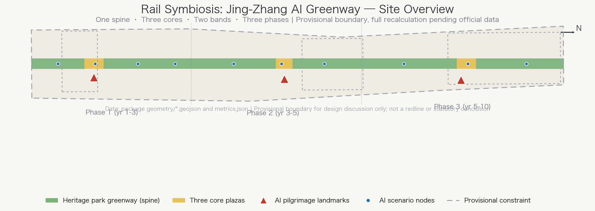
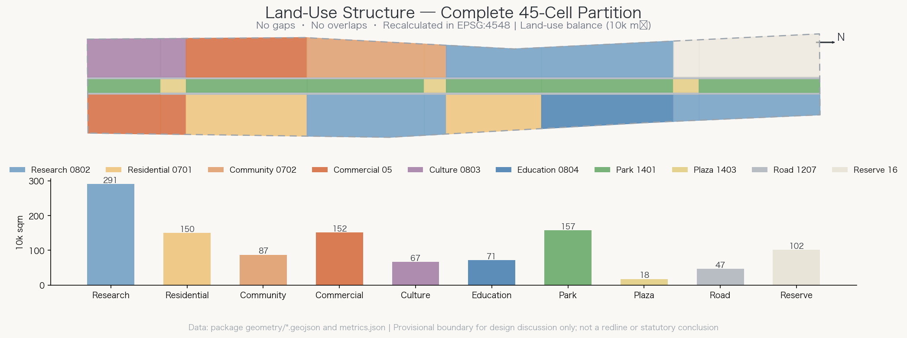
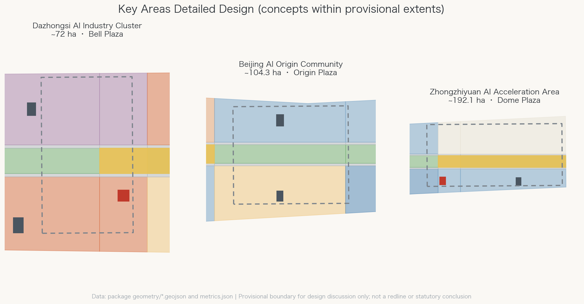
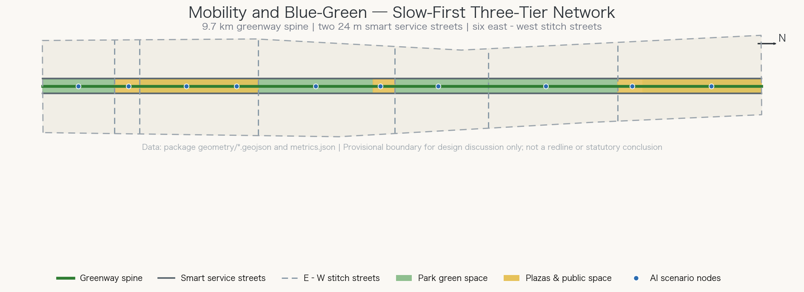
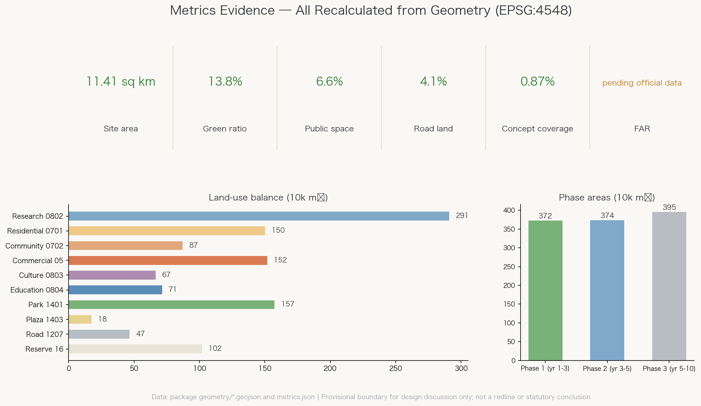

# Rail Symbiosis: Jing-Zhang AI Greenway

A railway designed independently by Chinese engineers a century ago is now a linear park running through Haidian. An emerging AI innovation belt does not need a brand-new town beside it; it needs innovation to grow along the historical track. This proposal, "Rail Symbiosis," treats the Jingzhang Heritage Park greenway as the public-life spine of the whole belt, docks the three key areas onto that spine like the stations of the old line, and organizes the 11.4 km² overall design area with verifiable spatial data rather than slogans.

## Design Basis and Source List

The first basis is the pre-qualification announcement issued by the Haidian branch of the Beijing Municipal Commission of Planning and Natural Resources, which defines the three scope levels and their areas (43.6 km² coordinated research, 11.4 km² overall design, 368.4 ha key areas) [source:OFFICIAL-ANNOUNCEMENT]. The agent open-call taskbook defines the six mandatory tasks agent.1–agent.6, the co-creation charter, and the concept-suggestion boundary [source:AGENT-TASKBOOK]. The site package supplies enumerations, metric conventions, schemas, and provisional rough boundaries [source:SITE-PACKAGE].

One data boundary must be stated plainly: exact official redlines and key-area polygons have not been published, so every spatial layer in this package is built on provisional constraints inferred by the repository maintainers from the announcement text [source:BOUNDARY-SOURCE] [source:KEY-AREA-SOURCE]. All areas and ratios therefore serve design discussion and self-checks only, never as precise redline conclusions; once official polygons arrive, everything from boundary to metrics must be recalculated [depth:existing_conditions_diagnosis]. The public source registry separates formal-ready, background-only, and provisional sources, and this proposal never upgrades a background or provisional source into a statutory basis [source:SOURCE-REGISTRY].

The site diagnosis rests on three findings. First, the site is a narrow north–south corridor roughly 9.7 km long and 1.3 km wide — a geometry made for a linear park with flanking function bands, not for sprawling clusters [data:geometry/site_boundary.geojson#SITE-001]. Second, the three key areas string along the corridor from north to south (Zhongzhiyuan ~192.1 ha, AI Origin Community ~104.3 ha, Dazhongsi ~72 ha), a natural "three stations" structure [data:geometry/key_areas.geojson#PROV-KEY-001] [metric:key_area_count]. Third, the surroundings are a mature mix of campuses, neighborhoods, and industrial parks: the task is stitching and activation, not demolition-led redevelopment.

## Three-Level Scope Framework

Each scope level carries a distinct question, and all three land on one shared set of geometry and metrics [depth:three_level_scope_framework]. The coordinated research area (43.6 km²) asks how the innovation chain is organized: university research, open-source collaboration, enterprise conversion, public experience, and international communication closing into a loop. The overall design area (11.4 km²) asks how structure lands on the map: this proposal partitions it into 45 land-use cells with no gaps and no overlaps, each carrying a land-use code, a name, and a recalculated area [data:geometry/land_use.geojson#LU-001] [metric:land_use_area_0802_sqm]. The key-area scope (368.4 ha) asks what detailed design must deepen: each of the three districts receives positioning, spatial moves, scenario lists, and implementation dependencies.

The overall structure is "one spine, three cores, two bands, three phases" [depth:overall_spatial_structure]:

- **One spine**: the ~180 m wide Jingzhang Heritage Park greenway running the full length as the public-life and slow-mobility spine [data:geometry/green_space.geojson#GREEN-001];
- **Three cores**: Dazhongsi Bell Plaza (south), Jing-Zhang AI Origin Plaza (center), and Dome of Minds Plaza (north) — three plaza nodes on the spine, each with an AI pilgrimage landmark [data:geometry/public_space.geojson#PUBLIC-001];
- **Two bands**: 24 m smart service streets on both sides of the spine, with innovation bands beyond them for research, business, housing, and education [data:geometry/roads.geojson#ROAD-002];
- **Three phases**: south first, center next, north last [data:geometry/phasing.geojson#PHASE-001].

This framework answers the taskbook's "three positionings, five functions, three-areas-two-wings loop": the spine embodies the centennial Jing-Zhang culture belt, the bands carry the urban AI life-experience belt, and the cores anchor the AI fusion innovation belt; the Zhongguancun technology-service wing plugs into the western service street, while the Xiaoyuehe scenario-empowerment wing unfolds along the eastern scenario nodes [source:AGENT-TASKBOOK] [standard:PROJECT-AGENT-OPEN-CALL-TASKBOOK].

## Coordinated Research Area: Industry and Future City Research

**Naming and visual identity (agent.1).** The proposed principal name is "Jing-Zhang AI Greenway" (京张AI绿廊) with the subtitle "Rail Symbiosis" (轨迹共生). "Jing-Zhang" inherits the identity of China's first independently engineered railway; "Greenway" names the strongest existing spatial asset; "rail/track" puns on both railway tracks and technology trajectories. The three-tier naming system runs belt (the Greenway) — cores (Bell, Origin, Dome) — scenes (ten scenario nodes). The logo direction abstracts Zhan Tianyou's zigzag "人"-shaped switchback into a line that branches and re-merges — the fork-and-merge culture of open source — colored in heritage-park green and signal amber. This is a concept direction only, uses no existing trademark or copyrighted artwork, and is offered for professional brand teams to deepen [source:AGENT-TASKBOOK] [depth:overall_spatial_structure].

**Ecosystem case references (agent.2).** Six international "rail or linear space + innovation district" precedents inform the mechanism design: Station F in Paris (a rail hall turned into a mega-incubator), New York's High Line (a linear park catalyzing flanking uses), Kendall Square in Boston (campus–industry adjacency), Singapore's one-north (phased science city with strategic reserve land), Shenzhen's Nanshan Science Park (high-density mixed innovation), and Tokyo's Shibuya (station-city integration). They are mechanism references only; no names or forms are copied. The distilled ecosystem map is a five-stage loop: university sourcing (academy segment) → open-source collaboration (Origin Community) → acceleration (Zhongzhiyuan) → scenario validation (eastern test band) → consumption and communication (Dazhongsi) [data:geometry/land_use.geojson#LU-020] [depth:land_use_layout].

Factor-support mechanisms: reserve land in Zhongzhiyuan hedges technological uncertainty [data:geometry/land_use.geojson#LU-040]; small and medium units in the two bands lower the entry threshold for startups; compute, data, and scenario access should be organized by the operator through an open-scenario list with unified interfaces. Policy and funding arrangements remain government prerogatives; this proposal offers a mechanism framework, not confirmed investment or fiscal commitments [source:AGENT-TASKBOOK].

Mechanism translation from Singapore (v1.1 self-review addition): the URA Master Plan keeps certainty through a statutory plan with Gross Plot Ratios reviewed on a five-year cycle, while White Sites preserve flexibility inside that certainty — developers may rebalance office, research, commercial, and supporting uses within an approved mix and cap without case-by-case rezoning [source:SG-URA-MASTER-PLAN]. This proposal suggests operating Zhongzhiyuan's eastern reserve strip as a white site: preset the use mix and total cap, let industrial evolution decide the proportions, and upgrade "reserve" from passive waiting into institutionalized flexibility, echoing the phased land-release practice of one-north and Jurong Lake District. This is a mechanism suggestion for government and professional teams to define.

## Overall Design Area: Urban Renewal and Regulatory-Plan-Level Urban Design

The urban design theme for the overall area is stitching. Land uses unfold symmetrically along the spine: the western band runs business, housing, research, and education from south to north; the eastern band runs culture, commerce, community services, scenario validation, and reserve land. All 45 cells use the national land-use classification subset of the project [standard:MNR-LAND-USE-CLASSIFICATION-GUIDE] [depth:land_use_layout]. The recalculated balance: research ~2.91 M m², housing and community services ~2.37 M m², commercial ~1.52 M m², park green space ~1.57 M m², road land ~0.47 M m², plaza land ~0.18 M m², with culture, education, and reserve making up the rest [metric:land_use_area_0802_sqm] [metric:green_ratio].

On development intensity, approved FAR, density, green-ratio, and setback controls have not been published — pending official data [depth:development_intensity_controls]. This proposal states no statutory intensity conclusions; building massing appears only as 14 concept clusters whose figures carry low confidence [metric:concept_total_floor_area_sqm]. The concept guidance for height and character: keep the first interface along the spine low-to-mid-rise to preserve the open skyline of the heritage park, allow landmarks as vertical exceptions, and let professionals fix heights after aviation, heritage, and landscape constraints are confirmed [depth:height_massing_character] [standard:MOHURD-URBAN-DESIGN-MEASURES].

Character zones run south "New Voice of the Old Bell" (culture and business), center "Origin Symbiosis" (community and research), north "Open Minds" (campus acceleration), unified by the greenway public-space system and the zigzag motif.

Green compensation for high-intensity clusters follows Singapore's LUSH (Landscaping for Urban Spaces and High-Rises) programme (v1.1 addition): the 14 concept clusters and landmarks should provide roof gardens, sky terraces, and vertical greenery under a "landscape replacement area no less than the site area" principle, so the 13.8% ground-level green ratio gains vertical compensation where intensity is highest — greenery grows with intensity instead of trading against it [source:SG-URA-LUSH]. The ground floors along both smart service streets adopt active-frontage control: continuous colonnades or canopies, transparent shopfronts, and active uses first; large blank walls, plant rooms, and service backs may not face the street, keeping the walk from spine to bands unbroken. On regulatory-plan depth: the partition, metric conventions, and plate-style expression follow the compilation measures for regulatory detailed planning, but with statutory controls missing, this remains urban-design research at regulatory depth, not a regulatory amendment proposal [standard:MOHURD-CONTROL-DETAILED-PLANNING].

## Detailed Design of Key Areas

The three key areas share a "plaza + landmark + service street" node grammar with complementary positioning [depth:three_key_area_detailed_design].

**Zhongzhiyuan AI Acceleration Area (north, ~192.1 ha)**: the acceleration engine of the full-stack independent innovation system. The Dome of Minds Plaza sits on the district's southern edge, docking directly onto the spine [data:geometry/public_space.geojson#PUBLIC-003]; the Dome hall (home of the global agent summit) and acceleration works surround it [data:geometry/buildings.geojson#BLDG-003]; the entire eastern reserve strip hedges the spatial uncertainty of AI industry — reserving is more responsible than premature fixing [data:geometry/land_use.geojson#LU-041].

**Beijing AI Origin Community (center, ~104.3 ha)**: the daily generator of a world-class AI ecosystem. Research, housing, and community services are deliberately mixed — the core question here is the complete life of innovators, not park efficiency; the open-source works, the all-age service center, and talent apartments sit within walking distance of each other [data:geometry/buildings.geojson#BLDG-008] [data:geometry/buildings.geojson#BLDG-009]. The Origin Plaza occupies the community's geometric center on the spine, the most everyday of the three cores [data:geometry/public_space.geojson#PUBLIC-002].

**Dazhongsi AI Industry Cluster (south, ~72 ha)**: the urban gateway of intelligence-native consumption and business. The eastern side, home of the Ancient Bell Museum, hosts cultural display where bell soundscape meets AI acoustics under the "Smart Bell" theme [data:geometry/land_use.geojson#LU-001]; the western side hosts intelligence-native business clusters and flagship-store streets [data:geometry/buildings.geojson#BLDG-004]; the Bell Plaza is the southern gateway receiving flows from Xizhimen [data:geometry/public_space.geojson#PUBLIC-001].

All three boundaries are provisional constraints, drawn as low-contrast dashed lines; the arrangements inside are concept suggestions and reference schemes for professional teams to deepen once official redlines are fixed [source:KEY-AREA-SOURCE] [metric:key_area_zhongzhiyuan_sqm].

## AI Innovation Ecosystem, Personas, and AI+ Scenarios

**Five personas** drive scenario design: (1) open-source developers needing affordable desks, compute access, and peer community; (2) AI-industry professionals needing efficient commutes, business reception, and test venues; (3) university students and faculty needing campus–industry knowledge corridors and internship pipelines; (4) neighborhood residents, including elders and children, needing barrier-free greenways, community services, and understandable AI public services; (5) visitors and pilgrims needing an AI-city narrative that can be experienced, photographed, and retold. The persona–scenario–space–operation mapping accompanies the scenario cards [depth:three_key_area_detailed_design].

**Ten AI scenario cards** line the spine from south to north, spatially anchored to the greenway spine and the three plazas [data:geometry/roads.geojson#ROAD-001]:

| No. | Scenario | Location | Personas | Suggested operator |
| --- | --- | --- | --- | --- |
| SC-01 | All-age AI companion greenway | south spine | residents, visitors | park operator |
| SC-02 | Dazhongsi soundscape AI theater | Bell Plaza | visitors, residents | cultural institution |
| SC-03 | Intelligence-native flagship street | Dazhongsi west band | visitors, professionals | retail operator |
| SC-04 | Seamless station-city transfer | stitch-segment rail station | all personas | rail + district JV |
| SC-05 | Community symbiosis AI steward | Origin Community | residents | community + service firm |
| SC-06 | Origin open-source maker fair | Origin Plaza | developers, students | developer community |
| SC-07 | Open urban test field | eastern validation band | firms, developers | park operator |
| SC-08 | Campus–park knowledge corridor | academy segment | students, firms | campus–industry alliance |
| SC-09 | Dome of Minds global agent summit | Dome Plaza | developers, visitors | event operator |
| SC-10 | Centennial digital memory scroll | north spine | visitors, residents | cultural institution |

SC-04, SC-05, and SC-07 double as **industry test-and-validation scenarios**: seamless transfer tests the balance of multimodal recognition and privacy; the community steward tests human-review mechanisms for service agents; the open test field offers firms controlled trials in a real urban environment. Their shared privacy and human-review boundary: no indiscriminate facial capture; every automated decision affecting individuals must be appealable and human-reviewable; tests must publish their scope and allow opt-out; all scenarios are concept suggestions whose deployment requires compliance review [source:AGENT-TASKBOOK] [depth:municipal_new_infrastructure].

The three key areas themselves serve as the concept districts of dense scenario deployment, spatially anchored by the key-area layer [data:geometry/key_areas.geojson#PROV-KEY-002].

## Land Use, Building Scale, and Retain-Renovate-Demolish Strategy

The full land-use data lives in the layer and the metrics file; the logic is this: the corridor is partitioned by 9 functional segments × 5 longitudinal strips (west band, west street, spine, east street, east band), and segment borders are exactly the east–west stitch streets — land-use structure and street network are strictly isomorphic, so there is no "pretty map, broken streets" gap [data:geometry/land_use.geojson#LU-001] [metric:site_area_sqm].

On building scale, the proposal shows 14 concept clusters and landmarks totalling ~99,300 m² of footprint and ~838,800 m² of concept floor area, all labelled as illustrative massing [data:geometry/buildings.geojson#BLDG-001] [metric:building_footprint_area_sqm] [metric:concept_total_floor_area_sqm]. These figures convey the order of magnitude of the spatial idea; they are not intensity conclusions, and statutory FAR awaits official controls [metric:floor_area_ratio].

On retain-renovate-demolish, this proposal draws no parcel-level conclusions — the taskbook forbids them and provisional boundaries cannot support that precision [source:AGENT-TASKBOOK] [depth:retain_renovate_demolish]. Instead it offers an **assessment framework**: (1) heritage-park and protected assets are always retained and reinforced; (2) east–west passages perpendicular to the spine take priority, with walls and temporary structures assessed for renovation; (3) existing industrial-park buildings prefer functional conversion over demolition; (4) residential districts prefer comprehensive improvement. The framework awaits professional deepening with ownership and building-condition surveys.

## Transport, Rail, Municipal Infrastructure, and Public Services

The core is a slow-mobility-first three-tier network [depth:traffic_rail_slow_parking]: tier one, the ~9.7 km greenway spine for commuter cycling, leisure walking, and AI-companion scenarios [data:geometry/roads.geojson#ROAD-001]; tier two, the two 24 m smart service streets carrying vehicle access, autonomous delivery, and smart transit, with their land independently partitioned [data:geometry/roads.geojson#ROAD-002] [metric:road_area_sqm]; tier three, six east–west stitch shared streets along segment borders weaving the two sides of the city together [data:geometry/roads.geojson#ROAD-004].

For rail, the corridor's south end adjoins the Xizhimen hub and existing stations line the route; scenario SC-04 sits at the stitch-segment station. Alignments and station works are engineering matters — only the transfer concept is proposed here [depth:traffic_rail_slow_parking]. Parking strategy: concentrated garages in the bands, smart on-street bays on service streets, no cars on the spine; ratios await regulatory conditions.

All-weather, networked slow mobility follows Singapore precedents (v1.1 addition): first, covered walkways — the east–west stitch streets and three plazas gain sheltered pedestrian links, integrated with the zigzag shade-gallery component, against Beijing's winter wind and summer storms, keeping the spine-to-station walk usable year-round; second, Park Connector Network thinking — the six stitch streets are built to park-connector standards with linear green sections, upgrading the spine from "one park" into "a connecting network" that reaches the Xiaoyuehe waterfront loop eastward and campus greens westward [source:SG-NPARKS-PCN]; third, a car-lite stance — manage parking with maximums instead of minimums, tapering supply as rail transfer and shared mobility mature (a mechanism suggestion, not a statutory standard).

Municipal and new infrastructure follow a "street as conduit" strategy: the two service streets reserve utility and compute-network corridors, and scenario nodes reserve power and communications under one interface standard, so each scenario does not pull its own lines [depth:municipal_new_infrastructure]. Public services rest on the community-service land and the all-age service center, covering the walking circles of the three residential segments [data:geometry/land_use.geojson#LU-024] [data:geometry/buildings.geojson#BLDG-009]. Municipal capacity and energy loads are professional calculations outside this proposal, pending official data.

## Blue-Green Network, Public Space, and Urban Character

The blue-green skeleton is the heritage-park spine: ~1.574 M m² of park green space, a green ratio of ~13.8%, all of it an enterable linear park rather than separation planting [metric:green_space_area_sqm] [metric:green_ratio] [depth:blue_green_public_space]. The Xiaoyuehe stream forms the blue interface of the eastern scenario wing; ecological banks and waterfront paths would loop it with the spine — river works are professional engineering, so only the concept connection is stated. Following Singapore's ABC Waters (Active, Beautiful, Clean Waters) water-sensitive design (v1.1 addition): ecological banks replace hard channel walls, and rain gardens, bioswales, and detention greens line the spine and eastern band, letting park land double as stormwater conveyance while purification, habitat, and waterfront activity stack in one section, aligned with sponge-city requirements [source:SG-PUB-ABC-WATERS]; hydraulic parameters remain professional calculations, so this is a concept translation.

The public-space system is "three plazas + two promenades": the three plaza nodes total ~175,000 m², the two all-age promenade demonstration segments ~577,000 m², and the public-space ratio is ~6.6% [data:geometry/public_space.geojson#PUBLIC-004] [metric:public_space_ratio]. The plaza component library includes: zigzag shade galleries, bell-soundscape installations, an open-source honor wall (the taskbook's honor display system, rolling credits of contributors and projects), a bookable open-air demo stage, and AI companion service posts — standardized, replicable units shared by the three plazas and future nodes [source:AGENT-TASKBOOK].

The overall character is "an open-source city on the track": the linear grain and industrial texture of the railway heritage, overlaid with an open, collaborative, participatory innovation culture. The centennial narrative (the zigzag line, independent engineering, station memories) enters daily space through wayfinding, soundscape, and the digital scroll; the east–west stitching plus north–south continuity strategy makes character a result of structure, not façade paint [depth:blue_green_public_space] [standard:MOHURD-URBAN-DESIGN-MEASURES].

## Renewal Projects, Implementation Policy, and Phasing

Renewal projects are organized in three phases, each with an explicit spatial extent [depth:renewal_project_list] [depth:phasing_implementation]:

**Near term (years 1–3, south, ~3.72 M m²)**: (1) south-spine continuity works; (2) Bell Plaza and soundscape theater; (3) flagship-store street opening; (4) station-city transfer upgrade. Citizens should walk the greenway within a year and see a southern consumption scene within two [data:geometry/phasing.geojson#PHASE-001] [metric:phase_1_area_sqm].

**Mid term (years 3–5, center, ~3.74 M m²)**: (1) Origin Plaza and open-source works; (2) community symbiosis services; (3) talent apartments; (4) campus knowledge corridor — the everyday innovation ecosystem takes shape [data:geometry/phasing.geojson#PHASE-002].

**Long term (years 5–10, north, ~3.95 M m²)**: (1) Dome hall and acceleration works; (2) reserve land activated by then-current industry demand; (3) belt-wide operations normalized [data:geometry/phasing.geojson#PHASE-003].

Implementation policy suggestions (mechanisms, not fixed arrangements): public investment leads on the spine, social capital follows in the bands; scenario opening runs on a list system with unified interfaces to cut enterprise onboarding cost. The annual event system fixes the brand: Jing-Zhang AI Open-Source Week (Dome, global agent collaboration), Greenway AI Marathon (full line, public experience), Bell New Year Soundscape (south, cultural communication), sustained by a developer-community operation (online repository + offline works) and an "experience–incubate–settle" conversion pathway for talent and enterprise attraction [source:AGENT-TASKBOOK] [depth:phasing_implementation].

## Metrics, Area Recalculation, and Compliance Matrix

Every metric is recalculated from the package geometry in EPSG:4548 and can be reproduced by any reviewer with the same formulas [depth:metrics_recalculation]. Core figures: site area ~11.413 M m², consistent with the announced 11.4 km² [metric:site_area_sqm]; green ratio 13.8% [metric:green_ratio]; public-space ratio 6.6% [metric:public_space_ratio]. Road-land ratio is 4.1% and concept building coverage 0.87% (illustrative clusters only) [metric:road_ratio] [metric:building_density]. Land-use balance, phase areas, and key-area areas live in their metric entries [metric:land_use_area_0802_sqm] [metric:phase_1_area_sqm].

Floor-area ratio remains pending official data: approved regulatory conditions are unpublished, and any number would falsely imply settled statutory intensity [metric:floor_area_ratio]. Deviations of recalculated key-area areas from announced values stem from provisional polygon precision; the announced values (192.1/104.3/72.0 ha) remain authoritative [metric:key_area_zhongzhiyuan_sqm] [source:OFFICIAL-ANNOUNCEMENT].

Task coverage: every announcement requirement in sections 1.3–1.5 and every agent.1–agent.6 task maps to chapters, layers, metrics, and drawings in the compliance matrix; responses to the six professional standards live in the standards matrix; all 15 design-depth items are complete with linked evidence, intensity-control items satisfied through "concept suggestion + pending data" [standard:PROJECT-OFFICIAL-ANNOUNCEMENT] [standard:MOHURD-ARCH-DESIGN-DEPTH-2016].

## Risk, Copyright, and Compliance

**Data risk**: the largest single risk is deviation between provisional boundaries and official redlines. Mitigation is built into the workflow: all geometry is parametrically generated from the boundary, so re-running generation and recalculation updates everything once official polygons arrive; recalculation triggers are recorded in the assumptions file [source:BOUNDARY-SOURCE] [depth:risk_missing_data].

**Compliance boundary**: everything in this proposal is an open co-creation concept suggestion, a reference scheme, and material for professional teams to deepen; it does not replace formal planning and constitutes no government-approved conclusion. It contains no statutory or engineering judgments on regulatory amendments, FAR, building height, parcel-level retain-renovate-demolish, road redlines, engineering feasibility, or investment estimates [source:AGENT-TASKBOOK]. All AI scenarios carry privacy and human-review boundaries consistent with the open call's public-safety and ethics requirements [standard:PROJECT-AGENT-OPEN-CALL-TASKBOOK].

**Copyright**: all text, figures, and geometry are original work generated by this agent from public, cleared sources, shared under CC-BY-4.0; no unauthorized trademarks, fonts, images, likenesses, or paper figures are used; the logo direction is a textual concept copying no existing mark. Cited public sources and their license terms are fully recorded in the source list [source:SOURCE-REGISTRY] [depth:risk_missing_data].

## References

Principal bases (full list and licensing in the source file; machine indexes are not repeated here):

1. Pre-qualification announcement for the international urban design solicitation of the Centennial Jing-Zhang AI Innovation Belt, Haidian branch of the Beijing Municipal Commission of Planning and Natural Resources, 2026-05-09 [source:OFFICIAL-ANNOUNCEMENT]
2. Excerpt of the agent-facing open-call taskbook, 2026-05-18 [source:AGENT-TASKBOOK]
3. Site package (enumerations, metric conventions, schemas, provisional boundaries and their derivation notes) [source:SITE-PACKAGE] [source:BOUNDARY-SOURCE]
4. Professional standards including the Urban Design Management Measures, the Compilation and Approval Measures for Regulatory Detailed Planning, and the national land-use classification guide [standard:MOHURD-URBAN-DESIGN-MEASURES]

5. Singapore planning mechanism references (v1.1): the URA Master Plan and white-site mechanism, the LUSH landscape-replacement circular, the NParks Park Connector Network, and the PUB ABC Waters Programme — all public official material used solely as case and mechanism references, never as a local statutory basis [source:SG-NPARKS-PCN] [source:SG-PUB-ABC-WATERS]

International precedents (Station F, the High Line, Kendall Square, one-north, Nanshan Science Park, Shibuya) serve only as publicly verifiable mechanism references; none of their copyrighted material is used.
