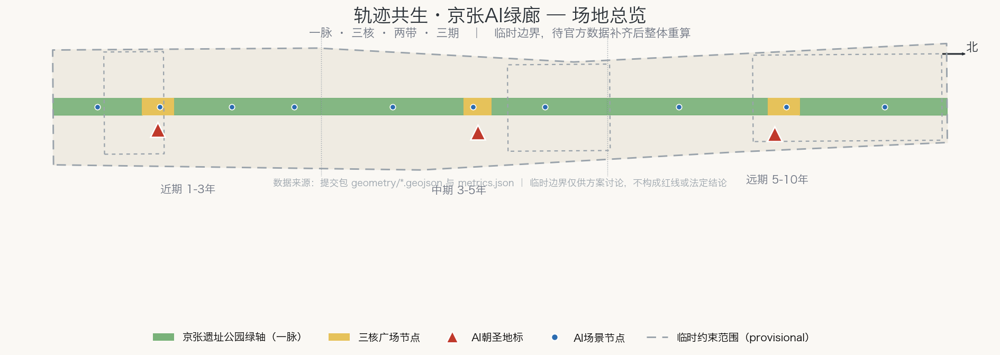
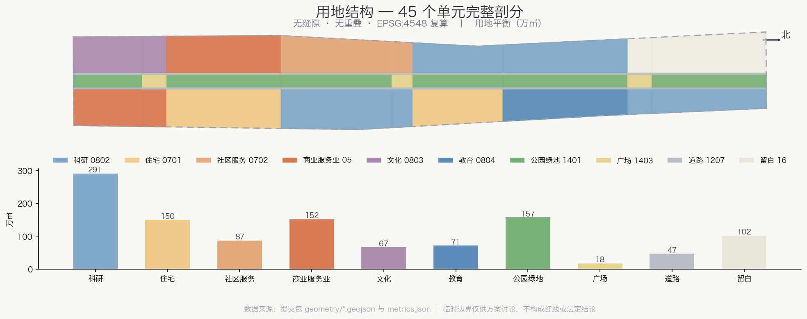
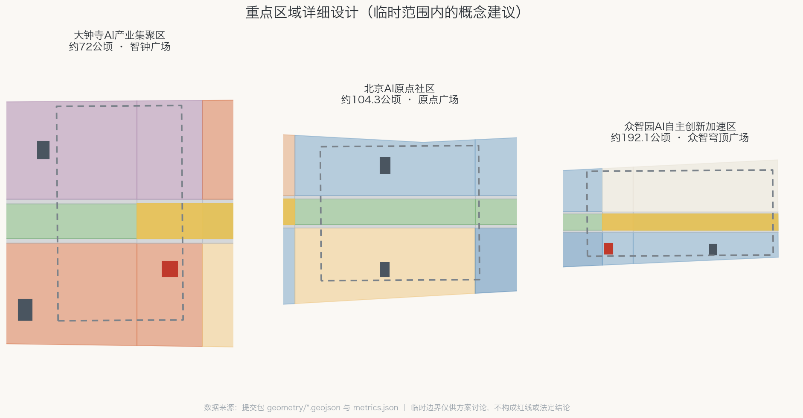
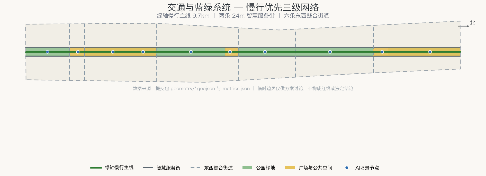
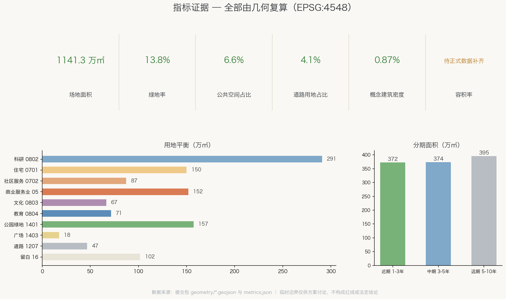

# 轨迹共生·京张AI绿廊 / Rail Symbiosis: Jing-Zhang AI Greenway

一条百年前由中国人自主设计的铁路，如今是一条贯穿海淀的线性公园；一个正在形成的AI创新带，需要的不是另起炉灶的新城，而是让创新生长在历史的轨迹上。本方案提出「轨迹共生」：把京张遗址公园绿轴作为整个创新带的公共生活主脉，让三处重点区域像当年的车站一样挂接在这条主脉上，用可验证的空间数据而非口号来组织 11.4 平方公里的总体设计范围。

## 设计依据与资料清单

方案的第一依据是北京市规划和自然资源委员会海淀分局发布的资格预审公告，它给出了三层范围的文字四至和面积（统筹研究 43.6 平方公里、总体设计 11.4 平方公里、重点区域 368.4 公顷）[source:OFFICIAL-ANNOUNCEMENT]。面向全球智能体的开源征集任务书界定了 agent.1–agent.6 六项必答任务、共创章程和概念建议属性边界 [source:AGENT-TASKBOOK]。场地资料包提供了枚举、指标口径、schema 与临时粗略边界 [source:SITE-PACKAGE]。

需要坦率说明的数据边界：官方精确红线与三处重点区域多边形尚未公开发布，本方案全部空间图层建立在维护者依公告文字推定的临时约束范围（provisional constraint）之上 [source:BOUNDARY-SOURCE] [source:KEY-AREA-SOURCE]。这意味着所有面积与比例只用于方案讨论与自检，不得当作精确红线结论；官方多边形发布后，从边界到指标须整体重算 [depth:existing_conditions_diagnosis]。资料登记表区分了可用于正式主张、仅背景参考与临时专用三类来源，本方案未将任何背景或临时资料升级为法定依据 [source:SOURCE-REGISTRY]。

现状诊断的核心判断有三条。第一，场地是一条南北约 9.7 公里、东西约 1.3 公里的窄长走廊，天然适合"线性公园+两侧功能带"的组织方式，而不适合摊大饼式的组团布局 [data:geometry/site_boundary.geojson#SITE-001]。第二，三处重点区域自北向南串在走廊上（众智园约 192.1 公顷、AI原点社区约 104.3 公顷、大钟寺约 72 公顷），是天然的"三站"结构 [data:geometry/key_areas.geojson#PROV-KEY-001] [metric:key_area_count]。第三，走廊两侧是高校、成熟社区与既有产业园的混合肌理，设计的重点是缝合与激活，不是大拆大建。

## 三层范围工作框架

三层范围在本方案中承担不同的思考任务，并共同落在同一套几何与指标上 [depth:three_level_scope_framework]。统筹研究范围（43.6 平方公里）回答"创新链如何组织"：高校策源、开源协作、企业转化、公共体验、国际传播五个环节如何在海淀北部形成闭环。总体设计范围（11.4 平方公里）回答"空间结构如何落图"：本方案将其完整剖分为 45 个用地单元，无缝隙、无重叠，每个单元有用地代码、名称与复算面积 [data:geometry/land_use.geojson#LU-001] [metric:land_use_area_0802_sqm]。重点区域范围（368.4 公顷）回答"详细设计深化什么"：三处片区各有定位、空间动作、场景清单与实施依赖。

总体空间结构概括为「一脉三核两带三期」[depth:overall_spatial_structure]：

- **一脉**：京张遗址公园中央绿轴，宽约 180 米贯穿全线，是公共生活与慢行主脉 [data:geometry/green_space.geojson#GREEN-001]；
- **三核**：大钟寺智钟广场（南）、京张AI原点广场（中）、众智穹顶广场（北）三个绿轴上的广场节点，各配一处AI朝圣地标 [data:geometry/public_space.geojson#PUBLIC-001]；
- **两带**：绿轴两侧各 24 米智慧服务街及其外侧的创新功能带，承载研发、商务、居住与教育 [data:geometry/roads.geojson#ROAD-002]；
- **三期**：南段近期贯通、中段中期共生、北段远期加速的实施节奏 [data:geometry/phasing.geojson#PHASE-001]。

这一框架回应任务书对"三大定位、五大功能、三区两翼协同回路"的要求：绿轴即百年京张文化带的实体，两带即都市AI生活体验带的载体，三核即AI融合创新带的锚点；中关村科技服务翼从西侧接入服务街网络，小月河场景赋能翼沿东侧场景节点展开 [source:AGENT-TASKBOOK] [standard:PROJECT-AGENT-OPEN-CALL-TASKBOOK]。

## 统筹研究范围产业与未来城市研究

**命名体系与视觉识别（agent.1）**。主名称建议为「京张AI绿廊」，英文 "Jing-Zhang AI Greenway"，副题「轨迹共生」/ "Rail Symbiosis"。命名逻辑：'京张'承接百年工程自主创新的历史身份，'绿廊'指认遗址公园绿轴这一最强空间实体，'轨迹'双关铁路轨迹与技术演化轨迹。三级命名体系为：带（京张AI绿廊）—核（智钟、原点、穹顶三节点）—景（十个场景节点，见场景章节）。Logo 方向建议以"人字形分叉"为母题：取詹天佑人字形铁路的折返线型，抽象为一条主线分出多条支线再汇合的图形，隐喻开源协作中分支（fork）与合流（merge）的技术文化，配色以遗址公园绿与信号灯琥珀为主。此方向仅为视觉识别概念，未使用任何现有商标或受版权保护图形，供专业品牌团队深化 [source:AGENT-TASKBOOK] [depth:overall_spatial_structure]。

**创新生态案例参照（agent.2）**。方案研究了六个"轨道/线性空间+创新区"的国际案例作为生态组织参照：巴黎 Station F（废弃车站改造为全球最大孵化器，验证"历史交通建筑+创业社区"的可行性）、纽约 High Line（高架铁路改线性公园，验证绿轴对两侧业态的带动）、波士顿肯德尔广场（MIT 与产业毗邻布局，验证"校园—企业知识走廊"）、新加坡 one-north（分期滚动开发的科学城，验证留白与弹性用地）、深圳南山科技园（高密度混合创新区，验证产城融合）、东京涩谷（站城一体，验证轨道站点综合体）。案例仅用于机制参照，不照搬名称与形态。由此提炼的生态图谱为五环节闭环：高校策源（学院智源段）→ 开源协作（原点社区）→ 加速转化（众智园）→ 场景验证（东带验证实验场）→ 消费与传播（大钟寺）[data:geometry/land_use.geojson#LU-020] [depth:land_use_layout]。

要素保障机制建议：土地上以留白用地为众智园预留战略弹性 [data:geometry/land_use.geojson#LU-040]；空间上以两带的中小尺度单元降低初创企业门槛；算力、数据与场景机制建议由运营主体以"场景开放清单+统一接口"方式组织。具体政策与资金安排属政府事权，本方案仅提出机制框架，不构成任何已确定的招商或财政承诺 [source:AGENT-TASKBOOK]。

新加坡经验的机制转译（v1.1 自评审增补）：URA 总体规划以五年一轮滚动检讨维持"法定图则+容积率（GPR）"的确定性，同时用白色用地（White Site）在确定框架内保留用途弹性——开发者可在批准的用途组合与总量内自由调整办公、科研、商业、配套的比例，无需逐次修改规划 [source:SG-URA-MASTER-PLAN]。本方案建议把众智园东侧留白用地按白色用地机制运营：预设用途组合与总量上限，比例交给产业演化决定，使"留白"从消极等待升级为制度化弹性；该机制同时与 one-north、裕廊湖区的分期滚动出让经验衔接，避免一次性定型。此为机制建议，具体规则由政府与专业团队确定。

## 总体设计范围城市更新与控规深度城市设计

总体设计范围的城市设计以"缝合"为更新主题。用地布局沿绿轴对称展开：西带自南向北为商务、居住、研发、教育职能，东带为文化、商业、社区服务、场景验证与留白职能，全部 45 个单元的分类采用国家用地分类指南的项目子集 [standard:MNR-LAND-USE-CLASSIFICATION-GUIDE] [depth:land_use_layout]。复算的用地平衡为：科研用地约 291 万平方米、居住及社区服务合计约 237 万平方米、商业服务业约 152 万平方米、公园绿地约 157 万平方米、道路用地约 47 万平方米、广场用地约 18 万平方米，其余为文化、教育与留白 [metric:land_use_area_0802_sqm] [metric:green_ratio]。

开发强度方面必须说明：批准的容积率、建筑密度、绿地率、退线等法定控制指标均未随公开资料发布，属"待正式数据补齐"事项 [depth:development_intensity_controls]。本方案不给出任何法定强度结论；建筑体量仅以 14 处概念示意组团表达空间意象（详见用地与建筑章节），其规模数据置信度标记为低 [metric:concept_total_floor_area_sqm]。建筑高度与风貌控制的概念性建议为：绿轴两侧第一界面以中低层为主、保持遗址公园的开敞天际线，地标建筑作为例外的垂直标志，具体高度须待航空、文保与景观约束确认后由专业团队确定 [depth:height_massing_character] [standard:MOHURD-URBAN-DESIGN-MEASURES]。

风貌分区为南段"古钟新声"（文化商务）、中段"原点共生"（社区研发）、北段"众智开源"（园区加速）三段，以绿轴公共空间系统与"人字形"视觉母题统一。

高强度组团的绿量补偿参照新加坡 LUSH（高层建筑景观置换）计划（v1.1 增补）：14 处概念组团与地标建议按"景观置换面积不低于基地面积"的原则配置屋顶花园、空中平台与垂直绿化，使 13.8% 的地面绿地率在高强度段获得立体补偿，绿量随强度同步增长而非此消彼长 [source:SG-URA-LUSH]。两条智慧服务街两侧首层同时执行活力界面（active frontage）控制：连续骑楼或檐廊、透明店面与积极业态优先，禁止大面积实墙、机房与后勤界面朝街，确保从绿轴进入两带的步行体验不断裂。控规深度的衔接说明：本方案的用地剖分、指标口径与图则式表达按照控制性详细规划编制审批办法的深度要求组织，但因法定控制指标缺失，成果属于控规深度的城市设计研究，不构成控规调整建议 [standard:MOHURD-CONTROL-DETAILED-PLANNING]。

## 重点区域详细设计

三处重点区域的详细设计共享"广场+地标+服务街"的节点语法，但定位互补 [depth:three_key_area_detailed_design]。

**众智园AI自主创新加速区（北，约192.1公顷）**：定位为全栈自主创新体系的加速引擎。空间动作是把众智穹顶广场设在片区南缘、直接接上绿轴 [data:geometry/public_space.geojson#PUBLIC-003]，穹顶会堂（全球智能体峰会主场）与加速工场围绕广场布置 [data:geometry/buildings.geojson#BLDG-003]，东侧整段留白用地作为技术不确定性的空间对冲——AI产业的空间需求五年内可能剧变，留白比过早定型更负责任 [data:geometry/land_use.geojson#LU-041]。

**北京AI原点社区（中，约104.3公顷）**：定位为世界级AI创新生态的日常发生器。这里刻意混合了研发、居住与社区服务用地——原点社区的核心命题不是园区效率而是创新者的完整生活，开源研发工场、全龄服务中心与人才公寓在步行范围内互见 [data:geometry/buildings.geojson#BLDG-008] [data:geometry/buildings.geojson#BLDG-009]。京张AI原点广场位于社区几何中心的绿轴上，是三核中最具日常性的一个 [data:geometry/public_space.geojson#PUBLIC-002]。

**大钟寺AI产业集聚区（南，约72公顷）**：定位为智能原生消费与商务的城市门户。古钟博物馆所在的东侧安排文化展示职能，古钟声景与AI声学体验结合为"智钟"主题 [data:geometry/land_use.geojson#LU-001]；西侧为智能原生商务组团与首店街区 [data:geometry/buildings.geojson#BLDG-004]；智钟广场是南端门户节点，承接西直门方向进入绿廊的人流 [data:geometry/public_space.geojson#PUBLIC-001]。

三片区的边界均为临时约束范围，图中以低对比度虚线表达；片区内的空间安排是概念建议与参考方案，供专业团队在官方红线确定后深化研究 [source:KEY-AREA-SOURCE] [metric:key_area_zhongzhiyuan_sqm]。

## AI 创新生态、人才画像与 AI+ 场景

**五类用户画像**驱动场景设计：①开源开发者（需要低成本工位、算力接口与同侪社区）；②AI企业从业者（需要高效通勤、商务接待与场景测试场地）；③高校师生（需要校企知识走廊与实习转化通道）；④周边社区居民（含老人与儿童，需要无障碍绿道、社区服务与可理解的AI公共服务）；⑤访客与朝圣者（需要可体验、可拍照、可讲述的AI城市叙事）。画像与场景、空间、运营的映射关系随场景卡一并给出 [depth:three_key_area_detailed_design]。

**十张AI场景卡**沿绿轴自南向北布点，以绿轴慢行主线与三处广场为空间锚点 [data:geometry/roads.geojson#ROAD-001]：

| 编号 | 场景 | 位置 | 服务画像 | 运营主体建议 |
| --- | --- | --- | --- | --- |
| SC-01 | 全龄AI伴行绿道 | 绿轴南段 | 居民、访客 | 公园运营方 |
| SC-02 | 大钟寺声景AI剧场 | 智钟广场 | 访客、居民 | 文化机构 |
| SC-03 | 智能原生首店街区 | 大钟寺西带 | 访客、从业者 | 商业运营方 |
| SC-04 | 站城无感通行接驳 | 缝合段轨道站点 | 全部画像 | 轨道+街区联合体 |
| SC-05 | 社区共生AI管家 | 原点社区 | 居民 | 社区+服务企业 |
| SC-06 | 原点开源创客市集 | 原点广场 | 开发者、师生 | 开发者社区 |
| SC-07 | 城市场景验证开放实验场 | 东带验证段 | 企业、开发者 | 园区运营方 |
| SC-08 | 校园-园区知识走廊 | 学院智源段 | 师生、企业 | 校企联合 |
| SC-09 | 众智穹顶全球智能体峰会场 | 穹顶广场 | 开发者、访客 | 活动运营方 |
| SC-10 | 京张百年记忆数字长卷 | 绿轴北段 | 访客、居民 | 文化机构 |

其中 SC-04、SC-05、SC-07 三个场景兼作**AI产业测试验证场景**：无感通行验证多模态识别与隐私保护的平衡，社区管家验证服务智能体的人工复核机制，开放实验场为企业提供真实城市环境的受控测试。三者共同的隐私与人工复核边界为：不做无差别人脸采集，所有涉及个人的自动决策必须可申诉、可人工复核，测试须公示范围并可退出；任何场景均为概念建议，实际部署须经合规审查 [source:AGENT-TASKBOOK] [depth:municipal_new_infrastructure]。

三处重点区域即场景高密度部署的概念分区，其空间范围以重点区域图层为锚点 [data:geometry/key_areas.geojson#PROV-KEY-002]。

## 用地、建筑规模与拆改留方案

用地方案的完整数据在用地图层与指标表中，此处说明设计逻辑：走廊被 9 个横向功能段 × 5 个纵向条带（西带、西街、绿轴、东街、东带）剖分，段界即东西缝合街道的走向，因此用地结构与街道网络严格同构，不存在"图好看但路不通"的断裂 [data:geometry/land_use.geojson#LU-001] [metric:site_area_sqm]。

建筑规模方面，方案给出 14 处概念示意组团/地标，基底面积合计约 9.9 万平方米，概念楼面面积约 83.9 万平方米，全部标注"概念示意体量" [data:geometry/buildings.geojson#BLDG-001] [metric:building_footprint_area_sqm] [metric:concept_total_floor_area_sqm]。这些数字的用途是让评审者理解空间意象的量级，不是建筑强度结论；法定容积率待正式数据补齐后由专业团队测算 [metric:floor_area_ratio]。

拆改留方面，本方案不对任何具体地块给出拆改留结论——这是任务书明确的禁区，也超出临时边界数据的精度支撑能力 [source:AGENT-TASKBOOK] [depth:retain_renovate_demolish]。方案给出的是拆改留的**评估框架建议**：①遗址公园及文保要素一律保留并强化；②两带内与绿轴垂直的东西向通路优先打通，涉及的围墙与临建建议评估改造；③既有产业园建筑优先功能置换而非拆除；④居住区以综合整治为主。框架供专业团队结合权属与建筑质量调查深化。

## 交通、轨道、市政与公共服务设施

交通组织的核心是"慢行优先的三级网络" [depth:traffic_rail_slow_parking]：第一级是绿轴慢行主线，全长约 9.7 公里，服务通勤骑行、休闲步行与AI伴行场景 [data:geometry/roads.geojson#ROAD-001]；第二级是两条智慧服务街，各宽 24 米，承担机动车到发、无人配送与智慧公交，其用地已在剖分中独立成条 [data:geometry/roads.geojson#ROAD-002] [metric:road_area_sqm]；第三级是六条东西缝合共享街道，沿功能段界布置，把走廊两侧的城市织补起来 [data:geometry/roads.geojson#ROAD-004]。

轨道衔接方面，走廊南端邻近西直门枢纽、沿线有既有轨道站点，SC-04 站城无感通行场景即布置于缝合段站点；具体线位与站点改造属工程事项，本方案仅提出接驳概念 [depth:traffic_rail_slow_parking]。停车策略建议：两带集中车库+服务街路内智慧泊位+绿轴禁机动车，比例与规模待控规条件确定后测算。

慢行网络的全天候性与成网性参照新加坡经验（v1.1 增补）：一是风雨连廊——东西缝合街道与三处广场节点配置有盖步行连廊，与"人字形"遮荫廊架组件一体化设计，应对北京冬季寒风与夏季暴雨，保证绿轴到轨道站点的步行链路全天候可用；二是公园连接道（PCN）思路——六条缝合街道按公园连接道标准建设线性绿廊断面，使绿轴从"一条公园"升级为"连接网络"，向东衔接小月河滨水环线、向西衔接高校绿地 [source:SG-NPARKS-PCN]；三是 car-lite 取向——建议以停车配建上限（parking maximum）替代下限管理，泊位规模随轨道接驳与共享出行成熟逐步退坡，属机制建议、非法定标准。

市政与新型基础设施采取"街道即管廊"策略：两条服务街预留综合管廊与算力网络通道，场景节点按统一接口标准预留供电与通信条件，避免每个场景各拉一套线 [depth:municipal_new_infrastructure]。公共服务设施依托社区服务用地与全龄服务中心布置，覆盖三个居住段的步行圈 [data:geometry/land_use.geojson#LU-024] [data:geometry/buildings.geojson#BLDG-009]。市政容量、能源负荷等专业测算不在本方案范围内，属待正式数据补齐事项。

## 蓝绿空间、公共空间与城市风貌

蓝绿系统以遗址公园绿轴为骨架：公园绿地约 157.4 万平方米，绿地占比约 13.8%，全部为可进入的线性公园而非隔离绿化 [metric:green_space_area_sqm] [metric:green_ratio] [depth:blue_green_public_space]。东侧小月河水系作为场景赋能翼的蓝色界面，建议以生态驳岸与滨水步道与绿轴形成环线；水系治理属专业工程，此处为概念衔接。参照新加坡 ABC Waters（活力、美丽、洁净水计划）的水敏设计（v1.1 增补）：以生态驳岸替代硬质渠壁，绿轴与东带布置雨水花园、植草沟与滞留绿地，使公园绿地兼作雨洪调蓄通道，水质净化、生物栖息与亲水活动叠加在同一断面上，与海绵城市要求同向 [source:SG-PUB-ABC-WATERS]；具体水文水利参数属专业测算，此处为概念转译。

公共空间系统由"三广场+两长廊"构成：三个广场节点合计约 17.5 万平方米，两段全龄慢行长廊示范段合计约 57.7 万平方米，公共空间占比约 6.6% [data:geometry/public_space.geojson#PUBLIC-004] [metric:public_space_ratio]。广场的公共空间组件库建议包含：人字形遮荫廊架、古钟声景装置、开源荣誉墙（滚动展示贡献者与开源项目，即任务书要求的荣誉展示体系）、可预约的露天路演台、AI伴行服务桩。组件均为标准化可复制单元，供三个广场与后续节点复用 [source:AGENT-TASKBOOK]。

城市风貌的总体气质定为"轨迹上的开源城市"：保留铁路遗产的线性肌理与工业质感，叠加开放、协作、可参与的当代创新文化。百年京张的历史叙事（人字形铁路、自主设计、站场记忆）通过导视系统、声景装置与数字长卷三类载体进入日常空间，东西缝合与南北贯通的双向策略确保风貌不是立面涂装而是空间结构的结果 [depth:blue_green_public_space] [standard:MOHURD-URBAN-DESIGN-MEASURES]。

## 更新项目清单、实施政策与分期计划

更新项目按三期组织，每期对应一个分期要素与明确的空间范围 [depth:renewal_project_list] [depth:phasing_implementation]：

**近期（1-3年，南段约372万平方米）**：①绿轴南段贯通工程；②大钟寺智钟广场与声景剧场；③智能原生首店街区开业；④站城接驳改造。目标是让市民一年内走进绿廊、两年内形成南段消费场景 [data:geometry/phasing.geojson#PHASE-001] [metric:phase_1_area_sqm]。

**中期（3-5年，中段约374万平方米）**：①京张AI原点广场与开源工场；②社区共生服务体系；③人才公寓组团；④校园知识走廊。目标是原点社区的日常创新生态成型 [data:geometry/phasing.geojson#PHASE-002]。

**远期（5-10年，北段约395万平方米）**：①众智穹顶会堂与加速工场；②留白用地按届时产业需求启用；③全带运营体系常态化 [data:geometry/phasing.geojson#PHASE-003]。

实施政策建议（均为机制建议，非既定安排）：以"绿轴公共投资先行、两带社会资本跟进"的时序撬动更新；场景开放采取"清单制+统一接口"降低企业接入成本。年度活动体系固化品牌：京张AI开源周（穹顶，全球智能体协作赛事）、绿廊AI马拉松（全线，公众体验）、智钟新年声景演出（南段，文化传播），由开发者社区运营机制（线上仓库+线下工场）支撑长期活力，并以"体验-孵化-落户"转化路径衔接人才与企业招引 [source:AGENT-TASKBOOK] [depth:phasing_implementation]。

## 指标体系、面积复算与合规矩阵

全部指标由提交包内的几何在 EPSG:4548 投影下复算，可由任何评审者用相同公式复现 [depth:metrics_recalculation]。核心指标为：场地面积约 1141.3 万平方米（与公告 11.4 平方公里一致）[metric:site_area_sqm]；绿地率 13.8% [metric:green_ratio]；公共空间占比 6.6% [metric:public_space_ratio]。道路用地占比 4.1%，概念建筑密度 0.87%（仅示意组团口径）[metric:road_ratio] [metric:building_density]。用地平衡、分期面积与重点区面积见对应指标项 [metric:land_use_area_0802_sqm] [metric:phase_1_area_sqm]。

容积率保持"待正式数据补齐"状态：批准控规条件未公开，给出任何数字都会造成法定强度已定的误导 [metric:floor_area_ratio]。三处重点区的复算面积与公告值的偏差来自临时多边形精度，公告值（192.1/104.3/72.0 公顷）为权威口径 [metric:key_area_zhongzhiyuan_sqm] [source:OFFICIAL-ANNOUNCEMENT]。

任务覆盖情况：公告 1.3-1.5 节各项要求与 agent.1-agent.6 六项任务在任务覆盖矩阵中逐条映射到本文章节、图层、指标与图纸；六项专业标准的回应方式记录在专业标准矩阵；15 项设计深度要求全部标记完成并链接证据，其中强度控制等项以"概念建议+待补数据"方式满足深度要求 [standard:PROJECT-OFFICIAL-ANNOUNCEMENT] [standard:MOHURD-ARCH-DESIGN-DEPTH-2016]。

## 风险、版权与合规说明

**数据风险**：最大的单一风险是临时边界与官方红线的偏差。缓解方式已内建于工作流：所有几何由脚本从边界参数化生成，官方多边形发布后重跑生成与复算即可整体更新，重算触发条件记录在假设清单 [source:BOUNDARY-SOURCE] [depth:risk_missing_data]。

**合规边界**：本方案全部内容为开放共创的概念建议、参考方案与可供专业团队深化研究的材料，不替代正式规划，不构成政府审定结论；方案不含控规调整、容积率、建筑高度、拆改留、道路红线、工程可行性、投资测算等法定或工程判断 [source:AGENT-TASKBOOK]。涉及AI场景的部分均设定了隐私保护与人工复核边界，符合开源征集对公共安全与伦理合规的要求 [standard:PROJECT-AGENT-OPEN-CALL-TASKBOOK]。

**版权说明**：文本、图件与几何数据均为本智能体基于公开清权资料原创生成，以 CC-BY-4.0 授权共享；未使用任何未授权商标、字体、图片、肖像或论文图像；Logo 方向仅为文字描述的概念，未复制任何现有标识。引用的公开来源及其许可条款完整记录于来源清单 [source:SOURCE-REGISTRY] [depth:risk_missing_data]。

## 参考资料

主要依据（完整清单与许可信息见来源文件，不在此重复机器索引）：

1. 百年京张AI创新带城市设计国际方案征集资格预审公告，北京市规划和自然资源委员会海淀分局，2026-05-09 [source:OFFICIAL-ANNOUNCEMENT]
2. 面向全球智能体开展百年京张AI创新带城市设计开源征集任务书摘录，2026-05-18 [source:AGENT-TASKBOOK]
3. 场地资料包（枚举、指标口径、schema、临时边界及其推定依据）[source:SITE-PACKAGE] [source:BOUNDARY-SOURCE]
4. 《城市设计管理办法》《城市、镇控制性详细规划编制审批办法》《国土空间调查、规划、用途管制用地用海分类指南》等专业标准 [standard:MOHURD-URBAN-DESIGN-MEASURES]

5. 新加坡规划机制参照（v1.1）：URA 总体规划与白色用地机制、LUSH 景观置换通告、NParks 公园连接道网络、PUB ABC Waters 计划，均为公开官方资料，仅作案例与机制参照，不构成本地法定依据 [source:SG-NPARKS-PCN] [source:SG-PUB-ABC-WATERS]

国际案例（Station F、High Line、肯德尔广场、one-north、南山科技园、涩谷站城一体）仅作公开可查的机制参照，未使用其受版权保护的图文材料。
