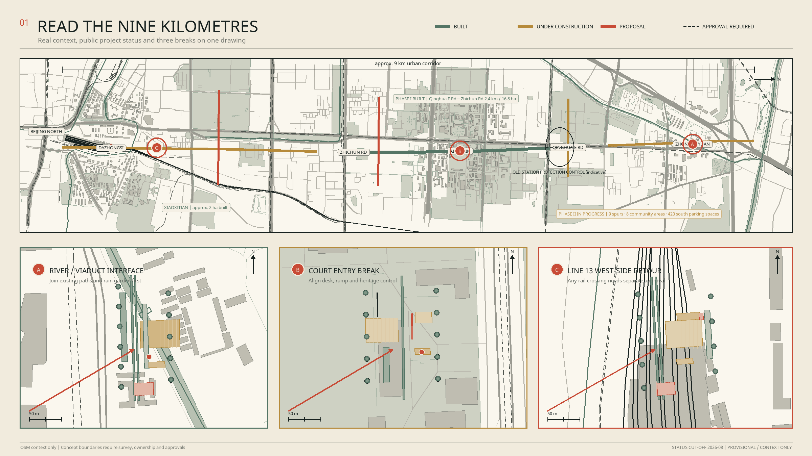
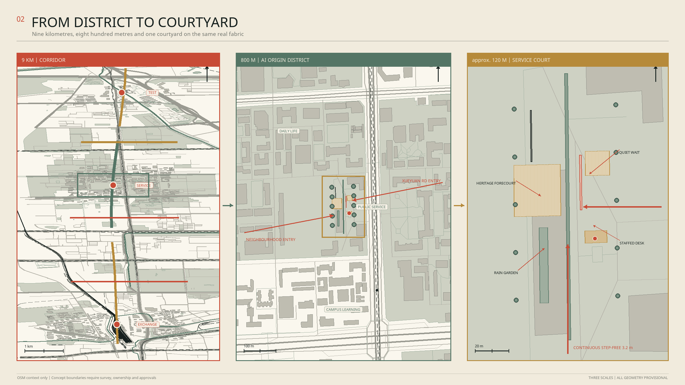
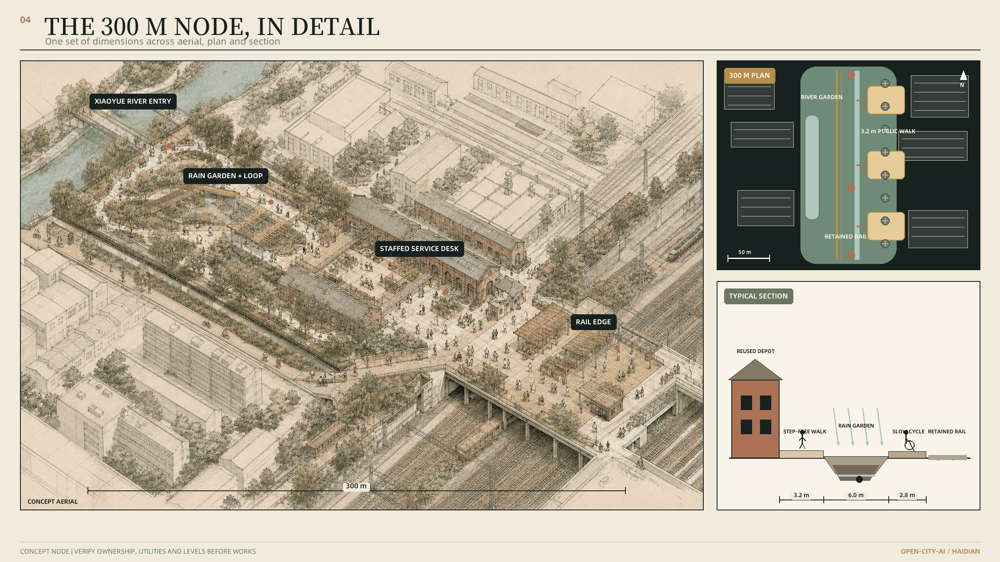
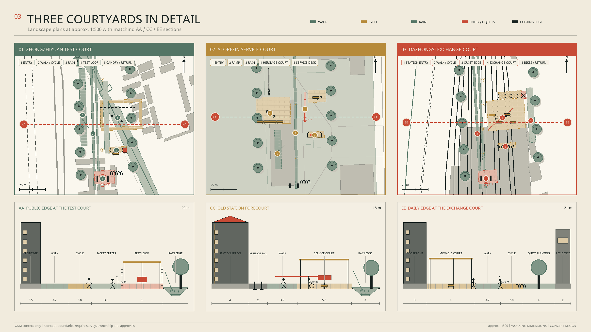
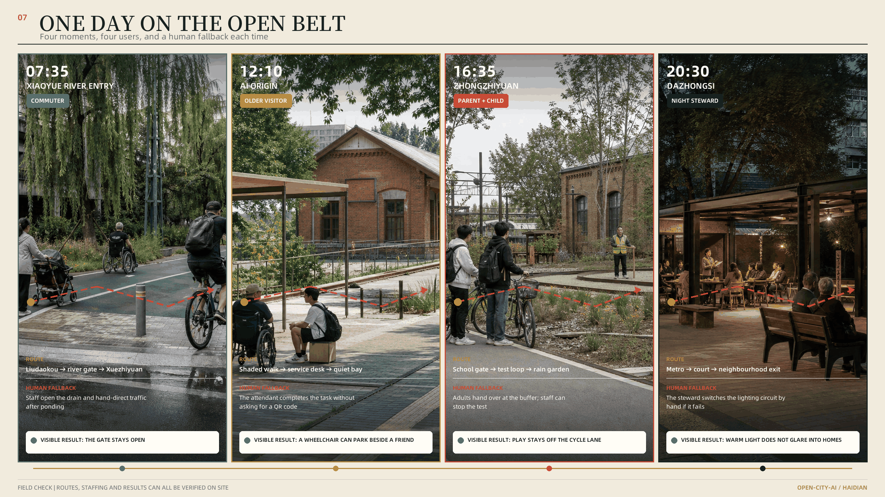
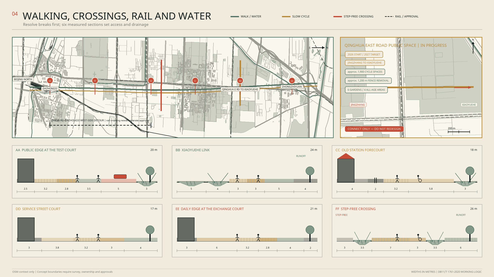
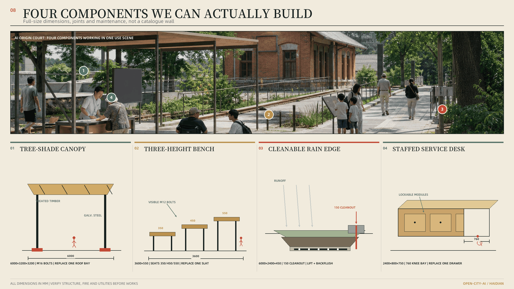
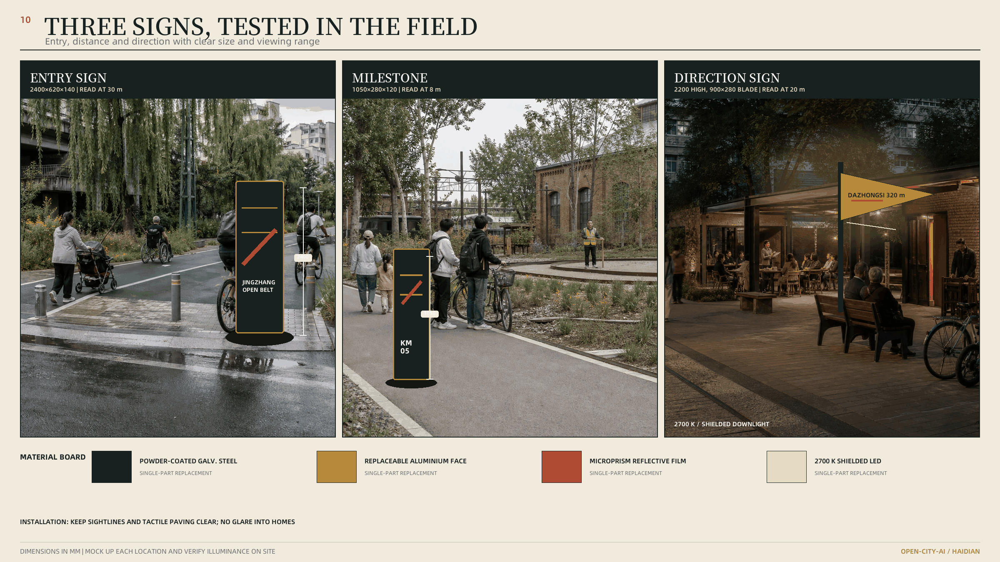
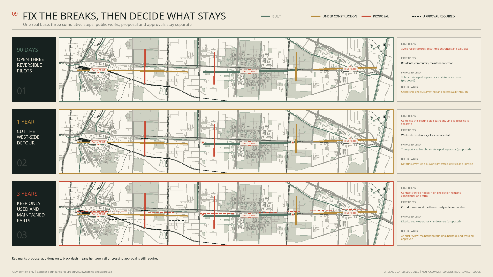
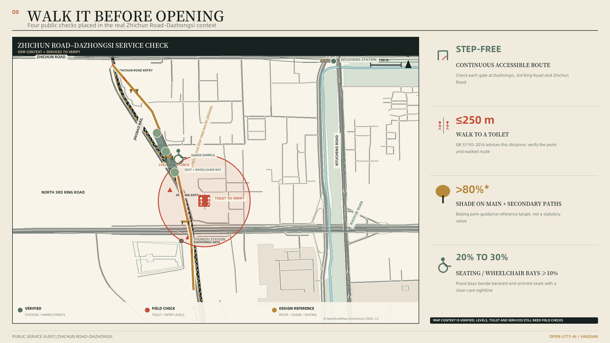

# Jing-Zhang Open Belt, Bringing a Nine-Kilometre Park into Everyday Life

Phase I of the Jing-Zhang Railway Heritage Park is already open. Runners arrive in the morning, families wheel pushchairs through the rail gardens in the afternoon, and games continue under the bridges after dark. Phase II is under construction, bringing the continuous north-south park closer to completion. This design concentrates on the park edges and the awkward connections. Residents west of the railway should have a shorter walk, cyclists should be able to reach stations without a detour, and anyone coming to rest, ask for help, or try new equipment should find a clear front door.

A nine-kilometre main route joins three courtyards. The Zhongzhiyuan AI Independent Innovation Acceleration Area provides a contained place for low-speed equipment trials. The Beijing AI Origin Community puts a staffed service desk beside the street. At the Dazhongsi AI Industry Cluster, the courtyard serves commuters during the day and hosts small classes, exhibitions, and nearby businesses in the evening. Rain gardens, shaded seats, and quiet corners fill the smaller gaps along the way. Together, these changes can turn an attractive green corridor into a useful everyday route through the city.

## Design Basis and Source List

The first task was to establish what has actually been built. Official records confirm that Phase I is complete and open. Recent reporting gives its extent as 2.4 kilometres and 16.8 hectares. Phase II remains under construction. The nine local streets, eight community activity areas, and 420 car parking spaces published in 2024 belong to the construction plan and are not shown as existing conditions. The Xiaozuta section, covering about two hectares, is complete and can be marked separately. The project south of Qinghua East Road is scheduled to begin in 2026 and finish in 2027, so the plan treats it as an interface under construction. [source:JZ-PARK-PHASE1-20230626] [source:JZ-PARK-AXIS-20260330]

The masterplan uses four background colours. Grey shows existing conditions, green shows completed parkland, pale yellow covers approved work or construction under way, and vermilion is reserved for this proposal. OSM supplies the surrounding pattern of roads, buildings, and water. Levels, entrances, and fences still need checking point by point on site. The competition package boundary remains a Provisional Boundary, and every area can be recalculated. None of the drawings presents it as an Official Planning Boundary. [source:DATA-SRC-PROVISIONAL-BOUNDARIES-20260605] [source:OSM-OVERPASS-20260808]

Professional precedents helped set the order of the presentation. Xuhui Runway Park introduces the old runway and masterplan first, followed by street sections, rain gardens, and the people who use them. Built performance is reported separately. Toronto's waterfront design reviews keep their main judgements beside large drawings and use very little supporting text. The six Jing-Zhang proposals published by Beijing in 2020 also begin with a legible spatial idea. This submission reuses no image, geometry, or wording from those projects. It follows only their sequence of existing conditions, masterplan, detailed places, and measurement after opening. [source:CASE-XUHUI-SASAKI] [source:CASE-WATERFRONT-TORONTO-REVIEW]

## Three-Level Scope Framework

The Coordinated Research Area covers about 43.6 square kilometres and asks which schools, neighbourhoods, and businesses along the line would genuinely use the park. The Overall Design Area follows the nine-kilometre corridor across about 11.4 square kilometres, checking breaks in the Walking and Cycling Network, station connections, and access to the river. The three Key-Area Detailed Design Areas total about 368.4 hectares. Here the drawings move down to street corners 80 to 150 metres across and show doors, ramps, tree canopies, and equipment bays. [source:DATA-SRC-OFFICIAL-ANNOUNCEMENT-20260509]

All three scales use the same road and building base map. The nine-kilometre drawing shows the continuous north-south route and five locations where east-west links need repair. At 800 metres, metro entrances, neighbourhood gates, and principal crossings become legible. At 120 metres, readers can measure the 3.2-metre public path, the 2.8-metre cycle lane, and each courtyard opening. Numbers on the masterplan carry through to the detailed sheets, so every line has a place on the ground. [data:geometry/site_boundary.geojson#SITE-001] [metric:site_area_sqm]

The current boundary still comes from the competition package. Once an Official Planning Boundary, road alignments, or heritage GIS coordinates become available, all three scales will need a new base map and a shared recalculation of areas and lengths. This version records the coordinate system, date, and source of each layer so the next team can trace every figure. [standard:MOHURD-URBAN-DESIGN-MEASURES]

## Coordinated Research Area: Industry and Future City Research

The Beijing AI Origin Community already has people and institutions around it. Haidian's public information places it within an area of about three square kilometres, surrounded by more than 30 universities and research institutes. An official report in 2026 counted over 300 AI companies, while a later press conference used a figure above 400. The dates and counting methods differ, so this proposal keeps both figures separate. It treats the university east gates, AI Origin Building, and talent service station as everyday destinations that need direct routes. [source:AI-ORIGIN-REAL-ECOSYSTEM-20260324]

The regional drawing places people where they are likely to appear. Students arrive from campuses and metro stations. Research staff bring equipment into Zhongzhiyuan, while nearby residents enter through neighbourhood gates. Visitors can speak to staff as soon as they reach AI Origin. Shopkeepers and evening-class participants gather at Dazhongsi. Every relationship is tied to an entrance and a walking distance, with no floating circles standing in for industrial links. [metric:global_case_count]

International examples offer dimensions and practical methods. At King's Cross, streets, squares, and historic buildings came first, with individual plots following over time. Philadelphia retained the Rail Park's steel structure and supports everyday use with a path, planting, and a few timber platforms. A continuous tree-lined walk gives Madrid Río's different neighbourhoods access to the river. The public route comes first in this proposal. Old material stays where it remains useful, while activities grow from local routines. These cases cannot establish ownership, visitor numbers, or investment conditions for the Jing-Zhang corridor. [source:CASE-KINGS-CROSS-HUMAN-CITY] [source:CASE-RAIL-PARK-PHASE1]

## Overall Design Area: Urban Renewal and Regulatory-Plan-Level Urban Design

Phase I has already delivered the section of park between Zhichun Road and Qinghua East Road. Its twelve northern gardens, reinstated rails, and under-bridge running route provide built references. Phase II continues towards Xizhimen and the North Fifth Ring Road. Its nine local streets and eight community activity areas belong to the existing construction project. This proposal claims none of that work. It concentrates on five connections that remain unresolved, with the detour faced by residents west of Metro Line 13 as the most pressing. Haidian's landscaping authority has publicly addressed the request. At present, it confirms only an entrance north of the North Third Ring Road within the Phase II boundary. Any route across the line still requires review by transport and rail authorities. [source:JZ-PARK-WEST-DETOUR-20241029]

One continuous public route runs through the plan. The courtyards at Zhongzhiyuan, AI Origin, and Dazhongsi sit on existing hard edges, keeping large green areas clear. Two east-west connections first join the project south of Qinghua East Road and the Xiaoyue River, then link neighbourhood gates and metro exits to park entrances one section at a time. The Qinghua East Road project already provides for about 1,900 bicycles and plans to remove roughly 1,200 metres of fencing. This proposal adds post-opening wayfinding and a follow-up check on crowding. [source:QINGHUA-EAST-SOUTH-20260602]

Design review begins at the entrance and then checks the route leading to it. Ownership, fire access, underground utilities, and existing trees have yet to be fully surveyed, so the drawings make no building-by-building demolition decisions. Nine lightweight building prototypes sit beside streets and existing services. Only seating under trees and lighting reach the centre of the park. Statutory Floor Area Ratios and Building Heights remain to be confirmed. [depth:overall_spatial_structure] [data:geometry/buildings.geojson#BLDG-RD-1]

## Detailed Design of Key Areas

The three key-area plans use a common scale. Surrounding buildings, vehicle edges, tree canopies, and entrances are all shown, and six section lines appear on the plans. Component dimensions and conceptual levels are included. Existing topography, underground utilities, and fire-safety conditions still require a measured survey. [depth:three_key_area_detailed_design]

| Place | Plan | How people use it |
| --- | --- | --- |
| Zhongzhiyuan test courtyard | A 58 by 36 metre low-speed loop sits inside the fence, with a 3.2-metre public path outside. A 9 by 92 metre rain garden takes runoff from the hard surface. An emergency stop and equipment return gate sit beside the entrance | Pedestrians continue around the outer path, while testing staff enter through a separate gate. Testing stops for the day if equipment crosses the boundary or the supervisor cannot take control |
| AI Origin service courtyard | A 42 by 30 metre heritage reading court sits close to the street, with a 2-metre ramp to the service desk. The quiet waiting area stays clear of the main route, and the reading rail keeps its distance from the existing track | Visitors meet a member of staff first, and wheelchair users can reach the desk directly. If the service gives a wrong answer, a member of staff takes over on site |
| Dazhongsi exchange courtyard | A 48 by 32 metre activity court opens towards the station. A 30 by 8 metre canopy stores tables and chairs. Cycle parking stays near the entrance, and evening activities move under the canopy | The courtyard gives priority to movement during the morning and evening peaks. People can linger during the day, and small classes meet after work. Furniture is removed the same day if it blocks evacuation |

The former Qinghuayuan Station has a statutory protection boundary and construction-control zone published in 2026. The public webpage confirms their legal status, though this package does not yet contain authoritative coordinates suitable for setting out construction. Components near AI Origin therefore remain removable and provisional. Their alignment will be checked when the cultural heritage authority supplies formal coordinates. [source:QINGHUAYUAN-HERITAGE-CONTROL-20260214] [data:geometry/key_areas.geojson#KEY-002]

## AI Innovation Ecosystem, Personas, and AI+ Scenarios

Eight co-design groups come from relationships already present along the corridor. Students, teachers, and research staff attend classes or test equipment here. Older people, families with children, and wheelchair users pay closer attention to ramps, toilets, and places to rest. Shopkeepers and visitors need a desk where they can speak to someone, while maintenance staff determine whether the grounds can open the next morning. The personas inform spatial decisions. No personal movement traces are collected. [metric:persona_count]

Fourteen AI-Enabled Scenarios fit into an ordinary day across the three courtyards. The early morning focuses on station access and accessibility inspections. Talent services, health referrals, and shared learning operate during the day, always with staff close at hand. Heritage reading and neighbourhood classes belong to the evening. Contained low-speed trials take place later, when fewer people are passing through. If the network fails, equipment returns to its store and the public path stays open. [metric:scenario_count] [metric:test_scenario_count]

| Time | Place and activity | People on site |
| --- | --- | --- |
| 6.30 to 9.00 | Dazhongsi entrance shows walking and cycling routes to the station. Maintenance staff check ramps, standing water, and lighting | Commuters read the signs directly, with no QR code required |
| 10.00 to 17.00 | AI Origin opens its service desk, and people can sit down with questions along the shared-learning walk. Health and talent matters are limited to information and referral | Staff take over complex or high-impact matters |
| 17.00 to 21.00 | Reading, small classes, and conversations with local businesses take place in the three courtyards. Movable furniture stays clear of the main route | Community supervisors manage attendance and noise |
| After 21.00 | Low-speed robots, remote stopping, and offline return are tested inside the Zhongzhiyuan fence | Testing staff remain present, while everyone else uses the outer path |

All six industry trials have a visible boundary. Robot yielding, handoff to staff, and offline return come first. The remaining trials will be scheduled after the site survey. Records cover equipment status, conflict locations, and response times. Faces and personal routes are excluded. Every ordinary visitor retains a route that requires no login. [source:PIPL]

## Land Use, Building Scale, and Retain-Renovate-Demolish Strategy

The Provisional Boundary is divided into 11 continuous units in projected coordinates. Research, education, and community services sit along existing streets. Parkland remains continuous, while commercial and cultural uses cluster near metro stations and Dazhongsi. The working area for research land is about 340.1 hectares, with about 258.8 hectares of parkland. Code 0902 does not appear in the submitted geometry and remains not applicable. These areas are working figures for comparing options. [data:geometry/land_use.geojson#LU-001] [metric:land_use_0802_area_sqm]

Nine building prototypes solve small, practical problems. The test shelter can close, and wheelchair users can pull up to the service desk. Tables and chairs go back under the canopy after an event; maintenance staff reach the equipment room from a rear door. All nine sit at the edge of hard surfaces, so their Building Footprints take up very little of the site. Bolted steel frames, replaceable timber boards, and small prefabricated foundations allow later removal or adjustment. Brick and muted red-grey metal panels pick up colours already present on the railway site. Facilities close to heritage buildings remain single storey and keep the principal view of the station building open. [metric:building_footprint_ratio] [depth:height_massing_character]

Existing buildings still lack reliable records of age, structure, and ownership. Every building needs inspection before construction. Sound buildings should be repaired first, while demolition can be considered where fire access is obstructed or the structure is unsafe. This version records only three work categories, covering retention, repair, and review. It does not count conceptual prototypes in the existing Building Coverage Ratio or assign Development Intensity without evidence. [depth:retain_renovate_demolish]

## Transport, Rail, Municipal Infrastructure, and Public Services

Walking and cycling are drawn separately. The working width is 3.2 metres for the public path and 2.8 metres for the cycle lane. In narrow sections, paving, tree pits, and speed markings tell cyclists to slow down and everyone to make room. Service vehicles enter courtyards only at set times. The detour west of Metro Line 13 still needs to be walked and measured on site. Until the rail-safety review is complete, a possible crossing is shown as a problem location, with no buildable bridge drawn. [standard:BEIJING-WALK-CYCLE-STANDARD-20201223] [data:geometry/roads.geojson#ROAD-TRUNK]

Park toilets are checked against a 250-metre service radius. Beside each group of seats, wheelchair spaces should equal at least 10 per cent of the seat count. Seats with backs and armrests take priority under trees. An 80 per cent canopy-cover reference is used to review main and secondary paths. The first check models tree shadows on a July afternoon, followed by measurements on site. These figures come from the national park design code and Beijing guidance for greenbelt parks. Their application to each section of this linear heritage park still requires confirmation by the responsible authority. [source:STANDARD-GB51192-PARK-DESIGN] [source:STANDARD-BEIJING-GREEN-PARK]

The five cycle parking areas, six gardens, and four all-age spaces south of Qinghua East Road belong to an approved project. The masterplan connects them to Jing-Zhang park entrances and avoids building the same facilities twice. Drinking water, toilets, lighting, drainage outlets, and fire-safety connections must be counted on site, with each gap given a number. Equipment stays out until power, heat rejection, and network requirements can be met. [data:geometry/constraints.geojson#GAP-MUNICIPAL] [depth:municipal_new_infrastructure]

## Blue-Green Network, Public Space, and Urban Character

The Xiaoyue River project runs 6.41 kilometres from the Qijiahuozi sluice to the Qing River confluence and is designed to a 50-year flood standard. It is a water-management project, so this proposal leaves the river section, bridge positions, and flood conveyance untouched. On the Jing-Zhang side, the design provides one accessible route to the river and places rain gardens beside hard surfaces. Their overflow connection needs review by water and municipal authorities. [source:XIAOYUEHE-FEASIBILITY-202405] [data:geometry/green_space.geojson#GREEN-TRUNK]

Each of the six small courtyard types has a practical task. Rain courts collect runoff from paving, and shade courts provide seats with backs. Shared-learning courts sit near AI Origin. Test courts remain inside the Zhongzhiyuan fence. Dazhongsi gets an exchange court, while residential edges have only quiet courts. Water direction, tree canopy, and benches are drawn before signs are added. The green-space ratio is recalculated from the submitted geometry and cannot replace a tree survey or sponge-city calculation. [metric:green_ratio]

Only three objects mark the route. Entrance signs give the distance to the nearest station and public toilet. Distance posts confirm direction, while low reading rails explain the old track and station. Lighting columns do not flash continuously, and flags are stored during high winds and after the park closes. Eight removable components include dimensions, materials, joints, and a method for replacement. The drawings also show how each sits within a real section. [metric:landmark_count]

## Renewal Projects, Implementation Policy, and Phasing

Nine projects are divided into three groups. The first 90 days deliver the Zhongzhiyuan test loop, AI Origin service desk, and Dazhongsi evening courtyard, all with removable components. Work within one year addresses only gaps confirmed by site measurement, including one crossing, one section of rain garden, and four heritage reading points. After three years, the team reviews the continuous walking sample, annual use records, and repeat measurements. Every project names its maintenance lead before work starts. A project with no maintenance lead stays on paper. [metric:renewal_project_count]

| Stage | Deliverables | Stop condition |
| --- | --- | --- |
| 90 days | Three courtyard trials, entrance counts, a map of conflicts, and maintenance records | Equipment crosses its boundary, evacuation is blocked, or no maintenance takes place for two weeks |
| 1 year | A repaired crossing, rain-garden connection, four reading points, and repeat measurements using the same method | Heritage coordinates conflict with the design, the water authority rejects the connection, or complaints remain unresolved |
| 3 years | A continuous walking sample and permanent facilities that people still use | Use is low, costs remain unclear, or the responsible organisation withdraws |

Daily records are brief. Staff note the place, time, and response, then publish one page at the end of each month. Communities and maintenance teams review three measures together, covering movement conflicts, repair time, and handoff to staff. Accessibility, afternoon shade, and toilet coverage are measured again after a year. The phasing drawing gives every component a location and identifies who removes it if necessary. [data:geometry/phasing.geojson#PHASE-01] [source:BEIJING-URBAN-RENEWAL-REGULATION-20221206]

## Metrics, Area Recalculation, and Compliance Matrix

The provisional site covers about 11.413 square kilometres. The three Key-Area Detailed Design Areas have working areas of about 192.9, 104.3, and 72.0 hectares, totalling roughly 369.3 hectares. The proposal contains 14 everyday scenarios, six industry trials, and nine renewal projects. Areas, ratios, and lengths are recalculated from GeoJSON. Formulas, the coordinate system, and confidence levels are recorded in `metrics.json`. [metric:key_area_count] [metric:renewal_project_count]

Baseline measurements must be taken on site before construction. A person should walk the crossing detour twice at an ordinary pace and use the same visit to check when toilets and drinking-water points are open. Tree-canopy modelling measures shade on a July afternoon, followed by a photograph at 14.00 on a clear day. One field sheet records seat backs, armrests, wheelchair spaces, ramp width, gradient, and standing water. The 90-day and one-year reviews use the same form, making it possible to see whether the changes work. [depth:metrics_recalculation]

Current figures fall into three groups. Published project numbers keep their original definition, figures from the submitted geometry are labelled as working values, and unsurveyed items remain blank. The standards matrix, design-depth matrix, and task-coverage table help reviewers find the relevant material. They do not turn an information gap into compliance. Once official boundaries, ownership, utilities, and heritage coordinates arrive, the drawings, tables, and PDFs must be recalculated within the same version. [source:SITE-PACKAGE]

## Risk, Copyright, and Compliance

The largest spatial risk in this proposal comes from the base map. The working boundary may change, OSM may omit roads or buildings, the Metro Line 13 detour has yet to be measured, and the heritage webpage provides no GIS coordinates suitable for setting out. Shade, toilets, seating, and utilities also await fieldwork. The drawings therefore remain at concept design depth and are unsuitable for approval, investment, or construction. [depth:risk_missing_data]

Public services retain a staffed counter. Robots are tested only inside the fence, and the ordinary path requires no login. Privacy and compliance review starts before each trial. Staff make the final decisions on health, talent, and business matters. Children, older people, and disabled people who join user sessions assess routes and facilities only. Camera or location data is excluded from the test record. [source:PIPL]

Original text, design layers, web pages, and PDFs use CC BY 4.0. OSM-derived backgrounds follow ODbL 1.0, and the Qinghuayuan photograph remains under CC BY-SA 4.0. Professional case-study pages and award pages informed the presentation sequence only. Their images remain the property of their creators and are neither stored nor redrawn in this package. Concept scenes are labelled as imagined views and provide no evidence of existing conditions. [source:WIKIMEDIA-QINGHUAYUAN-20240331]

## References

1. Public Open Call task book `brief/public-brief.md` and Urban Agent task book, 2026 [source:PUBLIC-BRIEF]
2. Beijing Municipal Forestry and Parks Bureau public information on the opening of Phase I of the Jing-Zhang Railway Heritage Park, 2023 [source:JZ-PARK-PHASE1-20230626]
3. Beijing and Haidian government information on the Phase II plan, construction status, and clusters along the corridor [source:JZ-PARK-PHASE2-20240920]
4. *Landscape Architecture* project record for the northern section of Phase I, 2025 [source:JZ-PARK-LANDSCAPE-ARCHITECTURE-20251210]
5. Six design proposals for the Jing-Zhang Railway Heritage Park published by Beijing in 2020 [source:JZ-PARK-SIX-SCHEMES-20200411]
6. Haidian government pages on completion of the Xiaozuta section and the request for a route west of Metro Line 13 [source:JZ-PARK-XIAOZUTA-20250822]
7. Public-space improvement south of Qinghua East Road and the heritage-control area for the former Qinghuayuan Station [source:QINGHUA-EAST-SOUTH-20260602]
8. Feasibility study and construction tender for the Xiaoyue River ecological corridor [source:XIAOYUEHE-FEASIBILITY-202405]
9. *Code for the Design of Public Park* GB 51192 and Beijing guidance for all-age-friendly parks [source:STANDARD-GB51192-PARK-DESIGN]
10. Sasaki and ASLA project pages for Xuhui Runway Park [source:CASE-XUHUI-ASLA-2021]
11. The Bentway public-space plan under Toronto's Gardiner Expressway and Waterfront Toronto design review report [source:CASE-UNDER-GARDINER-PRP]
12. King's Cross masterplan renewal and public participation records [source:CASE-KINGS-CROSS-HUMAN-CITY]
13. Design and maintenance notes for Phase I of Philadelphia's Rail Park [source:CASE-RAIL-PARK-PHASE1]
14. Madrid City Council project record for Madrid Río [source:CASE-MADRID-RIO-CITY]
15. Landscape Performance Series post-occupancy evaluation of Xuhui Runway Park [source:CASE-XUHUI-LPS]

Complete sources, assumptions, risks, metrics, and standards are stored in `sources.json`, `assumptions.json`, `risk.json`, `metrics.json`, and the three matrix files. Professional precedents shown in the drawings inform the reading order and method only. They cannot support site facts, statutory boundaries, or construction commitments for the Jing-Zhang corridor. [source:SOURCE-REGISTRY]
