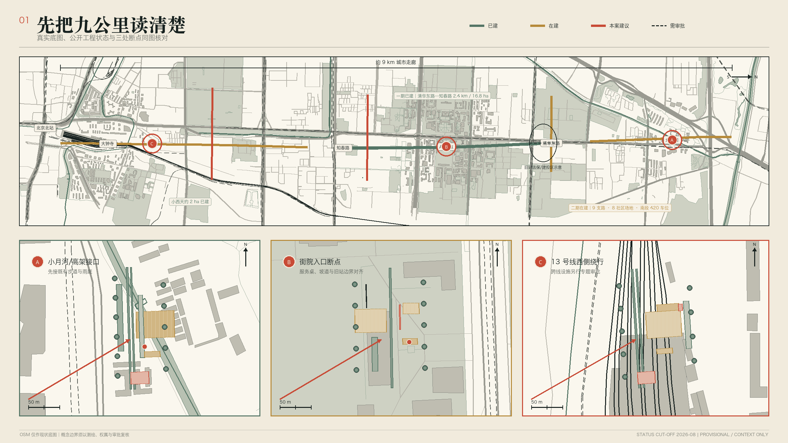
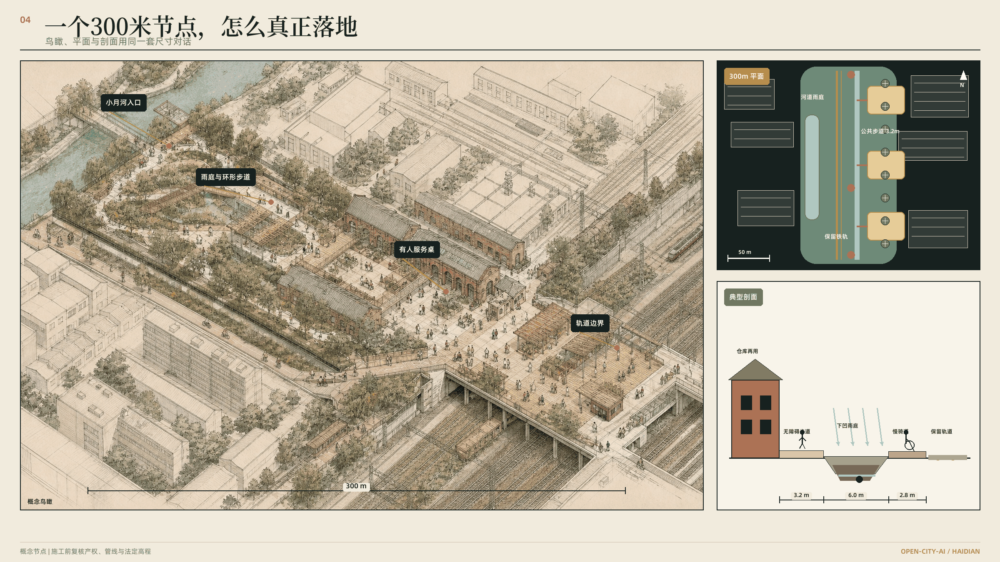
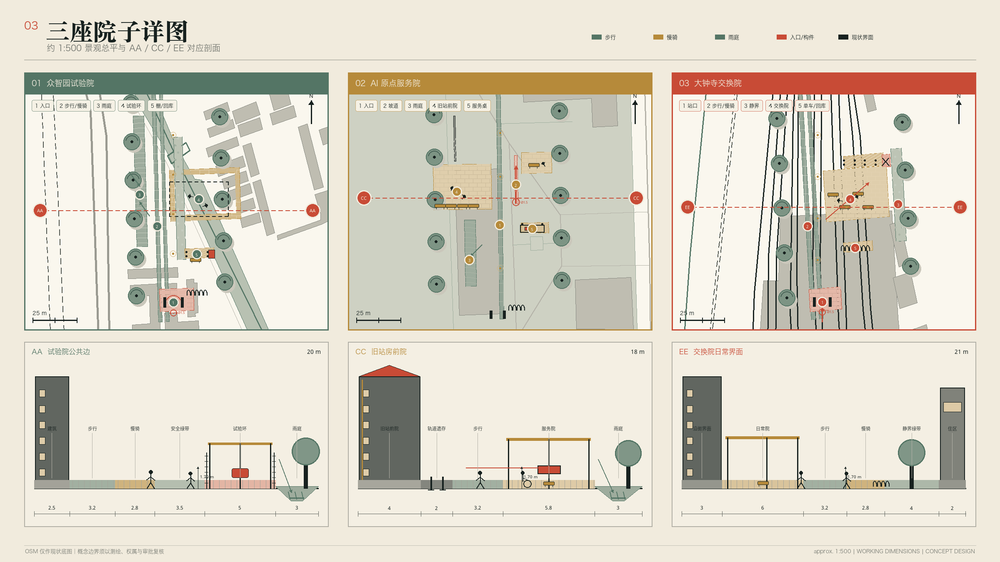
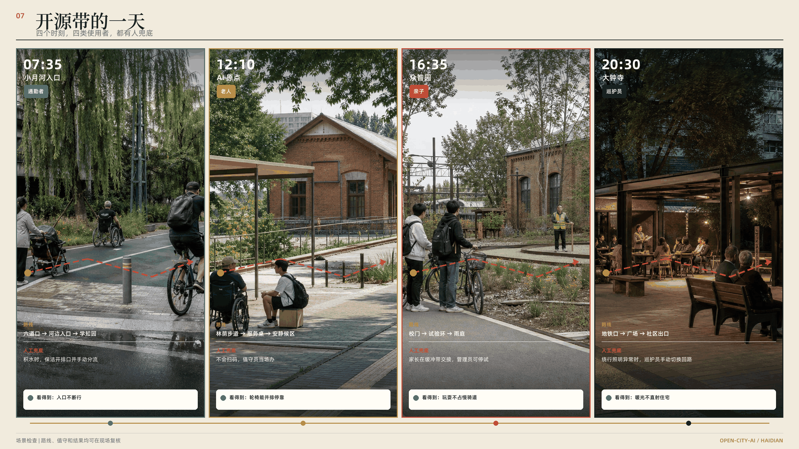
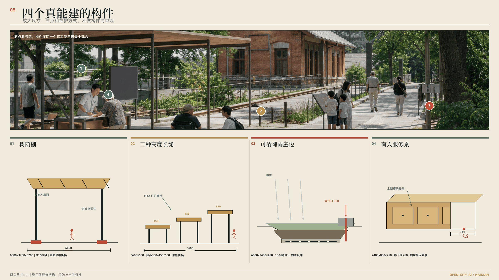
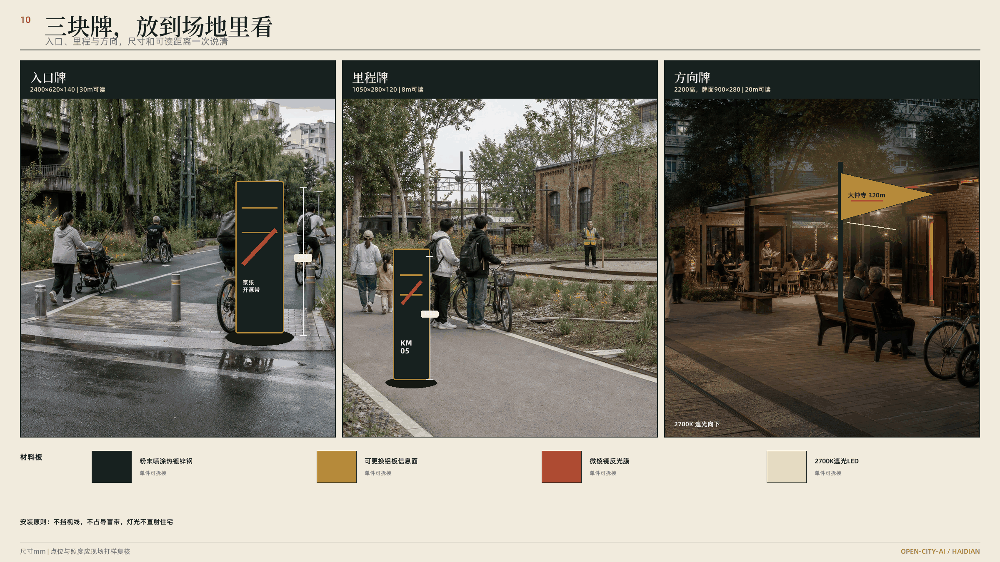
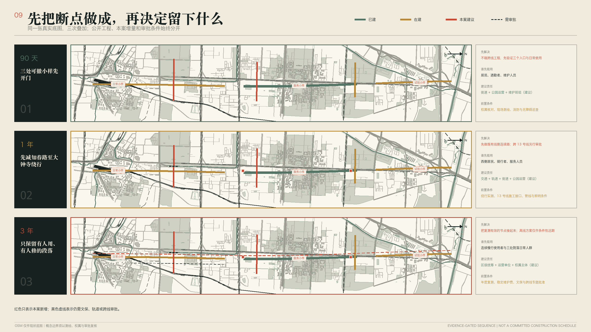

# 京张开源带，把九公里公园接回日常

京张铁路遗址公园一期已经开放。早晨有人跑步，午后有人推着童车穿过铁轨花园，晚上桥下还会有人打球。二期正在施工，南北贯通的日子已经不远。这次设计把力气用在公园外沿和几个难走的接口上，让西侧居民少绕一段路，让骑车的人能顺利接站，也让办事、休息和试用新设备的人有一扇找得到的门。

九公里主线串起三处院落。众智园留给低速设备做有边界的测试。AI 原点在街边摆一张有人值守的服务桌。大钟寺的院子白天接通勤，入夜后留给小课、展览和附近商户。沿线再补雨庭、树荫座位和安静角落，公园就能从一条好看的绿带，慢慢长成一条好用的城市路径。

## 设计依据与资料清单

这轮先把项目进度查清。官方资料确认一期已建成开放，较新的报道采用 2.4 公里和 16.8 公顷口径。二期仍在施工，2024 年公布的九条支路、八处社区活动场地和 420 个机动车位属于建设计划，不能提前涂成现状。笑祖塔段约 2 公顷已经完工，可以单独标为已建。清华东路南侧项目计划 2026 年开工、2027 年完成，也归入在建接口。[source:JZ-PARK-PHASE1-20230626] [source:JZ-PARK-AXIS-20260330]

总图用四种底色。灰色是现状，绿色是已建公园，浅黄色是已批或在建项目，朱红色只画本案新增。OSM 提供道路、建筑和水系的城市纹理，现场高差、出入口和围栏还要逐点复核。征集包里的场地边界继续作为工作边界，所有面积都能重算，图面不把它冒充法定红线。[source:DATA-SRC-PROVISIONAL-BOUNDARIES-20260605] [source:OSM-OVERPASS-20260808]

专业案例只帮我们确定汇报顺序。徐汇跑道公园先交代旧跑道和总体平面，再给街道剖面、雨庭和使用者，建成后的性能另页说明。多伦多滨水评审把关键判断留在大图旁，正文很短。北京 2020 年六套京张方案也都从一条清楚的空间主线展开。本案没有复制这些项目的图片、几何或文字，只采用先现状、再总图、随后落到节点和建后复测的阅读顺序。[source:CASE-XUHUI-SASAKI] [source:CASE-WATERFRONT-TORONTO-REVIEW]

## 三层范围工作框架

约 43.6 平方公里的统筹研究范围回答一件事，沿线哪些学校、社区和企业会真的使用这条公园。约 11.4 平方公里的总体设计范围沿九公里展开，检查步行断点、骑行接站和河岸联系。三处重点区合计约 368.4 公顷，图纸下钻到 80 至 150 米的街角，画出门、坡道、树冠和设备停放位。[source:DATA-SRC-OFFICIAL-ANNOUNCEMENT-20260509]

三个尺度共用同一套道路和建筑底图。九公里图给出南北贯通和五处需要东西缝合的位置。八百米图能看清地铁口、社区门和主要过街。到一百二十米，读者可以量出三点二米公共步道、两点八米骑行带和院落的开口。大图上的编号会带到详细设计页，不再用几根没有落点的线代替场地。[data:geometry/site_boundary.geojson#SITE-001] [metric:site_area_sqm]

目前边界仍来自征集包。官方红线、道路定线或文保 GIS 坐标到位后，三个尺度要一起换底图，面积和长度随之重算。这个版本保留坐标系、日期和图层来源，方便后续人员找到每个数字从哪里来。[standard:MOHURD-URBAN-DESIGN-MEASURES]

## 统筹研究范围产业与未来城市研究

AI 原点社区已有真实的使用基础。海淀公开材料把它划在约 3 平方公里范围内，周边有 30 多所高校和科研机构。2026 年官方报道列出 300 余家人工智能企业，随后新闻发布会采用 400 余家口径。两个数字对应不同时间和统计范围，本案不把它们合并，只把高校东门、原点大厦和人才服务站当作需要接通的日常目的地。[source:AI-ORIGIN-REAL-ECOSYSTEM-20260324]

区域图把使用者画在他们会出现的地方。学生从学校和地铁来，研发人员带设备进众智园，附近居民从社区门进入公园。办事的人抵达 AI 原点后能先问工作人员，商户和夜课使用者在大钟寺停留。每条关系都有入口和步行距离，不再用漂在空中的圆圈表示所谓产业联系。[metric:global_case_count]

国际案例在这里提供尺寸和做法参照。King's Cross 先修街道、广场和历史建筑，再让不同地块慢慢长出来。费城 Rail Park 保留既有钢结构，日常节目只需要一条路、种植和几处能坐的木平台。马德里 Río 用连续林荫步道把不同社区接到河边。本案留下这三点，先做公共通路，旧材料能留就留，活动跟着居民日常走。案例不能证明京张的权属、客流或投资条件。[source:CASE-KINGS-CROSS-HUMAN-CITY] [source:CASE-RAIL-PARK-PHASE1]

## 总体设计范围城市更新与控规深度城市设计

一期已经把知春路至清华东路的一段公园做了出来，北段的十二座花园、复原铁轨和桥下跑步道都是真实参照。二期继续向西直门和北五环延伸，九条支路与八处社区活动场地属于既有工程。本案不在这些内容上重新署名，只补五处尚未说清的接口，其中最紧要的是 13 号线西侧居民绕行。海淀区园林绿化局已公开回应过这项诉求，现阶段只确认二期红线内北三环北侧设出入口，跨线通道仍需交通和轨道部门论证。[source:JZ-PARK-WEST-DETOUR-20241029]

总图沿公园保留一条连续公共线。众智园、AI 原点和大钟寺三处院落落在既有硬化边缘，避免占用大块绿地。两条东西联络先接清华东路南侧和小月河，再把社区门、地铁口与公园入口逐段接上。清华东路项目已有约 1900 辆自行车停车安排，并计划拆除约 1200 米护栏，本案只补开园后的导视和拥堵复测。[source:QINGHUA-EAST-SOUTH-20260602]

每一处改造先核门，再核路。建筑权属、消防、地下管线和现状树木没有查完，图纸不下逐栋拆改结论。九个轻型建筑原型贴着街道和既有服务设施布置，公园腹地只留树下座位与照明。法定容积率和高度继续标为待定。[depth:overall_spatial_structure] [data:geometry/buildings.geojson#BLDG-RD-1]

## 重点区域详细设计

三张重点区平面采用同一比例尺。周边建筑、车行边界、树冠和入口都画全，六条剖面在平面上标出切线。图纸给出构件尺寸和概念标高，现场地形、地下管线与消防条件仍待测绘。[depth:three_key_area_detailed_design]

| 地点 | 平面安排 | 人怎样使用 |
| --- | --- | --- |
| 众智园试验院 | 58 米乘 36 米低速环放在围栏内，外侧保留 3.2 米公共步道。9 米乘 92 米雨庭接住硬地径流，入口旁设停机按钮和设备回库口 | 行人从外圈一直走，测试人员从独立门进场。设备越界或值守员无法接管，当天停测 |
| AI 原点服务院 | 42 米乘 30 米遗产阅读院贴近街边，2 米坡道接服务桌。安静等候区避开主流线，阅读栏杆与既有铁轨保持距离 | 办事者先见到工作人员，轮椅可以直接到桌前。答复有误时现场转人工 |
| 大钟寺交换院 | 48 米乘 32 米活动院朝车站开口，30 米乘 8 米雨棚收纳桌椅。骑行停车靠入口，夜间活动退到雨棚内 | 早晚高峰只留通行，白天可停留，傍晚开小课。疏散受阻时家具当天收回 |

清华园车站旧址已有 2026 年公布的法定保护范围和建设控制地带。公开网页能确认法律状态，当前包里没有可直接用于施工放样的权威坐标。AI 原点附近的构件暂按可撤方式落位，等文保部门提供正式坐标后再校线。[source:QINGHUAYUAN-HERITAGE-CONTROL-20260214] [data:geometry/key_areas.geojson#KEY-002]

## AI 创新生态、人才画像与 AI+ 场景

八类共同设计者来自沿线现有关系。学生、教师和研发人员会在这里上课或试设备，老人、带娃家庭和轮椅使用者更在意坡道、厕所与休息。商户和办事者需要一张能问人的桌子，维护人员决定场地第二天还能不能开。画像只用于安排空间，不采集个人轨迹。[metric:persona_count]

十四个场景按一天排进三处院落。清晨的重点是接站和无障碍巡查。白天开人才服务、健康转介与共学问答，所有答复旁边都留工作人员。傍晚适合遗产阅读和社区小课。围合的低速测试放到夜间低峰，断网后设备回库，公共步道照常开放。[metric:scenario_count] [metric:test_scenario_count]

| 时间 | 地点和动作 | 现场的人 |
| --- | --- | --- |
| 6 时 30 分至 9 时 | 大钟寺入口显示步行和骑行接站，维护员检查坡道、积水和照明 | 通勤者直接看牌，不用扫码 |
| 10 时至 17 时 | AI 原点开放服务桌，共学廊可以坐下问问题。健康与人才事项只做查询和转介 | 工作人员接手复杂或高影响事项 |
| 17 时至 21 时 | 三处院落安排阅读、小课和商户交流，活动家具不压主路 | 社区值守者控制人数和音量 |
| 21 时以后 | 众智园围栏内测试低速机器人、遥停和断网回库 | 测试员在场，普通人走外圈 |

六项产业测试都有可见边界。机器人让行、服务转人工和断网回库先做，其他测试等场地调查后再排。测试记录只留设备状态、冲突位置和处理时长，不留人脸或个人路线。普通使用者始终可以走一条不登录的路。[source:PIPL]

## 用地、建筑规模与拆改留方案

暂定场地按投影坐标切成 11 个连续单元。研发、教育和社区服务靠现有街道，公园绿地保持连续，商业与文化功能贴近地铁和大钟寺。科研用地工作值约 340.1 公顷，公园绿地约 258.8 公顷。提交几何没有 0902，该项继续记为不适用。面积只是方案比较用的工作值。[data:geometry/land_use.geojson#LU-001] [metric:land_use_0802_area_sqm]

九个建筑原型解决很小的事情。测试棚能关门，服务桌能让轮椅靠近，雨棚能收桌椅，设备库能从后门维修。它们都放在硬地边缘，基底占比很低。螺栓钢架、可替换木板和预制小基础便于拆装，砖和灰红金属板接住铁路场地的颜色。靠近遗产建筑的设施控制在一层，不挡站房主要视线。[metric:building_footprint_ratio] [depth:height_massing_character]

现状建筑仍缺年代、结构和产权调查。施工前要逐栋检查，能继续使用的先修，妨碍消防或结构不安全的再讨论拆除。这个版本只标出保留、修缮和待核三类工作，不把概念原型算成现状建筑密度，也不提供未经依据的开发强度。[depth:retain_renovate_demolish]

## 交通、轨道、市政与公共服务设施

步行和骑行分开画。公共步道采用 3.2 米工作宽度，骑行带采用 2.8 米工作宽度，窄处通过铺装、树池和减速标记提醒让行。服务车只在限定时间进院。13 号线西侧的实际绕行长度要由现场步测补齐，跨线方案在轨道安全评估完成前只标问题点，不画成已经能建的桥。[standard:BEIJING-WALK-CYCLE-STANDARD-20201223] [data:geometry/roads.geojson#ROAD-TRUNK]

公园厕所按 250 米服务半径检查。座椅旁至少留出相当于座椅数量 10% 的轮椅停留位，树荫下优先安排有靠背和扶手的座椅。主路和支路的林荫覆盖率用 80% 作为核查参照，先对七月午后做树冠投影模拟，再由现场实测修正。这些数值来自公园设计规范和北京绿隔公园文件，京张属于线性遗址公园，能否逐段适用仍需主管部门确认。[source:STANDARD-GB51192-PARK-DESIGN] [source:STANDARD-BEIJING-GREEN-PARK]

清华东路南侧的五处自行车停车、六个花园和四处全龄空间属于已批项目。总体图把这些设施接到京张入口，避免重复建设。饮水、厕所、照明、排水口和消防接口要现场清点，缺口逐个编号。设备没有供电、散热或网络条件时，就不进场。[data:geometry/constraints.geojson#GAP-MUNICIPAL] [depth:municipal_new_infrastructure]

## 蓝绿空间、公共空间与城市风貌

小月河工程从祁家豁子闸到入清河口，治理长度 6.41 公里，设计采用 50 年一遇防洪标准。它是水务工程，本案不能改河道断面、桥位或行洪条件。京张一侧只做一条接河的无障碍路线，在靠近硬地的位置放雨庭。雨庭溢流接入方式要等水务和市政复核。[source:XIAOYUEHE-FEASIBILITY-202405] [data:geometry/green_space.geojson#GREEN-TRUNK]

六种小庭各有一个现实任务。雨庭接铺装径流，树荫庭放靠背座椅。共学庭靠近 AI 原点，试验庭留在众智园围栏里。大钟寺用交换庭，居住界面只留安静庭。每处先画来水方向、树冠和坐凳，随后才放标志。绿地比例从提交几何复算，不能替代树木普查或海绵计算。[metric:green_ratio]

沿线识别只用三件东西。入口门牌写最近车站和公厕距离，里程柱帮人确认方向，低位阅读架讲清旧铁轨和车站。灯杆不做持续闪烁，旗帜在大风和闭园时收起。八个可拆构件给出尺寸、材料、节点和更换方式，图中还画了它们放进真实剖面后的样子。[metric:landmark_count]

## 更新项目清单、实施政策与分期计划

九个项目分成三批。前 90 天做众智园测试环、AI 原点服务桌和大钟寺晚间院落，全部使用可撤构件。一年内只处理现场量得清的缺口，包括一处过街、一段雨庭和四个遗产阅读点。三年后再看九公里连续步行样段、年度使用记录和复测结果。每个项目在开工前写明管养人，找不到管养人的项目留在图纸上。[metric:renewal_project_count]

| 阶段 | 要交付的东西 | 何时停下来 |
| --- | --- | --- |
| 90 天 | 三处院落小样、出入口计数、冲突位置图和维修记录 | 设备越界、疏散被挡或两周无人维护 |
| 1 年 | 过街修补、雨庭接口、四处阅读点和同口径复测 | 文保坐标冲突、水务不同意接管或投诉长期未解决 |
| 3 年 | 连续步行样段与仍有人用的固定设施 | 使用率低、费用说不清或责任单位退出 |

每天的记录很短。值守人员记位置、时间和处理结果，月底公开一页。社区和维护团队一起看三项指标，包括通行冲突、维修时长和转人工结果。一年后再复测无障碍、午后树荫与厕所覆盖。分期图把每个构件落到位置，也标出谁负责拆走。[data:geometry/phasing.geojson#PHASE-01] [source:BEIJING-URBAN-RENEWAL-REGULATION-20221206]

## 指标体系、面积复算与合规矩阵

暂定场地约 11.413 平方公里。三处重点区工作面积分别约 192.9、104.3 和 72.0 公顷，合计约 369.3 公顷。方案里有 14 个日常场景、6 项产业测试和 9 个更新项目。面积、比例与长度都从 GeoJSON 复算，公式、坐标系和置信度写在 `metrics.json` 里。[metric:key_area_count] [metric:renewal_project_count]

建成前的基线要回到现场量。过街绕行用普通步速走两遍，厕所和饮水点逐个查开放时间。七月午后用树冠模型算一次遮阴，随后在晴天 14 时拍照校正。座椅记录靠背、扶手和轮椅位，坡道记录净宽、坡度和积水。90 天与一年沿用同一张表，才看得出改动有没有用。[depth:metrics_recalculation]

当前数字分为三类。官方项目数值保持原口径，提交几何产生的数字标为工作值，尚未调查的项目保留为空。标准矩阵、设计深度矩阵和任务覆盖表只帮审图人员定位，不会把空缺自动变成合格。官方红线、权属、管线和文保坐标到位后，图、表和 PDF 要在同一版本里重算。[source:SITE-PACKAGE]

## 风险、版权与合规说明

这份方案最大的空间风险来自底图。工作边界可能变化，OSM 会漏路和建筑，13 号线绕行尚未实测，文保网页也没有可直接放样的 GIS 坐标。遮阴、厕所、座椅和管线都等现场调查。图纸据此保持概念设计深度，不用于审批、投资或施工。[depth:risk_missing_data]

公共服务保留人工窗口。机器人只在围栏内测试，普通步道不要求登录。隐私和合规复核从测试前开始，健康、人才和企业事项由工作人员作最终处理。儿童、老人和残障人士参加体验时只评价路线与设施，摄像或定位数据不进入本次测试记录。[source:PIPL]

原创文字、设计图层、网页和 PDF 采用 CC BY 4.0。OSM 派生背景遵守 ODbL 1.0，清华园照片继续使用 CC BY-SA 4.0。专业案例网页和获奖页只用于研究汇报顺序，其图片版权仍归原作者，本包没有收录或改绘。概念场景图单独标注为想象画面，不承担现状证据。[source:WIKIMEDIA-QINGHUAYUAN-20240331]

## 参考资料

1. 征集公开任务书 `brief/public-brief.md` 与智能体任务书，2026 年 [source:PUBLIC-BRIEF]
2. 北京市园林绿化局关于京张铁路遗址公园一期开放的公开信息，2023 年 [source:JZ-PARK-PHASE1-20230626]
3. 首都之窗与海淀区政府关于二期计划、在建状态和沿线组团的公开信息 [source:JZ-PARK-PHASE2-20240920]
4. 《风景园林》关于一期北段的项目记录，2025 年 [source:JZ-PARK-LANDSCAPE-ARCHITECTURE-20251210]
5. 北京市 2020 年公布的京张铁路遗址公园六套设计方案 [source:JZ-PARK-SIX-SCHEMES-20200411]
6. 海淀区政府关于笑祖塔段完工和 13 号线西侧绕行诉求的公开页面 [source:JZ-PARK-XIAOZUTA-20250822]
7. 清华东路南侧公共空间改造项目与清华园车站旧址文保范围 [source:QINGHUA-EAST-SOUTH-20260602]
8. 小月河生态廊道工程可研与建设招标文件 [source:XIAOYUEHE-FEASIBILITY-202405]
9. 《公园设计规范》GB 51192 和北京市全龄友好型公园建设导则 [source:STANDARD-GB51192-PARK-DESIGN]
10. Sasaki 与 ASLA 的徐汇跑道公园项目页 [source:CASE-XUHUI-ASLA-2021]
11. 多伦多 Under Gardiner 公共空间计划与 Waterfront Toronto 设计评审报告 [source:CASE-UNDER-GARDINER-PRP]
12. King's Cross 的总体更新与公众参与记录 [source:CASE-KINGS-CROSS-HUMAN-CITY]
13. 费城 Rail Park 一期设计与维护说明 [source:CASE-RAIL-PARK-PHASE1]
14. 马德里市政府的 Madrid Río 项目记录 [source:CASE-MADRID-RIO-CITY]
15. Landscape Performance Series 的徐汇跑道公园建后评估 [source:CASE-XUHUI-LPS]

完整来源、假设、风险、指标和标准保存在 `sources.json`、`assumptions.json`、`risk.json`、`metrics.json` 与三个矩阵文件中。图面采用的专业案例只作阅读和方法参照，不能支持京张的场地事实、法定边界或建设承诺。[source:SOURCE-REGISTRY]
