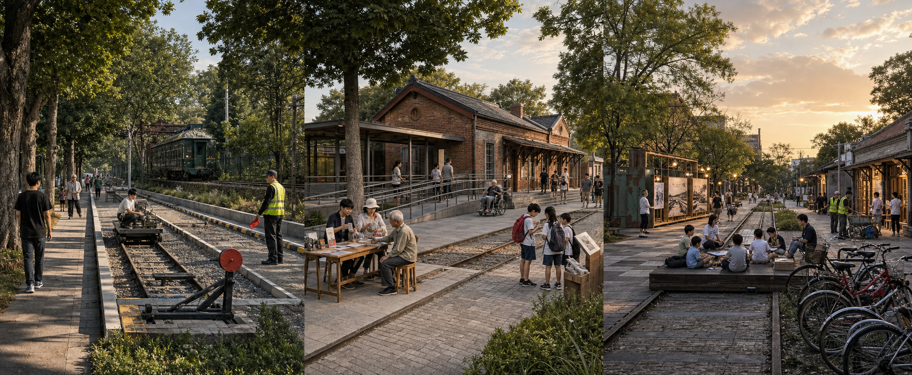

# 京张开源带，把九公里公园接回日常

我先把京张公园一期、二期计划、清华东路南侧项目、小月河工程和清华园车站的文保要求放到同一张图上。沿线已经有公园，有些东西向连接已经获批，水岸也有自己的建设计划。这片地方不缺概念，缺的是把正在发生的事情接牢。

方案从走路开始。九公里的公共脊要连续，树荫、厕所和能坐下来的地方跟着路线布置。三处重点区各自承担一件事。众智园留出有边界的测试院，AI 原点把公共服务和共学放在街边，大钟寺接住车站、公园与夜间活动。

我把这套空间叫作一线、三院、六庭。一线沿着铁路遗址向南北伸展。三院分处北、中、南。六庭是人每天会用到的小地方，有雨庭、树下座位，也有服务桌和共学廊。技术退到这些日常空间的后面。设备停了，路照样能走；答复出错，工作人员就在附近。

这次研究没有现场踏勘，也没有官方红线。图中的边界、面积和建筑原型都属于工作稿。公开资料可以确认项目状态和制度要求，具体路口、权属、管线与文保控制仍要由主管部门和专业团队复核。

## 设计依据与资料清单

我把材料分成四层。公告和任务书说明征集范围与交付要求 [source:DATA-SRC-OFFICIAL-ANNOUNCEMENT-20260509] [source:DATA-SRC-AGENT-TASKBOOK-20260518]。政府公开页面说明哪些公园已经开放，哪些连接已经获批，水务和文保有哪些明确约束 [source:JZ-PARK-PHASE2-20240920] [source:QINGHUA-EAST-SOUTH-20260602] [source:XIAOYUEHE-PROJECT-20240305] [source:QINGHUAYUAN-HERITAGE-CONTROL-20260214]。

OSM 提供道路、步道、轨道、站点、水系和公共设施的现状背景 [source:OSM-OVERPASS-20260808]。这些数据可能漏标或滞后，图上只拿它判断大致关系。面积复算使用仓库给出的暂定边界与本包 GeoJSON [source:DATA-SRC-PROVISIONAL-BOUNDARIES-20260605]。它们服务于概念比较，官方边界到位后会整体替换。

清华园车站照片来自 Wikimedia Commons，作者为 N509FZ，许可为 CC BY-SA 4.0 [source:WIKIMEDIA-QINGHUAYUAN-20240331]。本轮新增的三院场景图标为概念想象，只帮助读者理解空间气氛，不承担现状或工程证据。

规划方法响应 [standard:MOHURD-URBAN-DESIGN-MEASURES]、[standard:MOHURD-CONTROL-DETAILED-PLANNING]、[standard:MNR-LAND-USE-CLASSIFICATION-GUIDE]、[standard:PROJECT-OFFICIAL-ANNOUNCEMENT] 与 [standard:PROJECT-AGENT-OPEN-CALL-TASKBOOK]。建筑设计深度标准缺少可核文件，[standard:MOHURD-ARCH-DESIGN-DEPTH-2016] 继续记为待补资料。

方案比较有过三条路。科技展陈带容易被记住，日常使用会被展项挤到边上。单一线性公园最安静，任务书要求的产业试验又很难落地。现在采用的铁路日常共同体把既有公园当作底图，只在三处院落增加必要空间。[depth:existing_conditions_diagnosis]

## 三层范围工作框架

公告给出约 43.6 平方公里统筹研究范围、约 11.4 平方公里总体设计范围和约 368.4 公顷重点区域 [source:DATA-SRC-OFFICIAL-ANNOUNCEMENT-20260509]。本案保留这三种尺度，但不给第一层重画红线。总体设计使用 [data:geometry/site_boundary.geojson#SITE-001] 的暂定 polygon，三处重点区使用 [data:geometry/key_areas.geojson#KEY-001]、[data:geometry/key_areas.geojson#KEY-002] 与 [data:geometry/key_areas.geojson#KEY-003]。

43.6 平方公里用来理解高校、社区、科研机构和公共服务的关系。11.4 平方公里回答公园怎样连续，路口怎样跨过去。重点区落到八十至一百五十米的日常尺度，轮椅转弯、树下停留和夜间照明都在这里判断。[depth:three_level_scope_framework] [depth:overall_spatial_structure]

工作场地面积见 [metric:site_area_sqm]，连续用地面积见 [metric:land_use_partition_area_sqm]。两个数字相等，只说明这份概念分区完整覆盖了暂定场地。重点区数量与面积分别记录在 [metric:key_area_count]、[metric:key_area_zhongzhiyuan_area_sqm]、[metric:key_area_ai_origin_area_sqm] 和 [metric:key_area_dazhongsi_area_sqm]。

## 统筹研究范围产业与未来城市研究

2021 年的官方解读提到，京张遗址公园约九公里，服务九个街镇。约六公里高铁入地释放了地面空间，沿线仍要处理复杂交叉和多主体共建 [source:JZ-PARK-CO-CREATION-20211216]。这条信息改变了方案的重心。新增建筑不再占主角，跨路、接站、维护和开放时间成了先做的事。

海淀 2025 年统计公报记录了 92 家全国重点实验室和 123 款备案上线大模型 [source:HAIDIAN-STATS-20260410]。这两个数只能说明全区背景，不能按比例摊到场地。北京市智能体政策提出应用验证、可信测试和公共服务开放场景 [source:BEIJING-AGENT-POLICY-20260723]。本案把这些要求分到三处院落，众智园负责有界测试，AI 原点负责有人值守的公共服务，大钟寺承接发布与交流。

八个国际案例各留下一条可用经验。Helsinki 3D 提供开放格式 [source:CASE-HELSINKI-3D]，Punggol 提醒测试要分级 [source:CASE-PUNGGOL-PDD]。King's Cross 说明铁路遗产可以和长期公共空间一起经营 [source:CASE-KINGS-CROSS]，Decidim 让公众提案能够追溯 [source:CASE-BARCELONA-DECIDIM]。Amsterdam 算法登记强调责任期限 [source:CASE-AMSTERDAM-ALGORITHM]，Paris 的十五分钟城市帮助检查日常可达 [source:CASE-PARIS-15M]。MK Smart 提供城市试验的组织经验 [source:CASE-MILTON-KEYNES]，Toronto Quayside 留下数据治理和退出的教训 [source:CASE-TORONTO-QUAYSIDE]。案例数量见 [metric:global_case_count]。

区域协作先从具体接口开始。北纬社区接青年人才服务，未来科学城和怀柔科学城接研究与评测，经开区接智能硬件。小月河一侧优先衔接已有水务工程 [source:XIAOYUEHE-WATERFRONT-20260112]。这些都是下一步洽谈清单，还没有形成跨区域承诺。

## 总体设计范围城市更新与控规深度城市设计

京张公园已经进入日常生活。公开资料显示一期开放段约 2.4 至 2.5 公里，二期计划包含约六公里银杏廊、九条支路和社区活动场地 [source:JZ-PARK-PHASE2-20240920] [source:JZ-PARK-AXIS-20260330]。新版总图把已经开放、公开计划和本案建议分开画，读者能看出每一笔从哪里来。

连续主线、三处院落和六类小庭组成一张空间网络。小庭跟着人的路线落位，形成可以逐段修补的更新模式。北段重在测试，中段重在服务，南段重在交流，三种场景都有自己的入口、日常路线和维护人。

总体设计先处理南北连续。公园主线穿过三个院落，沿途用六类小庭补足树荫、雨水和停留。东西方向优先接入清华东路南侧项目及二期支路。清华东路南侧项目已经获批，公开方案包括约 1200 米护栏拆除、五处非机动车停车、六个花园和四处全龄空间 [source:QINGHUA-EAST-SOUTH-20260602]。本案只增加接驳导视、无障碍复核和开园后的使用评估。

城市更新从调查开始。北京市城市更新条例要求公众参与和监督，海淀实施指引要求查清权属、建筑、管线、消防、历史和运营条件 [source:BEIJING-URBAN-RENEWAL-REGULATION-20221206] [source:HAIDIAN-URBAN-RENEWAL-GUIDE-20250716]。现阶段的 11 个功能单元 [data:geometry/land_use.geojson#LU-001] 与 9 个建筑原型 [data:geometry/buildings.geojson#BLDG-RD-1] 只用于检验空间关系。容积率、高度和具体拆改留继续待核。[depth:retain_renovate_demolish] [depth:land_use_layout] [depth:development_intensity_controls] [depth:height_massing_character]

## 重点区域详细设计

三处重点区采用同一比例尺。每张图都画入口、日常路线和可撤设施，剖面里能看到树、棚、座位和建筑界面。九十天试用解决一个小问题，一年后再看它是否值得留下。

众智园的试验院把低速测试条带围在院内。普通步道从旁边经过，入口有人值守，手动停机按钮对现场人员可见。首轮只做多主体让行和遥停测试。设备越界或现场无法接管，测试当天结束。

AI 原点的共学街院靠近有人值守的服务桌。公开信息显示，人才服务流动站已经提供五类十七项服务，并保留线下就近办理 [source:AI-ORIGIN-TALENT-STATION-20260722]。方案增加无障碍坡道、安静等候和错误转人工。清华园车站旧址受 I 类与 V 类建控要求约束，新设施保持低矮可撤，落位由文物主管部门核验 [source:QINGHUAYUAN-HERITAGE-CONTROL-20260214]。

大钟寺的城市交换院位于站、街和公园相遇的地方。白天给通勤者和周边商户使用，晚上可以开一堂小课或一场小展。活动结束后家具归库，安静时段恢复普通通行。居民投诉连续出现，运营方就缩短时段或撤下活动。

三处院落都保留不登录、不追踪的普通路径。三年评估只做三种决定，留下有效部分，改掉使用不顺的地方，也允许整项撤除。[depth:three_key_area_detailed_design]

## AI 创新生态、人才画像与 AI+ 场景

场地里的 AI 参与公共服务转接和围合测试。白天由服务人员接住错误答复，夜间由现场人员看守机器人测试。技术改变的是使用时段和设备接口。测试避开通勤高峰，传感器与低速设备可以拆走，公共空间仍能继续用。客流、热环境和无障碍记录经过人工复核后，才进入下一轮设计。

共同设计包含八类人。研发团队关心测试条件，学生和教师需要共学空间。老人、带娃家庭与残障人士更在意路是否好走，夜间维护人员知道照明和呼叫点哪里最缺。商户、采购方与城市运营人员负责把试用接到日常管理。画像数量见 [metric:persona_count]，它们不对应真实个人，也不采集个人轨迹。

十四个场景沿一天展开。早上先看站点接驳和无障碍主线。中午的服务桌处理办事、共学和人工转接。傍晚的树下空间承担散步、照护与遗产阅读。夜间才开放围合测试，现场安全员掌握停机权。完整位置、责任单位和停止条件保存在 `visual/assets/open-belt-program.json`，数量见 [metric:scenario_count]。每项服务记录的字段数见 [metric:service_passport_field_count]。

六项产业测试覆盖机器人联锁、服务转接、断网降级、无障碍挑战、无追踪服务和能耗时段。每项测试先确定责任单位与人工路径，随后冻结测试集。没有达到门槛的项目留在院内，不进入公共主路。数量见 [metric:test_scenario_count]。[depth:municipal_new_infrastructure]

Agent.1 至 Agent.6 的分工留在任务附件里 [source:DATA-SRC-AGENT-TASKBOOK-20260518]。主图只保留现场会遇到的人、他们做的事和谁来接手。

## 用地、建筑规模与拆改留方案

暂定场地在 EPSG 4548 中切分，回写时使用 EPSG 4326。相邻分区共享边界，目前没有重叠。11 个单元的面积由 [metric:land_use_unit_count] 及各分项指标复算。

科研用地工作值约 340.1 公顷 [metric:land_use_0802_area_sqm]，公园绿地约 258.8 公顷 [metric:land_use_1401_area_sqm]，城镇住宅约 176.9 公顷 [metric:land_use_0701_area_sqm]。教育用地约 117.1 公顷 [metric:land_use_0804_area_sqm]，商业服务业约 87.2 公顷 [metric:land_use_05_area_sqm]。文化用地约 83.4 公顷 [metric:land_use_0803_area_sqm]，社区服务设施约 77.7 公顷 [metric:land_use_0702_area_sqm]。提交数据没有 0902，该项保持不适用。

9 个建筑原型的基底合计见 [metric:building_footprint_area_sqm] 与 [metric:building_footprint_ratio]。这个比率只衡量原型基底占暂定场地的比例。法定建筑密度仍为待核。建筑现状、产权、结构、消防和管线调查完成后，专业团队再逐栋判断保留、修缮或拆除 [source:HAIDIAN-URBAN-RENEWAL-GUIDE-20250716]。

## 交通、轨道、市政与公共服务设施

交通图把道路、轨道、站点和水系画在底层，再叠加公园主线与三条东西连接 [data:geometry/roads.geojson#ROAD-TRUNK]。工作中心线总长见 [metric:road_centerline_length_m]，它不等同于道路红线。

清华东路南侧项目给出了最清楚的一条东西连接。它西接京张，东到小月河，并计划设置约 1900 个非机动车停车位 [source:QINGHUA-EAST-SOUTH-20260602]。新版慢行图从这里出发，逐个标出仍需核实的路口和替代路线。

慢行深化依据 DB11/1761-2020 [source:BEIJING-WALK-CYCLE-STANDARD-20201223]。绿道指南建议驿站服务半径不超过约 500 米 [source:BEIJING-GREENWAY-GUIDE-20250725]，这个数用来检查休息、饮水和厕所的间距。绿道管理办法要求明确步行、骑行与综合类型，也要求有日常管护和应急安排 [source:BEIJING-GREENWAY-MANAGEMENT-20260429]。

市政图只标接口。饮水、厕所、照明、排水与消防需要现场清点，能源、网络和散热要等设备方案明确后核算。现有缺口记录在 [data:geometry/constraints.geojson#GAP-ROAD] 与 [data:geometry/constraints.geojson#GAP-MUNICIPAL]。[depth:traffic_rail_slow_parking]

## 蓝绿空间、公共空间与城市风貌

小月河公开工程包含 6.41 公里河道治理、4.94 公里硬岸改造、19.50 公顷绿地、14 座桥和 5 个公厕 [source:XIAOYUEHE-PROJECT-20240305]。2026 年公开计划另列 11.4 公里滨水步道和 11 公顷绿化 [source:XIAOYUEHE-WATERFRONT-20260112]。两组长度采用不同口径，图中分别保留。

公园主线按照树荫、雨庭、共学、服务、试验和交换六种日常需要布置。新增构件尽量落在硬化边缘和已有服务点附近，给草地与水岸留下连续空间。绿地与公共空间图形见 [data:geometry/green_space.geojson#GREEN-TRUNK] 和 [data:geometry/public_space.geojson#PUBLIC-PLAZA-ORIGIN]。工作面积记录在 [metric:green_space_area_sqm]、[metric:green_ratio]、[metric:public_space_area_sqm] 与 [metric:public_space_ratio]。[depth:blue_green_public_space]

典型剖面先保证两米以上的连续步行净宽，再安排座椅、种植和设备。固定导视与人工服务一直保留。清华园附近的新构件避开文物本体，城市色彩继续使用砖、钢、木和铁路遗存已有的灰红色调。[depth:blue_green_open_space] [depth:public_space_quality]

四个低干预地标分别承担进入、停留、阅读和交换。它们的数量见 [metric:landmark_count]。遗产阅读会在开园后做可达性与理解度评估，方法参考铁路建筑遗产建后评估研究 [source:HERITAGE-POE-20241106]。

## 更新项目清单、实施政策与分期计划

九个项目从一段可以撤掉的小样开始。P01 先做连续步行样段，P02 处理一个真实东西断点。P03 在众智园围出低速测试院，P04 在 AI 原点补服务桌与无障碍等候。P05 完成一段水岸雨庭，P06 在大钟寺试开晚间小课。P07 整理四处遗产阅读点，P08 建立开园后的使用记录，P09 负责年度复核。项目数量见 [metric:renewal_project_count]。[depth:renewal_project_list]

首个九十天只动可逆构件。责任单位每天记录使用冲突和维修问题，月底公开一次简短结果。一年后复测客流、无障碍、热舒适和投诉。三年时再决定哪些项目进入长期建设。

社区、维护团队和相关部门在试用前书面确认责任单位。每次复测都保留同一组指标，让后来的人能看懂项目为何留下、修改或撤掉。

分期图使用四个状态，图形从 [data:geometry/phasing.geojson#PHASE-01] 开始。资料不足时先补调查，取得责任单位后才做小样，通过专业复核的项目进入实施准备，运营记录稳定后才能长期保留。四段工作面积见 [metric:phase_01_area_sqm]、[metric:phase_02_area_sqm]、[metric:phase_03_area_sqm] 与 [metric:phase_04_area_sqm]，总覆盖见 [metric:phasing_area_sqm]。这个顺序不对应固定年份。[source:BEIJING-URBAN-RENEWAL-REGULATION-20221206] [depth:phasing_implementation]

## 指标体系、面积复算与合规矩阵

场地与分区面积来自提交 GeoJSON。核心工作值包括 [metric:site_area_sqm]、[metric:land_use_partition_area_sqm]、[metric:building_footprint_area_sqm]、[metric:green_space_area_sqm]、[metric:public_space_area_sqm] 和 [metric:road_centerline_length_m]。面积在 EPSG 4548 中计算，交换文件保留 EPSG 4326。

方案同时记录三处重点区 [metric:key_area_count]、14 个场景 [metric:scenario_count]、6 项测试 [metric:test_scenario_count]、8 类共同设计者 [metric:persona_count] 与 9 个项目 [metric:renewal_project_count]。公式、来源文件和置信度保存在 `metrics.json`。任务覆盖与设计深度分别保存在 `compliance_matrix.json`、`standard_matrix.json` 和 `design_depth_matrix.json`。[source:SITE-PACKAGE] [depth:metrics_recalculation]

## 风险、版权与合规说明

风险登记写得很短，目的是让下一组人知道从哪里接手。公开资料有使用边界，个人服务要保护隐私，第三方图片和数据沿用各自版权与授权，文保、权属和管线交给主管部门复核。官方边界到位后要重算面积。高影响服务始终保留人工窗口和申诉，OSM 的关键路口继续现场核实。[depth:risk_missing_data]

原创文字、设计图层、HTML 与 PDF 采用 CC BY 4.0。清华园照片采用 CC BY-SA 4.0，OSM 派生语境采用 ODbL 1.0。三院概念场景图只用于表达设计意向，生成方法和使用边界写入 `report/copyright_statement.md`。

网页不加载远程脚本、地图瓦片、字体、图片或跟踪代码。全部假设与触发条件见 `assumptions.json` 和 `risk.json`。

## 参考资料

任务与标准采用官方公告 [source:DATA-SRC-OFFICIAL-ANNOUNCEMENT-20260509]、公开任务书 `brief/public-brief.md` [source:PUBLIC-BRIEF]、智能体任务书 [source:DATA-SRC-AGENT-TASKBOOK-20260518]、站点包 [source:SITE-PACKAGE] 与住建、自然资源标准 [source:DATA-SRC-MOHURD-URBAN-DESIGN-MEASURES] [source:DATA-SRC-MOHURD-CONTROL-DETAILED-PLANNING] [source:DATA-SRC-MNR-LAND-USE-CLASSIFICATION-202311]。

场地事实采用京张公园众创解读 [source:JZ-PARK-CO-CREATION-20211216]、二期与总体推进信息 [source:JZ-PARK-PHASE2-20240920] [source:JZ-PARK-AXIS-20260330]、清华东路南侧项目 [source:QINGHUA-EAST-SOUTH-20260602]、小月河工程 [source:XIAOYUEHE-PROJECT-20240305] [source:XIAOYUEHE-WATERFRONT-20260112]、清华园文保控制 [source:QINGHUAYUAN-HERITAGE-CONTROL-20260214]、慢行与绿道文件 [source:BEIJING-WALK-CYCLE-STANDARD-20201223] [source:BEIJING-GREENWAY-GUIDE-20250725] [source:BEIJING-GREENWAY-MANAGEMENT-20260429]、城市更新文件 [source:BEIJING-URBAN-RENEWAL-REGULATION-20221206] [source:HAIDIAN-URBAN-RENEWAL-GUIDE-20250716] 和公共服务资料 [source:AI-ORIGIN-TALENT-STATION-20260722]。

开放数据与研究方法采用 OSM [source:OSM-OVERPASS-20260808]、清华园车站照片 [source:WIKIMEDIA-QINGHUAYUAN-20240331]、海淀统计公报 [source:HAIDIAN-STATS-20260410]、北京市智能体政策 [source:BEIJING-AGENT-POLICY-20260723] 与铁路遗产建后评估研究 [source:HERITAGE-POE-20241106]。来源登记与处理事实包保存在 [source:SOURCE-REGISTRY] 和 [source:PROCESSED-FACT-PACK]。背景参考包括 [source:JINGZHANG-HISTORY-NRA]、[source:JINGZHANG-PARK-BJGH]、[source:ZHONGGUANCUN-ZGC]、[source:TSINGHUAYUAN-HERITAGE]、[source:WCAG22]、[source:PIPL]、[source:NIST-AI-RMF] 与 [source:UNESCO-AI-ETHICS]。
