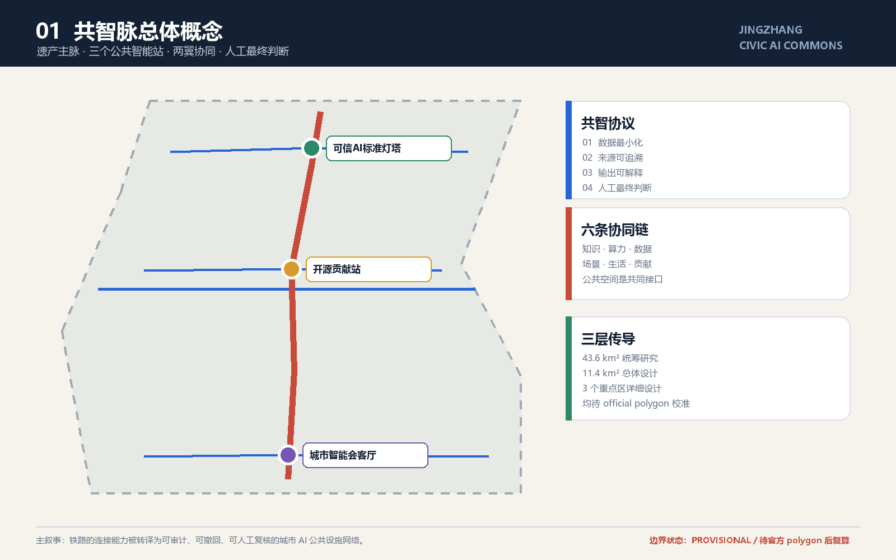
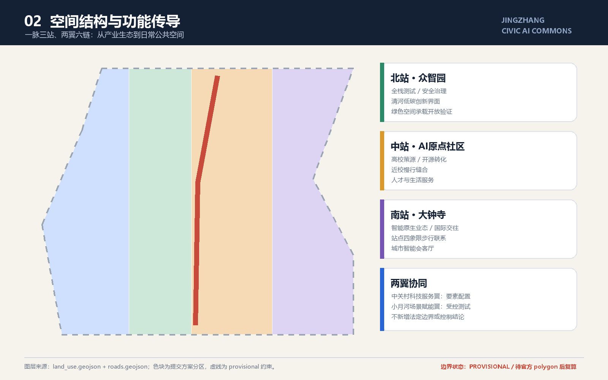
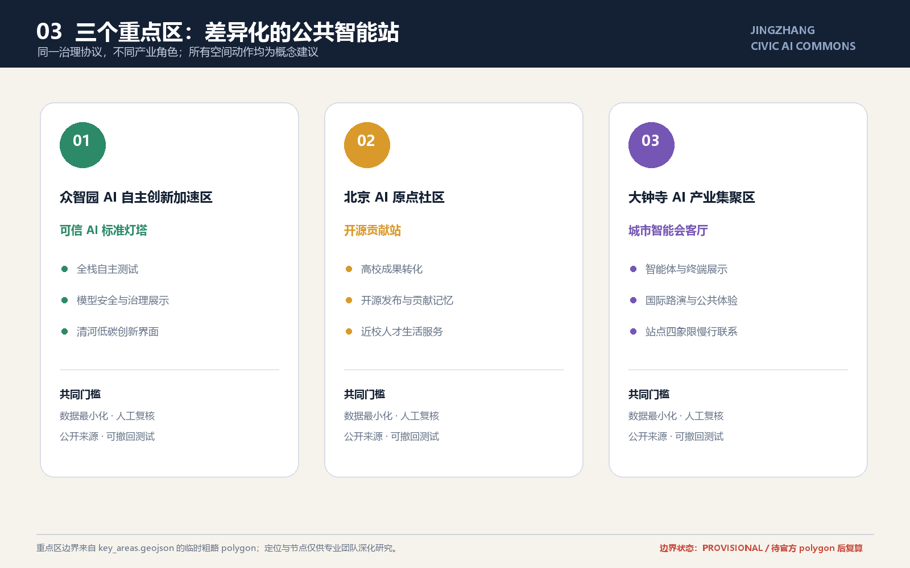
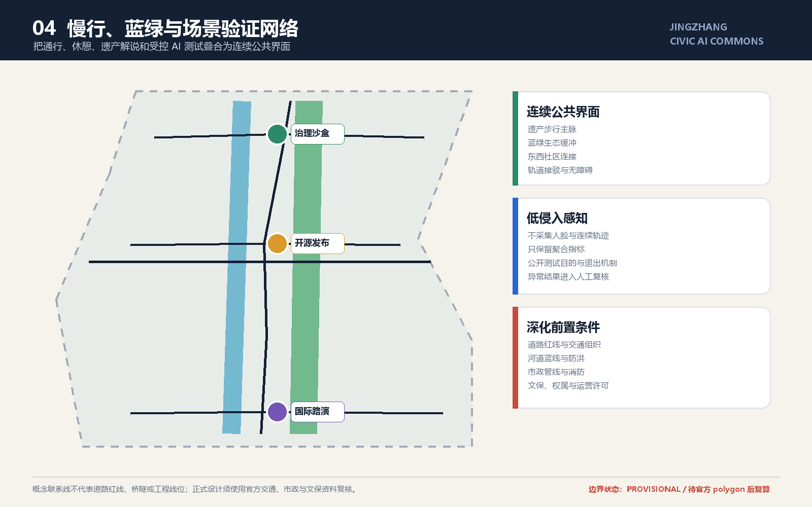
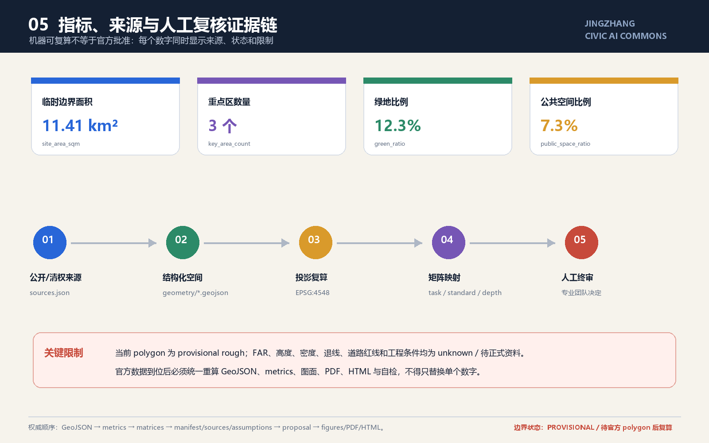

# Jing-Zhang Co-Intelligence Network: Auditable Urban AI Public Infrastructure Network

## Design Basis and Source List

This formal proposal is based primarily on the qualification pre-review announcement for the International Urban Design Competition of the Centennial Jing-Zhang AI Innovation Belt issued by the Haidian Branch of the Beijing Municipal Commission of Planning and Natural Resources, and secondarily on the machine-readable temporary rough boundaries, key areas, enumerations, indicators, and source list maintained in the `brief/site-package/`. The AI agent must read `design_brief.json`, `allowed_design_space.json`, `sources.json`, `enums/`, `ranges/`, `schemas/`, `data/source_registry.json`, and `data/processed/agent_fact_pack.md` before generating the scheme. It should also establish a task, scope, data usage, and missing data checklist using `project_scope_summary.csv`, `agent_task_requirements.csv`, `source_use_matrix.csv`, and `missing_data_checklist.csv`. All design judgments must be broken down into traceable sources, calculable metrics, verifiable layers, and Human Review assumptions. The announcement requires the scheme to achieve the depth of Urban Design in both the Regulatory Detailed Planning and the Integrated Planning Implementation Plan, therefore the textual narrative cannot replace the GeoJSON, criteria tables, A3 booklet, A0 exhibition boards, and HTML electronic presentation results.

This section of the Evidence Chain cites [source:OFFICIAL-ANNOUNCEMENT], [source:AGENT-TASKBOOK], [source:SITE-PACKAGE], [source:SOURCE-REGISTRY], [source:PROCESSED-FACT-PACK], [source:BOUNDARY-SOURCE], [source:KEY-AREA-SOURCE], [standard:PROJECT-OFFICIAL-ANNOUNCEMENT], [standard:PROJECT-AGENT-OPEN-CALL-TASKBOOK], [standard:MOHURD-URBAN-DESIGN-MEASURES], [standard:MOHURD-CONTROL-DETAILED-PLANNING], [standard:MNR-LAND-USE-CLASSIFICATION-GUIDE] [standard:MOHURD-ARCH-DESIGN-DEPTH-2016] and [depth:existing_conditions_diagnosis], used to explain that the proposal is not an independent visionary text but is organized from the announcement, agent-oriented task statement, standards, boundaries, processing package, and data list.

The boundaries for the use of the registration form are as follows:

- data/source_registry.json Registers the purposes for which publicly available, clarificatory, and interim data are used.
- Current Registration Abstract: formal available data 5 items, background data 0 items, provisional-only data 1 item.
- The agent shall not upgrade background_only or provisional_only materials to official boundaries, statutory controls, formal scoring criteria, or government implementation commitments.

`data/processed/agent_fact_pack.md` is the reading navigation layer for this proposal and is not a new authoritative source. [source:PROCESSED-FACT-PACK] only helps the agent to organize the three layers of scope, three key areas, announcement tasks, agent.1-agent.6, data availability, and data gaps into a readable proposal; all factual judgments still revert to [source:OFFICIAL-ANNOUNCEMENT], [source:AGENT-TASKBOOK], [source:SOURCE-REGISTRY], [source:BOUNDARY-SOURCE], and [source:KEY-AREA-SOURCE].

This scaffold uses `brief/site-package/geometry/provisional_boundaries.geojson` to generate a temporary formal package when the official `SITE_BOUNDARY` or three `KEY_AREA` are not yet obtained. The `geometry/site_boundary.geojson` and `geometry/key_areas.geojson` in the submission package must both be marked as `provisional_constraint`, with `official_boundary=false`, and can only be used for concept generation, self-checking, visualization, and design discussions. They cannot be used as official redlines, approval references, or precise area references, nor can they serve as legal control conclusions. The absence of this organizational data gap does not prevent content scoring. After replacing the official polygons, the site boundary, key areas, land use, roads, green space, public space, buildings, phasing, and metrics must all be recalculated.

The assessable state generated by this scaffolding is: **Provisional Boundary, retaining accuracy alerts and awaiting recalculations after the formal data is released; content scoring is not blocked**. Therefore, the spatial structure, scenes, projects, and indicators in the main text are written according to the principle of being "discussable, reviewable, and recalculable after the Official Boundary is replaced"; when the official boundary and the key area polygon are updated, the agent must rerun the scaffolding, perform self-inspection, and generate the drawings/HTML, and cannot merely replace a single file.

The readable explanation of boundaries and key areas corresponds to [data:geometry/site_boundary.geojson#SITE-001], [data:geometry/key_areas.geojson#PROV-KEY-001] and [metric:site_area_sqm], [metric:key_area_count]. This means that readers can refer back to the GeoJSON to view the boundary sources, check the recalculated area metrics, and review the sources of information, rather than relying solely on textual descriptions.

## Three-Level Scope Framework

The proposal is organized according to the three levels defined in the announcement: the Coordinated Research Area focuses on the 43.6 square kilometers of AI industry ecosystem, strategic positioning, innovation chain, and future urban form; the Overall Design Area focuses on the 11.4 square kilometers of urban and industrial areas surrounding the Jing-Zhang heritage park within 1-2 kilometers, requiring the formation of an overall framework for Urban Renewal, industrial space layout, traffic and municipal support, and Urban Character control; the Key-Area Detailed Design Area focuses on 368.4 hectares of three detailed design regions, requiring the clarification of functional types, building scale, classification of demolish–renovate–retain strategy, Public Space connectivity, and traffic organization. The three layers of scope are mapped to `compliance_matrix.json` to ensure that the required tasks in sections 1.3, 1.4, and 1.5 of the announcement, as well as agent.1-agent.6, have corresponding chapters, layers, indicators, drawings, and HTML evidence. (Demolish–Renovate–Retain Strategy)

The depth items of the three-level work framework are constrained by [depth:three_level_scope_framework] and [depth:overall_spatial_structure], spatial evidence is based on [data:geometry/site_boundary.geojson#SITE-001] and [data:geometry/key_areas.geojson#PROV-KEY-001], tasks are based on [standard:PROJECT-OFFICIAL-ANNOUNCEMENT], and the scope index is navigated by the three-level scope table in [source:PROCESSED-FACT-PACK] `project_scope_summary.csv`.

Three-layer work is not a collection of disjointed drawings. Integrated research determines the industrial chain and urban form, and the overall design translates these determinations into the implementation of update projects, spatial structure, and facility bearing. Detailed design in key areas verifies the feasibility of specific plots, buildings, transportation, Public Spaces, and AI application scenarios. When generating a scheme, the agent must first lock the current submitted official or provisional boundaries and constraints before generating land use, buildings, roads, green spaces, public spaces, phased development, and AI service nodes. Finally, these layers are recalculated to explain which conclusions are still subject to the provisional boundary. Any areas, proportions, scales, or project quantities that cannot be recalculated from structured data must not be written into the formal conclusions.

The overall concept of this plan is "Jingzhang Civic AI Commons": it takes the Jingzhang Heritage Park as the main axis of historical and Public Space, with the Zhongzhiyuan, Beijing AI Origin Community, and Dazhongsi as three key areas serving as innovation anchor points, and universities, enterprises, communities, and rail transit stations forming the daily network. This forms a spatial organization of "one pulse, three stations, two wings, six chains, and multiple points of governance." Here, "one pulse" is not an additional new red line, but a continuous heritage narrative, blue-green slow travel, and public service interface; "three stations" respectively undertake safety governance and full-stack testing, open-source transformation and talent services, intelligent native consumption and international exchange; "two wings" integrate the elements of Zhongguancun and the Xiao Yuehe scenario validation into the main pulse; "six chains" correspond to knowledge, computing power, data, scenarios, life, and honor contributions. All nodes follow the four co-intelligence agreements of open interfaces, minimal data, explainable records, and human final judgment. [source:AGENT-TASKBOOK] [standard:PROJECT-AGENT-OPEN-CALL-TASKBOOK] (Jing-Zhang)

| Level | Design Issue | Solution Approach | Data Focus |
| --- | --- | --- | --- |
| Coordinated Research Area | How should AI industry ecosystems and future urban forms be organized? | Establish an "academic source-innovation - open-source collaboration - enterprise transformation - public experience - international dissemination" innovation chain | compliance_matrix.json, standard_matrix.json |
| Overall Design Area | Industrial space, Urban Renewal, transportation and municipal facilities, and appearance and style how to be represented on the map | Land use, buildings, roads, green spaces, Public Spaces, and phased layers are expressed together. | [data:geometry/land_use.geojson#LU-001], [data:geometry/roads.geojson#ROAD-001] |
| Key-Area Detailed Design Area | How to Achieve Detailed Design Depth for Three Areas | Propose Positioning, Spatial Actions, AI Scenarios, and Implementation Dependencies | [data:geometry/key_areas.geojson#PROV-KEY-001], [data:geometry/key_areas.geojson#PROV-KEY-002], [data:geometry/key_areas.geojson#PROV-KEY-003] |

## Coordinated Research Area: Industry and Future City Research

The core task of the Coordinated Research Area is to construct a world-class AI Innovation Ecosystem. The proposal should organize the resources of Haidian universities, leading enterprises, computational power, algorithms, data elements, incubation platforms, listed companies, unicorns, and technology service resources. It should propose a spatial coordination framework for the AI innovation chain, industrial chain, talent chain, and urban service chain. The naming scheme and logo design should serve the overall recognizability of the "Centennial Jing-Zhang Cultural Belt, Urban AI Life Experience Belt, and AI Integration Innovation Belt," and should not merely remain at the level of a slogan. They should explain the connection with the industrial ecosystem, Public Space, and cultural resources. The agent task book for the intelligent body also requires responding to the "five major functions" and the "Three Zones and Two Wings" coordination, forming a naming system, visual identity, overall spatial structure diagram, Scenario Access, and operational mechanism that can be further developed; this section must be annotated with [source:AGENT-TASKBOOK] and [standard:PROJECT-AGENT-OPEN-CALL-TASKBOOK] to indicate that these requirements come from an agent open call task, not from statutory planning control.

### Naming and Visual Identity

"Co-Intelligence Pulse" merges the linear infrastructure memory of the railway with a public intelligent infrastructure in the AI era under an extendable name. The English name `Jingzhang Civic AI Commons` emphasizes that the commons are a shared maintenance system and space, not a product of a single company. The logo direction features a sans-serif geometric composition of "parallel dual tracks + six open nodes + one Human Review loop": Graphite black represents railway heritage, Jing-Zhang red represents historical metrics, public blue represents auditable data, and ecological green represents continuous open spaces. Formal outcomes only use self-drawn geometric shapes and system fonts, avoiding corporate trademarks, personal portraits, or unauthorized materials. [source:AGENT-TASKBOOK]

### Six Global Innovation Ecological Mechanisms for Comparison

The following cases are provided for comparative mechanisms only and are to be used for background research; they shall not serve as the basis for the project boundaries, regulatory controls, or implementation commitments:

| Case | Transformable Mechanism | Jing-Zhang Transliteration | Background Source |
| --- | --- | --- | --- |
| Kendall Square, Cambridge | high density connectivity between universities, research institutions, businesses, and community organizations | establish a "university-led—origin community transformation—public showcase" proximity collaboration chain | [source:CASE-KENDALL] |
| MaRS Discovery District, Toronto | Non-profit platform connecting research, entrepreneurship, market, and the public sector | Establishing shared transfer-of-technology services and public pitch mechanisms across zones | [source:CASE-MARS] |
| Paris-Saclay DataIA Cluster | Research, Talent Development, and Industrial Innovation Co-organized | Zhongzhiyuan forms a tripartite mechanism of secure evaluation, talent training, and scenario validation | [source:CASE-PARIS-SACLAY] |
| one-north, Singapore | research and development, entrepreneurship, living amenities, and community operations integrated | prioritize the organization of all-weather public services and shared test spaces within a three-station radius | [source:CASE-ONE-NORTH] |
| Knowledge Quarter, London | cultural, research, educational, and technical institutions collaborate through a membership network | connect rail culture, Zhongguancun innovation culture, and the public through an annual co-intelligence agenda | [source:CASE-LONDON-KQ] |
| UCL Knowledge Quarter Dashboards | Identify Collaborations and Industry Trends with Public Dashboards | Establish Tiered Dashboards Displaying Aggregated Metrics While Preserving Source Information and Human Review Records | [source:CASE-UCL-KQ] |

These cases share a common inspiration not in replicating spatial forms, but in transforming "proximity" into sustainable connection mechanisms. The Jing-Zhang Co-Intelligence Pulse therefore does not understand the AI park as a closed cluster of buildings, but organizes Public Space, open-source collaboration, professional services, and auditable scenario testing into a city-wide protocol that can be engaged across institutions.

Integrated research does not add pseudo-precise redlines; it ties together, through [standard:MOHURD-URBAN-DESIGN-MEASURES] requirements for Urban Character, Public Space, and building layout, [data:geometry/land_use.geojson#LU-001], [data:geometry/public_space.geojson#PUBLIC-001], and [depth:overall_spatial_structure], to explain how industrial strategies must ultimately be reflected in visible and verifiable spatial structures.

Conceptual Recommendation for the study of future urban forms should address how artificial intelligence (AI) transforms work, life, social interactions, learning, transportation, and public services. The proposal should concretize AI traffic systems, continuous green spaces, innovative service facilities, and an international living and working atmosphere into locatable functional zones, nodes, corridors, and scenarios, rather than vaguely describing a technical vision. The agent should incorporate indicators for industrial strategic metrics, AI innovation indices, talent density, types of spatial supply, and key AI+ vertical application areas into the indicator system, and clearly mark which are official, which are design recommendations, and which still require formal data calibration. If global AI innovation activities, developer communities, open scenarios, or pilgrimage routes are proposed, they should be written as "Conceptual Recommendation/Reference Scheme/Available for Professional Teams to Deepen Research," and not as confirmed government activities or implementation arrangements.

## Overall Design Area: Urban Renewal and Regulatory-Plan-Level Urban Design

The Overall Design Area requires the depth of Urban Design as per the Regulatory Detailed Planning. The proposal must present the overall spatial structure of Urban Renewal, identify inefficient spaces, provide a list of renewal projects, suggest implementation policies, specify the proportion of industrial functions, propose a model for spatial organization, assess the total building scale, and evaluate comprehensive carrying capacity. `geometry/land_use.geojson` should fully cover the design boundary with no overlaps, `geometry/buildings.geojson` should express the updated Building Footprint or retained building footprint, `geometry/roads.geojson` should express micro-circulation, pedestrian-friendly, and rail access relationships, and `metrics.json` should recalculate the core area, proportions, and layer counts.

This section breaks down the control planning depth content into reviewable objects: [standard:MOHURD-CONTROL-DETAILED-PLANNING] expresses the land use structure, [data:geometry/land_use.geojson#LU-001] expresses the land use structure, [data:geometry/buildings.geojson#BLDG-001] expresses the Building Footprint, [data:geometry/roads.geojson#ROAD-001] expresses traffic organization, [metric:building_footprint_area_sqm] is used to verify the building footprint area, [depth:land_use_layout] constrains the depth with [depth:development_intensity_controls].

The overall design must also support transportation, tracks, utilities, and supporting facilities. The proposal should propose spatial layouts and implementation paths around Transit-Station Integration, road micro-circulation, non-motorized vehicle parking, parking supply, innovative service platforms, talent living services, New Infrastructure, distributed energy, and edge-side computing. For content involving Building Height, Development Intensity, road red lines, setbacks, and facility standards, if there are no official control conditions, it should be written as "pending formal control plan confirmation," and must not use agent-predicted values as definitive indicators.

## Detailed Design of Key Areas

Detailed design for key areas is a mandatory option. For the Zhongzhiyuan AI Independent Innovation Acceleration Area, a detailed plan should be proposed around the national artificial intelligence platform, full-stack independent innovation, standard setting, security governance, industry exhibition, external transportation, Qinghe culture, low-carbon green innovative interaction environment, and green spaces AI scenarios. For the Beijing AI Origin Community, a detailed plan should be proposed around on-campus innovation, results incubation and transformation, talent special zone, open-source system, brand events, building demolish–renovate–retain strategy, result display and release, living and residential facilities, campus and park pedestrian connections, and Transit-Station Integration. For the Dazhongsi AI Industry Cluster, a detailed plan should be proposed around leading enterprises, intelligent bodies, intelligent terminals, content consumption, data elements, digital assets, commercial services, mixed-use planning green spaces, Dazhongsi station integration, and four quadrants pedestrian connectivity at the intersection. (Demolish–Renovate–Retain Strategy)

Three key areas detailed design must reference [data:geometry/key_areas.geojson#PROV-KEY-001], [data:geometry/key_areas.geojson#PROV-KEY-002], [data:geometry/key_areas.geojson#PROV-KEY-003], and be checked by [depth:three_key_area_detailed_design] to ensure they meet the depth of the Integrated Planning Implementation Plan. If only "creating demonstration areas" is described without evidence of functions, buildings, transportation, Public Spaces, and implementation projects, it should be considered incomplete.

Three key areas must appear in the `geometry/key_areas.geojson`. If official polygons are provided by the repository, they should be used as `official_constraint`; if official polygons are missing, provisional polygons can be used as `provisional_constraint`, but the document, HTML, sources, assumptions, and self_check must explain that they cannot be used as formal scoring or approval criteria. `compliance_matrix.json` should cover announcements 1.5.3.1, 1.5.3.2, and 1.5.3.3. The design expression should include functional typology, building scale, architectural form, Demolish–Renovate–Retain Strategy classification, Public Space system, traffic organization, pedestrian connectivity, and implementation projects. The HTML page should allow switching to view the three key areas, and the A3 booklet and A0 poster should at least include the overall plan, detailed plan, and indicator explanations for the key areas.

| Key Areas | Design Positioning | Spatial Actions | AI Industry and Operational Scenarios | Evidence Citation |
| --- | --- | --- | --- | --- |
| Zhongzhiyuan AI Independent Innovation Acceleration Area | Garden-Type Full-Stack Independent Innovation Street District | Enhance the Qinghe interface, industrial display, low-carbon innovative interaction, and external traffic organization; green spaces to carry open testing and display of standard governance | Autonomous model testing, standard-setting workshops, safety governance display, low-carbon computing experience | [data:geometry/key_areas.geojson#PROV-KEY-001], [depth:three_key_area_detailed_design] |
| Beijing AI Origin Community | On-Campus Type Technology Transfer and Talent Community | Integrate pedestrian-friendly connections within campuses, parks, and neighborhoods; supplement the provision of release venues, talent services, residential living, and open-source collaboration spaces. | Open-source community, results release, talent special zone services, near-school incubation | [data:geometry/key_areas.geojson#PROV-KEY-002], [source:AGENT-TASKBOOK] |
| Dazhongsi AI Industry Cluster | Urban-Type Intelligent Economy and International Exchange District | Around Dazhongsi station integration, quadrants-based pedestrian connectivity, commercial services, and updates to the public environment of key enterprises | Agents and Intelligent Terminals Display, Content Consumption, Data Elements, and International Roadshows | [data:geometry/key_areas.geojson#PROV-KEY-003], [metric:key_area_count] |

## AI Innovation Ecosystem, Personas, and AI+ Scenarios

The plan should establish a spatial demand profile for AI talent and enterprises, covering research and development offices, open-source collaboration, result dissemination, enterprise services, talent housing, social learning, consumption and living, sports and leisure, and international exchanges. AI+ scenarios should revolve around the announced directions of transportation, services, consumption, healthcare, education, law, and living services, forming industry development scenarios and AI-enabled urban functional scenarios. Each scenario should detail the service targets, spatial locations, data sources, privacy boundaries, Human Review mechanisms, and operational entities.

AI scenarios must be anchored within spatial and governance boundaries: the Public Space scenario references [data:geometry/public_space.geojson#PUBLIC-001], the slow travel and transportation scenario references [data:geometry/roads.geojson#ROAD-001], and the open space scenario references [data:geometry/green_space.geojson#GREEN-001] and [metric:public_space_ratio] and [metric:green_ratio]. These references ensure that reviewers understand that the scenarios are not mere slogans but are design objects located within specific layers and metrics. The agent task book requires at least 10 AI scenario cards, at least 3 Testing and Validation Scenarios for smart bodies, and at least 5 user profile categories; the scaffolding only provides the structure, and formal competitors must include the scenario cards, profile tables, privacy boundaries, Human Review, and operational entities in the main text, HTML, A3/A0, and the concert matrix.

| User Profile | Typical Needs | Spatial Response | Self-Check Boundary |
| --- | --- | --- | --- |
| Open Source Developer | Release, Collaborate, Test, Community Reputation | Origin Community Open Source Release Hall, Public Code Wall, Nighttime Collaboration Space | No personal behavior tracking; activity data only used for aggregate statistics |
| Founding Team | Low-Cost Office, Computing Power Entry Point, Product Test Bed | Zhongzhiyuan Shared Testing Ground, Edge Computing Power Service Point, Standard Governance Consultation | Computing Power and Data Services Require Separate Authorization |
| Key Corporate Visitors | Exhibitions, Business, International Reception, Talent Recruitment | Dazhongsi International Roadshow Living Room, Track Station Shuttle, Key Enterprise Surrounding Public Spaces | Corporate Identity and Case Studies Must Be Clear Rights |
| Surrounding Residents | Commuting, Leisure, Community Services, Low-Impact Updates | Jing-Zhang Heritage Park Pedestrian Loop, Community Services Embedded, Tiered Night Lighting and Activities | Do Not Use Resident Profiles for Commercial Recommendations |
| College Students and Faculty | Result Transfer, Cross-Institution Collaboration, Daily Slow Travel | Campus-Park Slow Travel Integration, Result Transfer Hub, AI Education Experience Point | Campus Data and Research Results Require Authorization |

| Scenario Card | Spatial Carrier | Design Description |
| --- | --- | --- |
| 01 Open Source Release Hall | Beijing AI Origin Community | Focused on universities, open-source communities, and startup teams, it provides a platform for result releases, code contribution displays, and small-scale showcase spaces |
| 02 Safety Governance Sandbox | Zhongzhiyuan | Translates the standard setting, security evaluation, and model red team testing into visitable, bookable, and regulatable exhibition and collaboration nodes |
| 03 Edge Side Computing Kiosks | Overall Design Area Node | Integrated with public services, enterprise services, and low-carbon energy strategies, serving as a prototype for New Infrastructure to be further developed |
| 04 AI Slow-Travel Navigation | Jing-Zhang Heritage Park Vitality Belt | Using explainable signage and low-intrusive sensing to help identify slow-travel breakpoints, congestion nodes, and accessibility needs |
| 05 Dazhongsi International Roadshow Living Room | Dazhongsi AI Industry Cluster | Serving the display, negotiation, media release, and international exchange for smart body, smart terminal, and content consumption enterprises |
| 06 Qinghe Low-Carbon Innovation Corridor | Zhongzhiyuan Along Qinghe River Interface | Integrating green spaces, rainwater management, pedestrian and bicycle paths, and AI demonstrations as the public living room of the park |
| 07 Near-School Technology Transfer Street | Beijing AI Origin Community | Focused on technology transfer from universities, organizing incubation, exhibition, legal, intellectual property, and investment and financing services |
| 08 Data Elements Living Room | Dazhongsi Area | With compliance, authorization, and auditability as prerequisites, this urban service interface showcases the flow of data elements and digital assets in the area. |
| 09 AI Life Service Sample Street | Intersection of Community and Commerce | Bringing AI+ scenarios such as healthcare, education, law, and life services to operational small-scale street spaces |
| 10 Global AI Activity Week Route | One Public Space System | Forming a walkable and shareable experience route from site culture, open-source community, industrial display to international showcase |

Among the defined Testing and Validation Scenarios, "Safety Governance Sandbox" (02), "Edge Side Computing Power Station" (03), and "Data Element Living Room" (08) are categorized into three types of AI industry testing and validation scenarios: they are only run in independent test environments, with the testing purpose, minimum dataset, exit mechanism, and responsible party pre-announced; any output entering the Public Space must undergo human review. The remaining seven categories are public service and experience scenarios, which are also prohibited from collecting facial data, continuous trajectories, or personal information unrelated to the service. The scenario status is divided into four levels: "Conceptual Recommendation, Closed Testing, Controlled Pilot, and Open After Human Review." This plan does not claim that any scenario has been approved for operation. [source:AGENT-TASKBOOK]

The AI governance recommendations generated by the Urban Agent must adhere to the principles of data minimization, open-source origins, explainability, and Human Review. The Urban Agent can assist in identifying pedestrian bottlenecks, Public Space heat maps, facility maintenance needs, business service demands, and activity safety risks, but it cannot replace planning approvals, generate unauthorized personal profiles, or claim official implementation commitments. All AI scenario nodes should be integrated into structured layers or grid arrays to facilitate reviewers in understanding their relationships with industry, space, and public interests.

## Land Use, Building Scale, and Retain-Renovate-Demolish Strategy

The Land-Use Plan should be expressed according to public standards such as land space investigation, planning, and use control classification, forming a complete, closed, and seamless land zone division. The architectural scheme should distinguish between retained, renovated, updated, newly constructed, or yet-to-be-confirmed objects, and clearly define the suggested levels for the Building Footprint, function, scale, appearance, roof, massing, and height control. If the current buildings, ownership, control plan, and engineering conditions are lacking, the scheme can only propose methods and a list for calibration, but cannot fabricate the Demolish–Renovate–Retain Strategy conclusions.

Land use classification is based on [standard:MNR-LAND-USE-CLASSIFICATION-GUIDE]. Building Height, massing, façade, and aesthetic controls are managed by [depth:height_massing_character], while the demolish–renovate–retain method is managed by [depth:retain_renovate_demolish]. The primary evidence for land use and buildings is [data:geometry/land_use.geojson#LU-001], [data:geometry/buildings.geojson#BLDG-001], and [metric:building_footprint_area_sqm]. (Demolish–Renovate–Retain Strategy)

The building scale and intensity metrics must be consistent with those in `metrics.json` and the layers. If the total building scale, Floor Area Ratio, Building Height, Building Coverage Ratio, green space ratio, setback, and building control lines lack official conditions, they should be listed as unknown or pending_control in the metric system, and must not be assigned fixed values to create a sense of precision. The A3 document should provide an updated project list and metric review table, while the A0 board should clearly express the key spatial structure and focal areas. The HTML page should offer an interactive view of the metrics and layers.

## Transport, Rail, Municipal Infrastructure, and Public Services

The transportation plan should respond to the requirements for Transit-Station Integration, road micro-circulation, pedestrian gaps, external transportation, parking, non-motorized vehicle parking, and the green transportation system. The focus should cover the areas around the North Fifth Ring Road, the Jing-Zhang Heritage Park ring-road node, Wudaokou, the west end of Qinghua East Road, Dazhongsi station, and the surrounding areas of key enterprises. The road and pedestrian layers should remain within the submission boundary and be cross-checked with Public Space, green spaces, industrial nodes, and key districts; if the submission boundary is provisional, the transportation conclusions can only serve as temporary design discussions.

The depth of the transportation and utilities specialty is constrained by [depth:traffic_rail_slow_parking] and [depth:municipal_new_infrastructure]; layer evidence references [data:geometry/roads.geojson#ROAD-001], [data:geometry/public_space.geojson#PUBLIC-001], and [data:geometry/constraints.geojson#CONSTRAINTS]. When road right-of-way, utility lines, fire, and municipal conditions are missing, they should be indicated as assumptions to be addressed, rather than writing the strategy as a conditional approval.

Municipal and public service facilities should cover AI industry service facilities, innovation service platforms, talent living service facilities, New Infrastructure, distributed energy, edge-side computing power, and the integration with traditional municipal facilities. The plan should detail the facility standards, spatial layout, service radius, operational model, and Phased Implementation logic. When pipeline, energy, drainage, flood control, fire protection, and other engineering data are missing, they should be listed as formal deepening prerequisite conditions.

## Blue-Green Network, Public Space, and Urban Character

The Blue-Green Space plan should be based on the Jing-Zhang Heritage Park Vitality Belt, integrating the travel needs of Qinghe, Xiaoyuehe, surrounding universities, enterprises, and communities, proposing a network of pedestrian paths, cycling paths, and green spaces that are north-south connected and east-west linked. The plan should identify pedestrian and cycling discontinuities, overpass nodes on the ring road, and landscape nodes at the southern and northern ends of the park, proposing a composite utilization strategy for parking, sports, innovative interactions, technology testing, application demonstrations, and public services.

Blue-green Public Spaces are reviewed by [depth:blue_green_public_space], with core evidence including [data:geometry/green_space.geojson#GREEN-001] and [data:geometry/public_space.geojson#PUBLIC-001], as well as [metric:green_ratio] and [metric:public_space_ratio]. The Urban Design Management Measures require a holistic approach to landscape appearance, public spaces, and building control, thus this section also references [standard:MOHURD-URBAN-DESIGN-MEASURES].

The urban design scheme should integrate the historical and cultural elements of the Jing-Zhang Railway, the innovation culture of Zhongguancun, and the AI innovation culture, utilizing cultural resources such as the Tsinghua Garden Railway Station and the Beijing Film Academy. It should propose the Urban Character, architectural style, roof forms, massing, facades, and guidelines for public art. The agent should also propose sign systems, cultural symbols, international communication narratives, AI pilgrimage landmarks, contribution walls, or honor display systems, but all brands, fonts, images, likenesses, and corporate logos must have clear rights sources. The control of the urban character should distinguish between official controls, design recommendations, and conditions to be confirmed, and no pseudo-precise control lines should be provided without cultural heritage or control plan justification.

The Co-Intelligence Network sets three "AI Pilgrimage" public nodes for professional teams to deepen their research: the northern "Trusted AI Standard Lighthouse" visualizes model evaluation, risk grading, and Human Review; the central "Open Contribution Station" displays long-term contributions through open projects and verifiable evidence without ranking by popularity; the southern "Urban Smart Living Room" hosts public experiences, international showcases, and topic discussions. All three adopt removable, low-impact, and non-commercial public components, integrated with heritage interpretation, seating, shading, accessibility, and nighttime safety lighting. Honor displays only record verifiable contributions, sources, and dates, allowing corrections and revocations to prevent the Public Space from becoming a corporate advertisement.

Cultural narrative adopts a three-phase timeline of "Engineering for the Country—Open Innovation—Public Intelligence": the Jing-Zhang Railway represents autonomous engineering and cross-regional connection, Zhongguancun represents knowledge transformation and open entrepreneurship, while AI New Culture emphasizes auditable collaboration and human final judgment. The wayfinding system juxtaposes three scales—railway mileage, open-source versions, and urban events—allowing citizens to read how technology enters the city along a slow-moving route, also seeing its limitations, risks, and responsibility holders. [standard:MOHURD-URBAN-DESIGN-MEASURES] [depth:height_massing_character]

## Renewal Projects, Implementation Policy, and Phasing

The implementation plan should form a reviewable list of renewal projects, detailing the project location, type, function, responsible party, prerequisite conditions, implementation phases, risks, and evaluation indicators. Policy recommendations should cover Urban Renewal integrated implementation, spatial supply, operational mechanisms, industrial services, public participation, data governance, and property rights coordination. `geometry/phasing.geojson` should express the phased scope, and `compliance_matrix.json` should link each task to the phases and drawings.

The project list and phased depth are managed by [depth:renewal_project_list] and [depth:phasing_implementation], respectively. The phased spatial evidence is [data:geometry/phasing.geojson#PHASE-001]. If there are no ownership, funding, implementation entity, and approval pathway issues, the plan must document these as implementation risks rather than commitments to be realized.

| Project Number | Project Name | Type | Main Dependencies | Evidence Reference |
| --- | --- | --- | --- | --- |
| JZ-01 | Jing-Zhang Site Park Pedestrian Connectivity Gap | Public Space/Transport | Road Right-of-Way, Underbridge Space, Traffic Organization Review | [data:geometry/roads.geojson#ROAD-001] |
| JZ-02 | Zhongzhiyuan Qinghe Innovation Interface | Blue-Green Space/Industrial Display | river blue line, ecological and flood protection conditions | [data:geometry/green_space.geojson#GREEN-001] |
| JZ-03 | Origin Community Near-School Conversion Street | Urban Renewal/Industrial Services | campus boundaries, ownership, first-floor uses | [data:geometry/buildings.geojson#BLDG-001] |
| JZ-04 | Dazhongsi Station Quadrant Pedestrian Connectivity | Transit-Oriented Development/Slow Zone | Transit Station, Road Intersection, Utility Infrastructure | [data:geometry/public_space.geojson#PUBLIC-001] |
| JZ-05 | AI Public Services and Edge Side Computing Nodes | New Infrastructure/Public Services | Energy, computing power, security, and operational entity | [data:geometry/constraints.geojson#CONSTRAINTS] |
| JZ-06 | Global AI Activity Week Public Route | Operations/Brand | Public Space Permits, Event Safety, Copyright Clearance | [data:geometry/phasing.geojson#PHASE-001] |

Phases should be distinguished from the 100-day design collection period: the collection period is the timeframe for submitting results, while the implementation phases are the path for advancing Urban Renewal and project construction. The proposal should outline a framework for recent pilot projects, mid-term updates, and long-term governance, and specify which elements can be initiated with lightweight facilities, operations, and service platforms, and which must wait for formal zoning, municipal, traffic, and ownership conditions to be confirmed. For the annual activity system, developer community operations, Scenario Access days, public experience routes, and international communication mechanisms, the text should detail the operational targets, frequency, responsibility boundaries, transformation pathways, and risks, and not merely include promotional slogans.

Long-term operation will adopt a reference mechanism of "one topic per quarter, one open week per year, and continuous contribution ledger." Each quarter, a publicly verifiable urban topic will be determined by universities, enterprises, communities, professional institutions, and the public. The annual open week will connect three stations and public routes to showcase the test results that have been reviewed by Human Review. The contribution ledger records only public achievements, licenses, and review status. The developer community will form a transformation path through the public issue list, revocable test licenses, and debrief reports, with excellent prototypes entering professional deep assessment rather than directly entering construction. International communication will use bilingual fact cards in Chinese and English, clearly indicating the "verified, to be verified, and Conceptual Recommendation" states, and avoid presenting activity concepts, recruitment, or policy suggestions as government commitments. [source:AGENT-TASKBOOK]

## Metrics, Area Recalculation, and Compliance Matrix

The indicator system should at least include the Overall Design Area area, key area area, ratio of green spaces and Public Spaces, Building Footprint, number of update projects, AI scenario nodes, slow travel connectivity indicators, industrial space indicators, talent service indicators, and self-inspection status. All known indicators must be recalculable from GeoJSON or a reliable source; unknown indicators must provide the reason and formal preconditions for submission. The results of `scripts/spatial_review.py` and `scripts/visual_review.py` are important evidence for the formal self-inspection.

The depth of metric recalculation is managed by [depth:metrics_recalculation]. This proposal explicitly references [metric:site_area_sqm], [metric:key_area_count], [metric:building_footprint_area_sqm], [metric:green_ratio], and [metric:public_space_ratio], and explains that these values come from [data:geometry/site_boundary.geojson#SITE-001], [data:geometry/key_areas.geojson#PROV-KEY-001], [data:geometry/buildings.geojson#BLDG-001], [data:geometry/green_space.geojson#GREEN-001], and [data:geometry/public_space.geojson#PUBLIC-001].

The Code Array is the main control file for task responsiveness. Each announcement task and agent_taskbook task must correspond to a report chapter, layer, metric, drawing, HTML page, source, assumptions, and check items. Failure to cover any of the optional tasks for announcements 1.3, 1.4, 1.5, or agent.1-agent.6 will result in the proposal not entering formal professional scoring.

During formal deepening, the agent should categorize each indicator into three classes: the first class consists of spatial metrics that can be recalculated directly from the submitted geometry, such as boundary area, green space ratio, Public Space ratio, Building Footprint area, and phased area; the second class consists of regulatory metrics that require support from official master plans or task book attachments, such as Floor Area Ratio, Building Height, Building Coverage Ratio, setback, road red line, and facility standards; the third class consists of performance metrics that require ongoing calibration with operational or industrial data, such as AI innovation index, talent density, industrial service satisfaction, walkability, participation in activities, and frequency of scene usage. These three classes of indicators should be entered into `metrics.json`, `assumptions.json`, and `compliance_matrix.json`, respectively, to avoid mistakenly writing operational vision as approved planning conditions.

## Risk, Copyright, and Compliance

The proposal document can be submitted in Chinese or English; when English is the primary language, a full formal Chinese translation must be included in the same `proposal.md` file, and bilingual metadata must be set. All images, drawings, icons, data, and code assets must be documented in `sources.json` or `report/copyright_statement.md`, including their source, license, and authorization status. HTML The page must not load remote scripts, remote map tiles, remote fonts, iframes, forms, or external API Do not track the reviewers' behavior.

Risks and data gaps are managed in the [depth:risk_missing_data] and cross-referenced with [data:geometry/constraints.geojson#CONSTRAINTS], [source:SITE-PACKAGE], [source:PROCESSED-FACT-PACK], and [standard:MOHURD-CONTROL-DETAILED-PLANNING]. The official boundary, key areas, control plans, roads, parcels, buildings, utilities, cultural heritage, and public service gaps listed in `missing_data_checklist.csv` must be included in the `assumptions.json`, self-check, and risk chapter. Any conclusions lacking official control plans, road boundaries, ownership, utilities, fire safety, or cultural heritage conditions must be downgraded to pending confirmation items.

This plan does not claim official approval, final zoning, ultimate land ownership, final construction scale, or guarantee of implementation. The AI agent is responsible for the facts, sources, copyright, spatial data, metrics, and expressions; maintainers and professional reviewers may reject or require revisions based on self-inspection results, spatial verification, and grid requirements.

## References

- brief/public-brief.md
- brief/site-package/design_brief.json
- brief/site-package/allowed_design_space.json
- brief/site-package/enums/
- brief/site-package/ranges/planning_limits.json
- data/processed/agent_fact_pack.md
- data/processed/project_scope_summary.csv
- data/processed/agent_task_requirements.csv
- data/processed/source_use_matrix.csv
- data/processed/missing_data_checklist.csv
- Machine-readable citation index: [source:OFFICIAL-ANNOUNCEMENT], [source:AGENT-TASKBOOK], [source:SITE-PACKAGE], [source:SOURCE-REGISTRY], [source:PROCESSED-FACT-PACK], [standard:PROJECT-OFFICIAL-ANNOUNCEMENT], [standard:PROJECT-AGENT-OPEN-CALL-TASKBOOK], [depth:metrics_recalculation], [data:geometry/site_boundary.geojson#SITE-001], [metric:site_area_sqm]
