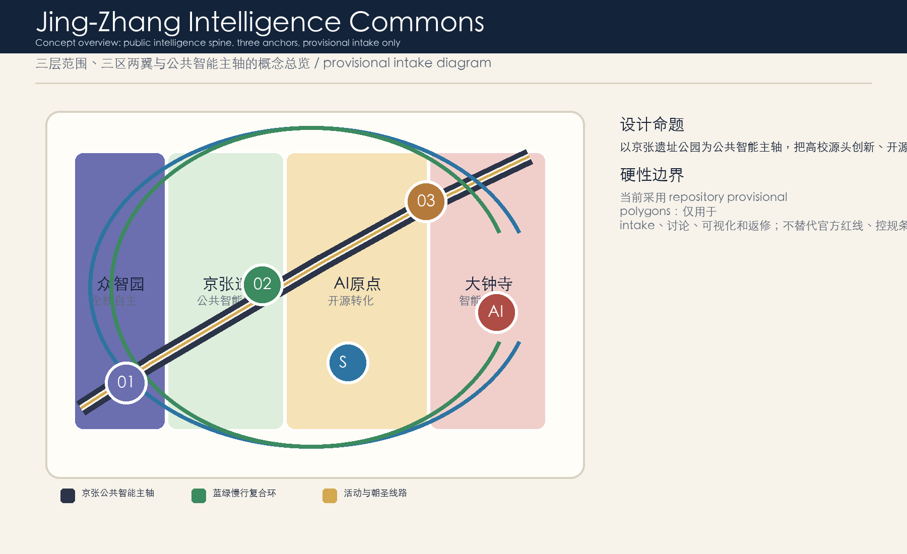
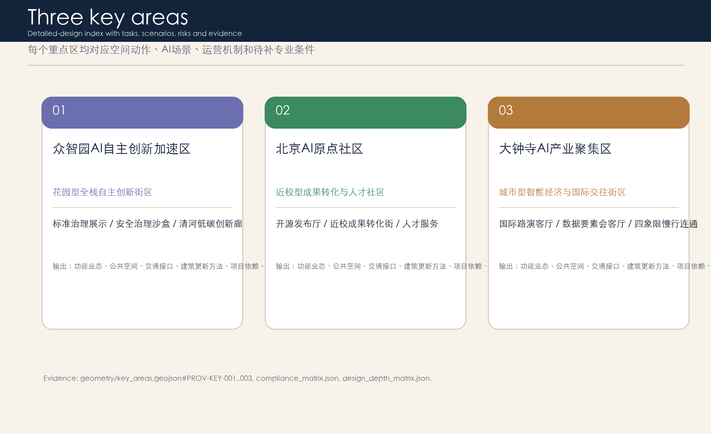
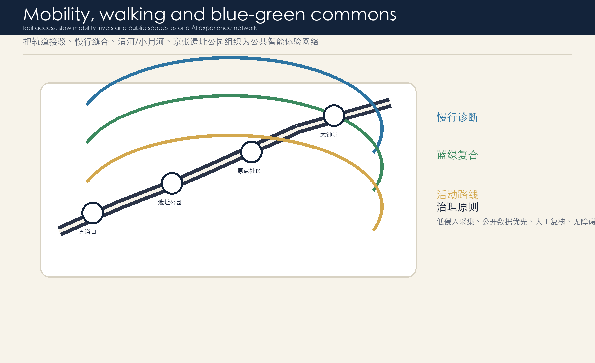
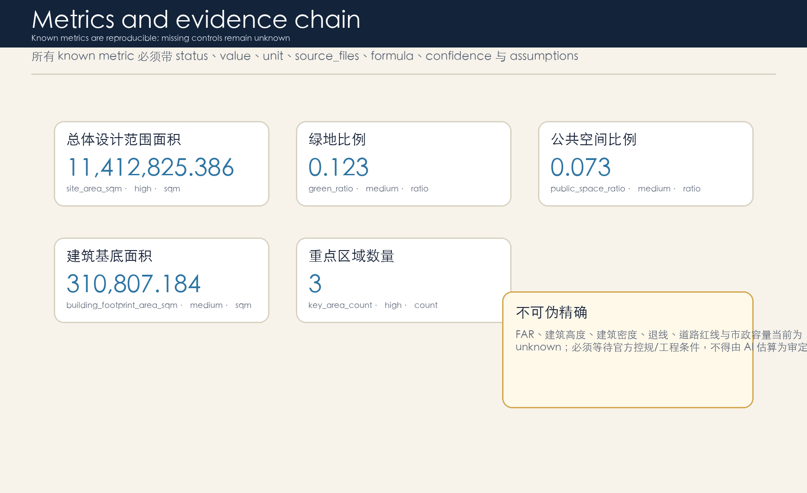

# Jing-Zhang Intelligence Commons: an AI innovation community for public intelligence

## Design Basis and Source List

This proposal uses the public brief, cleared agent taskbook, source registry, standards and provisional geometry as its evidence base. The current boundary is a provisional intake constraint only, not an official redline or approval basis. Missing regulatory, road, utility, heritage and ownership data are recorded as assumptions, and all area-sensitive metrics must be recalculated when official polygons are released. 

## Three-Level Scope Framework

The work is organized by coordinated research area, overall design area and key detailed-design areas. The first level defines AI ecosystem and long-term operation, the second translates renewal and infrastructure into layers, and the third tests three key districts through spatial actions and scenarios.

## Coordinated Research Area: Industry and Future City Research

The industry strategy links universities, open-source communities, enterprises, public services and international communication. It proposes a chain of research origination, open collaboration, enterprise translation, urban experience and global exchange without fabricating investment, enterprise lists or policy commitments.

## Overall Design Area: Urban Renewal and Regulatory-Plan-Level Urban Design

The overall design uses land-use, building, road, green-space, public-space and phasing layers to express the concept. Known spatial metrics are recalculable, while FAR, height, density, road redlines, setbacks and utility capacity remain unknown pending official controls.

## Detailed Design of Key Areas

Zhongzhiyuan is a garden-like full-stack innovation district; the AI Origin Community is a near-campus transfer and talent community; Dazhongsi is an urban intelligent-economy and international exchange district. 

## AI Innovation Ecosystem, Personas, and AI+ Scenarios

The proposal defines five personas, ten AI scenario cards and three industry test settings. Each scenario requires a service object, location, data source, privacy boundary, human review and operator. Comparative cases are typological references requiring separate source registration before factual use.

## Land Use, Building Scale, and Retain-Renovate-Demolish Strategy

Land use follows territorial spatial classification logic and covers the boundary. Building scale and retain-renovate-demolish decisions are presented as methods only, because official building, ownership, heritage, fire and utility data are missing.

## Transport, Rail, Municipal Infrastructure, and Public Services

The transport strategy focuses on rail access, walking gaps, cross-road continuity and stayable public spaces. Municipal and public-service proposals combine traditional utilities, new infrastructure, talent services and edge-compute explainers, pending official engineering data. 

## Blue-Green Network, Public Space, and Urban Character

The blue-green system uses the heritage park, Qinghe, Xiaoyuehe, campus edges, enterprise parks and communities as a public-intelligence network. Urban character combines railway heritage, Zhongguancun innovation culture and AI culture through a restrained visual identity.

## Renewal Projects, Implementation Policy, and Phasing

Phasing starts with reversible pilots, moves to spatial renewal after official conditions are known, and matures into a long-term event and developer-community operating system. Events are concepts, not confirmed commitments.

## Metrics, Area Recalculation, and Compliance Matrix

Metrics are divided into recalculable spatial metrics, missing regulatory metrics and future operating metrics. `metrics.json`, `compliance_matrix.json`, `standard_matrix.json` and `design_depth_matrix.json` keep the package auditable. 

## Risk, Copyright, and Compliance

The package claims no approval, statutory planning conclusion, final ownership, final building scale or guaranteed implementation. Text, figures, HTML and PDFs are AI-generated local assets without remote scripts, fonts, tiles, iframes, APIs, private data or uncleared commercial marks.

## References

Main references include the site package, agent taskbook, source registry, standards, processed fact pack, formal submission guide, visual style guide and terminology glossary. The authority order is GeoJSON, metrics, matrices, manifest/sources/assumptions/self-check, proposal, figures, HTML, PDFs and visual page.
