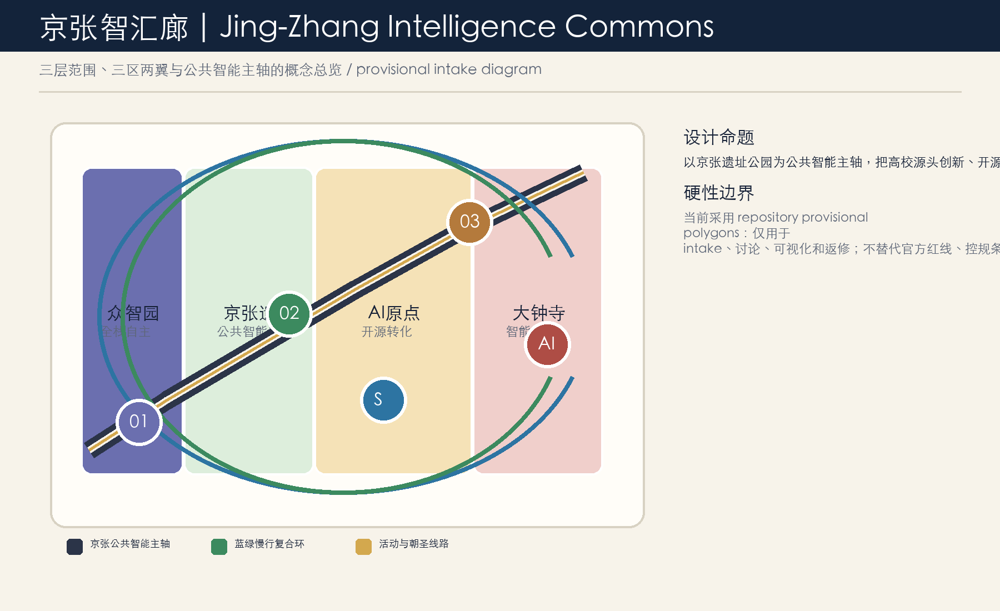
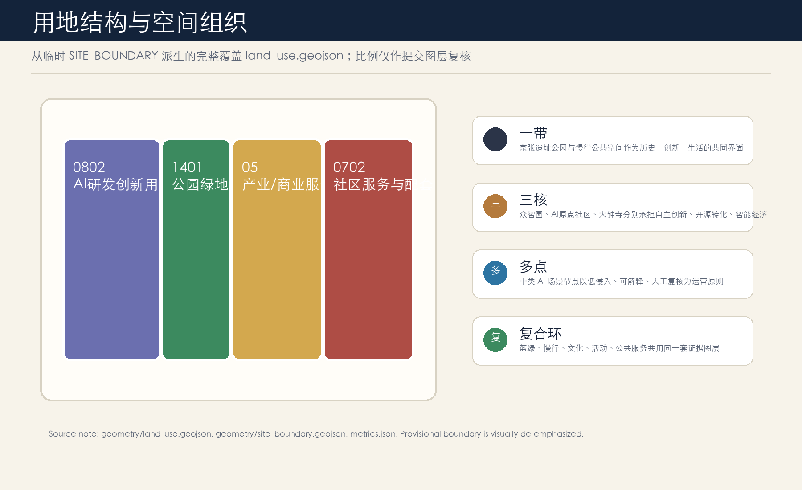
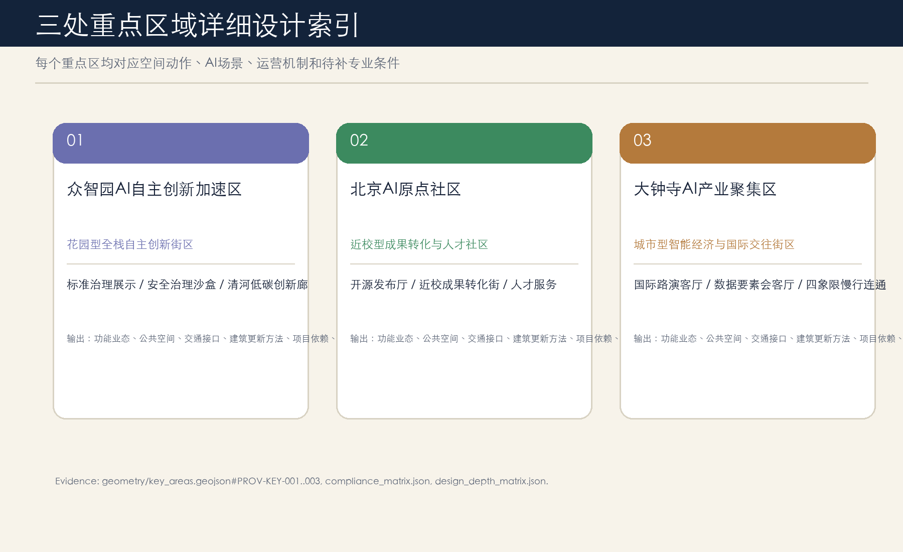
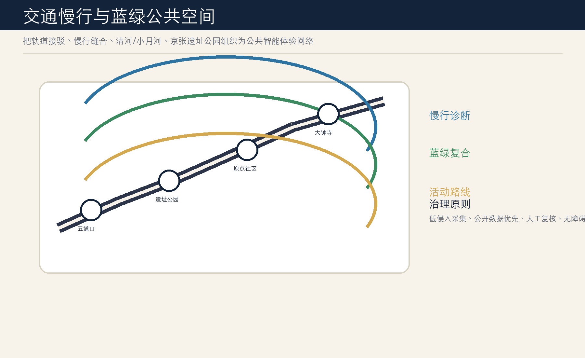
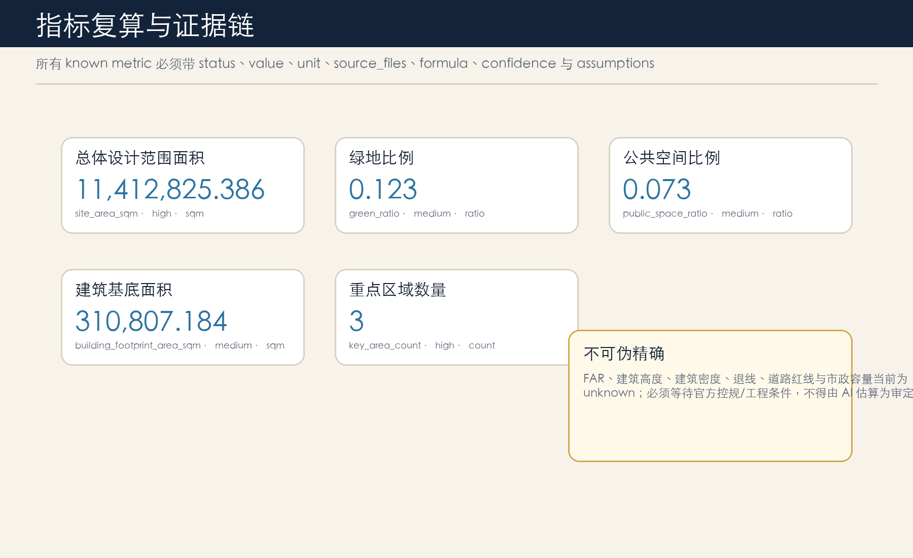

# 京张智汇廊：面向公共智能的AI创新共同体

## 设计依据与资料清单

本方案响应百年京张AI创新带城市设计开源征集，以公开公告、清权任务书、场地包、标准索引、source registry 和 provisional geometry 为依据 [source:SITE-PACKAGE] [source:AGENT-TASKBOOK]。设计首先区分三类事实：可直接引用的项目名称、范围和任务；可由 GeoJSON 与 metrics 复算的空间量；以及仍需官方控规、道路、市政、文保、权属资料确认的专业条件。当前使用的边界为 `provisional_constraint`，只用于 intake、讨论、图示和自检，不作为 official redline 或审批依据 [data:geometry/site_boundary.geojson#SITE-001]。设计意图是把“AI创新带”转译为可审查的公共智能共同体，而不是用口号替代空间证据。资料缺口已进入 `assumptions.json`，后续官方 polygon 到位后需要重算 site boundary、key areas、land use、roads、green space、public space、buildings、phasing 与全部指标。

## 三层范围工作框架

方案按统筹研究范围、总体设计范围和重点区域范围三层组织。统筹研究范围回答 AI 产业生态、全球协同、文化叙事和长期运营；总体设计范围把产业空间、城市更新、交通市政、蓝绿公共空间和风貌控制落到图层；重点区域范围对众智园、北京AI原点社区和大钟寺提出可深化的功能、公共空间、交通接口和运营场景 [source:OFFICIAL-ANNOUNCEMENT] [depth:three_level_scope_framework]。三层之间不是大小图的重复，而是从战略判断到空间结构再到节点验证的证据链。每一层都必须说明设计意图、几何证据、指标影响和数据缺口：例如总体设计面积由 `site_area_sqm` 表达，三处重点区由 `key_area_count` 和 `key_areas.geojson` 表达，任何超出 provisional boundary 精度的面积判断都只能作为待复核事项。

## 统筹研究范围产业与未来城市研究

统筹研究范围的核心设计意图是把海淀高校、科研院所、开源社区、头部企业、初创团队、公共服务和国际传播组织为“高校策源—开源协作—企业转化—城市体验—全球交流”的创新链 [standard:PROJECT-AGENT-OPEN-CALL-TASKBOOK]。本方案不编造企业名单、投资额或政策承诺，而提出可被专业团队继续深化的空间机制：众智园承担全栈自主创新和AI治理展示，AI原点社区承担近校成果转化和开源社区，大钟寺承担智能体、智能终端、内容消费与国际路演。未来城市研究聚焦 AI 如何改变日常工作、学习、出行、公共服务和治理复核，因此把场景开放、人工复核、数据最小化和无障碍服务写入空间规则。缺口在于产业统计、企业入驻、算力供给和政策工具尚未形成清权数据，相关内容只作为研究框架和运营建议。

## 总体设计范围城市更新与控规深度城市设计

总体设计范围以 11.4 平方公里 provisional SITE_BOUNDARY 为设计讨论底图，形成“公共智能主轴 + 三核锚点 + 蓝绿慢行环 + 多点场景”的城市更新框架 [data:geometry/land_use.geojson#LU-001] [depth:overall_spatial_structure]。用地层完整覆盖边界，建筑层表达可讨论的更新基底，路网层表达慢行与接驳关系，绿地和公共空间层表达京张遗址公园、清河、小月河和社区节点的连续性。控规深度要求被拆分为已知、未知和建议三类：已知是公告范围和任务；可复算是边界面积、绿地比例、公共空间比例和建筑基底面积；未知是 FAR、建筑高度、建筑密度、道路红线、退线、市政容量和权属条件 [standard:MOHURD-CONTROL-DETAILED-PLANNING]。这些未知项不得被 AI 推测为审定值，只能作为风险和深化前置条件。

## 重点区域详细设计

众智园AI自主创新加速区定位为花园型全栈自主创新街区，重点强化清河界面、低碳创新交往空间、标准治理展示和外部交通识别；北京AI原点社区定位为近校型成果转化与人才社区，重点缝合高校、园区与街区慢行，补足开源发布、孵化、人才服务和夜间协作空间；大钟寺AI产业集聚区定位为城市型智能经济与国际交往街区，围绕大钟寺站一体化和四象限步行连通组织商业、路演、数据要素展示和智能终端体验 [data:geometry/key_areas.geojson#PROV-KEY-001] [depth:three_key_area_detailed_design]。三处重点区的 polygon 当前均为 provisional，不能用于精确拆改留、建筑规模、桥隧或地下空间结论。设计图和 HTML 只表达概念策略、空间任务和可深化方向。

## AI 创新生态、人才画像与 AI+ 场景

AI生态设计采用案例启示和场景卡两条线。Kendall/MIT、Station F、MaRS、King’s Cross Knowledge Quarter、Helsinki Jätkäsaari、深圳西丽湖等案例只作为公开可再核验的类型参照，正式事实引用前需单独登记来源与许可 [source:SOURCE-REGISTRY]。本方案提出五类用户画像：开源开发者、初创团队、头部企业访客、周边居民、高校师生；十张场景卡：开源发布厅、安全治理沙盒、端侧算力驿站、AI慢行导航、大钟寺国际路演客厅、清河低碳创新廊、近校成果转化街、数据要素会客厅、AI生活服务样板街、全球AI活动周路线；三项产业测试：可信模型评测周、公共空间低侵入运维沙盒、数据要素合规展示日。所有场景必须说明服务对象、空间位置、数据来源、隐私边界、人工复核和运营主体，不能使用个人隐私或非公开数据 [standard:GENERATIVE-AI-INTERIM-MEASURES]。

## 用地、建筑规模与拆改留方案

用地方案遵循国土空间用地分类逻辑，将提交边界分为 AI研发创新、公园绿地与开敞空间、产业/商业服务复合、社区服务与配套四类 [standard:MNR-LAND-USE-CLASSIFICATION-GUIDE]。建筑规模和拆改留只给出方法：优先识别可保留的科研办公和公共服务基底，对低效首层、断裂界面和站点周边空间提出更新方向，对涉及权属、文保、消防、结构安全和市政容量的对象列入待确认清单。`building_footprint_area_sqm` 来自提交的建筑图层，但它不是总建筑规模，也不能推出 FAR [metric:building_footprint_area_sqm]。正式深化需要官方现状建筑、地块权属、控规条件、建筑高度和工程约束；缺失前不得写成拆除、新建或审批结论。

## 交通、轨道、市政与公共服务设施

交通策略聚焦轨道接驳、慢行断点、跨路连通和公共空间停留。五道口、清华东路西口、大钟寺等轨道接口作为门户，京张遗址公园、清河和小月河作为慢行体验骨架，企业服务和社区服务节点作为停留点 [data:geometry/roads.geojson#ROAD-001] [depth:traffic_rail_slow_parking]。市政与公共服务设施采用“传统市政 + 新型基础设施 + 人才服务”的复合思路，提出端侧算力驿站、低碳能源解释站、公共服务AI体验点和活动安全分级节点。道路红线、桥隧工程、非机动车停车、管线容量、消防条件和能源负荷都属于待补资料，当前仅能形成空间策略和专业深化清单。

## 蓝绿空间、公共空间与城市风貌

蓝绿空间以京张遗址公园为公共智能主轴，连接清河、小月河、高校界面、企业园区、社区服务和轨道门户，形成可步行、可骑行、可停留、可解释的复合公共空间 [data:geometry/green_space.geojson#GREEN-001] [metric:public_space_ratio]。公共空间不是简单铺装，而是承载开源发布、AI安全治理展示、低碳算力解释、无障碍导航和公众教育的城市界面。风貌策略融合京张铁路历史、中关村创新文化和AI新文化，以克制的深蓝、清河绿、铜金和纸色建立视觉识别。AI朝圣地标包括开源里程碑墙、公共智能钟楼和京张未来站台，均应可维护、无障碍、低能耗，不侵占文保、绿地或交通安全约束 [standard:BARRIER-FREE-ENVIRONMENT-LAW]。

## 更新项目清单、实施政策与分期计划

实施路径分为近期可逆试点、中期空间更新和长期运营治理。近期可做慢行断点标注、开源发布日、公共服务AI体验、低碳算力解释站、数据治理公开课；中期在官方控规、权属和市政条件明确后推进重点片区首层界面、站点一体化、公共空间和产业服务平台；长期沉淀 Jing-Zhang AI Commons Week、开发者社区、场景开放日、国际路演和公众教育线路 [data:geometry/phasing.geojson#PHASE-001] [depth:phasing_implementation]。政策建议强调开放场景清单、数据授权、人工复核、公共参与、无障碍与老年友好并行、知识资产归档。所有活动和运营均为概念建议，不代表政府承诺；实施前需要场地许可、安全评估、版权清权、运营主体和资金机制。

## 指标体系、面积复算与合规矩阵

指标体系分为可复算空间指标、待补控规指标和运营绩效指标。可复算指标包括 `site_area_sqm`、`green_ratio`、`public_space_ratio`、`building_footprint_area_sqm`、`key_area_count`，均在 `metrics.json` 记录 status、value、unit、source_files、formula、confidence 和 assumptions [metric:site_area_sqm] [metric:green_ratio]。待补控规指标包括 FAR、建筑高度、建筑密度、退线、道路红线和市政容量，必须保持 unknown，不得由 AI 估算为审定值 [metric:floor_area_ratio]。运营绩效如活动参与度、场景使用频次、产业服务满意度和人才留存率，需要后续授权数据和长期运营采集。`compliance_matrix.json` 覆盖公告任务与 agent.1-agent.6，`standard_matrix.json` 与 `design_depth_matrix.json` 提供专业证据链。

## 风险、版权与合规说明

本方案不声称官方批准、审定控规、最终土地权属、最终建设规模或保证实施。主要风险包括：官方边界缺失导致面积和重点区关系需复算；控规、市政、道路、消防、文保和权属资料缺失导致建筑规模、道路线形、拆改留和设施容量只能作为待确认；AI场景若缺少授权、人工复核或退出机制，可能造成隐私、偏见或公共安全风险 [source:BOUNDARY-SOURCE]。版权方面，本包文本、图件、HTML 和 PDF 由 AI agent 在本地生成，不加载远程字体、地图瓦片、脚本、iframe、API 或商业标识；案例名称仅为类型启示，正式引用前需补充来源登记。双语合约由 `proposal.en.md`、`report/proposal.en.html`、英文图件与英文 PDF 对应主文件，后续修改需同步更新。

## 参考资料

本方案引用的机器可读资料包括 `brief/site-package/design_brief.json`、`brief/site-package/agent_taskbook.json`、`brief/site-package/allowed_design_space.json`、`brief/site-package/ranges/planning_limits.json`、`brief/site-package/standards/standards.json`、`brief/site-package/standards/references/*.md`、`data/source_registry.json`、`data/processed/agent_fact_pack.md`、`data/processed/agent_task_requirements.csv`、`data/processed/missing_data_checklist.csv`、`docs/formal-submission-guide.md`、`docs/visual-style-recommendations.md` 和 `docs/terminology-glossary.md` [source:PROCESSED-FACT-PACK]。提交包内的权威顺序为 GeoJSON、metrics、矩阵、manifest/sources/assumptions/self_check、proposal、figures、report HTML、drawings 和 visual HTML。后续 PR 只能修改 `submissions/liuseen-l/jingzhang-ai-commons/`，不得编辑 gallery index 或其他投稿目录。
