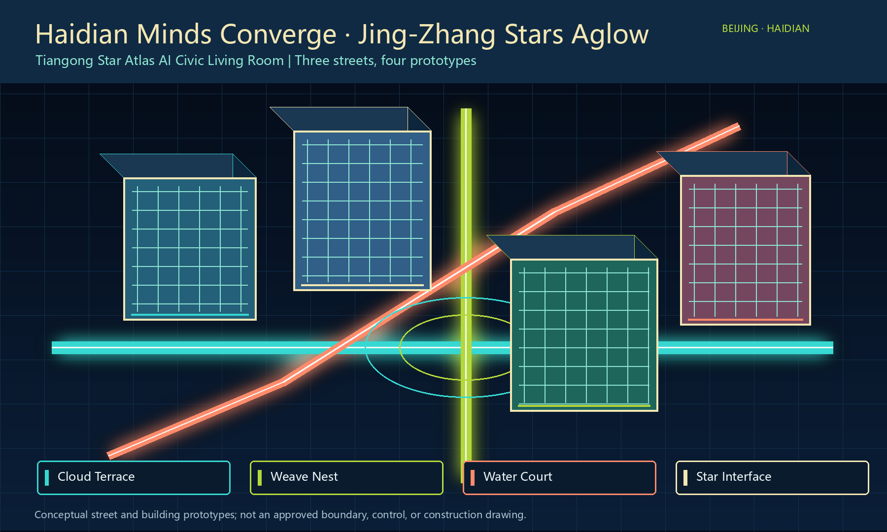
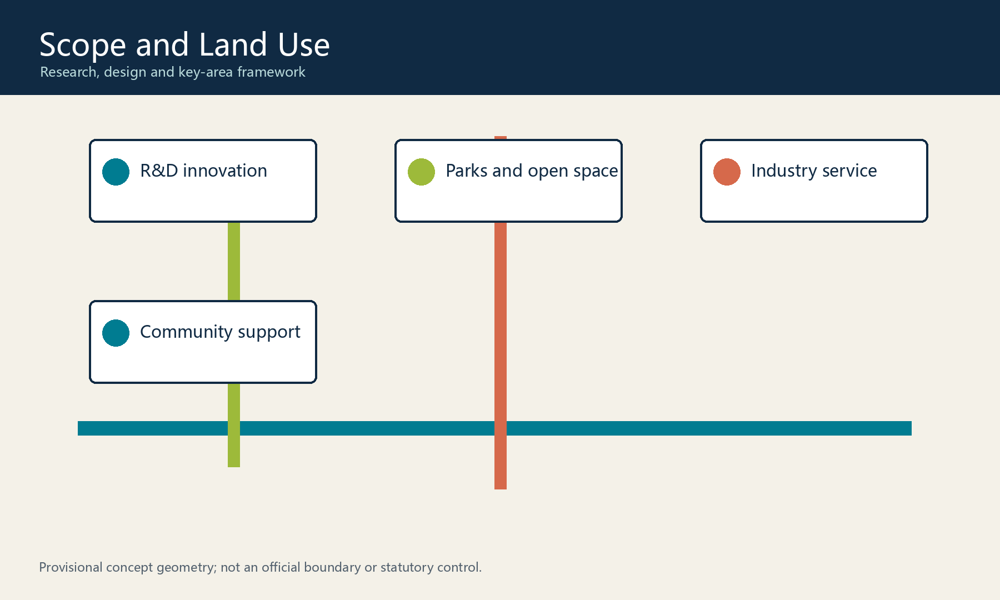
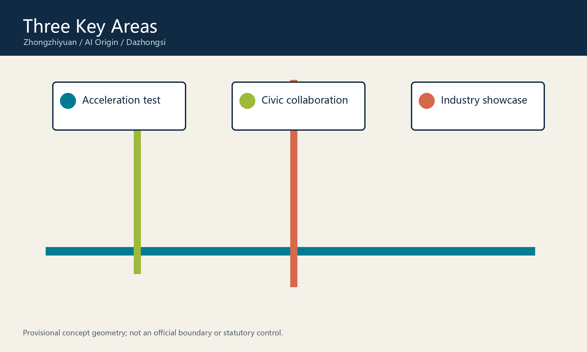
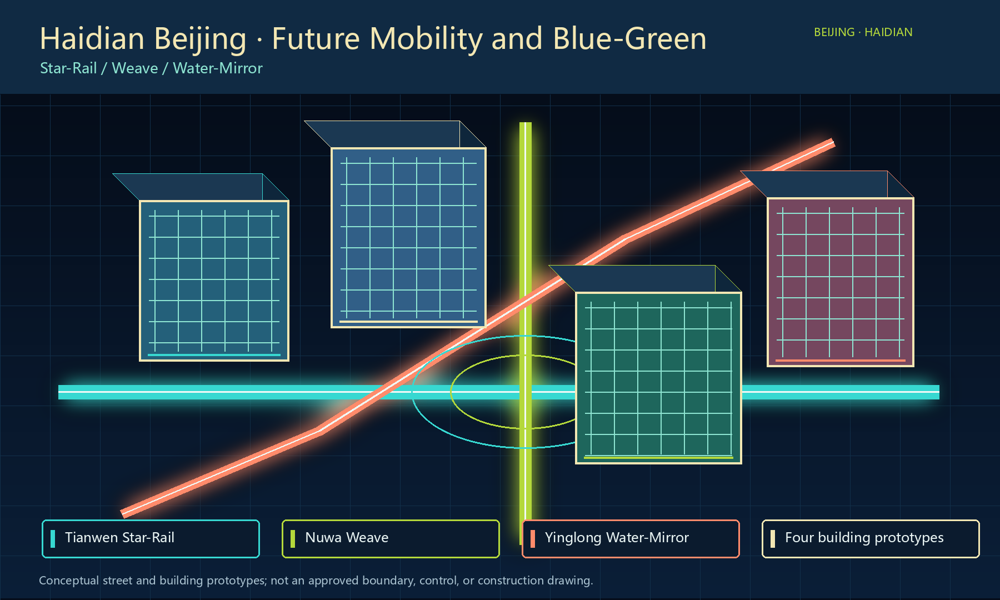
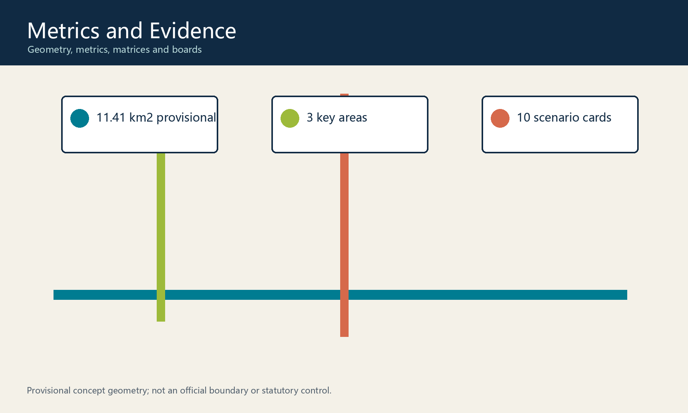

# Haidian Minds Converge · Jing-Zhang Stars Aglow: Tiangong Star Atlas AI Civic Living Room

## Design Basis and Evidence

This open co-creation proposal uses the public call, site package, and agent taskbook. Exact official GIS/CAD boundaries, regulatory controls, ownership, existing-building records, and utility capacity are unavailable; every spatial element is therefore a conceptual suggestion within provisional geometry, not a statutory control or construction commitment. [source:OFFICIAL-ANNOUNCEMENT] [standard:MOHURD-CONTROL-DETAILED-PLANNING]

## Three-Level Scope

The 43.6 km2 research scope frames regional innovation; the approximately 11.4 km2 overall design scope organizes the corridor network; and three provisional key areas host focused research. Official polygons must replace provisional ones before precision-sensitive metrics are used. [metric:site_area_sqm] [data:geometry/site_boundary.geojson#SITE-001]

## Innovation and Future City Strategy

“Haidian Minds Converge · Jing-Zhang Stars Aglow: Tiangong Star Atlas AI Civic Living Room” draws on Haidian's culture of innovation, research, and everyday urban life to translate familiar Chinese spatial wisdom into a future AI civic living room that is easy to read and join. Reading the stars becomes the Tianwen Knowledge Corridor, where explainable wayfinding, Jing-Zhang memory, and open research help people orient themselves. Weaving warp and weft becomes the Nuwa Weaving Corridor, where civic tables, trustworthy data, and human review connect residents, researchers, and service staff. Living with water becomes the Yinglong Water-Vein Corridor, where rain gardens, microclimate notices, and slow mobility respond to daily weather. Together they connect the Zhongzhiyuan acceleration, AI Origin collaboration, and Dazhongsi industry-experience cores. These names are contemporary cultural metaphors, not religious claims, historical reconstruction, or approved projects. [source:AGENT-TASKBOOK]

## Overall Urban Design

The Tiangong Star Atlas is organized through “three corridors, three cores, two wings, and one loop,” with three future-street prototypes that turn the idea into everyday ground. Tianwen Star-Rail Street draws on the image of navigating by stars: low-speed shuttles, walking, cycling, bookable curb service, and low-glare guides form one legible shared street. Nuwa Weave Street draws on warp-and-weft order: permeable tree wells, demountable civic tables, accessible micro-mobility, and quiet-priority crossings form a flexible civic room. Yinglong Water-Mirror Loop draws on living with water: shallow rain gardens, shade structures, and switchable water-level notices make climate infrastructure tangible. These are conceptual centerlines and operational prototypes, not approved street sections or engineering commitments. [data:geometry/roads.geojson#ROAD-001] [data:geometry/roads.geojson#ROAD-002] [data:geometry/roads.geojson#ROAD-003]

Four replaceable building prototypes translate terraces, courtyards, and deep eaves into future-facing but auditable civic interfaces. Tianwen Cloud Terrace layers research, model evaluation, and a publicly readable test gallery. Nuwa Weave Nest uses a shared court for live-work studios, repair spaces, and neighbor exchange. Yinglong Water Court combines a lifted public level, rain-garden court, and deep shade for heat and rain. Star-Atlas Interface places accessible transfer, civic service, and changing exhibitions beneath a porous corner canopy. Terraces, bridges, translucent shading, vertical planting, and maintainable wayfinding remain conceptual components, not claims about approved height, floor area, dwellings, ownership, or demolition. [data:geometry/buildings.geojson#BLDG-001] [data:geometry/buildings.geojson#BLDG-002] [data:geometry/buildings.geojson#BLDG-003] [data:geometry/buildings.geojson#BLDG-004]

## Key Areas

Zhongzhiyuan is proposed as a shared full-stack test base; the AI Origin Community as a human-AI civic living room; and Dazhongsi as an accessible industry showcase. All three areas need professional confirmation of parcels, buildings, heritage, traffic, and engineering conditions. [data:geometry/key_areas.geojson#PROV-KEY-001]

## Ecosystem, Personas, and Scenarios

The proposal serves researchers, startup teams, residents and older adults, visiting students, and public-service staff. Ten scenario cards cover model evaluation, edge testing, trusted-data collaboration, accessible wayfinding, civic co-creation, learning, health information navigation, multilingual heritage interpretation, mobility guidance, and startup compliance support. The first three are controlled industrial validation scenarios; all use minimum necessary data, opt-out paths, and a human reviewer. [metric:public_space_ratio]

## Land Use and Building Logic

The submitted land-use partition supports auditable review only. The four building prototypes total 310,807.186 sqm of recalculated footprint and express relative research, adaptive-living, climate-resilience, and mobility-service interfaces only. They must not be treated as approved development intensity, height, floor area, retention, demolition, construction, or ownership controls. [metric:building_footprint_area_sqm] [depth:land_use_layout]

## Mobility and Infrastructure

The three-street system links stations, scenarios, parks, and communities with explicit priority for walking, cycling, wheelchair travel, low-speed booked shuttles, and maintenance access. Its curb zones can switch among pickup, logistics, rain-garden pause, and event modes. Utility, energy, and computing capacity are maintainable-interface and aggregate-monitoring suggestions only, subject to transport, drainage, accessibility, fire-safety, and utility review. [depth:traffic_rail_slow_parking]

## Public Realm, Culture, and Character

The heritage corridor tells a relay of urban innovation from the Jing-Zhang Railway to AI through a railway time-line and open interpreter. Tianwen turns verified history and technology into low-glare, switchable star-atlas wayfinding, while the green corridor lets rain storage, shade, and public activity share one everyday landscape. Three conceptual public nodes give the cultural imagery clear contemporary roles: Tiangong Cloud Terrace for explainable-AI exhibitions, Nuwa Weaving Table for civic consent and deliberation, and Yinglong Water-Vein Platform for multilingual heritage and climate experience. They are conceptual public-art and operational components, not approved works. [data:geometry/public_space.geojson#PUBLIC-001]

## Phasing and Long-Term Operations

Near-term work verifies data, audits walking gaps, prototypes public interfaces, and reviews ethics for three test settings. Medium-term work deepens public-space and service interfaces; long-term work proposes an annual Nexus Week, developer residencies, international challenge calls, and a four-party governance forum. These are suggestions, not confirmed events, funding, policy, or investment. [data:geometry/phasing.geojson#PHASE-001]

## Metrics and Compliance

The package provides a recalculable provisional site area of 11,412,825.386 sqm, three key areas, green ratio, and public-space ratio. The compliance, standards, and design-depth matrices connect all call requirements to geometry, metrics, drawings, sources, and checks. [metric:key_area_count] [standard:PROJECT-OFFICIAL-ANNOUNCEMENT]

## Risks, Copyright, and Compliance

Only public or cleared repository materials are used. The proposal excludes personal data, remote maps, external images, trademarks, and unverified controls. It is an open conceptual contribution, not an approved plan or implementation commitment. [source:SOURCE-REGISTRY]
