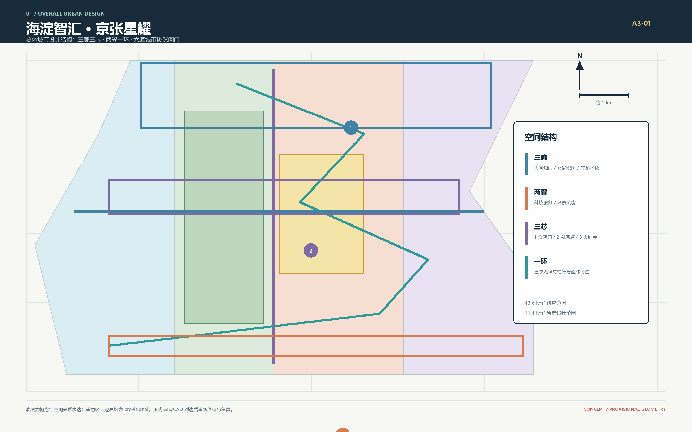
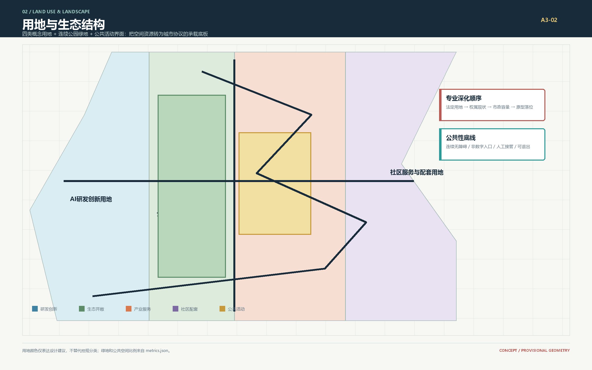
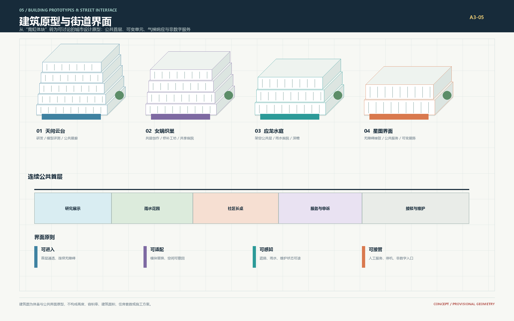
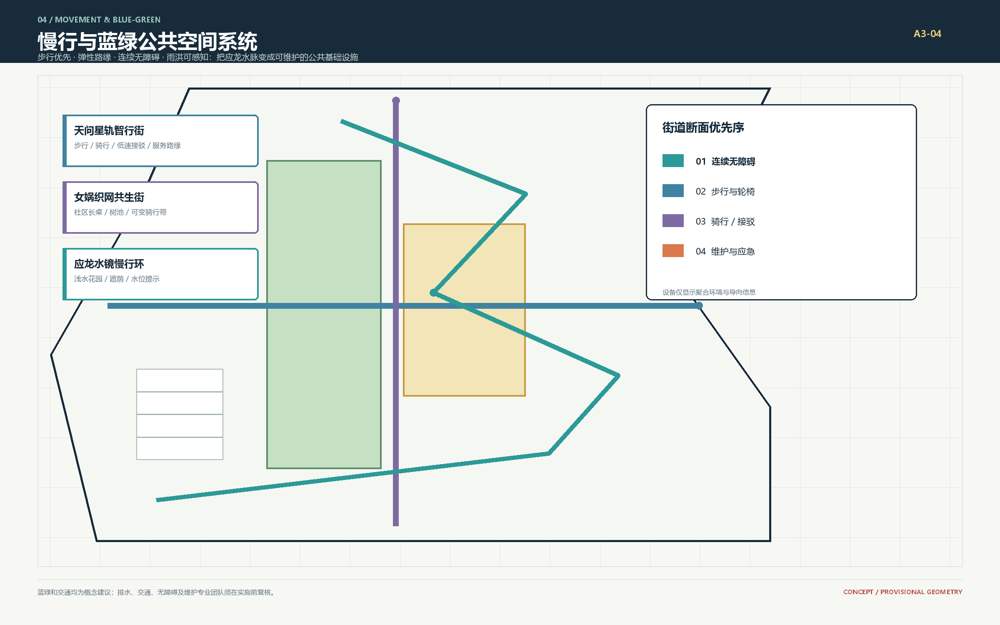
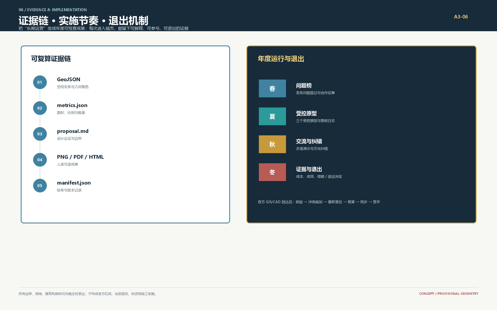

# 海淀智汇·京张星耀：天工星图 AI 城市客厅

> **v1.2 评审摘要：天工星图城市协议** 将每一个进入公共空间的 AI 服务绑定到问题登记、数据许可、空间承载、人工接管、90 日复盘和续期/退出六道门。它不是新增的法定规划，而是把既有“天问、女娲、应龙”三条文化母题转译为可解释、可参与、可暂停、可回滚的实施纪律。[source:AGENT-TASKBOOK] [depth:risk_compliance]

## 设计依据与资料清单

方案把百年京张从交通遗产转译为面向下一百年的公共创新基础设施：AI 不只进入实验室，也应在街道、社区和公园中变得可理解、可选择、可纠错。空间骨架保持为“**三廊三芯、两翼一环**”，以**天问**表达求知与可解释，以**女娲**表达连接与共治，以**应龙**表达顺应水脉的韧性。[source:OFFICIAL-ANNOUNCEMENT] [source:AGENT-TASKBOOK]

当前仓库没有可核验的正式 GIS/CAD 红线、控规、权属、现状建筑、市政容量、生态与文保矢量资料。提交中的 11.4 平方公里范围和三处重点区来自组织方提供的 `provisional_boundaries.geojson`，只用于概念构图、任务分配和本地自检，不作为法定边界、精确面积、拆改留或工程承诺。[source:SITE-PACKAGE] [data:geometry/site_boundary.geojson#SITE-001] [standard:MOHURD-CONTROL-DETAILED-PLANNING]

## 三层范围工作框架

**统筹研究范围（约 43.6 平方公里）**连接海淀北部创新资源、京张科创走廊与城市生活服务，承担产业生态和区域协同研究；**总体设计范围（暂定约 11.4 平方公里）**以三廊网络串联创新、社区和产业界面；**三处重点区域**承接近期可测试、可评估、可退出的空间原型。[metric:site_area_sqm] [metric:key_area_count]

区域协作不是简单“引流”，而是明确互补接口：面向中关村与北纬社区开放模型评测、人才服务和社区议题；与未来科学城、怀柔科学城交换科研成果验证需求；与经开区衔接产品中试和产业化服务；面向京津冀发布跨区域城市问题清单。每项合作先以公开课题、短周期驻留或联合评测启动，待权责、预算与数据协议明确后再扩展。

## 统筹研究范围产业与未来城市研究

**天问知识廊**沿京张记忆与创新资源组织可解释导览、开放研究和多语传播；**女娲织网廊**用公共长桌、可信数据协作和人工复核连接居民、研究者与公共服务人员；**应龙水脉廊**把雨洪花园、遮荫停留、微气候提示和慢行网络组合为可感知的韧性基础设施。三廊连接众智园研发加速、AI 原点社区协作孵化、大钟寺产业体验三芯，并由中关村科技服务翼、小月河场景赋能翼和连续慢行环补全日常服务。[depth:overall_spatial_structure]

五项功能形成闭环：**原始创新**提出问题与模型，**验证转化**提供受控测试，**人才社区**承接居住和交往，**公共体验**建立理解与信任，**城市韧性**让技术服务真实环境。品牌视觉以“京张轨迹为经、海淀创新节点为纬、三颗核心星为记号”构成可缩放的星图标识；中文主标“天工星图”，英文主标 “TIANGONG STAR ATLAS”，避免使用机构商标、神话人物肖像和未经授权字体。

全球案例只转译机制，不复制形态：Kendall Square 的产学公共界面、Station F 的一站式创业服务、Vector Institute 的开放研究网络、Alan Turing Institute 的跨学科协作、Barcelona Supercomputing Center 的公共科学传播、首尔数字媒体城的场景集成，以及可逆公共原型和开源维护社区的版本化协作。对应本方案的落点分别是共享首层、人工服务台、年度问题榜、四方议事会、可解释展廊、受控测试街、90 日试点和星图贡献墙；正式采用前均需本地法规、运营成本与公众影响复核。[data:visual/assets/design-evidence.json#ecosystem_translation]

### 八要素生态图谱与城市协议

土地、空间、产业、资金、人才、算力、数据和场景不是八个孤立资源，而是一个逐级放行的回路：中关村科技服务翼组织要素进入，众智园提出问题并测试模型，AI 原点社区把技术翻译为公共服务，大钟寺完成产品与文化体验，小月河场景赋能翼承接日常使用；每一次转移都必须附带责任人、数据许可和退出条件。资金、招商和政策均为建议性机制，不代表已确定承诺。[data:visual/assets/design-evidence.json#core_mechanism] [data:visual/assets/design-evidence.json#ecosystem_translation]

| 资源环节 | 空间接口 | 放行证据 | 失败时的回退 |
| --- | --- | --- | --- |
| 土地与空间 | 三廊三芯、两翼一环 | 正式底板、权属和容量复核 | 移动或缩减原型 |
| 产业与人才 | 众智园实验星港、科技服务翼 | 公开问题、驻留协议、研究员签署 | 暂停测试、保留人工服务 |
| 算力与数据 | 受控测试环、数据工坊 | 合成/授权数据目录、负荷监测 | 降级为离线演示 |
| 场景与公共价值 | 女娲客厅、应龙水脉界面 | 公众反馈、人工复核、90 日报告 | 退出并公开原因 |

## 总体设计范围城市更新与控规深度城市设计

三条未来街把总体结构落到地面：**天问星轨智行街**组织低速预约接驳、步骑、弹性路缘和低眩光导向；**女娲织网共生街**组合渗透树池、可拆装长桌、无障碍微出行与安静优先路口；**应龙水镜慢行环**连接浅水花园、遮荫构件和可关闭的水位提示。[data:geometry/roads.geojson#ROAD-001] [data:geometry/roads.geojson#ROAD-002] [data:geometry/roads.geojson#ROAD-003]

四类可替换建筑原型分别为：连接研发、模型评测与公共展廊的**天问云台**；围绕共享庭院组织共居创作与修补工坊的**女娲织巢**；以架空公共层、雨水庭院和深檐回应热雨环境的**应龙水庭**；整合无障碍接驳、公共服务和可变展陈的**星图界面**。[data:geometry/buildings.geojson#BLDG-001] [metric:building_footprint_area_sqm]

三条街和四类建筑只是可替换的空间原型，具体断面、消防间距、接驳组织、停车、市政设备和建筑边界，必须由交通、市政、建筑、无障碍和消防团队基于正式资料深化。控规层面只表达混合功能、公共界面和空间连续性的设计意图，不以暂定几何推导法定强度。[depth:renewal_framework]

## 重点区域详细设计

三处暂定 polygon 不作为正式地块，却可以承载明确的功能任务、运营责任和决策门。正式数据到达后，先做空间冲突检查，再把下表项目落到适宜地块；若触碰红线、文保、权属或容量约束，则移动、缩减或取消项目，而不是调整官方边界。[data:geometry/key_areas.geojson#PROV-KEY-001]

| 重点区 / 定位 | 首期空间原型与使用者 | 牵头与协同 | 上线决策门 | 建议成效指标 |
| --- | --- | --- | --- | --- |
| 众智园 / **天问实验星港** | 可预约模型评测台、边端协同演示、安静知识花园；面向研究者、创业团队、学生 | 园区运营方牵头，研究机构、企业安全与公共文化团队协同 | 通过场地消防与承载复核；仅用合成或授权数据；研究员签署测试结论 | 每季度公开问题数、测试完成率、人工复核覆盖率、复用项目数 |
| AI 原点社区 / **女娲织网客厅** | 社区问题工作坊、AI 素养展、可撤展公共长桌；面向居民、长者、青少年、基层服务者 | 社区运营方牵头，居民代表、学校、数据管理员协同 | 无障碍审计通过；明示同意与随时退出；未成年人由教师或监护体系在环 | 参与群体覆盖、无障碍问题闭环率、意见反馈时限、退出机制有效性 |
| 大钟寺 / **应龙水脉界面** | 产品验证、企业服务、京张文化体验、雨洪与低碳移动展示；面向企业、通勤者、访客 | 片区运营方牵头，产业服务、文保、交通与园林团队协同 | 文保影响、排水能力、夜间光环境和客流安全复核通过 | 服务响应时间、步行连续性、雨洪设施可用率、文化内容纠错闭环 |

三个近期试点分别是“模型评测沙盒”“社区共创长桌”“气候感知步行段”。每个试点以 90 天为一个验证周期，形成基线、运行日志、公众反馈、人工复核和退出报告；未达到安全、包容或维护门槛的试点不得转为长期设施。

## AI 创新生态、人才画像与 AI+ 场景

服务对象包括算法研究者、创业产品团队、社区居民与长者、来访学生、公共服务人员、残障慢行者和国际开发者。六类用户画像已经把需求、空间、非数字入口和衡量方法绑定，避免把“公众”当作单一抽象群体；十个场景共同遵循“最小必要数据、清楚说明、用户可退出、人工可接管、结果可申诉”。[data:visual/assets/design-evidence.json#personas]

| 用户画像 | 核心需求 | 空间与非数字入口 | 复核指标 |
| --- | --- | --- | --- |
| 研究者与模型工程师 | 安全评测、可解释证据 | 众智园；人工预约台 | 复核覆盖率、公开问题数 |
| 创业团队与产业服务者 | 中试、合规、市场转译 | 科技服务翼—大钟寺；人工服务窗 | 关闭验证案例数 |
| 居民、长者与低数字素养者 | 能理解、能退出 | AI 原点社区；纸面和人工路径 | 群体覆盖、退出有效性 |
| 儿童、学生与教师 | 安全学习、文化理解 | 记忆廊；教师带领 | 保护事件、学习反馈 |
| 通勤者、残障人士与慢行者 | 连续无障碍移动 | 应龙慢行环；现场求助点 | 路径连续、设施可用 |
| 国际访客与开发者 | 多语语境、开放贡献 | 大钟寺界面；印刷多语指南 | 贡献复用、纠错闭环 |

| 场景 | 空间载体 | 人工与数据边界 |
| --- | --- | --- |
| 模型评测沙盒 | 众智园共享实验台 | 合成/授权数据，研究员复核 |
| 边端协同试验 | 众智园测试环 | 不采集身份，现场管理员可停机 |
| 可信数据协作 | AI 原点数据工坊 | 授权目录，数据管理员审计 |
| 天问无障碍导览 | 知识廊 | 临时偏好，用户确认路线 |
| 女娲织网共创 | 社区公共桌 | 匿名意见，社区主持人复核 |
| 教育伴学体验 | 场景体验廊 | 教师在环，未成年人保护 |
| 健康信息导航 | 社区服务节点 | 不诊疗，转介专业人员 |
| 星图多语讲述 | 京张解释点 | 史料审校，公开纠错入口 |
| 智能出行建议 | 水镜慢行环 | 不执法，用户自主选择 |
| 创业合规助手 | 科技服务翼 | 法务复核，不构成法律意见 |

前三项构成产业测试验证场；其余场景把技术能力翻译为日常公共价值，而不是用屏幕和传感器替代空间设计。[metric:public_space_ratio]

## 用地、建筑规模与拆改留方案

暂定用地分区完整覆盖提交边界，用于验证研发创新、产业服务、公园开敞、社区服务和市政保障之间的功能关系，不是控规调整建议。四类建筑原型的基底面积来自 `buildings.geojson` 投影复算，只表达不同空间界面的相对规模，不代表总建筑面积、可开发强度或产权范围。[data:geometry/land_use.geojson#LAND-001] [metric:building_footprint_area_sqm]

更新策略坚持“先盘点、后判断”：取得建筑年代、结构安全、权属、使用率和历史价值资料后，将对象分为保留维护、功能织补、节能改造、界面开放、条件性置换五类。每个对象都要记录判断依据、责任主体、过渡安置、碳排影响和公众意见；未完成专业普查前，不给出拆除数量、保留名录、容积率、高度或建设规模结论。

正式深化时，先把法定用地、权属和现状建筑作为不可随意改写的底板，再把天问云台、女娲织巢、应龙水庭和星图界面分别落到具备承载条件的位置。若原型与现状保护、消防、市政或公共利益冲突，应缩减、移动或取消原型，不能用概念方案倒推法定条件。[standard:MNR-LAND-USE-CLASSIFICATION-GUIDE]

## 交通、轨道、市政与公共服务设施

网络优先序为步行与轮椅、骑行、低速预约接驳、维护和应急通行。弹性路缘可在接驳、物流、雨洪停留与活动之间按时段切换，但必须保留连续无障碍路径。轨道与公交站点到三芯之间优先修补过街、遮荫、休息和夜间导向断点；低速接驳仅在预约、限速、现场管理和可人工停机条件下运行。[depth:traffic_rail_slow_parking]

算力、能源、通信、给排水和消防只提出“可维护接口+聚合负荷监测+分期复核”，不预设容量。每个试点上线前须完成峰值客流、消防救援、配电负荷、网络安全、雨污排放和设备维护责任核验；任何单项容量不足，都应限制服务规模或推迟上线。公共服务节点必须同时提供人工窗口、无需手机的预约方式和清晰的异常求助路径。[data:geometry/roads.geojson#ROAD-001]

## 蓝绿空间、公共空间与城市风貌

京张记忆廊以经审校的铁路时间线连接创新史；天问知识廊用低亮度、可关闭的星图导视呈现知识；应龙水脉廊让雨洪调蓄、树荫停留和公共活动共享空间。三个地标是用于展陈和运营的概念组件：天工云台承担可解释 AI 展，女娲织网长桌承担公共协作，应龙水脉站台承担多语文化与气候体验；第四个星图贡献墙记录经人工复核的贡献版本，不承诺入选或永久建设。[data:geometry/public_space.geojson#PUBLIC-001] [data:visual/assets/design-evidence.json#landmarks]

### 公共空间组件与荣誉展示

公共空间不依赖一块“大屏”完成智能化，而由六件可替换组件形成低门槛协议界面：协议牌公开用途/责任人/数据边界/到期日，可撤展长桌承载共创，人工服务台提供无手机入口，低眩光星图导视连接历史与场景，雨洪感知节点把维护状态读给公众，贡献版本匣保存经复核的开放成果。[data:visual/assets/design-evidence.json#component_library]

东西缝合通过可撤展长桌、无障碍过街和低眩光导视把铁路两侧的日常活动重新接上；南北贯通通过京张记忆廊、三芯入口和应龙慢行环形成连续公共路线。三座 AI 朝圣地标不以娱乐化造型吸引客流，而以“能解释一项技术、能参与一次协作、能看见一次气候反馈”为到访理由；贡献墙只展示已公开、已授权和已人工复核的版本。[depth:blue_green_public_space] [data:visual/assets/design-evidence.json#landmarks]

### 京张—中关村—AI 新文化三幕叙事

第一幕“人字新轨”讲工程判断与公共责任，第二幕“开放星图”讲中关村的研究、创业和开源协作，第三幕“可回滚城市”讲 AI 进入日常后如何保留人的选择权。导视以轨迹、经纬、三颗核心星和水位刻度组成抽象符号，不仿制历史构件、不使用人物肖像；中文传播句为“让每一次 AI 进入城市，都留下可解释、可参与、可退出的公共证据”，英文为 “Every AI service entering the city leaves public evidence that can be explained, joined, paused, and exited.” [data:visual/assets/design-evidence.json#international_copy] [source:AGENT-TASKBOOK]

公众包容的最低门槛包括：连续无障碍路径、坐凳与遮荫、低眩光和安静时段、儿童与长者可理解的非数字入口、多语和大字信息、无需智能手机的人工服务。任何以识别、评分或画像为前提的公共通行方案均不纳入实施。

蓝绿系统不以装饰绿量为目标，而以连续步行、雨洪调蓄、热舒适和维护可达性为共同绩效。植物选择、土壤渗透、溢流口和水位提示须结合本地实测；夜间信息界面默认低亮度、可关闭，不占用树木生长和避险空间。城市风貌用星轨、经纬和水脉三类抽象线型建立统一导视，但不得仿制历史构件、制造虚假古迹或遮挡真实京张遗存。[data:geometry/green_space.geojson#GREEN-001]

## 更新项目清单、实施政策与分期计划

| 阶段 | 牵头/协同 | 交付物 | 进入下一阶段的决策门 |
| --- | --- | --- | --- |
| 0-6 个月：核验 | 组织方/规划、权属、交通、市政、文保团队 | 正式数据底板、现状审计、冲突清单、公众基线 | 边界来源、坐标、许可和专业意见齐备 |
| 6-18 个月：原型 | 三片区运营方/社区、研究机构、设计团队 | 三个 90 天试点、无障碍审计、伦理与维护手册 | 安全事件闭环、人工复核和退出机制有效 |
| 18-36 个月：连网 | 城市更新实施主体/交通、园林、产业服务 | 三廊连续段、共享服务接口、年度评估 | 资金、运维责任、公共收益和容量复核通过 |
| 3 年后：迭代 | 四方议事会/第三方评估 | 年度问题榜、驻留计划、国际协作、公开报告 | 每年依据成效决定扩展、调整或退出 |

长期运营采用“开发者社区+居民代表+专业顾问+数据治理”四方共议。季度公开问题清单与事件闭环，年度公开维护成本、公共使用、场景效果和退出项目；招商、活动和技术供应商均通过透明规则选择。[data:geometry/phasing.geojson#PHASE-001]

### 四季年度运行图

| 季节 | 建议活动 | 空间载体 | 公共产出 | 牵头建议 |
| --- | --- | --- | --- | --- |
| 春 | 京张记忆与城市问题榜发布 | 京张记忆廊 | 公开问题清单、合作征集 | 文化编辑+四方议事会 |
| 夏 | 开发者驻留与场景开放周 | 众智园—小月河 | 三个受控原型、复核日志 | 园区运营+开发者社区 |
| 秋 | AI 城市客厅国际交流季 | AI 原点—大钟寺 | 多语演示、文化纠错记录 | 社区与片区运营方 |
| 冬 | 年度证据与退出日 | 星图贡献墙 | 运维成本、公共收益、续期/退出记录 | 第三方评估+公众论坛 |

活动品牌、合作主体、预算、招商和国际交流均为概念建议；年度运行图的价值在于把“长期运营”转化为每年可检查的公开产出，而不是承诺活动必然发生。[data:visual/assets/design-evidence.json#annual_operations] [depth:phasing_implementation]

## 指标体系、面积复算与合规矩阵

提交包记录暂定范围面积、建筑原型基底面积和绿地比例；这些值由结构化图层复算，但官方边界缺失使面积和比例只能作为内部一致性指标。[metric:site_area_sqm] [metric:building_footprint_area_sqm] [metric:green_ratio]

公共空间比例和重点区数量用于检查公共界面与任务覆盖，不代表法定控制值。合规矩阵、专业标准矩阵和设计深度矩阵把公告要求对应到正文、图层、指标、图纸和自检项，供评审追溯。[metric:public_space_ratio] [metric:key_area_count] [depth:design_depth_matrix]

正式 GIS/CAD 到达后的替换顺序为：验证来源与坐标系；保留原始文件只读副本；叠加检查边界、道路、权属、文保、生态和市政冲突；重新落位重点区任务；复算全部面积比例；同步更新 GeoJSON、指标、正文、图件、PDF、HTML、矩阵和 manifest 哈希；由规划、交通、市政、建筑、无障碍与消防专业人员签字确认。任何一步未完成，成果继续标记为概念建议。[source:BOUNDARY-SOURCE]

## 风险、版权与合规说明

主要风险包括边界替换导致空间落位变化、权属或文保条件限制项目、市政容量不足、算法输出偏差、数字排斥和长期运维失效。对应措施是可移动原型、专业前置复核、容量门控、人工接管、非数字服务和年度退出评估。版权、素材来源、生成方式和个人数据边界详见 `report/copyright_statement.md`；本方案不构成政府审定、投资承诺或施工依据。[source:SOURCE-REGISTRY]

| 风险与触发条件 | 责任主体 | 响应与关闭证据 |
| --- | --- | --- |
| 正式边界、权属、文保或生态底板与概念落位冲突 | 规划专业牵头，权属与文保团队复核 | 移动、缩减或取消原型；保留冲突图、变更记录和签字意见 |
| 排水、供电、通信、消防或交通容量低于试点需求 | 市政与交通专业牵头，片区运营方配合 | 降低规模、错峰或延期；以容量报告和应急演练关闭风险 |
| AI 输出出现偏差、误导、无法解释或申诉积压 | 场景运营方和数据管理员负责 | 立即人工接管，暂停相关模型；公开事件、纠正与复测记录 |
| 长者、儿童、残障人士或无智能手机者无法平等使用 | 社区运营方和无障碍顾问负责 | 保留人工和非数字路径；以实地审计与代表性用户复测确认 |
| 设施维护成本、供应商锁定或运营责任失配 | 四方议事会和实施主体负责 | 采用可替换接口、公开成本、年度退出评估；未明确责任不续期 |

合规控制贯穿“设计前、上线前、运行中、年度后评估”四个时点。设计前核验来源、边界和专业约束；上线前完成无障碍、数据、消防和容量门；运行中保留人工停机、事件记录与申诉渠道；年度后评估公开公共收益、维护成本和退出项目。三处重点区虽仍是暂定几何，但风险责任已经落实到任务和阶段，不以数据缺口为由降低对公共安全、隐私和包容的要求。[data:geometry/constraints.geojson#CONSTRAINT-001] [depth:risk_compliance]

提交中的图形、网页和图纸均由本包结构化资料派生，不使用外部照片、商标、人物肖像、远程地图或个人数据。神话名称只是文化语义，不构成历史重建或商业角色授权；所有合成图均为概念表达，不得冒充现状观察、法定规划或政府批准。详细著作权、字体、工具与再利用范围在版权说明中逐类登记。[data:visual/assets/design-evidence.json#taskbook_coverage]

## 参考资料

1. 北京市规划和自然资源委员会，《百年京张 AI 创新带城市设计国际方案征集》公告，2026。[source:OFFICIAL-ANNOUNCEMENT]
2. 项目场地包，`brief/site-package/`，2026。[source:SITE-PACKAGE]
3. 《面向全球智能体开展百年京张 AI 创新带城市设计开源征集任务书》，2026。[source:AGENT-TASKBOOK]
4. 住房和城乡建设部，《城市设计管理办法》本地参考快照。[standard:MOHURD-URBAN-DESIGN-MEASURES]

资料使用遵循“权威来源限定事实、结构化文件支撑复算、案例只转译机制”的原则。公告和任务书决定三层范围、必答任务及开放征集语境；场地包提供可用于暂时生成的粗略边界与数据结构；专业规范用于识别需要规划、建筑、交通、市政、无障碍和消防复核的事项。全球案例仅帮助比较运营机制，不作为本地现状、法规或工程参数的来源。

当前资料缺口并未通过网络地图、新闻示意图或推测数据填补。正式 GIS/CAD、控规、权属、建筑普查、市政容量、生态文保和公众基线到达后，应登记来源与许可，替换暂定图层并复算所有指标。此前，图纸中的线、面、节点和面积只能作为概念证据，不能成为审批、征拆、招商或施工依据。[source:SOURCE-REGISTRY] [data:geometry/site_boundary.geojson#SITE-001]

