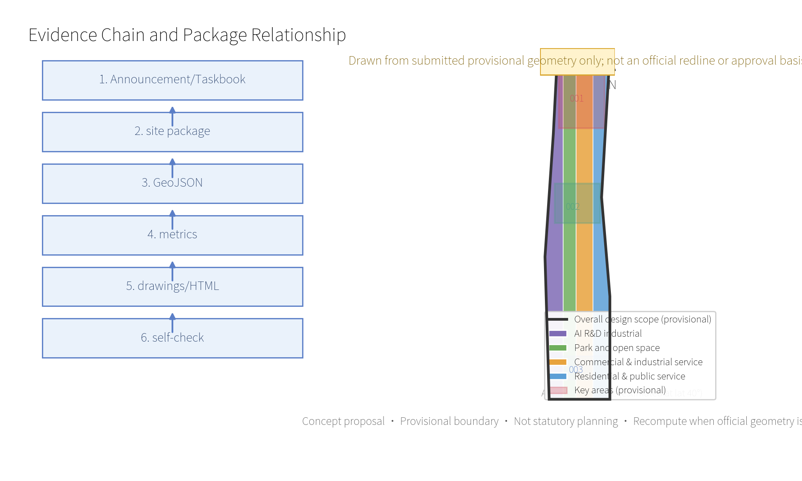
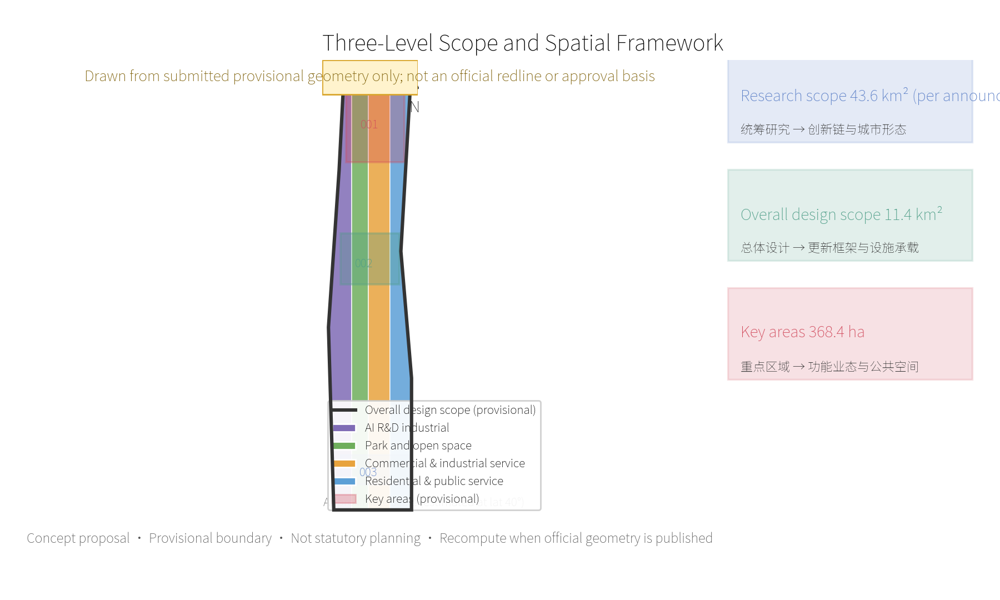
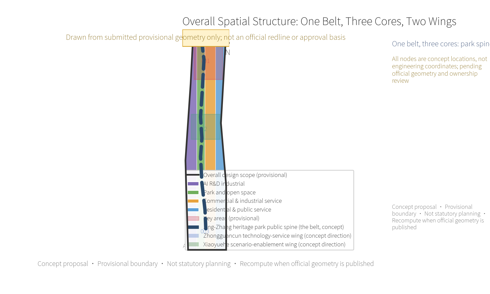
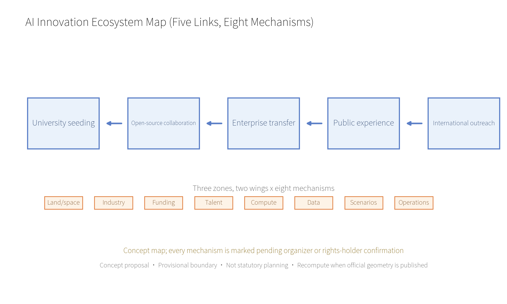
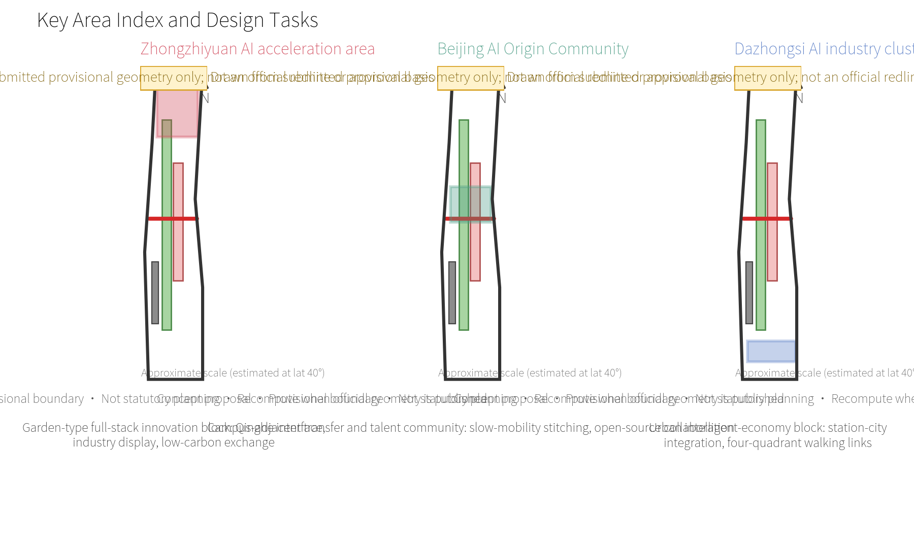
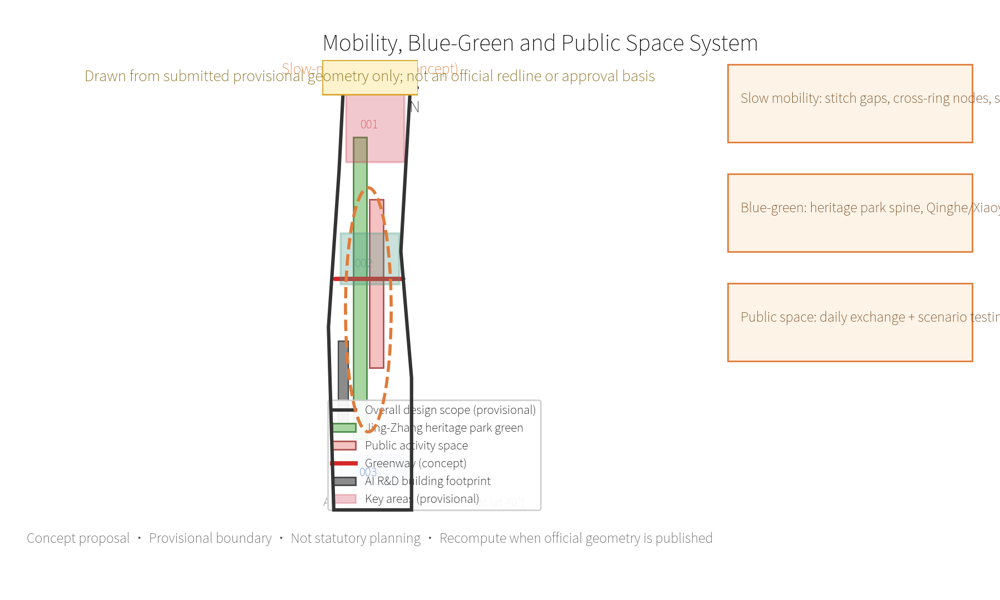
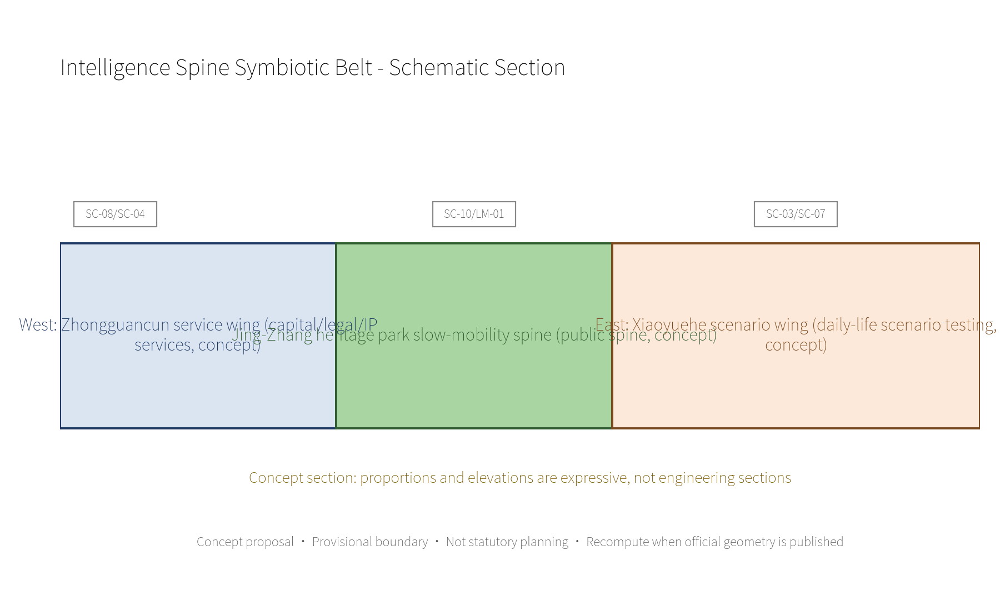
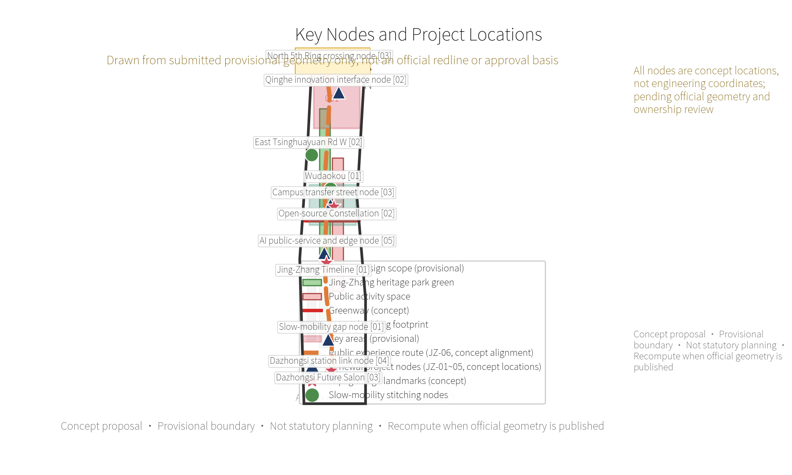
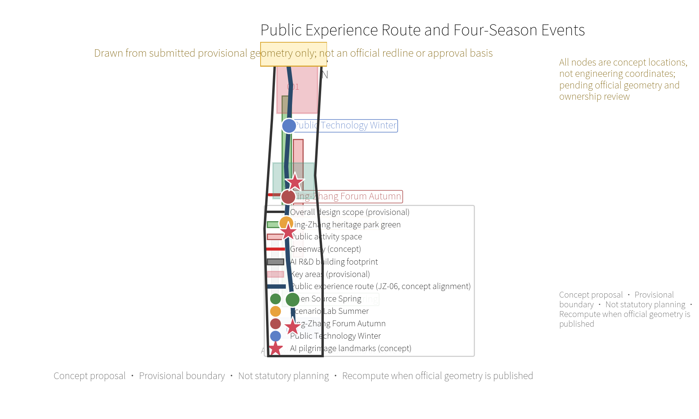
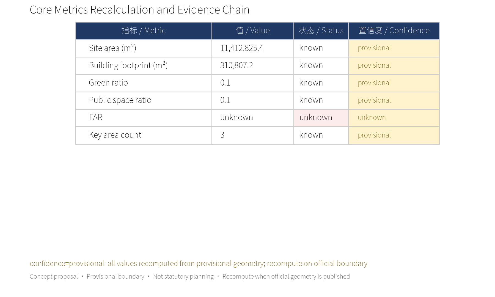

<!-- Participant design package generated by Codex for lizhousheng; all spatial moves remain conceptual and provisional-boundary constrained. -->

# Jing-Zhang Intelligence Spine: An AI Innovation Commons for Everyday Life

Version note: V1.0 sets public accessibility, explainability and reviewability as the common baseline for all later professional deepening.

## Summary: From Innovation Park to Innovation Commons

**Jing-Zhang Intelligence Spine** organizes the "Centennial Jing-Zhang Culture Belt, the Urban AI Life Experience Belt and the AI Convergence Innovation Belt" into an innovation commons that is walkable, learnable, publishable and co-used by residents. It adds no new statutory boundary: with the Jing-Zhang heritage park as the public spine, it weaves Zhongzhiyuan's full-stack innovation, the Beijing AI Origin Community's near-campus transfer and Dazhongsi's international salon, together with the Zhongguancun technology-service wing and the Xiaoyuehe scenario-enablement wing, into a three-zone, two-wing collaborative loop. The visual identity direction takes "two parallel lines plus open nodes" as its motif: the two lines stand for the Jing-Zhang railway and the flow of knowledge; the nodes stand for AI outcomes that the public can see and join.

The proposal's core commitment is to "put people and the public interest into the AI city first". Ten scenario cards cover slow-mobility navigation, accessibility assistance, open-source release, employment and start-up services, low-carbon operation, public learning, cultural interpretation, health and sport, consumption assistance and event safety; every scenario follows data minimization, clear notice, human review, opt-out and non-discrimination. Three industrial test-validation proposals are a safety-governance sandbox, edge-computing/low-carbon coordination and station-city agent services; all of them must obtain professional, safety, data and operational authorization before professional teams deepen them.

Three AI pilgrimage landmarks are proposed: the "Jing-Zhang Timeline" (an open culture gallery in the heritage park), the "Open-source Constellation" (a sustainable contribution wall at the AI Origin Community) and the "Dazhongsi Future Salon" (a changeable public release interface at Dazhongsi station). None depends on personal biometrics or corporate trademarks; all use replaceable, maintainable public-display components. The annual operations proposal forms a cycle of "Open Source Spring, Scenario Lab Summer, Jing-Zhang Forum Autumn and Public Technology Winter", linking international outreach and local benefit through developer contributions, resident feedback, professional review and public retrospectives.

## Design Basis and Source List

This formal proposal takes the *Pre-qualification Announcement for the International Solicitation of Urban Design Proposals for the Centennial Jing-Zhang AI Innovation Belt*, published by the Haidian Branch of the Beijing Municipal Commission of Planning and Natural Resources, as its primary basis, and uses the maintainer-registered provisional coarse boundary, key areas, enums, metrics and source lists in `brief/site-package/` as its machine-readable basis. Before generating the proposal, the AI agent must read `design_brief.json`, `allowed_design_space.json`, `sources.json`, `enums/`, `ranges/`, `schemas/`, `data/source_registry.json` and `data/processed/agent_fact_pack.md`, and use `project_scope_summary.csv`, `agent_task_requirements.csv`, `source_use_matrix.csv` and `missing_data_checklist.csv` to build the task, scope, source-use and gap lists. Every design judgment is split into traceable sources, recomputable metrics, verifiable layers and human-reviewable assumptions. The announcement requires urban-design depth equivalent to a regulatory detailed plan and to a comprehensive implementation plan, so narrative text cannot replace GeoJSON, metric tables, the A3 booklet, the A0 boards and the HTML electronic display.

The proposal is not an independent vision text; it is organized from the announcement, the agent taskbook and the site package. This section only places the most critical basis next to the judgments [source:OFFICIAL-ANNOUNCEMENT] [source:AGENT-TASKBOOK] [depth:existing_conditions_diagnosis]. Complete source and standard coverage is kept in `sources.json`, `standard_matrix.json` and `design_depth_matrix.json` and is not repeated in the body.

The usage boundary of the source registry is as follows [source:SOURCE-REGISTRY]:

- `data/source_registry.json` registers the usage boundary of public, cleared and provisional sources.
- Current registry summary: 7 formal-usable sources, 1 background source, 1 provisional-only source.
- The agent must not upgrade `background_only` or `provisional_only` material into an official boundary, statutory control, formal scoring basis or government implementation commitment.

`data/processed/agent_fact_pack.md` is the reading-navigation layer of this proposal, not a new authoritative source [source:PROCESSED-FACT-PACK]. It helps the agent organize the three-level scope, the three key areas, announcement tasks, agent.1-agent.6, source availability and missing-data items into a readable proposal; factual judgments must still return to the registered original materials [source:OFFICIAL-ANNOUNCEMENT] [source:AGENT-TASKBOOK]. Complete source relations are kept in `sources.json`.

While official `SITE_BOUNDARY` or the three `KEY_AREA` polygons are not yet available, this scaffold generates the temporary formal package from `brief/site-package/geometry/provisional_boundaries.geojson`. `geometry/site_boundary.geojson` and `geometry/key_areas.geojson` in the package must both be marked `provisional_constraint`, `official_boundary=false`; they may be used only for proposal generation, self-check, visualization and design discussion, and must not serve as an official redline, approval basis, precise-area basis or statutory-control conclusion. This organizer data gap does not block content scoring; after official polygons replace the provisional ones, the site boundary, key areas, land use, roads, green space, public space, buildings, phasing and metrics must all be recalculated.

The current scaffold-generated scoring state is: **provisional boundary, precision warnings retained and awaiting recalculation after official data release; does not block content scoring**. Accordingly, spatial structures, scenarios, projects and metrics in the body are written on the principle of "discussable, reviewable, recomputable after official boundaries are replaced"; once official boundary and key-area polygons are updated, the agent must re-run the scaffold, self-check and drawing/HTML generation, not merely replace a single file.

Boundary interpretation can return to the overall-scope layer and area recomputation [data:geometry/site_boundary.geojson#SITE-001] [metric:site_area_sqm]. The three key areas are cross-checked by a separate layer and a count metric [data:geometry/key_areas.geojson#PROV-KEY-001] [metric:key_area_count]. Readers can thus enter the evidence from the body without first reading a chain of machine identifiers.

## Three-Level Scope Working Framework

The proposal organizes work by the three levels fixed in the announcement: the research scope covers the 43.6 km² AI industrial ecosystem, strategic positioning, innovation chain and future urban form; the overall design scope covers the 11.4 km² urban area 1-2 km around the Jing-Zhang heritage park and the industrial zone, requiring an overall urban-renewal framework, industrial spatial layout, transport/municipal support and urban character control; the key-area scope covers the 368.4 ha of three detailed-design districts, requiring functional programs, building scale, retain-renovate-remove classification, public-space connectivity and transport organization. The three levels are mapped item by item in `compliance_matrix.json`, ensuring that announcement items 1.3, 1.4, 1.5 and every mandatory task of agent.1-agent.6 have chapter, layer, metric, drawing and HTML evidence. Note the distinction of figures: 43.6 / 11.4 / 368.4 are announcement-scope figures, while values in `metrics.json` such as site_area_sqm=11,412,825 m² are temporary recomputations from the submitted provisional geometry; the two must not be mixed, and everything is recomputed once official geometry is published.

The depth items of the three-level framework are constrained by [depth:three_level_scope_framework] and [depth:overall_spatial_structure]; spatial evidence follows [data:geometry/site_boundary.geojson#SITE-001] and [data:geometry/key_areas.geojson#PROV-KEY-001]; task basis follows [standard:PROJECT-OFFICIAL-ANNOUNCEMENT]; the scope index is navigated by the three-level scope table in `project_scope_summary.csv` of [source:PROCESSED-FACT-PACK].

The three levels are not a set of disconnected drawings. The research scope decides industrial-chain and urban-form judgments; the overall design turns judgments into renewal projects, spatial structure and facility capacity; the key-area detailed design verifies the implementability of specific parcels, buildings, transport, public space and AI application scenarios. When generating the proposal the agent must first lock the official or provisional boundary and constraints adopted by the current submission, then generate land use, buildings, roads, green space, public space, phasing and AI service nodes, and finally recompute metrics from these layers and explain in the body which conclusions remain limited by the provisional boundary. Any area, ratio, scale or project count that cannot be recomputed from structured data must not be written into formal conclusions.

The proposed overall concept is the "Jing-Zhang Intelligence Spine Symbiotic Belt": the Jing-Zhang heritage park as the historical and public-space axis, Zhongzhiyuan, the Beijing AI Origin Community and Dazhongsi as the three innovation anchors, and universities, enterprises, communities and rail stations as the everyday network, forming a spatial organization of "one belt, three cores, multi-point scenarios and a blue-green slow-mobility composite loop". The "one belt" draws no new redline; it translates the announcement's three levels into a working method. The "three cores" correspond to the three key areas; "multi-point scenarios" correspond to operable nodes of AI + public services, industrial services and urban life; the "composite loop" links slow mobility, green space, public space and activity routes.

| Level | Design question | Proposal answer | Data anchor |
| --- | --- | --- | --- |
| Research scope | How to organize the AI industrial ecosystem and future urban form | Build an innovation chain of "university seeding - open-source collaboration - enterprise transfer - public experience - international outreach" | compliance_matrix.json, standard_matrix.json |
| Overall design scope | How to map industrial space, urban renewal, transport/municipal support and character onto drawings | Land use, buildings, roads, green space, public space and phasing layers jointly express it | [data:geometry/land_use.geojson#LU-001], [data:geometry/roads.geojson#ROAD-001] |
| Key-area scope | How the three districts reach detailed-design depth | Each proposes positioning, spatial moves, AI scenarios and implementation dependencies | [data:geometry/key_areas.geojson#PROV-KEY-001], [data:geometry/key_areas.geojson#PROV-KEY-002], [data:geometry/key_areas.geojson#PROV-KEY-003] |

## Research Scope: Industry and Future-City Study

The core task of the research scope is to build a world-class AI innovation ecosystem. The proposal should inventory Haidian's universities and institutes, leading enterprises, computing/algorithm/data elements, incubation platforms, listed companies, unicorns and technology-service resources, and propose a spatial coordination framework for the AI innovation chain, industrial chain, talent chain and urban service chain. The naming scheme and logo design should serve the overall recognition of the "Centennial Jing-Zhang Culture Belt, Urban AI Life Experience Belt and AI Convergence Innovation Belt", not remain a slogan; they must explain the links with the industrial ecosystem, public space and cultural resources. The agent taskbook also requires responding to the "five functions" and "three zones, two wings" coordination, forming a naming system, visual identity, overall spatial-structure diagram, scenario opening and operating mechanism that can be further deepened. This section must use [source:AGENT-TASKBOOK] and [standard:PROJECT-AGENT-OPEN-CALL-TASKBOOK] to mark that these requirements come from the agent open-call taskbook, not from statutory planning controls.

The research scope adds no pseudo-precise redlines; through the urban character, public space and building-layout coordination required by [standard:MOHURD-URBAN-DESIGN-MEASURES], it reconnects [data:geometry/land_use.geojson#LU-001], [data:geometry/public_space.geojson#PUBLIC-001] and [depth:overall_spatial_structure], showing that industrial strategy must finally land in a visible, reviewable spatial structure.

### Naming System and Visual Identity (Logo/VI) Direction

The naming system proposal translates "the belt" into a name family usable by residents, enterprises and international visitors alike. All are concept proposals, not trademark registrations or government naming commitments:

| Level | Chinese name (proposed) | English name (proposed) | Use context |
| --- | --- | --- | --- |
| Belt master name | 京张智脉 | Jing-Zhang Intelligence Spine | Submission and overall narrative |
| Public-space motif | 智脉共生带 | Intelligence Spine Symbiotic Belt | Spatial-structure diagrams, public wayfinding |
| Three-core series | 智园、智源、智钟 (Zhongzhiyuan / Origin / Dazhongsi cores) | Zhiyuan / Zhiyuan-Origin / Zhizhong nodes | Key-area signage and event brands |
| Event brand | 四季智脉 | Four Seasons of the Spine | Open Source Spring, Scenario Lab Summer, Autumn Forum, Public Technology Winter |

The visual identity direction takes "two parallel lines plus open nodes" as its motif: the two lines stand for the Jing-Zhang railway's historical track and the continuously flowing knowledge stream; the open dots on the lines stand for AI outcomes the public can see, join and verify. The proposed color system is "rail-memory blue (#2A4A6B)" with "commons green (#4C8C4A)" and neutral grays; the type direction prefers open, embeddable fonts (e.g. Noto Sans SC / Source Han Sans) and forbids unauthorized fonts. Application rules: the logo may only appear together with the "concept proposal" label; no corporate trademark, portrait or uncleared graphic may be used; official naming and trademark matters remain with the organizer or rights holders. This direction satisfies the agent.1 visual-identity requirement of [standard:PROJECT-AGENT-OPEN-CALL-TASKBOOK]; concrete graphic development is left to a professional branding team.

Future urban-form study should answer how AI changes work, life, social interaction, learning, transport and public services. The proposal should land AI transport systems, continuous green space, innovation service facilities and an international living/working atmosphere in locatable functional zones, nodes, corridors and scenarios, not generic technology visions. The agent should write industrial-strategy metrics, an AI innovation index, talent density, spatial supply types and AI + vertical application key areas into the indicator system, and mark which are official, which are design proposals and which still await formal-data calibration. Where global AI innovation events, developer communities, open scenarios or pilgrimage routes are proposed, they must be written as "concept proposal / reference scheme / for professional deepening", not as confirmed government events or implementation arrangements.

Global AI innovation ecosystem cases (agent.2 requires 5-8). All cases below are publicly verifiable facts, used only for background comparison and mechanism reference; they declare no partnership with any institution. Figures follow the source pages; unverified business numbers are not cited:

| Case | City | Verifiable facts | Lessons for Jing-Zhang | Source |
| --- | --- | --- | --- | --- |
| Station F | Paris | Former freight hall (Halle Freyssinet, a listed building) converted into the world's largest startup campus, about 34,000 m², with an AI-focused incubation program | Railway-heritage building translated into innovation public space; joint incubation by corporates and universities | stationf.co |
| Kendall Square | Cambridge (Boston) | One of the world's densest innovation districts around MIT; the Kendall Square Initiative mixed research, graduate housing, retail and a museum with planning approval | University-anchored mixed innovation-living-public block; public hearings and community-fund mechanism | news.mit.edu |
| MaRS Discovery District | Toronto | A former hospital heritage building converted into one of North America's largest urban innovation centres, anchored by universities, hospitals and government | Heritage reuse plus public-institution anchoring; support for social-mission ventures | marsdd.com |
| Punggol Digital District | Singapore | About 50 ha smart district where the business park merges seamlessly with the Singapore Institute of Technology campus; Open Digital Platform as the district digital backbone; district-level smart grid | District-level digital backbone with low-carbon energy coordination; seamless industry-academia layout | jtc.gov.sg |
| King's Cross | London | Railway lands and gasworks regenerated into a knowledge quarter hosting Google DeepMind, the Alan Turing Institute and others; Knowledge Quarter run jointly by public institutions | Railway-corridor regeneration and international AI cluster; joint public governance of the knowledge quarter | ucl.ac.uk / kingscross.co.uk |

Ecosystem mechanism proposals (land, space, industry, funding, talent, computing, data, scenarios) are all concept proposals marked "pending organizer or rights-holder confirmation"; they are not policy commitments:

| Mechanism | Concept proposal | Preconditions to confirm |
| --- | --- | --- |
| Land and space | Release heritage and low-efficiency spaces in batches by "reversible retrofit + public use first" | Ownership, regulatory plan, heritage and safety |
| Industry | Five-link chain: university seeding - open-source collaboration - enterprise transfer - public experience - international outreach | Industry catalogue and statistical definitions |
| Funding | Public funds leverage social capital; no investment amounts or fiscal commitments are set | Funding sources and policy authorization |
| Talent | Campus-adjacent transfer street, talent stations and a young-developer community | Campus boundaries and service standards |
| Computing | Edge-compute nodes with low-carbon energy coordination; removable prototypes first | Energy capacity and fire conditions |
| Data | Data minimization, public sources, human review for public data use | Compliance and authorization mechanisms |
| Scenarios | Scenario open days and reversible test slots with public rules, booking and retrospectives | Site permits and safety review |
| Operations | Annual four-season events + developer operations + scenario opening + conversion paths (see operations ledger) | Public-space permits and responsible parties |

Regional coordination (all items are **proposals**, not confirmed arrangements; factual background may be cited only after an approved formal source confirms it):

| Coordination target | Proposed resource interface | Proposed activity channel | Proposed outcome transfer | Data boundary and responsible-party types |
| --- | --- | --- | --- | --- |
| Beiwai and surrounding communities | Community service stations and shared public space | Open seats at four-season events, resident observers | Scenario feedback enters annual revision | Aggregated data only; community organizations and territorial management bodies |
| Future Science City | Energy and low-carbon technology exchange | Proposed autumn-forum professional track | Mutual learning on edge-compute low-carbon synergy | No project-level data sharing; park management bodies |
| Huairou Science City | Big-science-facility outreach content | Proposed joint winter public-technology exhibition | Outreach and public-learning content transfer | Content used only after rights clearance; research institutions |
| Beijing E-Town | Smart-terminal and robotics display cooperation | Proposed joint Open Source Spring showcase | Proposed scenario-opening catalogue exchange | Enterprise data stays outside this proposal; park and enterprise management |
| Beijing-Tianjin-Hebei regional institutions | International-outreach and talent-channel information sharing | Proposed international visitor route linkage | Forum outcomes deposited publicly | Public information only; regional cooperation bodies |

## Overall Design Scope: Urban Renewal and Regulatory-Plan-Depth Urban Design

The overall design scope must reach urban-design depth equivalent to a regulatory detailed plan. The proposal must present an overall urban-renewal spatial structure, low-efficiency space identification, a renewal project list, implementation policy suggestions, industrial function ratios, spatial organization patterns, total building volume and comprehensive carrying-capacity assessment. `geometry/land_use.geojson` should cover the design boundary completely without overlap; `geometry/buildings.geojson` should express renewed or retained building footprints; `geometry/roads.geojson` should express micro-circulation, slow-mobility and rail transfer relations; `metrics.json` should recompute core areas, ratios and layer counts.

This section splits regulatory-plan-depth content into reviewable objects per [standard:MOHURD-CONTROL-DETAILED-PLANNING]: [data:geometry/land_use.geojson#LU-001] expresses the land-use structure, [data:geometry/buildings.geojson#BLDG-001] expresses building footprints, [data:geometry/roads.geojson#ROAD-001] expresses transport organization, [metric:building_footprint_area_sqm] cross-checks building footprint area, and [depth:land_use_layout] with [depth:development_intensity_controls] constrain the depth of the outcome.

The overall design must also support transport, rail, municipal and supporting facilities. The proposal should propose spatial layout and implementation paths around rail-station integration, road micro-circulation, non-motorized parking, parking supply, innovation service platforms, talent life services, new infrastructure, distributed energy and edge computing. Content involving building height, development intensity, road redlines, setbacks and facility standards must be written as "pending official regulatory confirmation" when no official control conditions exist; agent guesses must not be passed off as approved indicators.

## Key-Area Detailed Design

Key-area detailed design is mandatory. The Zhongzhiyuan AI autonomous-innovation acceleration area should be detailed around the national AI platform, full-stack autonomous innovation, standards-making, safety governance, industry display, external transport, Qinghe culture, a low-carbon green innovation exchange environment and green-space AI scenarios. The Beijing AI Origin Community should be detailed around near-campus innovation, incubation transfer, a talent zone, the open-source system, brand events, retain-renovate-remove, result display and release, residential support, campus-park slow-mobility links and rail-station integration. The Dazhongsi AI industry cluster should be detailed around leading enterprises, agents, smart terminals, content consumption, data elements, digital assets, commercial services, composite use of planned green space, Dazhongsi station integration and four-quadrant walking connectivity at the intersection.

The three key-area detailed designs must cite [data:geometry/key_areas.geojson#PROV-KEY-001], [data:geometry/key_areas.geojson#PROV-KEY-002] and [data:geometry/key_areas.geojson#PROV-KEY-003], and be checked by [depth:three_key_area_detailed_design] for comprehensive-implementation-plan depth. Describing only "building a demonstration zone" without functional, building, transport, public-space and implementation-project evidence is incomplete.

The three key areas must appear in `geometry/key_areas.geojson`. If the repository has supplied official polygons, they should be used as `official_constraint`; if official polygons are missing, `provisional_constraint` may be used temporarily, but the body, HTML, sources, assumptions and self_check must state that it cannot serve as a formal scoring or approval basis. `compliance_matrix.json` should cover announcement items 1.5.3.1, 1.5.3.2 and 1.5.3.3 separately. The design expression should include functional programs, building scale, building form, retain-renovate-remove classification, the public-space system, transport organization, slow-mobility connectivity and implementation projects. The HTML page should switch between the three key areas; the A3 booklet and A0 boards should at least contain key-area general plans, local detail plans and metric notes.

| Key area | Design positioning | Spatial moves | AI industrial and operating scenarios | Evidence citations |
| --- | --- | --- | --- | --- |
| Zhongzhiyuan AI autonomous-innovation acceleration area | Garden-type full-stack autonomous-innovation block | Strengthen the Qinghe interface, industry display, low-carbon innovation exchange and external transport organization; carry open testing and standards-governance display on green space | Autonomous-model testing, standards-making workshops, safety-governance display, low-carbon computing experience | [data:geometry/key_areas.geojson#PROV-KEY-001], [depth:three_key_area_detailed_design] |
| Beijing AI Origin Community | Campus-adjacent transfer and talent community | Stitch campus, park and block slow mobility; fill in result release, talent service, residential life and open-source collaboration space | Open-source community, result release, talent-zone services, near-campus incubation | [data:geometry/key_areas.geojson#PROV-KEY-002], [source:AGENT-TASKBOOK] |
| Dazhongsi AI industry cluster | Urban intelligent-economy and international-exchange block | Around Dazhongsi station integration, four-quadrant walking connectivity, commercial services and public-environment renewal for key enterprises | Agent and smart-terminal display, content consumption, data elements and international roadshows | [data:geometry/key_areas.geojson#PROV-KEY-003], [metric:key_area_count] |

## AI Innovation Ecosystem, Talent Personas and AI + Scenarios

The proposal should build spatial-demand personas for AI talent and enterprises, covering R&D offices, open-source collaboration, result release, enterprise services, talent housing, social learning, consumer life, sport/leisure and international exchange. AI + scenarios should follow the transport, services, consumption, healthcare, education, legal and life-service directions raised in the announcement, forming industrial-development scenarios and AI-empowered urban-function scenarios. Every scenario should state its service users, spatial location, data source, privacy boundary, human-review mechanism and operator.

AI scenarios must land in spatial and governance boundaries: public-space scenarios cite [data:geometry/public_space.geojson#PUBLIC-001], slow-mobility and transport scenarios cite [data:geometry/roads.geojson#ROAD-001], open-space scenarios cite [data:geometry/green_space.geojson#GREEN-001] and [metric:public_space_ratio], [metric:green_ratio]. These citations show reviewers that scenarios are not slogans but design objects located in concrete layers and metrics. The agent taskbook requires no fewer than 10 AI scenario cards, no fewer than 3 industrial test-validation scenarios and no fewer than 5 user personas; the scaffold only gives the structure, and the formal participant must write the scenario cards, persona table, privacy boundaries, human review and operators into the body, HTML, A3/A0 and the compliance matrix.

| Persona | Typical needs | Spatial response | Self-check boundary |
| --- | --- | --- | --- |
| Open-source developer | Release, collaboration, testing, community reputation | Origin Community open-source release hall, public code wall, night collaboration space | No personal behavior-trajectory collection; activity data aggregated only |
| Start-up team | Low-cost offices, computing access, product testbed | Zhongzhiyuan shared test field, edge-compute service point, standards-governance consultation | Computing and data services require separate authorization |
| Leading-enterprise visitor | Display, business, international reception, talent recruitment | Dazhongsi international roadshow salon, rail-station transfer, public space around key enterprises | Enterprise logos and case content must be rights-cleared |
| Nearby resident | Commuting, leisure, community services, low-disturbance renewal | Jing-Zhang heritage park slow-mobility loop, embedded community services, night lighting and activity grading | Resident profiles are not used for commercial recommendation |
| University student and teacher | Result transfer, cross-campus collaboration, daily slow mobility | Campus-park slow-mobility stitching, transfer stations, AI education experience points | Campus data and research results require authorization |
| Elderly and low-digital-skill residents | Large-type wayfinding, human assistance, offline fallback, dignified service | Staffed service desks at the three cores, paper notices, voice assistance | No registration or app download required; no identity traces kept |

| Scenario card | Users and space | Trigger and AI assistance scope | Human responsibility and minimal data | Metrics, degradation and exit |
| --- | --- | --- | --- | --- |
| SC-01 Station accessibility guidance | Elderly residents; three core entrances and service stations | Large-type wayfinding and accessible-route suggestions on arrival/help request | On-site staff review; only immediate origin/destination and accessibility preference, no identity traces kept | Help completion rate, human wait time; offline signs and staff escort as substitutes, stop at any time |
| SC-02 Obstacle detection and detour tips | Persons with disabilities; the walking spine | Detects registered temporary obstacles and suggests detours | Facility maintainer confirms; public facility state only, no biometrics | Obstacle closure time; stale data shows "pending human confirmation" |
| SC-03 Child-safe activity sessions | Children and carers; community living rooms | Non-screen activity sessions, quiet zones, safe assembly points | Activity administrator; no child profiles collected | Family satisfaction, complaint closure; paper notices are the default fallback |
| SC-04 All-user staffed service desk | Low-digital-skill and non-smart-terminal users; service desks | One-tap human transfer, paper queue numbers, voice/face-to-face assistance | Service desk lead; no registration or app download required | Human reachability rate; full offline switch when systems fail |
| SC-05 Night safe-route tips | Night commuters; station-city walking routes | Safer-route tips from public lighting, construction and event information | Duty staff confirm anomalies; public environment state only | Response time, lighting repair closure; no personal risk prediction or tracking |
| SC-06 Public test booking | Students and developers; Zhongzhiyuan test garden | Reversible public test slots with published rules | Site administrator plus ethics/safety review; booking and test version only | Review pass rate, public feedback; suspension on complaint or safety incident |
| SC-07 Public-space repair and suggestions | Residents and maintainers; public space | Repair reports, thermal-comfort and seating/shade suggestions | Municipal/property category lead reviews; issue location and description only | First response and closure rates; resident requests are not ranked by profiles |
| SC-08 Start-up service referral | Start-up teams; Origin transfer street | Public IP, legal and financing service entry points | Service agency human consultation; no trade secrets uploaded | Referral completion rate; no automated investment/credit decisions |
| SC-09 Roadshow salon crowd tips | Visitors and merchants; Dazhongsi roadshow salon | Reviewable event schedule, accessibility and crowd tips | Event organizer; aggregated crowd data only | Crowding-tip accuracy, complaint rate; no face recognition or individual tracking |
| SC-10 Public-service pledge wall | Everyone; the public-service pledge wall | Shows data purposes, human responsibility, appeal and opt-out paths | Public-service supervisor; anonymous feedback only | Public response cycle, opt-out success rate; viewable and appealable without login |

| Industrial validation scenario | Preconditions | Reversible scope and professional gates | Evaluation and stop conditions |
| --- | --- | --- | --- |
| VS-01 Trusted AI public-service sandbox | Site permit, published rules, privacy impact assessment, human lead | Time/place-limited; starts only after safety, data, accessibility and operational review | Immediate suspension if complaints stay open, human takeover fails or safety risks appear |
| VS-02 Edge-computing low-carbon coordination | Energy capacity, fire, equipment and noise verified | Removable prototypes only; engineering, energy and fire review | Offline if energy/heat/noise thresholds fail or maintenance becomes unreachable |
| VS-03 Station-city service coordination | Station operator permit, traffic organization and accessibility conditions | Information and wayfinding pilots only; no traffic-organization changes or enforcement decisions | Stop on wrong guidance, accessibility complaints or permit withdrawal |

AI governance suggestions generated by the agent must obey data minimization, public sources, explainability and human review. Urban agents may assist in identifying slow-mobility gaps, public-space heat, facility maintenance, enterprise-service demand and event-safety risk, but they cannot replace planning approval, cannot output unauthorized personal profiles, and cannot claim official implementation commitments. All AI scenario nodes should enter structured layers or the compliance matrix so reviewers can see their relation to industry, space and the public interest.

## Land Use, Building Scale and Retain-Renovate-Remove Plan

The land-use plan should follow public standards such as territorial-space survey, planning and use-control classification, forming complete, closed, seamless land-use zones. The building plan should distinguish retained, renovated, renewed, new or to-be-confirmed objects, and clarify the suggested levels of footprint, function, scale, character, roof, volume and height control. Without existing-building, ownership, regulatory-plan and engineering conditions, the proposal can only state methods and a to-be-calibrated checklist; it must not fabricate retain-renovate-remove conclusions.

Land-use classification follows [standard:MNR-LAND-USE-CLASSIFICATION-GUIDE]; building height, massing, interface and character control are managed by [depth:height_massing_character]; the retain-renovate-remove method is managed by [depth:retain_renovate_demolish]. The main evidence of land use and buildings is [data:geometry/land_use.geojson#LU-001], [data:geometry/buildings.geojson#BLDG-001] and [metric:building_footprint_area_sqm].

Building scale and intensity metrics must be consistent with `metrics.json` and the layers. Where total building volume, FAR, building height, building density, green ratio, setbacks and building control lines lack official conditions, `status=unknown` should be used uniformly, with the missing conditions, current assumptions and the recompute path after official data described in `reason` / `assumptions`; fixed numbers must not be used to manufacture precision. The A3 booklet should give the renewal project list and metric cross-check tables; the A0 boards should express the key spatial structure and key areas clearly; the HTML page should provide metric and layer linkage viewing.

## Transport, Rail, Municipal and Public-Service Facilities

The transport plan should respond to the announcement's requirements on rail-station integration, road micro-circulation, slow-mobility gaps, external transport, parking, non-motorized parking and the green transport system. Emphasis should cover the North 5th Ring Road, the heritage-park cross-ring nodes, Wudaokou, East Tsinghuayuan Road West, Dazhongsi station and the transport links around key enterprises. Road and slow-mobility layers must stay inside the submitted boundary and be cross-checked with public space, green space, industrial nodes and key areas; if the submitted boundary is provisional, transport conclusions can only be temporary design discussion.

Transport and municipal professional depth are constrained by [depth:traffic_rail_slow_parking] and [depth:municipal_new_infrastructure]; layer evidence cites [data:geometry/roads.geojson#ROAD-001], [data:geometry/public_space.geojson#PUBLIC-001] and [data:geometry/constraints.geojson#CONSTRAINTS]. When road redlines, utilities, fire and municipal conditions are missing, they should be stated as to-be-supplied through assumptions, not written as approved conditions.

Municipal and public-service facilities should cover AI industrial-service facilities, innovation service platforms, talent life-service facilities, new infrastructure, distributed energy, edge computing and the integration of traditional municipal facilities. The proposal should state facility standards, spatial layout, service radii, operating models and phasing logic. Where utility, energy, drainage, flood-control and fire-engineering data are missing, they must be listed as preconditions for formal deepening.

## Blue-Green Space, Public Space and Urban Character

The blue-green plan should use the Jing-Zhang heritage park vitality belt as its skeleton, coordinate Qinghe, Xiaoyuehe and the travel demand of surrounding universities, enterprises and communities, and propose north-south through and east-west connected walking, cycling and green-space systems. The proposal should identify slow-mobility gaps, cross-ring nodes, and the park's south-end and north-end landscape nodes, and propose composite-use strategies for parking, sport, innovation exchange, technology testing, application display and public services.

Blue-green public space is jointly checked by the design-depth items and the green/public-space layers [depth:blue_green_public_space] [data:geometry/green_space.geojson#GREEN-001] [data:geometry/public_space.geojson#PUBLIC-001]. Green and public-space ratios are explained in design terms in the body; complete recomputation is kept in `metrics.json`; the coordination of urban character, public space and building control returns to the professional standard matrix [standard:MOHURD-URBAN-DESIGN-MEASURES].

The urban-character plan should fuse Jing-Zhang railway history, Zhongguancun innovation culture and AI innovation culture, use cultural resources such as Tsinghuayuan Railway Station and the Beijing Film Academy, and propose the urban tone, building character, roof forms, massing, interfaces and public-art guidance. The agent should also propose wayfinding signage, cultural symbols, international-outreach narrative, AI pilgrimage landmarks, contribution walls or honor-display systems, but all brands, fonts, images, portraits and enterprise logos must have rights-cleared sources. Character control must distinguish official controls, design suggestions and to-be-confirmed conditions; pseudo-precise control lines without heritage or regulatory-plan evidence are strictly forbidden.

## Renewal Project List, Implementation Policy and Phasing

The implementation plan should form a reviewable renewal project list stating project location, type, function, responsible parties, dependency conditions, implementation phase, risks and evaluation metrics. Policy suggestions should cover coordinated urban-renewal implementation, space supply, operating mechanisms, industrial services, public participation, data governance and property-right coordination. `geometry/phasing.geojson` should express phasing ranges, and `compliance_matrix.json` should attach every task to phasing and drawings.

The project list and phasing depth are managed by [depth:renewal_project_list] and [depth:phasing_implementation]; the spatial evidence of phasing is [data:geometry/phasing.geojson#PHASE-001]. Without ownership, funding, implementing parties and approval paths, the proposal must write them as implementation risks, not implementation commitments.

| Project | Proposed responsible-party types | Preconditions and deliverables | Maintenance, public feedback and stop conditions | Evidence citations |
| --- | --- | --- | --- | --- |
| JZ-01 Heritage park slow-mobility gap stitching | Transport/park management, professional design team | Road redlines, under-bridge space, accessibility review; route and node concept drawings | Quarterly inspection, on-site feedback; no implementation without safety review | [data:geometry/roads.geojson#ROAD-001] |
| JZ-02 Zhongzhiyuan Qinghe innovation interface | River/park management, community, ecology team | Blue-line, flood-control and ecology conditions; reversible activities and waterfront service concepts | Rainy-season review, ecology monitoring; withdrawn if flood control or ecology is affected | [data:geometry/green_space.geojson#GREEN-001] |
| JZ-03 Origin Community campus-adjacent transfer street | Property/campus/block bodies, service agencies | Ownership, ground-floor programs, fire safety; service catalogue and walking-interface proposals | Monthly merchant/resident feedback; no retrofit without permits | [data:geometry/buildings.geojson#BLDG-001] |
| JZ-04 Dazhongsi station four-quadrant walking links | Station/road management, accessibility team | Station permit, intersection signals, utilities; accessible routes and wayfinding prototypes | Peak observation, complaint closure; offline if misleading guidance or safety risk | [data:geometry/public_space.geojson#PUBLIC-001] |
| JZ-05 AI public-service and edge-compute nodes | Public-service operator, energy/safety team | Equipment, energy, network, data and fire review; removable service nodes | Public maintenance list; stop if human takeover fails or energy is abnormal | [data:geometry/constraints.geojson#CONSTRAINTS] |
| JZ-06 Global AI event-week public route | Community organizations, event organizers, public-space managers | Site permits, rights list, accessibility and safety plans; route and instructions | After-event retrospectives; not renewed if complaints or safety issues stay open | [data:geometry/phasing.geojson#PHASE-001] |

The concept locations of key nodes, landmarks and operating nodes are matched item by item with the project list via the node-location diagram; all are marked as concept locations, not engineering coordinates, and will be placed into formal layers after official geometry and ownership review.

Phasing should be distinguished from the 100-day solicitation design period: the solicitation period is the time requirement for submitting outcomes; implementation phasing is the advancement path of urban renewal and project construction. The proposal should state a near-term pilot, mid-term renewal and long-term governance framework, and mark which content can start with lightweight facilities, operations and service platforms, and which must await formal regulatory-plan, municipal, transport and ownership conditions. For the annual event system, developer-community operations, scenario open days, public experience routes and the international-outreach mechanism, the body should state the operating objects, frequency, responsibility boundaries, transfer paths and risks, not just slogans.

### Landmarks, Wayfinding and Operations (agent.4-agent.6 Summary)

The three AI pilgrimage landmarks, the honor display and the public-space component library (agent.4) are modular public-display concepts; all use replaceable, maintainable components and rely on no personal biometrics or corporate trademarks:

| Landmark (concept) | Location | Display content and mechanism | Limits and preconditions |
| --- | --- | --- | --- |
| Jing-Zhang Timeline | Jing-Zhang heritage park open culture gallery | Dual-axis exhibition of railway memory and AI timeline, replaceable panels + public curation | Heritage and park-management conditions; all content sources registered and cleared |
| Open-source Constellation | AI Origin Community contribution wall | Honor display of open-source contributors; public nomination + human review + withdrawal | Contributor attribution consent; no unpublished personal data |
| Dazhongsi Future Salon | Dazhongsi station-city changeable release interface | Changeable release screens + roadshow salon + four-quadrant wayfinding linkage | Station operator permit; no traffic-organization changes |

Honor display system: public nomination - fact review - regular update - appealable and withdrawable. Component library: six generic components (display panels, seating, shading, wayfinding, information screens, movable test benches) with unified materials and accessibility specifications; any brand mark may be used only after rights clearance.

Cultural resources, wayfinding symbols and international outreach (agent.5): the cultural narrative anchors on public cultural points such as Tsinghuayuan Railway Station and the Beijing Film Academy, forming a three-line story of "historical track - innovation scene - public release"; the wayfinding system shares the "double line + open nodes" motif with the belt VI, but the cultural signage system and the belt master logo system are managed separately; the international-outreach working copy uses "Where rail memory meets open AI" (concept proposal), and all outreach wording states only public facts and concept proposals, never exaggerating government commitments or event outcomes.

Annual events, developer operations, scenario opening and conversion paths (agent.6) are proposed below; all are concept proposals, not confirmed arrangements:

| Operations item | Frequency and audience | Responsibility boundary | Conversion path | Risk and stop conditions |
| --- | --- | --- | --- | --- |
| Open Source Spring | Annual; universities, open-source communities, developers | Organizer handles venue and rights clearance; community sets the agenda | Contributors enter incubation/employment service lists (with consent) | Not renewed if rights or safety complaints stay open |
| Scenario Lab Summer | Annual; residents, students, start-ups | Scenario owner + ethics/safety review | Pilot outcomes enter the scenario-opening catalogue | Suspension on safety incidents or privacy complaints |
| Jing-Zhang Forum Autumn | Annual; professional teams, enterprises, international visitors | Jointly organized by professional institutions | Outcomes enter the international-outreach material library | No unverified commitments may be published |
| Public Technology Winter | Annual; all citizens | Public-space manager + curators | Public feedback enters next year's scenario-card revision | Not held if accessibility and emergency conditions fail |
| Developer community operations | Continuous; registered developers | Community charter + code of conduct + human moderators | Contributors advance to maintainers/lecturers/reviewers | Charter enforcement is public and appealable |
| Scenario opening operations | Continuous; permitted scenarios | Scenario lead + data-minimization audit | Open scenarios generate enterprise-service and investment leads | Scenario closes if audits fail |
| Public experience route | Continuous; residents and visitors | Route operator + safety plan | Route feedback enters the slow-mobility gap repair list | Not activated if safety or disturbance complaints stay open |

Public-participation feedback-loop metrics (concept proposal, to be calibrated in operations): channels cover on-site comment desks, paper inquiries, online forms and anonymous boxes, with no registration required; targets are acceptance within 5 working days and a public resolution reply within 30 days; aggregated feedback statistics are published quarterly; annual event and scenario-card revisions publish an "adopted-feedback list of the previous year"; complaint closure rate, response timeliness and opt-out success rate are the three base metrics, and no request may ever be ranked or filtered by user profiles.

## Indicator System, Area Recalculation and Compliance Matrix

The indicator system should at least include overall-design-scope area, key-area area, green and public-space ratios, building footprints, renewal project count, AI scenario nodes, slow-mobility connectivity metrics, industrial-space metrics, talent-service metrics and self-check status. All `known` metrics must be recomputable from GeoJSON or trusted sources; `unknown` metrics must state the reason and the formal-submission preconditions. The results of `scripts/spatial_review.py` and `scripts/visual_review.py` are important evidence for the formal self-check.

Metric recalculation follows the unified design-depth requirement [depth:metrics_recalculation]. The body mainly explains the design meaning of metrics, e.g. how the overall scope constrains spatial allocation and how blue-green and public-space ratios support everyday exchange; complete values, formulas, source files and confidence are kept in `metrics.json`. Example key metrics can be cross-checked with the overall scope and green-space data [metric:site_area_sqm] [data:geometry/green_space.geojson#GREEN-001].

The compliance matrix is the master file of task responsiveness. Every announcement task and agent_taskbook task must map to report chapters, layers, metrics, drawings, HTML pages, sources, assumptions and self-check items. If any mandatory task of announcement 1.3, 1.4, 1.5 or agent.1-agent.6 is not covered, the proposal must not enter formal professional scoring.

For formal deepening, the agent should classify every metric into three types: type one — spatial metrics directly recomputable from submitted geometry, such as boundary area, green ratio, public-space ratio, building footprint area and phasing area; type two — control metrics requiring official regulatory plans or taskbook attachments, such as FAR, building height, building density, setbacks, road redlines and facility standards; type three — performance metrics requiring continuous calibration from operational or industrial data, such as the AI innovation index, talent density, industrial-service satisfaction, slow-mobility accessibility, event participation and scenario usage frequency. The three types should enter `metrics.json`, `assumptions.json` and `compliance_matrix.json` respectively, to avoid writing operational visions as approved planning conditions.

Honest baseline declaration (see assumption A-BASELINE-005): the AI innovation index, talent density, 15-minute accessibility, event participation and similar performance metrics currently have **no verified method, sample, baseline year or confidence level**; this proposal marks them all unknown/待校准 and presents no projected value as a measured fact. The proposal supplies only proposed definitions (public statistical sources, scenario-operation logs, resident-feedback loops) and calibration paths; the baseline year, sample and method will be fixed together with professional teams after operations begin.

## Risk, Copyright and Compliance Statement

**Bilingual is required.** The proposal's primary file may be Chinese or English, but a complete counterpart translation must be provided via `proposal.en.md` or `proposal.zh.md`; the A3/A0, HTML and text-bearing figures must also provide corresponding language copies, preferably using the recommended terminology in `docs/terminology-glossary.md`. When a v2 package lacks any required translation, language mapping or valid file, finalize and CI will block the submission. All images, drawings, icons, data and code assets must state their source, license and authorization status in `sources.json` or `report/copyright_statement.md`. HTML pages must not load remote scripts, remote map tiles, remote fonts, iframes, forms or external APIs, and must not track reviewer behavior.

The risk and missing-data checklist is jointly checked by the risk depth item, the constraint layer and the site package [depth:risk_missing_data] [data:geometry/constraints.geojson#CONSTRAINTS] [source:SITE-PACKAGE]. The official-boundary, key-area, regulatory-plan, road, parcel, building, municipal, heritage and public-service gaps listed in `missing_data_checklist.csv` must enter `assumptions.json`, the self-check and the body's risk section. Any conclusion lacking official regulatory-plan, road-redline, ownership, municipal, fire or heritage conditions must be downgraded to a to-be-confirmed item; the complete professional cross-check is kept in the standard matrix.

This proposal claims no official approval, approved regulatory plan, final land ownership, final construction volume or guaranteed implementation. The AI agent is responsible for facts, sources, copyright, spatial data, metrics and expression; maintainers and professional reviewers may require revisions or reject the submission based on the self-check results, spatial review and compliance matrix.

## References

- brief/public-brief.md
- brief/site-package/design_brief.json
- brief/site-package/allowed_design_space.json
- brief/site-package/enums/
- brief/site-package/ranges/planning_limits.json
- data/processed/agent_fact_pack.md
- data/processed/project_scope_summary.csv
- data/processed/agent_task_requirements.csv
- data/processed/source_use_matrix.csv
- data/processed/missing_data_checklist.csv
- Complete machine indexes: see `sources.json`, `metrics.json`, `compliance_matrix.json`, `standard_matrix.json` and `design_depth_matrix.json`
- Bibliographic entries of this section follow the site-package registry; complete sources and licenses are in the structured source list [source:SITE-PACKAGE]
