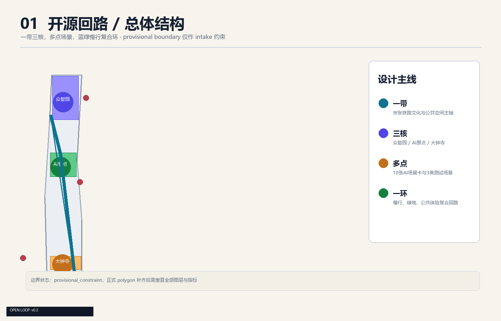
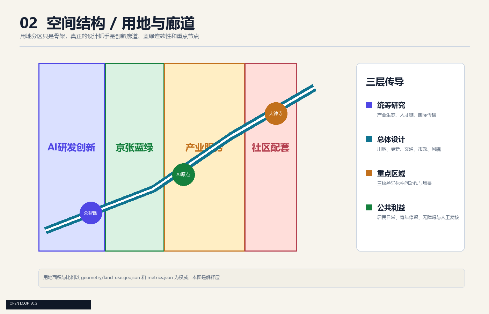
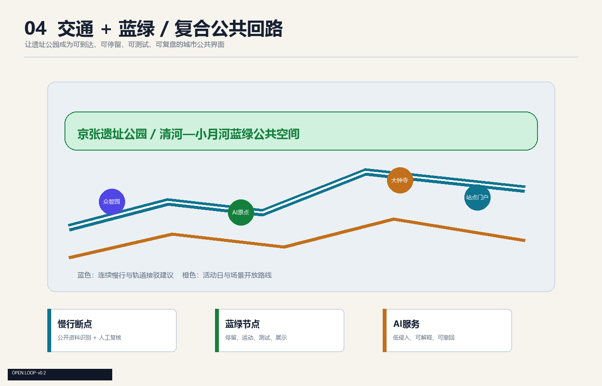
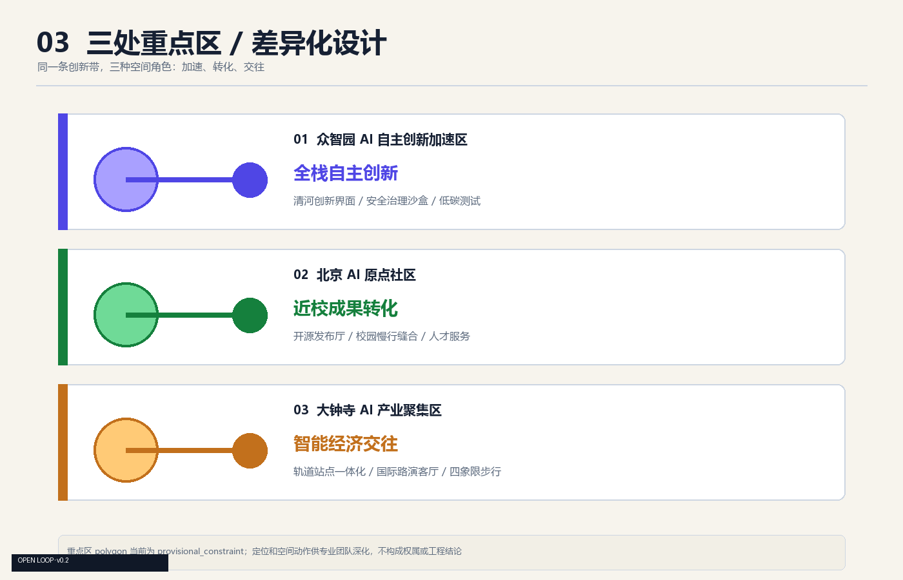
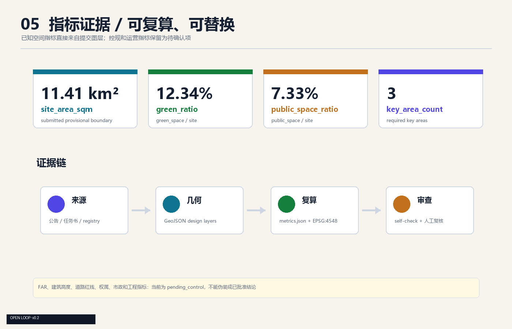

# 开源回路：百年京张AI创新带的可验证城市

## 设计依据与资料清单

本方案响应北京海淀“百年京张AI创新带城市设计国际方案征集”的公开任务，提出“开源回路”作为总体概念。方案不把 Agent 输出包装成已批准规划，所有空间落地建议均为概念建议、参考方案或可供专业团队深化研究的工作材料。

主要依据包括：北京市规划和自然资源委员会海淀分局公告、面向智能体的清权任务书摘录、仓库内的 `design_brief.json`、`allowed_design_space.json`、`agent_taskbook.json`、`data/source_registry.json`、临时边界说明和本地专业标准快照。[source:OFFICIAL-ANNOUNCEMENT] [source:AGENT-TASKBOOK] [source:SITE-PACKAGE] [source:SOURCE-REGISTRY] [source:BOUNDARY-SOURCE] [source:KEY-AREA-SOURCE]

当前没有取得官方精确 polygon、CAD 或 GIS 红线。本方案使用仓库维护的 `provisional_boundaries.geojson`，其属性已标注 `official_boundary=false`、`geometry_role=provisional_constraint`、`boundary_precision=provisional_rough`。它只用于 intake、空间讨论、图示和自检，不能作为 official redline、审批依据、权属边界或精确面积依据。取得正式资格预审文件、任务书附件或清权 GIS 后，应整体替换边界并重算所有图层、图纸和指标。[data:geometry/site_boundary.geojson#SITE-001] [depth:risk_missing_data]

本方案的证据链由五部分组成：GeoJSON 是空间事实层，`metrics.json` 是复算层，`proposal.md` 是人类可读解释层，五张 PNG 和两份 PDF 是展示层，`compliance_matrix.json`、`standard_matrix.json`、`design_depth_matrix.json` 是审查映射层。正式评审前，所有层应以同一版 official geometry 重建。[source:PROCESSED-FACT-PACK] [standard:PROJECT-OFFICIAL-ANNOUNCEMENT] [standard:PROJECT-AGENT-OPEN-CALL-TASKBOOK] [standard:MOHURD-ARCH-DESIGN-DEPTH-2016] [depth:existing_conditions_diagnosis] [data:geometry/constraints.geojson#CONSTRAINTS]

## 三层范围工作框架

公告将工作分成三层。统筹研究范围约 43.6 平方公里，北至北五环路、东至京藏高速、南至西直门外大街、西至万泉河路，承担产业生态、区域协同和未来城市研究。总体设计范围约 11.4 平方公里，围绕京张遗址公园周边 1—2 公里城市地区和产业区，承担用地、更新、交通、市政、公共空间和风貌框架。重点区域范围约 368.4 公顷，包含众智园AI自主创新加速区、北京AI原点社区、大钟寺AI产业聚集区，承担细化设计。[source:OFFICIAL-ANNOUNCEMENT] [metric:site_area_sqm] [metric:key_area_count]

本方案以“一带、三核、多点、一环”传导三层工作：

- 一带是京张铁路文化与公共空间主轴，把遗产、公园、学校、企业和社区放进一条可步行的叙事线上。
- 三核是众智园、AI原点、大钟寺，分别承担全栈自主创新、近校成果转化、智能经济交往。
- 多点是 10 张 AI 场景卡和 3 个产业测试验证场景，分布在公共空间、园区接口和轨道门户附近。
- 一环是慢行、绿地、公共服务和活动路线形成的复合回路，作为创新带的日常可见界面。

三层范围不是三套互不相干的图纸。产业研究提出问题，总体设计把问题转成空间，重点区再用具体节点、公共空间和运营机制验证。所有面积和比例以当前临时图层和 `metrics.json` 为准，正式 polygon 补齐后统一复算。[data:geometry/key_areas.geojson#PROV-KEY-001] [data:geometry/key_areas.geojson#PROV-KEY-002] [data:geometry/key_areas.geojson#PROV-KEY-003] [depth:three_level_scope_framework] [depth:overall_spatial_structure]

## 统筹研究范围产业与未来城市研究

### 总体概念与视觉识别

方案主名称为“开源回路”，英文建议名为 **Open Loop · Jing-Zhang AI Belt**。它表达三件事：历史线路是一条可以继续接入新节点的线；城市创新不应只在园区内部闭环；每次公开提交、公众反馈和专业复核都应回到公共知识库中形成下一轮迭代。

Logo 方向建议采用“一条未闭合的铁路/数据线 + 三个节点圆点”的几何符号。线条对应京张铁路和慢行回路，三个节点对应三区，开口对应开放协作。建议使用深墨、铁路锈橙和清河蓝三色，但该视觉系统只作为概念方向，字体、商标和最终图形需由专业团队清权并深化，不直接复制现有企业或机构标识。[source:AGENT-TASKBOOK] [depth:brand_identity]

### 三大定位、五大功能与三区两翼

三大定位是百年京张文化带、都市AI生活体验带、AI融合创新带。五大功能是 AI 全栈自主创新体系、世界级 AI 创新生态、AI+场景赋能新范式、智能化 AI 活力城市、AI 治理全球话语权。[source:AGENT-TASKBOOK]

三区两翼形成“研发策源—成果转化—城市交往”的南北协同回路：北京AI原点社区负责近校创新、开源发布和人才服务；众智园AI自主创新加速区负责全栈自主创新、安全治理、标准验证和低碳测试；大钟寺AI产业聚集区负责智能终端、内容消费、企业服务和国际交往。中关村科技服务翼提供资本、法务、知识产权、企业服务和全球要素配置，小月河场景赋能翼把 AI+医疗、教育、交通、生活服务转化为可体验的公共场景。空间上以京张遗址公园及蓝绿系统连接，运营上由公共知识库、开发者社区和年度活动形成回流。[data:geometry/key_areas.geojson#PROV-KEY-001] [data:geometry/key_areas.geojson#PROV-KEY-002] [data:geometry/key_areas.geojson#PROV-KEY-003]

### 全球案例的机制参照

以下案例只作为公开知识中的机制参照，不作为本地事实或投资依据，正式方案需要进一步登记权威来源和本地适配条件：

| 参考案例 | 可借鉴机制 | 本地转化方向 |
| --- | --- | --- |
| 加拿大蒙特利尔 Mila 周边 | 研究机构、社区活动和人才网络叠加 | AI原点社区的近校创新与开源发布 |
| 多伦多 MaRS | 研究、创业、企业服务和公共活动共址 | 中关村科技服务翼的企业服务节点 |
| 芬兰 Helsinki AI Register | 公共部门 AI 使用的透明登记与解释 | 城市智能体的公开资料、人工复核和风险提示 |
| 英国 Alan Turing Institute | 研究机构、政府议题与公共知识传播连接 | 众智园的标准治理和政策研究接口 |
| 新加坡 Punggol Digital District | 产业、校园、公共空间和数字基础设施协同 | AI原点社区与小月河场景赋能翼的复合界面 |
| 法国 Station F | 大型创新社区的空间共享和创业服务 | 大钟寺产业服务与国际路演客厅 |
| 阿姆斯特丹开放数据实践 | 开放数据、公众参与和城市实验结合 | 开源回路的公开数据边界和场景共创流程 |

这些案例的共同点不是复制建筑形象，而是把研究、空间、人才、服务、场景和公众判断接到同一套循环中。[source:AGENT-TASKBOOK] [depth:ecosystem_research]

## 总体设计范围城市更新与控规深度城市设计

### 空间结构与用地策略

总体设计范围的用地结构采用“研发创新—京张蓝绿—产业服务—社区配套”的连续骨架。`land_use.geojson` 的四个分区覆盖当前提交边界，作为概念分区而非法定用地红线：研发创新区承载研发、测试和开源协作；京张蓝绿区承载公园、慢行和文化体验；产业服务区承载企业服务、路演和智能原生消费；社区配套区承载居民日常、青年友好空间和公共服务。[data:geometry/land_use.geojson#LU-001] [data:geometry/land_use.geojson#LU-002] [standard:MNR-LAND-USE-CLASSIFICATION-GUIDE] [depth:land_use_layout]

用地分区不追求把不同功能切成四块互不往来的色块，蓝绿和慢行廊道应穿过分区，成为日常交往的公共骨架。凡涉及法定用地代码、容积率、建筑高度、道路红线和权属边界的具体判断，均待 official 控规资料确认。[standard:MOHURD-CONTROL-DETAILED-PLANNING] [depth:development_intensity_controls]

### 更新与建筑策略

建筑图层表达的是概念性的保留、改造和新增基底，不表达具体拆迁、权属或工程结论。建议形成三类更新动作：保留有文化和公共识别价值的既有空间，改造首层界面和公共服务空白，新增少量可逆、可拆卸的公共服务与展示组件。大型建筑更新应优先采用内部功能转换和首层开放，不提出未经权属与文保核验的拆改清单。[data:geometry/buildings.geojson#BLDG-001] [depth:retain_renovate_demolish] [depth:height_massing_character]

## 交通、轨道、市政与公共服务设施

交通策略是“轨道门户 + 慢行回路 + 场景开放路线”。[data:geometry/constraints.geojson#CONSTRAINTS] [depth:traffic_rail_slow_parking]大钟寺站、五道口、清华东路西口和北五环相关节点只作为需要重点复核的接口，不把临时图层写成道路红线。`roads.geojson` 提供慢行与创新服务廊道的设计建议，后续应叠加 official 道路、轨道、消防和市政资料。[data:geometry/roads.geojson#ROAD-001] [depth:traffic_rail_slow_parking]

市政和新基建建议采用可解释、可撤回的“小节点”策略：端侧算力服务、公共信息终端、低碳能源展示和设施运维传感器都必须以公开数据、最小采集、人工复核为前提，不把具体设备品牌、能源容量或运营主体写成确定事项。[depth:municipal_new_infrastructure]

## 重点区域详细设计

三处重点区均使用 provisional polygon，以下内容属于参考方案。重点区面积约值来自公告，空间边界和具体项目均待正式资料复核。[data:geometry/key_areas.geojson#PROV-KEY-001] [data:geometry/key_areas.geojson#PROV-KEY-002] [data:geometry/key_areas.geojson#PROV-KEY-003] [depth:three_key_area_detailed_design]

### 众智园 AI 自主创新加速区

定位为“全栈自主创新花园”。空间上建议把清河界面、研发空间、标准治理展示和低碳创新交往连成一条开放廊道；公共空间优先承载模型评测、标准工作坊、安全治理展示和开发者散步。建筑建议以保留与改造为主，新增设施采用轻量、可逆、可拆卸的公共服务组件。产业测试场景包括自主模型测试、安全治理沙盒、低碳算力驿站。实施依赖包括河道蓝线、文保、能源、市政和权属核验。

### 北京 AI 原点社区

定位为“近校成果转化社区”。空间上建议建立校区、园区、街区之间的慢行缝合，形成开源发布厅、成果转化街、人才服务节点和日常生活设施。重点不是制造一个封闭园区，而是让高校师生、开发者、居民可以在同一条公共路径上发生低门槛交流。实施依赖包括校区边界、既有建筑权属、首层业态和轨道站点接口核验。

### 大钟寺 AI 产业聚集区

定位为“智能经济交往街区”。空间上建议以大钟寺站周边的四象限步行连通为入口，把企业展示、国际路演、智能终端体验、数据要素公共教育和生活服务放在可步行到达的城市界面上。禁止用概念方案直接改造企业专属空间，优先提出公共空间、首层界面和活动运营层面的参考动作。实施依赖包括站城一体化条件、道路交叉口、市政管线、企业权属和商业运营协商。

## AI 创新生态、人才画像与 AI+ 场景

### 五类用户画像

1. **开源开发者**：需要发布、协作、测试和贡献记录。空间响应是原点社区开源发布厅、贡献展示和夜间协作空间；不采集个人轨迹。
2. **初创团队**：需要低成本办公、合规数据入口和产品试验场。空间响应是众智园测试节点和企业服务翼；算力与数据服务必须另行授权。
3. **头部企业访客**：需要展示、商务、国际接待和人才招聘。空间响应是大钟寺国际路演客厅与轨道门户。
4. **周边居民**：需要通勤、休闲、社区服务和低扰动更新。空间响应是遗址公园慢行环、社区服务和分级夜间活动。
5. **高校师生**：需要成果转化、跨校协作和日常慢行。空间响应是校区—园区缝合、成果转化驿站和 AI 教育体验点。

### 十张 AI 场景卡

| 编号 | 场景卡 | 空间 | 数据与人工边界 |
| --- | --- | --- | --- |
| 01 | 开源发布厅 | AI原点社区 | 用户主动提交，发布前人工审核 |
| 02 | 安全治理沙盒 | 众智园 | 公开任务数据，测试过程可回溯 |
| 03 | 端侧算力驿站 | 一带公共节点 | 能源和算力条件待确认，不采集个人数据 |
| 04 | AI慢行导航 | 遗址公园活力带 | 使用公开道路资料和人工巡查复核 |
| 05 | 大钟寺国际路演客厅 | 大钟寺 | 企业和活动资料须取得授权 |
| 06 | 清河低碳创新廊 | 众智园临清河界面 | 生态和防洪数据须来自正式资料 |
| 07 | 近校成果转化街 | AI原点社区 | 科研成果、知识产权和肖像均需授权 |
| 08 | 数据要素会客厅 | 大钟寺 | 只展示合规案例，不展示个人或内部数据 |
| 09 | AI生活服务样板街 | 社区与商业交汇处 | 医疗、教育、法律服务必须人工复核 |
| 10 | 全球AI活动周路线 | 一带公共空间 | 活动许可、安全和版权条件待确认 |

其中 01、02、03 是产业测试验证场景：它们分别验证开源发布、可信安全和低碳算力的公共交往方式。测试场景只建议在低风险、可监管、可退出的范围开展，不将技术试验写成已批准运营。[source:AGENT-TASKBOOK] [depth:ai_scenario_cards]

## 用地、建筑规模与拆改留方案

当前建筑基底面积为 `310807.184 sqm`，它来自提交的概念建筑图层，不代表现状建筑总量，也不构成建筑规模或容积率结论。[metric:building_footprint_area_sqm] [data:geometry/buildings.geojson#BLDG-001]

本方案把建筑策略分成保留、改造、公共组件和待确认四类：文化与公共识别价值较高的空间优先保留；首层不开放、界面断裂的空间提出改造建议；公共服务与展示节点采用可逆组件；涉及拆除、新建、建筑高度、强度和权属的事项一律列为 pending_control。[standard:MOHURD-CONTROL-DETAILED-PLANNING] [depth:retain_renovate_demolish]

## 蓝绿空间、公共空间与城市风貌

`green_space.geojson` 和 `public_space.geojson` 共同形成京张遗址公园活力带的解释层。当前绿地比例为 12.3423%，公共空间比例为 7.3281%，均按临时边界和提交图层复算，正式边界替换后需重算。[metric:green_ratio] [metric:public_space_ratio] [data:geometry/green_space.geojson#GREEN-001] [data:geometry/public_space.geojson#PUBLIC-001]

公共空间建议包括开发者散步道、开源成果展示廊、智能体贡献荣誉墙三个 AI 朝圣地标：

- **开发者散步道**：把铁路线路、代码贡献和城市观察组织成连续步行体验，重点是公共知识与日常停留，不做高强度娱乐设施。
- **开源成果展示廊**：在公园、站点或公共建筑界面形成可更新的成果展示系统，所有展示内容需要版权和人工审核。
- **智能体贡献荣誉墙**：记录公开提交、方案迭代和专业反馈，展示内容可持续更新，具体位置和建设形式待专业团队与管理主体深化。

文化叙事采用“铁路把远方带到城市，代码把城市交给更多人继续建”的双线叙事。第一层讲京张铁路和中国自主建设的历史事实；第二层讲中关村的研究、创业和开放文化；第三层讲 AI 时代的公开协作、人工复核和公共利益。导视系统建议用“时间线、节点线、贡献线”三种信息层级表达，避免把历史文化变成科技装饰。[source:AGENT-TASKBOOK] [standard:MOHURD-URBAN-DESIGN-MEASURES] [depth:blue_green_public_space]

## 更新项目清单、实施政策与分期计划

| 项目 | 近期参考动作 | 中期深化 | 主要前置条件 |
| --- | --- | --- | --- |
| JZ-01 慢行断点缝合 | 公开识别断点、人工巡查、轻量导视 | 与道路和站点一体化深化 | official 道路与交通条件 |
| JZ-02 清河创新界面 | 公共知识展示和低碳体验试点 | 蓝绿空间与生态条件深化 | 河道蓝线、防洪、文保 |
| JZ-03 原点成果转化街 | 开源发布、成果路演、人才服务 | 首层界面与更新项目深化 | 校区边界、权属、业态 |
| JZ-04 大钟寺步行连通 | 活动日步行组织和信息导视 | 站城一体化与交叉口优化 | 轨道、道路、市政 |
| JZ-05 AI公共服务节点 | 低侵入服务原型和人工复核 | 算力、能源、运维深化 | 能源、数据、安全 |
| JZ-06 全球AI活动周 | 形成年度活动参考日历 | 社区运营和国际传播机制 | 场地许可、版权、安全 |

分期建议为“先开放、再验证、后深化”。近期以轻量公共空间、公开资料、人工巡查和活动试点验证需求；中期把验证结果转成站点、界面和服务节点；长期在官方边界、控规、权属、市政、文保和专业设计条件完备后，再讨论工程和实施。活动、招商、政策和资金均为概念建议，不是政府承诺。[data:geometry/phasing.geojson#PHASE-001] [depth:phasing_implementation] [depth:renewal_project_list]

### 全球 AI 活动与长期运营

建议形成四季活动系统：春季“开源回路发布季”，夏季“城市智能体场景开放日”，秋季“百年京张 AI 创新周”，冬季“公共知识复盘季”。开发者社区可采用公开议题、贡献记录、方案复盘、人工导师和专业团队反馈组成的运营机制。场景开放运营应设置预约、风险告知、人工值守、退出机制和数据删除规则。国际传播可用中英文公开档案、开放地图式故事和年度贡献名录，但不得未经授权使用企业或个人标识。

## 指标体系、面积复算与合规矩阵

当前提交包的核心 known 指标如下：

| 指标 | 当前值 | 公式与解释 |
| --- | ---: | --- |
| `site_area_sqm` | 11,412,825.386 sqm | 临时总体设计边界面积，EPSG:4548 复算 |
| `building_footprint_area_sqm` | 310,807.184 sqm | 建筑图层 polygon 面积求和 |
| `green_ratio` | 0.123423 | 绿地面积 / 临时总体设计边界面积 |
| `public_space_ratio` | 0.073281 | 公共空间面积 / 临时总体设计边界面积 |
| `key_area_count` | 3 | 三处必选重点区域计数 |

这些指标只证明当前设计包可复算，不证明 official 控规或最终建设指标。FAR、建筑高度、建筑密度、道路红线、权属、市政容量、人才密度、产业产值和场景使用频次均为 unknown 或 pending_control，应在正式资料和专业深化后补齐。[metric:site_area_sqm] [metric:building_footprint_area_sqm] [metric:green_ratio] [metric:public_space_ratio] [metric:key_area_count] [depth:metrics_recalculation]

`compliance_matrix.json` 覆盖公告 1.3、1.4、1.5 以及 agent.1-agent.6；`standard_matrix.json` 覆盖项目公告、智能体任务书、住建部城市设计管理办法、控规编制审批办法和自然资源部用地分类指南；`design_depth_matrix.json` 覆盖现状诊断、三层范围、总体结构、用地、建筑、交通、市政、蓝绿、重点区、项目清单、分期、指标和风险。[standard:PROJECT-AGENT-OPEN-CALL-TASKBOOK] [standard:MOHURD-URBAN-DESIGN-MEASURES] [standard:MNR-LAND-USE-CLASSIFICATION-GUIDE]

## 风险、版权与合规说明

1. **边界风险**：当前三层边界和重点区 polygon 是 provisional，正式 polygon 补齐后全部重算。
2. **控规风险**：建筑高度、容积率、道路红线、权属、设施容量和拆改留均待正式资料确认。
3. **数据风险**：只使用公开或清权资料，不上传个人隐私、企业内部资料和非公开规划图件。
4. **AI责任**：生成内容必须经过来源核验、空间复核、版权审核和专业团队人工判断。
5. **运营风险**：活动、场景和公共服务建议都需要许可、人工值守、风险告知和退出机制。
6. **文化版权**：Logo、字体、照片、肖像、企业标识和历史图像需取得许可后再用于公开展示。

本包的图纸、HTML 和信息图仅为解释层；权威数据以 GeoJSON、metrics 和矩阵为准。方案不声称政府批准、最终土地权属、最终建设规模或保证实施。[depth:risk_missing_data] [source:SOURCE-REGISTRY]

## 参考资料

本节资料索引回到 [source:PROCESSED-FACT-PACK]、[standard:MOHURD-ARCH-DESIGN-DEPTH-2016] 和 [data:geometry/constraints.geojson#CONSTRAINTS]，用于保证参考文件、专业标准和待确认约束能够被机器校验。

- `brief/site-package/design_brief.json`
- `brief/site-package/agent_taskbook.json`
- `brief/site-package/allowed_design_space.json`
- `brief/site-package/geometry/provisional_boundaries.geojson`
- `data/source_registry.json`
- `docs/formal-submission-guide.md`
- `brief/site-package/standards/standards.json`
- `compliance_matrix.json`
- `standard_matrix.json`
- `design_depth_matrix.json`
