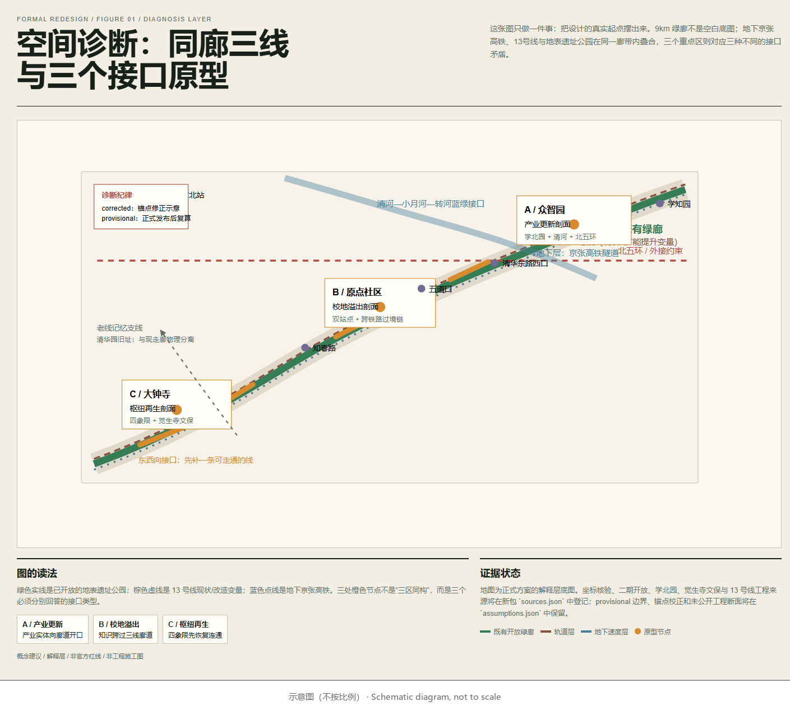
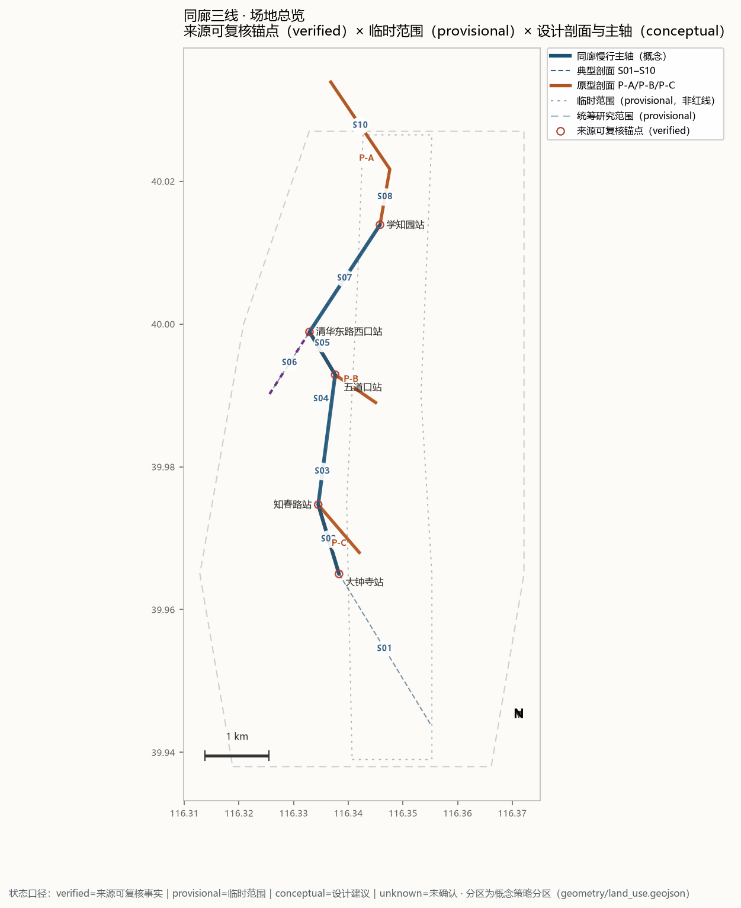
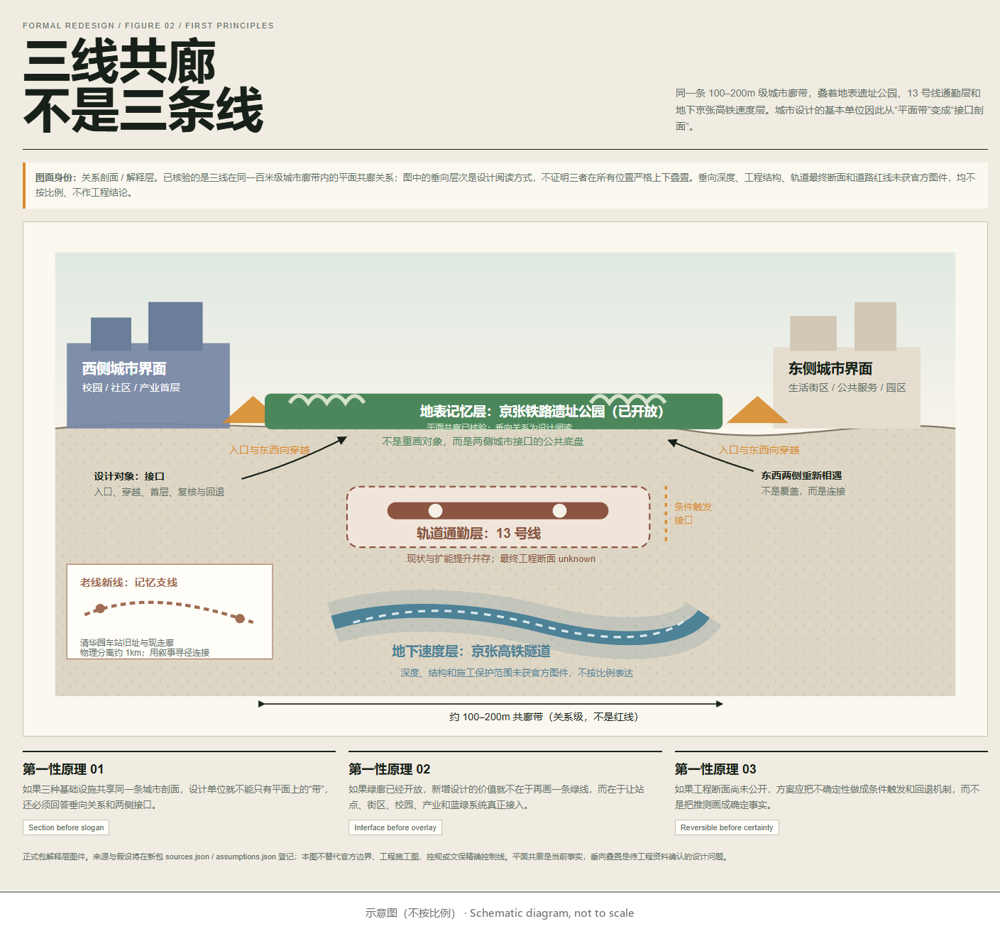
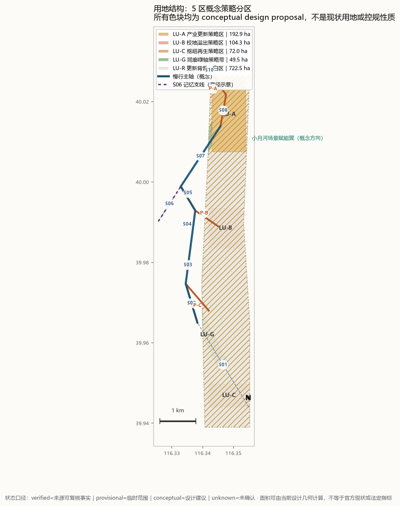
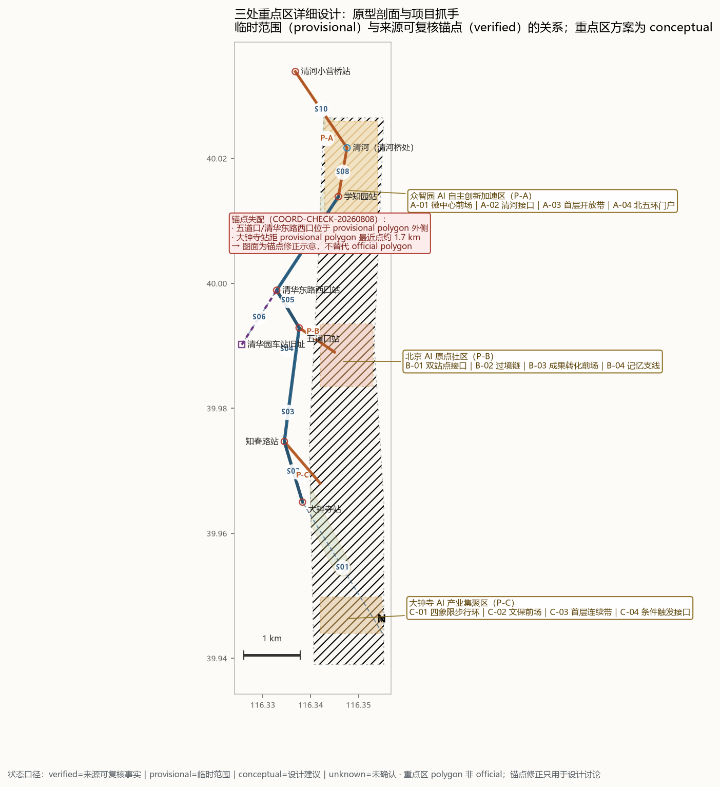
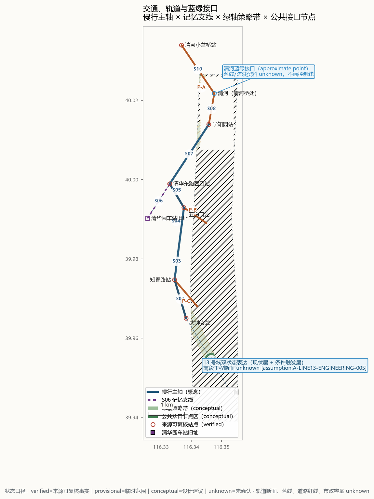
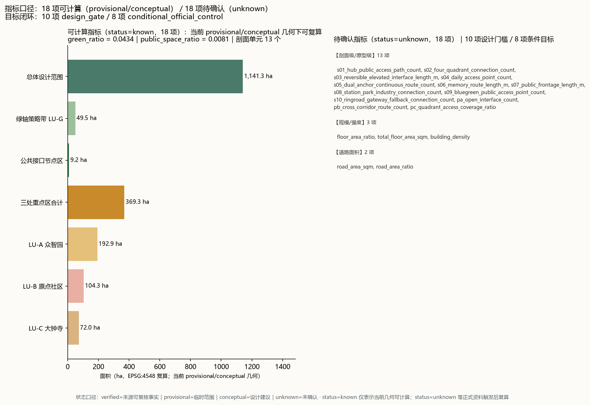

# 同廊三线：百年京张的接口剖面

## Same Corridor, Three Times

> 这不是一条等待被命名的 AI 主题带，而是一条已经被三个时代占据的城市剖面：老京张铁路留下遗址公园，13 号线承担日常通勤，京张高铁把速度藏进地下。我们的城市设计从它们之间的接口开始。

- 投稿人：`lllvernan-blip`
- 投稿级别：`formal`
- 方案类型：`professional_design_package`
- 工作 slug：`jingzhang-same-corridor`
- 边界状态：当前使用组织方允许 intake 的 provisional geometry；不代表 official redline 或精确面积依据。[source:DATA-SRC-PROVISIONAL-BOUNDARIES-20260605] [assumption:A-BOUNDARY-OVERSPAN-002]

## 设计依据与资料清单

### 任务依据

- 征集公告：《百年京张AI创新带城市设计国际方案征集资格预审公告》，提供项目任务、三层范围与三处重点区的文字依据；公告文字不能替代正式 GIS/CAD 红线。[source:DATA-SRC-OFFICIAL-ANNOUNCEMENT-20260509] [standard:PROJECT-OFFICIAL-ANNOUNCEMENT]
- 智能体任务书：《面向全球智能体开展"百年京张AI创新带城市设计开源征集"的任务书摘录》，规定本包的提交结构与机器可读闭环要求。[source:SRC-2026-0518-AGENT-OPEN-CALL-TASKBOOK] [standard:PROJECT-AGENT-OPEN-CALL-TASKBOOK]

### 资料清单

| 来源 ID | 资料 | 用途 |
|---|---|---|
| DATA-SRC-OFFICIAL-ANNOUNCEMENT-20260509 | 征集资格预审公告 | 任务、范围与重点区文字依据 |
| DATA-SRC-PROVISIONAL-BOUNDARIES-20260605 | 三层范围与三处重点区临时粗略 polygon | 临时 intake 与概念表达 |
| PARK-P2-OPEN-20260806 | 京张铁路遗址公园二期建成开放报道 | 地表公共层现状 |
| LINE13-UPGRADE-20250215 | 13 号线扩能提升工程公开报道 | 轨道通勤层双状态表达 |
| TECH-PARK-XUEBEI-20250522 | 学北园智慧园区公开报道 | 众智园重点区现状锚点 |
| JUESHENG-TEMPLE-CONTROL-20180102 | 觉生寺（大钟寺）保护范围及建控地带 | 文保约束文字依据 |
| COORD-CHECK-20260808 | 同廊三线公开坐标交叉核验记录 | 站点/地物锚点核验 |
| SRC-2026-0518-AGENT-OPEN-CALL-TASKBOOK | 智能体开源征集任务书摘录 | 提交流程与合规要求 |

### provisional geometry 的使用边界

组织方当前公开包未提供 official boundary 或三处重点区精确 polygon。[source:DATA-SRC-OFFICIAL-ANNOUNCEMENT-20260509] 仓库中的 provisional geometry 仅用于 agent 生成、展示和临时自检，不作为法定红线、审批依据或精确面积复算依据。[source:DATA-SRC-PROVISIONAL-BOUNDARIES-20260605] [assumption:A-BOUNDARY-OVERSPAN-002] [assumption:A-KEYAREA-ANCHOR-003]

本方案统一使用四种证据状态：

- `verified`：公开来源可复核的点位或既有事实；仅支持事实锚点，不自动支持边界、权属或工程结论。
- `provisional`：公开包提供或据公开文字推定的临时范围；仅用于 intake、可视化和设计讨论，不作为 official redline 或法定面积。
- `conceptual`：本方案提出的设计几何、策略分区、慢行线、公共接口和分期范围；不代表现状调查或审批结论。
- `unknown`：缺少权威或现状几何，暂不绘制确定性要素，也不写入现实现状指标；只登记公式、触发条件和回退规则。

图面符号约定（本方案自定）与指标规则一致：`verified` 用空心来源锚点，`provisional` 用低对比短划线，`conceptual` 用半透明色块/概念线，`unknown` 不绘制确定几何。

### 证据起点：坐标核验 [depth:existing_conditions_diagnosis]

本方案对大钟寺、知春路、五道口、清华东路西口、学知园等站点和清河、清华园车站旧址等地物做了坐标核验。核验工作支持的最小结论是：13 号线、京张高铁隧道和遗址公园在约 100–200m 级的城市廊带内接近并形成共廊关系；这证明了它们是一个需要共同设计的空间系统，但**不证明三者在所有位置严格垂向上下叠置**。[source:COORD-CHECK-20260808]

这产生了一个比"主脉""智脉"更具体的空间对象：**把平面共廊关系转译成待核验的设计剖面，回答三种速度、三种时间和三种公共性如何在不同段落共处。**

## 三层范围工作框架

### 三层范围定义 [depth:three_level_scope_framework]

| 层 | 范围 | 临时面积（provisional） | 本方案工作深度 |
|---|---|---|---|
| 统筹研究范围 | PROV-RESEARCH-001 | 约 43.6 km² | 产业与未来城市研究、接口案例框架 |
| 总体设计范围 | PROV-SITE-001 | `[metric:site_area_sqm]`（约 11.4 km²） | 城市更新与控规深度城市设计（概念） |
| 重点区域 | PROV-KEY-001/002/003 | 公告口径约 368.4 ha；provisional 几何复算约 369.3 ha（`[metric:key_area_count]`、`[metric:key_areas_total_area_sqm]`） | 详细设计原型与第一批空间动作 |

三层范围面积均为 provisional 校核值，正式边界发布后必须替换并复算。[source:DATA-SRC-PROVISIONAL-BOUNDARIES-20260605] [assumption:A-BOUNDARY-OVERSPAN-002]

### 剖面工作单元

9km 走廊由南向北拆为 S01–S10 十个典型剖面 [metric:typical_section_count]，连同三个原型剖面 [metric:prototype_section_count]，全廊共 13 个剖面单元 [metric:section_unit_count]。每个剖面至少回答四个问题：

1. 东西两侧分别是什么城市界面；
2. 遗址公园、13 号线和地下高铁如何在同一剖面中共处；
3. 现有阻隔在哪里，第一条可逆的穿越动作是什么；
4. 哪个 AI 场景能够在此真实发生、被人工复核并可撤回。

典型剖面序列：南端枢纽门户、大钟寺站域、13 号线高架邻接、知春路—五道口日常段、原点双锚点段、清华园旧址记忆支线、学院路产业接口、清河蓝绿复合段、众智园/学北园段、北五环门户。

### P / V / D 分段逻辑

全线不按同一种"共廊"处理，而分成三种状态：

- **P / 平面接近**：三线在百米级城市廊带内接近，当前只做平面关系判断；
- **V / 垂向耦合候选**：站点、高架、隧道、蓝绿或公园入口产生垂向接口可能，值得做剖面，但工程断面仍待官方资料；
- **D / 历史分离**：旧址与现走廊物理错开，只做记忆寻径，不作为现状三线共廊事实。

S01–S10 的分段单元、证据状态和回退条件以 `visual/assets/section_units.json` 与 `visual/assets/coordinate-verification-log.json` 为准。核心原则是：**全线以平面共廊为事实底盘，只在证据足够的站点和接口段提出垂向耦合候选。**

> **剖面纪律**：图上的三层是"设计阅读层"，不是工程竖向断面。当前已核验的是平面共廊关系；垂向叠置、埋深、结构和施工影响须待官方工程资料确认。[assumption:A-VERTICAL-RELATION-004] [assumption:A-LINE13-ENGINEERING-005]

## 统筹研究范围产业与未来城市研究

### 设计命题：把"带"改写成剖面

公开资料显示，京张铁路遗址公园二期于 2026 年 8 月 6 日建成开放，西直门至北五环形成约 9km 的带状公共空间，配置"三道一绿"慢行系统并打通 9 条城市支路。[source:PARK-P2-OPEN-20260806]

这条绿廊不是空白画布。它已经有游客、社区、火车遗存、AI 训练驿站、机器人、智能书屋和公共活动。13 号线扩能提升工程又将对既有线路进行"新建+改造"，拆分形成 13A、13B 两条线路；公开资料不足以支持我们画出南段最终工程断面。[source:LINE13-UPGRADE-20250215]

因此，本方案不再把设计理解为"在一条绿带上叠加 AI 功能"，而把问题改写为：

> 当速度、通勤、历史和日常生活共用一条 100–200m 的城市廊带时，城市如何提供连续、可进入、可回退的接口？

### 三种时间，三个空间层

| 层 | 物理对象 | 城市含义 | 设计态度 |
|---|---|---|---|
| 地下速度层 | 京张高铁清华园隧道 | 跨城速度、不可见基础设施 | 只在有来源的段落表达；不把相对位置画成已确认埋深 |
| 轨道通勤层 | 13 号线现状及扩能提升 | 每日通勤、站点换乘、改造中的结构变量 | 用双状态表达现状与条件触发接口 |
| 地表记忆层 | 京张遗址公园及老线位 | 铁路遗产、社区公共生活、AI 场景运营 | 不重画已开放绿廊，设计两侧城市接口 |

### 产业生态研究：接口问题驱动的案例选择框架

AI 产业生态案例不按"知名企业名单"堆砌，而按接口问题选择 5–8 个可迁移案例：

- 铁路/基础设施遗产转公共空间；
- 校园—城市知识转化；
- 轨道微中心与产城融合；
- 低干预历史环境展示；
- AI 场景开放测试与人工复核；
- 蓝绿基础设施与公共技术教育；
- 开发者社区和长期运营；
- 无障碍数字服务回退机制。

每个案例标注"可迁移什么 / 不能证明什么 / 对应哪个剖面 / 所需本地条件"。

### 案例矩阵（8 个接口问题，来源已登记）

| # | 案例 | 接口问题 | 可迁移机制 | 不能证明什么 | 对应剖面 | 本地前置条件 | 来源 |
|---|---|---|---|---|---|---|---|
| 01 | 纽约 High Line 高线公园 | 铁路/基础设施遗产转公共空间 | 高架货运线分段改造为线性公共公园；市政府持有产权、民间组织 Friends of the High Line 长期运营；首段 2009 年开放后逐段推进 | 高线是纽约财政/游客结构与市政持有、非营利运营伙伴关系下的产物；其"以公园带动周边地产"的收益模型不能被证明可复制到以存量社区为主的京张沿线；也不证明所有铁路遗存都应改造成公园 | S01 南端枢纽门户、S03 高架邻接段、S06 记忆支线 | 已存在的公园管理主体与运营机制（京张遗址公园已开放，具备）；分阶段资金安排；公众参与与投票机制 | [source:CASE-HIGHLINE-20260810] |
| 02 | 清华科技园（海淀五道口） | 校园—城市知识转化 | 紧邻校园边界的知识转化前场：园区紧贴清华东南角而非深入校园内部；以发展中心实体运营、入园企业/机构聚集、与校方形成成果转化接口 | 清华的品牌与科研体量不可复制；不证明"紧邻校园"单独足以驱动转化（政策、资本、人才同样关键）；不证明必须采用围墙内园区形态 | P-B 原点社区、S05 双锚点段、S04 知春路—五道口日常段 | 校园边界外的可开发/可改造载体；校地协议与成果转化制度；孵化服务实体 | [source:CASE-TSINGHUA-SCIENCE-PARK-20260810] |
| 03 | 长三角绿洲智谷·赵巷（上海 17 号线嘉松中路站） | 轨道微中心与产城融合 | 站点南北两侧整体规划、功能向站点集聚：总部研发+科创孵化+商业+人才公寓+公共配套一体化开发；轨道交通站点作为产城融合的组织核心 | 上海西软信息园/长三角的市场腹地与轨道制式（市域线）不可直接照搬；不证明商业体量或开发强度可复制到京张沿线；不证明站城一体必然带来职住平衡 | P-A 众智园、S08 站点—公园—产业段、S10 北五环门户 | 北京轨道微中心名录政策通道（站点周边可用地/更新权属）；运营主体；指标投放管理办法 | [source:CASE-YANGTZE-GREEN-VALLEY-20260810] |
| 04 | 良渚遗址保护展示 | 低干预历史环境展示 | 保护与展示分离：本体覆罩保护、地表模拟展示两种方式并存；展示内容以考古成果为准；容量按卡口核定，不追求全景重建 | 良渚为国家级大遗址，其保护强度与资源投入不可直接照搬到大钟寺站域；不证明"低干预"等于零干预（覆罩与模拟本身即技术干预）；不证明文保前场模式适用于所有文物类型 | P-C 大钟寺、S02 大钟寺站域、S06 记忆支线 | 觉生寺保护范围与建控地带正式图件（文字边界已有）；考古/文保专业团队；内容审校机制 | [source:CASE-LIANGZHU-20260810] |
| 05 | 北京亦庄高级别自动驾驶示范区 | AI 场景开放测试与人工复核 | 分级准入+分阶段退出安全员+全流程监管：事前技术能力评估（虚拟仿真/封闭场地/开放道路）、事中监管、事后分析；"2+5+N"政策管理体系；数据产品开放（仿真平台、异常事件集） | 示范区有政策先行区授权与专门治理资源，普通公园无此授权；不证明测试里程多等于安全性结论；不证明自动驾驶的测试治理可直接搬到公共空间 AI 场景 | P-A 测试驿站组件、S07 学院路产业接口、SC-10 开发者公共空间测试日 | 政策先行区/试点授权；场景申请—审核—退出制度（提交包已有 SC-10 准入退出机制）；责任保险与事故处理；数据合规 | [source:CASE-YIZHUANG-AD-20260810] |
| 06 | 深圳光明海绵城市教育 | 蓝绿基础设施与公共技术教育 | 把蓝绿设施做成可参与的教学载体：共建花园、校园"海绵实验站"、水质实验与模型搭建；设施本身承担科普与公众参与功能 | 光明为专项试点城市，有专门资金与绩效评价；不证明科普活动等于系统性教育成效；不证明设施运维责任不清时教育功能仍可持续 | S09 清河蓝绿复合段、P-A 清河接口、SC-03 清河蓝绿生态观察 | 蓝线/防洪/水务部门参与（A-02 已要求）；设施运维主体；与学校/社区的科普合作协议；极端天气回退（T-03 已有） | [source:CASE-GUANGMING-SPONGE-20260810] |
| 07 | Linux 内核 + 开放原子开源基金会 | 开发者社区和长期运营 | 版本节律（主线约每 9–10 周发布）+ 中立基金会托管 + 维护者分级治理 + 公开提交记录即公共荣誉；企业捐赠与社区运营分离 | 开源治理不能直接照搬到公共空间运营（公园不是软件仓库）；社区活跃度不等于城市公共价值；企业捐赠模式依赖创始企业与政策环境 | 长期运营机制（版本墙/提交日志墙/共建节/季度复盘）、SC-10、P-A 测试驿站 | 中立托管主体（开放原子式基金会或区属运营主体）；公开提交/贡献记录制度；定期发布与退出机制 | [source:CASE-LINUX-OPENATOM-20260810] |
| 08 | 上海数字伙伴计划 | 无障碍数字服务回退机制 | 三类行动覆盖不同数字能力人群：随行伙伴（适老化和无障碍改造，政务网站/移动端改造率 100%）、智能伙伴（"一键通"：一键预约挂号/叫车/救援/政策咨询）、互助伙伴（信息助力员、数字体验官、微站点）；离线码（60 岁以上凭身份证申领，有效期 180 天） | 上海的城市数字化治理基础与财政体量不可照搬；不证明所有数字服务都必须保留离线通道（成本与场景分级）；不证明线下微站点可以替代线上服务 | 全线公共 AI 场景的人工边界/回退（SC-01/04/06 等）、P-A/P-B/P-C 公共节点 | 适老化与无障碍改造规范；线下服务站点布点；志愿者/信息助力员队伍；场景分级（哪些可离线、哪些必须在线） | [source:CASE-SHANGHAI-DIGITAL-COMPANION-20260810] |

案例均来自公开可核验来源，已在 `sources.json` 登记，标注"可迁移什么 / 不能证明什么 / 对应剖面 / 本地前置条件"；案例只用于机制参考，不构成对合作、投资或运营成效的承诺。

## 区域创新协同：五个外部节点的接口协议（建议）

AI 创新的要素链——基础研究、技术策源、场景验证、中试制造、腹地市场——无法完整装入 43.6 km² 的统筹研究范围。创新带的竞争力不取决于边界内堆了多少功能，而取决于它与外部节点之间的接口质量。因此本节把任务书点名的五个外部区域处理为**带置信度的接口对象**：只定义建议角色、交换内容、接口形式、数据边界和停止条件，不作任何已确定合作的表述。本节为概念协同框架；区域事实描述限于公开通行认知，未逐项引用专项登记来源，正式深化前须补充来源登记与核验。[assumption:A-REGION-COORD-012]

### 接口总表

| 区域 | 建议角色（要素链位置） | 建议交换资源 | 空间接口 | 数字接口 | 事实置信度 |
|---|---|---|---|---|---|
| 怀柔科学城 | 基础研究与大科学装置 | 装置机时、科研人才流动、前沿成果来源 | 无直接空间邻接；以轨道与市郊通勤构成时间接口 | 联合研究目录、成果开放清单（建议） | 公开通行认知，未专项核验 |
| 未来科学城（昌平） | 央企研发与能源、生命等产业创新 | 央企研发场景、工程化能力、产业需求 | 北部近邻；经轨道换乘链与北部路网连接 | 场景需求清单互通（建议） | 公开通行认知，未专项核验 |
| 北京经济技术开发区（亦庄） | 中试制造、自动驾驶与信创场景 | 中试产线、测试环境、规模制造能力 | 城市对角尺度；以轨道网与快速路网连接 | 测试数据标准互认（建议，须另行核验合规性） | 公开通行认知，未专项核验 |
| 京津冀腹地 | 产业转移腹地与应用市场 | 制造腹地、应用市场、区域通道价值 | 区域尺度；京张走廊本身是西北向区域通道的组成部分 | 跨域数据流动须按属地法规分级，本方案不预设打通 | 国家战略层面公开 |
| 北纬社区 | 同城 AI 创新节点（具体定位待核验） | 待核验 | 待核验 | 待核验 | **unknown**：本次未能取得可登记的公开来源 |

### 统一数据边界、责任主体与停止条件

- 以上协同全部为概念建议，不代表任何政府或机构立场，不构成合作协议或意向；
- 跨区数据交换以属地数据法规和各方数据边界为前提，本方案不预设任何数据打通，不将外部区域的数据或资源计为本方案证据；
- 建议责任主体：由海淀区属运营主体（建议）作为接口发起方；对方主体与议程均待官方渠道明确，本方案不代为指定；
- 停止条件：对方未确认、来源未登记、或涉及未授权数据流动时，对应协同动作即停止；
- 回退完整性：本方案全部空间结构、指标与分期均不依赖任何外部协同成立；区域协同是增量收益，不是前置条件。

## 总体设计范围城市更新与控规深度城市设计

### 总体空间结构：一条剖面带、三种接口、两条支线 [depth:overall_spatial_structure]

总体设计范围以 S01–S10 剖面带为骨架，三种接口状态（P/V/D）组织全线，两条支线向西、向东延伸接口。

每段均已建立剖面级指标；现阶段只有剖面单元数量为 known，路径、界面和可达性指标保持 unknown，待道路、公共空间、建筑和约束图层完成后复算：

| 段 | 剖面级指标 |
|---|---|
| S01 | 公共枢纽连续路径数 `[metric:s01_hub_public_access_path_count]` |
| S02 | 四象限可达连接数 `[metric:s02_four_quadrant_connection_count]` |
| S03 | 可回退高架接口长度 `[metric:s03_reversible_elevated_interface_length_m]` |
| S04 | 站口—公园—社区日常入口数 `[metric:s04_daily_access_point_count]` |
| S05 | 双锚点连续过境路径数 `[metric:s05_dual_anchor_continuous_route_count]` |
| S06 | 旧址—现走廊记忆路径长度 `[metric:s06_memory_route_length_m]` |
| S07 | 经确认的公共开放界面长度 `[metric:s07_public_frontage_length_m]` |
| S08 | 站点—公园—产业连续连接数 `[metric:s08_station_park_industry_connection_count]` |
| S09 | 清河蓝绿公共可达点数 `[metric:s09_bluegreen_public_access_point_count]` |
| S10 | 北五环门户可回退连接数 `[metric:s10_ringroad_gateway_fallback_connection_count]` |

### 两翼接口支线

- **中关村科技服务翼**：提供 IP、资本、研发服务和产业转化接口；不画成第四个重点区，而从原点和众智园剖面向西延伸。
- **小月河场景赋能翼**：承接具身智能、AI+医疗、AI+影视等场景接口；从走廊剖面向东延伸，并与小月河蓝绿系统叠合。

### 城市更新与控规深度的表达边界

在没有正式控规、权属和建筑底数的条件下，本章空间结构为概念性城市设计：更新单元、界面连续性和接口位置可以表达；用地性质、容积率、建筑高度、拆改留量等控规指标不作确定性结论，全部登记为 unknown 并挂接复算触发条件。控规深度相关结论严格区分已知控制条件、设计建议和待确认事项。[assumption:A-CONTROLS-001] [assumption:A-METRICS-BASELINE-010] [standard:MOHURD-CONTROL-DETAILED-PLANNING] [depth:development_intensity_controls]

## 重点区域详细设计

三处重点区均按“原型剖面 + 项目抓手 + 约束”结构展开，详细设计深度声明见 `design_depth_matrix.json`。[depth:three_key_area_detailed_design]

### 众智园 AI 自主创新加速区：让产业向廊道开口

#### 现状条件

学北园是海淀东升镇的实体智慧科创园区，占地约 3.53ha、总建筑面积约 23.83 万 m²，由科研办公楼、裙房公共空间和地铁连通配套设施组成，并与昌平线学知园站做轨道微中心一体化设计。[source:TECH-PARK-XUEBEI-20250522]

学知园站位于 provisional 重点区内，清河在重点区北部通过，北五环位于 provisional 北界之外。[source:COORD-CHECK-20260808]

#### 设计原型

`产业研发 → 开放首层 → 遗址公园 → 13 号线 → 地下高铁 → 清河蓝绿 → 北五环门户`

#### 项目抓手

- `A-01` 轨道微中心公共前场：连接学知园站、学北园和遗址公园；
- `A-02` 清河复合接口：将河道、慢行、生态监测和 AI 展示叠合；
- `A-03` 园区首层开放带：把内部研发办公转成可观察、可参与的公共界面；
- `A-04` 北五环门户接口：只提出概念性慢行和识别策略，正式边界发布后复算。

#### 约束

学北园已是实体项目，不重复设计其内部建筑；五环属于外接约束；清河接口须以防洪、蓝线和市政资料为后续复核条件。所有面积、建筑高度、权属和道路红线保持 unknown。[assumption:A-XUEBEI-ZHONGZHI-009] [assumption:A-BLUEGREEN-008]

### 北京 AI 原点社区：让知识跨过廊道

#### 现状条件

公告点名五道口和清华东路西口两个站点。坐标核验显示，两站均落在当前 provisional polygon 外侧，并位于三线廊道另一侧的大学侧。[source:COORD-CHECK-20260808]

这不是把 provisional polygon 当作错误红线，而是一个必须被设计回应的空间矛盾：原点社区的空间身份应围绕"校园—站点—公园—东侧街区"的跨铁路接口展开，正式边界发布后重新计算。

#### 设计原型

`校园围墙 → 校门前场 → 站点/公园接口 → 13 号线 → 遗址公园 → 地下高铁 → 东侧生活街区`

#### 项目抓手

- `B-01` 双站点公共接口：将五道口、清华东路西口作为同一系统的南北门户；
- `B-02` 校门—公园—街区过境链：优先保障连续、可识别、夜间安全的步行路径；
- `B-03` 成果转化前场：承载展示、试用、反馈和撤回，不强制开放校园内部；
- `B-04` 老线新线记忆支线：用寻径与标识连接清华园旧址和当前走廊，避免伪造历史连续线位。

#### 约束

低扰动更新优先作用于首层、前场、共享空间和过街节点；不提出校园权属调整、确定性拆改或控规指标。[assumption:A-PUBLIC-ACCESS-007]

### 大钟寺 AI 产业集聚区：先恢复四象限，再叠加内容

#### 现状条件

当前 provisional polygon 距大钟寺站最近点约 1.7km、中心约 2.2km，无法直接作为大钟寺站域使用。设计图以大钟寺站为锚点做"修正示意"，并在 assumptions 中保留正式 polygon 发布后的复算项。[source:COORD-CHECK-20260808] [assumption:A-KEYAREA-ANCHOR-003]

觉生寺（大钟寺）已有北京市文物局公布的保护范围和 I/IV 类建控地带文字边界。[source:JUESHENG-TEMPLE-CONTROL-20180102]

#### 设计原型

`城市内容街区 → 觉生寺文保前场 → 大钟寺站 → 四象限步行环 → 遗址公园 → 13 号线接口 → 地下高铁`

#### 项目抓手

- `C-01` 四象限步行环：先解决站域四向可达，再叠加产业内容；
- `C-02` 觉生寺文保前场：在保护范围外设置低干预公共展示与导览界面；
- `C-03` 公园—站口—街区首层连续带：把绿廊转成日常通勤与内容消费接口；
- `C-04` 13 号线条件触发接口：用"现状高架 / 改造后接口"双状态表达，不预设最终工程断面。

#### 约束

觉生寺精确保护 polygon、视廊和高度控制值待正式图件；13 号线南段入地范围和站体时序 unknown；不在本方案中伪造工程可行性。[assumption:A-HERITAGE-GEOMETRY-006] [assumption:A-LINE13-ENGINEERING-005]

## AI 创新生态、人才画像与 AI+ 场景

场景卡、画像与测试场景回应智能体任务书 agent.2–agent.5 的要求。[standard:PROJECT-AGENT-OPEN-CALL-TASKBOOK]

### AI+ 场景卡（10 张）

| 编号 | 场景 | 主要剖面 | 人工边界/回退 |
|---|---|---|---|
| SC-01 | 站口—公园智能导览 | 原点/大钟寺 | 不采集身份；人工可关闭路线推荐 |
| SC-02 | 遗产路线多版本讲解 | 原点记忆支线 | 历史资料显示来源和争议 |
| SC-03 | 清河蓝绿生态观察 | 众智园 | 只使用公开环境数据；异常由人工复核 |
| SC-04 | 园区公共 AI 展示前场 | 众智园 | 设备可撤回，不占用基本通行空间 |
| SC-05 | 校园成果转化开放日 | 原点社区 | 校园内部不默认开放，预约和人工组织 |
| SC-06 | 公园夜间安全伴行 | 原点/大钟寺 | 不做人脸识别，使用人工巡检和照明反馈 |
| SC-07 | 四象限步行无障碍导航 | 大钟寺 | 路径不可用时提供人工替代方案 |
| SC-08 | 文保低干预内容展示 | 大钟寺 | 保护范围外布置；内容审校后发布 |
| SC-09 | 13 号线改造期绕行服务 | 大钟寺/原点 | 施工信息人工确认后更新，保留静态导视 |
| SC-10 | 开发者公共空间测试日 | 三原型样板段 | 申请、人工审核、限时、可撤场 |

### 人才画像（5 类）

1. **沿线居民**：关心日常穿越、休息、安全和噪声；不应被技术展示挤占基本公共空间。
2. **高校学生与研究者**：需要从校园到城市、站点和公共展示空间的低摩擦路径。
3. **AI 企业与开发者**：需要可短期测试、可撤回、具备公共观察条件的场景接口。
4. **历史记忆者与文化游客**：需要区分老线旧址、现线走廊和当代遗址公园，不接受虚构史实。
5. **无障碍与老年使用者**：需要清晰、稳定、可人工求助的路径，不依赖纯数字化服务。

### 测试验证场景（3 个）

#### T-01 原点社区：校园到公共展示前场

测试路径：校园侧 → 校门前场 → 站点/公园 → 东侧街区。

验证：连续步行、夜间安全、人工求助、场景撤回是否成立。

失败条件：路径必须经过封闭校园、依赖未确认的工程设施或没有人工替代路径。

#### T-02 大钟寺：四象限到公园入口

测试路径：四个站域象限分别到站口、公园入口和觉生寺前场。

验证：步行连续性、非机动车停放、文保界面低干预和改造期间绕行。

失败条件：新增连接侵入文保控制范围、依赖未公开轨道断面或牺牲基本消防/通行。

#### T-03 众智园：学北园到清河蓝绿接口

测试路径：学知园站 → 学北园公共前场 → 遗址公园 → 清河界面。

验证：园区首层开放、蓝绿观察、公共 AI 展示和高温/暴雨回退。

失败条件：依赖园区权属开放、依赖未确认北五环工程或把生态监测写成治理结论。

### AI 创新生态图谱（五层接口结构）

生态按接口而非名单组织，五层之间以空间剖面和制度接口连接：

| 层 | 内容 | 空间载体 / 接口 |
|---|---|---|
| 策源层 | 高校与科研机构 | 原点社区（LU-B）校地溢出剖面 |
| 转化层 | 师生创业、开源社区、孵化服务 | 校门—站点—公园过境链（B-02/B-03） |
| 产业层 | AI 企业与应用场景方 | 众智园（LU-A）、大钟寺（LU-C） |
| 支撑层 | 资本、算力、数据、专业服务 | 两翼：中关村科技服务翼、小月河场景赋能翼 |
| 公共层 | 居民、游客、开发者公众 | 全线剖面带与公共接口节点 |

机构名录不在正文罗列：具体名单待官方渠道核验并登记 sources.json 后以附录补充；未登记前仅作类别化表述，不写投资额与合作关系。[assumption:A-CONTROLS-001]

### 七类要素保障机制

| 要素 | 机制建议 | 接口 | 状态 |
|---|---|---|---|
| 土地 | 存量更新为主，不提出新增建设用地主张 | 12 项更新项目逐项绑定 | 概念建议 |
| 空间 | 公共空间组件库标准化供给，剖面接口开放度纳入指标 | S01–S10 剖面 | 概念建议 |
| 产业 | 案例机制移植（8 个案例矩阵已登记，见产业生态研究章节）+ 两翼分工 | 两翼 | 概念建议 |
| 资金 | 不编造投融资数字；建议运营主体、场景开放收益与区级政策工具三类来源框架 | 长期运营机制 | 概念建议，无数字 |
| 人才 | 五类画像 + 校地溢出接口 + 开发者社区 | 原点社区 | 概念建议 |
| 算力 | 不作设施承诺；建议接入市级公共算力服务（具体平台待核验后点名） | 数字接口 | 待核验 |
| 数据 | 数据边界优先：仅在登记来源与授权前提下开放场景数据；跨区不预设打通 | 区域协同章 | 概念建议 |
| 场景 | 10 张场景卡 + 3 个测试场景 + 准入与退出机制 | 全线 | 已有基础 |

### 国际传播文案

中文核心叙事：三个时代共用一条走廊——1909 的铁路、2003 的城铁、2019 的高铁。本方案不在遗产上涂新图层，而做它们的接口：让速度、通勤、记忆与日常在同一条剖面上重新谈判。

英文核心口号与短文：

- 主口号：**Same Corridor, Three Times.**
- 副口号：*A corridor where three centuries of infrastructure negotiate one public ground.*
- 短文案：Beijing's Jing-Zhang corridor carries a 1909 heritage railway, a 2003 metro line and a 2019 high-speed tunnel in one strip of city. Instead of painting a new layer on top, this proposal designs the sections where the three meet — walkable, reversible, and reviewable interfaces between speed, memory and daily life.

传播对照（仅作传播话术，不作为正式证据）：NEOM 的 The Line 是 170km 的封闭直线；本方案是 9km 的开放剖面——不是更远，而是更可进入。最小传播单元为英文短文案加三线剖面示意图；全部对外物料沿用 provisional 边界披露口径。

## 用地、建筑规模与拆改留方案

### 概念策略分区（5 区，拓扑无缝无重叠）

在 provisional site boundary 内，本方案用拓扑切割生成 5 区概念策略分区（不是控规用地性质），共享边坐标一致、并集等于提交边界，已通过空间评审：[data:geometry/land_use.geojson#LAND]

| 分区 | 方向 | land_use_code | 面积（ha，EPSG:4548 复算） |
|---|---|---|---|
| LU-A 产业更新策略区（众智园） | 科研/产业服务 | 08 | [metric:land_use_area_lu_a_sqm] |
| LU-B 校地溢出策略区（原点社区） | 教育/科研接口 | 08 | [metric:land_use_area_lu_b_sqm] |
| LU-C 枢纽再生策略区（大钟寺） | 商业服务/内容街区 | 05 | [metric:land_use_area_lu_c_sqm] |
| LU-G 同廊绿轴策略带 | 绿地与开敞空间 | 14 | [metric:land_use_area_lu_g_sqm] |
| LU-R 更新背景留白区 | 留白 | 16 | [metric:land_use_area_lu_r_sqm] |

用地分类代码采用《国土空间调查、规划、用途管制用地用海分类指南》项目子集，不用自造分类替代。[standard:MNR-LAND-USE-CLASSIFICATION-GUIDE]

### 规模与拆改留原则

在没有正式控规、权属和建筑底数的条件下，本方案只提出设计原则，不给出确定性指标：

- **用地**：上表为概念策略方向与 provisional 面积，用地性质与边界待 official boundary 与控规资料发布后复算。[assumption:A-CONTROLS-001] [depth:land_use_layout]
- **建筑规模**：总建筑面积、容积率 `[metric:floor_area_ratio]` 保持 unknown；学北园等已建实体以公开报道为现状依据，不作增减结论。[source:TECH-PARK-XUEBEI-20250522]
- **拆改留**：只提出低扰动优先序——首层开放、前场整理、过街节点、可逆设施；不提出确定性拆改量、投资估算。[depth:retain_renovate_demolish]
- **建筑高度与体量**：仅提出体量退让与文保前场低干预原则；觉生寺高度控制值待正式图件。[assumption:A-HERITAGE-GEOMETRY-006]

上述 unknown 项均已登记于 `metrics.json` 与 `assumptions.json`，附关闭条件与回退规则，不靠编造闭合。

## 交通、轨道、市政与公共服务设施

### 交通与轨道

方案把交通设计转为"剖面接口"而非新画一套轨道线：[depth:traffic_rail_slow_parking]

- 站点出口—公园入口—东西向街区之间形成连续步行链；
- 13 号线用现状层与条件触发层双状态表达；南段最终工程断面 unknown。[assumption:A-LINE13-ENGINEERING-005]
- 大钟寺重点区优先做四象限步行与非机动车接驳；
- 原点社区优先做双站点协同和校园侧/东侧街区之间的过境；
- 众智园优先做学知园站—学北园—北五环的区域门户接口。

### 市政与公共服务设施

道路红线、权属、消防、无障碍现场条件、市政容量均保持 unknown；[depth:municipal_new_infrastructure]公共服务设施只提出"随剖面接口落位"的布局原则（站口前场、公园入口、河道界面优先），不给出设施清单与规模。正式资料发布后按 `metrics.json` 的复算触发条件闭合。[assumption:A-CONTROLS-001]

## 蓝绿空间、公共空间与城市风貌

### 蓝绿

- 遗址公园本体按已开放既有资产处理；[source:PARK-P2-OPEN-20260806]
- 绿轴策略带（LU-G，约 49.5 ha 概念值）由 S01–S10 剖面中点链 150m 缓冲派生，表达“沿剖面带布置蓝绿与公共接口”的设计意图，非现状绿地实测：[data:geometry/green_space.geojson#GREEN] [metric:green_space_area_sqm] [metric:green_ratio]
- 公共空间以“剖面公共接口节点区”落位（每剖面中点 200m 缓冲 ∩ 绿轴带；S09/S10 几何重合，仅保留 2 个不重复节点）：[data:geometry/public_space.geojson#PUBLIC] [metric:public_space_area_sqm] [metric:public_space_ratio]
- 清河、小月河、转河和万泉河作为蓝绿接口，不在缺少蓝线资料时画精确控制线；[assumption:A-BLUEGREEN-008]
- AI 场景优先嵌入已经具备公共进入条件的公园入口、桥下空间、站点前场和河道界面；
- 场景必须包含人工复核、隐私边界和回退路径。[depth:blue_green_public_space]

### 建筑与城市风貌

首层开放、体量退让、文保前场低干预、界面连续、可逆设施、夜间安全和绿色基础设施接口为本方案的风貌原则；具体高度、色彩和材质导则待正式控规与文保图件后深化。城市设计对建筑与风貌的引导关系按《城市设计管理办法》原则处理。[depth:height_massing_character] [standard:MOHURD-URBAN-DESIGN-MEASURES]

### 命名、视觉与地标方向

正式中文名暂用"同廊三线"，英文工作名为 "Same Corridor, Three Times"。命名最终需在空间结构和视觉系统稳定后冻结，避免先造品牌再寻找城市内容。

AI 朝圣地标（3 个，均为概念位置）：

- **三线剖面台**：展示地下高铁、13 号线和遗址公园的关系；位置待正式场地资料确认。
- **原点过境场**：位于校园—站点—公园接口，展示知识如何进入城市；概念位置。
- **大钟寺回声前场**：位于觉生寺保护范围外，连接文保导览、四象限步行和公共内容；不侵入文保控制范围。

视觉语法：不用人字形、轨道 Logo 或紫色科技渐变。视觉语言采用横向剖面线、三层色带、可核验坐标点、条件虚线和复算标记。

Logo 方向：三条平行线加一个剖面切口——三线（三个时代）被一个公共剖面统一；字标为“同廊三线 / Same Corridor, Three Times”；色彩沿用展示系统色板（深墨、纸白、铁路锈橙、清河蓝、信号黄、苔绿）；正式图形以单文件 SVG 制作，不依赖外部字体与外部素材，落地于题图、visual 页眉、A0/A3 角标与版本墙视觉母题。

### 荣誉展示体系（三层）

1. **年度层·版本墙**：建议设于众智园（LU-A）旗舰公共空间。AI 贡献荣誉墙形制为提交日志墙——每年代表性贡献刻录为一行“提交记录”（年份、贡献类别、可公开署名），与年度活动（见实施章长期运营机制）联动。
2. **日常层·接口站展陈**：三个原型接口（P-A/P-B/P-C）的公共节点设可更新展陈，展示场景测试成果与贡献者；人工可维护，不依赖常设设备。
3. **公众层·全线导视**：剖面故事点标注（内容层，非荣誉性质）。

以上均为概念建议，选址与形制供专业团队深化。

### 公共空间组件库

把剖面接口处的公共界面标准化为可复制组件；每组件给功能、部署位置与人工回退，不给造价与数量指标（相关指标保持 unknown 直至基线审计）：

| 组件 | 功能 | 部署位置 | 人工回退 |
|---|---|---|---|
| 界面亭 | 导览、问询、场景入口 | 接口站与站域 | 保留人工服务岗 |
| 展示窗 | 首层界面活化、机构展示 | 重点区首层 | 静态展板兜底 |
| 测试驿站 | AI 场景可逆测试点（公示停止条件） | 剖面带节点 | 撤回为普通休憩设施 |
| 记忆标记 | 线位历史标注 | 记忆支线 | 无数字依赖 |
| 过街接口组件 | 东西缝合过街导视与遮蔽 | P-B 相关剖面 | 基础通行功能优先 |

## 更新项目清单、实施政策与分期计划

本章项目清单与分期计划均为概念建议。[depth:renewal_project_list] [depth:phasing_implementation]

### 更新项目清单（12 项）

| 编号 | 项目 | 重点区 | 类型 |
|---|---|---|---|
| A-01 | 轨道微中心公共前场 | 众智园 | 接口空间 |
| A-02 | 清河复合接口 | 众智园 | 蓝绿+展示 |
| A-03 | 园区首层开放带 | 众智园 | 低扰动更新 |
| A-04 | 北五环门户接口 | 众智园 | 概念策略 |
| B-01 | 双站点公共接口 | 原点社区 | 接口空间 |
| B-02 | 校门—公园—街区过境链 | 原点社区 | 步行系统 |
| B-03 | 成果转化前场 | 原点社区 | 运营界面 |
| B-04 | 老线新线记忆支线 | 原点社区 | 记忆寻径 |
| C-01 | 四象限步行环 | 大钟寺 | 步行系统 |
| C-02 | 觉生寺文保前场 | 大钟寺 | 文保界面 |
| C-03 | 公园—站口—街区首层连续带 | 大钟寺 | 低扰动更新 |
| C-04 | 13 号线条件触发接口 | 大钟寺 | 双状态接口 |

### 项目实施控制矩阵

每个项目先以最小可逆动作进入测试；只有前置条件满足、现场核验通过且未触发停止条件，才进入下一阶段。责任主体为建议协同方，不代表已获得授权或形成实施承诺。机器可读完整记录见 `compliance_matrix.json#implementation_controls`。

| 编号 | 建议责任主体 | 第一阶段最小动作 | 停止条件 | 回退动作 |
|---|---|---|---|---|
| A-01 | 园区运营方+轨道站域管理方+属地街道 | 既有开放空间设置可撤回导视、座椅和人工服务点 | 影响通行/消防，或依赖未确认站体工程 | 撤除设施，保留静态导视和人工咨询 |
| A-02 | 水务/园林部门+园区运营方 | 不进入河道控制线的观察点和生态数据展示 | 进入未确认蓝线、影响防洪或无法人工复核 | 改为陆侧展示和人工巡查 |
| A-03 | 学北园/众智园运营方+属地街道 | 一个可控首层界面的限时开放展示 | 无权属授权，或影响安保、消防和日常运营 | 转为园区外侧橱窗和预约展示 |
| A-04 | 交通/园林部门+相关管理方 | 方向识别和步行/非机动车接驳研究 | 依赖未确认北五环工程或安全审查不通过 | 退回站点和公园内部识别系统 |
| B-01 | 属地街道+轨道站域管理方+校园/社区代表 | 双站点步行导视和过境连续性测试 | 路径穿越未授权校园或无人工替代 | 采用校门外公共道路分段组织 |
| B-02 | 属地街道+道路管理方+校园/社区协同方 | 临时导视、路口标识和人工陪行测试 | 不满足消防、无障碍或夜间安全 | 拆分为三个独立短链 |
| B-03 | 高校/园区运营方+社区组织者 | 限时、预约、人工组织的成果展示 | 无投诉处理机制或占用基本通行空间 | 转为线上/橱窗展示 |
| B-04 | 文化机构+社区组织者+历史资料审校方 | 来源可查的记忆点和寻径标识 | 暗示历史线位连续存在或进入未授权空间 | 保留旧址点位说明，取消连续路线 |
| C-01 | 属地街道+轨道站域管理方+道路管理方 | 四向步行导视和临时障碍清理测试 | 任一象限无安全过街/无障碍替代 | 按已可用出入口分段组织 |
| C-02 | 文物部门+文化机构+属地街道 | 保护范围外低干预导览和可撤回展示 | 进入保护范围、影响视廊或内容未审校 | 取消现场设施，保留远端导览 |
| C-03 | 属地街道+公园管理方+沿街产权方 | 一个公共入口的连续界面导视和服务点 | 涉及产权不明界面或占用公共通行 | 退回公园入口和站口公共空间 |
| C-04 | 轨道建设/运营方+交通部门+专业团队 | 不依赖改造后结构的现状公共界面测试 | 依赖未确认断面或影响运营、施工、疏散 | 维持现状高架条件下的地面接口 |
| T-01 | 社区组织者+校园/园区协同方+无障碍审查方 | 白天/夜间人工陪行，使用静态导视 | 进入封闭校园或无人工替代 | 拆成两个短路径测试 |
| T-02 | 属地街道+轨道站域管理方+文保专业人员 | 四象限到站口/公园入口步行测试 | 侵入文保区、依赖未公开断面或影响消防 | 只测试已确认公共象限 |
| T-03 | 园区运营方+水务/园林部门+社区观察员 | 陆侧生态观察和限时公共 AI 展示 | 权属未授权、极端天气或数据无法复核 | 取消临水/设备展示，保留静态科普 |

### 分期计划

- **近期（可逆接口期）** `[metric:phasing_near_term_area_sqm]`：不依赖未确认工程的先行项——过境链、四象限步行、首层开放带、记忆寻径、场景卡试点；全部设施可撤回。
- **中期（条件触发期）** `[metric:phasing_mid_term_area_sqm]`：以 13 号线扩能提升、重点区正式边界发布为触发条件的接口项——条件触发接口、轨道微中心前场深化。
- **远期（复算闭合期）** `[metric:phasing_long_term_area_sqm]`：official boundary、控规、文保、蓝线、市政资料发布后，替换 provisional 图层，复算全部 unknown 指标，再进入法定深度设计。

### 长期运营机制

- **年度活动（建议品牌“共廊节”）**：每年一次，全线开放日、场景测试成果展与版本墙年度刻录仪式合并举办；首届建议以既有公园活动为基础增量叠加，规模与预算不编造，待运营主体设立后测算。
- **开发者社区**：场景开放申请制，准入标准公开（安全、可逆、人工回退为硬门槛）；测试场景配停止条件与审计日志，季度复盘摘要公开；退出按组件级撤回执行（组件库已含物理回退）。
- **招引与转化闭环**（类别化表述，具体机构待核验后点名）：高校成果 → 孵化服务 → 接口站场景测试 → 两翼与外部区域产业化接口 → 贡献回流荣誉体系。闭环的空间载体是组件库节点，制度载体是本节机制。
- 运营责任主体为建议设立的海淀区属运营主体；以上均为概念建议，不构成机构承诺或实施决定。

### 实施政策与运营

运营不从虚构品牌活动开始，而从已经开放的 9km 绿廊、三个原型样板段、站点接口和公园既有 AI 场景开始。活动分为：

- 日常层：居民步行、无障碍、夜间安全、生态观察；
- 开发层：限时测试、开发者活动、成果展示、人工评审；
- 记忆层：铁路遗存导览、旧址寻径、社区口述史；
- 复盘层：公开测试记录、问题回退、年度空间接口更新。

文化与记忆政策：1909 是铁路记忆的起点，当前遗址公园是地表公共层，13 号线是日常通勤层，京张高铁隧道是地下速度层。清华园车站旧址不在现走廊上，因此用"记忆支线"连接，而不伪造历史连续线位。[source:COORD-CHECK-20260808] [assumption:A-MEMORY-ROUTE-011]

所有项目与活动均为概念建议，不构成已确定政府活动、实施计划或运营承诺。

## 指标体系、面积复算与合规矩阵

### 指标状态

全包共 36 项指标：18 项 `known`、18 项 `unknown`。`known` 的含义是“在当前证据层几何中可按公式计算”，其中剖面数量属于 `verified_structure`，面积和策略空间指标属于 `provisional_or_conceptual_geometry`，不等于官方现状或法定规划指标。`unknown` 属于 `missing_official_or_existing_geometry`，不进入现实现状结论；每项均登记公式、触发条件、失败阈值和回退规则。[depth:metrics_recalculation]

### 18 项 unknown 的目标闭环

`value=null` 表示当前没有可验证的 baseline，不表示没有设计目标。目标字段分为两种：`design_gate` 是现在即可验收的最低性能门槛；`conditional_official_control` 是目标公式已闭合，但数值必须等正式边界、控规、工程或现场资料发布后计算。目标不写成现状结果，达不到目标即停止或执行回退动作。

| 指标 | target_status | 目标值/规则 | 验收与触发 |
|---|---|---|---|
| s01_hub_public_access_path_count | design_gate | ≥2 条独立连续公共路径 | 步行/无障碍/人工回退审计 |
| s02_four_quadrant_connection_count | design_gate | =4 个象限全部可达 | 四象限逐项审计 |
| s03_reversible_elevated_interface_length_m | conditional_official_control | 工程确认后按可回退接口最小长度计算 | 工程断面与安全审查 |
| s04_daily_access_point_count | design_gate | ≥3 类入口：站口、公园、社区 | 开放时段/夜间/无障碍核验 |
| s05_dual_anchor_continuous_route_count | design_gate | ≥2 条连续跨廊路径 | 双锚点与校园权属核验 |
| s06_memory_route_length_m | conditional_official_control | 先确认可步行、来源可查的当代记忆路线，再计算长度 | 历史资料与步行路径审校 |
| s07_public_frontage_length_m | conditional_official_control | 确认产权和公共开放后计算连续界面长度 | 权属/消防/无障碍审计 |
| s08_station_park_industry_connection_count | design_gate | ≥1 条同时连接站点、园区前场、公园的公共连接 | 公共入口与人工替代测试 |
| s09_bluegreen_public_access_point_count | design_gate | ≥2 个陆侧公共进入点 | 蓝线/防洪/极端天气审查 |
| s10_ringroad_gateway_fallback_connection_count | design_gate | ≥1 条既有或可逆连接 | 不得依赖新建未批桥隧 |
| pa_open_interface_count | design_gate | ≥1 个开放接口 | 公共进入与蓝绿约束核验 |
| pb_cross_corridor_route_count | design_gate | ≥2 条跨廊路径，至少 1 条不穿校园内部 | 权属与无障碍审计 |
| pc_quadrant_access_coverage_ratio | design_gate | =1.0，即 4/4 象限覆盖 | 任一象限失败即回退分段路径 |
| floor_area_ratio | conditional_official_control | ≤ official 控规上限 | 正式边界与控规发布后复算 |
| total_floor_area_sqm | conditional_official_control | ≤ official site area × approved FAR | 建筑底图、权属和控规复核 |
| building_density | conditional_official_control | ≤正式控规或专业审查上限 | 建筑轮廓、消防、日照复核 |
| road_area_sqm | conditional_official_control | 仅按 official road redline 计算 | 道路红线与市政资料触发 |
| road_area_ratio | conditional_official_control | road_area / official site area | 正式边界与道路红线共同触发 |

完整字段见 `metrics.json`：`target_status`、`target_value`、`target_operator`、`target_rule`、`target_basis`、`target_verification`。

### 测量记录协议

每项目标必须形成可复核记录，不以“完成活动”或“画出路径”代替测量：

1. `collector`：指定规划、交通、文保、水务、建筑、运营或无障碍复核主体；方案作者不替代专业签认。
2. `timing`：指定正式资料发布后、试行前后、昼夜或汛期等测量时点。
3. `input_layers`：列出计算所需的 official 图层、现场记录或设计图层；任何 provisional/conceptual 输入必须显式保留状态。
4. `evidence_record`：形成带日期/版本的 JSON 记录、图层快照、路径轨迹、检查表、授权记录或专业签认。
5. `pass_rule`：按同一公式与目标门槛判定；`failure_record` 记录失败原因并触发对应回退动作。

完整 18 项协议位于 `metrics.json` 各指标的 `measurement_protocol` 字段。没有正式输入时，协议可以存在，但指标 `value` 必须继续为 null。

| 指标族 | status | evidence_class | 说明 |
|---|---|---|
| section_unit_count / typical_section_count / prototype_section_count | known | verified_structure | 13 / 10 / 3，复算自 `visual/assets/section_units.json` |
| site_area_sqm | known | provisional_or_conceptual_geometry | 1,141.3 ha，当前 provisional 边界可计算值，非 official 精确面积 |
| land_use_area_lu_*（5 项） | known | provisional_or_conceptual_geometry | 5 区 conceptual 策略分区面积，复算自 land_use.geojson |
| green_space_area_sqm / green_ratio | known | provisional_or_conceptual_geometry | 49.5 ha / 4.34%，由 conceptual 绿轴策略带计算，非现状绿地实测 |
| public_space_area_sqm / public_space_ratio | known | provisional_or_conceptual_geometry | 9.2 ha / 0.81%，由 conceptual 公共接口节点计算，非现状公共空间实测 |
| key_area_count / key_areas_total_area_sqm | known | 3 处 / 369.3 ha（provisional 几何复算；公告口径约 368.4 ha） |
| phasing_near/mid/long_term_area_sqm | known | 369.3 / 369.3 / 1,141.3 ha（阶段覆盖范围；近期/中期同一 provisional envelope，不代表同一批实施动作） |
| s01–s10 剖面级指标（10 项） | unknown | 需经确认的道路/公共空间/建筑实测数据，概念图层不用于闭合 |
| pa/pb/pc 原型级指标（3 项） | unknown | 待重点区正式 polygon 与实测图层 |
| floor_area_ratio / total_floor_area_sqm / building_density | unknown | 待控规与建筑底数 |
| road_area_sqm / road_area_ratio | unknown | 待道路红线资料 |

### 面积复算规则与触发条件

- 当前面积同时保留两种口径：重点区公告口径约 368.4 ha，按当前 provisional polygon 的 EPSG:4548 复算约 369.3 ha；总体设计范围约 11.4 km²、统筹研究范围约 43.6 km²。均不作为精确面积依据；[source:DATA-SRC-PROVISIONAL-BOUNDARIES-20260605]
- 任一正式资料（official boundary、重点区 polygon、轨道断面、文保图件、蓝线、道路红线、权属、市政）发布后，必须更新 `visual/assets/coordinate-verification-log.json`、重建相关 GeoJSON 并复算指标；[source:COORD-CHECK-20260808]
- 复算顺序：9 个标准图层 → 剖面级与原型级指标 → 面积汇总 → 合规矩阵刷新。

### 合规矩阵

- `compliance_matrix.json`：公告任务项逐条对应状态；
- `standard_matrix.json`：引用标准（用地分类、城市设计办法、控规深度、建筑设计深度）逐条对应；
- `design_depth_matrix.json`：三层范围各自的设计深度声明；
- 数据图层引用（机器可读闭环）：已建 [data:visual/assets/section_units.json#SECTIONS] 与 9 个标准图层 [data:geometry/site_boundary.geojson#SITE] [data:geometry/key_areas.geojson#KEY] [data:geometry/land_use.geojson#LAND] [data:geometry/buildings.geojson#BUILDINGS] [data:geometry/roads.geojson#ROADS] [data:geometry/green_space.geojson#GREEN] [data:geometry/public_space.geojson#PUBLIC] [data:geometry/constraints.geojson#CONSTRAINTS] [data:geometry/phasing.geojson#PHASING]。其中 site_boundary/key_areas 沿用组织方 provisional polygon；land_use 为 5 区拓扑无缝概念策略分区；green_space/public_space 由该分区派生；roads/phasing 为概念性 design_proposal；buildings/constraints 因无公开底数保持空集合并登记复算触发条件（见各图层 collection_note）。18 项 unknown 指标不因概念图层提前闭合，待正式资料发布后复算。

## 风险、版权与合规说明

本章同时登记缺资料风险与深化提醒：建筑专业深度规定（2016 年版）官方文件未取得，登记为 data_gap，不作建筑单体深度结论。[depth:risk_missing_data] [standard:MOHURD-ARCH-DESIGN-DEPTH-2016]

- 公开来源、生成方式和版权信息在 `sources.json`、`report/copyright_statement.md` 和本文引用中闭环；
- provisional geometry 只用于 intake 和概念表达，正式边界发布后替换并复算；
- 纠正的重点区 polygon 是"锚点修正示意"，不是官方边界；
- 13 号线南段具体工程、觉生寺精确控制线、道路红线、权属、容积率、建筑高度、投资和市政容量均不作确定性结论；
- 所有空间落地建议均为概念建议、参考方案或可供专业团队深化研究，不替代正式规划和审批结论。[source:SRC-2026-0518-AGENT-OPEN-CALL-TASKBOOK]
- 风险登记：总体控制条件 `[assumption:A-CONTROLS-001]`；临时范围 `[assumption:A-BOUNDARY-OVERSPAN-002]`；重点区锚点 `[assumption:A-KEYAREA-ANCHOR-003]`；垂向关系 `[assumption:A-VERTICAL-RELATION-004]`；13号线工程 `[assumption:A-LINE13-ENGINEERING-005]`；觉生寺矢量约束 `[assumption:A-HERITAGE-GEOMETRY-006]`；公共可达性 `[assumption:A-PUBLIC-ACCESS-007]`；蓝绿控制 `[assumption:A-BLUEGREEN-008]`；学北园与众智园关系 `[assumption:A-XUEBEI-ZHONGZHI-009]`；指标基线 `[assumption:A-METRICS-BASELINE-010]`；记忆支线 `[assumption:A-MEMORY-ROUTE-011]`。

## 核验勘误附录

本附录集中登记重点区锚点失配、清华园车站旧址与现走廊分离、平面共廊与垂向关系的证据边界、分期覆盖范围、S09/S10 公共节点去重，以及正式资料替换后的复算顺序。完整记录见 `report/narrative.md`；附录不替代 official boundary、测绘、工程断面、控规或审批文件。[source:COORD-CHECK-20260808]

## 参考资料

### 公开来源

1. 百年京张AI创新带城市设计国际方案征集资格预审公告（2026-05-09）。[source:DATA-SRC-OFFICIAL-ANNOUNCEMENT-20260509]
2. 百年京张AI创新带三层范围与三处重点区临时粗略 polygon（2026-06-05）。[source:DATA-SRC-PROVISIONAL-BOUNDARIES-20260605]
3. 海淀区：京张铁路遗址公园二期建成开放（2026-08-06）。[source:PARK-P2-OPEN-20260806]
4. 本市在建地铁 108 个标段全面复工达产，13 号线扩能提升工程报道（2025-02-15）。[source:LINE13-UPGRADE-20250215]
5. 智慧园区拔节而起 产城融合焕新未来（学北园，2025-05-22）。[source:TECH-PARK-XUEBEI-20250522]
6. 觉生寺（大钟寺）保护范围及建设控制地带（北京市文物局，2018-01-02）。[source:JUESHENG-TEMPLE-CONTROL-20180102]
7. 面向全球智能体开展"百年京张AI创新带城市设计开源征集"的任务书摘录（2026-05-18）。[source:SRC-2026-0518-AGENT-OPEN-CALL-TASKBOOK]
8. 同廊三线公开坐标交叉核验记录（2026-08-08，本包过程文件）。[source:COORD-CHECK-20260808]

### 过程记录与关联文件（非外部公开来源）

以下文件是仓库级过程资料或提交包内机器可读登记，仅用于复算、审计和结果追溯，不替代上表公开来源，也不构成 official boundary、测绘或工程依据。

| 文件 | 用途 |
|---|---|
| `visual/assets/coordinate-verification-log.json` | 坐标核验方法与复算触发条件 |
| `visual/assets/section_units.json` | S01–S10 分段单元、13 个剖面单元与 known 指标的计算底图 |
| `assets/figures/*.png`（7 张） | 5 张主体规定图 + 2 张必填诊断/剖面补充图；生成脚本为仓库级工具，不随提交包分发 |
| `assumptions.json` / `metrics.json` / `sources.json` | 假设、指标与来源的机器可读登记 |
| `compliance_matrix.json` / `standard_matrix.json` / `design_depth_matrix.json` | 合规、标准与深度矩阵 |
