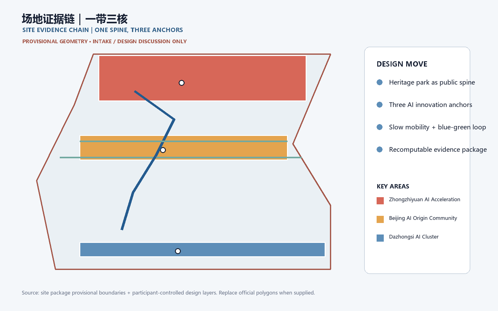
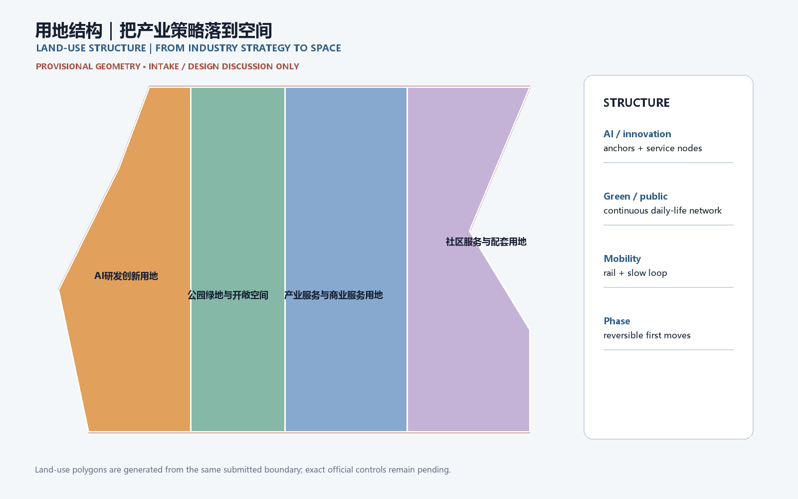
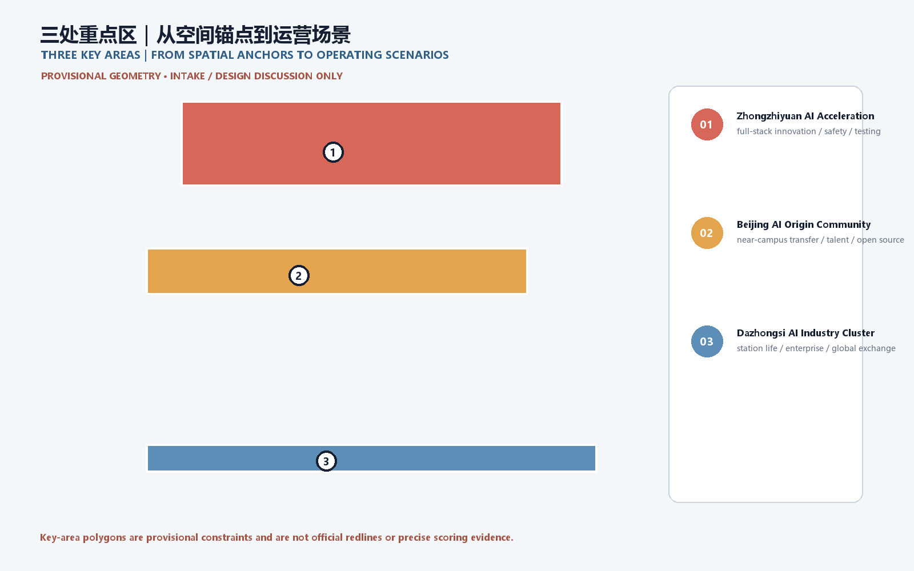
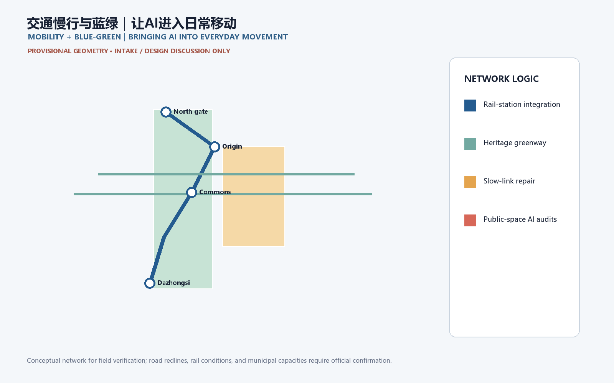
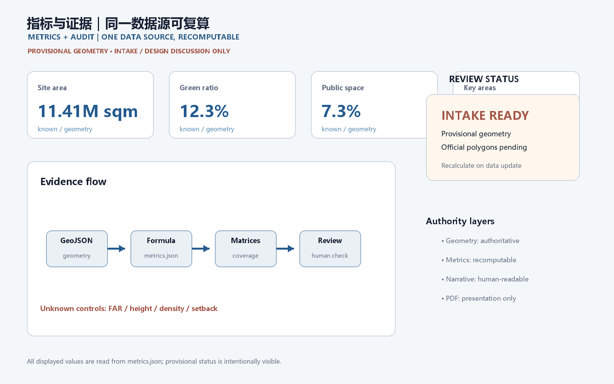

# Jing-Zhang Co-creative Green Spine: A Verifiable City from Railway Heritage to AI Everyday Life

## Design basis and evidence boundary

This proposal responds to the official qualification announcement and the cleared agent taskbook. The concept is organized as a human-readable design judgment supported by GeoJSON, recomputable metrics, matrices, and an offline visual package [source:OFFICIAL-ANNOUNCEMENT] [source:AGENT-TASKBOOK] [depth:existing_conditions_diagnosis].

The proposal uses the repository source registry to separate formal-ready sources from background and provisional material [source:SOURCE-REGISTRY]. The current site and key-area polygons are provisional constraints. They support temporary generation, discussion, visualization, and intake self-check only; they are not official redlines, approval evidence, or precise area evidence. If official polygons arrive, all design layers, figures, HTML, and metrics must be regenerated together [data:geometry/site_boundary.geojson#SITE-001] [data:geometry/key_areas.geojson#PROV-KEY-001] [metric:site_area_sqm].

## Three-level scope framework

The coordinated research area is treated as the 43.6 km² innovation ecosystem and future-city context; the overall design area is the 11.4 km² urban and industrial area around Jing-Zhang Heritage Park; and the key detailed-design area is the 368.4 ha sequence of three key areas. The three levels are linked through one green-slow-mobility spine, shared service nodes, and phased public-space projects [standard:PROJECT-OFFICIAL-ANNOUNCEMENT] [depth:three_level_scope_framework].

The spatial concept is a “co-creative green spine”: a heritage and public-life axis, three innovation anchors, AI+ everyday scenarios, and a blue-green walking loop. The phrase describes a design framework, not a new statutory boundary. Land use, buildings, roads, public space, and phasing remain traceable to the same provisional site geometry [data:geometry/land_use.geojson#LU-001] [data:geometry/roads.geojson#ROAD-001].

## Coordinated research area: industry and future city

At the research scale, the proposal connects universities, AI enterprises, open-source communities, compute and data services, public-interest testing, and international exchange. The five operating functions are full-stack autonomous innovation, a world-class AI ecosystem, AI+ scenario enablement, an intelligent active city, and global AI governance dialogue [source:AGENT-TASKBOOK] [standard:PROJECT-AGENT-OPEN-CALL-TASKBOOK].

The urban implication is a distributed innovation environment rather than a single campus: workspaces, public testing, cultural interpretation, daily services, and low-speed mobility should be mutually reachable. The design team should deepen the concept with verified transport, public-service, heritage, and infrastructure data; no unverified capacity, control line, ownership, or implementation commitment is asserted.

## Overall design area: renewal and urban-design depth

The overall design area is structured by a north-south heritage park spine, east-west links to campuses and enterprises, a rail-and-walking interchange network, and small public service nodes. The proposal recommends a retain-renovate-new-build decision log, a blue-green public-space network, and an evidence dashboard that can be recalculated when official controls are supplied [standard:MOHURD-URBAN-DESIGN-MEASURES] [depth:overall_spatial_structure].

Land-use areas cover the submitted boundary without gaps or overlaps. Buildings and renewal projects are design references rather than parcel-level demolition conclusions. FAR, height, density, setback, municipal capacity, and detailed road controls remain pending official planning conditions [data:geometry/land_use.geojson#LU-001] [data:geometry/buildings.geojson#BLDG-001] [metric:building_footprint_area_sqm].

## Three key areas and two wings

The Zhongzhiyuan AI Acceleration Area is proposed as a garden-like full-stack innovation district with model testing, standards, safety governance, public demonstrations, and low-carbon experimentation. The Beijing AI Origin Community is proposed as a near-campus result-transfer and talent neighborhood with open-source collaboration, exhibition, living services, and school-community walking links. The Dazhongsi AI Industry Cluster is proposed as an urban AI economy and international exchange street around the station, combining enterprise services, data elements, intelligent devices, content, and public life [data:geometry/key_areas.geojson#PROV-KEY-001] [data:geometry/key_areas.geojson#PROV-KEY-002] [data:geometry/key_areas.geojson#PROV-KEY-003].

The Zhongguancun Technology-Service Wing supplies global factor allocation, capital, policy, and IP services. The Xiaoyuehe Scenario-Empowerment Wing supplies everyday AI pilots, ecology, public-space testing, and community operations. These are conceptual reference schemes for professional teams to deepen, not approved implementation plans [source:AGENT-TASKBOOK] [depth:three_key_area_detailed_design].

## AI ecosystem, talent profiles, and scenario cards

The identity direction is “Jing-Zhang Co-create / 京张共创”: a rail-line gesture joined with a green loop and a small node grid. The visual system should use a restrained heritage red, park green, and technical blue; final marks, fonts, historic images, portraits, and enterprise logos require rights clearance.

Five user profiles are: open-source developer, early-stage team, enterprise visitor, nearby resident, and university teacher/student. Their needs are represented spatially through an open publication hall, testing commons, international exchange lounge, heritage walking loop, and result-transfer station. The system should minimize personal data, preserve manual service channels, and keep AI suggestions explainable and reversible [standard:GENERATIVE-AI-INTERIM-MEASURES] [standard:BARRIER-FREE-ENVIRONMENT-LAW].

The ten scenario cards are: 01 Open Publication Hall; 02 Safety Governance Sandbox; 03 Edge-Compute Service Stop; 04 AI Walkability Navigator; 05 Dazhongsi International Demo Lounge; 06 Qinghe Low-Carbon Innovation Yard; 07 Near-Campus Result-Transfer Street; 08 Data-Element Exchange Hall; 09 AI Daily-Service Pattern Street; and 10 Global AI Event Loop. Each card should state its users, spatial carrier, cleared data inputs, privacy boundary, human review, and operating responsibility [depth:ai_scenario_system] [data:geometry/public_space.geojson#PUBLIC-001].

Three industry validation scenarios are proposed as reversible pilots: an AI walkability audit with field verification; an enterprise service copilot using only public policy and service directories; and a public-safety operations review that produces prompts for human teams rather than automated decisions. A fourth optional pilot is low-speed robot delivery in controlled, monitorable routes [source:AGENT-TASKBOOK] [scenario:ai-traffic-walkability].

## Land use, building scale, and retain-renovate-new-build logic

The land-use structure follows the repository’s national land-use classification references. Building layers distinguish retained, renovated, renewed, new, and pending-confirmation objects. Since existing building surveys, ownership, official controls, and engineering conditions are incomplete, the package records design logic and recalculation triggers rather than fabricated demolition or construction conclusions [standard:MNR-LAND-USE-CLASSIFICATION-GUIDE] [depth:retain_renovate_demolish].

The building footprint metric is recomputed from the submitted geometry. FAR, height, density, setbacks, and control lines are explicitly pending official conditions; they must not be read as approval values [metric:building_footprint_area_sqm] [metric:floor_area_ratio].

## Mobility, rail, municipal systems, and public services

The mobility strategy combines rail-station integration, a slow-speed loop, safer walking and cycling links, non-motorized parking, and reversible AI-assisted audits. Priority questions include the park crossings, Fifth Ring Road interfaces, Wudaokou, Qinghua East Road, Dazhongsi Station, and enterprise frontages. Proposed routes remain within the provisional design boundary and are not road redlines [data:geometry/roads.geojson#ROAD-001] [depth:traffic_rail_slow_parking].

New infrastructure references include public-service nodes, distributed energy, edge computing, resilient drainage, and conventional municipal systems. Pipeline, fire, flood-control, energy, and capacity conditions remain prerequisites for professional deepening [data:geometry/constraints.geojson#CONSTRAINTS] [depth:municipal_new_infrastructure].

## Blue-green public space and city character

The Jing-Zhang Heritage Park vitality belt is the public-space armature. Qinghe, Xiaoyuehe, campuses, enterprises, and neighborhoods are connected through north-south walking and cycling continuity and east-west links. Public-space nodes combine rest, sport, innovation exchange, cultural interpretation, testing, exhibitions, and public services [depth:blue_green_public_space] [data:geometry/green_space.geojson#GREEN-001].

The character strategy joins railway heritage, Zhongguancun innovation, and AI-native culture through a calm technical landscape, legible wayfinding, contribution walls, and three conceptual AI pilgrimage landmarks: the Heritage Evidence Gate, the Open Model Commons, and the Dazhongsi Global Exchange Forum. They are cultural-program and design suggestions, not confirmed landmarks or government events [standard:MOHURD-URBAN-DESIGN-MEASURES] [source:AGENT-TASKBOOK].

## Renewal projects, policies, and phasing

Six reference projects are mapped: JZ-01 heritage-park walking-gap repair; JZ-02 Qinghe innovation edge; JZ-03 origin-community result-transfer street; JZ-04 Dazhongsi station pedestrian links; JZ-05 AI public-service and edge-compute node; and JZ-06 global AI event loop. A near-term phase focuses on reversible pilots and public-space operations, a mid-term phase coordinates renewal and service nodes, and a long-term phase awaits official controls, infrastructure, ownership, and implementation conditions [depth:renewal_project_list] [depth:phasing_implementation] [data:geometry/phasing.geojson#PHASE-001].

Policy suggestions cover urban-renewal coordination, open-space access, public participation, data governance, rights clearance, inclusive service, and community operations. The proposal does not guarantee funding, approval, construction, or operation.

## Metrics, area recomputation, and compliance

Known geometry metrics include site area, building footprint area, green ratio, public-space ratio, and the count of three key areas. Every metric records status, value, unit, source files, formula, confidence, and assumptions. FAR and official controls remain unknown until the responsible authority supplies the necessary conditions [metric:site_area_sqm] [metric:green_ratio] [metric:public_space_ratio].

The compliance matrix covers the announcement’s three scope tasks and agent.1-agent.6. The standard matrix covers mandatory professional references, and the design-depth matrix records the evidence needed for formal urban-design review. The current package is intake-ready but remains professionally provisional because the official boundary and control conditions are not present [data:geometry/key_areas.geojson#PROV-KEY-003] [source:SITE-PACKAGE].

+## A visitor is the first user: an executable journey from arrival to return

This refinement turns the city design into a journey that a visitor can actually walk, understand, pause within, and critique. Visitors do not need planning vocabulary or a phone app: every node has physical wayfinding, a paper route card, a visible service desk, and a human takeover option. Distances are scheme-level estimates and must be rechecked after official boundaries, streets, and accessibility surveys are released.

### Four reasons to visit

1. **Railway memory comes first.** The arrival foyer uses the old Jing-Zhang railway story, a timeline, and touchable material before introducing AI.
2. **The green spine is an everyday street.** The heritage park connects rail, neighborhoods, innovation campuses, and the Qinghe edge beyond event days.
3. **The AI Origin Open Courtyard explains responsibility.** Open-source publishing, translation, service consultation, and shaded seating share one legible public room; every demo is labeled real, test, or pending.
4. **The Zhongzhiyuan Test Harbor shows stoppable intelligence.** Robot yielding, interoperability, offline degradation, and human takeover are visible short tests with a stop line, button, and result board.

### Three executable visitor routes

| Route | Visitor | Sequence | Distance/time | Convenience promise |
| --- | --- | --- | --- | --- |
| First Visit: Railway Memory Loop | First-time, family, overseas visitor | Arrival foyer—Memory Yard—heritage park—AI Origin Courtyard—north return | 2.4 km / 120 min | Seat, water, and wayfinding every 300–400 m; fully usable without a phone |
| Half Day: Three-Anchor Innovation Line | Professional visitor, group, weekend visitor | Arrival—AI Origin—Zhongzhiyuan—Dazhongsi pitch lounge—rail return | 5.2 km / 240 min | Each anchor can be skipped or revisited; staff can replace the route |
| Slow and Quiet: Accessible Experience Loop | Older adult, wheelchair user, child, sensory-sensitive visitor | Arrival—rain garden—quiet yard—family service point—arrival | 1.6 km / 90 min | Low slope, continuous rest, accessible toilet, quiet hours; avoids the test area |

The journey data is stored in visual/assets/visitor_journey.json and the route diagram in visual/assets/visitor_routes.json (GeoJSON content). Both are provisional design geometry for discussion, not road redlines or statutory boundaries.

### Ten service nodes from arrival to return

| Node | Visitor action | Space and service | Failure fallback |
| --- | --- | --- | --- |
| 01 Arrival foyer | Find entry, water, and map | Railway timeline, staffed desk, paper route card, water, toilet | Paper map works without a phone; staff escort visitors back |
| 02 No-app welcome | Choose route and language | Large-print board, color coding, icons, sign-language/visual cues | No identity collection; only anonymous route feedback |
| 03 Railway Memory Yard | Touch, listen, photograph | Heritage replicas, shade, child-height labels | Covered detour in rain; one-way loop when crowded |
| 04 Everyday Green Spine | Walk, cycle, watch daily life | Continuous slow path, resting edge, low-glare night lighting | Tree-shade branch in heat; step-free branch for wheelchairs |
| 05 Rain Garden | See the blue-green system | Visible water path, seasonal planting, water point | Close the sunken zone in storms; switch to safe hardscape route |
| 06 AI Origin Open Courtyard | See publishing and ask questions | Open-source hall, results wall, shared tables, service desk | Static cases and paper boards remain if demo is canceled |
| 07 Human Takeover Station | Decide whether to continue | Red takeover button, staff, event explanation | Anyone may pause; reason is recorded without tracking people |
| 08 Zhongzhiyuan Test Harbor | Watch low-risk interaction | Robot yielding, interoperability, offline mode, stop line, result board | Offline demo during outage; immediate shutdown on anomaly |
| 09 Family/Quiet Yard | Rest and reduce stimulation | Nursing place, child-visible boundary, quiet seats, accessible toilet | Visitors may return directly without finishing the route |
| 10 North Return Point | Choose rail or short shuttle | Return signs, human verbal update, commemorative stamp | Paper alternative and escorted walk during service interruption |

### Weather, fatigue, and device-failure branches

- **Heat or poor air:** recommend the 1.6 km quiet loop, shade, and indoor nodes; signs show the distance to the next seat.
- **Rain or ponding:** the test harbor and rain garden become view-only; use covered paths and hardscape, never making wading a visitor duty.
- **Lost child or item:** return to the nearest human takeover station; use route numbers, never personal data on public screens.
- **Dead phone or no network:** paper maps, physical color bands, and staff service remain complete; AI is an enhancement layer.
- **Test anomaly:** press the physical stop button first; staff explain stopped, testing, or pending review; model output is not a city-management decision.

### Validate the design with visitors

Before opening, run three small walk-throughs: find a route within three minutes; complete 30 minutes with older, wheelchair, and family visitors; then simulate heat, rain, network loss, and test failure. Record wayfinding time, missed nodes, time to toilet/water, continuation after rest, human-takeover success, and whether visitors understand real/test/pending labels. These are design-validation measures, not an official operations promise.

## Risks, copyright, and public-claim boundaries

The primary risks are provisional geometry, missing planning controls, incomplete building and infrastructure surveys, heritage-rights confirmation, accessibility verification, data licensing, and the possibility that AI suggestions are mistaken for official decisions. All public claims must distinguish official facts, design proposals, and pending professional confirmation. External images, fonts, logos, portraits, and enterprise examples must be cleared or omitted [depth:risk_missing_data] [data:geometry/constraints.geojson#CONSTRAINTS].

The package uses local, offline HTML and locally generated figures. AI assistance is disclosed in the agent card; public-service, safety, health, legal, and accessibility suggestions retain human review and non-digital alternatives. The proposal is a community-display design submission and does not represent government approval or implementation.

## Reference files

- `brief/site-package/design_brief.json`
- `brief/site-package/agent_taskbook.json`
- `brief/site-package/allowed_design_space.json`
- `brief/site-package/ranges/planning_limits.json`
- `data/source_registry.json`
- `data/processed/agent_fact_pack.md`
- `sources.json`, `metrics.json`, `compliance_matrix.json`, `standard_matrix.json`, and `design_depth_matrix.json`
