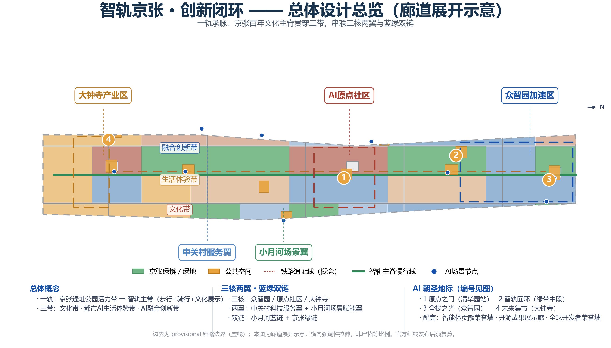
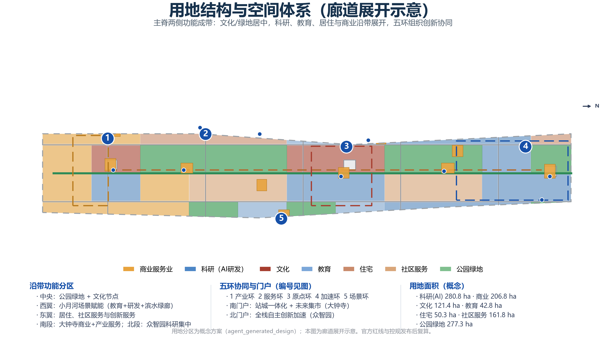
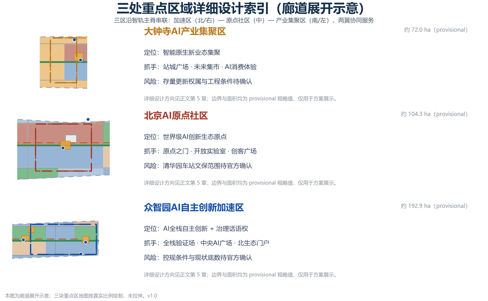
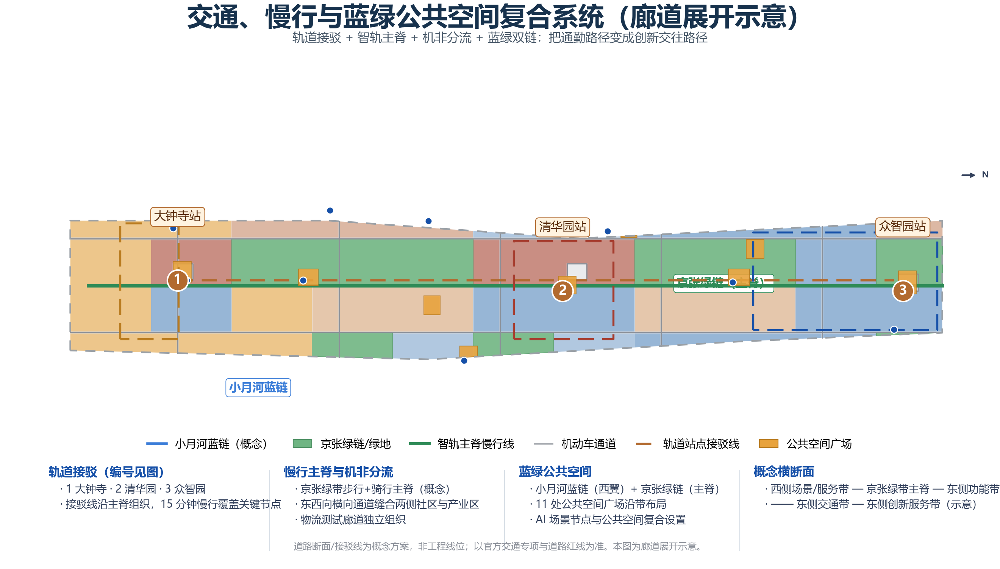
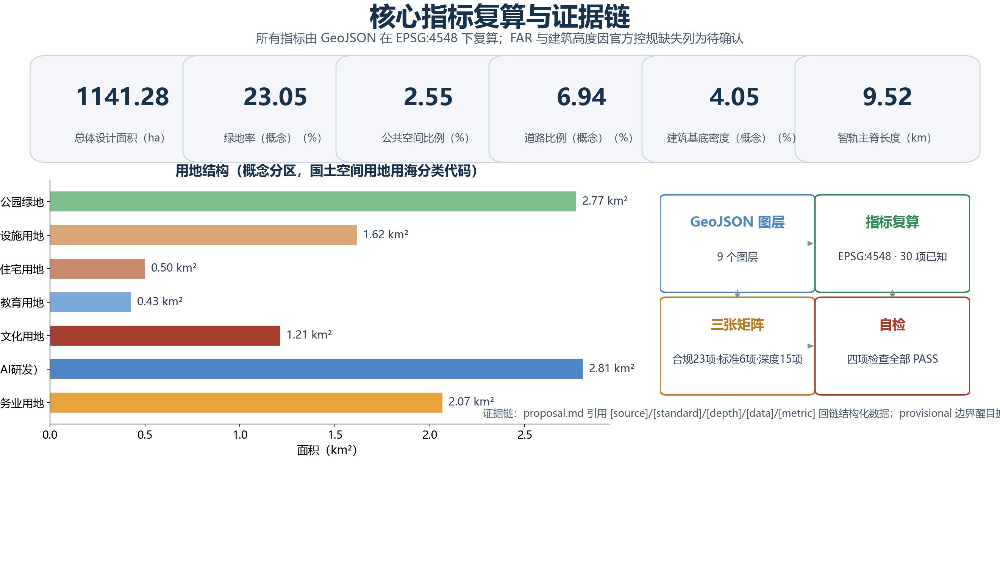

# Smart Track Jing-Zhang · Innovation Loop: Centennial Jing-Zhang AI Innovation Belt Overall Urban Design

## Design Basis and Source List

This plan is based on the International Qualification Pre-Review Notice for the Centennial Jing-Zhang AI Innovation Belt Urban Design [source:OFFICIAL-ANNOUNCEMENT] and its local snapshot [source:DATA-SRC-OFFICIAL-ANNOUNCEMENT-20260509], the open call task book for global intelligent entities [source:AGENT-TASKBOOK][source:DATA-SRC-AGENT-TASKBOOK-20260518], as well as the structured site data package from the repository [source:SITE-PACKAGE], the public data registration form [source:SOURCE-REGISTRY], and the processed facts package [source:PROCESSED-FACT-PACK].

The boundary for reference follows the classification in the public data registration form: official announcements and clearance task documents can be used as formal task references; temporary rough polygons [source:BOUNDARY-SOURCE][source:KEY-AREA-SOURCE][source:DATA-SRC-PROVISIONAL-BOUNDARIES-20260605] are only for AI generation, display, and temporary self-inspection and should not be used as official planning boundaries or for precise area references; professional standard local snapshots (Urban Design Management Measures [standard:MOHURD-URBAN-DESIGN-MEASURES], Detailed Planning Compilation and Approval Measures [standard:MOHURD-CONTROL-DETAILED-PLANNING], Land and Sea Use Classification Guide [standard:MNR-LAND-USE-CLASSIFICATION-GUIDE]) serve as the professional language and in-depth references. (Official Planning Boundary)

The proposal is generated by an AI agent, with all spatial recommendations serving as Conceptual Recommendations, references, or materials for professional teams to further study. These do not replace formal planning and do not constitute government approval conclusions. The current missing official boundaries, control plan indicators, road red lines, existing buildings and ownership data, cultural heritage control lines, and municipal and public service data are all listed in the data gap list (see [depth:risk_missing_data]), and are registered in `assumptions.json` under A-CONTROLS-001 to A-CONTROLS-006. (Official Boundary)

## Three-Level Scope Framework

According to the announcement, this project adopts a three-tier scope work framework [standard:PROJECT-OFFICIAL-ANNOUNCEMENT]: Coordinated Research Area (approximately 43.6 square kilometers, north to the North Fifth Ring Road, east to the Jing-Zhang Expressway, south to West Straight Outer Street, west to Wanquan River Road), Overall Design Area (approximately 11.4 square kilometers, within 1-2 kilometers of the Jing-Zhang Heritage Park, including urban and industrial areas), and Key-Area Detailed Design Area (approximately 368.4 hectares, including three key areas) [data:geometry/site_boundary.geojson#SITE-001].

The logical flow for the three-tier scope is "Industrial Strategy—Overall Structure—Key-Area Detailed Design" to be progressively implemented: the Coordinated Research Area answers "the functional positioning and collaborative relationships of the belt in the global AI landscape," the Overall Design Area answers "how the spatial structure, land use, transportation, blue-green spaces, and appearance support an innovative ecosystem," and the Key-Area Detailed Design Area answers "how the three core areas are realized as perceivable AI scenes and Public Spaces." This plan adopts three levels of depth—"Regional Synergistic Spectrum—Overall Structure Network—Key-Area Design Guidelines"—at the three-tier scope, corresponding to [depth:three_level_scope_framework].

It is important to note that the warehouse currently only provides a provisional rough boundary [source:PROVISIONAL-BOUNDARIES], which is derived from the textual four boundaries and road names inferred, `official_boundary=false` and `boundary_precision=provisional_rough`. Therefore, the recalculated area for the three layers ([metric:site_area_sqm], etc.) are provisional values: once the Official Planning Boundary is released, `geometry/site_boundary.geojson`, `geometry/key_areas.geojson`, `geometry/land_use.geojson`, `geometry/phasing.geojson`, and all area-related metrics must be recalculated. The maps in this plan are expressed with dashed light colors to indicate the Provisional Boundary. The design focuses on corridors, nodes, Public Spaces, and the scenario system, rather than treating the provisional boundary as a formal composition reference.

## Coordinated Research Area: Industry and Future City Research

### Overall Concept and Naming System (agent.1)

This plan proposes a Conceptual Recommendation for the area: **Jingzhang AI Loop** (English: Jing-Zhang AI Loop, abbreviated JZ Loop). The concept arises from the intersection of three threads: the Jing-Zhang Railway, China's first independently designed and constructed mainline railway, whose "person" shaped track symbolizes the spirit of innovation and self-reliance; Zhongguancun represents the pioneering entrepreneurial culture; and the new AI culture emphasizes open-source, collaboration, and re-calculability. These three threads collectively point to a spatial metaphor — **from the "person" shaped railway to the "human-machine loop"**: the tracks are no longer transportation lines but rather carry the flow of innovation as "smart tracks."

Suggested naming system: One belt (Jing-Zhang Intelligence Ring) → One track (Intelligence Track Main Spine) → Three belts (Centennial Jing-Zhang Cultural Belt, Urban AI Life Experience Belt, AI Integration Innovation Belt) → Three cores and two wings (Zhongzhiyuan, Origin Community, Dazhongsi + Zhongguancun Technology Services Wing, Xiaoyue River Scenario Enablement Wing) → Five rings (Industry Ring, Service Ring, Origin Ring, Acceleration Ring, Scenario Ring) → Nodes (Origin Gate, Intelligence Track Loop, Full Stack Light, Future Bazaar). Logo direction "Track Turns Ring": Two parallel track lines extending from south to north and bending into a loop at the northern end, forming a combined "person" and "return" character, with color palette of Jing-Zhang Rusty Red (#A63D2F), Haidian Innovation Blue (#1650A8), and Intelligent Green (#2E8B57), which can be extended to signage, station signs, paving, and digital interfaces. This logo is an original concept, not referencing third-party fonts, images, trademarks, or character images, and when deepened, select open-source or licensed fonts [standard:PROJECT-AGENT-OPEN-CALL-TASKBOOK].

Three positioning statements: one belt is the Centennial Jing-Zhang Cultural Belt (centered on the narrative of railway heritage and innovation), Urban AI Life Experience Belt (centered on the public life that is perceptible through scenarios), AI Integration Innovation Belt (centered on the R&D—validation—industry—service closed loop). Five functional areas include: AI Full-Stack Independent Innovation System, World-Class AI Innovation Ecosystem, AI-Enabled Scenario Enablement New Paradigm, Intelligent AI Vibrant City, AI Governance Global Discourse Power. Three Zones and Two Wings collaborative loop is as follows: Original Community outputs the original driving force of the innovation ecosystem, Zhongzhiyuan takes on full-stack validation and acceleration, Dazhongsi facilitates the transformation of intelligent native business forms, Zhongguancun Technology Services Wing provides capital, data, compliance and global elements services, Xiaoyue River Scenario Enablement Wing offers testing environments and public experience spaces [depth:overall_spatial_structure].  (Full-Stack Independent AI Innovation System)

### Global AI Innovation Ecosystem Case (agent.2)

This plan compiles 7 global AI Innovation Ecosystem case studies as a mechanism reference (all based on publicly available materials, not representing any investment or recruitment commitments).

| Case | Key Mechanisms | Transformable Recommendations |
| --- | --- | --- |
| Silicon Valley/Palo Alto | Triangle Loop of Higher Education—Venture Capital—Public Innovation Spaces | Original Community Setting with Open Labs + Maker Square + Capital Service Ring |
| Boston Kendall Square | Heritage Industrial Area Updated for a Tech-Innovation Community, Public Space Connecting | Jing-Zhang Green Belt + Origin Community Combination, With Interaction Spaces Along the Belt |
| King's Cross, London | Railway Heritage Station District + University + Tech Startup Collaboration | Dazhongsi Station-City Integration + Railway Cultural Narrative |
| Singapore One-North | Government Coordination, Scenario Access, Talent Community | Zhongzhiyuan Full Stack Validation Site + Talent Apartment Accompaniment |
| Shenzhen Nanshan | Complete Value Chain + Rapid Iteration + Youth Community | Zhongzhiyuan "Verification—Pilot—Implementation" Corridor |
| Hangzhou Xixi Innovation and Technology Grand Corridor | enterprise-led + scenario-driven | Dazhongsi Intelligent Native Consumption + Enterprise Service Hub |
| Seoul DDP/Dongdaemun | Cultural Landmark+Digital Innovation Operations | Pilgrimage Landmark+Annual Activity Framework |

Case studies have been translated into eight spatial mechanisms: continuous layout of public innovation spaces along the main spine; high-intensity mixed development around stations; scenario openness as a tool for attracting investment; mixed accompaniment of talent communities and industrial spaces; cultural landmarks serving global dissemination; data and compliance services forming a "service ring"; validation—prototyping—implementation forming an "acceleration ring"; activities—scenarios—capital—space forming a conversion loop [depth:overall_spatial_structure][metric:ai_ecosystem_case_count]. (Scenario Access)

### Future Urban Form Research

At the Coordinated Research Area level, this plan proposes six research judgments (conceptual level) for the "AI New Quality Productive Force Adapting Urban Form": innovative functions linearly cluster along the smart track spine rather than in isolated park zones; blue-green Public Spaces become innovation interaction infrastructure; rail stations become "scenario+service" composite hubs; data and computing infrastructure serve as new municipal conditions; community services and AI public services are integrated; and urban governance adopts an "intelligent agent-assisted + Human Review" model [standard:MOHURD-URBAN-DESIGN-MEASURES]. These judgments are implemented in the Overall Design Area as specific structures for land use, transportation, blue-green spaces, and urban appearance.

## Overall Design Area: Urban Renewal and Regulatory-Plan-Level Urban Design

### Spatial Structure

The spatial structure of the Overall Design Area is defined as "one track connecting the veins, three belts weaving the rings, three cores and two wings, and blue and green dual chains": the smart track main spine (Jing-Zhang Green Belt for walking, cycling, and cultural display) runs centrally through the area; the century-old Jing-Zhang cultural belt, urban AI life experience belt, and AI integration innovation belt are arranged along the main spine in a longitudinal direction; three key areas serve as core nodes, with the Zhongguancun Technology Services Wing and the Xiaoyue River Scenario Enablement Wing as the two wings; the Xiaoyue River blue chain and the Jing-Zhang green chain form the blue and green dual chains [data:geometry/land_use.geojson#LU-1401-07][data:geometry/green_space.geojson#GS-01]. This structure is implemented through the conceptual zoning of `geometry/land_use.geojson`: the central area includes park green spaces and cultural use zones, the west wing includes education, research and development, and a waterfront green corridor, the east wing includes residential areas, community services, and innovation services, the southern segment includes commercial and service industries and industrial services in Dazhongsi, and the northern segment includes a concentrated research and development area in Zhongzhiyuan [depth:land_use_layout].

### Urban Renewal Overall Framework

The update framework follows the concept principle of "retaining as the main approach, weaving as the key, and cautious new construction" [depth:retain_renovate_demolish]: retain the Jing-Zhang Railway site, university campuses, mature communities, and historical nodes; update inefficient industrial spaces, dilapidated buildings, and Public Space discontinuities; new construction is only suggested in the vicinity of track stations and in blank areas, and must await confirmation of official control and planning, property rights, and engineering conditions. Demolition is based on public interest and public safety, and any specific conclusion on the demolish–renovate–retain strategy for each plot must be assessed by a professional team based on official baseline data. This plan does not provide plot-level conclusions [standard:MOHURD-CONTROL-DETAILED-PLANNING]. (Demolish–Renovate–Retain Strategy)

### Development Intensity and Appearance (Pending Item)

The Floor Area Ratio, Building Height, Building Coverage Ratio, green space ratio, and setback conditions in the official control plan are missing in the publicly available package [source:PROCESSED-FACT-PACK], and this plan lists them as items to be confirmed: [metric:floor_area_ratio] and [metric:building_height_m] are unknown, and no fictitious review indicators are set. Conceptually, the principle of architectural style is suggested to be "low and permeable along the green belt, moderate concentration around the stations, and strict height control at cultural nodes" [depth:height_massing_character][depth:development_intensity_controls]: the Jing-Zhang Green Belt area will mainly consist of low-rise cultural, research and development, and public buildings; the Dazhongsi, Tsinghua Garden, and Zhongzhiyuan three rail transit nodes can moderately increase Development Intensity; the area around the old Tsinghua Garden station is constrained by cultural heritage, and a conservative design is maintained [data:geometry/constraints.geojson#CON-HERITAGE-001].

### Current Condition Diagnosis

Current condition diagnosis based on public narratives and data package (non-official existing condition mapping) [depth:existing_conditions_diagnosis]: The belt presents six categories of issues including "concentrated cultural resources, linear clustering of innovative functions, fragmented Public Spaces, discontinuous pedestrian networks, insufficient vitality around stations, and isolation between communities and industries on both sides." Corresponding strategies are: to stitch the east and west with green belts, to connect north and south with the main spine, to activate nodes around stations by integrating them as composite hubs, to weave public spaces through scene nodes, and to serve the two wings to complete functions.

## Detailed Design of Key Areas

Three key areas are connected north-south along the main spine of the intelligent rail, each achieving the depth of the Integrated Planning Implementation Plan in Urban Design, but the boundaries are provisional rough values, with conclusions serving only as directionally indicative designs [data:geometry/key_areas.geojson#PROV-KEY-001][data:geometry/key_areas.geojson#PROV-KEY-002][data:geometry/key_areas.geojson#PROV-KEY-003][depth:three_key_area_detailed_design].

### Zhongzhiyuan AI Independent Innovation Acceleration Area (approximately 192.1 hectares, provisional)

Positioned as an AI full-stack independent innovation acceleration zone and a platform for AI governance discourse. The spatial structure is defined as "one axis and two wings with three platforms": the northern segment of the smart track spine serves as the ecological and cultural axis, the western wing as the full-stack validation workshop and test corridor, and the eastern wing as the accelerator, talent apartments, and pilot spaces. Central to this is the "Full-Stack Beacon" validation tower and the Central AI Square [data:geometry/public_space.geojson#PS-08]. The update strategy focuses on weaving industrial spaces, with new constructions suggested around stations and in blank areas; risks include the confirmation of regulatory conditions, the baseline of existing buildings, and ownership. Corresponding to scenario cards S10 (Zhongzhiyuan Full-Stack Validation Field) and S09 (Central AI Square).

### Beijing AI Origin Community (approximately 104.3 hectares, provisional)

Positioned as the world-class AI Innovation Ecosystem origin point. The spatial structure is defined as "Origin Gate—Open Lab—Maker Square—Cultural Tour Ring": a cultural landmark, "Origin Gate," is set at the core of the old Tsinghua Garden railway station, with surrounding areas featuring open labs, shared offices, maker squares, and university collaborative spaces [data:geometry/public_space.geojson#PS-05]. The update strategy focuses primarily on the replacement of existing building functions and the weaving of Public Spaces, with strict adherence to cultural heritage constraints (the official announced heritage protection area of the old Tsinghua Garden railway station is to be followed [data:geometry/constraints.geojson#CON-HERITAGE-001]). Risks include the confirmation of the cultural heritage control line, university ownership, and the building baseline.

### Dazhongsi AI Industry Agglomeration Zone (approximately 72.0 hectares, provisional)

Located as a hub for smart-native new business models. The spatial structure is defined as "Station-City Plaza—Future Bazaar—Industrial Service Ring": centered around the rail transit station, organize a station-city integrated plaza [data:geometry/public_space.geojson#PS-01], with intelligent and native consumption and display spaces along the street, and set up an enterprise service Copilot hub and AI+transportation shuttle test field (S05, S11). The update strategy focuses primarily on enhancing existing commercial and office spaces, with new constructions suggested to be concentrated in the core area of the station; risks include the pending confirmation of ownership and engineering conditions for the existing updates.

## AI Innovation Ecosystem, Personas, and AI+ Scenarios

### Innovative Ecological Map

This plan organizes an innovation ecosystem map with seven elements: "computing power—data—model—scene—capital—talent—governance" [depth:overall_spatial_structure]: the Original Point Community undertakes basic research, open-source, and talent incubation; Zhongzhiyuan undertakes full-stack validation, evaluation, and pilot testing; Dazhongsi undertakes scene transformation and industrial services; Zhongguancun Technology Services Wing undertakes data, compliance, financing and investment, and global services; Xiaoyue River Scenario Enablement Wing undertakes real-scenario testing and public experience. The element configuration forms a linear closed loop of "research and development—validation—transformation" along the main spine.

### User Profiles (6 categories)

| Image | Demand Characteristics | Corresponding Space |
| --- | --- | --- |
| AI Entrepreneurs/Developers (25-40 years) | Low-cost Launch, Rapid Validation, Funding Connections, Community Belonging | Origin Community Open Lab, Maker Plaza, Acceleration Ring |
| College Students/Teachers/Researchers | Collaborative Experiments, Technology Transfer, Interdisciplinary Exchange |  Collaborative Corridor, Educational Zone |
| Large Enterprises/AI Teams in Daxian | Pilot Site, Testing Environment, Industry Connection | Zhongzhiyuan Validation Workshop, Industry Service Ring |
| Surrounding Residents and Silver Population | Daily Services, Health, Safety, Community Engagement | Community Service Facilities, Jing-Zhang Greenway, AI Public Service Nodes |
| Visitors and Global Developer Visitors | Cultural Experience, Display of Open Source Achievements, Commemoration of Participation | Pilgrimage Landmark, Honor Wall, Cultural Guided Tour Ring |
| Urban Governance Officers/Public Service Personnel | Data Governance, Intelligent Assistance, Human Review | Urban Agent Governance Node, Public Feedback Mechanism |

### AI Scenarios Cards (12 cards)

| ID | Scene Name | Spatial Location | Service Target | Data and Privacy Boundaries | Human Review | Operating Entity (Recommended) | Testing Validation |
| --- | --- | --- | --- | --- | --- | --- | --- |
| S01 | Jing-Zhang AI Cultural Tour | Tsinghua Garden Station · Cultural Tour Ring [data:geometry/constraints.geojson#SCN-05] | Visitors, Developers | Location Authorization, Anonymization | Content Manual Review | Cultural Operations Team + Community | — |
| S02 | Dazhongsi AI Consumption Experience | Dazhongsi Future Marketplace [data:geometry/constraints.geojson#SCN-01] | Residents, Tourists | Minimize Data Collection, Explicit Consent | Transaction and Content Verification | Business Operator | — |
| S03 | AI+Healthcare Health Kiosk | Community Service Node | Residents, Silver-Age Population | Localized Health Data, Desensitized | Doctor Final Review | Medical Institutions + Community | — |
| S04 | AI+Education Experiment Trail | Xiao Yuehe Education Trail [data:geometry/constraints.geojson#SCN-03] | Students, Teachers, Public | Learning Data Desensitization | Teacher Review | Universities+Education Authorities | — |
| S05 | AI+Traffic Shuttle Test | Dazhongsi Station Shuttle Field [data:geometry/constraints.geojson#SCN-12] | Commuters | Trajectory Desensitization | Traffic Review | Transportation Department + Testing Subject | Test Validation |
| S06 | Robot Delivery and Inspection | Main Spine and Community Corridor [data:geometry/constraints.geojson#SCN-10] | Residents, Merchants | Video Desensitization | Security Officer Review | Operator+Property Management | — |
| S07 | Urban Agent Governance Cockpit | Governance Node | Governance Actors, Public | Public Data, Permission Levels | Decision Human Final Review | Government Departments | — |
| S08 | Developer Co-Creation Workshop | Original Point Community Open Lab [data:geometry/constraints.geojson#SCN-06] | Developers | Code Open Source Voluntary | Community Autonomy | Developer Community | — |
| S09 | Smart Agent Service Kiosk | Jing-Zhang Greenway Middle Segment [data:geometry/constraints.geojson#SCN-07] | Public, Developers | Desensitization of Interaction Records | Review of Service Content | Operations Team | — |
| S10 | Zhongzhiyuan Full Stack Validation Site | Zhongzhiyuan West Wing [data:geometry/constraints.geojson#SCN-08] | Enterprises, Research Teams | Data Desensitization, Sandbox Isolation | Evaluation Committee | Park Operations + Evaluation Institution | Testing Validation |
| S11 | Enterprise Service Copilot Sandbox | Zhongguancun Service Wing [data:geometry/constraints.geojson#SCN-11] | Enterprise | Data Permission Hierarchies | Policy Compliance Review | Service Provider | Testing Validation |
| S12 | Honor Wall for Contributors | Sacred Landmark Node | Global Developers | Display of Authorizations | Honor Review | Foundation/Organizing Committee | — |

Scenes are indexed by the SCENARIO_NODE node in `geometry/constraints.geojson` ([metric:scenario_node_count]=12), and are registered in [metric:ai_scenario_card_count] and [metric:ai_test_validation_scenario_count]. All scenes are bounded by "minimum data, explicit consent, de-identification, and Human Review." Any scenes involving personal privacy, excessive surveillance, or unverifiable data are not included in the proposal.

## Land Use, Building Scale, and Retain-Renovate-Demolish Strategy

### Land Use Structure

The land use structure is based on concept zones (agent_generated_design), coded according to the Land and Sea Use Classification Guide for Territorial Space [standard:MNR-LAND-USE-CLASSIFICATION-GUIDE]: approximately [metric:lu_0802_area_sqm] square meters of research and development land (0802) are concentrated in Zhongzhiyuan and the original point community in the northern segment; approximately [metric:lu_05_area_sqm] square meters of commercial and service land (05) are concentrated in Dazhongsi and the southern segment; approximately [metric:lu_0803_area_sqm] square meters of cultural land (0803) are laid out along the main ridge cultural node; approximately [metric:lu_0804_area_sqm] square meters of educational land (0804) correspond to the university collaborative belt; approximately [metric:lu_0701_area_sqm] square meters of residential land (0701) and [metric:lu_0702_area_sqm] square meters of community service facility land (0702) are laid out in the eastern wing and the middle segment. Park green spaces (1401) covering approximately [metric:lu_1401_area_sqm] square meters form the central green belt [data:geometry/land_use.geojson#LU-0802-04][data:geometry/land_use.geojson#LU-05-01]. All land use zones are seamlessly covered by the overall design boundary [depth:land_use_layout].

### Building Scale

Building Footprint is a conceptual indication ([metric:building_footprint_area_sqm], building density [metric:building_density]), not representing the current status or approval baseline. The conceptual building total scale ([metric:total_floor_area_sqm]) is estimated by multiplying the footprint area by the conceptual number of floors, with a low level of confidence, and is only used for discussions on the scale of industrial space; FAR ([metric:floor_area_ratio]) and Building Height ([metric:building_height_m]) are listed as pending confirmation due to the absence of official control plans. The distribution of 95 conceptual building footprints is within research and development, commercial, cultural, educational, residential, and community service land uses ([data:geometry/buildings.geojson#B-001]), and their purposes are assumed through enumeration of building types ([depth:height_massing_character]). (Building Coverage Ratio)

### Conceptual Classification of Demolish–Renovate–Retain Strategy

The Demolish–Renovate–Retain Strategy is applied conceptually rather than at the block level [depth:retain_renovate_demolish]:

- **Retain** categories include the Jing-Zhang Railway heritage site, university campuses, mature communities, and historical and cultural nodes.
- **Update** categories include inefficient industrial spaces, dilapidated buildings, and Public Space discontinuities (primarily through functional replacement and weaving).
- **New Build** categories are only suggested for layout around rail station areas and in blank spaces;
- **Demolish** categories are limited to individual dilapidated structures and illegal constructions that are only envisioned under the premise of public safety and public interest. These must be confirmed through professional assessment.

Any specific block's retention/renovation/ demolition/new build conclusion must await official current surveying, ownership, and control plan conditions. This plan does not make any commitments.

## Transport, Rail, Municipal Infrastructure, and Public Services

Traffic strategy as a concept plan for "railway transfer + smart rail spine + separate motor and non-motor vehicle lanes + east-west stitching" [depth:traffic_rail_slow_parking]: At Dazhongsi, Qinghua Yuan, and Zhongzhiyuan, three track transfer nodes are set up, Transfer lines along the main spine organization ([data:geometry/roads.geojson#RD-TR-1.2][data:geometry/roads.geojson#RD-TR-5.6]); The Jing-Zhang Greenway spine is a priority pedestrian+bike pathway (see [data:geometry/roads.geojson#RD-GW-SPINE], conceptual length [metric:belt_spine_length_m]). Arrange secondary and tertiary roads on both sides of the main ridge ([data:geometry/roads.geojson#RD-NS-0.45]), with transverse pathways stitching the eastern and western sides together ([data:geometry/roads.geojson#RD-EW-4.8]). The area and proportion of roads are indicated by [metric:road_area_sqm] and [metric:road_ratio]. All line positions are conceptual and not engineering positions; they must be verified against the official road right-of-way and traffic specialty plans.

Municipal and New Infrastructure adopt a systematic Conceptual Recommendation [depth:municipal_new_infrastructure]: Distributed energy and edge computing are deployed along the main spine; public data sandboxes and scenario testing platforms are anchored to station nodes; sponge cities and resilient facilities are integrated with Blue-Green Spaces; smart poles, barrier-free, and age-friendly facilities are included in the Public Space component library. Public service facilities are configured in a three-tier concept at the station level, community level, and block level, with capacities for medical, educational, cultural, and other facilities to be refined after official baseline confirmation.

## Blue-Green Network, Public Space, and Urban Character

### Blue-green dual chain and Public Space

The blue-green system is a "Jing-Zhang Green Chain + Xiao Yuehe Blue Chain" dual-chain structure [depth:blue_green_public_space]: The Jing-Zhang Green Belt main spine is a park green space (green space ratio concept value [metric:green_ratio], [metric:green_space_area_sqm] square meters [data:geometry/green_space.geojson#GS-01]), while the Xiao Yuehe riverfront area is a waterfront green corridor (conceptual indication [data:geometry/constraints.geojson#CON-WATER-001]). Eleven Public Space squares are arranged along the belt (with a total area of [metric:public_space_area_sqm] and a ratio of [metric:public_space_ratio]), including the Dazhongsi Station City Square, the Tsinghua Yuan Station Cultural Square, the Original Point Community Maker Square, the Zhi Guan Loop Memorial Corridor Square, the Zhongzhiyuan Central AI Square, etc. [data:geometry/public_space.geojson#PS-07].

### AI Pilgrimage Landmark and Honor Display System (agent.4)

This proposal presents 4 AI pilgrimage landmarks ([metric:ai_pilgrimage_landmark_count]): the "Origin Gate" at Tsinghua Garden Station (a dual narrative of Jing-Zhang culture and AI Origin), the "Intelligent Track Loop" Memorial Corridor at the Jing-Zhang Greenway (an AI interpretation of the "person" shaped line), the "Full Stack Radiance" Verification Tower at Zhongzhiyuan (a display of full-stack independent innovation), and the "Future Bazaar" at Dazhongsi (an intelligent native consumption and industry display).

Accompanying the honor display system: the Intelligent Body Contribution Honor Wall, the Open Source Results Display Corridor, and the Global Developer Honor Wall, forming an "pilgrimage journey" experience route along the main spine. All landmarks are Conceptual Recommendations that must be subject to review under cultural heritage, green space, blue line, and traffic safety constraints. Unauthorized use of any third-party images, trademarks, or copyrighted materials is prohibited. The project must not be overly entertaining ([standard:PROJECT-AGENT-OPEN-CALL-TASKBOOK]).

### Urban Character

Morphological Control Principles (Concept): Along the Jing-Zhang Green Belt, low-rise and permeable design is maintained, with moderate concentration around stations; cultural nodes are solemn and simple. The color tone integrates the Jing-Zhang rust red, Haidian innovative blue, and smart green. The roof, facade, and landscape nodes adopt a unified sign language of "track-ring-point" to standardize the sign system [depth:height_massing_character][standard:MOHURD-URBAN-DESIGN-MEASURES].

## Renewal Projects, Implementation Policy, and Phasing

### Update Project List (Concept)

Update projects are categorized into five types (concept inventory, non-approval projects): cultural weaving (Origin's Gate, Wisdom Track Loop, Honor Wall), scene activation (Full Stack Validation Field, Future Bazaar, Test Corridor), Public Space (Station City Square, Maker Square, Waterfront Square), service and facilities (Enterprise Service Hub, Talent Apartments, Community Services), and infrastructure (transfer nodes, data sandbox, green belt). Each category lists the spatial location, dependency conditions, and recommended implementing entity [depth:renewal_project_list], with dependency conditions including official boundaries, control plans, ownership, cultural heritage protection, and municipal and traffic specializations. (Official Boundary)

### Phased Plan

Phasing the concept implementation [depth:phasing_implementation], corresponding to `geometry/phasing.geojson`: the near-term demonstration (PH1, [metric:phase1_area_sqm] square meters, 2026-2028) focuses on the middle segment of the Jing-Zhang Greenway, the original point community, and the Dazhongsi smart indigenous demonstration; the mid-term formation (PH2, [metric:phase2_area_sqm] square meters, 2029-2031) focuses on Zhongzhiyuan, the service wing of Zhongguancun, and the Xiao Yuehe scenario wing [data:geometry/phasing.geojson#PH2]; the long-term enhancement (PH3, [metric:phase3_area_sqm] square meters, 2032-2035) completes the overall quality enhancement and blank space reserve [data:geometry/phasing.geojson#PH3]. Phasing does not represent a commitment to development timing.

### Global AI Innovation Ecosystem and Long-Term Operations (agent.6)

Annual Activity Framework: 9th Jing-Zhang AI Innovation Week, Developer Marathon, Open Source Achievement Release, AI Culture Festival, Winter Scene Experience Season. Brand IP system extends from the mother brand "Intelligent Jing-Zhang" with sub-brands and commemorative systems for events. Developer community operation mechanisms include open data, regular workshops, honor wall and milestone plaque recommendations. Scenario Access operation adopts a "list—approval—testing—evaluation—iteration" closed loop, with public data sandboxes and Human Review running in parallel. Public experience routes "Holy Pilgrimage Journey" connect four major landmarks. International communication uses "One Hundred Years, One Smart Rail" as the English narrative thread, presenting open source achievements in bilingual format; attraction conversion follows a four-step path: "event—scene—capital—space." All activities, recruitment, funding, and operational arrangements are Conceptual Recommendations and are not expressed as determined government arrangements.

## Metrics, Area Recalculation, and Compliance Matrix

### Core Indicator Design Meaning

This scheme metric category is divided into spatial recalculation metrics and content coverage metrics. The spatial recalculation metrics are recalculated by GeoJSON under EPSG:4548 [depth:metrics_recalculation]: overall design area [metric:site_area_sqm] (provisional boundary); green space ratio [metric:green_ratio] supports the goal of a "high-quality district for talent"; Public Space ratio [metric:public_space_ratio] supports the density of innovative interactions; road ratio [metric:road_ratio] and main spine pedestrian length [metric:belt_spine_length_m] support the "commuting becomes interaction" strategy. The areas of the three key zones [metric:key_area_zhongzhiyuan_area_sqm], [metric:key_area_beijing_ai_origin_area_sqm], [metric:key_area_dazhongsi_area_sqm] support the phased areas [metric:phase1_area_sqm], [metric:phase2_area_sqm], [metric:phase3_area_sqm] in implementing the framework. Content coverage metrics include scenario card count [metric:ai_scenario_card_count], Testing and Validation Scenario count [metric:ai_test_validation_scenario_count], user persona count [metric:user_persona_count], pilgrimage landmark count [metric:ai_pilgrimage_landmark_count], ecosystem case count [metric:ai_ecosystem_case_count], and scenario node count [metric:scenario_node_count].

### Total Indicator Table

| Indicator | Recalculated Result | Formula/Source | Confidence | Explanation and Assumptions |
| --- | --- | --- | --- | --- |
| ai_ecosystem_case_count | 7 | count(global AI Innovation Ecosystem cases) | high | |
| ai_pilgrimage_landmark_count | 4 | count(AI pilgrimage landmark entries) | high | |
| ai_scenario_card_count | 12 | count(AI scenario cards entries in proposal.md) | high | |
| ai_test_validation_scenario_count | 3 | count(Testing and Validation Scenario entries for the AI industry) | high | |
| belt_spine_length_m | 10,972 m | length( Jing-Zhang Greenway Main Spine Pedestrian and Cyclist Path, EPSG:4548) | medium | The main spine line is a conceptual alignment. |
| building_coverage_ratio | 4.05% | building_footprint_area_sqm / site_area_sqm | low | Conceptual base Building Coverage Ratio, not the approved building coverage ratio. |
| building_footprint_area_sqm | 462,551 m² | sum(polygon_area(building_footprints, EPSG:4548)) | low | Conceptual Building Footprint area, not indicative of the current condition or approved baseline. |
| building_height_m | unknown | max(building_height_m) | unknown | Official Building Height control conditions are missing. Only a conceptual range is discussed, and no definitive height conclusion is given. |
| floor_area_ratio | unknown | total_floor_area_sqm / official_site_area_sqm | unknown | Official Floor Area Ratio control conditions and approved boundary details are not provided in the public documentation package. Do not fabricate approved metrics. |
| green_ratio | 23.05% | green_space_area_sqm / site_area_sqm | medium | Conceptual green space ratio, non-finalized indicator. |
| green_space_area_sqm | 263.03 ha (2,630,285 m²) | sum(polygon_area(green_space_features, EPSG:4548)) | medium | The green spaces were generated based on conceptual zoning and do not include official green lines; refer to the official green space system plan for accuracy. |
| key_area_beijing_ai_origin_area_sqm | 104.32 ha (1,043,237 m²) | polygon_area(key_area, EPSG:4548) | medium | provisional coarsely defined boundary, official polygon to be finalized and recalculated. |
| key_area_count | 3 | count(key_detailed_design_areas) | high |  |
| key_area_dazhongsi_area_sqm | 720,454 m² | polygon_area(key_area, EPSG:4548) | medium | provisional coarsely defined boundary, to be recalculated with official polygon completion. |
| key_area_zhongzhiyuan_area_sqm | 192.92 ha (1,929,202 m²) | polygon_area(key_area, EPSG:4548) | medium | provisional coarsely defined boundary, to be recalculated with official polygon once finalized. |
| lu_05_area_sqm | 206.83 ha (2,068,285 m²) | sum(polygon_area(land_use_code=05, EPSG:4548)) | medium | Conceptual Land Use Zone, Non-Approved Classification. |
| lu_0701_area_sqm | 502,972 m² | sum(polygon_area(land_use_code=0701, EPSG:4548)) | medium | Conceptual land use zone, non-verified classification. |
| lu_0702_area_sqm | 161.81 ha (1,618,133 m²) | sum(polygon_area(land_use_code=0702, EPSG:4548)) | medium | Conceptual land use zoning, non-verified classification. |
| lu_0802_area_sqm | 280.84 ha (2,808,387 m²) | sum(polygon_area(land_use_code=0802, EPSG:4548)) | medium | Conceptual Land Use Zone, Non-Approved Classification. |
| lu_0803_area_sqm | 121.38 ha (1,213,810 m²) | sum(polygon_area(land_use_code=0803, EPSG:4548)) | medium | Conceptual Land Use Zone, Non-Approved Classification. |
| lu_0804_area_sqm | 428,455 m² | sum(polygon_area(land_use_code=0804, EPSG:4548)) | medium | Conceptual Land Use Zone, Non-Approved Classification. |
| lu_1401_area_sqm | 277.28 ha (2,772,815 m²) | sum(polygon_area(land_use_code=1401, EPSG:4548)) | medium | Conceptual Land Use Zone, Non-Approved Classification. |
| phase1_area_sqm | 806.10 ha (8,061,044 m²) | polygon_area(PH1, EPSG:4548) | medium | Phase defined as a conceptual allocation, not a commitment to development timing. |
| phase2_area_sqm | 335.18 ha (3,351,791 m²) | polygon_area(PH2, EPSG:4548) | medium | Phase defined as a conceptual allocation, not a commitment to development timing. |
| phase3_area_sqm | 0 m² | polygon_area(PH3, EPSG:4548) | medium | Phase 3 area is for conceptual allocation, not a commitment to development timing. |
| public_space_area_sqm | 291,380 m² | sum(polygon_area(public_space_features, EPSG:4548)) | medium | public/square/forecourt/activity spaces as concept for location selection. |
| public_space_ratio | 2.55% | public_space_area_sqm / site_area_sqm | medium | Conceptual Public Space ratio. |
| road_area_sqm | 791,641 m² | sum(polygon_area(ROAD_AREA features, EPSG:4548)) | medium | The road area is defined as the conceptual cross-section buffer, excluding greenways; based on official road right-of-way. |
| road_ratio | 6.94% | road_area_sqm / site_area_sqm | medium | Conceptual road ratio. |
| scenario_node_count | 12 | count(SCENARIO_NODE features) | high |  |
| site_area_sqm | 1141.28 ha (11,412,825 m²) | polygon_area(site_boundary, EPSG:4548) | medium | The boundary is a provisional rough boundary provided by the warehouse. It must be recalculated upon the Official Planning Boundary release. |
| total_floor_area_sqm | 285.00 ha (2,849,999 m²) | sum(building_footprint_area_sqm * conceptual_stories) | low | Conceptual building scale estimate for industrial space discussions; stories are a design assumption and not an approval metric. Further recalculations will be conducted once the official control plan and current baseline data are released. |
| user_persona_count | 6 | count(user persona entries) | high | |

All known metric references: [metric:ai_ecosystem_case_count] [metric:ai_pilgrimage_landmark_count] [metric:ai_scenario_card_count] [metric:ai_test_validation_scenario_count] [metric:belt_spine_length_m] [metric:building_density] [metric:building_footprint_area_sqm] [metric:green_ratio] [metric:green_space_area_sqm] [metric:key_area_beijing_ai_origin_area_sqm] [metric:key_area_count] [metric:key_area_dazhongsi_area_sqm] [metric:key_area_zhongzhiyuan_area_sqm] [metric:lu_05_area_sqm] [metric:lu_0701_area_sqm] [metric:lu_0702_area_sqm] [metric:lu_0802_area_sqm] [metric:lu_0803_area_sqm] [metric:lu_0804_area_sqm] [metric:lu_1401_area_sqm] [metric:phase1_area_sqm] [metric:phase2_area_sqm] [metric:phase3_area_sqm] [metric:public_space_area_sqm] [metric:public_space_ratio] [metric:road_area_sqm] [metric:road_ratio] [metric:scenario_node_count] [metric:site_area_sqm] [metric:total_floor_area_sqm] [metric:user_persona_count]

### Align to Grid

`compliance_matrix.json` covers 17 tasks corresponding to Announcement 1.3.1-1.5.3.3, which are linked back to report sections, layers, indicators, drawings, HTML pages, sources, and self-inspection items. `standard_matrix.json` covers 6 professional standards (including 1 pending item); `design_depth_matrix.json` covers 15 formal result depth items, with all core items marked as complete.

## Risk, Copyright, and Compliance

### Data Gaps and Risks

This plan identifies nine categories of missing data [depth:risk_missing_data]: official three-level boundary lines, three key area polygons, regulatory control conditions (Floor Area Ratio/height/density/green space ratio/setback), road boundary lines and profiles, current parcel and ownership conditions, current building stock, cultural heritage control lines, municipal utility lines and safety conditions, and public service facility stock. These gaps do not block content scoring, but the related conclusions in this plan are Conceptual Recommendations and will be recalculated uniformly once the official data is complete. This plan does not cite any non-public materials, personal privacy data, or unauthorized materials.

### Copyright and Generation Responsibility

This scheme was generated by an AI agent, and the author is responsible for the facts, citations, copyright, and final expression. The text, graphics, logo concept, and spatial layers are original generated content, licensed for COMMUNITY-DISPLAY-ONLY; it does not include unauthorized third-party fonts, images, trademarks, or photographs of individuals or papers. For detailed statements, see `report/copyright_statement.md`. All spatial implementation, event operations, brand promotion, and policy mechanisms are expressed as Conceptual Recommendations or reference schemes, and do not constitute a government review, approval, investment, or implementation commitment [standard:PROJECT-AGENT-OPEN-CALL-TASKBOOK][standard:MOHURD-ARCH-DESIGN-DEPTH-2016].

## References

- `brief/site-package/design_brief.json` [source:SITE-PACKAGE]
- `brief/site-package/agent_taskbook.json` [source:AGENT-TASKBOOK]
- `brief/site-package/allowed_design_space.json` [source:SITE-PACKAGE]
- `brief/site-package/sources.json` [source:SITE-PACKAGE]
- `brief/site-package/geometry/provisional_boundaries.geojson` [source:PROVISIONAL-BOUNDARIES][source:BOUNDARY-SOURCE][source:KEY-AREA-SOURCE]
- `brief/site-package/ranges/planning_limits.json` [source:SITE-PACKAGE]
- `brief/site-package/standards/standards.json` and `references/` local snapshot [source:SOURCE-REGISTRY]
- `data/source_registry.json` [source:SOURCE-REGISTRY]
- `data/processed/agent_fact_pack.md` and the same directory CSV [source:PROCESSED-FACT-PACK]
- `docs/formal-submission-guide.md`, `docs/data-workflow.md` [source:SOURCE-REGISTRY]
- Official Announcement Local Snapshot [source:OFFICIAL-ANNOUNCEMENT][source:DATA-SRC-OFFICIAL-ANNOUNCEMENT-20260509]
- Excerpt from the Open Call for Smart Agents [source:AGENT-TASKBOOK][source:DATA-SRC-AGENT-TASKBOOK-20260518]
- Urban Design Management Local Snapshot [standard:MOHURD-URBAN-DESIGN-MEASURES][source:MOHURD-URBAN-DESIGN-MEASURES]
- Regulatory Detailed Planning Compilation and Approval Method for Cities and Towns local snapshot [standard:MOHURD-CONTROL-DETAILED-PLANNING][source:MOHURD-CONTROL-DETAILED-PLANNING]
- Guidelines for Classification of Land and Sea Use in Spatial Planning and Control Local Snapshot [standard:MNR-LAND-USE-CLASSIFICATION-GUIDE][source:MNR-LAND-USE-CLASSIFICATION-GUIDE]
- Architectural Engineering Design Document Preparation Depth Regulations (2016 Edition, Official Document Pending) [standard:MOHURD-ARCH-DESIGN-DEPTH-2016]
