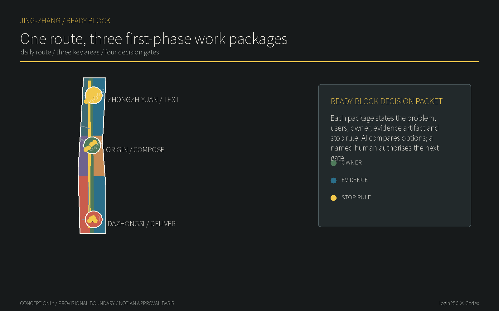
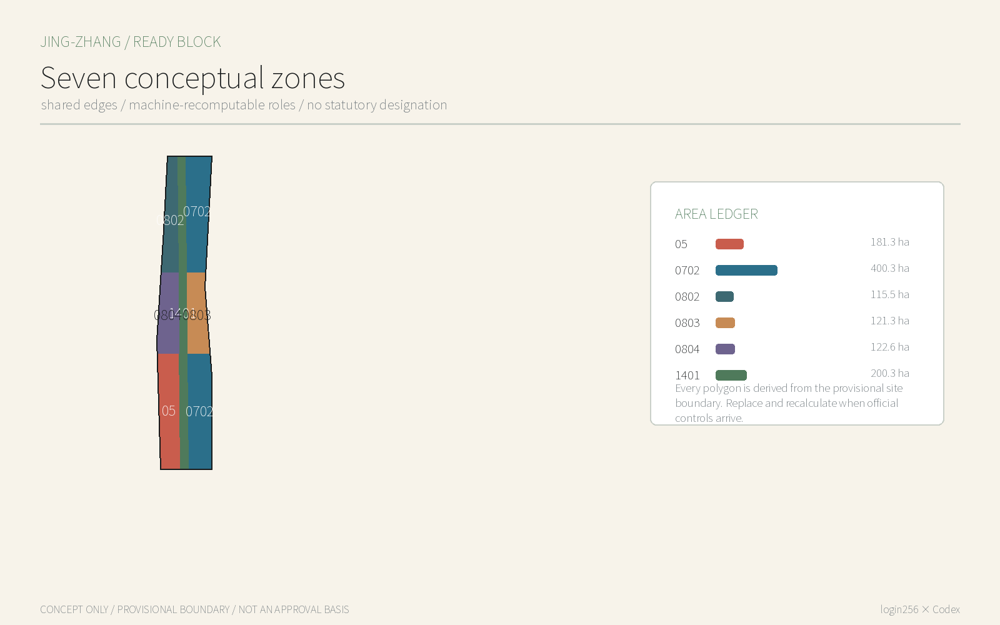
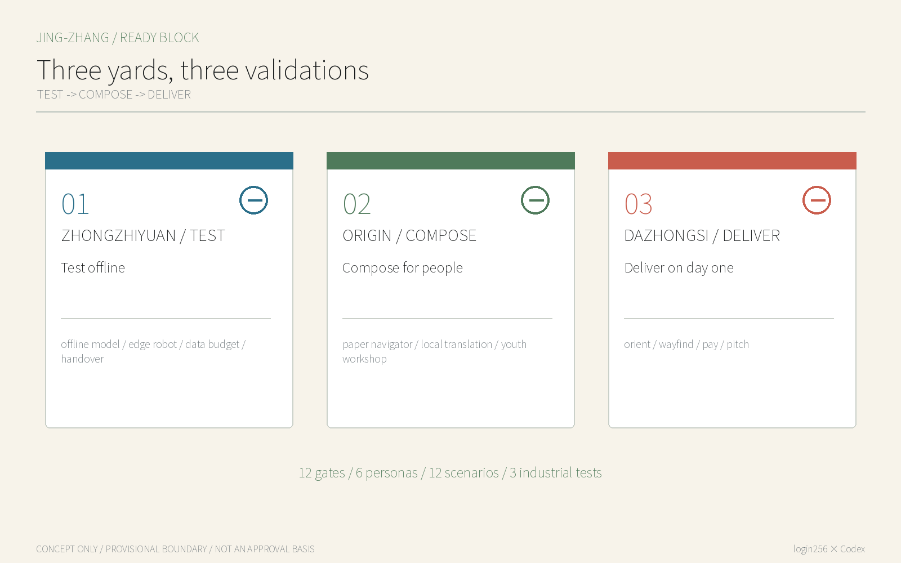
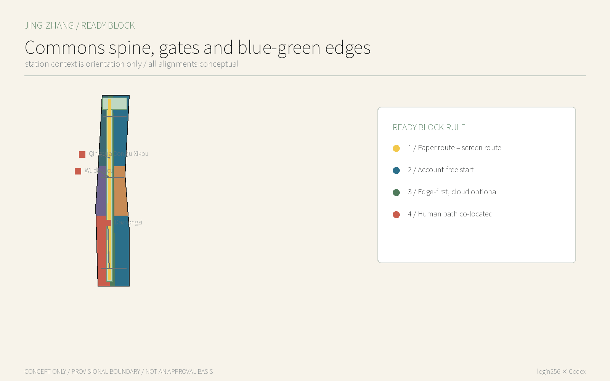
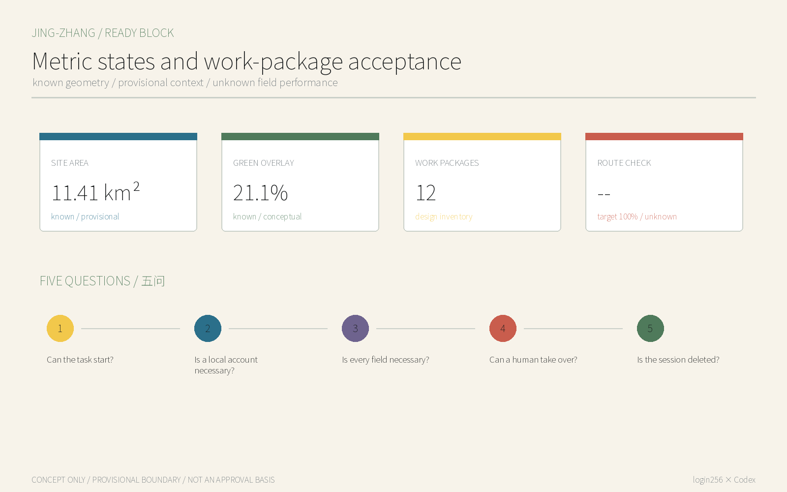

# JINGZHANG READY BLOCK: One Route, Three First-Phase Work Packages

> **One-line judgement:** A world-class AI district cannot make a local phone number, super-app, Chinese-only interface or passive consent its city gate. Basic journeys must work in ready-block mode; identity appears only at a genuinely necessary step that a person actively chooses.

The proposal does not claim that “ready-block mode” is a new phrase. It makes the principle an auditable urban product standard: space has a bypassable work package, services carry field-level data budgets, AI degrades locally or offline, and operations retain a visible co-located human or non-digital path. Its distinct outputs are twelve spatial prototypes, a Ready Block audit contract and a three-stage industrial validation process, not another row of smart devices.

## Design Basis and Source List

The official announcement defines the three scope levels, three areas and two wings, urban renewal and AI-scenario tasks; the Agent taskbook requires branding, cases, scenario cards, personas, landmarks and long-term operations. They are the primary task sources, while repository provisional geometry supports machine intake. It is not an official redline and cannot support precise area, regulatory or engineering conclusions. All layers, metrics, figures and drawings must be recalculated when official polygons arrive. [source:OFFICIAL-ANNOUNCEMENT] [source:AGENT-TASKBOOK] [data:geometry/site_boundary.geojson#SITE-001]

Supplementary context comes from an OSM Overpass query retrieved on 12 August 2026, used only to recognise relationships to Wudaokou, Qinghua Donglu Xikou and Dazhongsi. Minimum personal-data scope, basic App functions and payment diversity are policy background and pending-review product principles; they do not establish the compliance status of any operator. [source:OSM-CONTEXT-20260812] [source:PIPL-MINIMUM-2021] [source:STATE-COUNCIL-PAYMENT-2024]

## Three-Level Scope Framework

The 43.6 km² coordinated research area studies Ready Block as an interoperability capability for Haidian AI products entering global markets. The 11.4 km² overall design area spatialises it as a park commons spine, three yards and lateral gates. The 368.4 ha key area tests research, co-creation and adoption. Announced approximate areas are formal task facts; package areas derive from provisional polygons solely for topology checking and must not be conflated. [source:OFFICIAL-ANNOUNCEMENT] [depth:three_level_scope_framework] [metric:site_area_sqm]

| Level | Core question | Deliverable |
| --- | --- | --- |
| Coordinated research | How can Haidian AI work immediately for a first-time user and the global market? | Ready Block interoperability standard, regional interfaces and case transfer |
| Overall design | How do digital thresholds become spatial interfaces? | One commons spine, three lateral gates and seven conceptual land-use roles |
| Key-area detail | How is it researched, composed and adopted? | TEST at Zhongzhiyuan, COMPOSE at Origin and DELIVER at Dazhongsi |

## Coordinated Research Area: Industry and Future City Research

The identity is JINGZHANG READY BLOCK, with the line “Enter the city before choosing to connect.” Its mark is a railway-like pair: a solid public path and a dashed, optional enhanced path, with three station dots for TEST, COMPOSE and DELIVER and four small squares for P0-P3 decision gates. Coal black, signal yellow, paper white and park green replace cyber-neon. The three positions are an open interface for autonomous innovation, a first-day city for international talent, and an AI district residents may decline yet still use. Five functions are basic public journeys, edge autonomy, cross-language talent service, real-city validation and public governance. Each work package exposes `ready_block`, `work_package`, `phase_gate`, `human_owner`, `validation_artifact` and `stop_rule` fields so an AI reviewer can compare like with like.

Six cases contribute mechanisms, not copied forms: Helsinki’s standardised open interfaces and licence/maintenance context; Barcelona’s digital-rights governance discussion; Singapore’s coordinated public digital-service experience; GOV.UK’s cross-channel, low-friction service standard; EU AI regulatory sandboxes; and Beijing’s inclusive-payment policy background. Official pages are recorded for Helsinki, GOV.UK and the EU. Barcelona and Singapore remain needs-review because page and licence checks were not completed in this environment; they are not presented as local facts. [source:AGENT-TASKBOOK] [source:CASE-HELSINKI-OPEN-DATA]

Spatially they become TEST-COMPOSE-DELIVER: test offline and minimum-data performance in the north, translate models into widely usable services in the centre, and test multilingual, multi-payment adoption in the south. The three zones correspond to Zhongzhiyuan, Beijing AI Origin Community and Dazhongsi. The Zhongguancun technology-services wing supplies standards, talent and professional-service interfaces; the Xiaoyue River scenario-enablement wing supplies low-impact public walk-throughs. These are exchangeable resource interfaces, not claimed partnerships. [source:CASE-GOVUK-SERVICE-STANDARD] [source:CASE-EU-AI-SANDBOX] [depth:overall_spatial_structure]

Links to Beiwei Community, Future Science City, Huairou Science City, Beijing E-Town and the Beijing-Tianjin-Hebei region are interfaces, not claimed partnerships. Partners could exchange synthetic test suites, API notes and failure cases for the question “can a basic task be completed without a local account?” Real data, compute and sites still require lawful authorization.

## Overall Design Area: Urban Renewal and Regulatory-Plan-Level Urban Design

Space begins with a Commons Spine: continuous paper signage, account-free information, seating and staffed help along the heritage park. Three lateral Work Packages at Dazhongsi, Origin and Zhongzhiyuan pull station, community, campus and park interfaces together. Seven seamless conceptual land-use zones express roles only. Twelve one-storey reversible kits do not presume any demolition decision. [data:geometry/land_use.geojson#LU-002] [data:geometry/roads.geojson#ROAD-001] [depth:land_use_layout]

Renewal follows “open the interface, connect the service, then consider addition.” First remove unnecessary QR-only thresholds and monolingual information. Then use existing ground floors, mobile boxes or temporary kits. Only when ownership, heritage, fire, utilities, footfall and operational evidence exist should professionals decide building works. FAR, height, road section and demolition quantities remain pending official data. [standard:MOHURD-CONTROL-DETAILED-PLANNING] [depth:retain_renovate_demolish] [metric:floor_area_ratio]

## Detailed Design of Key Areas

**Zhongzhiyuan TEST / Account-free technology yard.** The Offline Model Clinic, Edge-Robot Test Yard, Data-Budget Audit Desk and Human-Handover Drill Court form a garden test ground. Teams submit online/offline records, field necessity, stop criteria and human recovery before progressing. The Qinghe edge remains a low-impact meeting direction; no engineering placement is made without water, ecological and ownership controls. [data:geometry/key_areas.geojson#PROV-KEY-001] [data:geometry/public_space.geojson#NODE-09]

**Beijing AI Origin Community COMPOSE / Public-service compiler.** Wudaokou and Qinghua Donglu Xikou provide station context. The Walk-up Open-source Bench, Paper Public-service Navigator, On-device Translation Table and Profile-free Youth Workshop compile model capability into bilingual, accessible and human-completable tasks. Campus and park links are directional and do not imply campus access or road permission. [data:geometry/key_areas.geojson#PROV-KEY-002] [data:geometry/roads.geojson#ROAD-005]

**Dazhongsi DELIVER / International adoption yard.** Arrive and Orient, Account-free Wayfinding, Multi-method Small Payment and Guest Pitch Table define the first hour. The four station quadrants first align readable information, crossing direction and cycle-parking cues; transport professionals then deepen them from surveyed entrances, flows and redlines. [data:geometry/key_areas.geojson#PROV-KEY-003] [data:geometry/public_space.geojson#NODE-01]

## AI Innovation Ecosystem, Personas, and AI+ Scenarios

Six task-based personas avoid demographic profiling: a newly arrived researcher needs orientation and translation; an overseas visitor without local Apps needs payment and directions; a resident must refuse profiling yet still use the park; an older person needs readable information and a human; a child needs learning without persistent profiling; a start-up needs to test before connecting to resources. They are not personal records and are not used for commercial recommendation. [standard:BARRIER-FREE-ENVIRONMENT-LAW] [metric:ready_block_basic_journey_target]

| # | Work package / scenario | Space | Users | First action | Data boundary | Human / public path |
| --- | --- | --- | --- | --- | --- | --- |
| 01 | First accepted route start | Dazhongsi | Residents / visitors | Baseline access, wayfinding and safety on the station-to-park segment | Aggregated observations; no personal identification | Human walk audit |
| 02 | Station-to-park wayfinding | Dazhongsi | First-time visitors / older people | Paper, ground numbers and edge prompts point to one route | Local session origin/destination only | Paper map and volunteer |
| 03 | Shade and rest pocket | Dazhongsi | Older people / children / riders | Include heat exposure, rest, lighting and maintenance in the first package | Aggregated comfort and inspection records | Human rest point |
| 04 | First-hour service desk | Dazhongsi | Start-ups / overseas visitors | Ask, browse a service directory, then choose any appointment step | Zero fields to browse; appointment fields pending | On-site service staff |
| 05 | Origin shared ground floor | Origin | Residents / students | Use an existing ground floor for service, open-source display and daily rest | Maintenance events only | Paper service directory |
| 06 | Campus-park handoff | Origin | Students / researchers | Test safe, accessible and time-window handoff from campus to park | No cross-organisation personal trail | Human handoff staff |
| 07 | Bilingual results desk | Origin | Global developers | Publish results, provenance, licence and next contact | Public content versions only | Bilingual curator |
| 08 | Community daily-service corner | Origin | Residents / guardians | Make health, education, legal and daily-service entry points one directory | No health or identity input | Human navigator |
| 09 | Offline model test bench | Zhongzhiyuan | R&D teams | Compare online, offline and human baselines with synthetic tasks | Synthetic test set only | Human benchmark |
| 10 | Low-speed robot maintenance yard | Zhongzhiyuan | Robotics / maintenance teams | Test physical docking and takeover for low-speed service | Synthetic markers and anonymous obstacles | Physical stop control |
| 11 | Data-budget decision wall | Zhongzhiyuan | Product / governance teams | Publish problem, fields, owner, metric and stop rule | Synthetic field examples first | Human compliance review |
| 12 | Human-handover stop desk | Zhongzhiyuan | Operators / public | Rehearse error, congestion, complaint and spatial recovery | No identifying personal data | Stop and appeal desk |

Three industrial tests are: A. an offline-model benchmark comparing online and offline task completion; B. an edge-robot benchmark that completes a low-speed task without cloud identity dependency and demonstrates human takeover; C. a data-budget benchmark challenging each field, retention period and deletion route. All begin with synthetic data; there is no on-site authorization or performance result. [data:geometry/public_space.geojson#NODE-09] [data:geometry/public_space.geojson#NODE-10] [data:geometry/public_space.geojson#NODE-11]

## Land Use, Building Scale, and Retain-Renovate-Demolish Strategy

National classification codes partition the provisional site completely: 1401 for the park commons spine, 0802 for northern research, 0804/0803 for central education/culture, and 05/0702 for southern services. Codes enable recomputation but grant no land-use approval. Twelve footprints model removable service kits. Their conceptual footprint and one-storey floor area are equal; they are neither an existing-building survey nor a development commitment. [standard:MNR-LAND-USE-CLASSIFICATION-GUIDE] [metric:building_footprint_area_sqm] [data:geometry/buildings.geojson#BLDG-001]

Evidence gates govern retain/renovate/demolish: do not demolish while heritage and structural safety are unknown; retain useful fabric that can become accessible; prefer reversible partitions, verandas and signage; discuss new build only after ownership, planning and engineering review. No parcel-level decision is made now. [depth:height_massing_character] [depth:retain_renovate_demolish]

## Transport, Rail, Municipal Infrastructure, and Public Services

The transport move is not another navigation App. Paper maps, ground numbering, bilingual text and account-free on-device routing point to the same routes. The spine connects three areas; three lateral gates connect east and west; Wudaokou, Qinghua Donglu Xikou and Dazhongsi are contextual relationships only. Lines are not road redlines; crossings, grades, tactile paving, lighting, fire access and flows require field review. [source:OSM-CONTEXT-20260812] [data:geometry/roads.geojson#ROAD-001] [depth:traffic_rail_slow_parking]

New infrastructure is “edge first, cloud optional”: public content is locally cached, translation sessions are deleted, robots stop safely offline, and the human path works during network or power failure. Utility loads, rooms, spectrum, fire and energy lack reliable baselines, so only interface principles are proposed. [depth:municipal_new_infrastructure]

## Blue-Green Network, Public Space, and Urban Character

The railway legacy is not retro-tech decoration. A railway brings strangers into a city; a ticket is the minimum credential for the journey, not a demand that each traveller first become a local member. Parallel lines and open brackets express “public path first, enhanced path by choice.” Reversible metal frames, recycled-sleeper texture and high-contrast paper information are material directions pending heritage and accessibility review. [source:AGENT-TASKBOOK] [standard:MOHURD-URBAN-DESIGN-MEASURES]

The three pilgrimage landmarks are modest public instruments. Zhongzhiyuan’s Zero-Field Marker lists fields removed from each test; Origin’s First Line of Code Table runs an open-source example without login; Dazhongsi’s Open Arrival Board shows which basics need no local account and where a human is present. READY BLOCK 100 honours teams only after public retesting of 100 basic tasks. [data:geometry/public_space.geojson#NODE-11] [depth:blue_green_public_space]

## Renewal Projects, Implementation Policy, and Phasing

Phase 1 is a 90-day prototype in one authorised Origin space with four prototypes, twelve synthetic scripts and one public walk-through. Phase 2 forms the twelve-gate network. Phase 3 opens the audit contract to regional partners. Every phase stops without ownership permission, site safety, accessibility review, accountable humans and an exit plan. These are conceptual gates, not construction or funding commitments. [data:geometry/phasing.geojson#PHASE-001] [depth:phasing_implementation]

An annual Ready Block Week begins with an overseas-visitor walk-through without a local account, then older-person and child non-digital equivalence tests, a developer offline challenge, and publication of failures and repair commitments. Open-source maintainers, service staff, accessibility advisers and operators maintain the data budget. Participation by government, schools and firms remains subject to agreement. [source:AGENT-TASKBOOK] [depth:renewal_project_list]

## Metrics, Area Recalculation, and Compliance Matrix

Metrics separate provisional-derived values, conceptual design quantities and field targets. 11.41 km² is a repository provisional-polygon calculation, not an official precise area. Twelve work packages and twelve kits are design inventory. [metric:site_area_sqm] [metric:ready_block_work_package_count] Operational targets of 100% direct-start route checks, 100% named owners before pilot, 100% public decision packets before scale and justified fields before enhanced service remain `design_target`; current values are unknown. [metric:ready_block_basic_journey_target] [metric:ready_block_data_budget_target]

The five-question audit asks: can the basic task start directly; is a local account required; is every field necessary; can a human take over after outage or error; after exit, is the session deleted while the public path remains? The bundled interactive uses synthetic scenarios only and is not an on-site pass. The compliance matrix maps the announcement and all six Agent tasks; fifteen professional-depth items link prose, layers, metrics and drawings. [depth:metrics_recalculation] [standard:PROJECT-AGENT-OPEN-CALL-TASKBOOK]

## Risk, Copyright, and Compliance

The largest risk is reading Ready Block as bypassing lawful real-name, payment-risk, safety or child-protection duties. It only promises that defined basic public journeys do not require a local account. Restricted equipment, payment, submission, access control or legally required identification enters the proper process, but the reason and minimum identity step must be visible. The Generative AI Measures are not generalized into a universal opt-out right; personal-information principles do not replace legal advice. [source:GEN-AI-MEASURES] [source:PIPL-MINIMUM-2021] [standard:GENERATIVE-AI-INTERIM-MEASURES]

All figures, HTML, PDFs and prose were generated by Codex in the workspace authorised by login256. No news image, commercial map tile, portrait or third-party mark is used. Noto Sans SC is used under OFL for local rendering and is not redistributed. OSM is context only with ODbL attribution. The proposal uses CC BY 4.0; external sources retain their rights. [depth:risk_missing_data]

## References

1. Beijing Municipal Commission of Planning and Natural Resources, Haidian Branch, official prequalification announcement, 2026.
2. Repository-structured Agent open-call taskbook excerpt, 2026.
3. CAC and other ministries, Rules on the Scope of Necessary Personal Information for Common Types of Mobile Internet Applications, 2021.
4. General Office of the State Council, Opinion on Optimising Payment Services and Improving Payment Convenience, 2024.
5. Personal Information Protection Law of the PRC, 2021.
6. OpenStreetMap contributors, project context query, retrieved 12 August 2026. [source:OFFICIAL-ANNOUNCEMENT] [source:OSM-CONTEXT-20260812] [source:PIPL-MINIMUM-2021]
