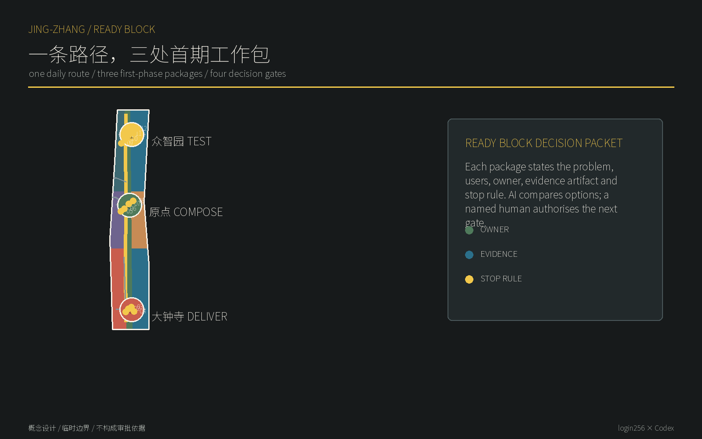
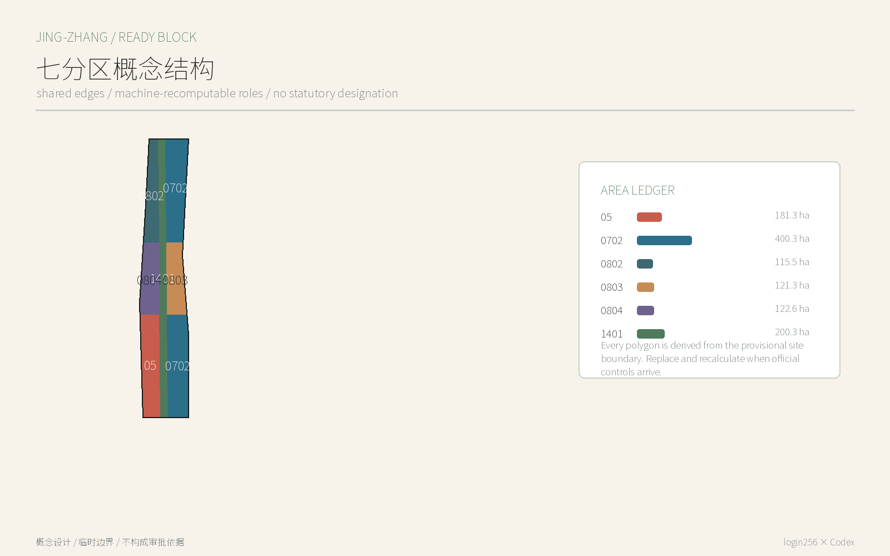
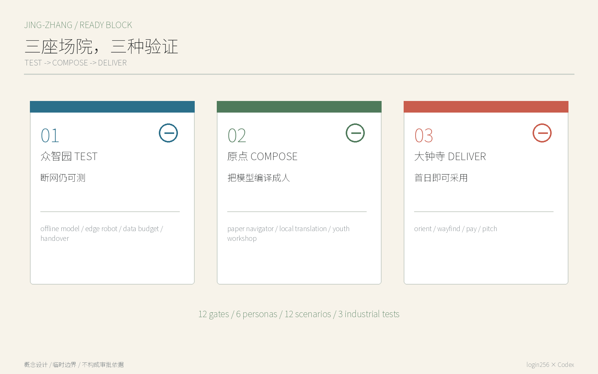
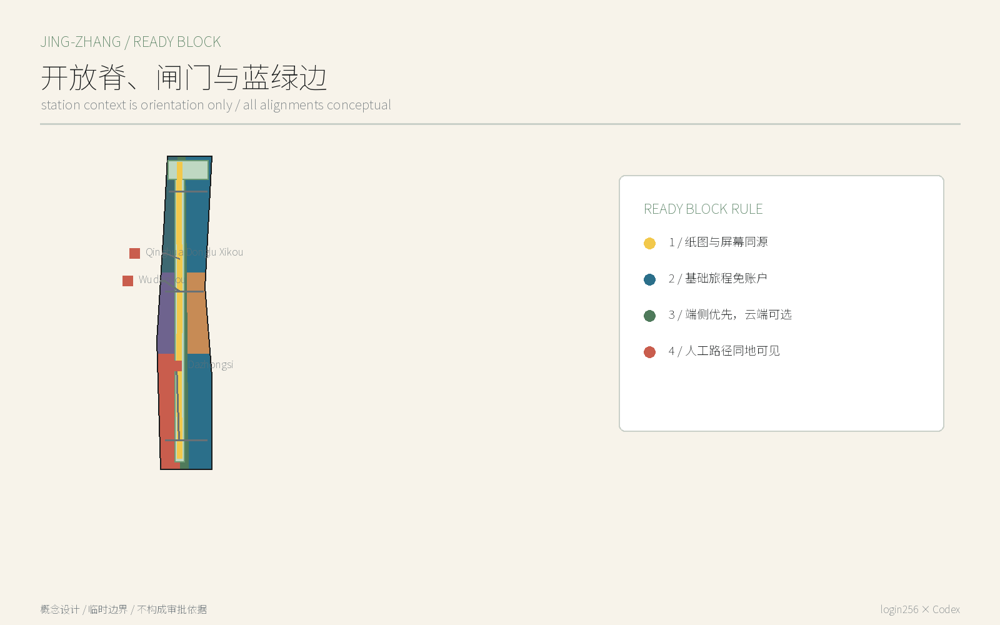
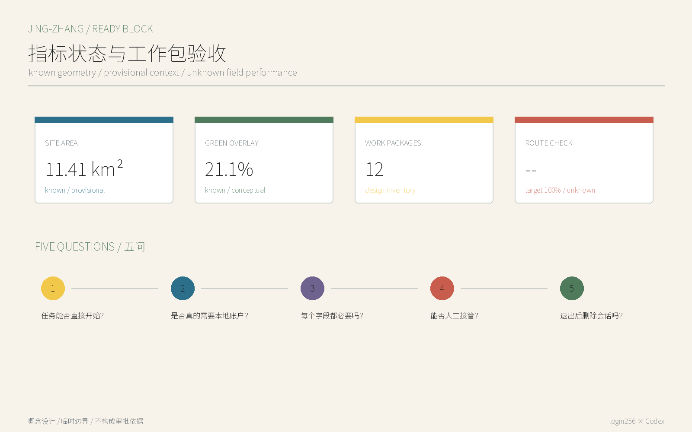

# 京张可实施单元 / JINGZHANG READY BLOCK：一条路径，三处首期工作包

> **一句话判断**：世界级 AI 街区不能把本地手机号、超级 App、中文界面或被动授权当作城市入口。基础旅程先以访客身份完成；增强服务只在确有必要的一步、经人主动选择后连接身份。

这不是宣称“免登录”一词前所未有，而是把它做成可审计的城市产品标准：空间必须有可绕行的首期工作包，服务必须有字段级数据预算，AI 必须能在端侧或断网时降级，运营必须保留同地可见的人工或非数字路径。方案的独特成果是 12 个空间原型、一份 Ready Block 审计合同和一套三阶段产业验证，而不是另一排智能设备。

## 设计依据与资料清单

官方公告规定三层范围、三区两翼、城市更新和 AI 场景任务；面向智能体任务书要求品牌、案例、场景卡、画像、地标与长期运营。本方案以二者为主任务依据，并使用仓库临时边界完成机器自检。临时边界不是官方红线，也不能支撑精确面积、控规或工程结论；官方 polygon 到位后必须重算全部图层、指标、图件与图纸。[source:OFFICIAL-ANNOUNCEMENT] [source:AGENT-TASKBOOK] [data:geometry/site_boundary.geojson#SITE-001]

场地关系的补充背景来自 2026-08-12 的 OSM Overpass 查询，仅用于辨认五道口、清华东路西口、大钟寺等站点关系，不进入 official boundary 或道路红线判断。个人信息最小范围、App 基本功能、支付多样性只用作 Ready Block 的政策背景和待复核产品原则，不据此判断任何具体运营者已经合规。[source:OSM-CONTEXT-20260812] [source:PIPL-MINIMUM-2021] [source:STATE-COUNCIL-PAYMENT-2024]

## 三层范围工作框架

43.6 平方公里统筹研究范围研究 Ready Block 如何成为海淀 AI 产品进入全球市场的互操作能力；11.4 平方公里总体设计范围把它落为公园开放脊、三座场院和横向闸门；368.4 公顷重点范围则分别验证研发、共创与采用。公告面积是正式任务事实，包内面积来自临时 polygon，只用于拓扑检查，两者不得混称。[source:OFFICIAL-ANNOUNCEMENT] [depth:three_level_scope_framework] [metric:site_area_sqm]

| 层级 | 关键问题 | 本方案交付 |
| --- | --- | --- |
| 统筹研究 | 海淀 AI 如何对第一次来的人和全球市场即开即用 | Ready Block 互操作标准、区域协作接口、案例转译 |
| 总体设计 | 数字门槛如何转化为空间界面 | 一条开放脊、三处横向闸门、七类概念用地角色 |
| 重点详细 | 如何被研发、共创和采用 | 众智园 TEST、原点 COMPOSE、大钟寺 DELIVER 三座场院 |

## 统筹研究范围产业与未来城市研究

总体名称是“京张可实施单元 / JINGZHANG READY BLOCK”，副句“先进入城市，再决定是否连接”。标志取铁路平行双线：粗实线代表公共路径，短虚线代表用户主动选择后的增强路径；三枚站点圆点代表 TEST、COMPOSE、DELIVER，四个小方框代表 P0 核验、P1 试点、P2 比较、P3 法定衔接。色彩使用煤黑、信号黄、纸白和公园绿，避免赛博霓虹。三大定位是自主创新的开放接口、国际人才的首日城市、居民可拒绝仍可使用的 AI 街区；五项功能分别对应基础公共旅程、端侧自主技术、跨语言人才服务、真实城市验证、公开治理。每个工作包都标注 `ready_block`、`work_package`、`phase_gate`、`human_owner`、`validation_artifact` 和 `stop_rule`，让 AI 可以按同一字段比较方案。

六个案例不是复制空间造型，而是提取机制：赫尔辛基的标准化开放接口与维护许可、巴塞罗那的数字权利治理讨论、新加坡的公共数字服务协同、GOV.UK 的跨渠道低门槛标准、欧盟 AI 监管沙盒、北京支付便利化背景。赫尔辛基、GOV.UK 与欧盟附有官方页面；巴塞罗那和新加坡在当前环境无法完成页面许可复核，已标 needs-review，不把它们写成本地事实。[source:AGENT-TASKBOOK] [source:CASE-HELSINKI-OPEN-DATA]

空间转译是 TEST—COMPOSE—DELIVER：北段测离线与最小数据，中段把模型翻译成人人能用的服务，南段检验多语言、多支付和市场采用。三区分别落在众智园、北京 AI 原点社区和大钟寺，西侧中关村科技服务翼提供标准、人才和专业服务接口，东侧小月河场景赋能翼提供公共体验与低扰动走查接口；两翼是可协商的资源链，不是已存在的合作承诺。[source:CASE-GOVUK-SERVICE-STANDARD] [source:CASE-EU-AI-SANDBOX] [depth:overall_spatial_structure]

与北纬社区、未来科学城、怀柔科学城、经开区和京津冀的协作只提出接口，不声称已有合作：共享“基础任务能否无本地账户完成”的合成测试集、接口说明和失败案例；真实数据、算力和场地仍由各方依法授权。这样，“区域协同”是可交换的标准与验证结果，而不是图上拉线。

## 总体设计范围城市更新与控规深度城市设计

空间从一条“开放脊”开始：沿京张遗址公园建立连续可读的纸面导视、无账户信息、公共座椅和人工问询；在大钟寺、原点社区、众智园形成三处横向首期工作包，把站口、社区、校园和园区的界面拉到公园。七个完整无缝的概念用地分区只表达功能角色，不改变法定用地；十二个可逆服务构件均为一层轻型原型，不判断任何现状建筑拆改留。[data:geometry/land_use.geojson#LU-002] [data:geometry/roads.geojson#ROAD-001] [depth:land_use_layout]

城市更新优先级是“先开界面、再接服务、后谈增量”：第一层清理不必要的扫码门槛和单语信息；第二层以现状首层、移动盒子或临时构件承载服务；第三层只有在权属、文保、消防、市政、客流和运营证据齐备后，才由专业团队判断建筑更新。容积率、高度、道路断面和拆除数量全部保持待正式数据补齐。[standard:MOHURD-CONTROL-DETAILED-PLANNING] [depth:retain_renovate_demolish] [metric:floor_area_ratio]

## 重点区域详细设计

**众智园 TEST / 无账户技术考场。** 北段以离线模型诊所、端侧机器人考场、数据预算审计台和人工接管演练坪组成花园型测试场。研发团队必须提交联网/断网两种运行记录、逐字段必要性、停止条件和人工恢复步骤，才能进入下一阶段。清河界面只作为低扰动会面与展示方向，未取得水系、生态和权属控制线前不做工程落位。[data:geometry/key_areas.geojson#PROV-KEY-001] [data:geometry/public_space.geojson#NODE-09]

**北京 AI 原点社区 COMPOSE / 公共服务编译场。** 五道口和清华东路西口提供站点上下文，开源即取工作台、纸面服务导航、本地翻译会面点和青少年无画像工坊把模型能力编译为双语、无障碍、可人工完成的任务。校区和园区连接均为方向性关系，不能推定校园开放或道路改造许可。[data:geometry/key_areas.geojson#PROV-KEY-002] [data:geometry/roads.geojson#ROAD-005]

**大钟寺 DELIVER / 国际采用场。** 以“到站即懂、无账户问路、多方式小额支付、访客路演桌”形成第一小时体验。地铁四象限先统一可读信息、过街方向和非机动车停放提示，再由交通专业团队基于站口、客流和道路红线深化；本方案不把概念线当作已批准站城工程。[data:geometry/key_areas.geojson#PROV-KEY-003] [data:geometry/public_space.geojson#NODE-01]

## AI 创新生态、人才画像与 AI+ 场景

六类画像采用“任务”而非人口标签：第一次来华的研究者要抵达和翻译；没有本地 App 的国际访客要支付和问路；居民要拒绝画像仍能休闲办事；老人要看得懂并找到人工；儿童要学习但不被长期画像；初创团队要先试后接入资源。画像不对应个人名单，不采集轨迹，也不用于商业推荐。[standard:BARRIER-FREE-ENVIRONMENT-LAW] [metric:ready_block_basic_journey_target]

| # | 工作包/场景卡 | 空间 | 对象 | 首期动作 | 数据边界 | 人工/公共路径 |
| --- | --- | --- | --- | --- | --- | --- |
| 01 | 首条验收路起点 | 大钟寺 | 居民/访客 | 记录站到公园首段的可达、导视和安全基线 | 聚合观察，不识别个人 | 人工走查表 |
| 02 | 站到公园导视 | 大钟寺 | 首次访客/老人 | 纸图、地面编号和端侧提示指向同一条路 | 仅保存本地会话的起终点 | 纸图与志愿者 |
| 03 | 遮荫与休息口袋 | 大钟寺 | 老人/儿童/骑行者 | 把热暴露、休息、照明和维护纳入首期包 | 聚合热感与设施巡检 | 人工休息点 |
| 04 | 首小时服务桌 | 大钟寺 | 初创团队/国际访客 | 先问路、看服务目录，再选择预约或登记 | 旁听零字段；预约字段待确认 | 现场服务人 |
| 05 | 原点共享首层 | 原点社区 | 居民/师生 | 用现状首层承载社区服务、开源展示和日常休息 | 只记录设施维护事件 | 纸面服务目录 |
| 06 | 校区园区交接点 | 原点社区 | 学生/研发者 | 测试校区到园区的安全、无障碍和时间段交接 | 不建立跨主体个人轨迹 | 人工交接员 |
| 07 | 双语成果发布台 | 原点社区 | 全球开发者 | 公开展示成果、来源、许可和下一步联系人 | 仅记录公开内容版本 | 双语策展人 |
| 08 | 社区日常服务角 | 原点社区 | 居民/家长 | 把医疗、教育、法律和生活服务入口做成同源目录 | 不输入健康或身份信息 | 现场人工导航 |
| 09 | 离线模型试验台 | 众智园 | 研发团队 | 用合成任务比较联网、断网和人工基线 | 只用合成测试集 | 人工基准测试 |
| 10 | 低速机器人维护场 | 众智园 | 机器人/维护团队 | 验证低速巡检、清洁或配送的物理停靠和接管 | 合成标识与匿名障碍物 | 物理停止开关 |
| 11 | 数据预算决策包墙 | 众智园 | 产品/治理团队 | 公开问题、字段、责任人、指标和停止条件 | 字段清单先用合成示例 | 人工合规评审 |
| 12 | 人工接管停止台 | 众智园 | 运营/公众 | 演练误判、拥堵、投诉和撤回后的空间恢复 | 不使用个人识别数据 | 现场停止与申诉台 |

三项产业验证分别是：A. 离线模型基准，比较联网与断网完成率；B. 端侧机器人基准，断开云端身份依赖后完成低速任务并人工接管；C. 数据预算基准，逐字段挑战必要性、保存期与删除路径。全部先使用合成数据，当前没有现场授权或绩效结果。[data:geometry/public_space.geojson#NODE-09] [data:geometry/public_space.geojson#NODE-10] [data:geometry/public_space.geojson#NODE-11]

## 用地、建筑规模与拆改留方案

用地以国家分类码完整分割临时边界，公园开放脊使用 1401，北段研发使用 0802，中段教育/文化使用 0804/0803，南段服务使用 05/0702；这些代码让机器能复算，却不构成用地审批。十二个建筑基底只模拟可拆装服务构件，概念总基底和一层总楼面面积相同；它们不是现状建筑调查，也不是建设规模承诺。[standard:MNR-LAND-USE-CLASSIFICATION-GUIDE] [metric:building_footprint_area_sqm] [data:geometry/buildings.geojson#BLDG-001]

拆改留采取证据门：文保与结构安全不明则不拆；有使用价值且可无障碍改善则优先留；可逆隔断、门廊和导视优先改；只有经权属、规划和工程审核后才讨论新建。现阶段不对任何具体建筑下拆、改、留结论。[depth:height_massing_character] [depth:retain_renovate_demolish]

## 交通、轨道、市政与公共服务设施

交通设计的核心不是新增一条导航 App，而是让纸图、地面编号、双语文字和无账户端侧导航指向同一套路线。主脊连接三片区，三条横向首期工作包连接东西界面，五道口、清华东路西口和大钟寺只作为 OSM 背景下的接入关系。所有线均非道路红线，过街、坡度、盲道、照明、消防和客流要现场复核。[source:OSM-CONTEXT-20260812] [data:geometry/roads.geojson#ROAD-001] [depth:traffic_rail_slow_parking]

新型基础设施采用“边缘优先、云端可选”：公开内容缓存在本地，翻译会话结束即清除，机器人断网可停靠，电力或网络失效时人工路径仍工作。市政负荷、机房、通信频谱、消防和能源均无可靠底数，因此只提出接口原则，不作容量或管线结论。[depth:municipal_new_infrastructure]

## 蓝绿空间、公共空间与城市风貌

京张遗址的意义不是给 AI 做复古包装，而是提醒设计者：铁路把陌生人送达一座城市，车票是完成旅程所需的最小凭证，不要求旅客先成为本地会员。标识系统以平行双线和开放括号表达“公共路径先行、增强路径自选”；材料建议用可逆金属框、再生轨枕质感和高对比纸面信息，但须经文保与无障碍专业复核。[source:AGENT-TASKBOOK] [standard:MOHURD-URBAN-DESIGN-MEASURES]

三处朝圣地标不是巨构：众智园“零字段碑”公开每项测试删掉了哪些字段；原点“第一行代码桌”允许游客不登录直接运行开源示例；大钟寺“开放到达板”实时显示哪些基础服务无需本地账户，以及哪里有人工入口。荣誉体系“READY BLOCK 100”只表彰经公开复测、100 个基础任务均保留 Ready Block 的团队；未复测不得上榜。[data:geometry/public_space.geojson#NODE-11] [depth:blue_green_public_space]

## 更新项目清单、实施政策与分期计划

一期 90 天只在原点社区选择一处经授权空间，完成 4 个原型、12 个合成测试脚本和一次公众走查；二期在三区形成 12 闸门网络；三期把审计合同开放给区域协作伙伴。每期都有停止门：没有权属许可、现场安全、无障碍走查、人工责任或退出方案，不进入下一期。这是概念实施门，不是建设时序或资金承诺。[data:geometry/phasing.geojson#PHASE-001] [depth:phasing_implementation]

年度运营建议称“Ready Block Week”：第一天做国际访客无本地账户走查，第二天做老人和儿童的非数字等价测试，第三天做开发者离线挑战，最后公开失败案例与修复承诺。日常由开源维护者、公共服务人员、无障碍顾问和场景运营者共同维护数据预算；政府、学校和企业的参与均待协商，不表述为已确定安排。[source:AGENT-TASKBOOK] [depth:renewal_project_list]

## 指标体系、面积复算与合规矩阵

空间指标分三类：临时边界派生值、概念设计量、待现场验证的目标。11.41 平方公里为仓库临时 polygon 的复算值，不是官方精确面积；12 个首期工作包和 12 个轻型构件是设计库存。[metric:site_area_sqm] [metric:ready_block_work_package_count] 运营目标“基础旅程 100% 可直接开始、100% 工作包在试点前有责任人、100% 扩展前公开决策包、增强服务前字段均有理由”全部写入 `design_target`，当前值保持未知。[metric:ready_block_basic_journey_target] [metric:ready_block_data_budget_target]

Ready Block 审计采用五问：基础任务能否直接开始；是否要求本地账户；个人字段是否逐项必要；断网/误判后能否人工接管；退出后是否删除会话并仍可使用公共路径。随包交互页只用合成场景演示该逻辑，不等于现场通过。公告与六项 agent 任务由合规矩阵逐条映射，15 项专业深度均有正文、图层、指标和图纸证据。[depth:metrics_recalculation] [standard:PROJECT-AGENT-OPEN-CALL-TASKBOOK]

## 风险、版权与合规说明

最大风险是把“免登录”误解为规避依法实名、支付风控、安全或未成年人保护。本方案只保证不需要本地账户即可完成定义明确的基础公共旅程；预约受限设备、支付、投稿、门禁或依法需实名环节仍进入相应合法流程，但身份步骤必须解释原因、缩到最少且可见。生成式 AI 管理规定不被外推成一般退出权，个人信息保护条款也不替代具体法律意见。[source:GEN-AI-MEASURES] [source:PIPL-MINIMUM-2021] [standard:GENERATIVE-AI-INTERIM-MEASURES]

全部图件、HTML、PDF 与文本由 Codex 在用户 login256 授权的本地工作区生成；未使用新闻图片、商业地图瓦片、人物肖像或第三方商标。Noto Sans SC 仅用于本地生成并按 OFL 使用，字体文件不随包分发。OSM 只用于背景关系并按 ODbL 署名。方案许可为 CC BY 4.0；外部来源保留各自权利。[depth:risk_missing_data]

## 参考资料

1. 北京市规划和自然资源委员会海淀分局，百年京张 AI 创新带城市设计国际方案征集资格预审公告，2026。
2. 仓库面向全球智能体开源征集任务书摘录，2026。
3. 国家互联网信息办公室等四部门，常见类型移动互联网应用程序必要个人信息范围规定，2021。
4. 国务院办公厅，进一步优化支付服务提升支付便利性的意见，2024。
5. 中华人民共和国个人信息保护法，2021。
        6. OpenStreetMap contributors，项目上下文查询，2026-08-12。[source:OFFICIAL-ANNOUNCEMENT] [source:OSM-CONTEXT-20260812] [source:PIPL-MINIMUM-2021]
