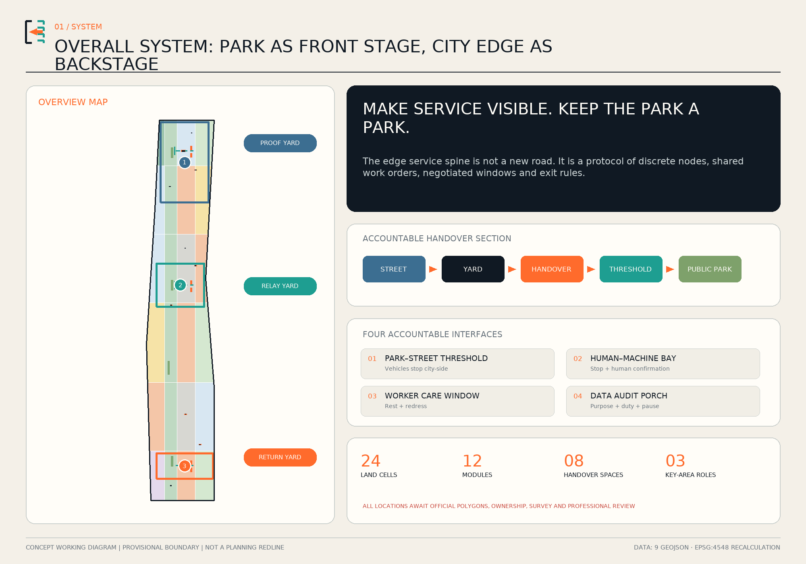
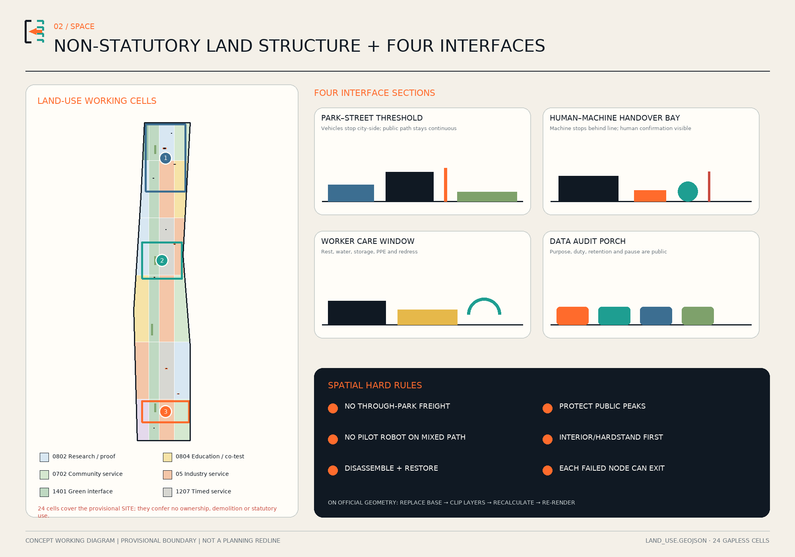
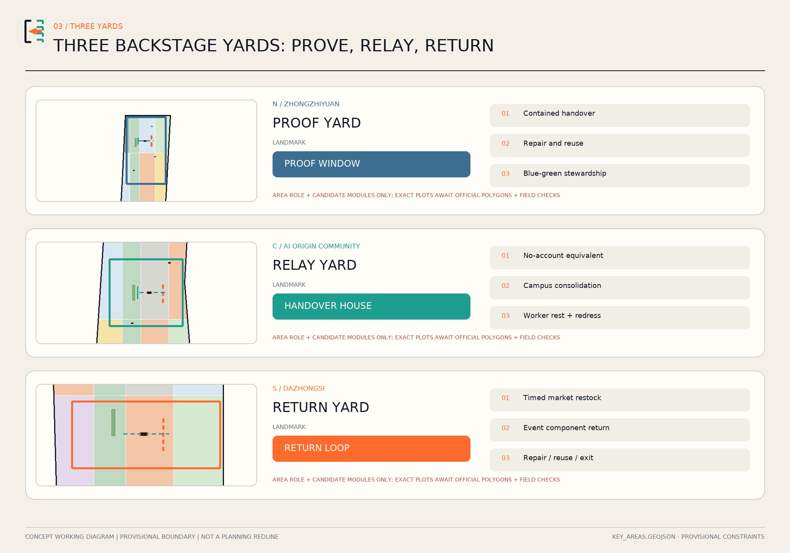
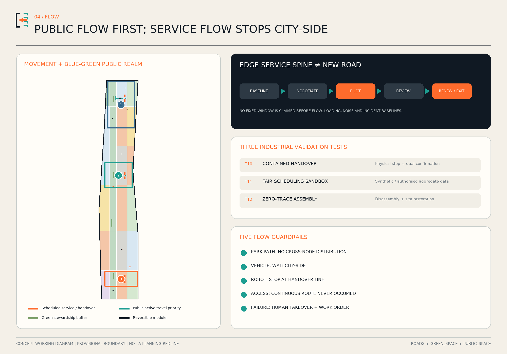
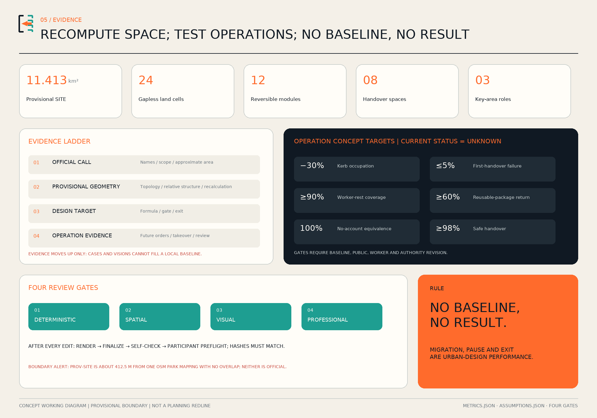

# JINGZHANG BACKSTAGE

> **Make service visible. Keep the park a park.** Backstage is not a freight route through the park. It is a distributed layer at city-side park edges, station thresholds, campus gates and already hardened sites. Machines stop here; responsibility changes hands here; broken tools are repaired here; packages and devices find a documented return path here.

## Design Basis and Source List

The proposal begins with a changed present. Public reporting says phase two of the Jing-Zhang Railway Heritage Park has opened and an approximately nine-kilometre public corridor is substantially in place. The design therefore does not claim “park continuity” as unfinished work and does not overlay a new logistics corridor on the greenway. It addresses the everyday city-side backstage: where goods stop, where a machine hands a task to a person, where stewardship tools are repaired, where event components return, and where frontline workers can rest and seek redress. Reported length and area only establish context; they are not boundary evidence or statutory metrics.[source:PARK-OPEN-2026] [source:PARK-PLANNING-2021]

Evidence has four tiers. The call and agent taskbook define the roughly 43.6-square-kilometre research scope, roughly 11.4-square-kilometre overall design scope, three key areas and agent.1–agent.6. Public laws and policies set urban-design, accessibility, AI, logistics and circularity guardrails. Official project pages explain the existing park and multi-party delivery. Repository provisional geometry comes last: it makes the proposal computable, reviewable and replaceable, but it cannot become an official redline.[source:OFFICIAL-ANNOUNCEMENT] [source:AGENT-TASKBOOK]

Missing data is a design condition, not a hidden footnote. The public package lacks exact official SITE_BOUNDARY and KEY_AREA polygons, ownership, road redlines, regulatory plans, utilities, fire access, heritage controls and a complete building survey. Repository issue #846 records approximately 412.5 metres of nearest separation and no overlap between the provisional SITE and one OSM park mapping. Neither is an official answer. Every siting move is therefore a concept pending survey and authority review; official polygons trigger regeneration of all nine GeoJSON files, metrics, figures and PDFs.[source:PROVISIONAL-BASIS] [data:geometry/constraints.geojson#CONSTRAINT-001]

The package contains aligned Chinese and English narratives, nine spatial layers, metrics and three audit matrices, five bilingual core figures, A3 and A0 PDFs and an offline visual explorer. Every spatial claim returns to a feature; every known number returns to a formula; an operational performance value without a baseline remains `unknown` with a separate concept target. This is an auditable urban-design submission, not a regulatory plan.[depth:existing_conditions_diagnosis] [standard:MOHURD-URBAN-DESIGN-MEASURES]

## Three-Level Scope Framework

The **coordinated research area** asks why backstage is an AI-ecosystem issue. Across roughly 43.6 square kilometres, universities, companies, parks, communities and public spaces exchange not only knowledge but devices, prototypes, spares, tools, packages, work orders and responsibility. If design only celebrates the front stage, these flows spill into kerbs, doorways and paths, and their cost falls on couriers, cleaners, repair workers and residents. The proposal creates a validation–delivery–handover–use–repair–return–revalidation chain and treats backstage quality as innovation capacity.[source:OFFICIAL-ANNOUNCEMENT] [depth:three_level_scope_framework]

The **overall design area** asks how backstage can protect the park. The official call describes an overall-design tier of roughly 11.4 square kilometres; the computation base separately uses a repository polygon explicitly marked provisional. Neither proves the other. The system is one edge service spine, three backstage yards and four accountable interfaces. The “spine” is not a continuous new road; it is a discontinuous set of nodes joined by identifiers, time windows, markings and responsibility cards. Movement between yards uses lawful city streets. Park paths do not carry north–south freight, distribution or driverless delivery. `roads.geojson` contains only eight discrete street-side service, public-access and transverse handover test segments. Their aggregate length is a relationship check, not a continuous route or construction quantity.[data:geometry/roads.geojson#ROAD-001] [metric:service_route_length_m]

The **key areas** test three industrial roles. The northern Zhongzhiyuan role is a Proof Yard for contained robot, takeover and reversible-component tests. The central Beijing AI Origin Community role is a Relay Yard linking campuses, firms, communities and no-account public service. The southern Dazhongsi role is a Return Yard for market restocking, event backstage, repair, reuse and material return. Only the official names and north-to-south order are carried over. Proof–Relay–Return is this proposal’s design role system, not an official designation. Exact plots depend on official polygons, ownership and field conditions.[data:geometry/key_areas.geojson#PROV-KEY-001] [metric:service_yard_count]

Four interfaces bind the framework: a park–street threshold stops vehicles; a human–machine handover bay binds a physical stop and human confirmation; a worker-care window provides rest and redress; and a data-audit porch publishes purpose, steward, retention and pause instructions. Fixed principles are park priority, human takeover, no-account equivalence and expiry. Module location, schedule, operator and vendor remain replaceable. Public value can migrate while spatial evidence is recalculated.[source:ACCESSIBILITY-LAW] [depth:overall_spatial_structure]

## Coordinated Research Area: Industry and Future City Research

Jingzhang Backstage extends the AI ecosystem from product launch to product life cycle. Equipment is first tested for safety and interoperability in the Proof Yard, then enters small supervised public trials at the Relay Yard. Failure sends it into the repair chain; packages, spares and retired devices move through the Return Yard; evidence returns to research. Universities contribute methods and paid co-testing, firms retain product and insurance responsibility, urban operators steward space and work orders, and worker/public representatives can request a pause. Value comes from earlier failure discovery, fewer duplicate trips, reusable protocols and repair capability—not more warehousing.[source:HAIDIAN-AI-2026] [source:BEIJING-LOGISTICS-2024]

Six global cases are read as mechanisms, never as transferable scale or claimed local performance:

| Case | Transferable mechanism | Jing-Zhang translation | Limit |
| --- | --- | --- | --- |
| Paris Chapelle International | Urban-logistics ground floor combined with sport, urban farming, restaurant and other mixed/public uses | Shared receiving on the street side, public face on the park side | Operator facts are not independent impact evidence; retained rail capacity is not rail operation [source:CASE-CHAPELLE] |
| Southampton consolidation centre | Combine goods from several suppliers and distribute less often, more efficiently | Put a shared procurement contract before construction | Potential benefits cannot fill a Beijing baseline [source:CASE-SOUTHAMPTON] |
| Paris connected loading-bay trials | Bluetooth/app declaration tested alone or with optical/ground sensing | Jingzhang adds paper registration and human fallback | The review found declaration unreliable where use could not be required [source:CASE-PARIS-CURB] |
| George Mason–Starship | Seven years of managed-campus food-delivery robot operation, with more than 60 robots | Jingzhang separately adds a stop line, human takeover and non-phone service | The page does not establish handover or remote-assistance protocols; a campus is not an open district [source:CASE-GMU-STARSHIP] |
| Helsinki Stara | Procurement, tools, repair, rental and reuse in one chain | Receive–diagnose–repair/retire–document destination | A municipal asset service does not prove a multi-tenant platform [source:CASE-STARA] |
| Singapore Punggol ODP | Multiprotocol middleware, digital-twin event simulation and historical playback | Jingzhang separately adds minimum work-order IDs and role separation | Role permissions are our choice; robot marshalling remains a future plan in the source [source:CASE-PUNGGOL] |

The identity avoids another glowing “smart belt.” Its mark is an **open bracket**: a solid left stroke for public ground, a dotted right stroke for replaceable service modules, and an orange arrow for handover. The Chinese line is “让服务被看见，让公园仍是公园”; the English line is “Make Service Visible. Keep the Park a Park.” Durable, small markings replace commercial screens. An annual OPEN BACKSTAGE week exposes failed work orders, repair classes, accessibility co-tests and exit drills. Trustworthy operation—not spectacle—is the exportable brand.[source:AGENT-TASKBOOK] [depth:height_massing_character]

The future urban form is **continuous front stage, discontinuous backstage**. Park experience remains continuous while service yards embed discretely at city edges; the protocol is continuous while modules are replaceable. This suits multiple owners, existing fabric and fast technological cycles. It puts maintenance labour, logistics rules, data accountability and space on one drawing without promising tenants, vendors or locked platforms.[source:PARK-PHASE1-2023] [standard:PROJECT-AGENT-OPEN-CALL-TASKBOOK]

## Overall Design Area: Urban Renewal and Regulatory-Plan-Level Urban Design

The overall structure is one edge service spine, three yards, four interface families and twelve scenarios. The spine combines lawful city-side access, timed loading, short human handover and a common work order; it does not add a freight facility through the park. Candidate interfaces sit at park entries, station thresholds, campus edges and already hardened blue-green edges. Each requires ownership, pedestrian flow, accessibility, fire, heritage, tree and noise checks before siting. The map compares relationships only.[data:geometry/site_boundary.geojson#SITE-001] [depth:overall_spatial_structure]

`land_use.geojson` divides the provisional SITE into 24 gapless working cells. Research, education, community service, commercial service, road and green codes express character combinations so that metrics, drawings and phasing use one topological base. They do not rezone unknown parcels. Each feature says `conceptual_character_cell_not_statutory_zoning`; official parcels and controls must replace, rather than legitimate, these cells.[data:geometry/land_use.geojson#LU-001] [standard:MNR-LAND-USE-CLASSIFICATION-GUIDE]

Renewal follows the sequence **share interiors and hardened ground before adding construction**. Twelve footprints represent reversible capacity: three yards for proof, relay and return; nine modules for repair, no-account service, worker rest, campus consolidation, market restock, material return and event backstage. They are not surveyed buildings or demolition objects. Their projected footprint is reproducible, while height, FAR, density, setbacks and fire separation remain unknown.[data:geometry/buildings.geojson#BLDG-001] [metric:building_footprint_area_sqm]

The typical section is existing street/building entry—backstage yard—handover table—park–street threshold—public park. Vehicles stop city-side. People or approved aids complete the final short movement in an agreed window; public peaks are protected. Robots may use a contained test surface but do not cross the handover line into mixed public paths during the pilot. Green-space anchors are avoided; every component must first pass disassembly and site-restoration tests.[source:ACCESSIBILITY-CODE-2021] [depth:traffic_rail_slow_parking]

## Detailed Design of Key Areas

**North / Zhongzhiyuan — PROOF YARD.** Its rule is “prove it inside before asking to enter the city.” A contained slow-speed handover surface, repair gallery, robot depot and blue-green stewardship post test physical stop, takeover, blind zones, accessibility, noise, charging and energy. Passing never grants public deployment. The landmark PROOF WINDOW displays ready, test and paused states through text, shape and light, together with a named duty role and next review time.[data:geometry/key_areas.geojson#PROV-KEY-001] [data:geometry/buildings.geojson#BLDG-001]

**Centre / Beijing AI Origin Community — RELAY YARD.** A relay court, no-account handover house, courier commons and campus consolidation box connect university, business, neighbourhood and frontline operation to an appealable work order. Machine, platform or model may suggest and summarise; a duty person confirms task and exception. The HANDOVER HOUSE gives large-type, tactile, audio and paper information, never requires a scan, and makes human-service availability visible.[data:geometry/key_areas.geojson#PROV-KEY-002] [data:geometry/public_space.geojson#PUBLIC-003]

**South / Dazhongsi — RETURN YARD.** Market restocking, event components, reusable packages and retired devices acquire a documented return path rather than a new park-facing warehouse. A timed restock dock feeds a Return Loop separating direct reuse, repair, ordinary recycling and regulated streams; electronics and traction batteries go to qualified operators and are not dismantled on site. RETURN LOOP is also a rest table, repair classroom and voluntary team-contribution record—not an individual productivity ranking.[data:geometry/key_areas.geojson#PROV-KEY-003] [source:CIRCULAR-MATERIALS-2022]

All three use dry-assembled S/M/L prototypes: a small duty/information unit, a medium rest/light-repair unit, and a large controlled test/shared-receiving unit. Sizes are prototype capacities, not approved controls; footprints support comparison only. Replaceable docket panels, recycled metal mesh and low-glare state lights make operation legible. Excavation, trees, heritage and fire access are gates, not details postponed after construction.[depth:three_key_area_detailed_design] [depth:retain_renovate_demolish]

## AI Innovation Ecosystem, Personas, and AI+ Scenarios

Five personas are governance seats rather than marketing profiles. A park stewardship lead needs dependable tools and a right to reject unsafe advice. A night-shift or platform worker needs water, rest, toilets, storage and safe departure. An older resident and caregiver need human, voice and paper service. A disabled co-tester must be paid and share release judgement. An AI safety engineer or small operator needs a controlled surface, open interfaces and named liability. Each group can trigger improvement or pause instead of becoming passive “experience data.”[source:ACCESSIBILITY-LAW] [depth:municipal_new_infrastructure]

Twelve scenario cards use one contract: user, location, operator, minimum data, human fallback, stop trigger and verification record.

| ID | Scenario and place | AI role | Human fallback | Rights boundary |
| --- | --- | --- | --- | --- |
| S01 | Park-opening shift handover · Relay Yard | Summarise weather, equipment and tasks | Steward lead edits and signs | No automatic scheduling or personal score |
| S02 | Co-walk accessibility audit · around three yards | Flag possible barriers | Paid disabled co-tester and maintainer confirm | No automatic order before confirmation |
| S03 | One-stop civic work order · Audit Porch | Assist semantic triage | Duty person assigns responsibility | Paper, voice and in-person remain equivalent |
| S04 | Shared tool repair · Proof/Return Yards | Suggest diagnostic candidates | Technician decides repair or retirement | Prediction never overrules inspection |
| S05 | Event setup/strike · street-side yard | Track reusable component inventory | Event lead signs issue and return | No park vehicles or pallet storage |
| S06 | Heat/cold shift respite · Courier Commons | Suggest opening from environment data | Duty person decides response | No individual body-temperature or identity trail |
| S07 | Safe late-shift departure · south street edge | Show transit and lighting status | Human escort can reach street pickup | No continuous tracking or face recognition |
| S08 | Low-impact heritage/green inspection · approved area | Assist anomaly detection | Heritage/landscape steward confirms | No unapproved drone or contact with remains |
| S09 | Offline emergency drill · three yards | AI is deliberately switched off | Paper map, radio and human command | AI failure cannot stop public service |
| T10 | **Contained human–robot handover test** · Proof Yard | Test transfer and exception | Safety lead, operator and physical stop | Simulated objects; no public-path machine |
| T11 | **Fair scheduling sandbox** · Relay Yard interior | Compare schedules | Worker representative may veto | Synthetic/authorised aggregate data; no pay discipline |
| T12 | **Zero-trace assembly test** · Proof Window | Test slip, weather, disassembly and restoration | Professional sign-off | Failure blocks public placement |

T10–T12 are explicit industrial test-and-validation scenarios. The proof ladder is desktop simulation, contained test, supervised time-limited pilot, independent review, and expiry/renewal or retirement. Each level records version, event, human takeover and failed criteria. Punggol informs multiprotocol integration, event simulation and historical playback; shared work-order identifiers and role separation are Jingzhang governance choices. The minimum bus links asset, bay, task, takeover and repair, while raw records remain purpose-segregated and never form a cross-scenario personal profile.[source:CASE-PUNGGOL] [source:GENAI-MEASURES]

Operation uses three signatures: a spatial steward, technology operator and public ombudsperson. Every scenario publishes purpose, responsible role, data category, retention, human-service state and pause route; core service works without an app. Twelve modules and eight interface spaces are auditable design counts. No current performance result is claimed because no approved baseline exists.[metric:reversible_module_count] [metric:handover_space_count]

## Land Use, Building Scale, and Retain-Renovate-Demolish Strategy

The working land-use diagram combines backstage interfaces with familiar urban types. Research cells support equipment proof; education supports training and co-testing; community service supports human windows and worker care; commercial service supports shared receiving; green cells remain buffers and public edges; road cells indicate timed servicing. Twenty-four cells cover the provisional SITE without gap or overlap so an official boundary can later clip and recalculate one coherent model.[data:geometry/land_use.geojson#LU-001] [depth:land_use_layout]

The retain–renovate–demolish order is: retain verified buildings and park; find shareable interiors; lightly adapt already hardened sites; only then study reversible additions. Because no complete building survey exists, no object is marked for demolition. All twelve footprints are conceptual `new_reversible_pavilion` objects, not present conditions. A module migrates or disappears if fire, heritage, tree or accessible-route requirements cannot be confirmed; graphic completeness is never a reason to force siting.[data:geometry/buildings.geojson#BLDG-006] [depth:retain_renovate_demolish]

Architectural character comes from honest backstage construction, not copied railway symbols: exposed demountable joints, repairable panels, legible duty cards and rain cover. S/M/L indicates duty/information, rest/light repair and controlled testing/shared receiving. Height, floor area, fire rating, egress, structure, energy and equipment loads belong to professional development. Recomputed footprint is a comparison metric and cannot imply total floor area or FAR.[metric:building_footprint_area_sqm] [depth:development_intensity_controls]

Storage has a strict use boundary: short-hold transfer items, stewardship tools, PPE and reusable event parts only—not long-term commercial warehousing. Reusable items, repairable equipment, electronics/batteries and municipal waste have separate zones, containers, logs and carriers. Regulated material moves directly to qualified operators. “Separate and hand over, do not process on site” grounds circular ambition in real permits.[source:BEIJING-WASTE-REGULATION] [standard:MOHURD-CONTROL-DETAILED-PLANNING]

## Transport, Rail, Municipal Infrastructure, and Public Services

The first movement rule is public park flow before city-side service flow. `ROAD-001` is a conceptual coordination spine between lawful streets, not a new road. `ROAD-002` states public priority and no through-park distribution; six cross-lines represent handover, not construction. Formal transport design requires observed walking, cycling, vehicle, loading, station and incident data. Current line length is a reproducible design quantity, not a delivery total.[data:geometry/roads.geojson#ROAD-002] [depth:traffic_rail_slow_parking]

Each kerb interface needs four things: physical marking and responsibility sign; occupancy state and dwell timing; human patrol; and paper fallback. Booking does not confer enforcement power and cannot require an app. Community, merchants, park management, workers and transport authorities negotiate windows from evidence; leisure peaks may be protected. If a bay blocks an accessible route or creates spillback, it does not open. Paris shows why digital self-declaration cannot replace space and staff.[source:CASE-PARIS-CURB] [source:ACCESSIBILITY-CODE-2021]

Robots only run T10 on a contained Proof Yard surface and do not enter mixed park paths during the pilot. A handover bay has a physical stop line, multi-sensory state, emergency stop, human help and clear safety sightlines. Exception switches the task to a person; remote connectivity is not the sole fallback. Campus operation can inform fixed points and human assistance, but open-district speed, routing, charging, insurance and permission require separate proof.[source:CASE-GMU-STARSHIP] [data:geometry/public_space.geojson#PUBLIC-001]

Municipal connections pass a “verify before plug-in” gate: power capacity, leakage and charging fire risk; drainage around roofs and paving; ventilation, noise and regulated-material segregation in repair space; role-based permissions, offline mode and event logs for digital systems. Public interfaces add step-free approach, large/tactile/audio information, seating, shade, water, toilet wayfinding and a human window. Prototype dimensions never replace full standard review.[source:ACCESSIBILITY-LAW] [depth:municipal_new_infrastructure]

## Blue-Green Network, Public Space, and Urban Character

“Keep the park a park” is first a spatial prohibition: no delivery shortcut along the roughly nine-kilometre green corridor described in August 2026 public reporting; no continuous storage, charging or advertising in green space; no high-intensity AI lighting. Four green polygons express shade, rain buffering and stewardship at city-side edges, and explicitly do not map or redraw the existing heritage park. Their area and ratio are recomputed proposal geometry, not existing-park statistics.[source:PARK-OPEN-2026] [data:geometry/green_space.geojson#GREEN-001] [metric:green_ratio]

Public-space quality includes frontline working conditions. Eight candidate interfaces combine handover, rest, redress and no-account service; a loading bay never displaces seating, shade or a continuous accessible path. Courier Commons supplies water, toilet wayfinding, storage, PPE and safe departure. Training, handover and test work should be paid time. Data is not used for individual productivity ranking; Many Hands Table records team knowledge with voluntary, revocable credit.[data:geometry/public_space.geojson#PUBLIC-004] [source:ACCESSIBILITY-LAW]

Three AI-pilgrimage landmarks are landmarks of accountability, not height. PROOF WINDOW shows whether a test is ready, running or paused. HANDOVER HOUSE gives every digital service an in-person door. RETURN LOOP reveals whether an item is in use, repair, reuse or compliant exit. An open-bracket mark, orange handover arrow and high-contrast docket unite them; colour is never the only cue and low-glare state lighting replaces giant screens.[source:AGENT-TASKBOOK] [depth:blue_green_public_space]

Heritage language follows the National Railway Administration source: built from 1905 to 1909, the line was the first state-owned trunk railway surveyed, designed, constructed and managed by Chinese people. The proposal does not transplant the off-site switchback as a graphic cliché. Its translation is engineering autonomy, dependable handover, public time and sustained maintenance. Any element near verified heritage awaits protection-boundary review; unconfirmed anchoring and pseudo-historic styling are excluded.[source:JINGZHANG-HISTORY-NRA] [depth:height_massing_character]

## Renewal Projects, Implementation Policy, and Phasing

Nine work packages can stop independently: U01 replace official boundary/base data; U02 establish kerb and pedestrian baseline; U03 Proof Yard; U04 Relay Yard; U05 Return Yard; U06 four interface prototypes; U07 minimum work-order bus; U08 paid worker/accessibility co-testing; U09 Open Backstage week and exit drill. Every package names a spatial steward, technology operator, ombudsperson, approval dependency and stop trigger. One package never authorises another.[depth:renewal_project_list] [data:geometry/phasing.geojson#PHASE-001]

**Phase 1, 0–18 months: prove the exit first.** Confirm boundary, ownership, flow, accessibility, heritage, ecology, traffic and labour-process baselines before contained T10–T12. Dry-assembled interfaces must demonstrate offline operation, human takeover, data export/deletion, disassembly and site restoration. Failure blocks public adoption. `PHASE-001` is a spatial sequence cue, not a construction start commitment.[source:PROVISIONAL-BASIS] [data:geometry/phasing.geojson#PHASE-001]

**Phase 2, 18–36 months: federate three yards.** Only low-risk scenarios open after site verification and necessary approvals. Yards share event IDs, interface rules and essential aggregates—not cross-scenario personal profiles, and not a park freight route. Consolidation needs anchor users, transparent fees, procurement contracts and a stable operator; space must not precede an operating model.[source:CASE-SOUTHAMPTON] [data:geometry/phasing.geojson#PHASE-002]

**Phase 3, after 36 months: scale by evidence or retire.** Replicate an interface only after public-value, safety, equity and cost gates; never copy a whole yard by default. Failed modules expire and leave. Successful pilots still need named responsibility, budget and approval for routine operation. The annual Open Backstage week publishes aggregate metrics, failed orders, repair classes and exit reviews as an international brand of trustworthy AI operations.[source:AGENT-TASKBOOK] [data:geometry/phasing.geojson#PHASE-003]

Implementation policy writes shared receiving into procurement, not only construction; human takeover, data portability and exit tests into technology contracts; paid co-testing into service agreements; material segregation into operating permits; and expiry into site licences. Park service, participant test fees and reusable-component deposits may be studied, but the proposal makes no fiscal, tenant or investment promise.[source:BEIJING-LOGISTICS-2024] [depth:phasing_implementation]

## Metrics, Area Recalculation, and Compliance Matrix

Spatial metrics come from the same EPSG:4326 GeoJSON recomputed in EPSG:4548. Provisional SITE area, design footprints, green interfaces, handover public space, three key-area count, twelve modules and eight handover spaces can be reproduced. They describe submission data, not official existing conditions. `spatial_review.py` checks land-use coverage, overlaps, validity and containment.[metric:site_area_sqm] [metric:public_space_area_sqm]

Operational metrics follow one rule: a formula without a baseline is not a result. Concept targets cover kerb occupation, first-handover failure, worker-rest coverage, reusable-package return, no-account equivalence and safe robot–human handover. Each remains `unknown`; `concept_target` stores a gate for discussion. Baseline study, affected users and authorities must revise it. Overseas case numbers never fill local blanks.[metric:curb_occupation_reduction_ratio] [metric:no_account_service_equivalence_ratio]

| Evidence layer | Can answer now | Cannot answer | Update action |
| --- | --- | --- | --- |
| Official call | Scope tiers, names, announced approximate areas, tasks | Exact polygons, controls, ownership | Preserve facts; replace spatial attachments |
| Provisional geometry | Topology, relative structure, proposal areas | Official redline or statutory metrics | Full recalculation on official data |
| Design targets | Pilot gates, exit triggers, formulae | Current performance or causal impact | Baseline first, then small supervised pilot |
| Operational evidence | Future orders, takeover, complaints, disassembly | Outcomes that have not happened | Publish aggregates and human audit |

`compliance_matrix.json` maps 23 official and agent tasks to sections, layers, metrics, drawings, sources, assumptions and checks. `standard_matrix.json` covers the project, urban design, regulatory-plan and land-use requirements. `design_depth_matrix.json` covers fifteen depth items. Figures, A3/A0 and offline visual use the same geometry and metrics, preventing narrative and drawing from diverging. Every later edit reruns render, finalize, self-check and participant preflight.[depth:metrics_recalculation] [standard:PROJECT-OFFICIAL-ANNOUNCEMENT]

## Risk, Copyright, and Compliance

The largest spatial risk is reading “backstage” as park freight. A through-park transfer, long-term stockpile, longitudinal robot movement or blocked accessible route closes that flow and sends service back to the street side. Human–machine triggers include injury, repeated high-risk near miss or failed stop. Labour triggers include automatic pay deduction, discipline, unpaid waiting or no human appeal. Digital exclusion occurs when a person without an app cannot access core service. Restart requires safety, operation, worker and affected-public review.[source:ACCESSIBILITY-LAW] [depth:risk_missing_data]

Privacy is purpose-limited and minimal. The system needs no face, voiceprint, continuous individual trail or cross-scenario profile. Its event bus stores task, asset, time, state and duty role; public display uses aggregates. Retention follows lawful purpose, with incident preservation where required; objection works in person, on paper or by voice. AI-assisted route explanations and simulations are labelled and remain under human review.[source:GENAI-MEASURES] [source:CASE-PUNGGOL]

Spatial and policy boundaries are explicit. Provisional SITE/KEY_AREA is not an official redline. Twenty-four cells are not statutory zoning. Twelve footprints are not a survey or demolition list. Schedules, speed, dimensions, finance, operators and targets are hypotheses. Exact official polygons, controls, ownership, roads, utilities, fire, heritage and tree information replace the base before any siting decision.[data:geometry/site_boundary.geojson#SITE-001] [data:geometry/constraints.geojson#CONSTRAINT-001]

Exit has six steps: stop; human takeover; no-penalty safe halt; data export/deletion; disassembly and restoration; public incident review. Any frontline worker can trigger a local emergency stop; a vendor cannot restore alone. A device that cannot export, operate offline or expose a non-vendor stop—or a pilot that expires without public evaluation—is not renewed or expanded.[source:CIRCULAR-MATERIALS-2022] [depth:phasing_implementation]

Text, figures, HTML and PDFs are an original AI-assisted composition for this call. Spatial graphics are deterministically generated from repository provisional geometry and proposal layers; no case image, trademark, portrait or proprietary basemap is reused. The OpenAI ImageGen cover is a fictional composite with no identifiable real person, embedded text or logo; it is not a site photograph, survey, built fact, official design or case evidence.[source:AI-COVER-20260811] Local Noto CJK/DejaVu fonts render raster/PDF outputs and are not bundled as standalone assets. Sources are paraphrased. Tools, rights, transformations and limits are recorded in `report/copyright_statement.md` and `sources.json`. No government approval, planning adoption, funding commitment or implementation guarantee is claimed.[source:SOURCE-REGISTRY] [standard:MOHURD-URBAN-DESIGN-MEASURES]

## References

Project sources include the call, agent taskbook, site package, registry, processed fact pack, provisional-boundary basis, 2021 park planning article, 2023 phase-one opening, 2026 status report and Haidian AI direction. Official facts and provisional geometry are kept separate: the call supports names, scope tiers and approximate areas; GeoJSON only supports generation and recalculation.[source:OFFICIAL-ANNOUNCEMENT] [source:SITE-PACKAGE]

Policy sources include the Urban Design Management Measures, land-use classification guide, accessibility law and general code, generative-AI measures, Beijing logistics-cost plan, circular-material guidance and Beijing waste regulation. They establish gates but never substitute for project-level planning, transport, fire, cybersecurity, environmental or labour review.[standard:MNR-LAND-USE-CLASSIFICATION-GUIDE] [source:BEIJING-LOGISTICS-2024]

Six primary case entry points are Sogaris Chapelle International, Southampton City Council consolidation, Ville de Paris loading-bay post-evaluation, George Mason robot operations, City of Helsinki/Stara logistics and reuse, and JTC Punggol Open Digital Platform. Mechanisms—not scale, performance or permission—are translated; no webpage image enters the package.[source:CASE-CHAPELLE] [source:CASE-STARA]

Complete URLs, publishers, access dates, use, rights and limits are in `sources.json`; values, formulae and confidence are in `metrics.json`; missing-data and replacement triggers are in `assumptions.json`. Spatial readers can audit nine GeoJSON files, professional readers can follow three matrices, and public readers can use bilingual reports, A3/A0 and the offline visual. The source list is part of making backstage visible.[source:SOURCE-REGISTRY] [depth:metrics_recalculation]
