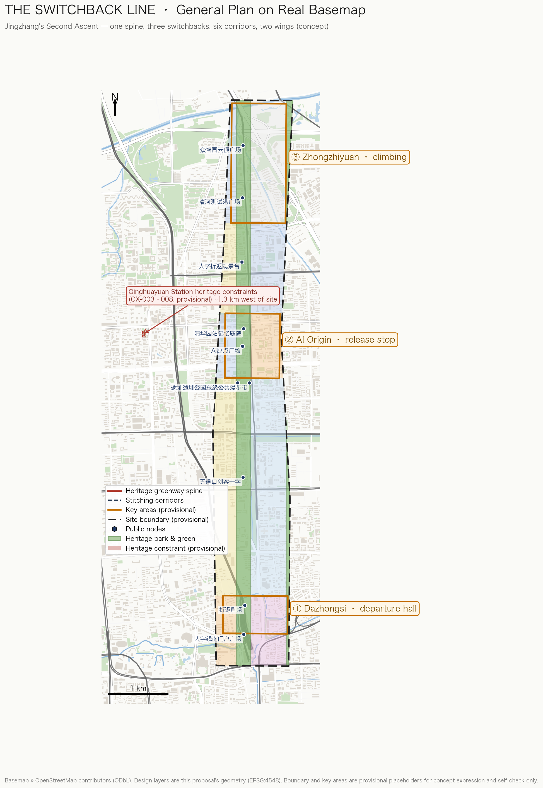

# THE SWITCHBACK LINE: Jingzhang's Second Ascent

## Design Basis and Source List

This proposal rests on three categories of material: the official announcement and taskbooks, repository-registered public sources, and explicitly provisional geometry. The primary basis is the official pre-qualification announcement issued by the Haidian Branch of the Beijing Municipal Commission of Planning and Natural Resources [source:OFFICIAL-ANNOUNCEMENT][standard:PROJECT-OFFICIAL-ANNOUNCEMENT], which fixes the project name, three scope levels, three key areas, official area values, and design tasks. The second basis is the agent-facing open-call taskbook [source:AGENT-TASKBOOK][standard:PROJECT-AGENT-OPEN-CALL-TASKBOOK], which defines ten co-creation principles, six mandatory agent tasks (agent.1–agent.6), and the unified boundary clause. The third category is the repository site package [source:SITE-PACKAGE], the public source registry [source:SOURCE-REGISTRY], and the processed fact pack [source:PROCESSED-FACT-PACK].

Data boundary disclosure: as of generation, no official precise redline or official key-area polygons are available in the repository. This package uses the maintainer-registered provisional rough boundary [source:BOUNDARY-SOURCE] and provisional key-area polygons [source:KEY-AREA-SOURCE], both marked `geometry_role=provisional_constraint` and `official_boundary=false`. They are used only for concept generation, visualization, discussion, and intake self-check — never as official redlines, approval basis, precise-area basis, or statutory control conclusions. All area metrics are recomputed from this provisional geometry under EPSG:4548 [metric:site_area_sqm] and will be fully recalculated once official geometry is published. This organizer data gap is registered in `assumptions.json` (A-CONTROLS-001) and does not block content scoring under the announced rules.

Every design judgment is paired with reproducible GeoJSON layers, metrics, standards, and self-check entries: land-use decisions map to [data:geometry/land_use.geojson#LU-001] and [standard:MNR-LAND-USE-CLASSIFICATION-GUIDE]; regulatory-depth decisions to [standard:MOHURD-CONTROL-DETAILED-PLANNING]; urban-design decisions to [standard:MOHURD-URBAN-DESIGN-MEASURES]; deliverable depth to [standard:MOHURD-ARCH-DESIGN-DEPTH-2016] and the fifteen depth items such as [depth:existing_conditions_diagnosis]. The `[source:...]`, `[standard:...]`, `[depth:...]`, `[data:...]`, and `[metric:...]` tags correspond one-to-one with `sources.json`, `standard_matrix.json`, `design_depth_matrix.json`, `geometry/*.geojson`, and `metrics.json`.

## Three-Level Scope Framework

Work is organized by the three official scope levels [source:OFFICIAL-ANNOUNCEMENT][depth:three_level_scope_framework]:

| Level | Official area | Working depth in this proposal | Data anchor |
| --- | --- | --- | --- |
| Coordinated research area (43.6 km²) | strategic ring beyond [metric:key_area_count] key areas | industry strategy, innovation synergy, future-city research (narrative and structure-diagram level) | official text description plus provisional research polygon |
| Overall design area (~11.4 km²) | [metric:site_area_sqm] (provisional recalculation 11,412,825 sqm, consistent with the announced ~11.4 km²) | regulatory-plan-level urban design: land use, renewal framework, transport and municipal support, character control | [data:geometry/site_boundary.geojson#SITE-001] and all design layers |
| Key detailed-design area (368.4 ha) | Zhongzhiyuan [metric:key_area_zhongzhiyuan_sqm], AI Origin [metric:key_area_origin_sqm], Dazhongsi [metric:key_area_dazhongsi_sqm] (provisional recalculations; official values 1,921,000 / 1,043,000 / 720,000 sqm) | comprehensive-implementation-plan depth | three features including [data:geometry/key_areas.geojson#PROV-KEY-001] |

The three levels are not three isolated drawings: the research area sets the belt's industry narrative; the overall design area converts narrative into land use, corridors, and renewal projects; the key areas verify the structure as discussable spatial schemes [depth:overall_spatial_structure]. Under the provisional boundary all spatial conclusions are conceptual suggestions; the recalculation list for official-geometry replacement is registered in `assumptions.json` [source:BOUNDARY-SOURCE].

## Coordinated Research Area: Industry and Future City Research

### Overall concept: The Switchback Line — Jingzhang's Second Ascent

In 1909, Zhan Tianyou solved the Badaling climb at Qinglongqiao with a herringbone switchback: the train reversed direction at the switchback station, trading two forward runs for one gain in height — the engineering symbol of the first railway designed and built by China itself [source:AGENT-TASKBOOK]. Today the Jingzhang corridor faces a second ascent: from catch-up innovation to full-stack sovereign AI innovation; from an east–west city split by the railway to a stitched city; from technology display to everyday experience. The proposal names the belt **THE SWITCHBACK LINE (人字线)** and reads the heritage park as an urban climbing device. The switchback move becomes urban grammar: **fold** — folding the linear corridor into dwellable nodes; **return** — letting innovation flow back into city life at those nodes.

The naming system follows: primary name "人字线 / THE SWITCHBACK LINE", international subtitle "Jingzhang's Second Ascent". The three key areas play switchback-station roles: Dazhongsi as the **departure hall** (arrival, experience, consumption), the Beijing AI Origin Community as the **mid-line release station** (open source, roadshows, community), and Zhongzhiyuan as the **climbing acceleration segment** (full-stack sovereignty, testing and validation) [source:KEY-AREA-SOURCE]. Visual identity direction: two strokes of rail meet at a switchback dot — the left falling stroke in brick red (heritage rail), the right falling stroke in indigo (data rail); the motif rotates 45 degrees into wayfinding arrows, paving patterns, and parapet ornament. An original logo concept is provided at `assets/figures/switchback-logo.svg` (agent-authored vector, no third-party typefaces or assets; final registration, fonts, and trademark clearance remain separate professional work) [depth:height_massing_character].

### Regional synergy and innovation network

The belt is not an isolated district but Haidian's interface to a larger innovation network. The proposal organizes regional synergy as relay circles (all concept suggestions; no administrative-boundary or fixed industry-layout claims) [source:OFFICIAL-ANNOUNCEMENT]:

| Synergy direction | Partner role (public understanding) | Switchback Line interface | Mechanism (concept) |
| --- | --- | --- | --- |
| Beiyuan community and neighbors | talent housing and daily-service hinterland | west housing renewal cells and stitching corridors [data:geometry/roads.geojson#RD-005] | shared community living rooms and scenario nodes, avoiding key-area enclaves |
| Future Science City | big-science facilities and hard-tech R&D | Zhongzhiyuan pilot and testing grounds (reserve land rolls forward) | "source R&D → scenario conversion" division: results come to the belt for city-scale validation and release |
| Huairou Science City | basic research and national labs | AI Origin release core and data sandbox | "basic research → pilot conversion → international release" relay with algorithm, data, compute, and capital interfaces |
| Beijing E-Town | smart manufacturing and industrialization | Qinghe Test Port (SC-05) | concept channels for mutual recognition of test data and scenario standards |
| Beijing–Tianjin–Hebei and the Jingzhang corridor | sports-culture-tourism belt, regional manufacturing and compute nodes | the line as the urban first segment of the Jingzhang corridor [data:geometry/constraints.geojson#CX-001] | retelling the centennial corridor as a global AI collaboration corridor |

The spatial landings remain inside the belt: Zhongzhiyuan hosts piloting and validation, AI Origin hosts release and community, Dazhongsi hosts transaction and delivery, and the two wings supply factors and scenarios [source:AGENT-TASKBOOK]. Formal deepening must be checked against district plans, science-park plans, and regional synergy policy.

The triple positioning translates as follows: the Centennial Jingzhang Culture Belt is the heritage rail — heritage park, Qinghuayuan station memory, switchback engineering narrative [data:geometry/constraints.geojson#CX-001]; the Urban AI Life Experience Belt is the data rail — scenario cards, slow-mobility corridors, public space; the AI Integration Innovation Belt is the switchback itself — research results returning as life scenarios at the nodes. The five functions map onto three areas and two wings: Zhongzhiyuan carries the full-stack sovereign AI system and AI-governance voice; AI Origin carries the world-class innovation ecosystem; Dazhongsi carries AI-native new business; the Zhongguancun technology-service wing allocates global factors; the Xiaoyuehe scenario-empowerment wing carries AI+ scenario paradigms and the intelligent vitality city [source:AGENT-TASKBOOK].

### Global AI innovation ecosystem cases (6)

All cases are public-knowledge summaries used to extract transferable mechanisms; none constitutes a commitment about tenants or outcomes for this project:

1. **Stanford–Palo Alto corridor (US)**: open university edges plus capital along the street. Transferable: open campus interfaces and developer-service streets in AI Origin [data:geometry/land_use.geojson#LU-009].
2. **Kendall Square, Boston (US)**: the MIT–industry–public-space triangle. Transferable: adjacency of research and public testing grounds in Zhongzhiyuan.
3. **King's Cross Knowledge Quarter (UK)**: rail-heritage renewal with knowledge institutions and public realm first. Transferable: the heritage park as the belt's "public first, industry second" sequencing [metric:green_ratio].
4. **Tokyo Station Marunouchi (Japan)**: station-city integration beside a preserved historic station. Transferable: Qinghuayuan station memory courtyard and interchange integration [data:geometry/constraints.geojson#CX-003].
5. **Kalasatama, Helsinki (Finland)**: a whole district as a testbed with residents as tester-citizens. Transferable: this proposal's tester-citizen mechanism and three industrial validation scenarios.
6. **Brooklyn Tech Triangle (US)**: scenario activation of under-viaduct and leftover spaces. Transferable: under-rail strategies in the stitching corridors.

The shared lesson is that innovation ecosystems run on the product of public-realm quality, scenario openness, and community-operation duration [source:PROCESSED-FACT-PACK]. This proposal converts that lesson into spatial metrics (green ratio [metric:green_ratio], public-space ratio [metric:public_space_ratio], slow-corridor length [metric:slow_greenway_length_m]) and operation mechanisms (see agent.6), closing the space–scenario–operation loop [depth:land_use_layout].

### Industry factor mechanism table (space–policy–operation, concept suggestions)

A full-stack sovereign AI system requires translating seven factor families into operable mechanisms [source:AGENT-TASKBOOK]:

| Factor | Spatial carrier | Mechanism suggestion (concept) | Operating body (direction) |
| --- | --- | --- | --- |
| land / space | reserve land [metric:land_use_area_16_sqm] and renewal cells | elastic use control plus a rolling development list released by test–evaluate–convert cadence | platform company + planning team |
| capital | Zhongzhiyuan R&D core | concept-level innovation fund and scenario vouchers funding open tests, never named firms | to be negotiated by government and market |
| talent | talent apartments and community services (0701/0702 cells) | developer-community points linked to the Honor Wall; housing–social–showcase integration | community operator |
| compute | edge-compute micro-facilities (SC-06) | shared compute pool by application, prioritizing public tests and research | professional operator |
| data | data sandbox (SC-06) | graded public-data opening plus quarterly published sandbox audits | data-governance team with human review |
| scenarios | twelve scenario-card nodes | apply–sandbox–evaluate–publish opening procedure | multi-party scenario committee |

All mechanisms are concept suggestions for professional teams to deepen; none is a fiscal policy, funding arrangement, or investment-attraction commitment.

## Overall Design Area: Urban Renewal and Regulatory-Plan-Level Urban Design

The overall design area is the ~11.4 km² corridor of urban districts and industry zones within 1–2 km of the Jingzhang heritage park [source:OFFICIAL-ANNOUNCEMENT]. Design judgments start from an existing-conditions diagnosis (schematic reading from public knowledge, not survey data) [depth:existing_conditions_diagnosis]:

- **D1 east–west severance**: 5–8 minute walking detours across the rail corridor — the direct basis for the stitching corridors;
- **D2 slow-mobility gaps**: no continuous north–south slow link and no direct station–park frontage — answered by the spine greenway and three connection spurs;
- **D3 public-space discontinuity**: the heritage park is fragmented without themed nodes or evening use — answered by the eight themed public nodes;
- **D4 unlinked industry anchors**: no conversion or release node between the north and south anchors — answered by AI Origin's "release station" role.

At regulatory-plan urban-design depth the proposal sets a structure of "one spine, three folds, six stitching corridors, two wings" [depth:overall_spatial_structure]:

- **One spine**: the Jingzhang heritage-park vitality belt along the historic alignment [data:geometry/constraints.geojson#CX-001] (land-use code 1401, area [metric:land_use_area_1401_sqm]), the shared carrier of culture and experience belts [data:geometry/green_space.geojson#GS-001].
- **Three folds**: three switchback nodes at the key areas — Dazhongsi (departure), AI Origin (release), Zhongzhiyuan (acceleration) — detailed in the next chapter.
- **Six stitching corridors**: six east-west "herringbone" links crossing the spine to re-weave the districts split by the railway [data:geometry/roads.geojson#RD-004], walking-and-cycling first, with transit-connection spurs [data:geometry/roads.geojson#RD-010].
- **Two wings**: the Zhongguancun technology-service wing (west-side research, education, and housing renewal cells; [metric:land_use_area_0802_sqm], [metric:land_use_area_0701_sqm]) and the Xiaoyuehe scenario-empowerment wing (east-side waterfront and education/commerce cells; [metric:land_use_area_0804_sqm]).

The renewal framework follows retain–renovate–demolish logic: retain the historic alignment, the Qinghuayuan station site, and the Dazhongsi anchors [data:geometry/constraints.geojson#CX-004] (v1.7: the Qinghuayuan station site's protection scope and construction control belts are now mapped as provisional polygons derived from the officially published textual boundaries [data:geometry/constraints.geojson#CX-003][source:BJWW-QHY-STATION-T11][source:BJGOV-HERITAGE-BATCH11][source:BJGOV-CCZ-RULES]; Juesheng Temple (Dazhongsi) keeps a point geometry with its first-batch textual boundaries registered [source:BJWW-JUESHENG-T1], as its anchors are not publicly verifiable; both points were corrected against OSM footprints [source:OPENSTREETMAP] — method and error budget in A-HERITAGE-FOURTO-001 / A-HERITAGE-POINT-FIX-001 [source:ISSUE-1774]); renovate low-efficiency industrial land into AI R&D, mixed use, and talent housing; concentrate concept new-build massing in the three key areas (total concept footprint [metric:building_footprint_area_sqm], concept gross floor area [metric:total_floor_area_sqm] — both design intent, not approved figures) [depth:retain_renovate_demolish]. All development intensity, height, and demolition conclusions are pending regulatory conditions: the proposal offers design intent and a recomputation method only; statutory values follow the approved regulatory plan [standard:MOHURD-CONTROL-DETAILED-PLANNING]. Land use uses the national classification codes [standard:MNR-LAND-USE-CLASSIFICATION-GUIDE] with no invented categories. The concept corridor-average FAR (~0.7, concept GFA over provisional site area) is for design discussion only; the formal FAR metric [metric:floor_area_ratio] is reported as unknown pending regulatory conditions.

Heritage constraints landed in v1.7 (provisional derivations; official delineation drawings are issued separately and not public; method and error budget in A-HERITAGE-FOURTO-001) [data:geometry/constraints.geojson#CX-003]:

| Feature | Class | Area (approx. sqm) | Control note |
| --- | --- | ---: | --- |
| CX-003 | Protection scope | 2,342 | Qinghuayuan station fabric with four-to offsets |
| CX-005 | Control belt I | 798 | no control text published on the page; class meaning per regulation [source:BJGOV-CCZ-RULES] |
| CX-006 | Control belt V(1) | 635 | no new buildings/structures |
| CX-007 | Control belt V(2) | 747 | no new buildings/structures |
| CX-008 | Control belt V(3) | 2,655 | no new buildings/structures unrelated to heritage preservation and display |

## Detailed Design of Key Areas

The three key areas are the line's three switchbacks. Each is organized as a readable sub-scheme of positioning + spatial structure + building renewal + transport and slow mobility + public space + AI scenarios + implementation risk; geometry: [data:geometry/key_areas.geojson#PROV-KEY-001] (Zhongzhiyuan), [data:geometry/key_areas.geojson#PROV-KEY-002] (AI Origin), [data:geometry/key_areas.geojson#PROV-KEY-003] (Dazhongsi) [depth:three_key_area_detailed_design].

### Zhongzhiyuan AI Acceleration Area — the climbing segment (~192.1 ha announced; provisional recalculation [metric:key_area_zhongzhiyuan_sqm])

Positioning: the spatial carrier of the full-stack sovereign AI system and AI-governance voice — the steepest climb, analogous to Qinglongqiao. Structure: the northern heritage-park segment as public forecourt; a full-stack R&D core (0802) to the west; strategic reserve land (code 16, [metric:land_use_area_16_sqm]) to the east as an honest expression of long-term uncertainty. Building renewal: predominantly in-place campus renewal with concept lab–office–testing vertical mixing [data:geometry/buildings.geojson#BD-001]. Mobility: Qinghe Test-Port Plaza [data:geometry/public_space.geojson#PS-007] and stitching corridors 05/06 join the spine greenway. Scenarios: edge-compute and data sandbox (SC-06), open robotics testing (SC-05). Risk: full-stack ecosystem cultivation is slow; rolling development of the reserve land needs elastic alignment with territorial spatial planning; all scale conclusions await regulatory confirmation.

### Beijing AI Origin Community — the mid-line release station (~104.3 ha announced; provisional recalculation [metric:key_area_origin_sqm])

Positioning: the world-class AI innovation ecosystem expressed as a community — "release" is the core act: new models, products, and papers debut at AI Origin Plaza [data:geometry/public_space.geojson#PS-004]. Structure: research land (0802) to the west and a developer vitality street (05) to the east sandwich the park spine — a lab–park–market sandwich; the Qinghuayuan station memory courtyard [data:geometry/public_space.geojson#PS-005] embeds the historic station image in the release route. Building renewal: small- and mid-scale renovation and infill keeping community grain; talent apartments and services sit in the west housing cells (0701, [metric:land_use_area_0701_sqm]). Scenarios: public first-release model evaluation (SC-04), open-source maker fair (SC-03), community elder-care pilot (SC-08). Risk: balancing public release events with residential quiet; the community brand must align with official usage of "AI Origin Community".

### Dazhongsi AI Industry Cluster — the departure hall (~72.0 ha announced; provisional recalculation [metric:key_area_dazhongsi_sqm])

Positioning: the display-and-transaction hall for AI-native business — the public's point of departure onto the line. Structure: the south gateway plaza [data:geometry/public_space.geojson#PS-001] and the Switchback Theatre [data:geometry/public_space.geojson#PS-002] form the arrival sequence; commercial land (05, [metric:land_use_area_05_sqm]) hosts the computational-consumption lab and AI-native retail; cultural land (0803, [metric:land_use_area_0803_sqm]) links the Dazhongsi Ancient Bell Museum (point corrected against OSM, first-batch textual protection boundaries registered [data:geometry/constraints.geojson#CX-004]) into a dialogue across time. Mobility: the Dazhongsi station connection (concept) [data:geometry/roads.geojson#RD-010] and stitching corridors 01/02. Scenarios: computational-consumption lab (SC-07), transit MaaS (SC-10). Risk: complex existing ownership; renewal proceeds as negotiated micro-renewal with no parcel-level demolition conclusion. **Position disclosure**: the provisional polygon this subsection relies on (PROV-KEY-003) has been found by community review to be centered near Beijing North Station, about 2.26 km from Dazhongsi metro station, and is not yet station-anchored ([source:ISSUE-1029]; maintainers clarified its placeholder semantics in PR #1036). All spatial conclusions in this subsection are directional concepts and will be recomputed once the official boundary or anchoring relationship is published.

## AI Innovation Ecosystem, Personas, and AI+ Scenarios

The ecosystem is organized as factors–scenarios–operations: factors (land, space, capital, talent, compute, data, scenarios) sit in the three areas and two wings; scenarios run as twelve minimum operable cards [metric:scenario_node_count]; operations sustain long-term vitality through the annual program and community mechanisms (agent.6). Spatial mapping: R&D in Zhongzhiyuan (0802), release and community in AI Origin (0802+05), consumption and delivery in Dazhongsi (05), education along the east (0804), daily-life support along the west (0701/0702) [data:geometry/land_use.geojson#LU-001].

### Personas (6)

| Persona | Core needs | Corresponding spaces and scenarios |
| --- | --- | --- |
| P1 AI researcher / founder | compute, data, testbeds, release channels | Zhongzhiyuan R&D core, SC-04/05/06 |
| P2 developer / engineer | community, toolchain, affordable collaboration space | AI Origin developer street, SC-03 |
| P3 local resident (incl. long-time) | undisturbed life, better services, participation | west housing renewal cells, SC-08 |
| P4 university student | internships, courses, showcases, affordable culture | education innovation streets, SC-01/02 |
| P5 city visitor / AI innovation visitor | legible, shareable experience routes | landmarks and wayfinding, SC-12 |
| P6 merchant / operator | footfall, rule certainty, data compliance | Dazhongsi commercial cells, SC-07 |

### AI scenario cards (12; SC-04/05/06 are industrial test-and-validation scenarios)

Each card lists its spatial anchor, users, data boundary, and human-review mechanism; all are concept suggestions, none is approved operation [source:AGENT-TASKBOOK]:

| ID | Scenario | Spatial anchor | Users | Data and privacy boundary | Human review |
| --- | --- | --- | --- | --- | --- |
| SC-01 | Heritage-park AR time-overlay guide | full spine [data:geometry/green_space.geojson#GS-001] | P5/P4 | public culture data only; no face capture | historical fact check |
| SC-02 | Switchback AR night-run companion | spine greenway [data:geometry/roads.geojson#RD-001] | P3/P4 | fitness data stays on device | staff on site |
| SC-03 | Maker-fair intelligent matching | PS-003 Maker Crossing | P2 | voluntary project registration | final booth allocation |
| SC-04 | Public first-release model evaluation (industrial validation) | PS-004 Origin Plaza | P1 | sandboxed evaluation data | expert panel review |
| SC-05 | Open robotics test port (industrial validation) | PS-007 Qinghe Test Port | P1 | physically separated zones; graded data | safety officer sign-off per test |
| SC-06 | Edge compute and data sandbox (industrial validation) | Zhongzhiyuan R&D core | P1 | data stays in-domain; trusted computing | quarterly public audit |
| SC-07 | Computational-consumption lab | Dazhongsi commercial cells | P6/P5 | anonymized consumption data | recommendation opt-out |
| SC-08 | Community canteen and elder-care pilot | west housing cells | P3 | minimal health data with family consent | daily community-worker review |
| SC-09 | Xiaoyuehe ecological sensing | waterfront greenway | P3 | environmental data only | manual incident handling |
| SC-10 | Station-integrated MaaS | three connection spurs | all | de-identified trips | human-approved dispatch |
| SC-11 | City-governance "switchback ticket" | whole belt | P3/P6 | per government data rules | AI dispatch with human fallback |
| SC-12 | international developer innovation guide | three landmarks [metric:ai_innovation_landmark_count] | P5/P2 | multilingual public content | compliance review |

Privacy and review principle: all scenarios follow the charter's "human final judgment" clause [source:AGENT-TASKBOOK]; no non-public data, no mandatory vendor, no immature technology presented as deployable.

### Scenario governance: adopting the Switchback Protocol as the unified operating contract

The scenario cards adopt the peer-contributed **Switchback Protocol v1.0** ([source:SWITCHBACK-PROTOCOL], CC-BY-4.0, credit: chucky1102 / RENLINE) as their unified operating contract; the adapted machine-readable version is at `visual/assets/switchback-protocol.json`. Rationale: dozens of proposals have each invented their own state machines and time limits, making mechanisms impossible to compare; adopting one minimal shared contract lets reviewers and operators read this proposal's scenario governance like a common interface. The mapping:

- **Three-color states**: all twelve cards start yellow (controlled pilot); SC-12, the lowest-risk guide, is the green candidate; red is not failure but a planned switchback — reverting to the last stable state with a public explanation;
- **Digital time limits** (design targets, not government commitments): human takeover within 5 minutes (tightened to 3 at the SC-05 test port), appeals acknowledged in 1 working day and resolved in 7, a non-smart equivalent path within a 15-minute walk;
- **90-day public review**: renew / reduce / pause / switchback; missing two consecutive reviews auto-triggers red;
- **Quantified triggers and recovery**: one safety-grade takeover or complaints above threshold triggers red (thresholds set after first-phase measurement, no fabricated baselines); recovery needs two consecutive clean cycles plus one yellow observation period;
- **Three-tier ledger**: near-miss / switchback / decommission; every review-born design change is written back into its scenario card; model updates, source withdrawals, and license expiries auto-trigger review.

This proposal's earlier four-step opening procedure (apply, sandbox, evaluate, publish) maps onto the protocol's ascent gates (virtual_evaluation → controlled_site → real_block), and the three demonstration packages (DP-1/2/3) map onto its roles model (accountable operator, safety officer, data steward, public redress, independent reviewer).

### One-minute experiences

Making the scenarios perceptible:

- **SC-01 time overlay**: a visitor raises a phone in the heritage park and a 1909 steam train rolls across today's greenway, with Zhan Tianyou's engineering notes surfacing at the switchback point.
- **SC-02 AR night run**: a runner's breathing rhythm retunes the color of the light bands; finishing a "switchback leg" mints a shareable badge.
- **SC-03 maker fair**: a developer scans a QR code at Maker Crossing and gets matched with three investor booths and two complementary hardware hackers.
- **SC-04 first release**: a startup runs public benchmarks at Origin Plaza; results stream to the big screen, the audience votes on interpretability, and an expert panel reviews before the report goes out.
- **SC-05 robotics test port**: a delivery robot avoids a child dummy in the separated test zone while parents watch a simplified replay of every decision on the fence screen.
- **SC-06 data sandbox**: a researcher brings an algorithm into the sandbox, trains on de-identified city data, and leaves with only the audited model weights.
- **SC-07 computational consumption**: a shopper at Dazhongsi tries one-sentence outfit generation; the screen labels what is algorithmic recommendation, with one tap to opt out.
- **SC-08 elder care**: a smart speaker reminds a senior living alone to take medicine; anomalies first notify a community worker for a visit, not an alarm call. This pilot aligns with Haidian District's current "AI + Elderly Care" Three-Year Action Plan (2026–2028) as district policy background only — not an authorization, funding, data, or venue basis [source:DATA-SRC-BJHD-AI-ELDERLY-2026].
- **SC-09 ecological sensing**: a morning runner on the waterfront reads today's water quality and bird report from bank sensors; anomalies go to maintenance staff.
- **SC-10 MaaS**: a visitor leaving Dazhongsi station gets a route — "6 minutes via the stitching corridor to the launch event" — with live crowding hints.
- **SC-11 switchback ticket**: a merchant photographs a blocked storefront, AI dispatches the ticket to the grid, and the resolution returns with on-site photos, appealable throughout.
- **SC-12 innovation guide**: an international developer walks the three landmarks with the multilingual guide, scans at the switchback landmark, and submits an open-source project link for Honor Wall review.

## Land Use, Building Scale, and Retain-Renovate-Demolish Strategy

The land-use layout is a topology-safe partition of the provisional boundary: 19 parcels are split from the submitted boundary itself, sharing boundary coordinates with no overlaps and no gaps, covering the full site [data:geometry/land_use.geojson#LU-001][depth:land_use_layout]. Composition (provisional recalculation): research [metric:land_use_area_0802_sqm], education [metric:land_use_area_0804_sqm], residential [metric:land_use_area_0701_sqm], commercial [metric:land_use_area_05_sqm], cultural [metric:land_use_area_0803_sqm], park green [metric:land_use_area_1401_sqm], reserve [metric:land_use_area_16_sqm].

Building scale: concept footprint [metric:building_footprint_area_sqm]; concept building density [metric:building_density]; concept gross floor area [metric:total_floor_area_sqm] (assumed floors by type: research 10, commercial 8, education 7, talent apartments 12, cultural 4 — all design intent). Retain–renovate–demolish: retain the historic alignment, Qinghuayuan station site, and Dazhongsi anchors and quality existing buildings; renovate low-efficiency industrial and community stock; concentrate concept new-build in the three key areas [data:geometry/buildings.geojson#BD-001]. Development intensity, height, and character follow the approved regulatory plan — this proposal issues no approved FAR, height, or demolition conclusions [standard:MOHURD-CONTROL-DETAILED-PLANNING][depth:development_intensity_controls]; the concept massing intent is "low at the park, higher at the wings, marked at the nodes", with landmarks at public-art scale only [depth:height_massing_character].

## Transport, Rail, Municipal Infrastructure, and Public Services

The transport strategy answers the corridor's core pain — the east–west split [depth:traffic_rail_slow_parking]: six herringbone stitching corridors (walking/cycling first) reconnect the split districts at 5–8 minute walking intervals [data:geometry/roads.geojson#RD-004]; slow-system length (greenway + cycling + walking) [metric:slow_greenway_length_m]; concept road area [metric:road_area_sqm] and road-area ratio [metric:road_area_ratio] (centerline length times assumed widths per class — a concept estimate). Rail: three concept connection spurs (Dazhongsi, Wudaokou, Qinghe) stitch stations directly to spine public space [data:geometry/roads.geojson#RD-010]. Parking: concept non-motorized hubs at key-area edges; car parking follows regulatory plan and traffic impact assessment (pending item).

Municipal and new infrastructure [depth:municipal_new_infrastructure]: edge-compute micro-facilities and data sandboxes combine with the Zhongzhiyuan R&D core (SC-06); distributed energy and sponge-city facilities reserve space in the waterfront greenway and reserve land; conventional utility corridors carry no engineering conclusion and remain pending conditions. Public services: talent apartments, community canteens, open classrooms, and health/elder service points line the west living cells and key-area edges; radii and scales follow regulatory-plan deepening.

## Blue-Green Network, Public Space, and Urban Character

Blue-green system: the heritage-park spine and the Xiaoyuehe waterfront greenway form the "one spine, one greenway" skeleton; green area [metric:green_space_area_sqm], green ratio [metric:green_ratio] (provisional recalculation) [depth:blue_green_public_space]. Public-space system: eight themed nodes (South Gateway Plaza, Switchback Theatre, Maker Crossing, AI Origin Plaza, Memory Courtyard, Switchback Viewpoint, Test-Port Plaza, Cloud-Top Plaza) plus two heritage-park promenades; public-space area [metric:public_space_area_sqm], ratio [metric:public_space_ratio] [data:geometry/public_space.geojson#PS-001].

Urban character: a two-rail vocabulary (heritage rail · data rail) unifies paving, wayfinding, and street furniture; the herringbone motif recurs across parapets, paving, and signage, forming a recognizable urban temperament [standard:MOHURD-URBAN-DESIGN-MEASURES]. The intended spatial scale is expressed in a typical section: within the 120 m spine, retained rails on display, herringbone paving, and slow-mobility priority; 24 m promenades on both sides; active ground floors of the research and commercial frontages opening to the park; massing low at the park and higher at the wings (concept proportions, not engineering design).

### AI innovation landmarks and honor display (agent.4)

Three AI innovation landmarks (answering the taskbook's pilgrimage-landmark requirement; this proposal names them "AI innovation landmarks" to stress their public character — accessible, participatory, auditable public innovation destinations rather than objects of tech worship; concept suggestions at public-art scale, not engineering conclusions) [metric:ai_innovation_landmark_count]:

1. **The Switchback Station spirit landmark** (AI Origin Plaza): two rail strokes meeting at a glowing dot; the ground carries twin timelines of Jingzhang railway history and AI history — the visitor stands on the crossing, between two ascents.
2. **Jingzhang 1909 Time Gate** (Dazhongsi south gateway): an arrival-sequence portal abstracted from the historic station arch; at night a data-light band replays the "train arriving" image.
3. **Zhongzhiyuan Cloud-Rail Tower** (Cloud-Top Plaza): a concept tower combining lookout and compute display, visualizing audited public test data in real time.

Honor display: the Switchback Honor Wall — annually selected contributors from the developer community, open-source work, and scenario testing are inscribed/projected (with consent) on the landmark plinth, making "contribution memorable" [source:AGENT-TASKBOOK]. Component library: herringbone benches, twin-rail wayfinding posts, programmable light bands, modular booths — material for professional teams to deepen. All landmarks must pass heritage, green-space, water-corridor, and traffic-safety review before any deepening; nothing here is an engineering feasibility conclusion.

Cultural narrative (agent.5): the fusion of centennial Jingzhang culture (sovereign engineering spirit), Zhongguancun culture (grassroots innovation), and new AI culture (open source, agents, human-machine co-governance) is expressed through the twin-timeline paving, memory-courtyard exhibits, the AR guide (SC-01), and the international copy line "From the first railway to the second ascent". The cultural signage system and the belt's logo system are layered apart: heritage-red for culture, indigo for wayfinding — never mixed.

## Renewal Projects, Implementation Policy, and Phasing

Concept renewal project list (not project-approval conclusions) [depth:renewal_project_list]:

| ID | Project | Location | Type | Phase |
| --- | --- | --- | --- | --- |
| U-01 | Heritage park south demonstration segment | Dazhongsi spine segment | public-space renewal | near |
| U-02 | South gateway plaza and connection spur | PS-001/RD-010 | plaza + slow mobility | near |
| U-03 | AI Origin release core and memory courtyard | PS-004/PS-005 | micro-renewal + installation | near |
| U-04 | Two demonstration stitching corridors | RD-005/006 | slow-mobility connection | near |
| U-05 | Zhichun–Wudaokou open-street renewal | row 2 east | block renovation | mid |
| U-06 | Xiaoyuehe waterfront greenway completion | EE column | blue-green remediation | mid |
| U-07 | West talent-housing renewal | rows 2/4 west | housing renewal | mid |
| U-08 | Qinghe test port and sandbox facilities | PS-007 | industry support | mid |
| U-09 | Zhongzhiyuan full-stack R&D core renewal | row 5 west | campus renewal | far |
| U-10 | Strategic-reserve rolling-development mechanism | row 5 east | policy mechanism | far |

Phasing: near (2026–2028, concept area [metric:phasing_area_2026_2028_sqm]) twin-core launch; mid (2028–2031, [metric:phasing_area_2028_2031_sqm]) stitching into a network; far (2031–2035, [metric:phasing_area_2031_2035_sqm]) Zhongzhiyuan leadership [data:geometry/phasing.geojson#PH-001][depth:phasing_implementation]. Policy suggestions (concept level): a design–test–evaluate–diffuse scenario-opening mechanism; elastic use control for reserve land; negotiated micro-renewal as principle, with no ownership-level demolition conclusions.

### Three demonstration implementation packages (concept suggestions for professional teams and operators)

From the twelve scenario cards, the three industrial test-and-validation scenarios are developed into startable implementation packages using ten elements: user problem, space and facilities, one-minute flow, data and compute, operating body, preconditions, cost magnitude, phases, metrics, and exit. All cost figures are order-of-magnitude estimates from public market-price knowledge, with assumptions stated; none is an investment commitment.

#### DP-1 Public first-release model evaluation (SC-04 @ AI Origin Plaza [data:geometry/public_space.geojson#PS-004])

| Element | Content |
| --- | --- |
| User problem | AI startups lack a credible public evaluation and first-release channel; the public lacks a legible interface to model capabilities |
| Space and facilities | release and audience zones at Origin Plaza (open space), a concept 200–300 sqm evaluation-prep and media area, livestream and on-screen data equipment |
| One-minute flow | team submits model → sandbox pre-evaluation → public benchmark day with live results → audience votes on interpretability → expert panel review → public report |
| Data / compute / equipment | licensed public evaluation datasets; sandbox compute linked with DP-3; large screen, livestream, timing equipment |
| Operating body (suggested types) | third-party evaluation institution leads, community co-governance committee supervises; partner types: universities, open-source communities, tech media |
| Preconditions | large-event safety permit, temporary-structure fire safety, data-licensing review, published expert-review rules |
| Cost magnitude (assumptions) | CAPEX in the order of several million RMB (plaza retrofit and equipment); OPEX roughly 10^5 RMB per event, assuming 6–10 events/year — order-of-magnitude estimates |
| Phases | 0–1 yr: two pilot evaluations; 1–3 yrs: quarterly first-release weeks; 3–5 yrs: annual branded program and international evaluation calendar |
| Metrics and review | baseline zero events; targets: annual events, participating teams, 100% public reports, review timeliness; sources: operation logs and public reports; quarterly review |
| Failure and exit | participation below threshold for two consecutive seasons → switch to online releases plus small roadshows; the plaza installation is reversible and returns to public use |

#### DP-2 Open robotics test port (SC-05 @ Qinghe Test-Port Plaza [data:geometry/public_space.geojson#PS-007])

| Element | Content |
| --- | --- |
| User problem | service-robotics firms lack compliant test grounds in real urban environments; lab data cannot support deployment confidence in public space |
| Space and facilities | fenced/marked test zones, a public viewing gallery with explainer screens, equipment room and safety-officer post, swappable test-prop store |
| One-minute flow | booking → safety briefing and insurance check → zoned tests (obstacle avoidance / delivery / interaction) → simplified public replay of decisions → safety officer sign-off |
| Data / compute / equipment | graded test-data management; IP-sensitive data never leaves the domain; simplified public replays; on-device recording |
| Operating body (suggested types) | professional test operator plus park platform company; partner types: robotics firms, insurers, university labs |
| Preconditions | site-use approval and public-safety assessment, liability insurance, emergency drills, fire and electrical safety |
| Cost magnitude (assumptions) | CAPEX below roughly one million RMB (light retrofit, demountable facilities); OPEX roughly one million RMB/year (staff, maintenance, insurance) — order-of-magnitude estimates |
| Phases | 0–1 yr: weekday tests plus weekend public open days; 1–3 yrs: test standards and data formats published as open documents; 3–5 yrs: a replicable urban test-ground operating model |
| Metrics and review | test sessions and participating firms, zero safety incidents, replay publication rate, open-day attendance; monthly safety review plus quarterly operations review |
| Failure and exit | utilization below 30% for two consecutive seasons → convert to a public science-experience ground; fences and props are demountable and the site returns to park use |

#### DP-3 Edge compute and data sandbox (SC-06 @ Zhongzhiyuan R&D core; public showcase window at Dazhongsi, linked with SC-07)

| Element | Content |
| --- | --- |
| User problem | small teams and researchers lack affordable compute and compliant urban data environments; public-data opening lacks an auditable technical carrier |
| Space and facilities | containerized edge-compute micro-facility, sandbox operations area and audit room (concept ~500 sqm); the Dazhongsi computational-consumption lab serves as the public understanding window |
| One-minute flow | application with purpose statement → in-sandbox training with data staying in-domain → audit (data provenance, de-identification, outputs) → only audited model weights leave → quarterly public audit summaries |
| Data / compute / equipment | graded opening of public data after legality review and de-identification; shared compute pool by application; trusted computing and log-audit equipment |
| Operating body (suggested types) | data-governance task force plus professional technical operator; partner types: universities and institutes, open-source foundations, compliance advisers |
| Preconditions | data-provenance legality review, classified cybersecurity protection, power capacity and cooling, published audit rules |
| Cost magnitude (assumptions) | CAPEX in the order of tens of millions RMB depending on scale; OPEX in the order of millions RMB/year (power, operations, audits) — order-of-magnitude estimates |
| Phases | 0–1 yr: invitation-only pilot; 1–3 yrs: application-based opening with quarterly public audits; 3–5 yrs: an auditable public-data infrastructure model |
| Metrics and review | hosted projects, published audit summaries, zero data-exfiltration events, compute utilization; quarterly dual review of audits and operations |
| Failure and exit | persistently low utilization → compute shifts to university teaching and public research sharing; general-purpose equipment can be repurposed wholesale; sandbox data destroyed on schedule |

All three packages share three principles: reversible (sites return to public use), auditable (reports and audit summaries are public), exitable (explicit failure conditions and reuse mechanisms). The Dazhongsi key area gains its implementation handle through DP-3's public showcase window linked with SC-07; its standalone package is suggested for a second phase once regulatory conditions are available.

Long-term operations (agent.6): annual program — spring Switchback Developer Conference, summer Switchback Festival × AI art season, autumn Model First-Release Week (with SC-04), winter Jingzhang culture season; the annual flagship **Switchback Hackathon**: a 48-hour developer competition whose problem statements all come from real urban needs surfaced by the twelve scenario cards (slow-mobility gap detection, heritage interpretation, community elder-care ticketing, etc.); winning teams receive priority access to the data sandbox and the robotics test port, plugging directly into the DP-1/DP-2/DP-3 demonstration packages, and reviewed open-source outcomes enter the public knowledge base — forming a conversion chain of "hackathon → scenario testing → team landing → community retention"; brand IP — primary "THE SWITCHBACK LINE" plus "Switchback Station" sub-brands; developer community — the Switchback Club with contribution points linked to the Honor Wall; scenario opening — four steps (apply, sandbox, evaluate, publish); international communication — the "Second Ascent" narrative joining global AI-city networks. All events and operations are concept suggestions, not government commitments or investment-attraction policy [source:AGENT-TASKBOOK].

## Metrics, Area Recalculation, and Compliance Matrix

Metrics sit in three tiers: announcement-constrained (areas), design-intent (concept ratios and scales), and pending (regulatory indicators) [depth:metrics_recalculation]. Core recomputation table (all recomputed from GeoJSON under EPSG:4548; formulas and assumptions in `metrics.json`):

| Metric | Value | Note |
| --- | --- | --- |
| Site area | [metric:site_area_sqm] sqm | provisional-boundary recalculation, consistent with announced ~11.4 km² |
| Key areas | [metric:key_area_count] | Zhongzhiyuan [metric:key_area_zhongzhiyuan_sqm] / AI Origin [metric:key_area_origin_sqm] / Dazhongsi [metric:key_area_dazhongsi_sqm] |
| Green area / ratio | [metric:green_space_area_sqm] sqm / [metric:green_ratio] | spine + waterfront greenway |
| Public space / ratio | [metric:public_space_area_sqm] sqm / [metric:public_space_ratio] | 8 nodes + 2 promenades |
| Footprint / density | [metric:building_footprint_area_sqm] sqm / [metric:building_density] | concept massing |
| Concept GFA | [metric:total_floor_area_sqm] sqm | assumed-floors estimate, design intent |
| FAR | [metric:floor_area_ratio] | pending regulatory conditions (unknown) |
| Road area / ratio | [metric:road_area_sqm] sqm / [metric:road_area_ratio] | centerline × assumed widths |
| Slow corridors | [metric:slow_greenway_length_m] m | greenway + cycling + walking |
| Historic alignment | [metric:heritage_spine_length_m] m | schematic alignment |
| Phasing areas | near/mid/far | [metric:phasing_area_2026_2028_sqm] / [metric:phasing_area_2028_2031_sqm] / [metric:phasing_area_2031_2035_sqm] |
| Scenario nodes / landmarks | [metric:scenario_node_count] / [metric:ai_innovation_landmark_count] | 12 cards mapped to 8 nodes and 6 corridors |

Land-use breakdown: research [metric:land_use_area_0802_sqm], education [metric:land_use_area_0804_sqm], residential [metric:land_use_area_0701_sqm], commercial [metric:land_use_area_05_sqm], cultural [metric:land_use_area_0803_sqm], park green [metric:land_use_area_1401_sqm], reserve [metric:land_use_area_16_sqm]. Compliance coverage: all 17 mandatory announcement tasks (1.3.1–1.5.3.3) and all 6 agent tasks (agent.1–agent.6) are registered in `compliance_matrix.json` and supported by the sections above; standard responses in `standard_matrix.json`; depth evidence in `design_depth_matrix.json` (all 15 items complete).

## Risk, Copyright, and Compliance

The primary measure of success in this proposal is not "how many people come to see AI" but **how much value the AI industry returns to residents, public space, and city governance**. A public-value and risk matrix follows (structured registration in `risk.json`, covering data privacy, implementation complexity, public acceptance, operations cost, policy uncertainty, spatial dispute, technology maturity, and equity & inclusion).

### Public-value matrix (concept-level quantification; all values recomputed or estimated)

| Public value | Concept measure | Beneficiaries |
| --- | --- | --- |
| Slow-mobility time saved by stitching | six corridors compress cross-corridor detours from 5–8 min to 2–3 min (concept estimate) [metric:slow_greenway_length_m] | residents and commuters on both sides |
| Green and public-space supply | green ratio [metric:green_ratio], public-space ratio [metric:public_space_ratio] (provisional recalculation); eight themed nodes serving the three key areas [metric:public_space_area_sqm] | all users |
| Jobs and skill pathways | service and operations roles created by the test port, sandbox, evaluations and community operations (types listed, counts not estimated); hackathon and developer community as skill and showcase channels | youth, developers, career changers |
| Public-service improvement | community canteen and elder-care pilot (SC-08), ecological stewardship (SC-09), switchback ticket (SC-11) | local residents including seniors |
| Heritage legibility | the heritage park turns the "invisible railway" into walkable, narrated, participatory public space [metric:heritage_spine_length_m] | citizens, visitors, students |

### Risk matrix (trigger — mitigation — suggested responsible body)

| Risk | Trigger | Mitigation | Suggested responsible body (concept) |
| --- | --- | --- | --- |
| rent inflation and small-merchant displacement | innovation-space premium squeezing existing shops | participatory renewal, quotas for public stalls and micro spaces (concept), negotiated relocation | platform company + sub-district/community |
| corporate capture of public space | events or firms monopolizing venues | time-sharing, rigidly protected public hours, public event approvals | operator + community co-governance committee |
| safety of children, seniors, disabled and night users | test operations, night events, lighting and interface barriers | physical separation of test zones, accessible design, night patrols and lighting standards | operator + property + safety officers |
| privacy, cybersecurity and algorithmic bias | data collection, sensors, recommender algorithms | minimal collection, data staying in-domain, quarterly public audits, opt-out channels and human review | data-governance task force |
| heritage consumed by tech branding | over-commercial packaging, historical distortion | historical fact checking, heritage review first, layered cultural vs commercial signage | heritage authority + curatorial team |
| stormwater, heat island, carbon and long-term maintenance | resource and environmental load of construction and operation | sponge measures along the waterfront, reuse of existing buildings first, maintenance budget in operating plans | municipal departments + operator |

Main risks and responses: (1) data risk — official redline and key-area polygons are missing; all spatial conclusions are concept suggestions under provisional geometry, with full-package recalculation committed upon official release (A-CONTROLS-001); (2) implementation risk — complex ownership across the three areas, long renewal cycles; the proposal favors micro-renewal and elastic mechanisms; (3) technology risk — scenario cards stay within mature capabilities, with immature technology marked as pilot; (4) compliance risk — all landmark, signage, and logo materials require separate rights clearance [source:AGENT-TASKBOOK].

## References

- Public brief draft: `brief/public-brief.md`
- Public brief material boundary statement: `brief/README.md`
- Pre-qualification announcement (Haidian Branch of Beijing Municipal Commission of Planning and Natural Resources, 2026-05-09) [source:OFFICIAL-ANNOUNCEMENT]: https://ghzrzyw.beijing.gov.cn/zhengwuxinxi/tzgg/hd/202605/t20260509_4643047.html
- Agent-facing open-call taskbook excerpt (2026-05-18) [source:AGENT-TASKBOOK]: `brief/site-package/agent_taskbook.json`
- Site package [source:SITE-PACKAGE]: `brief/site-package/` (design_brief.json / allowed_design_space.json / sources.json / enums / ranges / schemas)
- Public source registry [source:SOURCE-REGISTRY]: `data/source_registry.json`
- Processed fact pack [source:PROCESSED-FACT-PACK]: `data/processed/agent_fact_pack.md` and companion CSVs
- Provisional boundary and key-area geometry [source:BOUNDARY-SOURCE][source:KEY-AREA-SOURCE]: `brief/site-package/geometry/provisional_boundaries.geojson`
- Professional standards (local snapshots under `brief/site-package/standards/references/`): Urban Design Measures; Regulatory Detailed Planning Compilation and Approval Measures; Territorial Spatial Land-Use Classification Guide; Design-Document Depth Regulation (2016 edition)

Reproduction command (not a source entry): `python3 scripts/self_check_submission.py submissions/loml13/switchback-line --pr-author loml13`
