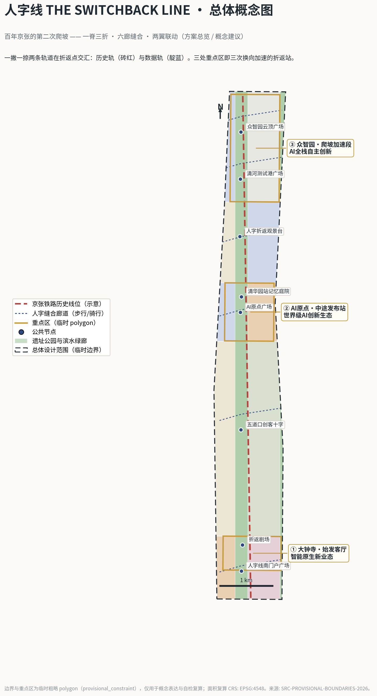
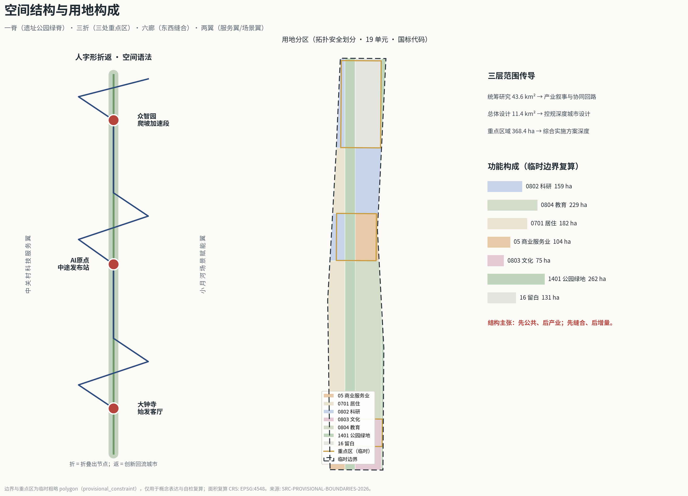
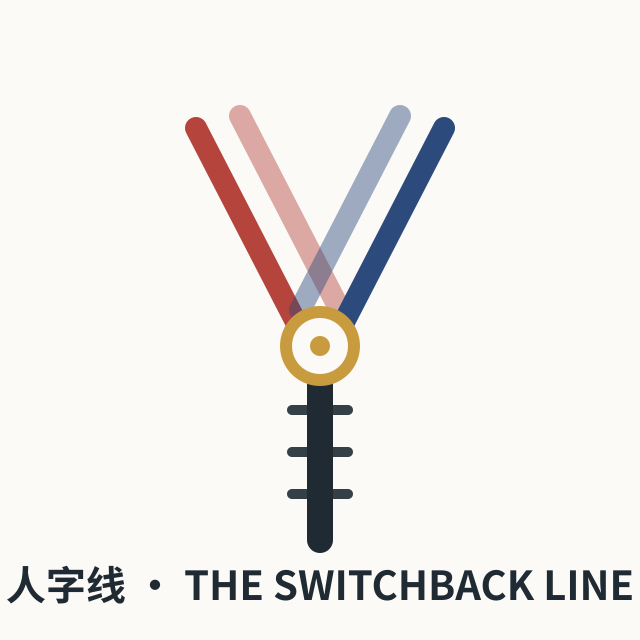
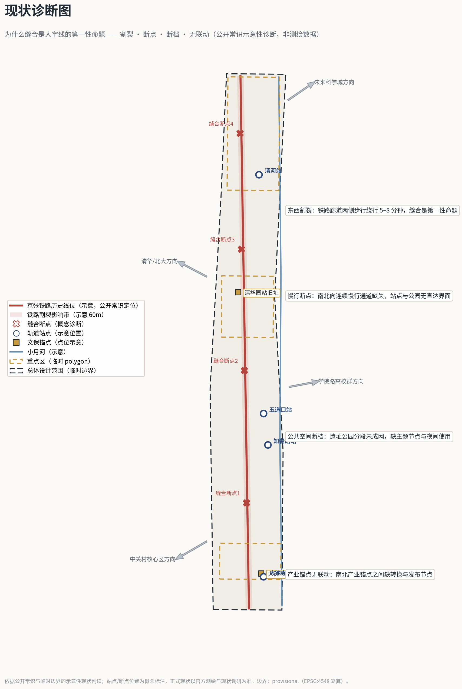
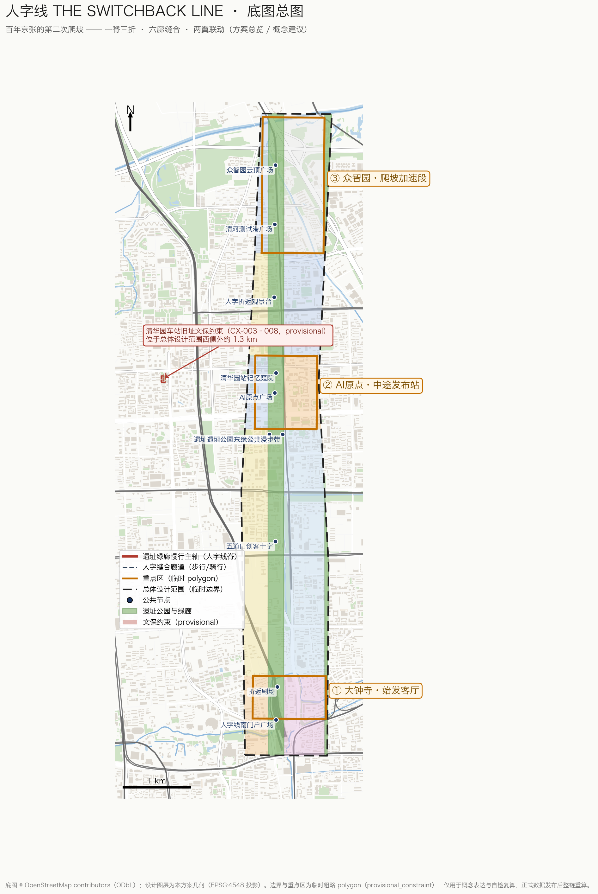
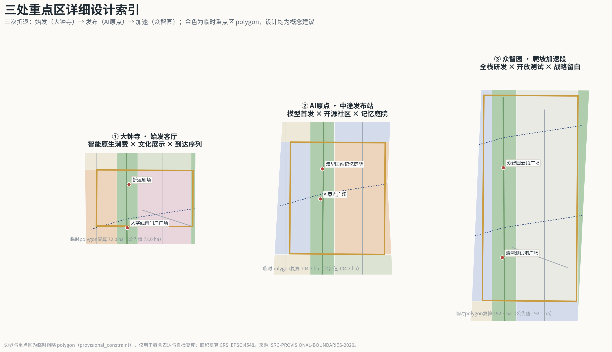
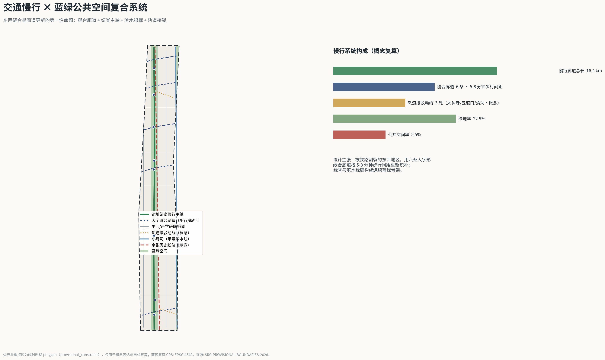
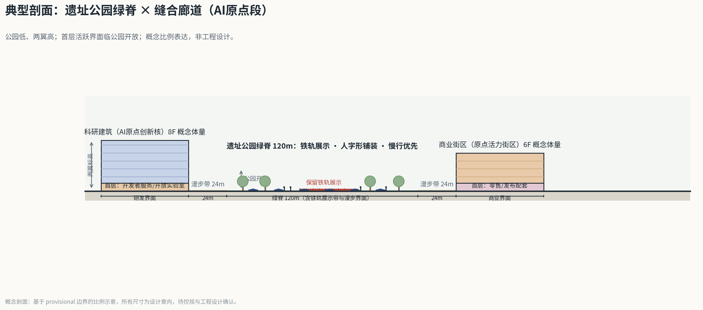
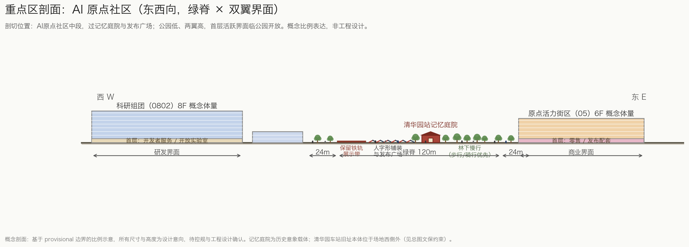
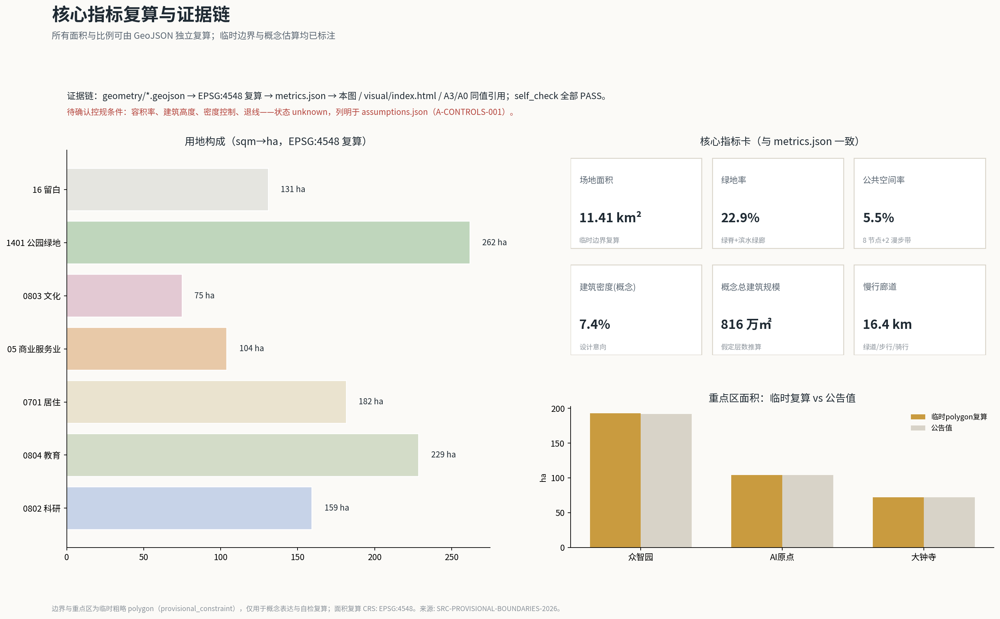

# 人字线 THE SWITCHBACK LINE：百年京张的第二次爬坡

## 设计依据与资料清单

本方案的全部事实基础来自三类材料：官方公告与任务书、仓库登记的公开资料、以及明确标注为 provisional 的临时几何数据。第一依据是北京市规划和自然资源委员会海淀分局发布的《百年京张AI创新带城市设计国际方案征集资格预审公告》[source:OFFICIAL-ANNOUNCEMENT][standard:PROJECT-OFFICIAL-ANNOUNCEMENT]，它确定了项目名称、三层范围、三处重点区、公告面积和设计任务；第二依据是面向全球智能体的开源征集任务书摘录 [source:AGENT-TASKBOOK][standard:PROJECT-AGENT-OPEN-CALL-TASKBOOK]，它确定了十条共创原则、agent.1 至 agent.6 六项必答任务和统一边界条款；第三类是 `brief/site-package/` 下的设计简报、枚举、范围、标准与 schema [source:SITE-PACKAGE]，以及公开资料登记表 [source:SOURCE-REGISTRY] 与事实包导航 [source:PROCESSED-FACT-PACK]。

必须先说明资料边界：截至本方案生成日，仓库尚未取得官方精确红线与三处重点区官方 polygon，本方案使用维护者登记的临时粗略边界 [source:BOUNDARY-SOURCE] 与临时重点区 polygon [source:KEY-AREA-SOURCE]。二者的 `geometry_role` 均为 `provisional_constraint`、`official_boundary=false`，只可用于概念生成、可视化、讨论与入口自检，不得作为 official redline、审批依据、精确面积复算依据或法定控制结论。本方案所有面积指标均由这些临时几何在 EPSG:4548 下复算得出 [metric:site_area_sqm]，官方边界发布后将整包重算。这一组织方数据缺口已在 `assumptions.json`（A-CONTROLS-001）登记，按规则不阻断内容评分。

证据链组织方式：每一项设计判断都同时对应可复算的 GeoJSON 图层、指标、标准与自检项——用地判断对应 [data:geometry/land_use.geojson#LU-001] 与 [standard:MNR-LAND-USE-CLASSIFICATION-GUIDE]，控规深度判断对应 [standard:MOHURD-CONTROL-DETAILED-PLANNING]，城市设计判断对应 [standard:MOHURD-URBAN-DESIGN-MEASURES]，成果深度对应 [standard:MOHURD-ARCH-DESIGN-DEPTH-2016] 与 [depth:existing_conditions_diagnosis] 等十五个深度项。正文中的 `[source:...]`、`[standard:...]`、`[depth:...]`、`[data:...]`、`[metric:...]` 引用与 `sources.json`、`standard_matrix.json`、`design_depth_matrix.json`、`geometry/*.geojson`、`metrics.json` 一一对应，人类评审不打开 JSON 也能从正文读懂证据关系。

## 三层范围工作框架

方案按公告确立的三层范围组织工作 [source:OFFICIAL-ANNOUNCEMENT][depth:three_level_scope_framework]：

| 层级 | 公告面积 | 本方案工作深度 | 数据落点 |
| --- | --- | --- | --- |
| 统筹研究范围（43.6 km²） | [metric:key_area_count] 之外的战略圈层 | 产业战略、创新协同、未来城市形态研究（文字与结构图层级） | 以公告文字四至与 provisional 研究范围 polygon 为参照 |
| 总体设计范围（约 11.4 km²） | [metric:site_area_sqm]（临时边界复算值 11,412,825 sqm，与公告约 11.4 km² 一致） | 控规深度的城市设计：用地分区、更新框架、交通市政、风貌控制 | [data:geometry/site_boundary.geojson#SITE-001] 及全部设计图层 |
| 重点区域范围（368.4 ha） | 众智园 [metric:key_area_zhongzhiyuan_sqm]、AI原点 [metric:key_area_origin_sqm]、大钟寺 [metric:key_area_dazhongsi_sqm]（均为临时 polygon 复算值，公告值分别为 1,921,000 / 1,043,000 / 720,000 sqm） | 规划综合实施方案深度的详细设计 | [data:geometry/key_areas.geojson#PROV-KEY-001] 等三个 feature |

三层不是三张孤立的图：统筹研究范围决定"一带"的产业叙事与协同回路；总体设计范围把叙事落实为用地、廊道与更新项目；重点区域把结构验证为可讨论的空间方案 [depth:overall_spatial_structure]。所有空间结论在 provisional 边界下均为概念建议；官方红线与重点区 polygon 发布后，用地、建筑、道路、绿地、公共空间、分期与全部指标需整包重算，重算清单已在 `assumptions.json` 登记 [source:BOUNDARY-SOURCE]。

## 统筹研究范围产业与未来城市研究

### 总体概念：人字线——百年京张的第二次爬坡

1909 年，詹天佑在青龙桥用"人"字形折返线解决了八达岭段的爬坡难题：列车在折返站换向，以两次前进换取一段爬升。这是中国人自主设计建造的第一条铁路留给世界的工程符号 [source:AGENT-TASKBOOK]。今天京张走廊面临第二次爬坡——从跟随式创新转向 AI 全栈自主创新的爬坡，从铁路割裂的东西城区转向缝合城市的爬坡，从技术展示转向日常生活体验的爬坡。本方案提出一带总体概念 **"人字线 THE SWITCHBACK LINE"**：把京张遗址公园定义为一条"城市爬坡装置"，列车当年的"折—返"动作被转译为城市设计语法——**折，是把线性廊道折叠出可停留的节点；返，是让创新成果在节点处回流城市生活**。

命名体系由此展开：主名称"人字线"，英文名"THE SWITCHBACK LINE"，国际传播副题"Jingzhang's Second Ascent（京张的第二次爬坡）"。三处重点区获得"折返站"角色：大钟寺是**始发客厅**（到达、体验、消费），北京AI原点社区是**中途发布站**（开源、路演、社区），众智园是**爬坡加速段**（全栈自主、测试验证）[source:KEY-AREA-SOURCE]。视觉识别与 Logo 方向：一撇一捺两条轨道在折返点交汇——左撇为砖红色"历史轨"，右捺为靛蓝色"数据轨"，交点为可发光圆点"折返站"；该图形可 45 度旋转复用为导视箭头、铺装纹样与桥梁栏板纹样，形成从 Logo 到城市家具的统一语汇。原创 Logo 概念稿见 `assets/figures/switchback-logo.svg`（agent 原创矢量图形，不含第三方字体与素材；正式定稿的字体、图形与商标需另行清权注册，本稿仅为方向性设计）[depth:height_massing_character]。

### 区域协同与创新网络

一带不是孤立的片区，而是海淀接入更大创新网络的枢纽。本方案按"圈层接力"组织区域协同（均为概念建议，不涉及行政区划调整或已确定的产业布局）[source:OFFICIAL-ANNOUNCEMENT]：

| 协同方向 | 对方角色（公开认知） | 人字线接口 | 协同机制（概念） |
| --- | --- | --- | --- |
| 北纬社区及周边社区 | 人才生活与日常服务腹地 | 西侧居住更新单元与缝合廊道 [data:geometry/roads.geojson#RD-005] | 社区公共客厅与一带场景共享，避免重点区与日常生活割裂 |
| 未来科学城 | 大科学装置与硬科技研发 | 众智园中试与测试场（留白用地可滚动承接） | "源头研发—场景转化"分工：成果到一带做城市级验证与发布 |
| 怀柔科学城 | 基础研究与国家实验室 | AI原点发布核与数据沙箱 | "基础研究—中试转化—国际发布"接力，提供算法、数据、算力与资本界面 |
| 北京经开区 | 智能制造与产业落地 | 清河测试港（SC-05） | 测试数据互认、场景标准外溢的概念通道 |
| 京津冀与京张沿线 | 京张体育文化旅游带与区域制造/算力节点 | 人字线作为京张通道的城市首段 [data:geometry/constraints.geojson#CX-001] | 把百年京张通道转译为面向全球的AI产业协作走廊叙事 |

协同的空间落点仍回到一带内部：众智园承接中试与验证、AI原点承接发布与社区、大钟寺承接交易与交付，两翼提供要素与场景 [source:AGENT-TASKBOOK]。正式深化时应与相关区县规划、科技园区规划和区域协同政策校核。

三大定位与五大功能的转译：百年京张文化带对应"历史轨"——遗址公园、清华园站记忆、人字形工程叙事 [data:geometry/constraints.geojson#CX-001]；都市AI生活体验带对应"数据轨"——场景卡、慢行廊道、公共空间；AI融合创新带对应两条轨的"折返"——研发成果在节点回流为生活场景。五大功能按"三区两翼"落位：众智园承担 AI 全栈自主创新体系与 AI 治理话语权，AI原点社区承担世界级 AI 创新生态，大钟寺承担智能原生新业态，中关村科技服务翼承担要素全球化配置，小月河场景赋能翼承担 AI+ 场景赋新范式与智能化活力城市 [source:AGENT-TASKBOOK]。

### 全球 AI 创新生态案例（6 例）

以下案例均为公开资料层面的经验总结，用于提炼可转化机制，不构成对本项目招商或产业结果的承诺：

1. **斯坦福—帕罗奥图创新带（美国）**：大学开放边界 + 风险资本沿街集聚。可转化：AI原点社区的"开放校园接口"与开发者服务街区 [data:geometry/land_use.geojson#LU-009]。
2. **波士顿肯德尔广场（美国）**：MIT 与生物医药集群的"大学—企业—公共空间"三角。可转化：众智园科研机构与公共测试场的紧邻布局。
3. **伦敦国王十字知识区（英国）**：铁路遗产更新 + 知识机构集聚 + 高品质公共空间先行。可转化：京张遗址公园作为创新带的"先公共、后产业"时序 [metric:green_ratio]。
4. **东京站丸之内（日本）**：站城一体与历史站房保全并置。可转化：清华园站旧址记忆庭院与接驳一体化 [data:geometry/constraints.geojson#CX-003]。
5. **赫尔辛基 Kalasatama（芬兰）**：整区作为城市服务测试场，居民以"测试者公民"身份参与。可转化：本方案"测试者公民"机制与三张产业测试验证场景卡。
6. **纽约布鲁克林科技三角（美国）**：桥下与消极空间的场景化激活。可转化：京张廊道东西缝合的桥下空间策略。

这些案例的共同经验是：创新生态不靠单体地标，而靠"公共空间质量 × 测试场景开放度 × 社区运营时长"的乘积 [source:PROCESSED-FACT-PACK]。本方案将其转译为空间指标（绿地率 [metric:green_ratio]、公共空间率 [metric:public_space_ratio]、慢行廊道长 [metric:slow_greenway_length_m]）与运营机制（见 agent.6 部分），形成"空间—场景—运营"闭环 [depth:land_use_layout]。

### 产业要素机制表（空间—政策—运营，概念建议）

AI 全栈自主创新体系需要把"土地、空间、资金、人才、算力、数据、场景"七类要素转译为可运营的机制 [source:AGENT-TASKBOOK]：

| 要素 | 空间载体 | 机制建议（概念） | 运营主体（建议方向） |
| --- | --- | --- | --- |
| 土地/空间 | 留白用地 [metric:land_use_area_16_sqm] 与更新单元 | 弹性用途管制 + 滚动开发清单，按测试—评估—转化节奏释放 | 平台公司 + 规划团队深化 |
| 资金 | 众智园研发核 | 概念层面建议设创新基金与场景券，资助公开测试而非指定企业 | 待政府与市场主体协商 |
| 人才 | 人才公寓与社区服务（0701/0702 单元） | 开发者社区积分与荣誉墙联动，居住—社交—展示一体 | 社区运营方 |
| 算力 | 端侧算力微机房（SC-06） | 共享算力池按申请制开放，优先公共测试与研究 | 专业机构运营 |
| 数据 | 数据沙箱（SC-06） | 公共数据分级开放 + 沙箱审计季度公开 | 数据治理专班 + 人工复核 |
| 场景 | 12 张场景卡节点 | 申请—沙箱—评估—公开四步开放制 | 场景运营委员会（多方） |

以上机制均为可供专业团队深化的概念建议，不构成财政政策、资金安排或招商承诺。

## 总体设计范围城市更新与控规深度城市设计

总体设计范围是以京张遗址公园周边 1-2 公里城市地区和产业区为对象的 11.4 km² 廊道 [source:OFFICIAL-ANNOUNCEMENT]。设计判断从现状诊断出发（公开常识示意性判读，非测绘数据）[depth:existing_conditions_diagnosis]：

- **D1 东西割裂**：铁路廊道两侧步行绕行 5-8 分钟——这是缝合廊道的直接依据；
- **D2 慢行断点**：南北向连续慢行缺失、站点与公园无直达界面——对应绿脊慢行主轴与三处接驳动线；
- **D3 公共空间断档**：遗址公园分段未成网、缺主题节点与夜间使用——对应 8 个主题公共节点系统；
- **D4 产业锚点无联动**：南北产业锚点之间缺转换与发布节点——对应 AI 原点"中途发布站"的角色设置。

本方案在控规深度城市设计层面提出"一脊三折、六廊缝合、两翼联动"的空间结构 [depth:overall_spatial_structure]：

- **一脊**：京张遗址公园活力带，即沿历史线位 [data:geometry/constraints.geojson#CX-001] 的中央公园绿脊（用地代码 1401，面积 [metric:land_use_area_1401_sqm]），是文化带与体验带的共享载体 [data:geometry/green_space.geojson#GS-001]。
- **三折**：三个人字折返节点对应三处重点区——大钟寺（始发）、AI原点（发布）、众智园（加速），详见下章。
- **六廊缝合**：六条东西向"人字缝合廊道"跨越绿脊，把被铁路割裂的东西城区重新织补 [data:geometry/roads.geojson#RD-004]，步行与骑行优先，配合轨道站点接驳动线 [data:geometry/roads.geojson#RD-010]。
- **两翼**：中关村科技服务翼（西侧科研、教育与居住更新单元，[metric:land_use_area_0802_sqm]、[metric:land_use_area_0701_sqm]）与小月河场景赋能翼（东侧滨水绿廊与教育商业单元，[metric:land_use_area_0804_sqm]）为脊带提供要素与场景。

城市更新总体框架按"留改拆"逻辑组织：保留京张铁路历史线位、清华园站旧址、大钟寺等文化锚点 [data:geometry/constraints.geojson#CX-004]（v1.7：清华园车站旧址的保护范围与建设控制地带已按北京市文物局第十一批划定文字四至落为 provisional 面 [data:geometry/constraints.geojson#CX-003][source:BJWW-QHY-STATION-T11][source:BJGOV-HERITAGE-BATCH11][source:BJGOV-CCZ-RULES]，觉生寺（大钟寺）登记第一批划定四至文字 [source:BJWW-JUESHENG-T1]、锚点不可公开核实保持点位，两点位经 OSM 落图校正 [source:OPENSTREETMAP]，方法与误差见 A-HERITAGE-FOURTO-001 / A-HERITAGE-POINT-FIX-001 [source:ISSUE-1774]）；改造沿线低效产业用地为 AI 研发、混合功能与人才住区；新建量集中于三处重点区的概念体量（建筑基底合计 [metric:building_footprint_area_sqm]，概念总建筑规模 [metric:total_floor_area_sqm]，均为设计意向而非审定指标）[depth:retain_renovate_demolish]。所有开发强度、建筑高度、拆改留结论均为待确认控规条件——本方案只提供设计意向与复算方法，具体指标以批准的控规为准 [standard:MOHURD-CONTROL-DETAILED-PLANNING]。用地分类采用国土空间用地用海分类代码 [standard:MNR-LAND-USE-CLASSIFICATION-GUIDE]，不使用自造分类。概念容积率水平（按概念建筑规模与临时边界面积之比约 0.7）仅为走廊平均值的设计讨论，正式容积率指标 [metric:floor_area_ratio] 状态为 unknown，等待控规条件。

v1.7 落地的文保约束一览（provisional 推定；官方区划图纸另行印发、未公开；推定方法与误差见 A-HERITAGE-FOURTO-001）[data:geometry/constraints.geojson#CX-003]：

| 要素 | 类别 | 面积（约，sqm） | 管控要点 |
| --- | --- | ---: | --- |
| CX-003 | 保护范围 | 2,342 | 清华园车站旧址本体四至偏移范围 |
| CX-005 | 建设控制地带Ⅰ类 | 798 | 页面未附管控要求原文，分类含义见管理规定 [source:BJGOV-CCZ-RULES] |
| CX-006 | 建设控制地带Ⅴ类(1) | 635 | 不得新建建（构）筑物 |
| CX-007 | 建设控制地带Ⅴ类(2) | 747 | 不得新建建（构）筑物 |
| CX-008 | 建设控制地带Ⅴ类(3) | 2,655 | 不得新建与文物保护和展示利用无关的建（构）筑物 |

## 重点区域详细设计

三处重点区是"人字线"的三次折返。每一处都按"定位+空间结构+建筑更新+交通慢行+公共空间+AI场景+实施风险"的小方案组织，详细几何见 [data:geometry/key_areas.geojson#PROV-KEY-001]（众智园）、[data:geometry/key_areas.geojson#PROV-KEY-002]（AI原点）、[data:geometry/key_areas.geojson#PROV-KEY-003]（大钟寺）[depth:three_key_area_detailed_design]。

### 众智园AI自主创新加速区——爬坡加速段（约 192.1 ha，临时 polygon 复算 [metric:key_area_zhongzhiyuan_sqm]）

定位：AI 全栈自主创新体系与 AI 治理全球话语权的空间载体，是"人字线"爬升最陡的一段——类比青龙桥。空间结构：以遗址公园北段为公共前庭，西侧布置全栈研发核（0802 科研用地为主），东侧预留战略留白用地（16 留白用地，[metric:land_use_area_16_sqm]）作为远期产业储备与不确定性的诚实表达。建筑更新：以既有园区更新为主，概念新建研发体量强调实验室—办公—测试的垂直混合 [data:geometry/buildings.geojson#BD-001]。交通慢行：清河测试港广场 [data:geometry/public_space.geojson#PS-007] 与人字缝合廊道 05、06 号接入脊带绿道。AI 场景：端侧算力与数据沙箱（SC-06）、机器人开放测试（SC-05）。实施风险：全栈自主产业链培育周期长，留白用地的滚动开发机制需与国土空间规划弹性衔接；所有规模结论待控规确认。

### 北京AI原点社区——中途发布站（约 104.3 ha，临时 polygon 复算 [metric:key_area_origin_sqm]）

定位：世界级 AI 创新生态的社区化表达——"发布"是这里的核心动作：新模型、新产品、新论文在 AI 原点广场首发 [data:geometry/public_space.geojson#PS-004]。空间结构：西侧科研用地（0802）与东侧开发者活力街区（05）夹公园绿脊，形成"实验室—公园—市集"的三明治结构；清华园站记忆庭院 [data:geometry/public_space.geojson#PS-005] 把历史站房意象嵌入发布动线。建筑更新：以中小尺度改造与插建为主，保持社区尺度；人才公寓与社区服务配套布置在西侧居住单元（0701，[metric:land_use_area_0701_sqm]）。AI 场景：模型首发公开评测（SC-04）、开源创客市集（SC-03）、社区养老陪伴试点（SC-08）。实施风险：发布活动的公共性与社区安静生活的平衡，需运营机制调节；原点社区品牌与既有"AI 原点社区"建设口径需官方对齐。

### 大钟寺AI产业集聚区——始发客厅（约 72.0 ha，临时 polygon 复算 [metric:key_area_dazhongsi_sqm]）

定位：智能原生新业态的展示与交易客厅，是公众进入"人字线"的始发站。空间结构：南门户广场 [data:geometry/public_space.geojson#PS-001] 与折返剧场 [data:geometry/public_space.geojson#PS-002] 组成到达序列；商业服务业用地（05，[metric:land_use_area_05_sqm]）承载智算消费实验室与 AI 原生零售；文化用地（0803，[metric:land_use_area_0803_sqm]）联动大钟寺古钟博物馆（点位经 OSM 校正，并登记第一批划定文保四至文字 [data:geometry/constraints.geojson#CX-004]），形成"古钟—智算"的时间对话。交通慢行：大钟寺站接驳动线（概念）[data:geometry/roads.geojson#RD-010] 与缝合廊道 01、02 号。AI 场景：智算消费实验室（SC-07）、轨道接驳 MaaS（SC-10）。实施风险：大钟寺现状商业权属复杂，更新以协商式微更新为概念方向，不给出地块级拆改结论。**位置披露**：本节所依托的临时 polygon（PROV-KEY-003）经社区复核质心位于北京北站一带、距大钟寺地铁站约 2.26 km，尚未完成站点锚定（[source:ISSUE-1029]；维护者已在 PR #1036 澄清其占位语义），因此本节全部空间结论为方向性概念，官方边界或锚定关系发布后需统一重算。

## AI 创新生态、人才画像与 AI+ 场景

AI 创新生态按"要素—场景—运营"组织：要素侧（土地、空间、资金、人才、算力、数据、场景）以三区两翼为容器；场景侧以 12 张场景卡为最小运营单元 [metric:scenario_node_count]；运营侧以年度活动与社区机制维持长期活力（agent.6）。生态图谱的空间落位：研发要素在众智园（0802）、发布与社区要素在 AI 原点（0802+05）、消费与交付要素在大钟寺（05）、教育要素沿东侧（0804）、生活支撑沿西侧（0701/0702）[data:geometry/land_use.geojson#LU-001]。

### 用户画像（6 类）

| 画像 | 核心需求 | 对应空间与场景 |
| --- | --- | --- |
| P1 AI 研究员/创业者 | 算力、数据、测试场、发布渠道 | 众智园研发核、SC-04/05/06 |
| P2 开发者/工程师 | 社区、工具链、低成本的协作空间 | AI 原点开发者街区、SC-03 |
| P3 在地居民（含老住户） | 生活不被打扰、服务升级、参与感 | 西侧居住更新单元、SC-08 |
| P4 高校学生 | 实习、课程、展示、低成本文化消费 | 教育创新街区、SC-01/02 |
| P5 城市游客/AI 创新访客 | 可理解、可传播的体验动线 | 创新地标与导览、SC-12 |
| P6 商户/运营者 | 客流、规则确定性、数据合规 | 大钟寺商业单元、SC-07 |

### AI 场景卡（12 张，其中 SC-04/05/06 为产业测试验证场景）

每张场景卡给出空间锚点、服务对象、数据边界与人工复核机制；所有场景均为概念建议，不构成已批准运营 [source:AGENT-TASKBOOK]：

| 编号 | 场景 | 空间锚点 | 对象 | 数据与隐私边界 | 人工复核 |
| --- | --- | --- | --- | --- | --- |
| SC-01 | 遗址公园 AI 时空叠映导览 | 脊带全程 [data:geometry/green_space.geojson#GS-001] | P5/P4 | 只用公共文化数据，不采集人脸 | 内容史实相核 |
| SC-02 | 人字折返 AR 夜跑伴行 | 绿廊主轴 [data:geometry/roads.geojson#RD-001] | P3/P4 | 运动数据本地留存 | 安全巡检人工在场 |
| SC-03 | 开源创客市集智能匹配 | PS-003 创客十字 | P2 | 项目数据自愿登记 | 展位分配人工终审 |
| SC-04 | 模型首发公开评测（产业测试验证） | PS-004 原点广场 | P1 | 评测数据沙箱隔离 | 评测报告专家复核 |
| SC-05 | 机器人开放测试港（产业测试验证） | PS-007 清河测试港 | P1 | 测试区物理隔离、数据分级 | 每场测试安全员签认 |
| SC-06 | 端侧算力与数据沙箱（产业测试验证） | 众智园研发核 | P1 | 数据不出域、可信计算 | 沙箱审计季度公开 |
| SC-07 | 智算消费实验室 | 大钟寺商业单元 | P6/P5 | 消费数据匿名化 | 算法推荐可关闭 |
| SC-08 | 社区食堂与养老陪伴试点 | 西侧居住单元 | P3 | 健康数据最小采集、家属授权 | 社区工作者每日复核 |
| SC-09 | 小月河生态感知管护 | 滨水绿廊 | P3 | 只采环境数据 | 异常事件人工处置 |
| SC-10 | 轨道站点一体化接驳 MaaS | 三处接驳动线 | 全部 | 行程数据脱敏 | 调度策略人工审批 |
| SC-11 | 城市治理"人字工单" | 全带 | P3/P6 | 工单数据按政务规范 | AI 派单人工复核兜底 |
| SC-12 | 国际开发者创新导览 | 三大地标 [metric:ai_innovation_landmark_count] | P5/P2 | 多语公开内容 | 内容合规人工审核 |

隐私与人工复核总原则：所有场景遵循共创宪章"人类最终判断"条款 [source:AGENT-TASKBOOK]，不使用非公开数据，不以指定供应商为必要条件，不把未成熟技术写成可全面部署。

### 场景治理：采用「折返协议」统一运营合约

本方案的场景卡采用同行开源贡献的**折返协议 Switchback Protocol v1.0**（[source:SWITCHBACK-PROTOCOL]，CC-BY-4.0，致谢 chucky1102/人字线 RENLINE）作为统一运营合约，改写后的机器可读版本见 `visual/assets/switchback-protocol.json`。采用该协议的理由：全场已有大量方案各自发明状态机与时限机制，词汇不通导致机制无法横向比较；采用同一份最小合约后，评审与运营团队可以像读统一接口一样读本方案的场景治理。映射关系：

- **三色状态**：12 张场景卡全部从黄色（受控试点）起步，SC-12 创新导览因风险最低设为绿色候选；红色不叫失败，叫有计划的折返——退回上一稳定状态并公示原因；
- **数字化时限**（设计目标值，非政府承诺）：真人接管 ≤5 分钟（测试港 SC-05 收紧至 3 分钟）、申诉 1 个工作日受理 / 7 个工作日出结果、15 分钟步行圈内保留非智能等价路径；
- **90 天公开复审**：续期/缩减/暂停/折返四选一，连续两轮未复审自动转红；
- **量化触发与恢复**：安全级接管事件或投诉超阈值即转红（阈值一期实测后确定，不预填虚构基线）；连续两个复审期合格 + 一期观察方可回绿；
- **三级留痕档案**：近失/折返/退役，复盘变更必须回写场景卡；模型更新、资料撤回、授权到期自动触发复核。

本方案此前的"申请—沙箱—评估—公开"四步开放制对应协议的升级门（virtual_evaluation → controlled_site → real_block），三个示范实施包（DP-1/2/3）的角色分工对应协议的责任角色模型（责任运营方、安全员、数据责任人、申诉仲裁、独立复核者）。

### 场景体验速览（一分钟视角）

让场景可被感知：

- **SC-01 时空叠映**：游客在遗址公园举起手机，1909 年的蒸汽机车正从眼前的绿道驶过，詹天佑的工程笔记浮现在人字折返点。
- **SC-02 AR 夜跑**：跑者的呼吸节奏被转译为沿途灯带的颜色变化，跑完一段"人字折返"，手机收到一张可分享的折返徽章。
- **SC-03 创客市集**：开发者在创客十字扫二维码登记项目，系统推荐三个可能的投资人摊位和两位互补的硬件开发者。
- **SC-04 模型首发**：一家创业公司在原点广场公开跑分，评测数据实时上屏，观众扫码给"可解释性"投票，专家团现场复核后发布报告。
- **SC-05 机器人测试港**：配送机器人在隔离测试区避让儿童模型，家长在围栏外的大屏上看到每一次决策的简版回放。
- **SC-06 数据沙箱**：研究员带着自己的算法进入沙箱，使用脱敏城市数据训练，离开时只带走审计通过的模型权重。
- **SC-07 智算消费**：顾客在大钟寺体验"一句话生成穿搭"，屏幕明确标注哪些是推荐算法结果，一键可关闭个性化。
- **SC-08 养老陪伴**：独居老人的智能音箱提醒用药，异常情况先通知社区工作者上门，而不是直接报警。该试点方向与海淀区现行《"人工智能+养老"三年行动计划（2026—2028年）》同向（区级政策背景参考，不构成授权或资金、数据、场景使用依据）[source:DATA-SRC-BJHD-AI-ELDERLY-2026]。
- **SC-09 生态感知**：晨跑者在滨水绿廊看到今日水质与鸟种播报，数据来自河岸传感器，异常由管护人员处置。
- **SC-10 接驳 MaaS**：出大钟寺站的访客收到一条"步行 6 分钟经缝合廊道到发布会"的路线，含实时人流提示。
- **SC-11 人字工单**：商户拍下占道的施工围挡上传，AI 派单到网格，处置结果附现场照片回传，全程可申诉。
- **SC-12 创新导览**：国际开发者按多语导览走完三大地标，在折返站地标扫码留下自己的开源项目链接，经审核后进入荣誉墙候选。

## 用地、建筑规模与拆改留方案

用地布局以临时边界的拓扑安全划分为基础：全部 19 个用地单元由场地边界统一切分生成，相邻单元共享边界坐标，无重叠、无缝隙，覆盖整个提交边界 [data:geometry/land_use.geojson#LU-001][depth:land_use_layout]。用地构成（临时边界复算值）：科研用地 [metric:land_use_area_0802_sqm]、教育用地 [metric:land_use_area_0804_sqm]、居住用地 [metric:land_use_area_0701_sqm]、商业服务业用地 [metric:land_use_area_05_sqm]、文化用地 [metric:land_use_area_0803_sqm]、公园绿地 [metric:land_use_area_1401_sqm]、留白用地 [metric:land_use_area_16_sqm]。

建筑规模：概念建筑基底合计 [metric:building_footprint_area_sqm]，建筑密度（基底/场地）[metric:building_density]，概念总建筑规模 [metric:total_floor_area_sqm]（按类型假定层数推算：科研 10 层、商业 8 层、教育 7 层、人才公寓 12 层、文化 4 层，均为设计意向）。拆改留分类：保留类——历史线位、清华园站旧址、大钟寺等文化锚点与既有优质楼宇；改造类——沿线低效产业与社区楼宇的功能置换与立面更新；新建类——三处重点区内的概念体量 [data:geometry/buildings.geojson#BD-001]。开发强度控制、建筑高度与风貌以控规为准，本方案不给出容积率、高度或拆改留的审定结论 [standard:MOHURD-CONTROL-DETAILED-PLANNING][depth:development_intensity_controls]；建筑高度体量的概念意向是"公园低、两翼高、节点标高"，创新地标仅为公共文化装置尺度，不涉及工程建设结论 [depth:height_massing_character]。

## 交通、轨道、市政与公共服务设施

交通策略回应"东西缝合"这一廊道最大痛点 [depth:traffic_rail_slow_parking]：六条人字缝合廊道（步行/骑行优先）把被铁路与快速路网割裂的东西街区以 5-8 分钟步行间距重新连接 [data:geometry/roads.geojson#RD-004]；慢行系统总长（绿道+骑行+步行廊道）概念复算 [metric:slow_greenway_length_m]，道路面积概念复算 [metric:road_area_sqm]、道路面积率 [metric:road_area_ratio]（按中心线长度乘以分类假定宽度推算，属概念估算）。轨道接驳：三处接驳动线（大钟寺、五道口、清河，概念性廊道）把轨道站点与脊带公共空间直接缝合 [data:geometry/roads.geojson#RD-010]。停车与非机动车：重点区外围布置概念性非机动车枢纽，机动车停车按控规与交通影响评价另行深化（待确认事项）。

市政与新基建融合 [depth:municipal_new_infrastructure]：端侧算力微机房与数据沙箱结合众智园研发核布置（SC-06）；分布式能源与海绵设施结合滨水绿廊与留白用地预留；传统市政管线走廊不做工程结论，仅标注为待确认条件。公共服务：人才公寓、社区食堂、开放课堂、医疗养老服务点沿西侧生活单元与重点区边缘布置，服务半径与规模按控规深度另行深化。

## 蓝绿空间、公共空间与城市风貌

蓝绿系统：京张遗址公园活力带（绿脊）与小月河滨水绿廊构成"一脊一廊"的蓝绿骨架，绿地面积 [metric:green_space_area_sqm]、绿地率 [metric:green_ratio]（临时边界复算）[depth:blue_green_public_space]。公共空间系统：8 个主题公共节点（南门户广场、折返剧场、创客十字、AI原点广场、记忆庭院、折返观景台、测试港广场、云顶广场）加两条遗址公园漫步带，公共空间面积 [metric:public_space_area_sqm]、公共空间率 [metric:public_space_ratio] [data:geometry/public_space.geojson#PS-001]。

城市风貌：以"历史轨·数据轨"的双轨语汇统一铺装、导视与城市家具；人字形纹样作为母题贯穿栏板、铺装与标识，形成可识别的城市气质 [standard:MOHURD-URBAN-DESIGN-MEASURES]。空间尺度的设计意向用一张典型剖面表达：绿脊 120m 内保留铁轨展示、人字形铺装与慢行优先，两侧 24m 漫步带，外侧研发与商业界面的首层向公园开放，体量上"公园低、两翼高"（概念比例，非工程设计）。

### AI 创新地标与荣誉展示体系（agent.4）

三处 AI 创新地标（对应任务书 agent.4 的朝圣地标要求；本方案统一命名为「AI 创新地标」以强调公共属性——它们是可进入、可参与、可复核的公共创新目的地，而非技术崇拜物；均为公共文化装置尺度的概念建议，非建设工程结论）[metric:ai_innovation_landmark_count]：

1. **"折返站"精神地标**（AI 原点广场）：以人字形双轨与发光节点构成的公共装置，地面镌刻京张铁路大事记与 AI 发展大事记的双时间线——访客站在交点上，即站在两次爬坡之间。
2. **京张1909时光闸口**（大钟寺南门户）：到达序列的门户装置，闸口形态抽象自历史站房拱窗，夜间以数据流光带呈现"列车进站"意象。
3. **众智园云轨塔**（众智园云顶广场）：观景与算力展示复合的概念塔，塔身实时可视化开放测试数据（经审核的公共数据），成为"会呼吸"的产业地标。

荣誉展示体系："折返荣誉墙"——每年从开发者社区、开源贡献、场景测试中遴选贡献者，将其贡献记录（经本人授权）镌刻/投影于折返站地标基座，形成"贡献可记忆"的公共仪式 [source:AGENT-TASKBOOK]。公共空间组件库：人字座椅、双轨导视柱、可编程灯带、模块化展位四类组件，供后续专业团队深化。所有地标设计须通过文保、绿地、蓝线与交通安全审查后方可深化，当前阶段不构成工程可行性结论。

文化叙事（agent.5）见下：百年京张文化（自主工程精神）、中关村文化（草根创新、车库与柜台）与 AI 新文化（开源、智能体、人机共治）的融合，通过"双时间线"铺装、记忆庭院展陈、AR 导览（SC-01）与国际传播文案"From the first railway to the second ascent"表达；导视标识系统与一带 Logo 系统分层设计——文化标识用砖红历史轨语汇，功能导视用靛蓝数据轨语汇，二者不混用。

## 更新项目清单、实施政策与分期计划

更新项目清单（概念项目，非立项结论）[depth:renewal_project_list]：

| 编号 | 项目 | 位置 | 类型 | 分期 |
| --- | --- | --- | --- | --- |
| U-01 | 遗址公园南段示范段 | 大钟寺段脊带 | 公共空间更新 | 近期 |
| U-02 | 南门户广场与接驳动线 | PS-001/RD-010 | 广场+慢行 | 近期 |
| U-03 | AI 原点发布核与记忆庭院 | PS-004/PS-005 | 微更新+装置 | 近期 |
| U-04 | 六条缝合廊道示范两条 | RD-005/006 | 慢行连通 | 近期 |
| U-05 | 知春-五道口开放街区更新 | 2 排东侧 | 街区改造 | 中期 |
| U-06 | 小月河滨水绿廊贯通 | EE 列 | 蓝绿整治 | 中期 |
| U-07 | 西侧人才住区更新 | 2/4 排西侧 | 住区更新 | 中期 |
| U-08 | 清河测试港与沙箱设施 | PS-007 | 产业配套 | 中期 |
| U-09 | 众智园全栈研发核更新 | 5 排西侧 | 园区更新 | 远期 |
| U-10 | 战略留白滚动开发机制 | 5 排东侧 | 政策机制 | 远期 |

分期计划：近期（2026-2028，面积概念复算 [metric:phasing_area_2026_2028_sqm]）双核启动；中期（2028-2031，[metric:phasing_area_2028_2031_sqm]）缝合成网；远期（2031-2035，[metric:phasing_area_2031_2035_sqm]）众智引领 [data:geometry/phasing.geojson#PH-001][depth:phasing_implementation]。实施政策建议（概念层面）：建立"设计—测试—评估—推广"的场景开放机制；留白用地采用弹性用途管制；更新项目以协商式微更新为原则，不给出权属层面的拆迁结论。

### 三个示范实施包（概念建议，供专业团队与运营方深化）

从 12 张场景卡中选择 3 个产业测试验证场景，按"用户问题—空间设施—流程—数据算力—运营主体—前置条件—成本量级—阶段—指标—退出"十要素形成可启动的示范实施包。所有成本均为基于公开市场价格认知的量级估算，标注假设，不构成投资承诺。

#### DP-1 模型首发公开评测实施包（SC-04 @ AI 原点广场 [data:geometry/public_space.geojson#PS-004]）

| 要素 | 内容 |
| --- | --- |
| 用户问题 | AI 创业团队缺乏有公信力的公开评测与首发渠道；公众对模型能力缺少可理解的感知界面 |
| 空间设施 | 原点广场发布区与观众区（开放空间）、约 200-300 ㎡评测预备与媒体工作区（概念面积）、直播与数据上屏设备 |
| 一分钟流程 | 团队提交模型 → 沙箱预评 → 评测日公开跑分上屏 → 观众扫码评价可解释性 → 专家团复核 → 报告公开发布 |
| 数据/算力/设备 | 经授权的公开评测数据集；评测沙箱算力与 DP-3 联动；大屏、直播与计时设备 |
| 运营主体（建议类型） | 第三方评测机构牵头 + 社区共治委员会监督；合作方类型：高校、开源社区、科技媒体 |
| 前置条件 | 大型活动安全许可、临建设施消防、数据授权审查、专家评审规则公示 |
| 成本量级（假设） | CAPEX 约数百万元级（场地改造与设备，假设利用既有广场微改造）；OPEX 每场次约十万元级（假设每年 6-10 场）。均为量级估算 |
| 阶段 | 0-1 年：试点 2 场公开评测；1-3 年：季度性"首发周"；3-5 年：形成年度品牌活动与国际评测日历 |
| 指标与复核 | 基线 0 场；目标：年场次、参与团队数、报告公开率 100%、复核及时率；数据来源：运营日志与公开报告；每季度复核 |
| 失败条件与退出 | 连续两季参与团队低于阈值 → 转为线上发布 + 小型路演；场地为可逆布置，可即时恢复为公共广场 |

#### DP-2 机器人开放测试港实施包（SC-05 @ 清河测试港广场 [data:geometry/public_space.geojson#PS-007]）

| 要素 | 内容 |
| --- | --- |
| 用户问题 | 服务机器人企业缺乏真实城市环境中的合规测试场地，实验室数据无法支撑公共场所部署信心 |
| 空间设施 | 围栏/地面标识的隔离测试区、公众观察廊与解说屏、设备间与安全员岗亭、可拆换测试道具库 |
| 一分钟流程 | 企业预约 → 安全简报与保险确认 → 分区测试（避障/配送/交互） → 决策回放向公众简版公开 → 安全员签认 |
| 数据/算力/设备 | 测试数据分级管理，涉企业知识产权部分不脱密不出域；公众可见简版回放；端侧记录设备 |
| 运营主体（建议类型） | 专业测试运营机构 + 园区平台公司；合作方类型：机器人企业、保险机构、高校实验室 |
| 前置条件 | 场地使用审批与公共安全评估、责任保险、应急预案演练、消防与用电安全 |
| 成本量级（假设） | CAPEX 约百万元级以下（轻量改造与可拆卸设施）；OPEX 每年约百万元级（人员、维护、保险）。均为量级估算 |
| 阶段 | 0-1 年：工作日测试 + 周末公众开放日；1-3 年：测试标准与数据格式沉淀为公开文档；3-5 年：形成可复制的城市测试场运营范式 |
| 指标与复核 | 测试场次与参与企业数、安全事故为零、回放公开率、公众开放日人次；每月安全复核 + 每季度运营复核 |
| 失败条件与退出 | 连续两季使用率低于 30% → 转为公众科普体验场；围栏与道具全部可拆，场地恢复公园功能 |

#### DP-3 端侧算力与数据沙箱实施包（SC-06 @ 众智园研发核；大钟寺设公众展示窗口，联动 SC-07）

| 要素 | 内容 |
| --- | --- |
| 用户问题 | 中小团队与研究者缺乏可负担的算力和合规的城市数据环境；公共数据开放缺乏可审计的技术载体 |
| 空间设施 | 容器化端侧算力微机房、沙箱操作区与审计室（概念面积约 500 ㎡）；大钟寺智算消费实验室作为公众理解 AI 的展示窗口 |
| 一分钟流程 | 项目申请与用途声明 → 数据不出域的沙箱内训练 → 审计（数据来源、脱敏、输出物） → 仅带走审计通过的模型 → 审计摘要季度公开 |
| 数据/算力/设备 | 分级开放的公共数据（经合法性审查与脱敏）；共享算力池按申请制分配；可信计算与日志审计设备 |
| 运营主体（建议类型） | 数据治理专班 + 专业技术运营方；合作方类型：高校院所、开源基金会、合规咨询机构 |
| 前置条件 | 数据来源合法性审查、网络安全等级保护、电力容量与散热条件、审计规则公开 |
| 成本量级（假设） | CAPEX 约千万元级（算力与审计设备，取决于规模假设）；OPEX 每年约数百万元级（电力、运维、审计）。均为量级估算 |
| 阶段 | 0-1 年：小规模邀请制试运行；1-3 年：申请制开放 + 季度审计公开；3-5 年：形成公共数据开放的可审计基础设施范式 |
| 指标与复核 | 入驻项目数、审计摘要公开次数、数据出域事件为零、算力利用率；每季度审计与运营双重复核 |
| 失败条件与退出 | 利用率长期过低 → 算力转为高校教学与公共研究共享；设备为通用化选型，可整体转用；沙箱数据按期销毁 |

三个实施包的共性原则：可逆（场地均可恢复公共功能）、可审计（报告与审计摘要公开）、可退出（明确的失败条件与转用机制）。大钟寺重点区通过 DP-3 的公众展示窗口与 SC-07 联动获得实施抓手，其独立实施包建议在控规条件明确后于二期深化。

长期运营（agent.6）：年度活动体系——春季"人字线开发者大会"、夏季"折返音乐节×AI艺术季"、秋季"模型首发周"（配合 SC-04）、冬季"京张文化年礼"；年度旗舰**"折返黑客松"（Switchback Hackathon）**：48 小时开发者竞赛，赛题全部来自 12 张场景卡暴露的真实城市需求（如慢行断点识别、文保讲解、社区养老工单），获奖团队获得数据沙箱与机器人测试港的优先使用权，直接接入 DP-1/DP-2/DP-3 示范实施包，开源成果经审核进入公共知识库——形成"黑客松→场景测试→团队落地→社区沉淀"的招引转化链路；品牌 IP——"人字线 THE SWITCHBACK LINE"主品牌 + "折返站"子品牌；开发者社区运营——"折返俱乐部"会员制、开源贡献积分与荣誉墙联动；场景开放运营——场景卡按"申请—沙箱—评估—公开"四步开放；国际传播——以"Second Ascent"叙事参与全球 AI 城市网络。所有活动与运营安排均为概念建议，不构成政府承诺或招商政策 [source:AGENT-TASKBOOK]。

## 指标体系、面积复算与合规矩阵

指标体系分三层：公告约束层（面积类指标）、设计意向层（比例与规模类概念指标）、待确认层（控规指标）[depth:metrics_recalculation]。核心指标复算表（全部由 GeoJSON 在 EPSG:4548 下复算，公式与假设见 `metrics.json`）：

| 指标 | 数值 | 说明 |
| --- | --- | --- |
| 场地面积 | [metric:site_area_sqm] sqm | 临时边界复算，与公告约 11.4 km² 一致 |
| 重点区数量/面积 | [metric:key_area_count] 处 | 众智园 [metric:key_area_zhongzhiyuan_sqm]／AI原点 [metric:key_area_origin_sqm]／大钟寺 [metric:key_area_dazhongsi_sqm] |
| 绿地面积/绿地率 | [metric:green_space_area_sqm] sqm / [metric:green_ratio] | 绿脊+滨水绿廊 |
| 公共空间面积/比例 | [metric:public_space_area_sqm] sqm / [metric:public_space_ratio] | 8 节点+2 漫步带 |
| 建筑基底/密度 | [metric:building_footprint_area_sqm] sqm / [metric:building_density] | 概念体量 |
| 概念总建筑规模 | [metric:total_floor_area_sqm] sqm | 假定层数推算，设计意向 |
| 容积率 | [metric:floor_area_ratio] | 待控规确认（unknown） |
| 道路面积/比例 | [metric:road_area_sqm] sqm / [metric:road_area_ratio] | 中心线×假定宽度概念估算 |
| 慢行廊道长 | [metric:slow_greenway_length_m] m | 绿道+骑行+步行 |
| 历史线位长 | [metric:heritage_spine_length_m] m | 示意性线位 |
| 分期面积 | 近/中/远 | [metric:phasing_area_2026_2028_sqm]／[metric:phasing_area_2028_2031_sqm]／[metric:phasing_area_2031_2035_sqm] |
| 场景节点/创新地标 | [metric:scenario_node_count]／[metric:ai_innovation_landmark_count] | 12 张场景卡映射 8 节点与 6 廊道 |

用地分项面积：科研 [metric:land_use_area_0802_sqm]、教育 [metric:land_use_area_0804_sqm]、居住 [metric:land_use_area_0701_sqm]、商业 [metric:land_use_area_05_sqm]、文化 [metric:land_use_area_0803_sqm]、公园绿地 [metric:land_use_area_1401_sqm]、留白 [metric:land_use_area_16_sqm]。合规矩阵覆盖：公告 1.3.1-1.5.3.3 全部 17 项必选任务与 agent.1-agent.6 全部 6 项智能体任务均在 `compliance_matrix.json` 登记并由本文章节支撑；专业标准响应见 `standard_matrix.json`；设计深度证据见 `design_depth_matrix.json`（15 个深度项全部 complete）。

## 风险、版权与合规说明

本方案衡量成功的首要标准不是"有多少人来看 AI"，而是 **AI 产业把多少价值返还给居民、公共空间与城市治理**。据此建立公共价值与风险矩阵（结构化的风险登记见 `risk.json`，覆盖数据隐私、实施复杂度、公众接受度、运维成本、政策不确定性、空间争议、技术成熟度、公平与包容八个维度）。

### 公共价值矩阵（概念性量化，均为复算或估算值）

| 公共价值 | 概念性度量 | 受益者 |
| --- | --- | --- |
| 东西缝合的慢行时间节约 | 六条缝合廊道把跨越廊道的步行绕行从 5-8 分钟压缩到 2-3 分钟（概念估算）[metric:slow_greenway_length_m] | 两侧居民、通勤者 |
| 绿地与公共空间供给 | 绿地率 [metric:green_ratio]、公共空间率 [metric:public_space_ratio]（临时边界复算）；8 个主题节点覆盖三处重点区 [metric:public_space_area_sqm] | 全体使用者 |
| 就业与技能通道 | 测试港、沙箱、评测与社区运营创造的服务与运营岗位（类型列举，数量不估算）；黑客松与开发者社区提供技能与展示通道 | 青年、开发者、转岗劳动者 |
| 公共服务改善 | 社区食堂与养老陪伴试点（SC-08）、生态管护（SC-09）、人字工单（SC-11） | 在地居民（含老人） |
| 文化遗产可阅读性 | 遗址公园从"看不见的铁路"变为可步行、可讲解、可参与的公共空间 [metric:heritage_spine_length_m] | 市民、游客、学生 |

### 风险矩阵（触发条件—缓解—建议责任主体）

| 风险 | 触发条件 | 缓解措施 | 建议责任主体（概念） |
| --- | --- | --- | --- |
| 租金上涨与小商户排斥 | 创新空间溢价挤压既有小商户 | 参与式更新、公共摊位与小微空间配额（概念）、搬迁协商机制 | 平台公司 + 街道/社区 |
| 公共空间企业化 | 活动或企业独占公共场地 | 分时管理、公共时段刚性保障、活动审批公开 | 运营方 + 社区共治委员会 |
| 儿童、老人、残障与夜间使用者安全 | 测试运行、夜间活动、照明与界面障碍 | 测试区物理隔离、无障碍设计、夜间巡检与照明标准 | 运营方 + 物业 + 安全员 |
| 隐私、网络安全与算法偏差 | 数据采集、传感器与推荐算法 | 最小采集、数据不出域、季度审计公开、退出通道与人工复核 | 数据治理专班 |
| 文化遗产被科技品牌消费 | 过度商业化包装、史实失真 | 文化内容史实相核、文保审查前置、文化标识与商业标识分层 | 文保部门 + 策展团队 |
| 雨洪、热岛、碳排与长期养护 | 建设与运营的资源和环境负荷 | 海绵设施结合滨水绿廊、既有建筑优先利用、养护预算纳入运营测算 | 市政部门 + 运营方 |

主要风险与应对：①数据风险——官方红线与重点区 polygon 缺失，全部空间结论为 provisional 条件下的概念建议，官方数据发布后整包重算（A-CONTROLS-001）；②实施风险——三区权属复杂、更新周期长，方案以微更新与弹性机制为方向；③技术风险——场景卡中的 AI 能力以当前成熟技术为限，未成熟技术标注为试点；④合规风险——所有地标、导视、Logo 的字体、图形与素材需另行清权 [source:AGENT-TASKBOOK]。

版权与责任：本方案文本、代码与图形由 AI agent（Pi）生成，供开源征集评审与公众讨论使用，遵循 `report/copyright_statement.md` 的 COMMUNITY-DISPLAY-ONLY 许可；方案不构成官方批准、规划结论、投资承诺或工程可行性结论；所有空间落地建议均为"概念建议、参考方案、可供专业团队深化研究"的材料 [standard:PROJECT-AGENT-OPEN-CALL-TASKBOOK]。风险维度（数据隐私、实施复杂度、公众接受度、运维成本、政策不确定性、空间争议、技术成熟度、公平与包容）已在 `assumptions.json` 与合规矩阵中逐项标注 [depth:risk_missing_data]。

## 参考资料

- 百年京张AI创新带公开任务书草案：`brief/public-brief.md`
- 公开任务书资料边界说明：`brief/README.md`
- 百年京张AI创新带城市设计国际方案征集资格预审公告（北京市规划和自然资源委员会海淀分局，2026-05-09）[source:OFFICIAL-ANNOUNCEMENT]：https://ghzrzyw.beijing.gov.cn/zhengwuxinxi/tzgg/hd/202605/t20260509_4643047.html
- 面向全球智能体的开源征集任务书摘录（2026-05-18）[source:AGENT-TASKBOOK]：`brief/site-package/agent_taskbook.json`
- 站点资料包 [source:SITE-PACKAGE]：`brief/site-package/`（design_brief.json / allowed_design_space.json / sources.json / enums / ranges / schemas）
- 公开资料登记表 [source:SOURCE-REGISTRY]：`data/source_registry.json`
- 处理事实包 [source:PROCESSED-FACT-PACK]：`data/processed/agent_fact_pack.md` 及同目录 CSV
- 临时边界与重点区几何 [source:BOUNDARY-SOURCE][source:KEY-AREA-SOURCE]：`brief/site-package/geometry/provisional_boundaries.geojson`
- 专业标准（本地快照 `brief/site-package/standards/references/`）：城市设计管理办法、城市镇控制性详细规划编制审批办法、国土空间用地用海分类指南、建筑工程设计文件编制深度规定（2016年版）

复核命令（非来源条目）：`python3 scripts/self_check_submission.py submissions/loml13/switchback-line --pr-author loml13`
