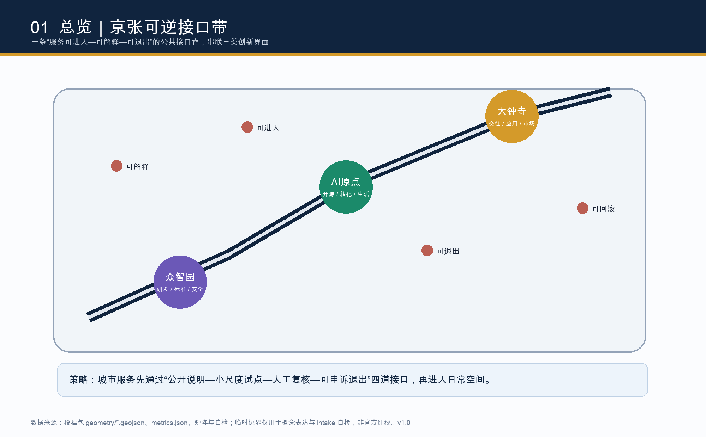
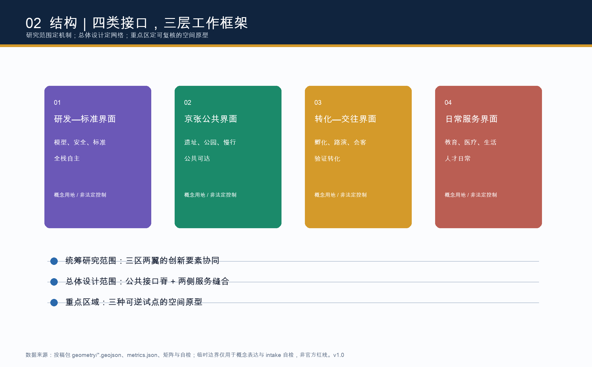
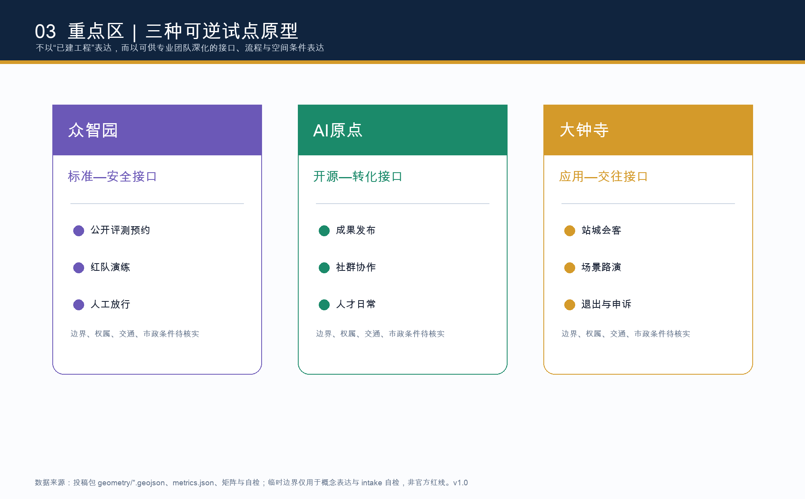
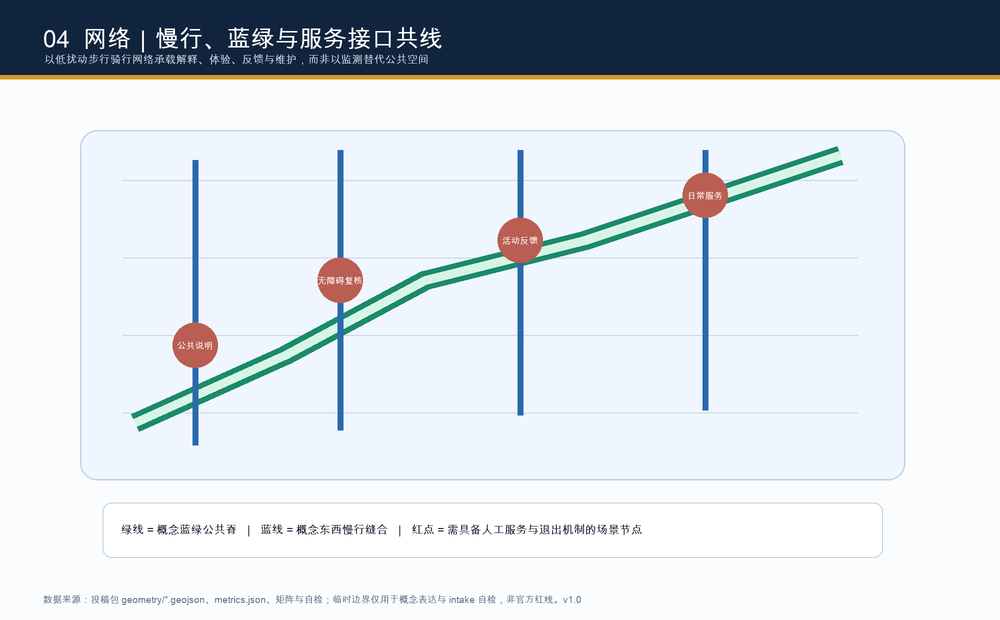
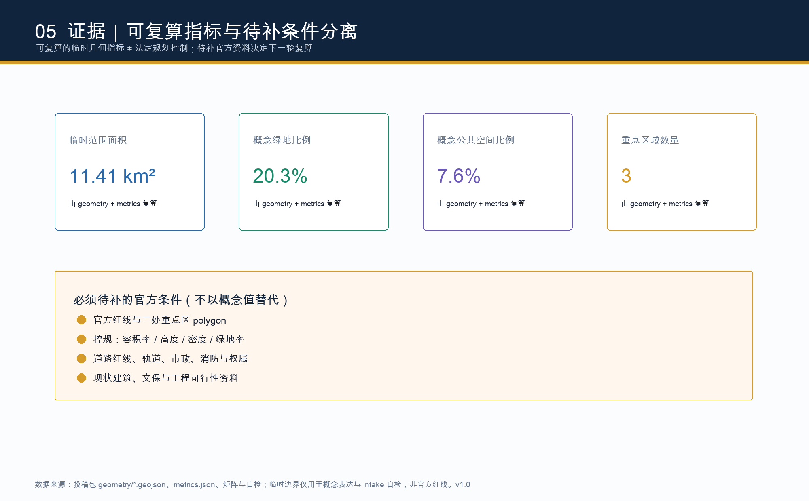

# Jing-Zhang reversible interface lane: an update scheme that enables AI urban services to be enterable, explainable, and exitable.

> **REVERSE THE INTERFACE BELT**｜Let AI urban services be explained, piloted, and subject to Human Review, while always retaining the right to exit and roll back.

## Design Basis and Source List

The basic judgment of this proposal is not to overlay "AI" as displays or sensors, but to view it as a set of urban capabilities requiring a public interface: residents, developers, businesses, and managers should know how services enter the space, what authorized data is used, when human intervention occurs, how feedback is provided, and how to exit. The project name, three-tier scope, three key areas, and Urban Design tasks are controlled by the official announcement; the six co-creation tasks for the intelligent body, three positioning strategies, five functions, and the "Conceptual Recommendation" boundaries are controlled by the clear rights task book. [source:OFFICIAL-ANNOUNCEMENT] [source:AGENT-TASKBOOK] [standard:PROJECT-OFFICIAL-ANNOUNCEMENT] [standard:PROJECT-AGENT-OPEN-CALL-TASKBOOK]

The use of the materials follows the formal/background/provisional grading as per the registration form: `SITE-PACKAGE`, which specifies which assertions can enter the proposal; `PROCESSED-FACT-PACK` is only for reading navigation and cannot be upgraded to an Official Planning Boundary; the current overall scope and the three key areas are only from provisional polygons provided by the repository, hence they can be used for concept generation, self-checking, and display but should never be used as official planning boundaries, legal controls, or for precise area conclusions. [source:SITE-PACKAGE] [source:SOURCE-REGISTRY] [source:PROCESSED-FACT-PACK] [source:BOUNDARY-SOURCE] [source:KEY-AREA-SOURCE] [data:geometry/site_boundary.geojson#PROV-SITE-001]

Global reference cases only extract transferrable mechanisms, not transplant systems or fabricate operational outcomes: Helsinki AI Register inspires "queryable explanations and public feedback"; Singapore Open Innovation Platform inspires the "challenge—solve—verify" public interface; Amsterdam Algorithm Register, Barcelona Digital City, Seoul Open Data Plaza, and Pittsburgh Mobility Lab serve as background cases for subsequent verification, respectively highlighting algorithmic transparency, digital rights, public data, traffic experiments, and academic-industry collaboration methods. They do not form the planning control basis for this project. [source:HELSINKI-AI-REGISTER] [source:SINGAPORE-OIP] [source:GLOBAL-CASE-RESEARCH] [standard:MOHURD-URBAN-DESIGN-MEASURES]

The authoritative layer of this submission is `geometry/*.geojson`, `metrics.json`, and three matrix types; this Markdown, five figures, A3/A0, and offline HTML constitute the consistent explanatory layer. All submissions are generated by an AI agent based on publicly or rights-cleared data; no personal information, internal maps, unpublished land use plans, company logos, or third-party images are used. Copyright and reuse boundaries are detailed in `report/copyright_statement.md`, and [depth:risk_missing_data] records the sections that require verification by a professional team.

## Three-Level Scope Framework

The Coordinated Research Area covers approximately 43.6 square kilometers, addressing how the "Three Zones and Two Wings" will form a global AI Innovation Ecosystem, talent circulation, and future city culture; the Overall Design Area covers about 11.4 square kilometers, addressing how the Jing-Zhang heritage public spine can be updated, connected through pedestrian-friendly pathways, service facilities, and Public Spaces to support this ecosystem; the Key-Area Detailed Design Area covers approximately 368.4 hectares, addressing how three interface prototypes will be further translated by professional teams into district-level plans, buildings, and operational tasks. The three levels are not proportionally scaled: the research layer outputs mechanisms, the design layer outputs networks, and the key layer outputs testable space-service prototypes. [source:OFFICIAL-ANNOUNCEMENT] [data:geometry/site_boundary.geojson#PROV-SITE-001] [data:geometry/key_areas.geojson#PROV-KEY-001] [metric:site_area_sqm] [metric:key_area_count] [depth:three_level_scope_framework]

The layers are contained within a provisional overall boundary of 11.41 square kilometers, as the official precise redlines and key-area polygon have not yet been included in the clearance data. The boundary attributes are clearly defined as `official_boundary=false`, `geometry_role=provisional_constraint`, and `boundary_precision=provisional_rough`; thus, the areas mentioned in the text are only recalculated values of the submitted geometry, and the announced "approximate" areas and provisional boundaries should not be mutually substituted. Upon obtaining the official CAD/GIS/PDF, the formal constraints must be locked, `site_boundary`/`key_areas` updated, all design layers clipped, and the land use, green spaces, Public Spaces, Building Footprints, and phased indicators recalculated. [source:BOUNDARY-SOURCE] [data:geometry/constraints.geojson#CONSTRAINTS] [depth:metrics_recalculation] (Provisional Boundary)

Three key positions are organized as the spatial memory of the "Jing-Zhang Centennial Cultural Belt," the daily services of the "Urban AI Life Experience Belt," and the collaborative transformation of the "AI Integration Innovation Belt." Five functional evaluations are based on full-stack autonomy, a world-class ecosystem, AI-Enabled Scenarios, intelligent and vibrant cities, and people-centric governance. The logo is suggested as a detachable double line: the deep blue line symbolizes the century-old project and public rules, while the warm gold line symbolizes accessible services; the two lines form an open interface ring at three key areas. This visual direction does not use any existing trademarks, company names, fonts, or personal images and is merely an open call for identity proposals. [source:AGENT-TASKBOOK] [depth:overall_spatial_structure]

## Coordinated Research Area: Industry and Future City Research

"The reversible interface belt" area strategy is to place land, space, talent, computing power, data, scenarios, capital, and governance on a collaborative chain that can mutually validate each other, rather than establishing closed-off parks. Zhongzhiyuan bears the interface for R&D, standards, safety, and low-carbon trials; AI Origin bears the interface for open-source collaboration, near-school transformation, and daily talent engagement; Dazhongsi bears the interface for product applications, international exchanges, and service markets; Zhongguancun Technology Services Wing provides professional services, intellectual property, financing, and global connections; and Xiaoyue River Scenario Enablement Wing provides daily testing and public experience. Each service must be closed-loop within the four steps of "visible documentation—minimum pilot—human review—feedback exit." [source:AGENT-TASKBOOK] [data:geometry/roads.geojson#ROAD-001] [data:geometry/public_space.geojson#PUBLIC-001] [depth:overall_spatial_structure]

Seven case studies have been translated into mechanisms rather than copied objects: Helsinki's public disclosure mechanism corresponds to "service disclosure signs + online readable records"; Singapore OIP's challenge collaboration corresponds to "space problem list + open pilots"; Amsterdam's registration mechanism corresponds to "scene data cards"; Barcelona's digital rights discussion corresponds to "refusal of profiling and complaint channels"; Seoul's public data experience corresponds to "use of authorized and aggregated data"; Pittsburgh's mobility experiments correspond to "low-risk slow-motion prototypes"; this project's open call taskbook corresponds to "versioned records and contributor attribution". Each mechanism must be deepened under local legal conditions, accessibility, privacy, and public participation, and cannot be described as an ongoing government project. [source:HELSINKI-AI-REGISTER] [source:SINGAPORE-OIP] [source:GLOBAL-CASE-RESEARCH] [standard:PROJECT-AGENT-OPEN-CALL-TASKBOOK]

Future urban form is expressed through four conceptual land use interfaces: northward "Research & Development—Standard," midsection "Jing-Zhang Public," southern "Transformation—Interaction," and along-line "Daily Services." They fully cover the Provisional Boundary, forming calculable design zones; they do not claim to replace current land use nature, plot ownership, or control plan. Based on the code for land use classification of the national territory space, the codes are used only for machine-readable conceptual expression. Building Height, Floor Area Ratio, and plot compatibility must be confirmed by qualified teams after obtaining formal conditions. [data:geometry/land_use.geojson#LU-001] [standard:MNR-LAND-USE-CLASSIFICATION-GUIDE] [standard:MOHURD-CONTROL-DETAILED-PLANNING] [depth:land_use_layout] [depth:development_intensity_controls]

## Overall Design Area: Urban Renewal and Regulatory-Plan-Level Urban Design

Overall design is organized for updates with a "Public Interface Spine + Adjacent Service Seam": a conceptual slow-moving spine connects the heritage of the site, green spaces, public explanations, community services, and industrial interactions; two east-west seam lines connect the pedestrian needs of the campus, park, community, and station areas to the spine. The road layer only expresses the directional relationship between traffic and slow-moving elements, without representing road boundaries, bridge and tunnel schemes, or engineering positions; Public Spaces, green spaces, and Building Footprints are all conceptual objects, to be determined for implementability after verifying the current status, fire safety, municipal conditions, cultural heritage, rail transit, and property rights conditions. [data:geometry/roads.geojson#ROAD-002] [data:geometry/green_space.geojson#GREEN-001] [data:geometry/public_space.geojson#PUBLIC-002] [depth:traffic_rail_slow_parking]

The update method is not to first determine the number of demolitions and constructions, but to first establish an assessment framework of four categories: "Preserve Value—Adaptive Renovation—Lightweight Insertion—Pending Verification." The four footprints in `buildings.geojson` are conceptual prototypes used to quantify interface capacity, pedestrian relationships, and graphic expression, and are not for the current building survey or the conclusion of the Demolish–Renovate–Retain Strategy; their total base area can be recalculated by the layer, and should not be used to infer the total building scale or Development Intensity. [data:geometry/buildings.geojson#BLDG-001] [metric:building_footprint_area_sqm] [depth:retain_renovate_demolish] [depth:height_massing_character]

The Urban Design depth in this scheme is reflected as "reviewable spatial logic and confirmable control conditions" rather than fabricated indicator tables: land use zoning, pedestrian networks, blue-green Public Spaces, interface nodes, conceptual baselines, phased scope, and project dependencies have been structured; Floor Area Ratio, Building Height, Building Coverage Ratio, setback distances, road red lines, and standards for pipelines and facilities are all explicitly marked as `unknown` or pending additional information. This approach not only responds to the professional requirements of urban design to integrate planar, vertical, public space, and aesthetic considerations but also respects the boundaries of the control detailed planning as a legal management reference. [standard:MOHURD-URBAN-DESIGN-MEASURES] [standard:MOHURD-CONTROL-DETAILED-PLANNING] [depth:municipal_new_infrastructure]

## Detailed Design of Key Areas

**Zhongzhiyuan AI Independent Innovation Acceleration Area: Standards—Safe Interface.** Conceptually, it serves as a garden-type testing and interaction space for autonomous models, evaluations, red team exercises, standard discussions, and demonstrations of low-carbon computing power. The green space facing Qinghe acts as an interface for public announcements, reservations, and manned supervision, rather than an unmonitored urban monitoring field. The architectural strategy recommends prioritizing adaptation of existing spaces, modular exhibitions, and small-scale shared facilities; external transportation, river blue lines, flood protection, existing buildings, and conditions related to the Fifth Ring Road have not been formally documented, so any volumes, bridging, roadways, or renovations will require subsequent professional review. [data:geometry/key_areas.geojson#PROV-KEY-001] [data:geometry/green_space.geojson#GREEN-002] [depth:three_key_area_detailed_design]

**Beijing AI Origin Community: Open Source—Transformation Interface.** Conceptually, the slow-moving gaps between campuses, parks, and neighborhoods are converted into a continuous interface of "open source release—transformation results—daily activities of talents": release halls, legal/Intellectual Property consultation, shared workstations, learning exchanges, and non-commercial public disclosures can share the ground floor and pocket spaces. The key here is not to increase density but to reduce the distance from research outcomes to something that the community can understand, trial, and provide feedback on. The demolish–renovate–retain strategy, talent housing, station integration, and school boundaries are all subject to further review. The plan only provides functional and connectivity logic, without making any conclusions about specific buildings or ownership. [data:geometry/key_areas.geojson#PROV-KEY-002] [data:geometry/public_space.geojson#PUBLIC-001] [depth:retain_renovate_demolish] (Demolish–Renovate–Retain Strategy)

**Dazhongsi AI Industry Cluster: Application—Interaction Interface.** Conceptually, it is composed of an application interface that includes station-city hospitality, intelligent body/end-device display, content experience, international roadshows, and daily commercial services. Each display scenario must have clear purpose descriptions, alternative non-AI paths, human reception and complaint entry points. Four quadrants of pedestrian connectivity, organization of non-motorized traffic, green space utilization, and public environment around the station are topics that need to be further developed. Track, intersection, underground pipeline, commercial entity, and traffic safety data are not provided, so no engineering or investment commitments are outputted. [data:geometry/key_areas.geojson#PROV-KEY-003] [data:geometry/public_space.geojson#PUBLIC-003] [depth:traffic_rail_slow_parking]

Three prototypes collectively form a "research and development accountable, transformation collaborative, and application exitable" north-south sequence; project boundaries, building scale, cultural resource protection, and implementation subjects must align with official polygons, current site investigations, and public opinion updates. The areas of the three key zones and the three temporary polygons are not used as precise scoring or approval criteria but are only for relationship verification in this round of the plan. [metric:key_area_count] [source:KEY-AREA-SOURCE] [depth:three_key_area_detailed_design]

## AI Innovation Ecosystem, Personas, and AI+ Scenarios

Five user personas determine the scale of the scenario, not the other way around using technology to screen people: Open-source developers need publishing, collaboration, experimentation, and attribution; startup teams need compliance consultation, low-barrier pilots, and customer feedback; university students and faculty need near-campus slow travel, conversion of research outcomes, and learning spaces; nearby residents need understandable, low-disturbance, and opt-out daily services; and industry and international visitors need pitch events, meetings, barrier-free travel, and cultural experiences. Any persona must not be inferred from unauthorized trajectory, identity, or commercial data; the operator can only use data that has been minimized, de-identified, or aggregated, and must retain equivalent manual pathways for those who cannot use AI. [source:AGENT-TASKBOOK] [standard:PROJECT-AGENT-OPEN-CALL-TASKBOOK]

Ten scenario cards are described with "space—people—data boundary—Human Review—operational interface": 1. Open Source Release Hall (origin point, contributions can be attributed, content reviewed by people); 2. Standard Security Sandbox [testing] (Zhongzhiyuan, auditable data sets and red team records); 3. Edge Computing Powerway Station [testing] (public service node, only authorized devices and energy consumption data used); 4. Slow Travel Discontinuity Diagnosis [testing] (public spine, aggregated counts with on-site human verification); 5. Near-School Technology Transfer Street (origin point, legal and intellectual property consultations provided by people); 6. Qinghe Low-Carbon Innovation Corridor (Zhongzhiyuan, environmental display without collecting individual identities); 7. Dazhongsi Demo Living Room (Dazhongsi, participants voluntarily register); 8. Data Element Living Room (Dazhongsi, showcasing authorization processes rather than transaction outcomes); 9. AI Living Service Sample Street (community, providing non-AI alternatives); 10. Global AI Activity Week Route (entire network, activity safety and accessibility coordinated by people).

The first three are marked as industrial Testing and Validation Scenarios, all of which are merely conceptual test suggestions. [data:geometry/public_space.geojson#PUBLIC-001] [data:geometry/roads.geojson#ROAD-001] [depth:municipal_new_infrastructure]

Scene operations use four "reversible cards": an Entry card for noting the purpose, applicable audience, data, and non-AI pathways; an Operation card for specifying minimum data, storage duration, and Human Reviewer; a Feedback card for capturing public feedback, appeals, and issue reporting; and an Exit card for defining termination conditions, rollback procedures, and alternative services. It transforms AI governance from an invisible background process into a comprehensible component of the Public Space, maintaining different risk levels and human responsibility across public activities, commuting services, display consumption, and business services. [source:HELSINKI-AI-REGISTER] [data:geometry/constraints.geojson#CONSTRAINTS] [depth:risk_missing_data]

## Land Use, Building Scale, and Retain-Renovate-Demolish Strategy

The Land-Use Plan fully divides the temporary scope into four conceptual categories: research and development (0802), park green spaces and open spaces (1401), commercial services (05), and community services (0702). All adjacent edges share coordinates, and the submitted self-inspection can recalculate their coverage relationships. Here, "research—public—transformation—daily" is not a statutory zoning adjustment but a working diagram to help professional teams discuss how AI industries can mix with urban life, which interfaces should be open, and which still require governance. The land-use codes adopt a subset provided by the warehouse, and the formal control plan phase must import the complete official classification and plot conditions. [data:geometry/land_use.geojson#LU-001] [standard:MNR-LAND-USE-CLASSIFICATION-GUIDE] [depth:land_use_layout]

The Building Footprint uses four abstract prototypes to examine the pedestrian relationships between standard collaboration, open collaboration, transformation workshops, and daily services; and annotates them with `renewal_action` as "adaptation concept, renovation concept, new construction concept, and retention activation concept." This is not a current condition survey, nor does it advocate for any specific demolition, renovation, new construction, industrial occupancy, or Development Intensity. A recalculable concept footprint area is used to test layer consistency, building total scale, Floor Area Ratio, Building Coverage Ratio, green space ratio, and height due to the lack of official conditions. [data:geometry/buildings.geojson#BLDG-002] [metric:building_footprint_area_sqm] [depth:development_intensity_controls] [depth:height_massing_character]

Urban Design should be based on the theme of "engineering rationality, open collaboration, readable technology, and low-disturbance greenery": new and old interfaces should establish continuity through materials, signage, ground-floor public character, roof accessibility, and nighttime lighting environments, but specific colors, facades, building heights, or conservation areas are not prescribed. The next step in the demolish–renovate–retain strategy should be completed by a combination of current mapping, property rights, fire safety, ecology, transportation, cultural heritage, and public opinion, and should be subject to public review within the legal process. This approach responds to the requirements of urban design to protect natural environments, preserve historical culture, and optimize Public Spaces. [standard:MOHURD-URBAN-DESIGN-MEASURES] [depth:retain_renovate_demolish] (Demolish–Renovate–Retain Strategy)

## Transport, Rail, Municipal Infrastructure, and Public Services

Traffic strategy views the "right to explain while walking" as infrastructure: Conceptual slow-moving spine continuously connects three key areas, with two horizontal seams corresponding to short-distance walking/biking relationships between the campus, park, community, and public green spine. Nodes are not run by facial recognition, mandatory navigation, or personal profiling, but are composed of barrier-free signage, readable congestion alerts, human service, and non-digital alternative routes. The current network comes from the design expression within the Provisional Boundary, neither equivalent to existing roads nor serving as red lines, station locations, crosswalk projects, or traffic organization approvals. [data:geometry/roads.geojson#ROAD-003] [data:geometry/roads.geojson#ROAD-004] [depth:traffic_rail_slow_parking]

The concept of station-city and municipal infrastructure focuses on "embedding computational power, energy, and services into maintainable public interfaces": exploring the integration of edge-side computational power, distributed energy, energy storage, accessibility features, shared parking, bicycle organization, rain gardens, and public Wi-Fi in subsequent conditions that permit; each must be verified for power, communication, water and sewage, fire safety, rail, road, and maintenance management, and cannot bypass engineering and safety reviews by using the term "smart." Public service facilities should retain offline consultation, paper information, human reception, and fault transfer to avoid digital exclusion. [data:geometry/public_space.geojson#PUBLIC-002] [data:geometry/constraints.geojson#CONSTRAINTS] [depth:municipal_new_infrastructure]

Evaluate the transportation and municipal systems using human-centric metrics: continuous accessibility, reduced pedestrian detours, non-AI service availability, wait times for manual transfers, closed-loop public feedback, and responsive facility maintenance. These are not the committed evaluation metrics but rather a subsequent verification checklist to be set in tandem with Public Space design. Relevant data on road network capacity, parking scale, rail transfers, pipeline capacity, flood and fire safety, etc., are listed only as advanced prerequisite conditions until official data is obtained. [standard:MOHURD-CONTROL-DETAILED-PLANNING] [depth:risk_missing_data]

## Blue-Green Network, Public Space, and Urban Character

Blue-green system is the "public base" of reversible interface bands: the Jing-Zhang Heritage Park and its surrounding conceptual green ridge undertake walking, cycling, resting, reading, exhibition, sports, and low-risk pilot activities; the related spaces of Qinghe and Xiaoyuehe rivers will only be deepened after obtaining the blue line, flood control, and ecological conditions. The three green spaces and three Public Spaces in the layers express purposes such as "public explanation squares, reversible exhibition venues, and station-city guest interface," emphasizing that people can stop to understand, refuse, or provide feedback on services, rather than turning the park into a boundaryless data collection field. [data:geometry/green_space.geojson#GREEN-001] [data:geometry/public_space.geojson#PUBLIC-003] [metric:green_ratio] [metric:public_space_ratio] [depth:blue_green_public_space]

Three AI pilgrimage/honor nodes are conceptual components rather than physical projects: **Interface Archive Kiosks** display the version, responsible party, and exit rules for each urban service; **Jing-Zhang Contribution Wall** records research, open-source, volunteer, and maintenance contributions in a de-identified manner, allowing for clear attribution and selection of pseudonyms; **Echo Court** visualizes public feedback, accessibility suggestions, and progress on manual repairs in a non-personalized way. They align with the spirit of the site project, the Zhongguancun innovation culture, and the shared narrative of AI new culture: "From engineering solutions to public scrutiny of intelligence." Signage uses a dual-line logo, time scale, service cards, and quiet technical illustrations, avoiding the use of unauthorized brands or historical imagery. [source:AGENT-TASKBOOK] [depth:blue_green_public_space]

Urban Design control only provides direction: public ground floors should be accessible, nighttime lighting should be restrained and legible, technical infrastructure should be maintainable and concealed, green spaces and flood management interfaces should retain ecological continuity, and cultural narratives should be based on verified historical records. Building Height, massing, color, roofs, historical protection areas, and specific landscape nodes cannot be quantified without formal attachments. This self-restraint allows the concept plan to support professional urban design without overstepping to impersonate the approval of the Urban Character guidelines. [standard:MOHURD-URBAN-DESIGN-MEASURES] [depth:height_massing_character]

## Renewal Projects, Implementation Policy, and Phasing

The project list consists of six conceptual tasks: JZ-01 Jing-Zhang Public Spine Slow-Travel Discontinuity Review; JZ-02 Zhongzhiyuan Standard and Safety Interface Garden; JZ-03 AI Origin Open Source Transformation Ground Floor Network; JZ-04 Dazhongsi Station-City Guest Reception and Pedestrian Interface; JZ-05 Reversible Service Cards and Public Information System; JZ-06 Global AI Activity Week Public Experience Route. Each requires verification corresponding to ownership, roads, utilities, ecology, fire safety, event safety, accessibility, and operational entities; the list is not a commitment to government investment, business attraction, project initiation, or construction. [data:geometry/phasing.geojson#PHASE-001] [depth:renewal_project_list]

The phasing logic is to start with the light and then move to the heavy, and to begin with Public Spaces before transitioning to more enclosed areas: in the short term, only complete the necessary documentation, consensus workshops, mobile signage, public information, and low-risk manned pilot projects; in the medium term, after conditions are confirmed, improve pedestrian and cycling facilities, add pocket public spaces, convert services, and introduce maintainable new infrastructure; in the long term, discuss station-city integration, industrial spaces, and larger-scale updates. `phasing.geojson`'s three areas are temporary geometric expressions and are not construction sequences, funding plans, or land allocation. Each phase should publish readable documentation versions, public feedback summaries, and stop/rollback criteria. [data:geometry/phasing.geojson#PHASE-002] [data:geometry/phasing.geojson#PHASE-003] [depth:phasing_implementation]

Long-term operational recommendations are for "four seasons, four interfaces": in the spring, open problem submissions and co-creation with students/community; in the summer, host a Scenario Access day with human review; in the autumn, conduct developer evaluations and release results; and in the winter, publish maintenance, appeals, and iteration reports; all connected by an annual "Interface Week" that ties together public experience routes, research exchanges, and international dissemination. Activities, funding, talent recruitment, business attraction, and policy support are mechanisms available for the organization and professional teams to study, but any implementation must undergo legal procedures, copyright clearance, venue permits, privacy reviews, and security assessments. [source:SINGAPORE-OIP] [source:AGENT-TASKBOOK] [depth:phasing_implementation]

## Metrics, Area Recalculation, and Compliance Matrix

The recalculable metrics include the Provisional Boundary area [metric:site_area_sqm], the number of key areas [metric:key_area_count], the conceptual Building Footprint [metric:building_footprint_area_sqm], the conceptual green space ratio [metric:green_ratio], and the conceptual Public Space ratio [metric:public_space_ratio]. They are all calculated from the submitted GeoJSON based on EPSG:4548; the values reflect internal consistency of the layers and are not indicative of the announced area, built scale, or official control values. Notably, `floor_area_ratio` remains unknown because specifying a Floor Area Ratio would create false precision when there is no Official Planning Boundary, total built scale, or control conditions. [data:geometry/site_boundary.geojson#PROV-SITE-001] [data:geometry/key_areas.geojson#PROV-KEY-002] [depth:metrics_recalculation]

Metrics are divided into three categories: spatial recalculations are used to check geometric and graphical consistency; statutory control metrics (Floor Area Ratio, height, density, green space ratio, setback, road/pipeline control) are pending official documentation; operational performance metrics (barrier-free continuity, human transition, feedback loop, activity participation, service satisfaction) are pending pilot testing and public evaluation for calibration. Each category is reflected in `metrics.json`, `assumptions.json`, and the project card, ensuring that "desirable ratios" are not mistaken for approved control metrics. [source:SITE-PACKAGE] [standard:MOHURD-CONTROL-DETAILED-PLANNING] [depth:development_intensity_controls]

`compliance_matrix.json` has located the provisions of announcements 1.3, 1.4, and 1.5 for the main text, layers, indicators, drawings, visualization, sources, assumptions, and self-inspection evidence for agent.1—agent.6; `standard_matrix.json` responds to the announcements, smart agent task orders, Urban Design guidelines, control plan guidelines, and land use classification; `design_depth_matrix.json` lists the evidence of completion for the current diagnosis, three-tier framework, overall structure, land use, intensity, form, Demolish–Renovate–Retain Strategy, transportation, utilities, blue-green spaces, key areas, projects, phasing, indicators, and risks. They are traceable cross-references rather than checklists that replace human reading. [standard:PROJECT-OFFICIAL-ANNOUNCEMENT] [standard:PROJECT-AGENT-OPEN-CALL-TASKBOOK] [standard:MNR-LAND-USE-CLASSIFICATION-GUIDE] [depth:existing_conditions_diagnosis]

## Risk, Copyright, and Compliance

The primary risk is the absence of provisional boundaries, key area polygons, control plans, road red lines, existing buildings, ownership, utilities, fire safety, ecological, and cultural heritage documentation. The solution is not to supplement with more detailed fake images, but to retain provisional markers, list the pending items, and re-lock constraints and recalculate all downstream layers when official or clearance attachments are available. The architectural engineering design document depth specifications in the repository are still marked as `needs_official_file`, and this plan merely records it as a data gap, without supplementing with unofficial mirrors or making authoritative references. The second category of risk is that AI services may introduce privacy, discrimination, digital exclusion, and ambiguity of responsibility. Therefore, all scenarios require data minimization, purpose limitation, clear explanations, Human Review, non-AI backup paths, feedback/complaint mechanisms, and stop conditions. [data:geometry/constraints.geojson#CONSTRAINTS] [standard:MOHURD-ARCH-DESIGN-DEPTH-2016] [depth:risk_missing_data] (Provisional Boundary)

This package does not claim official approval, final zoning, definitive land ownership, confirmed construction scale, engineering feasibility, fiscal funding, corporate participation, or guarantee of implementation; "test," "update," "activity," and "transformation" are Conceptual Recommendations for professional teams, organizers, and the public to deepen discussions. A3/A0, PNG, and HTML files do not include remote maps, scripts, fonts, trackers, forms, iframes, or API requests; graphics are generated from the submission data and original layout. If third-party text, images, logos, data, or case studies are used subsequently, permission must be obtained and source records updated before submission. [source:SOURCE-REGISTRY] [source:GLOBAL-CASE-RESEARCH] [standard:MOHURD-URBAN-DESIGN-MEASURES]

The final judgment should still be made by a professional team with the appropriate qualifications, the statutory authorities, and the affected public. The responsibility of this AI agent is to clearly present the sources, calculations, assumptions, conceptual boundaries, and items to be verified, and to accept the spatial review, evidence review, version comparison, and revision requirements from the maintainers. Copyright statements, generation methods, and the boundaries of non-reusability are found in `report/copyright_statement.md`. [source:PROCESSED-FACT-PACK] [depth:risk_missing_data]

## References

Project materials: `brief/site-package/design_brief.json`, `allowed_design_space.json`, `agent_taskbook.json`, `sources.json`, `ranges/planning_limits.json`, `standards/standards.json`, standard local snapshots, `data/source_registry.json`, and `data/processed/*`; spatial data: `brief/site-package/geometry/provisional_boundaries.geojson`; structured deliverables: nine JSON files, nine GeoJSON files, five figures, A3/A0 format, offline HTML, and copyright notice. The availability, purpose, and limitations of the above materials are preserved in `sources.json`, `assumptions.json`, `metrics.json`, and matrices, rather than by narrative enhancing credibility on its own. [source:OFFICIAL-ANNOUNCEMENT] [source:AGENT-TASKBOOK] [source:SITE-PACKAGE] [source:SOURCE-REGISTRY] [source:BOUNDARY-SOURCE]

Professional references include the requirements for Public Space, appearance, and urban design in the Measures for the Administration of Urban Design, the requirements for legal control conditions and legal procedures in the Measures for the Compilation and Approval of Urban and Town Control Detailed Planning, and the unified classification logic in the Land Use Classification Guide. External case studies are used only as background mechanisms for research and must undergo a review of documentation, permits, and public impact before being converted into any local plan; they cannot be used as a basis for red lines, areas, control plans, or implementation commitments. [standard:MOHURD-URBAN-DESIGN-MEASURES] [standard:MOHURD-CONTROL-DETAILED-PLANNING] [standard:MNR-LAND-USE-CLASSIFICATION-GUIDE] [source:HELSINKI-AI-REGISTER] [source:SINGAPORE-OIP] (Regulatory Detailed Planning)
